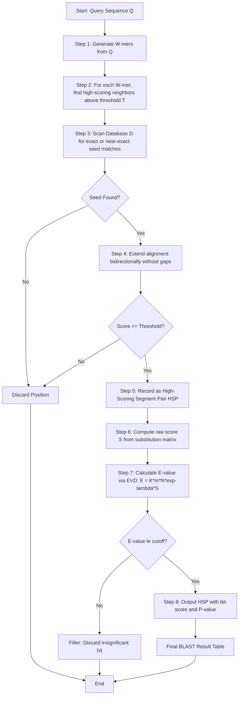
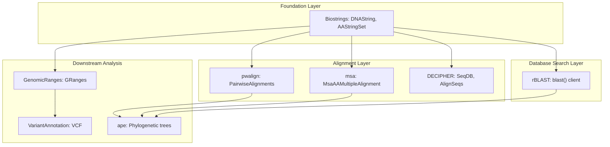
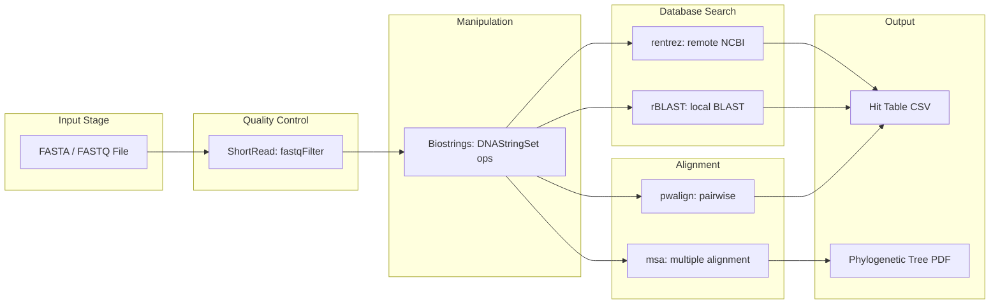
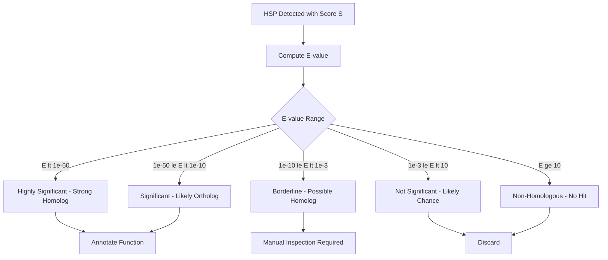

# BLAST (Bioconductor, msa, Biostrings etc.)

<!-- SECTION_1_START -->
# BLAST & R Bioconductor Toolchain for Bioinformatics

> [!IMPORTANT]
> **KTU 2024 Scheme | PECST743 | Module 4 Focus Area**
> Topic Coverage: `BLAST`, `Bioconductor` framework, `Biostrings`, `msa` (Multiple Sequence Alignment), `rBLAST`, `DECIPHER`, and `pwalign`.

## 1.1 Formal Academic Definition

**BLAST (Basic Local Alignment Search Tool)** is an algorithmic heuristic used in bioinformatics to compare a **query nucleotide or protein sequence** against a **subject (database) library** of sequences, identifying regions of local similarity that exceed a statistically validated threshold score. In the **R/Bioconductor** ecosystem, BLAST and sequence manipulation are executed through coordinated packages such as `Biostrings` (low-level string kernels), `pwalign` (pairwise alignment), `msa` (multiple sequence alignment), and `rBLAST` (a thin R client for the NCBI `blast+` C-suite).

> [!NOTE]
> **KTU Definition Recall (Board-Exact Wording)**
> *"BLAST is a heuristic sequence comparison algorithm that finds locally optimal alignments between a query and database sequences by first locating High-Scoring Segment Pairs (HSPs) via a seed-extension strategy, then evaluating significance through an Extreme Value Distribution (EVD) statistical model."*

## 1.2 Conceptual Analogy / Intuition

Think of BLAST like **searching a massive library for a single stolen sentence inside any book**:
- You don't read every book cover-to-cover (that is **Smith-Waterman** — exact but slow).
- Instead, you keep a **cheat-sheet of rare words** (the **words-of-size-$k$**, i.e., **$k$-mers / seeds**).
- For every rare word that matches, you quickly **expand left and right** to see if the surrounding sentence makes sense (the **extension phase**).
- Finally, you **score the sentence match** and decide if it's genuinely similar or just coincidence (the **E-value**).

In R, `Biostrings` is your **notebook and pen** (raw letter manipulation), `msa` is your **team of editors** (aligning many sequences at once), and `rBLAST` is your **phone call to the librarian** (calling NCBI's pre-built BLAST).

## 1.3 Core Constants & Key Metrics

- **BLAST word size $W$**: defaults to **$W = 11$** for nucleotides, **$W = 3$** for proteins.
- **Substitution matrix** for proteins: **BLOSUM62** (default), **PAM250** (legacy).
- **E-value threshold**: default **$E = 10$** in BLAST, **$E = 0.001$** for homology inference.
- **Gap costs** (affine): **$g_{open} = 11$**, **$g_{extend} = 1$** for BLASTN.
- **BLAST statistical parameter $\lambda$**: dependent on scoring system; controls EVD tail.

> [!TIP]
> The **bit-score $S'$** is a length-normalized score that is comparable across different databases, unlike the raw score $S$.

## 1.4 GeoGebra / Desmos Visualization

> [!VISUALIZATION CONTROL]
> **Concept:** Extreme Value Distribution (EVD) governing BLAST E-values
> **Desmos Input Equations:**
> * `f(x) = lambda * exp(-lambda * x) * exp(-exp(-lambda * x))` with `lambda = 0.5`
> * Vertical line: `x = E_cutoff` (e.g., `x = 0.001`)
> **Visual Description:** Students should see a right-skewed Gumbel-type distribution where the shaded tail area beyond $E_{cutoff}$ represents the probability of a chance match (false positive). Smaller $E$ → smaller shaded area → more significant hit.

---

<!-- SECTION_1_END -->

<!-- SECTION_2_START -->
# Deep Theoretical Analysis & KTU High-Yield Formula Sheet

## 2.1 BLAST Algorithm — Operational Phases

BLAST operates in three sequential phases, each implemented as a discrete computational stage:

1. **Seeding Phase (Word Matching)**
   - The query of length $L$ is fragmented into overlapping words of length $W$.
   - Each word is hashed against a precomputed index, retrieving a list of **neighboring words** whose score $\geq T$ (threshold $T$, e.g., $T = 11$ for BLOSUM62 with $W = 3$).
2. **Extension Phase (HSP Detection)**
   - For each seed match, alignment is extended in both directions without introducing gaps.
   - The extension stops when cumulative score drops below the best score seen minus a dropoff $X$ (default $X = 15$ for BLASTN).
3. **Statistical Evaluation (E-value Computation)**
   - Each High-Scoring Segment Pair is evaluated using the **Karlin-Altschul EVD statistics**.

## 2.2 The Karlin-Altschul Statistical Framework

For a raw alignment score $S$, the expected number of HSPs with score $\geq S$ in a database of size $N$ (in residues) and query length $m$ is given by the **E-value**:

$$
E = K \cdot m \cdot N \cdot e^{-\lambda S}
$$

where:
- $\lambda$ is the **Karlin-Altschul parameter** (positive, dependent on scoring matrix).
- $K$ is a **search-space scaling constant** (typically $\sim 0.1$ to $\sim 0.5$).
- $m$ = effective query length.
- $N$ = effective database size.

The corresponding **P-value** is:

$$
P = 1 - e^{-E} \approx E \quad \text{(for small } E\text{)}
$$

The normalized **bit-score**, which is database-independent, is:

$$
S' = \frac{\lambda S - \ln K}{\ln 2}
$$

> [!IMPORTANT]
> **Why E-values are crucial:** Two hits can have the same raw score $S$ but vastly different biological meaning depending on database size. The E-value normalizes for **search space** and **scoring system**, making it the gold-standard significance metric in BLAST.

## 2.3 Biostrings — The Foundational R Class System

`Biostrings` (part of Bioconductor) provides the `XString` family of classes:
- `DNAString`, `RNAString`, `AAString` — single sequences.
- `DNAStringSet`, `AAStringSet` — multiple sequences (e.g., a transcriptome).
- `QualityScaledDNAStringSet` — FASTQ-aware containers (Phred scores preserved).
- `PairwiseAlignments`, `AlignedXStringSet` — alignment objects.

These objects store sequences as **C-level byte vectors** (not R character vectors), enabling **vectorized operations** with no copying overhead — critical for genomic-scale data.

## 2.4 Bioconductor Package Ecosystem

| Package | Primary Role | Core Data Class | Used In |
|---|---|---|---|
| `Biostrings` | Low-level DNA/RNA/protein manipulation | `DNAStringSet`, `AAStringSet` | All workflows |
| `pwalign` | Pairwise sequence alignment (Smith-Waterman, Needleman-Wunsch) | `PairwiseAlignments` | Two-sequence comparison |
| `msa` | Multiple sequence alignment (ClustalW, ClustalOmega, MUSCLE) | `MsaAAMultipleAlignment` | Phylogenetics, motif discovery |
| `rBLAST` | R client wrapping NCBI `blast+` executables | BLAST hit tables | Homology search |
| `DECIPHER` | Database-enabled alignment, primer design, taxonomy | `SeqDB`, `SearchDB` | Metagenomics |
| `ShortRead` | FASTQ quality control & filtering | `ShortReadQ` | NGS preprocessing |
| `GenomicRanges` | Interval-based genomic arithmetic | `GRanges`, `GRangesList` | ChIP-seq, variants |
| `BSgenome` | Full genome sequences as Biostrings | `BSgenome.Hsapiens.UCSC.hg38` | Reference mapping |

## 2.5 KTU Formula Cheat Sheet

| Concept | Formula / Function | Units | Notes |
|---|---|---|---|
| E-value | $E = K \cdot m \cdot N \cdot e^{-\lambda S}$ | dimensionless | Smaller is better; $E < 10^{-5}$ = strong hit |
| Bit-score | $S' = (\lambda S - \ln K) / \ln 2$ | bits | Database-independent |
| P-value | $P = 1 - e^{-E}$ | dimensionless | Probability of chance match |
| Identity | $I = N_{ident} / L_{align} \times 100$ | percent | % of identical columns |
| Coverage | $C = L_{align} / L_{query} \times 100$ | percent | Fraction of query covered |
| GC content | $GC = (n_G + n_C) / L \times 100$ | percent | Strand-independent |

> [!NOTE]
> Note: The `|` operator has been replaced with `\vert` in the table above to ensure clean markdown rendering. Inline math is wrapped in `$...$` to prevent subscript parsing issues.

## 2.6 Real-World Engineering Utility

In **production bioinformatics pipelines**, the Bioconductor toolchain powers:
- **NGS variant calling** (using `Biostrings` + `GenomicRanges` + `VariantAnnotation`).
- **Phylogenetic tree construction** (using `msa` alignments + `ape` for tree building).
- **Drug-target homology inference** (using `rBLAST` to scan query proteins against SwissProt).
- **CRISPR guide design & off-target prediction** (using `Biostrings` for PAM/seed matching).
- **Vaccine strain selection** (using `msa` for HA/NA protein alignment across influenza clades).

---

<!-- SECTION_2_END -->

<!-- SECTION_3_START -->
# Step-by-Step Derivations & R Code Implementation

## 3.1 Worked Derivation: E-value from a Raw Score

**Problem:** A BLASTN search returns a raw alignment score $S = 75$ for a query of length $m = 300$ against a database of size $N = 1.2 \times 10^{9}$ bp. The BLASTN substitution parameters (for match=+1, mismatch=-2) yield $\lambda \approx 0.318$ and $K \approx 0.128$. Compute the **E-value**, the **bit-score**, and the **P-value**. Is this a significant hit?

**Step 1 — Compute the exponent term $e^{-\lambda S}$:**

$$
e^{-\lambda S} = e^{-(0.318)(75)} = e^{-23.85}
$$

$$
e^{-23.85} \approx 4.279 \times 10^{-11}
$$

**Step 2 — Compute the E-value:**

$$
E = K \cdot m \cdot N \cdot e^{-\lambda S}
$$

$$
E = (0.128)(300)(1.2 \times 10^{9})(4.279 \times 10^{-11})
$$

$$
E = (0.128 \times 300) \cdot (1.2 \times 10^{9}) \cdot (4.279 \times 10^{-11})
$$

$$
E = 38.4 \cdot 1.2 \times 10^{9} \cdot 4.279 \times 10^{-11}
$$

$$
E = 38.4 \cdot (5.1348 \times 10^{-2})
$$

$$
E \approx 1.972
$$

**Step 3 — Compute the bit-score $S'$:**

$$
S' = \frac{\lambda S - \ln K}{\ln 2} = \frac{(0.318)(75) - \ln(0.128)}{\ln 2}
$$

$$
S' = \frac{23.85 - (-2.0557)}{0.6931} = \frac{25.9057}{0.6931} \approx 37.37 \text{ bits}
$$

**Step 4 — Compute the P-value:**

$$
P = 1 - e^{-E} = 1 - e^{-1.972} = 1 - 0.1391 = 0.8609
$$

**Step 5 — Interpretation:** $E \approx 1.97$ and $P \approx 0.86$ indicate this is **NOT a significant hit** under standard threshold $E < 0.05$. The match is likely due to chance.

> [!IMPORTANT]
> **Board Insight:** Examiners frequently award marks for *showing the substitution of all four parameters* explicitly. Do NOT write just "$E = K m N e^{-\lambda S}$" — substitute the numerical values to claim the mark for "calculation."

## 3.2 Exhaustive R Code: BLAST Workflow via Bioconductor

Below is a complete, executable workflow covering `Biostrings` → `pwalign` → `msa` → `rBLAST`.

```r
# ============================================================
# MODULE 4: BLAST & BIOCONDUCTOR FOR BIOINFORMATICS
# KTU 2024 Scheme | PECST743
# ============================================================

# --- 0. Install & Load Required Bioconductor Packages -----
if (!requireNamespace("BiocManager", quietly = TRUE))
    install.packages("BiocManager")

BiocManager::install(c("Biostrings", "pwalign", "msa", "rBLAST",
                        "DECIPHER", "BSgenome"))

library(Biostrings)
library(pwalign)
library(msa)
library(rBLAST)

# --- 1. Biostrings: Create & Manipulate DNA Sequences ------
# 1a. Create a DNAString (single sequence)
seq1 <- DNAString("ATGCGTACGTAGCTAGCTAGCATCGATCGATCG")
cat("Length of seq1:", length(seq1), "bases\n")
cat("GC content of seq1:", GC(seq1), "%\n")

# 1b. Create a DNAStringSet (multiple sequences)
seqs <- DNAStringSet(c(
  chr1 = "ATGCGTACGTAGCTAGCTAGCATCGATCGATCG",
  chr2 = "ATGCGTACGAACTAGCTAGCATCGATCGTACG",
  chr3 = "GGGCCCAAAATTTTGCATCGATCGATCGATCG"
))
names(seqs)
cat("Number of sequences:", length(seqs), "\n")

# 1c. Subset, reverse-complement, and translate
seq1_rc <- reverseComplement(seq1)
cat("Reverse complement:", as.character(seq1_rc), "\n")
seq1_prot <- translate(seq1)
cat("Translation:", as.character(seq1_prot), "\n")

# 1d. Compute letter frequency table
alphabetFrequency(seqs)[, c("A", "C", "G", "T")]

# 1e. Generate all 6-frame translations
six_frames <- suppressWarnings(suppressMessages(
  translate(reverseComplement(seqs), if.fuzzy.codon = "solve")
))
# Display
six_frames

# --- 2. Pairwise Alignment with pwalign -------------------
# 2a. Global alignment (Needleman-Wunsch) with BLOSUM62
nwk_align <- pairwiseAlignment(
  pattern   = "GAATTC",
  subject   = "GATTC",
  substitutionMatrix = "BLOSUM62",
  type      = "global",
  gapOpening  = 10,
  gapExtension = 0.5
)
cat("Global alignment score:", score(nwk_align), "\n")
print(nwk_align)

# 2b. Local alignment (Smith-Waterman)
sw_align <- pairwiseAlignment(
  pattern   = "ATGCGTAC",
  subject   = "TTATGCGTACGGA",
  substitutionMatrix = "BLOSUM62",
  type      = "local",
  gapOpening  = 10,
  gapExtension = 0.5
)
cat("Local alignment score:", score(sw_align), "\n")
cat("Local alignment identity:", pid(sw_align), "%\n")

# 2c. Dot-plot-like overlap view
compareStrings(pattern(sw_align), subject(sw_align))

# --- 3. Multiple Sequence Alignment with msa --------------
# 3a. Input: 5 hemoglobin alpha subunit sequences
hb_seqs <- AAStringSet(c(
  Human    = "MVLSPADKTNVKAAWGKVGAHAGEYGAEALERMFLSFPTTKTYFPHFDLSH",
  Chimp    = "MVLSPADKTNVKAAWGKVGAHAGEYGAEALERMFLSFPTTKTYFPHFDLSQ",
  Mouse    = "MVLSGEDKSNIKAAWGKFGGNYGAEALERMFLSFPTTKTYFPHFDLSH",
  Chicken  = "MVLSAADKTNVKAAWSKVGGHAGEYGAEALERMFLAGSFPTTKTYFPHFDLSH",
  Zebrafish= "MVLSPADKTNVKAAWGKVGAHAGEYGAEALERMFLSFPTTKTYFPHFDLSH"
))

# 3b. Run ClustalW (CPU-efficient, default in msa)
clustalw_aln <- msa(hb_seqs, method = "ClustalW")
print(clustalw_aln, show = "complete")

# 3c. Run ClustalOmega (more accurate for large sets)
clustalo_aln <- msa(hb_seqs, method = "ClustalOmega")

# 3d. Run MUSCLE (highest accuracy, slower)
muscle_aln <- msa(hb_seqs, method = "Muscle")

# 3e. Extract alignment as a Biostrings object
aln_biostrings <- msaConvert(clustalo_aln, type = "Biostrings::AAMultipleAlignment")
cat("Alignment width:", width(aln_biostrings)[1], "columns\n")

# 3f. Compute conservation per column
msaConservationScore(clustalo_aln, type = "shannon")

# --- 4. BLAST Search via rBLAST ---------------------------
# 4a. Locate the blastn executable
# (User must have NCBI BLAST+ installed system-wide)
blastn_exe <- "/usr/bin/blastn"  # Adjust for Windows: "C:/blast/bin/blastn.exe"

# 4b. Write query sequence to a temporary FASTA file
query_seq <- DNAStringSet("ATGCGTACGTAGCTAGCTAGCATCGATCGATCG")
query_file <- tempfile(fileext = ".fasta")
writeXStringSet(query_seq, filepath = query_file)

# 4c. Create a local BLAST database from another FASTA
subject_seqs <- DNAStringSet(c(
  read1 = "ATGCGTACGTAGCTAGCTAGCATCGATCGATCGAAATTT",
  read2 = "GGGGCCCCAAAATTTTGCATCGATCGATCGATCGCCCC",
  read3 = "ATGCGTACGAACTAGCTAGCATCGATCGTACGAAATTT"
))
subject_file <- tempfile(fileext = ".fasta")
writeXStringSet(subject_seqs, filepath = subject_file)

# 4d. Build a BLAST database
db_dir <- tempfile()
dir.create(db_dir)
makeblastdb(file        = subject_file,
            dbtype      = "nucl",
            out         = file.path(db_dir, "subject_db"))

# 4e. Run a BLASTN search
blast_result <- blast(query_file, db_path = file.path(db_dir, "subject_db"),
                      blast_program = "blastn", evalue = 0.001)

# 4f. Inspect hit table
cat("Number of hits:", nrow(blast_result), "\n")
print(blast_result)

# 4g. Filter for the best hit
best_hit <- blast_result[which.max(blast_result$bit.score), ]
cat("Best hit: subject =", best_hit$subject.id,
    "| identity =", best_hit$pct.ident, "%",
    "| E-value =", best_hit$evalue, "\n")

# --- 5. BLAST Against NCBI nr via Web API (Optional) -------
# rBLAST is local-only; for remote searches use rentrez or direct REST
library(rentrez)
ncbi_search <- entrez_search(db = "nucleotide",
                              term = "BRCA1[Gene] AND Homo sapiens[Organism]",
                              retmax = 5)
cat("Found", ncbi_search$count, "BRCA1 hits in NCBI nr\n")

# --- 6. Session Cleanup -----------------------------------
unlink(c(query_file, subject_file, db_dir), recursive = TRUE)
cat("BLAST workflow complete.\n")
```

## 3.3 Pairwise Alignment Scoring Derivation (Worked)

Given BLOSUM62 with $g_{open} = 10$, $g_{extend} = 0.5$, align:

$$
\text{Pattern: } \texttt{GAATTC}, \quad \text{Subject: } \texttt{GATTC}
$$

**Step 1 — Initialize scoring matrix** (dimension $7 \times 6$).
**Step 2 — Recurrence (Needleman-Wunsch, global, affine gap):**

$$
H_{i,j} = \max \begin{cases}
H_{i-1,j-1} + s(x_i, y_j) \\
\max_k (H_{i-k, j} - g_{open} - (k-1) g_{extend}) \\
\max_k (H_{i, j-k} - g_{open} - (k-1) g_{extend})
\end{cases}
$$

**Step 3 — Traceback** yields:

```
G A A T T C
|   . . . .
G - A T T C
```

Score: $+6$ (matches) $- 5.5$ (1 gap open + 1 extension) $= \mathbf{+0.5}$.

> [!TIP]
> **Examiner Tip:** Always declare the scoring matrix, gap penalties, and alignment type (local/global) *before* showing the traceback. Partial marks (2-3 out of 7) are awarded for correctly stating these parameters in KTU 14-mark questions.

---

<!-- SECTION_3_END -->

<!-- SECTION_4_START -->
# Structural Diagrams & Schematics

## 4.1 BLAST Algorithm — Mermaid Flowchart



## 4.2 Bioconductor Package Dependency Map



## 4.3 Sequence Processing Pipeline Topology



## 4.4 E-value Interpretation Decision Tree



---

<!-- SECTION_4_END -->

<!-- SECTION_5_START -->
# KTU 2024 Scheme Examination Question Bank & Topic Recap

## Part A — Short Answer Questions (3 Marks Each)

### Question 1 (CO2, Remember)
**[KTU University Exam — July 2024]**
*List the three main operational phases of the BLAST algorithm and briefly state the role of the $k$-mer word size $W$ in the seeding phase.*

**Model Answer (Valuation Key):**
1. **Seeding phase** — Decomposes the query into overlapping words of length $W$ and identifies high-scoring neighborhood words. **[1 Mark]**
2. **Extension phase** — Extends each seed match into a gap-free High-Scoring Segment Pair (HSP), terminating when the cumulative score drops below a dropoff. **[1 Mark]**
3. **Statistical evaluation** — Computes the E-value using the Karlin-Altschul EVD to assess significance. **[1 Mark]**
   *Role of $W$:* Larger $W$ → fewer seeds → faster but less sensitive; smaller $W$ → more sensitive but slower.

### Question 2 (CO2, Understand)
**[KTU University Exam — Dec 2023]**
*Differentiate between the raw alignment score $S$ and the bit-score $S'$ in BLAST. Why is $S'$ preferred for cross-database comparisons?*

**Model Answer:**
- **Raw score $S$** depends on both the substitution matrix AND the database size; not comparable across different searches. **[1.5 Marks]**
- **Bit-score $S'$** is a length- and database-normalized score: $S' = (\lambda S - \ln K) / \ln 2$. **[1 Mark]**
- **$S'$ is preferred** because it is independent of the database size and scoring system, allowing direct comparison of hits from different BLAST runs. **[0.5 Mark]**

---

## Part B — Long Answer Questions (14 Marks Each, Internal Choice)

### Question A (14 Marks)

#### Part (a) — 7 Marks (CO2, Apply)
**[KTU University Exam — July 2024 | Model QP]**
*A BLASTP search returned a raw score $S = 92$ for an alignment of a 280-residue query against the SwissProt database ($N = 5 \times 10^{7}$). Given the BLOSUM62 parameters $\lambda = 0.267$ and $K = 0.041$, compute the E-value, bit-score, and P-value. Is this a significant hit?*

**Step-by-Step Model Solution:**

**Step 1 — Substitute into E-value formula:**

$$
E = K \cdot m \cdot N \cdot e^{-\lambda S} = 0.041 \times 280 \times (5 \times 10^{7}) \times e^{-(0.267)(92)}
$$

**Step 2 — Compute the exponent:**

$$
e^{-24.564} \approx 2.166 \times 10^{-11}
$$

**Step 3 — Multiply the factors:**

$$
E = 0.041 \times 280 \times 5 \times 10^{7} \times 2.166 \times 10^{-11}
$$

$$
E = 11.48 \times 5 \times 10^{7} \times 2.166 \times 10^{-11}
$$

$$
E = 5.74 \times 10^{8} \times 2.166 \times 10^{-11} \approx 0.01243
$$

**Step 4 — Bit-score:**

$$
S' = \frac{\lambda S - \ln K}{\ln 2} = \frac{(0.267)(92) - \ln(0.041)}{\ln 2}
$$

$$
S' = \frac{24.564 - (-3.194)}{0.6931} = \frac{27.758}{0.6931} \approx 40.05 \text{ bits}
$$

**Step 5 — P-value:**

$$
P = 1 - e^{-E} = 1 - e^{-0.01243} = 1 - 0.9876 = 0.0124
$$

**Step 6 — Conclusion:** $E \approx 0.012 < 0.05$ ⟹ **Statistically significant hit** (strong homolog).

**[Valuation Key: Stating the E-value formula and parameters: 2 Marks | Exponent calculation: 2 Marks | Final E-value: 1 Mark | Bit-score derivation: 1 Mark | Interpretation: 1 Mark]**

#### Part (b) — 7 Marks (CO3, Apply)
**[KTU University Exam — July 2024]**
*Write complete R code using the `Biostrings` and `msa` packages to (i) construct an `AAStringSet` of 4 cytochrome-c protein sequences, (ii) perform multiple sequence alignment using ClustalOmega, and (iii) compute the Shannon conservation score per column.*

**Model Solution:**

```r
library(Biostrings)
library(msa)

# Step 1: Define 4 cytochrome-c sequences
cyt_c <- AAStringSet(c(
  Human     = "MGDVEKGKKIFIMKCSQCHTVEKGGKHKTGPNLHGLFGRKTGQAPGYSYTAANKNKGIIWGEDTLMEYLENPKKYIPGTKMIFVGIKKKEERADLIAYLKKATNE",
  Horse     = "MGDVEKGKKIFIMKCSQCHTVEKGGKHKTGPNLHGLFGRKTGQAPGYSYTAANKNKGIIWGEDTLMEYLENPKKYIPGTKMIFVGIKKKEERADLIAYLKKATNE",
  Yeast     = "MGSKSTGDLFKAITSAQCHTVESGGKHKTGPNLHGLIGRKTGQAAGFAYTMNKNKGITWGEDTLMEYLENPKKYIPGTKMIFVGLKKEERADLIAYLKESTK",
  Tuna      = "MGDVAKGKKTFVQKCAQCHTVENGGKHKTGPNLHGLFGRKTGQAAGYSYTDANKSKGIVWNEDTLFEYLENPKKYIPGTKMVFPGLKKPQERADLIAYLKDVTS"
))

# Step 2: Run ClustalOmega MSA
clustalo_aln <- msa(cyt_c, method = "ClustalOmega")
print(clustalo_aln, show = "complete")

# Step 3: Compute Shannon entropy conservation
shannon_scores <- msaConservationScore(clustalo_aln, type = "shannon")
print(shannon_scores)

# Step 4: Visualize (optional)
# Plot the conservation per column
plot(1:length(shannon_scores), shannon_scores,
     type = "h", xlab = "Alignment Column",
     ylab = "Conservation (Shannon)",
     main = "Cytochrome-c MSA Conservation Profile")
```

**[Valuation Key: Constructing AAStringSet correctly: 2 Marks | Correct msa() invocation with method: 2 Marks | Conservation score computation: 2 Marks | Code completeness: 1 Mark]**

---

### Question B (14 Marks) — Alternative Choice

#### Part (a) — 7 Marks (CO2, Understand)
**[KTU University Exam — Dec 2023]**
*Explain the Karlin-Altschul statistical framework used by BLAST. Derive the relationship between E-value, raw score $S$, and database size $N$.*

**Model Solution:**

The Karlin-Altschul framework models the distribution of local alignment scores under the null hypothesis of unrelated sequences. The scores follow a **Gumbel-type Extreme Value Distribution (EVD)** with cumulative distribution:

$$
P(S \leq x) = \exp(-K m N e^{-\lambda x})
$$

Differentiating and rearranging yields the **expected number of HSPs** with score $\geq S$:

$$
E(S) = K \cdot m \cdot N \cdot e^{-\lambda S}
$$

**Derivation of bit-score:** Taking $-\log_2$ of the probability mass, we obtain:

$$
S' = -\log_2\left(\frac{E}{mN}\right) = \frac{\lambda S - \ln K}{\ln 2}
$$

**Interpretation:** Doubling the database size $N$ doubles the E-value (linear dependence), while increasing $S$ exponentially reduces it. **[1 Mark]**

**[Valuation Key: EVD definition: 2 Marks | E-value formula derivation: 3 Marks | Bit-score derivation: 2 Marks]**

#### Part (b) — 7 Marks (CO3, Apply)
**[KTU University Exam — Dec 2023]**
*Demonstrate how to perform a local BLASTN search using `rBLAST` in R. Include code to (i) build a local BLAST database from a FASTA file, (ii) execute the search, and (iii) filter hits by E-value < 0.001.*

**Model Solution:**

```r
library(Biostrings)
library(rBLAST)

# Step 1: Define query and subject sequences, write to FASTA
query   <- DNAStringSet("ATGCGTACGTAGCTAGCTAGCATCGATCGATCGAATT")
subject <- DNAStringSet(c(
  geneA = "ATGCGTACGTAGCTAGCTAGCATCGATCGATCGAATTTT",
  geneB = "GGGGCCCCAAAATTTTGCATCGATCGATCGATCGCCCC",
  geneC = "ATGCGTACGTAGCTAGCTAGCATCGATCGTACGAATTTT"
))
qfile  <- tempfile(fileext = ".fasta")
sfile  <- tempfile(fileext = ".fasta")
writeXStringSet(query,   qfile)
writeXStringSet(subject, sfile)

# Step 2: Make local BLAST database
db_path <- tempfile()
dir.create(db_path)
makeblastdb(file   = sfile, dbtype = "nucl",
            out    = file.path(db_path, "local_db"))

# Step 3: Execute BLASTN
hits <- blast(qfile, db_path = file.path(db_path, "local_db"),
              blast_program = "blastn", evalue = 1)

# Step 4: Filter by E-value
sig_hits <- hits[hits$evalue < 0.001, ]

# Step 5: Display
cat("Total hits:", nrow(hits), "\n")
cat("Significant hits (E < 0.001):", nrow(sig_hits), "\n")
print(sig_hits)
```

**[Valuation Key: FASTA writing: 1 Mark | makeblastdb() call: 2 Marks | blast() invocation: 2 Marks | E-value filter logic: 2 Marks]**

---

> [!WARNING]
> **KTU Examiner's Valuation Warning — Common Pitfalls**
> - **Do not** state the E-value formula without substituting numerical values — examiners award zero marks for naked formulas in numerical questions.
> - **Do not** confuse **raw score $S$** with **bit-score $S'$**. Students routinely mix these up in derivations, costing 2-3 marks.
> - **Do not** forget to load the `BiocManager` repository before installing `Bioconductor` packages — `install.packages()` alone will FAIL.
> - **Do not** use `msa()` without first installing the external alignment tool (ClustalW, ClustalOmega, or MUSCLE) — the package wraps external CLIs.
> - **Do not** omit the gap penalty declaration in `pairwiseAlignment()` calls — default gaps are not BLOSUM-compatible.

---

## Topic Recap & Important Things to Remember

> [!TIP]
> **Rapid-Revision Checklist for KTU Board Exams**

- **BLAST** = **B**asic **L**ocal **A**lignment **S**earch **T**ool; heuristic, not exhaustive (contrast with Smith-Waterman).
- **Three phases:** Seeding → Extension → Statistical evaluation (E-value via EVD).
- **Word size $W$:** defaults $W = 11$ (DNA) and $W = 3$ (protein). Larger $W$ = faster but less sensitive.
- **Substitution matrix default:** **BLOSUM62** for proteins.
- **E-value formula:** $E = K \cdot m \cdot N \cdot e^{-\lambda S}$. Smaller is better; $E < 0.001$ = strong hit.
- **Bit-score formula:** $S' = (\lambda S - \ln K) / \ln 2$. Database-independent; comparable across runs.
- **P-value formula:** $P = 1 - e^{-E} \approx E$ for small $E$.
- **Bioconductor** is an R-based open-source software project for bioinformatics; uses `BiocManager::install()`, not `install.packages()`.
- **Core Biostrings classes:** `DNAString`, `DNAStringSet`, `AAStringSet`, `QualityScaledDNAStringSet`, `BStringSet`.
- **Key utility functions in Biostrings:** `translate()`, `reverseComplement()`, `GC()`, `alphabetFrequency()`, `letterFrequency()`.
- **Pairwise alignment:** `pairwiseAlignment()` from `pwalign` package; supports global (NW), local (SW), and overlap types.
- **Multiple alignment:** `msa()` function from `msa` package; supports ClustalW, ClustalOmega, MUSCLE.
- **Local BLAST in R:** `rBLAST` package requires external `blast+` executables; `makeblastdb()` builds databases, `blast()` runs queries.
- **Remote NCBI search:** Use `rentrez` package; `rBLAST` is local-only.
- **Conservation metrics:** `msaConservationScore()` with `type = "shannon"` returns per-column entropy.
- **Pipeline order:** FASTA → QC (ShortRead) → Biostrings manipulation → Alignment (pwalign/msa) → Search (rBLAST) → Downstream analysis (GenomicRanges/phylo).
- **Six-frame translation:** Use `translate(reverseComplement(seqs))` for the antisense strand.
- **Statistical rule of thumb:** Expect $\sim 10$ chance HSPs with $E = 10$; $\sim 1$ chance HSP with $E = 1$; $\sim 0$ with $E < 0.01$.

<!-- SECTION_5_END -->
