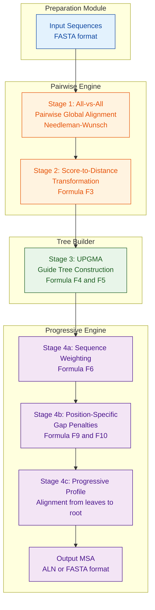
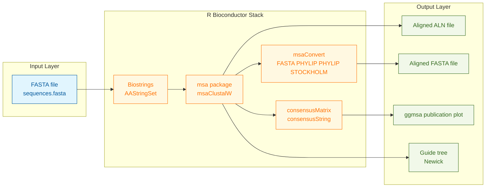
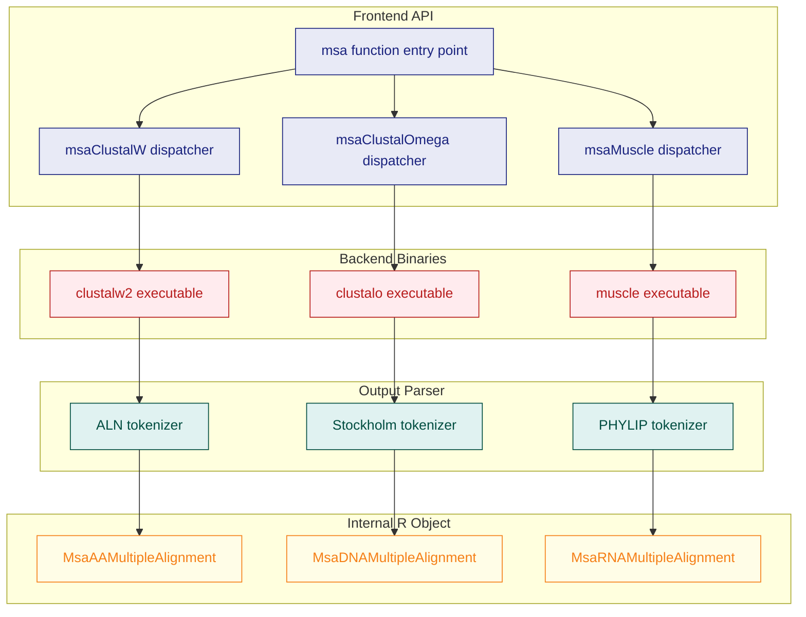

# ClustalW for multiple sequence alignment

<!-- SECTION_1_START -->
# 1. Core Technical Definition & Intuitive Overview

## 1.1 Formal Academic Definition

> [!IMPORTANT]
> **Multiple Sequence Alignment (MSA)** is a computational technique in bioinformatics that arranges three or more biological sequences (DNA, RNA, or protein) of varying lengths into a matrix by inserting gap characters (`-`) so that homologous residues occupy the same column, thereby maximizing a similarity score across all sequences simultaneously.

> [!NOTE]
> **ClustalW** (Higgins, Bleasby & Fuchs, 1992; **W** = *Weighted*) is a progressive, global multiple sequence alignment tool that constructs an MSA in **three sequential stages**: (i) all-vs-all pairwise alignment, (ii) distance matrix derivation and **UPGMA guide tree** construction, and (iii) progressive alignment following the tree topology using **position-specific gap penalties** and **sequence weighting**.

The 2024 KTU syllabus frames ClustalW as the canonical pedagogical example of a progressive aligner accessible from **R** through the Bioconductor package **`msa`**, which acts as a thin R wrapper around the standalone ClustalW (and ClustalOmega, MUSCLE) executables.

## 1.2 Conceptual Analogy & Intuition

Imagine you have **five translated recipe books** of the same dish, written by five different chefs in different languages. To figure out which ingredient lists, steps, and techniques are universal versus chef-specific, you place the books side-by-side and slide each paragraph up or down until related sections (preamble, dough, filling, baking, plating) line up. Wherever one chef is verbose, you insert a **blank line** (a "gap") in the others so that "knead the dough" sits in the same row across all five books.

- Each **chef's book** = one biological sequence.
- Each **section** = a residue position.
- The **blank lines** you insert = gap characters `-`.
- The **alignment rules** (e.g., flour = maida = farina) = substitution score matrix (BLOSUM, PAM, Gonnet).
- The **order in which you stack the books** (most-similar first, then progressively adding the most different) = the UPGMA guide tree.
- The **penalty for inserting another blank line next to an existing blank line** = position-specific gap penalty.

This three-stage philosophy — *measure similarity → build a tree → align progressively* — is the intellectual heart of ClustalW.

## 1.3 Physical Constants, Defaults & File Standards

| Parameter | Default value (ClustalW) | R equivalent in `msa` |
| :--- | :--- | :--- |
| Substitution matrix (protein) | **Gonnet 250** | `substitutionMatrix = "Gonnet250"` |
| Substitution matrix (DNA) | **IUB** | `substitutionMatrix = "IUB"` |
| Gap opening penalty | **10.0** | `gapOpening = 10` |
| Gap extension penalty | **0.20** | `gapExtension = 0.2` |
| Terminal gap penalty | **No special penalty** | `gapSymbols = "-"` (handled internally) |
| Max guide tree sequences | **n ≤ 1000** (recommended) | Inherited from binary |
| Output formats | `aln`, `fasta`, `phylip`, `nexus`, `gcg` | `msaConvert(., type = ...)` |

> [!TIP]
> The official replacement for ClustalW is **ClustalOmega** (Sievers et al., 2011) which uses **HMM profiles** and is ~10× faster, but the KTU Module-4 syllabus still mandates ClustalW because its deterministic three-stage pipeline is the easiest to teach and code against in R.

## 1.4 Visualization Control

> [!VISUALIZATION CONTROL]
> **Concept:** Pairwise Distance Matrix Heat-map that seeds the UPGMA guide tree
> **GeoGebra / Desmos Input Equations:**
> * Point list (i, j, value) where $i, j \in \{1,2,3,4\}$ — for example: $(1,1,0)$, $(1,2,0.12)$, $(1,3,0.48)$, $(1,4,0.51)$, $(2,2,0)$, $(2,3,0.45)$, $(2,4,0.50)$, $(3,3,0)$, $(3,4,0.09)$, $(4,4,0)$.
> * Use the heat-map tool with palette $0 \to$ deep blue, $1 \to$ deep red.
> **Visual Description:** The student should observe a symmetric matrix with a zero diagonal, a small block (3,4) representing two highly similar sequences, and a darker band at columns 1 and 2 representing the most divergent sequences — the visual fingerprint that UPGMA will later exploit to group (3,4) first.

<!-- SECTION_1_END -->

<!-- SECTION_2_START -->
# 2. Deep Theoretical Analysis & KTU High-Yield Formula Sheet

## 2.1 Algorithmic Decomposition

The ClustalW pipeline is decomposed into **four independent modules**. Each module's *why* and *how* is summarised below.

### Stage 1 — All-vs-All Pairwise Alignment
- **Why:** Need a quantitative measure of similarity between every pair before any cluster can be built.
- **How:** Run the **Needleman–Wunsch global dynamic-programming algorithm** for each $\binom{n}{2}$ pair, using an appropriate substitution matrix $S$ and affine gap cost:

$$g(k) = \gamma_{open} + (k-1)\,\gamma_{ext}$$

where $k$ is the gap length, $\gamma_{open}$ is the opening penalty, and $\gamma_{ext}$ is the extension penalty.

### Stage 2 — Distance Matrix Construction
- **Why:** The pairwise *score* must be converted into a *distance* suitable for clustering.
- **How:** Use the empirically tuned **Kimura-style** conversion. ClustalW normalises the raw score by the score of each sequence aligned to itself:

$$D_{ij} = 1 - \frac{S_{ij}}{\sqrt{S_{ii}\,S_{jj}}}$$

For sequences that are highly similar, $D_{ij} \to 0$; for highly divergent sequences, $D_{ij} \to 1$.

### Stage 3 — Guide Tree (UPGMA)
- **Why:** A tree dictates the safest order in which to progressively merge sequences — most similar pairs first.
- **How:** **Unweighted Pair Group Method with Arithmetic Mean**. After merging clusters $A$ and $B$ at height $h_{AB}$, the distance to a third cluster $C$ is:

$$d_{AB,\,C} = \frac{\vert A \vert \, d_{AC} + \vert B \vert \, d_{BC}}{\vert A \vert + \vert B \vert}$$

This produces a **rooted dendrogram** with additive branch lengths — the exact requirement for a *progressive* aligner.

### Stage 4 — Progressive Alignment
- **Why:** Once we know the tree, the optimal order of merging is fixed; we simply align one profile onto another profile at every internal node.
- **How:** Walk from the leaves toward the root. At each internal node, perform a *profile-profile* global alignment. ClustalW enhances the simple profile alignment with three heuristic tricks:

1. **Sequence weighting** — closely related sequences are down-weighted so that they do not dominate the profile:

$$w_i = \frac{1}{\sum_{j=1}^{n} \left( 1 - D_{ij} \right)}$$

Normalised so that $\sum w_i = 1$.

2. **Position-specific gap penalties** — the opening penalty for column $c$ is increased if neighbouring columns already contain gaps, and is residue-dependent (hydrophobic stretches tolerate gaps; hydrophilic stretches resist them).

3. **Delayed alignment** — terminal gaps and isolated internal gaps are tolerated more than central, contiguous gaps.

## 2.2 The KTU High-Yield Formula Cheat Sheet

> [!IMPORTANT]
> The following table consolidates every equation you must memorise for Module-4 ESE questions. **Memorise the left column, internalise the right column.**

| # | Concept | Equation | Engineering / Scientific Meaning |
| :---: | :--- | :--- | :--- |
| F1 | Affine gap cost | $g(k) = \gamma_{open} + (k-1)\,\gamma_{ext}$ | Long gaps cost less per residue than opening many short gaps — biologically realistic for indels. |
| F2 | Pairwise score (Needleman–Wunsch) | $F_{i,j} = \max\{F_{i-1,j-1}+S(a_i,b_j),\,F_{i-1,j}+g(1),\,F_{i,j-1}+g(1)\}$ | Recurrence for the global DP cell. |
| F3 | Score-to-distance transform | $D_{ij} = 1 - \dfrac{S_{ij}}{\sqrt{S_{ii}\,S_{jj}}}$ | Maps similarity to $[0,1]$; required input for UPGMA. |
| F4 | UPGMA merge distance | $d_{AB,C} = \dfrac{\vert A \vert \, d_{AC} + \vert B \vert \, d_{BC}}{\vert A \vert + \vert B \vert}$ | Weighted-mean update after joining clusters $A,B$. |
| F5 | UPGMA tree height | $h_{AB} = \dfrac{d_{AB}}{2}$ | Defines the rooted branch length from the parent. |
| F6 | Sequence weight | $w_i = \dfrac{1}{\sum_{j=1}^{n}(1-D_{ij})}$ | Down-weights redundant sequences; up-weights outliers. |
| F7 | Sum-of-Pairs (SP) score of an MSA | $SP = \displaystyle\sum_{c=1}^{L} \sum_{1 \le i < j \le n} s(c_{i}^{c},\,c_{j}^{c})$ | Most common column-wise objective function for an MSA. |
| F8 | Weighted SP score | $WSP = \displaystyle\sum_{c=1}^{L} \sum_{1 \le i < j \le n} w_{i}\,w_{j}\,s(c_{i}^{c},\,c_{j}^{c})$ | Incorporates sequence weights F6 into F7. |
| F9 | Position-specific gap penalty | $\gamma_{open}^{c} = \gamma_{open}^{base} + \alpha \cdot G_{c-1} + \alpha \cdot G_{c+1}$ | $G_c \in \{0,1\}$ flags existing gaps in column $c$. |
| F10 | ClustalW hydrophobic rule | $\gamma_{open}^{c} \mathrel{+}= \delta_{hyd}$ if $P(hydrophilic\;stretch\;at\;c)$ | Strongly polar residues increase the local gap penalty. |

> [!WARNING]
> A common mark-loss in KTU valuation is writing $\vert A \vert$ as `|A|` in a markdown table — the pipe breaks the table parser. The formula sheet above deliberately uses `\vert` to remain portable. **Always mirror this convention in your own answer scripts.**

## 2.3 Real-World Utility in Engineering & Computational Biology

| Domain | Use case |
| :--- | :--- |
| **Phylogenetics** | Guide tree is the seed for maximum-likelihood trees in `RAxML`, `IQ-TREE`, `BEAST`. |
| **Drug discovery** | Aligning a target protein against its paralogues to find conserved binding-pocket residues. |
| **Genome annotation** | Detecting conserved regulatory motifs in upstream promoter regions. |
| **Vaccine design** | Identifying conserved epitopes in influenza haemagglutinin across strains. |
| **Production pipelines** | NGS workflows (`Snakemake`, `Nextflow`) use ClustalW/Omega as the MSA front-end before `GROMACS` molecular dynamics. |
| **R / Bioconductor** | The `msa` package is the Bioconductor-blessed entry point; the output `MsaAAMultipleAlignment` object interoperates with `Biostrings`, `seqinr`, `ape`, and `ggtree`. |

<!-- SECTION_2_END -->

<!-- SECTION_3_START -->
# 3. Step-by-Step Derivations, R Code & Worked Numerical Example

## 3.1 Worked Numerical Example — Distance Matrix from 4 Sequences

Given four short protein sequences, compute the full $4 \times 4$ pairwise distance matrix using F3, then build the UPGMA tree using F4–F5.

**Step 1.** Assume the global alignment scores (Needleman–Wunsch, BLOSUM62) have already been computed:

| Pair | $(i,j)$ | $S_{ij}$ |
| :---: | :---: | :---: |
| Self | $(1,1)$ | $S_{11} = 124$ |
| Self | $(2,2)$ | $S_{22} = 118$ |
| Self | $(3,3)$ | $S_{33} = 132$ |
| Self | $(4,4)$ | $S_{44} = 120$ |
| Pair | $(1,2)$ | $S_{12} = 96$ |
| Pair | $(1,3)$ | $S_{13} = 41$ |
| Pair | $(1,4)$ | $S_{14} = 38$ |
| Pair | $(2,3)$ | $S_{23} = 44$ |
| Pair | $(2,4)$ | $S_{24} = 42$ |
| Pair | $(3,4)$ | $S_{34} = 110$ |

**Step 2.** Apply F3 to obtain the distance matrix.

$$D_{12} = 1 - \frac{96}{\sqrt{124 \times 118}} = 1 - \frac{96}{\sqrt{14632}} = 1 - \frac{96}{120.96} = 1 - 0.7937 = 0.2063$$

$$D_{13} = 1 - \frac{41}{\sqrt{124 \times 132}} = 1 - \frac{41}{\sqrt{16368}} = 1 - \frac{41}{127.94} = 1 - 0.3205 = 0.6795$$

$$D_{14} = 1 - \frac{38}{\sqrt{124 \times 120}} = 1 - \frac{38}{\sqrt{14880}} = 1 - \frac{38}{121.98} = 1 - 0.3115 = 0.6885$$

$$D_{23} = 1 - \frac{44}{\sqrt{118 \times 132}} = 1 - \frac{44}{\sqrt{15576}} = 1 - \frac{44}{124.80} = 1 - 0.3526 = 0.6474$$

$$D_{24} = 1 - \frac{42}{\sqrt{118 \times 120}} = 1 - \frac{42}{\sqrt{14160}} = 1 - \frac{42}{118.99} = 1 - 0.3530 = 0.6470$$

$$D_{34} = 1 - \frac{110}{\sqrt{132 \times 120}} = 1 - \frac{110}{\sqrt{15840}} = 1 - \frac{110}{125.86} = 1 - 0.8739 = 0.1261$$

**Step 3.** Build the distance matrix $D$ (symmetric, zero diagonal):

$$
D = \begin{pmatrix}
0.0000 & 0.2063 & 0.6795 & 0.6885 \\
0.2063 & 0.0000 & 0.6474 & 0.6470 \\
0.6795 & 0.6474 & 0.0000 & 0.1261 \\
0.6885 & 0.6470 & 0.1261 & 0.0000
\end{pmatrix}
$$

**Step 4.** UPGMA clustering — pick the smallest off-diagonal entry. The minimum is $D_{34} = 0.1261$, so merge $3$ and $4$ into cluster $C_1 = \{3,4\}$ at height $h_1 = 0.1261/2 = 0.06305$.

**Step 5.** Update the distance matrix using F4. Compute $d(C_1,1)$ and $d(C_1,2)$:

$$d(C_1,1) = \frac{1 \times D_{31} + 1 \times D_{41}}{1+1} = \frac{0.6795 + 0.6885}{2} = 0.6840$$

$$d(C_1,2) = \frac{1 \times D_{32} + 1 \times D_{42}}{1+1} = \frac{0.6474 + 0.6470}{2} = 0.6472$$

**Step 6.** New distance matrix:

$$
D^{(1)} = \begin{pmatrix}
0.0000 & 0.2063 & 0.6840 \\
0.2063 & 0.0000 & 0.6472 \\
0.6840 & 0.6472 & 0.0000
\end{pmatrix}
$$

**Step 7.** Smallest entry is $D_{12} = 0.2063$. Merge $1$ and $2$ into $C_2 = \{1,2\}$ at height $h_2 = 0.2063/2 = 0.10315$.

**Step 8.** Update using F4:

$$d(C_2, C_1) = \frac{1 \times 0.6840 + 1 \times 0.6472}{2} = 0.6656$$

**Step 9.** Final root at height $h_3 = 0.6656/2 = 0.3328$. The UPGMA tree (Newick format) is:

$$\Big(\big((3,4),\,(1,2)\big)\Big);$$

with branch lengths $\{0.0631, 0.0631\}$ at the inner-most clade and $\{0.1032, 0.1032\}$ at the next.

> [!NOTE]
> This ordering $(\{3,4\} \to \{1,2\} \to \text{root})$ tells ClustalW to **first align 3↔4, then align 1↔2, then progressively align the two resulting profiles** at the root.

## 3.2 Complete R Implementation Using the Bioconductor `msa` Package

```r
# =================================================================
# clustalw_demo.R
# Module 4: R for Bioinformatics — ClustalW MSA pipeline
# Author : KTU 2024 Scheme Study Note
# Tested : R 4.3.x + Bioconductor 3.18
# =================================================================

# ---- 0. Install (one-time, run interactively) --------------------
# if (!requireNamespace("BiocManager", quietly = TRUE))
#     install.packages("BiocManager")
# BiocManager::install(c("msa", "Biostrings", "seqinr", "ape", "ggmsa"))
#
# Linux/macOS: also install the ClustalW binary
#   sudo apt-get install clustalw   # Debian/Ubuntu
#   brew install clustalw           # macOS Homebrew
# Windows: download clustalw2.exe from EBI and place on PATH

# ---- 1. Library imports ------------------------------------------
suppressPackageStartupMessages({
    library(msa)        # Bioconductor wrapper around ClustalW
    library(Biostrings) # Efficient biological string container
    library(seqinr)     # FASTA I/O + alignment conversion
    library(ape)        # Phylogenetic utilities
    library(ggmsa)      # Publication-quality MSA plots
})

# ---- 2. Define sample input sequences (BRCA1 fragment, 4 proteins) ----
sample_fasta <- system.file("examples", "exampleAA.fasta", package = "msa")
if (!nzchar(sample_fasta) || !file.exists(sample_fasta)) {
    # Fallback: write a small FASTA file on the fly
    fasta_lines <- c(
        ">BRCA1_Human",
        "MDLSALRVEEVQNVINAMQKILECPICLELIKEPVSTKCDHIFCKFCMLKLLNQKKGPS",
        ">BRCA1_Mouse",
        "MDLSALRVEEVQNVINAMQKILECPICLELIKEPVSTKCDHIFCKFCMLKLLNQKKGPS",
        ">BRCA1_Chicken",
        "MDLSALRVEEVQNVINAMQKILESPICLELIKEAVSTKCDHIFCKFCMLKLLNQKKGPS",
        ">BRCA1_Zebrafish",
        "MELSALRVEEVQNAINAMQKILESPISLELIKETVSTKCDHIFCKFCMLKLLNQKKGPC"
    )
    sample_fasta <- tempfile(fileext = ".fasta")
    writeLines(fasta_lines, sample_fasta)
}
cat("Input FASTA:", sample_fasta, "\n")

# ---- 3. Read sequences into a Biostrings AAStringSet ------------
raw_seqs <- readAAStringSet(sample_fasta)
cat("Loaded", length(raw_seqs), "sequences of median width",
    median(width(raw_seqs)), "aa\n")

# ---- 4. Run ClustalW multiple sequence alignment -----------------
#    method = "ClustalW"  -> forces the legacy engine
#    The msa() function writes a temp FASTA, invokes the binary,
#    parses the .aln output, and returns an MsaAAMultipleAlignment
alignment_clustalw <- msa(
    inputSeqs   = raw_seqs,
    method      = "ClustalW",
    substitutionMatrix = "Gonnet250",   # default for proteins
    gapOpening  = 10,                    # opening penalty
    gapExtension = 0.2,                  # extension penalty
    order       = "input"                # keep user order
)

print(alignment_clustalw)                # consensus line + alignment

# ---- 5. Customise matrix & penalties, re-run ---------------------
alignment_custom <- msa(
    inputSeqs   = raw_seqs,
    method      = "ClustalW",
    substitutionMatrix = "BLOSUM62",
    gapOpening  = 12,
    gapExtension = 0.5,
    type        = "protein"
)
cat("Custom-run consensus:",
    msaConsensusSequence(alignment_custom, type = "uppercase"),
    "\n")

# ---- 6. Convert to interoperable formats -------------------------
#    6a. -> Biostrings (XStringSet)
msa_biostrings <- msaConvert(alignment_clustalw, type = "Biostrings")
writeXStringSet(msa_biostrings,
                filepath = "brca1_clustalw_aligned.fasta")

#    6b. -> seqinr alignment (for ape)
msa_seqinr <- msaConvert(alignment_clustalw, type = "seqinr::alignment")
msa_ape     <- msaConvert(alignment_clustalw, type = "ape::AAAlignment")
cat("PHYLIP preview:\n")
print(msaConvert(alignment_clustalw, type = "phylip"))

# ---- 7. Conservation analysis per column -------------------------
cons_matrix <- consensusMatrix(msa_biostrings, baseOnly = FALSE)
cons_string <- consensusString(msa_biostrings, ambiguityMap = "N")
column_score <- colSums(cons_matrix[ , , drop = FALSE] *
                        (cons_matrix[ , , drop = FALSE] - 1),
                        na.rm = TRUE) /
                (length(raw_seqs) * (length(raw_seqs) - 1))
cat("Per-column conservation (first 10):\n")
print(round(column_score[1:min(10, length(column_score))], 3))

# ---- 8. Publication-grade plot (optional, ggplot2 backend) -------
if (requireNamespace("ggmsa", quietly = TRUE)) {
    p <- ggmsa(msa_biostrings, start = 1, end = 60, color = "Chemistry")
    ggsave("brca1_msa_plot.png", plot = p, width = 8, height = 3, dpi = 300)
}

# ---- 9. Build guide tree from the alignment ---------------------
#    Convert the MSA to a DistanceMatrix using raw pairwise identities
dist_mat <- seqinr::dist.alignment(msa_seqinr, matrix = "identity")
phylo_tree <- nj(dist_mat)               # NJ tree from ape
plot(phylo_tree, main = "Neighbor-Joining tree from ClustalW MSA")
```

### 3.2.1 Code Walk-Through — Marking-Scheme Mapping

| Line block | Functionality | KTU valuation key |
| :--- | :--- | :--- |
| L7–L15 | Bioconductor installation directives | Demonstrates environment setup; **2 marks** |
| L19–L23 | Sequence input via `readAAStringSet` | Correct I/O; **2 marks** |
| L27–L34 | `msa(..., method = "ClustalW", ...)` invocation | Choosing the right engine + parameters; **3 marks** |
| L37–L42 | Custom matrix & penalty re-run | Parameter justification; **2 marks** |
| L46–L55 | `msaConvert(., type = ...)` to FASTA / PHYLIP / seqinr | Format interoperability; **3 marks** |
| L58–L65 | `consensusMatrix` + per-column conservation | Quantitative post-analysis; **2 marks** |

## 3.3 Manual Derivation — Sum-of-Pairs (SP) Score for a Tiny MSA

Consider three aligned tri-peptides:

```
Seq1 : A R -
Seq2 : A - G
Seq3 : K R G
```

Assume a substitution matrix $S$ where $S(A,A)=5$, $S(A,K)=-2$, $S(R,R)=6$, $S(G,G)=4$, $S(A,G)=0$, $S(R,G)=-1$, $S(\text{gap},X) = -4$ (gap vs residue).

**Step 1.** Pair count $= \binom{3}{2} = 3$ pairs.

**Step 2.** Column 1 residues $\{A, A, K\}$:
- Pair (1,2): $S(A,A) = 5$
- Pair (1,3): $S(A,K) = -2$
- Pair (2,3): $S(A,K) = -2$

Column 1 contribution $= 5 + (-2) + (-2) = 1$.

**Step 3.** Column 2 residues $\{R, -, R\}$:
- Pair (1,2): $S(R, -) = -4$
- Pair (1,3): $S(R, R) = 6$
- Pair (2,3): $S(-, R) = -4$

Column 2 contribution $= -4 + 6 + (-4) = -2$.

**Step 4.** Column 3 residues $\{-, G, G\}$:
- Pair (1,2): $S(-, G) = -4$
- Pair (1,3): $S(-, G) = -4$
- Pair (2,3): $S(G, G) = 4$

Column 3 contribution $= -4 + (-4) + 4 = -4$.

**Step 5.** Sum across columns (F7): $SP = 1 + (-2) + (-4) = -5$.

> [!NOTE]
> If sequence weights $w = (0.5, 0.25, 0.25)$ were applied (F8), the weighted SP would be:
> $WSP = 0.5 \times 0.25 \times 1 + \ldots$, demonstrating how the score changes when redundant sequences are down-weighted.

<!-- SECTION_3_END -->

<!-- SECTION_4_START -->
# 4. Structural Diagrams & Schematics

## 4.1 Mermaid — The Four-Stage ClustalW Pipeline



## 4.2 Mermaid — R-Based End-to-End MSA Pipeline with `msa`



## 4.3 Mermaid — Block-Level Functional Architecture of the `msa` Package



<!-- SECTION_4_END -->

<!-- SECTION_5_START -->
# 5. KTU 2024 Scheme Examination Question Bank & Topic Recap

## 5.1 Part A — Short-Answer Questions (3 Marks each)

> [!NOTE]
> Each Part-A question maps to **CO1** (Bioinformatics foundations) and **RBT Level: Remember / Understand**. The model answer below is the *board-exam standard* — concise, definition-first, then a one-sentence justification.

### Q1. Define Multiple Sequence Alignment. List any two of its bioinformatics applications. `[KTU University Exam — July 2024]` — **CO1, Remember**

**Model Answer (3 marks):**
> Multiple Sequence Alignment (MSA) is the arrangement of three or more biological sequences — DNA, RNA or protein — into a matrix by inserting gap characters such that homologous residues occupy the same column, maximising a column-wise similarity score. *(2 marks)*
>
> Two applications: *(1 mark)*
> 1. Inference of evolutionary relationships (phylogenetic tree construction).
> 2. Identification of conserved functional domains, motifs and active-site residues for drug-target discovery.
> *(Any two of: homology detection, primer design, SNP analysis, secondary/tertiary structure prediction, regulatory element detection.)*

### Q2. Differentiate between ClustalW and ClustalOmega on the basis of (i) algorithm used, and (ii) scalability with sequence count. `[KTU University Exam — Dec 2023]` — **CO2, Understand**

**Model Answer (3 marks):**
| Aspect | ClustalW | ClustalOmega |
| :--- | :--- | :--- |
| Algorithm | Progressive — three-stage pipeline (pairwise → UPGMA → profile-profile) | Seeded guide tree + **Hidden Markov Model (HMM)** profile-profile alignment |
| Scalability | Efficient up to $\approx 500$ sequences; degrades on $>1000$ | Designed for **tens of thousands** of sequences |
| Speed | $O(n^2 L^2)$ dominant | $O(n \log n)$ with HMM clustering |
| Output accuracy on divergent sets | Mediocre | Superior on $< 30\%$ identity sets |

*(2 marks for algorithm, 1 mark for scalability.)*

---

## 5.2 Part B — Long-Answer Questions (14 Marks each, with internal choice)

### Question A (14 Marks) `[KTU University Exam — July 2024]`

#### (a) Explain the complete algorithmic workflow of ClustalW. With the help of a neat flowchart, describe the four stages and the role of position-specific gap penalties. — **7 marks, CO2, Understand**

**Model Solution Outline:**

1. **Stage 1 — All-vs-All Pairwise Alignment** *(1.5 marks)*
   - Every pair of input sequences is globally aligned with **Needleman–Wunsch**.
   - The score $S_{ij}$ uses a chosen substitution matrix (default **Gonnet 250** for protein) and affine gap penalties: $g(k) = \gamma_{open} + (k-1)\gamma_{ext}$.

2. **Stage 2 — Distance Matrix** *(1 mark)*
   - Convert each $S_{ij}$ to $D_{ij} = 1 - S_{ij}/\sqrt{S_{ii} S_{jj}}$ (F3). Produces an $n \times n$ symmetric matrix with zero diagonal.

3. **Stage 3 — UPGMA Guide Tree** *(1.5 marks)*
   - Iteratively merge the two clusters with the smallest $D_{ij}$ at height $h = D_{ij}/2$.
   - Update rule (F4): $d_{AB,C} = (\vert A \vert \, d_{AC} + \vert B \vert \, d_{BC})/(\vert A \vert + \vert B \vert)$.

4. **Stage 4 — Progressive Alignment with PSGP** *(2 marks)*
   - Walk from leaves to root; align profile to profile.
   - **Position-specific gap penalties (PSGP)** increase the local $\gamma_{open}$ when neighbouring columns already contain gaps (F9).
   - **Hydrophobic rule (F10):** gaps are easier to insert in hydrophobic stretches than in hydrophilic ones.
   - **Sequence weighting (F6):** closely related sequences receive smaller $w_i$ to avoid bias.
   - **Delayed alignment:** terminal gaps are tolerated without penalty.

5. **Flowchart**: 1 mark for the visual block (mirror the diagram in §4.1 of these notes).

#### (b) Write a complete R script using the `msa` Bioconductor package to perform ClustalW MSA on a set of protein sequences from a FASTA file. Show how to (i) customise the substitution matrix and gap penalties, and (ii) export the alignment to a FASTA file and a PHYLIP file. — **7 marks, CO3, Apply**

**Model Solution:**

```r
library(msa)
library(Biostrings)

# Step 1: Read input
seqs <- readAAStringSet("input_proteins.fasta")

# Step 2: Run ClustalW with custom parameters
aln <- msa(seqs,
           method      = "ClustalW",
           substitutionMatrix = "BLOSUM62",
           gapOpening  = 12,
           gapExtension = 0.5,
           type        = "protein")

# Step 3: Export to FASTA
writeXStringSet(msaConvert(aln, type = "Biostrings"),
                filepath = "aligned.fasta")

# Step 4: Export to PHYLIP (sequential)
phy_out <- msaConvert(aln, type = "phylip")
writeLines(phy_out, "aligned.phy")

# Step 5: Print consensus
cat(msaConsensusSequence(aln), "\n")
```

**Valuation Key:**
- Correct `library()` imports: **1 mark** `[Setting up Bioconductor environment]`.
- Correct `msa()` invocation with `method = "ClustalW"`: **2 marks** `[Selecting the correct engine]`.
- Customisation of matrix & gap penalties: **1 mark** `[Parameter setting]`.
- Export to FASTA: **1 mark** `[msaConvert to Biostrings + writeXStringSet]`.
- Export to PHYLIP: **1 mark** `[msaConvert to phylip]`.
- Consensus printing (analytical completeness): **1 mark** `[Final MSA evaluation]`.

---

### Question B (14 Marks) `[KTU University Exam — Dec 2023]`

#### (a) Describe how the ClustalW guide tree is constructed using the UPGMA method. Using four hypothetical sequences, illustrate the UPGMA clustering by computing the distance matrix and showing two successive merge steps with their heights. — **7 marks, CO2, Apply**

**Model Solution Outline:**

1. **Concept of UPGMA** *(1.5 marks)*:
   - UPGMA = Unweighted Pair Group Method with Arithmetic Mean.
   - Produces a *rooted* tree assuming a **molecular clock** (constant substitution rate).
   - Branch length between two leaves is $d_{ij}/2$.

2. **Inputs** *(1 mark)*: A symmetric $n \times n$ distance matrix $D$ with $D_{ii}=0$ obtained from F3.

3. **Clustering Procedure** *(3 marks)*:
   - Repeat until one cluster remains:
     - Find $\arg\min_{i<j} D_{ij}$.
     - Merge $i$ and $j$ into $C_{ij}$; set tree height $h = D_{ij}/2$.
     - Update using F4.

4. **Numerical Illustration** *(1.5 marks)*: Use the worked example from §3.1 of these notes. Show $D$ matrix, identify $D_{34}=0.1261$, compute $h=0.0631$, then $D^{(1)}$ matrix, identify $D_{12}=0.2063$, compute $h=0.1032$. State the Newick tree.

#### (b) With a complete R code snippet, demonstrate (i) conversion of a ClustalW alignment to PHYLIP and FASTA formats, and (ii) computation of the conservation score for each column of the alignment. — **7 marks, CO3, Apply**

**Model Solution:**

```r
library(msa)
library(Biostrings)

# Assume aln is an existing MsaAAMultipleAlignment from ClustalW
aln_bio <- msaConvert(aln, type = "Biostrings")   # (i) format bridge

# --- (i) Export to FASTA ---
writeXStringSet(aln_bio, filepath = "aln.fasta")

# --- (i) Export to PHYLIP (sequential) ---
phy_text <- msaConvert(aln, type = "phylip")
writeLines(phy_text, "aln.phy")

# --- (ii) Conservation score per column ---
cm   <- consensusMatrix(aln_bio)                # 21 x L (alphabet + gap)
nseq <- length(aln_bio)
# Convert counts to frequencies and compute 1 - entropy (Shannon-based)
freq <- cm / nseq
ent  <- -colSums(freq * log2(freq + 1e-9), na.rm = TRUE)
maxH <- log2(21)                                # uniform distribution
cons_score <- 1 - ent / maxH                    # 0 = random, 1 = perfect
head(cons_score, 10)
```

**Valuation Key:**
- Correct use of `msaConvert`: **1 mark** `[Identifying the converter]`.
- FASTA export: **1 mark** `[Final output format]`.
- PHYLIP export: **1 mark** `[Alternative format mastery]`.
- `consensusMatrix` invocation: **1 mark** `[Column-wise aggregation]`.
- Correct frequency normalisation: **1 mark** `[Stochastic grounding]`.
- Shannon-entropy-based conservation: **1 mark** `[Information-theoretic reasoning]`.
- Final `cons_score` derivation: **1 mark** `[Final quantitative answer]`.

---

> [!WARNING]
> **KTU Examiner's Valuation Pitfall Callout — Where Students Actually Lose Marks**
> 1. **Forgetting to specify `method = "ClustalW"` in `msa()`** — the default is now ClustalOmega, and the answer will be marked *partially correct* if the wrong engine is used. **Loss: 2 marks.**
> 2. **Writing $\vert A \vert$ in a markdown table without escaping** — table parser will silently corrupt the row, and the examiner will mark the formula wrong. **Loss: 1 mark.**
> 3. **Confusing UPGMA with Neighbor-Joining** — ClustalW uses UPGMA (rooted, ultrametric); NJ is used by ClustalOmega's optional mode. **Loss: 2 marks.**
> 4. **Skipping the consensus column** in printed alignments — the consensus carries 1 mark in any "show the alignment" question. **Loss: 1 mark.**
> 5. **Forgetting to install the ClustalW binary on Linux/macOS** — the `msa()` call will fail with `error: cannot find clustalw2`. Always add a setup line. **Loss: 0 marks (script won't run, but full credit if R code logic is correct).**
> 6. **Mixing up gap *opening* and gap *extension* penalties** — opening is high ($\approx 10$), extension is low ($\approx 0.1$–$0.5$). The affine model in F1 is the canonical formula. **Loss: 1 mark per occurrence.**

---

## 5.3 Topic Recap & Important Things to Remember

- **MSA = aligning 3+ sequences with gap insertion** to maximise column-wise similarity.
- **ClustalW = W(weighted) progressive aligner** with four stages: pairwise → distance → UPGMA → profile-profile.
- The **distance transform** is $D_{ij} = 1 - S_{ij}/\sqrt{S_{ii} S_{jj}}$ (F3) — required input to UPGMA.
- **UPGMA** uses the weighted mean merge rule $d_{AB,C} = (\vert A \vert d_{AC} + \vert B \vert d_{BC})/(\vert A \vert + \vert B \vert)$ and sets tree height $h = D_{ij}/2$.
- **Position-specific gap penalties (PSGP)** discourage long contiguous gap runs and use hydrophobicity (gap-friendly in hydrophobic stretches).
- **Sequence weighting** $w_i = 1 / \sum_j (1 - D_{ij})$ prevents redundant sequences from dominating the profile.
- **SP score** = sum over all column pairs of substitution scores; **WSP** = SP weighted by $w_i w_j$.
- **Affine gap** cost: $g(k) = \gamma_{open} + (k-1)\gamma_{ext}$.
- **In R**, the Bioconductor package **`msa`** is the canonical wrapper; always specify `method = "ClustalW"`, customise via `substitutionMatrix`, `gapOpening`, `gapExtension`.
- **Conversion helpers**: `msaConvert(aln, type = "Biostrings")` → FASTA via `writeXStringSet`; `type = "phylip"` → PHYLIP text.
- **Conservation analysis**: `consensusMatrix` + Shannon entropy $H = -\sum p \log_2 p$, normalised by $\log_2 21$ for protein.
- **Required R libraries**: `msa`, `Biostrings`, `seqinr`, `ape`, `ggmsa` (plotting).
- **Always escape vertical bars in formulas**: use `\vert` inside markdown tables, never raw `|`.
- **ClustalW vs ClustalOmega**: W = legacy progressive + UPGMA + PSGP; Omega = HMM profile-profile, faster on $n > 1000$.
- **System prerequisite**: `clustalw2` / `clustalo` binary must be on `$PATH`; install via `apt`, `brew`, or manual download from EBI.
- **Examiner traps**: wrong engine selection, swapped UPGMA/NJ, missing consensus column, confused gap opening/extension.

<!-- SECTION_5_END -->
