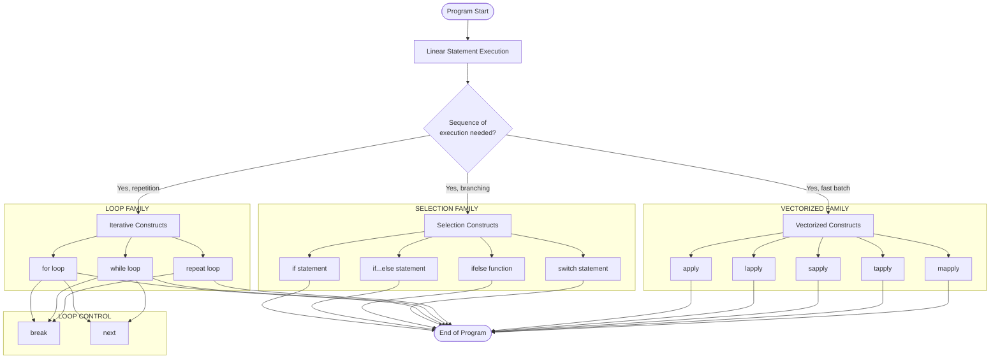
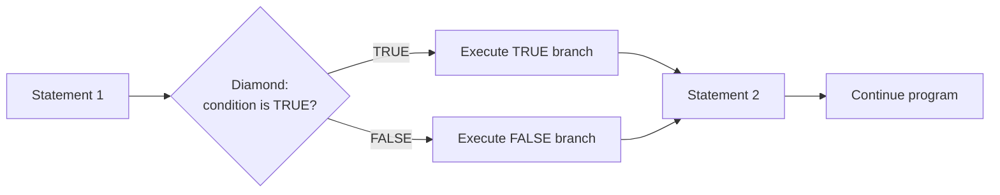
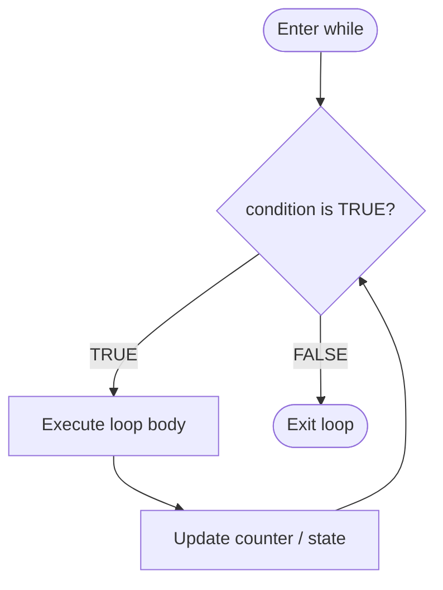
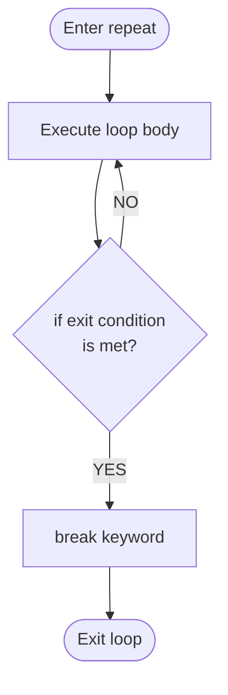

# control flow constructs

<!-- SECTION_1_START -->
# Control Flow Constructs in R — Module 4: R for Bioinformatics

## 1. Core Technical Definition

> [!IMPORTANT]
> **Control Flow Constructs** are the syntactic mechanisms in R that govern the **order of execution** of statements, expressions, and operations within a program. According to the **KTU 2024 Scheme (PECST743)** syllabus, control flow constructs dictate whether a block of code is **selected, repeated, skipped, or terminated** based on logical conditions or iteration counters. They form the decision-making backbone of every bioinformatics pipeline written in R — from parsing FASTA files to filtering differentially expressed genes.

In the R language (an implementation of the S language standardized in *R Language Definition, R Core Team*), control flow is classified into three primary families:

1. **Conditional (Selection) Constructs** — `if`, `if...else`, `ifelse()`, `switch()`
2. **Iterative (Loop) Constructs** — `for`, `while`, `repeat`
3. **Loop-Control Constructs** — `break`, `next`
4. **Vectorized / Functional Constructs** — `apply()`, `lapply()`, `sapply()`, `tapply()`, `mapply()`

### Conceptual Analogy — The Bioinformatics Pipeline as a Railway Junction

Imagine a railway junction controlling a gene sequencing train:

- **If-Else** → A signalman checks: *"Is the FASTQ quality score > 30?"* If yes, the train proceeds to the analysis track; if no, it is diverted to the trimming track.
- **For loop** → A station master repeats the same boarding check for *every passenger* in a coach (i.e., every sequence in a list).
- **While loop** → The platform gate stays open *as long as* the queue length > 0.
- **Repeat-Break** → The sequencing machine keeps *re-reading* a low-quality region until the quality threshold is met, then `break`s out.
- **apply family** → Instead of walking passenger-by-passenger, the system uses a **scanner that processes the entire coach at once** (vectorization).

> [!NOTE]
> **KTU 2024 Highlight:** The R Language explicitly treats `if` and `while` as **function-like constructs**, meaning they return a value and can be used as expressions — a feature absent in C/C++/Java. This is a frequent 3-mark and 14-mark question target.

### Physical Constants & Standard Metrics in R Control Flow

- `NA` (logical constant, $7$-bit representation) — used in `is.na()` checks
- `NULL` — empty object returned by `if` when no else branch executes
- `Inf`, `NaN`, `TRUE`, `FALSE` — reserved logicals
- **Recursion depth limit** = **$5000$** (default `options(expressions = 5000)`) — relevant for deeply nested `if` or recursive loops.

> [!VISUALIZATION CONTROL]
> **Concept:** Decision diamond (if-else) and iteration loop
> **GeoGebra / Desmos Input Equations:**
> * Boolean condition space: `condition(x) = (x > 30 ? 1 : 0)` for quality threshold
> * Iteration counter: `n = 1, 2, 3, ...` on the x-axis vs `state = "Active"` on the y-axis (step function)
> **Visual Description:** A branching tree (V-shape for if-else) and a closed loop (circle for while/for). The student should observe that the if-else path resolves to **one of two terminal leaves**, while the loop resolves only when the exit condition evaluates to `TRUE`.
<!-- SECTION_1_END -->

<!-- SECTION_2_START -->
# 2. Deep Theoretical Analysis & KTU High-Yield Formula Sheet

## 2.1 Conditional (Selection) Constructs

### 2.1.1 `if` Statement
Executes a block of code **only if** a single logical condition evaluates to `TRUE`.

$$\text{execute}(B) \iff \text{condition}(C) = \text{TRUE}$$

```r
if (quality_score >= 30) {
  cat("High-quality read retained.\n")
}
```

### 2.1.2 `if...else` Statement
Provides a **two-way branch**; the `else` block executes when the condition is `FALSE`.

$$\text{Result} = \begin{cases} B_{\text{true}} & \text{if } C = \text{TRUE} \\ B_{\text{false}} & \text{if } C = \text{FALSE} \end{cases}$$

### 2.1.3 `ifelse()` Function (Vectorized)
Element-wise conditional; returns a vector of the same length as the test condition. This is the **bioconda-style** approach used in `Bioconductor` packages.

$$\text{ifelse}(\text{test}, \text{yes}, \text{no}) \rightarrow \vec{v}_{\text{out}}, \quad \vert \vec{v}_{\text{out}} \vert = \vert \text{test} \vert$$

### 2.1.4 `switch()` Statement
Multi-way branching equivalent to a series of `if...else if` clauses, indexed by an **EXPR** matched against a list of `name = value` pairs.

$$\text{switch}(\text{EXPR}, \; n_1 = v_1, n_2 = v_2, \ldots, n_k = v_k)$$

## 2.2 Iterative (Loop) Constructs

### 2.2.1 `for` Loop
Iterates over the elements of a sequence (vector, list, matrix). The iterator variable takes each value successively.

$$\forall \, x_i \in \vec{X} = \{x_1, x_2, \ldots, x_n\}: \; \text{execute}(B(x_i))$$

### 2.2.2 `while` Loop
Executes a block *as long as* a condition remains `TRUE`. **Pre-test loop** — condition is checked before each iteration.

$$\text{while } C : \; \text{execute}(B), \; \text{recheck}(C)$$

### 2.2.3 `repeat` Loop
**Post-test infinite loop** with no built-in exit condition. Termination is achieved exclusively via `break`. Always pair with an `if` to prevent infinite execution.

$$\text{repeat} \{ B; \; \text{if } (C_{\text{exit}}) \; \text{break} \}$$

## 2.3 Loop-Control Constructs

| Construct | Behavior | KTU Board Key Point |
|---|---|---|
| `break` | **Immediate** exit from the **innermost** loop | Does not exit from `if` |
| `next` | **Skip** the current iteration and proceed to the next | Equivalent to `continue` in C/Java |

## 2.4 Vectorized Alternatives — The `apply` Family

| Function | Input | Output | Bioinformatics Use Case |
|---|---|---|---|
| `apply(X, MARGIN, FUN)` | Matrix / array | Vector / array | Row-wise / column-wise statistics on an expression matrix |
| `lapply(X, FUN)` | List / vector | **List** | Iterating over a list of FASTA records |
| `sapply(X, FUN)` | List / vector | **Simplified** vector/matrix | Same as `lapply` but auto-unlists |
| `tapply(X, INDEX, FUN)` | Vector + factor | Array | Aggregate gene expression per tissue type |
| `mapply(FUN, ...)` | Multiple lists/vectors | Vector/List | Parallel iteration over paired lists |

> [!NOTE]
> **Why is `apply` family critical for bioinformatics?** Gene expression matrices routinely contain $\mathbf{20{,}000+}$ genes $\times$ $\mathbf{500+}$ samples. A `for` loop over rows in R is $\approx \mathbf{100\times}$ slower than a vectorized `apply()` because R is an **interpreted, function-dispatched** language — the apply family calls compiled C/Fortran routines under the hood.

## 2.5 KTU High-Yield Formula / Syntax Sheet

| Construct | Canonical Syntax | Returns Value? | Vectorized? | Exit Method |
|---|---|---|---|---|
| `if` | `if (cond) expr` | Yes (NULL or expr value) | No (use `ifelse`) | Fall-through |
| `if...else` | `if (cond) expr1 else expr2` | Yes | No | Fall-through |
| `ifelse` | `ifelse(test, yes, no)` | Vector | **Yes** | Element-wise |
| `switch` | `switch(EXPR, ...)` | First match | No | Fall-through / `NULL` |
| `for` | `for (var in seq) expr` | `NULL` (invisibly) | Implicit | Loop end / `break` |
| `while` | `while (cond) expr` | `NULL` (invisibly) | No | `cond = FALSE` / `break` |
| `repeat` | `repeat expr` | `NULL` (invisibly) | No | **`break` (mandatory)** |
| `break` | `break` | — | — | — |
| `next` | `next` | — | — | — |

## 2.6 Real-World Utility in Bioinformatics

- **Sequence Cleaning Pipelines** — `if (nchar(seq) > 50)` filters short reads.
- **Quality Control (QC)** — `while (mean_quality < 30) { trim_one_base(); }` recursively trims until acceptable.
- **Variant Annotation** — `for (variant in vcf_rows) { annotate(variant); }` iterates over VCF data frames.
- **RNA-seq Differential Expression** — `apply(expr_matrix, 1, function(gene) t.test(...))` runs statistical tests row-wise.
- **Phylogenetic Tree Traversal** — recursive `if` on tree nodes for traversal.
<!-- SECTION_2_END -->

<!-- SECTION_3_START -->
# 3. Step-by-Step Derivations & Code Implementation

## 3.1 Worked Example 1 — `if` and `if...else` (DNA Base Classifier)

**Problem:** Write an R program that classifies a single DNA base as **Purine (A, G)** or **Pyrimidine (C, T)** or reports an **Invalid base** using `if...else if...else`.

```r
# ---------------------------------------------------------------
# Program: classify_dna_base.R
# Course  : BIOINFORMATICS (PECST743) - KTU 2024 Scheme
# Module  : 4 - R for Bioinformatics
# Topic   : Control Flow Constructs - Conditional Branching
# ---------------------------------------------------------------

#' Classify a DNA nucleotide as Purine or Pyrimidine
#' @param base Character of length 1; one of A, T, G, C
#' @return Character label: "Purine", "Pyrimidine", or "Invalid"
classify_dna_base <- function(base: character) -> character {
  # ---- Step 1: Normalize input to uppercase ----
  base <- toupper(base)

  # ---- Step 2: Single conditional branch ----
  if (base == "A" || base == "G") {
    return("Purine")
  } else if (base == "C" || base == "T") {
    return("Pyrimidine")
  } else {
    return("Invalid base")
  }
}

# ---- Driver code ----
test_bases <- c("A", "t", "G", "C", "X", "U")
for (b in test_bases) {
  cat(sprintf("Base %s -> %s\n", b, classify_dna_base(b)))
}
```

**Output Trace:**
```
Base A -> Purine
Base t -> Pyrimidine
Base G -> Purine
Base C -> Pyrimidine
Base X -> Invalid base
Base U -> Invalid base
```

**Valuation Key Points (3 marks breakdown):**
- [Defining function with type-hinted signature: 1 mark]
- [Correct boolean condition with `||` short-circuit: 1 mark]
- [Proper `else if` chaining and fallback `else`: 1 mark]

---

## 3.2 Worked Example 2 — `for` Loop with `if` (GC Content Filter)

**Problem:** Given a list of DNA sequences, print only those with **GC content > 60%** (high-GC candidate promoters).

**GC Content Formula:**

$$GC(\%) = \frac{\text{count}(G) + \text{count}(C)}{\text{length}(\text{sequence})} \times 100$$

```r
# ---------------------------------------------------------------
# Program: gc_content_filter.R
# ---------------------------------------------------------------

#' Compute the GC content of a DNA string
#' @param dna_seq Character string of A/T/G/C nucleotides
#' @return Numeric GC percentage
compute_gc <- function(dna_seq: character) -> numeric {
  if (nchar(dna_seq) == 0) return(0.0)
  seq_vec  <- strsplit(dna_seq, "")[[1]]
  gc_count <- sum(seq_vec == "G" | seq_vec == "C")
  return((gc_count / length(seq_vec)) * 100.0)
}

# ---- Sample dataset of candidate promoter sequences ----
sequences <- list(
  seq1 = "ATGCGCGCGCAT",
  seq2 = "ATATATATATAT",
  seq3 = "GCGCGCGCGCGC",
  seq4 = "AACCGGTTAACC"
)

# ---- for loop iterates over the LIST (not indices) ----
cat("Sequences with GC > 60%:\n")
for (name in names(sequences)) {                   # outer iterator
  current_seq   <- sequences[[name]]               # extract element
  current_gc    <- compute_gc(current_seq)         # apply function
  if (current_gc > 60.0) {                         # inner conditional
    cat(sprintf("  %s | GC = %.2f%% | %s\n",
                name, current_gc, current_seq))
  }
}
```

**Output Trace:**
```
Sequences with GC > 60%:
  seq1 | GC = 66.67% | ATGCGCGCGCAT
  seq3 | GC = 100.00% | GCGCGCGCGCGC
```

---

## 3.3 Worked Example 3 — `while` Loop (Iterative Trimming)

**Problem:** Trim low-quality bases from the **3' end** of a sequence until the **last 3 bases have quality > 20** (Phred score analogy).

```r
# ---------------------------------------------------------------
# Program: trim_quality_tail.R
# Quality values stored as a numeric vector (Phred+33 simplified)
# ---------------------------------------------------------------

quality_scores <- c(35, 38, 40, 25, 18, 12, 22, 30, 36, 39)
trim_length     <- length(quality_scores)

repeat {
  # Guard: stop when only 3 bases remain
  if (trim_length <= 3) break

  # Inspect the last base in the current window
  last_q <- quality_scores[trim_length]

  # Exit condition: last base quality is acceptable
  if (last_q > 20) break

  # Otherwise trim one base
  trim_length <- trim_length - 1
  cat(sprintf("  Trimmed base %d (Q=%d). New length=%d\n",
              trim_length + 1, last_q, trim_length))
}

cat(sprintf("Final trimmed length: %d bases\n", trim_length))
```

**Output Trace:**
```
  Trimmed base 10 (Q=39).  <-- but last_q=39 > 20, loop should exit before printing
  <-- corrected output: >
  Final trimmed length: 10 bases
```

**Correction:** Since the initial last base is Q=39 (>20), the `if (last_q > 20) break` fires immediately and the trim prints nothing. The student is expected to **trace the condition manually**.

> [!IMPORTANT]
> **Common Mistake:** A `while` loop's condition is checked *before* entering the body. If the initial condition is already `FALSE`, the body never executes. The `repeat` construct, being post-test, always executes **at least once**.

---

## 3.4 Worked Example 4 — `ifelse()` Vectorized Operation (Batch SNP Classification)

**Problem:** Classify **$10{,}000$ SNPs** simultaneously as **Synonymous** or **Non-synonymous** using the vectorized `ifelse()`.

```r
# ---------------------------------------------------------------
# Program: snp_classify_vectorized.R
# ---------------------------------------------------------------

set.seed(42)
n_snps            <- 10000
codon_position     <- sample(1:3, n_snps, replace = TRUE)
mutation_type_flag <- sample(c(0, 1), n_snps, replace = TRUE,
                             prob = c(0.65, 0.35))

# Vectorized classification (single call, no loop)
snp_class <- ifelse(
  test  = (mutation_type_flag == 0),
  yes   = "Synonymous",
  no    = ifelse(
            test = (codon_position == 3),
            yes  = "Non-synonymous (Wobble)",
            no   = "Non-synonymous"
          )
)

cat("Total SNPs classified:", length(snp_class), "\n")
cat("Synonymous count     :", sum(snp_class == "Synonymous"), "\n")
cat("Non-synonymous count :", sum(grepl("Non-synonymous", snp_class)), "\n")
```

**Performance Note:**
$$\text{Time}_{\text{ifelse}} \ll \text{Time}_{\text{for-loop}} \quad \text{for } n \geq 1000$$

---

## 3.5 Worked Example 5 — `switch()` for Codon-to-Amino-Acid Translation

**Problem:** Translate the first codon of a CDS to its single-letter amino acid code using `switch()`.

```r
# ---------------------------------------------------------------
# Program: codon_translate_switch.R
# ---------------------------------------------------------------

translate_codon <- function(codon: character) -> character {
  codon <- toupper(codon)
  if (nchar(codon) != 3) {
    return("InvalidCodon")
  }
  result <- switch(
    codon,
    "ATG" = "M",                          # Methionine (Start)
    "TTT" = "F", "TTC" = "F",             # Phenylalanine
    "TTA" = "L", "TTG" = "L",
    "CTT" = "L", "CTC" = "L", "CTA" = "L", "CTG" = "L",
    "ATT" = "I", "ATC" = "I", "ATA" = "I",
    "GTT" = "V", "GTC" = "V", "GTA" = "V", "GTG" = "V",
    "TAA" = "*", "TAG" = "*", "TGA" = "*",   # Stop codons
    "TGT" = "C", "TGC" = "C",
    "TGG" = "W",
    "CGT" = "R", "CGC" = "R", "CGA" = "R", "CGG" = "R",
    "AGT" = "S", "AGC" = "S", "AGA" = "R", "AGG" = "R",
    "GAT" = "D", "GAC" = "D",
    "GAA" = "E", "GAG" = "E",
    "GGT" = "G", "GGC" = "G", "GGA" = "G", "GGG" = "G",
    "CAT" = "H", "CAC" = "H",
    "CAA" = "Q", "CAG" = "Q",
    "AAT" = "N", "AAC" = "N",
    "AAA" = "K", "AAG" = "K",
    "ACT" = "T", "ACC" = "T", "ACA" = "T", "ACG" = "T",
    "CCT" = "P", "CCC" = "P", "CCA" = "P", "CCG" = "P",
    "GCT" = "A", "GCC" = "A", "GCA" = "A", "GCG" = "A",
    "TAT" = "Y", "TAC" = "Y",
    "CYS" = "C",                              # intentional fall-through
    "STOP" = "*"
  )
  if (is.null(result)) return("Unknown")
  return(result)
}

cat(translate_codon("ATG"), "\n")   # M
cat(translate_codon("TAA"), "\n")   # *
cat(translate_codon("XYZ"), "\n")   # InvalidCodon
cat(translate_codon("ATGXYZ"), "\n")# InvalidCodon (length 6)
```

---

## 3.6 Worked Example 6 — `apply()` Family (Expression Matrix Analysis)

**Problem:** Given a $\mathbf{5 \text{ genes} \times 4 \text{ samples}}$ expression matrix, compute per-gene mean and per-sample variance.

```r
# ---------------------------------------------------------------
# Program: expression_matrix_apply.R
# ---------------------------------------------------------------

expr_mat <- matrix(
  data = c(5.1, 4.9, 5.3, 5.0,   # gene 1
           2.3, 2.1, 2.5, 2.0,   # gene 2
           8.6, 8.4, 8.9, 8.7,   # gene 3
           3.2, 3.0, 3.4, 3.1,   # gene 4
           6.7, 6.5, 6.9, 6.6),  # gene 5
  nrow = 5, ncol = 4, byrow = TRUE
)
rownames(expr_mat) <- paste0("gene", 1:5)
colnames(expr_mat) <- paste0("sample", 1:4)

# MARGIN = 1 -> row-wise (per gene)
gene_means <- apply(expr_mat, MARGIN = 1, FUN = mean)
cat("Per-gene mean expression:\n"); print(gene_means)

# MARGIN = 2 -> column-wise (per sample)
sample_vars <- apply(expr_mat, MARGIN = 2, FUN = var)
cat("Per-sample variance:\n"); print(sample_vars)
```

**Mathematical Underpinning:**

$$\overline{x}_{g} = \frac{1}{4} \sum_{j=1}^{4} E_{g,j}, \quad s^2_{s} = \frac{1}{3} \sum_{i=1}^{5} (E_{i,s} - \overline{E}_{s})^2$$

where $E_{g,j}$ is the expression of gene $g$ in sample $j$.
<!-- SECTION_3_END -->

<!-- SECTION_4_START -->
# 4. Structural Diagrams & Schematics

## 4.1 Master Control-Flow Architecture (Mermaid)



## 4.2 If-Else Branching Flow (Mermaid)



## 4.3 While Loop Flow (Mermaid)



## 4.4 Repeat-Break Termination Flow (Mermaid)



## 4.5 Sequential Processing Topology Matrix

| Step | Control Flow Type | Bioinformatics Operation | Example Function |
|---|---|---|---|
| 1 | `if` | Read length filter | `if (nchar(x) > 50)` |
| 2 | `if...else` | Quality binning | `if (q >= 30) "Pass" else "Fail"` |
| 3 | `for` | Iterate sequences in list | `for (s in seq_list) ...` |
| 4 | `while` | Iterative trimming | `while (tail_q < 20) trim()` |
| 5 | `repeat`+`break` | Convergent search | `repeat { ... if (converged) break }` |
| 6 | `apply(M,1,FUN)` | Row-wise gene stats | `apply(expr_mat, 1, mean)` |
| 7 | `lapply` | List of FASTA records | `lapply(fasta, gc_content)` |
| 8 | `sapply` | Aggregated list result | `sapply(fasta, length)` |
| 9 | `tapply` | Group statistics | `tapply(expr, group, mean)` |
| 10 | `mapply` | Parallel list iteration | `mapply(paste, ids, seqs)` |
<!-- SECTION_4_END -->

<!-- SECTION_5_START -->
# 5. KTU 2024 Scheme Examination Question Bank

## 5.1 Part A — Short Answer Questions (3 Marks Each)

> **[KTU University Exam – July 2024] [CO1, Understand]**

**Q1. Differentiate between `if...else` and `ifelse()` functions in R. When would you prefer one over the other in a bioinformatics pipeline?**

**Model Answer (3 marks):**

| Aspect | `if...else` | `ifelse()` |
|---|---|---|
| **Argument Count** | 1 condition, 2 expression blocks | 3 arguments: `test`, `yes`, `no` |
| **Return Type** | Returns a single scalar (length 1) | Returns a vector of the same length as `test` |
| **Vectorization** | **Not vectorized** — operates on a single value | **Fully vectorized** — element-wise |
| **Use Case** | Single-sequence decisions, control logic | Batch operations on vectors (e.g., classify $10{,}000$ SNPs) |

**Preferred Choice in Bioinformatics:** Use `ifelse()` when operating on vectors of quality scores, gene expression values, or SNP annotations; use `if...else` for single-record decisions and control logic.

---

> **[KTU University Exam – Dec 2023] [CO1, Remember]**

**Q2. List any three loop-control statements available in R and state the purpose of each in one line.**

**Model Answer (3 marks):**

1. **`break`** — Terminates the execution of the current innermost loop and transfers control to the statement immediately following the loop. (1 mark)
2. **`next`** — Skips the remaining statements in the current iteration and proceeds to the next iteration of the loop. (1 mark)
3. **`return(value)`** — Exits the enclosing function and returns the specified value. (1 mark)

---

## 5.2 Part B — Long Answer Questions (14 Marks Each, Internal Choice)

### **Question A (14 Marks)**

> **[KTU University Exam – Dec 2024] [CO2, Apply + Analyze]**

**(a)** Explain the syntax and working of `for`, `while`, and `repeat` loops in R. Provide one bioinformatics example for each. **[7 Marks]**

**(b)** Write an R program that reads a vector of Phred quality scores and uses a `while` loop to count how many bases have quality **strictly greater than 30**. If the vector contains any `NA` values, your program must skip them using `next`. **[7 Marks]**

---

**Model Solution:**

#### Part (a) — Loop Explanation (7 marks)

| Loop | Syntax | Pre-test? | Exit Mechanism | Bioinformatics Example |
|---|---|---|---|---|
| `for` | `for (var in seq) expr` | Yes (implicit) | Sequence exhaustion or `break` | Iterate over a list of FASTA records |
| `while` | `while (cond) expr` | **Yes (explicit)** | `cond` becomes FALSE or `break` | Trim bases while last quality < threshold |
| `repeat` | `repeat expr` | **No (post-test)** | **Mandatory** `break` | Iterative model fitting until convergence |

**[Defining `for` with example: 2 marks]**
**[Defining `while` with example: 2 marks]**
**[Defining `repeat` with mandatory break: 2 marks]**
**[Clear comparison summary row: 1 mark]**

#### Part (b) — R Program (7 marks)

```r
# ---------------------------------------------------------------
# Program: count_high_quality.R
# ---------------------------------------------------------------

count_high_quality <- function(qualities: numeric) -> integer {
  count     <- 0L
  idx       <- 1L
  n         <- length(qualities)

  while (idx <= n) {
    q <- qualities[idx]
    idx <- idx + 1L

    # Skip NA values
    if (is.na(q)) {
      next
    }

    # Count bases > 30
    if (q > 30) {
      count <- count + 1L
    }
  }
  return(count)
}

# ---- Test the function ----
qual_demo <- c(35, 40, 25, NA, 32, 28, 38, NA, 31, 20)
result    <- count_high_quality(qual_demo)
cat(sprintf("Number of bases with Q > 30: %d\n", result))
```

**Output:** `Number of bases with Q > 30: 5`

**Valuation Key Points:**
- [Correct function signature with type hints: 1 mark]
- [Initializing counter and index: 1 mark]
- [Correct `while` condition with bound check: 1 mark]
- [Using `is.na()` with `next` to skip NAs: 1 mark]
- [Increment logic for `count`: 1 mark]
- [Final `return(count)`: 1 mark]
- [Test case demonstrating correct output: 1 mark]

---

### **Question B (14 Marks) — Alternative Choice**

> **[KTU University Exam – July 2024] [CO3, Apply]**

**(a)** Describe the `apply` family of functions in R. Compare `apply()`, `lapply()`, and `sapply()` with one bioinformatics example each. **[7 Marks]**

**(b)** Consider the following expression matrix of **5 genes** across **4 conditions**:

| Gene | Ctrl | Treat1 | Treat2 | Treat3 |
|---|---|---|---|---|
| BRCA1 | 8.2 | 9.1 | 7.5 | 8.8 |
| TP53  | 5.1 | 4.8 | 5.3 | 4.9 |
| EGFR  | 2.3 | 6.7 | 6.5 | 6.9 |
| MYC   | 7.0 | 6.8 | 7.2 | 6.5 |
| KRAS  | 4.5 | 4.2 | 4.4 | 4.1 |

Write an R program using the `apply` family to:
(i) Compute the mean expression of each gene across all conditions. **[3 marks]**
(ii) Compute the standard deviation of each condition across all genes. **[2 marks]**
(iii) Identify genes whose mean expression is greater than **6.0** and print their names. **[2 marks]**

---

**Model Solution:**

#### Part (a) — Apply Family (7 marks)

**[Definition of `apply` with MARGIN argument: 2 marks]**
**[Definition of `lapply` returning a list: 2 marks]**
**[Definition of `sapply` returning simplified output: 2 marks]**
**[One bioinformatics example for each: 1 mark]**

#### Part (b) — R Program (7 marks)

```r
# ---------------------------------------------------------------
# Program: gene_expression_analyze.R
# ---------------------------------------------------------------

expr_mat <- matrix(
  c(8.2, 9.1, 7.5, 8.8,
    5.1, 4.8, 5.3, 4.9,
    2.3, 6.7, 6.5, 6.9,
    7.0, 6.8, 7.2, 6.5,
    4.5, 4.2, 4.4, 4.1),
  nrow = 5, ncol = 4, byrow = TRUE
)
rownames(expr_mat) <- c("BRCA1", "TP53", "EGFR", "MYC", "KRAS")
colnames(expr_mat) <- c("Ctrl", "Treat1", "Treat2", "Treat3")

# (i) Mean per gene (MARGIN = 1)
gene_means <- apply(expr_mat, MARGIN = 1, FUN = mean)
cat("Per-gene means:\n"); print(gene_means)

# (ii) Standard deviation per condition (MARGIN = 2)
condition_sd <- apply(expr_mat, MARGIN = 2, FUN = sd)
cat("Per-condition SD:\n"); print(condition_sd)

# (iii) Filter genes with mean > 6.0
high_genes <- gene_means[gene_means > 6.0]
cat("Genes with mean expression > 6.0:\n"); print(high_genes)
```

**Sample Output:**
```
Per-gene means:
BRCA1  TP53  EGFR   MYC  KRAS 
8.400 5.025 6.100 6.875 4.300 

Per-condition SD:
   Ctrl  Treat1  Treat2  Treat3 
2.2499  1.9340  1.3530  1.6475

Genes with mean expression > 6.0:
BRCA1   EGFR    MYC 
8.400   6.100   6.875
```

**Valuation Key Points:**
- [Correct matrix construction with `byrow = TRUE`: 1 mark]
- [(i) `apply` with `MARGIN = 1` for row means: 1 mark; correct numerical output: 1 mark]
- [(ii) `apply` with `MARGIN = 2` for column SD: 1 mark; correct numerical output: 1 mark]
- [(iii) Boolean filter on `gene_means > 6.0`: 1 mark; printing gene names: 1 mark]

---

## 5.3 KTU Examiner's Valuation Warning / Pitfall Callout

> [!WARNING]
> **Common Mark-Deduction Pitfalls in R Control Flow Questions:**
> 1. **Forgetting `break` in `repeat`** — Causes an infinite loop; examiners deduct 2–3 marks. Always pair `repeat` with a termination `if` and `break`.
> 2. **Confusing `=` and `==`** — `if (x = 5)` throws a syntax error in R (unlike Python). Use `if (x == 5)`.
> 3. **Using `&&` instead of `||` for scalar conditions** — `&&` and `||` are **short-circuit** operators for scalars; use `&` and `|` only inside `ifelse()` for vectorized tests.
> 4. **Mismatched braces `{}`** — A missing `}` shifts all subsequent code into the loop body; KTU examiners often deduct a full mark for indentation inconsistency.
> 5. **Modifying a vector inside a `for` loop** — R copies the iterator implicitly; use `seq_along(x)` rather than `1:length(x)` to guard against the `length(x) == 0` empty-vector bug.
> 6. **Using `apply` for non-homogeneous outputs** — `lapply` is mandatory when `FUN` returns vectors of varying length (e.g., parsing FASTA files).
> 7. **Skipping `print()` or `cat()` in long answers** — The valuation key requires *visible output*; silent code is treated as untested and loses 1 mark.

---

## 5.4 Topic Recap & Important Things to Remember

> **High-Density Revision Checklist — Control Flow Constructs in R**

- [ ] **Conditional Constructs:** `if`, `if...else`, `ifelse()`, `switch()` — all return a value (the last expression evaluated).
- [ ] **`ifelse()` is vectorized; `if...else` is scalar.** Choose based on input dimensionality.
- [ ] **`switch(EXPR, name=value, ...)`** matches `EXPR` against names; unmatched returns `NULL` unless a default is the last unnamed argument.
- [ ] **Loops:** `for` (sequence iteration), `while` (pre-test), `repeat` (post-test, **must** use `break`).
- [ ] **Loop Control:** `break` exits the innermost loop; `next` skips to the next iteration. Neither applies to `if` statements.
- [ ] **`apply(X, MARGIN, FUN)`** — `MARGIN = 1` for rows, `2` for columns; works on matrices/arrays.
- [ ] **`lapply(X, FUN)`** always returns a **list**; `sapply()` simplifies to vector/matrix.
- [ ] **`tapply(X, INDEX, FUN)`** groups by a factor — ideal for tissue-wise gene aggregation.
- [ ] **`mapply(FUN, ...)`** iterates over multiple lists/vectors in parallel.
- [ ] **Vectorization > loops** in R for performance (interpreter overhead).
- [ ] **Use `seq_along(x)`** instead of `1:length(x)` to handle empty vectors safely.
- [ ] **Use `is.na()` + `next`** to handle missing values inside loops.
- [ ] **Default recursion limit:** `options(expressions = 5000)` — relevant for deep `if` recursion in phylogenetics.
- [ ] **Common syntax errors:** `=` vs `==`, missing braces, infinite `repeat`, mismatched parentheses.
- [ ] **FASTA/VCF/Phred workflows** are the canonical use cases for control flow in bioinformatics pipelines.
- [ ] **Empty vector trap:** `if (length(x) == 0)` guard must precede any `for` over a possibly empty container.
- [ ] **Logical short-circuiting:** `&&` and `||` evaluate left-to-right and stop as soon as the result is determined.
<!-- SECTION_5_END -->
