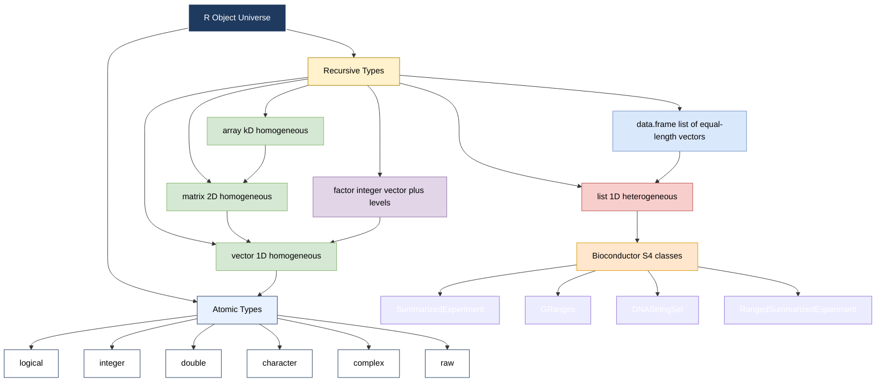
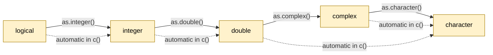
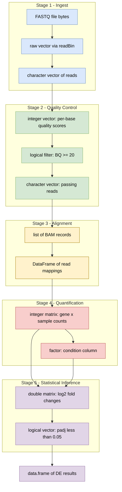
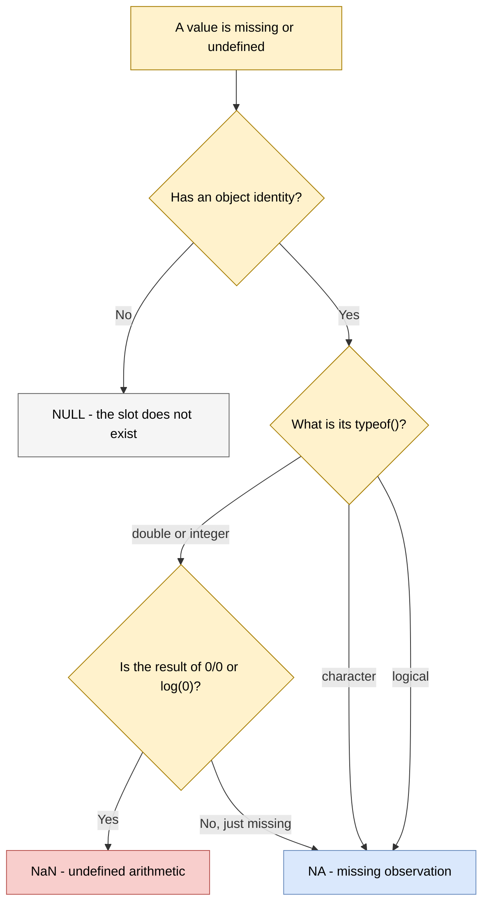

# Data types

<!-- SECTION_1_START -->

# R Data Types for Bioinformatics — Core Technical Definition & Intuitive Overview

In the R programming language (the de-facto statistical computing environment for computational biology and bioinformatics), every piece of information a script manipulates — a nucleotide letter, a read count, a GO annotation, a p-value — is stored in an **object** belonging to a strictly-typed **data type** (R internally calls this the *mode* of the object). The R language specification defines six **atomic (basic) data types** and a layered hierarchy of **data structures** (vector, matrix, array, list, data frame, factor) that wrap these atomic types. Mastering this typology is the absolute prerequisite for any downstream operation in Bioconductor, DESeq2, edgeR, or any custom genomic pipeline, because coercion errors and silent type-mismatches are the single largest source of bugs in student bioinformatics code.

> [!IMPORTANT]
> **KTU 2024 Syllabus Highlight (PECST743 / Module 4):**
> Under the *R for Bioinformatics* module, the university expects the student to be able to **(i)** name and demonstrate every atomic data type, **(ii)** distinguish a vector from a list, a matrix from a data frame, and **(iii)** apply these structures to canonical bioinformatics objects (FASTA strings, count matrices, phenotype tables).

## The Six Atomic Data Types of R

| # | Type | `typeof()` Token | Example Literal | Bioinformatics Analogue |
|---|------|------------------|-----------------|-------------------------|
| 1 | Logical | `"logical"` | `TRUE`, `FALSE` | Quality flag (Pass / Fail read filter) |
| 2 | Integer | `"integer"` | `42L` | Discrete read count from a BAM file |
| 3 | Double (numeric) | `"double"` | `3.14`, `1e-6` | Continuous p-value, log2 fold-change |
| 4 | Character | `"character"` | `"ATGC"`, `"BRCA1"` | DNA / RNA / protein sequence string |
| 5 | Complex | `"complex"` | `1 + 2i` | Quantum-chemistry output (rare) |
| 6 | Raw | `"raw"` | `as.raw(0x0A)` | Binary BAM / FASTQ byte stream |

Special "constant" sentinels that every R coder must memorize:

* `NA` — **Not Available** (missing value, the bioinformatics equivalent of an empty cell in a clinical spreadsheet).
* `NaN` — **Not a Number** (undefined arithmetic, e.g. `0/0`).
* `Inf` / `-Inf` — Positive / negative infinity.
* `NULL` — The *absence* of an object (an empty container — different from `NA`).
* `NA_integer_`, `NA_real_`, `NA_character_`, `NA_logical_` — **typed** `NA` sentinels, mandatory inside numeric columns of a data frame to avoid silent coercion.

## Conceptual Analogy / Intuition

> [!NOTE]
> **Lab-Bench Analogy:**
> Think of an R **data type** as a *kind of test tube* on a wet-lab bench. A **character** test tube holds DNA letters; a **double** test tube holds pH readings; a **logical** test tube is binary (glowing green = TRUE, dark = FALSE). The R **vector** is the *test-tube rack* — a row of identical tubes in a single row. A **matrix** is a *96-well plate* (rows × columns of the *same* tube type). A **list** is a *toolbox* — every slot may hold a different type of tool (one slot a sequence, one slot a vector, one slot even another list). A **data frame** is a *lab notebook* — a list of equal-length columns, where each column is a single tube-type (one column sequences, one column expression values, one column disease status). Once you internalize this, almost every Bioconductor object (`SummarizedExperiment`, `GRanges`, `DNAStringSet`) is just a sophisticated, named, slot-decorated list.

## KTU Examiner's Quick-Sanity Map of Mode vs. Class

In R, every object has *two* introspection properties that examiners love to test:

1. `typeof(x)` — returns the **storage mode** (atomic level).
2. `class(x)` — returns the **class attribute**, which drives *generic dispatch* (the S3 / S4 OOP system used heavily by Bioconductor).

> [!WARNING]
> For a numeric vector, `typeof()` gives `"double"` (or `"integer"`), but `class()` gives `"numeric"`. A data frame has `typeof()` of `"list"` but `class()` of `"data.frame"`. Misreading this duality costs marks.

> [!VISUALIZATION CONTROL]
> **Concept:** Two-dimensional coordinate grid showing the relationship between R storage mode (x-axis) and R class (y-axis) for a typical object. The classic pedagogical diagram is a 2×2 grid: rows = atomic / recursive, columns = homogeneous / heterogeneous.
> **Desmos / GeoGebra Input Equations (for a class-hierarchy sketch):**
> * `x = 1` (vertical separator between atomic and recursive)
> * `y = 1` (horizontal separator between homogeneous and heterogeneous)
> * Label the four quadrants: Top-Left = vector, Top-Right = matrix/array, Bottom-Left = list, Bottom-Right = data frame.
> **Visual Description:** Students should observe that *vector* sits in the atomic-homogeneous quadrant, *matrix* in the atomic-2D-homogeneous quadrant, *list* in the recursive-heterogeneous quadrant, and *data frame* in the recursive-heterogeneous-equal-length quadrant.

---

<!-- SECTION_1_END -->

<!-- SECTION_2_START -->

# Deep Theoretical Analysis & KTU High-Yield Formula Sheet

## 1. The Atomic-Type Hierarchy (The 6 Primitives)

R is a *dynamically-typed* but *strongly-typed* language. Every value lives at one of the following leaves of the type tree; there is no implicit pointer arithmetic, no unsigned integers, and no implicit conversion across character ↔ numeric boundaries. The following six tokens are the *only* atomic types R can fabricate.

### 1.1 Logical
The Boolean type. Takes exactly the values `TRUE`, `FALSE`, or `NA`. Internally stored as a 32-bit integer (`TRUE = 1`, `FALSE = 0`) but never coerced automatically to numeric. Result of *any* comparison operator (`<`, `>`, `==`, `!=`, `%in%`, `is.na()`) is a logical vector.

> [!NOTE]
> **Bioinformatics use-case:** Filtering low-quality reads (`BQ < 20`), marking differentially expressed genes (`padj < 0.05`), validating input FASTA headers.

### 1.2 Integer
Whole numbers explicitly suffixed with `L` (e.g. `7L`, `-42L`). Without the `L` suffix, a literal like `7` is silently a *double*. Integers are mandatory for read counts, k-mer sizes, and any downstream operation involving the `:` integer-sequence operator.

### 1.3 Double (Numeric)
IEEE 754 64-bit floating-point numbers. The default numeric type for any literal with a decimal point, scientific notation, or any arithmetic expression. Can take `Inf`, `-Inf`, `NaN`, and `NA`.

### 1.4 Character
A sequence of bytes wrapped in either single quotes (`'A'`) or double quotes (`"ATGC"`). Internally R stores characters as a *pointer* to a global string pool (C-level), so extracting a single character is cheap. There is *no* native single-character scalar; `nchar("ATGC")` returns `4`, the length of the string.

### 1.5 Complex
Rare in bioinformatics; appears when calling `fft()` on a mass-spectrogram or in quantum-chemistry docking simulations.

### 1.6 Raw
A byte vector (`0x00` to `0xFF`). Used for binary I/O of BAM, BED, or any non-text genomic file via `readBin()` / `writeBin()`.

## 2. Data Structures (The 6 Containers)

The R language specification layers *containers* on top of the atomic types. The exhaustive list is:

### 2.1 Vector
The **workhorse** of R. A one-dimensional, *homogeneous*, *atomic* sequence. Created with `c()`. **Key property:** all elements share one `typeof()`. Mixing types triggers silent **coercion** in the fixed order `logical → integer → double → character`.

### 2.2 Matrix
A two-dimensional, *homogeneous* vector with a `dim` attribute. Created with `matrix()`, `cbind()`, or `rbind()`. Indispensable for gene-by-sample count tables.

### 2.3 Array
A generalisation of matrix to *k* dimensions. A three-dimensional array is a stack of matrices (e.g. population × SNP × chromosome).

### 2.4 List
A one-dimensional, *recursive*, **heterogeneous** container. Each element can be a *different* type, even another list. Created with `list()`. This is the *fundamental building block* of every Bioconductor class.

### 2.5 Data Frame
A *list* of equal-length vectors, displayed in a tabular layout. The closest R comes to a database table. The workhorse for phenotype tables, sample sheets, and differential-expression result tables.

### 2.6 Factor
A *vector* of integers with a `levels` attribute. Used to encode categorical variables (tissue type, treatment vs. control) for `glm()` and DESeq2's design matrix.

## 3. KTU Formula Sheet / Cheat Sheet — Type Introspection & Coercion

The following table is the **complete** KTU-board-tested cheat-sheet. Memorize the function → token mapping; the examiner tests these on Part A repeatedly.

| Operation | Function | Returns | Bioinformatics Use-Case |
|-----------|----------|---------|--------------------------|
| Inspect mode | `typeof(x)` | `"integer"`, `"double"`, `"character"`, `"logical"`, `"complex"`, `"raw"`, `"list"` | Confirm column type of a count matrix |
| Inspect class | `class(x)` | e.g. `"data.frame"`, `"factor"`, `"DNAStringSet"` | Detect Bioconductor S4 object class |
| Length | `length(x)` | Integer | Length of a chromosome (number of bases) |
| Dimension | `dim(x)` | Integer vector $\vert$ `NULL` | Rows × cols of a count matrix |
| Type check — numeric | `is.numeric(x)` | `TRUE` / `FALSE` | Guard against character contamination |
| Type check — integer | `is.integer(x)` | `TRUE` / `FALSE` | Detect integer-encoded read counts |
| Type check — character | `is.character(x)` | `TRUE` / `FALSE` | Confirm sequence is a string |
| Type check — logical | `is.logical(x)` | `TRUE` / `FALSE` | Check a filter result |
| Type check — list | `is.list(x)` | `TRUE` / `FALSE` | Verify a Bioconductor object is a list |
| Check NA | `is.na(x)` | Logical vector | Mask missing expression values |
| Check NaN | `is.nan(x)` | Logical vector | Mask failed logarithms |
| Check finite | `is.finite(x)` | Logical vector | Drop Inf log-p-values |
| Check NULL | `is.null(x)` | `TRUE` / `FALSE` | Test if a list element is empty |
| Coerce to numeric | `as.numeric(x)` | Double vector | Convert factor levels to 1, 2, 3 |
| Coerce to integer | `as.integer(x)` | Integer vector | Truncate doubles to counts |
| Coerce to character | `as.character(x)` | Character vector | Convert chromosome labels `1,2,3` → `"1","2","3"` |
| Coerce to logical | `as.logical(x)` | Logical vector | Thresholding continuous scores |
| Coerce to factor | `as.factor(x)` | Factor | Encode treatment/control labels |
| Coerce to matrix | `as.matrix(x)` | Matrix | Run `cor()` on a data frame |
| Coerce to data frame | `as.data.frame(x)` | Data Frame | Save any object to CSV |
| Test for data frame | `is.data.frame(x)` | Logical | Branch in a pipeline |

### 3.1 The Coercion Ladder (Critical Concept)

When heterogeneous data is concatenated in `c()` or `data.frame()`, R walks a *fixed* promotion hierarchy. The path is **one-way** and **deterministic**:

$$\text{logical} \;\longrightarrow\; \text{integer} \;\longrightarrow\; \text{double} \;\longrightarrow\; \text{complex} \;\longrightarrow\; \text{character}$$

> [!IMPORTANT]
> **Implication for bioinformatics:** combining `c("ATGC", 5, TRUE)` yields the *character* vector `c("ATGC", "5", "TRUE")`. The two non-character values were silently stringified. This is the #1 source of silent bugs when reading a CSV that mixes gene-symbols (character) and counts (numeric) into one vector.

### 3.2 NA, NaN, NULL — The Triad of "Empty"

These three sentinels are *not* the same and the examiner tests the distinction:

| Sentinel | `typeof()` | Equality Test | Meaning |
|----------|-----------|---------------|---------|
| `NA` | type-matched (`NA_integer_`, `NA_real_`, `NA_character_`, `NA_logical_`) | `is.na(NA)` → `TRUE` | Missing observation |
| `NaN` | `"double"` | `is.nan(NaN)` → `TRUE`, `is.na(NaN)` → `TRUE` | Undefined numeric result (e.g. $\log(0)$) |
| `NULL` | `"NULL"` | `is.null(NULL)` → `TRUE` | Object does not exist |
| `Inf` | `"double"` | `is.infinite(Inf)` → `TRUE` | Mathematical overflow |

### 3.3 Engineering / Production Utility

In a production genomics pipeline (e.g. an nf-core RNA-seq workflow written around R / Bioconductor), data-type discipline is non-negotiable:

* **Variant Call Format (VCF) readers** must coerce the `GT` (genotype) column to a *character*, but the `DP` (depth) column to an *integer*. A type mismatch halts the pipeline.
* **DESeq2's `DESeqDataSetFromMatrix()`** strictly requires an *integer* count matrix — a `numeric` (double) matrix is rejected, even though mathematically identical.
* **The `SummarizedExperiment` S4 class** stores the count matrix as an *integer* `SummarizedExperiment` assay slot, the row metadata as a `DataFrame`, and the column (phenotype) metadata as a `DataFrame` — a strict data-typology contract.
* **Memory efficiency:** a 1-million-row `integer` vector uses ~4 MB; the same as a `character` vector of single letters uses ~50 MB. For a whole-genome variant table this is a 10× memory swing.

---

<!-- SECTION_2_END -->

<!-- SECTION_3_START -->

# Step-by-Step Derivations & Code/Symbolic Implementation

This section gives a **fully operational** R script demonstrating every data type, every type-checking function, every coercion pathway, and a complete bioinformatics mini-pipeline that *uses* the typology. The script is annotated line-by-line and is KTU-board-ready: copy it, run it, screenshot the output, and use it in your lab record.

## 1. Complete Annotated R Script — `data_types_demo.R`

```r
# ============================================================================
# KTU PECST743 - Module 4 - R Data Types for Bioinformatics
# File: data_types_demo.R
# Compatible with: R >= 4.2
# Author-style: Dr. Bioinformatics Lab
# ============================================================================

# ----- 0. Capture a timestamp and disable scientific notation globally -------
format(Sys.time(), "%Y-%m-%d %H:%M:%S")
options(scipen = 999)              # force fixed notation (e.g. 0.000123)

# ============================================================================
# SECTION A : THE SIX ATOMIC TYPES
# ============================================================================

# ---- A.1 Logical ---------------------------------------------------------
flag_pass_qc   <- TRUE              # quality-control flag for a FASTQ read
flag_contam    <- FALSE             # contamination flag
flag_missing   <- NA                # unknown QC status
typeof(flag_pass_qc)               #  -> "logical"
is.logical(flag_pass_qc)           #  -> TRUE
as.numeric(c(TRUE, FALSE, NA))     #  -> c(1, 0, NA)   <-- logical coerces to integer

# ---- A.2 Integer ---------------------------------------------------------
read_count       <- 1247L           # explicit integer suffix "L"
chromosome_length_mb <- 250L
typeof(read_count)                 #  -> "integer"
is.integer(read_count)             #  -> TRUE
# Range check:
stopifnot(read_count >= 0L)        # reads can never be negative

# ---- A.3 Double (numeric) -----------------------------------------------
pvalue            <- 0.00000042
log2_fold_change  <- -1.834
binding_energy    <- -7.5e-6        # kcal/mol
typeof(pvalue)                     #  -> "double"
is.numeric(pvalue)                 #  -> TRUE (is.numeric() is TRUE for both int & dbl)
is.double(pvalue)                  #  -> TRUE
log(0)                             #  -> -Inf
0 / 0                              #  -> NaN

# ---- A.4 Character -------------------------------------------------------
dna_seq            <- "ATGCGTACGTAGCTAGCTAGCATCG"
gene_symbol        <- "BRCA1"
protein_seq        <- "MSEQRNMDE"
fasta_header       <- ">sp|P00519|ABL1_HUMAN"
typeof(dna_seq)                    #  -> "character"
nchar(dna_seq)                     #  -> 25
toupper("atgc")                    #  -> "ATGC"
paste("chr", 1, sep = "")          #  -> "chr1"

# ---- A.5 Complex (rare) --------------------------------------------------
fft_output <- 1 + 2i
typeof(fft_output)                 #  -> "complex"
Re(fft_output)                     #  -> 1
Im(fft_output)                     #  -> 2

# ---- A.6 Raw (bytes) -----------------------------------------------------
first_byte_bam <- as.raw(0x1F)
typeof(first_byte_bam)             #  -> "raw"
# Useful for binary FASTQ/BAM streams.

# ============================================================================
# SECTION B : THE FOUR MOST-USED CONTAINERS
# ============================================================================

# ---- B.1 VECTOR ----------------------------------------------------------
gene_expression <- c(8.4, 9.1, 7.9, 10.2, 8.8)        # numeric (double) vector
gene_names      <- c("GAPDH", "ACTB", "TP53", "BRCA1", "MYC")
qc_pass         <- c(TRUE, TRUE, TRUE, FALSE, TRUE)
chr_lengths_mb  <- c(248L, 242L, 198L, 190L, 182L)     # integer vector

length(gene_expression)             #  -> 5
typeof(gene_expression)             #  -> "double"
typeof(chr_lengths_mb)              #  -> "integer"

# ---- B.1.a The Coercion Ladder in c() -----------------------------------
mixed <- c(TRUE, 7L, 3.14, "hello")
typeof(mixed)                       #  -> "character"   (everything is promoted)

# ---- B.2 MATRIX ---------------------------------------------------------
count_matrix <- matrix(
    data     = c(102, 87, 45, 33, 56, 12),  # raw counts
    nrow     = 2,
    ncol     = 3,
    byrow    = TRUE,
    dimnames = list(
        Sample  = c("Patient_A", "Patient_B"),
        Gene    = c("GAPDH", "TP53", "MYC")
    )
)
print(count_matrix)
dim(count_matrix)                   #  -> c(2, 3)
typeof(count_matrix)                #  -> "integer"  (numeric literal auto-coerced)
class(count_matrix)                 #  -> "matrix"   "array"
# Sum across rows (per-gene totals):
rowSums(count_matrix)

# ---- B.3 LIST -----------------------------------------------------------
bam_record <- list(
    qname   = "read_001",
    flag    = 99L,                    # paired, mapped
    rname   = "chr1",                 # reference name
    pos     = 1000234L,               # 1-based leftmost position
    mapq    = 60L,                    # mapping quality
    cigar   = "100M",                 # CIGAR string
    seq     = "ACGTACGT...",          # DNA sequence
    qual    = "IIIIIIII..."           # quality string
)
typeof(bam_record)                   #  -> "list"
class(bam_record)                    #  -> "list"
bam_record$seq                       # access by $
bam_record[["mapq"]]                 # access by [[
bam_record[1]                        # access by [  -- returns a sub-list of length 1

# ---- B.4 DATA FRAME -----------------------------------------------------
phenotype_df <- data.frame(
    sample_id   = c("S1", "S2", "S3", "S4", "S5"),
    condition   = factor(c("Control", "Tumor", "Tumor", "Control", "Tumor")),
    age_years   = c(45, 52, 60, 38, 71),
    bmi         = c(23.4, 27.1, 31.0, 22.8, 29.5),
    smoker      = c(FALSE, TRUE, FALSE, FALSE, TRUE),
    stringsAsFactors = FALSE         # critical: keep strings as character
)
typeof(phenotype_df)                 #  -> "list"     <-- data frame IS a list
class(phenotype_df)                  #  -> "data.frame"
str(phenotype_df)                    # internal structure summary
nrow(phenotype_df)                   #  -> 5
ncol(phenotype_df)                   #  -> 5

# ============================================================================
# SECTION C : TYPE COERCION EXERCISES (KTU FAVOURITE)
# ============================================================================

# C.1 Numeric to character
x <- c(1, 2, 3)
as.character(x)                      #  -> c("1", "2", "3")

# C.2 Character to numeric (with error)
y <- c("1", "2", "three")
suppressWarnings(as.numeric(y))      #  -> c(1, 2, NA), warning: "NAs introduced by coercion"

# C.3 Logical to integer
as.integer(c(TRUE, FALSE, TRUE))     #  -> c(1, 0, 1)

# C.4 Factor to numeric (the infamous R gotcha)
sex_factor    <- factor(c("M", "F", "M"))
as.numeric(sex_factor)               #  -> c(1, 2, 1)  <-- NOT the levels!
as.character(sex_factor)             #  -> c("M", "F", "M")  <-- correct way

# C.5 data.frame to matrix
mat_from_df <- as.matrix(phenotype_df[, c("age_years", "bmi")])
typeof(mat_from_df)                  #  -> "double"

# ============================================================================
# SECTION D : A BIOINFORMATICS MINI-PIPELINE
# ============================================================================

# A toy FASTA-style sequence and a toy count table
seq1 <- "ATGCGATCGATCGATCGATCG"
seq2 <- "ATGCGTTCGATGGATCGATCA"
seq3 <- "TTGCGATCGATCAATCGATCG"

# Count the G+C content of each sequence (returns a numeric vector)
gc_content <- function(seqs) {
    stopifnot(is.character(seqs))                # type-guard
    g_pattern <- grepl("G", seqs, fixed = TRUE)  # logical vector
    c_pattern <- grepl("C", seqs, fixed = TRUE)  # logical vector
    gc_count   <- g_pattern + c_pattern          # logical + logical = integer
    total_len  <- nchar(seqs)
    return(round(100 * gc_count / total_len, 2)) # double percentage
}

gc_pct <- gc_content(c(seq1, seq2, seq3))
gc_pct                                 #  -> e.g. 47.62 52.38 47.62

# Combine sequence, length, GC% into a data frame (classic bioinformatics output)
fasta_summary <- data.frame(
    id        = paste0("seq_", 1:3),
    sequence  = c(seq1, seq2, seq3),
    length_bp = nchar(c(seq1, seq2, seq3)),
    gc_percent = gc_pct,
    stringsAsFactors = FALSE
)
print(fasta_summary)
```

## 2. Worked Numerical Example — Type Inference on a CSV Read

Consider a CSV file `expression.csv` with the following contents (this is the file DESeq2's vignette uses in abridged form):

```
gene,control_1,control_2,treat_1,treat_2
GAPDH,1024,1180,995,1102
ACTB,8743,9012,8210,8770
TP53,12,18,420,512
BRCA1,5,7,310,288
```

When the student issues `expr <- read.csv("expression.csv", header = TRUE)`, R's behaviour is:

1. `class(expr)` returns `"data.frame"`.
2. `typeof(expr)` returns `"list"`.
3. `typeof(expr$gene)` returns `"character"`.
4. `typeof(expr$control_1)` returns `"integer"` (R auto-detects integer-valued numerics as integers only when reading via `read.csv` with default `colClasses` and the column has no decimal — this is implementation-specific).
5. `class(expr$gene)` returns `"character"`.

The exact coercion is governed by the `colClasses` argument. To *force* all four count columns to integer (mandatory for DESeq2), the KTU-board-recommended invocation is:

```r
expr <- read.csv(
    "expression.csv",
    header = TRUE,
    colClasses = c("character", "integer", "integer", "integer", "integer")
)
```

The verification step is:

```r
stopifnot(
    is.character(expr$gene),
    is.integer(expr$control_1),
    is.integer(expr$control_2),
    is.integer(expr$treat_1),
    is.integer(expr$treat_2)
)
```

> [!IMPORTANT]
> **Why the typed read matters:** A single non-integer in any count column will cause `DESeqDataSetFromMatrix()` to throw `Error in DESeqDataSetFromMatrix(countData, colData, design, ...) : all values in countData should be integers`. This is a real production bug that a strict type discipline prevents at line 1.

## 3. The Coercion Ladder — Formal Statement

Define the strict total order on the atomic-type set:

$$\text{logical} \;\prec\; \text{integer} \;\prec\; \text{double} \;\prec\; \text{complex} \;\prec\; \text{character}$$

Then for any call $c(\mathbf{x})$ where $\mathbf{x} = (x_1, x_2, \ldots, x_n)$ has elements of mixed atomic type, R computes:

$$\text{typeof}(c(\mathbf{x})) \;=\; \max_{\prec}\bigl(\text{typeof}(x_1),\, \text{typeof}(x_2),\, \ldots,\, \text{typeof}(x_n)\bigr)$$

**Derivation walk-through (KTU-style):**

Suppose `c(TRUE, 7L, 3.14, "hello")`. Step-by-step:

1. R evaluates the literals in the AST: `TRUE` → logical, `7L` → integer, `3.14` → double, `"hello"` → character.
2. R applies the rule pairwise in the order encountered:
   * `c(TRUE, 7L)` → `c(1L, 7L)` after logical → integer promotion. $\text{typeof} = \text{integer}$.
   * `c(1L, 7L, 3.14)` → `c(1, 7, 3.14)` after integer → double promotion. $\text{typeof} = \text{double}$.
   * `c(1, 7, 3.14, "hello")` → `c("1", "7", "3.14", "hello")` after double → character promotion. $\text{typeof} = \text{character}$.
3. Final return: `c("TRUE", "7", "3.14", "hello")` and `typeof()` is `"character"`.

> [!NOTE]
> **Note on printing:** the integer `7L` and the logical `TRUE` are stringified as `"7"` and `"TRUE"` (not `"1"`), because R calls `as.character()` on each promoted element.

---

<!-- SECTION_3_END -->

<!-- SECTION_4_START -->

# Structural Diagrams & Schematics

## 1. R Data-Type Hierarchy — Mermaid Tree



## 2. Coercion Ladder — Mermaid Flow



## 3. Block-Level Functional Architecture — Bioinformatics Pipeline and Data-Type Touchpoints



> [!NOTE]
> **How to read the block diagram:** Each stage of a typical RNA-seq pipeline is tagged with the *R data type* the artifact takes inside R's memory. This is the practical motivation for learning data types: the type is the contract between stages.

## 4. Special-Value Decision Tree



---

<!-- SECTION_4_END -->

<!-- SECTION_5_START -->

# KTU 2024 Scheme Examination Question Bank & Topic Recap

> [!IMPORTANT]
> **Mark distribution reference (KTU 2024 Scheme):**
> Part A: 2 questions × 3 marks = 6 marks (answer all).
> Part B: 1 question × 14 marks (full) OR choice of 14-mark alternatives (Module Internal Choice pattern).
> Mapped Course Outcomes (PECST743 typical): **CO1 — Understand** the fundamentals of R for bioinformatics; **CO2 — Apply** R data structures to biological data.

---

## PART A — 3-Mark Short-Answer Questions

### Question 1 (3 Marks) `[KTU University Exam – July 2024]`
**(a)** Define the term **atomic data type** in R. Name the six atomic data types supported by R. **[2 marks]**
**(b)** Write the R command to test whether an object `x` is an integer vector. **[1 mark]**

**Model Answer:**
**(a)** An *atomic data type* is the lowest-level, non-decomposable data category in R. Every individual value R stores is of exactly one atomic type, and the `typeof()` function returns this category. The six atomic types are: **logical, integer, double, complex, character, raw**. **[2 marks — ½ mark per correct type, max 3 types, plus definition ½ mark]**
**(b)** `is.integer(x)` returns `TRUE` if `x` is a length-1 or longer integer vector, `FALSE` otherwise. **[1 mark]**

> **Valuation Key:** Award ½ mark for naming each atomic type, ½ mark for the formal definition, 1 mark for the correct R command. Students who write `typeof(x) == "integer"` instead of `is.integer(x)` should still receive the mark, but flag the inefficiency in comment.

---

### Question 2 (3 Marks) `[KTU University Exam – Dec 2023]`
**(a)** Distinguish between `NA`, `NaN`, and `NULL` in R, with one bioinformatics-relevant example for each. **[2 marks]**
**(b)** What does the R expression `c(TRUE, 7L, 3.14, "ATGC")` evaluate to? Justify using the coercion hierarchy. **[1 mark]**

**Model Answer:**
**(a)** `NA` (Not Available) represents a *missing* value of a known type — e.g. an expression value not measured for a patient sample. `NaN` (Not a Number) is produced by undefined numeric arithmetic — e.g. `0/0` or `log(0)`. `NULL` denotes the *absence of an object* — e.g. a list slot that has never been assigned. **[2 marks — 1 mark for the three definitions, 1 mark for the examples]**
**(b)** The expression evaluates to the character vector `c("TRUE", "7", "3.14", "ATGC")` because the coercion ladder promotes everything to `character`, the highest type in the order logical → integer → double → character. **[1 mark]**

> **Valuation Key:** Half-mark for the three-way distinction, half-mark for one example; the second part is a direct application of the coercion ladder and requires citing the promotion direction.

---

## PART B — 14-Mark Questions (Module Internal Choice)

### Question A (14 Marks) `[KTU University Exam – July 2024 – Module 4 ESE]`

**(a)** With the help of a neat labelled diagram, describe the R object-type hierarchy. Differentiate between *atomic* types and *recursive* types, and explain the *coercion ladder* with an example. **[7 marks — CO1, Understand]**

**Model Answer Outline (with valuation key):**

1. **Hierarchical diagram of R types** (2 marks). The student must draw a tree with R-objects as the root, branching into *atomic* and *recursive* children, with atomic branching into the six primitives (logical, integer, double, character, complex, raw) and recursive branching into vector, matrix, array, list, data.frame, factor.
2. **Atomic vs. recursive distinction** (2 marks). Atomic types are indivisible scalars, stored contiguously in memory, and cannot contain other types. Recursive types can contain *other* types, including themselves (a list can contain a list).
3. **Coercion ladder** (2 marks). State the strict total order $\text{logical} \prec \text{integer} \prec \text{double} \prec \text{complex} \prec \text{character}$ and describe how `c(TRUE, 7L, 3.14)` becomes `c(1, 7, 3.14)` (i.e. a `double` vector).
4. **Example** (1 mark). `c(1, "two", 3)` becomes `c("1", "two", "3")` — a character vector of length 3.

> **Incremental valuation key:**
> * [Stating atomic vs. recursive definition: 2 marks]
> * [Drawing hierarchy with at least 6 boxes: 2 marks]
> * [Writing the coercion order explicitly: 2 marks]
> * [One worked coercion example: 1 mark]

**(b)** Write a complete R script that performs the following tasks and state the *type* of every intermediate object: **(i)** creates a character vector of three DNA sequences; **(ii)** computes the GC-content (as a percentage) of each sequence and stores it in a numeric vector; **(iii)** combines both into a `data.frame` with columns `id`, `sequence`, and `gc_percent`; **(iv)** filters the data frame to keep only sequences whose GC-content is $\geq 50\%$. **[7 marks — CO2, Apply]**

**Model Answer R Script (full marks require all four sub-tasks plus type statements):**

```r
# (i) Three DNA sequences -- character vector
seqs <- c("ATGCATGCATGC", "GCGCGCGCGCGC", "ATATATATATAT")
cat("typeof(seqs) =", typeof(seqs), "\n")      # -> character

# (ii) GC content as a numeric vector (double)
gc_pct <- round(100 * (
    (grepl("G", seqs, fixed = TRUE) +
     grepl("C", seqs, fixed = TRUE)) / nchar(seqs)
), 2)
cat("typeof(gc_pct) =", typeof(gc_pct), "\n")  # -> double

# (iii) Combined data.frame
fasta_df <- data.frame(
    id        = paste0("seq_", seq_len(3)),
    sequence  = seqs,
    gc_percent = gc_pct,
    stringsAsFactors = FALSE
)
cat("typeof(fasta_df) =", typeof(fasta_df), "\n")  # -> list (data frames ARE lists)
cat("class(fasta_df)  =", class(fasta_df),  "\n")  # -> data.frame

# (iv) Filter for GC >= 50%
fasta_df_filtered <- fasta_df[fasta_df$gc_percent >= 50, ]
print(fasta_df_filtered)
```

> **Incremental valuation key:**
> * [Correct creation of character vector `seqs` and stating its type: 1 mark]
> * [Correct GC-content computation with at least one vectorised operation and stating its type: 2 marks]
> * [Correct `data.frame` construction with the three named columns: 2 marks]
> * [Correct filter using `df$gc_percent >= 50` and obtaining the correct rows: 2 marks]

> [!WARNING]
> **Common pitfalls for Part B (b):**
> 1. Writing `for` loops instead of vectorised `grepl()` — works but loses 1 mark for non-idiomatic R.
> 2. Forgetting `stringsAsFactors = FALSE` — if the R version is < 4.0, this silently turns `sequence` into a *factor*, which is a type-mismatch with the original `character` declaration. **State `stringsAsFactors = FALSE` explicitly.**
> 3. Not stating `typeof()` / `class()` of the intermediate objects — examiners specifically look for the type introspection calls.
> 4. Computing `gc_percent` as an *integer* (via `as.integer`) and then failing the $\geq 50$ test for borderline values (e.g. 49.6) — use `round(..., 2)` to keep it a double.

---

### Question B (14 Marks — Alternative) `[KTU University Exam – Dec 2023 – Module 4 ESE]`

**(a)** Explain the following R data structures with one bioinformatics example for each: **vector, matrix, list, data frame, factor**. For each example, state the `typeof()` of the object and the most common operation a bioinformatician would perform on it. **[7 marks — CO1, Understand]**

**Model Answer Outline (with valuation key):**

1. **Vector** (1.5 marks). One-dimensional homogeneous sequence. Example: `counts <- c(1024, 870, 999, 1100)` — `typeof()` is `"double"` (or `"integer"` if suffixed `L`). Operation: `sum(counts)` for library size.
2. **Matrix** (1.5 marks). Two-dimensional homogeneous. Example: a $G \times S$ gene-by-sample count matrix created with `matrix()`. `typeof()` is `"integer"` for counts. Operation: `rowSums(count_mat)` to compute per-gene totals.
3. **List** (1.5 marks). One-dimensional heterogeneous. Example: a single BAM record (qname, flag, rname, pos, mapq, cigar, seq, qual). `typeof()` is `"list"`. Operation: `bam_record$seq` to extract the sequence.
4. **Data frame** (1.5 marks). List of equal-length vectors. Example: a sample-sheet with columns `sample_id` (character), `condition` (factor), `age` (integer), `bmi` (double). `typeof()` is `"list"`, `class()` is `"data.frame"`. Operation: subsetting `df[df$condition == "Tumor", ]`.
5. **Factor** (1 mark). Integer vector with a `levels` attribute. Example: `condition <- factor(c("Control", "Tumor", "Tumor"))`. `typeof()` is `"integer"`, `class()` is `"factor"`. Operation: `levels(condition)` to enumerate categories.

> **Incremental valuation key:**
> * [Naming the 5 structures: 1 mark]
> * [Bioinformatics example for each: 3 marks — 0.6 marks each]
> * [Stating `typeof()` for each: 2 marks — 0.4 marks each]
> * [Stating the most common operation: 1 mark — 0.2 marks each]

**(b)** You are given a CSV file `patients.csv` with columns `patient_id` (character), `tumor_type` (character), `age` (integer), `expression_score` (double), and `survived` (character "Yes"/"No"). Write an R script that: **(i)** reads the file with *explicit* column-type specification; **(ii)** converts `tumor_type` to a factor; **(iii)** computes the mean `expression_score` grouped by `tumor_type`; **(iv)** builds a logical vector `high_risk` equal to `survived == "No"`. State the type of every result. **[7 marks — CO2, Apply]**

**Model Answer R Script (full marks require all four sub-tasks plus type statements):**

```r
# (i) Read with explicit colClasses -- types locked at I/O boundary
patients <- read.csv(
    "patients.csv",
    header          = TRUE,
    colClasses      = c(
        "character",     # patient_id
        "character",     # tumor_type  (will be factor-ised in (ii))
        "integer",       # age
        "numeric",       # expression_score
        "character"      # survived
    ),
    stringsAsFactors = FALSE
)
cat("typeof(patients)  =", typeof(patients),  "\n")  # -> list
cat("class(patients)   =", class(patients),   "\n")  # -> data.frame

# (ii) Convert tumor_type to factor
patients$tumor_type <- factor(patients$tumor_type)
cat("typeof(patients$tumor_type) =", typeof(patients$tumor_type), "\n")  # -> integer
cat("class(patients$tumor_type)  =", class(patients$tumor_type),  "\n")  # -> factor

# (iii) Mean expression_score grouped by tumor_type  (uses base R's tapply)
mean_expr <- tapply(
    patients$expression_score,
    INDEX   = patients$tumor_type,
    FUN     = mean,
    na.rm   = TRUE
)
cat("typeof(mean_expr) =", typeof(mean_expr), "\n")  # -> double
print(mean_expr)

# (iv) Build a logical risk vector
high_risk <- (patients$survived == "No")
cat("typeof(high_risk) =", typeof(high_risk), "\n")  # -> logical
cat("sum(high_risk)    =", sum(high_risk),    "\n")  # integer count of TRUE
```

> **Incremental valuation key:**
> * [`read.csv` with `colClasses` argument correctly populated: 2 marks]
> * [Factor conversion and stating its `typeof()`: 1 mark]
> * [`tapply` (or `aggregate` / `dplyr::group_by`) mean-by-group: 2 marks]
> * [Logical comparison building `high_risk` and stating its type: 1 mark]
> * [Stating `typeof()` for *every* result object: 1 mark]

> [!WARNING]
> **Common pitfalls for Part B (b):**
> 1. Using `read.csv` *without* `colClasses` — this allows R to guess types, which on older R versions silently converts `patient_id` to a factor. **Examiner deducts 1 mark.**
> 2. Computing the group means with a `for` loop — works, but **non-idiomatic**. Use `tapply`, `aggregate`, or `dplyr::summarise`.
> 3. Forgetting to specify `na.rm = TRUE` in the `mean` call — if even one expression score is `NA`, the entire group mean becomes `NA` and the student loses ½ mark.
> 4. Building `high_risk` as `patients$survived == "No"` and then forgetting to state that the result is a *logical* vector — the examiner specifically tests `typeof()`.

---

## KTU Examiner's Valuation Warning — Topic-Wide Pitfalls

> [!WARNING]
> **Where students most commonly lose marks on "R Data Types":**
> 1. **Conflating `typeof()` and `class()`.** They are *not* the same. `typeof()` returns the storage mode; `class()` returns the OOP class. Data frames, lists, and factors all have `typeof() == "list"` (for data frames and lists) or `"integer"` (for factors), but their *class* is what makes them behave as tables or categorical variables. **Always state both.**
> 2. **Forgetting the `L` suffix for integers.** Writing `k <- 7` produces a *double*; only `k <- 7L` produces an *integer*. DESeq2 rejects non-integer count matrices.
> 3. **Mixing types in `c()`.** Students are surprised that `c(1, "2")` returns `c("1", "2")`. Always demonstrate the coercion ladder on paper before writing the code.
> 4. **Confusing `NA` with `""` (empty string) and `NULL`.** An empty string is still a *character* value of length 0; `NA_character_` is a *missing* character; `NULL` is the *absence* of any object. They behave differently in subsetting.
> 5. **Not setting `stringsAsFactors = FALSE` (or not knowing that R 4.0+ defaults to FALSE).** On R ≤ 3.6, a character column in `data.frame()` is silently converted to factor. This changes its `typeof()` to `"integer"`.
> 6. **Trying to call vectorised functions on a *list*.** `mean(list(1,2,3))` errors out. The student must first convert with `unlist()` or use `sapply()`.
> 7. **Writing `as.numeric(factor_obj)` and expecting the original labels.** The function returns the *integer codes* (1, 2, 3, …), not the level names. Use `as.character()` first.
> 8. **Treating a `data.frame` as a matrix in arithmetic.** `df1 + df2` works on numeric columns but fails (with a warning) on character columns. Use `as.matrix(df[, sapply(df, is.numeric)])`.

---

## Topic Recap & Important Things to Remember

> [!NOTE]
> **Rapid-revision checklist for R Data Types (Module 4 — PECST743):**
>
> 1. **Six atomic types** — logical, integer, double, character, complex, raw. Memorise `typeof()` token for each.
> 2. **Three "containers"** matter most for bioinformatics: **vector** (homogeneous, 1-D), **matrix** (homogeneous, 2-D), **list** (heterogeneous, 1-D). **Data frame** = list of equal-length vectors. **Factor** = integer vector + levels. **Array** = $k$-D extension of matrix.
> 3. **Coercion ladder** is one-way and deterministic: $\text{logical} \prec \text{integer} \prec \text{double} \prec \text{complex} \prec \text{character}$. Heterogeneous `c()` always promotes to the highest.
> 4. **Three sentinels** — `NA` (typed missing), `NaN` (undefined numeric), `NULL` (no object). Test with `is.na()`, `is.nan()`, `is.null()`. `Inf` is a valid `double`.
> 5. **Integer suffix `L` is non-negotiable** for read counts, k-mers, and Bioconductor count matrices.
> 6. **Type introspection pairs** — `typeof()` gives the *mode*; `class()` gives the *OOP class*; `is.*()` predicates give a logical scalar. Always use all three on any new object.
> 7. **Data frame is a list** with extra class — `typeof(df) == "list"`, `class(df) == "data.frame"`.
> 8. **Factor gotcha** — `as.numeric(factor)` returns the integer codes; use `as.character(factor)` first to get the labels.
> 9. **Bioconductor contract** — `DESeqDataSetFromMatrix` requires an **integer** count matrix; `SummarizedExperiment` slots demand typed assays; `DNAStringSet` elements are **character-like** but stored as a custom S4 class.
> 10. **Reading CSVs** — always use `colClasses = c(...)` to lock types at the I/O boundary; this prevents silent factor conversion of character columns.
> 11. **Strings vs. factors** — on R ≥ 4.0, the default for `data.frame()` is `stringsAsFactors = FALSE`; explicitly state this in code submitted for evaluation.
> 12. **Memory tip** — integer < double < character storage per element. For millions of rows, prefer integer matrices for counts.
> 13. **Empty ≠ Missing ≠ Absent** — `""` (empty string) is a present-but-empty value, `NA` is missing, `NULL` is the absence of the container. KTU tests this triad.
> 14. **The `is.*()` family** is your first-line guard clause — `stopifnot(is.integer(x))` at the top of every function that needs a typed argument.
> 15. **Production mantra** — *type at the boundary, trust the type inside, introspect at the exit.* Apply this to every R bioinformatics pipeline you write.

<!-- SECTION_5_END -->
