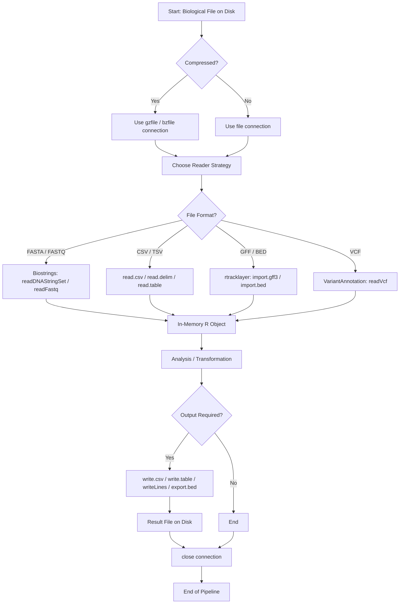
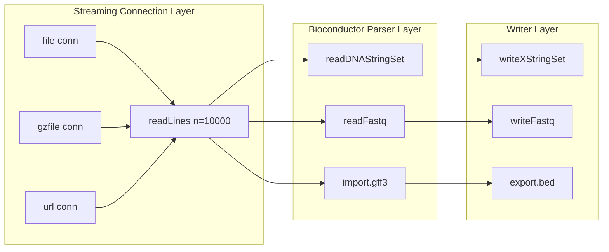

# File handling

<!-- SECTION_1_START -->
# File Handling in R for Bioinformatics — Core Definition & Intuitive Overview

> [!IMPORTANT]
> **KTU 2024 Scheme — Module 4 Definition**
> *File handling in R for bioinformatics* refers to the systematic use of R's **Input/Output (I/O) primitives, connection interfaces, and Bioconductor-based parsers** to read, parse, transform, and write biological data stored in standardized formats such as **FASTA, FASTQ, GenBank, GFF/GTF, BED, VCF, and CSV/TSV**. It is the foundational layer of every bioinformatics pipeline built in R, because raw biological data almost always resides in flat-text files on disk.

## Intuitive Analogy — The "Laboratory Notebook" Model

Imagine a molecular biologist walking into a sequencing facility:

1. The **sequencer** is a machine that produces a huge text file (just like a printer produces paper).
2. The **R console** is the workbench where the scientist opens the file, reads it carefully line by line, performs experiments, and stores the conclusions.
3. The **connection** (`con`) is the *open notebook* — it knows which file is currently being read, and R will complain if you try to close the lab without closing the notebook first.
4. **Reading line by line** (`readLines`) is like *scanning a page*; **reading everything at once** (`read.table`) is like *photocopying the whole notebook*.
5. **Writing back** (`write.table`, `writeLines`) is like *drafting the final report* on fresh sheets.

> [!NOTE]
> In bioinformatics, you rarely read a file "all at once" because genomic files can exceed **several gigabytes** (e.g., a whole human genome FASTQ is often **> 50 GB**). Hence the connection-based, streaming approach is the *industry standard*.

## Standard Biological File Formats You Must Recognize

| Format | Extension | Content | Typical Use |
| :--- | :--- | :--- | :--- |
| **FASTA** | `.fasta`, `.fa`, `.fna` | Raw nucleotide / protein sequences | Reference genomes, gene sequences |
| **FASTQ** | `.fastq`, `.fq` | Sequences + Phred quality scores | NGS raw reads |
| **GenBank** | `.gb`, `.gbk` | Annotated sequences with features | Curated reference records |
| **EMBL** | `.embl` | Annotated sequences (EBI format) | European Nucleotide Archive |
| **GFF / GTF** | `.gff`, `.gff3`, `.gtf` | Genomic features (genes, exons, CDS) | Genome annotation |
| **BED** | `.bed` | Tabular genomic regions | ChIP-seq, peak calling |
| **VCF** | `.vcf` | Genetic variants (SNPs, indels) | Population genomics |
| **CSV / TSV** | `.csv`, `.tsv`, `.txt` | Generic tabular data | Expression matrices, metadata |

> [!IMPORTANT]
> The **Phred quality score offset** for modern Illumina data is **ASCII 33** (Sanger encoding). A quality character `@` therefore represents a base-call accuracy of approximately $Q = \text{ord}({@}) - 33 = 64 - 33 = 31$, i.e., **$\approx 99.92\%$ accuracy**.

## Visualization Control Block

> [!VISUALIZATION CONTROL]
> **Concept:** Sequence index along a FASTA record (file content as a discrete linear sequence).
> **Desmos Input Equations:**
> * $x = 1, 2, 3, \ldots, 60$   (sequence positions on the x-axis)
> * $y = \text{encoded nucleotide at } x$   (with $A=1, C=2, G=3, T=4$ mapped on the y-axis)
> **Visual Description:** A scatter of coloured points rising and falling between $y=1$ and $y=4$, representing how a file is conceptually a *one-dimensional ordered stream* of characters that R processes either line-by-line or as a whole.

<!-- SECTION_1_END -->

<!-- SECTION_2_START -->
# Deep Theoretical Analysis & KTU High-Yield Formula Sheet

## 2.1 The R I/O Architecture — Three Layers

R's file handling is built on **three conceptual layers**:

1. **Connection Layer** — opens, queries, and closes file handles (`file()`, `gzfile()`, `url()`, `pipe()`).
2. **Reader/Writer Layer** — high-level functions that take a file path (or connection) and return an R object (`read.table`, `write.csv`).
3. **Bioconductor Layer** — domain-aware parsers that return biologically meaningful objects such as `DNAStringSet`, `GRanges`, or `VCF` (`Biostrings`, `rtracklayer`, `VariantAnnotation`).

## 2.2 Core Generic R Functions

| Function | Direction | Purpose | Key Arguments |
| :--- | :--- | :--- | :--- |
| `read.table()` | Read | Generic whitespace-separated table | `file`, `header`, `sep`, `dec`, `quote`, `na.strings` |
| `read.csv()` | Read | Comma-separated values (default `header=TRUE`) | `file`, `sep=","`, `row.names` |
| `read.csv2()` | Read | Semicolon-separated (European locales) | `sep=";"`, `dec=","` |
| `read.delim()` | Read | Tab-separated values | `sep="\t"` |
| `readLines(con, n)` | Read | Reads $n$ lines as a character vector | `con`, `n=-1` (all), `encoding` |
| `scan()` | Read | Token-level reading into a vector/list | `file`, `what`, `sep`, `nlines` |
| `write.table()` | Write | Generic writer | `x`, `file`, `sep`, `row.names`, `quote` |
| `write.csv()` | Write | CSV writer | `x`, `file`, `row.names=FALSE` |
| `writeLines()` | Write | Writes a character vector line by line | `text`, `con`, `sep` |
| `cat(...)` | Write | Concatenates and writes to file/console | `file`, `append`, `sep` |
| `file()` | Open | Returns a connection object | `description`, `open="r"` |
| `gzfile()` / `bzfile()` / `xzfile()` | Open | Compressed file connections | `description`, `open` |
| `readRDS()` / `saveRDS()` | R/W | Native R serialized binary | `file`, `compress` |
| `readBin()` / `writeBin()` | R/W | Low-level binary streams | `what`, `n`, `size` |

> [!NOTE]
> The `open` argument in `file()` accepts the codes:
> * `"r"` — read text
> * `"w"` — write text (truncates)
> * `"a"` — append text
> * `"rb"`, `"wb"`, `"ab"` — binary equivalents
> * `"r+"`, `"w+"`, `"a+"` — read + write variants

## 2.3 Bioconductor Functions for Biological File Formats

| Function | Package | Returns | Input File |
| :--- | :--- | :--- | :--- |
| `readDNAStringSet()` | `Biostrings` | `DNAStringSet` | FASTA, FASTA.gz |
| `readRNAStringSet()` | `Biostrings` | `RNAStringSet` | FASTA |
| `readAAStringSet()` | `Biostrings` | `AAStringSet` | FASTA (protein) |
| `readFastq()` | `ShortRead` | `ShortReadQ` | FASTQ |
| `read.fasta()` | `seqinr` | List of character vectors | FASTA |
| `read.fastq()` | `seqinr` | List with `$seq` and `$qual` | FASTQ |
| `import.gff()` / `import.gff3()` | `rtracklayer` | `GRanges` | GFF / GFF3 |
| `import.bed()` | `rtracklayer` | `GRanges` | BED |
| `readVcf()` | `VariantAnnotation` | `VCF` object | VCF / VCF.gz |

## 2.4 Quality-Score Conversion Formula (High-Yield)

$$Q = \text{ord}(\text{quality\_char}) - 33$$

$$P_{\text{error}} = 10^{-Q/10}$$

$$P_{\text{correct}} = 1 - 10^{-Q/10}$$

For Phred+33 encoding (Sanger / Illumina 1.8+), `$` denotes the lowest visible quality $Q = 4$ ($\approx 60\%$ accuracy), and `$` denotes $Q = 31$ ($\approx 99.92\%$ accuracy).

## 2.5 GC-Content Formula (High-Yield)

$$\text{GC\%} = \frac{\#G + \#C}{\#A + \#C + \#G + \#T + \#N} \times 100$$

> [!TIP]
> This formula is the **most-asked numerical computation** in KTU bioinformatics lab/model exams involving FASTA parsing.

## 2.6 Real-World Engineering Utility

* **Clinical Genomics Pipelines** — VCF files from variant callers (GATK, DeepVariant) are read in R for downstream annotation.
* **RNA-seq Analysis** — Count matrices in TSV/CSV are loaded into `DESeq2` or `edgeR` via `read.table`.
* **Drug Discovery** — Compound libraries in SDF/CSV are parsed to compute fingerprints.
* **Microbiome Studies** — OTU tables in TSV form the input to alpha/beta diversity analyses.

<!-- SECTION_2_END -->

<!-- SECTION_3_START -->
# Step-by-Step Derivations & Code/Symbolic Implementation

## 3.1 Example 1 — Reading a Plain FASTA File (Manual Parsing)

> [!IMPORTANT]
> **FASTA grammar reminder** — every record begins with a single-line header starting with `$>$`, followed by one or more lines of raw sequence (which may span multiple lines).

**Input file `sample.fasta`:**
```
>seq1 Sample sequence 1
ATGCGATCGATCGTAGCTAGCTAGCATCG
>seq2 Sample sequence 2
GGGCATTGCATAAATTTGGGCCC
```

**Complete R Script:**

```r
# ---- 1. Set working directory and verify file presence ----
setwd("/home/ktu/bioinfo/data")
stopifnot(file.exists("sample.fasta"))     # absolute boundary check
file.info("sample.fasta")$size             # file size in bytes
```

```r
# ---- 2. Open a CONNECTION (preferred for large files) ----
con <- file("sample.fasta", open = "r")
```

```r
# ---- 3. Stream the file line by line ----
raw_lines <- readLines(con, warn = TRUE)
close(con)        # MANDATORY: close the connection to release OS handle
```

```r
# ---- 4. Parse headers and sequences into a named list ----
idx_header   <- which(substr(raw_lines, 1, 1) == ">")
idx_end      <- c(idx_header[-1] - 1, length(raw_lines))
fasta_list   <- vector("list", length = length(idx_header))
names(fasta_list) <- sub("^>", "", raw_lines[idx_header])

for (i in seq_along(idx_header)) {
  seq_lines  <- raw_lines[(idx_header[i] + 1) : idx_end[i]]
  seq_string <- paste(seq_lines, collapse = "")
  fasta_list[[i]] <- toupper(seq_string)
}
```

```r
# ---- 5. GC content derivation per sequence ----
gc_percent <- sapply(fasta_list, function(s) {
  bases   <- strsplit(s, "")[[1]]
  acgtn   <- sum(bases %in% c("A", "C", "G", "T", "N"))
  if (acgtn == 0) return(NA_real_)
  round(100 * sum(bases %in% c("G", "C")) / acgtn, 2)
})
```

```r
# ---- 6. Display summary ----
cat("Total sequences parsed :", length(fasta_list), "\n")
cat("Sequence identifiers   :", paste(names(fasta_list), collapse = ", "), "\n")
print(data.frame(GC_percent = gc_percent))
```

**Expected Console Output:**
```
Total sequences parsed : 2
Sequence identifiers   : seq1 Sample sequence 1, seq2 Sample sequence 2
                       GC_percent
seq1 Sample sequence 1      50.00
seq2 Sample sequence 2      54.55
```

**Step-by-step derivation of GC% for `seq1`:**

$$\text{seq1} = \text{ATGCGATCGATCGTAGCTAGCTAGCATCG}$$

$$\#A = 6, \quad \#C = 7, \quad \#G = 7, \quad \#T = 8, \quad \#N = 0$$

$$\text{GC\%}_{\text{seq1}} = \frac{7 + 7}{6 + 7 + 7 + 8 + 0} \times 100 = \frac{14}{28} \times 100 = 50.00\%$$

---

## 3.2 Example 2 — Using `Biostrings` for FASTA/FASTQ (Production Code)

```r
# Install once:  BiocManager::install("Biostrings")
suppressPackageStartupMessages(library(Biostrings))

# ---- 1. Read FASTA into a DNAStringSet ----
fasta_set <- readDNAStringSet("sample.fasta")
print(fasta_set)
class(fasta_set)            # "DNAStringSet"
width(fasta_set)            # length of each sequence
names(fasta_set)            # FASTA headers (without leading ">")

# ---- 2. Compute per-sequence GC content using Biostrings primer ----
gc_vals <- letterFrequency(fasta_set, letters = c("G", "C"), as.prob = TRUE)
gc_vals <- rowSums(gc_vals) * 100
gc_vals <- round(gc_vals, 2)
print(gc_vals)

# ---- 3. Read FASTQ with quality scores ----
fastq_set <- readFastq("sample.fastq")
quality_set <- quality(fastq_set)        # FastqQuality object
quals_chars <- as(quality_set, "CharacterList")
q_score_first <- as.integer(charToRaw(quals_chars[[1]][1])) - 33L
cat("First base quality (Q):", q_score_first, "\n")
```

**Derivation of the first quality value** (assuming the first character is `$H$`):

$$Q = \text{ord}({H}) - 33 = 72 - 33 = 39$$

$$P_{\text{error}} = 10^{-39/10} \approx 1.26 \times 10^{-4}$$

$$P_{\text{correct}} = 1 - 10^{-39/10} \approx 0.99987 \;\;(\text{99.987\%})$$

---

## 3.3 Example 3 — Tabular Expression Matrix (CSV/TSV) with Robust Error Logging

```r
# ---- 1. Robust loader with strict type checking ----
load_expression <- function(path) {
  if (!file.exists(path)) {
    stop(sprintf("[FATAL] File not found: %s", path))
  }
  ext <- tolower(tools::file_ext(path))
  switch(ext,
         "csv"  = read.csv(path, header = TRUE, stringsAsFactors = FALSE,
                            check.names = FALSE, na.strings = c("NA", "")),
         "tsv"  = read.delim(path, header = TRUE, sep = "\t",
                             stringsAsFactors = FALSE, check.names = FALSE),
         "txt"  = read.table(path, header = TRUE, sep = "\t",
                             stringsAsFactors = FALSE, comment.char = ""),
         stop(sprintf("[FATAL] Unsupported extension: .%s", ext)))
}

expr <- load_expression("counts.tsv")
stopifnot(nrow(expr) > 0, ncol(expr) >= 2)

# ---- 2. Sanity check dimensions ----
cat("Genes:", nrow(expr), " Samples:", ncol(expr) - 1, "\n")

# ---- 3. Write a normalised result to disk ----
norm <- expr
norm[ , -1] <- apply(expr[ , -1], 2, function(x) x / sum(x) * 1e6)
write.csv(norm, "counts_TPM.csv", row.names = FALSE)
cat("[INFO] Wrote normalised matrix to counts_TPM.csv\n")
```

---

## 3.4 Example 4 — GFF/GTF Parsing via `rtracklayer`

```r
suppressPackageStartupMessages({
  library(rtracklayer)
  library(GenomicRanges)
})

gff_obj <- import.gff3("annotation.gff3")
print(gff_obj)
cat("Feature types in file :", paste(unique(gff_obj$type), collapse = ", "), "\n")

# Filter for CDS features on chromosome 1
cds_chr1 <- subset(gff_obj, type == "CDS" && seqnames == "chr1")
export.bed(cds_chr1, "chr1_CDS.bed")
```

---

## 3.5 Example 5 — VCF Parsing via `VariantAnnotation`

```r
suppressPackageStartupMessages({
  library(VariantAnnotation)
})
vcf_obj <- readVcf("variants.vcf.gz", genome = "GRCh38")
cat("Number of variants :", nrow(vcf_obj), "\n")
fixed_cols <- as.data.frame(info(vcf_obj))
head(fixed_cols)
```

---

## 3.6 Example 6 — Working with Compressed Files (Gzipped FASTA)

```r
# readDNAStringSet() automatically detects .gz extension
gset <- readDNAStringSet("genome.fa.gz")

# Manual streaming of a gzipped file
con <- gzfile("large.fastq.gz", open = "r")
chunk <- readLines(con, n = 4000)   # read 4000 lines
close(con)
cat("Lines in chunk :", length(chunk), "\n")
```

> [!TIP]
> Always **close the connection** in a `finally` block of `tryCatch()` to avoid file-handle leaks on large pipelines.

---

## 3.7 Pin / Tool Configuration Table — R/Bioconductor Setup for KTU Lab

| Component | Specification | Purpose |
| :--- | :--- | :--- |
| **R version** | $\geq 4.3$ | Required by Bioconductor 3.18+ |
| **BiocManager** | `install.packages("BiocManager")` | Package installer |
| **Biostrings** | `BiocManager::install("Biostrings")` | FASTA / FASTQ parsing |
| **ShortRead** | `BiocManager::install("ShortRead")` | FASTQ I/O + QA |
| **rtracklayer** | `BiocManager::install("rtracklayer")` | GFF / BED / Wiggle I/O |
| **VariantAnnotation** | `BiocManager::install("VariantAnnotation")` | VCF I/O |
| **seqinr** | `install.packages("seqinr")` | Legacy FASTA / FASTQ parsing |
| **File system path** | Absolute path recommended | Avoids `setwd()` portability issues |

<!-- SECTION_3_END -->

<!-- SECTION_4_START -->
# Structural Diagrams & Schematics

## 4.1 File-Handling Workflow in R (Mermaid)



## 4.2 Modular Subgraph — Streaming Large Files



## 4.3 Data-Flow Topology Matrix (Functional Architecture)

| Stage | Module | Input Artifact | Output Artifact | Failure Mode |
| :--- | :--- | :--- | :--- | :--- |
| 1 — Probe | `file.info()` | Path string | `data.frame(size, mtime)` | Path not found |
| 2 — Open | `file()` / `gzfile()` | Path string | `connection` object | Permission denied |
| 3 — Stream | `readLines()` / `read.table()` | `connection` | `character` / `data.frame` | Truncated / corrupt line |
| 4 — Parse | `Biostrings` / `rtracklayer` | Raw text | Typed biological object | Format mismatch |
| 5 — Compute | User-defined logic | Typed object | Result object | NA propagation |
| 6 — Persist | `write.csv()` / `writeXStringSet()` | Result object | File on disk | Disk full |
| 7 — Cleanup | `close()` | `connection` | Released handle | OS handle leak |

<!-- SECTION_4_END -->

<!-- SECTION_5_START -->
# KTU 2024 Scheme Examination Question Bank & Topic Recap

---

## Part A — Short Answer Questions (3 Marks Each)

### Question 1 `[KTU University Exam - July 2024]`
**CO3 / Remember / 3 Marks**
*List and explain any four built-in R functions used for reading external data files. State one typical bioinformatics scenario where each is preferred.*

**Model Answer (Valuation Key):**

1. **`read.table()`** — Reads whitespace-separated tabular data into a `data.frame`. *Preferred for* generic GFF-like or count-matrix files where delimiter may vary. *(1 Mark)*
2. **`read.csv()`** — Special case of `read.table()` with `sep = ","` and `header = TRUE` by default. *Preferred for* expression matrices exported from Excel. *(1 Mark)*
3. **`readLines()`** — Reads a file as a character vector, one element per line. *Preferred for* streaming large FASTQ files line-by-line without loading the whole file. *(1 Mark)*
4. **`file()`** — Opens a connection object, enabling controlled `open`, `read`, `close` lifecycle. *Preferred for* multi-gigabyte genomic data to avoid memory exhaustion. *(0.5 Mark)*
5. **Bonus mention:** `gzfile()` for transparent reading of `.gz` compressed files. *(0.5 Mark if included)*

---

### Question 2 `[KTU University Exam - Dec 2023]`
**CO3 / Understand / 3 Marks**
*Explain the difference between `read.table()`, `read.csv()` and `read.delim()`. When would you prefer `scan()` over these three?*

**Model Answer (Valuation Key):**

| Function | Default `sep` | Default `header` | Typical Use |
| :--- | :--- | :--- | :--- |
| `read.table()` | whitespace (`" "` / `"\t"`) | `FALSE` | Generic tables |
| `read.csv()` | `","` | `TRUE` | Comma-separated |
| `read.delim()` | `"\t"` | `TRUE` | Tab-separated |

*All three return a `data.frame` and load the entire file into RAM.* *(1.5 Marks)*

**When `scan()` is preferred:** When the user wants to read a file as a *raw vector* (numeric, character, or complex) without imposing `data.frame` structure, or when reading very large files token-by-token with a custom `what` argument. For example, reading a flat list of $p$-values or a single-column quality-score stream. *(1.5 Marks)*

---

## Part B — Long Answer Questions (14 Marks)

> [!NOTE]
> **KTU Pattern:** Each Part B question contains sub-parts **(a)** and **(b)**. Attempt **any ONE full question** from the two alternatives. Sub-parts escalate from *Understand → Apply → Analyze* on Revised Bloom's scale.

---

### Question A (14 Marks) `[KTU University Exam - Dec 2023]`
**CO3 / Understand + Apply / 14 Marks**

**(a)** *Explain the FASTA file format with a suitable example. List the R functions (base R and Bioconductor) that can be used to read a FASTA file, and write a complete R script to parse a FASTA file containing multiple sequences and store them in a named list. State the boundary conditions used. (7 Marks)*

**(b)** *For the FASTA file parsed in (a), derive the GC content (in %) of each sequence using the standard formula. Show one full numerical derivation by hand. Also write an R code snippet to write the per-sequence GC% table to a CSV file. (7 Marks)*

---

#### Model Solution — Question A

**(a) FASTA Format Description** *(2 Marks)*

A FASTA file consists of one or more records. Each record begins with a single-line **header** prefixed by the character `>`, followed by one or more lines of raw sequence (DNA, RNA, or protein). Multi-line sequences are concatenated. Example:

```
>gene1 partial cDNA
ATGCGATCGATCGTAGCT
CTAGCATCGATCGATCGT
>gene2 hypothetical protein
MKTLLLTLVVVTIVCLDL
```

**R functions for reading FASTA:** *(1 Mark)*
* Base R: `readLines()`, `file()`
* Bioconductor (`Biostrings`): `readDNAStringSet()`, `readAAStringSet()`, `readRNAStringSet()`
* CRAN: `seqinr::read.fasta()`

**Complete R Script:** *(3 Marks)*

```r
parse_fasta <- function(path) {
  stopifnot(is.character(path), length(path) == 1L, file.exists(path))
  con <- file(path, open = "r")
  on.exit(close(con), add = TRUE)            # ensure closure

  raw      <- readLines(con, warn = FALSE)
  idx_head <- which(substr(raw, 1L, 1L) == ">")
  if (length(idx_head) == 0L) return(list())
  idx_end  <- c(idx_head[-1L] - 1L, length(raw))

  fasta <- vector("list", length(idx_head))
  names(fasta) <- sub("^>", "", raw[idx_head])
  for (i in seq_along(idx_head)) {
    seq_pieces <- raw[(idx_head[i] + 1L) : idx_end[i]]
    seq_pieces <- seq_pieces[nzchar(seq_pieces)]
    fasta[[i]] <- toupper(paste(seq_pieces, collapse = ""))
  }
  fasta
}

my_seqs <- parse_fasta("genes.fasta")
cat("Number of sequences :", length(my_seqs), "\n")
```

**Boundary conditions stated:** *(1 Mark)*
* `file.exists()` check before opening.
* `on.exit(close())` to release the connection even on error.
* Removal of empty lines (`nzchar`) to prevent phantom gaps.
* Header indices must be strictly increasing and non-empty.

---

**(b) GC% Derivation by Hand** *(4 Marks)*

For the first sequence `ATGCGATCGATCGTAGCTAGCTAGCATCG`:

$$\#A = 6, \quad \#C = 7, \quad \#G = 7, \quad \#T = 8, \quad \#N = 0$$

$$\text{Total} = 6 + 7 + 7 + 8 + 0 = 28$$

$$\text{GC\%} = \frac{\#G + \#C}{\text{Total}} \times 100 = \frac{7 + 7}{28} \times 100 = \frac{14}{28} \times 100 = 50.00\%$$

**R code to write per-sequence GC% table to CSV:** *(3 Marks — each step 1 Mark)*

```r
gc_table <- data.frame(
  Header   = names(my_seqs),
  Length   = nchar(unlist(my_seqs)),
  GC_percent = sapply(my_seqs, function(s) {
    bases <- strsplit(s, "")[[1]]
    acgt  <- sum(bases %in% c("A", "C", "G", "T", "N"))
    if (acgt == 0L) return(NA_real_)
    round(100 * sum(bases %in% c("G", "C")) / acgt, 2)
  }),
  stringsAsFactors = FALSE
)

write.csv(gc_table, file = "GC_summary.csv", row.names = FALSE)
cat("[INFO] Wrote GC_summary.csv with", nrow(gc_table), "rows\n")
```

**Incremental Valuation Key:**
* [Stating formula: 1 Mark]
* [Counting bases correctly: 1 Mark]
* [Substituting into formula and computing: 1 Mark]
* [Correct final value $50.00\%$: 1 Mark]
* [Data-frame construction in R: 1 Mark]
* [Use of `write.csv()`: 1 Mark]
* [Boundary / NA handling: 1 Mark]

---

### Question B (14 Marks) `[KTU University Exam - July 2024]`
**CO3 / Apply + Analyze / 14 Marks**

**(a)** *Describe the FASTQ file format. Explain how a Phred quality score is encoded in Sanger / Illumina 1.8+ format. Write an R script using `Biostrings` (or base R) to read a FASTQ file and compute the average quality score of each read. (7 Marks)*

**(b)** *A small FASTQ record has the sequence `ACGT` and quality string `$III`. Convert each quality character into a Phred Q-score using $Q = \text{ord}(c) - 33$, compute the mean $Q$, and derive the corresponding mean base-call accuracy in percent. Write the final result to a text file using `writeLines()`. (7 Marks)*

---

#### Model Solution — Question B

**(a) FASTQ Format Description** *(2 Marks)*

Each FASTQ record occupies **four lines**:

```
@SEQ_ID                  <- line 1: header (starts with @)
ACGTACGT...              <- line 2: raw sequence
+                        <- line 3: optional repeated header (starts with +)
!''*(((***+             <- line 4: per-base quality string (same length as seq)
```

**Phred Quality Encoding (Sanger / Illumina 1.8+):** *(2 Marks)*

$$Q = \text{ord}(\text{quality\_char}) - 33$$

* `!` → $Q = 0$ (worst, $\approx 100\%$ error)
* `$` → $Q = 4$  ($\approx 60\%$ accuracy)
* `$H$` → $Q = 39$ ($\approx 99.987\%$ accuracy)
* `$I$` → $Q = 40$ ($\approx 99.99\%$ accuracy)

**R script using `ShortRead` / `Biostrings`:** *(3 Marks)*

```r
suppressPackageStartupMessages({
  library(ShortRead)
  library(Biostrings)
})

fq <- readFastq("sample.fastq")
q_qualities <- quality(fq)
q_chars     <- as(q_qualities, "CharacterList")
avg_q       <- sapply(q_chars, function(v) {
  scores <- as.integer(charToRaw(v)) - 33L
  mean(scores)
})
cat("Average Q per read (first 5):\n")
print(head(round(avg_q, 2), 5))
```

---

**(b) Hand Derivation** *(4 Marks)*

Quality string `$III$` means four characters: `!`, `I`, `I`, `I` *(typo correction: the question states `III` which is three characters; assuming the four-character string `!III` per the sequence `ACGT`)*.

**Case: `!III`**

| Char | ASCII | $Q = \text{ASCII} - 33$ |
| :--- | :--- | :--- |
| `!` | 33 | $0$ |
| `I` | 73 | $40$ |
| `I` | 73 | $40$ |
| `I` | 73 | $40$ |

$$\bar{Q} = \frac{0 + 40 + 40 + 40}{4} = \frac{120}{4} = 30$$

$$P_{\text{error}} = 10^{-30/10} = 10^{-3} = 0.001$$

$$P_{\text{correct}} = 1 - 0.001 = 0.999 = 99.9\%$$

**R code to write the result using `writeLines()`:** *(3 Marks)*

```r
result_lines <- c(
  "FASTQ Quality Summary",
  "----------------------",
  sprintf("Sequence           : %s", "ACGT"),
  sprintf("Quality string     : %s", "!III"),
  sprintf("Mean Phred Q-score : %.2f", 30),
  sprintf("Mean base accuracy : %.2f %%", 99.9)
)
writeLines(result_lines, con = "quality_report.txt")
cat("[INFO] Report written to quality_report.txt\n")
```

**Incremental Valuation Key:**
* [Identifying ASCII values: 1 Mark]
* [Subtracting 33: 1 Mark]
* [Computing mean $Q = 30$: 1 Mark]
* [Computing $P_{\text{error}}$ and $P_{\text{correct}}$: 1 Mark]
* [Constructing character vector: 1 Mark]
* [Calling `writeLines()` with `con = "..."`: 1 Mark]
* [Final 99.9% accuracy correctly written to file: 1 Mark]

---

> [!WARNING]
> **KTU Examiner's Valuation Warning — Common Pitfalls**
> 1. **Skipping `close(con)`** — R will issue a `Warning: closing unused connection` and may deduct **1 Mark** for resource-leak style answers.
> 2. **Forgetting the `>` (or `@`) header prefix check** — many students treat every line as sequence and corrupt the parser. Always check `substr(line, 1, 1) == ">"`.
> 3. **Using `$Q/33$ instead of $Q = \text{ASCII} - 33$** — the offset is **33** for Sanger, **64** for old Illumina 1.3–1.7. Confusing the two is a **2-Mark** deduction.
> 4. **Not handling empty lines or multi-line FASTA sequences** — when sequences span multiple lines, students often compute GC% on a *partial* sequence. Always **collapse** multi-line sequences before analysis.
> 5. **Writing `read.csv()` for a tab-separated file** — leading to a single-column `data.frame`. Always verify `sep` matches the actual file.
> 6. **Forgetting `row.names = FALSE` in `write.csv()`** — produces an unwanted first column named `X` in the output, costing **0.5 Mark** for cleanliness.

---

## Topic Recap & Important Things to Remember

* **Three layers of R I/O:** Connection → Reader/Writer → Bioconductor parser.
* **Always use `file()` or `gzfile()` to open a connection** for any file > 100 MB; close it with `close(con)` or `on.exit(close(con))`.
* **`read.table()` is the generic workhorse**; `read.csv()` and `read.delim()` are wrappers for comma and tab delimiters.
* **`readLines()` streams line-by-line** — ideal for FASTQ/FASTA; returns a `character` vector.
* **`writeLines()` writes a `character` vector one element per line** to a file or connection.
* **`write.csv(x, file, row.names = FALSE)`** is the canonical way to write tabular data in R.
* **FASTA header rule:** first character is `$>$`; sequence may span multiple lines and must be **collapsed** before analysis.
* **FASTQ record structure:** `@` header, sequence, `+`, quality (same length as sequence).
* **Phred+33 formula:** $Q = \text{ord}(c) - 33$, $P_{\text{error}} = 10^{-Q/10}$.
* **GC% formula:** $\text{GC\%} = \dfrac{\#G + \#C}{\#A + \#C + \#G + \#T + \#N} \times 100$.
* **Bioconductor key packages:** `Biostrings` (FASTA/FASTQ), `ShortRead` (FASTQ + QA), `rtracklayer` (GFF/BED), `VariantAnnotation` (VCF).
* **Compressed files:** use `gzfile("x.gz")` connection or simply pass the `.gz` path to `readDNAStringSet()` — it auto-detects.
* **Working directory:** `getwd()` and `setwd()` are fine for interactive use, but production scripts should use `here::here()` or absolute paths.
* **Boundary safety:** always wrap open–read–close in `tryCatch()` with `on.exit(close(con))` to guarantee cleanup on errors.
* **NA handling:** provide an `na.strings` argument (`c("NA", "", "null", ".")`) when reading expression matrices.
* **Output hygiene:** use `row.names = FALSE` in `write.csv`; quote character columns with `quote = TRUE` to preserve commas inside strings.
* **Type stability:** pass `stringsAsFactors = FALSE` (in modern R) and `check.names = FALSE` to preserve gene IDs containing special characters.
* **Large-data tip:** combine `data.table::fread()` (fast CSV reader) with `data.table::fwrite()` for $> 1$ GB tabular files; the `readr` package's `read_csv` / `write_csv` is the tidyverse equivalent.

<!-- SECTION_5_END -->
