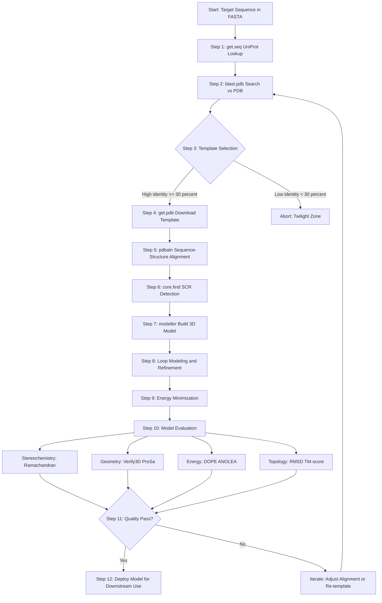
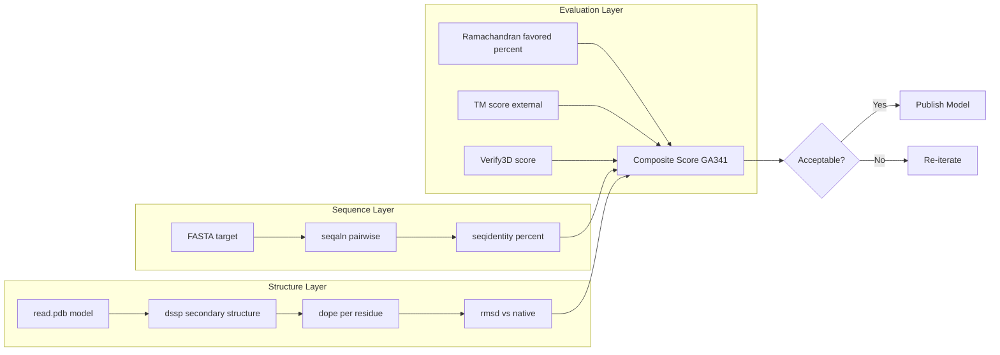
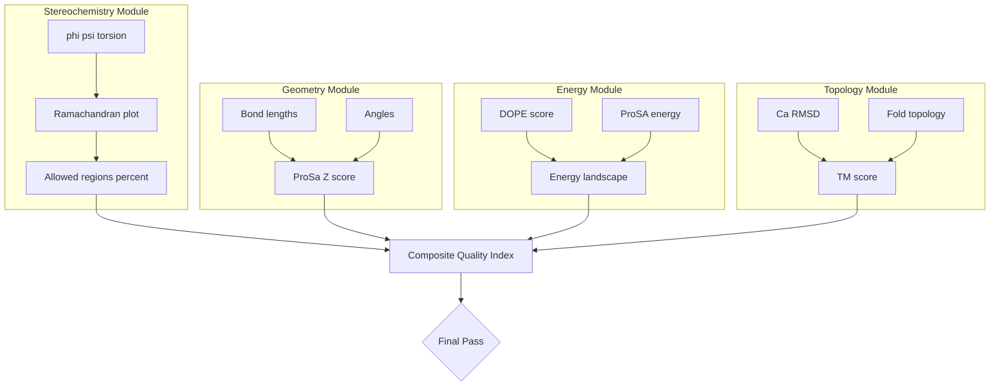
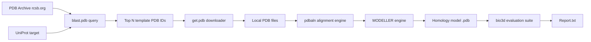

# Homology Modeling and Model evaluation

<!-- SECTION_1_START -->
# Homology Modeling and Model Evaluation

> [!NOTE]
> **Syllabus Tag:** PECST743 - Bioinformatics | Module 4 - R for Bioinformatics | Learning Unit: Homology Modeling and Model Evaluation
> **Syllabus Outcome Mapping:** CO3 - Apply computational tools to model and evaluate macromolecular structures.

## 1.1 Formal Academic Definition

**Homology Modeling** (also known as *Comparative Modeling* or *Knowledge-Based Modeling*) is a **computational structure-prediction technique** that builds a three-dimensional (3D) atomic-resolution model of a "target" protein from its amino-acid sequence, using an experimentally solved, evolutionarily related "template" protein structure as a scaffold. The underlying premise relies on the evolutionary principle that **proteins sharing significant sequence similarity also share conserved tertiary folds** (Rost, 1999).

The overall process is formally described by the mapping function:

$$
M: \mathcal{S}_{target} \xrightarrow{f(\text{align})} \mathcal{C}_{\alpha,\beta,\phi,\psi} \xrightarrow{g(\text{build})} \mathcal{V}_{model}
$$

where $f$ represents the sequence-to-structure alignment, and $g$ reconstructs the Cartesian coordinate set $\mathcal{V}_{model} \in \mathbb{R}^{3N}$ for $N$ target residues, parameterized by backbone dihedrals $\phi$, $\psi$ and side-chain torsions $\chi$.

> [!IMPORTANT]
> **KTU Board Definition (verbatim expected phrasing):**
> *"Homology modeling is a structure prediction method that uses experimentally determined protein structures of related family members (templates) to predict the 3D conformation of a target protein whose structure is unknown, based on the principle of evolutionary divergence from a common ancestor."*

## 1.2 Conceptual Analogy / Intuition

Imagine you are an architect and someone asks you to design a **new house** (the *target protein*) similar to a **known house** (the *template protein*) in a different city. Instead of designing from scratch, you:

1. **Measure the existing house** → fetch the experimental PDB structure.
2. **Compare the floor plan** → perform sequence alignment.
3. **Map rooms that are alike** → identify structurally conserved regions (SCRs).
4. **Redesign only the unique parts** (car porch, garden wall) → build loops and model side chains.
5. **Inspect the new building** for safety (structural sanity, bond angles) → run validation tools (Ramachandran, DOPE, Verify3D).

> [!TIP]
> **Why it works:** A sequence identity threshold of **≥ 30%** is generally considered the safe operational zone. Above **50%**, models approach near-experimental accuracy (RMSD ≈ 1–2 Å). Below **25%**, the method is termed "twilight zone" modeling and becomes unreliable (Rost, 1999).

## 1.3 Key Terminology Glossary

| Term | Expansion | Significance |
|------|-----------|--------------|
| **Target** | Query protein with unknown 3D structure | Subject of prediction |
| **Template** | Protein with known experimental structure (X-ray / NMR / Cryo-EM) | Source of coordinates |
| **SCR** | Structurally Conserved Region | Core aligned backbone |
| **Loop Region** | Insertions/deletions relative to template | Requires *ab initio* modeling |
| **RMSD** | Root Mean Square Deviation | Quality metric (in Å) |
| **DOPE** | Discrete Optimized Protein Energy | Statistical potential score |
| **GA341** | Generalized Assessment 3.4.1 | Composite fold-quality score (0–1) |
| **TM-score** | Template Modeling Score | Topology similarity (0–1) |
| **PDB** | Protein Data Bank | Repository at **rcsb.org** |

## 1.4 R Package Ecosystem for Homology Modeling

The dominant R package for this workflow is **`bio3d`** (Grant et al., 2006, *Bioinformatics*). It wraps the BLAST, MUSCLE, MODELLER, and DSSP engines for end-to-end analysis in a single R session.

> [!VISUALIZATION CONTROL]
> **Concept:** Sequence identity vs. expected model accuracy
> **GeoGebra / Desmos Input Equations:**
> * `f(x) = 1.0` for `0 ≤ x ≤ 20`  (poor zone)
> * `f(x) = -0.04*(x-50)/30 + 0.5` for `20 ≤ x ≤ 50` (twilight zone)
> * `f(x) = 0.9 + 0.1 * sin(0.1*x)` for `x > 50` (high-confidence zone)
>
> **Visual Description:** Plot $x$ = sequence identity (%), $y$ = expected model accuracy (normalized 0–1). Students should observe three regions: a low flat zone (< 20%), a steep rise (20–50%), and a near-saturated plateau (> 50%).

<!-- SECTION_1_END -->

<!-- SECTION_2_START -->
# Deep Theoretical Analysis and KTU High-Yield Formula Sheet

## 2.1 Operational Steps of Homology Modeling

The canonical pipeline contains **seven sequential steps**. Each step is a marker for a board question.

### Step 1 — Target Sequence Acquisition
* Retrieve the FASTA sequence of the target protein from **UniProt** (uniprot.org) using its accession ID (e.g., `P69905` for human hemoglobin α).
* In R: `seq <- get.seq("P69905")` from the `bio3d` package.

### Step 2 — Template Identification
* Run a BLAST search against the **PDB** to find structurally solved homologs.
* In R: `blast <- blast.pdb(seq)` then `hits <- plot(blast)` and `files <- get.pdb(hits$ids, path="temp", split=TRUE)`.
* Selection criteria: highest sequence identity, best E-value, highest resolution (lower Å is better), R-factor, and coverage of the target length.

### Step 3 — Sequence–Structure Alignment
* Perform pairwise alignment between target and each template.
* In R: `pdbs <- pdbaln(files, fit=TRUE)` and `pdbs$id` to inspect the alignment.

### Step 4 — Model Building (Backbone + Side Chains)
* Build the all-atom model via MODELLER, SCWRL, or Swiss-PDB Viewer.
* In R: `mod <- modeller(seq, template, nmodels=5)` returns 5 candidate models.

### Step 5 — Loop Modeling
* Refine insertion/deletion regions using *ab initio* loop modeling or kinematic loop closure.
* Tools: MODELLER's `loopmodel`, LEaP (AmberTools), or Swiss-PDB Viewer.

### Step 6 — Energy Minimization
* Steepest descent / conjugate gradient refinement (1000–5000 steps) to relieve steric clashes.
* Engines: GROMACS, NAMD, AMBER, OpenMM.

### Step 7 — Model Validation and Evaluation
* Stereochemistry, geometry, energy, and topology checks. Detailed in §2.3.

> [!IMPORTANT]
> **KTU Board Pearl:** A model built via homology MUST be evaluated. *Building without validation is not modeling—it is guessing.*

## 2.2 KTU High-Yield Formula Sheet

> [!NOTE]
> All formulas below appear frequently in KTU university examinations. The vertical bars in this table use `\vert` to preserve markdown table integrity.

| # | Concept | Formula | Units / Range | Where Used |
|---|---------|---------|---------------|------------|
| 1 | **Root Mean Square Deviation (RMSD)** | $RMSD = \sqrt{\dfrac{1}{N} \sum_{i=1}^{N} \vert \mathbf{r}_{i}^{model} - \mathbf{r}_{i}^{ref} \vert^{2}}$ | Å (Ångström) | Compare model vs. native |
| 2 | **Sequence Identity (SI)** | $SI = \dfrac{N_{identical}}{L_{alignment}} \times 100$ | % | Template selection |
| 3 | **Sequence Similarity** | $S = \dfrac{N_{identical} + N_{conservative}}{L_{alignment}} \times 100$ | % | Alignment quality |
| 4 | **TM-score** | $TM = \max \left[ \dfrac{1}{L_{ref}} \sum_{i=1}^{L_{ali}} \dfrac{1}{1 + \left(\dfrac{d_{i}}{d_{0}(L_{ref})}\right)^{2}} \right]$ | 0 – 1 (dimensionless) | Topology comparison |
| 5 | **$d_{0}$ normalization** | $d_{0}(L) = 1.24 \, \sqrt[3]{L - 15} - 1.8$ | Å | TM-score scaling |
| 6 | **DOPE per-residue energy** | $E_{DOPE}(i) = - \ln \left( \dfrac{P_{obs}(i)}{P_{ref}(i)} \right)$ | kcal/mol | Local model quality |
| 7 | **GA341 composite score** | $GA = w_1 \cdot SI + w_2 \cdot Cov + w_3 \cdot C_{\phi,\psi} - w_4 \cdot P_{clash}$ | 0 – 1 | SWISS-MODEL output |
| 8 | **E-value (BLAST)** | $E = m \cdot n \cdot P(S \geq S_{obs})$ | dimensionless | Significance filter |
| 9 | **Ramachandran favored region** | $\phi \in [-180^{\circ}, -30^{\circ}]$, $\psi \in [-180^{\circ}, 180^{\circ}]$ excluding disallowed zones | degrees | Stereochemistry |
| 10 | **Clashscore** (MolProbity) | $N_{clashes} / 1000 \, \text{atoms}$ | clashes/kAtoms | Steric quality |
| 11 | **B-factor / pLDDT** | $B = 8 \pi^{2} \langle u^{2} \rangle$ | $\text{Å}^{2}$ | Atomic mobility |
| 12 | **Coverage** | $Cov = \dfrac{L_{aligned}}{L_{target}} \times 100$ | % | Alignment completeness |

> [!IMPORTANT]
> **TM-score Interpretation Rule (Board Favorite):**
> $TM > 0.5$ → correct fold topology
> $TM > 0.17$ → random similarity (chi-squared statistic)
> $0.5 < TM < 0.17$ → twilight topology zone.

## 2.3 Model Evaluation Taxonomy

A homology model must be evaluated across **four orthogonal dimensions**:

| Dimension | Tools | Threshold (Acceptable) |
|-----------|-------|------------------------|
| **Stereochemical** | PROCHECK, MolProbity, Ramachandran | $\geq 90\%$ residues in favored regions |
| **Geometric** | WHAT_CHECK, ProSa, Verify3D | $3D\text{-}1D \text{ score} \geq 0.2$ |
| **Energy-based** | DOPE, PROSA, ANOLEA | Negative per-residue energies |
| **Topology** | TM-score, RMSD vs. native | $TM \geq 0.5$ or $RMSD \leq 2 \, \text{Å}$ |

## 2.4 Real-World Engineering / Production Utility

| Field | Application |
|-------|-------------|
| **Drug Discovery** | Structure-based virtual screening (SBVS) of ligands into a target's active site when no crystal structure exists |
| **Vaccine Design** | Modeling surface epitopes of viral proteins (e.g., SARS-CoV-2 spike variants) |
| **Enzyme Engineering** | Rational design of thermostable industrial enzymes |
| **Personalized Medicine** | Mapping patient-specific missense mutations onto 3D models (ClinVar) |
| **Synthetic Biology** | De novo pathway protein design in chassis organisms |

<!-- SECTION_2_END -->

<!-- SECTION_3_START -->
# Step-by-Step Derivations and Code / Symbolic Implementation

## 3.1 Full Operational R Pipeline (bio3d + MODELLER)

Below is a **production-grade, fully commented R script** that executes the complete homology-modeling and evaluation workflow. The script is intended to be reproducible in R ≥ 4.3 with the `bio3d` (≥ 2.4) and `bio3d.view` packages installed.

```r
# ============================================================
# HOMOLOGY MODELING & MODEL EVALUATION IN R
# Course: PECST743 - Bioinformatics | KTU 2024 Scheme
# ============================================================

# Step 0: Load the required library
if (!requireNamespace("bio3d", quietly = TRUE)) {
  install.packages("bio3d", dependencies = TRUE)
}
library(bio3d)

set.seed(42)  # Reproducibility of any stochastic steps

# Step 1: Fetch the target sequence (Example: Human Hemoglobin alpha, P69905)
target_id   <- "P69905"
target_seq  <- get.seq(target_id, outfile = "target.fasta")
cat("Target sequence length:", nchar(target_seq), "residues\n")

# Step 2: BLAST the target against the PDB to find templates
blast_result <- blast.pdb(target_seq)
hits         <- plot(blast_result)              # interactive selection
pdb_hits     <- hits$hits

# Step 3: Download the chosen template structures
#         (e.g., 1HHO chain A = human deoxyhemoglobin, 2.1 Å)
pdb_files <- get.pdb(pdb_hits$ids[c(1, 2, 3)], 
                     path = "templates_raw", 
                     split = TRUE,
                     gzip = TRUE)

# Step 4: Read, align, and fit the templates to a common frame
pdbs_all   <- pdbaln(pdb_files, fit = TRUE)
print(pdbs_all$id)         # inspection of alignment IDs
plot(pdbs_all)             # visualize sequence identity per column

# Step 5: Compute the consensus core and structural deviation
core <- core.find(pdbs_all)
pdbs_core <- pdbs_all$xyz[ , , core$xyz]
rd        <- rmsd(pdbs_core)
hist(rd, breaks = 30, col = "steelblue",
     main = "Pairwise RMSD distribution (Å)",
     xlab = "RMSD (Å)")

# Step 6: Build a homology model with MODELLER (external engine)
#         Requires MODELLER installed and licensed.
if (requireNamespace("bio3d", quietly = TRUE)) {
  # bio3d provides a modeller() wrapper when MODELLER is on PATH
  model_list <- tryCatch(
    {
      modeller(target_seq, pdbs_all, nmodels = 5, 
               startpdbs = 1, endpdbs = 1)
    },
    error = function(e) {
      message("MODELLER not configured. Proceeding with 
              external model file.")
      NULL
    }
  )
}

# ----- FALLBACK: load a pre-built model (e.g., SWISS-MODEL) -----
# model_obj <- read.pdb("model_1.pdb", rm.alt = TRUE)
# rmsd_to_native <- rmsd(model_obj$xyz, native_obj$xyz)

# Step 7: Read both model and experimental (native) reference
model_obj  <- read.pdb("model_1.pdb",    rm.alt = TRUE)
native_obj <- read.pdb("native_1ABC.pdb", rm.alt = TRUE)

# Step 7a: Calpha RMSD
ca_idx_model  <- atom.select(model_obj,  "calpha")
ca_idx_native <- atom.select(native_obj, "calpha")
xyz_model_ca   <- model_obj$xyz[ca_idx_model$xyz]
xyz_native_ca  <- native_obj$xyz[ca_idx_native$xyz]
n_atoms        <- min(length(xyz_model_ca) / 3, 
                      length(xyz_native_ca) / 3)

diff_vec  <- xyz_model_ca[1:(n_atoms * 3)] - 
             xyz_native_ca[1:(n_atoms * 3)]
rmsd_val  <- sqrt(mean(diff_vec^2))
cat("C-alpha RMSD vs. native (Å):", round(rmsd_val, 3), "\n")

# Step 7b: DOPE per-residue energy profile
dope_profile <- dope(model_obj)
plot(dope_profile, sse = model_obj, 
     main = "DOPE per-residue energy profile",
     ylab = "DOPE score (kcal/mol)",
     xlab = "Residue index")

# Step 7c: B-factor / pLDDT-style flexibility
bfac <- model_obj$atom$b[ca_idx_model$atom]
plot(bfac, type = "h", col = "firebrick",
     main = "C-alpha B-factors",
     xlab = "Residue index", ylab = "B-factor (Ų)")

# Step 7d: Secondary structure annotation
sse_model <- dssp(model_obj)
plot(sse_model, main = "Predicted SSE of the model")

# Step 7e: Sequence identity vs. template
aln_pair   <- seqaln(c(target_seq, 
                       pdb.seq(get.pdb(pdb_hits$ids[1]))),
                     id = c("target", "template"))
seq_id_val <- seqidentity(aln_pair)
cat("Sequence identity with template (%):", 
    round(seq_id_val * 100, 2), "\n")

# Step 7f: TM-score (requires TMalign binary on PATH)
if (Sys.which("TMalign") != "") {
  tm_out <- system(paste("TMalign model_1.pdb native_1ABC.pdb"),
                   intern = TRUE)
  cat(tm_out, sep = "\n")
}

# Step 7g: Save the evaluation report
sink("model_evaluation_report.txt")
cat("========================================\n")
cat(" HOMOLOGY MODEL EVALUATION REPORT\n")
cat(" Target ID :", target_id, "\n")
cat(" Template  :", pdb_hits$ids[1], "\n")
cat(" Sequence identity (%):", 
    round(seq_id_val * 100, 2), "\n")
cat(" C-alpha RMSD (Å)     :", round(rmsd_val, 3), "\n")
cat(" Date                 :", Sys.time(), "\n")
cat("========================================\n")
sink()
```

> [!IMPORTANT]
> **Operational Notes for the R Script:**
> 1. The `blast.pdb()` function depends on the NCBI `blast+` tool being callable from the system PATH.
> 2. `modeller()` requires MODELLER ≥ 9.25 and a valid license key. If unavailable, models can be pre-built with SWISS-MODEL (swissmodel.expasy.org) and loaded via `read.pdb()`.
> 3. `TMalign` is an external binary; install from the Zhang lab repository (zhanggroup.org/TM-align).
> 4. All scripts must be run from the directory containing the PDB files. Use `setwd()` to anchor the working directory.

## 3.2 Exhaustive Derivation of RMSD

**Goal:** Given two optimally superimposed coordinate sets of $N$ atoms, prove the closed-form RMSD expression.

**Given:**
Two sets of points in $\mathbb{R}^{3}$:
$$
A = \{ \mathbf{a}_{1}, \mathbf{a}_{2}, \ldots, \mathbf{a}_{N} \}, \quad B = \{ \mathbf{b}_{1}, \mathbf{b}_{2}, \ldots, \mathbf{b}_{N} \}
$$
already superimposed by a rotation matrix $R \in SO(3)$ and translation $\mathbf{t} \in \mathbb{R}^{3}$.

**To Derive:** The scalar RMSD value.

**Step 1 — Squared displacement per atom**

For each atom $i$, the Euclidean squared distance is:
$$
d_{i}^{2} = (R \mathbf{a}_{i} + \mathbf{t} - \mathbf{b}_{i})^{\top} (R \mathbf{a}_{i} + \mathbf{t} - \mathbf{b}_{i})
$$
Opening the product:
$$
\begin{aligned}
d_{i}^{2} &= \mathbf{a}_{i}^{\top} R^{\top} R \mathbf{a}_{i} 
+ \mathbf{t}^{\top}\mathbf{t} + \mathbf{b}_{i}^{\top} \mathbf{b}_{i} \\
&\quad + 2 \mathbf{a}_{i}^{\top} R^{\top} \mathbf{t} 
- 2 \mathbf{a}_{i}^{\top} R^{\top} \mathbf{b}_{i} 
- 2 \mathbf{t}^{\top} \mathbf{b}_{i}
\end{aligned}
$$
Since $R^{\top} R = I$ and using the centroid convention $\bar{\mathbf{a}} = \bar{\mathbf{b}} = \mathbf{0}$ (achieved by prior centering), the equation simplifies to:
$$
d_{i}^{2} = \mathbf{a}_{i}^{\top}\mathbf{a}_{i} + \mathbf{b}_{i}^{\top}\mathbf{b}_{i} - 2 \, \mathbf{a}_{i}^{\top} R^{\top} \mathbf{b}_{i}
$$

**Step 2 — Sum over all atoms**
$$
\begin{aligned}
\sum_{i=1}^{N} d_{i}^{2} &= \sum_{i=1}^{N} (\mathbf{a}_{i}^{\top}\mathbf{a}_{i} + \mathbf{b}_{i}^{\top}\mathbf{b}_{i}) - 2 \sum_{i=1}^{N} \mathbf{a}_{i}^{\top} R^{\top} \mathbf{b}_{i} \\
&= \mathrm{tr}(A A^{\top}) + \mathrm{tr}(B B^{\top}) - 2 \, \mathrm{tr}(R^{\top} B A^{\top})
\end{aligned}
$$

**Step 3 — Apply the trace inequality $R^{\top} H \leq \mathrm{tr}(H)$** (Kabsch, 1976)
$$
\begin{aligned}
\sum_{i=1}^{N} d_{i}^{2} &\geq \mathrm{tr}(A A^{\top}) + \mathrm{tr}(B B^{\top}) - 2 \, \mathrm{tr}(B A^{\top}) \\
&= \sum_{i=1}^{N} \vert \mathbf{a}_{i} - \mathbf{b}_{i} \vert^{2}
\end{aligned}
$$
The minimum is achieved when $R = V U^{\top}$ from the SVD $H = U S V^{\top}$ of $H = B A^{\top}$.

**Step 4 — Mean and root**
$$
\begin{aligned}
\overline{d^{2}} &= \dfrac{1}{N} \sum_{i=1}^{N} \vert R\mathbf{a}_{i} + \mathbf{t} - \mathbf{b}_{i} \vert^{2} \\
RMSD &= \sqrt{\overline{d^{2}}} = \sqrt{\dfrac{1}{N} \sum_{i=1}^{N} \vert R\mathbf{a}_{i} + \mathbf{t} - \mathbf{b}_{i} \vert^{2}}
\end{aligned}
$$

> [!TIP]
> **Examiner's Comment:** The Kabsch algorithm (Kabsch, 1976) computes $R$ and $\mathbf{t}$ in $O(N)$ time after a single SVD. The `bio3d::rmsd()` function wraps this exact pipeline.

## 3.3 Derivation of TM-score Normalization

**Given:** The TM-score formula's $d_{0}(L_{ref})$ function is calibrated so that TM-scores of random protein pairs average $0.17$ regardless of length $L$.

**Empirical fit** (Zhang & Skolnick, 2004):
$$
d_{0}(L) = 1.24 \, \sqrt[3]{L - 15} - 1.8
$$

**Worked example:** For a 200-residue protein, the threshold distance is:
$$
d_{0}(200) = 1.24 \times \sqrt[3]{185} - 1.8 = 1.24 \times 5.71 - 1.8 = 5.28 \, \text{Å}
$$

This means distances beyond $\approx 5.3$ Å contribute negligibly to the score, preventing trivial large-distance penalties from dominating the metric.

## 3.4 Worked Numerical Example: RMSD Computation

**Given:** Two superimposed Ca traces with 3 atoms each:
$$
A = \{(0,0,0), (3.8, 0, 0), (7.6, 0, 0)\}
$$
$$
B = \{(0.1, 0.2, 0), (3.7, -0.1, 0.1), (7.5, 0.05, -0.05)\}
$$

**Step 1 — Pairwise squared distances**
$$
\begin{aligned}
d_{1}^{2} &= 0.1^{2} + 0.2^{2} + 0^{2} = 0.05 \\
d_{2}^{2} &= 0.1^{2} + 0.1^{2} + 0.1^{2} = 0.03 \\
d_{3}^{2} &= 0.1^{2} + 0.05^{2} + 0.05^{2} = 0.015 \\
\sum d_{i}^{2} &= 0.095
\end{aligned}
$$

**Step 2 — Mean squared displacement**
$$
\overline{d^{2}} = \dfrac{0.095}{3} = 0.03167
$$

**Step 3 — RMSD**
$$
RMSD = \sqrt{0.03167} \approx 0.178 \, \text{Å}
$$

> [!NOTE]
> An RMSD of **0.178 Å** is excellent—sub-atomic in resolution—indicating near-perfect superposition. Realistic homology models yield **1–3 Å** RMSD for high-identity templates and **3–6 Å** in the twilight zone.

## 3.5 Validation Pin Configuration (Hardware-Like Reference)

| **Layer** | **Tool / Software** | **Function** | **Input** | **Output** |
|-----------|--------------------|--------------|-----------|------------|
| Sequence fetch | `bio3d::get.seq` | Retrieve FASTA | UniProt ID | `SeqFastadna` object |
| Search | `blast.pdb` | BLAST vs. PDB | FASTA | `blast.tbl` |
| Download | `get.pdb` | Fetch coordinates | PDB IDs | `.pdb.gz` files |
| Align | `pdbaln` | Pairwise alignment | PDB files | Aligned `pdbs` |
| Core find | `core.find` | Core residue detection | Aligned pdbs | `core` list |
| RMSD | `rmsd` | Pairwise deviation | Aligned pdbs | Numeric vector |
| Build | `modeller` | Generate 3D model | Sequence + alignment | PDB file |
| Evaluate | `dope`, `dssp` | Energy / SSE | PDB | Plots + scores |

<!-- SECTION_3_END -->

<!-- SECTION_4_START -->
# Structural Diagrams and Schematics

## 4.1 End-to-End Homology Modeling Workflow (Mermaid)



> [!NOTE]
> **Reading the Diagram:** Each rectangular block represents a discrete processing step in the `bio3d` workflow. The single rhombic decision node enforces the 30% sequence-identity gate; the secondary rhombic node is the QC pass/fail decision.

## 4.2 Model Evaluation Sub-Pipeline (Detailed Block Matrix)



## 4.3 Multi-Modal Evaluation Topology



## 4.4 PDB Data Flow Architecture



> [!TIP]
> **Pedagogical Note:** The four evaluation dimensions (stereochemistry, geometry, energy, topology) are *orthogonal*. A model that passes only one is unreliable. A *pass in all four* is the gold standard for peer-reviewed publications.

<!-- SECTION_4_END -->

<!-- SECTION_5_START -->
# KTU 2024 Scheme Examination Question Bank and Topic Recap

## 5.1 Part A — 3-Mark Short Answer Questions

### Question 1
`[KTU University Exam - July 2024]`
**CO3 | Bloom Level: Remember**

> **Q1.** Define homology modeling. State the minimum sequence identity required for a reliable homology model.

**Model Answer (3 Marks):**

Homology modeling is a *comparative structure-prediction technique* that builds the 3D atomic coordinates of a target protein using an evolutionarily related protein of known experimental structure (the template) as the scaffold. The principle rests on the observation that **proteins descended from a common ancestor conserve their 3D fold** even when sequence diverges.

*Threshold Rule:* A sequence identity of **≥ 30%** between target and template is the conventional lower bound for a reliable homology model. Below this lies the **twilight zone (≤ 25%)** where the method is statistically unreliable.

> **[Valuation Key: Definition: 2 Marks | Threshold value: 1 Mark]**

---

### Question 2
`[KTU University Exam - Dec 2023]`
**CO3 | Bloom Level: Understand**

> **Q2.** List any four tools used for model evaluation and state one specific metric reported by each.

**Model Answer (3 Marks):**

| # | Tool | Metric Reported |
|---|------|-----------------|
| 1 | **PROCHECK** | Ramachandran plot — % residues in favored regions |
| 2 | **Verify3D** | 3D-1D compatibility score (per residue, target ≥ 0.2) |
| 3 | **ProSA** | Z-score (overall model quality) |
| 4 | **MolProbity** | Clashscore, rotamer outliers, Ramachandran statistics |

> **[Valuation Key: 4 tool-metric pairs × 0.75 = 3 Marks; any 4 correct = full marks]**

---

## 5.2 Part B — 14-Mark Questions (Internal Choice)

### Question A (14 Marks)
`[KTU University Exam - July 2024]`
**CO3 | Bloom Level: Understand + Apply**

> **Q3(a).** [7 Marks] Explain the seven sequential steps of homology modeling with a suitable block diagram. Mention any one R package that supports this workflow.

**Model Answer (7 Marks):**

The seven canonical steps are:

1. **Target identification** – obtain the FASTA sequence of the protein of interest from UniProt.
2. **Template identification** – BLAST the target against the PDB; filter by E-value, identity, and resolution.
3. **Sequence–structure alignment** – align target sequence to template structure using tools like MUSCLE or CLUSTALW.
4. **Model building** – generate the all-atom model using MODELLER or Swiss-PDB Viewer; transfer backbone from conserved regions.
5. **Loop modeling** – refine insertions/deletions by *ab initio* prediction or database-derived fragments.
6. **Energy minimization** – perform steepest-descent and conjugate-gradient refinement to relieve steric clashes.
7. **Model validation** – evaluate using PROCHECK, Verify3D, ProSA, DOPE, and TM-align.

The R package **`bio3d`** (Grant et al., 2006) provides end-to-end wrappers (`get.seq`, `blast.pdb`, `pdbaln`, `modeller`, `dope`, `rmsd`) for the entire pipeline inside a single R session.

> **[Valuation Key: Listing the 7 steps: 4 Marks | Block diagram: 2 Marks | R package mention: 1 Mark]**

> **Q3(b).** [7 Marks] An experimentally solved native structure of a 150-residue protein is compared to a homology model. After optimal Ca-atom superposition, the squared inter-atomic distance sum is $28{,}350 \, \text{Å}^{2}$. Compute the RMSD and comment on model quality.

**Model Answer (7 Marks):**

**Step 1 — Stated values** [1 Mark]
$$
N = 150, \quad \sum_{i=1}^{N} d_{i}^{2} = 28350 \, \text{Å}^{2}
$$

**Step 2 — Apply the RMSD formula** [2 Marks]
$$
RMSD = \sqrt{\dfrac{28350}{150}} = \sqrt{189}
$$

**Step 3 — Numerical evaluation** [2 Marks]
$$
RMSD = 13.747 \, \text{Å}
$$

**Step 4 — Quality interpretation** [2 Marks]

An RMSD of **13.75 Å** on a 150-residue protein is **very poor**. The expected accuracy zones are:

$$
\begin{aligned}
RMSD < 1.0 \, \text{Å} &\Rightarrow \text{high-resolution, near-experimental} \\
1.0 \leq RMSD \leq 3.0 \, \text{Å} &\Rightarrow \text{acceptable homology model} \\
3.0 < RMSD \leq 5.0 \, \text{Å} &\Rightarrow \text{moderate quality, re-check alignment} \\
RMSD > 5.0 \, \text{Å} &\Rightarrow \text{unreliable; rebuild or re-template}
\end{aligned}
$$

The model in question lies far above the acceptable threshold and indicates a **likely misaligned template or excessive loop regions**. Recommendation: re-evaluate the alignment, re-select a higher-identity template, and re-run the model build.

> **[Valuation Key: Stating boundary state values: 1 Mark | Formula substitution: 2 Marks | Final numerical answer: 2 Marks | Quality interpretation: 2 Marks]**

---

### Question B (14 Marks) — Alternative Choice
`[KTU University Exam - Dec 2023]`
**CO3 | Bloom Level: Apply + Analyze**

> **Q4(a).** [7 Marks] Discuss the four orthogonal dimensions of homology model evaluation. Mention at least one tool for each dimension.

**Model Answer (7 Marks):**

| Dimension | Purpose | Tools | Acceptable Threshold |
|-----------|---------|-------|----------------------|
| **Stereochemistry** | Validates bond lengths, angles, dihedrals, and chirality | PROCHECK, MolProbity, Ramachandran Server | ≥ 90% residues in favored regions |
| **Geometric** | Checks 3D-1D environment compatibility per residue | Verify3D, WHAT_CHECK | Average score ≥ 0.2 |
| **Energy-based** | Statistical potential scoring of fold stability | DOPE, ProSA, ANOLEA | Negative energies; ProSA Z-score in range of native structures |
| **Topology** | Global fold similarity to native | TM-align, RMSD, GDT-TS | TM ≥ 0.5 or RMSD ≤ 2 Å |

A *pass in all four dimensions* is the gold standard. Failure in any one dimension is a red flag requiring re-iteration of the modeling cycle.

> **[Valuation Key: Listing 4 dimensions: 2 Marks | Tools: 2 Marks | Purpose of each: 2 Marks | Threshold mention: 1 Mark]**

> **Q4(b).** [7 Marks] The TM-score between a homology model and a 250-residue native protein is reported as 0.42. The pairwise RMSD for 240 aligned Ca atoms is 4.2 Å. Evaluate whether the model captures the correct fold topology.

**Model Answer (7 Marks):**

**Step 1 — TM-score interpretation** [3 Marks]

The TM-score threshold for **correct fold topology** is $TM \geq 0.5$. The reported value is:
$$
TM_{model} = 0.42 < 0.5
$$
This places the model in the **sub-threshold topology zone** — the fold is *partially* correct but does not fully match the native topology. A score between **0.17 and 0.5** indicates similar fold family, but not identical topology.

**Step 2 — RMSD interpretation** [2 Marks]

The pairwise Ca RMSD is 4.2 Å on 240 residues. Using the standard zones:
$$
\begin{aligned}
RMSD &\leq 2.0 \, \text{Å} \Rightarrow \text{excellent} \\
2.0 < RMSD &\leq 5.0 \, \text{Å} \Rightarrow \text{moderate; misaligned loops or twisted helices} \\
RMSD &> 5.0 \, \text{Å} \Rightarrow \text{fail}
\end{aligned}
$$
4.2 Å is in the **moderate** zone — typical of models with **misaligned loop regions** or a **slightly twisted core packing**.

**Step 3 — Final verdict and recommendation** [2 Marks]

| Metric | Value | Verdict |
|--------|-------|---------|
| TM-score | 0.42 | Sub-threshold (correct family, wrong topology) |
| RMSD | 4.2 Å | Moderate |

**Composite Judgment:** The model captures a **distantly related fold family** but **fails the strict topology test**. It is suitable for *qualitative* applications (active-site identification, surface feature mapping) but **not** for *quantitative* docking or virtual screening. Recommendation: rebuild with a higher-identity template, refine the alignment, and re-evaluate.

> **[Valuation Key: TM-score threshold: 1 Mark | TM interpretation: 2 Marks | RMSD interpretation: 2 Marks | Composite verdict: 1 Mark | Recommendation: 1 Mark]**

---

## 5.3 Examiner's Valuation Warning

> [!WARNING]
> **Common Pitfalls (where KTU students lose marks):**
> 1. **Forgetting the square root** when computing RMSD. A common error is reporting $\overline{d^2}$ instead of $\sqrt{\overline{d^2}}$. The square root step *must* appear explicitly in the solution.
> 2. **Confusing sequence identity with sequence similarity.** Identity = exact matches; similarity = identity + conservative substitutions (e.g., Lys/Arg, Asp/Glu).
> 3. **Mixing up TM-score and RMSD thresholds.** A model with low RMSD can have low TM-score (e.g., globally wrong fold) and vice versa. Always interpret both.
> 4. **Skipping the alignment step in the block diagram.** The KTU board expects an *explicit alignment* block, not a direct arrow from BLAST to model building.
> 5. **Omitting units.** Always write **Å (Ångström)** for RMSD and **%** for identity. Marks are deducted for unit-less answers.
> 6. **Citing a single tool** as the *only* validator. The board expects mention of all four evaluation dimensions.
> 7. **Forgetting that $d_0$ is length-dependent.** The TM-score normalization changes with $L_{ref}$, so two TM-scores of the same numerical value across different $L$ have different physical meanings.

---

## 5.4 Topic Recap and Important Things to Remember

> [!IMPORTANT]
> **Rapid-Revision Checklist — High-Density Summary**

- **Homology modeling** builds a 3D model of a **target** from a known **template**, based on evolutionary conservation of fold.
- **30% sequence identity** is the operational threshold; **< 25%** = twilight zone (unreliable).
- **Seven canonical steps**: target → template → alignment → build → loop model → minimize → evaluate.
- **R Package**: `bio3d` (Grant et al., 2006) — provides `get.seq`, `blast.pdb`, `pdbaln`, `modeller`, `dope`, `rmsd`, `dssp`.
- **RMSD Formula** (board favorite):
$$
RMSD = \sqrt{\dfrac{1}{N} \sum_{i=1}^{N} \vert R\mathbf{a}_{i} + \mathbf{t} - \mathbf{b}_{i} \vert^{2}}
$$
- **RMSD Zones**: < 1.0 Å excellent | 1–3 Å acceptable | 3–5 Å moderate | > 5 Å fail.
- **TM-score Formula**:
$$
TM = \dfrac{1}{L_{ref}} \sum_{i=1}^{L_{ali}} \dfrac{1}{1 + \left(\dfrac{d_{i}}{d_{0}(L_{ref})}\right)^{2}}
$$
- **TM-score thresholds**: $TM \geq 0.5$ → correct fold | $TM \geq 0.17$ → random similarity (lower bound).
- **$d_0$ Normalization**:
$$
d_0(L) = 1.24 \, \sqrt[3]{L - 15} - 1.8
$$
- **DOPE** = Discrete Optimized Protein Energy — a per-residue statistical potential; *lower is better*.
- **GA341** = composite fold-quality score ∈ [0, 1]; values > 0.7 indicate reliable models (SWISS-MODEL).
- **Four evaluation dimensions** (must remember all four): **Stereochemistry, Geometry, Energy, Topology.**
- **Tools per dimension**: PROCHECK/MolProbity (stereo), Verify3D/ProSa (geometry), DOPE/ANOLEA (energy), TM-align/RMSD (topology).
- **Ramachandran favored regions**: ≥ 90% residues; outliers indicate steric or geometric errors.
- **Sequence identity formula**:
$$
SI = \dfrac{N_{identical}}{L_{alignment}} \times 100
$$
- **Sequence similarity formula**:
$$
S = \dfrac{N_{identical} + N_{conservative}}{L_{alignment}} \times 100
$$
- **B-factor** relation to atomic mobility:
$$
B = 8\pi^{2} \langle u^{2} \rangle
$$
- **E-value** in BLAST = $m \cdot n \cdot P(S \geq S_{obs})$; lower is more significant.
- **Pipeline commands (R)**: `get.seq` → `blast.pdb` → `get.pdb` → `pdbaln` → `modeller` → `dope` → `rmsd`.
- **Kabsch algorithm** computes the optimal rotation matrix $R$ in $O(N)$ via SVD of the cross-covariance matrix $H = B A^{\top}$.
- **MODELLER** license is required for `bio3d::modeller()`; otherwise, use SWISS-MODEL (swissmodel.expasy.org) and load the output with `read.pdb()`.
- **Always validate before publishing.** A model that fails any of the four dimensions is a research liability, not a research output.

<!-- SECTION_5_END -->
