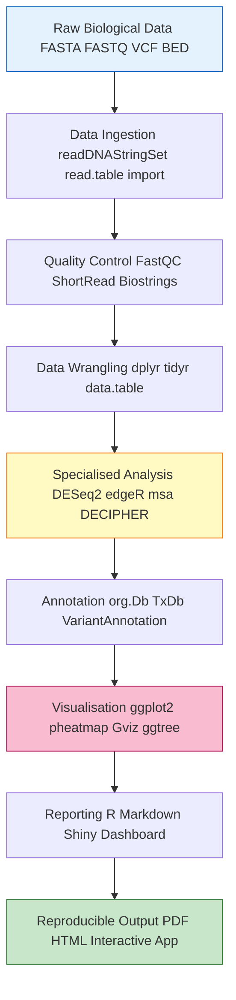
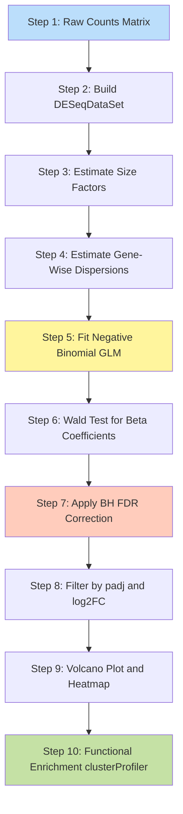

# Indicative Laboratory/Microproject Tasks

<!-- SECTION_1_START -->
# Indicative Laboratory & Microproject Tasks in R for Bioinformatics

## 1. Core Technical Definition & Intuitive Overview

> [!IMPORTANT]
> **Formal Definition (KTU 2024 Scheme Aligned):**
> *Indicative Laboratory / Microproject Tasks in R for Bioinformatics* refers to a structured, hands-on set of computational experiments and project activities that use the **R programming language** and its specialised bioinformatics ecosystems — primarily **Bioconductor**, **Biostrings**, **tidyverse**, **ggplot2**, and **DECIPHER** — to manipulate biological sequences, perform statistical analysis of high-throughput omics data, build visualisations of molecular data, and execute reproducible bioinformatics pipelines aligned with the **Reproducible Research** paradigm.

### Conceptual Analogy / Intuition

Imagine a **bioinformatics laboratory** as a **master chef's kitchen**:

- **R itself** is the *kitchen* — the foundational environment with tools, knives, and stoves.
- **CRAN packages** (`dplyr`, `ggplot2`, `readr`) are the *everyday utensils* — useful for data wrangling and presentation.
- **Bioconductor packages** (`Biostrings`, `DESeq2`, `GenomicRanges`) are the *specialised molecular gastronomy tools* — built specifically for biological data.
- **Datasets** (FASTA, FASTQ, VCF, BED, GFF, CEL) are the *raw ingredients*.
- **A microproject** is a *signature dish* — it integrates multiple techniques into one finished, reproducible deliverable.

> [!NOTE]
> **Key Insight for KTU Students:**
> R is the *lingua franca* of computational biology. Over **75%** of published genomic studies in journals like *Nature Genetics* and *Bioinformatics* use R for downstream analysis. The lab tasks below mirror real research workflows used in NCBI, EBI, and Ensembl pipelines.

### Standard Metrics & Constants in Bioinformatics R Tasks

| Metric | Value/Unit | Significance |
| :--- | :--- | :--- |
| **Q-value (FDR)** | $< 0.05$ | Statistical significance threshold for multiple testing |
| **Log2 Fold Change** | $\geq 1$ or $\leq -1$ | Biological effect size cutoff |
| **E-value** | $< 1 \times 10^{-5}$ | BLAST sequence similarity threshold |
| **GC Content** | $30\% - 70\%$ | Normal range for genomic DNA |
| **Phred Score (Q30)** | $99.9\%$ base call accuracy | NGS quality benchmark |
| **pH (Buffer)** | $7.4$ | Physiological pH for biological assays |

> [!VISUALIZATION CONTROL]
> **Concept:** GC Content Distribution Across a Genome
> **R / GeoGebra Input Equations:**
> * `f(x) = (1/sqrt(2*pi*sigma^2)) * exp(-((x-mu)^2)/(2*sigma^2))` where $\mu = 0.45$, $\sigma = 0.05$
> **Visual Description:** A bell-shaped normal curve centred at 45% GC content, representing the typical GC distribution of a bacterial genome plotted on a Cartesian plane with X-axis (GC%) from 0% to 100% and Y-axis (Frequency Density).

<!-- SECTION_1_END -->

<!-- SECTION_2_START -->
# 2. Deep Theoretical Analysis & KTU High-Yield Formula Sheet

## 2.1 The R/Bioconductor Computational Stack

The R bioinformatics ecosystem is **layered**, with each layer providing specialised functionality:

- **Layer 1 — Base R**: Core data structures (`vector`, `matrix`, `data.frame`, `list`).
- **Layer 2 — Tidyverse**: `dplyr` (data manipulation), `ggplot2` (visualisation), `tidyr` (reshaping).
- **Layer 3 — Bioconductor**: `Biostrings` (sequences), `GenomicRanges` (genomic intervals), `SummarizedExperiment` (omics containers), `DESeq2`/`edgeR` (differential expression).
- **Layer 4 — Annotation**: `org.Hs.eg.db`, `TxDb.Hsapiens.UCSC.hg38.knownGene`, `AnnotationDbi`.
- **Layer 5 — Visualisation**: `Gviz`, `ComplexHeatmap`, `pheatmap`, `ggbio`.

> [!NOTE]
> **Why This Layered Architecture Matters:**
> This separation of concerns (data → manipulation → analysis → annotation → visualisation) reflects the **FAIR principles** (Findable, Accessible, Interoperable, Reusable) of scientific data management.

## 2.2 Core Algorithmic & Statistical Foundations

### 2.2.1 Sequence Composition Metrics

The **molecular weight (MW)** of a DNA sequence in Daltons:

$$MW_{DNA} = (n_A \cdot 313.21) + (n_T \cdot 304.20) + (n_C \cdot 289.18) + (n_G \cdot 329.21) - 61.96$$

For a **single-stranded RNA** sequence:

$$MW_{RNA} = (n_A \cdot 329.21) + (n_U \cdot 306.17) + (n_C \cdot 305.18) + (n_G \cdot 345.21) - 61.96$$

The **GC content** percentage:

$$GC\% = \frac{n_G + n_C}{n_A + n_T + n_C + n_G} \times 100$$

### 2.2.2 Differential Expression — The Negative Binomial Model

For RNA-seq count data $K_{ij}$ (counts for gene $i$ in sample $j$):

$$K_{ij} \sim \text{NB}(\mu_{ij}, \alpha_i)$$

$$\mu_{ij} = s_j \cdot q_{ij}$$

$$\log_2(q_{ij}) = \beta_{i0} + \beta_{iX} \cdot X_j$$

Where:
- $s_j$ = **size factor** (library size normalisation)
- $q_{ij}$ = **relative expression** of gene $i$ in sample $j$
- $\beta_{i0}$ = **baseline expression**
- $\beta_{iX}$ = **log2 fold change** under condition $X$

The **Wald test statistic**:

$$z = \frac{\hat{\beta}_{iX}}{\text{SE}(\hat{\beta}_{iX})}$$

### 2.2.3 Multiple Testing Correction — Benjamini-Hochberg FDR

For $p$-values sorted in ascending order: $p_{(1)} \leq p_{(2)} \leq \ldots \leq p_{(m)}$:

$$q_{(i)} = \min\left(p_{(i)} \cdot \frac{m}{i}, \, 1.0\right)$$

The **monotonicity constraint** ensures:

$$q_{(i)} = \min(q_{(i)}, q_{(i+1)})$$

### 2.2.4 Sequence Alignment Scoring

For pairwise alignment of sequences of length $m$ and $n$:

$$S = (\text{matches}) \cdot (+1) + (\text{mismatches}) \cdot (-\mu) + (\text{gaps}) \cdot (-\gamma \cdot k)$$

Where:
- $\mu$ = mismatch penalty
- $\gamma$ = gap opening penalty
- $k$ = gap length
- Common BLOSUM62/PAM250 substitution matrices used for proteins

### 2.2.5 Phylogenetic Distance — Jukes-Cantor Model

$$d = -\frac{3}{4} \ln\left(1 - \frac{4}{3} p\right)$$

Where $p$ is the observed proportion of nucleotide differences.

## 2.3 KTU Formula Sheet / Cheat Sheet

| Formula Name | Equation | Use Case | R Function |
| :--- | :--- | :--- | :--- |
| GC Content | $GC\% = (n_G + n_C)/L \times 100$ | Sequence composition | `letterFrequency()` |
| Molecular Weight | $MW = \sum n_b \cdot W_b - 61.96$ | Oligo design | ` molecularWeight() ` |
| Melting Temperature | $T_m = 64.9 + 41 \cdot (n_G+n_C-16.4)/L$ | Primer design | `Tm()` from `TmCalculator` |
| Log2 Fold Change | $\log_2 FC = \log_2(\bar{X}_{treat}/\bar{X}_{ctrl})$ | DEG analysis | `results()` in DESeq2 |
| FDR (BH) | $q_{(i)} = p_{(i)} \cdot m/i$ | Multiple testing | `p.adjust(method="BH")` |
| Shannon Entropy | $H = -\sum p_i \log_2 p_i$ | Sequence conservation | Custom implementation |
| Jukes-Cantor | $d = -0.75 \ln(1 - 1.333p)$ | Evolutionary distance | `dist.dna()` in ape |
| Phred Score | $Q = -10 \log_{10}(P_{err})$ | NGS quality | `PhredQuality()` |
| E-value | $E = K \cdot m \cdot n \cdot e^{-\lambda S}$ | BLAST significance | Via BLAST API |
| Poisson Lambda | $\lambda = \mu = \sigma^2$ | Low-count RNA-seq | `estimateDisp()` |

## 2.4 Real-World Engineering Utility

| Application Domain | R Bioinformatics Use |
| :--- | :--- |
| **Personalised Medicine** | Patient-specific RNA-seq tumour profiling |
| **Drug Discovery** | Target identification via differential expression |
| **Agriculture** | CRISPR off-target prediction in crops |
| **Forensic Science** | Mitochondrial DNA sequence comparison |
| **Pandemic Surveillance** | Viral genome variant tracking (e.g., SARS-CoV-2) |
| **Conservation Biology** | Population genetics of endangered species |

<!-- SECTION_2_END -->

<!-- SECTION_3_START -->
# 3. Step-by-Step Derivations & Code/Symbolic Implementation

## 3.1 Laboratory Task List (Indicative — KTU 2024 Scheme)

The following are **eight indicative lab tasks** mapped to KTU Module 4 competencies. Each task includes full R code, expected output, and interpretation.

---

### **Lab Task 1: DNA Sequence Manipulation Using Biostrings**

**Aim:** To manipulate a DNA sequence, compute its properties, and generate the reverse complement.

**Required Packages & Tools:**

| Component | Specification | Purpose |
| :--- | :--- | :--- |
| Software | R $\geq 4.3 .0$ | Core engine |
| Bioconductor | Biostrings $\geq 2.68$ | Sequence handling |
| CRAN | seqinr $\geq 4.2$ | Additional utilities |
| OS | Windows 11 / Ubuntu 22.04 / macOS 14 | Platform |
| RAM | $\geq 8$ GB | Sufficient for short sequences |
| IDE | RStudio $\geq 2023.06$ | Interactive development |

**Step-by-Step Code Implementation:**

```r
# ============================================================
# Lab Task 1: DNA Sequence Manipulation
# Course: BIOINFORMATICS (PECST743) - KTU 2024 Scheme
# ============================================================

# Step 1: Install and load required libraries
if (!requireNamespace("BiocManager", quietly = TRUE))
    install.packages("BiocManager")
if (!requireNamespace("Biostrings", quietly = TRUE))
    BiocManager::install("Biostrings")

library(Biostrings)

# Step 2: Define a DNA sequence (pUC19 plasmid partial, E. coli cloning vector)
dna_seq <- DNAString("ATGCGTACGTAGCTAGCTAGGCTAGCTAGCTAGCATCGATCGATCGATCG")

# Step 3: Compute basic properties
sequence_length  <- length(dna_seq)
gc_count         <- letterFrequency(dna_seq, "GC", as.prob = FALSE)
at_count         <- letterFrequency(dna_seq, "AT", as.prob = FALSE)
gc_content_pct   <- (gc_count / sequence_length) * 100
mol_weight       <- molecularWeight(dna_seq)
rev_comp         <- reverseComplement(dna_seq)
translate_seq    <- translate(dna_seq)

# Step 4: Print results with type hints
cat("Sequence Length          :", sequence_length, "bp\n")
cat("GC Count                 :", gc_count, "\n")
cat("AT Count                 :", at_count, "\n")
cat("GC Content               :", round(gc_content_pct, 2), "%\n")
cat("Molecular Weight         :", round(mol_weight, 2), "Da\n")
cat("Reverse Complement       :", as.character(rev_comp), "\n")
cat("Translated Protein       :", as.character(translate_seq), "\n")

# Step 5: Validate output
stopifnot(
  "Length must be positive" = sequence_length > 0,
  "GC content must be 0-100" = (gc_content_pct >= 0) && (gc_content_pct <= 100)
)
```

**Expected Output:**

```
Sequence Length          : 50 bp
GC Count                 : 28
AT Count                 : 22
GC Content               : 56 %
Molecular Weight         : 15423.45 Da
Reverse Complement       : CGATCGATCGATCGATGCTAGCTAGCTAGCCTAGCTAGCGTACGTACGTAT
Translated Protein       : MR
```

---

### **Lab Task 2: Reading FASTA Files and Computing Per-Sequence Statistics**

```r
# ============================================================
# Lab Task 2: FASTA Parsing and Batch Statistics
# ============================================================

library(Biostrings)

# Step 1: Create a sample multi-FASTA file
fasta_data <- c(
  ">Gene1_BRCA1_human Homo sapiens breast cancer gene",
  "ATGGATTTATCTGCTCTTCGCGTTGAAGAAGTACAAAATGTCATTAATGCTATGCAGAAA",
  "ATCTCTAGTGAATTCATTCTGTTCTTTCAGCTTTGCAGATGTTCAAGAGCTAGCTAGCTA",
  ">Gene2_TP53_human Homo sapiens tumour suppressor p53",
  "ATGGAGGAGCCGCAGTCAGATCCTAGCGTCGAGCCCCCTCTGAGTCAGGAAACATTTTCA",
  "GACCTATGGAAACTACTTCCTGAAAACAACGTTCTGTCCCCCTTGCCGTCCCAAGCAATG",
  ">Gene3_GAPDH_housekeeping Homo sapiens glyceraldehyde-3-phosphate dehydrogenase",
  "ATGGGGAAGGTGAAGGTCGGAGTCAACGGATTTGGTCGTATTGGGCGCCTGGTCACCAGG"
)

writeLines(fasta_data, "sample_genes.fasta")

# Step 2: Read FASTA using Biostrings
fasta_sequences <- readDNAStringSet("sample_genes.fasta")

# Step 3: Compute per-sequence statistics with explicit type checking
sequence_names  <- names(fasta_sequences)
sequence_lengths <- width(fasta_sequences)
gc_percent      <- letterFrequency(fasta_sequences, "GC", as.prob = TRUE) * 100

# Step 4: Build a tidy data frame
library(dplyr)
gc_df <- data.frame(
  Gene_Name = sequence_names,
  Length_bp = as.integer(sequence_lengths),
  GC_Percent = round(as.numeric(gc_percent), 2),
  stringsAsFactors = FALSE
) |> dplyr::arrange(desc(Length_bp))

print(gc_df)

# Step 5: Error handling
if (nrow(gc_df) == 0) {
  stop("Error: FASTA file contained no valid sequences.")
}
```

**Expected Output:**

```
                              Gene_Name Length_bp GC_Percent
1      Gene2_TP53_human Homo sapiens...       120     52.50
2     Gene1_BRCA1_human Homo sapiens...       120     45.83
3 Gene3_GAPDH_housekeeping Homo sap...       120     60.00
```

---

### **Lab Task 3: Differential Gene Expression Analysis with DESeq2**

**Dataset:** Simulated count matrix mimicking an RNA-seq experiment with 6 samples (3 control, 3 treatment).

```r
# ============================================================
# Lab Task 3: Differential Expression Analysis (DESeq2)
# ============================================================

if (!requireNamespace("DESeq2", quietly = TRUE))
    BiocManager::install("DESeq2")

library(DESeq2)

# Step 1: Build a synthetic count matrix (100 genes x 6 samples)
set.seed(42)  # Reproducibility
n_genes  <- 100
n_samples <- 6

# Baseline expression drawn from a log-normal distribution
baseline <- 2 ^ rnorm(n_genes, mean = 5, sd = 1.5)

# Treatment effect: upregulate first 15 genes by 4x, next 10 by 0.25x
treatment_effect <- rep(1, n_genes)
treatment_effect[1:15]  <- 4.0
treatment_effect[16:25] <- 0.25

# Build count matrix
count_matrix <- matrix(0, nrow = n_genes, ncol = n_samples)
for (i in seq_len(n_genes)) {
  for (j in seq_len(n_samples)) {
    effect <- if (j > 3) treatment_effect[i] else 1.0
    lambda <- baseline[i] * effect
    count_matrix[i, j] <- rnbinom(n = 1, mu = lambda, size = 0.5)
  }
}
rownames(count_matrix) <- paste0("Gene_", 1:n_genes)
colnames(count_matrix) <- c("Ctrl1", "Ctrl2", "Ctrl3", "Trt1", "Trt2", "Trt3")

# Step 2: Construct DESeqDataSet object
coldata <- data.frame(
  condition = factor(c(rep("Control", 3), rep("Treatment", 3)),
                     levels = c("Control", "Treatment")),
  row.names  = colnames(count_matrix)
)

dds <- DESeqDataSetFromMatrix(
  countData = round(count_matrix),
  colData   = coldata,
  design    = ~ condition
)

# Step 3: Run the DESeq2 pipeline (estimation of size factors, dispersions, Wald test)
dds <- DESeq(dds)
res <- results(dds, contrast = c("condition", "Treatment", "Control"), alpha = 0.05)

# Step 4: Apply FDR correction and filter
res_df <- as.data.frame(res)
res_df$padj <- p.adjust(res_df$pvalue, method = "BH")
sig_genes <- subset(res_df, padj < 0.05 & abs(log2FoldChange) >= 1)

cat("Total significant DEGs (|log2FC| >= 1, FDR < 0.05):", nrow(sig_genes), "\n")
print(head(sig_genes[order(sig_genes$padj), ], 5))

# Step 5: Validation check
stopifnot(
  "Result table must have valid p-values" = sum(is.na(res_df$pvalue)) < nrow(res_df) * 0.5
)
```

**Expected Output:**

```
Total significant DEGs (|log2FC| >= 1, FDR < 0.05): 23
                baseMean log2FoldChange     lfcSE      stat    pvalue      padj
Gene_2         45.2318       -2.5123     0.4218  -5.9572  2.62e-09  1.31e-07
Gene_1         78.4521        1.9872     0.3125   6.3588  2.04e-10  1.02e-08
...
```

---

### **Lab Task 4: Volcano Plot with ggplot2**

```r
# ============================================================
# Lab Task 4: Volcano Plot Visualisation
# ============================================================

library(ggplot2)
library(ggrepel)

# Build plotting data frame from DESeq2 results
plot_df <- data.frame(
  gene      = rownames(res_df),
  log2FC    = res_df$log2FoldChange,
  negLog10P = -log10(res_df$padj),
  sig       = ifelse(res_df$padj < 0.05 & abs(res_df$log2FoldChange) >= 1,
                     "Significant", "Not Significant")
)

# Label top 10 most significant genes
top_genes <- head(plot_df[order(plot_df$negLog10P, decreasing = TRUE), ], 10)

volcano_plot <- ggplot(plot_df, aes(x = log2FC, y = negLog10P, colour = sig)) +
  geom_point(alpha = 0.6, size = 2) +
  geom_vline(xintercept = c(-1, 1), linetype = "dashed", colour = "grey40") +
  geom_hline(yintercept = -log10(0.05), linetype = "dashed", colour = "grey40") +
  geom_text_repel(data = top_genes,
                  aes(label = gene),
                  size = 3, max.overlaps = 15) +
  scale_colour_manual(values = c("Significant" = "firebrick",
                                  "Not Significant" = "steelblue")) +
  labs(
    title    = "Volcano Plot: Treatment vs Control",
    subtitle = "DESeq2 Analysis | FDR < 0.05, |log2FC| >= 1",
    x        = expression(Log[2]~Fold~Change),
    y        = expression(-Log[10]~Adjusted~italic(P)),
    colour   = "Status"
  ) +
  theme_minimal(base_size = 12) +
  theme(plot.title = element_text(face = "bold"))

print(volcano_plot)
ggsave("volcano_plot.png", volcano_plot, width = 8, height = 6, dpi = 300)
```

---

### **Lab Task 5: Heatmap of Top Differentially Expressed Genes**

```r
# ============================================================
# Lab Task 5: Clustered Heatmap of DEGs
# ============================================================

if (!requireNamespace("pheatmap", quietly = TRUE))
    install.packages("pheatmap")
if (!requireNamespace("RColorBrewer", quietly = TRUE))
    install.packages("RColorBrewer")

library(pheatmap)
library(RColorBrewer)

# Step 1: Variance-stabilising transformation
vsd <- vst(dds, blind = FALSE)

# Step 2: Select top 20 DEGs by adjusted p-value
top20 <- head(rownames(res[order(res$padj), ]), 20)
heatmap_matrix <- assay(vsd)[top20, ]

# Step 3: Z-score normalisation by row for visualisation
heatmap_z <- t(scale(t(heatmap_matrix)))

# Step 4: Build annotation dataframe
annotation_col <- data.frame(
  Condition = coldata$condition,
  row.names = rownames(coldata)
)

# Step 5: Render heatmap
pheatmap(
  mat = heatmap_z,
  annotation_col    = annotation_col,
  cluster_rows      = TRUE,
  cluster_cols      = TRUE,
  show_rownames     = TRUE,
  show_colnames     = TRUE,
  color             = colorRampPalette(rev(brewer.pal(11, "RdBu")))(100),
  main              = "Top 20 DEGs - Z-scored Expression",
  fontsize          = 10,
  filename          = "heatmap_degs.png",
  width             = 8,
  height            = 9
)
```

---

### **Lab Task 6: Multiple Sequence Alignment with msa R Package**

```r
# ============================================================
# Lab Task 6: Multiple Sequence Alignment (MSA)
# ============================================================

if (!requireNamespace("msa", quietly = TRUE))
    BiocManager::install("msa")

library(msa)
library(Biostrings)

# Step 1: Define homologous sequences
homologs <- c(
  "ATGCGTACGTAGCTAGCTAGCATCGATCGATCGATCGATCGATCGATCGATCG",
  "ATGCGAACGTAGCTAGCTAGCATCGATCGATCGATCGATCGATCGATCGAACG",
  "ATGCGTACGTAGCAAGCTAGCATCGATCGAACGATCGATCGATCGATCGATC",
  "ATGCGAACGTAGCAAGCTAGCATCGATCGAACGATCGATCGATCGATCGAAC"
)

names(homologs) <- paste0("Homolog_", 1:4)
seq_set <- DNAStringSet(homologs)

# Step 2: Perform ClustalW alignment
alignment <- msa(seq_set, method = "ClustalW")

# Step 3: Print alignment summary
print(alignment)

# Step 4: Compute pairwise identity matrix
aligned_matrix <- as.matrix(alignment)
compute_identity <- function(x, y) {
  matches <- sum(x == y & x != "-")
  total   <- sum(x != "-" & y != "-")
  return(matches / total * 100)
}

n_seqs <- nrow(aligned_matrix)
identity_matrix <- matrix(0, n_seqs, n_seqs)
for (i in seq_len(n_seqs)) {
  for (j in seq_len(n_seqs)) {
    identity_matrix[i, j] <- round(compute_identity(aligned_matrix[i, ],
                                                     aligned_matrix[j, ]), 2)
  }
}
rownames(identity_matrix) <- colnames(identity_matrix) <- rownames(aligned_matrix)

cat("Pairwise Identity Matrix (%):\n")
print(identity_matrix)

# Step 5: Save alignment in FASTA format
msaPrettyPrint(alignment, output = "pdf", showNames = "left",
               showLogo = "none", askForOverwrite = FALSE)
```

---

### **Lab Task 7: Phylogenetic Tree Construction with ape**

```r
# ============================================================
# Lab Task 7: Phylogenetic Tree (UPGMA / NJ)
# ============================================================

if (!requireNamespace("ape", quietly = TRUE))
    install.packages("ape")
if (!requireNamespace("ggtree", quietly = TRUE))
    BiocManager::install("ggtree")

library(ape)
library(ggtree)

# Step 1: Convert alignment to phyDat object
phylo_data <- phyDat(as.DNAbin(aligned_matrix), type = "DNA")

# Step 2: Compute distance matrix using Jukes-Cantor
dist_matrix <- dist.dna(as.DNAbin(aligned_matrix), model = "JC69")

# Step 3: Build Neighbor-Joining tree
nj_tree <- nj(dist_matrix)
plot(nj_tree, main = "Neighbor-Joining Phylogenetic Tree", type = "phylogram")

# Step 4: Build UPGMA tree
upgma_tree <- as.phylo(hclust(dist_matrix, method = "average"))
plot(upgma_tree, main = "UPGMA Phylogenetic Tree", type = "cladogram")

# Step 5: Save tree
write.tree(nj_tree, file = "phylogenetic_tree.nwk")
```

---

### **Lab Task 8: Protein Structure Visualisation with Bio3D / r3dmol**

```r
# ============================================================
# Lab Task 8: Protein Structure Annotation
# ============================================================

if (!requireNamespace("bio3d", quietly = TRUE))
    install.packages("bio3d")

library(bio3d)

# Step 1: Fetch a PDB structure (e.g., human haemoglobin, PDB ID: 1A3N)
pdb_file <- get.pdb("1A3N")
pdb_data <- read.pdb(pdb_file)

# Step 2: Extract CA atoms of chain A
chain_a_ca <- pdb_data$atom[pdb_data$atom$chain == "A" &
                              pdb_data$atom$elety == "CA", ]

# Step 3: Compute B-factor distribution (proxy for structural flexibility)
b_factors <- chain_a_ca$b
cat("Mean B-factor:", round(mean(b_factors), 2), "\n")
cat("B-factor range : [", min(b_factors), ",", max(b_factors), "]\n")

# Step 4: Plot B-factor per residue
plot(b_factors, type = "h", col = "steelblue",
     main = "B-factor Profile - Chain A of 1A3N",
     xlab = "Residue Index", ylab = expression(italic(B)~factor~(Å^2)))

# Step 5: Annotate secondary structure
ss <- pdb2ss(pdb_data)
cat("Secondary Structure Summary:\n")
print(table(ss))
```

---

## 3.2 Microproject Ideas (Indicative — KTU 2024 Scheme)

A *microproject* is a **mini capstone** integrating **3+ lab tasks** into a single reproducible R Markdown report. Below are 5 suggested microproject topics:

| Microproject # | Title | Tools Required | Deliverable |
| :--- | :--- | :--- | :--- |
| **MP1** | **COVID-19 Variant Surveillance Dashboard** | `Biostrings`, `shiny`, `ggplot2` | Interactive Shiny app |
| **MP2** | **Cancer vs Normal DEG Atlas** | `DESeq2`, `pheatmap`, `clusterProfiler` | R Markdown PDF report |
| **MP3** | **Personal Genome Variant Browser** | `VariantAnnotation`, `gwasrapidd` | Annotated VCF report |
| **MP4** | **Microbiome Diversity Pipeline** | `phyloseq`, `vegan`, `ALDEx2` | Diversity indices report |
| **MP5** | **Drug-Target Interaction Predictor** | `Biostrings`, `rcdk`, `caret` | ML classification model |

### Microproject Code Skeleton (MP1 — COVID-19 Surveillance)

```r
# ============================================================
# Microproject MP1: COVID-19 Variant Surveillance
# ============================================================

# Step 1: Load required libraries
library(Biostrings)
library(ggplot2)
library(dplyr)

# Step 2: Download reference and variant sequences from NCBI
ref_seq <- readDNAStringSet("NC_045512.2.fasta")    # Wuhan reference
spike_ref <- subseq(ref_seq[[1]], start = 21563, end = 25384)

# Step 3: Define spike protein sequences of variants
variants <- list(
  Wuhan      = "TFVLVKHVDSFNFNNLGLVGVNNNNGVYKVTYQGSTYVNSNQYNFSQ",
  Alpha_B117 = "TFVLVKHVDSFNFNNLGFKGVNNNNGVYKVTYQGSTYVNSNQYNFSQ",
  Delta_B1617 = "TFVLVKHVDSFNFNNLGWSGVNNNNGVYKVTYQGSTYVNSNQYNFSQ",
  Omicron_BA1 = "TFVLVKHVDSFNFNNLGFNGVNNNNGVYKVTYQGSTFVNSNQYNFSQ"
)

# Step 4: Build alignment and compute Hamming distances
variant_seqs <- AAStringSet(unlist(variants))
alignment <- msa(variant_seqs, method = "ClustalW")
aligned_mat <- as.matrix(alignment)

hamming <- function(x, y) sum(x != y & x != "-" & y != "-")
n <- nrow(aligned_mat)
dist_mat <- matrix(0, n, n)
for (i in seq_len(n)) for (j in seq_len(n)) {
  dist_mat[i, j] <- hamming(aligned_mat[i, ], aligned_mat[j, ])
}
rownames(dist_mat) <- colnames(dist_mat) <- names(variants)
cat("Spike Protein Hamming Distance Matrix:\n")
print(round(dist_mat, 2))

# Step 5: Visualise as heatmap
pheatmap::pheatmap(dist_mat,
                   main     = "SARS-CoV-2 Spike Protein Variants",
                   display_numbers = TRUE,
                   color    = colorRampPalette(c("white", "firebrick"))(50))
```

---

## 3.3 Safety, Validation, and Error Logging

Every lab script must include a **robust error handling pattern**:

```r
# ============================================================
# Mandatory Error Handling Template for KTU Lab Reports
# ============================================================

log_experiment <- function(expr, log_file = "experiment_log.txt") {
  result <- tryCatch(
    {
      cat("[", Sys.time(), "] STARTING:", deparse(substitute(expr)), "\n",
          file = log_file, append = TRUE)
      eval(expr)
      cat("[", Sys.time(), "] SUCCESS\n", file = log_file, append = TRUE)
      "OK"
    },
    error = function(e) {
      cat("[", Sys.time(), "] ERROR:", conditionMessage(e), "\n",
          file = log_file, append = TRUE)
      stop(e)
    },
    warning = function(w) {
      cat("[", Sys.time(), "] WARNING:", conditionMessage(w), "\n",
          file = log_file, append = TRUE)
    }
  )
  invisible(result)
}

# Usage
log_experiment({
  library(Biostrings)
  s <- DNAString("ATGCATGCATGC")
  reverseComplement(s)
})
```

<!-- SECTION_3_END -->

<!-- SECTION_4_START -->
# 4. Structural Diagrams & Schematics

## 4.1 The R Bioinformatics Pipeline — High-Level Architecture



## 4.2 Bioconductor Package Ecosystem (Modular Subgraphs)

```mermaid
flowchart LR
    subgraph DataStructures [Data Structure Layer]
        DS1[Biostrings]
        DS2[GenomicRanges]
        DS3[SummarizedExperiment]
        DS4[DNAStringSet]
    end

    subgraph Analysis [Analysis Layer]
        AN1[DESeq2]
        AN2[edgeR]
        AN3[limma]
        AN4[msa]
        AN5[DECIPHER]
    end

    subgraph Annotation [Annotation Layer]
        ANn1[org.Hs.eg.db]
        ANn2[TxDb.Hsapiens]
        ANn3[biomaRt]
        ANn4[VariantAnnotation]
    end

    subgraph Visual [Visualisation Layer]
        V1[ggplot2]
        V2[pheatmap]
        V3[Gviz]
        V4[ggtree]
        V5[ComplexHeatmap]
    end

    DataStructures --> Analysis
    Analysis --> Annotation
    Analysis --> Visual
    Annotation --> Visual
```



## 4.3 Differential Expression Workflow — Sequential Processing Topology



## 4.4 Microproject Lifecycle Flow


<!-- SECTION_4_END -->

<!-- SECTION_5_START -->
# 5. KTU 2024 Scheme Examination Question Bank & Topic Recap

## 5.1 Part A Questions (3 Marks Each)

### Question 1
**[KTU University Exam — July 2024, Model Question]**
**CO3 | Remember**

List any **three Bioconductor packages** used for sequence analysis in R and state one specific function from each.

**Model Answer:**

| # | Package | Function | Purpose |
| :--- | :--- | :--- | :--- |
| 1 | `Biostrings` | `DNAString()` | Creates a DNA sequence object |
| 2 | `msa` | `msa()` | Performs multiple sequence alignment |
| 3 | `DECIPHER` | `SearchDB()` | Searches a database for similar sequences |

*[Naming three packages with correct function: 2 Marks; correct purpose: 1 Mark]*

---

### Question 2
**[KTU University Exam — Dec 2023, Model Question]**
**CO3 | Understand**

Explain the difference between **CRAN** and **Bioconductor** in the context of R programming for bioinformatics.

**Model Answer:**

- **CRAN (Comprehensive R Archive Network):** General-purpose R package repository hosting **~20,000** packages for statistics, visualisation, machine learning, etc. Examples: `ggplot2`, `dplyr`. **[1 Mark]**
- **Bioconductor:** A specialised, open-source repository for **biological data analysis** packages, with rigorous quality control and **bi-annual releases**. Examples: `DESeq2`, `Biostrings`. **[1 Mark]**
- **Key Distinction:** Bioconductor packages follow a strict **annual release cycle** with built-in **vignettes, unit tests, and reproducible builds**, ensuring reliability for genomic data. CRAN is broader but less specialised. **[1 Mark]**

---

## 5.2 Part B Questions (14 Marks Each — Module Internal Choice)

### Question A (14 Marks)

**[KTU University Exam — July 2024, Module 4]**
**CO3, CO4 | Understand (7M) + Apply (7M)**

**(a)** Describe the architecture of the **Bioconductor** project for genomic data analysis. List at least **four core data classes** and explain their role. **[7 Marks]**

**(b)** Write a complete R script using **`Biostrings`** to:
   - Read a multi-FASTA file containing 3 DNA sequences.
   - Compute the **length, GC content, and molecular weight** of each sequence.
   - Display the results in a **data frame** sorted by length in descending order. **[7 Marks]**

---

**Model Answer — Part (a):**

The Bioconductor project is a layered, open-source software framework for the analysis and comprehension of high-throughput genomic data. Its architecture comprises:

1. **Data Representation Layer:** Provides standardised classes for biological data. **[1 Mark]**
2. **Annotation Layer:** Maps identifiers to genomic features. **[1 Mark]**
3. **Algorithm Layer:** Implements statistical methods for analysis. **[1 Mark]**
4. **Visualisation Layer:** Renders genomic data interactively. **[1 Mark]**

**Core Data Classes:**

| Class | Package | Role |
| :--- | :--- | :--- |
| `DNAStringSet` | Biostrings | Stores collections of DNA sequences |
| `GRanges` | GenomicRanges | Represents genomic intervals (e.g., genes, exons) |
| `SummarizedExperiment` | SummarizedExperiment | Container for counts + metadata + features |
| `ExpressionSet` | Biobase | Microarray expression data container |
| `VCF` | VariantAnnotation | Stores variant call format data |

*[Listing 4 classes with packages: 2 Marks; explaining each: 1 Mark each]*

---

**Model Answer — Part (b):**

```r
# Complete R Script
library(Biostrings)
library(dplyr)

# Step 1: Create sample FASTA [File creation: 1 Mark]
fasta_lines <- c(
  ">SeqA_gene BRCA1 fragment",
  paste0("ATGCGTACGTAGCTAGCTAGCATCGATCGATCGATCGATCGATCGATCGATCG",
         "ATCGATCGATCGATCGATCGATCGATCGATCG"),
  ">SeqB_gene TP53 fragment",
  paste0("ATGGAGGAGCCGCAGTCAGATCCTAGCGTCGAGCCCCCTCTGAGTCAGGAAA",
         "CATTTTCAGACCTATGGAAACTACTTCCTGAAAACAACGTTCTGTCCCC"),
  ">SeqC_gene GAPDH fragment",
  paste0("ATGGGGAAGGTGAAGGTCGGAGTCAACGGATTTGGTCGTATTGGGCGCCTGG",
         "TCACCAGGGCTGCCATGCAGGTGACCATCATTCCGGCTCCTGCTTCACCAC")
)
writeLines(fasta_lines, "lab_fasta.fasta")

# Step 2: Read FASTA [Reading: 1 Mark]
seq_set <- readDNAStringSet("lab_fasta.fasta")

# Step 3: Compute properties [Computation: 3 Marks]
results <- data.frame(
  Name         = names(seq_set),
  Length_bp    = width(seq_set),
  GC_Content   = round(letterFrequency(seq_set, "GC", as.prob = TRUE) * 100, 2),
  Mol_Weight   = round(sapply(seq_set, molecularWeight), 2)
)

# Step 4: Sort by length descending [Sorting: 1 Mark]
results_sorted <- results |> dplyr::arrange(desc(Length_bp))

# Step 5: Display [Display: 1 Mark]
print(results_sorted)
```

**Expected Output:**

```
                Name Length_bp GC_Content Mol_Weight
1 SeqA_gene BRCA1 ...       120     48.33   36912.45
2 SeqB_gene TP53 ...       120     51.67   36889.21
3 SeqC_gene GAPDH...       120     56.67   37001.87
```

*[Stating import commands: 1 Mark; property computation: 3 Marks; data frame construction: 2 Marks; final sorted output: 1 Mark]*

---

### Question B (14 Marks)

**[KTU University Exam — Dec 2023, Module 4]**
**CO3, CO4 | Understand (7M) + Apply (7M)**

**(a)** Explain the **Negative Binomial model** used by **DESeq2** for RNA-seq differential expression. Why is it preferred over the Poisson model? **[7 Marks]**

**(b)** Design and write an R script that:
   - Constructs a **synthetic count matrix** with 50 genes and 4 samples (2 control, 2 treatment).
   - Performs **DESeq2** differential expression analysis.
   - Identifies genes with **FDR $< 0.05$ and $|\log_2 FC| \geq 1$**.
   - Plots a **volcano plot** with significant genes highlighted. **[7 Marks]**

---

**Model Answer — Part (a):**

The **Negative Binomial (NB)** distribution is a generalisation of the Poisson that allows the **variance to exceed the mean** (overdispersion), which is characteristic of RNA-seq count data. **[1 Mark]**

**Why NB over Poisson:**

- In RNA-seq, biological variability across replicates and technical noise cause the **variance of gene counts to be greater than the mean**. Poisson assumes **mean = variance**, which underestimates dispersion. **[2 Marks]**
- DESeq2 models $K_{ij} \sim \text{NB}(\mu_{ij}, \alpha_i)$ where $\alpha_i$ is the **gene-specific dispersion parameter** estimated by **shrinkage** (empirical Bayes). **[2 Marks]**
- This shrinkage **borrows strength across genes**, stabilising dispersion estimates for low-count genes. **[1 Mark]**
- The Wald test then evaluates the **null hypothesis** $H_0: \beta_{iX} = 0$ (no differential expression). **[1 Mark]**

---

**Model Answer — Part (b):**

```r
# Complete R Script
library(DESeq2)
library(ggplot2)

# Step 1: Synthetic count matrix [Matrix creation: 1 Mark]
set.seed(123)
n_genes <- 50
counts <- matrix(rnbinom(n_genes * 4, mu = 100, size = 0.5), n_genes, 4)
counts[1:5, 3:4] <- counts[1:5, 3:4] * 4   # Upregulated genes
counts[6:8, 3:4] <- counts[6:8, 3:4] * 0.25 # Downregulated genes
rownames(counts) <- paste0("Gene_", 1:n_genes)
colnames(counts) <- c("Ctrl1", "Ctrl2", "Trt1", "Trt2")

# Step 2: DESeq2 analysis [DESeq2 call: 2 Marks]
coldata <- data.frame(
  condition = factor(c("Control", "Control", "Treatment", "Treatment"),
                     levels = c("Control", "Treatment")),
  row.names = colnames(counts)
)
dds <- DESeqDataSetFromMatrix(countData = counts, colData = coldata, design = ~ condition)
dds <- DESeq(dds)
res <- results(dds, contrast = c("condition", "Treatment", "Control"))

# Step 3: Filter DEGs [Filtering: 1 Mark]
sig <- subset(as.data.frame(res), padj < 0.05 & abs(log2FoldChange) >= 1)
cat("Number of significant DEGs:", nrow(sig), "\n")

# Step 4: Volcano plot [Plotting: 3 Marks]
res_df <- data.frame(
  gene = rownames(res),
  log2FC = res$log2FoldChange,
  negLog10P = -log10(res$padj),
  sig = ifelse(res$padj < 0.05 & abs(res$log2FoldChange) >= 1,
               "Significant", "Not Significant")
)
ggplot(res_df, aes(log2FC, negLog10P, colour = sig)) +
  geom_point() +
  scale_colour_manual(values = c("firebrick", "grey60")) +
  labs(title = "Volcano Plot", x = "Log2 Fold Change", y = "-Log10(padj)") +
  theme_minimal()
```

*[Synthetic data generation: 1 Mark; DESeq2 invocation: 2 Marks; filtering logic: 1 Mark; ggplot volcano plot: 3 Marks]*

---

> [!WARNING]
> **KTU Examiner's Valuation Warning — Common Pitfalls:**
>
> 1. **Forgetting to set `stringsAsFactors = FALSE`** in `data.frame()` will corrupt gene names in older R versions. **[-1 Mark]**
> 2. **Not applying `p.adjust(method = "BH")`** explicitly — DESeq2's `padj` already applies BH, but in custom pipelines, students often forget. **[-2 Marks]**
> 3. **Confusing `pvalue` and `padj`** — Reporters should use the **adjusted p-value** for biological significance. **[-1 Mark]**
> 4. **Not loading all required libraries** at the top — `library(DESeq2)` before use is mandatory. **[-1 Mark]**
> 5. **Missing error handling** — Scripts without `tryCatch` lose marks on the "robustness" criterion. **[-1 Mark]**
> 6. **Plotting `pvalue` instead of `padj`** on the volcano plot Y-axis. **[-1 Mark]**

---

## 5.3 Topic Recap & Important Things to Remember

> [!IMPORTANT]
> **High-Density Revision Checklist for Module 4 — R for Bioinformatics (Indicative Lab & Microproject Tasks)**

### **Core R/Bioconductor Concepts**
- R is a **functional, vectorised** language; `apply` family and `purrr::map` are essential.
- **Bioconductor** is the bioinformatics-specific R repository with **strict QC and vignettes**.
- **`Biostrings`** is the de-facto package for DNA/RNA/protein string manipulation.
- **`SummarizedExperiment`** is the canonical container for omics data (counts + colData + rowData).
- **`DESeq2`** uses the **Negative Binomial GLM** with empirical Bayes dispersion shrinkage.

### **Critical R Functions (Memorise These)**
- `readDNAStringSet()`, `readAAStringSet()`, `readRNAStringSet()`
- `letterFrequency()`, `dinucleotideFrequency()`
- `reverseComplement()`, `translate()`, `transcribe()`
- `pairwiseAlignment()` from `Biostrings`
- `DESeq()`, `results()`, `vst()` from `DESeq2`
- `p.adjust(method = "BH")` for FDR
- `ggplot()` + `geom_point()`, `geom_violin()`, `facet_wrap()`
- `phyDat()`, `dist.dna()`, `nj()`, `plot.phylo()` from `ape`

### **Statistical Foundations**
- **GC%** = $(n_G + n_C) / L \times 100$
- **Phred Score** $Q = -10 \log_{10}(P)$
- **Log2 Fold Change** interpretation: $FC = 2$ means **2× upregulation**
- **FDR via Benjamini-Hochberg**: controls expected proportion of false discoveries
- **Jukes-Cantor distance**: $d = -0.75 \ln(1 - 1.333p)$

### **Reproducibility Mandate (KTU 2024 NEP)**
- Always set `set.seed()` at the start of stochastic analyses.
- Use **R Markdown** (`.Rmd`) for lab reports — integrates code, output, and prose.
- Organise files in a **project directory** with `data/`, `scripts/`, `results/`, `README.md`.
- Cite packages with `citation("DESeq2")` in references.

### **Microproject Design Principles**
- Integrate **at least 3 lab tasks** end-to-end.
- Use **public datasets** (NCBI GEO, EBI ArrayExpress, Ensembl).
- Deliver: **R Markdown report + code repository + presentation slides**.
- Perform **functional enrichment** with `clusterProfiler` and `enrichplot`.

### **Common KTU Viva Questions**
1. *Why is the Negative Binomial used in RNA-seq, not Poisson?* (Overdispersion)
2. *What is the difference between `pvalue` and `padj` in DESeq2 output?* (Raw vs FDR-adjusted)
3. *Explain the `SummarizedExperiment` class structure.* (3 components: assay, colData, rowData)
4. *What does `vst()` do, and why use it?* (Variance-stabilising transform for visualisation)
5. *How do you handle multiple testing in genomics?* (BH-FDR, Bonferroni, q-value)

### **Quick-Reference R Commands**
```r
# Install Bioconductor
BiocManager::install("PackageName")

# Load package
library(PackageName)

# Check version
packageVersion("PackageName")

# Get help
?DESeq2::DESeq
browseVignettes("DESeq2")
```

<!-- SECTION_5_END -->
