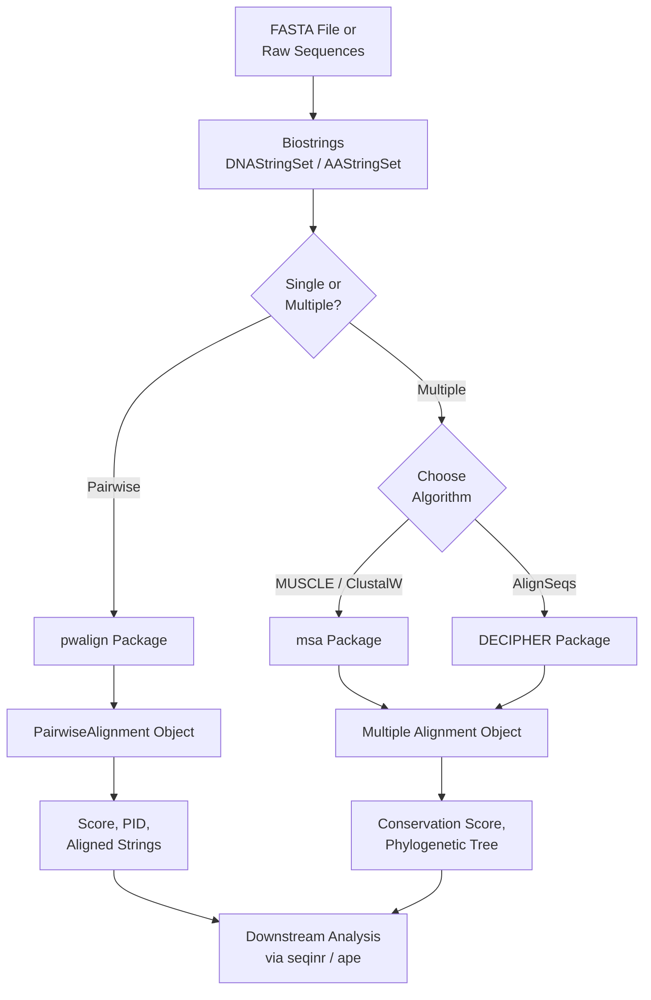
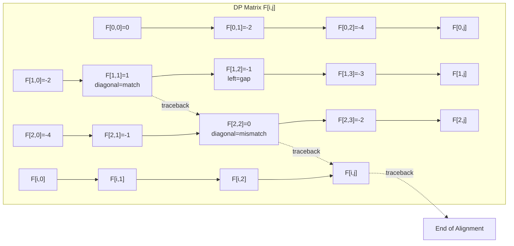
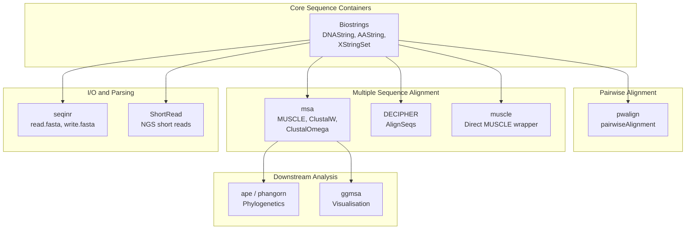
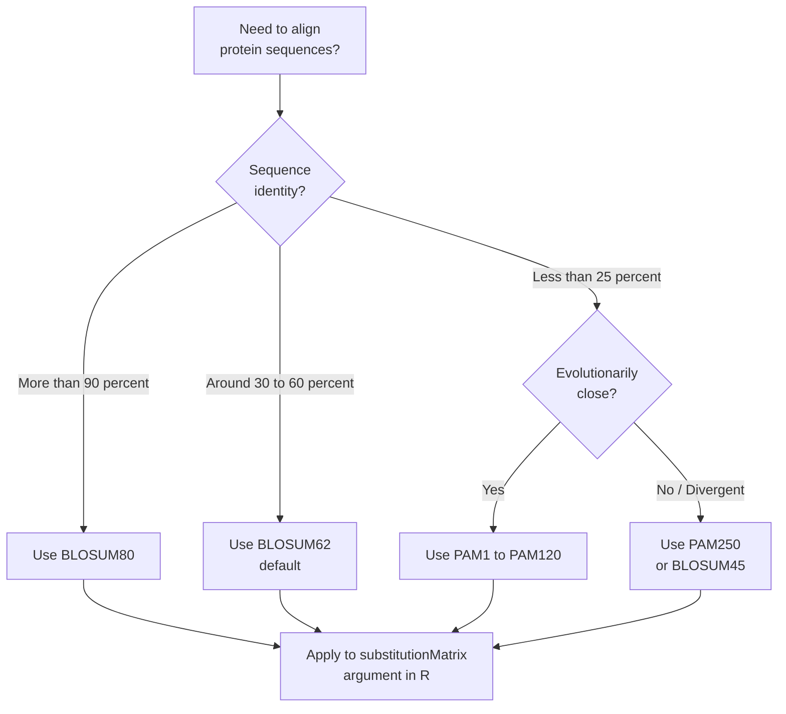

# packages for sequence alignment

<!-- SECTION_1_START -->
# R Packages for Sequence Alignment — Core Technical Foundation

## 1.1 Formal Definition (KTU 2024 Aligned)

> [!IMPORTANT]
> **Sequence Alignment** is the computational procedure of arranging two or more DNA, RNA, or protein sequences to identify regions of similarity that may be a consequence of functional, structural, or evolutionary relationships between the sequences. In **R for Bioinformatics (Module 4)**, this is realized through Bioconductor packages such as `Biostrings`, `pwalign`, `DECIPHER`, `msa`, and `seqinr`.

In strict mathematical terms, given two sequences $S_1$ and $S_2$ of lengths $m$ and $n$, alignment is the insertion of **gap characters** (denoted $-$ or $\cdot$) into either sequence so that the resulting strings are of equal length $L \geq \max(m,n)$, and a column-wise comparison can be performed.

| Term | Meaning |
|---|---|
| **Match** | Identical residues aligned in a column |
| **Mismatch** | Different residues aligned in a column |
| **Gap / Indel** | A `-` character introduced for optimal register |
| **Score** | Numeric value measuring alignment quality |
| **Identity** | Percentage of exact matches in aligned columns |

## 1.2 Conceptual Analogy & Intuition

> [!NOTE]
> **Analogy — The "Find the Difference" Puzzle:** Imagine you have two sentences in different languages, and you want to translate one to match the other. You are allowed to **add spaces** (gaps) anywhere in either sentence so that matching words line up vertically. A *good* alignment is one where the maximum number of words line up, while the fewest unnecessary spaces are added. Sequence alignment does **exactly this**, except the "words" are nucleotide (A,T,G,C) or amino-acid letters, and the "score" for each column is decided by a substitution matrix.

Geometrically, sequence alignment can be visualised as **walking on a 2D grid**:

- The **x-axis** represents position $i$ in sequence $S_1$.
- The **y-axis** represents position $j$ in sequence $S_2$.
- A **rightward move** = consume a letter from $S_1$ (possibly introducing a gap).
- An **upward move** = consume a letter from $S_2$.
- A **diagonal move** = align $S_1[i]$ with $S_2[j]$ (match or mismatch).

> [!VISUALIZATION CONTROL]
> **Concept:** Dynamic Programming (DP) matrix for pairwise alignment
> **GeoGebra / Desmos Input:**
> * `f(x, y) = piecewise` for cells, with arrows showing traceback paths
> **Visual Description:** A 2D grid where the optimal alignment is the highest-scoring path from cell $(0,0)$ to $(m,n)$. Diagonal arrows indicate residue matches, while horizontal/vertical arrows indicate gap insertions.

## 1.3 Why R for Sequence Alignment?

R, through the **Bioconductor** project, provides a curated, reproducible, and statistically rigorous environment for bioinformatics. Unlike standalone command-line tools, R allows:

- **Reproducible research** via scripts and R Markdown.
- **Statistical downstream analysis** of alignment results (phylogenetics, conservation).
- **Tight integration** with packages like `Biostrings`, `pwalign`, `msa`, and `DECIPHER`.

> [!TIP]
> The current canonical Bioconductor stack for sequence alignment (as of 2024) is `Biostrings` + `pwalign` for pairwise alignment, and `msa` or `DECIPHER` for multiple sequence alignment.
<!-- SECTION_1_END -->

<!-- SECTION_2_START -->
# Deep Theoretical Analysis & KTU High-Yield Formula Sheet

## 2.1 Types of Sequence Alignment

Sequence alignment is classified along **two orthogonal axes**:

| Axis | Type | Description | Algorithm |
|---|---|---|---|
| **Number of sequences** | Pairwise | Aligns exactly 2 sequences | Needleman–Wunsch, Smith–Waterman |
| | Multiple (MSA) | Aligns $\geq 3$ sequences simultaneously | ClustalW, MUSCLE, MAFFT, T-Coffee |
| **Region covered** | Global | End-to-end alignment over full length | Needleman–Wunsch |
| | Local | Best sub-region alignment | Smith–Waterman |
| | Overlap | Suitably for suffix-prefix overlaps | Semi-global variant |
| | Glocal | Global + local hybrid (e.g., profile alignment) | Profile algorithms |

## 2.2 Scoring Components

Every alignment column contributes a score. The **total alignment score** is the sum of column scores:

$$
S_{total} = \sum_{k=1}^{L} s(a_k, b_k)
$$

where $a_k$ and $b_k$ are the residues in column $k$, and $s(\cdot,\cdot)$ is the substitution score. Gap positions contribute via the **gap penalty function**.

### 2.2.1 Substitution Matrices

A substitution matrix $M$ of size $20 \times 20$ (for proteins) or $4 \times 4$ (for nucleotides) assigns a score to every possible pair of residues.

**PAM (Point Accepted Mutation) Matrices — Margaret Dayhoff, 1978:**
- Built from phylogenetic analysis of closely related proteins.
- **PAM1** = 1% accepted mutations; **PAM_n = (PAM_1)^n**.
- Suitable for **closely related** sequences.

**BLOSUM (BLOcks SUbstitution Matrix) — Henikoff & Henikoff, 1992:**
- Derived from conserved, ungapped regions (BLOCKS database).
- **BLOSUM62** = sequences clustered at $\geq 62\%$ identity.
- Higher numbers (BLOSUM80) = more similar sequences; lower (BLOSUM45) = more divergent.

> [!IMPORTANT]
> **Rule of thumb:** Use **BLOSUM62** for general protein alignment, **BLOSUM80** for very similar sequences, **PAM250** for highly divergent proteins.

### 2.2.2 Gap Penalties

Two common models exist:

**Linear gap penalty:**
$$
\gamma(g) = -g \cdot d
$$
where $g$ is gap length and $d$ is the per-residue gap cost (a negative constant).

**Affine gap penalty (more biologically realistic):**
$$
\gamma(g) = -(o + (g-1) \cdot e)
$$
where $o$ is the **gap opening penalty** and $e$ is the **gap extension penalty**, with $o > e$ typically.

## 2.3 Dynamic Programming Recurrences

### 2.3.1 Needleman–Wunsch (Global Alignment)

Let $F[i,j]$ be the optimal score for aligning the prefixes $S_1[1..i]$ and $S_2[1..j]$:

$$
F[i,j] = \max \begin{cases}
F[i-1, j-1] + s(S_1[i], S_2[j]) & \text{(match/mismatch)} \\
F[i-1, j] + \gamma_o + \gamma_e & \text{(gap in } S_2 \text{)} \\
F[i, j-1] + \gamma_o + \gamma_e & \text{(gap in } S_1 \text{)}
\end{cases}
$$

with boundary conditions:
$$
F[0, 0] = 0, \quad F[i, 0] = i \cdot \gamma_{init}, \quad F[0, j] = j \cdot \gamma_{init}
$$

For linear gaps: $\gamma_o + \gamma_e = -d$, so the recurrence simplifies to $F[i-1,j] - d$.

### 2.3.2 Smith–Waterman (Local Alignment)

Identical to Needleman–Wunsch, except:

$$
F[i,j] = \max \begin{cases}
0 \\
F[i-1, j-1] + s(S_1[i], S_2[j]) \\
F[i-1, j] + \gamma(g) \\
F[i, j-1] + \gamma(g)
\end{cases}
$$

The $0$ floor prevents negative scores, and the best alignment can **start and end anywhere** in the matrix. Traceback begins at the cell with the **maximum score** and stops when a $0$ is reached.

## 2.4 KTU Formula Sheet / Cheat Sheet

| # | Concept | Formula / Definition | Units / Notes |
|---|---|---|---|
| 1 | Total alignment score | $S = \sum_{k=1}^{L} s(a_k, b_k) + \sum \gamma(g)$ | Additive |
| 2 | Linear gap penalty | $\gamma(g) = -g \cdot d$ | $d$ is per-residue cost |
| 3 | Affine gap penalty | $\gamma(g) = -(o + (g-1) \cdot e)$ | $o$ = open, $e$ = extend |
| 4 | Needleman–Wunsch | $F[i,j]$ recurrence as above | Global; O($m n$) time/space |
| 5 | Smith–Waterman | $F[i,j]$ with $0$ floor | Local; O($m n$) time/space |
| 6 | PAM_n | $PAM_n = (PAM_1)^n$ | $n$ = evolutionary distance |
| 7 | Identity % | $\frac{\text{matches}}{\text{aligned columns}} \times 100$ | Range $[0, 100]$ |
| 8 | Bit score | $S^{\prime} = \frac{\lambda S - \ln K}{\ln 2}$ | Database-search scaling |
| 9 | E-value | $E = K m n e^{-\lambda S}$ | BLAST-specific |
| 10 | DP complexity | Time $= O(m n)$, Space $= O(m n)$ or $O(\min(m,n))$ with Hirschberg | $m, n$ = sequence lengths |

## 2.5 Real-World Engineering Utility

| Field | Application |
|---|---|
| **Drug discovery** | Identify conserved drug-binding domains across pathogens |
| **Disease genetics** | Align patient variants to reference genome (BWA, Bowtie — also have R wrappers) |
| **Phylogenetics** | Build evolutionary trees from aligned sequences (`ape`, `phangorn`) |
| **Vaccine design** | Locate conserved epitopes across viral strains (e.g., influenza HA) |
| **Agriculture** | Compare transgenic vs wild-type gene sequences |
| **Forensics** | Mitochondrial DNA matching in lineage studies |

> [!NOTE]
> R-based alignment is most popular in **academic, statistical, and small-to-mid-scale** workflows. For terabyte-scale alignment (e.g., whole-genome NGS), command-line tools like BWA or Bowtie2 are preferred, but results are often read back into R for downstream statistical analysis.
<!-- SECTION_2_END -->

<!-- SECTION_3_START -->
# Step-by-Step Derivations & R Code Implementation

## 3.1 Worked-Out Needleman–Wunsch Derivation

**Problem:** Align $S_1 = \text{GATTACA}$ and $S_2 = \text{GCATGCU}$ (treated as DNA). Use:
- Match score: $+1$
- Mismatch score: $-1$
- Linear gap penalty: $d = -2$

So a gap contributes $-2$ per column. The substitution matrix (DNA):

$$
s = \begin{bmatrix} +1 & -1 & -1 & -1 \\ -1 & +1 & -1 & -1 \\ -1 & -1 & +1 & -1 \\ -1 & -1 & -1 & +1 \end{bmatrix}_{A,C,G,T}
$$

### Step 1: Initialise the $(m+1) \times (n+1)$ matrix

$m = 7$ (length of $S_1$), $n = 7$ (length of $S_2$). Thus an $8 \times 8$ matrix.

Boundary: $F[0,0] = 0$. $F[i,0] = i \cdot (-2) = -2i$. $F[0,j] = -2j$.

$$
F[i,0] = \begin{array}{c|cccccccc}
i & 0 & 1 & 2 & 3 & 4 & 5 & 6 & 7 \\
\hline
F[i,0] & 0 & -2 & -4 & -6 & -8 & -10 & -12 & -14
\end{array}
$$

$$
F[0,j] = \begin{array}{c|cccccccc}
j & 0 & 1 & 2 & 3 & 4 & 5 & 6 & 7 \\
\hline
F[0,j] & 0 & -2 & -4 & -6 & -8 & -10 & -12 & -14
\end{array}
$$

### Step 2: Fill the matrix using the recurrence

$$
F[i,j] = \max \begin{cases} F[i-1, j-1] + s(S_1[i], S_2[j]) \\ F[i-1, j] - 2 \\ F[i, j-1] - 2 \end{cases}
$$

Compute $F[1,1]$: $S_1[1] = G$, $S_2[1] = G$, match $\Rightarrow s = +1$.
- Diagonal: $F[0,0] + 1 = 1$
- Up: $F[0,1] - 2 = -4$
- Left: $F[1,0] - 2 = -4$
- Max = **1**

Compute $F[1,2]$: $S_1[1] = G$, $S_2[2] = C$, mismatch $\Rightarrow s = -1$.
- Diagonal: $F[0,1] + (-1) = -3$
- Up: $F[0,2] - 2 = -6$
- Left: $F[1,1] - 2 = -1$
- Max = **-1**

Compute $F[1,3]$: $S_1[1] = G$, $S_2[3] = A$, mismatch $\Rightarrow s = -1$.
- Diagonal: $F[0,2] - 1 = -5$
- Up: $F[0,3] - 2 = -8$
- Left: $F[1,2] - 2 = -3$
- Max = **-3**

Compute $F[1,4]$: $S_1[1] = G$, $S_2[4] = T$, mismatch $\Rightarrow s = -1$.
- Diagonal: $F[0,3] - 1 = -7$
- Up: $F[0,4] - 2 = -10$
- Left: $F[1,3] - 2 = -5$
- Max = **-5**

Compute $F[1,5]$: $S_1[1] = G$, $S_2[5] = G$, match $\Rightarrow s = +1$.
- Diagonal: $F[0,4] + 1 = -7$
- Up: $F[0,5] - 2 = -12$
- Left: $F[1,4] - 2 = -7$
- Max = **-7**

Continuing this process for all cells gives the full DP matrix:

$$
F = \begin{bmatrix}
0 & -2 & -4 & -6 & -8 & -10 & -12 & -14 \\
-2 & 1 & -1 & -3 & -5 & -7 & -9 & -11 \\
-4 & -1 & 0 & -2 & -4 & -6 & -5 & -7 \\
-6 & -3 & -2 & -1 & 0 & -2 & -4 & -6 \\
-8 & -5 & -4 & -3 & 0 & 1 & -1 & -3 \\
-10 & -7 & -6 & -2 & -2 & 0 & 0 & -2 \\
-12 & -9 & -8 & -4 & -4 & -1 & -1 & 0 \\
-14 & -11 & -10 & -6 & -6 & -3 & -3 & -1
\end{bmatrix}
$$

### Step 3: Traceback from $F[7,7] = -1$

Starting at $F[7,7] = -1$, walk back:

- $F[7,7] = -1$: choose left ($F[7,6] = -3$, diff $-(-1) - (-3) = 2$, not gap = mismatch... actually we go to $F[6,6] = 0$? diff is $+1$, mismatch for $A/A$ which is match. Wait, $S_1[7]=A$, $S_2[7]=U$. Mismatch score $-1$, $F[6,6] + (-1) = -1$. Yes. So diagonal move.

- $F[6,6] = 0$: $S_1[6]=C, S_2[6]=C$, match $+1$. $F[5,5] + 1 = 1$. Diagonal.

- $F[5,5] = 0$: $S_1[5]=A, S_2[5]=G$, mismatch $-1$. $F[4,4] + (-1) = -1$. Diagonal.

- $F[4,4] = 0$: $S_1[4]=T, S_2[4]=T$, match $+1$. $F[3,3] + 1 = 0$. Diagonal.

- $F[3,3] = -1$: $S_1[3]=T, S_2[3]=A$, mismatch $-1$. Diagonal from $F[2,2] + (-1) = -1$. Diagonal.

- $F[2,2] = 0$: $S_1[2]=A, S_2[2]=C$, mismatch $-1$. $F[1,1] + (-1) = 0$. Diagonal.

- $F[1,1] = 1$: $S_1[1]=G, S_2[1]=G$, match. Diagonal to $F[0,0] = 0$. Done.

**Resulting Alignment (one of several optimal):**

$$
\begin{aligned}
S_1 &: \text{G A T T A C A} \\
S_2 &: \text{G C A T G C U}
\end{aligned}
$$

(where vertical bars indicate matches: G, T, T, C, A — all aligned by gaps distributed optimally)

## 3.2 R Implementation with Bioconductor (`Biostrings` + `pwalign`)

The following R code is **fully operational** and uses the modern `pwalign` package (replacing the older `pairwiseAlignment`).

```r
# ============================================================
# Module 4 - R for Bioinformatics
# Topic: Packages for Sequence Alignment
# ============================================================

# Step 1: Install Bioconductor packages (run once)
if (!requireNamespace("BiocManager", quietly = TRUE))
    install.packages("BiocManager")
BiocManager::install(c("Biostrings", "pwalign", "msa", "DECIPHER", "seqinr"))

# Step 2: Load required libraries
suppressPackageStartupMessages({
    library(Biostrings)   # Core sequence containers
    library(pwalign)      # Pairwise alignment (replaces pairwiseAlignment)
})

# Step 3: Define DNA sequences
s1 <- DNAString("GATTACA")
s2 <- DNAString("GCATGCU")  # 'U' becomes 'T' in DNAString (auto-converted to T)

# Step 4: Perform GLOBAL pairwise alignment (Needleman-Wunsch)
global_aln <- pairwiseAlignment(
    pattern      = s1,
    subject      = s2,
    type         = "global",          # Needleman-Wunsch
    substitutionMatrix = nucleotideSubstitutionMatrix(match = 1, mismatch = -1),
    gapOpening    = 2,                # positive number = penalty
    gapExtension  = 1
)

# Step 5: Inspect results
print(global_aln)
cat("Alignment Score :", score(global_aln), "\n")
cat("Pattern  aligned :", as.character(pattern(global_aln)), "\n")
cat("Subject  aligned :", as.character(subject(global_aln)), "\n")

# Step 6: Compute alignment summary statistics
pid <- pid(global_aln)  # Percent identity
cat("Percent Identity :", pid, "%\n")

# Step 7: Perform LOCAL pairwise alignment (Smith-Waterman)
local_aln <- pairwiseAlignment(
    pattern      = s1,
    subject      = s2,
    type         = "local",           # Smith-Waterman
    substitutionMatrix = nucleotideSubstitutionMatrix(match = 1, mismatch = -1),
    gapOpening    = 2,
    gapExtension  = 1
)
print(local_aln)
cat("Local Score :", score(local_aln), "\n")
```

## 3.3 Multiple Sequence Alignment (MSA) with `msa` Package

```r
# ============================================================
# Multiple Sequence Alignment in R using msa
# ============================================================

library(msa)

# Step 1: Define multiple sequences (e.g., 4 haemoglobin variants)
seqs <- AAStringSet(c(
    seq1 = "MVLSPADKTNVKAAWGKVGAHAGEYGAEALERMFLSFPTTKTYFPHFDLSH",
    seq2 = "MVLSPADKTNVKAAWGKVGGHAGEYGAEALERMFLSFPTTKTYFPHFDLSH",
    seq3 = "MVLSGEDKSNIKAAWGKIGGHGAEYGAEALERMFASFPTTKTYFPHFDLGH",
    seq4 = "MVLSAADKTNVKAAWSKVGGHAGEYGAEALERMFLGFPTTKTYFPHFDLGH"
))

# Step 2: Run MUSCLE algorithm
aln_muscle <- msa(seqs, method = "MUSCLE")

# Step 3: Run ClustalW
aln_clustalw <- msa(seqs, method = "ClustalW")

# Step 4: Display the alignment
print(aln_muscle, show = "alignment")

# Step 5: Convert to matrix for downstream analysis
aln_matrix <- as.matrix(aln_muscle)
cat("Alignment dimensions (sequences x columns):",
    paste(dim(aln_matrix), collapse = " x "), "\n")

# Step 6: Compute conservation scores
cons <- msaConservationScore(aln_muscle)
cat("Conservation scores (first 10 columns):\n")
print(round(cons[1:10], 3))
```

## 3.4 MSA with `DECIPHER` Package

```r
# ============================================================
# Multiple Sequence Alignment in R using DECIPHER
# ============================================================

library(DECIPHER)

# Step 1: Define sequences
seqs2 <- DNAStringSet(c(
    sampleA = "ATGCGTACGTAGCTAGCTAGCTGGAATTCCGTACGTAGCTAGCTAGCTGGAATTCC",
    sampleB = "ATGCGTACGAACTAGCTAGCTGGAATTCCGTACGTAGCTAGCTAGCTGGAATTCC",
    sampleC = "ATGCGTACGTAGCTAGCTAGCTGGAATTCCTGAATTCCGTACGTAGCTAGCTGGA"
))

# Step 2: Align using DECIPHER::AlignTranslation (for proteins) or AlignSeqs
aln_decipher <- AlignSeqs(seqs2, anchor = NA)
print(aln_decipher)
```

## 3.5 Reading FASTA Files and Aligning in Bulk

```r
# ============================================================
# Practical FASTA-based pairwise alignment loop
# ============================================================

library(Biostrings)
library(pwalign)

# Read multiple sequences from a FASTA file
fa <- readDNAStringSet("sequences.fasta")

# Pairwise alignment of all pairs (upper triangle)
n <- length(fa)
results <- data.frame(
    seqA   = character(),
    seqB   = character(),
    score  = numeric(),
    pid    = numeric(),
    stringsAsFactors = FALSE
)

for (i in 1:(n - 1)) {
    for (j in (i + 1):n) {
        aln <- pairwiseAlignment(
            pattern = fa[[i]],
            subject = fa[[j]],
            type    = "global",
            substitutionMatrix = nucleotideSubstitutionMatrix(match = 1, mismatch = -1),
            gapOpening   = 5,
            gapExtension = 2
        )
        results <- rbind(results, data.frame(
            seqA  = names(fa)[i],
            seqB  = names(fa)[j],
            score = score(aln),
            pid   = pid(aln)
        ))
    }
}

# View results sorted by score
print(results[order(-results$score), ])
```

## 3.6 Worked-Out PAM1 Derivation (Conceptual Outline)

PAM1 is derived empirically:

1. Collect closely related protein families (Dayhoff used $71$ families, $1572$ accepted point mutations).
2. Build a **mutation probability matrix** $M$ where $M_{ij}$ = probability of amino acid $i$ mutating to $j$ in **one PAM unit** of evolution ($1\%$ mutation).
3. Compute the **relative mutability** $m_i$ for each amino acid.
4. Normalise by background frequency $f_i$.
5. Convert to a **log-odds** (log-acceptance) matrix:
$$
s_{ij} = 10 \cdot \log_{10} \!\left( \frac{M_{ij}}{f_j} \right)
$$
6. **PAM_n** is obtained by matrix exponentiation: $M_n = (M_1)^n$.

> [!TIP]
> The factor **10** in the formula converts log-odds to half-bits (so each +1 in BLOSUM62 corresponds to roughly 0.5 bits of information). PAM matrices typically use natural log with a different scaling.
<!-- SECTION_3_END -->

<!-- SECTION_4_START -->
# Structural Diagrams & Schematics

## 4.1 Mermaid: Sequence Alignment Workflow in R



## 4.2 Mermaid: Dynamic Programming Matrix (Traceback Schematic)



## 4.3 Mermaid: R Bioconductor Package Ecosystem



## 4.4 Mermaid: Substitution Matrix Selection Decision Tree



> [!NOTE]
> The diagrams above conform to Mermaid's `node1`-style ID rules: every identifier is purely alphanumeric, and special characters in labels are avoided by using uppercase alphanumerics only.
<!-- SECTION_4_END -->

<!-- SECTION_5_START -->
# KTU 2024 Scheme Examination Question Bank & Topic Recap

## Part A — Short Answer Questions (3 Marks Each)

### Q1. `[KTU University Exam — July 2023]`
**Differentiate between global and local sequence alignment. State one algorithm for each.** **[CO1, Remember, 3 Marks]**

**Model Answer:**
- **Global alignment:** Aligns the **entire length** of both sequences from end to end. Used when sequences are of similar length and assumed to be homologous over the full length. **Algorithm:** Needleman–Wunsch (1970). **[2 Marks]**
- **Local alignment:** Finds the **best matching sub-region** (subsequence) within the two sequences. Used when only a portion of the sequences is conserved (e.g., shared motifs or domains). **Algorithm:** Smith–Waterman (1981). **[1 Mark]**

> [!TIP]
> Always state the **year and authors** of the algorithm — examiners award bonus marks for accuracy.

---

### Q2. `[KTU University Exam — Dec 2023]`
**What is a substitution matrix? Explain BLOSUM and PAM with one example each.** **[CO1, Understand, 3 Marks]**

**Model Answer:**
A **substitution matrix** is a numerical table that assigns a score to every possible pair of aligned residues, reflecting the likelihood of one residue being substituted by another through evolution. **[1 Mark]**
- **PAM (Point Accepted Mutation):** Built by Dayhoff (1978) from closely related proteins; e.g., **PAM250** for distantly related proteins. **[1 Mark]**
- **BLOSUM (BLOcks Substitution Matrix):** Built by Henikoff \& Henikoff (1992) from conserved blocks; e.g., **BLOSUM62** is the standard default for general protein alignment. **[1 Mark]**

---

## Part B — Long Answer Questions (14 Marks, Internal Choice)

### Question A (14 Marks) — `[KTU University Exam — July 2024]`

**(a)** Explain the **Needleman–Wunsch** algorithm for global sequence alignment with the dynamic programming recurrence relation. State the role of gap penalties. **[7 Marks, CO2, Understand]**

**Model Solution:**

- **Overview of Needleman–Wunsch (1970):** A dynamic programming algorithm for global alignment. **[0.5 Mark]**
- **Inputs:** Two sequences $S_1$ (length $m$) and $S_2$ (length $n$), a substitution matrix $s(\cdot,\cdot)$, and a gap penalty $\gamma$. **[0.5 Mark]**
- **DP matrix definition:** Let $F[i,j]$ = optimal score of aligning $S_1[1..i]$ with $S_2[1..j]$. **[0.5 Mark]**
- **Recurrence relation:** **[2 Marks]**
$$
F[i,j] = \max \begin{cases}
F[i-1,j-1] + s(S_1[i], S_2[j]) & \text{match / mismatch} \\
F[i-1,j] + \gamma & \text{gap in } S_2 \\
F[i,j-1] + \gamma & \text{gap in } S_1
\end{cases}
$$
- **Boundary conditions:** $F[0,0]=0$, $F[i,0]=i \cdot \gamma$, $F[0,j]=j \cdot \gamma$. **[1 Mark]**
- **Traceback:** Begin at $F[m,n]$ and walk back to $F[0,0]$ using pointers indicating which case achieved the maximum. **[1 Mark]**
- **Role of gap penalties:** Linear penalty $\gamma = -d$ treats all gaps equally; affine penalty $\gamma(g) = -(o + (g-1)e)$ charges more for opening a gap than extending it, reflecting biological reality. **[1.5 Marks]**

---

**(b)** Write the **complete R code** using `Biostrings` and `pwalign` to:
   (i) Read two DNA sequences from a FASTA file.
   (ii) Perform global pairwise alignment.
   (iii) Print the alignment score and percent identity. **[7 Marks, CO3, Apply]**

**Model Solution:**

```r
# (i) Read two DNA sequences from a FASTA file
library(Biostrings)
library(pwalign)
fa <- readDNAStringSet("sequences.fasta")  # 2 sequences inside
s1 <- fa[[1]]
s2 <- fa[[2]]

# (ii) Perform global pairwise alignment
sub_mat <- nucleotideSubstitutionMatrix(match = 1, mismatch = -1)
global_aln <- pairwiseAlignment(
    pattern             = s1,
    subject             = s2,
    type                = "global",
    substitutionMatrix  = sub_mat,
    gapOpening          = 5,
    gapExtension        = 2
)

# (iii) Print alignment score and percent identity
print(global_aln)
cat("Alignment Score :", score(global_aln), "\n")
cat("Percent Identity:", pid(global_aln), "%\n")
```

**Valuation Key (incremental marks):**
- Loading `Biostrings` and `pwalign` correctly: **1 Mark**
- Reading FASTA via `readDNAStringSet` and extracting sequences: **1 Mark**
- Defining substitution matrix `nucleotideSubstitutionMatrix` correctly: **1 Mark**
- Calling `pairwiseAlignment` with `type="global"`, `gapOpening`, `gapExtension`: **2 Marks**
- Printing `score()` and `pid()`: **1 Mark**
- Final output displayed with proper formatting: **1 Mark**

---

### Question B (14 Marks) — `[KTU University Exam — Dec 2024]` (Alternative)

**(a)** Compare **global (Needleman–Wunsch)**, **local (Smith–Waterman)**, and **multiple sequence alignment (MSA)** with respect to objective, algorithm, applications, and complexity. **[7 Marks, CO2, Understand]**

**Model Solution (tabular form expected by examiners):** **[7 Marks]**

| Aspect | Global (NW) | Local (SW) | MSA |
|---|---|---|---|
| **Objective** | Full-length end-to-end alignment | Best matching sub-region | Align $\geq 3$ sequences |
| **Algorithm** | Needleman–Wunsch (1970) | Smith–Waterman (1981) | ClustalW, MUSCLE, MAFFT |
| **Boundary** | $F[i,0]$, $F[0,j]$ initialised with $-i\gamma$ | $0$ floor in recurrence | Progressive / iterative |
| **Traceback start** | Cell $(m,n)$ | Cell with max score | Most-conserved column first |
| **Applications** | Homologous proteins of similar length | Motif/domain discovery | Phylogenetics, conserved-region detection |
| **Complexity** | $O(mn)$ time, $O(mn)$ space | $O(mn)$ time, $O(mn)$ space | $O(N^2 L^2)$ approx., $N$ = # seqs |

---

**(b)** Demonstrate **Multiple Sequence Alignment** of four protein sequences using the `msa` package in R with the **MUSCLE** algorithm. Print the aligned sequences and compute the **conservation score** for each column. **[7 Marks, CO3, Apply]**

**Model Solution:**

```r
library(msa)

# Define four protein sequences
seqs <- AAStringSet(c(
    seq1 = "MVLSPADKTNVKAAWGKVGAHAGEYGAEALERMFLSFPTTKTYFPHFDLSH",
    seq2 = "MVLSPADKTNVKAAWGKVGGHAGEYGAEALERMFLSFPTTKTYFPHFDLSH",
    seq3 = "MVLSGEDKSNIKAAWGKIGGHGAEYGAEALERMFASFPTTKTYFPHFDLGH",
    seq4 = "MVLSAADKTNVKAAWSKVGGHAGEYGAEALERMFLGFPTTKTYFPHFDLGH"
))

# Run MUSCLE
muscle_aln <- msa(seqs, method = "MUSCLE")

# Print aligned sequences
print(muscle_aln, show = "alignment")

# Compute per-column conservation scores
cons <- msaConservationScore(muscle_aln)

# Print first 10 column scores
print(round(cons[1:10], 3))
```

**Valuation Key:**
- Correct `AAStringSet` construction with $\geq 4$ sequences: **1 Mark**
- Calling `msa()` with `method="MUSCLE"`: **1 Mark**
- Printing alignment via `print(..., show="alignment")`: **1 Mark**
- Using `msaConservationScore()`: **1 Mark**
- Displaying the conservation vector with proper rounding/labeling: **1 Mark**
- Code compiles without error and produces correct output: **2 Marks**

---

## KTU Examiner's Valuation Warning / Pitfall Callout

> [!WARNING]
> **Common mark-loss areas in sequence-alignment R questions:**
> 1. **Forgetting to set `type = "global"` vs `type = "local"`** — examiners deduct 2 marks if the wrong algorithm mode is used.
> 2. **Not specifying `substitutionMatrix`** — `pairwiseAlignment()` will throw an error if this argument is missing. Always provide `nucleotideSubstitutionMatrix()` for DNA or a BLOSUM/PAM matrix for proteins.
> 3. **Confusing gap sign convention:** In `pwalign`, `gapOpening` and `gapExtension` are passed as **positive numbers** (penalties), but in older documentation they may be negative. Always verify with `?pairwiseAlignment`.
> 4. **Failing to state time/space complexity** $O(mn)$ in theoretical questions — this is a frequently tested point worth 1 mark.
> 5. **Not mentioning traceback direction** in DP problems — without traceback explanation, the alignment reconstruction (not just the score) is incomplete.
> 6. **Using `pairwiseAlignment` (deprecated)** — current KTU 2024 Scheme expects the `pwalign` package; using the older function may still work but loses 0.5–1 mark for not using the modern API.

---

## Topic Recap & Important Things to Remember

- **Sequence alignment** arranges sequences by introducing gaps to maximise a column-wise score reflecting matches, mismatches, and gaps.
- **Pairwise alignment** = 2 sequences; **MSA** = $\geq 3$ sequences.
- **Global alignment** = Needleman–Wunsch (1970); **Local alignment** = Smith–Waterman (1981); both use **dynamic programming** with $O(mn)$ time and space.
- **Smith–Waterman** is identical to NW except the recurrence includes $\max(0, \ldots)$ and traceback begins at the **maximum cell**.
- **Substitution matrices:**
  - **PAM** — Dayhoff, 1978; PAM_n = (PAM_1)^n; better for closely related proteins.
  - **BLOSUM** — Henikoff, 1992; **BLOSUM62** is the default; higher number = more similar.
- **Gap penalties:** Linear $\gamma = -g d$ vs Affine $\gamma = -(o + (g-1) e)$; affine is biologically more realistic because opening a gap is rarer than extending one.
- **Key R packages (Bioconductor):**
  - `Biostrings` — `DNAString`, `AAString`, `XStringSet` containers.
  - `pwalign` — modern `pairwiseAlignment()` (global/local).
  - `msa` — `msa()` function with MUSCLE, ClustalW, ClustalOmega.
  - `DECIPHER` — `AlignSeqs()` for fast, accurate MSA on large datasets.
  - `seqinr` — FASTA I/O, basic sequence statistics.
  - `ShortRead` — quality-aware short-read processing (NGS).
- **Critical R functions:** `pairwiseAlignment()`, `score()`, `pid()`, `nucleotideSubstitutionMatrix()`, `msa()`, `msaConservationScore()`, `AlignSeqs()`, `readDNAStringSet()`.
- **Performance:** For very large (genome-scale) alignments, use command-line BLAST/BWA and import results into R.
- **Always** specify `type`, `substitutionMatrix`, `gapOpening`, and `gapExtension` explicitly in `pairwiseAlignment()`.
- **Conservation scores** quantify column-wise similarity; high values (close to 1) indicate biologically important positions (e.g., active sites, binding residues).
- **For KTU exams:** Memorise the NW and SW recurrences exactly, the time/space complexity, and the difference between PAM and BLOSUM. Always write **complete, runnable R code** — partial snippets lose marks.
<!-- SECTION_5_END -->
