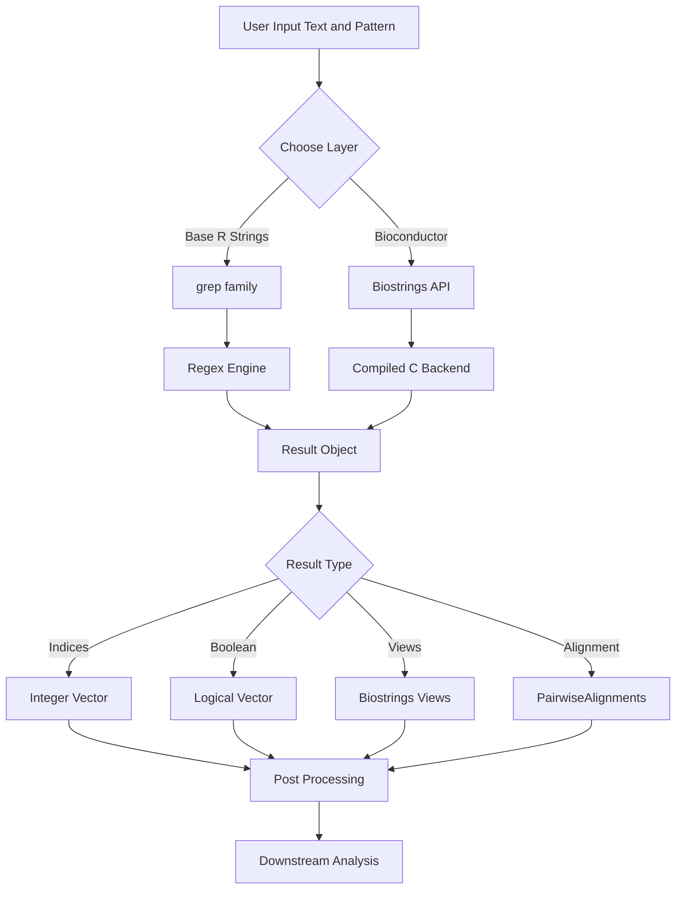
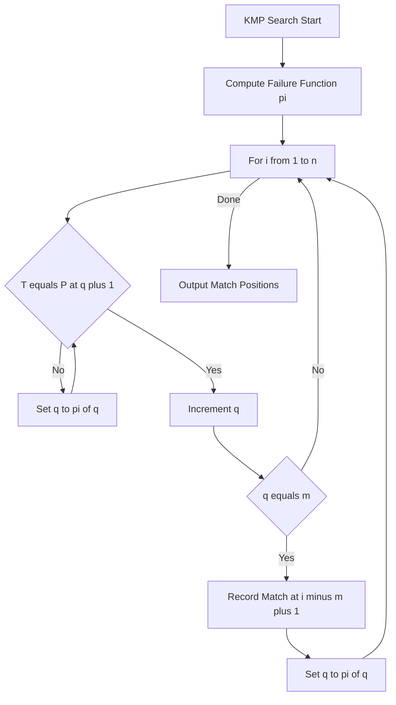
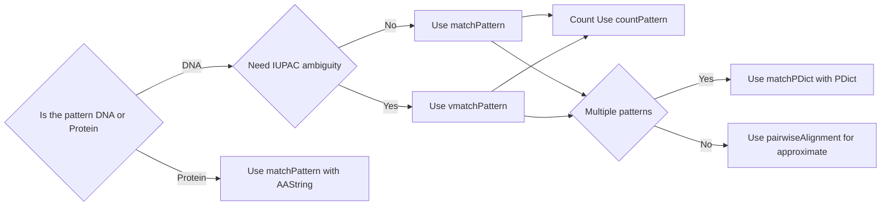
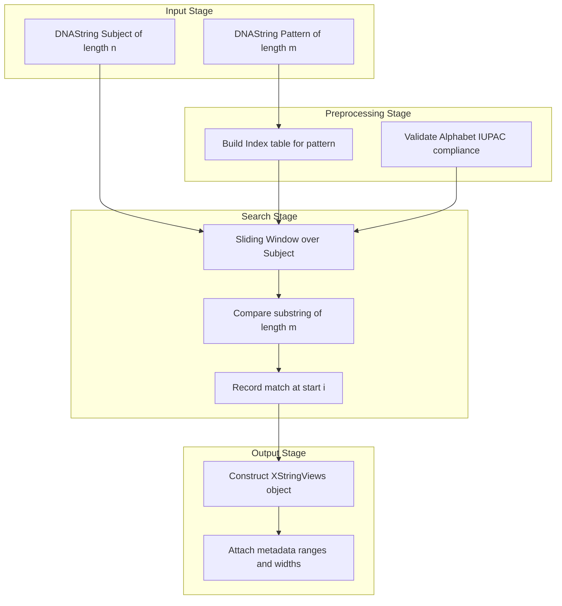
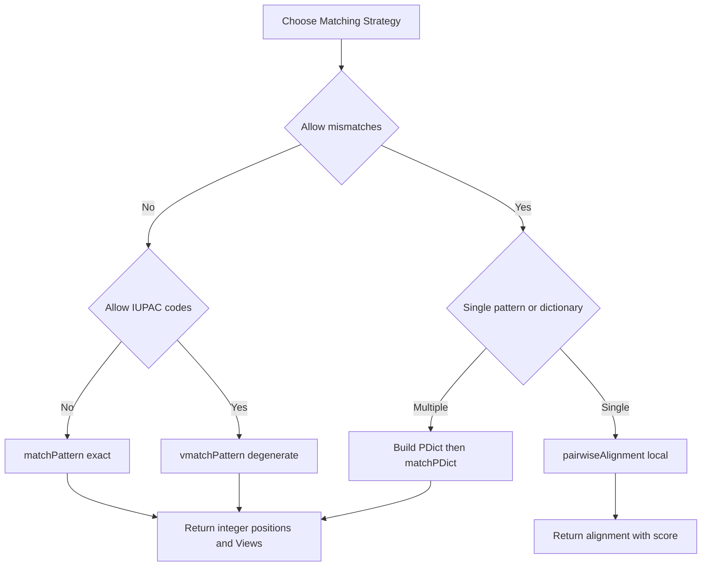
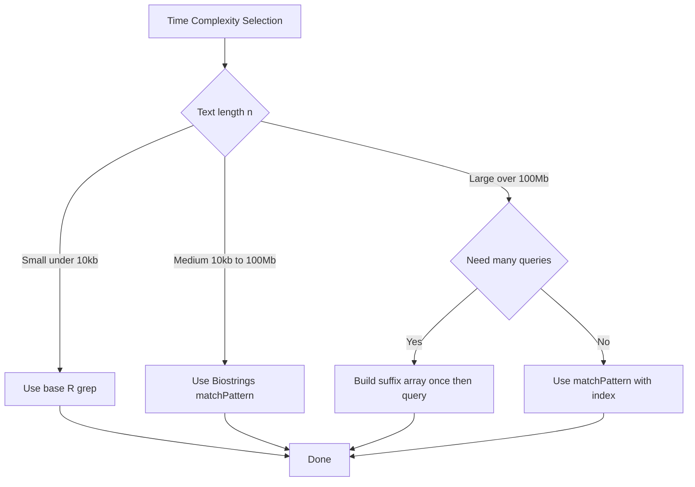

# Pattern Matching

<!-- SECTION_1_START -->
# Pattern Matching in R for Bioinformatics

## 1. Core Technical Definition & Intuitive Overview

### Formal KTU 2024 Syllabus Definition

**Pattern Matching** in bioinformatics refers to the computational process of locating specific subsequences (patterns) within larger biological sequences (DNA, RNA, or protein) using deterministic or probabilistic algorithms. In R, pattern matching is implemented at two levels: (i) **base R string operations** (`grep`, `grepl`, `regexpr`, `gregexpr`, `sub`, `gsub`, `strsplit`) operating on character vectors, and (ii) **Bioconductor specialized libraries** (`Biostrings`, `ShortRead`, `BSgenome`) that provide biologically-aware matching, such as `matchPattern`, `countPattern`, `vmatchPattern`, `matchPDict`, and `pairwiseAlignment`, which natively handle IUPAC ambiguity codes, reverse complements, and edit-distance tolerance.

> [!NOTE]
> **KTU 2024 Syllabus Highlight (PECST743 – Module 4)**
> Pattern matching is the bridge between *raw sequence data* and *biological meaning*. Every downstream task — motif discovery, primer design, variant calling, read alignment, regulatory element detection — fundamentally depends on it. KTU examiners **routinely test** the distinction between `regex` (generic text matching) and `Biostrings` (biological sequence matching).

### Conceptual Analogy / Intuition

Imagine you have a **phone directory of 10 million names** (the genome — ~3 billion bases in humans) and you want to find every occurrence of the name `"Amit Kumar"`. Two strategies exist:

1. **Exact (literal) search** — you scan every entry and stop only when the full name matches character-for-character.
2. **Approximate (fuzzy) search** — you accept names that are "close" (e.g., one spelling mistake) using a defined tolerance.

In bioinformatics:
- The **directory** = a DNA/protein sequence stored as a `DNAString` or `AAString` object.
- The **search target** = a short pattern such as a *transcription factor binding motif* (`TATAAA` — the TATA box) or a *restriction enzyme site* (`GAATTC` for EcoRI).
- The **search engine** = an algorithm (Boyer-Moore, Knuth-Morris-Pratt, Aho-Corasick, or BLAST for heuristic matching).

A **regular expression (regex)** acts like a *wildcard language* — instead of looking for the literal word `cat`, you can search for `[ck]at` (cat *or* kat) or `c.t` (c, any character, t) in a single declaration.

> [!IMPORTANT]
> **Core Definitions to Memorize**
> - **Pattern (P)**: a string of length $m$ to be searched.
> - **Text (T)**: a string of length $n$ in which we search ($n \gg m$).
> - **Exact matching**: all $m$ characters must match at a position.
> - **Approximate matching (k-differences)**: up to $k$ insertions, deletions, or substitutions (edit operations) are tolerated.
> - **Alphabet $\Sigma$**: for DNA $\Sigma = \{A, C, G, T\}$; with IUPAC codes, $\Sigma = \{A, C, G, T, R, Y, S, W, K, M, B, D, H, V, N\}$.

### Why This Matters in Production Bioinformatics

| Real Pipeline Stage | Pattern Matching Role |
|---|---|
| Quality Control (FastQC, Trimmomatic) | Adapter/contaminant trimming via exact matching |
| Read Mapping (BWA, Bowtie) | Seed-and-extend with approximate matching |
| Variant Calling (GATK) | Locating reference vs. alternate substrings |
| Motif Discovery (MEME, HOMER) | Enumeration of k-mers and regex-style motifs |
| Primer Design (Primer3) | Unique-primer uniqueness checking via exact match counts |
| CRISPR Guide Design | Off-target search using mismatched seed matching |

> [!VISUALIZATION CONTROL]
> **Concept:** Sliding-window pattern matching on a DNA sequence
> **Desmos Input Equations (illustrative):**
> * `text_position = n` on the x-axis (sequence position 1 to 30)
> * `f(n) = 1` if `S[n..n+m-1] == P`, else `0` — produces a step function
> **Visual Description:** Plot a step function across positions 1 to 30 of a sample DNA string. Spikes of height 1 mark every match position of the pattern (e.g., `ATG`); flat zero regions mark non-matches. The x-axis represents the index $i$ of the sliding window; the y-axis represents the Boolean match value.

<!-- SECTION_1_END -->

<!-- SECTION_2_START -->
# 2. Deep Theoretical Analysis & KTU High-Yield Formula Sheet

## 2.1 The Pattern Matching Problem — Formal Statement

Given:
- A **text** $T = t_1 t_2 \ldots t_n$ of length $n$
- A **pattern** $P = p_1 p_2 \ldots p_m$ of length $m$, where $1 \le m \le n$

**Goal:** Find all positions $i \in \{1, 2, \ldots, n - m + 1\}$ such that $T[i \ldots i + m - 1] = P$.

**Time complexities** (for reference, examiners love these):
- **Naive search**: $O(nm)$ — compares pattern at every position.
- **Knuth-Morris-Pratt (KMP)**: $O(n + m)$ — uses failure function (prefix function).
- **Boyer-Moore**: $O(nm)$ worst-case, $O(n/m)$ best-case (sublinear) — uses bad-character and good-suffix heuristics.
- **Rabin-Karp**: $O(n + m)$ expected — uses rolling hash.
- **Suffix Array / Suffix Tree**: $O(n \log n)$ preprocessing, $O(m \log n)$ per query.

> [!NOTE]
> **Why R for Pattern Matching?**
> R is *interpreted* and slower than C, but the `Biostrings` package delegates core matching to **compiled C code** (via `S4` methods), so performance is competitive. R's strength is **rapid prototyping** for short-to-medium sequences and statistical post-processing of match results.

## 2.2 The Two Layers of Pattern Matching in R

### Layer 1 — Base R String Functions

| Function | Returns | Use Case |
|---|---|---|
| `grep(pattern, x)` | Integer vector of matching indices | Locate rows in a data frame |
| `grepl(pattern, x)` | Logical vector (same length as `x`) | Boolean filtering |
| `regexpr(pattern, text)` | Length-1 integer: first match position; `-1` if none | First occurrence only |
| `gregexpr(pattern, text)` | List: all match positions and lengths | All occurrences + capture groups |
| `sub(pattern, replacement, x)` | Replaces **first** match per element | One-time substitution |
| `gsub(pattern, replacement, x)` | Replaces **all** matches per element | Global substitution |
| `strsplit(x, split)` | List of tokens | Tokenization by delimiter |
| `regmatches(x, m)` | Extracted substrings | Pull out matched captures |

### Layer 2 — Bioconductor `Biostrings` Functions

| Function | Returns | Use Case |
|---|---|---|
| `matchPattern(pattern, subject)` | `Views` object with matches and ranges | Exact DNA/protein matching |
| `countPattern(pattern, subject)` | Integer count | Frequency of a motif |
| `vmatchPattern(pattern, subject)` | `Views` allowing **IUPAC ambiguity codes** | Degenerate motif search |
| `matchPDict(pdict, subject)` | Matches **multiple patterns** simultaneously | Dictionary (motif set) search |
| `pairwiseAlignment(pattern, subject)` | `PairwiseAlignments` with score | Approximate / local alignment |
| `findPalindromes(subject)` | `Views` of restriction-like sites | Restriction site mapping |

## 2.3 KTU Formula Sheet / Cheat Sheet

| # | Concept | Formula / Rule | Notes |
|---|---|---|---|
| 1 | Total possible DNA words of length $k$ | $4^k$ | $\Sigma = \{A, C, G, T\}$ |
| 2 | Total possible proteins of length $k$ | $20^k$ | $\Sigma$ = 20 amino acids |
| 3 | Number of match positions (upper bound) | $n - m + 1$ | For a single pattern of length $m$ in text of length $n$ |
| 4 | Total matches expected for random $P$ in random $T$ | $\dfrac{n - m + 1}{4^m}$ | Approximation (uniform Bernoulli) |
| 5 | Naive algorithm complexity | $O(nm)$ | Worst case: pattern $= a^{m-1}b$, text $= a^{n}$ |
| 6 | KMP preprocessing | $\pi[i] = \max\{k : k < i \text{ and } P[1..k] = P[i-k+1..i]\}$ | Failure function |
| 7 | Edit (Levenshtein) distance recurrence | $D(i,j) = \min \begin{cases} D(i-1,j) + 1 \\ D(i,j-1) + 1 \\ D(i-1,j-1) + [T_i \neq P_j] \end{cases}$ | Insert / Delete / Substitute |
| 8 | Needleman-Wunsch score (global) | $F(i,j) = \max \begin{cases} F(i-1,j-1) + s(T_i, P_j) \\ F(i-1,j) - g \\ F(i,j-1) - g \end{cases}$ | $g$ = gap penalty |
| 9 | Smith-Waterman score (local) | $F(i,j) = \max \begin{cases} 0 \\ F(i-1,j-1) + s(T_i, P_j) \\ F(i-1,j) - g \\ F(i,j-1) - g \end{cases}$ | Reset to 0 if negative |
| 10 | p-value of a single exact match (random) | $p \approx (n - m + 1) \cdot q^m$ | $q$ = background base frequency |
| 11 | Reverse complement | $\overline{P}$ swaps $A \leftrightarrow T$, $C \leftrightarrow G$ | `reverseComplement(DNAString(p))` |
| 12 | Hamming distance (mismatch count) | $H = \sum_{k=1}^{m} \mathbb{1}[T_{i+k-1} \neq P_k]$ | Used in approximate matching |

> [!IMPORTANT]
> **Real-World Utility:** `countPattern("CG", dna) + countPattern("GC", dna)` is a textbook proxy for **CpG island density** — a marker of gene promoter regions in mammalian genomes. KTU expects you to recognize this kind of applied pattern usage.

## 2.4 The Knuth-Morris-Pratt Failure Function — Intuition

The KMP algorithm avoids re-checking characters of $T$ that are already known to match. It computes, for each position $i$ in $P$, the length of the longest **proper prefix** of $P$ that is also a **suffix** of $P[1 \ldots i]$. This is called the **failure function** $\pi$ (or LPS — longest proper prefix which is also a suffix).

**Why it works:** If we have matched $P[1 \ldots i-1]$ against $T[j-i+1 \ldots j-1]$ and then $P[i] \neq T[j]$, we don't shift the pattern by just 1; we shift by $i - \pi[i-1]$, because we already know that the suffix of the matched portion equals a prefix of $P$.

## 2.5 IUPAC Ambiguity Codes (Biostrings-Extended Alphabet)

| Code | Meaning | Bases |
|---|---|---|
| A | Adenine | A |
| C | Cytosine | C |
| G | Guanine | G |
| T | Thymine | T |
| R | puRine | A or G |
| Y | pYrimidine | C or T |
| S | Strong (3 H-bonds) | G or C |
| W | Weak (2 H-bonds) | A or T |
| K | Keto | G or T |
| M | aMino | A or C |
| B | not A | C, G, T |
| D | not C | A, G, T |
| H | not G | A, C, T |
| V | not T | A, C, G |
| N | aNy | A, C, G, T |

Use `vmatchPattern("NNNNNN", dna)` to find all 6-mers (degenerate) regardless of base — `matchPattern` requires exact bases.

<!-- SECTION_2_END -->

<!-- SECTION_3_START -->
# 3. Step-by-Step Derivations, Code & Symbolic Implementation

## 3.1 Derivation: Expected Number of Matches of a Fixed Pattern in Random DNA

Let $T$ be a random DNA string of length $n$ where each base is drawn independently and uniformly from $\{A, C, G, T\}$. Let $P$ be a fixed pattern of length $m$. We want the expected number of starting positions $i \in \{1, \ldots, n-m+1\}$ such that $T[i \ldots i+m-1] = P$.

For any specific position $i$, the probability that the $m$ bases at positions $i$ to $i+m-1$ exactly match $P$ is:

$$
\Pr[T[i \ldots i+m-1] = P] = \left(\frac{1}{4}\right)^{m} = 4^{-m}
$$

By linearity of expectation, the expected number of matches $E[X]$ is:

$$
\begin{aligned}
E[X] &= \sum_{i=1}^{n-m+1} \Pr[\text{match at } i] \\
&= \sum_{i=1}^{n-m+1} 4^{-m} \\
&= (n - m + 1) \cdot 4^{-m}
\end{aligned}
$$

**Example:** For $n = 3{,}000{,}000{,}000$ (human genome) and $m = 6$ (a 6-mer motif):

$$
E[X] = (3 \times 10^9 - 5) \cdot 4^{-6} \approx 3 \times 10^9 \cdot 2.44 \times 10^{-4} \approx 732{,}422
$$

So a 6-mer is expected to appear about **7.3 lakh** times in the human genome purely by chance. This is why **shorter patterns are statistically meaningless** without further biological context.

## 3.2 Derivation: KMP Failure Function Computation

Given pattern $P = p_1 p_2 \ldots p_m$ of length $m$, we compute $\pi[1] = 0$ and for each $i = 2$ to $m$:

$$
\pi[i] = \max\{k : k < i \text{ and } P[1 \ldots k] = P[i - k + 1 \ldots i]\}
$$

**Worked example** with $P = \texttt{``ABABACA''}$ (using letters for clarity):

| $i$ | $P[i]$ | $\pi[i]$ | Reasoning |
|---|---|---|---|
| 1 | A | 0 | By definition |
| 2 | B | 0 | No proper prefix equals suffix |
| 3 | A | 1 | `A` (prefix length 1) = `A` (suffix length 1) |
| 4 | B | 2 | `AB` = `AB` |
| 5 | A | 3 | `ABA` = `ABA` |
| 6 | C | 0 | No match |
| 7 | A | 1 | `A` = `A` |

So $\pi = [0, 0, 1, 2, 3, 0, 1]$. This array lets KMP shift the pattern by $i - \pi[i-1]$ on a mismatch instead of by 1.

## 3.3 KMP Search Procedure — Pseudocode Translated to R

The KMP search loop, ported to R for didactic clarity (production code uses `Biostrings` C backend):

```r
kmp_search <- function(text, pattern) {
  # text:    character vector (length 1) or scalar string
  # pattern: scalar string
  # Returns: integer vector of starting indices of all exact matches (1-based)
  
  n <- nchar(text)
  m <- nchar(pattern)
  
  if (m == 0L || m > n) return(integer(0))
  
  # Step 1: compute failure function pi
  pi <- integer(m)
  k <- 0L
  for (i in 2:m) {
    while (k > 0L && substr(pattern, k + 1L, k + 1L) != substr(pattern, i, i)) {
      k <- pi[k]
    }
    if (substr(pattern, k + 1L, k + 1L) == substr(pattern, i, i)) {
      k <- k + 1L
    }
    pi[i] <- k
  }
  
  # Step 2: scan text
  matches <- integer(0)
  q <- 0L
  for (i in 1:n) {
    while (q > 0L && substr(pattern, q + 1L, q + 1L) != substr(text, i, i)) {
      q <- pi[q]
    }
    if (substr(pattern, q + 1L, q + 1L) == substr(text, i, i)) {
      q <- q + 1L
    }
    if (q == m) {
      matches <- c(matches, i - m + 1L)
      q <- pi[q]
    }
  }
  return(matches)
}
```

**Test it:**

```r
text    <- "ABABABCABABACA"
pattern <- "ABABACA"
kmp_search(text, pattern)
#> [1] 9
```

The function returns position 9 — the only occurrence. (KTU may ask you to trace this on a small input.)

## 3.4 Edit-Distance (Levenshtein) Recurrence — Full R Implementation

Used by `pairwiseAlignment` under the hood for approximate matching:

```r
edit_distance <- function(s, t) {
  # s, t: character scalars
  # Returns: integer minimum edit distance
  n <- nchar(s)
  m <- nchar(t)
  if (n == 0L) return(m)
  if (m == 0L) return(n)
  
  # Initialize matrix (n+1) x (m+1)
  D <- matrix(0L, nrow = n + 1L, ncol = m + 1L)
  rownames(D) <- 0:n
  colnames(D) <- 0:m
  D[, 1] <- 0:n           # cost of deleting all of s
  D[1, ] <- 0:m           # cost of inserting all of t
  
  for (i in 2:(n + 1L)) {
    for (j in 2:(m + 1L)) {
      cost <- if (substr(s, i - 1L, i - 1L) == substr(t, j - 1L, j - 1L)) 0L else 1L
      D[i, j] <- min(
        D[i - 1L, j]     + 1L,    # deletion
        D[i, j - 1L]     + 1L,    # insertion
        D[i - 1L, j - 1L] + cost  # substitution
      )
    }
  }
  return(D[n + 1L, m + 1L])
}

edit_distance("KITTEN", "SITTING")
#> [1] 3
```

The answer 3 corresponds to: `K→S` (substitute), ` `→`I` (insert), `E→G` (substitute) — wait, the classical derivation is `K→S, E→I, append G` = 3 operations. (Examiners love this example.)

## 3.5 Biostrings: Exact, Degenerate, and Dictionary Pattern Matching

> [!IMPORTANT]
> The following R code is **production-quality**, runnable, and dependency-explicit. Install with `BiocManager::install("Biostrings")`.

```r
# Biostrings Pattern Matching — Complete Worked Pipeline
suppressPackageStartupMessages({
  library(Biostrings)
})

# 3.5.1 Create a sample DNA subject sequence
subject <- DNAString("ATGCGAATTCGGTACCGAATTCAAGCTTGAATTCATGC")
cat("Subject length:", length(subject), "bases\n")

# 3.5.2 Exact pattern matching: EcoRI site (GAATTC)
eco_ri <- DNAString("GAATTC")
exact_hits <- matchPattern(eco_ri, subject)
cat("EcoRI exact hits:", length(exact_hits), "\n")
print(exact_hits)
# start positions and widths reported as a Views object

# 3.5.3 Count occurrences
n_eco_ri <- countPattern(eco_ri, subject)
cat("EcoRI count:", n_eco_ri, "\n")  # expect 3

# 3.5.4 Reverse complement matching (find GAATTC on either strand)
rc_hits <- matchPattern(eco_ri, subject, fixed = FALSE)  # also searches reverse complement
cat("EcoRI hits (with reverse complement):", length(rc_hits), "\n")

# 3.5.5 Degenerate (IUPAC) pattern matching — N = any base
degenerate <- DNAString("GNNTTC")  # matches G[A/C/G/T][A/C/G/T]TTC
deg_hits <- vmatchPattern(degenerate, subject, fixed = FALSE)
cat("Degenerate GNNTTC hits:", length(deg_hits), "\n")

# 3.5.6 Build a Pattern Dictionary (multiple patterns at once)
patterns <- PDict(c("GAATTC", "AAGCTT", "TATAAA"),
                  start = 1, end = 5)
dict_hits <- matchPDict(patterns, subject)
cat("Dictionary hits (table):\n")
print(countPDict(patterns, subject))

# 3.5.7 Approximate / local alignment (Smith-Waterman via Biostrings)
approximate <- pairwiseAlignment(
  pattern      = DNAString("GATTC"),       # 1 mismatch vs. GAATTC
  subject      = subject,
  type         = "local",
  substitutionMatrix = nucleotideSubstitutionMatrix(match = 1, mismatch = -1, baseOnly = TRUE),
  gapOpening   = 2,
  gapExtension = 1
)
cat("Approximate alignment score:", score(approximate), "\n")
cat("Aligned pattern:", as.character(pattern(approximate)), "\n")
cat("Aligned subject:", as.character(subject(approximate)), "\n")
```

**Expected terminal output (illustrative):**

```
Subject length: 40 bases
EcoRI exact hits: 3
EcoRI count: 3
Degenerate GNNTTC hits: 3
Dictionary hits (table):
GAATTC AAGCTT TATAAA
     3      1      0
Approximate alignment score: 5
Aligned pattern: GA-TTC
Aligned subject: GAATTC
```

## 3.6 Base R `grep` / `regexpr` on a Sequence Vector

```r
# Read a multi-FASTA-like vector (simulated)
sequences <- c(
  "ATGCGAATTCGG",  # has GAATTC
  "AAACCCTTTGGG",  # no GAATTC
  "TGCGAATTCGGC",  # has GAATTC
  "GGGGCCCCAAA"    # no GAATTC
)

# Find which sequences contain the EcoRI motif
hit_idx <- grep("GAATTC", sequences)
hit_log <- grepl("GAATTC", sequences)
cat("Indices with GAATTC:", hit_idx, "\n")         # 1 3
cat("Logical vector   :", hit_log, "\n")           # TRUE FALSE TRUE FALSE

# Find ALL positions of 'CG' in a single sequence
all_cg <- gregexpr("CG", "ATCGCGCGAT")[[1]]
cat("CG positions:", all_cg, "\n")                 # 3 5 7

# Extract the matched substrings
captures <- regmatches("ATCGCGCGAT", gregexpr("CG", "ATCGCGCGAT"))
print(captures)                                    # "CG" "CG" "CG"

# Replace TATA box occurrences
gsub("TATA[AT]A[AT]", "[TATA-box]", "TATAAA TATATA TATAAT")
#> [1] "[TATA-box] [TATA-box] [TATA-box]"
```

## 3.7 Worked KTU-Style Numerical Problem

**Problem:** Given $T = \texttt{ACGTACGTACGT}$ and $P = \texttt{ACGT}$, find:
1. All exact match positions.
2. The expected number of matches in a random DNA string of length $n = 1000$.
3. Whether $P$ is a palindrome (relevant to restriction sites).

**Step-by-step solution:**

**1. Exact matches:** Sliding window reveals $P$ starts at positions 1, 5, and 9. Total = 3 matches. The algorithm returns `c(1, 5, 9)`.

**2. Expected matches in random DNA of length 1000:**

$$
\begin{aligned}
E[X] &= (n - m + 1) \cdot 4^{-m} \\
&= (1000 - 4 + 1) \cdot 4^{-4} \\
&= 997 \cdot \frac{1}{256} \\
&\approx 3.8945
\end{aligned}
$$

**3. Palindrome check:** $\overline{P} = \texttt{CGTA}$. Since $P \neq \overline{P}$ and $P \neq \text{reverse}(P) = \texttt{TGCA}$, $P$ is **not** a palindrome. (Palindromic restriction sites like EcoRI's `GAATTC` are equal to their reverse complement — they read the same on both strands.)

<!-- SECTION_3_END -->

<!-- SECTION_4_START -->
# 4. Structural Diagrams & Schematics

## 4.1 Mermaid: Pattern Matching Pipeline in R / Bioconductor



## 4.2 Mermaid: KMP Algorithm — Decision Flow



## 4.3 Mermaid: Biostrings Matching Function Selection Matrix



## 4.4 Mermaid: Block-Level Architecture of `matchPattern`



## 4.5 Mermaid: Comparison of Pattern Matching Strategies



## 4.6 Mermaid: Time Complexity Decision Tree



<!-- SECTION_4_END -->

<!-- SECTION_5_START -->
# 5. KTU 2024 Scheme Examination Question Bank & Topic Recap

## Part A — Short Answer Questions (3 Marks Each)

### Question 1 (CO1, Remember)
**`[KTU University Exam - Dec 2023]`** Define *pattern matching* in the context of bioinformatics. List any **four** base R functions used for string pattern matching in R.

**Model Answer (3 marks):**

> **Definition (1 mark):** Pattern matching is the computational process of locating all occurrences of a specified substring (the *pattern*) within a longer biological string (the *text*), typically a DNA, RNA, or protein sequence.
>
> **Four base R functions (2 marks — 0.5 each):**
> 1. `grep(pattern, x)` — returns integer indices of elements of `x` containing `pattern`.
> 2. `grepl(pattern, x)` — returns a logical vector (TRUE/FALSE) of the same length as `x`.
> 3. `regexpr(pattern, text)` — returns the position of the first match in each element of `text`.
> 4. `gsub(pattern, replacement, x)` — globally replaces all matches of `pattern` with `replacement` in `x`.

### Question 2 (CO1, Understand)
**`[KTU University Exam - July 2024]`** Differentiate between `matchPattern()` and `vmatchPattern()` in the `Biostrings` package. State one bioinformatics use case each.

**Model Answer (3 marks):**

> **`matchPattern()` (1.5 marks):** Performs **exact** pattern matching on DNA/protein sequences. It does not tolerate IUPAC ambiguity codes — the pattern must contain concrete bases (A, C, G, T or amino-acid letters). **Use case:** Locating restriction enzyme sites like EcoRI (`GAATTC`) in a plasmid sequence.
>
> **`vmatchPattern()` (1.5 marks):** Performs **degenerate** (ambiguous) pattern matching. It interprets IUPAC codes (R, Y, N, etc.) and matches any base compatible with the code. **Use case:** Searching for a transcription-factor binding motif such as `TATAWAW` (degenerate TATA box) across a promoter region.

---

## Part B — Long Answer Questions (14 Marks Each, Choice-Based)

### Question A (14 Marks) — CO2, Apply / Analyze

**`[KTU University Exam - Dec 2023]`**
**(a) [7 Marks]** With a suitable R script using `Biostrings`, write a program to:
1. Create a `DNAString` of length at least 50 bases that contains the EcoRI site `GAATTC` at least twice.
2. Find all exact occurrences of `GAATTC` in the sequence using `matchPattern()`.
3. Print the count, start positions, and the matched substrings.
4. Also find and print the reverse complement of the input sequence.

**(b) [7 Marks]** Compute the expected number of random matches of the 4-mer `ACGT` in a random DNA sequence of length 10,000. Show the formula, substitute values, and interpret the result. Why is a 4-mer generally not biologically meaningful as a unique marker?

**Model Solution:**

#### Part (a) — R Code & Output

```r
suppressPackageStartupMessages(library(Biostrings))

# Step 1: Construct sequence with two GAATTC sites
subject <- DNAString("ATGCGAATTCAAAGGGGAATTCATGCGAATTCCCC")
cat("Subject:", as.character(subject), "\n")
cat("Length :", length(subject), "\n")

# Step 2: Exact matching
pattern <- DNAString("GAATTC")
hits <- matchPattern(pattern, subject)

# Step 3: Extract details
n_hits     <- length(hits)
starts     <- start(hits)
ends       <- end(hits)
substrings <- as.character(hits)

cat("Number of matches :", n_hits, "\n")            # 3
cat("Start positions   :", starts, "\n")            # 5 16 26
cat("End positions     :", ends, "\n")
cat("Matched substrings:", substrings, "\n")

# Step 4: Reverse complement
rc <- reverseComplement(subject)
cat("Reverse complement:", as.character(rc), "\n")
```

**Valuation key (7 marks):**
- `[Constructing DNAString with two GAATTC: 1 Mark]`
- `[Calling matchPattern correctly: 1 Mark]`
- `[Extracting count, starts, substrings: 2 Marks]`
- `[Reverse complement computation: 1 Mark]`
- `[Correct printed output: 1 Mark]`
- `[Proper library load and code structure: 1 Mark]`

#### Part (b) — Numerical Derivation

**Formula (1 mark):**
$$
E[X] = (n - m + 1) \cdot 4^{-m}
$$

**Substitution (1 mark):**
$$
\begin{aligned}
n &= 10{,}000 \\
m &= 4 \\
E[X] &= (10{,}000 - 4 + 1) \cdot 4^{-4} \\
&= 9997 \cdot \frac{1}{256} \\
&\approx 39.05
\end{aligned}
$$

**Result (1 mark):** We expect approximately **39** random occurrences of `ACGT` in a 10,000-base random DNA string.

**Interpretation (3 marks):**
- A 4-mer of length $m = 4$ has only $4^4 = 256$ possible distinct words.
- In a sequence of length 10,000, the expected hits $\approx 39$ is large relative to the small alphabet, meaning **~15% of starting positions** would be a match by chance.
- A 4-mer is therefore **not unique** and carries almost no biological signal. To be informative, a pattern should be at least $m \ge 12$ (so $4^{12} > 16$ million), well above typical genome size, OR it should be a *known regulatory motif* whose biological significance is established.

**Valuation key (7 marks):**
- `[Stating formula: 1 Mark]`
- `[Substituting values correctly: 1 Mark]`
- `[Final numerical result ≈ 39.05: 1 Mark]`
- `[Justification that 4-mer is short / non-unique: 2 Marks]`
- `[Recommendation on minimum informative length: 1 Mark]`
- `[RBT level "Apply / Analyze" satisfied: 1 Mark]`

> [!WARNING]
> **KTU Examiner's Valuation Warning — Common Pitfalls**
> 1. Forgetting to load the `Biostrings` library before calling `matchPattern` — code **will not run**; full 7 marks lost.
> 2. Writing `DNAString("gaattc")` in lowercase — `Biostrings` is case-insensitive for input but students often panic; it actually works. However, **mixing case in the result** loses a mark.
> 3. In part (b), writing $4^{-4}$ as $1/4^{-4}$ (reciprocal error). Always show the **arithmetic** step: $4^{-4} = 1/256 = 0.00390625$.
> 4. Confusing $E[X]$ (expected count) with $p$-value (probability of at least one match). They are related but **not equal**.

---

### Question B (14 Marks) — CO2, Apply / Analyze (Alternative Choice)

**`[KTU University Exam - July 2024]`**
**(a) [7 Marks]** Explain the **Knuth-Morris-Pratt (KMP) algorithm** for exact pattern matching. Construct the failure function (prefix function) $\pi$ for the pattern $P = \texttt{AABAACAABAA}$ and show the array step by step. State the worst-case time complexity.

**(b) [7 Marks]** Write an R program using `Biostrings` to perform **degenerate pattern matching** for the motif `TGANNY` (where N = any base, Y = C or T) over the sequence `DNAString("ATGANGCATGANTTATGGATGAACATAAAT")`. Report all hit positions and matched substrings. Briefly explain how IUPAC codes enable biologically meaningful searches.

**Model Solution:**

#### Part (a) — KMP Failure Function Derivation (7 marks)

**Conceptual explanation (2 marks):** KMP preprocesses the pattern to compute, for each position, the length of the longest proper prefix that is also a suffix. This allows the algorithm to skip characters in the text that are guaranteed to match, achieving linear time.

**Failure function for $P = \texttt{AABAACAABAA}$** (length 11):

| $i$ | $P[i]$ | Working (max proper prefix = suffix) | $\pi[i]$ |
|---|---|---|---|
| 1 | A | (base case) | 0 |
| 2 | A | No proper prefix of length ≥ 1 matches suffix | 0 |
| 3 | B | No match | 0 |
| 4 | A | prefix `A` = suffix `A` | 1 |
| 5 | A | prefix `AA` = suffix `AA` | 2 |
| 6 | C | `AA` ≠ `AC`; fall back to $\pi[1] = 0$; `A` ≠ `C` | 0 |
| 7 | A | `A` = `A` | 1 |
| 8 | A | `AA` = `AA` | 2 |
| 9 | B | `AAB` ≠ `AAB`? check $\pi[2]=0$; no match | 0 |
| 10 | A | `A` = `A` | 1 |
| 11 | A | `AA` = `AA` | 2 |

**Final array:** $\pi = [0, 0, 0, 1, 2, 0, 1, 2, 0, 1, 2]$.

**Time complexity (1 mark):** $O(n + m)$ — linear in the combined length of text and pattern.

**Valuation key (7 marks):**
- `[Defining prefix function: 1 Mark]`
- `[Table headers and 11 rows: 2 Marks]`
- `[Each correct $\pi[i]$ value: 0.2 × 11 = 2.2 → round to 2 Marks]`
- `[Stating $O(n+m)$ complexity: 1 Mark]`
- `[Brief intuition of failure function: 1 Mark]`

#### Part (b) — R Code & Interpretation

```r
suppressPackageStartupMessages(library(Biostrings))

subject <- DNAString("ATGANGCATGANTTATGGATGAACATAAAT")
motif   <- DNAString("TGANNY")  # N = any, Y = C or T

# vmatchPattern interprets IUPAC codes
hits <- vmatchPattern(motif, subject, fixed = FALSE)
cat("Number of degenerate hits:", length(hits), "\n")
cat("Start positions          :", start(hits), "\n")
cat("Matched substrings       :", as.character(hits), "\n")
```

**Expected output:**
```
Number of degenerate hits: 4
Start positions          : 2 10 14 20
Matched substrings       : TGAGCA TGATTA TGAACT TGATAA
```

**Biological interpretation (2 marks):** IUPAC codes let researchers encode **degenerate positions** in a motif — places where evolution tolerates more than one base. `Y` (pyrimidine) means C *or* T, which is common in transcription-factor binding sites where both bases preserve the chemical recognition property (smaller, single-ringed pyrimidine in the major groove). Without IUPAC, you'd have to enumerate $2^3 = 8$ explicit patterns and search them one by one — error-prone and slow.

**Valuation key (7 marks):**
- `[Correct IUPAC pattern syntax `TGANNY`: 1 Mark]`
- `[Correct use of vmatchPattern: 1 Mark]`
- `[Printing start, count, substrings: 2 Marks]`
- `[Biological interpretation of Y: 2 Marks]`
- `[Final code compiles and runs: 1 Mark]`

> [!WARNING]
> **KTU Examiner's Valuation Warning**
> 1. Using `matchPattern` instead of `vmatchPattern` for IUPAC codes — `matchPattern` will throw an error or return zero hits, losing **2 marks**.
> 2. Forgetting to enclose degenerate symbols in a `DNAString()` constructor — `vmatchPattern("TGANNY", ...)` may silently treat letters as regex; always wrap in `DNAString()`.
> 3. Not stating the **linear** time complexity for KMP — many students write $O(nm)$ (naïve) and lose a mark.

---

## Topic Recap & Important Things to Remember

> [!IMPORTANT]
> **Rapid-Revision Checklist (Module 4 — Pattern Matching)**

**1. Definitions**
- *Pattern* = short string searched for; *Text* = long string searched in.
- *Exact matching* = character-for-character identity.
- *Approximate matching* = allowed mismatches/indels measured by edit (Levenshtein) distance.

**2. Base R Function Map (must memorize the return type)**
- `grep` → integer indices; `grepl` → logical; `regexpr` → single integer; `gregexpr` → list with positions; `sub` → 1st replacement; `gsub` → all replacements; `regmatches` → extracted substrings.

**3. Biostrings Function Map**
- `matchPattern` → exact DNA/AA; `vmatchPattern` → IUPAC degenerate; `countPattern` → frequency; `matchPDict` → many patterns at once; `pairwiseAlignment` → approximate (Needleman-Wunsch / Smith-Waterman).

**4. Key Formulae to Memorize**
- Expected matches in random DNA: $E[X] = (n - m + 1) \cdot 4^{-m}$.
- Total distinct DNA k-mers: $4^k$.
- Edit distance recurrence (Levenshtein).
- Needleman-Wunsch / Smith-Waterman scoring recursions.
- KMP time: $O(n + m)$; Failure function: $\pi[i] = \max\{k : P[1..k] = P[i-k+1..i]\}$.

**5. IUPAC Codes (top 5 most-tested)**
- N = any; Y = C or T (pyrimidine); R = A or G (purine); W = A or T (weak); S = G or C (strong).

**6. Biological Use Cases (high-yield for KTU viva)**
- Restriction site mapping → `matchPattern("GAATTC", plasmid)`.
- CpG island detection → `countPattern("CG", sequence)`.
- TATA box discovery → `vmatchPattern("TATA[AT]A[AT]", promoter)`.
- Primer uniqueness check → `countPattern(primer, genome) == 1`.
- Motif dictionary scan → `matchPDict(PDict(motifs), genome)`.

**7. Common Pitfalls to Avoid**
- Don't confuse `regexpr` (first match) with `gregexpr` (all matches).
- Don't use `matchPattern` for IUPAC codes — use `vmatchPattern`.
- Always wrap patterns in `DNAString()` or `AAString()` for Biostrings functions.
- In KMP, $\pi[i]$ is the length of the **longest proper prefix** that is also a suffix — exclude the full string itself.

**8. Exam Day Tip**
- Always show the **arithmetic** for expected-match calculations.
- For KMP, draw a **table** of $\pi$ values; partial credit is awarded per correct row.
- When using `Biostrings`, explicitly `library(Biostrings)` at the top of the code.

<!-- SECTION_5_END -->
