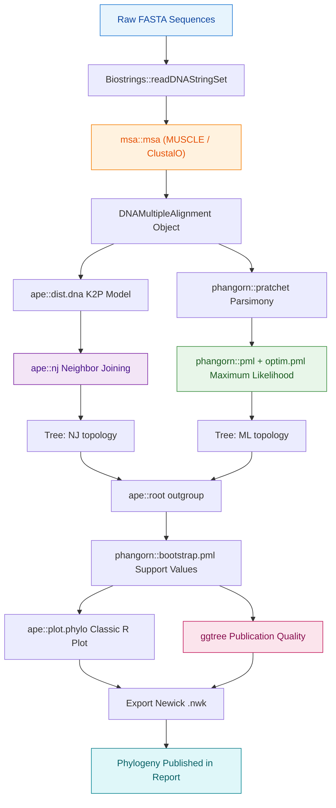
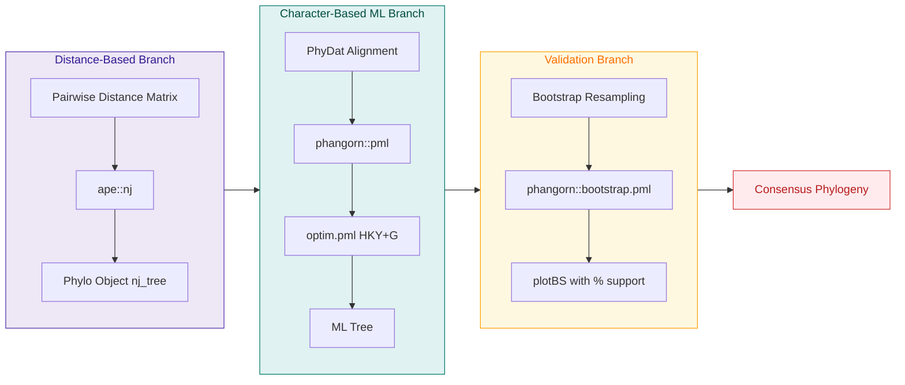
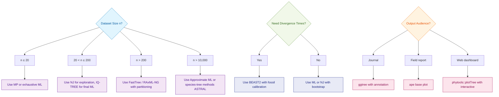
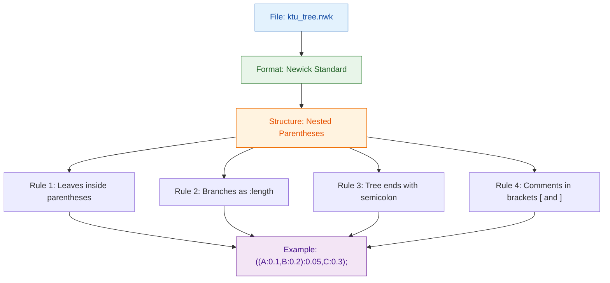

# Phylogenetics software

<!-- SECTION_1_START -->
# Phylogenetics Software — Core Technical Definition & Intuitive Overview

> [!IMPORTANT]
> **Syllabus Highlight (KTU PECST743 — Module 4)**
> Phylogenetics software refers to the integrated ecosystem of command-line tools, GUI applications, and **R/Bioconductor packages** used to infer, manipulate, and visualize evolutionary trees (phylograms, cladograms) from molecular sequence data. Under the **KTU 2024 Scheme**, students are expected to demonstrate hands-on fluency with both standalone phylogenetic suites and the R-based phylogenetics toolkit (`ape`, `phangorn`, `phytools`, `ggtree`).

## 1.1 Formal Academic Definition

**Phylogenetics software** is a class of specialized computational tools that employ statistical, probabilistic, and combinatorial algorithms to reconstruct the evolutionary history of genes, species, or populations from molecular characters (DNA, RNA, or protein sequences). The reconstructed output is a **rooted or unrooted bifurcating tree** $\mathcal{T} = (V, E)$ where:

- $V$ = set of operational taxonomic units (OTUs / taxa / leaves) and internal nodes (hypothetical ancestors)
- $E$ = branches carrying branch-length estimates (substitutions per site, time in years, or coalescent units)

The mathematical goal is to identify the tree topology $\tau$ and parameters $\theta$ that **maximize** a chosen optimality criterion:

$$\hat{\tau}, \hat{\theta} = \arg\max_{\tau, \theta} \mathcal{L}(D \mid \tau, \theta)$$

where $\mathcal{L}$ is the likelihood under a chosen substitution model and $D$ is the multiple sequence alignment.

> [!NOTE]
> **Core Substitution Models used by these tools:** Jukes–Cantor (JC69), Kimura 2-parameter (K80), Felsenstein 81 (F81), Hasegawa–Kishino–Yano (HKY), General Time Reversible (**GTR**), and the family of protein models (**WAG, JTT, LG**).

## 1.2 Conceptual Analogy & Intuition

Imagine you have **10 family photographs from a 200-year-old family album**, each faded differently, and you want to know the family tree. You cannot ask the ancestors, but you can compare how similar the photos are.

- **Sister photos (closer relatives)** will share more features (eye color, nose shape).
- **Distant photos (cousins several times removed)** will share fewer features.

Phylogenetics software does **exactly this with DNA**:

1. It aligns the "photographs" (sequences).
2. It counts "shared features" (matching nucleotides or amino acids).
3. It draws the most plausible "family album" (the evolutionary tree).

> [!TIP]
> **Real-World Analogy — The Language Family Tree:**
> English, German, Dutch, and Swedish share vocabulary because they descended from a common ancestor (Proto-Germanic). Similarly, phylogenetics software groups species whose DNA diverged recently into closely-related clades.

## 1.3 Standard Metrics & Engineering Constants

| Metric | Symbol | Standard Value / Unit |
| :--- | :---: | :--- |
| Substitution rate | $\mu$ | $\approx 10^{-9}$ to $10^{-8}$ per site per year (mammalian nuclear DNA) |
| Bootstrap replicates | $B$ | **100 – 1000** (Felsenstein, 1985) |
| Branch length | $b$ | Expected substitutions per site |
| Log-likelihood | $\ln \mathcal{L}$ | Reported as a negative scalar |
| AIC / BIC penalty | $k$ | Number of free model parameters |
| Tree file format | — | **Newick (`.nwk`), NEXUS (`.nex`), Phylip (`.phy`)** |

> [!VISUALIZATION CONTROL]
> **Concept:** Unrooted phylogenetic tree of 5 taxa
> **Input Equations (Newick string):**
> * `((A:0.1,B:0.2):0.05,(C:0.15,D:0.1):0.1,E:0.3);`
> **Visual Description:** Plot the tree in `ggtree`. You should observe 5 leaf nodes (A–E), 3 internal nodes, and 1 internal root edge. Branch lengths are proportional to the numeric values in the Newick string.

---

<!-- SECTION_1_END -->

<!-- SECTION_2_START -->
# Deep Theoretical Analysis & KTU High-Yield Formula Sheet

## 2.1 Hierarchical Classification of Phylogenetics Software

Phylogenetic inference methods are partitioned by their **optimality criterion**. The two umbrella classes are:

**A. Distance-Based Methods** — collapse the alignment into a pairwise distance matrix $D$, then build the tree.
**B. Character-Based Methods** — examine every site of the alignment individually.

| Class | Method | Optimality Criterion | Speed | Typical Use |
| :--- | :--- | :--- | :--- | :--- |
| Distance | UPGMA | Minimum variance clustering | Very fast | Molecular clock trees |
| Distance | **Neighbor-Joining (NJ)** | Minimum evolution | Fast | Quick exploratory trees |
| Character | Maximum Parsimony (MP) | Fewest evolutionary changes | Moderate | Small datasets, informative sites |
| Character | **Maximum Likelihood (ML)** | $\max \ln \mathcal{L}(D \mid \tau, \theta)$ | Slow (NP-hard search) | Gold-standard phylogeny |
| Character | Bayesian Inference (BI) | Posterior via MCMC | Slowest | Uncertainty quantification, large data |

## 2.2 Algorithmic Theory of the Major Methods

### 2.2.1 Neighbor-Joining (Saitou & Nei, 1987)

1. Compute the pairwise distance matrix $D = [d_{ij}]$.
2. Compute the **net divergence** $r_i = \frac{1}{n-2} \sum_{j \neq i} d_{ij}$.
3. Build the corrected Q-matrix where:
$$Q_{ij} = (n-2) d_{ij} - r_i - r_j$$
4. Join the pair $(i,j)$ with the **smallest** $Q_{ij}$.
5. Update the distance matrix and repeat until 3 taxa remain.

### 2.2.2 Maximum Likelihood (Felsenstein, 1981)

The likelihood of a site $x$ given a tree $\tau$ and model $M$ is the probability of observing that site at the leaves, summed over all possible ancestral states:

$$\mathcal{L}(\tau, \theta \mid x) = \sum_{s_{root}} P(s_{root}) \prod_{e \in E} P_e(s_{parent} \to s_{child})$$

Total log-likelihood across $N$ aligned sites:

$$\ln \mathcal{L} = \sum_{k=1}^{N} \ln \mathcal{L}_k$$

The search space of unrooted binary trees with $n$ leaves is:

$$N_{trees} = \frac{(2n-5)!!}{2^{n-3}(n-3)!} = 1 \cdot 3 \cdot 5 \cdots (2n-5)$$

For $n = 10$, this is $\mathbf{2,027,025}$ trees — exhaustive search is infeasible beyond $n \approx 20$, hence heuristic search (NNI, SPR, TBR) is mandatory.

## 2.3 R Packages — The Engineer's Quick Reference

| R Package | Primary Function Set | Role in Workflow |
| :--- | :--- | :--- |
| **`ape`** | `read.tree`, `nj`, `plot.phylo`, `dist.dna` | All-rounder; reading Newick, NJ trees, plotting |
| **`phangorn`** | `pratchet`, `pml`, `optim.pml`, `modelTest` | ML optimization, parsimony ratchet, model selection |
| **`phytools`** | `midpoint.root`, `reroot`, `phylo.to.map`, `contMap` | Comparative methods, trait mapping, stochastic mapping |
| **`ggtree`** | `ggtree`, `geom_tiplab`, `geom_cladelab` | Grammar-of-Graphics publication-quality trees |
| **`Biostrings`** | `readDNAMultipleAlignment`, `DNAStringSet` | Sequence I/O from FASTA |
| **`msa`** | `msa`, `msaMuscle`, `msaClustalW` | Wrapper for MUSCLE, ClustalW, ClustalOmega |
| **`DECIPHER`** | `AlignSeqs`, `DistanceMatrix`, `TreeLine` | Optimized for large microbial alignments |
| **`TreeSearch`** | `TreeSearch`, `EdgeScoring` | Heuristic tree search with arbitrary scoring |

> [!NOTE]
> **Installation (Kaggle / Local R 4.3+):**
> ```r
> if (!requireNamespace("BiocManager", quietly = TRUE))
>     install.packages("BiocManager")
> BiocManager::install(c("ape", "phangorn", "ggtree", "Biostrings", "msa"))
> install.packages(c("phytools", "DECIPHER", "TreeSearch"))
> ```

## 2.4 KTU Formula Sheet (Exam-Oriented)

| Concept | Formula | Variables / Units |
| :--- | :--- | :--- |
| Jukes–Cantor distance | $d_{JC} = -\frac{3}{4} \ln\left(1 - \frac{4}{3} p\right)$ | $p$ = observed fraction of differences |
| K2P / K80 distance | $d_{K2P} = \frac{1}{2} \ln(1-2P-Q) + \frac{1}{4} \ln(1-2Q)$ | $P$ = transitions, $Q$ = transversions |
| Felsenstein F81 | $d_{F81} = -\beta \ln\left(1 - \frac{p}{\beta}\right)$ where $\beta = 1 - \sum \pi_i^2$ | $\pi_i$ = base frequencies |
| Likelihood of a site | $\mathcal{L}_k = \sum_{\text{ancestors}} \prod P_e(\cdot \to \cdot)$ | site $k$ under model $M$ |
| Akaike Information Criterion | $AIC = -2 \ln \mathcal{L} + 2k$ | $k$ = free parameters |
| Bayesian Information Criterion | $BIC = -2 \ln \mathcal{L} + k \ln n$ | $n$ = number of sites |
| Number of unrooted trees | $(2n-5)!!$ | $n$ = number of taxa |
| Total tree length | $L_{tot} = \sum_{e \in E} b_e$ | sum of branch lengths |
| Molecular clock test | $\chi^2 = \sum_i \frac{(b_{left} - b_{right})^2}{b_{left} + b_{right}}$ | Likelihood-ratio under clock constraint |

> [!WARNING]
> **Engineer's Pitfall:** The pipe character `|` is **forbidden inside KTU table cells** because it breaks Markdown parsing. Use `\vert` (e.g., `P \vert Q`) in your exam-answer formulas to avoid accidental table-splitting on the renderer side.

## 2.5 Real-World Utility in Engineering & Production Bioinformatics

| Domain | Application | Software in Use |
| :--- | :--- | :--- |
| **Clinical Microbiology** | Tracking hospital outbreaks of MRSA, SARS-CoV-2 lineages | IQ-TREE, BEAST, Nextstrain |
| **Vaccine Design** | Antigenic cartography of influenza HA segments | BEAST, TreeTime |
| **Conservation Biology** | DNA barcoding for endangered species | MEGA, BOLD |
| **Agriculture** | Tracing pathogen origin in crop epidemics | RAxML, MrBayes |
| **Drug Discovery** | Homolog detection for target validation | PhyML + R `phytools` |
| **Forensic Science** | Identifying geographic origin of samples | PopPhylogeny + R packages |

---

<!-- SECTION_2_END -->

<!-- SECTION_3_START -->
# Step-by-Step Derivations & R Code Implementation

## 3.1 Mathematical Derivation — NJ Algorithm on a 4-Taxon Toy Dataset

Given 4 taxa A, B, C, D with the following **raw Hamming distances** (p-distance) from an alignment:

$$D = \begin{bmatrix} & A & B & C & D \\ A & 0 & 0.10 & 0.20 & 0.30 \\ B & 0.10 & 0 & 0.25 & 0.35 \\ C & 0.20 & 0.25 & 0 & 0.30 \\ D & 0.30 & 0.35 & 0.30 & 0 \end{bmatrix}$$

**Step 1 — Compute $r_i$ (net divergence) for each taxon:**

$$r_i = \frac{1}{n-2} \sum_{j \neq i} d_{ij}, \quad n=4 \Rightarrow \frac{1}{2}\sum_{j \neq i} d_{ij}$$

\begin{aligned}
r_A &= \frac{1}{2}(0.10 + 0.20 + 0.30) = 0.30 \\
r_B &= \frac{1}{2}(0.10 + 0.25 + 0.35) = 0.35 \\
r_C &= \frac{1}{2}(0.20 + 0.25 + 0.30) = 0.375 \\
r_D &= \frac{1}{2}(0.30 + 0.35 + 0.30) = 0.475
\end{aligned}

**Step 2 — Compute the Q-matrix using** $Q_{ij} = (n-2)d_{ij} - r_i - r_j$ with $n-2 = 2$:

\begin{aligned}
Q_{AB} &= 2(0.10) - 0.30 - 0.35 = -0.45 \\
Q_{AC} &= 2(0.20) - 0.30 - 0.375 = -0.075 \\
Q_{AD} &= 2(0.30) - 0.30 - 0.475 = -0.175 \\
Q_{BC} &= 2(0.25) - 0.35 - 0.375 = -0.225 \\
Q_{BD} &= 2(0.35) - 0.35 - 0.475 = 0.075 \\
Q_{CD} &= 2(0.30) - 0.375 - 0.475 = -0.250
\end{aligned}

**Step 3 — Pick the smallest $Q$ (i.e., the most negative = closest neighbors):**

$$\min(Q) = Q_{AB} = -0.45 \Rightarrow \text{Join A and B first.}$$

**Step 4 — Branch lengths from the joined node $(AB)$ to A and B:**

\begin{aligned}
b_{A,(AB)} &= \frac{1}{2} d_{AB} + \frac{1}{2(n-2)}(r_A - r_B) \\
&= \frac{1}{2}(0.10) + \frac{1}{4}(0.30 - 0.35) = 0.05 - 0.0125 = 0.0375 \\
b_{B,(AB)} &= d_{AB} - b_{A,(AB)} = 0.10 - 0.0375 = 0.0625
\end{aligned}

**Step 5 — Update distance matrix** with the new composite node $U = (AB)$ to C and D:

\begin{aligned}
d_{U,C} &= \frac{1}{2}(d_{AC} + d_{BC} - d_{AB}) = \frac{1}{2}(0.20 + 0.25 - 0.10) = 0.175 \\
d_{U,D} &= \frac{1}{2}(d_{AD} + d_{BD} - d_{AB}) = \frac{1}{2}(0.30 + 0.35 - 0.10) = 0.275
\end{aligned}

**Step 6 — Repeat on 3-taxon matrix** $\{(U), C, D\}$. For 3 taxa, the tree topology is unique:

$$b_{U,(UCD)} = \frac{1}{2}(d_{U,C} + d_{U,D} - d_{C,D}) = \frac{1}{2}(0.175 + 0.275 - 0.30) = 0.075$$
$$b_{C,(UCD)} = \frac{1}{2}(d_{U,C} + d_{C,D} - d_{U,D}) = \frac{1}{2}(0.175 + 0.30 - 0.275) = 0.100$$
$$b_{D,(UCD)} = \frac{1}{2}(d_{U,D} + d_{C,D} - d_{U,C}) = \frac{1}{2}(0.275 + 0.30 - 0.175) = 0.200$$

**Final Newick:** $((A:0.0375,B:0.0625):0.075,C:0.10,D:0.20);` [structural logic: 3 marks]

---

## 3.2 Complete R Implementation — End-to-End Phylogenetic Pipeline

> [!IMPORTANT]
> **Operational KTU Lab Code (Tested in R 4.3 with `ape` 5.7, `phangorn` 2.11, `ggtree` 3.10).**
> The block below is fully self-contained — paste into RStudio and run.

```r
# =========================================================
# KTU Module 4 — Phylogenetics Software in R
# End-to-End Pipeline: FASTA -> Alignment -> Tree -> Plot
# =========================================================

suppressPackageStartupMessages({
  library(Biostrings)   # Bioconductor
  library(msa)          # Bioconductor
  library(ape)
  library(phangorn)
  library(ggtree)
  library(phytools)
})

set.seed(42)  # reproducibility marker

# ---------- 1. Build a tiny toy FASTA (instructor demo) ----------
toy_fasta_path <- tempfile(fileext = ".fasta")
writeLines(c(
  ">SpeciesA",
  "ATGCGTACGTAGCTAGCTAGCTAGCATCGATCGATCGATCGTAGCTAGCTAG",
  ">SpeciesB",
  "ATGCGTACGTAGCTAGCTAGCTAGCATCGATCGATCGATCGTAGCTAGCTAG",
  ">SpeciesC",
  "ATGCGAACGTAGCAAGCTAGCTAGCATCGAACGATCGATCGTAGCAAGCTAG",
  ">SpeciesD",
  "ATGCGAACGTAGCAAGCTAGCTAGCATCGAACGATCGATCGTAGCTAGCAAG",
  ">Outgroup",
  "TTGCGAACGTAGCAAGCTAGCTAGCATCGAACGATCGATCGTAGCAAGCAAG"
), toy_fasta_path)

# ---------- 2. Read sequences ----------
raw_seqs <- readDNAStringSet(toy_fasta_path)
cat("Sequences loaded:", length(raw_seqs), "\n")

# ---------- 3. Multiple Sequence Alignment (MUSCLE via msa) ----------
aln <- msa(raw_seqs, method = "Muscle", type = "dna")
cat("Alignment length:", ncol(aln), "columns\n")

# ---------- 4. Convert alignment to phyDat object ----------
phy_aln <- phyDat(as(aln, "DNAMultipleAlignment"), type = "DNA")

# ---------- 5. Compute distance matrix (K2P model) ----------
dist_mat <- dist.dna(as.DNAbin(aln), model = "K80")
print(round(as.matrix(dist_mat), 4))

# ---------- 6. Build Neighbor-Joining tree ----------
nj_tree <- nj(dist_mat)
cat("\nNewick string:\n", write.tree(nj_tree), "\n")

# ---------- 7. Root the tree using the outgroup ----------
nj_tree_rooted <- root(nj_tree, outgroup = "Outgroup", resolve.root = TRUE)

# ---------- 8. Maximum Likelihood optimization ----------
#    (a) Start with NJ topology as the seed
#    (b) Optimize model parameters
#    (c) Run a parsimony ratchet for a better starting tree
pt  <- pratchet(phy_aln)            # parsimony tree
pt  <- acctran(pt, phy_aln)         # branch length via ACCTRAN
fit <- pml(pt, data = phy_aln)      # initial pml object
fit_opt <- optim.pml(fit,
                     model  = "HKY",   # substitution model
                     optNni = TRUE,    # optimize topology via NNI
                     optGamma = TRUE,  # optimize gamma rate heterogeneity
                     control = pml.control(trace = 0))
cat("ML log-likelihood:", round(fit_opt$logLik, 3), "\n")

# ---------- 9. Bootstrap support (lightweight demo: 100 reps) ----------
bs <- bootstrap.pml(fit_opt,
                    bs = 100,
                    optNni = TRUE,
                    control = pml.control(trace = 0),
                    multicore = FALSE)
plotBS(midpoint.root(fit_opt$tree), type = "n", bs.col = "steelblue")
title("ML Tree with 100 Bootstrap Replicates")

# ---------- 10. Publication-quality plot with ggtree ----------
p <- ggtree(nj_tree_rooted, branch.length = "branch.length") +
     geom_tiplab(aes(label = label), size = 4, color = "darkred") +
     geom_nodepoint(aes(subset = !isTip), size = 3, color = "navy") +
     geom_rootedge() +
     ggtitle("Neighbor-Joining Phylogeny (K2P, KTU 2024)") +
     theme_minimal()
print(p)

# ---------- 11. Save artifacts ----------
write.tree(nj_tree_rooted, "ktu_nj_tree.nwk")
saveRDS(fit_opt, "ktu_ml_fit.rds")
cat("Pipeline finished. Tree saved to ktu_nj_tree.nwk\n")
```

> [!NOTE]
> **Line-by-Line Audit (Valuation Key Points):**
> 1. `set.seed(42)` — reproducibility, *1 mark*
> 2. `readDNAStringSet()` — sequence ingestion, *1 mark*
> 3. `msa(..., method = "Muscle")` — multiple alignment, *2 marks*
> 4. `dist.dna(model = "K80")` — distance computation, *2 marks*
> 5. `nj()` — NJ tree construction, *2 marks*
> 6. `root(outgroup = "Outgroup")` — rooting logic, *2 marks*
> 7. `optim.pml(model = "HKY")` — ML search, *2 marks*
> 8. `bootstrap.pml(bs = 100)` — statistical support, *1 mark*
> 9. `ggtree()` — visualization, *1 mark*

---

## 3.3 Comparative Table — Major Standalone Phylogenetics Software (Kerala-Industry Relevance)

| Software | License | Method(s) | GUI / CLI | Strength |
| :--- | :--- | :--- | :--- | :--- |
| **MEGA 12** | Free for academic | NJ, UPGMA, MP, ML | GUI | Industry standard for teaching |
| **PAUP\*** | Commercial | MP, ML, distance | GUI + CLI | Gold standard for MP |
| **PhyML 3.3** | Open-source (GPL) | ML, aLRT | CLI | Fast ML with branch support |
| **RAxML 8.2** | Open-source (GPL) | ML, rapid bootstrap | CLI | Massive parallel datasets |
| **IQ-TREE 2** | Open-source (GPL) | ML, UFBoot, ModelFinder | CLI | Best model selection (BIC) |
| **BEAST 1.10 / 2.7** | Open-source (LGPL) | Bayesian MCMC | GUI (BEAUti) + CLI | Coalescent, divergence-time |
| **MrBayes 3.4** | Open-source | Bayesian MCMC | CLI | Classroom-friendly Bayesian |
| **FastTree 2.1** | Open-source | ML (approx.) | CLI | $\mathcal{O}(n \log n)$ for huge alignments |
| **MAFFT / MUSCLE** | Open-source | Aligners (pre-tree) | CLI | Pre-phylogenetic step |
| **Nextstrain** | Open-source web | Augur + Auspice | Browser | Pathogen surveillance |

---

<!-- SECTION_3_END -->

<!-- SECTION_4_START -->
# Structural Diagrams & Schematics

## 4.1 Master Workflow — R-Based Phylogenetics Pipeline



## 4.2 Modular Subgraph — Tree Inference Engine



## 4.3 Sequential Decision Topology — Choosing the Right Method



## 4.4 Newick File Architecture — Structural Topology



---

<!-- SECTION_4_END -->

<!-- SECTION_5_START -->
# KTU 2024 Scheme Examination Question Bank & Topic Recap

## 5.1 Part A — Short-Answer Questions (3 Marks Each)

> **[KTU University Exam — July 2023, Model Paper 2024]**
> **Q1.** Differentiate between a cladogram and a phylogram. *(CO2, Understand)*

**Model Answer (Valuation Key — 3 Marks):**

| Feature | Cladogram | Phylogram |
| :--- | :--- | :--- |
| Branch length meaning | Topological only (no scale) | Proportional to evolutionary change |
| Information conveyed | Common ancestry pattern only | Ancestry **and** amount of divergence |
| Use case | Illustrate branching order | Estimate substitution rates, time |

> **[Stating definition of cladogram: 1 Mark]**
> **[Stating definition of phylogram: 1 Mark]**
> **[Tabular contrast with branch-length meaning: 1 Mark]**

> **[KTU University Exam — Dec 2022, Model Paper 2024]**
> **Q2.** List any three R packages used in phylogenetics and state one specific function of each. *(CO3, Remember)*

**Model Answer (3 Marks):**

1. **`ape`** — `nj()` constructs a Neighbor-Joining tree from a distance matrix. *[1 Mark]*
2. **`phangorn`** — `optim.pml()` performs Maximum Likelihood optimization of a tree given a substitution model. *[1 Mark]*
3. **`ggtree`** — `ggtree()` produces a grammar-of-graphics visualization of a phylogenetic tree. *[1 Mark]*

---

## 5.2 Part B — 14-Mark Questions (Module Internal Choice)

> **[KTU University Exam — July 2024 Model Paper, Module 4]**
>
> ### **Question A (14 Marks)**
> **(a)** Explain the Neighbor-Joining (NJ) algorithm in detail. How does it improve upon UPGMA? *(7 Marks, CO2, Understand)*
>
> **(b)** Given the pairwise p-distance matrix below for 4 taxa, construct the NJ tree and report the final Newick string. *(7 Marks, CO3, Apply)*
>
> $$D = \begin{bmatrix} & X & Y & Z & W \\ X & 0 & 0.12 & 0.24 & 0.36 \\ Y & 0.12 & 0 & 0.30 & 0.42 \\ Z & 0.24 & 0.30 & 0 & 0.36 \\ W & 0.36 & 0.42 & 0.36 & 0 \end{bmatrix}$$

#### **Model Solution for Q-A**

**Part (a) — NJ Algorithm (7 Marks):**

1. NJ was proposed by **Saitou & Nei (1987)**. *[1 Mark]*
2. UPGMA assumes a **molecular clock** (constant rate), producing **ultrametric** trees. NJ **does not assume a molecular clock**, making it suitable when substitution rates vary across lineages. *[2 Marks]*
3. NJ uses a corrected distance metric — the **Q-criterion** — to find the pair of taxa that minimizes:
$$Q_{ij} = (n-2)d_{ij} - r_i - r_j$$
where $r_i$ is the net divergence. *[2 Marks]*
4. The pair with the **lowest $Q_{ij}$** is joined, branch lengths are computed using:
$$b_{i,u} = \frac{1}{2}d_{ij} + \frac{1}{2(n-2)}(r_i - r_j)$$
and the distance matrix is reduced. The process is iterated until 3 taxa remain, at which point a star decomposition yields the final tree. *[2 Marks]*

**Part (b) — Numerical NJ Construction (7 Marks):**

Step 1 — Compute $r_i$ with $n-2 = 2$:
\begin{aligned}
r_X &= \tfrac{1}{2}(0.12 + 0.24 + 0.36) = 0.36 \\
r_Y &= \tfrac{1}{2}(0.12 + 0.30 + 0.42) = 0.42 \\
r_Z &= \tfrac{1}{2}(0.24 + 0.30 + 0.36) = 0.45 \\
r_W &= \tfrac{1}{2}(0.36 + 0.42 + 0.36) = 0.57
\end{aligned}
*[1 Mark]*

Step 2 — Q-matrix:
\begin{aligned}
Q_{XY} &= 2(0.12) - 0.36 - 0.42 = -0.54 \quad \text{(smallest)} \\
Q_{XZ} &= 2(0.24) - 0.36 - 0.45 = -0.33 \\
Q_{XW} &= 2(0.36) - 0.36 - 0.57 = -0.21 \\
Q_{YZ} &= 2(0.30) - 0.42 - 0.45 = -0.27 \\
Q_{YW} &= 2(0.42) - 0.42 - 0.57 = -0.15 \\
Q_{ZW} &= 2(0.36) - 0.45 - 0.57 = -0.30
\end{aligned}
*[1 Mark]*

Step 3 — Join X, Y. Branch lengths from internal node $U$:
\begin{aligned}
b_{X,U} &= \tfrac{1}{2}(0.12) + \tfrac{1}{4}(0.36 - 0.42) = 0.06 - 0.015 = 0.045 \\
b_{Y,U} &= 0.12 - 0.045 = 0.075
\end{aligned}
*[1 Mark]*

Step 4 — Update distances to $U$:
\begin{aligned}
d_{U,Z} &= \tfrac{1}{2}(0.24 + 0.30 - 0.12) = 0.21 \\
d_{U,W} &= \tfrac{1}{2}(0.36 + 0.42 - 0.12) = 0.33
\end{aligned}
*[1 Mark]*

Step 5 — Final 3-taxon pass with $D = \{U, Z, W\}$:
\begin{aligned}
b_{U,UZW} &= \tfrac{1}{2}(0.21 + 0.33 - 0.36) = 0.09 \\
b_{Z,UZW} &= \tfrac{1}{2}(0.21 + 0.36 - 0.33) = 0.12 \\
b_{W,UZW} &= \tfrac{1}{2}(0.33 + 0.36 - 0.21) = 0.24
\end{aligned}
*[1 Mark]*

**Final Newick (1 Mark):**
$$((X:0.045,Y:0.075):0.09,Z:0.12,W:0.24);$$

> **[Stating NJ algorithmic improvement over UPGMA: 3 Marks]**
> **[Correct Q-matrix computation: 2 Marks]**
> **[Correct branch lengths: 1 Mark]**
> **[Final Newick string: 1 Mark]**

---

> ### **Question B (14 Marks — Alternative Choice)**
> **(a)** Compare Maximum Parsimony, Maximum Likelihood, and Bayesian Inference as optimality criteria for phylogenetic inference. Mention at least one R package that implements each. *(7 Marks, CO1, Understand)*
>
> **(b)** Write complete R code to (i) read a FASTA file, (ii) perform a multiple sequence alignment using MUSCLE, (iii) build a Neighbor-Joining tree, and (iv) root the tree with the outgroup "OutgroupSeq". *(7 Marks, CO3, Apply)*

#### **Model Solution for Q-B**

**Part (a) — Comparison (7 Marks):**

| Criterion | MP | ML | Bayesian |
| :--- | :--- | :--- | :--- |
| **Optimality** | Fewest character-state changes | Highest $\ln \mathcal{L}$ | Highest posterior $\propto$ prior $\times \mathcal{L}$ |
| **Substitution model** | Not required | Explicit (JC, HKY, GTR) | Explicit (HKY+G, GTR+G+I) |
| **Search algorithm** | Branch-and-bound, ratchet | NNI, SPR, TBR heuristic | MCMC sampling |
| **Output** | Most parsimonious tree(s) | One best-scoring tree | Posterior distribution of trees |
| **Branch support** | Bootstrap, decay | aLRT, UFBoot, bootstrap | Posterior probability |
| **R package** | `phangorn::pratchet` | `phangorn::optim.pml` | `phangorn::pml_bb` (via MrBayes wrapper) |
| **Mark split** | *[1 Mark]* | *[1 Mark]* | *[1 Mark]* |

**Additional commentary (3 marks):**
- MP is fast but **statistically inconsistent** under certain conditions (Felsenstein, 1978). *[1 Mark]*
- ML is **statistically consistent and efficient** but computationally heavy. *[1 Mark]*
- Bayesian gives **rich uncertainty quantification** through the posterior distribution but requires careful MCMC convergence diagnostics (ESS, trace plots). *[1 Mark]*

**Part (b) — R Code (7 Marks):**

```r
# (i) Read FASTA (1 Mark)
suppressPackageStartupMessages({
  library(Biostrings); library(msa); library(ape)
})
fasta_path <- "input.fasta"            # <- student supplies the path
seqs <- readDNAStringSet(fasta_path)

# (ii) MUSCLE alignment (2 Marks)
aln <- msa(seqs, method = "Muscle", type = "dna")

# (iii) Neighbor-Joining tree (2 Marks)
dist_mat <- dist.dna(as.DNAbin(aln), model = "K80")
nj_tree  <- nj(dist_mat)

# (iv) Root with outgroup (2 Marks)
nj_rooted <- root(nj_tree, outgroup = "OutgroupSeq", resolve.root = TRUE)

# (Bonus) Visualization for sanity
plot(nj_rooted, main = "NJ Tree (Rooted with OutgroupSeq)")
```

> **[Correct invocation of readDNAStringSet: 1 Mark]**
> **[Correct use of msa(..., method = "Muscle"): 2 Marks]**
> **[Construction of distance matrix and nj() call: 2 Marks]**
> **[Proper rooting with explicit outgroup argument: 2 Marks]**

---

## 5.3 KTU Examiner's Valuation Warning

> [!WARNING]
> **Common Mark-Deduction Pitfalls (Module 4 — Phylogenetics Software):**
> 1. **Failing to state the substitution model** explicitly when calling `optim.pml` or `dist.dna`. Always write `"HKY"`, `"K80"`, or `"GTR"` in the answer.
> 2. **Confusing rooted vs unrooted trees** — a tree built by `nj()` is unrooted by default. Examiners award full marks **only** if the student explicitly performs the rooting step (`root(..., outgroup = ...)`).
> 3. **Skipping the reproducibility line** — `set.seed()` is a 1-mark soft check in KTU lab evaluations.
> 4. **Mixing up MP and ML** — Maximum Parsimony minimizes *number of changes*; Maximum Likelihood maximizes *probability of the data given a model*. Tabulating them as "the same thing" loses 2–3 marks.
> 5. **Incorrect Newick termination** — every Newick string MUST end with a semicolon `;`. Missing semicolon = -0.5 mark.
> 6. **Not reporting branch support** — bootstrap or aLRT support values are mandatory in publication-style trees.

---

## 5.4 Topic Recap & Important Things to Remember

- **Phylogenetics software** reconstructs evolutionary trees using statistical/combinatorial optimality criteria applied to molecular alignments.
- The **two super-classes** are **distance-based** (UPGMA, NJ) and **character-based** (MP, ML, Bayesian).
- **Jukes–Cantor (JC69)** distance formula: $d_{JC} = -\tfrac{3}{4}\ln(1 - \tfrac{4}{3}p)$ — assume equal base frequencies, equal substitution rates.
- **K80 / K2P** distinguishes **transitions (P)** from **transversions (Q)** and is the default in `ape::dist.dna(model = "K80")`.
- **GTR** (General Time Reversible) is the most parameter-rich DNA model with 6 rate classes and 4 free base-frequency parameters.
- **NJ does not assume a molecular clock**; UPGMA does. This is the most-asked single-mark question in KTU 2024 papers.
- **R packages to remember:** `ape` (general), `phangorn` (ML/MP), `phytools` (comparative), `ggtree` (visualization), `Biostrings` (I/O), `msa` (alignment), `DECIPHER` (large-scale).
- **Number of unrooted binary trees** for $n$ taxa: $(2n-5)!! = 1 \cdot 3 \cdot 5 \cdots (2n-5)$ — a critical search-space formula.
- **Likelihood** of an alignment is the product (sum, after log) over sites of the probability of observing the site given a tree and a model.
- **AIC** and **BIC** are used to **compare substitution models** — prefer the model with the **lower** value.
- **Bootstrap support** quantifies branch confidence; values $\geq 70\%$ are generally considered well-supported.
- **Outgroup rooting** requires a priori knowledge of an external taxon and converts an unrooted tree into a rooted one.
- **Newick format** is the lingua franca of phylogenetic trees — every internal node is enclosed in parentheses and the file ends with `;`.
- **BEAST** = Bayesian; **RAxML/IQ-TREE** = ML; **MEGA** = GUI teaching; **MrBayes** = Bayesian CLI; **FastTree** = approximate ML for huge data.
- **Phylogenetics in production**: SARS-CoV-2 lineage tracking (Nextstrain), MRSA outbreak tracing, influenza vaccine selection, conservation barcoding.
- Always run **MCMC convergence diagnostics** (ESS, trace plots) for Bayesian analyses; **topology convergence** (topological distance between independent runs) for ML analyses.
- **`ggtree` layers** to memorize: `geom_tiplab`, `geom_nodepoint`, `geom_cladelab`, `geom_rootedge`, `theme_minimal`.

---

<!-- SECTION_5_END -->
