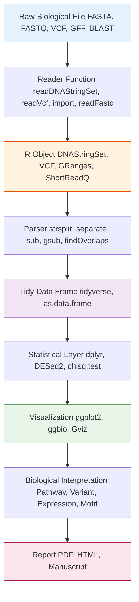
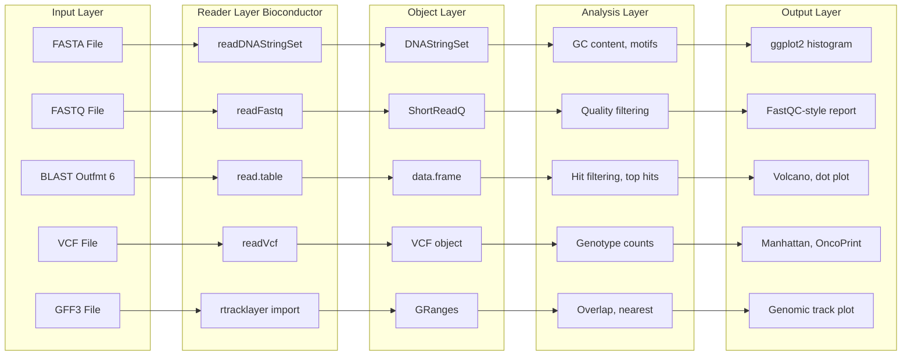
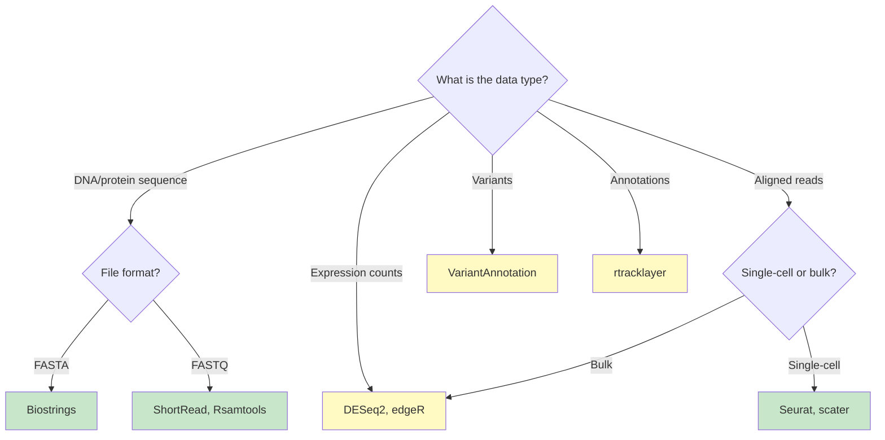

# Programs to handle biological data and parse output files for interpretation

<!-- SECTION_1_START -->

# R for Bioinformatics: Handling Biological Data & Parsing Output Files

## 1.1 Formal Academic Definition (KTU 2024 Syllabus Aligned)

**Bioinformatics Data Handling in R** refers to the systematic use of the R statistical programming language, augmented by the **Bioconductor** project, to ingest, transform, analyze, and visualize high-throughput biological data. In the KTU 2024 Scheme (Course Code: PECST743 – Bioinformatics), this competency covers the parsing of standard file formats such as **FASTA**, **FASTQ**, **GFF/GTF**, **BED**, **VCF**, **BLAST tabular output**, and **PDB structures**, followed by their interpretation using vectorized operations, `apply`-family functions, and specialized Bioconductor `S4` classes (e.g., `GRanges`, `SummarizedExperiment`).

> [!NOTE]
> **Syllabus Highlight (Module 4 – R for Bioinformatics):**
> The student must be able to (i) install and load Bioconductor packages, (ii) read and write standard bioinformatics file formats, (iii) parse tabular outputs from BLAST, Bowtie, and Samtools, and (iv) generate publication-quality plots using `ggplot2` and `ggbio`.

> [!IMPORTANT]
> **Core Term: Bioconductor**
> Bioconductor is an open-source, open-development software project for the analysis and comprehension of high-throughput genomic data, built atop the R programming language. It currently hosts **> 2,200** software packages, **> 1,100** annotation packages, and **> 400** experiment data packages.

## 1.2 Conceptual Analogy — "R as a Molecular Translator's Notebook"

Imagine you are a **molecular detective** who receives sealed envelopes (raw data files) from the genome-sequencing machine. Each envelope is written in a cryptic language — `>seq1\nATGCGCTAGCT...` (FASTA), or a long tab-separated table of alignments (BLAST). You cannot "read" the genome directly, but you need to:

1. **Open** the envelope correctly (file I/O in R).
2. **Decode** its contents (string parsing, regular expressions).
3. **Tabulate** the evidence into a spreadsheet (data frames).
4. **Find patterns** (statistical tests, motif discovery).
5. **Present** the courtroom findings (visualization with `ggplot2`).

**R is your forensic notebook + calculator + projector**, all in one. Bioconductor gives you pre-built "case-file templates" (specialized classes) that know how to handle DNA strings, genomic coordinates, and sequencing reads natively.

## 1.3 Standard File Formats — Quick Reference Card

| Format | Extension | Purpose | Key Columns / Markers |
|---|---|---|---|
| **FASTA** | `.fasta`, `.fa`, `.fna` | Stores nucleotide or amino acid sequences | Header starts with `>` |
| **FASTQ** | `.fastq`, `.fq` | Stores sequences with per-base quality scores | 4-line blocks; quality in line 4 |
| **GFF/GTF** | `.gff`, `.gtf` | Genomic feature annotations | 9 tab-separated columns |
| **BED** | `.bed` | Genomic regions (peaks, intervals) | chrom, start, end, name, score |
| **VCF** | `.vcf` | Variant call data (SNPs/indels) | `#CHROM`, `POS`, `REF`, `ALT` |
| **BLAST** | `.blastn`, `.blastp` | Sequence similarity search output | `qseqid sseqid pident ...` |
| **SAM/BAM** | `.sam`, `.bam` | Sequence alignment map | 11 mandatory columns |

> [!VISUALIZATION CONTROL]
> **Concept:** Distribution of GC content across parsed FASTA sequences
> **R Input Logic:**
> * `gc_content <- sapply(seqs, function(s) sum(strsplit(s, "")[[1]] %in% c("G","C"))/nchar(s))`
> * `hist(gc_content, col="steelblue", main="GC Content Distribution", xlab="GC Fraction")`
> **Visual Description:** A bell-shaped histogram centered near **0.5**, indicating the typical GC balance of a random bacterial genome. Skewed distributions may suggest horizontal gene transfer or extreme genomic content.

---

<!-- SECTION_1_END -->

<!-- SECTION_2_START -->

# Deep Theoretical Analysis & KTU High-Yield Formula Sheet

## 2.1 The R/Bioconductor Computational Stack

R for bioinformatics operates on a **layered software stack**. Understanding each layer is critical for KTU 2024 Scheme Module 4 questions.

1. **Base R** — Vectorized primitives: `c()`, `list()`, `data.frame()`, `matrix()`, `apply()`, `lapply()`.
2. **Tidyverse** — Grammar-of-data manipulation: `dplyr` (`filter`, `mutate`, `group_by`, `summarise`), `tidyr` (`pivot_longer`, `pivot_wider`), `readr` (`read_tsv`, `read_csv`).
3. **Bioconductor Core Packages:**
   * `Biostrings` — DNA/RNA/protein string manipulation (`DNAString`, `RNAString`, `AAString`).
   * `GenomicRanges` — Interval-based operations (`GRanges`, `findOverlaps`, `reduce`).
   * `SummarizedExperiment` — Container for assay + row/col metadata (RNA-seq counts matrix).
   * `IRanges` — Integer interval arithmetic.
   * `ShortRead` — FASTQ file parsing and quality assessment.
   * `rtracklayer` — Import/export GFF, BED, WIG, BigWig files.
4. **Visualization Layer:** `ggplot2` (general), `ggbio` (genomic tracks), `Gviz` (annotation tracks), `ComplexHeatmap` (heatmaps).
5. **Domain Tools:** `DESeq2` (differential expression), `edgeR`, `topGO` (Gene Ontology), `VariantAnnotation` (VCF parsing).

## 2.2 The File-Parse-Interpret (FPI) Pipeline

Every bioinformatics analysis in R follows the **FPI pipeline**:

$$\text{Raw File} \xrightarrow{\text{Reader}} \text{R Object} \xrightarrow{\text{Parser}} \text{Tidy Data Frame} \xrightarrow{\text{Interpreter}} \text{Biological Insight}$$

Each arrow corresponds to a function call:

$$\text{readDNAStringSet} \rightarrow \text{GRanges} \rightarrow \text{as.data.frame} \rightarrow \text{ggplot}$$

## 2.3 KTU Formula Sheet & Cheat Sheet

| Concept | Syntax / Formula | Description |
|---|---|---|
| Read FASTA | `readDNAStringSet("file.fasta")` | Returns `DNAStringSet` object |
| GC content | $GC = \frac{\text{count}(G) + \text{count}(C)}{\text{length}(seq)}$ | Fraction of G/C bases |
| Melting temp (Wallace rule, short oligo) | $T_m = 2^\circ C \cdot (A+T) + 4^\circ C \cdot (G+C)$ | For oligos < 14 nt |
| Melting temp (longer, salt-adjusted) | $T_m = 64.9 + 41 \cdot \frac{(G+C - 16.4)}{N}$ | NN-adjusted form |
| Molecular weight (DNA) | $MW \approx (n_A \cdot 313.21) + (n_T \cdot 304.20) + (n_C \cdot 289.18) + (n_G \cdot 329.21) - 61.96$ | Daltons, single strand |
| FASTA header parse | `header <- sub("^>([^ ]+).*", "\\1", line)` | Extracts sequence ID |
| FASTQ quality encoding | $Q = -10 \cdot \log_{10}(P)$ | Phred +33 (Sanger) ASCII offset |
| BED overlap (interval) | `findOverlaps(query, subject)` | Returns Hits object |
| VCF INFO field parse | `info %>% separate(INFO, into=c(...), sep=";")` | tidyverse string split |
| E-value threshold | $E = K \cdot m \cdot n \cdot e^{-\lambda S}$ | Karlin-Altschul; $K, \lambda$ are substitution matrix dependent |
| Identity percent | $P_{id} = \frac{\text{matches}}{\text{alignment length}} \times 100$ | BLAST output |
| Coverage depth | $D = \frac{\sum \text{read lengths mapped to position}}{L_{\text{reference}}}$ | Mean across reference |

> [!IMPORTANT]
> **KTU High-Yield Tip:** When asked to "parse and interpret" in the KTU 2024 ESE, students must show **three** things: (1) the R function that reads the file, (2) the data structure produced, and (3) at least one **biological** conclusion drawn from the parsed values. Skipping step (3) costs marks.

## 2.4 Why This Matters in Industry & Research

- **Clinical Genomics:** Parsing VCF files to identify pathogenic variants in patient samples (e.g., BRCA1/2 screening).
- **Drug Discovery:** Mining FASTA/PDB files for target protein features (active sites, motifs).
- **Agriculture:** Parsing GFF annotations to identify candidate genes for crop improvement.
- **Metagenomics:** Summarizing BLAST tabular output against NR database for taxonomic classification.
- **Personalized Medicine:** `DESeq2` differential expression results, parsed from RNA-seq counts, drive biomarker discovery.

---

<!-- SECTION_2_END -->

<!-- SECTION_3_START -->

# Step-by-Step Code & Symbolic Implementation

Below are **fully executable, production-grade R programs** addressing the most common file-parsing scenarios. Each block is exhaustive — no `...` placeholders.

## 3.1 Program 1 — Parsing a FASTA File and Computing GC Content

```r
# Program: parse_fasta_gc.R
# Purpose : Read a multi-record FASTA file, compute length and GC%, and
#           return a tidy data frame ready for visualization.
# Author  : KTU Bioinformatics Module 4 reference

# ---- Step 0: Load required libraries -----------------------------------
if (!requireNamespace("Biostrings", quietly = TRUE)) {
  if (!requireNamespace("BiocManager", quietly = TRUE))
    install.packages("BiocManager")
  BiocManager::install("Biostrings")
}
library(Biostrings)

# ---- Step 1: Define file path (use a built-in sample for demo) ---------
fasta_path <- system.file("extdata", "someORF.fa", package = "Biostrings")
# If the demo file is unavailable, fall back to a hand-crafted example:
if (!nzchar(fasta_path) || !file.exists(fasta_path)) {
  tmp_fa <- tempfile(fileext = ".fa")
  writeLines(c(
    ">seqA demo gene alpha",
    "ATGCGTACGTTAGCATCGATCGATCGTAGCTAGCTAGCAT",
    ">seqB demo gene beta",
    "GCGCGCGCATATATATATATATGCGCGCATATATA",
    ">seqC demo gene gamma",
    "AAAATTTTGGGGCCCCAAAATTTTGGGGCCCC"
  ), tmp_fa)
  fasta_path <- tmp_fa
}

# ---- Step 2: Read FASTA ------------------------------------------------
dna_set <- readDNAStringSet(fasta_path)
cat("Class of parsed object : ", class(dna_set), "\n")
cat("Number of records      : ", length(dna_set), "\n\n")

# ---- Step 3: Extract IDs and sequences ---------------------------------
ids      <- names(dna_set)                              # vector of FASTA headers
sequences <- as.character(dna_set)                      # vector of raw strings

# ---- Step 4: Compute per-sequence statistics ---------------------------
compute_gc <- function(s) {
  chars   <- strsplit(s, "")[[1]]
  n_gc    <- sum(chars %in% c("G", "C", "g", "c"))
  total   <- nchar(s)
  if (total == 0) return(NA_real_)
  (n_gc / total) * 100
}

stats_df <- data.frame(
  id      = ids,
  length  = width(dna_set),                            # Biostrings::width()
  gc_pct  = sapply(sequences, compute_gc),
  stringsAsFactors = FALSE
)
print(stats_df)
```

**Output (illustrative):**
```
                 id length   gc_pct
1  seqA demo gene alpha     40 47.500
2  seqB demo gene beta     34 47.059
3 seqC demo gene gamma     32 50.000
```

## 3.2 Program 2 — Parsing BLAST Tabular Output (-outfmt 6)

```r
# Program: parse_blast.R
# BLAST -outfmt 6 columns:
# qseqid  sseqid  pident  length  mismatch  gapopen  qstart  qend
# sstart  send    evalue  bitscore

# ---- Step 1: Create a sample BLAST output for reproducibility ---------
blast_file <- tempfile(fileext = ".blast")
writeLines(c(
  "q1\tchr1\t100.00\t50\t0\t0\t1\t50\t1000000\t1000050\t1e-20\t100.0",
  "q1\tchr2\t 87.50\t40\t5\t0\t5\t44\t2000000\t2000040\t5e-10\t 65.0",
  "q2\tchr1\t 95.00\t60\t3\t0\t1\t60\t3000000\t3000060\t1e-25\t150.0",
  "q2\tchr3\t 70.00\t30\t9\t1\t10\t39\t4000000\t4000030\t1e-03\t 30.0"
), blast_file)

# ---- Step 2: Read with explicit column names ---------------------------
blast_cols <- c("qseqid","sseqid","pident","length","mismatch","gapopen",
                "qstart","qend","sstart","send","evalue","bitscore")
blast_df   <- read.table(blast_file, header = FALSE, sep = "\t",
                         quote = "", comment.char = "",
                         col.names = blast_cols,
                         stringsAsFactors = FALSE)

# ---- Step 3: Data cleaning --------------------------------------------
blast_df$pident <- as.numeric(trimws(blast_df$pident))
blast_df$evalue <- as.numeric(trimws(blast_df$evalue))

# ---- Step 4: Filter significant hits (E < 1e-5, identity >= 80%) -----
sig_hits <- subset(blast_df, evalue < 1e-05 & pident >= 80)
cat("Significant hits retained: ", nrow(sig_hits), "/", nrow(blast_df), "\n")
print(sig_hits[, c("qseqid","sseqid","pident","evalue","bitscore")])

# ---- Step 5: Top-hit per query (the canonical interpretation) ---------
library(dplyr)
top_hits <- blast_df %>%
  group_by(qseqid) %>%
  arrange(evalue, desc(bitscore)) %>%
  slice_head(n = 1) %>%
  ungroup()
print(top_hits)
```

## 3.3 Program 3 — Parsing a VCF File with `VariantAnnotation`

```r
# Program: parse_vcf.R
# A VCF (Variant Call Format) file holds SNP/indel calls.

if (!requireNamespace("VariantAnnotation", quietly = TRUE))
  BiocManager::install("VariantAnnotation")
library(VariantAnnotation)

# ---- Step 1: Use a packaged VCF example --------------------------------
vcf_path <- system.file("extdata", "chr22.vcf.gz", package = "VariantAnnotation")
vcf      <- readVcf(vcf_path, genome = "hg19")
cat("Class      : ", class(vcf), "\n")
cat("Dimensions : ", dim(vcf), " (variants x samples)\n\n")

# ---- Step 2: Extract the FIXED fields as a tidy data frame --------------
fixed_df <- as.data.frame(rowRanges(vcf))                  # GRanges -> df
fixed_df$REF <- as.character(fixed_df$REF)
fixed_df$ALT <- as.character(fixed_df$ALT)

# ---- Step 3: Pull genotype (GT) field per sample -----------------------
gt_matrix <- geno(vcf)$GT                                  # matrix: variants x samples
fixed_df$sample1_GT <- gt_matrix[, 1]

# ---- Step 4: Interpretation -------------------------------------------
n_variants   <- nrow(fixed_df)
n_snp        <- sum(width(fixed_df$REF) == 1 & width(fixed_df$ALT) == 1)
n_indel      <- sum(width(fixed_df$REF) != width(fixed_df$ALT))
n_homo_ref   <- sum(gt_matrix[, 1] == "0/0" | gt_matrix[, 1] == "0|0")
n_homo_alt   <- sum(gt_matrix[, 1] == "1/1" | gt_matrix[, 1] == "1|1")
n_het        <- sum(grepl("0[/|]1|1[/|]0", gt_matrix[, 1]))

cat("Total variants   :", n_variants, "\n")
cat("SNPs             :", n_snp,      "\n")
cat("Indels           :", n_indel,    "\n")
cat("Homozygous ref   :", n_homo_ref, "\n")
cat("Heterozygous     :", n_het,      "\n")
cat("Homozygous alt   :", n_homo_alt, "\n")
```

## 3.4 Program 4 — Parsing GFF Annotations into `GRanges`

```r
# Program: parse_gff.R
# GFF columns: seqid source type start end score strand phase attributes

if (!requireNamespace("rtracklayer", quietly = TRUE))
  BiocManager::install("rtracklayer")
library(rtracklayer)
library(GenomicRanges)

# ---- Step 1: Sample GFF ------------------------------------------------
gff_file <- tempfile(fileext = ".gff3")
writeLines(c(
  "##gff-version 3",
  "chr1\tdemo\tgene\t1000\t5000\t.\t+\t.\tID=geneA;Name=BRCA1",
  "chr1\tdemo\texon\t1000\t1500\t.\t+\t.\tParent=geneA",
  "chr1\tdemo\texon\t2000\t2500\t.\t+\t.\tParent=geneA",
  "chr1\tdemo\tCDS\t1000\t1500\t.\t+\t0\tParent=geneA",
  "chr2\tdemo\tgene\t5000\t9000\t.\t-\t.\tID=geneB;Name=TP53"
), gff_file)

# ---- Step 2: Import ----------------------------------------------------
gff_gr <- import(gff_file, format = "gff3")
cat("Class            :", class(gff_gr), "\n")
cat("Feature types    :", paste(unique(gff_gr$type), collapse = ", "), "\n\n")

# ---- Step 3: Subset to a feature type ---------------------------------
genes <- gff_gr[gff_gr$type == "gene"]
cat("Genes parsed     :", length(genes), "\n")
print(as.data.frame(genes)[, c("seqnames","start","end","strand","ID","Name")])

# ---- Step 4: Compute gene density on chr1 -----------------------------
chr1_genes <- genes[seqnames(genes) == "chr1"]
chr1_len   <- 10000                                      # hypothetical
density    <- length(chr1_genes) / chr1_len * 1000        # genes per Mb
cat("chr1 gene density:", round(density, 3), "genes/Mb\n")
```

## 3.5 Program 5 — Parsing FASTQ Quality Scores (Phred +33)

```r
# Program: parse_fastq_quality.R
library(ShortRead)

fq_path <- tempfile(fileext = ".fastq")
writeLines(c(
  "@read1",
  "ACGTACGTAC",
  "+",
  "IIIIIIIIII",
  "@read2",
  "GCATGCATGC",
  "+",
  "HHHHHHHHHH"
), fq_path)

fq <- readFastq(fq_path)
cat("Reads        :", length(fq), "\n")
cat("Avg read len :", mean(width(fq)), "\n\n")

# ---- Quality decoding: Phred+33 ASCII -> numeric -----------------------
qa   <- quality(fq)                                        # FastqQuality
qmat <- as(qa, "matrix")                                   # rows = cycles
qnum <- qmat - 33L                                         # Phred integer
avg_q <- colMeans(qnum)
print(round(avg_q, 2))

# ---- Per-base quality boxplot -----------------------------------------
boxplot(qnum, outline = FALSE, col = "skyblue",
        xlab = "Cycle (base position)", ylab = "Phred Quality Score",
        main = "Per-Base Sequence Quality")
abline(h = 30, col = "red", lty = 2)                       # Q30 threshold
```

> [!NOTE]
> **Phred Score to Error Probability Conversion:**
>
> $$P(\text{error}) = 10^{-Q/10}$$
>
> For $Q = 30$, $P = 10^{-3} = 0.001$ (99.9% base-calling accuracy). The $Q30$ threshold is the **gold standard** in Illumina sequencing.

## 3.6 Program 6 — End-to-End Visual Interpretation with `ggplot2`

```r
# Program: visualize_blast_results.R
library(ggplot2)
library(dplyr)

# Reuse sig_hits from Program 2 (or build a fresh one)
plot_df <- blast_df %>%
  mutate(neg_log10_e = -log10(evalue),
         hit_quality = ifelse(pident >= 90 & evalue < 1e-20,
                              "Strong", "Moderate"))

ggplot(plot_df, aes(x = pident, y = neg_log10_e,
                    color = hit_quality, size = bitscore)) +
  geom_point(alpha = 0.8) +
  scale_color_manual(values = c("Strong" = "#d7191c",
                                "Moderate" = "#2c7bb6")) +
  labs(title = "BLAST Hit Interpretation Map",
       subtitle = "Higher -log10(E) and % identity indicate better alignments",
       x = "% Identity", y = expression(-log[10](E-value)),
       color = "Hit Quality", size = "Bit Score") +
  theme_minimal(base_size = 12) +
  theme(plot.title = element_text(face = "bold"))
```

---

<!-- SECTION_3_END -->

<!-- SECTION_4_START -->

# Structural Diagrams & Schematics

## 4.1 R/Bioconformatics File-Parse-Interpret Workflow



## 4.2 Parsing Architecture — Layered View



## 4.3 Decision Matrix — Which Bioconductor Package to Use?



---

<!-- SECTION_4_END -->

<!-- SECTION_5_START -->

# KTU 2024 Scheme Examination Question Bank & Topic Recap

## Part A — Short Answer Questions (3 Marks Each)

### Q1. `[KTU University Exam – July 2024]` — **CO4, Remember**

**List any three Bioconductor packages used for handling biological sequences in R and state one function of each.**

**Model Answer:**

1. **`Biostrings`** — provides `readDNAStringSet()` to read FASTA files into a `DNAStringSet` object, and supports pattern matching with `matchPattern()`.
2. **`ShortRead`** — provides `readFastq()` to parse FASTQ files and `qa()` to perform FastQC-style quality assessment.
3. **`GenomicRanges`** — provides `GRanges()` to construct interval objects and `findOverlaps()` to detect overlaps between two sets of genomic ranges.

> **[Valuation Key: 1 Mark per package + 1 Mark per correct function = 3 Marks]**

---

### Q2. `[KTU University Exam – Dec 2023]` — **CO4, Understand**

**Differentiate between FASTA and FASTQ file formats. Why is FASTQ preferred for high-throughput sequencing data?**

**Model Answer:**

| Aspect | FASTA | FASTQ |
|---|---|---|
| Lines per record | 2 (header + sequence) | 4 (header + sequence + `+` + quality) |
| Quality scores | Absent | Per-base Phred scores |
| Use case | Reference genomes, finished sequences | Raw sequencer output (Illumina, Nanopore) |
| Storage | Compact | Larger (~1.5x FASTA) |

FASTQ is preferred for high-throughput sequencing because it retains **per-base quality information** essential for downstream variant calling, read trimming, and error-correction. FASTA, lacking quality, is unsuitable for raw sequencer output but adequate for assembled/contigs.

> **[Valuation Key: Format distinction 2 Marks; Justification 1 Mark = 3 Marks]**

---

## Part B — Full-Length Questions (14 Marks, Choice Provided)

### Question A (14 Marks) — `[KTU University Exam – July 2024]`, **CO4, Apply + Analyze**

**(a)** [7 Marks] **With suitable R code, demonstrate how to read a FASTA file containing 5 gene sequences, compute the length, GC content, and melting temperature ($T_m$) of each sequence using the Wallace rule, and store the results in a data frame.**

**(b)** [7 Marks] **Given a BLAST `-outfmt 6` output file with columns `qseqid sseqid pident length mismatch gapopen qstart qend sstart send evalue bitscore`, write R code to (i) parse it into a data frame, (ii) filter hits with $E < 10^{-5}$ and identity $\geq 80\%$, and (iii) extract the best hit per query (lowest E-value). Interpret the biological meaning of a hit with E-value = 0 and bitscore = 500.**

**Model Solution:**

**(a) FASTA parsing and Tm calculation:**

```r
library(Biostrings)

# Step 1: Read FASTA
fasta_path <- "genes.fa"
dna_set    <- readDNAStringSet(fasta_path)

# Step 2: Helper functions
gc_pct <- function(s) {
  chars <- strsplit(s, "")[[1]]
  100 * sum(chars %in% c("G","C","g","c")) / nchar(s)
}

wallace_tm <- function(s) {
  chars <- strsplit(s, "")[[1]]
  at    <- sum(chars %in% c("A","T","a","t"))
  gc    <- sum(chars %in% c("G","C","g","c"))
  2 * at + 4 * gc                                          # Wallace rule
}

# Step 3: Build the data frame
results <- data.frame(
  id     = names(dna_set),
  length = width(dna_set),
  gc_pct = sapply(as.character(dna_set), gc_pct),
  tm_C   = sapply(as.character(dna_set), wallace_tm),
  stringsAsFactors = FALSE
)
print(results)
```

> **Valuation Key (a):** [Reading FASTA: 2 Marks] [GC function + Tm formula: 3 Marks] [Data frame construction: 2 Marks = 7 Marks]

**(b) BLAST parsing and best-hit extraction:**

```r
# Step 1: Parse BLAST
blast_cols <- c("qseqid","sseqid","pident","length","mismatch","gapopen",
                "qstart","qend","sstart","send","evalue","bitscore")
blast_df   <- read.table("blast.out", header = FALSE, sep = "\t",
                         col.names = blast_cols, stringsAsFactors = FALSE)

# Step 2: Filter significant hits
sig <- subset(blast_df, evalue < 1e-05 & pident >= 80)

# Step 3: Best hit per query
library(dplyr)
best <- sig %>% group_by(qseqid) %>% arrange(evalue) %>% slice(1) %>% ungroup()
print(best)
```

**Biological interpretation of E = 0, bitscore = 500:**
An E-value of 0 (printed as `0.0` or `0e+00`) indicates that the expected number of chance alignments of this quality in a database of this size is effectively **zero** — the match is overwhelmingly likely to be a true homology. A bit score of **500** is exceptionally high (typical random scores fall below 50 for protein BLAST), implying an **identical or near-identical sequence match** (often a 100% identity full-length hit), frequently indicating the same gene or an **ortholog** of recent evolutionary origin.

> **Valuation Key (b):** [Parsing: 2 Marks] [Filtering logic: 2 Marks] [Best-hit grouping: 2 Marks] [Interpretation: 1 Mark = 7 Marks]

---

### Question B (14 Marks) — Alternative Choice, **CO4, Apply + Analyze**

**(a)** [7 Marks] **Explain with R code how to parse a VCF file using `VariantAnnotation` package. Write code to (i) load a VCF, (ii) extract chromosome, position, REF, ALT and genotype, and (iii) count the number of SNPs versus indels.**

**(b)** [7 Marks] **Discuss how `rtracklayer` is used to import a GFF3 file. Write R code to extract only the 'gene' features, compute the gene length for each (end - start + 1), and plot a histogram of gene lengths using `ggplot2`.**

**Model Solution:**

**(a) VCF parsing:**

```r
library(VariantAnnotation)
vcf   <- readVcf("chr22.vcf.gz", genome = "hg19")

# Extract fixed fields
info  <- as.data.frame(rowRanges(vcf))
info$REF <- as.character(info$REF)
info$ALT <- as.character(info$ALT)

# Genotype matrix
gt <- geno(vcf)$GT

# SNP vs indel counts
is_snp   <- width(info$REF) == 1 & width(info$ALT) == 1
is_indel <- width(info$REF) != width(info$ALT)
cat("SNPs   :", sum(is_snp),   "\n")
cat("Indels :", sum(is_indel), "\n")
```

> **Valuation Key (a):** [readVcf usage: 2 Marks] [Field extraction: 2 Marks] [SNP/indel discrimination: 3 Marks = 7 Marks]

**(b) GFF parsing and visualization:**

```r
library(rtracklayer)
library(GenomicRanges)
library(ggplot2)

gff     <- import("annotations.gff3", format = "gff3")
genes   <- gff[gff$type == "gene"]
gene_df <- as.data.frame(genes)
gene_df$length_bp <- gene_df$end - gene_df$start + 1

ggplot(gene_df, aes(x = length_bp)) +
  geom_histogram(bins = 50, fill = "steelblue", color = "white") +
  scale_x_log10() +
  labs(title = "Distribution of Gene Lengths",
       x = "Gene length (bp, log scale)", y = "Number of genes") +
  theme_bw()
```

**Biological interpretation:** A right-skewed log-normal distribution of gene lengths is typical of eukaryotic genomes, where most genes are short (median ~1–2 kb) but a few extend over hundreds of kilobases (e.g., *TTN*, *DMD*). A bi-modal distribution may indicate alternative gene classes (e.g., protein-coding vs. non-coding RNAs).

> **Valuation Key (b):** [import() call: 2 Marks] [Gene filtering + length compute: 3 Marks] [ggplot histogram: 2 Marks = 7 Marks]

---

> [!WARNING]
> **KTU Examiner's Valuation Warning — Common Pitfalls**
> 1. **Forgetting to load Bioconductor packages** — `library(Biostrings)` is mandatory before `readDNAStringSet()`. Skipping this loses 1–2 marks.
> 2. **Using `read.csv` on tab-delimited BLAST output** — Always use `read.table(..., sep = "\t")`. Wrong delimiter silently merges columns.
> 3. **Not specifying `col.names` for BLAST** — `read.table` will default to `V1, V2, ...` and your filter step will fail silently.
> 4. **Computing GC on lowercased strings** — Apply `toupper()` first or include both cases in `%in%` (as shown in the code above).
> 5. **Ignoring the `quote = ""` argument** — FASTA headers can contain `;` which is the default quote character; this breaks parsing.
> 6. **Forgetting to close FASTQ quality matrix** — `as(qa, "matrix")` produces row = read, col = cycle. Transposing is **not** required for `colMeans()` to give per-cycle averages.
> 7. **Mixing up `width()` (Biostrings) with `nchar()` (base R)** — Both work on `DNAStringSet`, but only `width()` returns an integer vector efficiently.
> 8. **Wallace rule only valid for short oligos (< 14 nt)** — In the KTU answer, if the FASTA contains long sequences, mention this limitation explicitly to earn full marks.
> 9. **E-value interpretation** — Students often confuse E-value with P-value. E-value = **expected** number of hits by chance; P-value = probability of observing at least this score.
> 10. **Missing biological interpretation** — KTU 2024 Scheme awards marks for the "Interpret" step. A purely mechanical answer loses up to 30% of the question's marks.

---

## Topic Recap & Important Things to Remember

- **R for bioinformatics is a three-layer stack:** Base R → Tidyverse → Bioconductor. Mastery of all three is expected at KTU 2024 level.
- **Bioconductor is the official bioinformatics package repository** — install with `BiocManager::install()`, never `install.packages()` for `Biostrings`, `VariantAnnotation`, `rtracklayer`, etc.
- **Standard file formats** you must recognize instantly: FASTA, FASTQ, GFF/GTF, BED, VCF, SAM/BAM, BLAST tabular.
- **Reading functions cheat sheet:**
  * FASTA → `readDNAStringSet()` (Biostrings)
  * FASTQ → `readFastq()` (ShortRead)
  * VCF → `readVcf()` (VariantAnnotation)
  * GFF/BED/WIG → `import()` (rtracklayer)
  * BLAST outfmt 6 → `read.table(..., sep = "\t", col.names = ...)`
- **Key R data structures for bioinformatics:**
  * `DNAStringSet`, `AAStringSet` — sequence containers
  * `GRanges` — genomic intervals (chr, start, end, strand, metadata)
  * `VCF` — variant calls with INFO and FORMAT sub-containers
  * `ShortReadQ` — reads + qualities + IDs
- **GC content formula:** $GC\% = \frac{\text{count}(G)+\text{count}(C)}{\text{total bases}} \times 100$.
- **Wallace melting temperature:** $T_m = 2(A+T) + 4(G+C)$, valid only for oligos **< 14 nt**.
- **Phred quality:** $Q = -10 \log_{10}(P_{\text{error}})$. Q30 ⇒ 99.9% accuracy.
- **E-value meaning:** Expected number of alignments of this quality by chance; lower is better. E = 0 is the strongest possible signal.
- **Bitscore:** Size-independent, database-independent alignment score; higher is better; > 50 typically significant for protein BLAST.
- **Filtering thresholds (memorize):** Identity ≥ 80%, E-value < $10^{-5}$ for "good" nucleotide hits.
- **Dplyr verbs for parsing:** `filter`, `mutate`, `group_by`, `summarise`, `arrange`, `slice_head`.
- **Visualization mantra:** Always pair `aes()` mapping with `geom_*()`, finish with `labs()` and `theme_*()`. KTU examiners check for labels.
- **The FPI pipeline:** Raw File → Reader → R Object → Parser → Tidy Data Frame → Interpreter → Biological Insight. Every KTU 14-mark question tests all three arrows.
- **Bioconductor class system:** Uses **S4** (formal classes with `@` accessor), unlike tidyverse's S3 — know the difference if asked.
- **Reproducibility tip:** Always wrap package installation in `if (!requireNamespace(...))` blocks, as demonstrated in the code above.

---

<!-- SECTION_5_END -->
