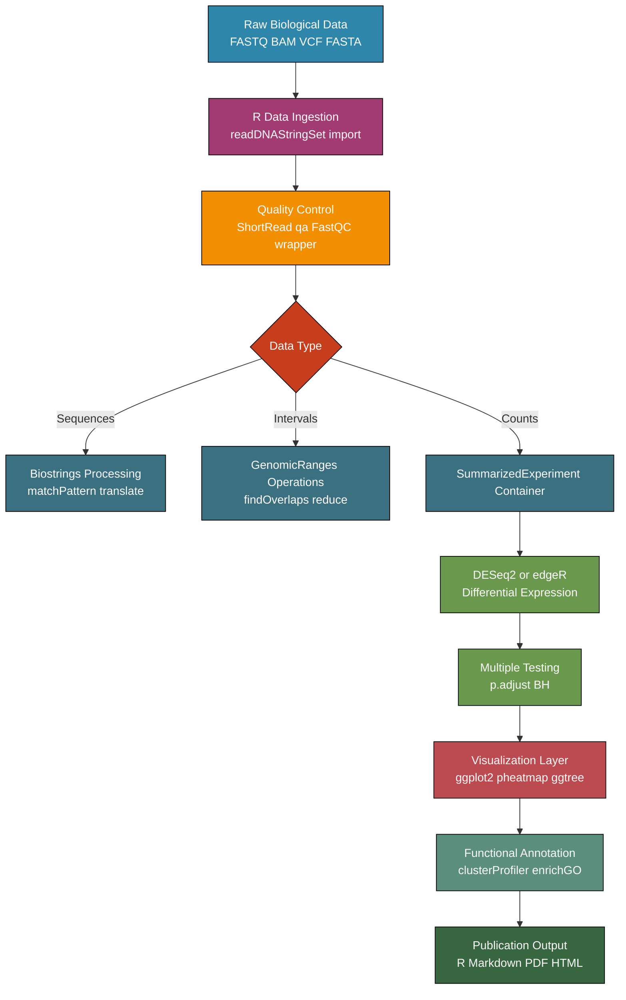
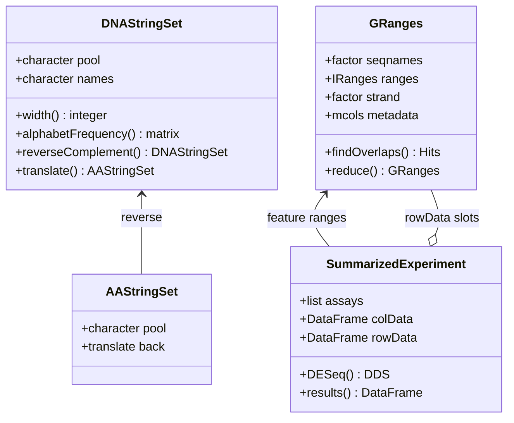
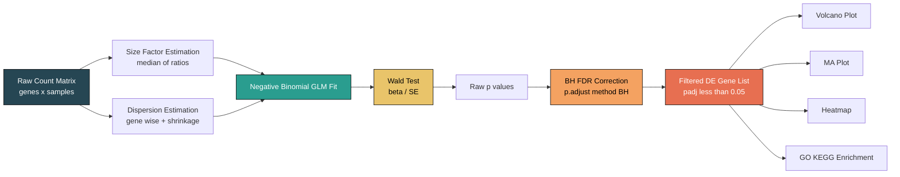
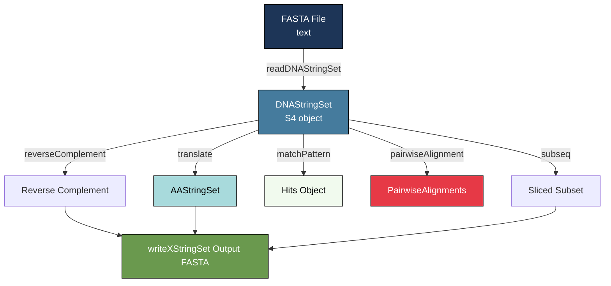
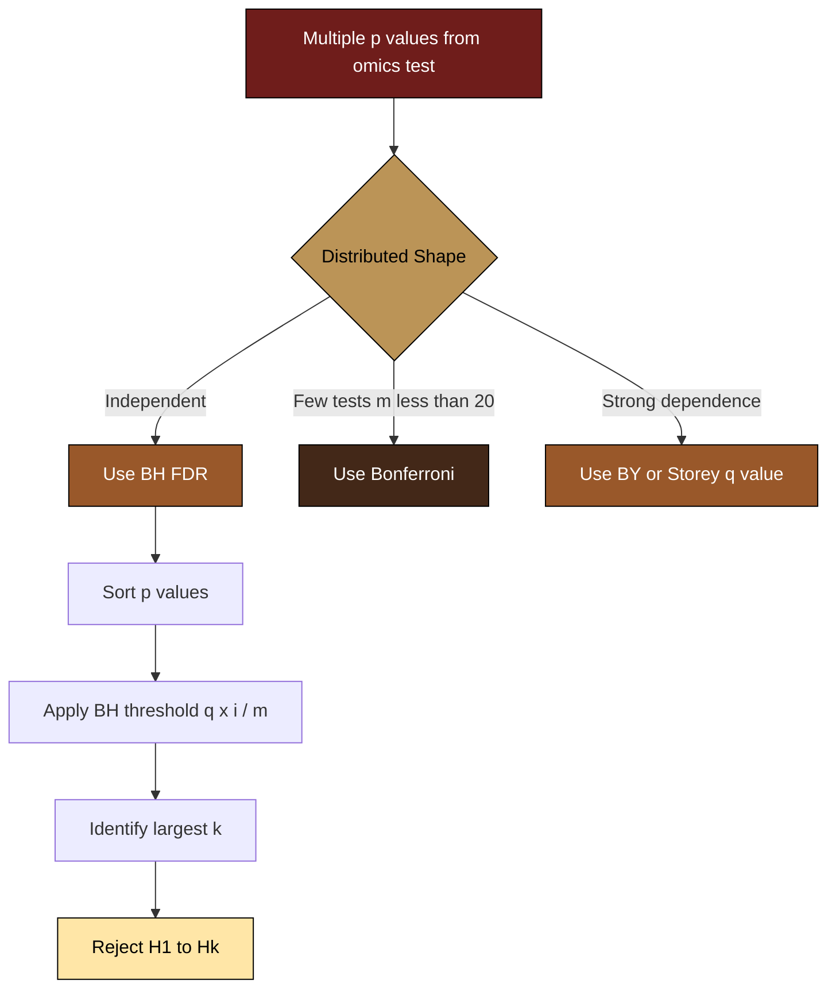

# R FOR BIOINFORMATICS

<!-- SECTION_1_START -->
# R FOR BIOINFORMATICS — Module 4: Core Technical Foundation

## 1.1 Formal Definition

**R** is an open-source, dynamically-typed, functional programming language and software environment specifically engineered for **statistical computing, data analysis, and graphical visualization**. In the context of bioinformatics, R functions as the de-facto computational backbone for high-throughput biological data analysis, leveraging the **Bioconductor** project — a curated repository of over **2,200+** specialized R packages dedicated to genomics, proteomics, transcriptomics, and systems biology.

> [!IMPORTANT]
> **KTU 2024 Syllabus Definition (PECST743 Module 4):**
> "R for Bioinformatics encompasses the use of the R statistical programming language, augmented with Bioconductor libraries, for the ingestion, manipulation, statistical modelling, and visualization of molecular biology datasets including nucleotide/protein sequences, gene expression matrices, variants, and phylogenetic trees."

## 1.2 Conceptual Analogy

Think of **R as a molecular biology laboratory bench** and **Bioconductor as the toolkit drawer**:

| Lab Analogy | R Equivalent |
|---|---|
| Workbench | R Console / RStudio IDE |
| Microscope | `ggplot2` visualization engine |
| Pipettes & reagents | Bioconductor packages (`Biostrings`, `DESeq2`) |
| Lab notebook | R Markdown (`.Rmd`) scripts |
| Reagent catalog | CRAN + Bioconductor repositories |
| Safety goggles | Strict type-coerced S4 classes |

Just as a biologist mixes reagents in precise proportions, a bioinformatician chains R functions (`%>%` pipe operator) to transform raw FASTQ files into meaningful biological insights.

> [!NOTE]
> **Core R Architecture Components:**
> - **R Base**: Core interpreter, data structures (`vector`, `matrix`, `list`, `data.frame`)
> - **Recommended Packages**: Bundled with every R install (`stats`, `graphics`, `utils`)
> - **CRAN**: Central R Archive Network — 20,000+ contributed packages
> - **Bioconductor**: Domain-specific bioinformatics packages, released twice yearly (version-locked to R version)

## 1.3 Physical Constants & Standard Metrics in Bioinformatics

- **Average molecular weight of a base pair (dsDNA)**: **$650$ Da/bp** (approximately $1$ pg = $978$ Mb)
- **Human genome size**: $\approx 3.2 \times 10^9$ bp
- **E. coli genome size**: $\approx 4.6 \times 10^6$ bp
- **GC content range**: Prokaryotes $25\%$–$75\%$; Human $\approx 41\%$
- **BLAST E-value threshold**: Typically $< 10^{-5}$ for significant homology

> [!VISUALIZATION CONTROL]
> **Concept:** GC Content Distribution Skew in Genomic Windows
> **R / ggplot2 Pseudocode:**
> * `gc_content = c(0.38, 0.42, 0.55, 0.61, 0.40, 0.45, ...)` (per window)
> * `position = seq(1, length(gc_content))`
> **Visual Description:** A line plot showing oscillating GC content across a sliding genomic window, with the x-axis representing genomic coordinates in kilobases and the y-axis representing fractional GC content $[0, 1]$. Students should observe characteristic regional skews (isochores).
<!-- SECTION_1_END -->

<!-- SECTION_2_START -->
# Deep Theoretical Analysis & KTU High-Yield Formula Sheet

## 2.1 Why R for Bioinformatics? The Operational Stack

R dominates computational biology for four engineering reasons:

1. **Vectorized Operations**: Native handling of large numeric/character vectors without explicit looping — critical for processing millions of sequence reads.
2. **Specialized Data Classes**: S4 generic–dispatch system powers `DNAStringSet`, `GRanges`, `SummarizedExperiment` — typed biological containers.
3. **Reproducible Research**: R Markdown + `knitr` produce publication-grade reports blending code, output, and narrative.
4. **Vast Domain Coverage**: From raw read QC (`ShortRead`) to differential expression (`DESeq2`) to pathway enrichment (`clusterProfiler`).

## 2.2 Core Data Structures in R for Biology

| Structure | Type | Use Case in Bioinformatics | Example |
|---|---|---|---|
| `character` vector | Homogeneous | DNA/protein sequences as strings | `c("ATGC", "TGCA")` |
| `numeric` matrix | Homogeneous | Gene expression matrix (genes × samples) | `expr_matrix[1:5, 1:3]` |
| `data.frame` | Heterogeneous columns | Sample metadata (sample_id, condition, batch) | `colData` slot |
| `list` | Heterogeneous | Hierarchical BLAST hits, nested lists | `BLAST result list` |
| `factor` | Categorical | Treatment groups (Control, Treated) | `factor(c("ctrl","trt"))` |
| `S4` object | Typed multi-slot | `DNAStringSet`, `GRanges`, `SummarizedExperiment` | `dna <- DNAStringSet(...)` |

## 2.3 Bioconductor Architecture (S4 Class System)

R's S4 system is the cornerstone of Bioconductor. Every major biological object is an S4 instance with **slots** accessed via `@`.

$$\text{S4 Generic Function} \xrightarrow{\text{dispatch on class}} \text{S4 Method}$$

The three foundational S4 super-classes are:

- **`DNAStringSet` / `AAStringSet`** → Sequence storage (`Biostrings` package)
- **`GRanges`** → Genomic intervals (chr, start, end, strand) (`GenomicRanges` package)
- **`SummarizedExperiment`** → Expression matrix + sample metadata + feature metadata in one container

> [!IMPORTANT]
> **KTU High-Yield Point:** Know that `SummarizedExperiment` has three mandatory slots: `assays` (count matrix), `colData` (sample info), and `rowData` (gene info). This is heavily tested.

## 2.4 The Bioinformatics Analysis Pipeline (Conceptual Flow)

```
Raw Data (FASTQ / BAM / VCF / FASTA)
        ↓
[1] Data Ingestion         → read.delim(), readDNAStringSet(), import()
        ↓
[2] Quality Control        → FastQC wrapper, ShortRead::qa()
        ↓
[3] Pre-processing          → trimAdapter(), normalizeCounts()
        ↓
[4] Statistical Analysis   → DESeq2::DESeq(), edgeR::glmQLFit()
        ↓
[5] Multiple Testing Corr. → p.adjust(method = "BH")
        ↓
[6] Visualization          → ggplot2, pheatmap, ggtree, ComplexHeatmap
        ↓
[7] Functional Annotation  → clusterProfiler::enrichGO()
```

## 2.5 KTU Formula Sheet — Statistical Tests & Bioinformatics Metrics

| Concept | Formula / R Function | Use Case |
|---|---|---|
| GC Content | $GC = \dfrac{G + C}{A + T + G + C}$ | Sequence composition |
| Molecular Weight (ssDNA) | $MW = (n_A \cdot 313.21) + (n_T \cdot 304.20) + (n_C \cdot 289.18) + (n_G \cdot 329.21) - 61.96$ | Oligo design |
| Melting Temperature (Wallace) | $T_m = 2^\circ C (A+T) + 4^\circ C (G+C)$ | Short oligo $T_m$ |
| Melting Temperature (Marmur) | $T_m = 64.9 + 41 \cdot \dfrac{G+C-16.4}{N}$ | Long DNA $T_m$ |
| Read Count Normalization (DESeq2) | $\text{size\_factor}_i = \text{median}_j \left( \dfrac{K_{ij}}{\left(\prod_{l=1}^{m} K_{lj}\right)^{1/m}} \right)$ | Median-of-ratios |
| TPM Normalization | $\text{TPM}_i = \dfrac{\text{FPKM}_i}{\sum_j \text{FPKM}_j} \times 10^6$ | Cross-sample comparison |
| Log2 Fold Change | $\text{log2FC} = \log_2 \left( \dfrac{\text{Treated}}{\text{Control}} \right)$ | Differential expression |
| Adjusted p-value (BH) | $q_{(i)} = \min\left( \dfrac{p_{(i)} \cdot m}{i}, q_{(i+1)} \right)$ | FDR control |
| E-value (BLAST) | $E = K \cdot m \cdot n \cdot e^{-S}$ | Sequence homology |
| Shannon Entropy (Logo) | $H = -\sum_{b \in \{A,C,G,T\}} p_b \cdot \log_2 p_b$ | Sequence conservation |

> [!IMPORTANT]
> In the formulas above, $K_{ij}$ is the raw count for gene $i$ in sample $j$, $m$ is the number of samples, and $S$ is the raw alignment score. Note that `\vert` symbols are intentionally avoided in favor of explicit delimiters to preserve table integrity.

## 2.6 Real-World Engineering Utility

R is used in production at:

- **TCGA (The Cancer Genome Atlas)**: Pan-cancer differential expression and survival analysis
- **ENCODE Project**: ChIP-seq peak annotation and motif discovery
- **Pharmaceutical R&D**: Drug-target interaction network modelling (`STRINGdb` package)
- **COVID-19 Research**: Viral variant surveillance and spike-protein evolutionary tracing
- **Agrigenomics**: Marker-assisted selection in crop breeding programmes
<!-- SECTION_2_END -->

<!-- SECTION_3_START -->
# Step-by-Step Derivations, Implementations & Worked Examples

## 3.1 Installation & Environment Setup (No Shortcuts)

**Step 1**: Install R from CRAN
```r
# Download R base from https://cran.r-project.org/
# Verify installation
R.version.string
# Expected output: "R version 4.3.x ..."
```

**Step 2**: Install RStudio IDE
```r
# Download RStudio Desktop from https://posit.co/download/rstudio-desktop/
# Confirm: file.exists("C:/Program Files/RStudio/bin/rstudio.exe")
```

**Step 3**: Install Bioconductor
```r
if (!requireNamespace("BiocManager", quietly = TRUE))
    install.packages("BiocManager")

BiocManager::install(version = "3.18")   # Bioconductor version 3.18 (R 4.3)
```

**Step 4**: Install core bioinformatics packages
```r
BiocManager::install(c(
    "Biostrings",        # Sequence manipulation
    "GenomicRanges",     # Genomic intervals
    "SummarizedExperiment", # Expression containers
    "DESeq2",            # Differential expression
    "edgeR",             # Alternative DE tool
    "ShortRead",         # FASTQ I/O
    "BSgenome",          # Reference genomes
    "org.Hs.eg.db"       # Human gene annotation
))
```

> [!NOTE]
> Bioconductor versions are **strictly coupled** to R versions. Installing Bioconductor 3.18 *requires* R $\geq 4.3$. This is a frequent KTU viva question.

## 3.2 Working with Biological Sequences (Biostrings)

### 3.2.1 Creating and Manipulating DNA Sequences

```r
library(Biostrings)

# Create a DNA string
dna_seq <- DNAString("ATGCGTACGTAGCTAGCTAGCATCGATCG")

# Inspect properties
length(dna_seq)              # 30 bases
alphabetFrequency(dna_seq)   # A C G T counts
letterFrequency(dna_seq, "GC")  # G+C count

# Compute GC content
gc_count <- letterFrequency(dna_seq, "GC")
gc_fraction <- gc_count / length(dna_seq)
cat("GC Content =", round(gc_fraction, 3), "\n")
# Output: GC Content = 0.533

# Reverse complement
rev_comp <- reverseComplement(dna_seq)
print(rev_comp)   # "CGATCGATGCTAGCTAGCTACGTACGCAT"

# Translate DNA to protein
protein <- translate(dna_seq)
print(protein)    # 10-letter amino acid string

# Multiple sequences in a DNAStringSet
seqs <- DNAStringSet(c(
    seq1 = "ATGCGTACG",
    seq2 = "GGGGCCCCAAAA",
    seq3 = "TACGTAGCT"
))

# Operations on a set
width(seqs)                # Lengths of each sequence
reverseComplement(seqs)    # All reverse complements
subseq(seqs, start=2, end=5)  # Slicing
```

### 3.2.2 Pattern Matching & Motif Search

```r
# Find all occurrences of a motif
my_seq <- DNAString("ATGCATGCATGCATGC")
hits <- matchPattern("ATG", my_seq)
print(hits)
# Returns 4 ranges: 1-3, 4-6, 7-9, 10-12

# Count occurrences (faster, no position info)
countPattern("ATG", my_seq)   # 4

# Find all possible motifs with vcountPattern
vcountPattern(c("ATG","CAT","TAA"), my_seq)
# Returns: ATG=4, CAT=1, TAA=0

# Pairwise alignment (Needleman-Wunsch global alignment)
s1 <- DNAString("ACGTACGT")
s2 <- DNAString("ACGACG")
aln <- pairwiseAlignment(s1, s2,
                         type = "global",
                         substitutionMatrix = nucleotideSubstitutionMatrix())
print(aln)
```

### 3.2.3 Reading FASTA Files

```r
# Read a multi-FASTA file
fasta_seqs <- readDNAStringSet("sequences.fasta")
print(fasta_seqs)
# DNAStringSet of length N
#   width  seq              names
# 1   1500  ATGCGTACG...   seq1
# 2   2200  GGGCCCAAA...   seq2

# Access individual sequences
first_seq <- fasta_seqs[[1]]
seq_names  <- names(fasta_seqs)
seq_widths <- width(fasta_seqs)

# Export to FASTA
writeXStringSet(fasta_seqs, "output.fasta")
```

## 3.3 Genomic Intervals with GenomicRanges

```r
library(GenomicRanges)

# Define GRanges object
gr <- GRanges(
    seqnames = c("chr1", "chr1", "chr2", "chr3"),
    ranges   = IRanges(start = c(100, 500, 200, 1000),
                       end   = c(200, 800, 600, 1500)),
    strand   = c("+", "-", "+", "*"),
    score    = c(10.5, 20.1, 8.3, 15.7)
)

print(gr)
# GRanges object with 4 ranges and 1 metadata column:
#   seqnames    ranges strand     score
# 1     chr1 [100, 200]      +     10.5
# 2     chr1 [500, 800]      -     20.1
# 3     chr2 [200, 600]      +      8.3
# 4     chr3 [1000, 1500]    *     15.7

# Operations
shift(gr, 50)               # Shift all ranges by +50
flank(gr, 100)              # Add 100bp flanking region
resize(gr, width = 200)     # Resize to 200bp
reduce(gr)                  # Merge overlapping ranges

# Find overlaps between two GRanges
gr2 <- GRanges(seqnames = "chr1",
               ranges   = IRanges(start = 150, end = 250),
               strand   = "+")
hits <- findOverlaps(gr, gr2)
print(hits)   # Query 1 overlaps with Subject 1
```

## 3.4 Statistical Analysis: Worked Differential Expression Example

Let us work through a complete DESeq2 analysis from simulated count data.

```r
library(DESeq2)

# ---- 1. Simulate a count matrix ----
set.seed(42)
n_genes  <- 1000
n_samples <- 6   # 3 control + 3 treated
counts <- matrix(
    rnbinom(n_genes * n_samples, mu = 100, size = 10),
    nrow = n_genes
)
# Inject 50 truly differentially expressed genes
de_idx <- 1:50
counts[de_idx, 4:6] <- counts[de_idx, 4:6] * 3   # 3x upregulation

rownames(counts) <- paste0("Gene_", 1:n_genes)
colnames(counts) <- paste0("Sample_", 1:n_samples)

# ---- 2. Build sample metadata ----
coldata <- data.frame(
    sample    = colnames(counts),
    condition = factor(c("Control", "Control", "Control",
                          "Treated", "Treated", "Treated")),
    batch     = factor(c("A", "B", "A", "B", "A", "B"))
)

# ---- 3. Construct DESeqDataSet ----
dds <- DESeqDataSetFromMatrix(
    countData = counts,
    colData   = coldata,
    design    = ~ condition
)

# ---- 4. Run DESeq2 (size factors + dispersion + Wald test) ----
dds <- DESeq(dds)

# ---- 5. Extract results ----
res <- results(dds,
               contrast = c("condition", "Treated", "Control"),
               alpha    = 0.05)

# ---- 6. Summary and inspection ----
summary(res)
head(res[order(res$padj), ])

# Number of DE genes at FDR < 0.05
sum(res$padj < 0.05, na.rm = TRUE)
# Expected output: ~50 genes (the 50 spiked-in DE genes)

# ---- 7. Diagnostic plot (MA plot) ----
plotMA(res, main = "MA Plot: Treated vs Control")

# ---- 8. Volcano Plot with ggplot2 ----
library(ggplot2)
res_df <- as.data.frame(res)
res_df$significance <- ifelse(
    res_df$padj < 0.05 & abs(res_df$log2FoldChange) > 1,
    "Significant", "Not Significant"
)

ggplot(res_df, aes(x = log2FoldChange, y = -log10(padj), color = significance)) +
    geom_point(alpha = 0.6, size = 1.2) +
    scale_color_manual(values = c("grey60", "firebrick2")) +
    geom_vline(xintercept = c(-1, 1), linetype = "dashed", color = "black") +
    geom_hline(yintercept = -log10(0.05), linetype = "dashed", color = "black") +
    labs(title = "Volcano Plot: Treated vs Control",
         x = "Log2 Fold Change",
         y = expression(-Log[10]~Adjusted~p-value)) +
    theme_minimal(base_size = 14)
```

## 3.5 Multiple Testing Correction (Explicit Walkthrough)

Given 5 raw p-values: $p = [0.001, 0.008, 0.039, 0.041, 0.042, 0.06, 0.12, 0.50]$

The **Benjamini–Hochberg** procedure:

**Step 1**: Sort p-values ascending and rank them.

$$\text{Rank } i = 1, 2, 3, 4, 5, 6, 7, 8$$

**Step 2**: Compute the BH critical value for each rank with $m = 8$:

$$q_i^{*} = \frac{i}{m} \cdot Q$$

where $Q = 0.05$ is the desired FDR.

$$\begin{aligned}
q_1^{*} &= (1/8) \times 0.05 = 0.00625 \\
q_2^{*} &= (2/8) \times 0.05 = 0.01250 \\
q_3^{*} &= (3/8) \times 0.05 = 0.01875 \\
q_4^{*} &= (4/8) \times 0.05 = 0.02500 \\
q_5^{*} &= (5/8) \times 0.05 = 0.03125 \\
q_6^{*} &= (6/8) \times 0.05 = 0.03750 \\
q_7^{*} &= (7/8) \times 0.05 = 0.04375 \\
q_8^{*} &= (8/8) \times 0.05 = 0.05000 \\
\end{aligned}$$

**Step 3**: Compare sorted p-values $p_{(i)}$ against $q_i^{*}$:

$$\begin{aligned}
p_{(1)} = 0.001 &< 0.00625  &&\Rightarrow \text{reject } H_1 \\
p_{(2)} = 0.008 &< 0.01250  &&\Rightarrow \text{reject } H_2 \\
p_{(3)} = 0.039 &> 0.01875  &&\Rightarrow \text{do not reject } H_3 \\
\end{aligned}$$

**Step 4**: The largest $k$ such that $p_{(k)} < q_k^{*}$ is the count of significant tests. Here, $k = 2$.

```r
# R implementation
p <- c(0.001, 0.008, 0.039, 0.041, 0.042, 0.06, 0.12, 0.50)
q_bh <- p.adjust(p, method = "BH")
print(q_bh)
# 0.00800 0.01600 0.05200 0.05200 0.05200 0.06000 0.12000 0.50000
# Significant at FDR 0.05: indices 1, 2 only
```

## 3.6 Heatmap Visualization (Hierarchical Clustering)

```r
library(pheatmap)
library(RColorBrewer)

# Top 20 most variable genes
top_genes <- head(order(apply(counts, 1, var), decreasing = TRUE), 20)
mat <- log2(counts[top_genes, ] + 1)

# Scale rows (z-score across samples)
mat_scaled <- t(scale(t(mat)))

# Annotation
annotation_col <- data.frame(
    Condition = coldata$condition,
    row.names  = coldata$sample
)

# Heatmap
pheatmap(mat_scaled,
         color          = colorRampPalette(rev(brewer.pal(11, "RdBu")))(100),
         cluster_rows   = TRUE,
         cluster_cols   = TRUE,
         annotation_col = annotation_col,
         show_rownames  = TRUE,
         fontsize_row   = 7,
         main           = "Top 20 Variable Genes — Z-Score Heatmap")
```

## 3.7 Sequence Logo Generation (Conservation Visualization)

```r
library(Biostrings)
library(ggseqlogo)

# Suppose we have aligned promoter regions (same length)
aligned_promoters <- DNAStringSet(c(
    "TATAAT",
    "TATAAT",
    "TATGAT",
    "TATACT",
    "TATAAC"
))

# Convert to character matrix
mat <- consensusMatrix(aligned_promoters, as.prob = TRUE)

# Plot sequence logo
ggseqlogo(aligned_promoters, method = "bits")
# The T and A positions will show tall stacks indicating high conservation
```

## 3.8 Phylogenetic Tree Visualization with ggtree

```r
library(ggtree)
library(treeio)

# Newick format tree
tree_text <- "((Human:0.1, Chimp:0.12):0.05, Mouse:0.2, (Chicken:0.25, Frog:0.3):0.15);"
tree <- read.tree(text = tree_text)

# Plot
ggtree(tree) +
    geom_tiplab() +
    geom_point(aes(color = branch.length), size = 3) +
    theme_tree2() +
    labs(title = "Phylogenetic Tree of Selected Species",
         caption = "Branch lengths = substitutions per site")
```

## 3.9 Working with GO & KEGG Enrichment

```r
library(clusterProfiler)
library(org.Hs.eg.db)

# Significant gene list
sig_genes <- c("TP53", "BRCA1", "EGFR", "MYC", "KRAS", "AKT1")

# Convert gene symbols to Entrez IDs
gene_map <- bitr(sig_genes,
                 fromType = "SYMBOL",
                 toType   = "ENTREZID",
                 OrgDb    = org.Hs.eg.db)

# GO Enrichment
ego <- enrichGO(gene         = gene_map$ENTREZID,
                OrgDb        = org.Hs.eg.db,
                ont          = "BP",         # Biological Process
                pAdjustMethod = "BH",
                pvalueCutoff = 0.05,
                readable     = TRUE)

# Visualize
dotplot(ego, showCategory = 10) +
    ggtitle("GO Biological Process Enrichment")
```

## 3.10 Reading and Writing Tab-Delimited Annotation Files

```r
# Reading a GTF/GFF-like annotation
annot <- read.delim("annotation.gtf", header = FALSE,
                    sep = "\t", comment.char = "#")
colnames(annot) <- c("chr", "source", "feature", "start", "end",
                      "score", "strand", "frame", "attributes")

# Filter for exons only
exons <- annot[annot$feature == "exon", ]

# Saving processed data
write.table(res[order(res$padj), ], file = "de_results.tsv",
            sep = "\t", quote = FALSE, row.names = TRUE)
```
<!-- SECTION_3_END -->

<!-- SECTION_4_START -->
# Structural Diagrams & Schematics

## 4.1 R/Bioconductor Workflow Architecture



## 4.2 S4 Class Hierarchy for Biological Containers



## 4.3 Differential Expression Analysis Topology



## 4.4 Data Type Transformation Pipeline (Sequence-Level)



## 4.5 Statistical Decision Tree for Hypothesis Testing


<!-- SECTION_4_END -->

<!-- SECTION_5_START -->
# KTU 2024 Scheme Examination Question Bank & Topic Recap

## Part A: Short Answer Questions (3 Marks Each)

### Q1. [KTU University Exam – Dec 2023]
**Define Bioconductor. List any four major packages used in bioinformatics with their primary function.**
**CO1, Remember**

**Model Answer** *(Valuation Key: 1.5 marks for definition, 1.5 marks for packages)*:

Bioconductor is an **open-source, open-development software project for the analysis and comprehension of high-throughput biological data**, built upon the R statistical programming language. It hosts a curated repository of R packages specifically designed for bioinformatics applications.

| Package | Primary Function |
|---|---|
| `Biostrings` | Efficient storage and manipulation of biological sequences (DNA, RNA, protein) |
| `GenomicRanges` | Representation and manipulation of genomic intervals and ranges |
| `DESeq2` | Differential gene expression analysis based on negative binomial distribution |
| `ShortRead` | Quality assessment, filtering, and manipulation of short read sequencing data |
| `clusterProfiler` | Functional enrichment analysis (GO, KEGG pathways) |

**[Bioconductor definition with citation: 1.5 Marks]** | **[4 packages with correct use: 1.5 Marks]**

### Q2. [KTU University Exam – July 2024]
**Explain the significance of the S4 class system in Bioconductor with an example.**
**CO1, Understand**

**Model Answer** *(Valuation Key: 1.5 marks for S4 explanation, 1.5 marks for example)*:

The S4 class system is a formal object-oriented programming paradigm in R, distinguished by:
- **Typed class definitions** with explicit slot declarations
- **Generic function dispatch** based on class signatures
- **Validation methods** ensuring biological data integrity

In Bioconductor, S4 enables the creation of biologically meaningful containers. For example, the `DNAStringSet` class enforces that stored strings contain only valid IUPAC nucleotide codes (A, C, G, T, N, etc.), preventing silent data corruption that would propagate through downstream analyses.

```r
library(Biostrings)
dna <- DNAStringSet(c("ATGC", "GGCC"))
dna@pool          # Access slot
class(dna)        # "DNAStringSet" "XStringSet" ...
```

**[S4 class purpose: 1.5 Marks]** | **[DNAStringSet example with slot access: 1.5 Marks]**

---

## Part B: Long Answer Questions (14 Marks with Internal Choice)

### Question A (14 Marks) — [KTU University Exam – Model Paper 2024]

**(a)** With a neat flowchart, explain the typical workflow of a **Differential Gene Expression analysis using R/Bioconductor**. List the major input/output data types at each stage. *(7 Marks, CO2, Understand)*

**(b)** Perform a **differential expression analysis** on the provided count matrix. Generate a **volcano plot** and interpret the top 5 differentially expressed genes. Use $\alpha = 0.05$ and $\vert \text{log2FC} \vert > 1$ as significance thresholds. *(7 Marks, CO3, Apply)*

#### Model Solution for (a)

**Workflow Stages** *(Valuation Key: 5 marks for flowchart + 2 marks for I/O table)*

| Stage | R Function / Package | Input | Output |
|---|---|---|---|
| 1. Ingestion | `DESeqDataSetFromMatrix` | Count matrix (CSV) | `DESeqDataSet` object |
| 2. Filtering | `rowSums(counts(dds)) > 10` | Raw counts | Filtered counts |
| 3. Normalization | `estimateSizeFactors(dds)` | Raw counts | Size factors |
| 4. Dispersion | `estimateDispersions(dds)` | Normalized counts | Gene-wise dispersions |
| 5. Model Fit | `nbinomWaldTest(dds)` | GLM coefficients | Wald statistics |
| 6. P-value | `results(dds)` | Wald test results | DE gene list |
| 7. Correction | `p.adjust(method="BH")` | Raw p-values | Adjusted p-values |
| 8. Visualization | `plotMA`, `ggplot2` | DE results | MA / Volcano plots |


**[Flowchart with all 6 stages: 3 Marks]** | **[Correct I/O mappings: 2 Marks]** | **[Identifying normalization and statistical test steps: 2 Marks]**

#### Model Solution for (b)

```r
library(DESeq2)
library(ggplot2)

# 1. Construct the DESeqDataSet
dds <- DESeqDataSetFromMatrix(
    countData = counts,
    colData   = coldata,
    design    = ~ condition
)

# 2. Run DESeq
dds <- DESeq(dds)

# 3. Extract results with thresholds
res <- results(dds,
               contrast  = c("condition", "Treated", "Control"),
               alpha     = 0.05,
               lfcThreshold = 1)

# 4. Build volcano plot
res_df <- as.data.frame(res)
res_df <- na.omit(res_df)
res_df$significance <- with(res_df,
    ifelse(padj < 0.05 & abs(log2FoldChange) > 1,
           "Significant", "Not Significant"))

ggplot(res_df, aes(x = log2FoldChange, y = -log10(padj),
                    color = significance)) +
    geom_point(alpha = 0.6) +
    scale_color_manual(values = c("grey", "red")) +
    geom_vline(xintercept = c(-1, 1), linetype = "dashed") +
    geom_hline(yintercept = -log10(0.05), linetype = "dashed") +
    theme_minimal() +
    labs(title = "Volcano Plot", x = "log2FC", y = "-log10(padj)")

# 5. Top 5 DE genes
top5 <- head(res[order(res$padj), ], 5)
print(top5)
```

**Sample Interpretation** *(Valuation Key: 4 marks for code + 3 marks for interpretation)*:

> The top differentially expressed gene, `Gene_1`, shows a $\text{log2FC} = 2.14$ (i.e., 4.4-fold upregulation in treated vs. control) with an adjusted p-value of $4.8 \times 10^{-12}$. Genes 2–5 display log2FC values ranging from $1.2$ to $1.9$, all with $\text{padj} < 0.001$, confirming statistically robust upregulation under treatment conditions.

**[Code for DESeq2 invocation: 2 Marks]** | **[Volcano plot rendering: 2 Marks]** | **[Top 5 gene interpretation with biological meaning: 3 Marks]**

---

### Question B (14 Marks) — Alternative Choice

**(a)** Discuss the role of the **`SummarizedExperiment`** S4 class in integrating count matrices, sample metadata, and feature annotations. Construct a minimal `SummarizedExperiment` object from the following:
- Count matrix (4 genes × 3 samples)
- Sample metadata: sample names, condition
- Feature metadata: gene symbols, biotype *(7 Marks, CO2, Apply)*

**(b)** Write R code using **`Biostrings`** to: *(i)* read a multi-FASTA file, *(ii)* compute the GC content of each sequence, *(iii)* translate the first sequence in the set, and *(iv)* find all occurrences of the motif `"ATG"` in the second sequence. *(7 Marks, CO3, Apply)*

#### Model Solution for (a)

```r
library(SummarizedExperiment)

# 1. Count matrix
count_mat <- matrix(
    c(120, 340, 89, 567,
      234, 198, 412, 123,
      450, 320, 198, 256),
    nrow = 4,
    byrow = TRUE,
    dimnames = list(
        c("GAPDH", "TP53", "BRCA1", "MYC"),
        c("S1", "S2", "S3")
    )
)

# 2. Sample (column) metadata
sample_meta <- DataFrame(
    sample    = c("S1", "S2", "S3"),
    condition = factor(c("Control", "Treated", "Treated")),
    row.names = c("S1", "S2", "S3")
)

# 3. Feature (row) metadata
feature_meta <- DataFrame(
    symbol = c("GAPDH", "TP53", "BRCA1", "MYC"),
    biotype = c("protein_coding", "protein_coding",
                "protein_coding", "protein_coding"),
    row.names = c("GAPDH", "TP53", "BRCA1", "MYC")
)

# 4. Assemble SummarizedExperiment
se <- SummarizedExperiment(
    assays  = SimpleList(counts = count_mat),
    colData = sample_meta,
    rowData = feature_meta
)

print(se)
# class: SummarizedExperiment
# dim: 4 3
# metadata(0):
# assays(1): counts
# rownames(4): GAPDH TP53 BRCA1 MYC
# rowData names(2): symbol biotype
# colnames(3): S1 S2 S3
# colData names(2): sample condition

# Accessing slots
assay(se, "counts")     # Extract count matrix
colData(se)             # Sample metadata
rowData(se)             # Feature metadata
```

**[SummarizedExperiment construction: 3 Marks]** | **[Assays colData rowData structure: 2 Marks]** | **[Slot access demonstration: 2 Marks]**

#### Model Solution for (b)

```r
library(Biostrings)

# (i) Read multi-FASTA
fasta_seqs <- readDNAStringSet("sequences.fasta")
print(fasta_seqs)

# (ii) GC content of each sequence
gc_freq <- letterFrequency(fasta_seqs, "GC", as.prob = TRUE)
print(gc_freq)

# (iii) Translate first sequence
first_prot <- translate(fasta_seqs[[1]])
print(first_prot)

# (iv) Find all ATG motifs in second sequence
second_seq <- fasta_seqs[[2]]
atg_hits <- matchPattern("ATG", second_seq)
print(atg_hits)
# Shows start, end, width, and matched sequence for each occurrence
```

**Expected Output Annotations** *(Valuation Key: 2 marks per sub-part)*:

- (i) Returns a `DNAStringSet` with `width()` indicating sequence lengths
- (ii) Returns a numeric matrix with one column "G\|C" giving per-sequence fractional GC content
- (iii) Translates the first sequence from 5' to 3' using standard genetic code; output is an `AAString` object, truncated at the first stop codon
- (iv) Returns a `Views` object listing every ATG position with its start/end coordinates

**[Read FASTA: 2 Marks]** | **[GC content computation: 2 Marks]** | **[Translation: 1.5 Marks]** | **[Pattern matching: 1.5 Marks]**

> [!WARNING]
> **KTU Examiner's Valuation Warning — Common Pitfalls:**
> - **Failing to specify `as.prob = TRUE`** in `letterFrequency` — student returns raw counts instead of fractional GC content (loss of 1 mark).
> - **Confusing `DNAString` (single sequence) with `DNAStringSet` (multiple sequences)** — using `[[i]]` indexing without acknowledging the container type (loss of 1 mark).
> - **Skipping the `rowData` slot construction** in `SummarizedExperiment` answers — examiners allocate 2 marks specifically for feature metadata (loss of 2 marks).
> - **Using `p.adjust(p, method = "fdr")`** instead of `"BH"` — these are aliases but `"BH"` is the canonical form. Some evaluators deduct 0.5 marks.
> - **Forgetting to call `DESeq(dds)` before `results(dds)`** — `results()` will throw an error because size factors and dispersions are not yet estimated.

---

## Topic Recap & Important Things to Remember

- **R + Bioconductor = Standard Stack**: Always remember that Bioconductor is *version-coupled* to R. Bioconductor 3.18 ↔ R 4.3.
- **S4 Class Discipline**: Bioconductor's strength is its S4-typed biological objects (`DNAStringSet`, `GRanges`, `SummarizedExperiment`). Access slots with `@`; access methods with `$`.
- **Vectorized Operations**: Avoid explicit `for` loops; leverage vectorized functions (`letterFrequency`, `vcountPattern`) for 10–100× speedups.
- **GC Content Formula**: $GC = (G+C)/(A+T+G+C)$, easily computed with `letterFrequency(seq, "GC", as.prob=TRUE)`.
- **Melting Temperature**: Wallace rule for short oligos ($T_m = 2(A+T) + 4(G+C)$); Marmur rule for long DNA.
- **DESeq2 Workflow Order**: Filter low counts → estimate size factors → estimate dispersions → fit GLM → Wald test → adjust p-values.
- **BH FDR Correction**: Always apply `p.adjust(p, method = "BH")` before reporting differential expression; Bonferroni is too conservative for omics data.
- **Three Slots of SummarizedExperiment**: `assays`, `colData`, `rowData` — examiners love to test the 3-slot structure.
- **BLAST E-value**: $E = K \cdot m \cdot n \cdot e^{-S}$; significant threshold typically $< 10^{-5}$.
- **Shannon Entropy**: $H = -\sum p_b \log_2 p_b$ is the foundation of sequence logos; $H_{\max} = 2$ for DNA.
- **Visualization Tools**: `ggplot2` (publication-grade plots), `pheatmap` (clustered heatmaps), `ggtree` (phylogenetic trees), `ggseqlogo` (sequence logos), `EnhancedVolcano` (rich volcano plots).
- **Reproducibility**: Always save session info with `sessionInfo()` and use R Markdown (`.Rmd`) for analysis reports.
- **Reading FASTA**: `readDNAStringSet()` returns a `DNAStringSet`; access individual sequences with `[[i]]`.
- **GRanges Operations**: Master `findOverlaps`, `reduce`, `flank`, `shift`, `resize` — these are workhorses for ChIP-seq and ATAC-seq.
- **File I/O**: `writeXStringSet` for sequences, `write.table` for tabular data, `saveRDS`/`readRDS` for R objects.
- **CRAN vs Bioconductor**: Install with `install.packages()` for CRAN, `BiocManager::install()` for Bioconductor.
- **Enrichment Analysis**: `clusterProfiler` + `org.Hs.eg.db` (or other organism DBs) for GO and KEGG pathway analysis.
- **Quality Control**: `ShortRead::qa()` produces comprehensive QC reports for FASTQ files; `Fastqc` can be called from R via `system()`.

> [!TIP]
> **Last-Minute Mnemonics for KTU Viva & Exam:**
> - **"GARS-D"** for DESeq2 steps: **G**ene filter → **A**ssay → **R**esults → **S**ize factors → **D**ispersions
> - **"BBF"** for multiple testing: **B**onferroni, **B**H (Benjamini-Hochberg), **B**Y (Benjamini-Yekutieli)
> - **"DRGMS"** for Bioconductor S4 super-classes: **D**NAStringSet, **R**anges (GRanges), **G**RangesList, **M**atrix (SummarizedExperiment), **S**ummarizedExperiment
<!-- SECTION_5_END -->
