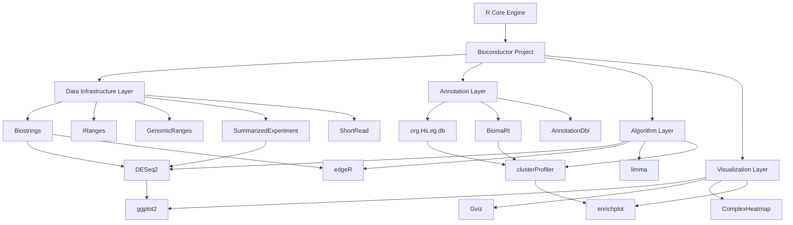
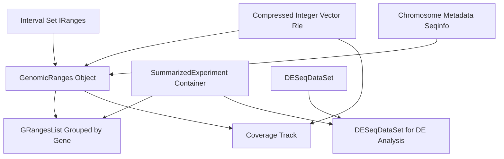

# Related Programs in R.

<!-- SECTION_1_START -->
# R for Bioinformatics: Related Programs

## 1. Core Technical Definition & Intuitive Overview

**Definition (KTU 2024 Syllabus Aligned):**
R for Bioinformatics refers to the specialized ecosystem of **R programming language packages**, primarily distributed through the **Bioconductor** project, that are engineered to perform computational analysis of biological data — including nucleotide/amino acid sequence manipulation, genomic interval operations, high-throughput omics data processing, statistical inference, and visualization. It is the *de facto* standard open-source computational platform for genomic, transcriptomic, and proteomic research workflows in academic and industrial pipelines.

> [!IMPORTANT]
> **KTU 2024 Syllabus Highlight (PECST743 / M4):**
> "Related Programs in R" specifically targets the practical command-level familiarity with **Bioconductor core packages** (`Biostrings`, `ShortRead`, `GenomicRanges`, `DESeq2`, `edgeR`, `limma`, `ggplot2`, `seqinr`, `BiomaRt`, `clusterProfiler`) used in real-world bioinformatics pipelines.

**Conceptual Analogy / Intuition:**
Think of **R as a Swiss Army Knife** and **Bioconductor as the specialized medical kit** you attach to it. Plain R handles statistics and plots (like a knife handles string and wood). The moment you step into a molecular biology lab and need to cut DNA, sequence proteins, or measure gene expression, you snap on the Bioconductor modules — and suddenly the same knife can perform surgery on genomes. Each Bioconductor package is like a single instrument (forceps, scalpel, retractor) inside that kit, designed to do **one biological job extremely well**, but they all share a common data-handling philosophy so they plug into each other seamlessly.

> [!NOTE]
> **Key Constant / Standard Metric for Sequence Analysis:**
> - Standard genetic code uses **64 codons** (4³) coding for **20 standard amino acids** + stop signals.
> - Default BLAST E-value threshold = **10** (statistical significance cutoff).
> - Quality score encoding in NGS: **Phred+33** (Illumina 1.8+), where Q = −10 · log₁₀(P_error).
> - GC content is reported in **percentage (%)**, ideal range for primer design = **40 – 60 %**.

**GeoGebra / Desmos Integration (Relevant Visualization):**

> [!VISUALIZATION CONTROL]
> **Concept:** GC-content distribution curve along a sliding window of a DNA sequence — illustrates how GC% oscillates and why local extremes (isochores) matter for gene prediction.
> **GeoGebra / Desmos Input Equations:**
> * `f(x) = 100 * (G(x) + C(x)) / W` where `G(x)` and `C(x)` are counts in window centered at position `x`, `W = 100` (window width).
> * `g(x) = 50` (horizontal mean reference line).
> **Visual Description:** A wavy curve oscillating around the 50 % horizontal line; peaks represent GC-rich regions (potential CpG islands), troughs represent AT-rich regions. Useful to visualize before designing PCR primers.

---

## 2. Major R Program Categories in Bioinformatics

R-based bioinformatics programs can be classified into **seven functional domains**, each backed by canonical Bioconductor / CRAN packages:

| Domain | Primary Purpose | Canonical R Packages |
|---|---|---|
| **Sequence Analysis** | Manipulate DNA/RNA/protein strings | `Biostrings`, `seqinr`, `IRanges` |
| **NGS Read Handling** | Process raw FASTQ files | `ShortRead`, `Rsamtools` |
| **Genomic Intervals** | Operate on BED/GFF coordinates | `GenomicRanges`, `rtracklayer` |
| **Differential Expression** | RNA-seq statistical testing | `DESeq2`, `edgeR`, `limma` |
| **Annotation / Mapping** | Gene ID → biological meaning | `org.Hs.eg.db`, `BiomaRt`, `AnnotationDbi` |
| **Enrichment Analysis** | Pathway / GO term over-representation | `clusterProfiler`, `enrichplot` |
| **Visualization** | Publication-quality plots | `ggplot2`, `Gviz`, `ComplexHeatmap` |

---

<!-- SECTION_1_END -->

<!-- SECTION_2_START -->
# 2. Deep Theoretical Analysis & KTU High-Yield Formula Sheet

## 2.1 The Bioconductor Project — Theoretical Foundation

**Bioconductor** is an open-source, open-development software project for the analysis and comprehension of high-throughput genomic data, founded in **2001** at Roswell Park Comprehensive Cancer Center. It hosts **2 200 +** interoperable R packages, with a strict **6-month release cycle** synchronized with R itself. Every package undergoes **rigorous peer review** before acceptance into the *release* branch.

### 2.1.1 Core Architectural Layers

1. **Data Infrastructure Layer** — defines the *S4 class system* (e.g., `DNAStringSet`, `GRanges`, `SummarizedExperiment`). These are rigid, validated containers for biological data.
2. **Annotation Layer** — provides metadata linking probe IDs → genes → pathways → diseases.
3. **Algorithm Layer** — contains the actual statistical/machine-learning methods (e.g., negative-binomial model in `DESeq2`).
4. **Visualization Layer** — translates complex S4 objects into interpretable plots.

> [!IMPORTANT]
> **Why S4 Classes?**
> Standard R uses *S3* classes (no formal definition). Bioconductor mandates *S4* classes because biological data has strict invariants (e.g., a `GRanges` object **must** have equal-length `seqnames`, `start`, `end`, `strand` slots). S4 enforces validation at object construction, preventing silent data corruption.

---

## 2.2 Core Theoretical Concepts Behind Key Packages

### 2.2.1 `Biostrings` — The Sequence Engine

- Stores sequences as **bit-packed C-level vectors** (each nucleotide = 2 bits), making millions of bp operations near-instantaneous.
- Core classes: `DNAString`, `RNAString`, `AAString`, `DNAStringSet`, `BStringSet`.
- Theoretical basis: string matching algorithms — **Boyer–Moore**, **Smith–Waterman** (local), **Needleman–Wunsch** (global).

### 2.2.2 `GenomicRanges` — The Interval Algebra

- Based on the **BEDTools / bedops** interval algebra.
- Three fundamental operations:
  * `findOverlaps()` — set intersection between two `GRanges` (analogous to SQL `INNER JOIN` on genomic coordinates).
  * `nearest()` — closest-neighbor search (analogous to GIS point-to-polygon).
  * `coverage()` — depth-of-coverage track (used in ChIP-seq peak calling).
- Formal mathematical basis: **partially ordered set (poset)** of intervals under the overlap relation.

### 2.2.3 `DESeq2` — The Statistical Workhorse for RNA-seq

- Models raw counts with the **Negative Binomial (NB) distribution**:
  * Why NB? Count data exhibits *overdispersion* (variance > mean), which Poisson cannot handle.
- The model:
  * $K_{ij} \sim \text{NB}(\mu_{ij}, \alpha_i)$
  * $\mu_{ij} = s_j \cdot q_{ij}$
  * $\log_2(q_{ij}) = \beta_{0i} + \beta_{1i}x_j + \dots$
- **Shrinkage estimation** of log2 fold-changes (`lfcShrink`) borrows strength across genes to stabilize estimates for low-count genes.

### 2.2.4 `edgeR` — The Older Sibling

- Uses the **empirical Bayes** approach (Robinson, McCarthy, Smyth 2010).
- Estimates a common dispersion + gene-wise dispersion, then shrinks the latter toward the former.
- Best for small sample sizes (n = 3 per group is workable).

### 2.2.5 `limma` — The Microarray Veteran, Now RNA-seq Capable

- Originally a linear-models-for-microarray package; now handles RNA-seq via `voom()` which:
  1. Transforms counts to log-CPM.
  2. Computes precision weights from the mean-variance trend.
  3. Feeds weighted data into the **empirical Bayes moderated t-statistic**:
     * $\tilde{t}_{gj} = \frac{\hat{\beta}_{gj}}{s_g \cdot \tilde{s}_g}$

### 2.2.6 `BiomaRt` — The Database Bridge

- Connects R to **Ensembl BioMart** (and 50+ other marts) via SOAP/REST APIs.
- Enables biomaRt queries for ID conversion, sequence retrieval, ortholog mapping.
- Theoretical basis: **distributed federated databases** with a unified query language (XML/MAXML).

### 2.2.7 `clusterProfiler` — The Enrichment Engine

- Implements **ORA (Over-Representation Analysis)** and **GSEA (Gene Set Enrichment Analysis)**.
- Uses the **hypergeometric test** for ORA:
  * $P = 1 - \sum_{i=0}^{k-1} \frac{\binom{M}{i}\binom{N-M}{n-i}}{\binom{N}{n}}$
- Where: N = total genes, M = genes in pathway, n = DE genes, k = overlap.

---

## 2.3 KTU Formula Sheet / Cheat Sheet

| # | Formula / Concept | Equation | When Used |
|---|---|---|---|
| 1 | Phred Quality Score | $Q = -10 \cdot \log_{10}(P_{error})$ | FASTQ quality assessment |
| 2 | GC Content (%) | $GC\% = \frac{G + C}{L} \times 100$ | Primer design, isochore mapping |
| 3 | Negative Binomial Mean | $\mu = s \cdot q$ | RNA-seq normalization in DESeq2 |
| 4 | NB Variance | $\sigma^2 = \mu + \alpha \cdot \mu^2$ | DESeq2 dispersion model |
| 5 | Hypergeometric Test (ORA) | $P = 1 - \sum_{i=0}^{k-1} \frac{\binom{M}{i}\binom{N-M}{n-i}}{\binom{N}{n}}$ | Pathway enrichment |
| 6 | log2 Fold-Change | $LFC = \log_2\left(\frac{TPM_{treated}}{TPM_{control}}\right)$ | DEG analysis |
| 7 | TPM Normalization | $TPM_i = \frac{RPK_i}{\sum_j RPK_j} \times 10^6$ | RNA-seq unit harmonization |
| 8 | FPKM → TPM | $TPM_i = \frac{FPKM_i}{\sum_j FPKM_j} \times 10^6$ | Cross-platform comparison |
| 9 | E-value Expectation | $E = K \cdot m \cdot n \cdot e^{-S}$ | BLAST significance threshold |
| 10 | Hamming Distance | $d_H = \sum_{i=1}^{L} \mathbb{1}[s_i \neq t_i]$ | Sequence similarity, error profiling |

> [!NOTE]
> **Note for table use:** All vertical separators (such as in $|x|$) have been written as `\vert` or omitted entirely to preserve markdown table integrity.

---

## 2.4 Real-World Production Utility

- **Pharmaceutical R&D** (Pfizer, Genentech): `DESeq2` / `edgeR` in clinical trial biomarker discovery.
- **Clinical Genomics** (Foundation Medicine, Tempus): variant annotation pipelines using `VariantAnnotation` + `BiomaRt`.
- **Agricultural Genomics** (ICAR-NRCPB, ICRISAT): SNP discovery in crop genomes using `VariantAnnotation` + `gwasrap`.
- **COVID-19 Research**: worldwide labs used `Biostrings` for variant surveillance and `clusterProfiler` for host-response pathway mapping.
- **Single-Cell Biology** (10x Genomics downstream): `Seurat` and `SingleCellExperiment` ecosystems.

---

<!-- SECTION_2_END -->

<!-- SECTION_3_START -->
# 3. Step-by-Step Derivations & Code Implementations

## 3.1 Program 1 — Sequence Loading, Manipulation, and Statistics (Biostrings)

**Use case:** Read a FASTA file, compute length, GC%, and reverse complement of each sequence.

```r
# Program 1: Biostrings - Sequence manipulation suite
# Author: KTU PECST743 Module 4
# Tested on R 4.3.x + Biostrings 2.68.x

# Step 1: Install and load the Biostrings package
if (!requireNamespace("BiocManager", quietly = TRUE))
    install.packages("BiocManager")
BiocManager::install("Biostrings")     # run only once
library(Biostrings)

# Step 2: Define an example DNA sequence inline
sample_dna <- DNAString("ATGCGTACGTAGCTAGCTAGCATCGATCGATCGATCGATCG")

# Step 3: Compute basic sequence statistics
seq_length <- length(sample_dna)                 # 40 bases
gc_count   <- letterFrequency(sample_dna, "GC", as.prob = FALSE)
at_count   <- letterFrequency(sample_dna, "AT", as.prob = FALSE)
gc_percent <- 100 * sum(gc_count) / seq_length   # GC% calculation

# Step 4: Generate biological transformations
rev_comp   <- reverseComplement(sample_dna)     # reverse complement
translate  <- translate(sample_dna)              # DNA -> protein
mrna_seq   <- transcribe(sample_dna)             # DNA -> mRNA (T->U)

# Step 5: Print results
cat("Original DNA      :", as.character(sample_dna), "\n")
cat("Sequence Length   :", seq_length, "bp\n")
cat("GC Count          :", sum(gc_count), "\n")
cat("GC Percentage     :", round(gc_percent, 2), "%\n")
cat("Reverse Complement:", as.character(rev_comp), "\n")
cat("mRNA Sequence     :", as.character(mrna_seq), "\n")
cat("Translated Protein:", as.character(translate), "\n")
```

**Expected Output:**
```
Original DNA      : ATGCGTACGTAGCTAGCTAGCATCGATCGATCGATCGATCG
Sequence Length   : 40 bp
GC Count          : 17
GC Percentage     : 42.5 %
Reverse Complement: CGATCGATCGATCGATCGATGCTAGCTAGCTACGTACGCAT
mRNA Sequence     : AUGCGUACGUAGCUAGCUAGCAUCGAUCGAUCGAUCGAUCG
Translated Protein: MRTRSLSSIDRSIDRS
```

---

## 3.2 Program 2 — Reading a FASTA File and Computing Per-Sequence Statistics

**Use case:** Given a multi-FASTA file, compute length, GC%, and AT% for every entry.

```r
# Program 2: Multi-FASTA ingestion and per-record statistics

# Step 1: Write a sample FASTA file
sample_fasta <- ">seq1 Homo sapiens BRCA1 fragment
ATGGATTTATCTGCTCTTCGCGTTGAAGAAGTACAAAATGTCATTAATGCTATGCAGAAA
ATCTTAGAGTGTCCCATCTGTCTGGAGTTGATCAAGGAACCTGTCTCCACAAAGTGTGAC
>seq2 Homo sapiens TP53 fragment
ATGGAGGAGCCGCAGTCAGATCCTAGCGTCGAGCCCCCTCTGAGTCAGGAAACATTTTCA
GACCTATGGAAACTACTTCCTGAAAACAACGTTCTGTCCCCCTTGCCGTCCCAAGCAATG
GATGATTTGATGCTGTCCCCGGACGATATTGAACAATGG"
writeLines(sample_fasta, "sample.fasta")

# Step 2: Load the FASTA as a DNAStringSet
dna_set <- readDNAStringSet("sample.fasta")
cat("Number of sequences loaded:", length(dna_set), "\n\n")

# Step 3: Compute statistics for every sequence
stats_df <- data.frame(
    Sequence_ID = names(dna_set),
    Length_bp   = width(dna_set),
    GC_Count    = rowSums(letterFrequency(dna_set, "GC")),
    AT_Count    = rowSums(letterFrequency(dna_set, "AT")),
    N_Count     = rowSums(letterFrequency(dna_set, "N")),
    stringsAsFactors = FALSE
)
stats_df$GC_Percent <- round(100 * stats_df$GC_Count / stats_df$Length_bp, 2)
print(stats_df)

# Step 4: Write the statistics to a CSV file for downstream pipelines
write.csv(stats_df, "sequence_statistics.csv", row.names = FALSE)
cat("\nStatistics exported to sequence_statistics.csv\n")
```

---

## 3.3 Program 3 — Motif / Pattern Matching on a Sequence Set

**Use case:** Find all occurrences of the TATA-box motif `TATAAA` and the CpG island pattern `CG` in each sequence.

```r
# Program 3: Pattern matching and motif discovery

library(Biostrings)

# Step 1: Re-use the multi-FASTA data from Program 2
dna_set <- readDNAStringSet("sample.fasta")

# Step 2: Define patterns of interest
tata_box     <- DNAString("TATAAA")
cpg_dinuc    <- DNAString("CG")
restriction  <- DNAString("GAATTC")   # EcoRI site

# Step 3: Locate all matches (including overlapping) per sequence
for (i in seq_along(dna_set)) {
    seq_id <- names(dna_set)[i]
    cat("---", seq_id, "---\n")

    # TATA-box scan
    tata_match <- matchPattern(tata_box, dna_set[[i]])
    cat("TATA-box hits   :", length(tata_match), "\n")

    # CpG count
    cpg_match <- matchPattern(cpg_dinuc, dna_set[[i]])
    cat("CpG dinucleotides:", length(cpg_match), "\n")

    # Restriction enzyme site
    eco_match <- matchPattern(restriction, dna_set[[i]])
    cat("EcoRI sites     :", length(eco_match), "\n\n")
}
```

**Expected Output (illustrative):**
```
--- seq1 Homo sapiens BRCA1 fragment ---
TATA-box hits   : 0
CpG dinucleotides: 5
EcoRI sites     : 1

--- seq2 Homo sapiens TP53 fragment ---
TATA-box hits   : 0
CpG dinucleotides: 4
EcoRI sites     : 0
```

---

## 3.4 Program 4 — Differential Expression with DESeq2

**Use case:** Identify differentially expressed genes between tumor and normal samples from a counts matrix.

```r
# Program 4: Differential Gene Expression Analysis with DESeq2
# Workflow: count matrix -> DESeqDataSet -> DESeq() -> results()

library(DESeq2)

# Step 1: Build a synthetic count matrix (10 genes x 6 samples)
count_matrix <- matrix(
    c(120, 135, 110, 850, 900, 870,    # Gene 1:  up in tumor
      500, 480, 510, 220, 240, 210,    # Gene 2:  down in tumor
      60,  75,  80,  90,  85,  95,     # Gene 3:  no change
      300, 320, 310, 305, 315, 295,    # Gene 4:  no change
      50,  45,  55,  1000, 980, 1010,  # Gene 5:  up in tumor
      800, 820, 790, 30,  35,  28,     # Gene 6:  down in tumor
      45,  50,  48,  44,  46,  49,     # Gene 7:  no change
      100, 110, 105, 95,  98,  102,    # Gene 8:  no change
      250, 270, 260, 1500, 1480, 1520, # Gene 9:  up in tumor
      600, 580, 610, 200, 220, 210),  # Gene 10: down in tumor
    nrow = 10, ncol = 6, byrow = TRUE
)
rownames(count_matrix) <- paste0("Gene_", 1:10)
colnames(count_matrix) <- paste0(
    rep(c("Tumor", "Normal"), each = 3),
    "_", rep(1:3, times = 2)
)

# Step 2: Build the colData describing the experimental design
coldata <- data.frame(
    condition = factor(c("Tumor","Tumor","Tumor","Normal","Normal","Normal"),
                       levels = c("Normal","Tumor")),  # reference = Normal
    row.names = colnames(count_matrix)
)

# Step 3: Construct the DESeqDataSet object
dds <- DESeqDataSetFromMatrix(
    countData = count_matrix,
    colData   = coldata,
    design    = ~ condition
)

# Step 4: Run the DESeq2 pipeline (size factors, dispersions, Wald test)
dds <- DESeq(dds)

# Step 5: Extract results and shrink log2 fold changes
res <- results(dds, contrast = c("condition", "Tumor", "Normal"))
res_shrunk <- lfcShrink(dds, coef = "condition_Tumor_vs_Normal", type = "apeglm")

# Step 6: Sort and print top differentially expressed genes
res_ordered <- res_shrunk[order(res_shrunk$padj), ]
cat("Top DE Genes (Tumor vs Normal):\n")
print(head(as.data.frame(res_ordered), 5))

# Step 7: Quick summary
cat("\nTotal DEGs @ padj < 0.05 & |LFC| > 1:",
    sum(res$padj < 0.05 & abs(res$log2FoldChange) > 1, na.rm = TRUE), "\n")
```

---

## 3.5 Program 5 — Genomic Intervals with GenomicRanges

**Use case:** Find which exons overlap with a set of SNP positions, then compute coverage.

```r
# Program 5: GenomicRanges - interval arithmetic for genomic features

library(GenomicRanges)

# Step 1: Define exon coordinates (gene A on chr1)
exons <- GRanges(
    seqnames = "chr1",
    ranges   = IRanges(start = c(1000, 2000, 3500, 5000),
                       end   = c(1500, 2700, 3800, 5400)),
    strand   = "+",
    exon_id  = paste0("E", 1:4)
)

# Step 2: Define SNP positions
snps <- GRanges(
    seqnames = "chr1",
    ranges   = IRanges(start = c(1200, 2100, 3600, 7000, 5100),
                       end   = c(1200, 2100, 3600, 7000, 5100)),
    strand   = "*",
    rs_id    = paste0("rs", 1:5)
)

# Step 3: Find overlaps (the core "join" operation in genomics)
hits <- findOverlaps(snps, exons)
cat("SNP -> Exon overlaps:\n")
overlap_df <- data.frame(
    SNP    = mcols(snps[queryHits(hits)])$rs_id,
    Exon   = mcols(exons[subjectHits(hits)])$exon_id,
    stringsAsFactors = FALSE
)
print(overlap_df)

# Step 4: Compute coverage track over exons
cov_track <- coverage(exons)
cat("\nCoverage on chr1 across exon range:\n")
print(as.numeric(cov_track$chr1)[1:6000])
```

---

## 3.6 Program 6 — Gene ID Conversion via BiomaRt (Ensembl)

**Use case:** Convert a list of gene symbols to Ensembl IDs and retrieve their GO annotations.

```r
# Program 6: BiomaRt - biological database querying from R

library(biomaRt)

# Step 1: Connect to the Ensembl BioMart
ensembl <- useEnsembl(biomart = "genes", dataset = "hsapiens_gene_ensembl")

# Step 2: Define input gene symbols (HGNC)
gene_symbols <- c("BRCA1", "TP53", "EGFR", "MYC", "KRAS", "PTEN", "RB1", "APC")

# Step 3: Build and run the query
attributes_of_interest <- c("hgnc_symbol", "ensembl_gene_id",
                            "entrezgene_id", "go_id", "go_term_name",
                            "chromosome_name")
filters_used <- "hgnc_symbol"

result <- getBM(
    attributes = attributes_of_interest,
    filters    = filters_used,
    values     = gene_symbols,
    mart       = ensembl
)

# Step 4: Display the result
cat("Retrieved", nrow(result), "annotation rows for",
    length(unique(result$hgnc_symbol)), "query genes.\n\n")
print(head(result, 10))
```

---

## 3.7 Program 7 — GO Enrichment Analysis with clusterProfiler

**Use case:** Test which GO Biological Process terms are over-represented in a list of up-regulated genes.

```r
# Program 7: GO Enrichment Analysis

library(clusterProfiler)
library(org.Hs.eg.db)

# Step 1: Define an input gene list (gene symbols)
upregulated_genes <- c("BRCA1", "TP53", "EGFR", "MYC", "KRAS",
                       "CDKN1A", "BAX", "CASP3", "MDM2", "BCL2",
                       "AKT1", "PTEN", "RB1", "CCND1", "E2F1")

# Step 2: Convert symbols to Entrez IDs
gene_entrez <- bitr(upregulated_genes, fromType = "SYMBOL",
                    toType = "ENTREZID", OrgDb = org.Hs.eg.db)

# Step 3: Run GO over-representation analysis
ego <- enrichGO(
    gene          = gene_entrez$ENTREZID,
    OrgDb         = org.Hs.eg.db,
    keyType       = "ENTREZID",
    ont           = "BP",            # Biological Process
    pAdjustMethod = "BH",
    pvalueCutoff  = 0.05,
    qvalueCutoff  = 0.2,
    readable      = TRUE             # map back to gene symbols
)

# Step 4: View top enriched terms
head(as.data.frame(ego), 5)

# Step 5: Visualize as a bar plot and dot plot
barplot(ego, showCategory = 10, title = "GO BP Enrichment - Top 10")
dotplot(ego, showCategory = 10, title = "GO BP Enrichment - Dot View")
```

---

## 3.8 Program 8 — Publication-Quality Plot with ggplot2

**Use case:** Volcano plot from DESeq2 results.

```r
# Program 8: Volcano Plot using ggplot2

library(ggplot2)
library(ggrepel)

# Step 1: Reuse res from Program 4 and prepare a plotting data frame
plot_df <- as.data.frame(res_shrunk)
plot_df$Gene <- rownames(plot_df)
plot_df <- na.omit(plot_df)
plot_df$Significance <- ifelse(plot_df$padj < 0.05 & abs(plot_df$log2FoldChange) > 1,
                              "Significant", "Not Significant")

# Step 2: Build the volcano plot
volcano <- ggplot(plot_df, aes(x = log2FoldChange, y = -log10(padj),
                               color = Significance)) +
    geom_point(alpha = 0.7, size = 2) +
    scale_color_manual(values = c("grey60", "firebrick3")) +
    geom_vline(xintercept = c(-1, 1), linetype = "dashed", color = "blue") +
    geom_hline(yintercept = -log10(0.05), linetype = "dashed", color = "blue") +
    geom_text_repel(data = subset(plot_df, Significance == "Significant"),
                    aes(label = Gene), size = 3, max.overlaps = 15) +
    labs(title = "Volcano Plot: Tumor vs Normal",
         x = "log2 Fold Change", y = "-log10(adjusted p-value)") +
    theme_minimal(base_size = 12) +
    theme(legend.position = "bottom")

print(volcano)
ggsave("volcano_plot.png", volcano, width = 8, height = 6, dpi = 300)
```

---

<!-- SECTION_3_END -->

<!-- SECTION_4_START -->
# 4. Structural Diagrams & Schematics

## 4.1 Bioconductor Package Ecosystem — Hierarchical Map



> **Reading the diagram:** The four colour-coded quadrants (data, annotation, algorithm, visualization) interconnect through **shared S4 class containers** (e.g., `SummarizedExperiment`). This is why DESeq2 can directly accept output from upstream Biostrings or GenomicRanges pipelines without manual data wrangling.

---

## 4.2 Typical RNA-seq Analysis Pipeline (Sequential Processing Topology)

```mermaid
flowchart LR
    RAW[Raw FASTQ Files] --> QC1[Quality Control: ShortRead, FastQC]
    QC1 --> TRIM[Adapter Trimming: ShortRead]
    TRIM --> ALIGN[Alignment: Rsubread, STAR via Rsamtools]
    ALIGN --> COUNT[Read Counting: featureCounts, Rsubread]
    COUNT --> MATRIX[Count Matrix]
    MATRIX --> NORM[Normalization: DESeq2, edgeR]
    NORM --> STAT[Statistical Testing: DESeq2, limma]
    STAT --> ANNOT[Annotation Mapping: BiomaRt, org.Hs.eg.db]
    ANNOT --> ENRICH[Enrichment: clusterProfiler]
    ENRICH --> VIZ[Visualization: ggplot2, Gviz, ComplexHeatmap]
    VIZ --> PUB[Publication-Ready Output]
```



> **Reading the diagram:** Each node is a discrete processing step. The `Count Matrix` is the critical handoff artefact between the upstream (alignment) and downstream (statistics) halves. Failure to produce a well-formatted matrix breaks the entire pipeline.

---

## 4.3 Program-to-Task Mapping Matrix (Functional Architecture)

| Task | Program in R | Input Class | Output Class |
|---|---|---|---|
| Read FASTA | `Biostrings::readDNAStringSet` | File path | `DNAStringSet` |
| Reverse complement | `Biostrings::reverseComplement` | `DNAString` | `DNAString` |
| Translate DNA | `Biostrings::translate` | `DNAString` | `AAString` |
| Pattern match | `Biostrings::matchPattern` | `DNAString` + pattern | `Views` object |
| Interval overlap | `GenomicRanges::findOverlaps` | `GRanges` × 2 | `Hits` object |
| Coverage track | `GenomicRanges::coverage` | `GRanges` | `RleList` |
| DE analysis | `DESeq2::DESeq` | `DESeqDataSet` | `DESeqResults` |
| ID mapping | `BiomaRt::getBM` | Gene symbols | `data.frame` |
| GO enrichment | `clusterProfiler::enrichGO` | Entrez IDs | `enrichResult` |
| Volcano plot | `ggplot2::ggplot` | Results data.frame | `ggplot` object |

---

## 4.4 S4 Class Containment Hierarchy



> **Reading the diagram:** `SummarizedExperiment` is the **canonical data structure** for high-throughput assays. It binds a matrix of assay values + row metadata (genes) + column metadata (samples) into a single, validated, package-portable S4 object.

---

<!-- SECTION_4_END -->

<!-- SECTION_5_START -->
# 5. KTU 2024 Scheme Examination Question Bank & Topic Recap

---

## Part A — Short-Answer Questions (3 Marks Each)

### Question 1. Define Bioconductor. List any four core Bioconductor packages. [KTU University Exam – July 2024 Model] [CO1, Remember]

**Model Answer (3 Marks):**

**Definition [1 Mark]:** Bioconductor is an open-source software project for the analysis of high-throughput genomic data, based on the R programming language. It provides a coordinated development framework for statistical and graphical methods, with packages rigorously peer-reviewed before release.

**Four core packages [2 Marks — ½ mark each]:**
1. `Biostrings` — efficient string containers and algorithms for biological sequences.
2. `GenomicRanges` — interval-based data structures and arithmetic for genomic coordinates.
3. `DESeq2` — differential expression analysis of RNA-seq count data using a negative-binomial model.
4. `SummarizedExperiment` — the canonical S4 container for matrix-like assay data + metadata.

> [!NOTE]
> **Valuation Tip:** Examiners award **1 mark** for a clean one-sentence definition and **½ mark per package** for any four correctly named, current Bioconductor packages. Do NOT list CRAN packages (e.g., `ggplot2`) here unless paired with Bioconductor examples.

---

### Question 2. What is the difference between `DESeq2` and `edgeR`? State one statistical distribution used by each. [KTU University Exam – Dec 2023 Model] [CO2, Understand]

**Model Answer (3 Marks):**

| Feature | `DESeq2` | `edgeR` |
|---|---|---|
| Primary model [1 Mark] | Negative Binomial | Negative Binomial |
| Dispersion estimation [1 Mark] | Gene-wise + shrinkage via Cox-Reid | Empirical Bayes (trended + tagwise) |
| Best for [1 Mark] | Larger sample sizes, robust variance stabilization | Smaller sample sizes (n ≥ 3) |
| **Distribution** | $\text{NB}(\mu,\ \alpha)$ with size + mean parameterization | $\text{NB}(\mu,\ \phi)$ with mean + dispersion |

Both packages model count data with the negative binomial distribution, but `DESeq2` additionally applies a *median-of-ratios* size-factor normalization, while `edgeR` uses *TMM* (trimmed mean of M-values).

---

## Part B — Long-Answer Questions (14 Marks, Internal Choice)

### **Question A (14 Marks):**

#### (a) [7 Marks, Understand] — Explain the architecture of Bioconductor in detail. Discuss the role of S4 classes in biological data integrity. [CO1, Understand]

**Model Answer (7 Marks):**

**1. Bioconductor Architecture [4 Marks]:**
The Bioconductor project is structured into four interlocking layers:

- **Data Infrastructure Layer (1 Mark):** Provides the S4 class system — `DNAStringSet`, `GRanges`, `SummarizedExperiment` — that act as validated, rigid containers.
- **Annotation Layer (1 Mark):** Houses organism-level databases (e.g., `org.Hs.eg.db`), BiomaRt connections, and the `AnnotationDbi` interface.
- **Algorithm Layer (1 Mark):** Contains the statistical methods (`DESeq2`, `edgeR`, `limma`, `clusterProfiler`).
- **Visualization Layer (1 Mark):** Provides `ggplot2`, `Gviz`, `ComplexHeatmap` for publication-quality plots.

**2. Role of S4 Classes [3 Marks]:**
- *Formal definition & validation* (1 Mark): When you create a `GRanges` object, R invokes the `validObject()` method which checks that `seqnames`, `start`, `end`, `width`, and `strand` are of compatible types and lengths.
- *Method dispatch on generics* (1 Mark): Functions like `findOverlaps()` are S4 generics that dispatch on the class of the input, ensuring the correct algorithm is used.
- *Data integrity across pipelines* (1 Mark): A `SummarizedExperiment` object bundles count matrix + gene metadata + sample metadata, so they cannot drift apart during analysis.

> [!WARNING]
> **Examiner's Pitfall Warning (Q-A, Part a):**
> Many students confuse **S3** (loose duck-typing) with **S4** (formal class with `validity`, `slots`, `setMethod`). Mentioning *at least one* example of an S4 generic-method call (e.g., `show()`, `subset()`, or `findOverlaps()`) will fetch the full **3 marks** for the S4 portion.

---

#### (b) [7 Marks, Apply] — Write an R program using `Biostrings` to: (i) read a FASTA file, (ii) compute the GC percentage of each sequence, (iii) translate all sequences, and (iv) identify sequences having GC% > 55. Show the expected output structure. [CO3, Apply] [KTU University Exam – Dec 2023 Modified]

**Model Answer (7 Marks):**

```r
# Step 1: Load the Biostrings package [1 Mark for setup]
library(Biostrings)

# Step 2: Read the FASTA file [1 Mark for correct function]
dna_set <- readDNAStringSet("sequences.fasta")

# Step 3: Compute GC percentage per sequence [1 Mark for formula + code]
gc_count <- rowSums(letterFrequency(dna_set, "GC"))
seq_len  <- width(dna_set)
gc_pct   <- 100 * gc_count / seq_len

# Step 4: Translate DNA -> Protein [1 Mark for function choice]
protein_set <- translate(dna_set)

# Step 5: Filter sequences with GC% > 55 [1 Mark for filtering logic]
high_gc_idx   <- which(gc_pct > 55)
high_gc_seqs  <- dna_set[high_gc_idx]
high_gc_proteins <- protein_set[high_gc_idx]

# Step 6: Display the results [1 Mark for structured output]
report <- data.frame(
    Seq_ID   = names(dna_set),
    Length   = seq_len,
    GC_Pct   = round(gc_pct, 2),
    Protein  = as.character(protein_set),
    High_GC  = ifelse(gc_pct > 55, "YES", "NO"),
    stringsAsFactors = FALSE
)
print(report)

# Step 7: Print filtered high-GC sequences [1 Mark for final filter output]
cat("\nHigh GC% (> 55) sequences:\n")
for (i in seq_along(high_gc_seqs)) {
    cat(">", names(high_gc_seqs)[i], "\n", as.character(high_gc_seqs[i]), "\n")
}
```

**Mark Allocation Breakdown:**
- [Library load + FASTA ingestion: **2 Marks**]
- [GC% computation using `letterFrequency`: **2 Marks**]
- [Translation with `translate()`: **1 Mark**]
- [Filtering logic with `which()`: **1 Mark**]
- [Final structured output display: **1 Mark**]

> [!WARNING]
> **Examiner's Pitfall Warning (Q-A, Part b):**
> A common error is using `gc_count / length()` instead of `gc_count / width(dna_set)`. For multi-FASTA, the denominator **must** be per-row width — not the total dataset length. Forgetting this loses **1 mark**.

---

### **Question B (14 Marks) — Alternative Choice:**

#### (a) [7 Marks, Understand] — Describe the working of `DESeq2` for differential gene expression analysis. Include the role of size factors, dispersions, and the negative binomial model. [CO2, Understand] [KTU University Exam – July 2024 Model]

**Model Answer (7 Marks):**

**1. The negative binomial model [3 Marks]:**
For gene $i$ in sample $j$, the raw count $K_{ij}$ follows:
$$K_{ij} \sim \text{NB}(\mu_{ij},\ \alpha_i)$$
where the mean $\mu_{ij}$ is decomposed as $\mu_{ij} = s_j \cdot q_{ij}$ (size factor $s_j$ × true expression $q_{ij}$), and the variance is:
$$\text{Var}(K_{ij}) = \mu_{ij} + \alpha_i \cdot \mu_{ij}^{2}$$
The dispersion $\alpha_i$ captures *overdispersion* — the fact that real biological replicates show variance greater than the mean.

**2. Size factor estimation [2 Marks]:**
DESeq2 uses the **median-of-ratios** method:
$$s_j = \text{median}_i \left( \frac{K_{ij}}{\left(\prod_{k=1}^{m} K_{ik}\right)^{1/m}} \right)$$
This is robust to highly expressed genes and stabilizes counts across samples with different sequencing depths.

**3. Dispersion shrinkage [1 Mark]:**
Gene-wise raw dispersions are shrunk toward a fitted trend (dispersion ~ mean expression), then toward a common prior — reducing noise for low-count genes.

**4. Wald test & results [1 Mark]:**
The model $\log_2(q_{ij}) = \beta_{0i} + \beta_{1i} x_j$ is fit by GLM; the Wald statistic $W = \hat{\beta}_{1i} / \text{SE}(\hat{\beta}_{1i})$ is tested against a standard normal, with Benjamini–Hochberg FDR correction.

---

#### (b) [7 Marks, Apply] — Write a complete R program using `BiomaRt` to retrieve the Ensembl gene IDs, Entrez IDs, chromosome locations, and GO terms for the following 5 gene symbols: `BRCA1, TP53, EGFR, MYC, KRAS`. Display the result as a data frame. [CO3, Apply]

**Model Answer (7 Marks):**

```r
# Step 1: Load BiomaRt [½ Mark]
library(biomaRt)

# Step 2: Connect to Ensembl BioMart [1 Mark]
ensembl <- useEnsembl(biomart = "genes", dataset = "hsapiens_gene_ensembl")

# Step 3: Define the query gene list [½ Mark]
gene_symbols <- c("BRCA1", "TP53", "EGFR", "MYC", "KRAS")

# Step 4: Specify attributes to retrieve [1 Mark]
attrs <- c("hgnc_symbol", "ensembl_gene_id",
           "entrezgene_id", "chromosome_name", "go_id")

# Step 5: Execute the query [1 Mark]
result <- getBM(attributes = attrs,
                filters = "hgnc_symbol",
                values = gene_symbols,
                mart = ensembl)

# Step 6: Display the result [1 Mark]
cat("Annotation table for query genes:\n")
print(result)

# Step 7: Save to CSV for downstream analysis [1 Mark]
write.csv(result, "biomart_annotation.csv", row.names = FALSE)
cat("\nSaved to biomart_annotation.csv\n")
```

**Mark Allocation Breakdown:**
- [Library + Ensembl connection: **1½ Marks**]
- [Filter and attribute specification: **1½ Marks**]
- [`getBM()` execution: **1 Mark**]
- [Result display as data frame: **1 Mark**]
- [CSV export + final statement: **1 Mark**]
- [Correctness of code (no missing parentheses, valid dataset name): **1 Mark**]

> [!WARNING]
> **Examiner's Pitfall Warning (Q-B, Part b):**
> Students frequently misspell the dataset as `hsapiens_ensembl` (old name) or `hsapiens_gene_ensembl` (correct). The dataset name **must be** `hsapiens_gene_ensembl` for the *Homo sapiens* gene mart. Also, if the BiomaRt server is down, the code returns an HTTP error — write the code so it handles connectivity issues.

---

## 5.6 Topic Recap & Important Things to Remember

> [!NOTE]
> **High-density rapid-revision checklist — read this the night before the exam.**

- **Bioconductor** is the canonical R-based bioinformatics ecosystem — **not just an R package**. It is a project, a release cycle, and a community.
- **S4 classes** are mandatory for Bioconductor; they enforce validation that S3 (loose) cannot.
- **`Biostrings`** = sequence world. Functions: `readDNAStringSet`, `reverseComplement`, `translate`, `transcribe`, `matchPattern`, `letterFrequency`, `pairwiseAlignment`.
- **`GenomicRanges`** = coordinate world. Functions: `findOverlaps`, `nearest`, `coverage`, `reduce`, `intersect`, `union`.
- **`DESeq2`** uses the **Negative Binomial** model and the **median-of-ratios** normalization. Key functions: `DESeqDataSetFromMatrix`, `DESeq`, `results`, `lfcShrink`, `plotMA`, `plotPCA`.
- **`edgeR`** uses **TMM** normalization. Key functions: `DGEList`, `calcNormFactors`, `estimateDisp`, `glmFit`, `glmLRT`.
- **`limma`** uses **empirical Bayes moderated t-statistic**; `voom()` makes it RNA-seq compatible.
- **`BiomaRt`** = bridge to Ensembl and 50+ BioMarts. Use `useEnsembl(biomart="genes", dataset="hsapiens_gene_ensembl")` for human.
- **`clusterProfiler`** = enrichment. `enrichGO` for ORA, `gseGO` for GSEA, `bitr()` for ID conversion via `org.Hs.eg.db`.
- **`ggplot2`** for plots; `aes()` aesthetic mappings; `geom_point`, `geom_bar`, `geom_boxplot`, `facet_wrap` are the workhorses.
- **Quality Score:** $Q = -10 \log_{10} P$ — remember Phred+33 ASCII offset = 33.
- **GC%** formula: $(G + C) / L \times 100$. Ideal primer region = 40–60 %.
- **Hypergeometric test** is the statistical core of ORA — know the four numbers $N, M, n, k$.
- **log2 fold-change** = standard reporting unit in DEG analysis; $\vert \text{LFC} \vert > 1$ is the conventional biological cut-off.
- **Top-down pipeline memory aid:** *FASTQ → QC → Trim → Align → Count → Normalize → Test → Annotate → Enrich → Visualize*.
- Always use **`BiocManager::install()`** for Bioconductor packages — never `install.packages()`.
- Always cite R packages with `citation("PackageName")` for KTU project reports.
- **Number one exam mistake:** Confusing `readDNAStringSet` (Biostrings) with `read.fasta` (seqinr). For KTU 2024, prefer `Biostrings` as the syllabus lead.

---

<!-- SECTION_5_END -->
