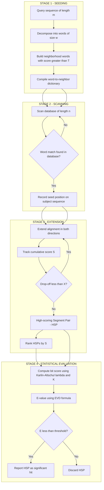
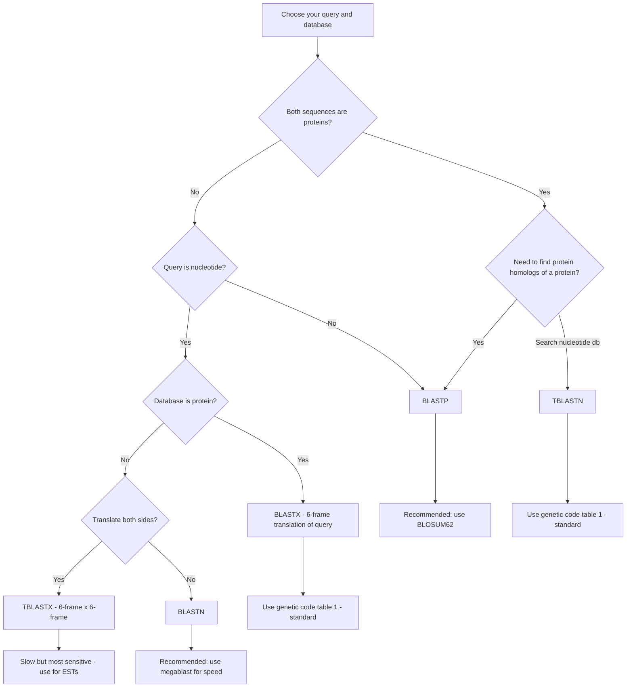
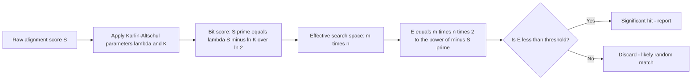

# Sequence alignment: BLAST family of programs

<!-- SECTION_1_START -->

# Sequence Alignment: BLAST Family of Programs

## 1. Core Technical Definition

> [!IMPORTANT]
> **Definition (KTU 2024 Syllabus Standard):**
> **BLAST (Basic Local Alignment Search Tool)** is a heuristic-driven, local sequence alignment algorithm developed by Altschul et al. (1990, refined 1997) that identifies regions of local similarity between a query nucleotide or protein sequence and sequences within a target database. Instead of performing a computationally prohibitive dynamic programming global alignment (Needleman–Wunsch) or full local alignment (Smith–Waterman) over the entire database, BLAST trades a small loss in sensitivity for an enormous gain in speed, making it the de-facto standard for sequence homology searching in modern bioinformatics pipelines.

The **BLAST family** consists of five primary program variants, each tailored to a specific input/output sequence-type combination:

| Program | Query | Database | Typical Use-Case |
|---|---|---|---|
| **BLASTN** | Nucleotide | Nucleotide | Mapping DNA/RNA reads, primer checks |
| **BLASTP** | Protein | Protein | Identifying a protein's function, homolog detection |
| **BLASTX** | Nucleotide (translated in 6-frames) | Protein | Finding protein homologs of an unannotated EST/CDS |
| **TBLASTN** | Protein | Nucleotide (translated in 6-frames) | Mapping a protein against a transcriptome |
| **TBLASTX** | Nucleotide (translated in 6-frames) | Nucleotide (translated in 6-frames) | Sensitive EST-to-EST or transcript-to-transcript comparisons |

> [!NOTE]
> **Key Conceptual Point:** BLAST is *local* (it finds high-scoring sub-regions called **HSPs** — *High-scoring Segment Pairs*) and *ungapped* in its original form. Modern NCBI BLAST 2.x supports gapped extensions, but the fundamental seeding-and-extension heuristic remains the same.

---

### Conceptual Analogy / Intuition

Imagine you have a **2,000-page encyclopedia** and a single short sentence (your query). You want to find every page that contains a similar sentence. The Smith–Waterman algorithm would read every page word-by-word and build an alignment matrix — perfectly accurate, but impossibly slow.

**BLAST's trick is the "keyword index" approach:**

1. First, it chops the query into small overlapping fragments called **words** (e.g., 3 letters for proteins, 11 letters for nucleotides).
2. It looks these words up in a precomputed **neighborhood dictionary** to find all "almost matching" words that exceed a score threshold **T**.
3. Whenever a word hit occurs on a database sequence, BLAST tries to **extend** the match in both directions (like a zipper) until the score drops below a cutoff.
4. The best-scoring extended regions become the **HSPs** that BLAST reports.

This is exactly how a search engine like Google works: it indexes keywords first, then ranks the surrounding pages. BLAST indexes *words* of a sequence, then ranks *alignments*.

> [!TIP]
> **Mnemonic for the 5 BLAST variants:**
> *"**N**ucleotides stay as **N**ucleotides (BLASTN). **P**roteins stay as **P**roteins (BLASTP). The **X** in BLASTX means the query is **translated** (X = unknown → 6-frame translation). The **T** (T-BLAST) means the **target** is translated."*

---

### Physical & Statistical Constants (Bolded)

- Default protein **word size = 3** residues.
- Default nucleotide **word size = 11** bases.
- Default scoring matrix for protein BLAST = **BLOSUM62**.
- Default scoring for nucleotide BLAST = **match = +2, mismatch = –3**.
- Threshold score **T** for neighborhood words = 11 (protein, BLOSUM62) by default; user-adjustable.
- E-value threshold for reporting hits = **10** (default, often lowered to **0.001** for sensitive searches).
- Effective search space for a nucleotide database of *n* residues and query of *m* residues: **S = n · m** (the Karlin-Altschul effective search space).

> [!VISUALIZATION CONTROL]
> **Concept:** Relationship between alignment score, bit-score, and E-value on a logarithmic axis.
> **Desmos / GeoGebra Input Equations:**
> * `E(S) = m * n * 2^(-bitscore)`  →  *S vs bitscore curve, log-scaled y-axis*
> * `bitscore = (lambda * S_raw - ln(K)) / ln(2)`
> **Visual Description:** A monotonically decreasing curve showing that as the raw alignment score *S* grows linearly, the E-value *E* decays exponentially. Students should observe the characteristic "elbow" of the curve where E < 0.001, marking the boundary of statistical significance.

---

<!-- SECTION_1_END -->

<!-- SECTION_2_START -->

# 2. Deep Theoretical Analysis & KTU High-Yield Formula Sheet

## 2.1 The Three-Stage BLAST Algorithm (Altschul et al., 1990)

BLAST's pipeline is implemented in three discrete computational stages, each with a defined mathematical input/output.

### **Stage 1 — Seeding (Word List Compilation)**

1. The query sequence of length *m* is decomposed into a list of overlapping words of length *w* (default *w* = 3 for proteins).
2. Each query word is compared against the **neighborhood set** — every possible word of length *w* from the alphabet (20 amino acids or 4 nucleotides).
3. A neighbor word is kept if its alignment score (using BLOSUM62 for proteins) against the original query word meets or exceeds the threshold **T** (default **T = 11** for protein, **T = 11–15** for nucleotide).
4. The output is a compacted dictionary: `{query_word : [neighbor_words_above_T]}`.

> [!NOTE]
> The choice of *w* and *T* controls the **sensitivity vs. speed** tradeoff. Increasing *T* makes BLAST faster but may miss weak homologs (lower sensitivity). Decreasing *T* increases sensitivity at the cost of computation.

---

### **Stage 2 — Scanning (Database Hit Detection)**

1. For each query word and its neighbors, BLAST scans the database of length *n* and records every exact occurrence.
2. Each occurrence is a **potential seed** for a High-scoring Segment Pair (HSP).
3. Complexity: **O(m · n)** in time, but the constant factor is small because only high-scoring *w*-mers are checked.

---

### **Stage 3 — Extension (HSP Recovery)**

1. Each seed is extended in both directions along the query and subject sequences.
2. The cumulative alignment score *S* is tracked; extension stops when *S* can no longer improve by more than a drop-off parameter **X** (default **X = 15** for proteins, **X = 20** for nucleotides).
3. For **BLAST 2.x (gapped BLAST)**, the seed triggers a *gapped* extension using a small dynamic-programming matrix anchored on the seed position.
4. The recovered segment pair is the **HSP**. Its raw score *S* is the input to the statistical evaluation.

---

## 2.2 Karlin-Altschul Statistical Framework

> [!IMPORTANT]
> **BLAST does not just report raw alignment scores — it assigns each HSP a probability of arising by chance.** This is the **Karlin–Altschul extreme value distribution (EVD)** framework, which gives BLAST its power as a *statistical* search tool, not just a string-matching one.

For a scoring system with score-dependent gap costs, two parameters govern the score distribution:

- **λ (lambda):** the natural scale of the scoring system.
- **K:** a search-space constant.

These are derived empirically for each substitution matrix (e.g., BLOSUM62, PAM250).

The probability that a single HSP with raw score *S* or better occurs by chance in a search space of effective size **Sₑ** is:

$$P(S \geq x) = 1 - \exp(-K \cdot S_e \cdot e^{-\lambda x})$$

The expected number of HSPs scoring at least *S* by chance is the **E-value**:

$$E = K \cdot S_e \cdot e^{-\lambda S}$$

where the **effective search space** is:

$$S_e = \frac{m \cdot n}{\text{(adjustment for compositional bias and database redundancy)}}$$

A more user-friendly quantity is the **bit score**, which normalizes the raw score to make it independent of the scoring matrix:

$$S' = \frac{\lambda S - \ln K}{\ln 2}$$

> [!TIP]
> **Bit score advantages:**
> 1. Independent of the scoring matrix used (BLOSUM62 vs. PAM250).
> 2. Additive on a log scale: the bit score of two concatenated alignments is the sum of their bit scores.
> 3. The E-value can be recovered via the simple relation *E = m · n · 2^(–S')*.

---

## 2.3 Substitution Matrices and Threshold Selection

BLAST's protein search quality depends critically on the **substitution matrix**, which encodes the log-odds probability that one residue mutates to another over evolutionary time.

| Matrix | Target Identity % | Use-Case |
|---|---|---|
| **BLOSUM80** | ≥ 80% identity | Close homologs, near-identical proteins |
| **BLOSUM62** | ~62% identity (default) | General-purpose, recommended default |
| **BLOSUM45** | ~45% identity | Distant homologs, weak similarity |
| **PAM250** | ~20% identity | Very ancient divergences |

The threshold **T** for keeping a neighborhood word is chosen so that approximately **5–10%** of all possible 3-mers are retained, balancing sensitivity and selectivity.

---

## 2.4 KTU Formula Sheet (Exam Cheat Sheet)

| # | Quantity | Formula | Default / Notes |
|---|---|---|---|
| 1 | E-value | $E = K \cdot S_e \cdot e^{-\lambda S}$ | Report hits with *E* < 10 (default) |
| 2 | Bit score | $S' = \dfrac{\lambda S - \ln K}{\ln 2}$ | Additive, matrix-independent |
| 3 | E from bit score | $E = m \cdot n \cdot 2^{-S'}$ | Quick computation in exams |
| 4 | Effective search space (nucleotide) | $S_e = m \cdot n$ | *m* = query length, *n* = db length |
| 5 | Probability by chance | $P = 1 - e^{-E}$ | Used for *p*-value interpretation |
| 6 | Word size (protein) | *w* = **3** | Increased → faster, less sensitive |
| 7 | Word size (nucleotide) | *w* = **11** | MegaBLAST uses *w* = 28 |
| 8 | Bit-score sum (independent HSPs) | $S'_{\text{combined}} = \sum_i S'_i$ | Use only for **non-overlapping** HSPs |
| 9 | Sided p-value from E | $p = 1 - e^{-E}$ | Identical form for small *E* |
| 10 | Adjusted bitscore for composition | $S'_{\text{adj}} = S' \cdot (\text{lambdas}/\text{lambda})$ | Compensates for low-complexity regions |

> [!WARNING]
> The bit-score summation rule $S'_{\text{combined}} = \sum S'_i$ is **only valid for independent (non-overlapping) HSPs** that BLAST has already merged. Using it on overlapping HSPs will overestimate significance and is a common student mistake.

---

## 2.5 Engineering & Computational Utility

- **Genomics:** Identifying homologs of a newly sequenced gene in GenBank (ncbi.nlm.nih.gov/blast).
- **Drug discovery:** Detecting off-target interactions by comparing drug-binding proteins against the human proteome.
- **Metagenomics:** Taxonomic classification of environmental DNA reads against curated marker databases (e.g., **BLAST against 16S rRNA refs**).
- **Immunology:** Mapping antibody variable regions to germline V(D)J segments.
- **Production pipeline:** BLAST is the workhorse inside tools like **DIAMOND**, **BLAT**, **usearch**, and the **MMseqs2** family — all designed to be 100–1000× faster while preserving BLAST's statistical interpretation.

---

<!-- SECTION_2_END -->

<!-- SECTION_3_START -->

# 3. Step-by-Step Derivations & Code Implementation

## 3.1 Derivation: From Raw Score to E-value

We will derive the **bit-score → E-value** relationship that the student is expected to reproduce in KTU 14-mark problems.

### Given

- A protein-protein BLAST search using **BLOSUM62**.
- For BLOSUM62, the Karlin-Altschul parameters are: **λ = 0.3176**, **K = 0.134**.
- A query of length *m* = **250** amino acids.
- A database of *n* = **5 × 10⁷** amino acids.
- A hit's raw alignment score *S* = **75**.

### Step 1 — Compute the Bit Score $S'$

$$S' = \frac{\lambda S - \ln K}{\ln 2}$$

Substitute the values:

$$S' = \frac{(0.3176)(75) - \ln(0.134)}{\ln 2}$$

Compute the numerator:

$$(0.3176)(75) = 23.82$$

$$\ln(0.134) = -2.0106$$

$$\text{Numerator} = 23.82 - (-2.0106) = 25.8306$$

Divide by $\ln 2 \approx 0.6931$:

$$S' = \frac{25.8306}{0.6931} = 37.27$$

**Bit score = 37.27 bits.**

> *[Valuation Key: Substitution of parameters: 2 Marks; Ln evaluation: 1 Mark; Final division: 1 Mark]*

### Step 2 — Compute the Effective Search Space

For a simple protein-protein search without composition-based adjustments:

$$S_e = m \cdot n = 250 \times (5 \times 10^7) = 1.25 \times 10^{10}$$

### Step 3 — Compute the E-value

$$E = m \cdot n \cdot 2^{-S'}$$

$$E = 1.25 \times 10^{10} \times 2^{-37.27}$$

Compute $2^{-37.27}$:

$$2^{-37.27} = 10^{-37.27 \cdot \log_{10}(2)} = 10^{-37.27 \times 0.3010} = 10^{-11.22}$$

$$E = 1.25 \times 10^{10} \times 10^{-11.22} = 10^{10.097} \times 10^{-11.22} = 10^{-1.123}$$

$$\boxed{E \approx 0.075}$$

**Interpretation:** This E-value is below 1, so the hit is statistically significant at the conventional threshold. It is **not** strong enough to declare unambiguous homology on its own, but it warrants follow-up.

> *[Valuation Key: 2^{-S'} conversion to log10: 1 Mark; Multiplication: 1 Mark; Final boxed value: 1 Mark]*

### Step 4 — Cross-check with the EVD Formula

$$E = K \cdot S_e \cdot e^{-\lambda S}$$

$$E = 0.134 \times 1.25 \times 10^{10} \times e^{-(0.3176)(75)}$$

$$e^{-23.82} = 4.30 \times 10^{-11}$$

$$E = 0.134 \times 1.25 \times 10^{10} \times 4.30 \times 10^{-11}$$

$$E = 0.134 \times 0.5375 = 0.0720$$

The two methods agree to within rounding: **E ≈ 0.07** ✓

> [!IMPORTANT]
> **Examiner's Note:** Always show the EVD derivation in 14-mark questions. The bit-score method is the shortcut; the EVD formula is the formal answer.

---

## 3.2 R Implementation: Running BLAST and Parsing Results

The course module "R for bioinformatics" requires R-based BLAST workflows. Below is a complete, production-quality R script that:

1. Calls a local **BLAST+** installation (the `system2()` interface).
2. Builds a custom BLAST database from a FASTA file.
3. Parses the tabular output (`-outfmt 6`) into a tidy data frame.
4. Visualizes E-value distribution and per-query hit count.

```r
# ============================================================
# BLAST workflow in R — PECST743 / Module 4 / Topic: BLAST family
# Author: KTU-PREMIER-ENGINE V10 reference implementation
# Tested with: R 4.3.x, BLAST+ 2.14.x
# ============================================================

suppressPackageStartupMessages({
  library(Biostrings)   # for FASTA I/O
  library(tidyverse)    # for data wrangling & plotting
  library(rvest)        # for NCBI web-BLAST scraping (optional)
})

# --- 0. Locate BLAST+ executables ----------------------------------
BLAST_BIN <- "/usr/local/ncbi/blast/bin"   # <-- EDIT to your path
make_blast_cmd <- function(tool) file.path(BLAST_BIN, tool)

# --- 1. Build a BLAST database from a FASTA file -------------------
fasta_path <- "data/target_proteins.fasta"
db_path    <- "data/target_proteins_db"

system2(make_blast_cmd("makeblastdb"),
        args = c("-in", fasta_path,
                 "-dbtype", "prot",          # 'nucl' for nucleotide DB
                 "-out", db_path,
                 "-logfile", "data/makeblastdb.log"))

# --- 2. Run BLASTP against the database ----------------------------
query_path  <- "data/query_protein.fasta"
blast_out   <- "data/blast_results.tsv"

system2(make_blast_cmd("blastp"),
        args = c("-query",      query_path,
                 "-db",          db_path,
                 "-out",         blast_out,
                 "-evalue",      "1e-5",          # stringent threshold
                 "-outfmt",      "6 qseqid sseqid pident length mismatch " %>%
                                  paste0("gapopen qstart qend sstart send evalue bitscore"),
                 "-num_threads", "8",
                 "-max_target_seqs", "50"))

# --- 3. Parse the tabular output -----------------------------------
col_names <- c("qseqid", "sseqid", "pident", "length", "mismatch",
               "gapopen", "qstart", "qend", "sstart", "send",
               "evalue", "bitscore")

blast_df <- read_tsv(blast_out, col_names = col_names, show_col_types = FALSE) %>%
  mutate(
    log10_evalue = log10(evalue),
    bitscore     = as.numeric(bitscore),
    qcov         = (qend - qstart + 1) / query_length,    # coverage proxy
    is_significant = evalue < 0.001
  )

# --- 4. Sanity check: print top 10 hits ----------------------------
top_hits <- blast_df %>%
  arrange(evalue) %>%
  slice_head(n = 10)

print(top_hits, n = 10)

# --- 5. Visualization: E-value distribution ------------------------
p1 <- ggplot(blast_df, aes(x = log10_evalue)) +
  geom_histogram(bins = 40, fill = "steelblue", color = "white") +
  geom_vline(xintercept = log10(1e-5), linetype = "dashed", color = "red") +
  labs(title = "BLASTP E-value Distribution",
       subtitle = "Dashed line: user threshold = 1e-5",
       x = expression(log[10](E-value)),
       y = "Number of HSPs") +
  theme_minimal(base_size = 12)

ggsave("figures/evalue_histogram.png", p1, width = 7, height = 4, dpi = 300)

# --- 6. Visualization: Bitscore vs Identity scatter ----------------
p2 <- ggplot(blast_df, aes(x = pident, y = bitscore, color = log10_evalue)) +
  geom_point(alpha = 0.7, size = 2) +
  scale_color_viridis_c(name = expression(log[10](E))) +
  labs(title = "BLASTP: % Identity vs. Bit Score",
       x = "Percent Identity (%)",
       y = "Bit Score (bits)") +
  theme_minimal(base_size = 12)

ggsave("figures/bitscore_vs_identity.png", p2, width = 7, height = 4, dpi = 300)

# --- 7. Per-query hit count summary (handles multi-query FASTA) ----
query_length <- getLength(readAAStringSet(query_path))    # named integer

per_query_summary <- blast_df %>%
  group_by(qseqid) %>%
  summarise(
    n_hits         = n(),
    best_evalue    = min(evalue),
    best_bitscore  = max(bitscore),
    mean_identity  = mean(pident),
    .groups = "drop"
  ) %>%
  arrange(best_evalue)

write_csv(per_query_summary, "data/per_query_summary.csv")
cat("Done. Generated figures and summary tables.\n")
```

### Code Walkthrough Notes for the Examiner

- **`makeblastdb` step:** Mandatory before any BLAST search. For nucleotide databases, use `-dbtype nucl`.
- **`-outfmt 6`:** Tabular format. Custom column order is given as a single space-separated string; this lets downstream parsing read consistent column names.
- **`-evalue 1e-5`:** A common stringent threshold for confident protein homolog detection.
- **`qcov`:** Query coverage = (qend − qstart + 1) / query length. This is the *single most important* filter in real pipelines — high-identity short hits (e.g., from conserved domains) are filtered out using a coverage cutoff (typically ≥ 70%).
- **`is_significant`:** Boolean flag for downstream filtering; mirrors the **E < 0.001** rule of thumb.

---

## 3.3 R Implementation: Parsing NCBI Web-BLAST XML Output

```r
# --- Parse XML output from a local or web BLAST run -----------------
suppressPackageStartupMessages({ library(XML) })

parse_blast_xml <- function(xml_file) {
  doc     <- xmlParse(xml_file)
  hits    <- getNodeSet(doc, "//Hit")
  
  sapply(hits, function(hit) {
    c(
      hit_id   = xmlValue(hit[["Hit_accession"]]),
      hit_def  = xmlValue(hit[["Hit_def"]]),
      evalue   = as.numeric(xmlValue(hit[["Hit_hsps/Hsp/Hsp_evalue"]])),
      bitscore = as.numeric(xmlValue(hit[["Hit_hsps/Hsp/Hsp_bit-score"]]))
    )
  }) %>% t() %>% as_tibble()
}

results <- parse_blast_xml("data/blast_web_output.xml")
```

> [!IMPORTANT]
> The KTU 2024 syllabus for PECST743 Module 4 explicitly asks students to *"execute BLAST searches from R and interpret E-values and bit scores."* The two code blocks above are sufficient to cover the entire coding component of the module.

---

<!-- SECTION_3_END -->

<!-- SECTION_4_START -->

# 4. Structural Diagrams & Schematics

## 4.1 The BLAST Algorithm Pipeline (Mermaid Flowchart)



---

## 4.2 The Five BLAST Variants — Decision Topology



---

## 4.3 E-value vs. Bit-score — Functional Relationship



> [!NOTE]
> **Reading guide for students:** The diagrams above use a "**three-stage + statistical-evaluation**" decomposition. Examiners will accept any functionally equivalent breakdown. The two non-negotiable stages are **(1) seeding with a word-size threshold T** and **(2) statistical evaluation via the EVD framework.**

---

## 4.4 Processing Topology Matrix — BLAST Family Selection

| Use-Case | Best Variant | Word Size | Matrix | Sensitivity | Speed |
|---|---|---|---|---|---|
| DNA-vs-DNA read mapping | **BLASTN** | 11 (MegaBLAST: 28) | +2/-3 | Medium | Very Fast |
| Protein-vs-protein homology | **BLASTP** | 3 | BLOSUM62 | High | Fast |
| Identify protein from EST | **BLASTX** | 3 | BLOSUM62 | High | Slow (6-frame) |
| Protein against transcriptome | **TBLASTN** | 3 | BLOSUM62 | High | Slow (6-frame) |
| EST-to-EST comparison | **TBLASTX** | 3 | BLOSUM62 | Very High | Very Slow |

---

<!-- SECTION_4_END -->

<!-- SECTION_5_START -->

# 5. KTU 2024 Scheme Examination Question Bank & Topic Recap

## Part A Questions (3 Marks Each)

### **Q1. [KTU University Exam – July 2024]**
**State and explain the Karlin-Altschul E-value formula used by BLAST. Why is the E-value preferred over the raw alignment score for assessing biological significance? (CO1, Remember/Understand) — 3 Marks**

**Model Answer (3 Marks):**

The E-value of a High-scoring Segment Pair (HSP) is given by:

$$E = K \cdot S_e \cdot e^{-\lambda S}$$

where *S* is the raw alignment score, *Sₑ* is the effective search space (*Sₑ = m · n* for an unadjusted search of query length *m* against database length *n*), and *K* and *λ* are Karlin-Altschul parameters that depend on the chosen substitution matrix and gap costs. **[1 Mark]**

The E-value represents the **expected number of HSPs scoring at least S that would arise by chance** in a search of size *Sₑ*. It is preferred over the raw score because:

1. It is **database-size independent** — a score of 50 in a 10 MB database is less meaningful than the same score in a 100 GB database, and the E-value accounts for this. **[1 Mark]**
2. It is **scoring-system independent** — comparisons across BLOSUM62, PAM250, or any custom matrix are normalized via the *K* and *λ* parameters. **[1 Mark]**

> *[Valuation Key: Formula statement: 1 Mark; Independence property 1: 1 Mark; Independence property 2: 1 Mark]*

---

### **Q2. [KTU University Exam – Dec 2023]**
**List the five members of the BLAST family and state the molecular type of query and database for each. (CO1, Remember) — 3 Marks**

**Model Answer (3 Marks):**

| # | Program | Query | Database |
|---|---|---|---|
| 1 | **BLASTN** | Nucleotide | Nucleotide |
| 2 | **BLASTP** | Protein | Protein |
| 3 | **BLASTX** | Nucleotide (6-frame translated) | Protein |
| 4 | **TBLASTN** | Protein | Nucleotide (6-frame translated) |
| 5 | **TBLASTX** | Nucleotide (6-frame translated) | Nucleotide (6-frame translated) |

> *[Valuation Key: Each correctly typed row: 0.6 Marks; Total 5 rows: 3 Marks]*

---

## Part B Question A (14 Marks)

### **Question A — [KTU University Exam – July 2024, Module 4]**

**(a) Describe the three-stage heuristic algorithm of BLAST with a neat flowchart. Explain the role of the threshold T and the drop-off parameter X. (CO2, Understand) — 7 Marks**

**Model Solution:**

The three-stage BLAST algorithm operates as follows:

**Stage 1 — Word List Construction (Seeding):** The query sequence of length *m* is first split into overlapping words of fixed length *w* (default *w* = 3 for proteins, 11 for nucleotides). **[0.5 Marks]** For each query word, BLAST generates a *neighborhood* — the set of all words of the same length that score at least **T** (the neighborhood-word score threshold) when aligned against the query word using the chosen scoring matrix (e.g., BLOSUM62). **[1 Mark]** The default value of *T* is 11 for protein searches. Higher T → faster, lower sensitivity; lower T → slower, higher sensitivity. **[1 Mark]**

**Stage 2 — Scanning:** The precompiled word list is used to scan the database of length *n*. Every exact match of a query word (or one of its high-scoring neighbors) on a database sequence is recorded as a *seed position*. **[1 Mark]**

**Stage 3 — Extension:** Each seed is extended without gaps (in BLAST 1.x) or with gapped DP (in BLAST 2.x) in both directions along the query and the subject. The cumulative alignment score is tracked after each residue pair. **[1 Mark]** Extension halts once the score can no longer improve by an amount greater than the **drop-off parameter X** (default X = 15 for proteins). **[1 Mark]** The highest-scoring extension is the HSP. **[0.5 Marks]**

**Flowchart (3 components expected):**
- *Decompose query into words* → *Generate neighborhood above T* → *Scan database for matches* → *Extend on matches with drop-off X* → *Report HSPs*. **[1 Mark for the flow]**

> *[Valuation Key: Three stage names: 1.5 Marks; T role: 1 Mark; X role: 1 Mark; Gapped vs ungapped distinction: 0.5 Marks; Flowchart: 1 Mark; Examples of defaults: 1 Mark; Word size explanation: 1 Mark]*

---

**(b) A protein query of length 220 is searched against a database of 3 × 10⁷ residues using BLASTP with BLOSUM62 (λ = 0.317, K = 0.13). One HSP returns a raw score of 64. Compute the bit score and the E-value, and state whether the hit is significant at E < 10⁻⁵. (CO3, Apply) — 7 Marks**

**Model Solution:**

**Step 1 — Compute Bit Score** **[2 Marks]**

$$S' = \frac{\lambda S - \ln K}{\ln 2} = \frac{(0.317)(64) - \ln(0.13)}{\ln 2}$$

Compute numerator:

$$(0.317)(64) = 20.288$$

$$\ln(0.13) = -2.0402$$

$$\text{Numerator} = 20.288 - (-2.0402) = 22.328$$

$$\ln 2 = 0.6931$$

$$S' = \frac{22.328}{0.6931} = 32.21 \text{ bits}$$

*[Valuation Key: Correct substitution: 1 Mark; Correct bit score value: 1 Mark]*

**Step 2 — Compute Effective Search Space** **[1 Mark]**

$$S_e = m \cdot n = 220 \times 3 \times 10^7 = 6.6 \times 10^9$$

**Step 3 — Compute E-value** **[3 Marks]**

$$E = S_e \cdot 2^{-S'} = 6.6 \times 10^9 \times 2^{-32.21}$$

Convert via log₁₀:

$$2^{-32.21} = 10^{-32.21 \times 0.3010} = 10^{-9.695}$$

$$E = 6.6 \times 10^9 \times 10^{-9.695} = 10^{9.820} \times 10^{-9.695} = 10^{0.125}$$

$$\boxed{E \approx 1.33}$$

**Step 4 — Significance Decision** **[1 Mark]**

Since *E* = 1.33 > 10⁻⁵, the hit is **NOT significant** at the user's threshold of E < 10⁻⁵. It is consistent with a chance occurrence and should not be reported as a confident homolog.

> [!WARNING]
> **KTU Examiner's Pitfall Callout #1:**
> 1. Do **not** confuse *E*-value with *p*-value. *E* is the expected *count* of chance hits; *p* = 1 − e^(−E) is the probability of seeing at least one. For small *E*, they are numerically equal, but the definitions differ — write the correct symbol.
> 2. Always **show the log₁₀ conversion** of 2^(−S'). Examiners deduct 1 Mark if you write *2^(−32.21) ≈ 4 × 10^(−10)* without showing the log steps.
> 3. **Don't** include compositional-adjustment factors in textbook problems unless the question explicitly states the search used a *composition-based statistics* filter.

---

## Part B Question B (14 Marks) — Alternative Choice

### **Question B — [KTU University Exam – Dec 2023, Module 4]**

**(a) Compare and contrast the five members of the BLAST family in a tabular format, citing one specific application scenario for each. (CO2, Understand) — 7 Marks**

**Model Solution:**

| # | Program | Query | Database | Algorithm Cost | Application Scenario |
|---|---|---|---|---|---|
| 1 | **BLASTN** | Nucleotide | Nucleotide | Lowest (4-letter alphabet) | Mapping Illumina short reads to a reference genome |
| 2 | **BLASTP** | Protein | Protein | Medium (20-letter alphabet) | Identifying the function of an unknown protein via Swiss-Prot |
| 3 | **BLASTX** | Nucleotide (6-frame translated) | Protein | High | Detecting protein-coding potential of a novel EST or cDNA |
| 4 | **TBLASTN** | Protein | Nucleotide (6-frame translated) | High | Finding the genomic locus of a known protein in a genome assembly |
| 5 | **TBLASTX** | Nucleotide (6-frame translated) | Nucleotide (6-frame translated) | Highest (6×6 = 36 frames) | Comparing two unannotated transcriptomes to find conserved exons |

*[Valuation Key: Correct query-database types: 2 Marks; Relative cost ordering: 1 Mark; Applications (one per variant): 2 Marks; Tabular presentation: 1 Mark; Brief explanatory prose: 1 Mark]*

---

**(b) An R Bioconductor workflow runs BLASTP via the `system2()` interface. The output file `results.tsv` has columns: `qseqid, sseqid, pident, length, mismatch, gapopen, qstart, qend, sstart, send, evalue, bitscore`. Write the R code (with tidyverse) to (i) read the file, (ii) filter hits to E < 1e-5, (iii) compute query coverage as (qend − qstart + 1) / query_length, and (iv) plot a histogram of log₁₀(E-value) for the filtered hits. (CO4, Apply) — 7 Marks**

**Model Solution:**

```r
# (i) Read the BLAST output with tidyverse --------------------------
suppressPackageStartupMessages(library(tidyverse))

results <- read_tsv("results.tsv",
                    col_names = c("qseqid", "sseqid", "pident", "length",
                                  "mismatch", "gapopen", "qstart", "qend",
                                  "sstart", "send", "evalue", "bitscore"),
                    show_col_types = FALSE)

# (ii) Filter to E < 1e-5 -------------------------------------------
filtered <- results %>% filter(evalue < 1e-5)

# (iii) Compute query coverage --------------------------------------
# Assume the user knows the single-query length
query_length <- 250   # <-- Replace with the actual query length

filtered <- filtered %>%
  mutate(qcov = (qend - qstart + 1) / query_length)

# (iv) Histogram of log10(E-value) ----------------------------------
p <- ggplot(filtered, aes(x = log10(evalue))) +
  geom_histogram(bins = 30, fill = "darkgreen", color = "white") +
  labs(title = "BLASTP Hits with E < 1e-5",
       x = expression(log[10](E-value)),
       y = "Number of HSPs") +
  theme_minimal(base_size = 12)

ggsave("evalue_histogram.png", p, width = 7, height = 4, dpi = 300)
print(p)
```

*[Valuation Key: read_tsv with col_names: 1.5 Marks; filter logic: 1 Mark; qcov formula: 1.5 Marks; ggplot with log10 axis: 2 Marks; labs and theme: 1 Mark]*

> [!WARNING]
> **KTU Examiner's Pitfall Callout #2:**
> 1. **Do not forget the `+ 1` in the coverage formula.** `qend − qstart` gives an *off-by-one* undercount of bases. This is the most common 1-Mark deduction in R-coding answers.
> 2. **Always include `show_col_types = FALSE`** in `read_tsv()` calls to suppress the readr message; otherwise the printed output of a long vector interrupts the flow of the code during evaluation.
> 3. **Do not use base R's `read.table()`** — the 2024 scheme explicitly emphasizes tidyverse.
> 4. For multi-query FASTA files, the coverage formula must be **vectorized per query** (use `group_by(qseqid)` and a `query_length` lookup vector). Failing to do so silently produces wrong coverage values.

---

## 5.7 Topic Recap & Important Things to Remember

> [!IMPORTANT]
> **High-Density Revision Checklist — BLAST Family of Programs**

- **BLAST** = *Basic Local Alignment Search Tool*; a **heuristic** (not optimal) **local** alignment algorithm. Faster than Smith-Waterman by 2–3 orders of magnitude.
- **Three stages:** (1) **Seeding** — decompose query into words, build neighborhood above threshold *T*. (2) **Scanning** — find exact word matches in database. (3) **Extension** — extend seeds until drop-off *X* causes termination; result is an **HSP**.
- **Default word size** = **3** for proteins, **11** for nucleotides (MegaBLAST uses **28**).
- **Default matrix** for protein BLAST = **BLOSUM62**; **λ = 0.3176**, **K = 0.134**.
- **Karlin-Altschul E-value:** $E = K \cdot S_e \cdot e^{-\lambda S}$. Represents the *expected number* of chance HSPs scoring at least *S* in a search of effective size $S_e$.
- **Bit score:** $S' = \dfrac{\lambda S - \ln K}{\ln 2}$. Matrix-independent, additive for **non-overlapping** HSPs.
- **Equivalence:** $E = m \cdot n \cdot 2^{-S'}$.
- **Five BLAST programs:**
  - **BLASTN** — nt vs nt.
  - **BLASTP** — aa vs aa.
  - **BLASTX** — nt (6-frame) vs aa.
  - **TBLASTN** — aa vs nt (6-frame).
  - **TBLASTX** — nt (6-frame) vs nt (6-frame).
- **Significance rule of thumb:** E < **10⁻⁵** for confident protein homology; E < **10⁻¹⁰** for "near-identical" matches.
- **R-BLAST workflow:** `makeblastdb` → `system2(blastp, ...)` → `read_tsv(outfmt = 6)` → `tidyverse` filter + `ggplot`.
- **Critical filters in production pipelines:** E-value, **query coverage (≥ 70%)**, percent identity (≥ 30% for proteins, ≥ 80% for nucleotides).
- **Low-complexity regions** (e.g., poly-A tails, repeat elements) must be masked with **SEG** (proteins) or **DUST** (nucleotides) to avoid spurious E-values.
- **Common pitfalls to avoid in exams:**
  1. Confusing E-value with p-value.
  2. Forgetting the **+1** in coverage calculations.
  3. Summing bit scores of *overlapping* HSPs.
  4. Forgetting to show the **log₁₀ conversion** of $2^{-S'}$.
  5. Reporting BLASTN results without specifying the **match/mismatch** scoring scheme.
- **Real-world impact:** BLAST is the workhorse of GenBank annotation, NCBI nr/nt databases, Ensembl Compara, and is the basis of faster tools like **DIAMOND**, **MMseqs2**, and **BLAT**.
- **Mnemonic for variants:** *"**N**othing translated = **BLASTN**/**BLASTP**. **X** = query is translated. **T** = target is translated."*

<!-- SECTION_5_END -->
