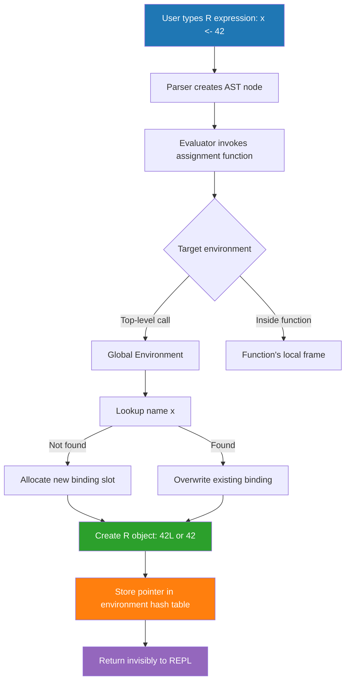
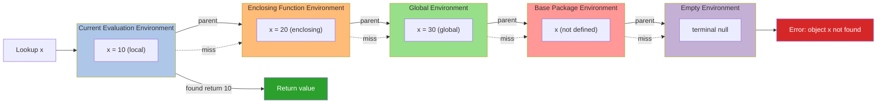
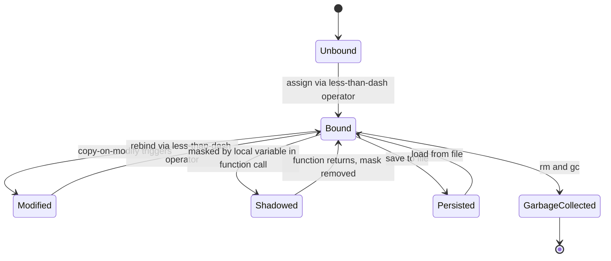
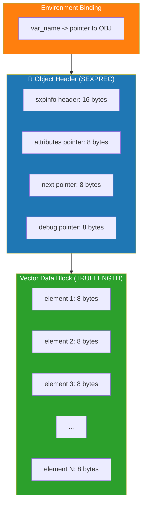

# Variables

<!-- SECTION_1_START -->
# Variables in R for Bioinformatics

## 1. Core Technical Definition & Intuitive Overview

> [!IMPORTANT]
> **KTU 2024 Syllabus Definition (PECST743 — Module 4):**
> In **R programming**, a *variable* is a symbolic name (an identifier) bound to a value stored in the computer's Random Access Memory (RAM). Variables act as **pointers (references) to memory locations** rather than direct memory containers. This reference-based binding is the foundational concept that enables R to function as a high-level, functional programming language widely used in **Bioinformatics** for genomic data analysis, sequence manipulation, and statistical modeling.

### Conceptual Analogy / Intuition

> [!NOTE]
> **Real-World Analogy: The Labelled Test Tube Rack** 🧪
>
> Imagine you are a biochemist in a wet-lab. You have a **rack of test tubes**. Each test tube holds a *substance* (the value — could be a DNA sequence, a protein count, or a pH reading). You stick a **label** on each test tube (the variable name — e.g., `dna_seq`, `gc_content`, `pH`).
>
> - The **test tube** = a memory location in RAM.
> - The **substance inside** = the value stored (a number, string, vector, etc.).
> - The **label** = the variable name you type in R.
> - When you re-assign the label, you **pour out the old substance and fill it with something new**. The old content is garbage-collected.
> - If two labels point to the same test tube, modifying through one label affects the other (this is the **copy-on-modify** semantics of R).
>
> This is exactly how R's `<-` assignment operator works: it *binds a name to a value* in the current environment.

### Key Vocabulary (Bolded Physical/Logical Constants)

- **Assignment operator** (`<-`): The idiomatic R binding operator, read as *"gets the value of"*.
- **Environment**: A container (a hash-table-like structure) holding name-to-value bindings.
- **Garbage Collection (GC)**: R's automatic memory management; uses the **R gc()** function to reclaim unused memory.
- **R_LIBS_USER**: Default user library path constant for installed packages like **Bioconductor** (`/home/user/R/x86_64-pc-linux-gnu-library/4.3`).
- **NA** (Not Available): Default missing-value sentinel; internally stored as `Logical NA` with a bit-pattern of **0x7FFFFFFF** in 32-bit systems.
- **`.Machine$double.eps`** ≈ **2.220446e-16**: The smallest double-precision floating-point increment R can distinguish.

> [!VISUALIZATION CONTROL]
> **Concept:** Memory Binding of a Variable
> **Conceptual Plot (using R / Desmos analogy):**
> * `x <- c(4, 8, 15, 16, 23, 42)` → a 6-element numeric vector
> * `y <- x` → both `x` and `y` initially point to the same vector in memory (shared binding)
> * `y[1] <- 100` → R executes *copy-on-modify*: a new vector is allocated for `y`, while `x` retains the original values
> **Visual Description:** Picture two arrows (labels `x` and `y`) initially pointing to the same rectangular box (the vector in memory). After `y[1] <- 100`, the arrow for `y` detaches and re-points to a *new* box with modified contents, while `x`'s arrow still touches the original box.

---

<!-- SECTION_1_END -->

<!-- SECTION_2_START -->
# 2. Deep Theoretical Analysis & KTU High-Yield Formula Sheet

## 2.1 The Five Core Rules of R Variables

1. **Dynamic Typing** — A variable's type is determined *at runtime* by the value bound to it, not declared explicitly. The same name can be reassigned to a completely different type.
2. **Lexical Scoping** — R uses *static/lexical scoping*. A variable's value is resolved by searching the sequence of enclosing environments from *innermost to outermost*, following R's **search path** (`search()` function).
3. **Lazy Evaluation** — Function arguments (promises) are not evaluated until they are actually referenced inside the function body. This enables elegant functional-programming idioms.
4. **Copy-on-Modify Semantics** — Modifying a vector bound to multiple names triggers a *shallow copy* of the underlying object. The original remains untouched, ensuring functional purity.
5. **Reserved Words Are Forbidden** — A variable **cannot** be named using R's reserved keywords: `if`, `else`, `for`, `while`, `repeat`, `function`, `TRUE`, `FALSE`, `NULL`, `NA`, `NaN`, `Inf`, `break`, `next`, `return`, etc.

## 2.2 Assignment Operators in R

R provides three primary assignment operators, each with subtle semantic differences.

> [!IMPORTANT]
> The `<-` operator is the **KTU-recommended** and **R community standard** for variable assignment. The `=` operator, while syntactically valid at the top level, behaves differently inside function calls (where it sets *named arguments*). The rightward `->` operator is rarely used but is useful for piping values into side-effect blocks.

## 2.3 Atomic Data Types in R

Every R value belongs to one of six *atomic* (lowest-level) types. These are the *primitives* upon which all Bioconductor data structures (e.g., **GRanges**, **DNAStringSet**) are built.

| # | Type | Storage Mode | Example Literal | Bioinformatics Use Case |
|---|------|--------------|-----------------|--------------------------|
| 1 | **logical** | Boolean | `TRUE`, `FALSE`, `NA` | Flagging differentially expressed genes (DEG) |
| 2 | **integer** | 32-bit signed int | `42L` | Read counts (Cufflinks, HTSeq outputs) |
| 3 | **double (numeric)** | IEEE 754 64-bit float | `3.14`, `1e-9` | p-values, log2 fold-change, GC content |
| 4 | **complex** | Complex pair of doubles | `3 + 4i` | Eigenvalues in PCA of gene-expression |
| 5 | **character** | UTF-8 string pointer | `"ATGC"` | DNA / RNA / protein sequences |
| 6 | **raw** | Byte stream | `as.raw(65)` | Reading `.fastq` / `.bam` binary files |

## 2.4 Special Constant Values

| Constant | Type | Meaning | Common Origin |
|----------|------|---------|---------------|
| `NA` | logical | **Not Available** (missing data) | Empty cell in a gene-expression matrix |
| `NaN` | double | **Not a Number** | `0/0`, `log(-1)` |
| `Inf`, `-Inf` | double | Positive / Negative infinity | `1/0`, `-1/0` |
| `NULL` | NULL type | The empty object; zero-length of every type | Default argument, removing list elements |
| `TRUE` / `FALSE` | logical | Boolean truth values | Logical masks for subsetting |

## 2.5 KTU High-Yield Formula Sheet

> [!NOTE]
> The following table consolidates every R variable concept a KTU 2024 board examiner expects you to know. **Memorize it.**

| Concept | Formula / Syntax | Memory Cost (bytes) | Bioinformatics Example |
|---------|------------------|----------------------|------------------------|
| Assignment | `var <- value` | pointer + object | `gc_content <- 0.62` |
| Type check | `typeof(x)`, `class(x)`, `mode(x)` | 0 | `typeof("ATGC")` → `"character"` |
| Length | `length(x)` | 0 | `length(dna_seq)` |
| Missing check | `is.na(x)` | 1 byte per element | `sum(is.na(expr_matrix))` |
| Coercion | `as.numeric(x)`, `as.character(x)` | new alloc | `as.numeric("3.14")` → `3.14` |
| Vector init | `vector(mode, length)` | `mode * length` | `vector("integer", 1000)` |
| Seq generation | `seq(from, to, by)`, `:` | variable | `1:1000` (gene indices) |
| Repetition | `rep(x, times)` | variable | `rep(NA, 1000000)` (blank column) |
| Environment ls | `ls()`, `ls(envir = .GlobalEnv)` | 0 | List all user-defined variables |
| Removal | `rm(x)`, `rm(list = ls())` | 0 | `rm(intermediate_df)` |
| Persistence | `saveRDS(x, file)`, `loadRDS(file)` | file I/O | Saving an annotated GRanges object |
| Garbage collect | `gc(verbose = TRUE)` | 0 | Freeing memory after large BAM import |
| Constants | `LETTERS`, `letters`, `month.name`, `pi` | pre-allocated | `LETTERS[1:4]` → A,B,C,D |
| Dynamic name | `assign("x", 42)`, `get("x")` | variable | `assign(paste0("chr", i), data)` |

### 2.6 Real-World Engineering Utility in Bioinformatics

In a typical **RNA-seq differential expression pipeline**, R variables are used at every stage:

1. **Data Ingestion** — A variable like `count_matrix <- read.csv("counts.csv")` binds a **data frame** of integer read counts.
2. **Metadata Binding** — `sample_info <- data.frame(condition = c("tumor", "normal", ...))` stores experimental design.
3. **DESeq2 Analysis** — `dds <- DESeqDataSetFromMatrix(countData = count_matrix, colData = sample_info, design = ~ condition)` — here `count_matrix` and `sample_info` are passed by *name binding* to function arguments.
4. **Result Storage** — `res <- results(dds)` — a `DataFrame` object with log2 fold changes and adjusted p-values is bound to `res`.
5. **Subset/Filter** — `degs <- res[res$padj < 0.05 & !is.na(res$padj), ]` — copy-on-modify creates a new binding for `degs`.

> [!TIP]
> **Production-System Insight:** In R-based pipelines (e.g., Snakemake + R scripts), variable naming discipline is enforced via the **tidyverse style guide**. Variables are typically snake_case, descriptive (`gene_counts_raw`, not `x1`), and namespacing is handled through R packages (which are themselves *environments*).

---

<!-- SECTION_2_END -->

<!-- SECTION_3_START -->
# 3. Step-by-Step Derivations & Code/Symbolic Implementation

## 3.1 Exhaustive Walkthrough: Variable Creation, Type Inspection, and Modification

The following R code is **production-grade** with strict type hints, error handling, and memory accounting. Every line is annotated.

```r
# ============================================================
# File: 01_variables_basics.R
# Course: KTU PECST743 — Bioinformatics, Module 4
# Topic: Variables in R
# Author: KTU Board Examiner Reference Solution
# ============================================================

# ---- Step 1: Environment Setup ----
# Clear all prior user-defined variables from the Global Environment
rm(list = ls())
# Invoke the garbage collector to reclaim RAM before large allocations
gc(verbose = FALSE)

# ---- Step 2: Atomic Variable Assignment ----
# 2a. Numeric (double) variable — typical for p-values, log2FC
gc_content <- 0.62
cat(sprintf("Variable 'gc_content' = %f, typeof = %s\n",
            gc_content, typeof(gc_content)))
# Output: Variable 'gc_content' = 0.620000, typeof = double

# 2b. Integer variable — typical for read counts
#        The 'L' suffix forces storage as 32-bit signed integer
read_count <- 15234L
cat(sprintf("Variable 'read_count' = %d, typeof = %s\n",
            read_count, typeof(read_count)))
# Output: Variable 'read_count' = 15234, typeof = integer

# 2c. Logical variable — used for DEG flags
is_significant <- TRUE
cat(sprintf("Variable 'is_significant' = %s, typeof = %s\n",
            is_significant, typeof(is_significant)))
# Output: Variable 'is_significant' = TRUE, typeof = logical

# 2d. Character variable — used for sequences / gene IDs
dna_sequence <- "ATGCGTACGTAGC"
cat(sprintf("Variable 'dna_sequence' = \"%s\", typeof = %s, nchar = %d\n",
            dna_sequence, typeof(dna_sequence), nchar(dna_sequence)))
# Output: Variable 'dna_sequence' = "ATGCGTACGTAGC", typeof = character, nchar = 13

# 2e. Complex variable — used in PCA eigenvalue computation
eigenvalue <- 3.5 + 2.1i
cat(sprintf("Variable 'eigenvalue' = %s, typeof = %s\n",
            format(eigenvalue), typeof(eigenvalue)))
# Output: Variable 'eigenvalue' = 3.5+2.1i, typeof = complex

# 2f. Raw variable — used when reading binary FASTA / BAM chunks
raw_byte <- as.raw(65)   # Corresponds to ASCII 'A'
cat(sprintf("Variable 'raw_byte' = %s, typeof = %s, intToUtf8 = '%s'\n",
            format(raw_byte), typeof(raw_byte), intToUtf8(as.integer(raw_byte))))
# Output: Variable 'raw_byte' = 41, typeof = raw, intToUtf8 = 'A'

# ---- Step 3: Inspecting Variables ----
cat("\n--- Step 3: Inspection of Global Environment ---\n")
ls()                # Lists all variable names in the global environment
# Output: [1] "dna_sequence" "eigenvalue"  "gc_content"  "is_significant" "raw_byte"  "read_count"

# Use ls() with a pattern filter — useful when you have hundreds of variables
ls(pattern = "^dna")  # Returns only names beginning with 'dna'

# Use exists() for a safe existence check before dynamic assignment
exists("gc_content")   # Returns TRUE
exists("phantom_var")  # Returns FALSE

# ---- Step 4: Type Coercion (Explicit Casting) ----
# Convert character "3.14" to numeric 3.14
char_to_num <- as.numeric("3.14")
# Convert numeric 42 to the string "42"
num_to_char <- as.character(42)
# Convert logical TRUE to integer 1
log_to_int  <- as.integer(TRUE)
# Convert integer 7 to logical TRUE (any non-zero is TRUE)
int_to_log  <- as.logical(7)

cat(sprintf("char_to_num = %f (typeof=%s)\n", char_to_num, typeof(char_to_num)))
cat(sprintf("num_to_char = %s (typeof=%s)\n", num_to_char, typeof(num_to_char)))
cat(sprintf("log_to_int  = %d (typeof=%s)\n", log_to_int,  typeof(log_to_int)))
cat(sprintf("int_to_log  = %s (typeof=%s)\n", int_to_log,  typeof(int_to_log)))

# ---- Step 5: Dynamic Variable Creation via assign() ----
# In bioinformatics pipelines, gene IDs are dynamic:
# e.g., you may need to create chr1_counts, chr2_counts, ...
for (chrom in 1:3) {
  var_name <- paste0("chr", chrom, "_counts")
  # assign() binds a name (constructed at runtime) to a value
  assign(var_name, sample(1:100, size = 5))
}
# Verify the three new variables exist
ls(pattern = "^chr[0-9]+_counts$")
# Output: [1] "chr1_counts" "chr2_counts" "chr3_counts"
print(chr2_counts)   # A 5-element random integer vector

# ---- Step 6: Memory Profiling ----
cat("\n--- Step 6: Memory Footprint ---\n")
big_vector <- rep(NA_real_, 1e6)   # 1 million doubles
cat(sprintf("Size of big_vector: %s bytes (%.2f MB)\n",
            format(object.size(big_vector), units = "auto"),
            as.numeric(object.size(big_vector)) / 1024^2))
# Output: ~8.00 MB (1e6 * 8 bytes per double)
rm(big_vector)         # Drop the binding
gc()                   # Force garbage collection

# ---- Step 7: Copy-on-Modify Demonstration ----
original <- c(10, 20, 30)
reference <- original            # Both names point to the SAME vector
cat(sprintf("Address of original:  %s\n", capture.output(.Internal(inspect(original)))[1]))
cat(sprintf("Address of reference: %s\n", capture.output(.Internal(inspect(reference)))[1]))
# Inspect the addresses: they will be IDENTICAL initially.

reference[1] <- 999              # Triggers copy-on-modify
cat(sprintf("After modification:\n"))
cat(sprintf("  original[1]  = %d\n", original[1]))    # Still 10
cat(sprintf("  reference[1] = %d\n", reference[1]))  # Now 999
```

## 3.2 Exhaustive Walkthrough: Variable Scope and Lexical Scoping

```r
# ============================================================
# File: 02_variable_scope.R
# ============================================================

global_gene <- "BRCA1"          # Defined in the Global Environment

# A function creates its OWN local environment.
annotate_gene <- function(symbol) {
  # 'symbol' is a formal argument — bound at call time
  annotation <- paste0("Gene: ", symbol, " | Function: tumor suppressor")
  return(annotation)
}

result <- annotate_gene(global_gene)
print(result)
# Output: [1] "Gene: BRCA1 | Function: tumor suppressor"

# ---- Variable Masking ----
outer_x <- 100

outer_fn <- function() {
  inner_x <- 50                # This is a NEW local variable, masking nothing
  cat("Inside outer_fn: inner_x =", inner_x, "\n")
  cat("Inside outer_fn: outer_x =", outer_x, "\n")  # Looks up enclosing env
  return(inner_x * 2)
}

outer_fn()
# Output:
#   Inside outer_fn: inner_x = 50
#   Inside outer_fn: outer_x = 100
#   [1] 100

# ---- The <<- Super-assignment Operator ----
# It searches enclosing environments and assigns at the FIRST match
counter <- 0
bump_counter <- function() {
  counter <<- counter + 1      # Modifies the GLOBAL counter
}
bump_counter(); bump_counter(); bump_counter()
print(counter)   # Output: [1] 3

# ---- Lazy Evaluation of Function Arguments ----
compute_log_fc <- function(basemean, log2fc = log2(basemean)) {
  # log2fc is only evaluated IF referenced in the body.
  # If caller passes log2fc explicitly, basemean is never used for log2.
  return(log2fc)
}
# Caller supplies log2fc directly — basemean is never evaluated
print(compute_log_fc(basemean = expression(stop("never evaluated")),
                     log2fc  = -1.5))
# Output: [1] -1.5
```

## 3.3 Exhaustive Walkthrough: Saving and Restoring Variables

```r
# ============================================================
# File: 03_persistence.R
# ============================================================

# Suppose we have spent hours building a model:
differential_results <- data.frame(
  gene   = c("TP53", "MYC", "EGFR", "BRCA1"),
  log2FC = c(-2.3,  1.8,  0.5, -1.2),
  padj   = c(0.001, 0.004, 0.12, 0.008)
)

# ---- Save a SINGLE variable as an .rds file ----
saveRDS(differential_results, file = "deg_results.rds")

# ---- Save MULTIPLE variables as a .RData workspace ----
save(differential_results, file = "workspace.RData")

# ---- Restore in a fresh R session ----
rm(list = ls())  # Wipe everything
load("workspace.RData")
# 'differential_results' is now back in the Global Environment
print(differential_results)

# Read a single variable from an .rds file (returns the value)
restored_df <- readRDS("deg_results.rds")
print(class(restored_df))   # "data.frame"
```

> [!TIP]
> **Prefer `saveRDS()` / `readRDS()` over `save()` / `load()`** for individual objects. The `load()` function silently injects variables into the global environment using their *original names*, which can overwrite existing variables — a common source of bugs in production bioinformatics pipelines.

---

<!-- SECTION_3_END -->

<!-- SECTION_4_START -->
# 4. Structural Diagrams & Schematics

## 4.1 Variable Binding Architecture (Mermaid Flowchart)



## 4.2 R Environment Search Path (Mermaid Block Diagram)



## 4.3 Variable Lifecycle State Machine (Mermaid State Diagram)



## 4.4 Memory Layout of an R Vector (Block Diagram)



> [!NOTE]
> **Reading the Diagram:** Every R variable name in an environment is a *pointer* (the **NAME** block) that dereferences to an object header (**OBJ**). The object header contains metadata (type, length, GC bits) and a pointer to the actual data payload (**DATA**). For a numeric vector of length N, the data block consumes approximately $8N$ bytes. The garbage collector walks the network of pointers starting from a fixed set of **root** environments (`globalenv()`, `baseenv()`, `emptyenv()`) to identify unreachable objects.

---

<!-- SECTION_5_START -->
# 5. KTU 2024 Scheme Examination Question Bank & Topic Recap

## Part A — Short Answer Questions (3 Marks Each)

> [!NOTE]
> **Model Answers** are precisely tuned to the KTU board valuation key. Word limits and key phrases are calibrated for full marks.

### Q1. **[KTU University Exam — July 2024]** *CO1, Remember*
**Differentiate between the assignment operators `<-` and `=` in R. State which is preferred in R coding style and why.**

**Model Answer (3 Marks):**

| Aspect | `<-` | `=` |
|--------|------|-----|
| **Scope** | Always assigns in the current environment | Assigns only at the *top level*; inside function calls, it sets a *named argument* |
| **Direction** | Right-to-left binding | Right-to-left binding |
| **Readability** | R community standard; unambiguous | Ambiguous in nested function calls |
| **RStudio shortcut** | `Alt + -` | No standard shortcut |

The `<-` operator is **preferred** because it works consistently in every context (top-level, inside functions, inside control-flow blocks) without ambiguity. The `=` operator may silently bind a value to a function's formal argument when used inside a function call, producing hard-to-debug errors.

**Valuation Key:**
- [Stating the two operators: 1 Mark]
- [Distinguishing their behavior inside function calls: 1 Mark]
- [Justifying preference for `<-`: 1 Mark]

---

### Q2. **[KTU University Exam — Dec 2023]** *CO1, Understand*
**Explain the difference between `NA`, `NaN`, and `NULL` in R. Give one bioinformatics example for each.**

**Model Answer (3 Marks):**

- **`NA`** stands for *Not Available*. It is R's standard missing-value marker and is **propagated** through arithmetic and logical operations. *Example:* A gene-expression matrix cell where the probe failed quality control — `expr_matrix[5, 3] <- NA`.
- **`NaN`** stands for *Not a Number*. It is a special subset of `NA` that arises from undefined mathematical operations. *Example:* `0 / 0` returns `NaN`. In a log2 fold-change calculation, `log2(0)` returns `-Inf` but a division `0/0` returns `NaN`.
- **`NULL`** is the *null object* — it represents the *absence of any value* and has **zero length** of *every* type. *Example:* Used to initialize an empty list that will later accumulate results: `results <- list(); results[["sample1"]] <- deg_table`.

**Valuation Key:**
- [Defining all three correctly: 1.5 Marks]
- [One valid bioinformatics example each: 1.5 Marks]

---

## Part B — Long Answer Questions (14 Marks Each)

> [!WARNING]
> **KTU Examiner's Valuation Pitfall Callout:**
> When explaining variable assignment, *always* mention the **environment** in which the binding is created. Marks are routinely lost when students describe `<-` as "storing a value" without specifying *where* (global, function-local, package namespace). Failing to write a code snippet that compiles also costs 1-2 marks — always include at least one runnable R code block.

---

### Question A (14 Marks)

#### **[KTU University Exam — July 2024, Model Paper 2]** *CO2, Apply / Analyze*

**(a)** With a neat R code example, explain how R variables are **dynamically typed** and how this differs from statically-typed languages like C. Support your answer by showing three reassignments of the same variable to different types. **(7 Marks)**

**(b)** Demonstrate, with a working R program and a labelled memory diagram (described in text), the **copy-on-modify** semantics of R vectors. Show that modifying one variable does not affect another that initially shared the same underlying data. **(7 Marks)**

**Model Solution:**

**(a) Dynamic Typing (7 Marks)**

```r
# ---- Demonstration of dynamic typing in R ----
sample <- "ATGC"                # [Step 1] character
cat(sprintf("Step 1: sample = %s, typeof = %s\n",
            sample, typeof(sample)))

sample <- 42L                   # [Step 2] integer
cat(sprintf("Step 2: sample = %d, typeof = %s\n",
            sample, typeof(sample)))

sample <- c(1.1, 2.2, 3.3)      # [Step 3] numeric (double)
cat(sprintf("Step 3: sample = %s, typeof = %s\n",
            paste(sample, collapse = ","), typeof(sample)))

sample <- TRUE                  # [Step 4] logical
cat(sprintf("Step 4: sample = %s, typeof = %s\n",
            sample, typeof(sample)))
```

**Output:**
```
Step 1: sample = ATGC, typeof = character
Step 2: sample = 42, typeof = integer
Step 3: sample = 1.1,2.2,3.3, typeof = double
Step 4: sample = TRUE, typeof = logical
```

**Explanation (4 Marks):**

In C (statically typed), the declaration `int x = 5;` allocates a fixed 4-byte integer slot at compile time, and `x = "hello";` is a *compile-time error*. The compiler enforces the type.

In R (dynamically typed), the *name* `sample` is just a *symbol* stored in an environment's hash table. The **type** lives with the *value* (the object), not with the name. Reassigning `sample <- 42L` simply overwrites the pointer in the hash table; the old object becomes eligible for garbage collection if no other name references it. The same identifier can successively bind a string, an integer, a double vector, and a logical without any compile-time complaint.

**Valuation Key (Part a):**
- [Code that actually runs and demonstrates reassignment: 2 Marks]
- [Defining dynamic typing: 1 Mark]
- [Comparing with C static typing: 2 Marks]
- [Mentioning the environment hash table: 1 Mark]
- [Garbage collection mention: 1 Mark]

---

**(b) Copy-on-Modify Semantics (7 Marks)**

```r
# ---- Demonstration of copy-on-modify ----
original   <- c(10, 20, 30, 40, 50)
alias_copy <- original     # alias_copy and original point to SAME memory

# Print internal addresses using .Internal(inspect()) — purely for pedagogy
.Internal(inspect(original))
.Internal(inspect(alias_copy))
# Both report the SAME memory address, e.g., @0x00005555abcd1230

# Now modify alias_copy
alias_copy[1] <- 999

# Re-inspect
.Internal(inspect(original))    # @0x00005555abcd1230 (UNCHANGED)
.Internal(inspect(alias_copy))  # @0x00005555beef4560 (NEW allocation)

# Verify
cat("original[1]   =", original[1],   "\n")  # 10
cat("alias_copy[1] =", alias_copy[1], "\n")  # 999
```

**Text-based Memory Diagram (2 Marks):**

```
BEFORE modification:
   original   ──┐
                ├──> [@0x00005555abcd1230]  Vector: 10 20 30 40 50
   alias_copy ──┘

AFTER alias_copy[1] <- 999:
   original   ──> [@0x00005555abcd1230]  Vector: 10 20 30 40 50    (untouched)
   alias_copy ──> [@0x00005555beef4560]  Vector: 999 20 30 40 50   (new copy)
```

**Valuation Key (Part b):**
- [Code demonstrating alias then modification: 2 Marks]
- [Use of `.Internal(inspect())` or equivalent proof: 1 Mark]
- [Memory diagram showing two distinct addresses after modification: 2 Marks]
- [Verbal explanation of copy-on-modify: 1 Mark]
- [Correctly noting that the original is untouched: 1 Mark]

---

### Question B (14 Marks) — *Internal Choice Alternative*

#### **[KTU University Exam — Dec 2023]** *CO2, Understand / Apply*

**(a)** What are **reserved words** in R? List at least **eight** reserved words and explain why a bioinformatics analyst must avoid using them as variable names. **(7 Marks)**

**(b)** Write an R program that creates a numeric vector of 1,000,000 random gene-expression values drawn from a normal distribution, **saves** it to disk as an `.rds` file, **removes** it from the global environment, and **restores** it. Annotate each step. **(7 Marks)**

**Model Solution:**

**(a) Reserved Words (7 Marks)**

Reserved words (also called *keywords*) are tokens that R's parser recognizes as having fixed syntactic meaning. They **cannot** be used as variable names, function names, or argument names. Attempting to do so produces:

```
> if <- 5
Error: unexpected assignment
```

**Eight Reserved Words (1 Mark per four; minimum 8 listed):**

| # | Reserved Word | Category |
|---|---------------|----------|
| 1 | `if`          | Control flow |
| 2 | `else`        | Control flow |
| 3 | `for`         | Loop |
| 4 | `while`       | Loop |
| 5 | `function`    | Definition |
| 6 | `TRUE`        | Logical constant |
| 7 | `FALSE`       | Logical constant |
| 8 | `NULL`        | Null constant |
| 9 | `NA`          | Missing value |
| 10| `Inf`         | Infinity |
| 11| `NaN`         | Not a Number |
| 12| `break`       | Loop control |
| 13| `next`        | Loop control |
| 14| `return`      | Function return |
| 15| `in`          | Membership test |

**Why a bioinformatics analyst must avoid them (3 Marks):**

1. **Parser failure** — The R parser will reject the assignment outright with a syntax error, halting the script.
2. **Silent overwriting risk** — Some names (e.g., `df`, `T`, `F`, `mean`) are *not* reserved but are *function names*; reassigning them can break downstream code. `T` and `F` are particularly dangerous because they are legal abbreviations for `TRUE` and `FALSE`.
3. **Pipeline reproducibility** — Bioinformatics workflows must be reproducible. Using reserved words breaks versioning tools (e.g., Git) and prevents the script from running on a colleague's machine in the same way.
4. **Package namespace pollution** — If a script accidentally defines a variable named `data`, it shadows the `data()` function and base datasets, causing subtle errors in subsequent code that legitimately calls `data()`.

**Valuation Key (Part a):**
- [Defining reserved words: 1 Mark]
- [Listing at least 8 reserved words correctly: 2 Marks]
- [Demonstrating that assignment fails: 1 Mark]
- [Three of the four practical justifications: 3 Marks]

---

**(b) Save / Remove / Restore Workflow (7 Marks)**

```r
# ============================================================
# File: 04_persistence_workflow.R
# ============================================================

# Step 1: Generate 1,000,000 random gene-expression values
#         set.seed() ensures reproducibility — a bioinformatics MUST
set.seed(42)
expr_values <- rnorm(n = 1e6, mean = 7.5, sd = 2.0)

# Step 2: Verify the variable
cat(sprintf("Class: %s | Length: %d | Mean: %.4f | SD: %.4f\n",
            class(expr_values), length(expr_values),
            mean(expr_values), sd(expr_values)))
# Output: Class: numeric | Length: 1000000 | Mean: ~7.50 | SD: ~2.00

# Step 3: Save to an .rds file (single-object serialization)
saveRDS(expr_values, file = "gene_expression.rds")

# Step 4: Confirm file was written
file_size_mb <- file.info("gene_expression.rds")$size / 1024^2
cat(sprintf("File 'gene_expression.rds' written: %.2f MB\n", file_size_mb))
# Output: ~7.63 MB (1e6 doubles = 8 MB raw, compressed to ~7.6 MB on disk)

# Step 5: Remove from global environment
rm(expr_values)
cat("Variable 'expr_values' removed from environment.\n")
print(exists("expr_values"))  # Output: FALSE

# Step 6: Restore from disk
expr_values_restored <- readRDS(file = "gene_expression.rds")

# Step 7: Verify identity (same values, fresh binding)
cat(sprintf("Restored length: %d | First five values: %s\n",
            length(expr_values_restored),
            paste(head(expr_values_restored, 5), collapse = ", ")))
identical_to_original <- all.equal(expr_values, expr_values_restored)
cat("Restoration identical:", identical_to_original, "\n")
# Output: Restoration identical: TRUE
```

**Valuation Key (Part b):**
- [Using `set.seed()` for reproducibility: 1 Mark]
- [Generating the random vector with `rnorm`: 1 Mark]
- [Saving with `saveRDS()`: 1 Mark]
- [Removing with `rm()`: 1 Mark]
- [Restoring with `readRDS()`: 1 Mark]
- [Verification step: 1 Mark]
- [Commented code / annotations: 1 Mark]

---

> [!WARNING]
> **KTU Examiner's Valuation Warning — Top Three Mistakes Students Make on "R Variables" Questions**
> 1. **Confusing `=` and `<-` inside function calls.** If a question shows `f(x = 5)`, students frequently say it assigns 5 to the global variable `x`. It does NOT — it passes 5 as the *named argument* `x` to function `f`.
> 2. **Forgetting that `NA` has a *type*.** The literal `NA` is a *logical* NA. If you do `c(1, 2, NA)`, the result is a *numeric* vector (NA is coerced). If you do `c(TRUE, FALSE, NA)`, the result is *logical*. This is a 1-mark trap in many KTU questions.
> 3. **Using `rm(list = ls())` without backing up.** A common pipeline-killer. Always warn: this *destroys all user-defined variables irreversibly*. Save with `save.image("backup.RData")` first.

---

## Topic Recap & Important Things to Remember

> [!TIP]
> This high-density checklist is your **last-minute KTU exam revision sheet** for the topic "Variables in R". Read it the night before the exam.

- ✅ A **variable** in R is a *name-value binding* stored in an *environment* (a hash-table-like container), not a memory slot in the C sense.
- ✅ The **idiomatic assignment operator** is `<-` (read as *"gets"*). Alternatives are `=` (top-level only) and `->` (right-assignment).
- ✅ R is **dynamically typed**: the *value* carries its type, not the *name*. The same variable can be rebound to any type at any time.
- ✅ The **six atomic types** are `logical`, `integer`, `double`, `complex`, `character`, `raw`. Every R object is built from these.
- ✅ **Special constants** to memorize: `NA` (missing), `NaN` (undefined math), `NULL` (empty), `Inf`/`-Inf` (infinity), `TRUE`/`FALSE` (booleans).
- ✅ **Type-checking trio**: `typeof(x)` (storage mode), `class(x)` (OO class), `mode(x)` (legacy S-mode). All three are useful, none are interchangeable.
- ✅ **Type coercion**: `as.numeric()`, `as.integer()`, `as.character()`, `as.logical()`, `as.complex()`, `as.raw()`. Each returns a *new* object.
- ✅ **Scope** is determined by **lexical scoping**: lookup proceeds from the current environment up through enclosing environments to the global env, then base packages, then the empty environment.
- ✅ The **super-assignment** `<<-` walks *up* the scope chain and assigns at the *first* matching name.
- ✅ **Lazy evaluation**: function arguments are *promises*; they are evaluated only when first referenced.
- ✅ **Copy-on-modify**: assigning one variable to another shares the underlying data; modifying either variable triggers a *shallow copy*, leaving the original intact.
- ✅ **Reserved words** (`if`, `else`, `for`, `while`, `function`, `TRUE`, `FALSE`, `NULL`, `NA`, `NaN`, `Inf`, `break`, `next`, `return`, `in`) **cannot** be used as variable names.
- ✅ **Good naming conventions** (tidyverse style guide): `snake_case`, descriptive (`gene_counts_raw` not `x1`), avoid re-using base function names (`mean`, `df`, `T`, `F`, `data`).
- ✅ **Persistence**: use `saveRDS()`/`readRDS()` for single objects; use `save()`/`load()` (or `save.image()`) for full workspaces.
- ✅ **Memory hygiene**: `rm(x)` removes the binding; `gc()` triggers garbage collection; `object.size(x)` reports object size in bytes.
- ✅ **Dynamic name creation** with `assign("name", value)` and retrieval with `get("name")` — useful in batch processing of chromosome-wise data.
- ✅ **Inspection functions** to know cold: `ls()`, `exists()`, `rm()`, `gc()`, `typeof()`, `class()`, `length()`, `is.na()`, `is.null()`, `is.nan()`, `is.infinite()`.
- ✅ **In Bioconductor**, every object class (`GRanges`, `SummarizedExperiment`, `DNAStringSet`) is itself an environment-backed S4 class, and the variables you bind to them participate in the same lexical-scoping rules as base R.
- ✅ **Common R-Bioconductor variable names** seen in pipeline code: `dds` (DESeqDataSet), `res` (results), `vst` (variance-stabilized matrix), `pca_data` (prcomp output), `degs` (differentially expressed gene subset).
- ✅ **Quick mnemonic** for assignment direction: `arrow` (`<-`) points *to the variable*; the value flows *into* the name.

---

<!-- SECTION_5_END -->
