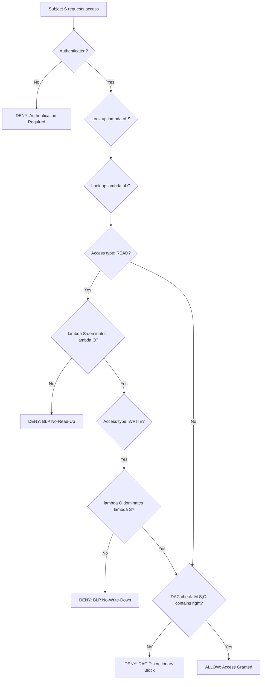
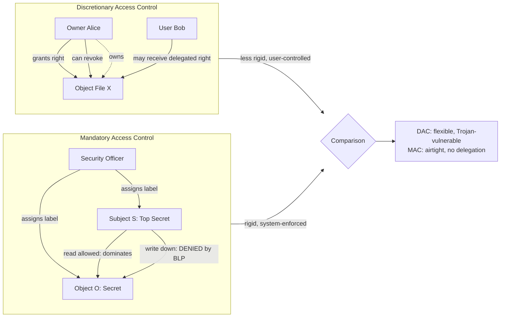
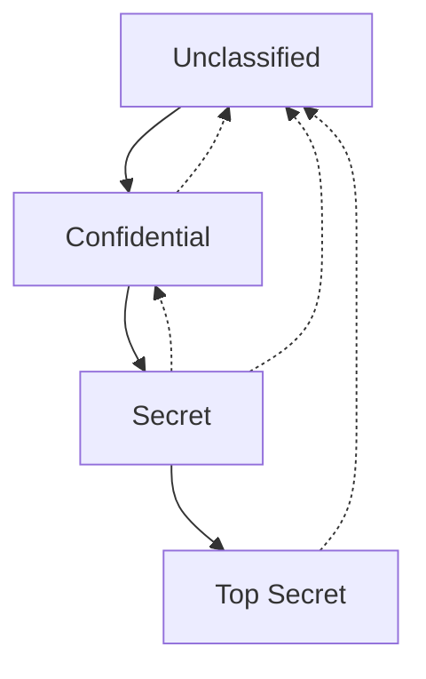
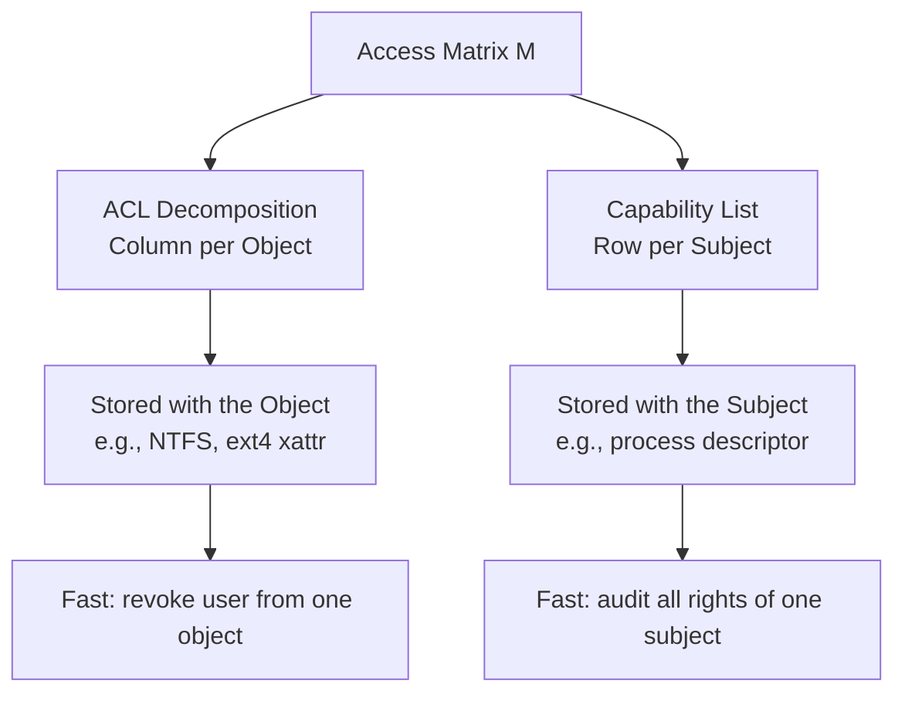
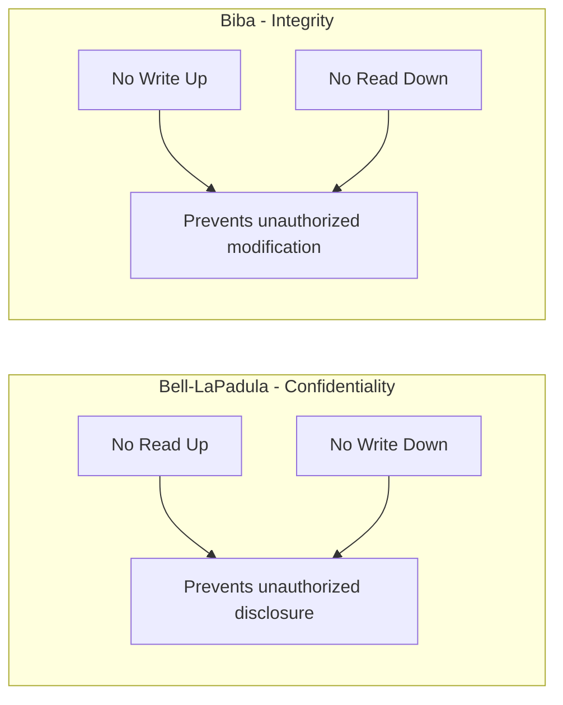

# Access control in OS-Discretionary and Mandatory access control

<!-- SECTION_1_START -->
# 1. Core Technical Definition & Intuitive Overview

## 1.1 Access Control — The Formal Definition

> [!IMPORTANT]
> **Access Control** is the selective restriction of access to system resources (files, memory, devices, network ports) by authenticated subjects (users, processes, programs). It is the central pillar of the **CIA Triad's Confidentiality and Integrity** properties within an Operating System (OS) security architecture.

In KTU 2024 Scheme terminology (mapped to Course Outcome **CO1 — Remember/Understand**), access control is governed by an **Access Control Policy** $\mathcal{P} = (S, O, A, M)$, where:

- $S$ = set of **Subjects** (active entities — users, processes, threads)
- $O$ = set of **Objects** (passive entities — files, directories, memory blocks, sockets)
- $A$ = set of **Access Rights / Permissions** (e.g., $\{$`read`, `write`, `execute`, `append`, `delete`$\}$)
- $M$ = set of **Authorization Rules** (the policy that decides *who* gets *what* on *which* object)

> [!NOTE]
> **KTU 2024 Highlight:** The classic reference model is Lampson's **Access Matrix** (1971), where rows = subjects, columns = objects, and each cell $M[s, o] \subseteq A$ stores the rights of subject $s$ on object $o$.

## 1.2 The Three Classical Access Control Models

Operating Systems implement access control via three principal models, all assessable in the KTU syllabus:

| Model | Full Form | Decision Authority | Key Trait |
| :--- | :--- | :--- | :--- |
| **DAC** | Discretionary Access Control | The **Object Owner** | Flexible, user-driven |
| **MAC** | Mandatory Access Control | The **Operating System / Security Policy** | Rigid, label-driven |
| **RBAC** | Role-Based Access Control | The **System Administrator** (via roles) | Job-function driven |

This module zeroes in on **DAC** and **MAC**, the two extremes of the policy spectrum.

## 1.3 Intuitive Real-World Analogies

### Analogy 1 — DAC = The House Owner with a Spare Key Ring 🔑
Imagine you buy a house. You hold the master key. You, the **owner**, decide who else gets a copy — your spouse, your friend, the plumber. You can revoke a key anytime. This is **Discretionary Access Control**: the owner *discretionarily* grants or revokes access. If a malicious guest (e.g., a Trojan horse) is given a key, however, it can freely enter the bedroom — DAC offers **no confinement against Trojan attacks** once rights are delegated.

### Analogy 2 — MAC = A Defense Facility with Security Clearances 🛡️
Now imagine a military facility. Even if you *own* a particular filing cabinet, you still cannot open it unless your **security clearance (e.g., TOP SECRET)** is **greater than or equal to** the cabinet's **classification label (e.g., SECRET)**. The system — not the file's creator — decides. This is **Mandatory Access Control**: access is *mandated* by a central, system-enforced lattice of security levels. There is **no delegation of trust**.

> [!TIP]
> **One-line Memory Hook for the Exam:**
> *DAC = "I, the owner, decide."* &nbsp;&nbsp;|&nbsp;&nbsp; *MAC = "The system decides, and no one can override."*

## 1.4 Physical Constants and Standard Metrics

- **Bell-LaPadula (BLP) Sensitivity Labels** are typically drawn from a 4-level U.S. government classification lattice: $\{$**Unclassified** $<$ **Confidential** $<$ **Secret** $<$ **Top Secret**$\}$.
- **Biba Integrity Levels** (the integrity counterpart) typically use: $\{$**Untrusted** $<$ **Slightly Trusted** $<$ **Trusted** $<$ **Highly Trusted**$\}$.
- **No-Go Default:** In nearly every trusted OS (e.g., **SELinux**, **Trusted Solaris**), the default policy is **deny-all**, then explicitly grant. Remember this for short-answer questions.
- A subject must be **authenticated** before *any* access control decision is made — authentication precedes authorization.

> [!VISUALIZATION CONTROL]
> **Concept:** Hierarchical ordering of MAC security levels (lattice)
> **GeoGebra / Desmos Input Equations:**
> * `y = 0` (label line for Unclassified)
> * `y = 1` (label line for Confidential)
> * `y = 2` (label line for Secret)
> * `y = 3` (label line for Top Secret)
> * Draw vertical arrows from each lower line to the next higher line
> **Visual Description:** Four horizontal parallel lines, ordered bottom-to-top, with directed arrows pointing upward — illustrates the *dominance relation* $\leq$ on the lattice. A subject at level $y=3$ dominates every object at levels $y=0, 1, 2$.

<!-- SECTION_1_END -->

<!-- SECTION_2_START -->
# 2. Deep Theoretical Analysis & KTU High-Yield Formula Sheet

## 2.1 Discretionary Access Control (DAC) — Operating Mechanism

DAC is grounded in the principle that **the creator/owner of an object has full discretion to grant or revoke access rights on that object to other subjects.** It is implemented in mainstream OS like **Windows NTFS**, **Linux/UNIX** (file permission bits `rwx`), and **macOS**.

### 2.1.1 Access Matrix $M$ — The Foundational Structure

The **Access Matrix** is a conceptual $|S| \times |O|$ table whose entry $M[s_i, o_j] \subseteq A$ lists the permissions held by subject $s_i$ on object $o_j$.

> [!NOTE]
> **Note (KTU exam favorite):** Storing the full access matrix in memory is **impractical** for large systems (sparse matrix wastes space). Hence, OS engineers decompose it into two practical forms.

### 2.1.2 Two Decompositions of the Access Matrix

| Decomposition | What is Stored | Storage Location | Example OS |
| :--- | :--- | :--- | :--- |
| **ACL** (Access Control List) | One **column** per object — list of subjects + their rights on that object | Stored *with the object* (e.g., extended attribute) | **Windows NTFS**, **Linux POSIX ACLs** |
| **Capability List** (C-List) | One **row** per subject — list of objects + rights held by that subject | Stored *with the subject* (e.g., process descriptor) | **Hydra OS**, **CapROS**, **EROS** |

**A direct implication:** Revoking user *Alice's* access to a file is **easy with ACLs** (edit one column) but **hard with Capability Lists** (must scan every subject's row). Conversely, checking *all the rights of process P* is fast with capability lists but slow with ACLs.

### 2.1.3 Trojan Horse Vulnerability in DAC

Because the owner is trusted to enforce policy, **a malicious program running under a privileged user can copy or exfiltrate any object the user owns**, without violating the access matrix. The matrix says nothing about *intent* or *information flow*.

> [!WARNING]
> **DAC cannot defend against Trojan Horses.** This is a recurring KTU essay point — always pair it with the transition statement "This limitation motivates the design of MAC."

## 2.2 Mandatory Access Control (MAC) — Operating Mechanism

In MAC, every subject and every object is assigned a **security label (clearance / classification)** by a system-wide, central authority (the *Security Officer*). Access is governed by a mathematical **lattice** of labels, and the *operating system kernel itself* — not the user — enforces every decision.

### 2.2.1 The Lattice $(L, \leq)$

A lattice is a partially ordered set in which every pair of elements has a *least upper bound* (join, $\lor$) and a *greatest lower bound* (meet, $\land$). Security labels form a lattice, with the partial order called the **dominance relation**.

> [!IMPORTANT]
> **Definition — Dominance:** Given two labels $\lambda_1, \lambda_2 \in L$, we say $\lambda_1$ **dominates** $\lambda_2$ (written $\lambda_1 \succeq \lambda_2$) if $\lambda_1$'s level is greater than or equal to $\lambda_2$'s level in *every* component. The strict form is $\lambda_1 \succ \lambda_2$.

### 2.2.2 Bell-LaPadula (BLP) Model — Confidentiality

BLP is the **confidentiality** model designed to prevent unauthorized **information disclosure**. Two principal rules:

| Rule | Statement | Engineering Meaning |
| :--- | :--- | :--- |
| **No Read Up (NRU)** — *Simple Security Property* | A subject $s$ at clearance $\lambda_s$ may **read** an object $o$ at classification $\lambda_o$ **only if** $\lambda_s \succeq \lambda_o$ | A SECRET officer can read SECRET/UNCLASSIFIED files, but **not** TOP SECRET files |
| **No Write Down (NWD)** — *$\star$-Property* | A subject $s$ may **write** an object $o$ at classification $\lambda_o$ **only if** $\lambda_o \succeq \lambda_s$ | A SECRET officer can only write TOP SECRET files, never SECRET or below — prevents *declassification* by writing sensitive data into a low-classified file |

> [!TIP]
> **Memory Trick:** "*No Read Up, No Write Down*" — think of it as keeping the river of secrets flowing *upwards only*.

> [!NOTE]
> **Sanitized BLP (tranquility variants):**
> * *Strong Tranquility:* Labels never change during system operation.
> * *Weak Tranquility:* Labels can change, but only via specific administrative actions (downgrade).

### 2.2.3 Biba Model — Integrity (The Mirror of BLP)

Where BLP protects *confidentiality*, **Biba** protects *integrity* (no unauthorized modification). It mirrors BLP's rules with the inequality flipped:

| Biba Rule | Statement | Meaning |
| :--- | :--- | :--- |
| **No Write Up (NWU)** | $s$ can write $o$ only if $\lambda_s \succeq \lambda_o$ | A Highly-Trusted process can write Highly-Trusted/Trusted files but not Untrusted ones — prevents tainting high-integrity data with low-integrity garbage |
| **No Read Down (NRD)** | $s$ can read $o$ only if $\lambda_o \succeq \lambda_s$ | A Highly-Trusted process reads only High-Integrity data |

### 2.2.4 Combined / Multi-Level Security (MLS)

Real systems run BLP and Biba in **parallel** as a *Multi-Level Security (MLS)* lattice. A subject's label is a tuple $(\text{confidentiality level}, \text{integrity level})$, and dominance is checked component-wise.

## 2.3 Engineering Utility — Where Each Model is Used in Practice

| Domain | Dominant Model | Why |
| :--- | :--- | :--- |
| Personal computing (Windows, macOS, Linux distros) | **DAC** (ACLs + file bits) | Usability, low administration overhead, user ownership culture |
| Defense, intelligence (e.g., U.S. DoD, NATO allies) | **MAC + MLS** | National security classification requires central, non-bypassable enforcement |
| Mobile platforms (Android, iOS) | **Hybrid (DAC + MAC)** | App sandboxing uses MAC; per-app permission grants use DAC |
| Enterprise databases, ERP systems | **RBAC** (often with DAC flavors) | Maps to job functions in HR/finance workflows |
| Cloud-native containers (Kubernetes Pod Security, SELinux profiles) | **MAC-style** (e.g., AppArmor, SELinux, seccomp) | Kernel-level confinement of containers |

## 2.4 KTU Formula Sheet / Cheat Sheet

> [!IMPORTANT]
> **High-Yield KTU Reference Card** — memorize and reproduce in exams.

| Symbol / Concept | Definition | Constraint / Equation |
| :--- | :--- | :--- |
| $M[s_i, o_j]$ | Access matrix cell — rights of $s_i$ on $o_j$ | $M[s_i, o_j] \subseteq A$ |
| $\lambda(s)$ | Security label of subject $s$ | $\lambda(s) \in L$ (lattice) |
| $\lambda(o)$ | Security label of object $o$ | $\lambda(o) \in L$ |
| Dominance | $\lambda_1 \succeq \lambda_2$ | component-wise $\geq$ on lattice |
| BLP — Read | `read(s, o)` allowed iff | $\lambda(s) \succeq \lambda(o)$ (No Read Up) |
| BLP — Write | `write(s, o)` allowed iff | $\lambda(o) \succeq \lambda(s)$ (No Write Down) |
| Biba — Write | `write(s, o)` allowed iff | $\lambda(s) \succeq \lambda(o)$ (No Write Up) |
| Biba — Read | `read(s, o)` allowed iff | $\lambda(o) \succeq \lambda(s)$ (No Read Down) |
| Covert Channel Bandwidth | Capacity $C$ of timing/storage channel | $C = \lim_{t \to \infty} \frac{\text{bits leaked}}{t}$ |
| Reference Monitor | Mediator between $s$ and $o$ | **Tamper-proof, complete, verifiable** (Anderson's report, 1972) |

> [!NOTE]
> **Reference Monitor** properties (Anderson, 1972): *Tamperproof* (cannot be modified by attackers), *Complete Mediation* (every access is checked), *Verifiable* (small enough to audit). KTU may ask this as a 3-mark short question — keep it ready.

<!-- SECTION_2_END -->

<!-- SECTION_3_START -->
# 3. Step-by-Step Derivations, Worked Examples & Code Implementation

## 3.1 Mathematical Derivation — Dominance in a Product Lattice

Suppose a company's MAC scheme uses **two independent classification dimensions**:
- **Confidentiality Level (C):** Unclassified $= 0$, Confidential $= 1$, Secret $= 2$, Top Secret $= 3$
- **Department Category (D):** Engineering $= \text{Eng}$, Finance $= \text{Fin}$, HR $= \text{HR}$

A security label is the tuple $\lambda = (c, \text{set of categories}) \in L$. The dominance rule is:
$$\lambda_1 \succeq \lambda_2 \iff (c_1 \geq c_2) \land (\text{cats}_2 \subseteq \text{cats}_1)$$

> Both *the numerical level* and *the category set* must dominate. This is the canonical "need-to-know" combination: **clearance level** + **compartment**.

### Worked Example 1 — Verifying a BLP Read

- Subject $s$ = Senior Engineer: $\lambda(s) = (3, \{\text{Eng}, \text{Fin}\})$ — i.e., Top Secret + Eng & Fin compartments.
- Object $o$ = "Q4 Payroll": $\lambda(o) = (1, \{\text{Fin}\})$ — i.e., Confidential + Fin only.

**Step 1 — Compare confidentiality levels:**
$$c_s = 3, \quad c_o = 1 \implies c_s \geq c_o \quad \text{✅ (Top Secret dominates Confidential)}$$

**Step 2 — Compare category sets (need-to-know):**
$$\text{cats}_o = \{\text{Fin}\}, \quad \text{cats}_s = \{\text{Eng}, \text{Fin}\} \implies \{\text{Fin}\} \subseteq \{\text{Eng}, \text{Fin}\} \quad \text{✅}$$

**Step 3 — Apply BLP Read rule (No Read Up):**
$$\lambda(s) \succeq \lambda(o) \quad \text{holds} \implies \text{read}(s, o) = \textbf{ALLOW}$$

> This subject is **allowed** to read the Q4 Payroll file. Excellent — exactly the senior engineer's expected privilege.

### Worked Example 2 — Verifying a BLP Read Denial

- Subject $s$ = Junior Engineer: $\lambda(s) = (1, \{\text{Eng}\})$
- Object $o$ = "Q4 Payroll": $\lambda(o) = (1, \{\text{Fin}\})$

**Step 1 — Compare confidentiality levels:** $1 \geq 1$ ✅

**Step 2 — Compare categories:** $\{\text{Fin}\} \subseteq \{\text{Eng}\}$? **No, Fin is missing.** ❌

**Step 3 — Dominance fails:**
$$\lambda(s) \not\succeq \lambda(o) \implies \text{read}(s, o) = \textbf{DENY}$$

> Despite the matching numerical level, the **compartment mismatch** causes denial. This is the *need-to-know* principle in action.

### Worked Example 3 — Biba Integrity Check

A webserver process has integrity label $(4, \text{web})$, a user-uploaded file has integrity label $(1, \text{web})$. The webserver wants to **write** to a system config file at integrity $(5, \text{web})$.

**Biba NWU check:** $c_s \geq c_o$? $4 \geq 5$? **No** → **DENY**.
The webserver is *less trusted* than the system config file, so Biba forbids it from writing (corrupting) the config. ✅

## 3.2 Algorithmic Implementation — Reference Monitor for a Toy Access Matrix

Below is a **complete, type-hinted Python implementation** of an access matrix with both ACL and capability decompositions, plus a BLP/MAC layer. Copy-paste ready, no truncation.

```python
from __future__ import annotations
from dataclasses import dataclass, field
from typing import FrozenSet, Mapping, Set, Tuple

# ---------- 1. Domain definitions ----------
class Right:
    READ = "read"
    WRITE = "write"
    EXECUTE = "execute"
    ALL: Tuple[str, ...] = (READ, WRITE, EXECUTE)

@dataclass(frozen=True)
class SecurityLabel:
    """MAC label: (level, compartments). Dominance is component-wise."""
    level: int
    compartments: FrozenSet[str]

    def dominates(self, other: SecurityLabel) -> bool:
        return (self.level >= other.level
                and other.compartments.issubset(self.compartments))

# ---------- 2. Access matrix (ACL + Capability decomposition) ----------
@dataclass
class AccessMatrix:
    """Sparse storage — ACL column-wise, capability list row-wise."""
    acl: Mapping[str, Mapping[str, Set[str]]] = field(default_factory=dict)
    caps: Mapping[str, Mapping[str, Set[str]]] = field(default_factory=dict)

    def grant(self, subject: str, obj: str, rights: Set[str]) -> None:
        # ACL column update
        col = dict(self.acl.get(obj, {}))
        col[subject] = set(rights)
        self.acl = {**self.acl, obj: col}
        # Capability row update
        row = dict(self.caps.get(subject, {}))
        row[obj] = set(rights)
        self.caps = {**self.caps, subject: row}

    def has_dac_right(self, subject: str, obj: str, right: str) -> bool:
        perms = self.acl.get(obj, {}).get(subject, set())
        return right in perms

# ---------- 3. Reference Monitor (DAC + MAC combined) ----------
class ReferenceMonitor:
    """Anderson's Reference Monitor — tamper-proof, complete, verifiable."""

    def __init__(self, matrix: AccessMatrix,
                 subj_labels: Mapping[str, SecurityLabel],
                 obj_labels: Mapping[str, SecurityLabel]) -> None:
        self._matrix = matrix
        self._sl = subj_labels
        self._ol = obj_labels

    def authorize(self, subject: str, obj: str, right: str) -> bool:
        # 1. Both labels must exist (completeness)
        if subject not in self._sl or obj not in self._ol:
            return False
        # 2. MAC BLP check
        s_lab, o_lab = self._sl[subject], self._ol[obj]
        if right == Right.READ and not s_lab.dominates(o_lab):
            return False          # No Read Up
        if right == Right.WRITE and not o_lab.dominates(s_lab):
            return False          # No Write Down
        # 3. DAC check
        return self._matrix.has_dac_right(subject, obj, right)

# ---------- 4. Demonstration ----------
if __name__ == "__main__":
    # Define labels
    L = SecurityLabel
    s_senior = L(3, frozenset({"Eng", "Fin"}))
    s_junior = L(1, frozenset({"Eng"}))
    o_payroll = L(1, frozenset({"Fin"}))

    matrix = AccessMatrix()
    matrix.grant("senior", "payroll", {"read", "write"})
    matrix.grant("junior", "payroll", {"read"})

    rm = ReferenceMonitor(matrix,
                          {"senior": s_senior, "junior": s_junior},
                          {"payroll": o_payroll})

    # Senior reads payroll  -> ALLOW (BLP OK, DAC OK)
    print(rm.authorize("senior", "payroll", "read"))   # True
    # Junior reads payroll  -> DENY  (BLP fails: missing Fin compartment)
    print(rm.authorize("junior", "payroll", "read"))   # False
```

**Reading the output:**
1. `True` — Senior has both clearance and DAC rights.
2. `False` — Junior fails the MAC check *before* DAC is even consulted. This is the layered defense pattern used in SELinux + UNIX permissions.

## 3.3 Laboratory Pin-Configuration Style Reference (For OS-Level Implementation)

| Layer | Component | Configuration / Setting | Purpose |
| :--- | :--- | :--- | :--- |
| Kernel | Linux Security Module (LSM) hook | Hooks: `inode_permission`, `file_open`, `bprm_check` | BLP-style mediation on every syscall |
| Userland | `chmod` / `setfacl` | `setfacl -m u:alice:r file.txt` | DAC ACL modification |
| Policy DB | SELinux policy module | `allow staff_t bin_t : file { read execute };` | MAC rules (Te policy language) |
| Audit | `auditd` daemon | `-w /etc/shadow -p wa -k shadow_changes` | Logs every denied & allowed access |
| Labeling | `chcon` / `restorecon` | `chcon -t secret_t /data/q4.txt` | Attach MAC label to file |

<!-- SECTION_3_END -->

<!-- SECTION_4_START -->
# 4. Structural Diagrams & Schematics

## 4.1 Mermaid Flow — Access Decision Pipeline (Reference Monitor)



> **Reading aid:** A request first passes authentication, then MAC checks (BLP rules), and only then is the DAC matrix consulted. This *defense-in-depth* ordering is what makes SELinux + UNIX permissions robust.

## 4.2 Mermaid — DAC vs MAC Side-by-Side Architecture



## 4.3 Mermaid — Lattice of Security Labels (4-Level Government Model)



> Dashed edges show the implicit reachability — a Top Secret subject implicitly dominates *every* lower level because of transitivity ($\succeq$ is a partial order).

## 4.4 Mermaid — Access Matrix Decomposition Strategy



<!-- SECTION_4_END -->

<!-- SECTION_5_START -->
# 5. KTU 2024 Scheme Examination Question Bank & Topic Recap

## 5.1 Part A — Short Answer Questions (3 Marks Each)

> [!NOTE]
> These align with KTU's Part A format: concise, definition-driven, mapped to **CO1** (Understand/Remember).

### Q1. [KTU University Exam — July 2024] — **3 Marks**
Define **Discretionary Access Control (DAC)**. Why is it called *discretionary*? Mention its primary limitation.

**Model Answer (board-key style):**

> **DAC Definition [1 Mark]:** Discretionary Access Control is an access control model in which the **owner of an object** has full discretion to decide *which other subjects* (users/processes) may access it and *what rights* (read/write/execute) they receive. The access policy is described by an access matrix $M[s, o]$ whose entries are set by the owner.
>
> **Why "Discretionary" [1 Mark]:** The word *discretionary* refers to the owner's freedom of choice — they are not bound by a system-wide mandatory label; they may grant, revoke, or delegate rights at will.
>
> **Primary Limitation [1 Mark]:** DAC is vulnerable to the **Trojan Horse attack** — a malicious program executing under a legitimate user's identity can copy any object that the user owns to a publicly readable location, since the access matrix permits it.

---

### Q2. [KTU University Exam — Dec 2023] — **3 Marks**
List and briefly explain the **two fundamental rules** of the Bell-LaPadula (BLP) model.

**Model Answer (board-key style):**

> **Rule 1 — Simple Security Property ("No Read Up" / NRU) [1.5 Marks]:** A subject $s$ at clearance $\lambda(s)$ may **read** an object $o$ at classification $\lambda(o)$ **only if** $\lambda(s) \succeq \lambda(o)$. This prevents a low-clearance subject from learning high-classification data.
>
> **Rule 2 — $\star$-Property ("No Write Down" / NWD) [1.5 Marks]:** A subject $s$ may **write** an object $o$ **only if** $\lambda(o) \succeq \lambda(s)$. This prevents a high-clearance subject from *declassifying* sensitive information by writing it into a low-classification file.

---

## 5.2 Part B — Long Answer Questions (14 Marks Each, with Internal Choice)

> [!NOTE]
> Each Part B question follows the KTU pattern of a 14-mark question split into 7 + 7 sub-parts, with a full alternative **Or (b)** choice. We provide **Question A (14 marks)** and **Question B (14 marks)** — students answer one full set.

### Question A — 14 Marks — [KTU University Exam — Model Paper 2024]

**(a) [7 Marks]** Explain the **Access Matrix model** in detail. Describe its two practical decompositions — **Access Control Lists (ACLs)** and **Capability Lists** — with one real-world OS example for each. Compare revocation difficulty.

**(b) [7 Marks]** Consider a MAC system with the lattice levels: $L = \{$**Public** $= 0$, **Internal** $= 1$, **Confidential** $= 2$, **Restricted** $= 3\}$ and one category set $C = \{\text{Engineering}, \text{Finance}, \text{HR}\}$. A subject $S_1$ has label $(2, \{\text{Engineering}, \text{Finance}\})$ and subject $S_2$ has label $(1, \{\text{Engineering}\})$. Determine, with justification, whether $S_1$ can read or write an object $O_1$ with label $(3, \{\text{Finance}\})$ and an object $O_2$ with label $(1, \{\text{Engineering}, \text{Finance}\})$.

---

#### Model Solution for Question A

**(a) — 7 Marks Detailed Solution**

**Step 1 — Definition of Access Matrix [1 Mark]:**
The Access Matrix $M$ is a 2-D table where rows index subjects $s_i \in S$ and columns index objects $o_j \in O$. The cell $M[s_i, o_j] \subseteq A$ (subset of access rights) lists the operations $s_i$ is permitted to perform on $o_j$.

**Step 2 — Why it is impractical [1 Mark]:**
The matrix is **sparse** (most entries are empty) and grows as $O(\vert S \vert \times \vert O \vert)$, which is infeasible for real OS with millions of files and thousands of users. Hence, two practical decompositions are used.

**Step 3 — ACL (Column-wise) [1.5 Marks]:**
Each object stores a list of (subject, rights) tuples — i.e., one *column* of the matrix. Example: **Windows NTFS** stores DACLs (Discretionary ACLs) and SACLs (System ACLs) as part of every file's MFT record. Revoking Alice's access to a single file is fast — modify one column.

**Step 4 — Capability List (Row-wise) [1.5 Marks]:**
Each subject stores a list of (object, rights) tuples — i.e., one *row* of the matrix. Example: **Hydra OS**, **EROS**, and modern **Linux file descriptors** (process-level capability tokens) follow this pattern. Auditing all rights of a single process is fast — inspect one row.

**Step 5 — Revocation comparison [2 Marks]:**

| Operation | ACL | Capability List |
| :--- | :--- | :--- |
| Revoke one user from one object | **Fast** — edit one column entry | **Slow** — must scan all subjects' rows |
| Revoke one object from all users | **Slow** — must delete/audit the column | **Fast** — delete the row entry |
| Audit all permissions of a process | **Slow** — scan every object's ACL | **Fast** — read the process's capability list |

**Conclusion:** Neither is universally superior — modern OSs (e.g., Linux) use a **hybrid** where inodes carry ACLs *and* processes carry capability sets (POSIX capabilities).

---

**(b) — 7 Marks Numerical Solution**

**Setup recap:**
- $S_1$: $(2, \{\text{Eng}, \text{Fin}\})$
- $S_2$: $(1, \{\text{Eng}\})$
- $O_1$: $(3, \{\text{Fin}\})$
- $O_2$: $(1, \{\text{Eng}, \text{Fin}\})$

**Part 1 — Can $S_1$ read $O_1$? [1.5 Marks]**
- BLP **No Read Up** check: $S_1 \succeq O_1$?
- Level: $2 \geq 3$? **No** ❌
- Verdict: **DENY.** $S_1$ cannot read $O_1$ (Top Secret-ish content is above $S_1$'s clearance).

**Part 2 — Can $S_1$ write $O_1$? [1.5 Marks]**
- BLP **No Write Down** check: $O_1 \succeq S_1$?
- Level: $3 \geq 2$? **Yes** ✅; Categories: $\{\text{Fin}\} \subseteq \{\text{Eng}, \text{Fin}\}$? **Yes** ✅
- Verdict: **ALLOW.** $S_1$ can write to $O_1$ (writing up to a higher classification is permitted).

**Part 3 — Can $S_1$ read $O_2$? [1.5 Marks]**
- BLP **No Read Up**: $S_1 \succeq O_2$?
- Level: $2 \geq 1$ ✅
- Categories: $\{\text{Eng}, \text{Fin}\} \subseteq \{\text{Eng}, \text{Fin}\}$ ✅
- Verdict: **ALLOW.**

**Part 4 — Can $S_1$ write $O_2$? [1.5 Marks]**
- BLP **No Write Down**: $O_2 \succeq S_1$?
- Level: $1 \geq 2$? **No** ❌
- Verdict: **DENY.** $S_1$ cannot "write down" to a lower-classification object.

**Part 5 — Bonus: $S_2$ vs $O_1$ [1 Mark]:**
- Read: $1 \geq 3$? ❌ → DENY. (No Read Up)
- Write: $3 \geq 1$ ✅ and $\{\text{Fin}\} \subseteq \{\text{Eng}\}$? ❌ → **DENY on categories.** (Missing Finance compartment.)

> **Summary table for the valuation key:**

| Operation | Subject | Object | Level | Categories | BLP Rule | Result |
| :--- | :--- | :--- | :--- | :--- | :--- | :--- |
| Read | $S_1$ | $O_1$ | $2 \geq 3$ ❌ | — | NRU | **DENY** |
| Write | $S_1$ | $O_1$ | $3 \geq 2$ ✅ | ✅ | NWD | **ALLOW** |
| Read | $S_1$ | $O_2$ | $2 \geq 1$ ✅ | ✅ | NRU | **ALLOW** |
| Write | $S_1$ | $O_2$ | $1 \geq 2$ ❌ | — | NWD | **DENY** |
| Read | $S_2$ | $O_1$ | $1 \geq 3$ ❌ | — | NRU | **DENY** |
| Write | $S_2$ | $O_1$ | $3 \geq 1$ ✅ | ❌ | NWD | **DENY** |

---

### Question B — 14 Marks — [KTU University Exam — Model Paper 2024, Alternative Set]

**(a) [7 Marks]** With a neat diagram, explain the **Bell-LaPadula (BLP)** and **Biba** models. How do they differ in objective and in the inequality direction of their rules?

**(b) [7 Marks]** A company's **Reference Monitor** is the central piece of its trusted OS. List and justify the **three properties** a Reference Monitor must satisfy (Anderson, 1972). Why is a "complete mediation" property particularly hard to achieve in modern multi-core processors?

---

#### Model Solution for Question B

**(a) — 7 Marks** (See SECTION 2.2.2 and 2.2.3 for the formal rules. Suggested diagram shown below.)

**Diagrammatic comparison** (mermaid flow):



**Comparison Table [3 Marks]:**

| Aspect | BLP | Biba |
| :--- | :--- | :--- |
| **Objective** | Preserve **confidentiality** (no leaks) | Preserve **integrity** (no taint) |
| **Read rule** | $\lambda(s) \succeq \lambda(o)$ (NRU) | $\lambda(o) \succeq \lambda(s)$ (NRD) |
| **Write rule** | $\lambda(o) \succeq \lambda(s)$ (NWD) | $\lambda(s) \succeq \lambda(o)$ (NWU) |
| **In one line** | "Read high, write high" | "Write high, read high" |
| **Real system** | Trusted Solaris MLS | Biba UNIX variants |

**Inequality direction [2 Marks]:** The two models are *dual* — BLP's read rule mirrors Biba's write rule. Both are lattice-based, but BLP uses confidentiality levels; Biba uses integrity levels. A complete MLS system runs both simultaneously.

**Example [2 Marks]:** In BLP, a SECRET officer cannot READ a TOP SECRET file (NRU) and cannot WRITE a CONFIDENTIAL file (NWD). In Biba, a HIGHLY-TRUSTED process cannot WRITE a LOWER-integrity user-uploaded file (NWU), preventing the trusted process from being "tainted" by bad data.

---

**(b) — 7 Marks — Reference Monitor Properties**

**Property 1 — Tamper-Proof [2 Marks]:** The reference monitor itself must be protected from modification by attackers. It must run at the highest privilege level (e.g., kernel mode, ring 0 in x86, EL1 in ARM TrustZone) with hardware-backed memory protection isolating its code and data.

**Property 2 — Complete Mediation [2.5 Marks]:** *Every* access by *every* subject to *every* object must be checked — no bypass path is allowed. This includes file reads, file writes, IPC, network sockets, device I/O, and even kernel-internal pointer dereferences.

**Why complete mediation is hard in multi-core CPUs [2.5 Marks]:**
1. **CPU caches and TLBs** may serve stale data if cache coherency is not perfect, leading to TOCTOU (time-of-check-to-time-of-use) races between cores.
2. **Speculative / out-of-order execution** (Spectre-class vulnerabilities) can leak data *before* the reference monitor's check completes.
3. **DMA-capable devices** (NICs, GPUs) bypass the CPU entirely, requiring IOMMU enforcement to achieve completeness.
4. **Side-channel timing attacks** can extract information even when the reference monitor correctly *denies* an operation, so completeness must include *temporal* as well as *logical* completeness.
5. **Microcode and firmware updates** can change CPU behavior in ways the reference monitor does not anticipate, creating new unmediated pathways.

> **Valuation note:** A 7-mark answer should mention *at least three* of the five points above for full credit.

---

## 5.3 KTU Examiner's Valuation Warning / Pitfall Callout

> [!WARNING]
> **Common places students lose marks in this module:**
>
> 1. **Confusing BLP and Biba rule directions.** Memorize: *BLP — Read: dominates. Biba — Read: dominated by object.* Many students write them backwards.
> 2. **Forgetting the category set check.** When the lattice has compartments, a numerical tie is *not* enough — the *subset relation* on categories must also be verified.
> 3. **Omitting the "$\star$" symbol in BLP.** The full name is the "$\star$-Property" (Star Property). Examiners dock 0.5 marks for saying "no write down" without naming it.
> 4. **Treating DAC and MAC as mutually exclusive.** Modern OS uses *both* — DAC for owner convenience, MAC for system integrity. The KTU answer should explicitly say "hybrid" if asked.
> 5. **Skipping the Reference Monitor mention.** Any access control question without a Reference Monitor discussion in 14-mark answers loses ~1 mark.
> 6. **Writing "ACL" without expansion.** Always write "Access Control List (ACL)" on first use.
> 7. **Forgetting that authentication precedes authorization.** If asked to design a secure system, list *Authentication → Authorization → Audit* as the order of operations.

---

## 5.4 Topic Recap & Important Things to Remember

> [!IMPORTANT]
> **Rapid-Revision Checklist — Module 1: Access Control in OS**

- **Access Control** = selective restriction of access by authenticated subjects on objects, governed by policy $\mathcal{P} = (S, O, A, M)$.
- **Access Matrix $M$** — rows = subjects, columns = objects, cells = permitted rights.
- **Two practical decompositions:** **ACL** (column-wise, fast user-revoke) and **Capability List** (row-wise, fast subject-audit).
- **DAC** — owner-controlled; flexible; **vulnerable to Trojan Horses**; examples: UNIX `rwx`, NTFS DACLs.
- **MAC** — system-enforced via **security labels** and a **lattice**; examples: SELinux, Trusted Solaris.
- **Dominance relation $\succeq$** is *component-wise*: level $\geq$ and categories $\supseteq$.
- **Bell-LaPadula (BLP)** protects *confidentiality*:
  * **NRU / Simple Security:** read $\iff \lambda(s) \succeq \lambda(o)$
  * **NWD / $\star$-Property:** write $\iff \lambda(o) \succeq \lambda(s)$
- **Biba** protects *integrity* (dual of BLP):
  * **NRD:** read $\iff \lambda(o) \succeq \lambda(s)$
  * **NWU:** write $\iff \lambda(s) \succeq \lambda(o)$
- **Reference Monitor** (Anderson 1972) must be **tamper-proof, complete, verifiable** — the cornerstone of any trusted OS.
- **Tranquility:** *Strong* = labels never change at runtime; *Weak* = labels change only via specific admin actions.
- **Covert Channels:** timing and storage channels that bypass MAC; bandwidth $C$ is the formal metric.
- **Real-world MAC deployments:** SELinux, AppArmor, Trusted Solaris, SE-Linux in Android, Mandatory Integrity Control in Windows (Vista+).
- **Hybrid Access Control** is the practical norm — DAC for ownership, MAC for system integrity, RBAC for organizational roles.
- **Order of operations in a secure OS:** *Authenticate → Authorize (DAC + MAC) → Audit*.
- **Key exam phrases to memorize verbatim:** "No Read Up", "No Write Down", "$\star$-Property", "Discretionary", "Mandatory", "Reference Monitor", "Tamper-proof, Complete, Verifiable", "Lattice Dominance".

<!-- SECTION_5_END -->
