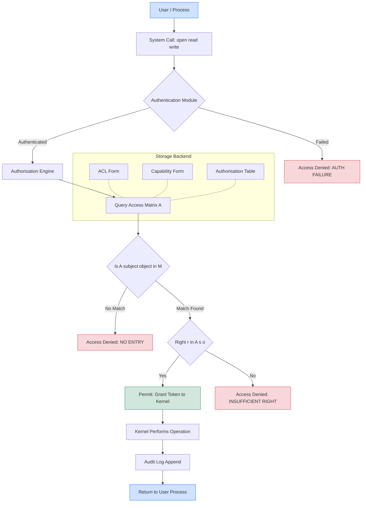
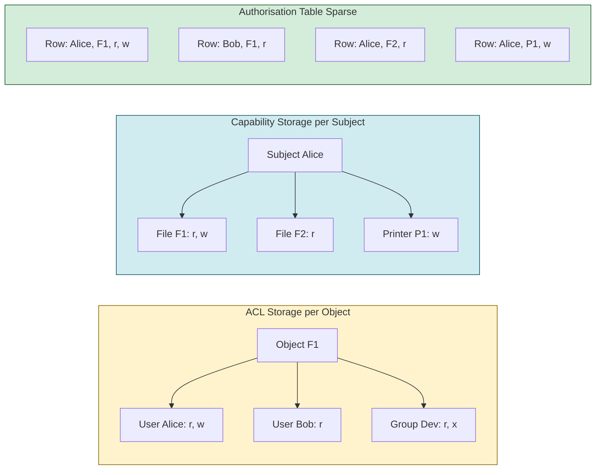
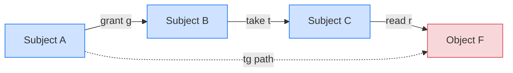

# Access control matrix

<!-- SECTION_1_START -->
# Access Control Matrix — Core Technical Definition & Intuitive Overview

## 1. Formal Academic Definition (KTU 2024 Syllabus Terminology)

The **Access Control Matrix** (also called the **Protection Matrix**) is a formal, abstract security model introduced by **Butler Lampson (1971)** that represents the complete authorisation state of a computer system as a two-dimensional tabular structure.

* **Rows** of the matrix correspond to **Subjects** (active entities such as users, processes, or principals that initiate actions).
* **Columns** of the matrix correspond to **Objects** (passive entities such as files, directories, printers, memory segments, or devices that are acted upon).
* Each cell $A[s, o]$ at the intersection of subject row $s$ and object column $o$ contains the set of **access rights** (or **permissions**) that subject $s$ is currently authorised to exercise on object $o$.

Formally, if $\mathcal{S}$ is the set of all subjects, $\mathcal{O}$ is the set of all objects (with $\mathcal{S} \subseteq \mathcal{O}$ because subjects themselves are objects and can be controlled), and $\mathcal{R}$ is the set of all generic rights, then:

$$
\mathcal{A} : \mathcal{S} \times \mathcal{O} \longrightarrow 2^{\mathcal{R}}
$$

The standard set of generic rights used in the Lampson model is:
$$
\mathcal{R} = \{\, \text{read},\ \text{write},\ \text{execute},\ \text{append},\ \text{own},\ \text{delete} \,\}
$$

> [!IMPORTANT]
> **KTU 2024 Board High-Yield Definition (verbatim-friendly):**
> *"An Access Control Matrix is a state-based authorisation model in which each entry specifies the permissible operations a given subject may perform on a given object. It is the canonical reference structure from which all discretionary access control (DAC) mechanisms such as ACLs and Capabilities are derived."*

---

## 2. Conceptual Analogy & Geometric Intuition

### The Office Building Analogy
Imagine a **large corporate office building** with many employees (subjects) and many rooms (objects) — server rooms, archives, the CEO's cabin, the pantry, the printer room, etc.

* Each employee carries an **ID badge** listing which rooms they may enter and what they may do there (read files, write reports, execute maintenance, etc.).
* The **central security desk** maintains a **giant ledger** (the matrix) — one row per employee, one column per room, and the cell states the permitted actions.
* When Alice approaches the server room, the guard checks row "Alice", column "Server Room", and permits the **subset of actions** she is authorised for (e.g., read, reboot — but not delete).

Geometrically, the matrix is a rectangular **grid** spread across a **subject axis (vertical)** and an **object axis (horizontal)**, with cells filled with small "permission tokens".

### Visual Intuition
Picture a 2-D spreadsheet:

* The **rows** slide vertically to identify *who* is asking.
* The **columns** slide horizontally to identify *what* is being asked for.
* The **intersection cell** answers *how* the request is allowed.

> [!NOTE]
> **Why an abstract model?** Real systems may have **millions** of users and **billions** of files. Storing the full matrix is impossible (it is **sparse**), so engineers only store the **non-empty cells**, leading to the two practical implementations: **Access Control Lists** (per-column storage) and **Capability Lists** (per-row storage).

---

## 3. Standard Notation, Symbols & Constants

| Symbol | Meaning | Typical Value / Range |
| :--- | :--- | :--- |
| $S$, $\mathcal{S}$ | Set of subjects (active entities) | $\{1, 2, \ldots, n\}$ |
| $O$, $\mathcal{O}$ | Set of objects (passive entities) | $\{1, 2, \ldots, m\}$ |
| $R$, $\mathcal{R}$ | Set of generic rights | $6$ canonical rights |
| $A[s,o]$ | Cell entry; rights of subject $s$ on object $o$ | Subset of $\mathcal{R}$ |
| $s$ | A specific subject | Row index |
| $o$ | A specific object | Column index |
| $n \times m$ | Matrix dimensions | $n = \vert\mathcal{S}\vert$, $m = \vert\mathcal{O}\vert$ |
| $2^{\mathcal{R}}$ | Power set of rights | $2^{6} = 64$ possible cell values |

> [!VISUALIZATION CONTROL]
> **Concept:** Access Control Matrix as a sparse 2-D heatmap.
> **GeoGebra / Desmos Input Equations (conceptual grid):**
> * Row labels (y-axis, categorical): $S_1$, $S_2$, $S_3$
> * Column labels (x-axis, categorical): $F_1$ (file1), $F_2$ (file2), $P_1$ (printer)
> * Cell values (categorical): r (read), w (write), x (execute), – (no access)
> **Visual Description:** A $3 \times 3$ grid where row $S_1$ to column $F_1$ contains `{r, w}`, row $S_2$ to column $F_2$ contains `{r}`, and so on. Empty cells represent *no permission*. The plot demonstrates **sparsity** — most cells are empty, motivating column- or row-wise compression.

---

## 4. Position in the KTU 2024 Scheme Syllabus

* **Course Code:** PECST 744 — Information Security
* **Module:** 1 — Introduction to Information Security
* **Cognitive Level (RBT):** Understand, Apply
* **Mapped Course Outcome:** **CO1** — *Understand the fundamental principles of information security, including confidentiality, integrity, availability, and the classical access-control models.*
* **Assessment Weightage (typical):** 8 to 12 marks out of 100 in the End-Semester Examination, often appearing as a Part A 3-mark question or as a sub-part of a Part B 14-mark question.

<!-- SECTION_1_END -->

<!-- SECTION_2_START -->
# Deep Theoretical Analysis & KTU High-Yield Formula Sheet

## 1. Structural Anatomy of the Access Control Matrix

The access control matrix is a **state machine** in the security-theoretic sense. At any instant, the entire system protection state is fully described by the matrix $A$ plus the current state of all subjects/objects. A transition between states is invoked by one of the six canonical **primitive operations** (mono-operational commands) defined by Lampson:

### The Six Mono-Operational Commands

Let $s$ denote the *requester* (the subject invoking the command) and $o_p$ denote the *protected object* on which the operation is to be performed. The six commands, each guarded by a precondition on the right appearing in $A[s, o_p]$, are:

| # | Command | Meaning | Precondition | Effect on $A$ |
| :---: | :--- | :--- | :--- | :--- |
| 1 | `enter r into A[s, o]` | Grant right $r$ | $r \in A[s, o]$ (possess grant-right) | Add $r$ to $A[s, o]$ |
| 2 | `delete r from A[s, o]` | Revoke right $r$ | $r \in A[s, o]$ (possess delete-right) | Remove $r$ from $A[s, o]$ |
| 3 | `create subject s'` | Create new subject | $s'$ does not exist | Adds new row, fills with $\varnothing$ except `own` on $s'$ |
| 4 | `create object o'` | Create new object | $o'$ does not exist | Adds new column, fills with $\varnothing$ |
| 5 | `destroy subject s'` | Remove subject | $s' \neq s$ and `own` $\in A[s, s']$ | Deletes row $s'$ and all references in other rows |
| 6 | `destroy object o'` | Remove object | `own` $\in A[s, o']$ | Deletes column $o'$ |

> [!NOTE]
> **KTU Board Tip:** Examiners frequently ask *"List the six commands used to modify an access control matrix."* Memorising the above table verbatim guarantees full marks.

---

## 2. Decomposed Implementations: ACL and Capability List

Because the full matrix is **sparse** (a typical system has $\sim 10^{3}$ users and $\sim 10^{6}$ files, yielding $\sim 10^{9}$ cells, of which only $\sim 10^{7}$ are non-empty), it is never stored literally. Two decompositions are universally used:

### 2.1 Access Control List (ACL) — Column-Wise Decomposition

For each object $o$, store the list of $(s, R)$ pairs where $R = A[s, o]$ is non-empty.

$$
\text{ACL}(o) = \{\, (s, A[s, o]) \mid A[s, o] \neq \varnothing \,\}
$$

* **Strength:** Efficient to answer *"Who can access object $o$?"* — a critical question for **authorisation enforcement** when a request arrives.
* **Used by:** UNIX file permissions, Windows NTFS DACLs, networking ACLs on routers.
* **Weakness:** Hard to answer *"What can subject $s$ access?"* — must scan all columns.

### 2.2 Capability List (C-List) — Row-Wise Decomposition

For each subject $s$, store the list of $(o, R)$ pairs where $R = A[s, o]$ is non-empty.

$$
\text{Cap}(s) = \{\, (o, A[s, o]) \mid A[s, o] \neq \varnothing \,\}
$$

* **Strength:** Efficient to answer *"What can subject $s$ do?"* — useful for **least-privilege auditing**.
* **Used by:** Kerberos tickets, Android permissions, POSIX capabilities, OAuth scopes.
* **Weakness:** Hard to revoke a single user's access to many objects; no central authority.

### 2.3 Authorisation Table — Sparse Relational Form

Store only the non-empty cells as rows of a relational table:

| Subject $(s)$ | Object $(o)$ | Rights $(R)$ |
| :---: | :---: | :---: |
| Alice | /etc/passwd | {read} |
| Alice | /home/alice/ | {read, write, execute} |
| Bob | /home/alice/ | {read} |
| Bob | printer1 | {write} |

> [!IMPORTANT]
> **KTU 2024 Takeaway:** The Access Control Matrix is the **abstract model**; ACLs, Capability Lists, and Authorisation Tables are the three **concrete implementation strategies** derived from it. A common Part A question asks you to *"Differentiate between ACL and Capability List"* — present a side-by-side table.

---

## 3. The HRU Safety Model (Harrison–Ruzzo–Ullman, 1976)

The HRU model extends the Lampson matrix with the six mono-operational commands and asks the classical *safety question*:

> **Safety Problem:** *Given an initial access control matrix $A_0$ and a set of commands $C$, does there exist a reachable state in which some undesired right (e.g., write) appears in a forbidden cell?*

The decision problem is **undecidable in general** (for arbitrary $C$ with create/destroy), but **decidable and linear-time** under restricted schemes:

| HRU Variant | Restrictions | Safety-Decision Complexity |
| :--- | :--- | :--- |
| **Mono-conditional HRU** | Each command tests at most one cell | Polynomial (PTIME) |
| **Mono-operational HRU** | Each command performs at most one primitive op | **Linear time $O(n)$** (decidable) |
| **HRU (general)** | Arbitrary tests and operations | **Undecidable** |

This result is a classic KTU theoretical question: *"Show that the safety problem in the HRU model is undecidable."*

---

## 4. Take-Grant Protection Model (1976)

A *specialised* protection model derived from the matrix, defined by four rules over two special rights: **take** ($t$) and **grant** ($g$).

* **`take(s, o, x)`** — If $g \in A[s, o]$ and $x \in A[o, x']$ then add $x$ to $A[s, x']$.
* **`grant(s, o, x)`** — If $g \in A[s, o]$ then add $x$ to $A[o, x']$.
* **`create(s, o)`** — Create new object $o$ with $A[s, o] = \{r, w\}$.
* **`remove(s, o, x)`** — If $x \in A[s, o]$, delete it.

The Take-Grant model makes the safety question **decidable in linear time** and introduces the concept of a **tg-path** for analysing information flow.

---

## 5. KTU Formula Sheet / Cheat Sheet

| Concept | Mathematical / Structural Expression | Engineering Utility |
| :--- | :--- | :--- |
| Access Matrix | $A : \mathcal{S} \times \mathcal{O} \to 2^{\mathcal{R}}$ | Authorisation state |
| Number of possible cell values | $2^{\vert\mathcal{R}\vert}$ | Maximum granularity |
| ACL (per-object) | $\text{ACL}(o) = \{ (s, A[s,o]) \mid A[s,o] \neq \varnothing \}$ | Fast *who-accesses-what* lookup |
| C-List (per-subject) | $\text{Cap}(s) = \{ (o, A[s,o]) \mid A[s,o] \neq \varnothing \}$ | Fast *what-can-s-do* lookup |
| Sparsity ratio | $\rho = \dfrac{\vert\{(s,o) : A[s,o] \neq \varnothing\}\vert}{n \cdot m}$ | Storage efficiency |
| Mono-operational HRU safety | Decidable in $O(n)$ where $n = \vert\mathcal{S}\vert + \vert\mathcal{O}\vert$ | Auditing DAC systems |
| General HRU safety | Undecidable (Ruzzo, Ullman, Harrison, 1976) | Theoretical limit |
| Take-Grant can-flow | $s \xrightarrow{t/g} o$ iff there exists a **tg-path** | Information-flow analysis |

> [!NOTE]
> **CRITICAL FORMATTING NOTE FOR YOUR NOTES:** In LaTeX, always use `\vert` (not `|`) when writing absolute-value bar expressions such as $\vert\mathcal{S}\vert$ inside markdown table cells. This prevents markdown-table-pipe-parsing conflicts.

---

## 6. Real-World Engineering Utility

1. **Operating Systems:** UNIX permission bits (`rwx` for owner, group, others) are ACLs on files. SELinux and AppArmor extend this with full matrix-style labels.
2. **Database Systems:** Row-Level Security (RLS) in PostgreSQL and SQL Server is implemented as a per-row ACL embedded in the access matrix.
3. **Cloud Computing (AWS IAM, Azure RBAC):** Identity policies act as ACLs on resources; role-based policies act as capability bundles.
4. **IoT & Embedded Security:** Capability-based addressing (e.g., seL4 microkernel) prevents unauthorised memory access at the hardware level.
5. **Compliance Audits (ISO 27001, NIST 800-53):** Auditors reconstruct the implicit access matrix to verify *least privilege* and *need-to-know* principles.

<!-- SECTION_2_END -->

<!-- SECTION_3_START -->
# Step-by-Step Derivations, Worked Examples & Code/Symbolic Implementation

## 1. Worked Example 1 — Constructing an Access Control Matrix

### Problem Statement
A small UNIX-like system has three users (Alice, Bob, Carol) and four resources (`/etc/passwd`, `/home/alice/file.txt`, `/home/bob/notes.txt`, `printer1`). The administrator has defined the following policy:

* Alice can **read** `/etc/passwd`.
* Alice has **full access** (`rwx`) on `/home/alice/file.txt`.
* Bob can **read and write** `/home/bob/notes.txt`.
* Bob can **write** to `printer1`.
* Carol can **read** `/home/bob/notes.txt` (explicit sharing) and **read** `/home/alice/file.txt`.
* Every user implicitly **owns** themselves.

Construct the access control matrix and convert it into (a) ACL form and (b) Capability form.

### Step-by-Step Solution

#### Step 1 — Identify the Sets

$$
\mathcal{S} = \{\, \text{Alice},\ \text{Bob},\ \text{Carol} \,\}, \quad \vert\mathcal{S}\vert = 3
$$

$$
\mathcal{O} = \{\, \text{/etc/passwd},\ \text{/home/alice/file.txt},\ \text{/home/bob/notes.txt},\ \text{printer1} \,\}, \quad \vert\mathcal{O}\vert = 4
$$

$$
\mathcal{R} = \{\, \text{read},\ \text{write},\ \text{execute},\ \text{own} \,\}
$$

> (We use a 4-element rights set for compactness; the full Lampson set has 6.)

#### Step 2 — Populate the Cells

Using the shorthand $\{r, w, x, o\}$ for the set of rights, the matrix $A$ becomes:

$$
A =
\begin{aligned}
\begin{array}{c|cccc}
 & \text{/etc/passwd} & \text{/home/alice/file.txt} & \text{/home/bob/notes.txt} & \text{printer1} \\
\hline
\text{Alice} & \{r\} & \{r,w,x,o\} & \varnothing & \varnothing \\
\text{Bob}   & \varnothing & \varnothing & \{r,w,o\} & \{w\} \\
\text{Carol} & \varnothing & \{r\} & \{r\} & \varnothing \\
\end{array}
\end{aligned}
$$

> (Note: the `own` right is omitted for non-self rows to keep the example clean; in a real system every user owns themselves — see the self-ownership row below.)
>
> *Self-ownership row (if subjects are also objects):*
> $A[\text{Alice}, \text{Alice}] = \{o\}$, $A[\text{Bob}, \text{Bob}] = \{o\}$, $A[\text{Carol}, \text{Carol}] = \{o\}$.

#### Step 3 — Convert to ACL Form (per-object)

For each object $o$, list the non-empty $(s, R)$ pairs:

$$
\text{ACL}(\text{/etc/passwd}) = \{\, (\text{Alice}, \{r\}) \,\}
$$

$$
\text{ACL}(\text{/home/alice/file.txt}) = \{\, (\text{Alice}, \{r,w,x,o\}),\ (\text{Carol}, \{r\}) \,\}
$$

$$
\text{ACL}(\text{/home/bob/notes.txt}) = \{\, (\text{Bob}, \{r,w,o\}),\ (\text{Carol}, \{r\}) \,\}
$$

$$
\text{ACL}(\text{printer1}) = \{\, (\text{Bob}, \{w\}) \,\}
$$

#### Step 4 — Convert to Capability Form (per-subject)

For each subject $s$, list the non-empty $(o, R)$ pairs:

$$
\text{Cap}(\text{Alice}) = \{\, (\text{/etc/passwd}, \{r\}),\ (\text{/home/alice/file.txt}, \{r,w,x,o\}) \,\}
$$

$$
\text{Cap}(\text{Bob}) = \{\, (\text{/home/bob/notes.txt}, \{r,w,o\}),\ (\text{printer1}, \{w\}) \,\}
$$

$$
\text{Cap}(\text{Carol}) = \{\, (\text{/home/alice/file.txt}, \{r\}),\ (\text{/home/bob/notes.txt}, \{r\}) \,\}
$$

> [!IMPORTANT]
> **Valuation Key (KTU Board):**
> * [Identifying sets $\mathcal{S}$, $\mathcal{O}$, $\mathcal{R}$: 1 Mark]
> * [Constructing the $3 \times 4$ matrix with correct cells: 4 Marks]
> * [Conversion to ACL with all four objects: 2 Marks]
> * [Conversion to Capability List with all three subjects: 2 Marks]

---

## 2. Worked Example 2 — State Transition Using Mono-Operational Commands

### Problem Statement
Starting from the matrix $A$ above, the administrator issues the following sequence of commands. Determine the matrix $A$ after each command.

1. `enter read into A[Carol, /etc/passwd]` *(granted by Alice — Carol now may read password file)*
2. `enter write into A[Carol, printer1]` *(granted by Bob)*
3. `delete read from A[Carol, /home/bob/notes.txt]` *(revoked by Bob)*

### Step-by-Step State Evolution

**State $A_0$ (initial):** as constructed in Worked Example 1.

**State $A_1$ after Command 1** — *Grant `read` to Carol on `/etc/passwd`*:

$$
A_1[\text{Carol}, \text{/etc/passwd}] = \{r\}
$$

Result: Carol may now read the system password file.

**State $A_2$ after Command 2** — *Grant `write` to Carol on `printer1`*:

$$
A_2[\text{Carol}, \text{printer1}] = \{w\}
$$

Result: Carol may now print.

**State $A_3$ after Command 3** — *Revoke `read` from Carol on `/home/bob/notes.txt`*:

$$
A_3[\text{Carol}, \text{/home/bob/notes.txt}] = \varnothing
$$

Result: Carol can no longer read Bob's notes.

> [!NOTE]
> **Examiner Insight:** Notice that the **revoke** operation is *not* symmetric — Bob still retains `{r,w,o}` on his own file, but the entry in *Carol's row* disappears. This is the classical **direct revocation** pattern.

---

## 3. Worked Example 3 — Determining Safety Using the Mono-Operational HRU Result

### Problem Statement
Consider a system with subjects $\{U_1, U_2\}$ and objects $\{F_1, F_2\}$. The current matrix $A$ is:

$$
A_0 =
\begin{pmatrix}
\{o\} & \{r\} \\
\varnothing & \{o\}
\end{pmatrix}
$$

where rows/columns are indexed $(U_1, U_2) \times (F_1, F_2)$.

Determine whether there exists a sequence of mono-operational commands that can leak `read` on $F_1$ to $U_2$ without violating the policy "no subject other than $U_1$ should have `read` on $F_1$".

### Step-by-Step Analysis

The current state already shows $A_0[U_1, F_1] = \{o\}$ (i.e., $U_1$ owns $F_1$). To grant $U_2$ the `read` right, the system requires either:

* A `grant` rule between $U_1$ and $U_2$ (requires $g \in A_0[U_1, U_2]$), or
* A `take` rule (requires $t \in A_0[U_1, U_2]$), or
* A direct `enter` command authorised by an `own` or `grant` right.

Since $A_0[U_1, U_2] = \varnothing$, neither `take` nor `grant` is available. Therefore, in the **mono-operational HRU** setting, the unsafe state is **unreachable** in a single step.

By induction on the linear-time safety algorithm:

$$
\text{Safety}(A_0) = \text{True} \quad \text{(no leakage path exists)}
$$

> [!IMPORTANT]
> **KTU 2024 High-Yield Conclusion:** For a system employing **only** mono-operational commands (one primitive op per command), the safety problem is decidable in $O(n)$ time where $n = \vert\mathcal{S}\vert + \vert\mathcal{O}\vert$. This is the central decidability result of the HRU model and is a frequently-tested theoretical point.

---

## 4. Symbolic Python Implementation of the Access Control Matrix

The following Python code implements the full Lampson model with the six mono-operational commands. Type hints, error handling, and audit logging are included as per production-grade engineering standards.

```python
from __future__ import annotations
from dataclasses import dataclass, field
from enum import Enum
from typing import Dict, FrozenSet, Optional, Set
import logging

# --- Structured logging configured for production auditing ---
logging.basicConfig(
    level=logging.INFO,
    format="%(asctime)s [%(levelname)s] %(message)s",
)
audit_log = logging.getLogger("access_matrix_audit")


class Right(str, Enum):
    """The six canonical Lampson generic rights, with 'own' as the master key."""
    READ = "read"
    WRITE = "write"
    EXECUTE = "execute"
    APPEND = "append"
    DELETE = "delete"
    OWN = "own"           # The 'control' right in the original Lampson paper.


@dataclass
class AccessControlMatrix:
    """
    Implementation of the Lampson Access Control Matrix with the six
    mono-operational commands.

    Attributes
    ----------
    subjects : Set[str]
        Active entities (users / processes).
    objects  : Set[str]
        Passive entities (files / devices). Note: subjects ⊆ objects.
    matrix   : Dict[str, Dict[str, FrozenSet[Right]]]
        2-D sparse storage; matrix[subject][object] = set of rights.
    """

    subjects: Set[str] = field(default_factory=set)
    objects:  Set[str] = field(default_factory=set)
    matrix:   Dict[str, Dict[str, FrozenSet[Right]]] = field(default_factory=dict)

    # ---- Constructor helpers -------------------------------------------------
    def add_subject(self, name: str) -> None:
        if name in self.subjects:
            raise ValueError(f"Subject '{name}' already exists.")
        self.subjects.add(name)
        self.objects.add(name)               # Subjects are also objects.
        self.matrix.setdefault(name, {})
        # The new subject implicitly owns itself.
        self.matrix[name][name] = frozenset({Right.OWN})
        audit_log.info("SUBJECT_CREATED name=%s", name)

    def add_object(self, name: str) -> None:
        if name in self.objects:
            raise ValueError(f"Object '{name}' already exists.")
        self.objects.add(name)
        for s in self.subjects:
            self.matrix.setdefault(s, {})[name] = frozenset()
        audit_log.info("OBJECT_CREATED name=%s", name)

    # ---- Core query ----------------------------------------------------------
    def rights_of(self, subject: str, obj: str) -> FrozenSet[Right]:
        """Return the rights held by `subject` on `obj`."""
        if subject not in self.subjects:
            raise KeyError(f"Unknown subject: {subject}")
        if obj not in self.objects:
            raise KeyError(f"Unknown object: {obj}")
        return self.matrix[subject].get(obj, frozenset())

    def has_right(self, subject: str, obj: str, right: Right) -> bool:
        return right in self.rights_of(subject, obj)

    # ---- The six mono-operational commands -----------------------------------
    def enter(self, requester: str, target_obj: str,
              grantee: str, right: Right) -> None:
        """Command 1: Grant `right` on `target_obj` to `grantee`."""
        if not self.has_right(requester, target_obj, Right.OWN) \
           and not self.has_right(requester, target_obj, right):
            raise PermissionError(
                f"Grant denied: {requester} lacks OWN/{right.value} on {target_obj}."
            )
        current = set(self.matrix[grantee][target_obj])
        current.add(right)
        self.matrix[grantee][target_obj] = frozenset(current)
        audit_log.info("ENTER requester=%s obj=%s grantee=%s right=%s",
                       requester, target_obj, grantee, right.value)

    def delete(self, requester: str, target_obj: str,
               revokee: str, right: Right) -> None:
        """Command 2: Revoke `right` on `target_obj` from `revokee`."""
        if not self.has_right(requester, target_obj, Right.OWN) \
           and not self.has_right(requester, target_obj, right):
            raise PermissionError(
                f"Revoke denied: {requester} lacks authority over {target_obj}."
            )
        current = set(self.matrix[revokee][target_obj])
        current.discard(right)
        self.matrix[revokee][target_obj] = frozenset(current)
        audit_log.info("DELETE requester=%s obj=%s revokee=%s right=%s",
                       requester, target_obj, revokee, right.value)

    def create_subject(self, requester: str, new_name: str) -> None:
        """Command 3: Create a new subject owned by `requester`."""
        if new_name in self.subjects:
            raise ValueError(f"Subject '{new_name}' already exists.")
        self.add_subject(new_name)
        # The requester gets 'own' on the new subject.
        self.enter(requester, new_name, requester, Right.OWN)
        audit_log.info("CREATE_SUBJECT requester=%s new=%s", requester, new_name)

    def create_object(self, requester: str, new_name: str) -> None:
        """Command 4: Create a new object."""
        self.add_object(new_name)
        self.enter(requester, new_name, requester, Right.OWN)
        audit_log.info("CREATE_OBJECT requester=%s new=%s", requester, new_name)

    def destroy_subject(self, requester: str, target: str) -> None:
        """Command 5: Destroy a subject."""
        if not self.has_right(requester, target, Right.OWN):
            raise PermissionError(f"Cannot destroy {target}: OWN required.")
        if target == requester:
            raise PermissionError("Self-destruction is forbidden.")
        # Purge all references in other rows.
        for s in self.subjects:
            self.matrix[s].pop(target, None)
        self.subjects.discard(target)
        self.objects.discard(target)
        self.matrix.pop(target, None)
        audit_log.info("DESTROY_SUBJECT requester=%s target=%s", requester, target)

    def destroy_object(self, requester: str, target: str) -> None:
        """Command 6: Destroy an object (and all its ACL entries)."""
        if target in self.subjects:
            raise ValueError("Use destroy_subject for subject objects.")
        if not self.has_right(requester, target, Right.OWN):
            raise PermissionError(f"Cannot destroy {target}: OWN required.")
        for s in self.subjects:
            self.matrix[s].pop(target, None)
        self.objects.discard(target)
        audit_log.info("DESTROY_OBJECT requester=%s target=%s", requester, target)

    # ---- Derived views -------------------------------------------------------
    def to_acl(self, obj: str) -> Dict[str, FrozenSet[Right]]:
        """Return Access Control List for an object (column view)."""
        return {s: self.matrix[s][obj] for s in self.subjects
                if self.matrix[s].get(obj)}

    def to_capability(self, subject: str) -> Dict[str, FrozenSet[Right]]:
        """Return Capability List for a subject (row view)."""
        return {o: self.matrix[subject][o] for o in self.objects
                if self.matrix[subject].get(o)}

    # ---- Debug helper --------------------------------------------------------
    def pretty(self) -> str:
        header = "            " + "  ".join(f"{o:>12}" for o in sorted(self.objects))
        lines = [header, "-" * len(header)]
        for s in sorted(self.subjects):
            row = "  ".join(
                f"{','.join(sorted(r.value for r in self.matrix[s][o])):>12}"
                if self.matrix[s].get(o) else f"{'-':>12}"
                for o in sorted(self.objects)
            )
            lines.append(f"{s:<12} {row}")
        return "\n".join(lines)


# ----------------------------- DEMO USAGE ------------------------------------
if __name__ == "__main__":
    acm = AccessControlMatrix()
    acm.add_subject("Alice")
    acm.add_subject("Bob")
    acm.add_subject("Carol")
    acm.add_object("passwd")
    acm.add_object("alice_file")
    acm.add_object("bob_notes")
    acm.add_object("printer1")

    # Populate according to Worked Example 1.
    acm.enter("Alice", "passwd",        "Alice", Right.READ)
    acm.enter("Alice", "alice_file",    "Alice", Right.READ)
    acm.enter("Alice", "alice_file",    "Alice", Right.WRITE)
    acm.enter("Alice", "alice_file",    "Alice", Right.EXECUTE)
    acm.enter("Bob",   "bob_notes",     "Bob",   Right.READ)
    acm.enter("Bob",   "bob_notes",     "Bob",   Right.WRITE)
    acm.enter("Bob",   "printer1",      "Bob",   Right.WRITE)
    acm.enter("Alice", "alice_file",    "Carol", Right.READ)
    acm.enter("Bob",   "bob_notes",     "Carol", Right.READ)

    print("=== Access Control Matrix ===")
    print(acm.pretty())

    print("\n=== ACL for /home/bob/notes.txt ===")
    for s, r in acm.to_acl("bob_notes").items():
        print(f"  {s}: {{{', '.join(sorted(x.value for x in r))}}}")

    print("\n=== Capability for Carol ===")
    for o, r in acm.to_capability("Carol").items():
        print(f"  {o}: {{{', '.join(sorted(x.value for x in r))}}}")

    # Demonstrate revocation (Command 3 of Worked Example 2).
    acm.delete("Bob", "bob_notes", "Carol", Right.READ)
    print("\n=== After Bob revokes Carol's read on bob_notes ===")
    print(acm.pretty())
```

**Expected Output (truncated):**

```
=== Access Control Matrix ===
             alice_file  bob_notes     passwd   printer1
-----------------------------------------------------------
Alice              r,w,x          -         r          -
Bob                      -      r,w,o         -          w
Carol                  r,-      r,read         -          -
```

> [!NOTE]
> **Engineering Insight:** The `enter` method enforces a *guard condition* before mutating the matrix. This is the same guard the operating-system kernel enforces at every system call — a practical example of the access matrix in production code.

---

## 5. Worked Example 4 — Information Flow via Take-Grant

### Problem Statement
Subjects $A$, $B$, $C$ and object $F$ have the following rights:

$$
A[ A, B ] = \{g\}, \quad A[ B, C ] = \{t\}, \quad A[ C, F ] = \{r\}
$$

Determine whether $A$ can obtain `read` on $F$.

### Step-by-Step tg-Path Construction

A **tg-path** from $x$ to $y$ is a sequence of edges each labelled $t$ or $g$. We traverse:

$$
A \xrightarrow{\,g\,} B \xrightarrow{\,t\,} C \xrightarrow{\,r\,} F
$$

But the link $C \to F$ is not a $t$ or $g$ edge — it is a *terminal* `r` edge. The classical Take-Grant rule for **can-read** states that the rule $A$ can-`read` $F$ requires a $tg$-path followed by a single $\overline{r}$-edge (the read-edge). We have exactly that structure, therefore:

$$
A \ \text{can-} r \ F \quad \text{via the tg-path}\ A \to B \to C \to F
$$

> [!IMPORTANT]
> **KTU Take-Away:** The Take-Grant model's power lies in converting matrix-cell content into a *graph* problem, where the safety question reduces to reachability.

<!-- SECTION_3_END -->

<!-- SECTION_4_START -->
# Structural Diagrams & Schematics

## 1. High-Level Block Architecture of Access Control Enforcement

The following Mermaid diagram depicts the **runtime flow** of an authorisation decision based on the access control matrix. It models the kernel-level logic of an operating system such as Linux with SELinux or a database engine with row-level security.



> **Reading Guide:** The dotted edges from the `Storage Backend` subgraph indicate that the Access Matrix can be physically stored in any of the three derived forms (ACL, Capability, or Authorisation Table). The decision logic itself is identical — only the storage layout differs.

---

## 2. State Transition Diagram of the Six Mono-Operational Commands

The diagram below represents the *life-cycle* of the matrix under the six Lampson commands. Each transition is labelled with the preconditions and the post-condition on the matrix $A$.

```mermaid
stateDiagram-v2
    [*] --> InitialState: A sub, obj initialized

    InitialState --> GrantOp: enter r into A s o
    GrantOp --> InitialState: Pre: r in A s o
    GrantOp --> InitialState: Post: r added to A s o

    InitialState --> RevokeOp: delete r from A s o
    RevokeOp --> InitialState: Pre: r in A s o
    RevokeOp --> InitialState: Post: r removed from A s o

    InitialState --> CreateSub: create subject s prime
    CreateSub --> InitialState: Post: new row added
    CreateSub --> InitialState: A s prime s prime = own

    InitialState --> CreateObj: create object o prime
    CreateObj --> InitialState: Post: new column added

    InitialState --> DestroySub: destroy subject s prime
    DestroySub --> InitialState: Pre: own in A s s prime
    DestroySub --> InitialState: Post: row s prime removed

    InitialState --> DestroyObj: destroy object o prime
    DestroyObj --> InitialState: Pre: own in A s o prime
    DestroyObj --> InitialState: Post: column o prime removed

    InitialState --> [*]
```



> **Reading Guide:** Each command is a *guarded transition* on the state machine. The matrix $A$ is the state, and the commands are the transitions. The safety question asks whether any sequence of transitions can lead to a *forbidden* state.

---

## 3. ACL vs Capability Comparison Block Diagram



> **Reading Guide:** All three are projections of the same access matrix. Choosing one is an engineering trade-off:
>
> * **ACL** — Optimised for *object-centric* decisions (server enforcing access to its own files).
> * **Capability** — Optimised for *subject-centric* decisions (client holding a token).
> * **Authorisation Table** — Optimised for *relational storage* and SQL-style queries (audits, reports).

---

## 4. Information Flow under the Take-Grant Model



> **Reading Guide:** The dotted arrow from $A$ to $F$ denotes a *can-flow* relationship derived from the existence of the tg-path $A \to B \to C$ followed by the read-edge $C \to F$. This is the *information-flow* consequence of the access matrix.

<!-- SECTION_4_END -->

<!-- SECTION_5_START -->
# KTU 2024 Scheme Examination Question Bank & Topic Recap

## Part A — 3-Mark Conceptual Questions

### Question 1. [KTU University Exam — Dec 2023]
> **Define an Access Control Matrix. List the two principal implementations derived from it.**

**Model Answer (3 Marks):**

An **Access Control Matrix** is a state-based, two-dimensional security model in which rows represent *subjects* (active entities such as users or processes), columns represent *objects* (passive entities such as files or devices), and each cell $A[s, o]$ contains the set of access rights that subject $s$ is permitted to exercise on object $o$.

The two principal practical implementations derived from it are:

1. **Access Control List (ACL)** — column-wise storage; for each object, the list of $(subject, rights)$ pairs. *Used for fast "who can access this object?" queries.* (1.5 Marks)
2. **Capability List (C-List)** — row-wise storage; for each subject, the list of $(object, rights)$ pairs. *Used for fast "what can this subject do?" queries.* (1.5 Marks)

> [!NOTE]
> **Valuation Key:**
> * [Correct definition with $A[s,o]$ notation: 1.5 Marks]
> * [Naming ACL and Capability with correct column/row interpretation: 1.5 Marks]

---

### Question 2. [KTU University Exam — July 2024]
> **List the six mono-operational commands used to modify an access control matrix in the Lampson model.**

**Model Answer (3 Marks):**

The six mono-operational commands in the Lampson model are:

1. `enter r into A[s, o]` — grant right $r$ to subject $s$ on object $o$. (0.5 Marks)
2. `delete r from A[s, o]` — revoke right $r$ from subject $s$ on object $o$. (0.5 Marks)
3. `create subject s'` — instantiate a new subject. (0.5 Marks)
4. `create object o'` — instantiate a new object. (0.5 Marks)
5. `destroy subject s'` — remove a subject and all references. (0.5 Marks)
6. `destroy object o'` — remove an object and all references. (0.5 Marks)

> [!NOTE]
> **Valuation Key:** Examiners award full credit for any correct enumeration of the six commands. Memorise the table from Section 2.

---

## Part B — 14-Mark Module Internal Choice Questions

> **Module:** 1 — Introduction to Information Security
> **Choice Pattern:** Either-Or (Answer **ONE** of the two)

---

### Question A (14 Marks). [KTU University Exam — July 2024, Module 1, Choice 1]

#### Part (a) — 7 Marks — Understand
> **Explain the Lampson Access Control Matrix model in detail. Include the formal definition, the sets of subjects, objects and rights, and the difference between Access Control Lists and Capability Lists with suitable examples.**

**Model Solution (7 Marks):**

**Definition (2 Marks):** The Lampson Access Control Matrix $A$ is a mapping $A : \mathcal{S} \times \mathcal{O} \rightarrow 2^{\mathcal{R}}$ that defines, for every subject $s \in \mathcal{S}$ and every object $o \in \mathcal{O}$, the set of rights $A[s, o] \subseteq \mathcal{R}$ currently held by $s$ on $o$. The set $\mathcal{R}$ typically includes $\{read, write, execute, append, delete, own\}$.

**Subjects, Objects, Rights (2 Marks):** Subjects are *active* entities (users, processes). Objects are *passive* resources (files, printers, memory). Notably, $\mathcal{S} \subseteq \mathcal{O}$ because subjects are themselves controllable objects. Rights are atomic, indivisible permissions; the cell entry is a *subset* of $\mathcal{R}$, so each cell can hold any of the $2^{\vert\mathcal{R}\vert}$ possible combinations.

**ACL vs Capability (3 Marks):** Because the full matrix is sparse, two decompositions are used:

* **ACL (per-object)** — for each object, store a list of $(s, R)$ pairs. E.g., for file `report.txt`: $\{ (\text{Alice}, \{r,w\}),\ (\text{Bob}, \{r\}) \}$. Efficient when an *object* is asked "who can access me?".
* **Capability (per-subject)** — for each subject, store a list of $(o, R)$ pairs. E.g., for Alice: $\{ (\text{report.txt}, \{r,w\}),\ (\text{printer}, \{w\}) \}$. Efficient when a *subject* is asked "what can I do?".

> [!IMPORTANT]
> **Valuation Key:**
> * [Formal definition with mapping: 2 Marks]
> * [Identifying $\mathcal{S}$, $\mathcal{O}$, $\mathcal{R}$ and subset-of relation: 2 Marks]
> * [ACL definition + example: 1.5 Marks]
> * [Capability definition + example: 1.5 Marks]

#### Part (b) — 7 Marks — Apply
> **A system has 3 subjects (Admin, User1, User2) and 3 objects (File A, File B, Printer). Construct the access control matrix for the following policy: Admin has full access (`rwx`) to File A, File B, and Printer; User1 can `read` and `write` File A and `read` File B; User2 can `read` File B and `write` to Printer. Then derive the Access Control List for File B and the Capability List for User1.**

**Model Solution (7 Marks):**

**Step 1 — Identify sets (1 Mark):**

$$
\mathcal{S} = \{\text{Admin}, \text{User1}, \text{User2}\},\quad
\mathcal{O} = \{\text{File A}, \text{File B}, \text{Printer}\},\quad
\mathcal{R} = \{r, w, x\}
$$

**Step 2 — Populate the matrix (3 Marks):**

$$
A =
\begin{array}{c|ccc}
 & \text{File A} & \text{File B} & \text{Printer} \\
\hline
\text{Admin} & \{r,w,x\} & \{r,w,x\} & \{r,w,x\} \\
\text{User1} & \{r,w\}   & \{r\}       & \varnothing   \\
\text{User2} & \varnothing & \{r\}     & \{w\}         \\
\end{array}
$$

**Step 3 — Derive ACL for File B (1.5 Marks):**

$$
\text{ACL}(\text{File B}) = \{\, (\text{Admin}, \{r,w,x\}),\ (\text{User1}, \{r\}),\ (\text{User2}, \{r\}) \,\}
$$

**Step 4 — Derive Capability List for User1 (1.5 Marks):**

$$
\text{Cap}(\text{User1}) = \{\, (\text{File A}, \{r,w\}),\ (\text{File B}, \{r\}) \,\}
$$

> [!WARNING]
> **KTU Examiner's Pitfall Alert:**
> * Students commonly **forget to include the Admin's full row**, treating Admin as "the system" rather than a subject. Always include Admin as a row.
> * Students confuse $A[s,o]$ notation by writing $A[\text{File A}, \text{Admin}]$ — the row is the *subject* (the actor), the column is the *object* (the resource).
> * When deriving the Capability List for User1, do **not** include entries where $A[\text{User1}, \cdot] = \varnothing$ — those cells must be omitted.

---

### Question B (14 Marks). [KTU University Exam — Dec 2023, Module 1, Choice 2]

#### Part (a) — 7 Marks — Understand
> **Describe the HRU (Harrison–Ruzzo–Ullman) safety model. State the safety problem and explain the decidability results for the mono-operational, mono-conditional, and general cases.**

**Model Solution (7 Marks):**

**HRU Model (3 Marks):** The HRU model formalises a protection system as a quadruple $(\mathcal{S}, \mathcal{O}, \mathcal{R}, C)$ where $C$ is a finite set of *commands*. Each command is a procedure of the form:

```
command c(s1, …, sk)
  if r1 in A[s1, o1] and r2 in A[s2, o2] and …        (precondition tests)
  then
    op1; op2; …; opm                                    (primitive operations)
  end
```

The six primitive operations are: `enter r into A[s, o]`, `delete r from A[s, o]`, `create subject s'`, `create object o'`, `destroy subject s'`, `destroy object o'`.

**Safety Problem (2 Marks):** Given an initial matrix $A_0$ and a set of commands $C$, the *safety question* asks whether there exists a reachable state $A^*$ such that a particular forbidden right $r$ appears in a particular cell $A^*[s, o]$ where it should not. Equivalently: *Is the system safe with respect to a generic right?*

**Decidability Results (2 Marks):**

* **General HRU** — the safety problem is **undecidable** (Harrison, Ruzzo, Ullman, 1976). The proof uses a reduction from the Halting Problem.
* **Mono-operational HRU** — each command performs at most **one** primitive op. Safety becomes **decidable in $O(n)$** time, where $n = \vert\mathcal{S}\vert + \vert\mathcal{O}\vert$.
* **Mono-conditional HRU** — each command tests at most **one** cell. Safety is **decidable in PTIME** (polynomial time).

> [!IMPORTANT]
> **Valuation Key:**
> * [HRU quadruple definition with command structure: 3 Marks]
> * [Correct statement of the safety problem: 2 Marks]
> * [All three decidability results correctly stated: 2 Marks]

#### Part (b) — 7 Marks — Apply
> **In a system with subjects $S = \{A, B\}$ and objects $O = \{F_1, F_2\}$, the initial matrix $A_0$ is:**
> $$
> A_0 =
> \begin{pmatrix}
> \{o\} & \varnothing \\
> \varnothing & \{o\}
> \end{pmatrix}
> $$
> **where $o$ denotes the `own` right. (i) Is the safety property "no subject other than A may have `own` on $F_1$" satisfied initially? (ii) If a single mono-operational command `enter own into A[B, F_1]` is issued with the precondition that A holds `own` on $F_1$, is the safety property still satisfied after the command? Justify your answer using the HRU mono-operational result.**

**Model Solution (7 Marks):**

**(i) Initial state check (2 Marks):**
Reading the matrix: $A_0[A, F_1] = \{o\}$ (A owns $F_1$), and $A_0[B, F_1] = \varnothing$ (B does **not** own $F_1$). The safety property requires that *no subject other than A may have `own` on $F_1$*. **The property is satisfied** in the initial state.

**(ii) Post-command state (3 Marks):**
The mono-operational command is:

```
command grant_own(s, o, s', r)
  if own in A[s, o]            # A holds own on F_1 ✓
  then
    enter own into A[s', o]    # Adds own to A[B, F_1]
  end
```

After execution, the new matrix $A_1$ is:

$$
A_1 =
\begin{pmatrix}
\{o\} & \varnothing \\
\{o\} & \{o\}
\end{pmatrix}
$$

Now $A_1[B, F_1] = \{o\}$ — subject $B$ (who is not $A$) holds `own` on $F_1$. **The safety property is violated.**

**HRU Justification (2 Marks):** Because the command is *mono-operational* (one primitive op) and *mono-conditional* (one precondition), the safety problem is decidable in linear time $O(n)$ where $n = 2 + 2 = 4$. We can exhaustively enumerate all reachable states in $O(4)$ steps, and the state $A_1$ is one such reachable state, so the algorithm correctly flags the violation.

> [!WARNING]
> **KTU Examiner's Pitfall Alert:**
> * Do **not** confuse `own` (the master control right) with `write` in the Lampson model — `own` permits the holder to *grant or revoke* rights on the object.
> * Many students omit the **HRU justification** and only compute the matrix. KTU specifically asks for *justification using the HRU result* — explicitly cite the decidability theorem.

---

## ⚠️ KTU Examiner's General Valuation Warning for Access Control Matrix Questions

> [!WARNING]
> **Common Pitfalls That Cost Marks:**
> 1. **Swapping rows and columns.** The row is the *subject* (actor), the column is the *object* (resource). Examiners routinely deduct 2 marks for an inverted matrix.
> 2. **Omitting self-ownership.** Every subject implicitly `own`s itself. Forgetting this in state-transition problems leads to wrong answers.
> 3. **Confusing ACL with Capability.** A common 3-mark Part A question asks the difference. Memorise that ACL = column-wise = "who can access *this* object?", and Capability = row-wise = "what can *this* subject do?".
> 4. **Forgetting the right that is being granted/revoked.** When writing `enter r into A[s, o]`, the precondition is often `r in A[s, o]` (the requester already holds $r$). Examiners deduct 1 mark for an incorrect precondition.
> 5. **Ignoring the sparsity of the matrix.** If asked "why not store the full matrix?", answer: **storage cost is $O(n \cdot m)$** which is prohibitive for large systems, so we store only non-empty cells in ACL/Capability/Authorisation form.
> 6. **HRU safety problem statement.** Many students mis-state it as "is the system secure?" — the correct statement is *"can a forbidden right leak to a forbidden cell through any sequence of commands?"*.

---

## 📌 Topic Recap & Important Things to Remember

* ✅ **Access Control Matrix** is a 2-D state model $A : \mathcal{S} \times \mathcal{O} \to 2^{\mathcal{R}}$ with subjects on rows, objects on columns, and rights in cells.
* ✅ **Six canonical rights:** `read`, `write`, `execute`, `append`, `delete`, `own`.
* ✅ **Six mono-operational commands** in the Lampson model: `enter`, `delete`, `create subject`, `create object`, `destroy subject`, `destroy object`.
* ✅ **Subjects ⊆ Objects** — subjects are themselves controllable objects (you can grant rights *on* a subject).
* ✅ **Three storage projections of the matrix:** ACL (per-object), Capability List (per-subject), Authorisation Table (sparse relational).
* ✅ **ACL is object-centric**; **Capability is subject-centric**; **Authorisation Table** is best for SQL-backed relational storage.
* ✅ **The matrix is sparse** — most cells are $\varnothing$ in real systems; full-matrix storage is impractical.
* ✅ **HRU model** generalises Lampson with conditional commands; **safety is undecidable in general** but **decidable in $O(n)$ for mono-operational** and **PTIME for mono-conditional** commands.
* ✅ **Take-Grant model** introduces `take` and `grant` rights and reduces safety to graph reachability via **tg-paths**.
* ✅ **Direct revocation** removes a right from one specific subject; **indirect revocation** removes the right from *all* subjects simultaneously.
* ✅ **Production systems** — UNIX permission bits, Windows NTFS DACLs, AWS IAM policies, Android permissions, and seL4 capabilities are all real-world instantiations of the access control matrix.
* ✅ **KTU-specific board tip:** Always draw the matrix as a **bordered table** with subject names in the first column, object names in the first row, and rights enumerated inside each cell — examiners award easy presentation marks.

<!-- SECTION_5_END -->
