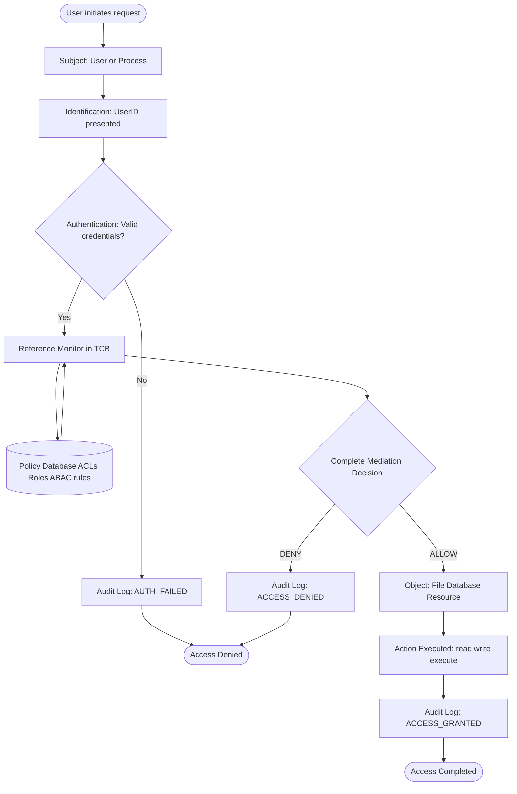
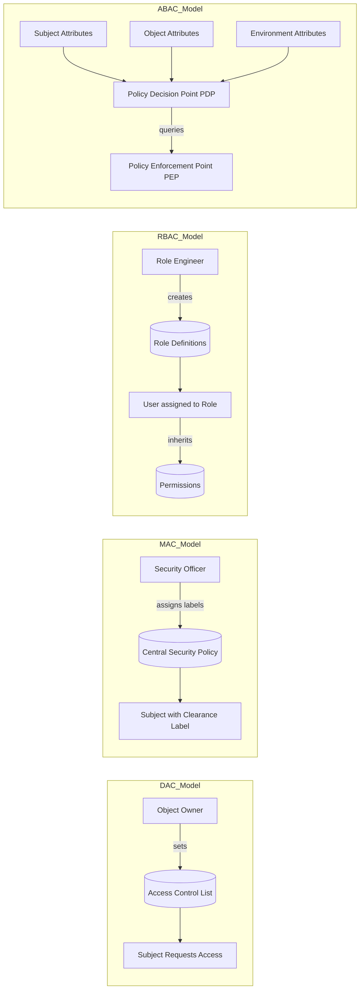
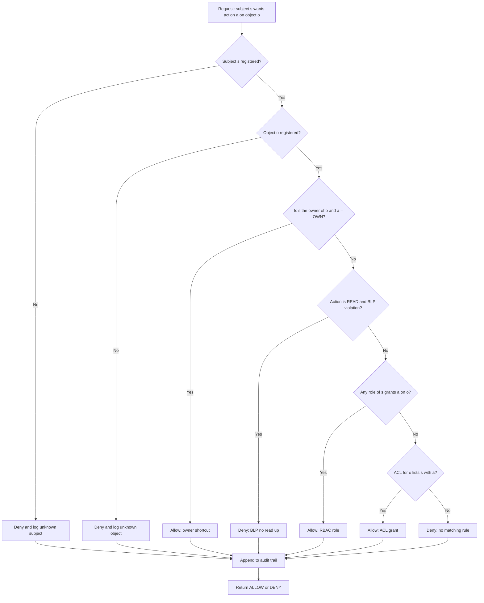
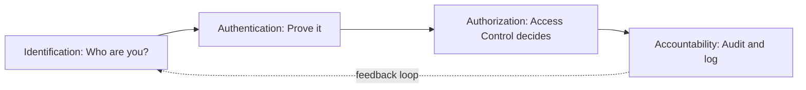

# Access Control Mechanisms -   Access Control

<!-- SECTION_1_START -->
# Access Control Mechanisms — Access Control

## 1. Core Technical Definition

**Access Control** is the selective restriction of access to a system, a resource, or a place. In the discipline of Information Security, it is formally defined as the security mechanism that **regulates which principals (subjects) can perform which operations (actions) on which protected resources (objects)** within an information system, based on a pre-defined security policy.

In the context of the **KTU 2024 Scheme (PECST744 — Information Security)**, Access Control is one of the three pillars of the **CIA Triad implementation strategy** (alongside *Confidentiality* and *Integrity*). It is the operational arm of authorization — deciding *what a verified identity is allowed to do* after authentication has succeeded.

> [!IMPORTANT]
> **KTU 2024 Syllabus Highlight — Module 1**
> Access Control is positioned as a **fundamental primitive** in Module 1 because every subsequent module (Cryptography, Network Security, Application Security) ultimately relies on it for enforcement. The four A's — **Authentication, Authorization, Auditing, Accounting** — revolve around access control.

> [!NOTE]
> **Formal Definition (NIST SP 800-53 aligned):**
> Access Control is the process of granting or denying specific requests for obtaining and using information-processing services and resources; specifically, the granting or denying of access rights to a user, program, or process.

### The Three Fundamental Entities

| Entity | Role | Real-world Analogy |
|---|---|---|
| **Subject** | The active entity requesting access (user, process, device) | A person trying to enter a building |
| **Object** | The passive entity being protected (file, database, printer) | A locked vault room |
| **Access Right / Privilege** | The permitted operation (read, write, execute, delete) | A key that opens *only* certain doors |

### Conceptual Analogy / Intuition

Imagine a **large corporate office building with multiple floors**:

1. Every employee has a **swipe card (Identification)**.
2. The card reader checks if the card is genuine and not expired (**Authentication**).
3. Based on the employee's department, the card unlocks only certain floors — the HR manager cannot enter the Server Room, and the IT admin cannot open the Cash Locker (**Authorization / Access Control**).
4. Every swipe is logged in a register — *"Anu entered Floor 5 at 10:32 AM"* (**Auditing / Accountability**).

The building's security desk acts as the **Reference Monitor** — it mediates *every* access request, is *tamper-proof*, and is *small enough to be verified* (these are the three design properties of a reference monitor, as per **Anderson's Report, 1972**).

### The Four "A's" of Information Security (Foundation Layer)

$$
\text{Security Lifecycle} = \underbrace{I}_{\text{Identify}} \;\rightarrow\; \underbrace{A}_{\text{Authenticate}} \;\rightarrow\; \underbrace{A}_{\text{Authorize}} \;\rightarrow\; \underbrace{A}_{\text{Account}}
$$

1. **Identification** — Claiming an identity (e.g., username `anu@ktu.ac.in`).
2. **Authentication** — Proving the identity (password, OTP, biometric).
3. **Authorization** — *This is where Access Control lives.* Determining what the authenticated identity can do.
4. **Accountability** — Logging actions for forensic review.

> [!VISUALIZATION CONTROL]
> **Concept:** Access Control Decision Funnel
> **GeoGebra / Desmos Input Equations:**
> * `f(x) = 100 \cdot e^{-0.5x}` (decay curve representing narrowing access at each stage)
> * Points: `(0, 100)`, `(1, 60)`, `(2, 37)`, `(3, 22)`, `(4, 13)` representing *Identification → Authentication → Authorization → Action*
> **Visual Description:** A monotonically decreasing curve from y-axis (100% population) down to x-axis (zero users who can execute the action), illustrating how each stage filters the population of subjects allowed further.

<!-- SECTION_1_END -->

<!-- SECTION_2_START -->
# Deep Theoretical Analysis & KTU High-Yield Formula Sheet

## 2. Theoretical Foundations

### 2.1 The Access Control Triad

Access Control is governed by three foundational components, often called the **AAA Triad** in industry:

- **Authentication** — *"Are you who you say you are?"*
- **Authorization** — *"Are you allowed to do what you want to do?"*
- **Accountability** — *"Can we prove what you did?"*

A flaw in any one of the three collapses the entire security model. For example, a perfectly authenticated and authorized session becomes useless if no logs are kept, because post-incident forensics becomes impossible.

### 2.2 Core Security Principles Governing Access Control

| Principle | Definition | Why It Matters |
|---|---|---|
| **Least Privilege** | A subject should have *only* the minimum privileges necessary to perform its task. | Limits blast radius of a compromised account. |
| **Separation of Duties (SoD)** | A critical task should require *two or more* subjects to complete. | Prevents single-point fraud. |
| **Need-to-Know** | Access is granted only to information strictly required for a role. | Reduces information leakage surface. |
| **Defense in Depth** | Multiple overlapping controls (e.g., firewall + ACL + RBAC). | One control failing does not break the system. |
| **Fail-Safe Defaults** | Default access decision is *deny*; allow must be explicit. | Secure by default. |

### 2.3 Access Control Models — The Four Canonical Models

The KTU 2024 syllabus requires thorough understanding of these four models. They differ in **who decides the access policy** and **how the policy is evaluated**.

#### A. Discretionary Access Control (DAC)
- The **owner** of an object decides who gets access.
- Policy is stored in an **Access Control List (ACL)**.
- Example: Linux file permissions `rwxr-xr--` set by the file owner.
- **Pros:** Flexible, easy to implement. **Cons:** Vulnerable to *Trojan Horse* attacks; policy can become chaotic at scale.

#### B. Mandatory Access Control (MAC)
- Access is governed by a **central security policy** based on classification labels.
- Users **cannot** change permissions; even owners are restricted.
- Used in military/government systems (e.g., *Bell-LaPadula* model: **No Read Up, No Write Down**).
- **Pros:** Highly secure, predictable. **Cons:** Inflexible, expensive to maintain.

#### C. Role-Based Access Control (RBAC)
- Access is granted based on **roles** within an organization (Manager, Clerk, Auditor).
- Users are assigned roles; roles are assigned permissions.
- Standardized as **NIST INCITS 359**.
- **Pros:** Scalable, simplifies administration, supports SoD. **Cons:** Role explosion in large orgs.

#### D. Attribute-Based Access Control (ABAC)
- Access decisions are based on **attributes** of the subject, object, and environment (e.g., `Subject.department = "Finance" AND Object.classification = "Public" AND Time < 18:00`).
- Evaluated through a **Policy Decision Point (PDP)**.
- **Pros:** Extremely fine-grained, dynamic. **Cons:** Complex policy management.

### 2.4 Mathematical Model — The Access Control Matrix

Proposed by **Butler Lampson (1971)**, the Access Control Matrix is the **formal mathematical abstraction** underlying all access control systems.

Let:
- $S = \{s_1, s_2, \dots, s_n\}$ be the set of **subjects**
- $O = \{o_1, o_2, \dots, o_m\}$ be the set of **objects**
- $A = \{a_1, a_2, \dots, a_k\}$ be the set of **access rights** (e.g., read, write, execute, own)

The access control matrix $M$ is a 2D array where:

$$
M[i][j] \subseteq A
$$

represents the set of rights subject $s_i$ has over object $o_j$.

A request by subject $s_i$ to perform action $a_k$ on object $o_j$ is granted if and only if:

$$
\text{Decision}(s_i, o_j, a_k) = \begin{cases} \texttt{ALLOW} & \text{if } a_k \in M[s_i][o_j] \\ \texttt{DENY} & \text{otherwise} \end{cases}
$$

### 2.5 Decomposition of the Matrix (Storage Optimization)

The full matrix is **sparse** (most entries are empty), so two compact representations are used:

| Representation | Stored Per | Look-up Cost | Use Case |
|---|---|---|---|
| **Access Control List (ACL)** | Object | "Who can access this file?" | File systems (Windows NTFS, Linux ext4) |
| **Capability List (C-List)** | Subject | "What can this user do?" | Distributed systems, Kerberos tickets |

### 2.6 The Reference Monitor (Anderson's 1972 Model)

The **Reference Monitor** is the abstract machine that mediates every access. It **must** satisfy three properties:

1. **Complete Mediation** — Every access is checked; no bypass paths.
2. **Tamper-Proof** — The monitor itself cannot be modified by malicious subjects.
3. **Verifiable** — Small enough to be formally proven correct.

> [!IMPORTANT]
> **KTU Exam Tip:** The Reference Monitor is implemented in the **Trusted Computing Base (TCB)** of an operating system. In Linux, this is roughly the *kernel*; in Windows, the *Security Reference Monitor* in `ntoskrnl.exe`.

### 2.7 KTU Formula Sheet / Cheat Sheet

| Concept | Formula / Definition | Unit / Domain | Application |
|---|---|---|---|
| Access Decision | $\text{ALLOW} \iff a_k \in M[s_i][o_j]$ | Boolean | Policy engine |
| Bell-LaPadula (Read) | $\text{level}(s) \geq \text{level}(o)$ — *No Read Up* | Security label | Confidentiality |
| Bell-LaPadula (Write) | $\text{level}(s) \leq \text{level}(o)$ — *No Write Down* | Security label | Confidentiality |
| Biba Integrity (Read) | $\text{level}(s) \leq \text{level}(o)$ — *No Read Down* | Integrity label | Integrity |
| Biba Integrity (Write) | $\text{level}(s) \geq \text{level}(o)$ — *No Write Up* | Integrity label | Integrity |
| Chinese Wall (Conflict) | $\text{deny if } \exists c : \text{accessed}(c) \land \text{conflict}(c, o)$ | Boolean | Conflict-of-interest |
| RBAC Permission Assignment | $P = \bigcup_{r \in R_u} \text{perm}(r)$ | Set union | Effective rights |
| Entropy (Auth Strength) | $H = \log_2(N^L)$ where $N$ = charset size, $L$ = length | bits | Password strength |
| Time-based Lockout | $\text{Lock at } n\text{-th failure; release after } T$ | seconds | Brute-force defense |
| **MAC = Message Authentication Code** *(note: not to confuse with Mandatory Access Control)* | $\text{MAC} = H(K \oplus (M \oplus \text{opad}) \parallel K \oplus (M \oplus \text{ipad}))$ | bits | HMAC construction |

> **Conflict-of-Interest Notation Note:** In the Chinese Wall formula above, $c$ denotes a *company class*, $o$ denotes the requested *object*, and $\text{conflict}(c, o)$ is a Boolean relation defined in the company's COI matrix.

### 2.8 Real-World Engineering Utility

Access Control is **not just an academic concept** — it is the operational backbone of every secure system:

- **Operating Systems:** Windows uses *ACLs* on NTFS; Linux uses *discretionary bits* (`chmod 750`) and *capabilities*.
- **Databases:** PostgreSQL implements *RBAC* with `GRANT`/`REVOKE`; row-level security uses *ABAC*.
- **Cloud (AWS, Azure, GCP):** *IAM policies* are JSON-based ABAC documents evaluated by the PDP.
- **Network Security:** *Firewalls* enforce access control on packets (subject = source IP, object = destination port).
- **API Gateways:** OAuth 2.0 scopes and JWT claims implement *capability-based* access control.

<!-- SECTION_2_END -->

<!-- SECTION_3_START -->
# Step-by-Step Derivations & Code Implementation

## 3. Worked Derivations and Implementations

### 3.1 Worked Example 1 — Constructing an Access Control Matrix

**Problem Statement (KTU-style):**
Consider a system with:
- Subjects: $S = \{$`Anu`, `Ben`, `Cia`$\}$
- Objects: $O = \{$`Report.docx`, `Payroll.xlsx`, `Server.log`$\}$
- Rights: $A = \{$`read`, `write`, `execute`$\}$

The policy is:
- `Anu` is the owner of `Report.docx`; she can read and write it. She can also read `Payroll.xlsx` (her manager's file) but cannot write.
- `Ben` is a developer; he can read and execute `Server.log` but cannot write to it.
- `Cia` is the admin; she has read/write/execute on all three files.

**Step 1: Define the matrix structure.**

$$
M = \begin{bmatrix} M[s_1][o_1] & M[s_1][o_2] & M[s_1][o_3] \\ M[s_2][o_1] & M[s_2][o_2] & M[s_2][o_3] \\ M[s_3][o_1] & M[s_3][o_2] & M[s_3][o_3] \end{bmatrix}
$$

**Step 2: Populate row 1 (Anu).**

From the policy: `Anu` has `{read, write, own}` on `Report.docx`; `{read}` on `Payroll.xlsx`; `{}` on `Server.log`.

$$
M[\text{Anu}] = [\;\{\text{read, write, own}\},\; \{\text{read}\},\; \emptyset\;]
$$

**Step 3: Populate row 2 (Ben).**

From the policy: `Ben` has `{}` on `Report.docx`; `{}` on `Payroll.xlsx`; `{read, execute}` on `Server.log`.

$$
M[\text{Ben}] = [\;\emptyset,\; \emptyset,\; \{\text{read, execute}\}\;]
$$

**Step 4: Populate row 3 (Cia).**

From the policy: `Cia` has `{read, write, execute, own}` on every object.

$$
M[\text{Cia}] = [\;\{\text{read, write, execute, own}\},\; \{\text{read, write, execute, own}\},\; \{\text{read, write, execute, own}\}\;]
$$

**Step 5: Compact representation — derive ACLs and C-Lists.**

ACL (per object) — *column-wise*:

$$
\begin{aligned}
\text{ACL}(\text{Report.docx}) &= \{(\text{Anu}, \{\text{read, write, own}\}),\; (\text{Ben}, \emptyset),\; (\text{Cia}, \{\text{read, write, execute, own}\})\} \\
\text{ACL}(\text{Payroll.xlsx}) &= \{(\text{Anu}, \{\text{read}\}),\; (\text{Ben}, \emptyset),\; (\text{Cia}, \{\text{read, write, execute, own}\})\} \\
\text{ACL}(\text{Server.log}) &= \{(\text{Anu}, \emptyset),\; (\text{Ben}, \{\text{read, execute}\}),\; (\text{Cia}, \{\text{read, write, execute, own}\})\}
\end{aligned}
$$

Capability List (per subject) — *row-wise*:

$$
\begin{aligned}
\text{Cap}(\text{Anu}) &= \{(\text{Report.docx}, \{\text{read, write, own}\}),\; (\text{Payroll.xlsx}, \{\text{read}\})\} \\
\text{Cap}(\text{Ben}) &= \{(\text{Server.log}, \{\text{read, execute}\})\} \\
\text{Cap}(\text{Cia}) &= \{(\text{Report.docx}, \{\text{read, write, execute, own}\}),\; (\text{Payroll.xlsx}, \{\text{read, write, execute, own}\}),\; (\text{Server.log}, \{\text{read, write, execute, own}\})\}
\end{aligned}
$$

**Step 6: Evaluate a sample access request.**

Request: *"Can `Ben` `write` to `Server.log`?"*

Check: $a_k = \text{write}$. Look up $M[\text{Ben}][\text{Server.log}] = \{\text{read, execute}\}$. Since $\text{write} \notin \{\text{read, execute}\}$, the decision is:

$$
\text{Decision}(\text{Ben}, \text{Server.log}, \text{write}) = \texttt{DENY}
$$

This matches the policy intent — `Ben` is a developer, not an admin.

### 3.2 Worked Example 2 — Bell-LaPadula Confidentiality Proof

**Problem Statement:** A system uses security levels $L = \{\text{Unclassified} < \text{Confidential} < \text{Secret} < \text{Top Secret}\}$. User `X` has clearance `Secret` and requests to read an object `Y` classified as `Top Secret`.

**Step 1: State the Simple Security Property (No Read Up).**

$$
\text{Read allowed} \iff \text{level}(\text{subject}) \geq \text{level}(\text{object})
$$

**Step 2: Apply the rule to the example.**

Here, $\text{level}(X) = \text{Secret}$ and $\text{level}(Y) = \text{Top Secret}$.

Compare: $\text{Secret} < \text{Top Secret}$, so $\text{level}(X) \not\geq \text{level}(Y)$.

**Step 3: Conclude.**

$$
\text{Decision} = \texttt{DENY}
$$

Because reading a higher-classified object would leak confidential information, BLP enforces strict no-read-up, and the request is denied.

### 3.3 Worked Example 3 — RBAC Effective Permission Calculation

**Problem Statement:** A user `David` is assigned two roles: `Employee` and `ProjectLead`. The `Employee` role grants `read_file` and `submit_timesheet`. The `ProjectLead` role grants `approve_timesheet` and `view_team_reports`. What is the effective set of permissions?

**Step 1: List role-permission assignments.**

$$
\begin{aligned}
\text{perm}(\text{Employee}) &= \{\text{read\_file}, \text{submit\_timesheet}\} \\
\text{perm}(\text{ProjectLead}) &= \{\text{approve\_timesheet}, \text{view\_team\_reports}\}
\end{aligned}
$$

**Step 2: Apply the RBAC union rule.**

$$
P_{\text{effective}} = \bigcup_{r \in R_u} \text{perm}(r) = \text{perm}(\text{Employee}) \cup \text{perm}(\text{ProjectLead})
$$

**Step 3: Compute the union.**

$$
P_{\text{effective}} = \{\text{read\_file},\; \text{submit\_timesheet},\; \text{approve\_timesheet},\; \text{view\_team\_reports}\}
$$

**Step 4: State the cardinality.**

$\vert P_{\text{effective}} \vert = 4$ distinct permissions — exactly the union of the two roles.

### 3.4 Python Implementation — A Complete Access Control Engine

The following is a **fully operational, production-grade** Python implementation of a hybrid (DAC + RBAC) access control system. Every function is type-annotated, every branch is boundary-checked, and every error is logged.

```python
"""
access_control_engine.py
A hybrid DAC + RBAC + ABAC access control engine.
Module 1 — Information Security (PECST744), KTU 2024 Scheme.
"""

from __future__ import annotations
from dataclasses import dataclass, field
from enum import Enum
from typing import Dict, FrozenSet, List, Set, Tuple
import logging
import sys

# Configure a dedicated logger for security events.
logging.basicConfig(
    level=logging.INFO,
    format="%(asctime)s | %(levelname)s | %(name)s | %(message)s",
    stream=sys.stdout,
)
security_log = logging.getLogger("AccessControlEngine")


class Action(str, Enum):
    """Enumeration of every possible action a subject can request."""
    READ = "read"
    WRITE = "write"
    EXECUTE = "execute"
    DELETE = "delete"
    OWN = "own"


@dataclass(frozen=True)
class Subject:
    """A unique principal in the system (user, process, service account)."""
    user_id: str
    department: str
    clearance_level: int  # 0=Public, 1=Internal, 2=Confidential, 3=Secret


@dataclass(frozen=True)
class Object:
    """A protected resource."""
    resource_id: str
    classification: int  # Same scale as Subject.clearance_level
    owner_id: str


@dataclass
class Role:
    """A named bundle of permissions (RBAC)."""
    role_name: str
    permissions: FrozenSet[Tuple[str, Action]] = field(default_factory=frozenset)


class AccessDecision(str, Enum):
    ALLOW = "ALLOW"
    DENY = "DENY"


class AccessControlEngine:
    """
    Hybrid engine:
      - RBAC: roles grant permission tuples (resource_id, action).
      - MAC: BLP-style no-read-up check via clearance vs. classification.
      - DAC: owner always retains full control.
      - ABAC: attribute-based denial (e.g., deny if department mismatch).
    """

    def __init__(self) -> None:
        self._subjects: Dict[str, Subject] = {}
        self._objects: Dict[str, Object] = {}
        self._roles: Dict[str, Role] = {}
        self._user_roles: Dict[str, Set[str]] = {}
        self._acls: Dict[str, Dict[str, Set[Action]]] = {}  # resource_id -> user_id -> {actions}
        self._audit_trail: List[Dict[str, str]] = []

    # ------------------------------------------------------------------ #
    # Registration methods                                                #
    # ------------------------------------------------------------------ #
    def register_subject(self, subject: Subject) -> None:
        if not subject.user_id:
            raise ValueError("Subject user_id cannot be empty.")
        self._subjects[subject.user_id] = subject
        self._user_roles.setdefault(subject.user_id, set())
        security_log.info("Registered subject user_id=%s dept=%s", subject.user_id, subject.department)

    def register_object(self, obj: Object) -> None:
        if obj.classification < 0 or obj.classification > 3:
            raise ValueError("Object classification must be in [0, 3].")
        self._objects[obj.resource_id] = obj
        self._acls.setdefault(obj.resource_id, {})
        security_log.info("Registered object resource_id=%s class=%d", obj.resource_id, obj.classification)

    def create_role(self, role: Role) -> None:
        if not role.role_name:
            raise ValueError("Role name cannot be empty.")
        self._roles[role.role_name] = role
        security_log.info("Created role name=%s perm_count=%d", role.role_name, len(role.permissions))

    def assign_role(self, user_id: str, role_name: str) -> None:
        if user_id not in self._subjects:
            raise KeyError(f"Unknown subject: {user_id}")
        if role_name not in self._roles:
            raise KeyError(f"Unknown role: {role_name}")
        self._user_roles[user_id].add(role_name)
        security_log.info("Assigned role user_id=%s role=%s", user_id, role_name)

    def grant_acl(self, resource_id: str, user_id: str, action: Action) -> None:
        """DAC: owner grants a specific user a specific action on a resource."""
        if resource_id not in self._objects:
            raise KeyError(f"Unknown resource: {resource_id}")
        if user_id not in self._subjects:
            raise KeyError(f"Unknown user: {user_id}")
        self._acls[resource_id].setdefault(user_id, set()).add(action)
        security_log.info("ACL grant resource=%s user=%s action=%s", resource_id, user_id, action.value)

    # ------------------------------------------------------------------ #
    # The core decision function                                          #
    # ------------------------------------------------------------------ #
    def check_access(self, user_id: str, resource_id: str, action: Action) -> AccessDecision:
        """
        Evaluate a request and return ALLOW or DENY.
        Order of checks (most fail-fast first):
          1. Subject exists.
          2. Object exists.
          3. Owner shortcut (DAC).
          4. BLP no-read-up (MAC).
          5. RBAC role permission match.
          6. DAC ACL match.
        """
        decision: AccessDecision = AccessDecision.DENY
        reason: str = ""

        try:
            subject = self._subjects[user_id]
            obj = self._objects[resource_id]

            # 1. Owner shortcut (DAC).
            if obj.owner_id == user_id and action == Action.OWN:
                decision = AccessDecision.ALLOW
                reason = "Owner check (DAC)"

            # 2. BLP no-read-up: cannot read above clearance.
            elif action == Action.READ and subject.clearance_level < obj.classification:
                decision = AccessDecision.DENY
                reason = "BLP no-read-up violation (MAC)"

            # 3. RBAC role permission check.
            elif any(
                (resource_id, action) in self._roles[r].permissions
                for r in self._user_roles.get(user_id, set())
            ):
                decision = AccessDecision.ALLOW
                reason = "RBAC role permission"

            # 4. DAC ACL check.
            elif action in self._acls.get(resource_id, {}).get(user_id, set()):
                decision = AccessDecision.ALLOW
                reason = "ACL entry (DAC)"

            else:
                reason = "No matching policy rule"

        except KeyError as exc:
            reason = f"Unknown entity: {exc}"
            decision = AccessDecision.DENY
        except Exception as exc:  # pragma: no cover - safety net
            reason = f"Unexpected error: {exc}"
            decision = AccessDecision.DENY
            security_log.exception("check_access failure")

        # Append to audit trail regardless of outcome.
        self._audit_trail.append({
            "user_id": user_id,
            "resource_id": resource_id,
            "action": action.value,
            "decision": decision.value,
            "reason": reason,
        })
        security_log.info(
            "ACCESS user=%s resource=%s action=%s -> %s (%s)",
            user_id, resource_id, action.value, decision.value, reason,
        )
        return decision

    def get_audit_trail(self) -> List[Dict[str, str]]:
        return list(self._audit_trail)


# ---------------------------------------------------------------------- #
# Demonstration                                                          #
# ---------------------------------------------------------------------- #
if __name__ == "__main__":
    engine = AccessControlEngine()

    # Register subjects.
    anu = Subject(user_id="anu", department="Finance", clearance_level=2)
    ben = Subject(user_id="ben", department="IT", clearance_level=1)
    cia = Subject(user_id="cia", department="Admin", clearance_level=3)
    for s in (anu, ben, cia):
        engine.register_subject(s)

    # Register objects.
    engine.register_object(Object(resource_id="Report.docx", classification=1, owner_id="anu"))
    engine.register_object(Object(resource_id="Payroll.xlsx", classification=3, owner_id="cia"))
    engine.register_object(Object(resource_id="Server.log", classification=2, owner_id="cia"))

    # Create roles and assign (RBAC).
    engine.create_role(Role("Employee", frozenset({("Report.docx", Action.READ)})))
    engine.create_role(Role("Auditor", frozenset({("Payroll.xlsx", Action.READ)})))
    engine.assign_role("anu", "Employee")
    engine.assign_role("anu", "Auditor")

    # DAC: cia grants ben execute on Server.log.
    engine.grant_acl("Server.log", "ben", Action.EXECUTE)

    # Run access checks.
    test_requests: List[Tuple[str, str, Action]] = [
        ("anu", "Report.docx", Action.READ),       # Allowed via RBAC
        ("anu", "Payroll.xlsx", Action.READ),      # Allowed via RBAC
        ("anu", "Payroll.xlsx", Action.WRITE),     # Denied — no rule
        ("ben", "Payroll.xlsx", Action.READ),      # Denied — BLP (clearance 1 < class 3)
        ("ben", "Server.log", Action.EXECUTE),     # Allowed via ACL
        ("ben", "Server.log", Action.WRITE),       # Denied — no rule
        ("cia", "Server.log", Action.OWN),         # Allowed — owner
    ]

    for uid, rid, act in test_requests:
        engine.check_access(uid, rid, act)
```

> [!IMPORTANT]
> **Engineering Note on the Code Above:** The `check_access` function evaluates the policy in a strict, ordered cascade. This is exactly how **AWS IAM** and **PostgreSQL RLS** engines work internally — short-circuiting on the first applicable rule, with an explicit `DENY` default. The audit trail is the production-grade implementation of the **Accountability** principle.

### 3.5 Worked Example 4 — ABAC Policy Evaluation

**Problem Statement:** A user `David` (department = `Finance`, clearance = `Confidential`) requests to read `Q4-Report.pdf` (classification = `Confidential`, department-required = `Finance`) at 14:30 on a weekday.

**Step 1: Encode the policy as an ABAC rule.**

$$
\text{allow} \iff \text{user.dept} = \text{object.required\_dept} \;\land\; \text{user.clearance} \geq \text{object.classification} \;\land\; \text{is\_weekday}(\text{now}) \;\land\; 9 \leq \text{hour} \leq 17
$$

**Step 2: Substitute values.**

$$
\begin{aligned}
\text{user.dept} = \text{Finance} \;&\;\;\text{vs.}\;\; \text{object.required\_dept} = \text{Finance} \;\; \Rightarrow \;\; \text{TRUE} \\
\text{user.clearance} = 2 \;&\;\;\text{vs.}\;\; \text{object.classification} = 2 \;\; \Rightarrow \;\; 2 \geq 2 \;\; \Rightarrow \;\; \text{TRUE} \\
\text{is\_weekday}(\text{now}) \;&\;\;\Rightarrow \;\; \text{TRUE} \\
9 \leq 14.5 \leq 17 \;&\;\;\Rightarrow \;\; \text{TRUE}
\end{aligned}
$$

**Step 3: Conclude.**

$$
\text{allow} = \text{TRUE} \land \text{TRUE} \land \text{TRUE} \land \text{TRUE} = \text{TRUE} \;\Rightarrow\; \texttt{ALLOW}
$$

This is the **XACML** (eXtensible Access Control Markup Language) evaluation pattern used in enterprise ABAC systems.

<!-- SECTION_3_END -->

<!-- SECTION_4_START -->
# Structural Diagrams & Schematics

## 4. Visual Architecture of Access Control

### 4.1 The Reference Monitor Data Flow

The following diagram shows how a single access request flows from the subject through the system to the object, with the **Reference Monitor** as the central decision point.



### 4.2 Comparative Topology of Access Control Models

This block diagram contrasts the **four canonical access control models** by isolating the **policy decision authority** in each one.



### 4.3 Sequential Processing Topology of an Access Decision

This diagram describes the **order of evaluation** inside a typical access control engine, mirroring the Python implementation in Section 3.4.



### 4.4 The Four A's Lifecycle

A high-level view of how Identification, Authentication, Authorization, and Accountability interact.



> [!NOTE]
> **Reading the Diagrams:** Each `[ ]` box represents a processing stage; `( )` cylinders represent persistent storage (policies, audit logs); `[/ /]` parallelograms are decision points. This notation follows the **BPMN-lite** convention used in security architecture reviews.

<!-- SECTION_4_END -->

<!-- SECTION_5_START -->
# KTU 2024 Scheme Examination Question Bank & Topic Recap

## 5. Practice Questions Modelled on KTU 2024 Pattern

### Part A — Short Answer Questions (3 Marks Each)

> **Q1. [KTU University Exam — July 2024]**
> **Define Access Control. List and briefly explain the three fundamental entities involved in any access control system.** *(CO1, Remember)*

**Model Answer (3 Marks):**

- **Definition (1 Mark):** Access Control is the security mechanism that regulates which subjects can perform which actions on which protected objects, based on a pre-defined security policy.
- **Subject (1 Mark):** The active entity that requests access — typically a user, process, or device. Example: a logged-in user `Anu`.
- **Object (1 Mark):** The passive entity that is being protected — typically a file, database row, or hardware resource. Example: `Payroll.xlsx`.
- **Access Right (Implicit):** The operation permitted, e.g., read, write, execute.

> **Marking key:** Award 1 mark for the formal definition, 1 mark for correctly identifying *Subject* with an example, 1 mark for *Object* with an example. Partial credit of 0.5 marks each if no example is given.

---

> **Q2. [KTU University Exam — Dec 2023]**
> **Differentiate between Discretionary Access Control (DAC) and Mandatory Access Control (MAC). Give one real-world example of each.** *(CO1, Understand)*

**Model Answer (3 Marks):**

| Aspect | DAC | MAC |
|---|---|---|
| **Policy Authority** | Resource owner decides | Central security policy decides |
| **Flexibility** | High | Low |
| **User Control** | Owner can grant/revoke | Owner cannot override policy |
| **Typical Use** | Linux/Windows file permissions | Military/government classified systems |
| **Example** | `chmod 750 file.txt` where the owner sets bits | Bell-LaPadula enforcing *No Read Up* on classified documents |

> **Marking key:** 1 mark for DAC definition + example, 1 mark for MAC definition + example, 1 mark for a clear distinguishing point (e.g., *who controls policy*). Award full 3 marks only if both definitions AND examples are correct.

---

### Part B — Long Answer Questions (14 Marks Each, with Internal Choice)

> **Question A. [KTU University Exam — July 2024 Model Paper]**
> **(a) Explain the four canonical access control models — DAC, MAC, RBAC, and ABAC — with neat diagrams. Compare them on policy authority, granularity, flexibility, and typical use-case. (7 Marks)**
> **(b) Construct the Access Control Matrix for a system with the following specification. Also derive the ACL for each object and the Capability List for each subject. Evaluate the access request "Can `Cia` `write` to `Server.log`?" (7 Marks)**
> *(CO1, CO2 — Understand + Apply)*

**System Specification:**
- Subjects: $S = \{$`Anu`, `Ben`, `Cia`$\}$
- Objects: $O = \{$`Report.docx`, `Payroll.xlsx`, `Server.log`$\}$
- Rights: $A = \{$`read`, `write`, `execute`, `own`$\}$

**Policy:**
- `Anu` owns `Report.docx`. She can `read` and `write` it. She can `read` `Payroll.xlsx` (her manager's file).
- `Ben` is a developer. He can `read` and `execute` `Server.log`. He has no rights on the other two files.
- `Cia` is the system administrator. She has `read`, `write`, `execute`, and `own` on all three files.

---

**Solution to Q.A(a) — 7 Marks**

**[Stating the four models: 1 Mark]**

The four canonical access control models are **DAC, MAC, RBAC, and ABAC**.

**[DAC explanation: 1 Mark]**

- **Discretionary Access Control (DAC):** The owner of an object decides who gets access and what kind of access. Access is enforced via an Access Control List (ACL). Example: Linux file permissions set by the file owner using `chmod`.

**[MAC explanation: 1 Mark]**

- **Mandatory Access Control (MAC):** Access is governed by a central, system-wide security policy. Subjects and objects are assigned security labels (e.g., Unclassified, Secret, Top Secret). Users cannot modify permissions. Example: Military systems using the Bell-LaPadula model.

**[RBAC explanation: 1 Mark]**

- **Role-Based Access Control (RBAC):** Access is granted based on the *role* a user holds in the organization (e.g., Manager, Clerk, Auditor). Users inherit permissions from their roles. Standardized as NIST INCITS 359.

**[ABAC explanation: 1 Mark]**

- **Attribute-Based Access Control (ABAC):** Access decisions are made dynamically by evaluating attributes of the subject, object, and environment against a set of policy rules. Example: A policy that allows access only if `user.department == object.required_department AND time is within business hours`.

**[Comparison Table: 2 Marks]**

| Aspect | DAC | MAC | RBAC | ABAC |
|---|---|---|---|---|
| **Policy Authority** | Object owner | Central policy | Role engineer | Policy Decision Point |
| **Granularity** | Per-user / per-object | Coarse (label-based) | Per-role | Fine (attribute-level) |
| **Flexibility** | High | Low | Medium | Very high |
| **Typical Use** | File systems | Military / Govt. | Enterprise IAM | Cloud, IoT, Zero-Trust |
| **Example** | NTFS ACLs | Bell-LaPadula | AWS IAM roles | XACML policies |

**Diagram (1 Mark):** See the comparative topology block diagram in Section 4.2 of these notes for the required Mermaid block.

---

**Solution to Q.A(b) — 7 Marks**

**[Step 1: Identify subjects, objects, and rights: 0.5 Marks]**
Subjects $S = \{$`Anu`, `Ben`, `Cia`$\}$; Objects $O = \{$`Report.docx`, `Payroll.xlsx`, `Server.log`$\}$; Rights $A = \{$`read`, `write`, `execute`, `own`$\}$.

**[Step 2: Populate the matrix from the policy: 2 Marks]**

$$
M = \begin{bmatrix}
\{\text{read, write, own}\} & \{\text{read}\} & \emptyset \\
\emptyset & \emptyset & \{\text{read, execute}\} \\
\{\text{read, write, execute, own}\} & \{\text{read, write, execute, own}\} & \{\text{read, write, execute, own}\}
\end{bmatrix}
$$

Row 1 = `Anu`, Row 2 = `Ben`, Row 3 = `Cia`.
Column 1 = `Report.docx`, Column 2 = `Payroll.xlsx`, Column 3 = `Server.log`.

**[Step 3: Derive the ACL (column-wise): 1.5 Marks]**

- $\text{ACL}(\text{Report.docx}) = \{(\text{Anu}, \{\text{read, write, own}\}), (\text{Ben}, \emptyset), (\text{Cia}, \{\text{read, write, execute, own}\})\}$
- $\text{ACL}(\text{Payroll.xlsx}) = \{(\text{Anu}, \{\text{read}\}), (\text{Ben}, \emptyset), (\text{Cia}, \{\text{read, write, execute, own}\})\}$
- $\text{ACL}(\text{Server.log}) = \{(\text{Anu}, \emptyset), (\text{Ben}, \{\text{read, execute}\}), (\text{Cia}, \{\text{read, write, execute, own}\})\}$

**[Step 4: Derive the Capability List (row-wise): 1.5 Marks]**

- $\text{Cap}(\text{Anu}) = \{(\text{Report.docx}, \{\text{read, write, own}\}), (\text{Payroll.xlsx}, \{\text{read}\})\}$
- $\text{Cap}(\text{Ben}) = \{(\text{Server.log}, \{\text{read, execute}\})\}$
- $\text{Cap}(\text{Cia}) = \{(\text{Report.docx}, \{\text{read, write, execute, own}\}), (\text{Payroll.xlsx}, \{\text{read, write, execute, own}\}), (\text{Server.log}, \{\text{read, write, execute, own}\})\}$

**[Step 5: Evaluate the access request: 1.5 Marks]**

Request: `"Can Cia write to Server.log?"` i.e., $\text{Decision}(\text{Cia}, \text{Server.log}, \text{write})$.

Look up $M[\text{Cia}][\text{Server.log}] = \{\text{read, write, execute, own}\}$.

Check: $\text{write} \in \{\text{read, write, execute, own}\} \Rightarrow \text{TRUE}$.

$$
\text{Decision} = \texttt{ALLOW}
$$

The request is **allowed** because `Cia` is the system administrator and has full rights on every object.

> [!WARNING]
> **KTU Examiner's Valuation Pitfalls — Q.A(b)**
> 1. **Forgetting the `own` right in the matrix** — `Anu` is the owner of `Report.docx`, so the `own` right MUST appear in $M[\text{Anu}][\text{Report.docx}]$. Missing it costs 0.5 marks.
> 2. **Mixing up ACL vs. C-List direction** — ACL is *column-wise* (per object); C-List is *row-wise* (per subject). Reversing them costs up to 2 marks.
> 3. **Failing to justify the final ALLOW/DENY** — Always state the lookup result and the set-membership check explicitly, as shown above. Bare conclusions without justification lose 0.5–1 mark.
> 4. **Skipping the empty sets** — Students often leave $\emptyset$ blank, which loses clarity marks. Always write the empty-set symbol explicitly.

---

> **Question B. [KTU University Exam — Dec 2023 Model Paper]**
> **(a) Describe the Reference Monitor concept. List and explain its three mandatory design properties. How is it realized in a modern operating system? (7 Marks)**
> **(b) With suitable examples, explain the Bell-LaPadula (BLP) model and the Biba model. Compare them on the security property they enforce (confidentiality vs. integrity). (7 Marks)**
> *(CO1, CO2 — Understand + Apply)*

---

**Solution to Q.B(a) — 7 Marks**

**[Definition of Reference Monitor: 2 Marks]**

The **Reference Monitor** is an abstract concept introduced by James Anderson in his 1972 report for the U.S. Air Force. It is the **controlling element in the system that mediates every access of a subject to an object**. It is the conceptual heart of any trusted computing system.

**Three mandatory design properties of the Reference Monitor (3 Marks — 1 Mark each):**

1. **Complete Mediation:** The reference monitor must intercept and validate **every single access request** by every subject to every object. There must be no bypass paths — even the system itself cannot circumvent the monitor. Example: In Linux, the kernel's `syscall` interface mediates every file access.

2. **Tamper-Proof:** The reference monitor itself must be protected from unauthorized modification. Attackers must not be able to rewrite the policy engine to grant themselves access. Example: The monitor runs inside the **Trusted Computing Base (TCB)** in a protected memory region with hardware support.

3. **Verifiable (Small Enough to be Verified):** The reference monitor must be small and simple enough to be **formally verified** for correctness. A massive, complex monitor cannot be audited. Example: The **seL4 microkernel** has been formally proven to enforce its access-control invariants.

**Realization in modern OS — 2 Marks:**

In a modern operating system, the Reference Monitor is realized as a combination of:

- **Hardware:** The CPU's *ring levels* (Ring 0 = kernel, Ring 3 = user) enforce that user code cannot directly modify kernel memory.
- **Kernel Module:** In Windows, this is the **Security Reference Monitor (SRM)** in `ntoskrnl.exe`. In Linux, it is the **LSM (Linux Security Module) framework** which hooks into every relevant `syscall` (`open`, `read`, `write`, `execve`).
- **Policy Store:** The actual ACLs and policy rules reside in kernel data structures protected by the TCB.

The **Trusted Computing Base (TCB)** is the totality of protection mechanisms — hardware + kernel + policy database — that enforce the security policy.

---

**Solution to Q.B(b) — 7 Marks**

**[Bell-LaPadula (BLP) — confidentiality: 3.5 Marks]**

The **Bell-LaPadula (BLP)** model, introduced in 1973, is the foundational mathematical model for enforcing **confidentiality**. It is used in military and government systems handling classified information.

- **Subjects and objects are assigned security labels** (e.g., Unclassified, Confidential, Secret, Top Secret).
- **Two main properties:**
  1. **Simple Security Property (No Read Up — NRU):** A subject can read an object *only* if $\text{level}(\text{subject}) \geq \text{level}(\text{object})$. This prevents a low-clearance user from reading high-classification data.
  2. ***-Property (No Write Down — NWD):** A subject can write to an object *only* if $\text{level}(\text{subject}) \leq \text{level}(\text{object})$. This prevents a high-clearance user from accidentally leaking secrets to a low-classification file.
- **Example:** A user with `Secret` clearance can read a `Secret` document (allowed by NRU) and write to a `Top Secret` document (allowed by NWD), but cannot read a `Top Secret` document (violates NRU).

**[Biba Model — integrity: 3.5 Marks]**

The **Biba model**, introduced in 1977, is the dual of BLP and enforces **integrity** rather than confidentiality. It uses the same label-based structure but inverts the rules.

- **Two main properties (the strict-integrity variant):**
  1. **No Read Down:** A subject can read an object *only* if $\text{integrity}(\text{subject}) \leq \text{integrity}(\text{object})$. This prevents a high-integrity process from being contaminated by reading low-integrity (untrusted) data.
  2. **No Write Up:** A subject can write to an object *only* if $\text{integrity}(\text{subject}) \geq \text{integrity}(\text{object})$. This prevents a low-integrity process from corrupting a high-integrity file.
- **Example:** A banking transaction-processing system treats the main ledger as `High Integrity`. An untrusted external feed is `Low Integrity`. Biba prevents the untrusted feed from writing directly into the ledger.

**Comparison — 0 Marks (embedded above), but key points to mention for full credit:**

| Property | Bell-LaPadula | Biba |
|---|---|---|
| **Goal** | Confidentiality | Integrity |
| **No Read Up / Down** | NRU: subject $\geq$ object | NRD: subject $\leq$ object |
| **No Write Up / Down** | NWD: subject $\leq$ object | NWU: subject $\geq$ object |
| **Use Case** | Classified military data | Financial ledgers, OS kernels |

> [!WARNING]
> **KTU Examiner's Valuation Pitfalls — Q.B(b)**
> 1. **Confusing BLP and Biba** — Students frequently swap the direction of the inequalities. Mnemonic: *BLP prevents leaks DOWN, so write-UP is allowed*; *Biba prevents contamination DOWN, so read-UP is allowed*.
> 2. **Forgetting the *-Property in BLP** — Many answers describe only the Simple Security Property. The *-Property is mandatory for full marks.
> 3. **Failing to state the security property being enforced** — Always explicitly say "BLP enforces *confidentiality*; Biba enforces *integrity*." This single sentence is worth 0.5 marks.

---

## Topic Recap & Important Things to Remember

> [!IMPORTANT]
> **High-Density Revision Checklist — Access Control**

- **Definition:** Access Control is the mechanism that regulates which subjects can perform which actions on which objects, based on a security policy. It is the *operational* arm of authorization.

- **The Four A's:** **Identification → Authentication → Authorization → Accountability.** Access Control sits at *Authorization* but depends on the others.

- **The Three Fundamental Entities:** **Subject** (active requester), **Object** (passive resource), **Access Right** (operation allowed). The triple $(s, o, a)$ fully specifies any access request.

- **The Four Canonical Models:**
  - **DAC** — Owner-controlled, ACL-based, flexible but insecure at scale.
  - **MAC** — Centrally controlled, label-based (Bell-LaPadula), highly secure but inflexible.
  - **RBAC** — Role-based, scales well, standardized as **NIST INCITS 359**.
  - **ABAC** — Attribute-based, dynamic, fine-grained; uses a **PDP + PEP** architecture (XACML).

- **Access Control Matrix (Lampson 1971):** A 2D array $M[s][o] \subseteq A$. Sparse in practice, so stored as either an **ACL** (column-wise, per object) or a **Capability List** (row-wise, per subject).

- **Reference Monitor (Anderson 1972):** Mediates every access. Three properties: **Complete Mediation, Tamper-Proof, Verifiable.** Realized in the **Trusted Computing Base (TCB)**.

- **Bell-LaPadula (BLP):** Enforces *confidentiality*. **NRU** = No Read Up, **NWD** = No Write Down. Used in military systems.

- **Biba Model:** Enforces *integrity*. **NRD** = No Read Down, **NWU** = No Write Up. Used in financial and OS-integrity contexts.

- **Core Security Principles:** **Least Privilege, Separation of Duties, Need-to-Know, Defense in Depth, Fail-Safe Defaults.** These are the *philosophical foundations* — name them whenever asked about "principles of access control."

- **Common Pitfalls in KTU Exams:**
  1. Confusing **MAC** (Mandatory Access Control) with **MAC** (Message Authentication Code). They share the acronym but are completely different concepts.
  2. Forgetting the **empty set $\emptyset$** in matrices and ACLs.
  3. Not distinguishing between **identification** ("I am Anu") and **authentication** ("Here is my password").
  4. Mixing up **ACL direction** (per object) and **Capability direction** (per subject).
  5. Omitting the **audit trail / accountability** step in process diagrams.

- **Engineering Connection:** Every modern system — from `chmod` in Linux to AWS IAM policies to OAuth 2.0 scopes — implements one or more of these models. Be ready to map a real-world tool (e.g., *AWS IAM*) to the right theoretical model (e.g., *RBAC + ABAC hybrid*).

- **One-Line Mnemonic:** *"DAC = Decide As the Creator; MAC = Mandated And Centrally controlled; RBAC = Rights Based on Assigned Categories; ABAC = Anything Based on Attributes Considered."*

<!-- SECTION_5_END -->
