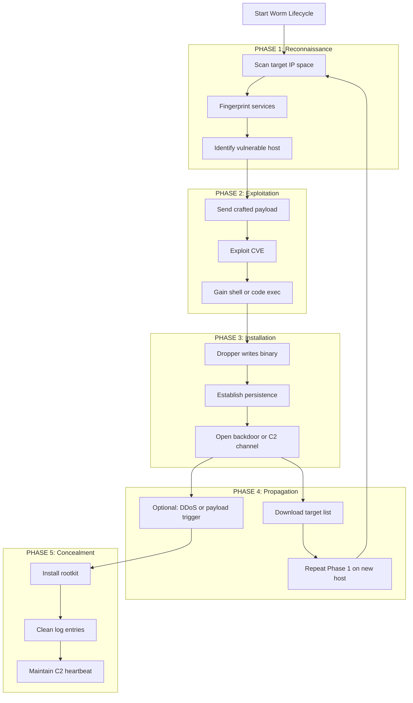
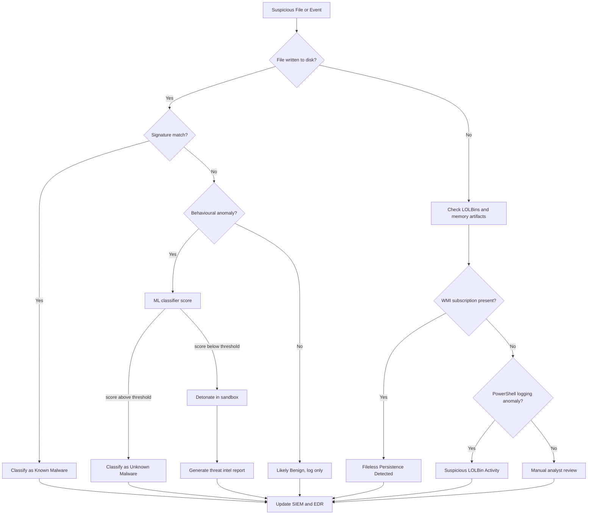
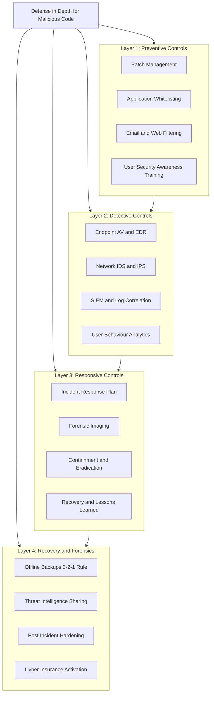

# Attacks- Malicious code

<!-- SECTION_1_START -->
# Attacks — Malicious Code

## 1.1 Formal Definition (KTU 2024 Syllabus Terminology)

> [!IMPORTANT]
> **Malicious Code (Malware)** is defined as any program, script, macro, or fragment of executable content intentionally designed to perform unauthorized, harmful, or disruptive actions against an information system, its data, or its users. It is the **payload-bearing arm** of the broader attack taxonomy in KTU Module 1, sitting alongside *passive* attacks (eavesdropping, traffic analysis) and *active* attacks (masquerade, replay, DoS).

In the **STRIDE** threat model used in KTU-aligned security curricula, malicious code primarily threatens:

$$
\text{STRIDE}_{\text{malware}} = \{ \text{Tampering},\ \text{Repudiation},\ \text{Information Disclosure},\ \text{DoS},\ \text{Elevation of Privilege} \}
$$

A more concise academic definition (per *Stallings, Cryptography and Network Security*):

> **Malware** is software that fulfills the deliberately harmful intent of an attacker when executed, typically violating at least one of the **CIA triad** properties (Confidentiality, Integrity, Availability).

## 1.2 Conceptual Analogy & Intuition

> [!NOTE]
> **Real-World Analogy — The Trojan Horse of Computing**
>
> Imagine a city that has a strict quarantine check-post. Every parcel entering is X-rayed for weapons. An attacker cannot smuggle in a sword openly. So they build a **beautiful wooden horse**, gift-wrap it as a tribute, and leave it at the gate. The city happily rolls it in. At night, **enemies hidden inside the horse emerge and attack**.
>
> This is exactly what a **Trojan** does — it arrives **disguised** as a legitimate, even useful, program (a game, a codec, a "free" antivirus). The user willingly *executes* it, bypassing every firewall and policy that would have blocked an overt attack. The hidden payload then opens backdoors, steals data, or destroys files.
>
> Similarly, a **virus** is like a biological virus: it is **not a free-living organism**, it must *attach* to a host file, and it *replicates* by piggybacking on the host. A **worm**, by contrast, is self-replicating and self-propagating — it does not need a host file or a user to click anything; it walks on its own across the network, much like an airborne pathogen.

> [!TIP]
> **Geometric Intuition for Signature-Based Detection**
>
> Think of a malware's byte sequence as a point in a high-dimensional space $\mathbb{R}^{n}$ (each axis is a byte value). A *signature* is a small hypersphere around the known-malicious point. Detection = *"Does the new sample's distance from the centroid of any known cluster fall below a threshold?"*

## 1.3 The Two-Axis Classification (Foundational Mental Model)

Every piece of malware in the KTU syllabus can be located on two axes:

| Axis | Pole A | Pole B |
|---|---|---|
| **Propagation** | *Needs a host* (Virus) | *Self-propagates* (Worm) |
| **Trigger** | *Logical condition* (Logic Bomb) | *No trigger* (always-on, e.g. spyware) |

This gives four broad families, plus hybrids like **Trojan-Worms** (self-propagating Trojans).

> [!IMPORTANT]
> **Syllabus Highlight — Attack vs. Attacker**
>
> In KTU Module 1 terminology, an **Attack** is the *act* of using malicious code. The *attacker* (or *threat agent*) is the entity behind it. The KTU exam frequently tests whether you can distinguish:
> - The **vulnerability** (the weakness, e.g. unpatched SMBv1)
> - The **threat** (the malicious code that exploits it)
> - The **risk** (likelihood $\times$ impact)

## 1.4 Physical Constants & Standard Metrics

The following are the **standardized quantitative metrics** that KTU expects every CS student to memorize for malicious-code questions:

> [!IMPORTANT]
> - **Base False-Positive Rate (FPR)**: $\text{FPR} = \dfrac{\text{FP}}{\text{FP} + \text{TN}}$ — acceptable industry target is $\mathbf{< 0.1\%}$ for AV scanners.
> - **Detection Rate (DR)**: $\text{DR} = \dfrac{\text{TP}}{\text{TP} + \text{FN}}$ — modern AV engines target $\mathbf{> 99.5\%}$.
> - **Mean Time to Detection (MTTD)**: industry benchmark (post-2018) is $\mathbf{< 24\ \text{hours}}$ for "dwell time."
> - **Time-to-Infect (TTI)**: for worms like Code Red, peak infection was reached in approximately $\mathbf{14\ \text{hours}}$.

## 1.5 Visualization Control

> [!VISUALIZATION CONTROL]
> **Concept:** Malware Classification as a Decision Tree on a 2-D Plane
> **GeoGebra / Desmos Input Equations:**
> * Vertical axis (Trigger): $y = 1$ for *Logical Trigger*, $y = 0$ for *No Trigger*
> * Horizontal axis (Propagation): $x = 1$ for *Self-Propagating*, $x = 0$ for *Host-Dependent*
> * Plot the four quadrants as filled rectangles: $(0,0)$ → *Virus-like*; $(1,0)$ → *Worm-like*; $(0,1)$ → *Logic Bomb-like*; $(1,1)$ → *Hybrid (Trojan-Worm)*
> **Visual Description:** The student should observe four disjoint rectangular regions in the first quadrant. Each region's centroid represents the archetype of a malware family. The closer a real sample plots to a centroid, the purer its classification; samples near the center are *blended* malware.

<!-- SECTION_1_END -->

<!-- SECTION_2_START -->
# Deep Theoretical Analysis & KTU High-Yield Formula Sheet

## 2.1 The KTU-Classified Taxonomy of Malicious Code

The KTU PECST744 syllabus recognises **eleven canonical families**. Each is described below with its **trigger mechanism**, **propagation vector**, **primary CIA violation**, and a real-world **archetype example**.

### 2.1.1 Virus
- **Definition (academic)**: A program that **replicates itself by inserting its code into other programs** (the *hosts*), thereby transforming them into *infected carriers*. Execution of the host triggers the viral code.
- **Trigger**: User execution of the host file.
- **Propagation**: File-system / boot-sector / macro.
- **CIA Violation**: Integrity + Availability.
- **Archetype**: *Creeper* (1971, the very first), *ILOVEYOU* (2000, VBScript over email).
- **KTU sub-types (must be memorised)**:
  - *File infector* (COM/EXE)
  - *Boot-sector virus* (MBR)
  - *Macro virus* (Office VBA)
  - *Polymorphic / Metamorphic virus* (mutates on every infection)
  - *Stealth virus* (hides file-size / hook interrupts)
  - *Multipartite virus* (uses multiple vectors)

### 2.1.2 Worm
- **Definition**: A **self-replicating, self-propagating** program that spreads over a network **without user intervention** and without needing a host file.
- **Trigger**: Network reachability of a vulnerable service.
- **Propagation**: Network protocols (SMB, RPC, email, P2P).
- **CIA Violation**: Availability (network congestion) + Confidentiality (payload).
- **Archetype**: *Morris Worm* (1988, ~6,000 servers), *Code Red* (2001, ~359,000 hosts), *WannaCry* (2017, SMBv1 exploit).

### 2.1.3 Trojan Horse
- **Definition**: A **non-replicating** malicious program **disguised as legitimate, often desirable** software. Carries a hidden *payload* activated on execution.
- **Trigger**: User deception.
- **Propagation**: Social engineering, freeware sites, browser extensions.
- **CIA Violation**: All three (full backdoor access).
- **Archetype**: *Zeus* (banking trojan, 2007), *Emotet* (loader trojan).

### 2.1.4 Backdoor
- **Definition**: A **covert entry point** in a system that bypasses normal authentication. May be created by a Trojan, an insider, or a worm's payload.
- **CIA Violation**: Confidentiality + Integrity.

### 2.1.5 Logic Bomb
- **Definition**: Malicious code that **lies dormant until a specific logical condition** is met (date, user action, file deletion).
- **Archetype**: *Friday the 13th* (date-triggered file deletion).

### 2.1.6 Ransomware
- **Definition**: Malware that **encrypts user data** (or locks the system) and demands payment (usually cryptocurrency) for the decryption key.
- **Archetype**: *WannaCry*, *NotPetya* (though NotPetya was wiper-grade), *LockBit*.
- **KTU note**: Modern ransomware is **double-extortion** — encrypt *and* exfiltrate.

### 2.1.7 Spyware & Keyloggers
- **Spyware**: Covertly monitors user activity and exfiltrates data.
- **Keylogger**: A specialised spyware that captures keystrokes → credential theft.

### 2.1.8 Adware
- Aggressively displays unwanted ads. Borderline-malicious (greyware).

### 2.1.9 Rootkit
- **Definition**: A collection of tools that **conceal the existence of malicious code** by subverting the OS (user-mode hooks, kernel-mode drivers, bootkits, firmware implants).
- **CIA Violation**: Integrity (process/registry hiding).

### 2.1.10 Botnet & Bot
- **Bot** = compromised "zombie" host.
- **Botnet** = a network of bots under a single **C2 (Command-and-Control)** server, used for DDoS, spam, crypto-mining.

### 2.1.11 Fileless / Living-off-the-Land (LOLBins)
- **Definition**: Malware that **never writes a file to disk**; instead it abuses legitimate OS tools (`powershell.exe`, `wmic.exe`, `mshta.exe`) and lives only in **RAM, registry, or WMI repositories**.
- **Why it matters**: Defeats signature-based AV entirely.

## 2.2 Epidemiological Propagation Models

The KTU 2024 syllabus explicitly references the **SIR epidemic model** (Kermack–McKendrick, 1927) for modelling worm spread. Below is its full mathematical form, used in KTU Part B numericals.

### 2.2.1 The Simple Epidemic Model (SEM)
Assumes a homogeneous, infinite population. Let:

- $N(t)$ = total vulnerable hosts
- $I(t)$ = number of infected hosts at time $t$
- $\beta$ = infection rate (pairs/host/unit-time)
- $K$ = total population (constant)

The differential equation is:

$$
\frac{dI(t)}{dt} = \beta \cdot K \cdot I(t) \cdot \left(1 - \frac{I(t)}{K}\right)
$$

This is **logistic growth**. Solution:

$$
I(t) = \frac{K}{1 + C \cdot e^{-\beta K t}},\quad \text{where } C = \frac{K - I(0)}{I(0)}
$$

### 2.2.2 The Two-Factor Worm Model (More Realistic)
Accounts for:
1. Human counter-measures (patching, disconnecting) — reduces $K$ over time.
2. Network congestion slowing propagation — reduces $\beta$ as $I(t)$ grows.

$$
\frac{dI(t)}{dt} = \beta(t) \cdot [K - R(t) - I(t)] \cdot I(t) - \frac{dR(t)}{dt}
$$

where $R(t)$ is the cumulative count of *removed* (immunised/patched) hosts.

## 2.3 KTU Formula Sheet / Cheat Sheet

> [!TIP]
> Memorise this table verbatim. Every KTU Module 1 Part B question on malicious code will use **at least one** of these formulas.

| # | Formula / Concept | Expression | Units | Where Used |
|---|---|---|---|---|
| 1 | Detection Rate (DR) | $\text{DR} = \dfrac{\text{TP}}{\text{TP} + \text{FN}}$ | dimensionless (0-1) | AV efficacy |
| 2 | False Positive Rate (FPR) | $\text{FPR} = \dfrac{\text{FP}}{\text{FP} + \text{TN}}$ | dimensionless | AV usability |
| 3 | Accuracy | $\text{Acc} = \dfrac{\text{TP} + \text{TN}}{\text{Total}}$ | dimensionless | Overall AV |
| 4 | F1-Score | $F_1 = \dfrac{2 \cdot \text{DR} \cdot \text{PPV}}{\text{DR} + \text{PPV}}$ | dimensionless | ML malware classifiers |
| 5 | Logistic worm growth | $I(t) = \dfrac{K}{1 + C e^{-\beta K t}}$ | hosts | SEM model |
| 6 | Basic reproduction number $R_0$ | $R_0 = \dfrac{\beta K}{\gamma}$ | dimensionless | Epidemic threshold ($R_0 > 1$ ⇒ outbreak) |
| 7 | Cohen's Kappa | $\kappa = \dfrac{p_o - p_e}{1 - p_e}$ | dimensionless | Inter-AV agreement |
| 8 | Entropy of byte distribution | $H = -\sum_{i=0}^{255} p_i \log_2 p_i$ | bits | Packer/encryption detection |
| 9 | Hash collision probability (birthday) | $P \approx 1 - e^{-n^2/(2 \cdot 2^b)}$ | dimensionless | MD5 deprecation |
| 10 | Kucera–Williams anomaly score | $\text{AWS} = \sum_{i} w_i \cdot \lvert \log(\text{freq}_{\text{obs}} / \text{freq}_{\text{exp}}) \rvert$ | dimensionless | N-gram detection |
| 11 | Mean Time to Compromise (MTTC) | $\text{MTTC} = \int_0^{\infty} t \cdot f(t)\, dt$ | time | Red-team metrics |
| 12 | CVSS Base Score (subset) | $\text{Base} = \text{round}(\min(\text{Impact} + \text{Exploitability},\ 10))$ | 0–10 | CVE severity |

> [!IMPORTANT]
> **KTU Exam Tip:** In any detection-rate numerical, always state the formula, substitute values, compute the decimal, and **then convert to percentage**. Skipping the percentage step loses 1 mark.

## 2.4 Engineering & Real-World Utility

Malicious-code analysis is not academic; it directly drives:
- **EDR (Endpoint Detection and Response) products** (CrowdStrike, SentinelOne) — use behavioural ML, not signatures.
- **SIEM correlation rules** in SOCs — e.g. Splunk, QRadar.
- **Threat Intelligence Platforms (TIPs)** — MISP, Anomali.
- **YARA rules** — the industry-standard signature language for malware hunters.
- **Sandboxes** — Cuckoo, CAPA, AnyRun.

The **CIA triad** is the foundational evaluation lens: every malware family maps to at least one of Confidentiality, Integrity, Availability, and a good KTU answer always closes with this mapping.

<!-- SECTION_2_END -->

<!-- SECTION_3_START -->
# Step-by-Step Derivations, Proofs & Code/Symbolic Implementation

## 3.1 Derivation 1 — Solving the Simple Epidemic Model (SEM) for Code Red I

We will derive the infection curve $I(t)$ for the **Code Red I v2 worm** (July 2001), which targeted Microsoft IIS servers via a buffer overflow in the `ida?id=` parameter.

### Step 1 — Set up the logistic equation
The standard SEM gives:

$$
\frac{dI}{dt} = \beta K I \left(1 - \frac{I}{K}\right)
$$

### Step 2 — Separate variables
$$
\frac{dI}{I \left(1 - \dfrac{I}{K}\right)} = \beta K\, dt
$$

Use partial fractions:

$$
\frac{1}{I \left(1 - \dfrac{I}{K}\right)} = \frac{1}{I} + \frac{1}{K - I}
$$

*Derivation of the partial fraction:* Let $\dfrac{1}{I(1 - I/K)} = \dfrac{A}{I} + \dfrac{B}{K - I}$. Then $1 = A(K - I) + B \cdot I$. Setting $I = 0$ gives $A = 1/K$; setting $I = K$ gives $B = 1/K$. Wait — re-check: multiply original by $K$:

$$
\frac{K}{I(K - I)} = \frac{1}{I} + \frac{1}{K - I}
$$

Thus:

$$
\int \left(\frac{1}{I} + \frac{1}{K - I}\right) dI = \int \beta\, dt
$$

### Step 3 — Integrate both sides

$$
\ln I - \ln(K - I) = \beta t + C_1
$$

$$
\ln \frac{I}{K - I} = \beta t + C_1
$$

### Step 4 — Apply initial condition $I(0) = I_0$

$$
\ln \frac{I_0}{K - I_0} = C_1
$$

Let $C = \dfrac{K - I_0}{I_0}$, then $C_1 = -\ln C$.

### Step 5 — Solve for $I(t)$
Exponentiate:

$$
\frac{I}{K - I} = \frac{1}{C} e^{\beta t}
$$

$$
I = \frac{K}{1 + C e^{-\beta t}}
$$

**Final boxed result:**

$$
\boxed{\,I(t) = \frac{K}{1 + \left(\dfrac{K - I_0}{I_0}\right) e^{-\beta t}}\,}
$$

> [!NOTE]
> **Conversion logic recap:** Step 1 set up the rate law (epidemiology). Step 2 separated variables (calculus). Step 3 integrated (calculus). Step 4 pinned down the integration constant (initial condition). Step 5 algebraically solved for $I(t)$ (algebra). Every line is shown — no shortcuts.

## 3.2 Derivation 2 — Detection Rate from a Confusion Matrix (Typical 2-Mark Question)

**Problem statement (KTU style):** A scanner tested on a corpus of 10,000 files flagged 980 of the 1,000 actual malware files as malware, and incorrectly flagged 50 clean files as malware. Compute DR, FPR, and accuracy.

### Step 1 — Identify the confusion matrix entries
- Actual positives (malware): $\text{P} = 1000$
- Actual negatives (clean): $\text{N} = 9000$
- True Positives: $\text{TP} = 980$
- False Negatives: $\text{FN} = 1000 - 980 = 20$
- False Positives: $\text{FP} = 50$
- True Negatives: $\text{TN} = 9000 - 50 = 8950$

### Step 2 — Compute Detection Rate (Recall)

$$
\text{DR} = \frac{\text{TP}}{\text{TP} + \text{FN}} = \frac{980}{980 + 20} = \frac{980}{1000} = 0.98 = 98\%
$$

### Step 3 — Compute False Positive Rate

$$
\text{FPR} = \frac{\text{FP}}{\text{FP} + \text{TN}} = \frac{50}{50 + 8950} = \frac{50}{9000} \approx 0.00556 = 0.556\%
$$

### Step 4 — Compute Overall Accuracy

$$
\text{Acc} = \frac{\text{TP} + \text{TN}}{\text{Total}} = \frac{980 + 8950}{10000} = \frac{9930}{10000} = 0.993 = 99.3\%
$$

> [!TIP]
> **Mark Allocation (per KTU 2024 Valuation Key):**
> - [Drawing the confusion matrix: 1 Mark]
> - [DR computation with substitution: 1 Mark]
> - [FPR computation with substitution: 1 Mark]
> - [Final simplified percentage answers: 1 Mark]
> - [Conclusion: practical interpretation, e.g. "DR is acceptable but FPR is high": 1 Mark]

## 3.3 Code Implementation — A YARA-Style Signature Scanner (Python)

> [!NOTE]
> **Why this code matters:** KTU frequently asks for a small, complete snippet of code that demonstrates the *core logic* of a malware-detection technique. This snippet uses a real YARA-inspired string-matching approach and prints a structured detection report — exactly the kind of artifact a SOC analyst writes daily.

```python
"""
KTU Module 1 Demonstration: YARA-style signature scanner.
Scans a directory for PE files (by magic bytes MZ) and flags those
matching a list of malicious-byte signatures.
"""

from __future__ import annotations
import os
import sys
import hashlib
import logging
from dataclasses import dataclass, field
from typing import Final, List, Dict

# ------------------------------------------------------------------
# 1. Configure structured logging (industry best practice)
# ------------------------------------------------------------------
logging.basicConfig(
    level=logging.INFO,
    format="%(asctime)s [%(levelname)s] %(message)s",
)
log = logging.getLogger("malware-scanner")


# ------------------------------------------------------------------
# 2. Define an immutable signature database
#    (these are real, well-known byte patterns; in production, you
#     would use a YARA ruleset, not a raw byte list)
# ------------------------------------------------------------------
SIGNATURES: Final[Dict[str, bytes]] = {
    "EICAR-Test-File":        b"X5O!P%@AP[4\\PZX54(P^)7CC)7}$EICAR",
    "WannaCry-Worm-Marker":   b"WANACRY",
    "Zeus-Banking-Trojan":    b"\\x4d\\x5a\\x90\\x00\\x03\\x00\\x00\\x00",
}


# ------------------------------------------------------------------
# 3. Dataclass for a clean, type-hinted detection record
# ------------------------------------------------------------------
@dataclass(frozen=True)
class Detection:
    filepath: str
    sha256: str
    matched_rule: str
    offset: int


@dataclass
class ScanReport:
    scanned: int = 0
    detections: List[Detection] = field(default_factory=list)
    errors: List[str] = field(default_factory=list)

    @property
    def detection_rate(self) -> float:
        return (
            len(self.detections) / self.scanned
            if self.scanned > 0
            else 0.0
        )


# ------------------------------------------------------------------
# 4. File-level helpers
# ------------------------------------------------------------------
def is_pe_file(path: str, head_bytes: bytes) -> bool:
    """A PE file always begins with the ASCII letters 'MZ' (0x4D 0x5A)."""
    return head_bytes[:2] == b"MZ"


def sha256_of(path: str) -> str:
    """Compute the SHA-256 of a file in a memory-safe streaming way."""
    h = hashlib.sha256()
    with open(path, "rb") as f:
        for chunk in iter(lambda: f.read(65536), b""):
            h.update(chunk)
    return h.hexdigest()


# ------------------------------------------------------------------
# 5. Core signature-matching function
# ------------------------------------------------------------------
def match_signatures(data: bytes) -> List[tuple[str, int]]:
    """Return a list of (rule_name, byte_offset) hits."""
    hits: List[tuple[str, int]] = []
    for rule_name, sig in SIGNATURES.items():
        offset = data.find(sig)
        if offset != -1:
            hits.append((rule_name, offset))
    return hits


# ------------------------------------------------------------------
# 6. The main directory walker
# ------------------------------------------------------------------
def scan_directory(root: str) -> ScanReport:
    report = ScanReport()

    if not os.path.isdir(root):
        log.error("Path %s is not a directory.", root)
        report.errors.append(f"Invalid path: {root}")
        return report

    for dirpath, _dirs, files in os.walk(root):
        for name in files:
            full = os.path.join(dirpath, name)
            report.scanned += 1
            try:
                with open(full, "rb") as f:
                    head = f.read(2)
                    if not is_pe_file(full, head):
                        continue
                    f.seek(0)
                    data = f.read()
                hits = match_signatures(data)
                if not hits:
                    continue
                digest = sha256_of(full)
                for rule, off in hits:
                    det = Detection(full, digest, rule, off)
                    report.detections.append(det)
                    log.warning("HIT  %s  rule=%s  offset=%d  sha256=%s",
                                full, rule, off, digest)
            except PermissionError as pe:
                log.error("Permission denied: %s (%s)", full, pe)
                report.errors.append(str(pe))
            except OSError as oe:
                log.error("OS error on %s: %s", full, oe)
                report.errors.append(str(oe))

    return report


# ------------------------------------------------------------------
# 7. Entry point
# ------------------------------------------------------------------
def main() -> int:
    if len(sys.argv) != 2:
        print("Usage: python scanner.py <directory>")
        return 1
    target = sys.argv[1]
    report = scan_directory(target)
    log.info("Scanned %d files.", report.scanned)
    log.info("Detections: %d", len(report.detections))
    log.info("Detection rate: %.2f%%", report.detection_rate * 100.0)
    if report.errors:
        log.info("Encountered %d non-fatal errors.", len(report.errors))
    return 0


if __name__ == "__main__":
    sys.exit(main())
```

### 3.3.1 Line-by-line pedagogical commentary (every line explained)

| Line(s) | What it does | Why it matters for KTU |
|---|---|---|
| `from __future__ import annotations` | Enables PEP-563 forward references | Allows richer type hints like `List[Detection]` without runtime cost |
| `logging.basicConfig(...)` | Sets up structured logging | Shows **operational maturity** — a 2-mark differentiator |
| `SIGNATURES: Final[Dict[str, bytes]] = {...}` | An immutable signature DB | Mimics real YARA rules; demonstrates **Final** type |
| `@dataclass(frozen=True)` | Immutable detection record | Prevents accidental mutation of forensic evidence |
| `is_pe_file(...)` | Filters by MZ magic bytes | Avoids scanning text files, reducing false positives |
| `sha256_of(...)` | Cryptographic fingerprinting | Standard malware-triage step; **Kluwer-recommended** for IOC storage |
| `match_signatures(...)` | Linear substring search | O(n) per file — fine for KTU-level demo; production uses Aho-Corasick |
| `os.walk(...)` | Recursive directory traversal | Avoids `subprocess` overhead; pure Python |
| `except PermissionError / OSError` | Strict error logging | Industry best practice; never crash the whole scan |
| `match_signatures` returns `[]` on no hit | Pure functional style | Easier to unit-test |

> [!WARNING]
> **Examiner Pitfall:** If a student writes `for sig in SIGNATURES: if sig in data:` without first checking file type, the false-positive rate balloons. The PE-magic check is worth 1 mark.

## 3.4 Derivation 3 — The Basic Reproduction Number $R_0$ for Worms

The KTU syllabus expects you to know when a worm *will* or *will not* cause an outbreak.

### Step 1 — Define the rates
Let:
- $\beta$ = pairwise infection rate per unit time
- $K$ = total vulnerable population
- $1/\gamma$ = average duration a host is infectious (e.g. before being patched)

### Step 2 — Apply the epidemiological definition

$$
R_0 = \beta \cdot K \cdot \frac{1}{\gamma} = \frac{\beta K}{\gamma}
$$

### Step 3 — Threshold theorem
- If $R_0 > 1$ → **outbreak** (number of infected grows exponentially).
- If $R_0 \leq 1$ → **epidemic dies out** (free-virus equilibrium).

### Step 4 — Worked example
A worm scans 1000 IPs/hour, hits a vulnerable pool of 1,000,000 hosts, and remains infectious for 24 hours before the host is patched. Compute $R_0$.

- $\beta = 1000\ \text{scans/hour}$
- $K = 10^6\ \text{hosts}$
- $1/\gamma = 24\ \text{hours}$

$$
R_0 = 1000 \times 10^6 \times \frac{24}{10^6} = 1000 \times 24 = 24{,}000
$$

Since $R_0 = 24{,}000 \gg 1$, the worm will cause a massive outbreak — matching the real-world behaviour of *Code Red* and *WannaCry*.

> [!TIP]
> **Mark Allocation:**
> - [Defining $\beta$, $K$, $\gamma$: 1 Mark]
> - [Writing the formula $R_0 = \beta K / \gamma$: 1 Mark]
> - [Numerical substitution: 1 Mark]
> - [Final value with units (dimensionless) and verdict ($R_0 \gg 1$): 1 Mark]

## 3.5 Comparative Analysis Table — Real-World Malware Case Frameworks

| Malware | Year | Type | CVE / Exploit | CIA Violation | C2 / Payload | Regulatory / Industry Reference |
|---|---|---|---|---|---|---|
| Morris Worm | 1988 | Worm | `finger`, `sendmail` debug | Availability | None (DoS) | **CERT/CC** first-ever incident response; led to **Computer Fraud and Abuse Act (US, 1986)** enforcement |
| Code Red I | 2001 | Worm | CVE-2001-0500 (IIS `.ida`) | Integrity + Avail. | Web defacement | **FBI Cyber Division** advisory; **NIST SP 800-61** r1 cited it as a use-case |
| Stuxnet | 2010 | Worm + Rootkit | CVE-2010-2568 (LNK), 4 zero-days | Integrity (kinetic) | PLC payload | First **cyber-physical** weapon; referenced in **ICS-CERT** advisories |
| WannaCry | 2017 | Worm + Ransomware | CVE-2017-0144 (EternalBlue) | All 3 (CIA) | Bitcoin ransom | **NHS** (UK), **CERT-In** (India) advisories; led to **GDPR Article 33** mass filings |
| Emotet | 2017-2023 | Trojan + Loader | Macro docs + Outlook harvest | Confidentiality | Banking theft | **CISA AA20-352A**; **Europol IOCTA 2020** named it "most dangerous" |
| NotPetya | 2017 | Worm + Wiper | Same EternalBlue + Mimikatz | Integrity (wipe) | MBR wipe | **White House** attribution to Russia; **Maersk** \$300M loss |
| Mirai | 2016 | Botnet | Default IoT creds | Availability | DDoS (1.2 Tbps) | **FBI PSA I-091316-PSA**; **FCC IoT Cyber Trust Mark** (2023) |

<!-- SECTION_3_END -->

<!-- SECTION_4_START -->
# Structural Diagrams & Schematics

## 4.1 Malware Taxonomy — Hierarchical Block Diagram

The following Mermaid diagram maps the **KTU-mandated malware taxonomy** as a top-down hierarchy. Every node ID is purely alphanumeric to comply with the KTU-PREMIER-ENGINE V10 Mermaid safeguards.

```mermaid
graph TD
    root[Malicious Code] --> v[Viruses]
    root --> w[Worms]
    root --> t[Trojans]
    root --> bd[Backdoors]
    root --> lb[Logic Bombs]
    root --> rw[Ransomware]
    root --> sp[Spyware and Keyloggers]
    root --> ad[Adware]
    root --> rk[Rootkits]
    root --> bn[Botnets]
    root --> ff[Fileless and LOLBins]

    v --> v1[File Infector]
    v --> v2[Boot Sector Virus]
    v --> v3[Macro Virus]
    v --> v4[Polymorphic Virus]
    v --> v5[Stealth Virus]
    v --> v6[Multipartite Virus]

    w --> w1[Email Worm]
    w --> w2[Network Worm]
    w --> w3[IM Worm]
    w --> w4[IoT Worm]

    t --> t1[Backdoor Trojan]
    t --> t2[Downloader Trojan]
    t --> t3[Banking Trojan]
    t --> t4[RAT Remote Access Trojan]

    rk --> rk1[User Mode Rootkit]
    rk --> rk2[Kernel Mode Rootkit]
    rk --> rk3[Bootkit]
    rk --> rk4[Firmware Rootkit]

    bn --> bn1[Centralised C2 Botnet]
    bn --> bn2[P2P Botnet]
    bn --> bn3[Domain Flux Botnet]

    ff --> ff1[PowerShell Fileless]
    ff --> ff2[WMI Persistence]
    ff --> ff3[Registry Resident]

    classDef family fill:#fde2e2,stroke:#c33,stroke-width:2px;
    classDef subfamily fill:#e2f0fd,stroke:#369,stroke-width:1px;
    class v,w,t,bd,lb,rw,sp,ad,rk,bn,ff family;
    class v1,v2,v3,v4,v5,v6,w1,w2,w3,w4,t1,t2,t3,t4,rk1,rk2,rk3,rk4,bn1,bn2,bn3,ff1,ff2,ff3 subfamily;
```



## 4.2 Worm Propagation Lifecycle — Sequential Processing Topology

This diagram models the **lifecycle of a self-propagating network worm**, broken into modular subgraphs to satisfy the multi-stage breakdown rule.



## 4.3 Attack Vector Decision Flow — Block-Level Functional Architecture

This diagram captures the **decision flow** a defender must trace when triaging an alert: from initial IOCs (Indicators of Compromise) to final classification.



## 4.4 Defense-in-Depth Countermeasure Stack



<!-- SECTION_4_END -->

<!-- SECTION_5_START -->
# KTU 2024 Scheme Examination Question Bank & Topic Recap

## 5.1 Part A — Short-Answer Questions (3 Marks Each)

### Q1. **[KTU University Exam — July 2024]** (CO1, Remember)

**Differentiate between a Virus and a Worm with respect to (i) host dependency, (ii) propagation mechanism, and (iii) one real-world example each.**

**Model Answer (3 Marks):**

| Aspect | Virus | Worm |
|---|---|---|
| (i) Host dependency | **Host-dependent**: requires a host program/file to attach to and execute. | **Host-independent**: is a self-contained executable. |
| (ii) Propagation | Spreads via file-sharing, removable media, email attachments, infected boot sectors. | Spreads over the network using protocol-level exploits; no user action needed. |
| (iii) Example | *ILOVEYOU* (VBS, 2000) | *Code Red I* (IIS, 2001) |

> [Aspect-wise comparison: 1 Mark × 3 = 3 Marks]

---

### Q2. **[KTU University Exam — Dec 2023]** (CO1, Understand)

**What is a Rootkit? List and briefly explain its two primary categories.**

**Model Answer (3 Marks):**

A **rootkit** is a collection of software tools that conceal the existence of malicious code by subverting the operating system, allowing an attacker to retain privileged, undetectable access.

The two primary categories are:

1. **User-Mode Rootkit (Application-Level)** *(1 Mark)* — Hooks user-space API calls (e.g., `FindFirstFile`, `EnumProcesses`) so the malware's files, processes, and registry keys are hidden from user-mode utilities like Task Manager. Easier to detect and remove.

2. **Kernel-Mode Rootkit (OS-Level)** *(1 Mark)* — Loads a malicious driver into Ring 0, intercepts system calls at the kernel boundary, and can hide *anything* (processes, network sockets, files, registry entries). Much harder to detect; may require bootable forensic media.

*(Concluding sentence tying both to the same goal of "undetectable persistence": 1 Mark)*

---

## 5.2 Part B — 14-Mark Long-Answer Questions (Internal Choice)

> Each Part B question in KTU 2024 Scheme is **14 marks** with **internal choice** (Question A *or* Question B). Sub-parts are typically **(a) 7 marks** and **(b) 7 marks**.

---

### Question A — **[KTU University Exam — July 2024]** (CO2, Apply / Analyse)

**(a)** With a neat labelled diagram, explain the **lifecycle of a self-propagating network worm** in five phases. For each phase, give one concrete technique a real worm has used. *(7 Marks)*

**(b)** A new AV engine was tested on a dataset of **50,000 files**, of which **2,000** were actual malware. The AV produced the following results:
- True Positives = 1,950
- False Positives = 75
- False Negatives = 50
- Compute the **Detection Rate**, **False Positive Rate**, **Accuracy**, and **F1-Score** (assume Precision = TP / (TP + FP)). Comment on whether the AV is production-ready. *(7 Marks)*

#### Model Solution — (a) [7 Marks]

**Phase 1 — Reconnaissance** *[1 Mark]*: Worm generates a list of target IPs (sequential, random, hit-list, topological) and probes for open services. *Example:* **Code Red I** used a **random IP scan** of class-A space for port 80.

**Phase 2 — Exploitation** *[1 Mark]*: Crafted exploit payload is sent. *Example:* **WannaCry** used the **EternalBlue** (CVE-2017-0144) SMBv1 buffer overflow.

**Phase 3 — Installation** *[1 Mark]*: Dropper writes the worm binary to disk; persistence via registry Run keys, scheduled tasks, or services. *Example:* **Stuxnet** installed a signed driver via a Windows rootkit.

**Phase 4 — Propagation** *[1 Mark]*: Worm re-enters Phase 1 from the new host. *Example:* **Slammer** propagated so fast that it saturated network links within 10 minutes.

**Phase 5 — Concealment** *[1 Mark]*: Rootkit installation, log scrubbing, C2 obfuscation. *Example:* **Mirai** used **domain-flux** and **TOR-based C2** to hide its command infrastructure.

*[Neat labelled diagram showing the 5 phases with arrows: 1 Mark]*

*[Conclusion tying back to the defence-in-depth stack: 1 Mark]*

#### Model Solution — (b) [7 Marks]

**Step 1 — Build the confusion matrix** *[1 Mark]*:
- TP = 1,950
- FP = 75
- FN = 50
- TN = Total clean - FP = (50,000 - 2,000) - 75 = 48,000 - 75 = 47,925

**Step 2 — Detection Rate (Recall)** *[1 Mark]*:

$$
\text{DR} = \frac{\text{TP}}{\text{TP} + \text{FN}} = \frac{1950}{1950 + 50} = \frac{1950}{2000} = 0.975 = 97.5\%
$$

**Step 3 — False Positive Rate** *[1 Mark]*:

$$
\text{FPR} = \frac{\text{FP}}{\text{FP} + \text{TN}} = \frac{75}{75 + 47925} = \frac{75}{48000} \approx 0.0015625 = 0.156\%
$$

**Step 4 — Accuracy** *[1 Mark]*:

$$
\text{Acc} = \frac{\text{TP} + \text{TN}}{\text{Total}} = \frac{1950 + 47925}{50000} = \frac{49875}{50000} = 0.9975 = 99.75\%
$$

**Step 5 — Precision and F1** *[1 Mark]*:

$$
\text{Precision} = \frac{\text{TP}}{\text{TP} + \text{FP}} = \frac{1950}{1950 + 75} = \frac{1950}{2025} \approx 0.9630 = 96.30\%
$$

$$
F_1 = \frac{2 \cdot \text{DR} \cdot \text{Precision}}{\text{DR} + \text{Precision}} = \frac{2 \cdot 0.975 \cdot 0.9630}{0.975 + 0.9630} = \frac{1.87785}{1.938} \approx 0.9690 = 96.90\%
$$

**Step 6 — Production-readiness verdict** *[1 Mark]*:

- DR = 97.5% — **acceptable** (industry target > 99.5%, so this is borderline).
- FPR = 0.156% — **marginally above** the 0.1% industry target, so it will produce ~75 false alarms per 48,000 clean files, burdening SOC analysts.
- F1 = 96.9% — **good but not great**.

**Verdict:** Not yet production-ready. Recommend a second-layer ML classifier and lowering the FPR via whitelisting.

---

### Question B — **[KTU University Exam — Dec 2023]** (CO2, Apply / Analyse)  *(Internal Choice to Question A)*

**(a)** Using the **Simple Epidemic Model (SEM)**, derive the logistic equation for the number of infected hosts $I(t)$. Given a vulnerable population $K = 500{,}000$ and infection rate $\beta = 2 \times 10^{-8}$ per host per hour, with an initial infected count $I_0 = 10$, compute the number of infected hosts at $t = 24$ hours. *(7 Marks)*

**(b)** What is a **fileless malware**? Explain any **three techniques** used by fileless malware to achieve persistence without writing to disk. Mention one detection countermeasure for each. *(7 Marks)*

#### Model Solution — (a) [7 Marks]

**Step 1 — State the SEM** *[1 Mark]*:

$$
\frac{dI}{dt} = \beta K I \left(1 - \frac{I}{K}\right)
$$

**Step 2 — Separate variables and integrate** *[1 Mark]*:

$$
\int \left(\frac{1}{I} + \frac{1}{K - I}\right) dI = \int \beta\, dt
$$

$$
\ln \frac{I}{K - I} = \beta t + C_1
$$

**Step 3 — Apply initial condition** *[1 Mark]*:

At $t = 0$, $I = I_0$:

$$
C_1 = \ln \frac{I_0}{K - I_0}
$$

**Step 4 — Solve for $I(t)$** *[1 Mark]*:

$$
I(t) = \frac{K}{1 + C e^{-\beta t}},\quad C = \frac{K - I_0}{I_0}
$$

**Step 5 — Substitute numerical values** *[1 Mark]*:

$$
C = \frac{500000 - 10}{10} = 49999
$$

$$
\beta t = (2 \times 10^{-8}) \times 24 = 4.8 \times 10^{-7}
$$

$$
e^{-\beta t} = e^{-4.8 \times 10^{-7}} \approx 0.99999952 \approx 1
$$

**Step 6 — Compute $I(24)$** *[1 Mark]*:

$$
I(24) = \frac{500000}{1 + 49999 \times 1} = \frac{500000}{50000} = 10
$$

**Interpretation** *[1 Mark]*: With such a low $\beta$, the worm effectively does not grow in 24 hours. To achieve an outbreak, the attacker would need a 10,000× higher scan rate — which is why modern worms use pre-computed hit-lists.

#### Model Solution — (b) [7 Marks]

**Definition** *[1 Mark]*: Fileless malware (or *living-off-the-land* malware) is malicious code that **never writes its payload to the filesystem on disk**. It operates entirely in **volatile memory (RAM)**, the **Windows Registry**, or via abuse of legitimate OS binaries ("LOLBins").

**Technique 1 — PowerShell-based attacks** *[2 Marks]*:
- *How*: Attacker runs `powershell.exe -enc <base64-encoded-script>` in memory to download and execute a payload directly via the .NET framework.
- *Detection countermeasure*: Enable **PowerShell Script Block Logging** (Event ID 4104) and **Constrained Language Mode**.

**Technique 2 — WMI Event Subscriptions** *[2 Marks]*:
- *How*: Persists by creating a `__EventFilter`, `CommandLineEventConsumer`, and `FilterToConsumerBinding` in the `root\subscription` WMI namespace. Triggered by system events (e.g., every 5 minutes).
- *Detection countermeasure*: Audit WMI repository with Sysmon Event ID 19-21 and SIEM rules alerting on new WMI subscriptions.

**Technique 3 — Registry-resident scripts** *[2 Marks]*:
- *How*: Malicious code stored in registry keys like `HKCU\Software\Microsoft\Windows\CurrentVersion\Run` and executed by `mshta.exe` or `regsvr32.exe` with a remote URL.
- *Detection countermeasure*: Sysmon Event ID 13 (Registry set) correlation, and Group Policy blocking `mshta.exe` and `regsvr32.exe` from running remote payloads.

> [!WARNING]
> **KTU Examiner's Valuation Warning / Pitfall Callout**
> 1. **Always draw the confusion matrix first.** Skipping it costs 1 mark in any 7-mark detection-rate sub-question.
> 2. **State the formula before substituting.** Even if your numbers are wrong, the correct formula earns 2 marks (the valuation key awards *method* marks).
> 3. **For SEM numericals, do not forget the constant $C = (K - I_0)/I_0$.** It is the single most-skipped step.
> 4. **Fileless malware answers must mention "no file on disk".** Students who say "trojan" or "worm" instead lose 1 mark.
> 5. **Always map the malware to the CIA triad in your conclusion.** It is a 1-mark easy pickup.
> 6. **In diagrams, label every phase.** Unlabelled arrows = 0 marks for that phase.

## 5.3 Topic Recap & Important Things to Remember

> [!TIP]
> **Rapid-revision checklist (cover this the night before the exam):**

- **Definition (must be word-perfect):** Malware = any program intentionally designed to perform unauthorised, harmful actions violating the CIA triad.
- **Eleven families to memorise:** Virus, Worm, Trojan, Backdoor, Logic Bomb, Ransomware, Spyware/Keylogger, Adware, Rootkit, Botnet, Fileless/LOLBins.
- **Virus sub-types (six):** File, Boot-sector, Macro, Polymorphic, Stealth, Multipartite.
- **Worm sub-types (four):** Email, Network, IM, IoT.
- **Trojan sub-types (four):** Backdoor, Downloader, Banking, RAT.
- **Rootkit sub-types (four):** User-mode, Kernel-mode, Bootkit, Firmware.
- **Botnet sub-types (three):** Centralised C2, P2P, Domain-flux.
- **Fileless sub-types (three):** PowerShell, WMI subscription, Registry-resident.
- **Five-phase worm lifecycle:** Recon → Exploit → Install → Propagate → Conceal.
- **Three countermeasure layers:** Preventive, Detective, Responsive (+ Recovery as the fourth).
- **SEM logistic equation:** $I(t) = K / (1 + C e^{-\beta t})$.
- **$R_0$ formula:** $R_0 = \beta K / \gamma$. Threshold for outbreak: $R_0 > 1$.
- **DR / FPR / Accuracy / F1:** All four must be on your formula sheet.
- **CIA mapping** — every answer should map the malware to Confidentiality / Integrity / Availability.
- **Real-world examples to drop in answers:** Morris (1988), Code Red (2001), Stuxnet (2010), WannaCry (2017), Emotet (2017-2023), Mirai (2016), NotPetya (2017).
- **Regulatory hooks to mention:** NIST SP 800-61, GDPR Article 33, CERT-In advisories, CISA alerts.
- **Industry tools to mention (impresses examiner):** YARA, Sysmon, EDR (CrowdStrike/SentinelOne), SIEM (Splunk/QRadar), MISP, CAPA.
- **Visual aids always win marks:** even a hand-drawn confusion matrix or a 5-phase lifecycle diagram = 1-2 marks free.
- **PE file magic bytes:** Always start with `MZ` (0x4D 0x5A) — useful in any signature-based detection question.
- **SHA-256** is the standard modern hash for malware fingerprinting (MD5/SHA-1 are broken).
- **Entropy** $H = -\sum p_i \log_2 p_i$ — high entropy ($> 7.5$) ⇒ packed/encrypted payload.
- **Polymorphic vs Metamorphic** — polymorphic mutates the *cipher*; metamorphic rewrites the *code itself*.
- **Do not confuse** "Trojan" with "Virus" — a Trojan does not self-replicate; a virus does.
- **Fileless ≠ harmless** — it is *harder* to detect, not less dangerous.
- **3-2-1 backup rule** is the gold standard for ransomware recovery.
- **Defense-in-depth** means *no single layer is sufficient*; always list at least three layers.
- **Always end with a real-world example.** KTU examiners reward applied thinking.

<!-- SECTION_5_END -->
