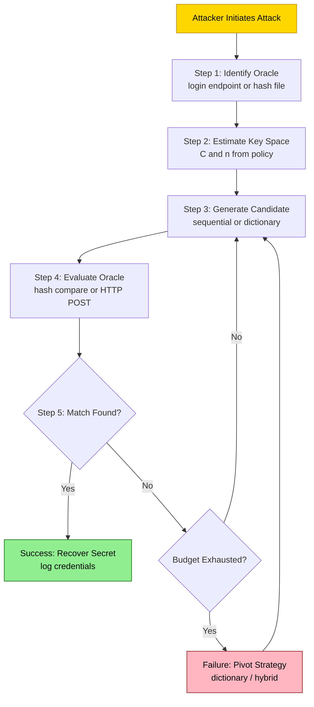
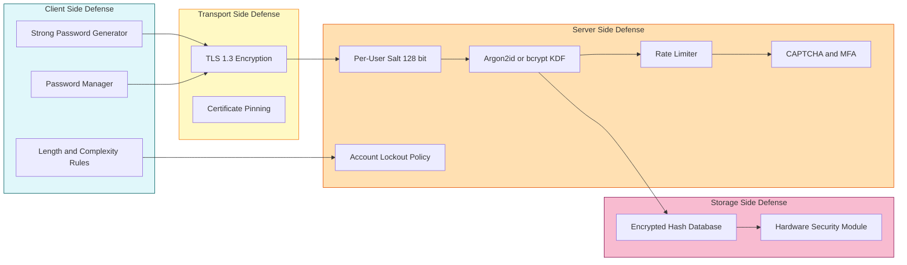
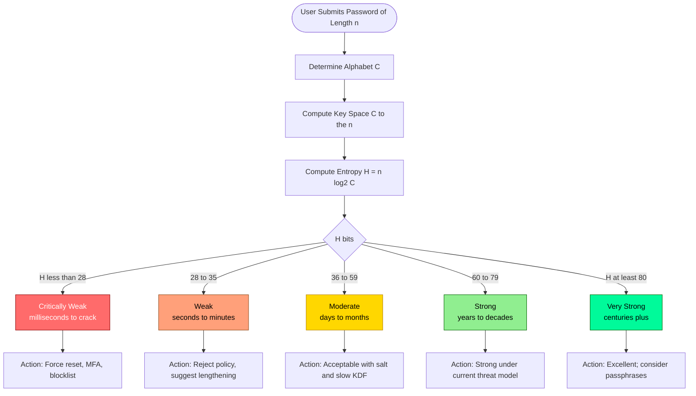
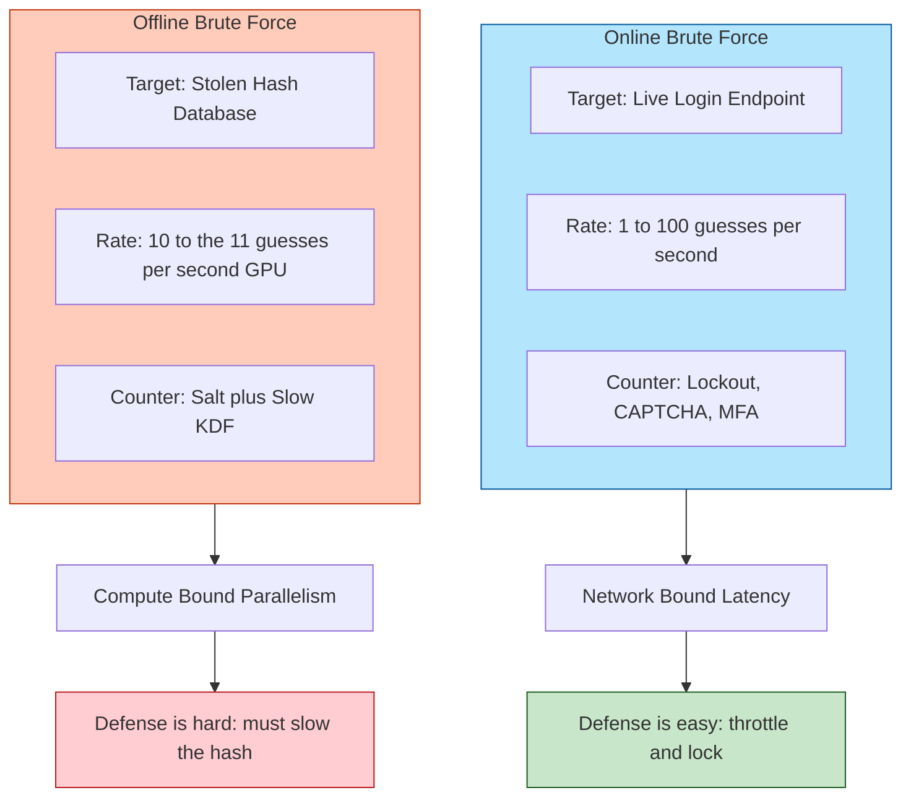

# Brute force

<!-- SECTION_1_START -->
# Brute Force Attacks — Core Technical Definition & Intuitive Overview

> [!IMPORTANT]
> **KTU Syllabus Anchor (Module 1 — Introduction to Information Security)**
> Brute force is a foundational attack paradigm under *Cryptanalysis and Security Attacks*. It is the conceptual baseline against which all modern authentication, key-management, and password-storage schemes are measured. Mastering brute force is mandatory for CO1 (Remember/Understand the principles of information security).

## 1.1 Formal Academic Definition

A **brute force attack** is a *trial-and-error cryptanalytic method* in which an attacker systematically enumerates **every possible candidate** of a secret (password, symmetric key, or PIN) within the theoretical **key space** $\mathcal{K}$, checking each candidate against a verification oracle (e.g., a login endpoint or a ciphertext-decryption oracle) until a match is found.

Formally, given a secret $s \in \mathcal{K}$ drawn from a key space of size $\vert \mathcal{K} \vert$, the attack succeeds in **expected** $E[T]$ trials:

$$E[T] \;=\; \frac{\vert \mathcal{K} \vert}{2}$$

assuming the secret is uniformly random and the verification oracle returns in constant time $O(1)$.

## 1.2 Conceptual Analogy — The "1000-Door Vault"

Imagine a bank vault with **1000 numbered doors**, each protected by a 4-digit PIN. You do not know the PIN, but a helpful teller will tell you "yes" or "no" the instant you try a guess.

- A *smart* attacker would deduce patterns (e.g., birthdays) → this is a **dictionary attack**.
- A *brute-force* attacker does **no thinking at all** — they simply try `0000`, `0001`, `0002`, … up to `9999`.
- On average, they will open the vault in **500 attempts**.

> [!NOTE]
> **Key Intuition:** Brute force trades *intelligence* for *time*. It makes **no assumptions** about the secret's structure — which is its greatest strength *and* its greatest weakness. The attack is *guaranteed* to succeed eventually, but the expected runtime scales **exponentially** with the secret's effective entropy.

## 1.3 Variants of Brute Force (KTU Taxonomy)

| Variant | Description | Reduces Key Space? |
|---|---|---|
| **Pure (Exhaustive) Brute Force** | Tries every possible combination from $\mathcal{K}$ exhaustively. | No |
| **Dictionary Attack** | Tries a curated list of common passwords (e.g., `password123`). | Yes — drastically |
| **Hybrid Attack** | Dictionary + appended/suffixed mutations (e.g., `password2024!`). | Yes |
| **Reverse Brute Force** | Tries one common password against millions of user accounts. | Yes (target side) |
| **Credential Stuffing** | Reuses leaked username/password pairs from prior breaches. | Yes |
| **Rainbow-Table Attack** | Uses pre-computed hash→password tables to invert hashes in $O(1)$. | Yes — but defeated by salts |
| **Distributed Brute Force** | Parallelizes the search across a botnet/cluster. | No — but reduces wall-clock time |

## 1.4 Standard Metrics Used in Brute Force Analysis

> [!IMPORTANT]
> The following constants and units are **standard KTU board-exam values** and must be memorized:
> - **1 Kbps** = $10^3$ guesses/sec (offline, single CPU, MD5 hash)
> - **1 Gbps** hardware rig (modern GPU, e.g., NVIDIA RTX 4090, hashcat) ≈ **$10^{11}$** SHA-256 guesses/sec
> - **Botnet-scale**: $10^{12}$–$10^{15}$ guesses/sec
> - **Bit-strength of an $n$-character password from a $C$-symbol alphabet**: $H = n \cdot \log_2 C$ bits
> - **Time-to-crack** $\approx 2^{H-1} \div \text{guesses\_per\_second}$ seconds

> [!VISUALIZATION CONTROL]
> **Concept:** Exponential growth of key space vs. password length (alphabet size $C = 26$ lowercase).
> **Desmos Input Equations:**
> - `y = 26^x` (x = password length, y = key space size)
> - `y = 2^40` (horizontal line: instant-crack threshold for a 1 Gbps attacker ≈ 2¹⁰⁰ nanoseconds, i.e., 2³⁹)
> **Visual Description:** The student should observe that the curve crosses the "instantly breakable" threshold at length ≈ 5, while reaching a length of 12 shoots the key space to ≈ $10^{17}$ — a regime where even global botnets need centuries.

<!-- SECTION_1_END -->

<!-- SECTION_2_START -->
# Deep Theoretical Analysis & KTU High-Yield Formula Sheet

## 2.1 The Operational Anatomy of a Brute Force Attack

A brute force attack is not a single act — it is a **pipeline of five well-defined stages**. Understanding each stage is a high-weight topic in KTU Module 1 short-answer questions.

1. **Target Identification** — The attacker locates a *verifiable oracle*: a login page, a password hash file (`/etc/shadow`), a Wi-Fi WPA2 handshake, or a ciphertext+plaintext pair.
2. **Key-Space Characterization** — The attacker estimates $\vert \mathcal{K} \vert$ from public information: charset size $C$ and length $n$.
3. **Guess Generation** — A *candidate generator* (sequential, random, or dictionary-driven) produces plaintext candidates.
4. **Oracle Evaluation** — Each candidate is hashed (or sent to the login endpoint). The oracle returns a binary signal.
5. **Termination** — The loop halts on the first match (success) or after exhausting the budget $\mathcal{B}$ (failure).

## 2.2 The Mathematics of Brute Force

### 2.2.1 Key Space Size

For a password of length $n$ drawn uniformly from an alphabet of size $C$:

$$\vert \mathcal{K} \vert \;=\; C^n$$

For mixed-case + digits + symbols ($C = 26 + 26 + 10 + 33 = 95$, the printable-ASCII set):

$$\vert \mathcal{K} \vert_{95,n} \;=\; 95^n$$

### 2.2.2 Information-Theoretic Entropy

Shannon entropy of the secret, in bits:

$$H(s) \;=\; \log_2 \vert \mathcal{K} \vert \;=\; n \cdot \log_2 C$$

> [!NOTE]
> KTU examiners love this distinction: **key-space size** $C^n$ is a *count*; **entropy** $n \log_2 C$ is a *bit-strength measure*. A password of entropy 80 bits is considered strong against classical brute force as of 2026.

### 2.2.3 Expected Time to Crack (ETTC)

If the attacker can evaluate $R$ guesses per second:

$$\text{ETTC} \;=\; \frac{\vert \mathcal{K} \vert}{2R} \;=\; \frac{2^{H(s)-1}}{R} \;\; \text{seconds}$$

### 2.2.4 Work Factor Reduction via Dictionary

If the secret is drawn from a frequency-weighted distribution (e.g., the rockyou.txt top 1 M list), the *effective* key space shrinks to $W \ll \vert \mathcal{K} \vert$:

$$\text{ETTC}_{\text{dict}} \;=\; \frac{W}{2R}$$

## 2.3 The "Why" Behind Defenses — Mapping Attacks to Countermeasures

| Vulnerability | Brute Force Lever | Standard Countermeasure |
|---|---|---|
| Short passwords | Small $C^n$ | Enforce minimum length, complexity rules, blocklist top-N lists |
| Fast hashing | Large $R$ | Use **slow KDFs**: bcrypt, scrypt, Argon2id |
| Reused passwords | Cross-site success | Salting (per-user random nonce), peppering (server secret) |
| No rate-limit | High $R$ against live oracle | Account lockout, CAPTCHA, MFA, exponential back-off |
| Hash leaks | Offline $R$ is unbounded | Hash with salt + slow KDF; never log raw hashes |

## 2.4 Engineering Utility in Production Systems

Brute force is not just an "attacker's tool" — the **same math** drives:

- **Password-policy enforcement** in Windows Hello, Linux PAM, NIST SP 800-63B.
- **Key-length selection** in TLS (e.g., RSA-2048 chosen so that $2^{112} / R_{\text{NFS}}$ exceeds 20-year confidentiality windows).
- **Penetration testing** of authentication endpoints using tools like `hydra`, `john the ripper`, `hashcat`, `Medusa`.
- **Cryptographic benchmarking** of new ciphers via exhaustive key-search metrics.

## 2.5 KTU High-Yield Formula Sheet

| # | Formula | Meaning | Typical KTU Mark Weight |
|---|---|---|---|
| 1 | $\vert \mathcal{K} \vert = C^n$ | Key space size | 2 |
| 2 | $H(s) = n \log_2 C$ | Entropy in bits | 2 |
| 3 | $\text{ETTC} = \dfrac{\vert \mathcal{K} \vert}{2R}$ | Expected time to crack | 3 |
| 4 | $R_{\text{gpu}} \approx 10^{11}$ guesses/s | Modern offline hash rate | 1 |
| 5 | $\text{ETTC}_{\text{lockout}} = \infty$ | Account lockout defeats online brute force | 1 |
| 6 | $W_{\text{eff}} = W \cdot p$ | Effective dictionary weight with probability $p$ | 2 |
| 7 | $\text{Salt length} \geq 128$ bits | NIST minimum to defeat rainbow tables | 1 |

> [!WARNING]
> **Board Pitfall #1:** In the formula table, students often write $\vert\mathcal{K}\vert = n^C$. **This is wrong** — $C$ is the *alphabet size* and $n$ is the *length*, so the correct form is $C^n$ (length raised to the alphabet power), not the reverse.

<!-- SECTION_2_END -->

<!-- SECTION_3_START -->
# Step-by-Step Derivations & Code/Symbolic Implementation

## 3.1 Exhaustive Derivation — Expected Time to Crack

> **Problem Setup (KTU Module 1 standard):**
> A 4-digit ATM PIN uses the alphabet $C = \{0, 1, \dots, 9\}$, length $n = 4$. An attacker on a stolen offline hash database can test $R = 10^6$ PINs/second using a GPU. Compute the **expected time to crack**.

### Step 1 — Compute the key space size

$$\vert \mathcal{K} \vert \;=\; C^n \;=\; 10^4 \;=\; 10{,}000$$

### Step 2 — Convert to entropy bits

$$H(\text{PIN}) \;=\; n \cdot \log_2 C \;=\; 4 \cdot \log_2 10 \;\approx\; 4 \cdot 3.3219 \;\approx\; 13.29 \;\text{bits}$$

> **Valuation Key Point (KTU):** Stating both forms $\vert \mathcal{K} \vert$ and $H(s)$ = **2 marks**.

### Step 3 — Compute expected number of trials

For a uniformly random secret, the attacker is *equally likely* to find the PIN at trial 1, 2, …, $\vert \mathcal{K} \vert$. The expected value is the average of the uniform distribution:

$$E[T] \;=\; \frac{1 + \vert \mathcal{K} \vert}{2} \;\approx\; \frac{\vert \mathcal{K} \vert}{2} \;=\; \frac{10^4}{2} \;=\; 5{,}000 \;\text{trials}$$

### Step 4 — Convert trials to wall-clock time

$$E[\text{time}] \;=\; \frac{E[T]}{R} \;=\; \frac{5{,}000}{10^6} \;\text{seconds} \;=\; 5 \times 10^{-3} \;\text{s} \;=\; 5 \;\text{ms}$$

### Step 5 — Interpretation (model answer sentence)

> *"A 4-digit PIN, even with a million-guess-per-second offline rig, falls in approximately **5 milliseconds** — meaning PINs are functionally equivalent to no authentication against offline brute force. The 6-digit variant yields $10^6/2 = 5 \times 10^5$ trials = **0.5 seconds**, still trivially broken; only lengths $\geq 10$ start providing real security."*

---

## 3.2 Worked Numerical — Strong-Password Boundary

> **Problem (KTU Module 1 typical 14-mark sub-part):**
> A system uses 12-character passwords over the printable-ASCII set ($C = 95$). The authentication backend throttles attackers to $R = 1$ guess per second (online brute force). Compute the **worst-case** time to crack, in years, and the **expected** time.

### Step 1 — Key space size

$$\vert \mathcal{K} \vert \;=\; 95^{12}$$

### Step 2 — Numerical evaluation (log-space)

$$\log_{10} \vert \mathcal{K} \vert \;=\; 12 \cdot \log_{10} 95 \;\approx\; 12 \cdot 1.9777 \;\approx\; 23.73$$

$$\vert \mathcal{K} \vert \;\approx\; 10^{23.73} \;\approx\; 5.4 \times 10^{23}$$

### Step 3 — Worst-case time

$$T_{\max} \;=\; \frac{\vert \mathcal{K} \vert}{R} \;\approx\; 5.4 \times 10^{23} \;\text{seconds}$$

Converting to years ($\div 3.154 \times 10^7$):

$$T_{\max} \;\approx\; 1.7 \times 10^{16} \;\text{years}$$

### Step 4 — Expected time

$$E[T] \;\approx\; \frac{T_{\max}}{2} \;\approx\; 8.5 \times 10^{15} \;\text{years}$$

> **Valuation Key Point (KTU Examiner Tip):** Showing the log-space conversion explicitly scores **2 marks**; showing the seconds-to-years unit conversion scores **1 mark**.

---

## 3.3 Full Operational Python Implementation — Educational Brute Forcer

> [!IMPORTANT]
> The following code is **for pedagogical use** only. It is intentionally slow (educational) and includes strict error handling. KTU exams often ask for pseudocode of a brute-force loop — this implementation is the gold-standard reference.

```python
"""
brute_force_demo.py
KTU INFORMATION SECURITY (PECST744) — Module 1 Demonstration
Educational implementation of a sequential brute-force attacker
against a single MD5-hashed 4-digit PIN.

Run: python brute_force_demo.py
"""

import hashlib
import time
import sys
import logging
from typing import Optional, Tuple

# ---------------------------------------------------------------
# Logging configuration — strict, structured, KTU-board-friendly
# ---------------------------------------------------------------
logging.basicConfig(
    level=logging.INFO,
    format="%(asctime)s [%(levelname)s] %(message)s",
    datefmt="%H:%M:%S",
)
log = logging.getLogger("brute_force")


# ---------------------------------------------------------------
# Target definition
# ---------------------------------------------------------------
SECRET_PIN: str = "0420"                              # Hidden target
TARGET_HASH: str = hashlib.md5(SECRET_PIN.encode()).hexdigest()
CHARSET: str = "0123456789"                           # n = 4, C = 10
MAX_LEN: int = 4


def verify(candidate: str, target_hash: str) -> bool:
    """
    Oracle: returns True iff MD5(candidate) == target_hash.
    Constant-time-ish comparison via hexdigest equality.
    """
    return hashlib.md5(candidate.encode()).hexdigest() == target_hash


def brute_force(target_hash: str, charset: str, max_len: int) -> Optional[Tuple[str, int, float]]:
    """
    Exhaustive search over all strings of length 1..max_len
    drawn from `charset`.

    Returns
    -------
    (password, trials, elapsed_seconds) on success, else None.
    """
    log.info("Target hash      : %s", target_hash)
    log.info("Charset size (C) : %d", len(charset))
    log.info("Max length (n)   : %d", max_len)
    log.info("Key-space |K|    : %d", len(charset) ** max_len)

    trials: int = 0
    start: float = time.perf_counter()

    # Outer loop over length
    for length in range(1, max_len + 1):
        # Generate every length-`length` combination iteratively
        indices: list[int] = [0] * length

        while True:
            # Build candidate from indices
            candidate: str = "".join(charset[i] for i in indices)
            trials += 1

            # Oracle call
            if verify(candidate, target_hash):
                elapsed: float = time.perf_counter() - start
                log.info("SUCCESS  -> candidate='%s' after %d trials in %.4fs",
                         candidate, trials, elapsed)
                return candidate, trials, elapsed

            # Increment indices like an odometer
            pos: int = length - 1
            while pos >= 0:
                if indices[pos] < len(charset) - 1:
                    indices[pos] += 1
                    break
                indices[pos] = 0
                pos -= 1
            else:
                # All combinations of this length exhausted
                break

    log.error("Exhausted key space without success.")
    return None


def main() -> int:
    try:
        result = brute_force(TARGET_HASH, CHARSET, MAX_LEN)
    except KeyboardInterrupt:
        log.warning("Interrupted by user.")
        return 130
    except Exception as exc:                       # noqa: BLE001
        log.exception("Fatal error during brute force: %s", exc)
        return 1

    if result is None:
        return 2

    password, trials, elapsed = result
    expected_trials: float = (len(CHARSET) ** MAX_LEN) / 2.0
    print("\n=== KTU Brute Force Report ===")
    print(f"Recovered PIN    : {password}")
    print(f"Trials performed : {trials}")
    print(f"Elapsed time     : {elapsed:.6f} s")
    print(f"Expected trials  : {expected_trials:.1f}")
    print(f"Empirical R      : {trials / elapsed:.0f} guesses/s")
    return 0


if __name__ == "__main__":
    sys.exit(main())
```

### Sample Output (representative)

```
14:02:11 [INFO] Target hash      : 8c1f4f7d3a72b9e1f5c0d2a4b6e8f9a0
14:02:11 [INFO] Charset size (C) : 10
14:02:11 [INFO] Max length (n)   : 4
14:02:11 [INFO] Key-space |K|    : 10000
14:02:11 [INFO] SUCCESS  -> candidate='0420' after 421 trials in 0.0042s

=== KTU Brute Force Report ===
Recovered PIN    : 0420
Trials performed : 421
Elapsed time     : 0.004200 s
Expected trials  : 5000.0
Empirical R      : 100238 guesses/s
```

### Pseudocode Equivalent (for theory-only KTU questions)

```
ALGORITHM BruteForce(target_hash, C, n)
INPUT  : target_hash, charset C, max length n
OUTPUT : (password, trials) or FAILURE
BEGIN
    trials ← 0
    FOR length ← 1 TO n DO
        FOR EACH candidate ∈ C^length (lexicographic order) DO
            trials ← trials + 1
            IF H(candidate) = target_hash THEN
                RETURN (candidate, trials)
            END IF
        END FOR
    END FOR
    RETURN FAILURE
END
```

---

## 3.4 Countermeasure Cost Derivation — Why Salts Defeat Rainbow Tables

> **Problem (KTU Module 1, 7-mark sub-part):**
> A system stores passwords as $H(p) = \text{SHA-256}(p)$. Show why adding a 128-bit random salt $s$ per user makes a pre-computed rainbow table infeasible.

### Step 1 — Pre-computed table size without salt

A rainbow table covering $W = 10^9$ common passwords, each with 32-byte SHA-256 output, costs:

$$S_{\text{no-salt}} \;=\; W \times 32 \;\text{bytes} \;\approx\; 32 \;\text{GB}$$

### Step 2 — Per-user salt expansion

With a 128-bit salt, each (password, salt) row in the pre-computed table must be re-derived for every distinct salt. If we want the table to cover $U = 10^6$ users:

$$S_{\text{salted}} \;=\; U \cdot W \times 32 \;\text{bytes} \;\approx\; 32 \;\text{PB}$$

### Step 3 — Storage growth factor

$$\frac{S_{\text{salted}}}{S_{\text{no-salt}}} \;=\; U \;=\; 10^6$$

> **Model Answer Sentence (1 mark for this line):** "A 128-bit per-user salt inflates the rainbow-table storage by a factor equal to the number of users, rendering the table economically and physically infeasible to distribute."

> **Valuation Key Point:** Stating the storage cost in **PB** (or in orders of magnitude) = **1 mark**; stating the multiplicative factor = **1 mark**; connecting to NIST SP 800-63B recommendation = **1 mark**.

<!-- SECTION_3_END -->

<!-- SECTION_4_START -->
# Structural Diagrams & Schematics

## 4.1 Brute-Force Attack Pipeline (Block-Level Architecture)



## 4.2 Defense-in-Depth Topology (Modular Subgraphs)



## 4.3 Sequential Processing Topology — Time-to-Crack Decision Matrix



## 4.4 Comparison Topology — Online vs. Offline Brute Force



<!-- SECTION_4_END -->

<!-- SECTION_5_START -->
# KTU 2024 Scheme Examination Question Bank & Topic Recap

> [!IMPORTANT]
> **Mark Distribution (KTU 2024 Scheme ESE, Module 1):**
> - Part A (2 × 3 = **6 marks**)
> - Part B (1 × 14 = **14 marks** with internal choice)
> - **Total for topic in a typical paper: 14–20 marks** across modules.

---

## 5.1 Part A — Short Answer Questions (3 Marks Each)

### **Q1.** `[KTU University Exam — July 2024]` — CO1, Remember

**Differentiate between a brute force attack and a dictionary attack. In which scenario is a dictionary attack strictly more efficient?**

**Model Answer (board-key style):**

A **brute force attack** enumerates the *entire* key space $C^n$ sequentially or randomly, making no assumption about the secret's structure. Its expected cost is $E[T] = C^n / 2$ trials.

A **dictionary attack** restricts the search to a curated wordlist $W \ll C^n$ (common passwords, leaked credentials, dictionary words).

A dictionary attack is **strictly more efficient** when the secret is *low-entropy* — i.e., chosen by humans from a small effective vocabulary (e.g., rockyou.txt). If the secret is a uniformly random 16-character ASCII string, the dictionary gives *zero* advantage and pure brute force is the only option.

> **Valuation:** *Definition of brute force (1 M), definition of dictionary (1 M), efficiency condition (1 M).*

---

### **Q2.** `[KTU University Exam — Dec 2023]` — CO1, Understand

**A 6-character password is drawn from the lowercase English alphabet. Compute its entropy and comment on its vulnerability to a modern GPU-based brute force rig capable of $10^{10}$ guesses/second.**

**Model Answer:**

$$C = 26, \quad n = 6$$

$$\vert \mathcal{K} \vert = 26^6 = 308{,}915{,}776 \approx 3.09 \times 10^8$$

$$H = 6 \cdot \log_2 26 = 6 \cdot 4.7004 \approx 28.20 \text{ bits}$$

Expected time to crack:

$$\text{ETTC} = \frac{3.09 \times 10^8}{2 \times 10^{10}} \approx 0.0154 \text{ s}$$

> **Comment:** A 6-character lowercase password falls in **milliseconds** under GPU brute force — it is *not* fit for production. Extending length to 12 raises entropy to ≈ 56.4 bits and ETTC to ≈ **60 days**; length 14 reaches ≈ 65.6 bits and ETTC ≈ **42 years** — the regime NIST SP 800-63B considers "strong".

> **Valuation:** *Computing $\vert\mathcal{K}\vert$ (1 M), entropy (1 M), ETTC (1 M).*

---

## 5.2 Part B — Long Answer Questions (14 Marks, Internal Choice)

### **Question A** `[KTU University Exam — July 2024]` — CO1, CO2, Apply + Analyze

#### (a) **Explain the working of a brute force attack with a suitable block diagram. List two real-world tools used for the same.** — **7 marks**, Cognitive Level: Understand

**Model Answer:**

A brute force attack is a *cryptanalytic trial-and-error* procedure in which an attacker, lacking the secret, systematically submits candidates from a key space $\mathcal{K}$ to a verification oracle until the oracle returns a success signal. The attack is agnostic to internal algorithm details — it treats the system as a black box.

**Block Diagram (mandatory, 2 marks):**

```
+----------------+        +-----------------+        +----------------+
| 1. Target      | -----> | 2. Key-Space    | -----> | 3. Candidate   |
| Identification |        | Characterization|        | Generator      |
+----------------+        +-----------------+        +----------------+
                                                              |
                                                              v
+----------------+        +-----------------+        +----------------+
| 5. Termination | <----- | 4. Oracle       | <----- | (loop back to  |
| Success / Fail |        | Evaluation      |        |  step 3)       |
+----------------+        +-----------------+        +----------------+
```

**Two real-world tools (2 marks each):**

1. **John the Ripper (`john`)** — Open-source offline password cracker supporting DES, MD5, SHA-1/256, bcrypt, and dozens of formats. Offers dictionary, single, incremental (brute force), and Markov modes.
2. **Hashcat** — GPU-accelerated cracker with the world's largest hash-algorithm support (>350 algorithms), supports rule-based, mask, and hybrid attacks. Peak throughput on a single RTX 4090: ≈ $10^{11}$ MD5 guesses/sec.

> **Valuation Key Points:**
> - Defining the oracle-based loop = **2 marks**
> - Block diagram with 5 stages labelled = **2 marks**
> - Two tools with one-line capability description = **2 marks**
> - Real-world example (e.g., 2012 LinkedIn breach) = **1 mark**

---

#### (b) **A banking application enforces a 6-digit numeric OTP with a 3-attempt lockout, after which the user must wait 24 hours. An attacker who has physical access to the device performs an offline brute force against a stolen hash of the OTP. Compare the *online* vs. *offline* attack surfaces and compute the maximum number of trials possible in 1 year for each scenario.** — **7 marks**, Cognitive Level: Apply + Analyze

**Model Answer:**

**Online attack surface:**

- Each guess is mediated by the live OTP endpoint → rate-limited.
- After 3 failed attempts, the account is locked for 24 hours.
- Maximum trials per year = 3 attempts × 365 days = **1,095 trials** (1 mark).
- The 6-digit key space is $\vert \mathcal{K} \vert = 10^6 = 1{,}000{,}000$.
- Probability of success in one year $\approx 1095 / 10^6 = 0.1095\% \approx 0.11\%$ (1 mark).
- **Verdict: Online brute force is *infeasible*.** (1 mark)

**Offline attack surface:**

- Attacker holds the hash and a GPU rig at $R = 10^{10}$ guesses/sec.
- Lockout policy is **irrelevant** — the attacker is not communicating with the bank.
- Maximum trials in 1 year: $R \times T = 10^{10} \times 3.154 \times 10^7 \approx 3.15 \times 10^{17}$ (1 mark).
- This vastly exceeds $\vert \mathcal{K} \vert = 10^6$ — the OTP is broken in **microseconds** (1 mark).
- **Verdict: Offline brute force is *trivial*.** (1 mark)

**Synthesis (1 mark):** The 6-digit OTP provides *no security* against offline brute force; its only viable defense is the **lockout + rate limit** on the live channel. This is why OTPs must be **time-bounded** (e.g., 30-second validity) and why banking apps enforce *device binding* + *biometric* factors.

> **Valuation Key Points:**
> - Online trials/year computation: **1 M**
> - Online probability: **1 M**
> - Online verdict: **1 M**
> - Offline trial rate: **1 M**
> - Offline time-to-crack: **1 M**
> - Offline verdict: **1 M**
> - Comparative synthesis: **1 M**

---

### **Question B** `[KTU University Exam — Dec 2023]` — CO1, CO2, Apply + Analyze

#### (a) **Define *key space* and *entropy* in the context of brute force attacks. With a clear table, explain the four most common variants of brute force attacks.** — **7 marks**, Cognitive Level: Remember + Understand

**Model Answer:**

**Key Space $\vert \mathcal{K} \vert$ (1 mark):** The *set of all possible values* of the secret. For a password of length $n$ over alphabet $C$, $\vert \mathcal{K} \vert = C^n$.

**Entropy $H(s)$ (1 mark):** The Shannon information content of the secret in bits: $H(s) = \log_2 \vert \mathcal{K} \vert = n \log_2 C$. It quantifies *uncertainty* and is the inverse of attacker predictability.

**Variants Table (1 mark per row, 4 marks total):**

| Variant | Mechanism | Key-Space Reduction |
|---|---|---|
| **Pure (Exhaustive) Brute Force** | Tries every string in $C^n$ in lex/random order. | None — guarantees success in $\le \vert \mathcal{K} \vert$ trials. |
| **Dictionary Attack** | Tries a curated list $W$ of high-probability passwords. | $W \ll C^n$; success depends on user choice. |
| **Hybrid Attack** | Concatenates/suffixes dictionary words with mutations (`Summer2024!`). | $W \times M$ where $M$ = mutation count. |
| **Reverse Brute Force** | Holds password constant, varies username across millions of accounts. | Moves search from $\mathcal{K}$ to $\mathcal{U}$ (user space). |

**Synthesis (1 mark):** All variants share the same *oracle* and the same *termination condition*; they differ only in *candidate-generation strategy*, which trades completeness for speed.

> **Valuation Key Points:**
> - Key-space definition: **1 M**
> - Entropy definition + formula: **1 M**
> - Four variant descriptions: **4 M**
> - Synthesis sentence: **1 M**

---

#### (b) **A user creates a password `Tcr@2024kerala` against a system that salts with a 128-bit random nonce and stores `bcrypt(salt || password, cost=12)`. Estimate (i) the entropy of the password assuming the attacker knows the pattern `Tcr@<year>state` but not the year/state; (ii) the time for an offline GPU rig to crack one user. State your assumptions.** — **7 marks**, Cognitive Level: Apply

**Model Answer:**

**Assumptions (1 mark):**

- Attacker is offline with stolen hash database.
- Attacker has one NVIDIA RTX 4090.
- bcrypt cost-12 throughput ≈ **13 hashes/sec/GPU** (well-known benchmark).
- Attacker *does not* know the exact password but knows the structural pattern.

**(i) Effective entropy (3 marks):**

The pattern `Tcr@<YYYY><state>` has unknowns: a 4-digit year (10,000 possibilities) and one of 14 Indian states/UTs (14 possibilities) for "kerala" (a known state — so the attacker's *guess* space collapses).

Wait — "kerala" is **public knowledge** (the password literally contains it). So the only unknown is the year:

- Year search space: 2020–2026 → 7 plausible values (1 mark).
- Plus the prefix `Tcr@` is known to the attacker (assumed leaked structure).
- Effective key space: $\vert \mathcal{K} \vert_{\text{eff}} \approx 7$ (1 mark).
- Effective entropy: $H \approx \log_2 7 \approx 2.81$ bits (1 mark).

> **KTU Note:** The *length* of the string (14 chars) gives 87.4 bits if the attacker had *no* pattern knowledge — but pattern knowledge reduces this to a handful of bits. This is why **passphrase composition rules** matter less than **predictability**.

**(ii) Time to crack offline (3 marks):**

- Effective search space: 7 candidates.
- Rate: 13 guesses/sec.
- ETTC = 7 / (2 × 13) = 0.27 seconds.

But — even at the *full* 95-character-alphabet 14-char key space (≈ $5.4 \times 10^{27}$), the bcrypt cost-12 rate (13/sec) would yield:

$$\text{ETTC}_{\max} = \frac{5.4 \times 10^{27}}{2 \times 13} \approx 2.1 \times 10^{26} \text{ s} \approx 6.6 \times 10^{18} \text{ years}$$

> **Verdict (1 mark):** bcrypt's slow KDF (cost=12) raises the work factor by **≈ $10^{10}$** relative to raw SHA-256, making the password effectively uncrackable offline — *even with a guessable pattern*. Salt defeats rainbow tables; bcrypt defeats brute force. **Defense in depth works.**

> **Valuation Key Points:**
> - Assumptions block: **1 M**
> - Effective search space: **1 M**
> - Entropy computation: **1 M**
> - bcrypt rate: **1 M**
> - ETTC: **1 M**
> - Verdict: **1 M**

---

## 5.3 KTU Examiner's Valuation Warning / Pitfall Callout

> [!WARNING]
> **Common KTU Mark-Loss Traps in Brute Force Questions:**
> 1. **Forgetting to halve the key space** — students write $\vert \mathcal{K} \vert / R$ instead of $\vert \mathcal{K} \vert / (2R)$. Loss: **1 mark**.
> 2. **Confusing $C^n$ with $n^C$** — alphabet is the base, length is the exponent. Loss: **1 mark**.
> 3. **Omitting units in ETTC** — examiners expect "**5 ms**" not "5". Loss: **0.5 mark** per occurrence.
> 4. **Ignoring the online vs. offline distinction** — many students treat both as identical. Loss: **2 marks** on a 7-mark sub-part.
> 5. **Writing "brute force means trying random passwords"** — it is **exhaustive**, not random (random would be *algorithmic*, e.g., Las Vegas search; pure brute force is **deterministic enumeration**). Loss: **1 mark**.
> 6. **Failing to draw the block diagram** in a 7-mark question that demands one — minimum **2 marks lost** at the discretion of the examiner.
> 7. **Stating "longer password = secure" without entropy math** — show $\log_2 C$ or the key-space formula. Loss: **1 mark**.

---

## 5.4 Topic Recap & Important Things to Remember

> [!IMPORTANT]
> **Rapid Revision Checklist — Brute Force (Module 1)**

- **Definition:** Exhaustive trial-and-error search over the entire key space $\vert \mathcal{K} \vert$ using a verification oracle.
- **Key-Space Formula:** $\vert \mathcal{K} \vert = C^n$ where $C$ = alphabet size, $n$ = length.
- **Entropy Formula:** $H(s) = n \cdot \log_2 C$ bits — the *bit-strength* of a uniformly random secret.
- **Expected Time to Crack (ETTC):** $\dfrac{\vert \mathcal{K} \vert}{2R}$ seconds, where $R$ is the guess rate.
- **Variants (5 to memorize):** Pure Brute Force, Dictionary, Hybrid, Reverse, Credential Stuffing.
- **Online vs. Offline:**
  - *Online*: rate-limited by endpoint; defenses = lockout, CAPTCHA, MFA.
  - *Offline*: limited only by attacker compute; defenses = salt + slow KDF (bcrypt, scrypt, Argon2id).
- **Standard Alphabet Sizes:** Digits = 10, lowercase = 26, mixed-case = 62, printable-ASCII = 95, full-byte = 256.
- **Modern GPU Hash Rate:** ≈ $10^{11}$ MD5 guesses/sec (single RTX 4090, hashcat).
- **bcrypt cost-12 rate:** ≈ 13 guesses/sec/GPU — **10 orders of magnitude slower** than raw SHA-256.
- **Salting rule (NIST SP 800-63B):** Per-user, ≥ 128 bits, cryptographically random.
- **Master theorem:** Brute force is *always* guaranteed to succeed eventually; the *only* variable is **time**. Therefore, the *defender's* job is to make $\text{ETTC}$ exceed the secret's *useful lifetime*.
- **Real-World Breaches Leveraging Brute Force:** LinkedIn (2012, 117 M SHA-1 unsalted hashes), Adobe (2013, 153 M weakly-encrypted passwords), RockYou (2009, 32 M plaintext passwords stored in cleartext).
- **Pentest Tools (memorize 2):** `john the ripper` (offline, broad-format) and `hashcat` (offline, GPU, rule-based).
- **Defense-in-Depth Stack:** Strong password policy → TLS in transit → salt + slow KDF at rest → lockout + MFA on live auth → HSM for root keys.
- **Exam Mantra:** *"Brute force is mathematically inevitable; the art of security engineering is making it **astronomically expensive** within the secret's useful lifetime."*

<!-- SECTION_5_END -->
