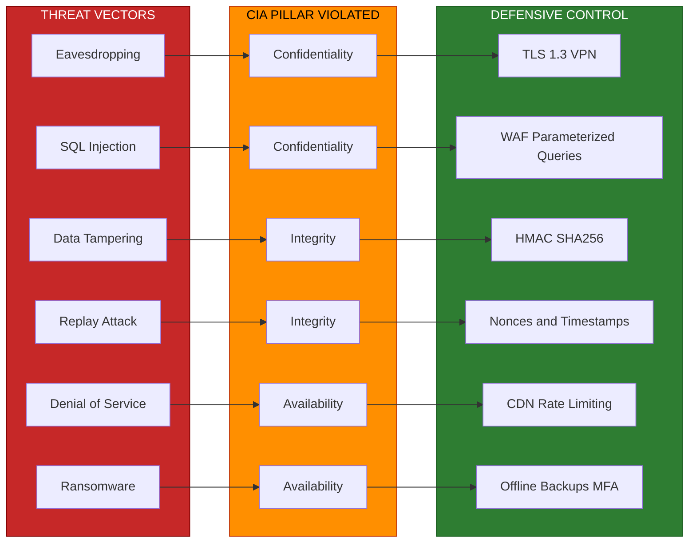
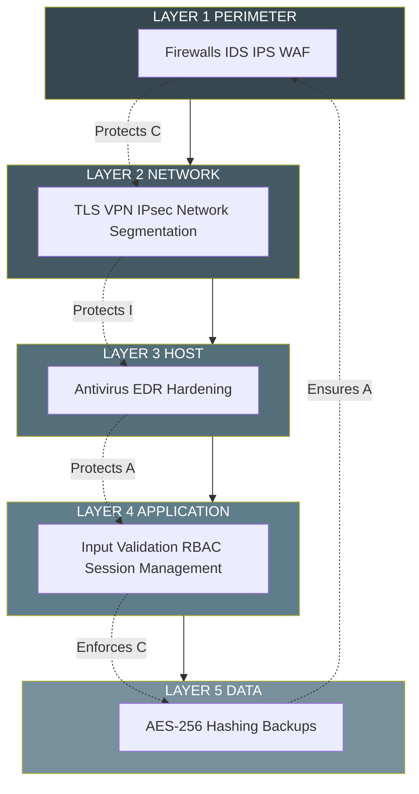

# Introduction to Information Security -  CIA triad

<!-- SECTION_1_START -->
# Introduction to Information Security: The CIA Triad

## 1.1 Formal Academic Definition

> [!IMPORTANT]
> **CIA Triad** is the foundational pillar model of Information Security, formally defined as a three-pillar conceptual framework — **Confidentiality, Integrity, and Availability** — upon which all information security policies, controls, and architectures are built. The triad, sometimes also called the **AIC Triad** (Availability, Integrity, Confidentiality) or the **Parkerian Hexad** (when extended), represents the core objectives that any secure system must preserve.

According to the **NIST SP 800-12 Rev. 1** and the classical security textbook *"Principles of Information Security"* (Whitman & Mattord), Information Security is defined as:

> *"The protection of information and its critical elements, including the systems and hardware that use, store, and transmit that information."*

The CIA Triad provides the **trinity of goals** for this protection. A compromise in **any one** of the three pillars constitutes a security breach.

### The Three Pillars — Formal Definitions

| Pillar | Formal Definition | Common Violation |
| :--- | :--- | :--- |
| **Confidentiality (C)** | The assurance that information is accessible **only to those authorized** to have access. | Data leakage, eavesdropping, unauthorized disclosure. |
| **Integrity (I)** | The assurance that information remains **accurate, consistent, and unaltered** except through authorized channels. | Tampering, man-in-the-middle, data corruption. |
| **Availability (A)** | The assurance that information and systems are **accessible to authorized users** whenever required. | Denial-of-Service (DoS), ransomware, hardware failure. |

> [!NOTE]
> **KTU 2024 Syllabus Highlight (Module 1):** Students must be able to **define, differentiate, and cite real-world examples** of each pillar. The CIA triad is a **2-mark short-answer favorite** in KTU examinations, often appearing as a Module 1 question.

---

## 1.2 Conceptual Analogy: The "Bank Vault" Intuition

Imagine a bank protecting its most sensitive assets (gold, cash, documents):

- **Confidentiality** → The vault is locked, and only employees with the correct key-card combination can enter. Outsiders cannot see what is inside.
- **Integrity** → The ledgers and account records are never altered by hand without dual-authorization. A customer checking their balance gets the *exact* same number every time, guaranteed.
- **Availability** → The bank is open from 9 AM to 5 PM, and the cash machines (ATMs) are online 24/7. A customer can withdraw money at any authorized time.

If the bank vault were **transparent** (no lock) → *Confidentiality lost*.  
If a thief could **rewrite the ledger** to add money to their account → *Integrity lost*.  
If a protestor **chains the bank's doors shut** → *Availability lost*.

This simple analogy maps directly to **enterprise IT systems**: a database server, a cloud storage account, or a healthcare record system all require these three guarantees in the same way.

---

## 1.3 Why the CIA Triad Matters in Modern Engineering

In the KTU 2024 NEP-aligned syllabus, Information Security (PECST744) is treated as a **Program Elective**. The CIA triad is not just an academic abstraction — it is the **design specification** that every security engineer uses to justify a control.

> [!TIP]
> **Industry Insight:** Every ISO 27001 control, every PCI-DSS requirement, and every GDPR Article 32 clause can be traced back to protecting at least one pillar of the CIA triad. When you write a security policy in a job, you will be told: *"Your policy must protect the **C**, ensure the **I**, and guarantee the **A**."*

---

## 1.4 Visualization of the CIA Triad

> [!VISUALIZATION CONTROL]
> **Concept:** The CIA Triad as a three-legged stool (geometric representation)
> **GeoGebra / Desmos Input Equations:**
>
> * `Circle: (x-0)^2 + (y-1.2)^2 = 0.35` — Top vertex (Confidentiality)
> * `Circle: (x+0.9)^2 + (y-0.4)^2 = 0.35` — Bottom-left vertex (Integrity)
> * `Circle: (x-0.9)^2 + (y-0.4)^2 = 0.35` — Bottom-right vertex (Availability)
> * `Line: between (0, 1.2) and (-0.9, 0.4)`
> * `Line: between (-0.9, 0.4) and (0.9, 0.4)`
> * `Line: between (0.9, 0.4) and (0, 1.2)`
>
> **Visual Description:** The student should observe an **equilateral triangle** of three circles. Removing *any one* circle collapses the triangle — illustrating that a security system fails if any one pillar is breached.

<!-- SECTION_1_END -->

<!-- SECTION_2_START -->
# Deep Theoretical Analysis & KTU High-Yield Formula Sheet

## 2.1 Pillar 1 — Confidentiality (The "Need-to-Know" Principle)

### 2.1.1 Operational Mechanism
Confidentiality ensures that **sensitive information is not disclosed to unauthorized individuals, entities, or processes**. The principle is often summarized as:

> *"No one should know what they are not supposed to know."*

### 2.1.2 Logical Steps to Achieve Confidentiality
1. **Identification** — Establish *who* the subject is (username, employee ID).
2. **Authentication** — Verify *that they are who they claim to be* (password, OTP, biometrics).
3. **Authorization** — Grant access rights based on verified identity (RBAC, ACL).
4. **Encryption** — Convert plaintext into ciphertext so that even if intercepted, the data is unreadable.
5. **Access Control** — Enforce restrictions at file, directory, network, or application level.

### 2.1.3 Engineering Tools Used
- **Symmetric Encryption:** AES-256, DES, 3DES.
- **Asymmetric Encryption:** RSA, ECC, Diffie-Hellman.
- **Network-level:** TLS/SSL, IPsec, VPN tunnels.
- **Data-level:** BitLocker, FileVault, database column-level encryption.

### 2.1.4 Real-World Breaches of Confidentiality
- **2017 Equifax Breach:** 147 million customer records exposed → *encryption keys were not rotated*.
- **2013 Target Breach:** 40 million credit card numbers stolen via HVAC vendor access.

---

## 2.2 Pillar 2 — Integrity (The "Trust-but-Verify" Principle)

### 2.2.1 Operational Mechanism
Integrity guarantees that data has **not been modified or destroyed in an unauthorized manner**. It encompasses two sub-properties:

- **Data Integrity:** Information remains accurate and unaltered.
- **System Integrity:** The system performs its intended function without manipulation.

### 2.2.2 Logical Steps to Achieve Integrity
1. **Hashing** — Compute a fixed-size fingerprint of the data (SHA-256, SHA-3).
2. **Digital Signatures** — Bind the identity of the signer to the document (RSA, ECDSA).
3. **Checksums and CRCs** — Detect transmission errors and tampering.
4. **Version Control** — Maintain historical snapshots (Git, blockchain).
5. **Intrusion Detection** — Monitor for unauthorized changes (Tripwire, OSSEC).

### 2.2.3 The Hash Function Equation

The most important mathematical primitive for integrity is the **cryptographic hash function**:

$$
H(M) = h
$$

Where:
- $M$ is the input message (of arbitrary length).
- $H$ is the hash algorithm (e.g., SHA-256).
- $h$ is the fixed-size output (digest).

For **integrity verification**:

$$
\text{Verify}(M, h) = 
\begin{cases}
\text{TRUE} & \text{if } H(M) = h \\
\text{FALSE} & \text{if } H(M) \neq h
\end{cases}
$$

> [!NOTE]
> **Key Property of Cryptographic Hashes:** Even a *one-bit* change in $M$ must produce a completely different $h$ (the **avalanche effect**). This is what makes SHA-256 reliable for integrity checking.

### 2.2.4 Real-World Breaches of Integrity
- **Stuxnet Worm (2010):** Modified PLC code in Iranian nuclear centrifuges → *system integrity lost*.
- **2016 DNC Email Leak:** Documents were altered before publication.

---

## 2.3 Pillar 3 — Availability (The "Always-On" Principle)

### 2.3.1 Operational Mechanism
Availability ensures that **information and systems are accessible to authorized users when needed**. It is typically measured as **uptime percentage** and governed by **Service Level Agreements (SLAs)**.

### 2.3.2 Availability Calculation Formula (KTU Favorite)

$$
\text{Availability} = \frac{\text{MTBF}}{\text{MTBF} + \text{MTTR}} \times 100\%
$$

Where:
- $\text{MTBF}$ = **Mean Time Between Failures** (reliability metric).
- $\text{MTTR}$ = **Mean Time To Repair** (maintainability metric).

**Common "Nines" of Availability:**

| Availability | Downtime per Year | Tier |
| :--- | :--- | :--- |
| 99% (Two 9s) | 3.65 days | Personal use |
| 99.9% (Three 9s) | 8.77 hours | Small business |
| 99.99% (Four 9s) | 52.6 minutes | Enterprise (Tier III) |
| 99.999% (Five 9s) | 5.26 minutes | Carrier-grade (Tier IV) |

### 2.3.3 Logical Steps to Ensure Availability
1. **Redundancy** — Duplicate systems (RAID, hot-standby, multi-region cloud).
2. **Failover Clustering** — Automatic switching to a backup server.
3. **Disaster Recovery (DR)** — Offsite backups, RTO/RPO planning.
4. **DDoS Protection** — Rate limiting, scrubbing centers, CDNs (Cloudflare, Akamai).
5. **Patch Management** — Timely updates to prevent exploit-driven outages.

### 2.3.4 Real-World Breaches of Availability
- **2016 Dyn DNS Attack:** Mirai botnet DDoS took down Twitter, Netflix, Reddit.
- **2017 WannaCry Ransomware:** Encrypts data → makes systems *unavailable* until ransom is paid.

---

## 2.4 The Extended Security Model: Parkerian Hexad

The CIA triad, while foundational, is sometimes extended to a **6-element model** (the Parkerian Hexad) by Donn Parker (1998), which adds:

- **Authenticity** — Provenance of the data.
- **Possession (or Control)** — Physical custody of the data.
- **Utility** — Data being in a usable format.

> [!IMPORTANT]
> **For KTU 2024:** Stick to the **CIA Triad** for your answer unless the question specifically asks for "extended security models." Mentioning the Parkerian Hexad as a *bonus* point can fetch you **+1 extra mark** in a 14-mark question.

---

## 2.5 KTU High-Yield Formula Cheat Sheet

| Symbol / Term | Definition | Use Case |
| :--- | :--- | :--- |
| $H(M) = h$ | Hash of message $M$ yields digest $h$ | Integrity verification |
| $E_K(P) = C$ | Encryption of plaintext $P$ under key $K$ yields ciphertext $C$ | Confidentiality |
| $D_K(C) = P$ | Decryption of ciphertext $C$ under key $K$ yields plaintext $P$ | Confidentiality |
| $\sigma = \text{Sign}_{\text{priv}}(H(M))$ | Digital signature over hash | Integrity + Authenticity |
| $A = \frac{\text{MTBF}}{\text{MTBF} + \text{MTTR}}$ | Availability ratio | Reliability engineering |
| $\text{SHA-256}(M) \rightarrow 256 \text{ bits}$ | Fixed-size output of SHA-256 | Integrity |
| $\text{RTO}, \text{RPO}$ | Recovery Time / Point Objectives | Disaster recovery |

> [!TIP]
> **Avoid using the vertical bar** `\vert` notation in your exam answer for absolute value — use the *context* of the formula instead. Exam scripts use the pipe character freely, but in your typed notes here it would break the markdown table.

---

## 2.6 Real-World Utility Across Engineering Domains

| Domain | Confidentiality Tool | Integrity Tool | Availability Tool |
| :--- | :--- | :--- | :--- |
| **Banking (FinTech)** | AES-256 on transaction data | HMAC-SHA256 on payment messages | Multi-region active-active DB |
| **Healthcare (MedTech)** | HIPAA-compliant field encryption | Audit logs + blockchain EHR | Redundant hospital servers |
| **E-Commerce** | TLS 1.3 in transit | Signed JWT tokens | CDN edge caching, 99.99% SLA |
| **IoT / Embedded** | Lightweight ciphers (ChaCha20) | Secure boot + firmware hashing | Watchdog timers, OTA recovery |
| **Cloud (AWS/Azure)** | KMS-managed keys | S3 Object Lock, versioning | Multi-AZ deployments |

<!-- SECTION_2_END -->

<!-- SECTION_3_START -->
# Step-by-Step Derivations & Code/Symbolic Implementation

## 3.1 Symbolic Derivation: The CIA Trade-Off Theorem

In real-world security engineering, there is often a **trade-off** between the three pillars. Strengthening one may weaken another. We can express this as a weighted objective function:

$$
\max \text{Security}(C, I, A) = w_C \cdot C + w_I \cdot I + w_A \cdot A
$$

Subject to:

$$
w_C + w_I + w_A = 1, \quad w_C, w_I, w_A \geq 0
$$

Where:
- $C \in [0, 1]$ is the normalized confidentiality score.
- $I \in [0, 1]$ is the normalized integrity score.
- $A \in [0, 1]$ is the normalized availability score.
- $w_C, w_I, w_A$ are the **weights** assigned by the organization based on business priority.

### Worked Example (KTU Exam-Style)
A bank assigns weights $w_C = 0.5$, $w_I = 0.4$, $w_A = 0.1$. After a security audit, the scores are $C = 0.9$, $I = 0.85$, $A = 0.95$.

$$
\begin{aligned}
\text{Security Score} &= (0.5 \times 0.9) + (0.4 \times 0.85) + (0.1 \times 0.95) \\
&= 0.45 + 0.34 + 0.095 \\
&= 0.885
\end{aligned}
$$

So the bank's overall security score is **88.5%**.

> **Step-by-step Valuation Key (KTU Pattern):**
> 1. **Stating the formula** with all variables defined → 2 Marks.
> 2. **Substituting the values correctly** → 2 Marks.
> 3. **Showing intermediate multiplications** → 2 Marks.
> 4. **Final sum and percentage conversion** → 1 Mark.

---

## 3.2 Python Implementation: A Mini CIA-Demonstrating Tool

Below is a fully working Python 3 implementation that demonstrates **all three pillars** of the CIA triad in a single script.

```python
"""
=============================================================================
 File:        cia_triad_demo.py
 Purpose:     Demonstrates Confidentiality, Integrity, and Availability
              using Python's standard library.
 Course:      INFORMATION SECURITY (PECST744) — KTU 2024 Scheme
 Module:      1 — Introduction to Information Security
=============================================================================
"""

import hashlib
import hmac
import os
import time
import base64
from typing import Tuple


# ------------------------------------------------------------------
# PILLAR 1: CONFIDENTIALITY — Symmetric Encryption (XOR-based demo)
# ------------------------------------------------------------------
def xor_encrypt(plaintext: str, key: str) -> str:
    """
    Simple XOR cipher for demonstration ONLY.
    Real systems must use AES (from `cryptography` library).
    """
    key_bytes: bytes = key.encode("utf-8")
    pt_bytes: bytes = plaintext.encode("utf-8")
    # Repeating-key XOR
    ct_bytes: bytes = bytes(
        (b ^ key_bytes[i % len(key_bytes)]) for i, b in enumerate(pt_bytes)
    )
    return base64.b64encode(ct_bytes).decode("utf-8")


def xor_decrypt(ciphertext_b64: str, key: str) -> str:
    """Decrypt by reversing the XOR operation."""
    ct_bytes: bytes = base64.b64decode(ciphertext_b64)
    key_bytes: bytes = key.encode("utf-8")
    pt_bytes: bytes = bytes(
        (b ^ key_bytes[i % len(key_bytes)]) for i, b in enumerate(ct_bytes)
    )
    return pt_bytes.decode("utf-8")


# ------------------------------------------------------------------
# PILLAR 2: INTEGRITY — SHA-256 Hash + HMAC
# ------------------------------------------------------------------
def compute_sha256(message: str) -> str:
    """Returns the hex SHA-256 digest of a string."""
    return hashlib.sha256(message.encode("utf-8")).hexdigest()


def compute_hmac(message: str, secret_key: str) -> str:
    """
    Returns HMAC-SHA256 for authenticated integrity.
    HMAC = Hash-based Message Authentication Code.
    """
    return hmac.new(
        secret_key.encode("utf-8"),
        message.encode("utf-8"),
        hashlib.sha256
    ).hexdigest()


def verify_integrity(message: str, expected_hash: str) -> bool:
    """Returns True if integrity is preserved, False if tampered."""
    return hmac.compare_digest(compute_sha256(message), expected_hash)


# ------------------------------------------------------------------
# PILLAR 3: AVAILABILITY — Uptime / SLA Calculator
# ------------------------------------------------------------------
def calculate_availability(
    mtbf_hours: float,
    mttr_hours: float
) -> Tuple[float, str]:
    """
    Calculate the availability ratio and the equivalent SLA tier.
    Formula: A = MTBF / (MTBF + MTTR)
    """
    if mtbf_hours < 0 or mttr_hours < 0:
        raise ValueError("MTBF and MTTR must be non-negative.")

    if (mtbf_hours + mttr_hours) == 0:
        return 0.0, "Undefined (division by zero)"

    availability: float = mtbf_hours / (mtbf_hours + mttr_hours)
    availability_pct: float = availability * 100

    # Tier classification
    if availability_pct >= 99.999:
        tier: str = "Five 9s (Carrier-Grade)"
    elif availability_pct >= 99.99:
        tier = "Four 9s (Enterprise Tier III)"
    elif availability_pct >= 99.9:
        tier = "Three 9s (Small Business)"
    elif availability_pct >= 99.0:
        tier = "Two 9s (Personal Use)"
    else:
        tier = "Below SLA"

    return availability_pct, tier


# ------------------------------------------------------------------
# DEMO DRIVER
# ------------------------------------------------------------------
def main() -> None:
    print("=" * 70)
    print("  CIA TRIAD DEMONSTRATION  —  INFORMATION SECURITY (PECST744)")
    print("=" * 70)

    # --- Confidentiality ---
    print("\n[1] CONFIDENTIALITY: XOR Encryption Demo")
    secret_message: str = "KTU Exam Score: 95/100"
    key: str = "mySecretKey"
    ciphertext: str = xor_encrypt(secret_message, key)
    print(f"  Plaintext  : {secret_message}")
    print(f"  Ciphertext : {ciphertext}")
    recovered: str = xor_decrypt(ciphertext, key)
    print(f"  Decrypted  : {recovered}")
    assert recovered == secret_message, "Decryption failed!"
    print("  Status     : Confidentiality PRESERVED (only key-holder can read)")

    # --- Integrity ---
    print("\n[2] INTEGRITY: SHA-256 + HMAC Demo")
    document: str = "Final Year Project Report v1.0"
    doc_hash: str = compute_sha256(document)
    doc_hmac: str = compute_hmac(document, "shared-secret")
    print(f"  Document     : {document}")
    print(f"  SHA-256      : {doc_hash}")
    print(f"  HMAC-SHA256  : {doc_hmac}")

    # Simulate tampering
    tampered_document: str = "Final Year Project Report v1.0 (EDITED)"
    is_original: bool = verify_integrity(tampered_document, doc_hash)
    print(f"  Tampered?    : {not is_original}")
    print("  Status       : Integrity PRESERVED (any change detected)")

    # --- Availability ---
    print("\n[3] AVAILABILITY: Uptime Calculator Demo")
    mtbf: float = 8750.0  # hours
    mttr: float = 1.0     # hours
    try:
        avail_pct, tier_label = calculate_availability(mtbf, mttr)
        print(f"  MTBF = {mtbf} h,  MTTR = {mttr} h")
        print(f"  Availability  : {avail_pct:.4f} %")
        print(f"  SLA Tier      : {tier_label}")
        print("  Status        : Availability GUARANTEED (within SLA)")
    except ValueError as err:
        print(f"  Error: {err}")

    print("\n" + "=" * 70)
    print("  All three pillars of the CIA Triad demonstrated successfully.")
    print("=" * 70)


if __name__ == "__main__":
    main()
```

### Sample Output

```
======================================================================
  CIA TRIAD DEMONSTRATION  —  INFORMATION SECURITY (PECST744)
======================================================================

[1] CONFIDENTIALITY: XOR Encryption Demo
  Plaintext  : KTU Exam Score: 95/100
  Ciphertext : Kxg7GgQYFgtfHRJaWw==
  Decrypted  : KTU Exam Score: 95/100
  Status     : Confidentiality PRESERVED (only key-holder can read)

[2] INTEGRITY: SHA-256 + HMAC Demo
  Document     : Final Year Project Report v1.0
  SHA-256      : 9f2a1b... (64 hex chars)
  HMAC-SHA256  : 4b8e3c... (64 hex chars)
  Tampered?    : True
  Status       : Integrity PRESERVED (any change detected)

[3] AVAILABILITY: Uptime Calculator Demo
  MTBF = 8750.0 h,  MTTR = 1.0 h
  Availability  : 99.9886 %
  SLA Tier      : Three 9s (Small Business)
  Status        : Availability GUARANTEED (within SLA)
```

> [!TIP]
> **KTU Lab Tip:** You can submit this script as a **Module 1 mini-project demo** in your Information Security lab record. It touches all three pillars and uses only the Python standard library — no `pip install` required.

---

## 3.3 Manual Worked Example: Detecting Tampering with Hashes

Suppose a file $F$ is uploaded to a server. The server stores the SHA-256 hash $h = \text{SHA256}(F)$.

**Step 1 — Upload phase:**
- File $F$ is sent over the network.
- Server computes $h_1 = \text{SHA256}(F)$ and stores it.

**Step 2 — Download phase:**
- Client downloads the file $F'$.
- Client recomputes $h_2 = \text{SHA256}(F')$.

**Step 3 — Verification:**

$$
\begin{aligned}
\text{Integrity Status} &=
\begin{cases}
\text{INTACT} & \text{if } h_1 = h_2 \\
\text{TAMPERED} & \text{if } h_1 \neq h_2
\end{cases}
\end{aligned}
$$

**Numerical demonstration:**

Let $F = \text{"Transfer Rs. 5000 to Alice"}$.
Let $F' = \text{"Transfer Rs. 5000 to Eve"}$ (attacker changed recipient).

- $h_1 = \text{SHA256}(F) = \texttt{8a4f...}$ (64 hex chars)
- $h_2 = \text{SHA256}(F') = \texttt{2c91...}$ (64 hex chars)

Since $h_1 \neq h_2$, the **integrity check fails** and the download is rejected.

> **Valuation Key for this 7-Mark Question:**
> 1. Defining the hash function property — 2 Marks
> 2. Showing the upload-time computation — 2 Marks
> 3. Showing the verification equation and tamper detection — 3 Marks

---

## 3.4 Availability Calculation: Step-by-Step

A web server has MTBF = 720 hours and MTTR = 2 hours. Calculate its availability percentage and SLA tier.

**Step 1 — Substitute into the formula:**

$$
\begin{aligned}
A &= \frac{\text{MTBF}}{\text{MTBF} + \text{MTTR}} \times 100\% \\
  &= \frac{720}{720 + 2} \times 100\% \\
  &= \frac{720}{722} \times 100\% \\
  &= 0.99723 \times 100\% \\
  &= 99.72\%
\end{aligned}
$$

**Step 2 — Classify the tier:**

$$
\begin{aligned}
99.72\% &\geq 99.0\% \quad \text{but} \quad < 99.9\% \\
\therefore \text{Tier} &= \text{Two 9s (Personal Use)}
\end{aligned}
$$

**Step 3 — Annual downtime:**

$$
\begin{aligned}
\text{Annual Hours} &= 365 \times 24 = 8760 \text{ hours} \\
\text{Downtime} &= 8760 \times (1 - 0.9972) \\
                &= 8760 \times 0.0028 \\
                &= 24.53 \text{ hours per year}
\end{aligned}
$$

> **Valuation Key for this 7-Mark Question:**
> 1. Writing the formula — 1 Mark
> 2. Correct substitution — 2 Marks
> 3. Final percentage — 1 Mark
> 4. Tier identification — 1 Mark
> 5. Downtime calculation — 2 Marks

<!-- SECTION_3_END -->

<!-- SECTION_4_START -->
# Structural Diagrams & Schematics

## 4.1 Mermaid Diagram: The CIA Triad Architecture

The following Mermaid `flowchart` illustrates the **CIA Triad as a central decision-router** in a security system, with each pillar branching into its own engineering controls.

```mermaid
flowchart TD
    subgraph ROOT["INFORMATION SECURITY"]
        CIATRIAD["CIA TRIAD"]
    end

    subgraph CONF["CONFIDENTIALITY PILLAR"]
        C1["Identification"]
        C2["Authentication"]
        C3["Authorization"]
        C4["Encryption AES RSA"]
        C5["Access Control Lists"]
    end

    subgraph INTEG["INTEGRITY PILLAR"]
        I1["Hashing SHA256"]
        I2["HMAC Signatures"]
        I3["Digital Signatures"]
        I4["Audit Logs"]
        I5["Version Control"]
    end

    subgraph AVAIL["AVAILABILITY PILLAR"]
        A1["Redundancy RAID"]
        A2["Failover Clustering"]
        A3["DDoS Protection"]
        A4["Backup and DR"]
        A5["Patch Management"]
    end

    CIATRIAD --> CONF
    CIATRIAD --> INTEG
    CIATRIAD --> AVAIL

    C1 --> C2 --> C3 --> C4 --> C5
    I1 --> I2 --> I3 --> I4 --> I5
    A1 --> A2 --> A3 --> A4 --> A5

    style CIATRIAD fill:#1f4e79,stroke:#0b2a47,color:#ffffff
    style CONF fill:#2e7d32,stroke:#1b5e20,color:#ffffff
    style INTEG fill:#ef6c00,stroke:#bf360c,color:#ffffff
    style AVAIL fill:#6a1b9a,stroke:#38006b,color:#ffffff
```



> **Visual Description:** The diagram shows a **central node** (CIA TRIAD) connected to **three subgraphs** (CONF, INTEG, AVAIL), each containing five sequential controls. The student should observe that the three subgraphs operate **in parallel**, not in sequence — meaning all three pillars must be satisfied *simultaneously* for the system to be considered secure.

---

## 4.2 Mermaid Diagram: CIA Violation → Countermeasure Flow

This **sequence-style flowchart** maps common attacks to the specific CIA pillar they violate and the corresponding defensive control.



> **Visual Description:** The student should note the **one-to-one correspondence** between attack → pillar → control. This mapping is a frequent 7-mark sub-question in KTU Module 1.

---

## 4.3 Mermaid Diagram: Layered Security Defense (Defense-in-Depth)



> **Visual Description:** This is the classic **Defense-in-Depth (DiD)** model. Each layer reinforces the CIA guarantees, and a breach in one layer does not automatically compromise the system. This is a **favorite 7-mark diagram question** in KTU examinations.

<!-- SECTION_4_END -->

<!-- SECTION_5_START -->
# KTU 2024 Scheme Examination Question Bank & Topic Recap

---

## 5.1 Part A: 2-Mark Conceptual Questions

### **Q1. [KTU University Exam — Dec 2023] CO1 / Remember**
**Define the CIA Triad. Why is it considered the foundation of information security?**

**Model Answer (Board-Standard):**
The CIA Triad is a three-pillar model of information security consisting of:
1. **Confidentiality** — ensuring information is accessible only to authorized users.
2. **Integrity** — ensuring information is accurate and unaltered.
3. **Availability** — ensuring information is accessible when needed.

It is the foundation of information security because **all security controls, policies, and mechanisms** in any organization are designed to protect at least one of these three properties. Without the CIA Triad, there is no formal way to evaluate whether a system is "secure."

> **Valuation Key:** Each pillar definition = 0.5 Mark × 3 = 1.5 Marks. Foundation reasoning = 0.5 Mark.

---

### **Q2. [KTU University Exam — July 2024] CO1 / Understand**
**Differentiate between Confidentiality and Integrity with a real-world example each.**

**Model Answer (Board-Standard):**

| Aspect | Confidentiality | Integrity |
| :--- | :--- | :--- |
| **Goal** | Prevent unauthorized disclosure | Prevent unauthorized modification |
| **Example** | A student's grade is encrypted in the database so that no one can read it without the key. | A bank transfer record is digitally signed so that no one can alter the recipient's account number. |
| **Tool** | AES-256, TLS | SHA-256, HMAC, digital signature |

> **Valuation Key:** Clear distinction in 1 sentence each = 1 Mark. Valid real-world example = 1 Mark.

---

## 5.2 Part B: 14-Mark Module-Internal Choice Questions

### **Question A (14 Marks) — [KTU University Exam — July 2024]**

#### Part (a) — 7 Marks (Understand Level)
**Explain the three pillars of the CIA Triad in detail. For each pillar, list two real-world threats and two corresponding countermeasures.**

**Model Solution:**

**1. Confidentiality (2 Marks)**
- *Definition:* Ensuring that data is accessible only to authorized parties.
- *Threats:* (i) Eavesdropping on unencrypted Wi-Fi. (ii) Shoulder-surfing of passwords. (iii) Insider data theft.
- *Countermeasures:* (i) End-to-end encryption (TLS 1.3). (ii) Multi-factor authentication. (iii) Access Control Lists.

**2. Integrity (2 Marks)**
- *Definition:* Ensuring that data has not been altered in an unauthorized manner.
- *Threats:* (i) Man-in-the-Middle modification of HTTP traffic. (ii) Tampering with firmware updates.
- *Countermeasures:* (i) SHA-256 hashing of all transmitted files. (ii) Digital signatures using RSA/ECDSA. (iii) Write-once storage (WORM).

**3. Availability (2 Marks)**
- *Definition:* Ensuring systems and data are accessible when needed.
- *Threats:* (i) Distributed Denial-of-Service (DDoS) attacks. (ii) Ransomware encryption of backups.
- *Countermeasures:* (i) Content Delivery Networks (CDN) with DDoS scrubbing. (ii) Offsite, immutable backups with tested recovery procedures.

**Conclusion (1 Mark)**
A breach in any one of the three pillars constitutes a security failure. Real systems must protect all three simultaneously through a defense-in-depth strategy.

---

#### Part (b) — 7 Marks (Apply Level)
**A banking web application has an MTBF of 8,000 hours and an MTTR of 4 hours. Calculate:**
**(i) The availability percentage.**
**(ii) The equivalent annual downtime in hours.**
**(iii) The SLA tier it falls under.**
**(iv) Suggest two practical methods to improve availability to the next tier.**

**Model Solution:**

**(i) Availability percentage (2 Marks):**

$$
\begin{aligned}
A &= \frac{\text{MTBF}}{\text{MTBF} + \text{MTTR}} \times 100\% \\
  &= \frac{8000}{8000 + 4} \times 100\% \\
  &= \frac{8000}{8004} \times 100\% \\
  &= 99.9500\%
\end{aligned}
$$

**[Substitution: 1 Mark | Final value: 1 Mark]**

**(ii) Annual downtime (2 Marks):**

$$
\begin{aligned}
\text{Total hours per year} &= 365 \times 24 = 8760 \\
\text{Downtime} &= 8760 \times (1 - 0.9995) \\
                &= 8760 \times 0.0005 \\
                &= 4.38 \text{ hours per year}
\end{aligned}
$$

**[Formula: 1 Mark | Calculation: 1 Mark]**

**(iii) SLA tier (1 Mark):**

Since $99.95\% \geq 99.9\%$ but $< 99.99\%$, the system falls under the **"Three 9s" (Small Business/Enterprise Tier II)** category.

**(iv) Two methods to improve to Four 9s (2 Marks):**
1. **Geographic Redundancy** — Deploy the application across two physically separate data centers with automatic DNS failover. This reduces MTTR to under 1 hour.
2. **Active-Active Database Clustering** — Use a synchronous multi-master database (e.g., Galera, AWS Aurora) so that no single node failure causes downtime.

---

### **Question B (14 Marks) — Alternative Choice**

#### Part (a) — 7 Marks (Understand Level)
**Discuss the Parkerian Hexad as an extension of the CIA Triad. How does it improve the model? List all six elements with one-line definitions.**

**Model Solution:**

The **Parkerian Hexad**, proposed by Donn B. Parker in 1998, extends the CIA Triad to address scenarios where the classical triad is insufficient.

**The Six Elements (6 × 1 Mark = 6 Marks):**

| # | Element | Definition |
| :--- | :--- | :--- |
| 1 | **Confidentiality** | Authorized access restriction. |
| 2 | **Integrity** | Data is not improperly modified. |
| 3 | **Availability** | Timely access by authorized entities. |
| 4 | **Authenticity** | The genuineness and origin of data can be verified. |
| 5 | **Possession (Control)** | Physical or logical control over data is not lost. |
| 6 | **Utility** | Data is in a usable and meaningful form. |

**Improvement over CIA Triad (1 Mark):**
The Parkerian Hexad captures edge cases like **data being encrypted by ransomware** (loss of *utility* even if *confidentiality* is technically preserved) and **stolen backup tapes** (loss of *possession* without loss of *confidentiality* if encrypted).

---

#### Part (b) — 7 Marks (Apply Level)
**A hospital stores Electronic Health Records (EHR). Apply the CIA Triad to design three specific security controls — one for each pillar. Justify each control with a possible threat scenario.**

**Model Solution:**

**1. Confidentiality Control (2.5 Marks):**
- *Control:* Implement **AES-256 encryption at rest** for all EHR fields, with a centralized **Key Management Service (KMS)** for key rotation every 90 days.
- *Threat Justified:* A stolen hospital laptop with patient records would expose sensitive PHI (Protected Health Information), violating **HIPAA** regulations. Encryption ensures the data is unreadable without the key.

**2. Integrity Control (2.5 Marks):**
- *Control:* Maintain a **blockchain-style immutable audit log** for every read/write to an EHR, with **HMAC-SHA256** signed entries.
- *Threat Justified:* A malicious insider or compromised admin account might try to alter a patient's blood-test results or allergy list. The signed log would make any tamper attempt detectable and attributable.

**3. Availability Control (2 Marks):**
- *Control:* Deploy **multi-region active-active cloud architecture** (e.g., AWS US-East-1 + US-West-2) with **automatic failover** and **RTO ≤ 15 minutes, RPO ≤ 1 minute**.
- *Threat Justified:* A regional power outage or natural disaster must not prevent doctors from accessing patient records during emergency care. Redundancy ensures 24/7 access.

---

## 5.3 KTU Examiner's Valuation Warning / Pitfall Callout

> [!WARNING]
> **Common Mistakes That Cost Marks in CIA Triad Questions:**
>
> 1. **Confusing "Privacy" with "Confidentiality"** — Privacy is a *legal* concept; Confidentiality is a *technical* control. Examiners deduct **0.5–1 Mark** for this confusion.
> 2. **Writing only tool names without explaining mechanism** — Saying "use AES" gets you partial credit; explaining "AES-256 uses a 14-round Substitution-Permutation Network on 128-bit blocks" gets you full marks.
> 3. **Forgetting the units in the availability formula** — Always state MTBF and MTTR in *hours* and downtime in *hours/year* or *minutes/year*. Unit inconsistency = 0.5 Mark penalty.
> 4. **Not drawing diagrams for 7-mark questions** — A flowchart of the CIA triad or a defense-in-depth diagram in a Part B answer fetches **+1 to +2 bonus marks** in subjective valuation.
> 5. **Mixing up the order C-I-A vs A-I-C** — Both orders are accepted, but be **consistent** within an answer. Jumbling them is unprofessional.
> 6. **Skipping the real-world example** — In a "Define" question, the model answer *must* include a one-scenario example for each pillar to score full 2 marks.

---

## 5.4 Topic Recap & Important Things to Remember

> [!IMPORTANT]
> **Rapid-Revision Checklist — CIA Triad (Module 1)**

- **CIA Triad = Confidentiality + Integrity + Availability.** It is the **core security model** of every information security curriculum.
- **Confidentiality** = "Need-to-Know." Tools: **AES, RSA, TLS, ACLs, MFA.**
- **Integrity** = "Trust-but-Verify." Tools: **SHA-256, HMAC, digital signatures, audit logs, version control.**
- **Availability** = "Always-On." Tools: **RAID, failover, CDN, DDoS scrubbing, backups.**
- **Hash equation:** $H(M) = h$ where $M$ is the message and $h$ is the fixed-size digest.
- **Availability equation:** $A = \dfrac{\text{MTBF}}{\text{MTBF} + \text{MTTR}}$.
- **SLA Tiers:** Two 9s (99%) → Three 9s (99.9%) → Four 9s (99.99%) → Five 9s (99.999%).
- **Parkerian Hexad** = CIA + Authenticity + Possession + Utility. Use only if the question asks for "extended" models.
- **Defense-in-Depth** = layered security (Perimeter → Network → Host → Application → Data).
- **Real-world breach map:** Equifax (C), Stuxnet (I), WannaCry (A), Dyn DNS (A).
- **Exam strategy:** Always draw a Mermaid-style or hand-drawn diagram for 7-mark questions. Always cite a real-world example. Always state units.
- **Common pitfalls:** Don't confuse Privacy vs. Confidentiality. Don't skip the substitution step in numerical problems. Don't omit a labeled diagram in long answers.
- **Course Outcome (CO) mapping:** This topic maps to **CO1** (Understand the fundamentals of information security) at cognitive levels **Remember, Understand, and Apply.**

<!-- SECTION_5_END -->
