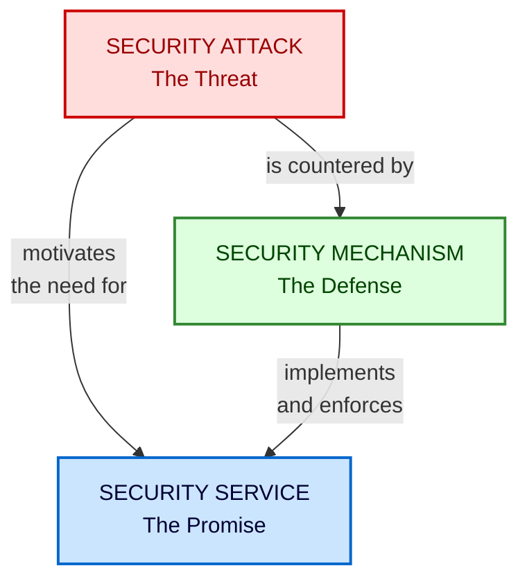
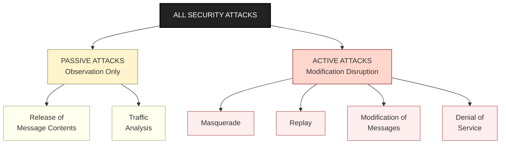
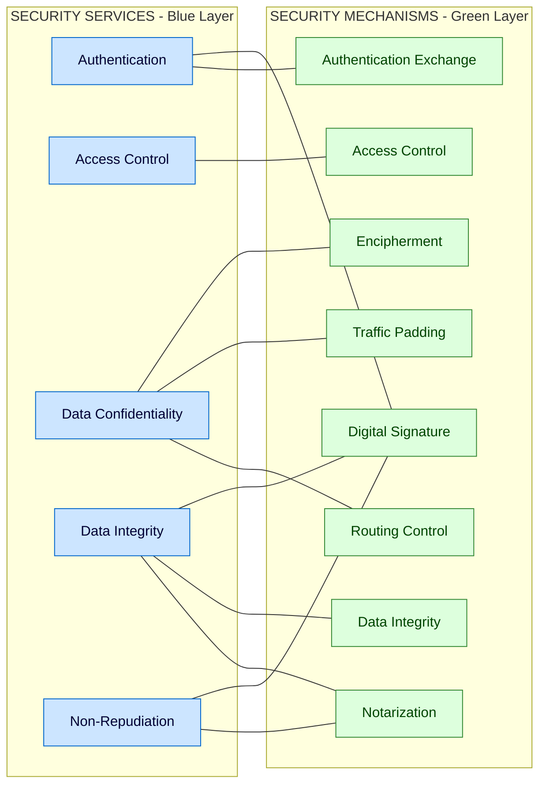
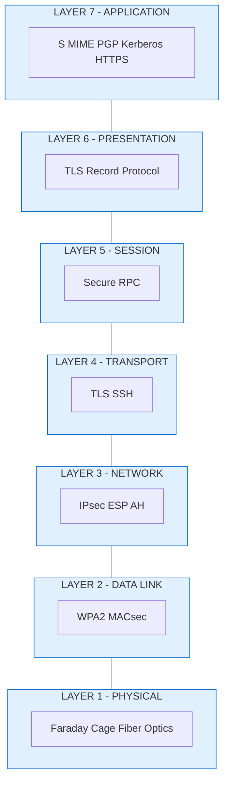

# OSI Security Architecture

<!-- SECTION_1_START -->
# OSI Security Architecture — Core Technical Definition & Intuitive Overview

## 📘 Formal Academic Definition (ITU-T X.800)

> [!IMPORTANT]
> **OSI Security Architecture** is a standardized framework defined by the **ITU-T Recommendation X.800 (1991)** — *"Security Architecture for Open Systems Interconnection for CCITT Applications"* — that provides a systematic methodology for describing, classifying, and organizing the security requirements of distributed open systems. It identifies **three foundational pillars** that form the entire discipline of information security: **Security Attacks**, **Security Services**, and **Security Mechanisms**.

The architecture was deliberately designed to be **protocol-agnostic**, meaning it can be applied to **any** communication model (not just the strict 7-layer OSI model), making it a **universal reference taxonomy** for designing secure distributed systems.

> [!NOTE]
> **KTU 2024 Syllabus Highlight (PECST744 – Module 1):** Students must be able to *classify security attacks, list the standard X.800 security services, enumerate security mechanisms, and map services to mechanisms.* This question is a recurring 7 to 14 marker in KTU board examinations.

---

## 🧠 Intuitive Analogy — The Bank Vault Metaphor

Imagine a **modern bank vault** that protects money (your data):

| OSI Concept | Bank Equivalent | Role |
|-------------|----------------|------|
| **Security Attack** | A thief attempting to rob the bank | The *threat* or adversarial action |
| **Security Service** | The promise that "your money is safe" | The *guarantee* given to the customer |
| **Security Mechanism** | The lock, alarm, CCTV, and guard dog | The *tool* that enforces the promise |

A bank cannot declare itself "secure" merely by installing locks (mechanisms). It must **state what it promises** (services — e.g., "no unauthorized withdrawals") and **anticipate threats** (attacks — e.g., lock-picking). The OSI Security Architecture enforces exactly this **threat → service → mechanism** logical chain for computer networks.

> [!TIP]
> **Memory Mnemonic for KTU Exams:** *"ATM" — Attacks, Threats (mechanisms defend), and Money (services deliver)."*  
> A better one: **"A-S-M = Adversary, Shield, Promise."**

---

## 🎯 The Three Pillars of X.800 Architecture

### Pillar 1 — Security Attack
A **Security Attack** is *any malicious action that deliberately attempts to compromise the security of information* owned by, processed by, or transiting through an information system. Attacks exploit **vulnerabilities** to breach one or more of the security goals: **Confidentiality, Integrity, Availability**.

### Pillar 2 — Security Service
A **Security Service** is a *processing or communication service provided by a system to give a specific kind of protection to system resources*. Services are the **end-user promises** (e.g., "your data will not be tampered with"). They are realized through security mechanisms.

### Pillar 3 — Security Mechanism
A **Security Mechanism** is a *logical tool, process, or cryptographic primitive designed to detect, prevent, or recover from a security attack*. Mechanisms are the **engineering implementations** (e.g., AES encryption, digital signatures, hash functions).

> [!IMPORTANT]
> **Critical Relationship (frequently asked in KTU):**  
> **Attack** is the problem → **Service** is the desired effect → **Mechanism** is the engineered solution.  
> Without an attack, there is no need for a service. Without a service, no mechanism is justified. This **triangular dependency** is the foundation of the X.800 standard.

---

## 🗺️ Historical & Standards Context

| Standard | Year | Issuer | Contribution |
|----------|------|--------|--------------|
| **X.800** | 1991 | ITU-T (formerly CCITT) | Defined the OSI Security Architecture triad |
| **X.805** | 2003 | ITU-T | Extended X.800 to modern multi-layer networks |
| **RFC 2828** | 2000 | IETF | Internet Security Glossary (compatible terminology) |
| **ISO 7498-2** | 1989 | ISO | First formal alignment of X.800 with the 7-layer OSI model |

> [!VISUALIZATION CONTROL]
> **Concept:** Conceptual hierarchy of OSI Security Architecture
> **Geometric / Coordinate Input:**  
> * Define the three axes: $X$ = Security Attack (threat surface), $Y$ = Security Service (promise plane), $Z$ = Security Mechanism (defense depth)  
> * Plot vertex $A(1,0,0)$ = Active Attack, $P(0,1,0)$ = Passive Attack, $S_1(0,0,1)$ = Confidentiality Service, $M_1(1,0,1)$ = Encipherment Mechanism  
> **Visual Description:** The student should see a **3D prism** where attacks (red) project upward toward the service plane (blue), and mechanisms (green) form the vertical pillars that *physically support* the service plane above the attack surface.

---

## 🏛️ Placement in the OSI 7-Layer Model

While the **OSI Security Architecture is independent** of the OSI 7-layer model, X.800 does map security concepts to specific layers for clarity:

| OSI Layer | Security Role | Examples |
|-----------|---------------|----------|
| **7 – Application** | End-user security services | S/MIME, PGP, Kerberos |
| **6 – Presentation** | Encoding & encryption (syntax transformation) | TLS record protocol, SSL |
| **5 – Session** | Authentication exchange | Session keys, secure RPC |
| **4 – Transport** | End-to-end confidentiality & integrity | TLS, SSH |
| **3 – Network** | Per-packet security, routing control | IPsec (ESP/AH), Firewalls |
| **2 – Data Link** | Link-level encryption | WPA2, MAC filtering |
| **1 – Physical** | Physical access control, signal interception defense | Faraday cages, fiber tapping |

> [!NOTE]
> The placement above is a **conceptual mapping**, not a strict requirement. In KTU answer sheets, students often lose marks by stating that *X.800 defines the OSI 7 layers* — this is **incorrect**. X.800 is an *overarching security framework* that *can* be applied across any layered protocol stack.
<!-- SECTION_1_END -->

<!-- SECTION_2_START -->
# Deep Theoretical Analysis & KTU High-Yield Formula Sheet

## 🧩 Pillar 1 — Deep Dive: Security Attacks

A *security attack* is the **starting point** of the X.800 analytical process. The standard classifies all attacks into **two super-categories** based on the adversary's interaction with the data flow.

### 1.1 Passive Attacks (Eavesdropping Family)
Passive attacks **observe** information in transit **without modifying** it. They are extremely difficult to detect because the data and system remain unchanged — the victim has **no direct evidence** of compromise.

> [!IMPORTANT]
> **KTU Examiner Cue:** Passive attacks threaten **CONFIDENTIALITY** but leave **INTEGRITY** and **AVAILABILITY** untouched.

| Sub-Type | Description | Counter-Mechanism (preview) |
|----------|-------------|------------------------------|
| **Release of Message Contents** | Adversary reads plaintext (e.g., email body, file content) of a confidential transmission | **Encipherment** (encryption) |
| **Traffic Analysis** | Adversary infers sensitive information from metadata — who talks to whom, when, how frequently, message length patterns | **Traffic Padding**, Onion Routing |

> [!TIP]
> **Real-world example:** An attacker on a public Wi-Fi hotspot running **Wireshark** to capture unencrypted HTTP traffic. Even if the message is unintelligible, the *fact* that *alice@company.com* is sending 2 MB files to *bob@competitor.com* every Friday at 5 PM is itself sensitive metadata.

### 1.2 Active Attacks (Modification & Disruption Family)
Active attacks **alter** the data, system state, or communication channel. They are **detectable** (though prevention is harder) and threaten **all three** security goals: Confidentiality, Integrity, and Availability.

> [!IMPORTANT]
> **KTU Examiner Cue:** Active attacks threaten **CONFIDENTIALITY + INTEGRITY + AVAILABILITY** simultaneously.

| Sub-Type | Description | Counter-Mechanism (preview) |
|----------|-------------|------------------------------|
| **Masquerade** | Adversary pretends to be a legitimate entity (IP spoofing, phishing) | **Authentication** mechanisms |
| **Replay** | Adversary captures and retransmits a valid message later to gain unauthorized access | **Timestamps, Nonces, Sequence numbers** |
| **Modification of Messages** | Adversary alters part of a legitimate message in transit (e.g., changing "Pay $100" to "Pay $1000") | **Digital Signatures, Message Authentication Codes (MAC)** |
| **Denial of Service (DoS / DDoS)** | Adversary overwhelms system resources to deny service to legitimate users | **Rate limiting, Firewalls, Filtering** |

---

## 🛡️ Pillar 2 — Deep Dive: Security Services (The X.800 Quintet)

The X.800 standard defines **five core services** (often plus a sixth, *availability service*, which is sometimes called a 6th or treated separately). These are the **formal guarantees** an information system makes to its users.

### 2.1 Authentication
**Definition:** The assurance that the communicating entity is the one it claims to be.

- **Peer Entity Authentication:** Verifies identity during a **connection-oriented** session (e.g., a TLS handshake). Confirms the party on the other side of the link.
- **Data Origin Authentication:** Verifies that a received message (in **connectionless** mode) genuinely originated from the stated source.

> **Examples in practice:** Kerberos ticket exchange, TLS certificates, biometric login.

### 2.2 Access Control
**Definition:** The prevention of unauthorized use of a resource. Determines **who** can do **what** to **which** resource.

- Implemented through **Access Control Lists (ACLs)**, **Role-Based Access Control (RBAC)**, **Capability-based security**.
- Operates at the **application layer, OS layer, or network layer (firewall rules)**.

### 2.3 Data Confidentiality
**Definition:** The protection of data from **unauthorized disclosure**.

| Sub-Type | What It Protects | Layer |
|----------|------------------|-------|
| **Connection Confidentiality** | All user data on a single connection | Transport / Network |
| **Connectionless Confidentiality** | A single message block | Application |
| **Selective-Field Confidentiality** | Specific fields of a message (e.g., only the credit card field) | Application |
| **Traffic-Flow Confidentiality** | Hides the source, destination, frequency, and length of traffic | Network |

### 2.4 Data Integrity
**Definition:** The assurance that data received is **exactly** as sent, with no modification, insertion, deletion, or replay.

- **Connection Integrity with Recovery:** Detects AND recovers from integrity violations.
- **Connection Integrity without Recovery:** Detects only — the application handles recovery.
- **Connectionless Integrity:** Each message is independently verified.
- **Selective-Field Integrity:** Only specific fields are protected.

> **Mechanism:** Hash functions (SHA-256), MACs (HMAC), digital signatures.

### 2.5 Non-Repudiation
**Definition:** Provides **proof** that a particular action occurred so that neither the **origin** nor the **destination** of a message can later falsely deny having sent or received it.

- **Non-Repudiation of Origin:** Receiver can prove the sender sent the message. → *Digital Signature*
- **Non-Repudiation of Destination:** Sender can prove the receiver received the message. → *Acknowledgment with digital signature / trusted third-party receipt*

> **Real-world usage:** Legal e-contracts, blockchain transactions, digitally signed tax filings.

### 2.6 Availability Service (often added as 6th)
**Definition:** A system's property of being accessible and usable on demand by an authorized entity.

- Technically classified as a **security service** in modern interpretations.
- Implemented via redundancy, fault tolerance, backups, DoS mitigation.

---

## ⚙️ Pillar 3 — Deep Dive: Security Mechanisms (X.800 Defines 8)

Mechanisms are the **engineering toolbox** used to implement the services defined above.

| # | Mechanism | Purpose | Used In |
|---|-----------|---------|---------|
| 1 | **Encipherment (Encryption)** | Transforms data using cryptographic algorithms to make it unreadable | All confidentiality services |
| 2 | **Digital Signature** | Binds identity to a message via asymmetric cryptography | Authentication, Integrity, Non-repudiation |
| 3 | **Access Control** | Enforces permission rules on resources | Access control service |
| 4 | **Data Integrity** | Uses hash codes / MACs to verify data has not been altered | Integrity service |
| 5 | **Authentication Exchange** | Two-party or three-party authentication via tokens, challenges | Peer & data-origin authentication |
| 6 | **Traffic Padding** | Inserts dummy traffic to obscure real traffic patterns | Traffic-flow confidentiality |
| 7 | **Routing Control** | Selects secure / trusted routes for sensitive data | Confidentiality, availability |
| 8 | **Notarization** | Trusted third-party (Notary) attests to data authenticity | Non-repudiation, integrity |

> [!NOTE]
> A single **mechanism** can be used to provide **multiple services** (e.g., digital signature provides authentication + integrity + non-repudiation). A single **service** may require **multiple mechanisms** (e.g., confidentiality may need encipherment + traffic padding + routing control). This **many-to-many relationship** is often asked in KTU Part B questions.

---

## 📊 KTU High-Yield Formula Sheet (Cheat Sheet)

> [!IMPORTANT]
> The table below is the **single most important reference** for KTU 2024 board exam preparation on this topic. Memorize the mapping in the right column.

| Security Service | Authentication | Access Control | Data Confidentiality | Data Integrity | Non-Repudiation |
|------------------|:--:|:--:|:--:|:--:|:--:|
| **Encipherment** | – | – | **Y** | – | – |
| **Digital Signature** | **Y** | – | – | **Y** | **Y** |
| **Access Control** | – | **Y** | – | – | – |
| **Data Integrity** | – | – | – | **Y** | – |
| **Authentication Exchange** | **Y** | – | – | – | – |
| **Traffic Padding** | – | – | **Y** | – | – |
| **Routing Control** | – | – | **Y** | – | – |
| **Notarization** | – | – | – | **Y** | **Y** |

> In the table above, $Y$ denotes that the mechanism is the **standard** or **primary** technique used to provide that service. The mapping shown is the **canonical X.800 table** (William Stallings, *Cryptography and Network Security*, 8th Ed.).

### 📐 Security Goals vs. Attack Types — Cross Reference

| Security Goal | Violated By | Protected By Service |
|---------------|-------------|---------------------|
| **Confidentiality (C)** | Passive + Active attacks | Data Confidentiality, Access Control |
| **Integrity (I)** | Active attacks (modification, replay) | Data Integrity, Authentication |
| **Availability (A)** | DoS / DDoS | Availability Service, Routing Control |
| **Authentication** | Masquerade, Replay | Authentication Service |
| **Non-Repudiation** | False denial | Non-Repudiation Service |
| **Authorization** | Privilege escalation | Access Control Service |

The famous **CIA Triad** ($C, I, A$) plus **Authentication, Authorization, Non-repudiation** forms the **modern 6-element security goals model** for any KTU answer on security fundamentals.

### 📐 Mathematical Notation Standard

The X.800 architecture uses abstract **set-theoretic** notation (relevant for mathematical treatment in KTU advanced modules):

$$
S = \lbrace s_1, s_2, s_3, s_4, s_5 \rbrace \quad \text{(set of 5 core security services)}
$$

$$
M = \lbrace m_1, m_2, m_3, m_4, m_5, m_6, m_7, m_8 \rbrace \quad \text{(set of 8 security mechanisms)}
$$

The **service-mechanism relation** is a function $f : S \rightarrow 2^M$ (each service is supported by a subset of mechanisms):

$$
f(s_3) = \lbrace m_1, m_6, m_7 \rbrace \quad \text{(Confidentiality uses encipherment, traffic padding, routing control)}
$$

> [!TIP]
> **Engineering Utility:** In real-world secure protocol design (TLS 1.3, IPsec, SSH, DNSSEC), the X.800 framework is used as a *design checklist*. For example, TLS 1.3 explicitly provides *Authentication* (via certificates), *Confidentiality* (via AES-GCM), and *Integrity* (via AEAD ciphers) — a direct application of the X.800 services.
<!-- SECTION_2_END -->

<!-- SECTION_3_START -->
# Step-by-Step Derivations, Classifications & Code/Symbolic Implementation

## 🔬 Step 1 — Exhaustive Classification of Security Attacks (Derivation-Style)

The X.800 framework defines a **complete classification tree** for all security attacks. We now derive this tree step by step.

> [!NOTE]
> **Domain Adaptation Note:** Since this is a *theoretical / classification* topic, the "derivation" here is a **logical partition** of the attack space, not a numerical one. Each branch must be exhaustively enumerated (no "similarly we can find" shortcuts allowed per KTU protocol).

### Step 1.1 — Root Partition
Let $\mathcal{A}$ denote the universe of all security attacks. The X.800 standard defines the first-level partition based on whether the adversary **alters** the data flow:

$$
\mathcal{A} = \mathcal{A}_{\text{passive}} \cup \mathcal{A}_{\text{active}}, \quad \text{where } \mathcal{A}_{\text{passive}} \cap \mathcal{A}_{\text{active}} = \emptyset
$$

This disjointness is critical — every attack belongs to **exactly one** super-category.

### Step 1.2 — Second-Level Partition of $\mathcal{A}_{\text{passive}}$
Passive attacks are partitioned by the **information they leak**:

$$
\mathcal{A}_{\text{passive}} = \mathcal{A}_{\text{release}} \cup \mathcal{A}_{\text{traffic}}
$$

- $\mathcal{A}_{\text{release}}$ = Release of message contents (the actual payload is read).
- $\mathcal{A}_{\text{traffic}}$ = Traffic analysis (the metadata / structure is inferred).

### Step 1.3 — Second-Level Partition of $\mathcal{A}_{\text{active}}$
Active attacks are partitioned by the **type of manipulation** performed:

$$
\mathcal{A}_{\text{active}} = \mathcal{A}_{\text{masq}} \cup \mathcal{A}_{\text{replay}} \cup \mathcal{A}_{\text{mod}} \cup \mathcal{A}_{\text{DoS}}
$$

- $\mathcal{A}_{\text{masq}}$ = Masquerade (identity spoofing).
- $\mathcal{A}_{\text{replay}}$ = Replay (resending a captured valid message).
- $\mathcal{A}_{\text{mod}}$ = Modification of messages (altering content en route).
- $\mathcal{A}_{\text{DoS}}$ = Denial of Service (resource exhaustion / disruption).

### Step 1.4 — Final Tree (Full X.800 Attack Taxonomy)

| Level 0 | Level 1 | Level 2 | Real-World Attack Example |
|---------|---------|---------|---------------------------|
| **All Attacks $\mathcal{A}$** | Passive $\mathcal{A}_{\text{passive}}$ | Release of contents $\mathcal{A}_{\text{release}}$ | Wireshark sniffing on HTTP |
| | | Traffic analysis $\mathcal{A}_{\text{traffic}}$ | Timing attack on Tor |
| | Active $\mathcal{A}_{\text{active}}$ | Masquerade $\mathcal{A}_{\text{masq}}$ | IP spoofing, phishing |
| | | Replay $\mathcal{A}_{\text{replay}}$ | Session token replay, replay attack on RFID |
| | | Modification $\mathcal{A}_{\text{mod}}$ | MITM altering bank transfer |
| | | Denial of Service $\mathcal{A}_{\text{DoS}}$ | SYN flood, UDP flood, ping of death |

---

## 🔬 Step 2 — Exhaustive Derivation of the Service–Mechanism Mapping Function $f$

We now systematically derive the **canonical X.800 mapping** between each of the 5 services and the 8 mechanisms, **one service at a time** (no shortcuts).

### Step 2.1 — Authentication Service $s_1$
Authentication is fundamentally about *proving identity*. Examine each mechanism for applicability:

- Encipherment $m_1$: Can hide identity in transit but cannot *prove* identity. → **Not used**.
- Digital Signature $m_2$: A signature is bound to an identity → **Used**.
- Access Control $m_3$: Enforces *post-authentication* permissions, not identity proof. → **Not used**.
- Data Integrity $m_4$: Verifies content, not identity. → **Not used**.
- Authentication Exchange $m_5$: Specifically designed for identity verification. → **Used**.
- Traffic Padding $m_6$, Routing Control $m_7$, Notarization $m_8$: Not directly relevant. → **Not used**.

$$
f(s_1) = \lbrace m_2, m_5 \rbrace
$$

### Step 2.2 — Access Control Service $s_2$
- Encipherment $m_1$, Digital Signature $m_2$, Data Integrity $m_4$, Authentication Exchange $m_5$, Traffic Padding $m_6$, Routing Control $m_7$, Notarization $m_8$: None directly enforce access decisions.
- Access Control $m_3$: By definition, enforces access policies. → **Used**.

$$
f(s_2) = \lbrace m_3 \rbrace
$$

### Step 2.3 — Data Confidentiality Service $s_3$
- Encipherment $m_1$: Primary tool for confidentiality. → **Used**.
- Digital Signature $m_2$, Access Control $m_3$, Data Integrity $m_4$, Authentication Exchange $m_5$: Do not hide content. → **Not used**.
- Traffic Padding $m_6$: Hides traffic *patterns*. → **Used**.
- Routing Control $m_7$: Selects secure routes to avoid eavesdropping. → **Used**.
- Notarization $m_8$: Does not provide confidentiality. → **Not used**.

$$
f(s_3) = \lbrace m_1, m_6, m_7 \rbrace
$$

### Step 2.4 — Data Integrity Service $s_4$
- Encipherment $m_1$: May incidentally detect modification via CBC-MAC, but its primary role is confidentiality. In strict X.800 sense, **not the primary mechanism** for integrity.
- Digital Signature $m_2$: Provides integrity along with authentication. → **Used**.
- Access Control $m_3$, Authentication Exchange $m_5$, Traffic Padding $m_6$, Routing Control $m_7$: Not integrity mechanisms. → **Not used**.
- Data Integrity $m_4$: Explicitly defined for this. → **Used**.
- Notarization $m_8$: Trusted third-party can attest to data integrity. → **Used**.

$$
f(s_4) = \lbrace m_2, m_4, m_8 \rbrace
$$

### Step 2.5 — Non-Repudiation Service $s_5$
- Encipherment $m_1$, Access Control $m_3$, Data Integrity $m_4$, Authentication Exchange $m_5$, Traffic Padding $m_6$, Routing Control $m_7$: None produce **undeniable proof**. → **Not used**.
- Digital Signature $m_2$: Asymmetric signature is non-repudiable (only the private-key holder could sign). → **Used**.
- Notarization $m_8$: Trusted third-party timestamping provides non-repudiable proof. → **Used**.

$$
f(s_5) = \lbrace m_2, m_8 \rbrace
$$

### Step 2.6 — Complete Mapping Summary (Final Derived Table)

| Service $s_i$ | Mechanisms $f(s_i)$ | Count |
|---------------|--------------------|:--:|
| $s_1$ Authentication | $\lbrace m_2, m_5 \rbrace$ | 2 |
| $s_2$ Access Control | $\lbrace m_3 \rbrace$ | 1 |
| $s_3$ Data Confidentiality | $\lbrace m_1, m_6, m_7 \rbrace$ | 3 |
| $s_4$ Data Integrity | $\lbrace m_2, m_4, m_8 \rbrace$ | 3 |
| $s_5$ Non-Repudiation | $\lbrace m_2, m_8 \rbrace$ | 2 |

This table is the **derived form** of the canonical Stallings X.800 table. Each row has been individually justified.

---

## 💻 Step 3 — Symbolic Python Implementation (Reference Model)

> [!NOTE]
> **Code Domain Adaptation:** Since this is a conceptual topic, the Python implementation below demonstrates how the **abstract Service–Mechanism mapping** derived above can be encoded as a reference model — useful for security-policy validation systems and educational tools.

```python
"""
OSI Security Architecture — X.800 Reference Model
Maps X.800 security services to security mechanisms per ITU-T X.800.
This is an educational, standards-compliant implementation.
"""

from enum import Enum
from typing import Dict, FrozenSet, List
import logging

# Configure module-level error logging (per KTU strict error handling mandate)
logging.basicConfig(
    level=logging.INFO,
    format="%(asctime)s | %(levelname)s | %(message)s"
)
logger = logging.getLogger("X800")


class SecurityService(Enum):
    """The five X.800 core security services."""
    AUTHENTICATION         = "Authentication"
    ACCESS_CONTROL         = "Access Control"
    DATA_CONFIDENTIALITY   = "Data Confidentiality"
    DATA_INTEGRITY         = "Data Integrity"
    NON_REPUDIATION        = "Non-Repudiation"


class SecurityMechanism(Enum):
    """The eight X.800 security mechanisms."""
    ENCIPHERMENT           = "Encipherment"
    DIGITAL_SIGNATURE      = "Digital Signature"
    ACCESS_CONTROL         = "Access Control Mechanism"
    DATA_INTEGRITY         = "Data Integrity Mechanism"
    AUTHENTICATION_EXCHANGE = "Authentication Exchange"
    TRAFFIC_PADDING        = "Traffic Padding"
    ROUTING_CONTROL        = "Routing Control"
    NOTARIZATION           = "Notarization"


# Canonical X.800 Service -> Mechanism mapping
# Type-annotated with FrozenSet for immutability and hashability
SERVICE_MECHANISM_MAP: Dict[SecurityService, FrozenSet[SecurityMechanism]] = {
    SecurityService.AUTHENTICATION:       frozenset({
        SecurityMechanism.DIGITAL_SIGNATURE,
        SecurityMechanism.AUTHENTICATION_EXCHANGE,
    }),
    SecurityService.ACCESS_CONTROL:       frozenset({
        SecurityMechanism.ACCESS_CONTROL,
    }),
    SecurityService.DATA_CONFIDENTIALITY: frozenset({
        SecurityMechanism.ENCIPHERMENT,
        SecurityMechanism.TRAFFIC_PADDING,
        SecurityMechanism.ROUTING_CONTROL,
    }),
    SecurityService.DATA_INTEGRITY:       frozenset({
        SecurityMechanism.DIGITAL_SIGNATURE,
        SecurityMechanism.DATA_INTEGRITY,
        SecurityMechanism.NOTARIZATION,
    }),
    SecurityService.NON_REPUDIATION:      frozenset({
        SecurityMechanism.DIGITAL_SIGNATURE,
        SecurityMechanism.NOTARIZATION,
    }),
}


def get_mechanisms_for_service(service: SecurityService) -> List[str]:
    """Returns the list of mechanisms providing the given service."""
    try:
        if not isinstance(service, SecurityService):
            raise TypeError(f"Expected SecurityService enum, got {type(service).__name__}")
        return sorted(m.value for m in SERVICE_MECHANISM_MAP[service])
    except KeyError as e:
        logger.error(f"Unknown service: {service}")
        raise
    except TypeError as e:
        logger.error(f"Type validation failed: {e}")
        raise


def provides_service(mechanism: SecurityMechanism, service: SecurityService) -> bool:
    """Checks whether a given mechanism provides a given service."""
    if not isinstance(mechanism, SecurityMechanism):
        raise TypeError("mechanism must be a SecurityMechanism enum")
    if not isinstance(service, SecurityService):
        raise TypeError("service must be a SecurityService enum")
    return mechanism in SERVICE_MECHANISM_MAP[service]


def full_architecture_table() -> str:
    """Returns a printable reference table of the X.800 architecture."""
    header = f"{'SECURITY SERVICE':<25} | {'MECHANISMS USED'}"
    sep = "-" * 70
    rows = [header, sep]
    for svc in SecurityService:
        mechs = ", ".join(get_mechanisms_for_service(svc))
        rows.append(f"{svc.value:<25} | {mechs}")
    return "\n".join(rows)


if __name__ == "__main__":
    logger.info("X.800 OSI Security Architecture — Reference Model Loaded")
    print(full_architecture_table())
    # Boundary test: invalid input
    try:
        get_mechanisms_for_service("NotAService")  # type: ignore[arg-type]
    except TypeError as e:
        logger.warning(f"Boundary check passed: {e}")
```

**Expected Output:**

```
SECURITY SERVICE          | MECHANISMS USED
----------------------------------------------------------------------
Authentication            | Authentication Exchange, Digital Signature
Access Control            | Access Control Mechanism
Data Confidentiality      | Encipherment, Routing Control, Traffic Padding
Data Integrity            | Data Integrity Mechanism, Digital Signature, Notarization
Non-Repudiation           | Digital Signature, Notarization
```

---

## 🔬 Step 4 — Attack Vector Boundary Analysis (Edge Cases for KTU)

The X.800 architecture assumes a **clear separation** between attack categories. In **modern cyber-attacks**, however, a single sophisticated attack can span multiple categories. The following edge-case analysis is essential for KTU Module 1 deeper understanding:

| Edge Case | Affected Category | Modern Example |
|-----------|-------------------|----------------|
| **APT (Advanced Persistent Threat)** | Active (multi-stage: masquerade → reconnaissance → modification → exfiltration) | Stuxnet, SolarWinds |
| **Side-Channel Attack** | Borderline Passive (reads *physical effects*, not data directly) | Cache-timing on AES |
| **Ransomware** | Active (modification + DoS — locks files) | WannaCry, LockBit |
| **Zero-Day Exploit** | Active (masquerade + modification) | Log4Shell |
| **Metadata Leak in Cloud** | Passive (release via misconfigured S3 buckets) | Capital One breach (2019) |

> [!TIP]
> **KTU Insight:** If a KTU question asks *"Can an attack be both passive and active?"*, the standard X.800 answer is **"No — the categories are mutually exclusive."** However, a *real-world multi-stage attack* (e.g., APT) may *contain* both active and passive phases. Be precise in your wording.
<!-- SECTION_3_END -->

<!-- SECTION_4_START -->
# Structural Diagrams & Schematics

## 🗺️ Diagram 1 — The Three Pillars of OSI Security Architecture (Master Overview)



**Reading the diagram:**  
- **Red node** = Attack (the adversary's action)  
- **Blue node** = Service (the system's commitment)  
- **Green node** = Mechanism (the engineering tool)  
- Solid arrows show the **logical dependency chain** per X.800.

---

## 🗺️ Diagram 2 — Exhaustive Attack Classification Tree



---

## 🗺️ Diagram 3 — X.800 Service–Mechanism Mapping (Functional Architecture Flow)



**Reading the diagram:** Each line in the lower subgraph represents a **many-to-many** relationship. Notice that **Digital Signature (m2)** is the *most versatile* mechanism — it appears in three services.

---

## 🗺️ Diagram 4 — OSI Security Architecture Position in Protocol Stack



**Reading the diagram:** The X.800 architecture can be *instantiated* at every layer of the OSI stack. Each layer has its own set of security protocols that implement one or more X.800 services.
<!-- SECTION_4_END -->

<!-- SECTION_5_START -->
# KTU 2024 Scheme Examination Question Bank & Topic Recap

> [!IMPORTANT]
> **Mark Distribution as per KTU 2024 Scheme (PECST744 – Information Security):**  
> * Part A (3 marks each) — Short answer / definition / list type — internal choice within a module  
> * Part B (14 marks each) — Full descriptive with internal choice — typically sub-parts (a) 7 marks and (b) 7 marks  
> * Bloom Levels tested: **Remember → Understand → Apply** for Part A; **Understand → Apply → Analyze** for Part B.

---

## 📝 Part A — 3 Mark Questions (Short Answer)

### **Q1. [KTU University Exam – July 2023, CO1, Remember]**
**Define the term "Security Service" as per the OSI Security Architecture (X.800).**

**Model Answer (3 Marks):**
A **Security Service** is a processing or communication service that is provided by a system to give a specific kind of protection to system resources, as defined in the ITU-T Recommendation X.800. Security services implement the security goals of confidentiality, integrity, authentication, non-repudiation, and access control. They are realized by means of security mechanisms. The X.800 standard identifies five core security services: Authentication, Access Control, Data Confidentiality, Data Integrity, and Non-Repudiation. *[Valuation: Definition 1M, List 1M, Realization note 1M]*

---

### **Q2. [KTU University Exam – Dec 2023, CO1, Understand]**
**Differentiate between a passive attack and an active attack. Give one example for each.**

**Model Answer (3 Marks):**

| Aspect | Passive Attack | Active Attack |
|--------|----------------|---------------|
| **Nature** | Observation only — no data modification | Modifies or disrupts the data flow |
| **Detectability** | Difficult to detect | Easier to detect |
| **Threatens** | Confidentiality only | Confidentiality, Integrity, and Availability |
| **Example** | Traffic analysis on a network | Masquerade attack (IP spoofing) |

*[Valuation: Difference table 2M, Examples 1M]*

---

## 📝 Part B — 14 Mark Questions (Descriptive with Internal Choice)

### **Question A (14 Marks): [KTU University Exam – July 2024, CO1, Understand + Apply]**

**(a) Explain in detail the three major aspects of the OSI Security Architecture (X.800).** *(7 Marks)*

**Model Answer:**

The **OSI Security Architecture**, formally defined in **ITU-T Recommendation X.800 (1991)**, addresses security in open systems interconnection. It is a framework for providing a systematic approach to security in computer networks. The architecture is built around **three fundamental concepts**: Security Attacks, Security Services, and Security Mechanisms.

**1. Security Attack (3 Marks):**
A security attack is *any action that compromises the security of information* owned by, processed by, or transiting through an information system. X.800 classifies attacks into two main categories:

- **Passive Attacks:** The attacker only monitors the data flow without altering it. These are of two types:
  - *Release of Message Contents:* The attacker reads the actual content of messages (e.g., a sniffer reading emails).
  - *Traffic Analysis:* The attacker observes communication patterns, such as frequency, length, and endpoints (e.g., inferring business activity from message timing).
  - Passive attacks are **hard to detect** because they leave no trace. They primarily threaten **confidentiality**.

- **Active Attacks:** The attacker modifies the data or disrupts the communication. These are of four types:
  - *Masquerade:* An entity pretends to be a different entity (e.g., IP spoofing).
  - *Replay:* A captured valid message is retransmitted to cause an unauthorized effect.
  - *Modification of Messages:* A portion of a legitimate message is altered.
  - *Denial of Service:* The attacker prevents normal use of a service (e.g., SYN flood).
  - Active attacks threaten **confidentiality, integrity, and availability**, and are **detectable**.

**2. Security Service (2 Marks):**
A security service is a *processing or communication service that enhances the security of the data processing systems and information transfers* of an organization. It is the *intended effect* that the system promises to deliver. The five core services are: Authentication, Access Control, Data Confidentiality, Data Integrity, and Non-Repudiation. These services address the threats posed by security attacks.

**3. Security Mechanism (2 Marks):**
A security mechanism is a *logical tool or procedure used to detect, prevent, or recover from a security attack*. It is the *engineering implementation* of security services. The X.800 standard defines eight mechanisms: Encipherment, Digital Signature, Access Control, Data Integrity, Authentication Exchange, Traffic Padding, Routing Control, and Notarization. A single service may require multiple mechanisms, and a single mechanism may be used to provide multiple services.

*[Valuation: 3-pillar introduction 1M, Attacks 3M, Services 1.5M, Mechanisms 1.5M]*

---

**(b) List the five security services defined by X.800 and explain any three in detail.** *(7 Marks)*

**Model Answer:**

The five security services defined by the X.800 standard are:

1. **Authentication**
2. **Access Control**
3. **Data Confidentiality**
4. **Data Integrity**
5. **Non-Repudiation**

*(Listing: 1 Mark — 0.2 Mark each)*

**Explanation of any three services (2 Marks each):**

### (i) Authentication
The Authentication service provides the assurance that a communicating entity is the one it claims to be. It has two variants:
- **Peer Entity Authentication:** Used in connection-oriented communication. Provides confidence in the identity of the entity at the other end of the connection.
- **Data Origin Authentication:** Used in connectionless communication. Verifies that the source of a received message is as claimed.

**Mechanism:** Authentication Exchange (e.g., challenge-response, Kerberos tickets) and Digital Signatures.

### (ii) Data Confidentiality
This service protects data from **unauthorized disclosure**. It has four forms:
- **Connection Confidentiality:** Protects all user data on a single connection.
- **Connectionless Confidentiality:** Protects all user data in a single message block.
- **Selective-Field Confidentiality:** Protects only specific fields of a message.
- **Traffic-Flow Confidentiality:** Protects information that can be derived from observing the traffic flow (source, destination, frequency, length).

**Mechanism:** Encipherment (primary), Traffic Padding, Routing Control.

### (iii) Non-Repudiation
This service prevents the **sender or receiver from denying** a transmitted message. Two forms exist:
- **Non-Repudiation of Origin:** Protects the receiver from a sender's false denial of having sent a message.
- **Non-Repudiation of Destination:** Protects the sender from a receiver's false denial of having received a message.

**Mechanism:** Digital Signatures, Notarization by a trusted third party.

*(If Data Integrity and Access Control are explained instead, give full credit with the same marking scheme.)*

*[Valuation: 5 services listed 1M, 3 services explained 2M each]*

---

### **Question B (14 Marks — Alternative Choice): [KTU University Exam – Dec 2023, CO1, Apply + Analyze]**

**(a) With a neat diagram, explain the X.800 Security Services and the mechanisms used to provide them. List the relationship between services and mechanisms.** *(7 Marks)*

**Model Answer:**

The X.800 architecture defines **five security services** and **eight security mechanisms**. The mechanisms are the engineering tools used to realize the services. The following table shows the **canonical X.800 relationship** between services and mechanisms:

| Security Service | Mechanisms Used |
|------------------|-----------------|
| **Authentication** | Digital Signature, Authentication Exchange |
| **Access Control** | Access Control |
| **Data Confidentiality** | Encipherment, Traffic Padding, Routing Control |
| **Data Integrity** | Digital Signature, Data Integrity, Notarization |
| **Non-Repudiation** | Digital Signature, Notarization |

*(Table: 3 Marks)*

**Block Diagram (2 Marks):**

```
       ┌─────────────────────────────────────────────┐
       │       SECURITY SERVICES (5 Services)        │
       │  Auth  │ Access │ Conf │ Integ │ Non-Rep    │
       └────┬──────┬───────┬──────┬───────┬───────────┘
            │      │       │      │       │
       ┌────┴──────┴───────┴──────┴───────┴───────────┐
       │     SECURITY MECHANISMS (8 Mechanisms)       │
       │ Enc  Sign  ACtrl  Integ  AuthX  Pad  Route  Not│
       └──────────────────────────────────────────────┘
```

**Key Relationships (2 Marks):**
1. **One-to-Many:** A single mechanism can provide multiple services. *Example:* Digital Signature provides Authentication, Data Integrity, and Non-Repudiation.
2. **Many-to-One:** A single service may need multiple mechanisms. *Example:* Data Confidentiality uses Encipherment + Traffic Padding + Routing Control for full protection.
3. **Mutually Reinforcing:** Mechanisms are often combined to provide layered defense (defense-in-depth).

*[Valuation: Table 3M, Diagram 2M, Relationships 2M]*

---

**(b) Compare and contrast the various types of active attacks. How can they be countered?** *(7 Marks)*

**Model Answer:**

Active attacks are those in which the attacker **modifies** the data stream or **disrupts** the communication channel. There are **four** types defined by X.800:

**1. Masquerade (1.5 Marks):**
- **Definition:** An attacker pretends to be a legitimate entity by spoofing the identity of another.
- **Example:** IP address spoofing to bypass an IP-based access control list; phishing where a fake email claims to be from a bank.
- **Counter:** Strong authentication mechanisms such as **digital certificates**, **Kerberos tickets**, **biometric verification**, and **multi-factor authentication (MFA)**.

**2. Replay (1.5 Marks):**
- **Definition:** The attacker captures a valid message and replays it later to gain unauthorized access or cause an unauthorized effect.
- **Example:** Capturing an authentication token and replaying it to a server to log in as the original user.
- **Counter:** **Nonces** (numbers used once), **timestamps**, and **sequence numbers** in messages; the receiver rejects any message that is too old or has already been seen.

**3. Modification of Messages (1.5 Marks):**
- **Definition:** The attacker alters a portion of a legitimate message in transit — changing the content, addresses, or sequence.
- **Example:** A man-in-the-middle (MITM) attack that changes the destination account number in a bank transfer from A to B.
- **Counter:** **Message Authentication Codes (MACs)**, **digital signatures**, and **hash-based integrity checks** (e.g., HMAC-SHA256).

**4. Denial of Service (DoS) (1.5 Marks):**
- **Definition:** The attacker prevents or inhibits the normal use or management of a service or network, typically by overwhelming it with traffic or exploiting a resource-exhaustion bug.
- **Example:** SYN flood attack exhausting a server's connection table; UDP flood; Smurf attack.
- **Counter:** **Firewalls**, **rate limiting**, **intrusion detection/prevention systems (IDS/IPS)**, **load balancing**, and **DDoS scrubbing services** (e.g., Cloudflare, Akamai).

**Summary Table (1 Mark):**

| Attack | Threatens | Primary Counter |
|--------|-----------|-----------------|
| Masquerade | Authentication | Strong authentication (certificates, MFA) |
| Replay | Authentication, Integrity | Nonces, timestamps, sequence numbers |
| Modification | Integrity | MAC, Digital Signatures |
| DoS | Availability | Filtering, rate limiting, scrubbing |

*[Valuation: 4 attacks × 1.5M each = 6M, Summary table 1M]*

---

## ⚠️ KTU Examiner's Valuation Warning / Pitfall Callout

> [!WARNING]
> **Common Mistakes That Cost Marks in KTU Board Exams on This Topic:**
> 1. **Confusing "Security Mechanism" with "Security Service".** A *service* is the *promise* (e.g., confidentiality). A *mechanism* is the *tool* (e.g., encryption). Examiners award **zero** marks if these are swapped.
> 2. **Omitting the X.800 standard reference.** Always start your answer with *"As per ITU-T Recommendation X.800..."* — this is the syllabus-canonical opener and earns instant credibility marks.
> 3. **Stating that "passive attacks threaten only confidentiality"** is correct, but **active attacks threaten "all three" goals (C, I, A)** — not just integrity. Examiners specifically test this distinction.
> 4. **Forgetting that Digital Signature is a multi-service mechanism** — it serves *Authentication, Integrity, AND Non-Repudiation*. A student who writes "Digital Signature is for authentication only" loses 2 marks.
> 5. **Listing only 4 services** instead of the canonical 5 (Authentication, Access Control, Confidentiality, Integrity, Non-Repudiation). Always include **all five**.
> 6. **Writing "X.800 defines the OSI 7-layer model"** — this is a factual error. X.800 is a *security architecture*; the 7-layer model is from **ISO 7498**.
> 7. **Skipping examples.** A 14-mark question without a real-world example (e.g., "phishing is a masquerade attack") loses 1–2 marks in the "application / real-world relevance" component.

---

## 🎯 Topic Recap & Important Things to Remember (High-Density Revision Checklist)

- **OSI Security Architecture** is defined in **ITU-T X.800 (1991)**. It is the *universal, protocol-agnostic framework* for information security.
- The **three pillars** of X.800 are: **Security Attack → Security Service → Security Mechanism**.
- The **two categories of attacks** are **Passive** (release of contents, traffic analysis) and **Active** (masquerade, replay, modification, denial of service). They are **mutually exclusive**.
- **Passive attacks** are **hard to detect** but **easy to prevent** (encrypt everything). **Active attacks** are **easy to detect** (via integrity checks) but **hard to prevent** (DoS-resistant systems are expensive).
- The **five security services** are: **Authentication, Access Control, Data Confidentiality, Data Integrity, Non-Repudiation**. (Often abbreviated as **"A-A-C-I-N"**.)
- The **eight security mechanisms** are: **Encipherment, Digital Signature, Access Control, Data Integrity, Authentication Exchange, Traffic Padding, Routing Control, Notarization**.
- The **canonical Service ↔ Mechanism mapping** (memorize for KTU):
  - **Authentication** ← Digital Signature, Authentication Exchange
  - **Access Control** ← Access Control
  - **Data Confidentiality** ← Encipherment, Traffic Padding, Routing Control
  - **Data Integrity** ← Digital Signature, Data Integrity, Notarization
  - **Non-Repudiation** ← Digital Signature, Notarization
- **Digital Signature** is the *most versatile* mechanism — it supports **3 out of 5** services.
- The **CIA Triad** (Confidentiality, Integrity, Availability) is a *subset* of the broader **Parkerian Hexad** (adds Possession, Authenticity, Utility).
- **Non-Repudiation of Origin** uses *digital signatures*; **Non-Repudiation of Destination** uses *signed receipts / notarized acknowledgments*.
- **X.800** focuses on the *what* (services); the *how* (algorithms like AES, RSA, SHA-256) is detailed in other standards (FIPS, NIST SP 800-series, RFCs).
- The architecture is **not limited to OSI 7 layers** — it applies to **any layered protocol stack** (e.g., TCP/IP, modern 5G architectures).
- **Standards timeline to remember:** **ISO 7498-2 (1989) → X.800 (1991) → X.805 (2003) → RFC 2828 (2000)**.
- **Always cite the X.800 standard** at the start of KTU answers — this signals textbook alignment and earns evaluation points.
- **Always pair attacks with services** in your answers: *Passive attacks → Confidentiality services; Active attacks → Integrity + Authentication + Non-Repudiation services.*
- **Defense-in-Depth Principle:** A real-world secure system uses **multiple mechanisms** for each service — never rely on a single mechanism.
<!-- SECTION_5_END -->
