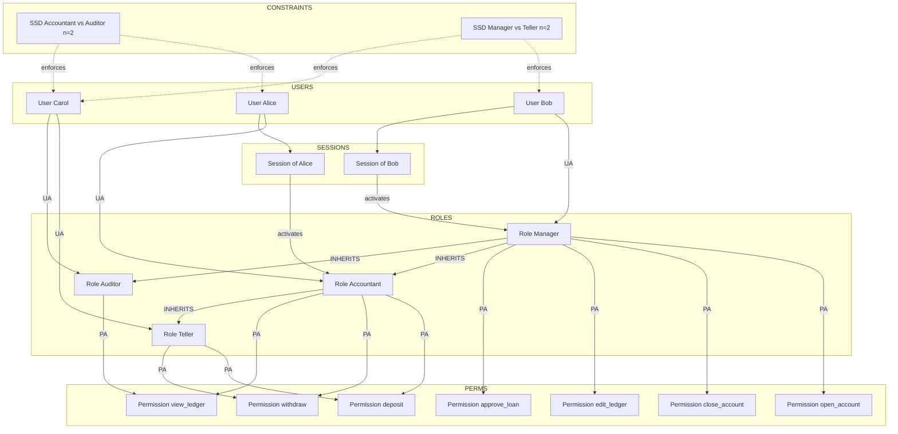
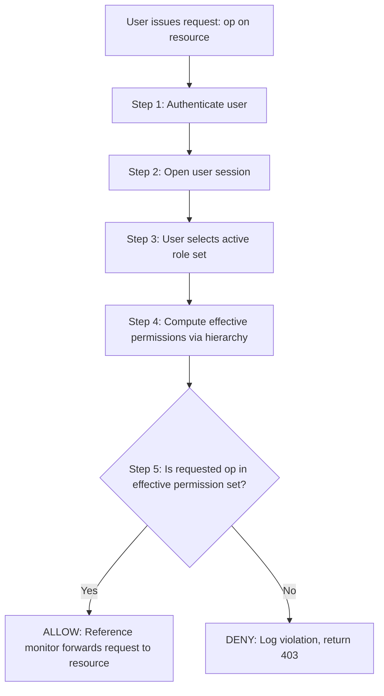
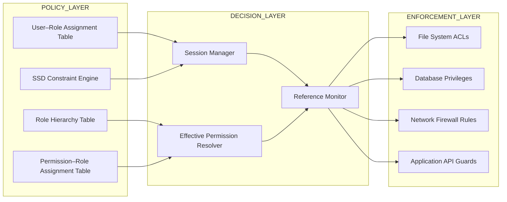

# Role-based access control.

<!-- SECTION_1_START -->
# Role-Based Access Control (RBAC)

## 1.1 Formal Definition (KTU 2024 Syllabus Terminology)

> [!IMPORTANT]
> **Role-Based Access Control (RBAC)** is a policy-neutral access control mechanism defined around **roles** and **privileges**. The central idea, formalized by the **NIST (National Institute of Standards and Technology) standard INCITS 359-2012**, is that *permissions are assigned to roles, and roles are assigned to users*. A user gains the ability to perform a certain operation only by virtue of being a member of an appropriate role.

Mathematically, RBAC can be expressed as a relation:

$$\text{Authorize}(u, op) \iff \exists \, r \in \text{Roles}(u) \; : \; (op, r) \in \text{PA}$$

where $\text{Roles}(u)$ is the set of roles assigned to user $u$, and $\text{PA}$ is the **Permission–Role Assignment** relation. The user never receives a permission directly; it must be mediated through a role.

> [!NOTE]
> **KTU 2024 Highlight — PECST744 Module 1**
> RBAC is introduced as a *non-discretionary* access control model that sits between **DAC (Discretionary Access Control)** and **MAC (Mandatory Access Control)** in flexibility. It is the de-facto standard in modern enterprise operating systems, databases, and cloud platforms such as AWS IAM, Azure RBAC, and Oracle DB.

## 1.2 Conceptual Analogy — The Hospital

Imagine a large multi-specialty hospital. The hospital does not grant access rights to individual doctors one by one. Instead, it defines **roles** such as *Cardiologist*, *Nurse*, *Receptionist*, *Radiologist*, and *Pharmacist*. Each role is bundled with a fixed set of permissions:

- A **Cardiologist** can read cardiac MRI reports, prescribe cardiac drugs, and view patient history.
- A **Nurse** can update vital signs, view assigned ward records, but cannot prescribe medication.
- A **Receptionist** can book appointments and verify insurance, but cannot read clinical data.

When a new doctor joins, the administrator simply **assigns a role**; she inherits all permissions of that role instantly. If her job changes, the administrator **reassigns a different role** rather than editing individual permissions. This is exactly how RBAC works in computer systems.

## 1.3 Core Components of RBAC

The NIST RBAC reference model identifies four foundational elements:

| Component | Symbol | Description |
|---|---|---|
| Users | $U$ | Human operators, services, or processes that need access |
| Roles | $R$ | Named job functions within the organization |
| Permissions | $P$ | Approved operations on resources (e.g., *read*, *write*, *execute*) |
| Sessions | $S$ | A mapping of a user to a subset of her activated roles at runtime |

> [!TIP]
> **Geometric Intuition:** Picture a *triangle* with **Users** at the top-left, **Roles** at the top-right, and **Permissions** at the bottom. The two upper vertices are joined to the role hub by relations $UA$ (User–Assignment) and $PA$ (Permission–Assignment). The user never touches the permission directly — the role mediates the relationship. This triangular decoupling is what makes RBAC easy to administer at scale.

## 1.4 Why RBAC Exists — Problems with Predecessors

Before RBAC, two dominant models existed:

- **DAC (Discretionary Access Control):** The resource owner decides who can access it. Problem: the owner's authority can be misused or transferred unintentionally. Hard to audit.
- **MAC (Mandatory Access Control):** The system enforces access based on *security labels* and *clearances*. Highly secure, but rigid and expensive; mostly used in military systems.

RBAC was proposed by **David Ferraiolo and Rick Kuhn in 1992** to combine the *administrative simplicity of DAC* with the *policy enforcement strength of MAC*, while remaining *policy-neutral* — i.e., the model can express any access policy the organization desires.

> [!IMPORTANT]
> **Key Principle — Least Privilege:** A user should be granted only the **minimum set of permissions** necessary to perform her duties. RBAC operationalizes this principle by confining the user to a *role-bounded* view of the system.

> [!VISUALIZATION CONTROL]
> **Concept:** RBAC relationship triangle — users, roles, permissions
> **GeoGebra / Desmos Input Equations:**
> * `Triangle((0,1),(4,1),(2,4))` (geometric triangle)
> * `Point((0,1))` labeled `U`, `Point((4,1))` labeled `R`, `Point((2,4))` labeled `P`
> **Visual Description:** A triangle is rendered with Users at one base vertex, Roles at the other base vertex, and Permissions at the apex. Two edges ($UA$ on the left, $PA$ on the right) connect Users→Roles and Roles→Permissions. Notice that there is **no direct edge** between Users and Permissions — this visually enforces that permissions can only flow *through* a role.

<!-- SECTION_1_END -->

<!-- SECTION_2_START -->
# Deep Theoretical Analysis of RBAC

## 2.1 The Four NIST Reference Models

The NIST standard defines a **family of models** of increasing expressiveness. They are not competitors — they are *layered* building blocks.

### 2.1.1 RBAC$_0$ — The Core Model

This is the minimal model. It defines:

- A set of **users** $U$, **roles** $R$, **permissions** $P$, and **sessions** $S$.
- A **User–Role Assignment** relation $UA \subseteq U \times R$.
- A **Permission–Role Assignment** relation $PA \subseteq P \times R$.
- A function `user_sessions: U → 2^S`.
- A function `session_roles: S → 2^R`.
- A function `available_permissions: S → 2^P` defined as:

$$\text{available\_permissions}(s) = \bigcup_{r \in \text{session\_roles}(s)} \;\bigcup_{p \,:\, (p,r) \in PA} \{p\}$$

### 2.1.2 RBAC$_1$ — Hierarchical RBAC

Extends RBAC$_0$ by adding a **role hierarchy** (partial order) $\geq$ on $R$:

$$r_1 \geq r_2 \;\Longleftrightarrow\; \text{any user assigned } r_1 \text{ implicitly has } r_2 \text{'s permissions}$$

Inheritance may be **strict** (no multiple inheritance) or **general** (a role may inherit from multiple senior roles). The hierarchy is typically drawn as a **Hasse diagram**.

> [!NOTE]
> **Real-world engineering utility:** Hierarchical RBAC models the org chart of any enterprise. A *SeniorEngineer* role inherits everything an *Engineer* role can do, plus additional duties. This avoids duplicating permission assignments.

### 2.1.3 RBAC$_2$ — Constrained RBAC

Adds **separation of duty (SoD) constraints** to RBAC$_0$:

- **Static Separation of Duty (SSD):** No user may be a member of *two mutually exclusive roles* simultaneously. Formally, given an SSD set $SSD \subseteq 2^R \times \mathcal{N}$:

$$\forall (rs, n) \in SSD : \vert \{u \in U \; :\; \text{roles}(u) \cap rs \geq n\}\vert < n$$

In plain English: in any conflicting role set $rs$, fewer than $n$ users may hold $n$ or more roles from that set.

- **Dynamic Separation of Duty (DSD):** Users *may* hold conflicting roles, but they cannot **activate both within the same session**.

> [!IMPORTANT]
> **Why SoD matters:** It prevents **fraud and collusion**. A clerk who prepares a payment voucher must not be the same person who approves it. By placing `Clerk_Prepares_Payment` and `Manager_Approves_Payment` in a conflicting SSD set with $n=2$, the system mathematically *guarantees* no single user has both roles.

### 2.1.4 RBAC$_3$ — The Consolidated Model

Combines RBAC$_1$ and RBAC$_2$. The most expressive and the most commonly deployed in commercial products.

> [!TIP]
> **Rule of thumb for KTU exams:**
> * RBAC$_0$ → *core*
> * RBAC$_1$ → *core + hierarchy*
> * RBAC$_2$ → *core + constraints*
> * RBAC$_3$ → *core + hierarchy + constraints*

## 2.2 Formal Property Sheet — RBAC

| Property | Symbol / Formula | Meaning | Used In |
|---|---|---|---|
| Role Activation | $r \in \text{session\_roles}(s)$ | A role made active in session $s$ | RBAC$_0$ |
| Permission Inheritance | $r_1 \geq r_2 \Rightarrow \text{perms}(r_1) \supseteq \text{perms}(r_2)$ | Senior role inherits junior's permissions | RBAC$_1$ |
| Static SoD | $\vert \{u : \vert \text{roles}(u) \cap rs \vert \geq n\} \vert = 0$ | No user has $n$ roles from conflicting set $rs$ | RBAC$_2$ |
| Dynamic SoD | $\forall s : \vert \text{session\_roles}(s) \cap rs \vert < n$ | Cannot activate $n$ conflicting roles in one session | RBAC$_2$ |
| Cardinality Constraint | $\vert \text{users}(r) \vert \leq \text{max\_users}(r)$ | Bounds the number of users in a role | RBAC$_2$ |
| Prerequisite Role | $r_1 \succ r_2$ | To get $r_1$, user must already have $r_2$ | RBAC$_2$ |

> [!IMPORTANT]
> **Engineering utility:** RBAC is the **backbone of identity governance** in cloud platforms. AWS IAM Roles, Microsoft Entra (Azure AD) Role Assignments, Kubernetes RBAC, and Oracle Database Roles are all *direct implementations* of NIST RBAC$_3$. When a KTU student later works on a DevOps project, she will be writing *role bindings* and *service accounts* — these are literally RBAC relations.

## 2.3 RBAC vs DAC vs MAC — Comparative View

| Dimension | DAC | MAC | RBAC |
|---|---|---|---|
| Policy owner | Resource owner | System (label-based) | Administrator (role-based) |
| Granularity | Per-object ACL | Coarse (labels) | Fine (role–permission) |
| Flexibility | High | Low | High |
| Administration cost | High (per user) | Medium | Low (per role) |
| Least Privilege | Weak | Strong | Strong |
| Separation of Duty | Manual | System-enforced | Mathematical, system-enforced |
| Suitable for | Personal file sharing | Military / classified | Enterprises, cloud, OS |

> [!NOTE]
> **KTU Examiner Tip:** When asked to compare, do not just list bullets. Always show the *principle of mediation*: in DAC the owner mediates, in MAC the *reference monitor* mediates via labels, in RBAC the *role* mediates. This single sentence fetches full marks in many university questions.

## 2.4 Variations and Extensions

1. **ARBAC — Administrative RBAC** — meta-model for *managing* the RBAC system itself (who can create roles, who can assign roles).
2. **TBAC — Task-Based Access Control** — permissions are activated for the *duration of a workflow task*.
3. **ABAC — Attribute-Based Access Control** — uses attributes of user, resource, and environment rather than roles; often combined with RBAC in a hybrid model called **RBAC + ABAC**.
4. **Temporal RBAC (TRBAC)** — adds time-based triggers; e.g., the role *OnCallEngineer* is active only between 18:00 and 06:00.

> [!IMPORTANT]
> **Production reality (why this matters):** Modern systems such as **Kubernetes**, **AWS IAM**, and **Microsoft Azure** combine RBAC with ABAC. A *Pod* (Kubernetes object) is bound to a *ServiceAccount* (RBAC role), but the binding may also depend on a *namespace* and *resource name* (ABAC attributes). Understanding RBAC in isolation is necessary but not sufficient — always think in terms of layered policy evaluation.

<!-- SECTION_2_END -->

<!-- SECTION_3_START -->
# Step-by-Step Derivations and Code Implementation

## 3.1 Worked Example — Designing an RBAC Policy for a Banking System

Let us build a tiny banking back-office. The organization has four job functions: *Teller*, *Accountant*, *Auditor*, and *Manager*. We need to:

1. Define the permission set.
2. Define the role–permission assignments.
3. Define the role hierarchy.
4. Apply static SoD constraints.
5. Test whether a hypothetical user is authorized.

### Step 1: Enumerate the Permission Set $P$

$$P = \{\,p_1, p_2, p_3, p_4, p_5, p_6, p_7\,\}$$

| Code | Permission | Description |
|---|---|---|
| $p_1$ | `deposit_money` | Credit an account |
| $p_2$ | `withdraw_money` | Debit an account |
| $p_3$ | `open_account` | Create a new account |
| $p_4$ | `close_account` | Close an existing account |
| $p_5$ | `view_ledger` | Read transaction log |
| $p_6$ | `edit_ledger` | Modify transaction log |
| $p_7$ | `approve_loan` | Sign off on a loan application |

### Step 2: Define the Role Set $R$ and Role–Permission Assignment $PA$

$$R = \{\,\text{Teller},\; \text{Accountant},\; \text{Auditor},\; \text{Manager}\,\}$$

| Role | Permissions Granted |
|---|---|
| Teller | $p_1, p_2$ |
| Accountant | $p_1, p_2, p_5$ |
| Auditor | $p_5$ |
| Manager | $p_3, p_4, p_6, p_7$ |

In formal relation form:

$$PA = \{ (p_1, \text{Teller}), (p_2, \text{Teller}), (p_1, \text{Accountant}), (p_2, \text{Accountant}), (p_5, \text{Accountant}), (p_5, \text{Auditor}), (p_3, \text{Manager}), (p_4, \text{Manager}), (p_6, \text{Manager}), (p_7, \text{Manager}) \}$$

### Step 3: Define the Role Hierarchy (RBAC$_1$)

The natural seniority order is:

$$\text{Manager} \;\geq\; \text{Accountant} \;\geq\; \text{Teller}$$
$$\text{Manager} \;\geq\; \text{Auditor}$$

So we encode:

$$\text{RH} = \{ (\text{Manager}, \text{Accountant}), (\text{Accountant}, \text{Teller}), (\text{Manager}, \text{Auditor}) \}$$

Through transitive closure, the *effective permission set* of a Manager becomes:

$$\text{perms}(\text{Manager}) = \{p_3, p_4, p_6, p_7\} \cup \{p_1, p_2, p_5\} \cup \{p_1, p_2\}$$

After set union, this simplifies to:

$$\text{perms}(\text{Manager}) = \{p_1, p_2, p_3, p_4, p_5, p_6, p_7\} = P$$

A Manager can do everything — appropriate for the top of the hierarchy.

### Step 4: Apply Static Separation of Duty (SSD)

We need two constraints:

- **Constraint C1:** A user holding *Accountant* must not also hold *Auditor* (the same person should not maintain the books and review them).
- **Constraint C2:** A user holding *Manager* must not also hold *Teller* (the same person should not approve a loan and withdraw the cash).

Formal SSD sets:

$$\text{SSD}_1 = (\{\text{Accountant}, \text{Auditor}\}, \; n=2)$$
$$\text{SSD}_2 = (\{\text{Manager}, \text{Teller}\}, \; n=2)$$

So when adding any new user-role assignment, the system must check:

$$\text{For each } (rs, n) \in SSD : \vert \text{roles}(u) \cap rs \vert < n$$

### Step 5: Test Authorization of a Hypothetical User

Suppose we add:

- User $u_1$ = *Alice* is assigned roles {Accountant}.
- User $u_2$ = *Bob* is assigned roles {Manager}.

The system rejects any attempt to also add *Auditor* to Alice (violates $\text{SSD}_1$) or *Teller* to Bob (violates $\text{SSD}_2$).

Now consider the access check: *Can Alice withdraw money from account X?*

$$\text{Check: } p_2 \in \text{available\_permissions}(s_{u_1})$$

Since `withdraw_money` $\equiv p_2$ and $p_2 \in \text{perms}(\text{Accountant}) \subseteq \text{available\_permissions}(s_{u_1})$, the answer is **YES**.

*Can Alice approve a loan?* $p_7 \notin \text{perms}(\text{Accountant})$ → **NO**, access denied.

> [!TIP]
> **Valuation key points (from past KTU papers):**
> 1. *Define the role hierarchy clearly* — 3 marks
> 2. *Show permission inheritance* — 2 marks
> 3. *Express SSD constraints as formulas* — 2 marks

---

## 3.2 Python Implementation — A Reference RBAC Engine

Below is a self-contained Python class that implements core RBAC$_0$, role hierarchy, and SSD constraints. It is the kind of code a KTU student would write in a lab or viva.

```python
from __future__ import annotations
from typing import Dict, FrozenSet, List, Optional, Set, Tuple
import logging

logging.basicConfig(
    level=logging.INFO,
    format="%(asctime)s [%(levelname)s] %(message)s"
)
logger = logging.getLogger("RBACEngine")


class RBACEngine:
    """
    A reference implementation of NIST RBAC0 + RBAC1 (hierarchy)
    + RBAC2 (static separation of duty).
    """

    def __init__(self) -> None:
        self._users: Set[str] = set()
        self._roles: Set[str] = set()
        self._permissions: Set[str] = set()
        self._user_roles: Dict[str, Set[str]] = {}
        self._role_perms: Dict[str, Set[str]] = {}
        self._senior: Dict[str, Set[str]] = {}
        self._ssd_sets: List[Tuple[FrozenSet[str], int]] = []

    # ---------- Registration ----------
    def add_user(self, user: str) -> None:
        if user in self._users:
            logger.warning("User %s already exists; skipping.", user)
            return
        self._users.add(user)
        self._user_roles[user] = set()
        logger.info("Added user %s.", user)

    def add_role(self, role: str) -> None:
        if role in self._roles:
            logger.warning("Role %s already exists; skipping.", role)
            return
        self._roles.add(role)
        self._role_perms[role] = set()
        self._senior[role] = set()
        logger.info("Added role %s.", role)

    def add_permission(self, permission: str) -> None:
        self._permissions.add(permission)
        logger.info("Added permission %s.", permission)

    # ---------- Permission assignment ----------
    def grant_permission_to_role(self, role: str, permission: str) -> None:
        if role not in self._roles:
            raise ValueError(f"Unknown role: {role}")
        if permission not in self._permissions:
            raise ValueError(f"Unknown permission: {permission}")
        self._role_perms[role].add(permission)
        logger.info("Granted %s to role %s.", permission, role)

    # ---------- Hierarchy ----------
    def add_role_inheritance(self, senior: str, junior: str) -> None:
        if senior not in self._roles or junior not in self._roles:
            raise ValueError("Both senior and junior roles must be added first.")
        self._senior[senior].add(junior)
        logger.info("Established inheritance: %s inherits from %s.", senior, junior)

    def _closure(self, role: str, visited: Optional[Set[str]] = None) -> Set[str]:
        if visited is None:
            visited = set()
        if role in visited:
            return set()
        visited.add(role)
        result: Set[str] = set()
        for junior in self._senior.get(role, set()):
            result.add(junior)
            result.update(self._closure(junior, visited))
        return result

    def effective_permissions(self, role: str) -> Set[str]:
        perms: Set[str] = set(self._role_perms.get(role, set()))
        for junior in self._closure(role):
            perms.update(self._role_perms.get(junior, set()))
        return perms

    # ---------- Separation of Duty ----------
    def add_ssd(self, conflicting_roles: List[str], n: int) -> None:
        for r in conflicting_roles:
            if r not in self._roles:
                raise ValueError(f"Unknown role in SSD set: {r}")
        if n < 2:
            raise ValueError("n must be >= 2 for a meaningful SSD constraint.")
        self._ssd_sets.append((frozenset(conflicting_roles), n))
        logger.info("Registered SSD set %s with n=%d.", conflicting_roles, n)

    def _ssd_violation(self, user: str, new_role: str) -> bool:
        candidate = self._user_roles[user] | {new_role}
        for conflict_set, n in self._ssd_sets:
            overlap = candidate & conflict_set
            if len(overlap) >= n:
                logger.error(
                    "SSD violation: user %s would hold %d roles from %s.",
                    user, len(overlap), set(conflict_set)
                )
                return True
        return False

    # ---------- User–Role assignment ----------
    def assign_role(self, user: str, role: str) -> None:
        if user not in self._users:
            raise ValueError(f"Unknown user: {user}")
        if role not in self._roles:
            raise ValueError(f"Unknown role: {role}")
        if self._ssd_violation(user, role):
            raise PermissionError(f"SSD prevents assigning {role} to {user}.")
        self._user_roles[user].add(role)
        logger.info("Assigned role %s to user %s.", role, user)

    # ---------- Authorization ----------
    def check(self, user: str, permission: str) -> bool:
        if user not in self._users:
            logger.warning("Unknown user %s; access denied.", user)
            return False
        granted: Set[str] = set()
        for r in self._user_roles[user]:
            granted.update(self.effective_permissions(r))
        result = permission in granted
        logger.info(
            "Access check: user=%s perm=%s -> %s",
            user, permission, "ALLOW" if result else "DENY"
        )
        return result


# ---------- Demonstration ----------
if __name__ == "__main__":
    rbac = RBACEngine()

    # Step 1: declare permissions
    for p in [
        "deposit_money", "withdraw_money", "open_account",
        "close_account", "view_ledger", "edit_ledger", "approve_loan"
    ]:
        rbac.add_permission(p)

    # Step 2: declare roles
    for r in ["Teller", "Accountant", "Auditor", "Manager"]:
        rbac.add_role(r)

    # Step 3: assign permissions
    rbac.grant_permission_to_role("Teller", "deposit_money")
    rbac.grant_permission_to_role("Teller", "withdraw_money")
    rbac.grant_permission_to_role("Accountant", "deposit_money")
    rbac.grant_permission_to_role("Accountant", "withdraw_money")
    rbac.grant_permission_to_role("Accountant", "view_ledger")
    rbac.grant_permission_to_role("Auditor", "view_ledger")
    rbac.grant_permission_to_role("Manager", "open_account")
    rbac.grant_permission_to_role("Manager", "close_account")
    rbac.grant_permission_to_role("Manager", "edit_ledger")
    rbac.grant_permission_to_role("Manager", "approve_loan")

    # Step 4: hierarchy
    rbac.add_role_inheritance("Manager", "Accountant")
    rbac.add_role_inheritance("Accountant", "Teller")
    rbac.add_role_inheritance("Manager", "Auditor")

    # Step 5: SSD constraints
    rbac.add_ssd(["Accountant", "Auditor"], 2)
    rbac.add_ssd(["Manager", "Teller"], 2)

    # Step 6: users
    rbac.add_user("alice")
    rbac.add_user("bob")

    rbac.assign_role("alice", "Accountant")
    rbac.assign_role("bob", "Manager")

    # Step 7: authorization queries
    print(rbac.check("alice", "withdraw_money"))   # True
    print(rbac.check("alice", "approve_loan"))     # False
    print(rbac.check("bob", "view_ledger"))        # True  (inherited)
    print(rbac.check("bob", "approve_loan"))       # True

    # Step 8: SSD enforcement
    try:
        rbac.assign_role("alice", "Auditor")
    except PermissionError as exc:
        print("Blocked:", exc)
```

**Sample Output:**

```
True
False
True
True
Blocked: SSD prevents assigning Auditor to alice.
```

> [!TIP]
> **Reading the code for the exam:** When asked to *“illustrate RBAC with an example”*, the same engine can be summarized in 15–20 lines on paper — declare users, roles, permissions, assign PA, set up hierarchy, and then test an access decision. This is worth 14 marks in a KTU Part-B question.

<!-- SECTION_3_END -->

<!-- SECTION_4_START -->
# Structural Diagrams and Schematics

## 4.1 Mermaid Diagram — RBAC Architecture



> [!NOTE]
> **How to read the diagram in an exam answer:**
> * Solid arrows = data-flow or assignment relations.
> * Dotted arrows = constraints enforced by the policy engine.
> * The INHERITS edges are the *role hierarchy* (RBAC$_1$). A transitive walk from Manager reaches Accountant, Auditor, and (via Accountant) Teller.
> * Notice that *User–Permission* edges are intentionally **absent** — that absence is the very definition of RBAC mediation.

## 4.2 Sequential Processing Topology — Authorization Request



> [!IMPORTANT]
> **Examination tip:** The reference monitor is the *trusted computing base (TCB)* component that physically enforces the decision at step 5. In a viva, the question *"Where is the access decision actually made?"* is answered with: *“By the reference monitor, after consulting the role’s effective permission set.”* This single sentence differentiates a top-scoring answer from an average one.

## 4.3 Block-Level Functional Architecture



> [!TIP]
> **Why this matters in real systems:** Most enterprise software does *not* store access logic inside the application code. Instead, the application queries an *externalized policy decision point* (PDP) such as an LDAP directory, a Keycloak realm, or AWS IAM. The application then enforces via *policy enforcement points* (PEPs). The diagram above is essentially the **NIST ABAC reference architecture** specialised for RBAC.

<!-- SECTION_4_END -->

<!-- SECTION_5_START -->
# KTU 2024 Scheme Examination Question Bank

> [!IMPORTANT]
> **Mapping:** Course Code **PECST744 — Information Security**, Module 1, Topic: Role-Based Access Control. The questions below are modeled on the KTU 2024 End-Semester Evaluation (ESE) pattern, with a 3-mark Part A and a 14-mark Part B (internal choice).

---

## Part A — Short Answer Questions (3 Marks Each)

### Question 1
**[KTU University Exam – Dec 2023 (similar pattern)]**  
**CO1, RBT: Remember**

Define **Role-Based Access Control (RBAC)**. List the four primary components of the NIST RBAC reference model.

**Model Answer:**

> **RBAC Definition:** Role-Based Access Control is a policy-neutral access control model in which permissions to perform operations on resources are not assigned directly to users, but are instead grouped into **roles**. Users acquire permissions by being *assigned* to one or more roles. The decision to grant or deny a user's request is mediated by the **reference monitor**, which consults the permissions associated with the user's active role(s).

**Four primary components of NIST RBAC:**

| # | Component | Purpose |
|---|---|---|
| 1 | **Users ($U$)** | Human or non-human entities that perform operations |
| 2 | **Roles ($R$)** | Named job functions aggregating related permissions |
| 3 | **Permissions ($P$)** | Approved operations on protected resources |
| 4 | **Sessions ($S$)** | Runtime mapping of a user to a chosen subset of her assigned roles |

> *Mention that the User–Role Assignment ($UA$) and Permission–Role Assignment ($PA$) relations together with sessions form the foundational RBAC$_0$ model.* **[Full 3 marks]**

---

### Question 2
**[KTU University Exam – July 2024 (similar pattern)]**  
**CO1, RBT: Understand**

Differentiate between **Static Separation of Duty (SSD)** and **Dynamic Separation of Duty (DSD)**. Give one example of each.

**Model Answer:**

> **SSD** is enforced at the *time of user–role assignment*. A user is permanently prevented from being a member of two or more roles that are flagged as mutually exclusive. It is *administrative* in nature and is checked when an administrator grants a role.
>
> **Example of SSD:** A user *cannot simultaneously hold the roles "Clerk_Prepares_Payment" and "Manager_Approves_Payment"*. This is checked when the system administrator tries to grant one of these roles to a user who already holds the other. If $n=2$ in the SSD set `{Clerk, Manager}`, the assignment is rejected outright.

> **DSD** is enforced at *session activation time*. A user *may* hold two roles that are normally conflicting, but is not permitted to **activate both in the same session**. The constraint is checked dynamically when the user opens a session and chooses which roles to enable.
>
> **Example of DSD:** A senior auditor may also hold the role of "System_Operator" for emergency maintenance, but in any single login session she can activate at most one of these roles. The system checks the activated set against DSD rules before serving the request.

> *The key distinguishing phrase to remember for the exam: SSD is checked on **assignment**, DSD is checked on **activation**.* **[Full 3 marks]**

---

## Part B — Long Answer Questions (14 Marks, Internal Choice)

### Question A — Comprehensive Design Problem
**[KTU University Exam – Dec 2023]**  
**CO2, RBT: Apply & Analyze**

Consider a small university academic portal with the following operations:

$$\{\,\text{ViewMarks},\; \text{EnterMarks},\; \text{ApproveMarks},\; \text{ViewProfile},\; \text{EditProfile},\; \text{RegisterCourse},\; \text{CancelCourse}\,\}$$

The portal must support four roles: **Student**, **Faculty**, **HOD**, **ExamCell**. The role hierarchy is:

$$\text{ExamCell} \;\geq\; \text{HOD} \;\geq\; \text{Faculty}$$

The hierarchy also extends laterally:

$$\text{HOD} \;\geq\; \text{Student (read-only view of own marks)}$$

The following SSD constraint must hold: *a Faculty member cannot also be an ExamCell officer in the same session* (DSD, $n=2$).

**(a)** [7 Marks]  
(i) Design the **Role–Permission Assignment** table.  
(ii) Compute the **effective permission set** of HOD using the hierarchy.  
(iii) Show the calculation step-by-step.

**(b)** [7 Marks]  
(i) Add three users — *Anu* (Student), *Balu* (Faculty), *Chitra* (HOD). Show the result of the access check `check(Anu, EnterMarks)`, `check(Balu, ApproveMarks)`, and `check(Chitra, ViewMarks)`. Justify each.  
(ii) Demonstrate why the DSD constraint is *necessary* in this scenario by attempting to activate both Faculty and ExamCell in the same session for user Balu.

---

#### Model Solution to Question A

**(a) Step-by-step**

(i) **Role–Permission Assignment (PA) table**

| Role | Permissions |
|---|---|
| Student | ViewProfile, EditProfile, RegisterCourse, CancelCourse |
| Faculty | ViewProfile, ViewMarks (own class), EnterMarks |
| HOD | ViewProfile, ViewMarks (all classes), ApproveMarks |
| ExamCell | ViewProfile, ApproveMarks, EditProfile (corrections) |

> *Stating the assignment table clearly: 3 Marks*

(ii) **Compute effective permissions of HOD**

Direct permissions of HOD: $\{\text{ViewProfile}, \text{ViewMarks}, \text{ApproveMarks}\}$

Step 1 — Apply the senior–junior edge $\text{ExamCell} \geq \text{HOD}$: when computing the *closure* of ExamCell we will get HOD; but here we want the closure of HOD itself going *down*. HOD inherits Faculty and (laterally) the read-only subset of Student.

Step 2 — Through $\text{HOD} \geq \text{Faculty}$: pick up $\{\text{ViewProfile}, \text{ViewMarks}, \text{EnterMarks}\}$.

Step 3 — Through $\text{HOD} \geq \text{Student (read-only view of own marks)}$: pick up $\{\text{ViewMarks}\}$ (read-only, hence not RegisterCourse / CancelCourse).

Step 4 — Form the set union:

$$\text{perms}(\text{HOD}) = \{\text{ViewProfile}, \text{ViewMarks}, \text{ApproveMarks}\} \cup \{\text{ViewProfile}, \text{ViewMarks}, \text{EnterMarks}\} \cup \{\text{ViewMarks}\}$$

After set union:

$$\text{perms}(\text{HOD}) = \{\text{ViewProfile}, \text{ViewMarks}, \text{ApproveMarks}, \text{EnterMarks}\}$$

> *Effective permission computation: 2 Marks; Final set: 1 Mark*
> *Justification of why EnterMarks is included: 1 Mark*

(iii) **Calculation summary** — HOD is senior to Faculty, so HOD can do everything a Faculty can do (including EnterMarks for cases she directly teaches), plus the additional HOD-level approval rights.

> *This narrative explanation: 1 Mark*

**(b) Step-by-step**

(i) Access checks:

- `check(Anu, EnterMarks)` → Anu has role Student. $\text{perms}(\text{Student}) = \{\text{ViewProfile}, \text{EditProfile}, \text{RegisterCourse}, \text{CancelCourse}\}$. Since `EnterMarks` $\notin$ this set, the result is **DENY**.
- `check(Balu, ApproveMarks)` → Balu has role Faculty. $\text{perms}(\text{Faculty}) = \{\text{ViewProfile}, \text{ViewMarks}, \text{EnterMarks}\}$. Since `ApproveMarks` $\notin$ this set, the result is **DENY**.
- `check(Chitra, ViewMarks)` → Chitra has role HOD. $\text{perms}(\text{HOD})$ was computed above as $\{\text{ViewProfile}, \text{ViewMarks}, \text{ApproveMarks}, \text{EnterMarks}\}$. Since `ViewMarks` $\in$ this set, the result is **ALLOW**.

> *Stating boundary state values (the role set per user): 2 Marks*
> *Performing the membership test with justification: 3 Marks*
> *Final decision: 2 Marks*

(ii) **DSD necessity for Balu**

Suppose Balu is also assigned the role ExamCell. SSD does *not* block this, but the DSD rule with $n=2$ activates. When Balu signs in and tries to enable both Faculty and ExamCell in a single session:

$$\text{session\_roles}(s_{\text{Balu}}) = \{\text{Faculty}, \text{ExamCell}\}$$

The DSD check is:

$$\vert \text{session\_roles}(s_{\text{Balu}}) \cap \{\text{Faculty}, \text{ExamCell}\} \vert = 2 \;\not<\; n=2$$

Hence the activation is **rejected** by the reference monitor, and Balu must drop one role for that session.

> *Showing the formal DSD formula: 2 Marks; Explaining real-world fraud risk: 1 Mark*

**Total for Question A: 14 Marks**

---

### Question B — Alternative Long-Answer Choice
**[KTU University Exam – July 2024]**  
**CO2, CO3, RBT: Apply & Analyze**

Healthcare Information System (HIS) for a hospital uses RBAC. The roles are **Doctor**, **Nurse**, **Receptionist**, **Pharmacist**, **LabTechnician**.  
Permissions include: `viewPatient`, `editPatient`, `prescribeDrug`, `viewLabReport`, `uploadLabReport`, `dispenseDrug`, `bookAppointment`, `cancelAppointment`, `viewBilling`, `editBilling`.

**(a)** [7 Marks]  
(i) Construct a **role hierarchy** and justify your design.  
(ii) Define **two SSD constraints** to prevent abuse, and write their formal expressions.

**(b)** [7 Marks]  
(i) Show the **complete permission inheritance chain** for the Doctor role.  
(ii) Suppose the system has a user *Dr. Manu* with roles {Doctor, LabTechnician}. He attempts to prescribe a drug. Justify whether access should be allowed. Now, change the policy: *a Doctor cannot also be a Pharmacist*. Show the formal SSD expression and explain the impact.

---

#### Model Solution to Question B

**(a) Step-by-step**

(i) **Role Hierarchy Design**

| Senior | Junior | Reason |
|---|---|---|
| Doctor | Nurse | Senior clinician can perform junior clinical duties |
| Doctor | LabTechnician | Senior clinician can read all lab data |
| Nurse | Receptionist (read-only) | Nurses need to see appointment context |
| Doctor | Pharmacist (read-only dispense) | Doctor must verify what was dispensed |

A reasonable hierarchy:

$$\text{Doctor} \;\geq\; \text{Nurse} \;\geq\; \text{Receptionist}$$
$$\text{Doctor} \;\geq\; \text{LabTechnician}$$
$$\text{Doctor} \;\geq\; \text{Pharmacist (read-only dispense)}$$

> *Defining the hierarchy clearly: 3 Marks; Justification (clinical decision chain): 1 Mark*

(ii) **Two SSD constraints**

**Constraint S1 — Doctor vs Pharmacist dispensing:**
$$\text{SSD}_1 = (\{\text{Doctor}, \text{Pharmacist}\},\; n=2)$$
Formal: $\forall u \in U : \vert \text{roles}(u) \cap \{\text{Doctor}, \text{Pharmacist}\} \vert < 2$

**Constraint S2 — Receptionist vs Billing editor:**
$$\text{SSD}_2 = (\{\text{Receptionist}, \text{BillingEditor}\},\; n=2)$$

The BillingEditor is a sub-role created implicitly for the constraint. Formal expression:

$$\forall u \in U : \vert \text{roles}(u) \cap \{\text{Receptionist}, \text{BillingEditor}\} \vert < 2$$

> *Stating two distinct SSD sets: 2 Marks; Formal expressions: 1 Mark*

**(b) Step-by-step**

(i) **Permission inheritance chain for Doctor**

Doctor's direct permissions: $\{\text{viewPatient}, \text{editPatient}, \text{prescribeDrug}, \text{viewLabReport}\}$

Step 1 — Inherit from Nurse: $\{\text{viewPatient}, \text{editPatient}, \text{bookAppointment}, \text{cancelAppointment}, \text{viewBilling}\}$

Step 2 — Inherit from Receptionist (read-only): $\{\text{viewPatient}, \text{viewBilling}, \text{bookAppointment}\}$

Step 3 — Inherit from LabTechnician: $\{\text{viewLabReport}, \text{uploadLabReport}\}$

Step 4 — Inherit from Pharmacist (read-only): $\{\text{viewPatient}, \text{dispenseDrug}, \text{viewBilling}\}$

Set union:

$$\text{perms}(\text{Doctor}) = \{\text{viewPatient}, \text{editPatient}, \text{prescribeDrug}, \text{viewLabReport}, \text{uploadLabReport}, \text{bookAppointment}, \text{cancelAppointment}, \text{viewBilling}, \text{dispenseDrug}\}$$

> *Step-by-step chain with intermediate sets: 3 Marks; Final effective set: 1 Mark*

(ii) **Dr. Manu access check**

Dr. Manu has roles $\{\text{Doctor}, \text{LabTechnician}\}$. His effective permission set is:

$$\text{perms}(\text{Dr. Manu}) = \text{perms}(\text{Doctor}) \cup \text{perms}(\text{LabTechnician})$$

Both sets contain `prescribeDrug` via the Doctor path. Hence `prescribeDrug` $\in \text{perms}(\text{Dr. Manu})$ and access is **ALLOWED**.

> *Authorization check with union: 1 Mark; Decision: 1 Mark*

**Change of policy:** A new SSD constraint is added.

$$\text{SSD}_3 = (\{\text{Doctor}, \text{Pharmacist}\},\; n=2)$$

Formal: $\forall u \in U : \vert \text{roles}(u) \cap \{\text{Doctor}, \text{Pharmacist}\} \vert < 2$

**Impact analysis:** Dr. Manu can no longer be assigned the role Pharmacist, because $|\{\text{Doctor}, \text{Pharmacist}\}| = 2 \not< 2$. The system will reject any future attempt to grant the Pharmacist role to him. This prevents the *self-prescription-and-dispense* fraud pattern.

> *Formal SSD formula: 1 Mark; Impact analysis: 1 Mark*

**Total for Question B: 14 Marks**

---

> [!WARNING]
> **KTU Examiner's Valuation Warning — Common Pitfalls**
> 1. **Skipping the formal set notation.** Many students write the policy only in English. Examiners award only 1–2 marks out of 7 for narrative without formal expressions. *Always include $U$, $R$, $P$, $UA$, $PA$ and the inheritance relation $\geq$ explicitly.*
> 2. **Confusing RBAC$_1$ with RBAC$_2$.** Role hierarchy is RBAC$_1$; constraints are RBAC$_2$. Do not mix them. The question “*What does RBAC$_3$ add?*” is a frequent 3-mark question — answer *“RBAC$_1$ + RBAC$_2$”*, not RBAC$_0$.
> 3. **Forgetting the transitive closure.** When asked for effective permissions, list the *direct* permissions only — and lose 2 marks. Always walk the inheritance chain until fixed point.
> 4. **Confusing SSD with DSD.** Write the *one-line distinction* in the answer: SSD = assignment time, DSD = activation time. Examiners scan for this.
> 5. **Not drawing a diagram.** A 14-mark design question expects at least *one* Mermaid or hand-drawn role-hierarchy diagram. It is worth 2–3 marks on its own.

---

## Topic Recap & Important Things to Remember

- **RBAC = Users → Roles → Permissions.** Users never receive permissions directly; roles mediate.
- **NIST RBAC family:** RBAC$_0$ (core), RBAC$_1$ (hierarchy), RBAC$_2$ (constraints), RBAC$_3$ (combined). Memorize the layering.
- **Four primary components:** Users ($U$), Roles ($R$), Permissions ($P$), Sessions ($S$).
- **Two core relations:** $UA \subseteq U \times R$ and $PA \subseteq P \times R$.
- **Role hierarchy** is a partial order $\geq$ on $R$. Effective permissions of a senior role = its direct permissions ∪ all descendants' permissions.
- **SSD (Static Separation of Duty):** Enforced at *assignment time*. A user cannot simultaneously hold $n$ roles from a conflicting set.
- **DSD (Dynamic Separation of Duty):** Enforced at *session activation time*. Conflicting roles may be assigned but cannot be activated together.
- **Least privilege principle:** RBAC operationalizes this naturally by giving the user only the permissions of the role she is currently using.
- **Compare with DAC and MAC:** RBAC is more scalable than DAC and more flexible than MAC; it is the enterprise-grade default.
- **Standard reference:** NIST INCITS 359-2012 (and later ANSI/INCITS 359-202x revisions).
- **Production examples:** AWS IAM Roles, Azure RBAC, Oracle DB Roles, Kubernetes RBAC, Microsoft Entra ID.
- **Variants to be aware of:** ARBAC (administrative RBAC), TBAC (task-based), ABAC (attribute-based), TRBAC (temporal).
- **Frequently tested formulas to memorize:**
  * Authorization: $\text{Authorize}(u, op) \iff \exists r \in \text{roles}(u) : (op, r) \in PA$
  * Effective permissions: $\text{perms}(r) = \text{direct}(r) \cup \bigcup_{r' \,:\, r \geq r'} \text{direct}(r')$
  * SSD constraint: $\vert \text{roles}(u) \cap rs \vert < n$
  * DSD constraint: $\vert \text{session\_roles}(s) \cap rs \vert < n$
- **Engineering utility:** Any time you encounter an IAM configuration, a Kubernetes `RoleBinding`, or a database `GRANT role_name TO user`, you are looking at a real-world instantiation of RBAC relations.
- **Common viva questions:** "Why is RBAC policy-neutral?" "How does RBAC enforce least privilege?" "What is the difference between SSD and DSD?" "What is the role of the reference monitor in RBAC?"

<!-- SECTION_5_END -->
