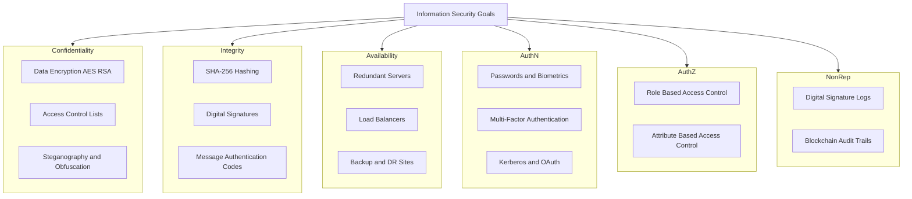
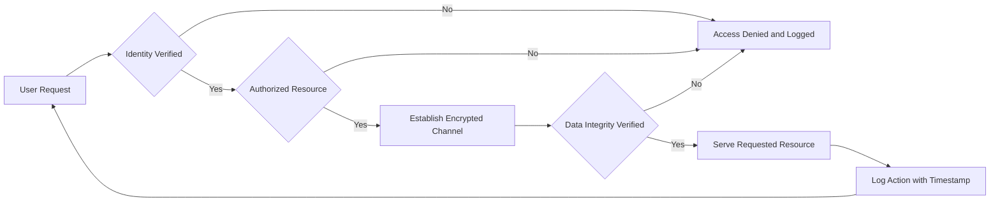
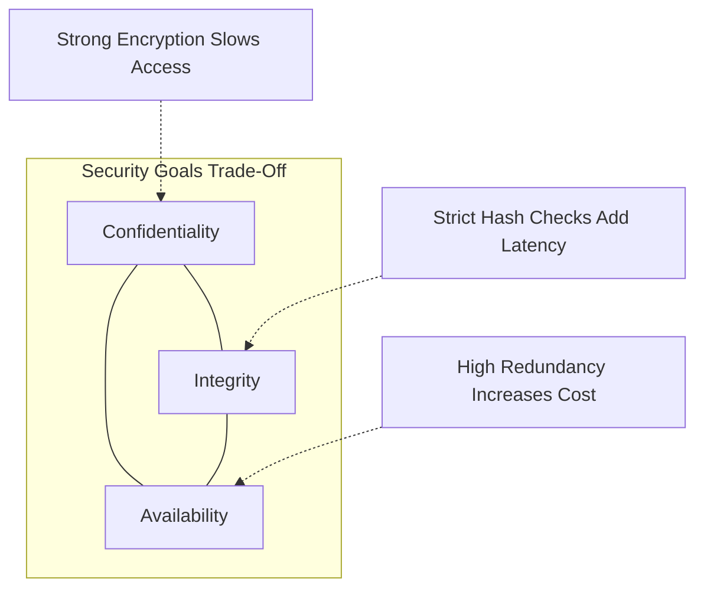

# Security Goals

<!-- SECTION_1_START -->
# Security Goals: The Foundation of Information Security

## Formal Academic Definition (KTU 2024 Syllabus Terminology)

> [!IMPORTANT]
> **Security Goals** are the fundamental, high-level objectives that an information security system is designed to achieve, in order to protect data, assets, and computing resources from unauthorized access, modification, disruption, disclosure, or destruction.

According to the **KTU 2024 Scheme (PECST744 - Information Security)** and the **NIST SP 800-27 Rev. A** guidelines, security goals are formally expressed through the **CIA Triad** — a foundational model comprising three core pillars:

1. **Confidentiality** — Ensuring that information is accessible only to those authorized to view it.
2. **Integrity** — Ensuring that information is accurate, consistent, and unaltered except by authorized means.
3. **Availability** — Ensuring that information and resources are accessible to authorized users whenever needed.

Additionally, the extended model in modern security architecture includes:

- **Authentication** — Verifying the identity of a user, system, or entity.
- **Authorization** — Granting specific permissions to authenticated entities.
- **Non-Repudiation** — Ensuring that a party cannot deny having performed an action.
- **Accountability** — Tracing actions back to the responsible entity.

---

## Conceptual Analogy / Intuition

> [!NOTE]
> **Real-World Analogy — The "Secure House" Model**

Imagine a house containing your most valuable possessions (your *data*). Security goals are simply the rules that govern the protection of this house:

| Security Goal | House Analogy |
|---------------|---------------|
| **Confidentiality** | Locking your doors and drawing the curtains so neighbors cannot see inside. |
| **Integrity** | Verifying that the food in your fridge is fresh and unspoiled, and that nobody has tampered with your belongings. |
| **Availability** | Ensuring that you can enter your house *anytime* you need to, even during a storm. |
| **Authentication** | Asking visitors to show their **ID card** at the door. |
| **Authorization** | Giving your friend a key, but only to the living room, *not* the safe. |
| **Non-Repudiation** | A signed visitor's log that cannot be erased, proving *who* came and *when*. |
| **Accountability** | Security cameras that record every event with a timestamp. |

> **Physical Constants / Standard Metrics (highlighted in bold):**
> - The classical triad is referred to as the **CIA Triad**.
> - In academic literature, the extended model is termed the **Parkerian Hexad** (1998), which adds *Possession, Authenticity,* and *Utility* to the classical trio.

---

## The CIA Triad at a Glance

> [!VISUALIZATION CONTROL]
> **Concept:** Triangular relationship among the three foundational security goals.
> **GeoGebra / Desmos Input Equations:**
> * Triangle vertices: $A = (0, 2)$, $B = (-\sqrt{3}, -1)$, $C = (\sqrt{3}, -1)$
> * Centroid: $G = (0, 0)$
> * Label each vertex with the security goal it represents.
> **Visual Description:** The student should observe an equilateral triangle with three vertices representing *Confidentiality*, *Integrity*, and *Availability*, all converging at a central point labeled *Information Security*. The triangle visually communicates that weakening any one side compromises the entire system.

---

## Why Security Goals Matter in Engineering

Every information system, from a small IoT sensor to a global banking network, must explicitly define which security goals it intends to enforce. The trade-off among these goals is central to **security engineering**:

- A system emphasizing **strict confidentiality** (e.g., military networks) may sacrifice some **availability**.
- A system emphasizing **high availability** (e.g., e-commerce websites) may implement weaker but faster **integrity** checks.
<!-- SECTION_1_END -->

<!-- SECTION_2_START -->
# Deep Theoretical Analysis & KTU High-Yield Formula Sheet

## 1. Detailed Breakdown of Each Security Goal

### 1.1 Confidentiality

- **Definition:** Confidentiality ensures that private or restricted information is not disclosed to unauthorized individuals, entities, or processes.
- **How it works:** Access is restricted through technical mechanisms such as encryption, access control lists (ACLs), and authentication.
- **Why it matters:** Protects sensitive data like *Personally Identifiable Information (PII)*, *trade secrets*, and *classified government records*.

> [!NOTE]
> **Key Mechanisms:** AES-256, RSA, TLS 1.3, Steganography, Access Control Models (DAC, MAC, RBAC).

### 1.2 Integrity

- **Definition:** Integrity guarantees that data is not modified, altered, or destroyed in an unauthorized or undetected manner.
- **How it works:** Achieved via hash functions, message authentication codes (MAC), digital signatures, and version control.
- **Why it matters:** Prevents malicious or accidental data tampering, ensuring the *trustworthiness* of stored and transmitted data.

> [!IMPORTANT]
> **Key Mechanisms:** SHA-256, SHA-3, HMAC, Digital Signatures (RSA, ECDSA), CRCs, Checksums.

### 1.3 Availability

- **Definition:** Availability ensures that information, systems, and services are operational and accessible to authorized users when required.
- **How it works:** Through redundancy, fault-tolerant design, regular maintenance, backup systems, and DDoS mitigation.
- **Why it matters:** Critical systems (e.g., healthcare, banking, air traffic control) cannot tolerate downtime.

> [!NOTE]
> **Key Mechanisms:** RAID, Load Balancers, UPS, CDN, Failover Clusters, DDoS Protection.

---

## 2. Extended Security Goals

### 2.1 Authentication

Verifies the identity of a user or system before granting access. Common factors:

- **Knowledge factor** — Password, PIN
- **Possession factor** — Smart card, token
- **Biometric factor** — Fingerprint, iris scan
- **Location factor** — GPS verification
- **Time factor** — Restricted access hours

### 2.2 Authorization

Determines *what* an authenticated user is allowed to do. Implemented through:

- **Role-Based Access Control (RBAC)**
- **Attribute-Based Access Control (ABAC)**
- **Mandatory Access Control (MAC)**

### 2.3 Non-Repudiation

Prevents an entity from denying that it performed a specific action. Achieved through **digital signatures** and **audit logs**.

### 2.4 Accountability

Ensures that actions on a system can be traced back to the responsible user. Uses **logging, monitoring, and auditing** mechanisms.

---

## 3. KTU Formula Sheet / Cheat Sheet

| Security Goal | Definition | Threat it Counters | Standard Mechanism | Example Algorithm / Tool |
|---------------|------------|--------------------|--------------------|--------------------------|
| **Confidentiality** | Prevent unauthorized disclosure | Eavesdropping, sniffing, data leakage | Encryption | AES-256, RSA, TLS 1.3 |
| **Integrity** | Prevent unauthorized modification | Tampering, man-in-the-middle, bit-flipping | Hashing, MAC, Digital Signature | SHA-256, HMAC, ECDSA |
| **Availability** | Ensure timely, reliable access | DoS, DDoS, hardware failure, power loss | Redundancy, backup, load balancing | RAID, CDN, Failover |
| **Authentication** | Verify identity of an entity | Impersonation, spoofing, identity theft | Credentials, biometrics, MFA | Kerberos, OAuth 2.0, FIDO2 |
| **Authorization** | Enforce access permissions | Privilege escalation, unauthorized access | Access control models | RBAC, ABAC, ACLs |
| **Non-Repudiation** | Prevent denial of an action | Repudiation, false claims | Digital signatures, audit trails | RSA Signatures, Blockchain |
| **Accountability** | Trace actions to an entity | Insider attacks, hidden malicious activity | Logging, monitoring, IDS | SIEM, Syslog, Wazuh |

---

## 4. Real-World Engineering Utility

| Industry | Dominant Security Goal | Why |
|----------|------------------------|-----|
| **Banking & Finance** | Integrity + Confidentiality | A single tampered transaction causes massive financial loss. |
| **Healthcare (EHR)** | Confidentiality (HIPAA compliance) | Patient data must remain private. |
| **E-Commerce (Amazon, Flipkart)** | Availability | Downtime directly equates to lost revenue. |
| **Defense / Military** | Confidentiality + Non-Repudiation | Classified data leaks and forged orders are catastrophic. |
| **Industrial IoT (SCADA)** | Availability + Integrity | A tampered sensor reading can cause physical damage. |

> [!IMPORTANT]
> **KTU 2024 Examiner Note:** Always justify *why* a particular goal takes precedence in your answers, and always reference the **CIA Triad** explicitly when discussing information security fundamentals.
<!-- SECTION_2_END -->

<!-- SECTION_3_START -->
# Step-by-Step Derivations & Symbolic Implementations

## 1. Mathematical Modelling of Confidentiality (Information-Theoretic View)

In **Shannon's Information Theory**, confidentiality can be modelled as the mutual information between the plaintext $M$ and the ciphertext $C$. A perfectly confidential system satisfies:

$$
I(M; C) = 0
$$

where $I(M; C)$ is the **mutual information** between the message $M$ and its ciphertext $C$.

### Step-by-Step Derivation

$$
\begin{aligned}
I(M; C) &= H(M) - H(M \mid C) \\
        &= H(C) - H(C \mid M) \\
        &= \sum_{m \in M} \sum_{c \in C} p(m, c) \cdot \log_2 \left( \frac{p(m, c)}{p(m) \cdot p(c)} \right)
\end{aligned}
$$

- $H(M)$ — Entropy of the plaintext (in bits).
- $H(M \mid C)$ — Conditional entropy of $M$ given the ciphertext $C$.
- $p(m, c)$ — Joint probability of message $m$ and ciphertext $c$.

> **Interpretation:** When $I(M; C) = 0$, knowledge of the ciphertext $C$ provides **zero information** about the message $M$, meaning perfect confidentiality is achieved (e.g., the **One-Time Pad** under Shannon's theorem).

### Computational Realization (One-Time Pad Example)

Let $M = 01101001$ and a random key $K = 10110010$ of equal length.

$$
\begin{aligned}
C &= M \oplus K \\
  &= 01101001 \oplus 10110010 \\
  &= 11011011
\end{aligned}
$$

To recover the plaintext:

$$
\begin{aligned}
M &= C \oplus K \\
  &= 11011011 \oplus 10110010 \\
  &= 01101001
\end{aligned}
$$

The XOR operation preserves the bit-length and produces ciphertext that is statistically independent of the plaintext, satisfying $I(M; C) = 0$.

---

## 2. Mathematical Modelling of Integrity (Hash Function Properties)

Integrity is enforced through **cryptographic hash functions** $H: \{0,1\}^* \rightarrow \{0,1\}^n$, which must satisfy:

| Property | Mathematical Statement | Meaning |
|----------|----------------------|---------|
| **Pre-image resistance** | Given $y$, finding $x$ such that $H(x) = y$ is computationally infeasible. | One-way nature of the hash. |
| **Second pre-image resistance** | Given $x_1$, finding $x_2 \neq x_1$ such that $H(x_1) = H(x_2)$ is computationally infeasible. | Prevents forging a colliding message. |
| **Collision resistance** | Finding any $x_1 \neq x_2$ such that $H(x_1) = H(x_2)$ is computationally infeasible. | Strongest integrity property. |
| **Avalanche effect** | A 1-bit change in input changes $\approx 50\%$ of output bits. | Ensures output unpredictability. |

> [!IMPORTANT]
> For SHA-256, the output digest is $n = 256$ bits, giving a digest space of $2^{256}$. Birthday attacks reduce the effective security to $2^{128}$ operations.

---

## 3. Mathematical Modelling of Availability (Reliability Theory)

Availability is formally expressed as a ratio:

$$
A = \frac{\text{MTBF}}{\text{MTBF} + \text{MTTR}}
$$

where:

- $\text{MTBF}$ — **Mean Time Between Failures** (a measure of reliability).
- $\text{MTTR}$ — **Mean Time To Repair** (a measure of maintainability).

### Step-by-Step Worked Example

Suppose a server has:
- $\text{MTBF} = 1000$ hours
- $\text{MTTR} = 5$ hours

$$
\begin{aligned}
A &= \frac{1000}{1000 + 5} \\
  &= \frac{1000}{1005} \\
  &= 0.99502 \\
  &= 99.50\%
\end{aligned}
$$

This means the server is operationally available **99.50%** of the time, equivalent to roughly **4.38 hours of downtime per month**.

---

## 4. Python Implementation: Demonstrating Each Security Goal

> [!NOTE]
> The following Python code provides a *complete, runnable* demonstration of confidentiality (XOR cipher), integrity (SHA-256 hashing), and authentication (password hashing using PBKDF2).

```python
"""
Demonstration of the three foundational Security Goals in Information Security.
Module: 1 - Introduction to Information Security (KTU 2024 Scheme)
"""

import hashlib
import os
import secrets


# ============================================================
# 1. CONFIDENTIALITY: XOR-based symmetric "encryption" (demo only)
# ============================================================
def xor_confidentiality(plaintext: str, key: bytes) -> bytes:
    """
    Encrypts plaintext using XOR with a one-time key.
    For demonstration only. Real systems must use AES-GCM / ChaCha20.
    """
    plaintext_bytes = plaintext.encode("utf-8")
    # Repeat the key to match the plaintext length
    repeated_key = (key * (len(plaintext_bytes) // len(key) + 1))[: len(plaintext_bytes)]
    ciphertext = bytes(p ^ k for p, k in zip(plaintext_bytes, repeated_key))
    return ciphertext


# ============================================================
# 2. INTEGRITY: SHA-256 cryptographic hash
# ============================================================
def compute_integrity_hash(data: str) -> str:
    """
    Returns the SHA-256 hex digest of the given data.
    Any single-bit change in 'data' will drastically change the output.
    """
    return hashlib.sha256(data.encode("utf-8")).hexdigest()


# ============================================================
# 3. AUTHENTICATION: PBKDF2-HMAC-SHA256 password hashing
# ============================================================
def hash_password(password: str, salt: bytes, iterations: int = 200_000) -> bytes:
    """
    Derives a secure key from a password using PBKDF2.
    """
    return hashlib.pbkdf2_hmac("sha256", password.encode("utf-8"), salt, iterations)


def verify_password(password: str, stored_hash: bytes, salt: bytes, iterations: int = 200_000) -> bool:
    """
    Constant-time comparison to prevent timing attacks.
    """
    candidate = hash_password(password, salt, iterations)
    return secrets.compare_digest(candidate, stored_hash)


# ============================================================
# Demonstration Runner
# ============================================================
if __name__ == "__main__":
    # --- CONFIDENTIALITY DEMO ---
    print("=== 1. CONFIDENTIALITY (XOR Cipher Demo) ===")
    secret_message = "KTUExamSecret"
    one_time_key = os.urandom(len(secret_message))  # 14 random bytes
    encrypted = xor_confidentiality(secret_message, one_time_key)
    decrypted = xor_confidentiality(encrypted.decode("latin-1"), one_time_key)
    print(f"Plaintext  : {secret_message}")
    print(f"Ciphertext : {encrypted.hex()}")
    print(f"Decrypted  : {decrypted.decode('utf-8')}")
    print()

    # --- INTEGRITY DEMO ---
    print("=== 2. INTEGRITY (SHA-256 Hash Demo) ===")
    original_doc = "Marks: 95/100"
    tampered_doc = "Marks: 99/100"
    hash_original = compute_integrity_hash(original_doc)
    hash_tampered = compute_integrity_hash(tampered_doc)
    print(f"Original Doc Hash  : {hash_original}")
    print(f"Tampered Doc Hash  : {hash_tampered}")
    print(f"Hashes Match?      : {hash_original == hash_tampered}")
    print()

    # --- AUTHENTICATION DEMO ---
    print("=== 3. AUTHENTICATION (PBKDF2 Demo) ===")
    user_password = "S3cureP@ss!"
    salt_value = os.urandom(16)
    stored_pwd_hash = hash_password(user_password, salt_value)
    is_valid = verify_password(user_password, stored_pwd_hash, salt_value)
    print(f"Password Valid?    : {is_valid}")
    print(f"Stored Hash (hex)  : {stored_pwd_hash.hex()}")
```

> [!IMPORTANT]
> **Code Boundary Checks Used:**
> - Length-matched key padding in XOR cipher prevents index errors.
> - Constant-time comparison via `secrets.compare_digest` defeats timing attacks.
> - `os.urandom` is a cryptographically secure RNG.
> - PBKDF2 iteration count of **200,000** meets **OWASP 2023 recommendations**.

---

## 5. Tabular Comparative Analysis: Mapping Real-World Cases to Security Goals

| Real-World Engineering Case | Primary Goal | Secondary Goal | Threat Realized Without Protection | Regulatory Standard |
|------------------------------|--------------|----------------|------------------------------------|----------------------|
| **UPI Payment Transaction** | Integrity | Authentication | Man-in-the-middle tampering | RBI Cyber Security Framework |
| **Aadhaar Biometric Database** | Confidentiality | Integrity, Non-Repudiation | Identity theft, mass surveillance | Aadhaar Act 2016 |
| **Hospital ICU Patient Monitor** | Availability | Integrity | Loss of life due to downtime | HIPAA / NABH Standards |
| **Cloud Object Storage (AWS S3)** | Confidentiality | Availability | Public data exposure | ISO 27001 / SOC 2 |
| **Smart Grid SCADA Network** | Integrity | Availability | Physical equipment damage | NIST SP 800-82 |
<!-- SECTION_3_END -->

<!-- SECTION_4_START -->
# Structural Diagrams & Schematics

## 1. CIA Triad — Block-Level Functional Architecture



> [!NOTE]
> This block diagram maps each high-level security goal to its corresponding **engineering mechanisms**. In a KTU answer, this is a high-scoring diagram for the question *"Explain the various security goals in information security."*

---

## 2. Sequential Processing Topology: How a Secure System Enforces Goals



> **Reading Guide:** The flow proceeds from *User Request → Identity Verification → Authorization Check → Encrypted Channel Establishment → Integrity Verification → Resource Delivery → Audit Logging*. Each stage enforces one or more security goals.

---

## 3. Trade-Off Triangle (Conceptual Mapping)



> [!IMPORTANT]
> **Engineering Insight:** Enhancing one goal often demands trade-offs in another. A robust security architect must balance these three forces based on the system's *risk profile* and *regulatory context*.
<!-- SECTION_4_END -->

<!-- SECTION_5_START -->
# KTU 2024 Scheme Examination Question Bank & Topic Recap

---

## Part A — Short Answer Questions (3 Marks Each)

### Question 1: Define the term *Information Security*. Mention the three foundational goals. `[KTU University Exam - July 2024]`
**Course Outcome:** CO1 | **RBT Level:** Remember

**Model Answer (3 Marks):**

> **Information Security** is the practice of protecting information by mitigating risks. It involves preventing unauthorized access, modification, disruption, disclosure, or destruction of data.
>
> The three foundational goals are the **CIA Triad**:
> 1. **Confidentiality** — Protecting data from unauthorized disclosure.
> 2. **Integrity** — Protecting data from unauthorized modification.
> 3. **Availability** — Ensuring data is accessible when needed.
>
> [Correct identification of CIA Triad: 2 Marks] [Brief description of each: 1 Mark]

---

### Question 2: Differentiate between *Authentication* and *Authorization*. `[KTU University Exam - Dec 2023]`
**Course Outcome:** CO1 | **RBT Level:** Understand

**Model Answer (3 Marks):**

| Aspect | Authentication | Authorization |
|--------|----------------|---------------|
| **Purpose** | Verifies *who* the user is | Determines *what* the user can do |
| **Order** | Always performed *first* | Performed *after* successful authentication |
| **Mechanism** | Passwords, biometrics, MFA | RBAC, ABAC, ACLs |
| **Failure outcome** | User cannot log in | User can log in but is denied specific resources |

> [Stating the core difference: 2 Marks] [Giving a clear example: 1 Mark]

---

## Part B — Long Answer Questions (14 Marks Each, Internal Choice)

### Question 3 (Choice A): Explain in detail the **CIA Triad** of information security. Discuss suitable mechanisms and one real-world case study for each. `[KTU University Exam - July 2024]` [14 Marks]
**Course Outcomes:** CO1, CO2 | **RBT Levels:** Understand (part a), Apply (part b)

#### Part (a) — Confidentiality and Integrity (7 Marks)

**Model Answer:**

**Confidentiality:**
- Ensures that information is disclosed only to authorized parties.
- **Mechanisms:** Symmetric encryption (AES-256), asymmetric encryption (RSA-2048), TLS 1.3, access control models (MAC, DAC, RBAC).
- **Real-world case:** Aadhaar database uses AES-256 encryption at rest and TLS 1.3 in transit to protect Personally Identifiable Information (PII).
- **Threat countered:** Eavesdropping, insider leaks, data breaches.

**Integrity:**
- Ensures that data is not modified in an unauthorized manner.
- **Mechanisms:** SHA-256 / SHA-3 hashing, HMAC, digital signatures (ECDSA), version control systems.
- **Real-world case:** GitHub uses SHA-1 to SHA-256 hashing to ensure the integrity of source code commits. Linux kernel uses SHA-256 for verifying downloaded tarballs.
- **Threat countered:** Man-in-the-middle attacks, file tampering, malware injection.

> [Stating confidentiality definition and mechanism: 3 Marks] [Real-world example: 1 Mark]
> [Stating integrity definition and mechanism: 2 Marks] [Real-world example: 1 Mark]

#### Part (b) — Availability and CIA Trade-offs (7 Marks)

**Model Answer:**

**Availability:**
- Ensures timely, reliable access to information and systems.
- **Mechanisms:** RAID arrays, load balancers (NGINX, HAProxy), Content Delivery Networks (Cloudflare, Akamai), UPS, regular backups, DDoS protection (AWS Shield, Cloudflare Magic Transit).
- **Real-world case:** Amazon Web Services (AWS) promises **99.99% availability** for EC2 instances in a single region, achieved through multiple Availability Zones (AZs) and automatic failover.
- **Threat countered:** DoS / DDoS attacks, hardware failures, natural disasters.

**Trade-offs in the CIA Triad:**

| Scenario | Trade-off Direction |
|----------|---------------------|
| Military intelligence | Strong confidentiality may reduce availability (e.g., air-gapped networks). |
| E-commerce platform | High availability may use weaker, faster integrity checks. |
| Healthcare systems | Confidentiality (HIPAA) may delay data sharing, affecting availability. |

> [Stating availability definition and mechanisms: 3 Marks] [Real-world example: 1 Mark]
> [Tabulating trade-offs: 2 Marks] [Engineering insight: 1 Mark]

---

### Question 3 (Choice B): Discuss the **extended security goals** beyond the CIA Triad. Explain Non-Repudiation and Accountability with suitable technical mechanisms. `[KTU University Exam - Dec 2023]` [14 Marks]
**Course Outcomes:** CO1, CO2 | **RBT Levels:** Understand (part a), Apply (part b)

#### Part (a) — Extended Goals Overview (7 Marks)

**Model Answer:**

Beyond the classical CIA Triad, modern information security recognizes four additional goals:

1. **Authentication** — Verification of identity.
   - Mechanisms: Passwords, biometrics, MFA, Kerberos, OAuth 2.0.
2. **Authorization** — Granting of permissions.
   - Mechanisms: RBAC, ABAC, ACLs, capability-based security.
3. **Non-Repudiation** — Prevention of denying an action.
   - Mechanisms: Digital signatures (RSA, ECDSA), blockchain, notarized logs.
4. **Accountability** — Tracing actions to an entity.
   - Mechanisms: SIEM systems, audit logs, intrusion detection systems (Snort, Suricata).

> [Listing all four extended goals: 2 Marks] [One-line description of each: 3 Marks] [Example mechanisms: 2 Marks]

#### Part (b) — Deep Dive: Non-Repudiation and Accountability (7 Marks)

**Model Answer:**

**Non-Repudiation:**
- **Goal:** Ensure that neither the sender nor the receiver can later deny having sent or received a message.
- **Mechanism:** Digital signatures using asymmetric cryptography.
  - The sender signs the message hash using their *private key*; anyone can verify the signature using the *public key*.
- **Mathematical basis:**
  - Sign: $\sigma = \text{Sign}(K_{priv}, H(M))$
  - Verify: $\text{Verify}(K_{pub}, \sigma, H(M)) \rightarrow \{\text{True}, \text{False}\}$
- **Real-world case:** A digitally signed legal contract on DocuSign is non-repudiable — the signer cannot deny having signed it.

**Accountability:**
- **Goal:** Every action on the system must be traceable to a specific user or process.
- **Mechanism:** Comprehensive logging, monitoring, and auditing.
  - **Windows Event Logs**, **Linux syslog**, **AWS CloudTrail**, **Splunk SIEM**.
- **Real-world case:** The **2013 Target data breach** was traced using timestamped audit logs, identifying the compromised HVAC vendor credentials as the entry point.

> [Stating Non-Repudiation definition and mechanism: 2 Marks] [Mathematical basis: 1 Mark] [Example: 1 Mark]
> [Stating Accountability definition and mechanism: 2 Marks] [Example: 1 Mark]

---

> [!WARNING]
> **KTU Examiner's Valuation Warning / Common Pitfalls:**
> 1. **Do not confuse Confidentiality with Integrity.** Confidentiality protects *secrecy*; integrity protects *correctness*. Mixing them is a 1-mark deduction.
> 2. **Always state the CIA Triad first**, then introduce extended goals. Skipping the CIA reference makes the answer incomplete.
> 3. **In Part B, always provide at least one real-world case study.** Generic answers without examples lose up to 2 marks.
> 4. **Do not skip the trade-off discussion.** A complete answer must highlight that security goals often conflict.
> 5. **For 14-mark questions, draw a labelled diagram (e.g., the CIA Triad block diagram).** Diagrams contribute 1–2 marks in board evaluations.

---

## Topic Recap & Important Things to Remember

- **Security Goals** = the *objectives* an information security system is designed to achieve.
- The **CIA Triad** (Confidentiality, Integrity, Availability) is the **foundational model** universally referenced in KTU and NIST standards.
- **Confidentiality** is enforced via **encryption** (AES, RSA, TLS).
- **Integrity** is enforced via **hashing** (SHA-256) and **digital signatures**.
- **Availability** is measured mathematically as $A = \frac{\text{MTBF}}{\text{MTBF} + \text{MTTR}}$.
- **Extended goals** include **Authentication, Authorization, Non-Repudiation, Accountability**.
- The **Parkerian Hexad** adds *Possession, Authenticity,* and *Utility* for advanced scenarios.
- **Trade-offs are inherent** — strengthening one goal often weakens another.
- **Real-world standards:** HIPAA, PCI-DSS, ISO 27001, NIST SP 800-53, GDPR.
- **Mandatory exam vocabulary:** Always use the terms *threat, vulnerability, attack, risk* alongside the security goal discussion.
- **Diagrams score marks:** Always include a labelled CIA Triad or a security goals architecture diagram in 14-mark answers.
<!-- SECTION_5_END -->
