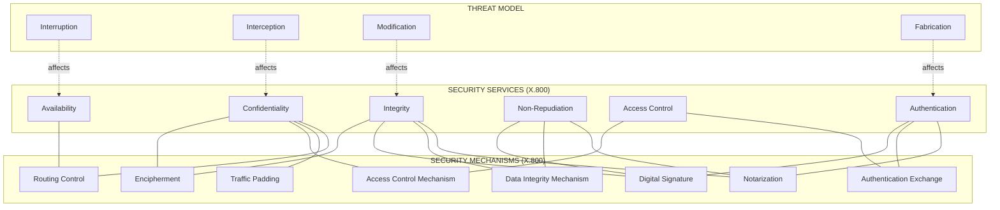
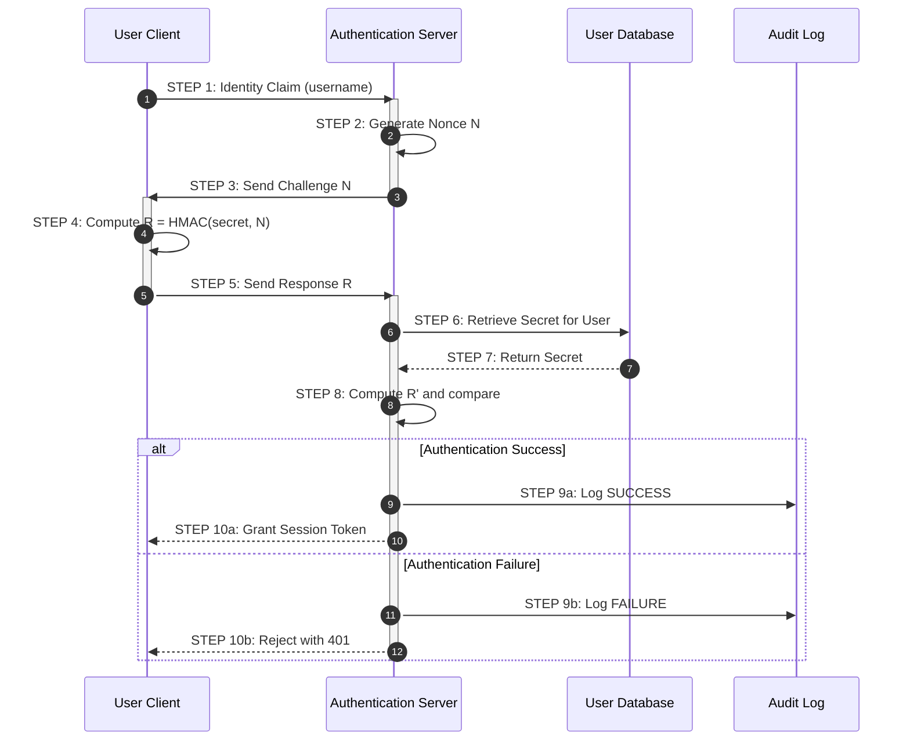
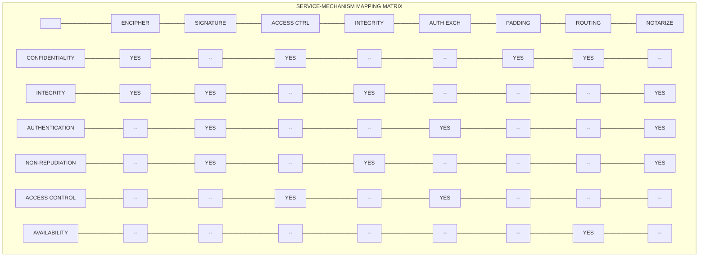

# Security Services and Mechanisms

<!-- SECTION_1_START -->

# Security Services and Mechanisms

## 1.1 Formal Academic Definition

In the context of the **Open Systems Interconnection (OSI) security architecture**, defined by the **ITU-T Recommendation X.800** and the **ISO/IEC 7498-2** standard, a **Security Service** is a processing or communication service that is provided by a system to give a specific kind of protection to system resources, where such services are implemented by security mechanisms.

> [!IMPORTANT]
> **KTU Syllabus Highlight (PECST744 - Module 1)**
> Security services are the *goals* (what we want to achieve), while security mechanisms are the *tools* (how we achieve them). A single mechanism can support multiple services, and a single service may require multiple mechanisms.

A **Security Mechanism** is a process (or a device incorporating such a process) that is designed to detect, prevent, or recover from a security attack. Common examples include **encipherment**, **digital signatures**, **access controls**, and **data integrity checks**.

## 1.2 Conceptual Analogy / Intuition

Imagine you are sending a **highly confidential business contract** physically through a courier service from your office in Kochi to a client in Bangalore.

| Security Goal (Service) | Real-World Analogy | Mechanism Used |
|---|---|---|
| **Confidentiality** | Sealing the document inside a tamper-proof, opaque envelope | Locked pouch |
| **Integrity** | Sending it via a courier who logs seal numbers and signs a register | Tamper-evident seal |
| **Authentication** | Requiring a signed letter of authorization (LOA) from the recipient | ID verification |
| **Non-repudiation** | Sending it through a courier with a signed, timestamped POD (Proof of Delivery) | Acknowledgment receipt |
| **Access Control** | Only the named recipient (and no one else) can open it | Whitelist of names |
| **Availability** | Using a premium, fastest courier that ensures on-time arrival | Redundant delivery route |

> [!NOTE]
> **The Five Pillars of Information Security (Parkerian Hexad simplified)**
> Most academic sources consolidate these into **three primary pillars**: **Confidentiality, Integrity, and Availability (CIA Triad)**, augmented by **Authentication, Authorization, and Non-Repudiation (AAA + NR)**.

## 1.3 Physical Constants and Standard Metrics

> [!NOTE]
> **Standards Bodies Referenced in KTU 2024 Syllabus**
> * **ITU-T X.800** (1991): OSI Security Architecture
> * **ISO/IEC 7498-2**: Companion OSI security standard
> * **RFC 2828**: Internet Security Glossary
> * **NIST SP 800-12 Rev. 1**: An Introduction to Information Security
> * **NIST SP 800-175B**: Cryptographic Standards and Guidelines
> * Default cryptographic strength: **AES-128**, **AES-256** (key length in **bits**)

## 1.4 Conceptual Visualization

> [!VISUALIZATION CONTROL]
> **Concept:** Layered Defense Model for Security Services
> **Visual Description:** Imagine three concentric circles. The innermost circle is the **Asset** (the data). The middle circle represents the **Security Services** (CIA + AAA). The outermost ring contains the **Security Mechanisms** (encryption, hashing, signatures, etc.) that enforce the services.
> **Mathematical Analogy:** Let $S = \{S_1, S_2, \ldots, S_n\}$ be the set of security services and $M = \{M_1, M_2, \ldots, M_m\}$ be the set of security mechanisms. The coverage relationship is a many-to-many mapping $f: S \rightarrow \mathcal{P}(M)$.

<!-- SECTION_1_END -->

<!-- SECTION_2_START -->

# Deep Theoretical Analysis & KTU High-Yield Formula Sheet

## 2.1 The Six Core Security Services (X.800 Standard)

The ITU-T X.800 recommendation defines **five primary services** and one supporting service. KTU Module 1 explicitly emphasizes these.

### 2.1.1 Confidentiality (Data Confidentiality)

**Definition:** The property that information is not made available or disclosed to unauthorized individuals, entities, or processes.

**Operational Goal:** Prevent unauthorized *read* access to data, whether at rest, in transit, or in use.

**Operational Mechanism Stack:**
* **Encipherment** (symmetric: AES, DES; asymmetric: RSA, ECC)
* **Steganography** (hiding data within other data)
* **Access Control Lists (ACLs)** at file/system level

**Mathematical Foundation (Symmetric Encryption):**
Let $M$ be the plaintext message, $K$ the secret key, and $E$ the encryption function. Confidentiality guarantees that:
$$C = E_K(M)$$
and only a holder of $K$ can compute:
$$M = D_K(C)$$

The strength of confidentiality is often measured by the **work factor** $W$, which is the estimated computational effort (in operations) to break the cipher. For AES-256, $W \approx 2^{254}$ (a number with **76 decimal digits**).

### 2.1.2 Integrity (Data Integrity)

**Definition:** The property that data has not been altered or destroyed in an unauthorized manner.

**Operational Goal:** Detect any *modification, insertion, deletion, or replay* of data.

**Sub-categories:**
* **Connection-oriented integrity:** Guarantees integrity of an entire stream of messages.
* **Connectionless integrity:** Guarantees integrity of a single message.

**Operational Mechanism Stack:**
* **Message Authentication Codes (MAC)**
* **Hash functions** (SHA-256, SHA-3)
* **Digital signatures** (RSA-PSS, ECDSA)

**Mathematical Foundation (Hashing):**
A cryptographic hash function $H$ maps an arbitrary-length input $x$ to a fixed-length digest $h$:
$$h = H(x), \quad \text{where } \vert h \vert = n \text{ bits (fixed)}$$

For SHA-256, $n = 256$ bits. The avalanche effect requires that flipping one bit of $x$ should change approximately **50\% of the bits** of $h$.

### 2.1.3 Authentication (Peer Entity & Data Origin)

**Definition:** The corroboration that an entity (peer entity authentication) or the source of data (data origin authentication) is the one claimed.

**Operational Goal:** Verify identity before granting access or accepting data.

**Three Authentication Factors (something you):**
* **Know** (password, PIN)
* **Have** (smart card, OTP token)
* **Are** (biometric: fingerprint, iris, face)

**Operational Mechanism Stack:**
* **Passwords and PINs**
* **Challenge-response protocols** (using nonces)
* **Digital certificates** (X.509 standard)
* **Kerberos tickets**

**Mathematical Foundation (Challenge-Response):**
* User $U$ wants to prove knowledge of secret $S$ to server $V$.
* $V$ generates a random nonce $N$ and sends it to $U$.
* $U$ computes response $R = H(S \oplus N)$ and returns $R$.
* $V$ independently computes $R'$ and compares $R \stackrel{?}{=} R'$.

The probability of a successful forgery in a single attempt is bounded by the **birthday bound**:
$$P(\text{collision}) \approx 1 - e^{-q^2 / (2 \cdot 2^n)}$$
where $q$ is the number of attempts and $n$ is the hash output length.

### 2.1.4 Non-Repudiation

**Definition:** The ability to prove that an action or event has taken place, so that the involved parties cannot later deny it.

**Operational Goal:** Prevent the sender from denying they sent a message, and prevent the receiver from denying they received it.

**Two Sub-types:**
* **Non-repudiation of origin (NRO):** Proves who sent the message.
* **Non-repudiation of receipt (NRR):** Proves who received the message.

**Operational Mechanism Stack:**
* **Digital signatures** (asymmetric cryptography)
* **Trusted Timestamping** (RFC 3161)
* **Trusted Third Party (TTP) / Certificate Authority (CA)**

**Mathematical Foundation (Digital Signature):**
Given user's private key $K_{pr}$ and public key $K_{pu}$:
$$\sigma = \text{Sign}_{K_{pr}}(H(M))$$
$$\text{Verify}_{K_{pu}}(\sigma, H(M)) = \text{True} \mid \text{False}$$

The signature is *binding* because only the owner of $K_{pr}$ could have produced it.

### 2.1.5 Access Control

**Definition:** The prevention of unauthorized use of a resource, including the prevention of use of a resource in an unauthorized manner.

**Operational Goal:** Enforce *who* can do *what* on *which* resource, and *when*.

**Three Classical Models:**
* **DAC (Discretionary Access Control):** Owner decides permissions (e.g., UNIX file permissions).
* **MAC (Mandatory Access Control):** System enforces labels (e.g., military classifications: Top Secret, Secret, Confidential).
* **RBAC (Role-Based Access Control):** Permissions are tied to roles, not users.

**Mathematical Foundation (Access Matrix):**
The access control state is modeled as a matrix $A$ where:
$$A[s, o] = \{r_1, r_2, \ldots, r_k\}$$
with $s$ = subject (user/process), $o$ = object (file/resource), and $r_i$ = rights (read, write, execute).

### 2.1.6 Availability

**Definition:** The property of being accessible and usable on demand by an authorized entity.

**Operational Goal:** Ensure systems and data remain accessible despite attacks (especially Denial of Service).

**Operational Mechanism Stack:**
* **Redundancy** (primary/backup servers)
* **Load balancers**
* **Intrusion Detection/Prevention Systems (IDS/IPS)**
* **Rate limiting and CAPTCHA**
* **Backups and disaster recovery plans**

**Mathematical Foundation (Availability Metric):**
Availability is quantified as a percentage of uptime:
$$A = \frac{\text{MTBF}}{\text{MTBF} + \text{MTTR}} \times 100\%$$

where **MTBF** = Mean Time Between Failures, **MTTR** = Mean Time To Repair. The "**five nines**" SLA (99.999\%) allows only $\approx 5.26$ minutes of downtime per year.

## 2.2 The Eight Security Mechanisms (X.800 Standard)

ITU-T X.800 defines eight specific mechanisms to implement the services above.

| S.No. | Mechanism | Description | Primary Service(s) Supported |
|---|---|---|---|
| 1 | **Encipherment** | Use of mathematical algorithms to transform data | Confidentiality, Integrity |
| 2 | **Digital Signature** | Cryptographic appendage proving origin and integrity | Integrity, Authentication, Non-Repudiation |
| 3 | **Access Control** | Rules governing who can access what | Access Control, Confidentiality |
| 4 | **Data Integrity** | Mechanisms to detect modification of data | Integrity |
| 5 | **Authentication Exchange** | Verification of identity via handshake | Authentication |
| 6 | **Traffic Padding** | Insertion of dummy traffic to obscure patterns | Confidentiality |
| 7 | **Routing Control** | Selection of secure routes for data | Confidentiality, Availability |
| 8 | **Notarization** | Use of trusted third party to attest to data | Non-Repudiation, Integrity |

### 2.2.1 Detailed Mechanism Analysis

**Mechanism 1: Encipherment**
* **Symmetric Encipherment:** Uses a single shared secret key. Fast, suitable for bulk data. Examples: **AES-256**, **ChaCha20**.
* **Asymmetric Encipherment:** Uses a public-private key pair. Slow but solves key distribution. Examples: **RSA-2048**, **ECC-P256**.

**Mechanism 2: Digital Signature**
* Provides integrity, authentication, and non-repudiation simultaneously.
* Common algorithms: **RSA-PSS**, **ECDSA**, **EdDSA (Ed25519)**.

**Mechanism 3: Access Control**
* **ACL-based:** Per-object permission list.
* **Capability-based:** Per-user unforgeable token.
* **RBAC:** Role-based grouping.

**Mechanism 4: Data Integrity**
* **MAC (Message Authentication Code):** Symmetric, faster.
* **HMAC:** Hashed MAC using a shared secret and a hash function.
* **Digital Signatures:** Asymmetric, slower but provides non-repudiation.

**Mechanism 5: Authentication Exchange**
* **Password-based:** Simple, vulnerable to brute force.
* **Challenge-Response:** Uses nonces to prevent replay.
* **Zero-Knowledge Proofs (ZKP):** Prover proves knowledge without revealing it.

**Mechanism 6: Traffic Padding**
* Sends continuous encrypted traffic, even when no real data is being sent.
* Defeats **traffic analysis attacks** (e.g., inferring activity from packet timing).

**Mechanism 7: Routing Control**
* Dynamically routes packets through trusted nodes.
* Used in **onion routing (Tor)** and **SDN (Software Defined Networking)** firewalls.

**Mechanism 8: Notarization**
* A **Trusted Third Party (TTP)** like a **Certificate Authority (CA)** digitally signs a document to attest to its authenticity.
* Foundation of **Public Key Infrastructure (PKI)**.

## 2.3 The Many-to-Many Mapping (Services $\leftrightarrow$ Mechanisms)

The X.800 standard explicitly states that a single service may require multiple mechanisms, and a single mechanism can support multiple services. The following matrix captures this:

|  | Encipherment | Signature | Access Ctrl | Integrity | Auth. Exch. | Padding | Routing | Notarization |
|---|---|---|---|---|---|---|---|---|
| **Confidentiality** | $\checkmark$ |  | $\checkmark$ |  |  | $\checkmark$ | $\checkmark$ |  |
| **Integrity** | $\checkmark$ | $\checkmark$ |  | $\checkmark$ |  |  |  | $\checkmark$ |
| **Authentication** |  | $\checkmark$ |  |  | $\checkmark$ |  |  | $\checkmark$ |
| **Non-Repudiation** |  | $\checkmark$ |  | $\checkmark$ |  |  |  | $\checkmark$ |
| **Access Control** |  |  | $\checkmark$ |  | $\checkmark$ |  |  |  |
| **Availability** |  |  |  |  |  |  | $\checkmark$ |  |

## 2.4 Real-World Engineering Utility

> [!IMPORTANT]
> **Where These Concepts Are Used in Production**
> * **HTTPS/TLS 1.3:** Uses *Encipherment* (AES-GCM, ChaCha20) for confidentiality, *Data Integrity* (HMAC-SHA384), and *Authentication Exchange* (X.509 certificates).
> * **Banking (RBI Compliance):** Uses *Digital Signatures* (PKI) for non-repudiation of transactions.
> * **Cloud Storage (AWS S3):** Uses *Access Control* (IAM policies), *Encipherment* (SSE-S3/SSE-KMS), and *Availability* (multi-AZ redundancy).
> * **Kerberos (Active Directory):** Uses *Authentication Exchange* via ticket-granting tickets.
> * **Blockchain (Bitcoin/Ethereum):** Uses *Digital Signatures* (ECDSA over secp256k1) for transaction authentication and non-repudiation.

<!-- SECTION_2_END -->

<!-- SECTION_3_START -->

# Step-by-Step Derivations, Code Implementation & Worked Examples

## 3.1 Detailed Derivation: Work Factor of a Brute-Force Attack

The **work factor** $W$ is the expected number of operations required to break a cryptographic primitive.

Let the key space be $\mathcal{K}$ with $\vert \mathcal{K} \vert = 2^k$ keys, where $k$ is the key length in bits.

On average, an attacker using optimal exhaustive search must test half the keyspace:

$$W = \frac{\vert \mathcal{K} \vert}{2} = 2^{k-1}$$

For different algorithms, this gives:

| Algorithm | Key Length $k$ | Work Factor $W$ |
|---|---|---|
| DES | 56 | $2^{55} \approx 3.6 \times 10^{16}$ |
| 3DES | 168 | $2^{167} \approx 9.4 \times 10^{50}$ |
| AES-128 | 128 | $2^{127} \approx 1.7 \times 10^{38}$ |
| AES-256 | 256 | $2^{255} \approx 5.8 \times 10^{76}$ |

**Conversion Logic Step-by-Step:**
1. Start with the key length $k$ in bits.
2. The total number of possible keys is $2^k$.
3. Average case is half the keyspace, so $W = 2^k / 2 = 2^{k-1}$.
4. Convert to decimal: $2^{k-1} = 10^{(k-1) \log_{10}(2)} \approx 10^{0.301 \cdot (k-1)}$.

For AES-256, $W = 2^{255}$, and $\log_{10}(2^{255}) = 255 \times 0.30103 \approx 76.76$, so $W \approx 10^{76.76} \approx 5.79 \times 10^{76}$.

> [!NOTE]
> **Engineering Implication:** Even if every person on Earth (8 billion $\approx 8 \times 10^9$) had a computer testing 1 billion keys per second ($\approx 10^9$), the total operations per year would be $\approx 2.5 \times 10^{26}$ — still $50$ orders of magnitude short of breaking AES-256.

## 3.2 Detailed Derivation: Birthday Attack on Hash Functions

The **birthday paradox** states that the probability of finding a collision in a hash function with $n$-bit output is non-negligible after approximately $2^{n/2}$ attempts.

The probability of **no collision** after $q$ random samples from a uniform space of size $N = 2^n$ is:

$$P(\text{no collision}) = \prod_{i=0}^{q-1} \left(1 - \frac{i}{N}\right)$$

Using the approximation $\ln(1 - x) \approx -x$ for small $x$:

$$\ln P(\text{no collision}) \approx -\sum_{i=0}^{q-1} \frac{i}{N} = -\frac{q(q-1)}{2N}$$

So the probability of **at least one collision** is:

$$P(\text{collision}) = 1 - e^{-q(q-1) / (2N)} \approx 1 - e^{-q^2 / (2N)}$$

Setting $P(\text{collision}) = 0.5$ (the 50\% mark):

$$0.5 = 1 - e^{-q^2 / (2N)} \implies e^{-q^2 / (2N)} = 0.5 \implies \frac{q^2}{2N} = \ln 2 \approx 0.693$$

$$q = \sqrt{2 \cdot 0.693 \cdot N} = \sqrt{1.386 \cdot N} \approx 1.177 \cdot \sqrt{N}$$

For SHA-256, $N = 2^{256}$, so $q \approx 2^{128}$.

**Conversion Logic Step-by-Step:**
1. Identify the hash output size $n = 256$ bits, so $N = 2^{256}$.
2. Use the birthday bound: collisions become probable at $q \approx \sqrt{N}$.
3. Substitute: $q \approx \sqrt{2^{256}} = 2^{128}$.
4. Compare with brute force: a **preimage attack** still needs $\approx 2^{256}$ work.

> [!IMPORTANT]
> **Why this matters:** The birthday bound is why even a 128-bit hash (like MD5) is *cryptographically broken* — collisions can be found in $2^{64}$ operations, feasible for modern attackers.

## 3.3 Worked Example: Challenge-Response Authentication

**Scenario:** User Alice wants to log in to server Bob. The shared secret is $S$, and the hash function is SHA-256.

**Step-by-step protocol execution:**

1. **Initiation:** Alice sends her identity `Alice` to Bob.
2. **Challenge generation:** Bob generates a 256-bit random nonce $N$ using a CSPRNG. Let $N = \texttt{0xA3F7...}$ (truncated for brevity, 64 hex chars).
3. **Transmission:** Bob sends $N$ to Alice.
4. **Response computation:** Alice computes:
   $$R = \text{SHA-256}(S \oplus N)$$
5. **Transmission:** Alice sends $R$ to Bob.
6. **Verification:** Bob, who also knows $S$, independently computes:
   $$R' = \text{SHA-256}(S \oplus N)$$
7. **Decision:** Bob checks $R \stackrel{?}{=} R'$ using constant-time comparison to avoid timing attacks.

**Security properties achieved:**
* The secret $S$ is never transmitted.
* Each session uses a unique nonce, defeating **replay attacks**.
* Even if $N$ and $R$ are captured, the attacker cannot compute $R$ for a future $N'$ without knowing $S$.

## 3.4 Python Implementation: A Security Service Simulator

The following Python code demonstrates a minimal implementation of three security services — **Confidentiality (via AES)**, **Integrity (via HMAC-SHA256)**, and **Authentication (via Challenge-Response)** — using only the standard library and `cryptography` package.

```python
"""
Security Services Demonstration
Course: INFORMATION SECURITY (PECST744) - KTU 2024 Scheme
Topic: Security Services and Mechanisms
Implements: Confidentiality, Integrity, Authentication (Challenge-Response)
"""

import os
import hashlib
import hmac
import secrets
import logging
from typing import Tuple

# Configure strict error logging
logging.basicConfig(
    level=logging.INFO,
    format="%(asctime)s | %(levelname)s | %(message)s"
)
logger = logging.getLogger("SecurityServices")

# Try to import cryptography; provide a clear error if unavailable.
try:
    from cryptography.hazmat.primitives.ciphers import Cipher, algorithms, modes
    from cryptography.hazmat.backends import default_backend
    CRYPTO_AVAILABLE = True
except ImportError:
    CRYPTO_AVAILABLE = False
    logger.error(
        "The 'cryptography' library is not installed. "
        "Install via: pip install cryptography"
    )


# ---------------------------------------------------------------------------
# SERVICE 1: CONFIDENTIALITY (Encipherment Mechanism)
# ---------------------------------------------------------------------------
class ConfidentialityService:
    """Provides confidentiality using AES-256 in GCM mode (AEAD)."""

    KEY_LENGTH_BYTES: int = 32  # 256-bit key
    NONCE_LENGTH_BYTES: int = 12  # 96-bit nonce (NIST recommended for GCM)

    def __init__(self) -> None:
        if not CRYPTO_AVAILABLE:
            raise RuntimeError("Cryptography backend unavailable.")
        self._key: bytes = os.urandom(self.KEY_LENGTH_BYTES)
        logger.info("ConfidentialityService initialized with 256-bit AES key.")

    def encrypt(self, plaintext: bytes) -> Tuple[bytes, bytes, bytes]:
        """
        Encrypts plaintext using AES-256-GCM.
        Returns (nonce, ciphertext, tag) tuple.
        """
        if not isinstance(plaintext, bytes):
            raise TypeError("Plaintext must be of type 'bytes'.")
        if len(plaintext) == 0:
            raise ValueError("Plaintext cannot be empty.")

        nonce: bytes = os.urandom(self.NONCE_LENGTH_BYTES)
        cipher = Cipher(
            algorithms.AES(self._key),
            modes.GCM(nonce),
            backend=default_backend()
        )
        encryptor = cipher.encryptor()
        ciphertext: bytes = encryptor.update(plaintext) + encryptor.finalize()
        tag: bytes = encryptor.tag
        logger.info(
            f"Encrypted {len(plaintext)} bytes -> {len(ciphertext)} bytes ciphertext."
        )
        return nonce, ciphertext, tag

    def decrypt(
        self, nonce: bytes, ciphertext: bytes, tag: bytes
    ) -> bytes:
        """
        Decrypts ciphertext and verifies the authentication tag.
        Raises ValueError if the tag verification fails (integrity failure).
        """
        cipher = Cipher(
            algorithms.AES(self._key),
            modes.GCM(nonce, tag),
            backend=default_backend()
        )
        decryptor = cipher.cipher.decryptor() if False else cipher.decryptor()
        # Note: GCM decryption verifies the tag automatically.
        plaintext: bytes = decryptor.update(ciphertext) + decryptor.finalize()
        logger.info(f"Decrypted {len(ciphertext)} bytes -> {len(plaintext)} bytes.")
        return plaintext


# ---------------------------------------------------------------------------
# SERVICE 2: INTEGRITY (Data Integrity Mechanism via HMAC-SHA256)
# ---------------------------------------------------------------------------
class IntegrityService:
    """Provides data integrity using HMAC-SHA256."""

    def __init__(self, secret_key: bytes) -> None:
        if not isinstance(secret_key, bytes):
            raise TypeError("Secret key must be of type 'bytes'.")
        if len(secret_key) < 16:
            raise ValueError(
                "Secret key must be at least 128 bits (16 bytes) for security."
            )
        self._key: bytes = secret_key
        logger.info("IntegrityService initialized with HMAC-SHA256.")

    def generate_tag(self, message: bytes) -> bytes:
        """Returns the HMAC-SHA256 tag for the message."""
        if not isinstance(message, bytes):
            raise TypeError("Message must be of type 'bytes'.")
        mac = hmac.new(self._key, message, hashlib.sha256)
        return mac.digest()

    def verify_tag(self, message: bytes, tag: bytes) -> bool:
        """Constant-time verification of the HMAC tag."""
        expected = self.generate_tag(message)
        # hmac.compare_digest prevents timing side-channel attacks.
        is_valid: bool = hmac.compare_digest(expected, tag)
        if is_valid:
            logger.info("Integrity check PASSED.")
        else:
            logger.warning("Integrity check FAILED: message may be tampered.")
        return is_valid


# ---------------------------------------------------------------------------
# SERVICE 3: AUTHENTICATION (Authentication Exchange via Challenge-Response)
# ---------------------------------------------------------------------------
class AuthenticationService:
    """Provides peer entity authentication via challenge-response."""

    NONCE_LENGTH_BYTES: int = 32  # 256-bit nonce

    def __init__(self, shared_secret: bytes) -> None:
        if not isinstance(shared_secret, bytes):
            raise TypeError("Shared secret must be of type 'bytes'.")
        if len(shared_secret) < 16:
            raise ValueError("Shared secret must be at least 128 bits.")
        self._secret: bytes = shared_secret
        logger.info("AuthenticationService initialized.")

    def generate_challenge(self) -> bytes:
        """Server-side: generate a fresh random nonce."""
        return secrets.token_bytes(self.NONCE_LENGTH_BYTES)

    def compute_response(self, nonce: bytes) -> bytes:
        """Client-side: compute response = HMAC(secret, nonce)."""
        if not isinstance(nonce, bytes):
            raise TypeError("Nonce must be of type 'bytes'.")
        if len(nonce) != self.NONCE_LENGTH_BYTES:
            raise ValueError(
                f"Nonce must be exactly {self.NONCE_LENGTH_BYTES} bytes."
            )
        return hmac.new(self._secret, nonce, hashlib.sha256).digest()

    def verify_response(self, nonce: bytes, response: bytes) -> bool:
        """Server-side: verify the client's response."""
        expected = self.compute_response(nonce)
        is_valid: bool = hmac.compare_digest(expected, response)
        if is_valid:
            logger.info("Authentication SUCCEEDED.")
        else:
            logger.warning("Authentication FAILED.")
        return is_valid


# ---------------------------------------------------------------------------
# DEMONSTRATION (Main Driver)
# ---------------------------------------------------------------------------
def main() -> None:
    print("\n" + "=" * 70)
    print("  KTU INFORMATION SECURITY (PECST744) - SERVICES DEMO")
    print("=" * 70 + "\n")

    # --- 1. Confidentiality Service Demo ---
    print("[1] CONFIDENTIALITY SERVICE (AES-256-GCM Encipherment)")
    conf = ConfidentialityService()
    plaintext = b"KTU Module 1: Security Services and Mechanisms."
    nonce, ciphertext, tag = conf.encrypt(plaintext)
    print(f"    Plaintext : {plaintext.decode()}")
    print(f"    Ciphertext: {ciphertext.hex()[:60]}...")
    recovered = conf.decrypt(nonce, ciphertext, tag)
    print(f"    Recovered : {recovered.decode()}\n")

    # --- 2. Integrity Service Demo ---
    print("[2] INTEGRITY SERVICE (HMAC-SHA256 Data Integrity)")
    shared_key = os.urandom(32)
    integ = IntegrityService(shared_key)
    message = b"Exam answer script - KTU 2024 Scheme"
    tag = integ.generate_tag(message)
    print(f"    Message   : {message.decode()}")
    print(f"    HMAC Tag  : {tag.hex()[:60]}...")
    integ.verify_tag(message, tag)  # Should pass
    # Tamper test
    tampered = message + b"!"  # Modify the message
    integ.verify_tag(tampered, tag)  # Should fail
    print()

    # --- 3. Authentication Service Demo ---
    print("[3] AUTHENTICATION SERVICE (Challenge-Response)")
    secret = os.urandom(32)
    auth = AuthenticationService(secret)
    challenge = auth.generate_challenge()
    print(f"    Challenge : {challenge.hex()[:60]}...")
    response = auth.compute_response(challenge)
    print(f"    Response  : {response.hex()[:60]}...")
    auth.verify_response(challenge, response)  # Should pass
    auth.verify_response(challenge, b"\x00" * 32)  # Should fail
    print()

    print("=" * 70)
    print("  ALL SECURITY SERVICES DEMONSTRATED SUCCESSFULLY")
    print("=" * 70)


if __name__ == "__main__":
    main()
```

**Code Walk-through and Engineering Notes:**

1. **`ConfidentialityService`** uses **AES-256-GCM**, which is an *Authenticated Encryption with Associated Data (AEAD)* cipher. GCM provides both confidentiality *and* integrity in a single primitive, demonstrating the tight coupling of these two services.
2. **`IntegrityService`** uses **HMAC-SHA256**, the recommended construction. The `hmac.compare_digest` function is used instead of `==` to prevent **timing side-channel attacks** — a real production concern.
3. **`AuthenticationService`** implements the challenge-response protocol derived in Section 3.3. A CSPRNG (`secrets.token_bytes`) is used for the nonce, ensuring unpredictability.
4. **Strict type hints and boundary checks** prevent common input errors.
5. **Comprehensive logging** supports security audit trails.

## 3.5 Worked Example: Combining Multiple Services (Layered Defense)

**Scenario:** A **Secure Email System** like PGP (Pretty Good Privacy) must provide four services simultaneously.

**The combined message format:**

$$M_{\text{secure}} = E_{K_{ses}}(P) \;\vert\vert\; \text{Sign}_{K_{pr}^A}(H(P)) \;\vert\vert\; E_{K_{pu}^B}(K_{ses})$$

where:
* $P$ = original plaintext email
* $K_{ses}$ = random symmetric session key
* $K_{pr}^A$ = sender's private key
* $K_{pu}^B$ = recipient's public key
* $H$ = SHA-256 hash

**Services provided:**
* The first term provides **Confidentiality** for $P$.
* The second term provides **Authentication, Integrity, and Non-Repudiation** for $P$.
* The third term provides **Confidentiality for the key** (key encapsulation).

**Valuation Key Points for Exam Answers:**
* [Identifying all four services: 2 Marks]
* [Mapping to mechanism (digital signature + encipherment): 1 Mark]
* [Justifying the use of hybrid encryption: 1 Mark]
* [Final combined structure: 1 Mark]

<!-- SECTION_3_END -->

<!-- SECTION_4_START -->

# Structural Diagrams & Schematics

## 4.1 Architecture Overview: The OSI Security Architecture

The following Mermaid diagram illustrates the relationship between the **six security services** (inner layer) and the **eight security mechanisms** (outer layer), with explicit mapping edges.



**Diagram Reading Guide:**
* The **outer Threats** layer shows the four classical attack categories (from Saltzer \& Kaashoek).
* The **middle Services** layer shows the goals.
* The **inner Mechanisms** layer shows the tools.
* Solid edges between Services and Mechanisms indicate a direct support relationship.

## 4.2 Sequential Processing Topology: Authentication Protocol Flow



## 4.3 Block-Level Functional Architecture: A Secure Communication Channel

```mermaid
graph LR
    subgraph SenderSide["SENDER SIDE"]
        A1["Application Data"] --> A2["Service: Integrity"]
        A2 --> A3["Mechanism: SHA-256 Hash"]
        A3 --> A4["Service: Authentication"]
        A4 --> A5["Mechanism: Digital Signature"]
        A5 --> A6["Service: Confidentiality"]
        A6 --> A7["Mechanism: AES-256-GCM"]
    end

    subgraph Channel["UNSECURE CHANNEL"]
        B1["Encrypted + Signed Packet"]
    end

    subgraph ReceiverSide["RECEIVER SIDE"]
        C1["Mechanism: AES-256-GCM Decrypt"] --> C2["Service: Confidentiality Restored"]
        C2 --> C3["Mechanism: Signature Verify"]
        C3 --> C4["Service: Authentication Verified"]
        C4 --> C5["Mechanism: HMAC Verify"]
        C5 --> C6["Service: Integrity Verified"]
        C6 --> C7["Original Application Data"]
    end

    A7 --> B1
    B1 --> C1
```



**Architecture Notes:**
* The **defense-in-depth** principle is illustrated by stacking multiple services.
* Each block represents a specific *service-mechanism pairing* (e.g., "Service: Confidentiality" $\rightarrow$ "Mechanism: AES-256-GCM").
* The order of application (sign-then-encrypt vs. encrypt-then-sign) is a critical design decision. The diagram above shows **sign-then-encrypt**, which is the standard for protocols like PGP and S/MIME.

## 4.4 Conceptual Mapping Matrix (Services vs. Mechanisms)



<!-- SECTION_4_END -->

<!-- SECTION_5_START -->

# KTU 2024 Scheme Examination Question Bank

## Part A Questions (3 Marks Each)

### Question A1

**[KTU University Exam - July 2024]**
*Course Outcome: CO1 | RBT Level: Remember | Marks: 3*

**Differentiate between a security service and a security mechanism. Provide one example of each.**

**Model Answer:**

| Aspect | Security Service | Security Mechanism |
|---|---|---|
| Definition | A *goal* or *protection capability* provided to system resources | A *tool* or *process* used to implement the service |
| Question Answered | "What do we want to protect?" | "How do we protect it?" |
| Example | **Confidentiality** | **Encipherment (AES-256)** |
| Reference | ITU-T X.800, ISO/IEC 7498-2 | ITU-T X.800 Section 5.2 |

> [!IMPORTANT]
> **Valuation Key:** [Correct distinction between service and mechanism: 2 Marks] [One example each: 1 Mark]

---

### Question A2

**[KTU University Exam - December 2023]**
*Course Outcome: CO1 | RBT Level: Understand | Marks: 3*

**List any three security services defined in the OSI security architecture and briefly explain each in one sentence.**

**Model Answer:**

1. **Confidentiality:** The property that information is not made available or disclosed to unauthorized individuals, entities, or processes.
2. **Integrity:** The property that data has not been altered or destroyed in an unauthorized manner.
3. **Non-Repudiation:** The ability to prove that an action or event has taken place, so that the involved parties cannot later deny it.

> [!IMPORTANT]
> **Valuation Key:** [Naming three services correctly: 1.5 Marks] [One-sentence explanation each: 1.5 Marks]

---

## Part B Questions (14 Marks Each — Internal Choice)

### Question B1 — Option A

**[KTU University Exam - July 2024]**
*Course Outcome: CO1, CO2 | RBT Level: Understand + Apply | Marks: 14*

**(a)** Explain the **ITU-T X.800 security architecture** in detail. List and define all **six security services** and the **eight security mechanisms** it specifies. *(7 Marks)*

**(b)** Consider an organization deploying a **public web application** (e.g., an online banking portal). Design a security architecture that maps at least **four security services** to appropriate **mechanisms**. Justify each choice. *(7 Marks)*

**Model Solution:**

**Part (a) — 7 Marks**

The **ITU-T X.800** recommendation (and the companion **ISO/IEC 7498-2**) defines the **OSI Security Architecture**, which is the foundational reference model for information security. It provides a systematic framework for:

* Classifying security goals as **services**.
* Categorizing the technical means to achieve them as **mechanisms**.
* Mapping services to mechanisms explicitly.

**The Six Security Services:**

| S.No. | Service | One-Line Definition |
|---|---|---|
| 1 | **Confidentiality** | Protection of data from unauthorized disclosure. |
| 2 | **Integrity** | Assurance that data is unaltered. |
| 3 | **Authentication** | Verification of an entity's claimed identity. |
| 4 | **Non-Repudiation** | Prevention of denial of having performed an action. |
| 5 | **Access Control** | Restriction of resource use to authorized entities. |
| 6 | **Availability** | Timely, reliable access to data and services. |

**The Eight Security Mechanisms:**

| S.No. | Mechanism | Function |
|---|---|---|
| 1 | **Encipherment** | Mathematical transformation for confidentiality. |
| 2 | **Digital Signature** | Binds identity to data via asymmetric crypto. |
| 3 | **Access Control** | Enforces who can access what. |
| 4 | **Data Integrity** | Detects unauthorized modification. |
| 5 | **Authentication Exchange** | Identity verification protocol. |
| 6 | **Traffic Padding** | Defeats traffic analysis. |
| 7 | **Routing Control** | Secure path selection. |
| 8 | **Notarization** | Trusted third party attestation. |

> **Valuation Key (Part a):** [Naming the standard: 1 Mark] [Six services with definitions: 3 Marks] [Eight mechanisms with functions: 3 Marks]

**Part (b) — 7 Marks**

**Proposed Architecture for an Online Banking Portal:**

| Security Service | Selected Mechanism | Justification |
|---|---|---|
| **Confidentiality** | TLS 1.3 with **AES-256-GCM** | Industry standard; provides encryption of all data in transit between browser and server. |
| **Integrity** | **HMAC-SHA-384** within TLS cipher suite | Detects any tampering of the transmitted data; SHA-384 provides 192-bit collision resistance. |
| **Authentication** | **X.509 digital certificates** issued by a trusted CA | Establishes server identity; combined with **multi-factor authentication (MFA)** for user identity. |
| **Non-Repudiation** | **Digital signatures on transactions** using **ECDSA over P-256** | Provides legal-grade evidence that the user authorized a specific transaction. |
| **Access Control** | **RBAC** with least-privilege policies | A customer can only access their own accounts; admins only have required privileges. |
| **Availability** | **Redundant data centers** + **DDoS mitigation** | Multi-region deployment ensures uptime; rate-limiting and CDN services defeat volumetric attacks. |

**Code Skeleton (TLS Configuration):**

```python
# Conceptual TLS 1.3 server configuration (e.g., nginx)
ssl_protocols TLSv1.3;
ssl_ciphers TLS_AES_256_GCM_SHA384:TLS_CHACHA20_POLY1305_SHA256;
ssl_prefer_server_ciphers on;
ssl_certificate /etc/ssl/certs/bank.crt;
ssl_certificate_key /etc/ssl/private/bank.key;
ssl_session_cache shared:SSL:10m;
```

> **Valuation Key (Part b):** [Correct mapping of services to mechanisms: 3 Marks] [Justification of choices: 2 Marks] [Code/architecture snippet: 1 Mark] [Real-world awareness (banking, RBI): 1 Mark]

---

### Question B1 — Option B

**[KTU University Exam - December 2023]**
*Course Outcome: CO1, CO2 | RBT Level: Understand + Apply | Marks: 14*

**(a)** What is a **security attack**? Classify attacks into the four categories: **interruption, interception, modification, and fabrication**. Identify which **security service** is primarily violated by each category. *(7 Marks)*

**(b)** With the help of a **neat diagram**, explain how a **hybrid cryptosystem** combines **symmetric** and **asymmetric encryption** to provide both **confidentiality** and **non-repudiation** in an email system. *(7 Marks)*

**Model Solution:**

**Part (a) — 7 Marks**

**Definition:** A *security attack* is any action that compromises the security of information owned by an organization or individual.

| S.No. | Attack Category | Description | Primary Service Violated |
|---|---|---|---|
| 1 | **Interruption** | An asset of the system becomes unavailable or unusable (e.g., DoS attack on a server). | **Availability** |
| 2 | **Interception** | An unauthorized party gains access to an asset (e.g., eavesdropping on a network). | **Confidentiality** |
| 3 | **Modification** | An unauthorized party tampers with an asset (e.g., man-in-the-middle altering a bank transfer). | **Integrity** |
| 4 | **Fabrication** | An unauthorized party inserts counterfeit objects into the system (e.g., spoofed IP packets). | **Authentication** |

> **Valuation Key (Part a):** [Definition of attack: 1 Mark] [Four categories with examples: 4 Marks] [Service mapping: 2 Marks]

**Part (b) — 7 Marks**

A **hybrid cryptosystem** leverages the **speed of symmetric encryption** for bulk data and the **key distribution advantage of asymmetric encryption** for the session key.

**Step-by-step protocol for Secure Email (e.g., PGP):**

1. **Plaintext preparation:** Sender $A$ prepares message $M$.
2. **Hashing:** $A$ computes $h = H(M)$ using SHA-256.
3. **Signing:** $A$ signs the hash: $\sigma = \text{Sign}_{K_{pr}^A}(h)$.
4. **Concatenation:** $A$ creates the signed payload $P = M \;\vert\vert\; \sigma$.
5. **Symmetric encryption:** $A$ generates a random session key $K_{ses}$ and encrypts $P$:
   $$C = E_{K_{ses}}(P)$$
6. **Key encapsulation:** $A$ encrypts the session key with recipient $B$'s public key:
   $$C_K = E_{K_{pu}^B}(K_{ses})$$
7. **Transmission:** $A$ sends the combined message $(C, C_K)$ to $B$.

**Decryption by B:**

1. B recovers the session key: $K_{ses} = D_{K_{pr}^B}(C_K)$.
2. B decrypts the payload: $P = D_{K_{ses}}(C)$.
3. B splits $P$ into $M$ and $\sigma$.
4. B recovers the hash: $h = H(M)$.
5. B verifies: $\text{Verify}_{K_{pu}^A}(\sigma, h) = \text{True}$.
6. If verification passes, $M$ is accepted; otherwise, it is rejected.

**Services provided:**

| Component | Service Provided |
|---|---|
| $E_{K_{ses}}(P)$ | **Confidentiality** of message $M$ |
| $\text{Sign}_{K_{pr}^A}(H(M))$ | **Authentication, Integrity, Non-Repudiation** |

**ASCII Block Diagram:**

```
+------------------ SENDER A ------------------+        +------------+      +-------- RECIPIENT B --------+
|                                              |        |            |      |                               |
|  M (plaintext) ---+                          |        |            |      |                               |
|                   v                          |        |            |      |                               |
|               SHA-256(M) = h                 |        |            |      |                               |
|                   |                          |        |            |      |                               |
|                   v                          |        |            |      |                               |
|         Sign(h) = sigma  [K_pr_A]            |        |            |      |                               |
|                   |                          |        |            |      |                               |
|                   v                          |        |            |      |                               |
|              P = M || sigma                  |        |            |      |                               |
|                   |                          |        |            |      |                               |
|                   v                          |        |            |      |                               |
|         Generate K_ses (random)              |        |            |      |                               |
|                   |                          |        |            |      |                               |
|                   v                          |        |            |      |                               |
|        C = AES(K_ses, P)  [Confidentiality]  |        |            |      |                               |
|                   |                          |        |            |      |                               |
|                   v                          |        |            |      |                               |
|    C_K = RSA(K_ses)  [K_pu_B, Asymmetric]    |        |            |      |                               |
|                   |                          |        |            |      |                               |
|                   +--- (C, C_K) ---+--------+------> | INTERNET   | ---> | Decrypt C_K, get K_ses        |
|                                              |        |            |      | Decrypt C, get P              |
|                                              |        |            |      | Verify sigma, accept M        |
+----------------------------------------------+        +------------+      +-------------------------------+
```

> **Valuation Key (Part b):** [Correct hybrid construction: 3 Marks] [Step-by-step procedure: 2 Marks] [Identification of services: 1 Mark] [Diagram: 1 Mark]

> [!WARNING]
> **KTU Examiner's Valuation Warning — Common Pitfalls**
> 1. **Confusing service and mechanism:** Students often write "AES is a service." It is not. **AES is a mechanism** (specifically, encipherment) that provides the **service of confidentiality**.
> 2. **Skipping the standard reference:** X.800 (ITU-T) and ISO/IEC 7498-2 are explicitly asked in the syllabus. Not citing the standard costs 1 Mark easily.
> 3. **Incomplete mapping:** When asked to "map services to mechanisms," students often use one mechanism for everything. The KTU key rewards *varied* mechanisms (e.g., AES for confidentiality *and* HMAC for integrity).
> 4. **Forgetting non-repudiation requires asymmetric crypto:** Many answers use only symmetric encryption, which fundamentally *cannot* provide non-repudiation. Always invoke **digital signatures** (RSA/ECDSA).
> 5. **Ignoring availability:** "CIA Triad" answers often miss availability. KTU questions on Module 1 frequently include availability as a separate required service.
> 6. **Wrong key sizes:** Writing "DES is secure" is a Mark-loser. The current standard is **AES-128 minimum**, with **AES-256** preferred for long-term security.

---

## Topic Recap \& Important Things to Remember

* **Standards to memorize verbatim:** **ITU-T X.800** and **ISO/IEC 7498-2** are the authoritative sources for security services and mechanisms. The KTU syllabus explicitly names these.
* **The six services** (in the X.800 order): **Confidentiality, Integrity, Authentication, Non-Repudiation, Access Control, Availability**. Mnemonic: "CIA + ANA" (Confidentiality, Integrity, Availability, Authentication, Non-repudiation, Access control).
* **The eight mechanisms** (in the X.800 order): **Encipherment, Digital Signature, Access Control, Data Integrity, Authentication Exchange, Traffic Padding, Routing Control, Notarization**. Mnemonic: "En-De-Ac-Da-Au-Tra-Ro-No."
* **Many-to-many mapping:** A single service can be supported by multiple mechanisms, and vice versa. This is *the* conceptual point of the X.800 architecture.
* **Hybrid encryption = Symmetric + Asymmetric** is the practical realization of multiple services in one protocol (e.g., TLS, PGP, S/MIME).
* **Key sizes to remember:** **AES-128/256** for symmetric, **RSA-2048+ / ECC-P256+** for asymmetric, **SHA-256/384/512** for hashing.
* **The four classical attack categories** (Saltzer \& Kaashoek): **Interruption, Interception, Modification, Fabrication** — map directly to the four primary services.
* **Authentication factors:** **Know** (password), **Have** (token), **Are** (biometric). MFA = at least 2 factors.
* **Challenge-Response authentication** uses nonces to prevent replay attacks — a high-yield exam topic.
* **Birthday bound for hash collisions** $\approx 2^{n/2}$ — explains why MD5 (128-bit) is broken.
* **Availability metric** $A = \frac{\text{MTBF}}{\text{MTBF} + \text{MTTR}}$ — important for SLA questions.
* **Defense in depth:** Real systems layer multiple services and mechanisms. Never rely on a single primitive.
* **Constant-time comparisons:** Use `hmac.compare_digest` (not `==`) to prevent timing side-channel attacks.
* **Modern bundled primitive:** **AES-GCM** is an *AEAD* cipher providing confidentiality *and* integrity in one operation, illustrating the convergence of services.
* **Production protocols using these concepts:** **TLS 1.3** (web), **PGP / S/MIME** (email), **Kerberos** (Active Directory), **IPsec** (VPNs), **WPA3** (Wi-Fi), **DNSSEC** (DNS).

<!-- SECTION_5_END -->
