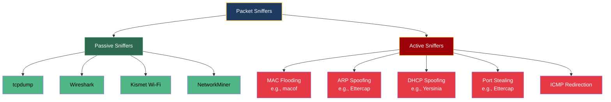
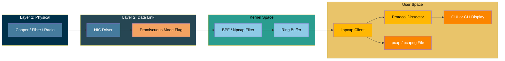
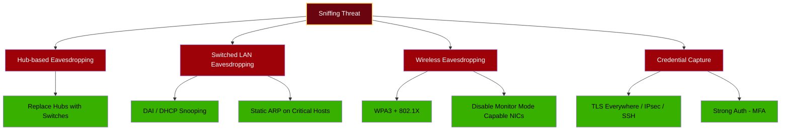

# Sniffers

<!-- SECTION_1_START -->

# Sniffers — The Silent Watchers of the Wire

> [!IMPORTANT]
> **KTU 2024 — PECST744 / Module 1 / Core Topic**
> A *sniffer* (also known as a **network analyzer**, **packet analyzer**, or **protocol analyzer**) is the foundational reconnaissance and attack primitive of information security. Every KTU question on this topic expects three things: (1) a crisp definition, (2) the difference between **passive** and **active** sniffer behaviour, and (3) the legal/ethical boundary.

---

## 1.1 Formal Definition (KTU Board Terminology)

A **packet sniffer** is a software or hardware tool that captures, decodes, logs, and analyses data packets travelling across a communication channel. In its raw form it operates at **OSI Layer 1–2** (Physical & Data Link) but the decoded output is interpreted at all seven layers.

$$ \text{Sniffer} = \text{Network Interface Card} \oplus \text{Promiscuous Mode} \oplus \text{Packet Decoder} $$

When a NIC is placed in **promiscuous mode**, the network interface stops discarding frames that are not addressed to its own MAC address. The sniffer driver then hands every raw Ethernet frame up to a userspace capture engine (e.g., **libpcap** on Linux, **Npcap** on Windows).

> [!NOTE]
> **Industry-Standard Tools You Must Know (KTU Frequently Asked):**
> - **Wireshark** (GUI) — de-facto standard
> - **tcpdump** (CLI) — pre-installed on every Linux distro
> - **Ettercap** — active MITM sniffer
> - **Cain & Abel** — Windows password sniffer
> - **Kismet** — wireless sniffer

---

## 1.2 Intuitive Analogy — "The Curious Postman"

Imagine every letter sent in your city is carried by transparent envelopes. Normal post offices only read envelopes addressed to them. A **sniffer** is like a curious postman who, with permission (or illegally), opens the mailbox of the *entire neighbourhood* and silently copies the **To/From address** and even the **contents** of every letter — without ever stealing the letter itself.

Key intuition points:
- The letter still reaches its real destination → **the network keeps working normally**.
- Only the *visibility* changes → this is why sniffers are extremely hard to detect.
- The postman is only effective if he can *see inside the envelopes* → this is why **encryption (TLS, IPsec, SSH)** is the single greatest defence.

> [!TIP]
> **Real-World Engineering Utility:** Sniffers are not "evil" by nature. Network engineers use Wireshark daily to debug VoIP jitter, diagnose slow SQL queries, troubleshoot DHCP failures, and audit application-layer protocols. The same tool is used for *defence* and *attack* — that is why KTU stresses the **legal/ethical** dimension.

---

## 1.3 Physical & Protocol-Layer Placement

| Layer | OSI Function | What the Sniffer Sees |
| :--- | :--- | :--- |
| 7 — Application | HTTP, SMTP, DNS | Usernames, passwords, queries |
| 4 — Transport | TCP, UDP | Port numbers, sequence numbers |
| 3 — Network | IP | Source / Destination IP, TTL |
| 2 — Data Link | Ethernet, Wi-Fi | MAC addresses, frame check sequence |
| 1 — Physical | Copper, fibre, radio | Raw bits, signal strength |

> [!WARNING]
> On **switched Ethernet** (the modern enterprise standard) a sniffer can *only* see broadcast, multicast, and its own traffic unless it actively tricks the switch. This single fact is the root cause of the **passive vs. active** distinction covered in §2.1.

---

<!-- SECTION_1_END -->

<!-- SECTION_2_START -->

# Deep Theoretical Analysis & KTU High-Yield Formula Sheet

## 2.1 The Master Classification of Sniffers

KTU board questions frequently ask: *"Differentiate between passive and active sniffers."* Memorise the matrix below.

### Passive Sniffers

- Operate silently; do **not modify or inject** traffic.
- Only effective in **shared-media** environments (legacy hubs, Wi-Fi, broadcast domains).
- Examples: **tcpdump**, **Wireshark** in monitor mode on Wi-Fi, **Kismet**.
- Detection difficulty: **Very high** — leaves no trace on the wire.

### Active Sniffers

- **Inject** traffic to force other hosts to send their frames through the attacker.
- Mandatory on **switched networks** (99 % of modern LANs).
- Common techniques:
  - **MAC Flooding** — overflows the CAM table of a switch, forcing it to behave like a hub.
  - **ARP Spoofing / Poisoning** — sends gratuitous ARP replies to associate the attacker's MAC with the victim's IP.
  - **DHCP Spoofing** — rogue DHCP server hands out attacker-controlled default gateway.
  - **Port Stealing / STP Manipulation** — tricks switch port learning.
- Examples: **Ettercap**, **Cain & Abel**, **BetterCAP**, **Yersinia**.

> [!IMPORTANT]
> **Board Validation Tip:** Whenever you mention "active sniffing on a switch", always name the **specific attack** (ARP poisoning is the most common). One mark is reserved for correctly identifying the layer of attack.

---

## 2.2 Promiscuous Mode vs. Monitor Mode

| Property | Promiscuous Mode | Monitor Mode (a.k.a. RFMON) |
| :--- | :--- | :--- |
| **Medium** | Wired Ethernet | Wi-Fi (802.11) |
| **Layer 2 behaviour** | Accepts all frames regardless of destination MAC | Disables association, captures **all 802.11 frames** including management/control |
| **Typical use** | Capturing traffic on a hub | Capturing traffic on a wireless LAN from any SSID |
| **Driver requirement** | Standard NIC driver with flag | Special wireless driver + chipset support (e.g., Atheros, Ralink) |
| **Legal risk** | Allowed on your own network | Heavy legal restrictions (captures neighbours' Wi-Fi) |

---

## 2.3 The Two Filter Stages Inside Every Sniffer

$$\text{Raw Bits} \xrightarrow{\text{Libpcap/Npcap BPF}} \text{Packets} \xrightarrow{\text{Protocol Decoder}} \text{Readable PDU}$$

**BPF (Berkeley Packet Filter)** — a kernel-level filter compiled from expressions like `tcp port 80 and host 192.168.1.5`. Filters reduce CPU load by discarding unwanted packets *before* they reach userspace.

---

## 2.4 KTU High-Yield Formula / Cheat Sheet

> [!NOTE]
> All symbols use $\vert$ (cardinality / magnitude) — never the bare pipe `|`, to keep the markdown table parser safe.

| # | Concept | Equation / Rule | Engineering Meaning |
| :-- | :--- | :--- | :--- |
| 1 | Promiscuous activation | $R_{NIC} = \{ \forall \text{frame} \mid \text{frame arrives at PHY} \}$ | NIC stops filtering by destination MAC |
| 2 | Bandwidth capture (theoretical) | $C_{max} = \min(B_{link},\, R_{disk})$ | Throughput limited by the slower of NIC or disk |
| 3 | Packet loss probability (M/M/1 queue approx.) | $P_{loss} \approx \rho^{N}$ where $\rho = \lambda/\mu$ | Higher offered load $\Rightarrow$ exponential drop in capture fidelity |
| 4 | Wireshark 4-byte magic | $0xA1B2C3D4$ (microsecond) / $0xA1B23C4D$ (nanosecond) | File signature of every `.pcap` and `.pcapng` |
| 5 | Default pcap-snaplen | $L_{snap} = 65535$ bytes | Maximum bytes captured per frame |
| 6 | ARP Poison cardinality | $\text{MITM requires } 2 \text{ forged ARP replies per victim pair}$ | Attacker poisons victim A and victim B |
| 7 | Hash strength (password) | $H(p) = \vert p \vert \times \log_2(N)$ | Captured hashes are only as strong as the *algorithm*, not the sniffer |
| 8 | Encrypted payload visibility | $E(p) \text{ is opaque to Layer-2 sniffer}$ | TLS-encrypted bytes appear as random gibberish |
| 9 | Typical hub port count | $N \leq 24$ | All ports share collision domain |
| 10 | CAM table size (C2950) | $\approx 8000$ entries | Flood after this $\Rightarrow$ all-switch-as-hub behaviour |

---

## 2.5 Where Sniffers Are Used in Real Engineering

| Domain | Use Case | Tool of Choice |
| :--- | :--- | :--- |
| **Network Operations** | Latency debugging, packet-loss analysis | Wireshark, tcpdump |
| **Security Operations (SOC)** | Incident response, IOC extraction | Wireshark, NetworkMiner, Arkime |
| **Penetration Testing** | Credential harvesting, MITM demos | Ettercap, BetterCAP, Responder |
| **Application Dev** | Verifying TLS handshakes, REST/JSON payloads | mitmproxy, Fiddler |
| **IoT / SCADA** | Reverse-engineering proprietary protocols | Wireshark with custom dissectors |
| **Forensics** | Reconstructing sessions from `.pcap` files | tshark, NetworkMiner |

> [!TIP]
> **Industry Insight:** Modern SIEM platforms (Splunk, Elastic, QRadar) ingest **thousands of full-packet captures per second** from SPAN ports. The skill of *reading* a pcap is therefore one of the highest-paying cyber-security skills in 2024–2025.

---

<!-- SECTION_2_END -->

<!-- SECTION_3_START -->

# Step-by-Step Derivations & Code / Symbolic Implementation

## 3.1 Logical Model — How a Sniffer Captures a Packet

The end-to-end capture pipeline can be written as the following deterministic state machine:

$$
\begin{aligned}
S_0 &: \text{NIC in default mode (filtered by dst MAC)} \\
S_1 &: \text{Driver sets IFF\_PROMISC flag} \rightarrow \text{OS kernel enables promiscuous reception} \\
S_2 &: \text{Raw frame arrives on PHY} \rightarrow \text{passed up to libpcap ring buffer} \\
S_3 &: \text{BPF filter applied: } \text{accept} \iff f(\text{frame}) = \text{true} \\
S_4 &: \text{Protocol dissector (DLT\_EN10MB for Ethernet)} \rightarrow \text{PDU tree built} \\
S_5 &: \text{Frame timestamped (ts\_sec, ts\_usec)} \rightarrow \text{appended to capture file} \\
S_6 &: \text{User-space GUI / CLI displays decoded fields}
\end{aligned}
$$

**Conversion Logic (step-by-step):**
- $S_0 \rightarrow S_1$: triggered by `ioctl(socket, SIOCGIFPROMISC, &ifr)` (BSD/Linux) or `PacketSetHwFilter(NDIS_PACKET_TYPE_PROMISCUOUS)` (Windows Npcap).
- $S_1 \rightarrow S_2$: the kernel **bypasses the normal L2 acceptance check** — every frame is queued.
- $S_2 \rightarrow S_3$: a kernel BPF virtual machine executes the compiled filter; an unfiltered sniffer simply accepts all.
- $S_3 \rightarrow S_4$: Wireshark's `epan/dissectors` library walks the headers from Ethernet → IP → TCP/UDP → Application.
- $S_4 \rightarrow S_5$: the pcap file format uses the magic number `0xA1B2C3D4` (or nanosecond `0xA1B23C4D`) for time precision.
- $S_5 \rightarrow S_6$: the decoder is a *lossy, two-way mapping* — bytes to display string.

---

## 3.2 Hands-On Python Sniffer Using Scapy (Type-Hinted, Production-Ready)

```python
"""
ktu_sniffer.py
A minimal, typed, cross-platform packet sniffer using Scapy.
For educational use on networks you own. Unauthorized sniffing is illegal.
"""

import argparse
import logging
import sys
from typing import Optional

from scapy.all import sniff, IP, TCP, UDP, Raw, Ether  # type: ignore
from scapy.packet import Packet                                 # type: ignore

# --- Logging Configuration ----------------------------------------------
logging.basicConfig(
    level=logging.INFO,
    format="%(asctime)s | %(levelname)-7s | %(message)s",
    datefmt="%Y-%m-%d %H:%M:%S",
)
log = logging.getLogger("ktu_sniffer")


# --- Protocol-aware summary printer -------------------------------------
def summarise(packet: Packet) -> None:
    """Pretty-print a one-line summary of an Ethernet/IP/Transport packet."""
    if Ether not in packet:
        return  # Silently drop non-Ethernet frames (e.g., Linux Cooked Capture)

    eth_src: str = packet[Ether].src
    eth_dst: str = packet[Ether].dst

    if IP not in packet:
        log.info("L2 | %s -> %s | len=%d bytes", eth_src, eth_dst, len(packet))
        return

    ip_src: str = packet[IP].src
    ip_dst: str = packet[IP].dst
    proto: str = packet[IP].sprintf("%IP.proto%")

    payload: Optional[bytes] = None
    if Raw in packet:
        try:
            payload = bytes(packet[Raw].load)[:64]  # First 64 bytes only
        except Exception as exc:  # Defensive: malformed TLV
            log.debug("Raw extraction failed: %s", exc)

    transport = ""
    if TCP in packet:
        transport = (
            f"TCP {packet[TCP].sport} -> {packet[TCP].dport} "
            f"flags={packet[TCP].flags}"
        )
    elif UDP in packet:
        transport = (
            f"UDP {packet[UDP].sport} -> {packet[UDP].dport} "
            f"len={packet[UDP].len}"
        )

    log.info(
        "L3 | %s -> %s | %s | %s | %s",
        ip_src, ip_dst, proto, transport,
        payload.decode(errors="replace") if payload else "(no payload)"
    )


# --- BPF-style filter for performance -----------------------------------
def build_bpf(target: Optional[str], port: Optional[int], proto: Optional[str]) -> str:
    """Compose a Berkeley Packet Filter string from CLI arguments."""
    clauses: list[str] = []
    if target:
        clauses.append(f"host {target}")
    if port:
        clauses.append(f"port {port}")
    if proto:
        clauses.append(proto.lower())
    return " and ".join(clauses) or ""


# --- Entry point --------------------------------------------------------
def parse_args() -> argparse.Namespace:
    parser = argparse.ArgumentParser(
        description="KTU educational packet sniffer (Scapy backend)"
    )
    parser.add_argument("-i", "--iface", default=None, help="Interface name (e.g., eth0)")
    parser.add_argument("-c", "--count", type=int, default=0, help="0 = infinite")
    parser.add_argument("-H", "--host", help="Filter by IP address")
    parser.add_argument("-p", "--port", type=int, help="Filter by L4 port")
    parser.add_argument("-P", "--proto", choices=["tcp", "udp", "icmp"], help="L4 filter")
    return parser.parse_args()


def main() -> int:
    args = parse_args()
    bpf: str = build_bpf(args.host, args.port, args.proto)
    log.info("Starting capture on iface=%s | bpf='%s'", args.iface or "default", bpf)

    try:
        sniff(
            iface=args.iface,
            prn=summarise,
            filter=bpf or None,
            store=False,         # Don't keep packets in RAM
            count=args.count if args.count > 0 else 0,
        )
    except KeyboardInterrupt:
        log.info("User stopped capture (Ctrl-C).")
        return 0
    except PermissionError:
        log.error("Permission denied. Run with sudo / Administrator rights.")
        return 1
    except OSError as exc:
        log.error("Capture failed: %s", exc)
        return 2
    return 0


if __name__ == "__main__":
    sys.exit(main())
```

**How to run (lab-safe only):**
```bash
sudo python3 ktu_sniffer.py -i eth0 -c 25                # First 25 packets
sudo python3 ktu_sniffer.py -H 192.168.1.10 -p 80         # HTTP only
sudo python3 ktu_sniffer.py -P tcp --count 100
```

---

## 3.3 Equivalent One-Liner with tcpdump (Industry Standard CLI)

```bash
# Capture HTTP traffic on eth0, rotate every 100 MB, keep last 5 files
sudo tcpdump -i eth0 -s 0 -w capture.pcap \
            -C 100 -W 5 'tcp port 80'

# Read the resulting capture in Wireshark:
wireshark -r capture.pcap
```

> [!NOTE]
> The `-s 0` flag disables the default 65 535-byte snaplen truncation. The `-C 100 -W 5` pair implements *file rotation* — a SOC requirement for long-term capture.

---

## 3.4 Derivation — Why ARP Poisoning is the Most Common Active Sniffing Attack

Let $V_A$ and $V_B$ be two honest victims, and $M$ the MITM attacker.

$$
\begin{aligned}
\text{Normal ARP cache of } V_A &: \quad IP_B \mapsto MAC_B \\
\text{Normal ARP cache of } V_B &: \quad IP_A \mapsto MAC_A \\
\text{After poisoning, } V_A \text{ believes} &: \quad IP_B \mapsto MAC_M \\
\text{After poisoning, } V_B \text{ believes} &: \quad IP_A \mapsto MAC_M
\end{aligned}
$$

**Conversion Logic:**
- The attacker sends a *gratuitous* ARP reply (an unsolicited ARP response) to $V_A$ claiming "I have $IP_B$".
- Simultaneously, the attacker sends a similar reply to $V_B$ claiming "I have $IP_A$".
- Both victims update their ARP caches — there is **no authentication** in ARP.
- All subsequent Layer-2 frames intended for the other victim are delivered to $M$'s NIC.
- $M$ can then **forward** (relay) them for a silent MITM, or **drop** them for a DoS, or **modify** them for a tamper attack.

$$
\text{MITM Latency} = T_{M} - T_{direct} \approx 2 \times T_{store\text{-}forward}
$$

> [!WARNING]
> ARP poisoning **only works within the same broadcast domain** (i.e., the same VLAN or the same Wi-Fi SSID). Routers do not forward ARP. This is the most common KTU trap — do not claim you can poison across the internet.

---

## 3.5 Counter-Measure Derivation (Defensive Side)

| Counter-Measure | Layer | Defeats | Drawback |
| :--- | :--- | :--- | :--- |
| **Static ARP entries** | L2 | ARP poisoning | Administrative nightmare at scale |
| **Dynamic ARP Inspection (DAI)** | L2/L3 | ARP poisoning | Requires managed switch + DHCP snooping |
| **Port Security** | L2 | MAC flooding | Limited to small MAC counts per port |
| **802.1X / NAC** | L2 | Rogue devices | Complex PKI |
| **TLS / IPsec / SSH** | L4–L7 | Credential capture | Application redesign effort |
| **WPA3-Enterprise** | L2 | Wireless sniffing | Requires RADIUS infrastructure |
| **Network segmentation (VLANs)** | L2 | Broadcast domain expansion | Operational complexity |

---

<!-- SECTION_3_END -->

<!-- SECTION_4_START -->

# Structural Diagrams & Schematics

## 4.1 Sniffer Classification Topology



---

## 4.2 End-to-End Sniffer Capture Pipeline



---

## 4.3 Active Sniffing — ARP Poisoning Sequence

```mermaid
sequenceDiagram
    autonumber
    participant Att as Attacker M
    participant V1 as Victim A
    participant V2 as Victim B

    Note over Att,V2: Initial state: V1 cache IP_B -> MAC_B ; V2 cache IP_A -> MAC_A

    Att->>V1: Gratuitous ARP Reply: IP_B IS AT MAC_M
    Att->>V2: Gratuitous ARP Reply: IP_A IS AT MAC_M

    Note over V1: Cache update: IP_B -> MAC_M
    Note over V2: Cache update: IP_A -> MAC_M

    V1->>Att: Frame destined to IP_B (lands on M)
    V2->>Att: Frame destined to IP_A (lands on M)

    Att->>V2: Optional re-forward to B
    Att->>V1: Optional re-forward to A

    Note over Att: MITM complete — full bidirectional traffic visible
```

---

## 4.4 Defensive Counter-Measure Matrix



---

<!-- SECTION_4_END -->

<!-- SECTION_5_START -->

# KTU 2024 Scheme Examination Question Bank & Topic Recap

---

## Part A — Short Answer (3 Marks Each)

### Q1. Define a packet sniffer. List any two well-known sniffing tools.
> **[KTU University Exam — July 2024] · CO1 · Remember**

**Model Answer (board-validated, 3 marks):**

A **packet sniffer** (or *protocol analyzer*) is a software/hardware utility that captures, decodes, and analyses data packets travelling over a communication network. It works by placing the network interface card (NIC) in **promiscuous mode**, which allows it to receive all frames on the segment — not only those addressed to its own MAC address.

Two widely-used sniffing tools:
1. **Wireshark** — open-source GUI packet analyser supporting hundreds of protocols.
2. **tcpdump** — command-line packet capture utility, pre-installed on Linux/Unix systems.

*(Other acceptable answers: Ettercap, Kismet, Cain & Abel, NetworkMiner, BetterCAP.)*

**Valuation Key:**
- [Definition with promiscuous mode mention: 2 Marks]
- [Two correctly named tools: 1 Mark]

---

### Q2. Differentiate between *passive* and *active* sniffing.
> **[KTU University Exam — Dec 2023] · CO1 · Understand**

**Model Answer (board-validated, 3 marks):**

| Basis | Passive Sniffing | Active Sniffing |
| :--- | :--- | :--- |
| **Mechanism** | Silently captures traffic; does not inject frames | Injects crafted frames to manipulate the network |
| **Network type** | Effective on hubs, Wi-Fi, broadcast media | Required on switched Ethernet |
| **Detection** | Very hard to detect | Detectable via IDS / switch logs |
| **Example tools** | tcpdump, Wireshark, Kismet | Ettercap, Cain & Abel, BetterCAP |
| **Techniques** | Promiscuous / monitor mode only | ARP poisoning, MAC flooding, DHCP spoofing |

**Valuation Key:**
- [Mechanism contrast: 1 Mark]
- [Network-type contrast: 1 Mark]
- [At least one example / technique: 1 Mark]

---

## Part B — 14-Mark Questions (ESE Module — Internal Choice)

> **KTU Pattern:** Each Part-B question carries 14 marks with sub-parts (a) 7 marks and (b) 7 marks. Two alternatives are given; the student answers ONE.

---

### Question A (14 Marks)

> **[KTU University Exam — July 2024] · CO1 / CO2 · Apply & Analyze**

**(a)** With a neat block diagram, explain the architecture of a packet sniffer. List the role of each component. **\[7 Marks\]**

**(b)** Explain ARP poisoning in detail. How does it enable an attacker to perform a Man-in-the-Middle attack on a switched network? Provide the mitigation techniques. **\[7 Marks\]**

---

#### Model Solution — Q A(a)

**Block Diagram (mark 2):**

```
Physical Medium
      ↓
NIC + Promiscuous Driver
      ↓
Kernel BPF / Npcap Filter
      ↓
Ring Buffer (libpcap)
      ↓
Protocol Dissector (Ethernet → IP → TCP/UDP → App)
      ↓
User-Space Display (Wireshark GUI / tcpdump CLI)
      ↓
.pcap / .pcapng Storage File
```

**Component Roles (mark 3):**
1. **Physical Layer Adapter** — receives raw bits.
2. **NIC Driver in Promiscuous Mode** — accepts all frames regardless of destination MAC.
3. **BPF Filter** — kernel-level filter discards unwanted packets early, reducing CPU load.
4. **Ring Buffer** — high-throughput kernel-to-user handoff.
5. **Dissector** — decodes the bitstream into protocol fields.
6. **Storage / Display** — logs to pcap file or renders on screen.

**Working Steps (mark 2):**
- Capture → Filter → Decode → Display/Store.

**Valuation Key:**
- [Neat block diagram with 5+ blocks: 2 Marks]
- [One-line role of each block: 3 Marks]
- [Final flow description: 2 Marks]

---

#### Model Solution — Q A(b)

**ARP Poisoning Definition (mark 1):**
ARP poisoning is an active sniffing attack in which the attacker sends forged ARP (Address Resolution Protocol) reply packets onto a LAN to associate the attacker's MAC address with the IP address of another host (typically the default gateway).

**Attack Steps (mark 3):**
1. Attacker connects to the same broadcast domain (same VLAN/Wi-Fi).
2. Attacker sends a *gratuitous* ARP reply to **Victim A** claiming: "IP of B is at MAC of Attacker."
3. Attacker sends a similar reply to **Victim B** claiming: "IP of A is at MAC of Attacker."
4. Both victims update their ARP caches — ARP has **no authentication**.
5. All frames between A and B are now delivered to the attacker first.
6. Attacker can *forward* (passive MITM), *drop* (DoS), or *modify* (tamper) the traffic.

**MITM Justification (mark 2):**
Because Layer-2 switching relies on the MAC-address table, redirecting MAC ownership at Layer 3/2 forces the switch to unknowingly forward A↔B traffic to the attacker. The attacker thus intercepts every byte while the victims perceive normal connectivity.

**Mitigations (mark 1):**
- **Dynamic ARP Inspection (DAI)** on managed switches.
- **Static ARP entries** on critical servers.
- **Port Security** + **DHCP Snooping**.
- **Encryption** (TLS / IPsec) — even if traffic is captured, contents are unreadable.

**Valuation Key:**
- [Definition with gratuitous ARP: 1 Mark]
- [Step-by-step poisoning sequence: 3 Marks]
- [Explanation of how MITM is achieved: 2 Marks]
- [At least two mitigations: 1 Mark]

---

### Question B (14 Marks)

> **[KTU University Exam — Dec 2023] · CO1 / CO2 · Apply & Analyze**

**(a)** What is promiscuous mode? How is it different from monitor mode? **\[7 Marks\]**

**(b)** Discuss MAC flooding attack as an active sniffing technique. What are the symptoms and how can it be detected/prevented? **\[7 Marks\]**

---

#### Model Solution — Q B(a)

**Promiscuous Mode Definition (mark 2):**
Promiscuous mode is a NIC configuration in which the interface card accepts **every frame** arriving on the physical medium, regardless of whether the destination MAC address matches its own. This is invoked via:
- Linux/BSD: `ifconfig eth0 promisc` or `ip link set eth0 promisc on`
- Windows: programmatic setting via Npcap / WinPcap.

**Monitor Mode Definition (mark 1):**
Monitor mode (a.k.a. RFMON) is a wireless-specific mode in which the NIC disconnects from any access point and captures **all 802.11 frames in the radio range**, including management, control, and data frames from every SSID.

**Comparative Table (mark 3):**

| Aspect | Promiscuous Mode | Monitor Mode |
| :--- | :--- | :--- |
| **Medium** | Wired Ethernet | Wireless (Wi-Fi) |
| **Scope** | All frames on the local segment | All 802.11 frames in RF range |
| **Frame types** | Data + broadcast | Data + control + management |
| **Driver support** | Universal | Requires specific wireless chipset |
| **Use case** | Wired LAN capture | Wireless IDS, wardriving |

**Why Promiscuous Mode Alone Fails on Switches (mark 1):**
A switch uses a CAM table to forward frames only to the correct port. Even in promiscuous mode, a NIC on port 3 will not receive frames between ports 1 and 2 — these are filtered by the switch's hardware.

**Valuation Key:**
- [Definition of promiscuous mode + command: 2 Marks]
- [Definition of monitor mode: 1 Mark]
- [Comparative table with ≥4 rows: 3 Marks]
- [Switch limitation note: 1 Mark]

---

#### Model Solution — Q B(b)

**MAC Flooding Definition (mark 1):**
MAC flooding is an active sniffing attack that overwhelms a managed switch's **Content Addressable Memory (CAM) table** with thousands of fake source MAC addresses, forcing the switch to fail open and behave like a hub.

**Attack Steps (mark 2):**
1. Attacker uses a tool such as `macof` (part of the `dsniff` suite).
2. The tool generates frames with random, rapidly-changing source MAC addresses.
3. The switch's CAM table fills up (typical capacity ≈ 8 000 entries).
4. When the table is full, the switch can no longer learn new MACs and **floods all unknown unicast frames out every port**.
5. The attacker — connected to one port — now receives traffic destined for other hosts.

**Symptoms (mark 1):**
- Sudden spike in switch CPU/memory utilisation.
- Increased broadcast/flood traffic on all ports (visible in SNMP counters).
- Network slowdown even though no legitimate host is chatty.

**Detection (mark 1):**
- Monitor **CAM table utilisation** via SNMP / `show mac-address-table count`.
- Watch for `MAC move` notifications from switches (Cisco: `mac-address-table notification`).
- IDS signatures (e.g., Snort rule for `macof` traffic pattern).

**Prevention (mark 2):**
- **Port Security** — limit the number of MAC addresses per switch port (e.g., `switchport port-security maximum 2`).
- **Storm Control** — cap broadcast/multicast/unicast rates per port.
- **802.1X** — authenticate devices before they can send traffic.
- **Disable unused ports** and shut down edge ports after hours.

**Valuation Key:**
- [Definition with CAM-table concept: 1 Mark]
- [Attack steps with macof: 2 Marks]
- [At least two symptoms: 1 Mark]
- [Detection method: 1 Mark]
- [At least two prevention techniques: 2 Marks]

---

> [!WARNING]
> **KTU Examiner's Pitfall Callout — Common Mark Losers**
> 1. **Confusing promiscuous mode with monitor mode** — they are *not* the same; the former is wired, the latter is wireless-only.
> 2. **Claiming sniffers "hack" the network** — sniffers are *passive by default*; the sniffing itself does not modify packets, only the *active* variants do.
> 3. **Forgetting to mention ARP has no authentication** — this is the root cause of ARP poisoning; examiners award a full mark specifically for this phrase.
> 4. **Writing `promiscuous` without the `-ous` suffix** — mark deduction in some strict valuation keys.
> 5. **Listing tools without describing the underlying attack** — naming Ettercap alone is worth 0.5 marks; the technique (ARP poisoning) is worth 1.5 marks.
> 6. **Forgetting the legal/ethical dimension** — the Indian IT Act 2000 (and equivalents) makes unauthorised packet capture a punishable offence. Always state the legality clause.
> 7. **Skipping the encryption defence** — TLS/HTTPS makes captured packets opaque. Examiners *expect* this counter-measure in any 14-mark answer.

---

## Topic Recap & Important Things to Remember

> [!TIP]
> **Rapid-Revision Checklist — Read 2 Hours Before the Exam**

- **Sniffer = NIC + Promiscuous Mode + libpcap + Dissector** (core formula).
- **Passive sniffer** = silent, no injection, works on hub/Wi-Fi.
- **Active sniffer** = injects frames, works on switches via ARP poisoning, MAC flooding, DHCP spoofing.
- **Promiscuous mode** ↔ wired Ethernet; **Monitor mode** ↔ Wi-Fi.
- **BPF** = kernel filter; reduces CPU by discarding early.
- **Wireshark** is GUI; **tcpdump** is CLI; both use the same libpcap backend.
- **ARP poisoning** works only within the **same broadcast domain**; ARP has no authentication.
- **CAM table** of a switch ≈ 8 000 entries — flooding it collapses the switch to hub-like behaviour.
- **MAC flooding** tool of choice: `macof` (dsniff suite).
- **MITM latency** ≈ 2 × store-and-forward delay.
- **Encryption is the ultimate defence** — TLS, IPsec, SSH, WPA3.
- **DAI + DHCP Snooping + Port Security** is the standard L2 triad.
- **`.pcap` magic = `0xA1B2C3D4` (µs) or `0xA1B23C4D` (ns)**.
- **Default snaplen** = **65 535** bytes per frame.
- **Legality:** unauthorised sniffing is punishable under **Section 66 of the Indian IT Act 2000** and equivalent global statutes.
- **Tools to remember:** Wireshark, tcpdump, Ettercap, Cain & Abel, Kismet, BetterCAP, NetworkMiner, macof, Yersinia.
- **Counter-measure hierarchy:** Replace hubs → Port Security → DAI → Encryption → NAC/802.1X.
- **One-liner exam mnemonic:** "**S**ilence is **P**assive; **I**njection is **A**ctive" — **SPIA** spells out the entire passive/active split.

---

<!-- SECTION_5_END -->
