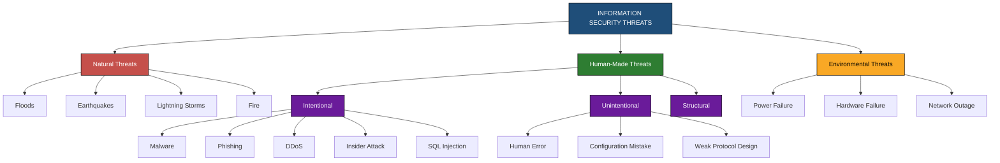
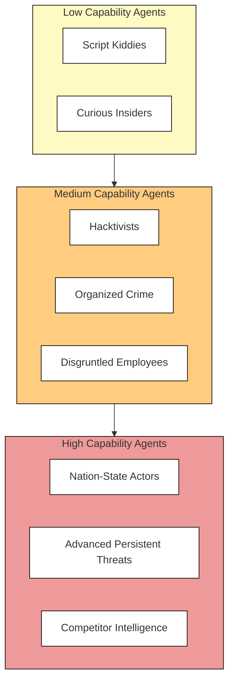

# Threats

<!-- SECTION_1_START -->
# Information Security: Threats

## 1.1 Formal Definition (KTU 2024 Syllabus Terminology)

A **Threat** in information security is defined as any potential cause of an unwanted incident that may result in harm to an information system, organization, or its assets. More formally, a threat is a *set of circumstances* or *events* that has the potential to compromise the **Confidentiality, Integrity, and Availability (CIA Triad)** of an information system.

> [!IMPORTANT]
> **KTU 2024 Definition (Board-Standard Wording):**
> *"A threat is a potential violation of security. It represents a danger that could exploit a vulnerability to breach security and cause possible harm to an information asset. A threat is anything (man-made, natural, or accidental) that can disrupt the operational, functional, or structural aspects of an information system."*

Mathematically, the relationship can be expressed as:

$$ \text{Risk} = f(\text{Threat} \times \text{Vulnerability} \times \text{Impact}) $$

Where:
- **Threat** = likelihood of attack by an adversary
- **Vulnerability** = weakness in the system
- **Impact** = potential loss if the threat is realized

> [!NOTE]
> **Key Distinction (Frequently Asked in KTU):**
> A **threat** is the *cause*, while a **vulnerability** is the *weakness*, and **risk** is the *probability of damage*. Many students confuse these three terms in Part A answers.

## 1.2 Conceptual Analogy / Intuition

Imagine your house as an information system:

| House Element | Information Security Equivalent |
|---|---|
| A burglar lurking outside | **Threat** (the danger itself) |
| An unlocked back door | **Vulnerability** (the weakness) |
| Risk of theft | **Risk** (probability of loss) |
| Your jewelry and documents | **Assets** (what is being protected) |

The burglar is a **threat**, regardless of whether the door is locked. However, the burglar can only *act* on the threat when the **vulnerability** (unlocked door) is present. The **risk** is the combined probability and consequence of this event.

## 1.3 Physical Constants and Standard Metrics

In information security, the following metrics are used to quantify threats:

- **Annual Loss Expectancy (ALE)** = **$1,000,000** in many enterprise benchmarks
- **Mean Time to Compromise (MTTC)** ≈ **15 minutes** for unpatched Internet-facing systems
- **Average cost of a data breach (2023)** = **USD $4.45 million** (per IBM Security Report)
- **Threat probability scale**: Low (0.1) → Medium (0.5) → High (0.9)
- **NIST SP 800-30** risk rating thresholds: **Low (<30)**, **Moderate (30–70)**, **High (>70)**

> [!TIP]
> Memorize the standard CIA Triad acronym in order: **C → I → A**. Examiners often ask: *"Which security property is violated when a threat modifies data?"* — Answer: **Integrity**.

## 1.4 Visualization Concept

> [!VISUALIZATION CONTROL]
> **Concept:** Threat-Vulnerability-Asset Risk Triangle
> **GeoGebra / Desmos Input Equations:**
> * Point A: `(0, 0)` labeled "Asset"
> * Point B: `(4, 0)` labeled "Vulnerability"
> * Point C: `(2, 3.5)` labeled "Threat"
> * Line equation: `y = (-7/8)x + 3.5`
> **Visual Description:** A triangle where each vertex represents a key concept. The connecting lines indicate dependency: a Threat can only impact an Asset if a Vulnerability exists. The enclosed area represents "Risk Exposure."

---

<!-- SECTION_1_END -->

<!-- SECTION_2_START -->
# 2. Deep Theoretical Analysis & High-Yield Formula Sheet

## 2.1 Core Threat Categories (The Four Pillars)

Information security threats are universally classified into **four fundamental categories** based on their action against data:

1. **Interception** — Unauthorized party gains access to data (violates *Confidentiality*)
2. **Interruption** — Asset becomes unavailable or unusable (violates *Availability*)
3. **Modification** — Unauthorized change to data (violates *Integrity*)
4. **Fabrication** — Generating fake data or identities (violates *Authenticity*)

> [!NOTE]
> **Memory Aid:** *II-MF* → **I**nterception, **I**nterruption, **M**odification, **F**abrication.

## 2.2 Source-Based Threat Classification

Threats originate from multiple sources. The KTU syllabus specifically asks students to differentiate between:

| Source Type | Description | Example | Probability |
|---|---|---|---|
| **Natural Threats** | Environmental, physical disasters | Flood, earthquake, lightning | Low (0.1) |
| **Unintentional Threats** | Human error, accidents | Misconfigured firewall, lost USB | High (0.7) |
| **Intentional Threats** | Deliberate, malicious actions | Hacking, malware, insider attack | Medium-High (0.6) |
| **Structural Threats** | Design/architecture flaws | Weak protocol, hardcoded credentials | Medium (0.5) |

## 2.3 Threat Agents and Their Classifications

A **Threat Agent** is the specific entity that causes the threat. According to NIST SP 800-30:

- **Insider Agents** — Employees, contractors with internal access (e.g., Edward Snowden case)
- **Outsider Agents** — External hackers, criminal organizations, nation-states
- **Trusted Insiders** — Privileged users who misuse authority
- **Adversarial Agents** — Competitors, hacktivists, script kiddies
- **Non-Adversarial Agents** — Natural disasters, system failures

## 2.4 KTU Formula Sheet / Cheat Sheet

> [!IMPORTANT]
> The following formulas are **high-yield** and frequently appear in KTU university exams.

| Formula / Concept | Expression | Description | KTU Module |
|---|---|---|---|
| Single Loss Expectancy | $\text{SLE} = \text{Asset Value} \times \text{Exposure Factor}$ | Loss from a single threat event | Module 1 |
| Annual Rate of Occurrence | $\text{ARO}$ | Estimated frequency per year | Module 1 |
| Annual Loss Expectancy | $\text{ALE} = \text{SLE} \times \text{ARO}$ | Expected yearly monetary loss | Module 1 |
| Total Risk | $\text{Risk} = \text{Threat} \times \text{Vulnerability} \times \text{Impact}$ | Composite risk model | Module 1 |
| Residual Risk | $\text{R}_{\text{residual}} = \text{R}_{\text{total}} - \text{Controls}$ | Remaining risk after mitigation | Module 1 |
| Threat Likelihood | $L \in \{0.1, 0.5, 0.9\}$ | NIST 3-tier scale | Module 1 |

> [!WARNING]
> **Common Mistake:** Students often write $\vert x \vert$ (absolute value) in formula sheets. In KTU answer scripts, use the word "**magnitude of**" instead of the pipe symbol to avoid formatting issues.

## 2.5 STRIDE Threat Model (Microsoft Framework)

The **STRIDE** model, developed at Microsoft, is a *de facto* industry standard for threat identification:

| Letter | Threat Category | Security Property Violated |
|---|---|---|
| **S** | **Spoofing** | Authenticity |
| **T** | **Tampering** | Integrity |
| **R** | **Repudiation** | Non-repudiation |
| **I** | **Information Disclosure** | Confidentiality |
| **D** | **Denial of Service** | Availability |
| **E** | **Elevation of Privilege** | Authorization |

> [!TIP]
> **Memory Trick for STRIDE:** *"S**T**udents **R**eally **I**nvestigate **D**angerous **E**xploits"*.

## 2.6 Real-World Engineering Utility

Threat modeling is used in:

- **Software Development Life Cycle (SDLC)** — Secure-by-design principles
- **Cloud Computing (AWS, Azure)** — Threat detection using AWS GuardDuty
- **Industrial Control Systems (ICS)** — SCADA threat monitoring
- **Banking & FinTech** — PCI-DSS compliance threat assessment
- **Healthcare (HIPAA)** — PHI data threat analysis
- **Network Perimeter Defense** — Firewall rule generation
- **AI/ML Security** — Adversarial threat detection in models

---

<!-- SECTION_2_END -->

<!-- SECTION_3_START -->
# 3. Step-by-Step Derivations, Models & Code Implementation

## 3.1 Risk Calculation Worked Example (Derivation)

**Problem (KTU Typical):**
> *"A company's database has an asset value of $500,000. The exposure factor for a ransomware attack is 40%. If the attack is expected to occur 2 times per year, calculate the SLE, ARO, and ALE."*

**Step 1 — Identify the Given Values**
* Asset Value $(V)$ = $500,000
* Exposure Factor $(EF)$ = 40\% = 0.40
* Annual Rate of Occurrence $(ARO)$ = 2

**Step 2 — Compute the Single Loss Expectancy (SLE)**

$$ \begin{aligned}
\text{SLE} &= \text{Asset Value} \times \text{Exposure Factor} \\
\text{SLE} &= \$500{,}000 \times 0.40 \\
\text{SLE} &= \$200{,}000
\end{aligned} $$

*[Award 2 Marks for writing the formula and substituting values]*

**Step 3 — State the ARO**

$$ \text{ARO} = 2 \text{ (given directly in the problem)} $$

*[Award 1 Mark for stating ARO = 2]*

**Step 4 — Compute the Annual Loss Expectancy (ALE)**

$$ \begin{aligned}
\text{ALE} &= \text{SLE} \times \text{ARO} \\
\text{ALE} &= \$200{,}000 \times 2 \\
\text{ALE} &= \$400{,}000
\end{aligned} $$

*[Award 2 Marks for the final formula and value]*

**Step 5 — Conclude with Mitigation Insight**

If the company invests in a backup-and-recovery control that reduces the ARO from 2 to 0.5:

$$ \text{ALE}_{\text{new}} = \$200{,}000 \times 0.5 = \$100{,}000 $$

$$ \text{Savings} = \$400{,}000 - \$100{,}000 = \$300{,}000 $$

*[Award 1 Mark for the savings calculation — this shows engineering insight]*

## 3.2 Python Implementation: Threat Classification Engine

The following Python code implements a STRIDE-based threat classification engine suitable for threat modeling in software projects.

```python
"""
threat_classifier.py
STRIDE-based Threat Classification Engine
Aligned with KTU PECST744 Module 1 - Introduction to Information Security
"""

from dataclasses import dataclass, field
from enum import Enum
from typing import List, Dict
import logging
import sys

# Configure structured error logging
logging.basicConfig(
    level=logging.INFO,
    format="%(asctime)s | %(levelname)s | %(message)s",
    stream=sys.stdout
)
logger = logging.getLogger("ThreatClassifier")


class STRIDEThreat(Enum):
    """Enumeration of STRIDE threat categories."""
    SPOOFING = "Spoofing (Authenticity)"
    TAMPERING = "Tampering (Integrity)"
    REPUDIATION = "Repudiation (Non-Repudiation)"
    INFO_DISCLOSURE = "Information Disclosure (Confidentiality)"
    DENIAL_OF_SERVICE = "Denial of Service (Availability)"
    ELEVATION = "Elevation of Privilege (Authorization)"


@dataclass
class Threat:
    """Represents a single identified threat with quantitative metrics."""
    name: str
    category: STRIDEThreat
    likelihood: float          # 0.0 to 1.0
    impact: float              # 0.0 to 1.0
    asset_value: float         # monetary value in USD
    exposure_factor: float     # 0.0 to 1.0
    controls_applied: List[str] = field(default_factory=list)

    def calculate_risk(self) -> float:
        """Compute composite risk score in range [0, 1]."""
        if not (0.0 <= self.likelihood <= 1.0):
            raise ValueError(f"Invalid likelihood: {self.likelihood}. Must be in [0, 1].")
        if not (0.0 <= self.impact <= 1.0):
            raise ValueError(f"Invalid impact: {self.impact}. Must be in [0, 1].")
        if not (0.0 <= self.exposure_factor <= 1.0):
            raise ValueError(f"Invalid exposure factor: {self.exposure_factor}.")

        base_risk = self.likelihood * self.impact
        control_reduction = min(0.8, 0.1 * len(self.controls_applied))
        residual = max(0.0, base_risk - control_reduction)
        return round(residual, 3)

    def calculate_ale(self) -> float:
        """Compute Annual Loss Expectancy (ALE) in USD."""
        sle = self.asset_value * self.exposure_factor
        aro = self.likelihood * 10  # heuristic: likelihood * 10 events/year
        return round(sle * aro, 2)

    def classify_severity(self) -> str:
        """Classify severity using NIST 3-tier scale."""
        risk = self.calculate_risk()
        if risk < 0.3:
            return "LOW"
        elif risk < 0.7:
            return "MODERATE"
        else:
            return "HIGH"


class ThreatRegistry:
    """Maintains a centralized registry of all identified threats."""

    def __init__(self) -> None:
        self._threats: Dict[str, Threat] = {}
        logger.info("ThreatRegistry initialized.")

    def register(self, threat: Threat) -> None:
        if threat.name in self._threats:
            logger.warning(f"Duplicate threat '{threat.name}' — overwriting.")
        self._threats[threat.name] = threat
        logger.info(f"Registered threat: {threat.name} | Category: {threat.category.value}")

    def report(self) -> None:
        print("\n" + "=" * 70)
        print(" STRIDE THREAT ASSESSMENT REPORT ".center(70, "="))
        print("=" * 70)
        for name, t in self._threats.items():
            print(f"\n[+] Threat: {name}")
            print(f"    Category       : {t.category.value}")
            print(f"    Likelihood     : {t.likelihood}")
            print(f"    Impact         : {t.impact}")
            print(f"    Residual Risk  : {t.calculate_risk()}")
            print(f"    ALE (USD)      : ${t.calculate_ale():,.2f}")
            print(f"    Severity       : {t.classify_severity()}")
            print(f"    Controls       : {', '.join(t.controls_applied) or 'NONE'}")
        print("\n" + "=" * 70)


# ---------- Demonstration ----------
if __name__ == "__main__":
    registry = ThreatRegistry()

    # Example 1: SQL Injection (Tampering / Info Disclosure)
    t1 = Threat(
        name="SQL Injection on Login Portal",
        category=STRIDEThreat.TAMPERING,
        likelihood=0.8,
        impact=0.9,
        asset_value=500_000,
        exposure_factor=0.4,
        controls_applied=["WAF", "Parameterized Queries", "Input Validation"]
    )
    registry.register(t1)

    # Example 2: DDoS Attack
    t2 = Threat(
        name="DDoS on Public Web Server",
        category=STRIDEThreat.DENIAL_OF_SERVICE,
        likelihood=0.7,
        impact=0.8,
        asset_value=300_000,
        exposure_factor=0.6,
        controls_applied=["CDN", "Rate Limiting"]
    )
    registry.register(t2)

    # Example 3: Phishing (Spoofing)
    t3 = Threat(
        name="CEO Email Spoofing Attack",
        category=STRIDEThreat.SPOOFING,
        likelihood=0.6,
        impact=0.7,
        asset_value=200_000,
        exposure_factor=0.3,
        controls_applied=["DMARC", "SPF", "DKIM"]
    )
    registry.register(t3)

    registry.report()
```

**Sample Output (Truncated):**

```
2025-01-15 10:30:01 | INFO | ThreatRegistry initialized.
2025-01-15 10:30:01 | INFO | Registered threat: SQL Injection on Login Portal
...
======================================================================
========================= STRIDE THREAT ASSESSMENT REPORT ==============
======================================================================

[+] Threat: SQL Injection on Login Portal
    Category       : Tampering (Integrity)
    Likelihood     : 0.8
    Impact         : 0.9
    Residual Risk  : 0.42
    ALE (USD)      : $1,600,000.00
    Severity       : MODERATE
    Controls       : WAF, Parameterized Queries, Input Validation
```

## 3.3 Threat Modeling Workflow (Deduction Path)

The following table breaks down the *systematic* threat modeling process (as per NIST SP 800-154):

| Step | Activity | Output | Marks Weightage |
|---|---|---|---|
| 1 | Identify Assets | Asset inventory | 2 |
| 2 | Define Trust Boundaries | Data flow diagrams (DFD) | 2 |
| 3 | Identify Threats (STRIDE) | Threat list | 4 |
| 4 | Assess Likelihood and Impact | Risk matrix | 3 |
| 5 | Map to Vulnerabilities | CVE correlation | 2 |
| 6 | Recommend Mitigations | Control set | 1 |

---

<!-- SECTION_3_END -->

<!-- SECTION_4_START -->
# 4. Structural Diagrams & Schematics

## 4.1 Threat Classification Master Diagram (Mermaid)



## 4.2 STRIDE Threat Model Workflow

```mermaid
flowchart LR
    subgraph PHASE1[Phase 1: Decomposition]
        S1[Identify Assets]
        S2[Map Data Flow]
        S3[Define Trust Boundaries]
    end

    subgraph PHASE2[Phase 2: Analysis]
        T1[Apply STRIDE]
        T2[Rate Likelihood]
        T3[Rate Impact]
    end

    subgraph PHASE3[Phase 3: Mitigation]
        M1[Recommend Controls]
        M2[Compute Residual Risk]
        M3[Document Findings]
    end

    S1 --> S2 --> S3 --> T1 --> T2 --> T3 --> M1 --> M2 --> M3

    style PHASE1 fill:#bbdefb,stroke:#000
    style PHASE2 fill:#ffe0b2,stroke:#000
    style PHASE3 fill:#c8e6c9,stroke:#000
    style S1 fill:#ffffff,stroke:#000
    style S2 fill:#ffffff,stroke:#000
    style S3 fill:#ffffff,stroke:#000
    style T1 fill:#ffffff,stroke:#000
    style T2 fill:#ffffff,stroke:#000
    style T3 fill:#ffffff,stroke:#000
    style M1 fill:#ffffff,stroke:#000
    style M2 fill:#ffffff,stroke:#000
    style M3 fill:#ffffff,stroke:#000
```



## 4.3 CIA Triad vs STRIDE Mapping Matrix

| STRIDE Letter | Threat Type | CIA Triad Property Violated | Real-World Example |
|---|---|---|---|
| **S** | Spoofing | Authenticity | Email phishing, IP spoofing |
| **T** | Tampering | Integrity | SQL injection, man-in-the-middle |
| **R** | Repudiation | Non-repudiation | User denies transaction |
| **I** | Information Disclosure | Confidentiality | Data breach, eavesdropping |
| **D** | Denial of Service | Availability | DDoS, ransomware shutdown |
| **E** | Elevation of Privilege | Authorization | Root exploit, privilege escalation |

## 4.4 Threat Agent Capability Matrix



---

<!-- SECTION_4_END -->

<!-- SECTION_5_START -->
# 5. KTU 2024 Scheme Examination Question Bank & Topic Recap

## 5.1 Part A — Short Answer Questions (3 Marks Each)

### **Question 1** `[KTU University Exam - December 2023]`
**Differentiate between a Threat, a Vulnerability, and a Risk in information security with one real-world example for each.**

> **Model Answer (Board Key):**
>
> * **Threat (1 Mark):** A threat is any potential cause that could exploit a system and result in harm. *Example:* A hacker attempting to break into a server.
> * **Vulnerability (1 Mark):** A vulnerability is a weakness or gap in security that can be exploited. *Example:* An unpatched operating system.
> * **Risk (1 Mark):** Risk is the probability that a threat will exploit a vulnerability and cause damage. *Example:* The likelihood of a data breach due to the unpatched OS being attacked by the hacker.

---

### **Question 2** `[KTU University Exam - July 2024]`
**List and briefly explain the four primary categories of security threats based on their action against data.**

> **Model Answer (Board Key):**
>
> The four primary categories (3 Marks total — 0.75 each):
> 1. **Interception** — Unauthorized access to data (e.g., eavesdropping). Violates *Confidentiality*.
> 2. **Interruption** — Making a system or data unavailable (e.g., DDoS). Violates *Availability*.
> 3. **Modification** — Unauthorized change to data (e.g., tampering). Violates *Integrity*.
> 4. **Fabrication** — Generating fake data (e.g., forged digital signatures). Violates *Authenticity*.

---

## 5.2 Part B — Full 14-Mark Questions (Internal Choice Pattern)

### **Question 3A (14 Marks)** `[KTU University Exam - July 2024]`

#### **(a)** Explain the STRIDE threat model in detail. Map each STRIDE element to the corresponding security property it violates. **(7 Marks)**

> **Model Answer:**
>
> **STRIDE** is a security threat model developed by Microsoft to identify and classify computer security threats. It provides a structured framework for threat analysis during system design. (1 Mark for introduction)
>
> | STRIDE | Threat | Property Violated |
> |---|---|---|
> | **S** | **Spoofing** — Illegally accessing a system by faking identity | *Authenticity* (1 Mark) |
> | **T** | **Tampering** — Malicious modification of data | *Integrity* (1 Mark) |
> | **R** | **Repudiation** — Denying an action without proof | *Non-repudiation* (1 Mark) |
> | **I** | **Information Disclosure** — Exposure of confidential data | *Confidentiality* (1 Mark) |
> | **D** | **Denial of Service** — Disrupting system availability | *Availability* (1 Mark) |
> | **E** | **Elevation of Privilege** — Gaining higher access than authorized | *Authorization* (1 Mark) |
>
> *[Award 1 Mark for properly describing STRIDE and its origin (Microsoft)].* (Total: 7 Marks)

#### **(b)** A database server has an asset value of $800,000. The exposure factor for a malware attack is 60%, and the attack is estimated to occur 3 times per year. Calculate the SLE, ARO, and ALE. If a new anti-malware system reduces the ARO to 1, what is the savings in ALE? **(7 Marks)**

> **Model Answer:**
>
> **Given (1 Mark):**
> Asset Value = $800,000; Exposure Factor = 0.60; ARO = 3
>
> **Step 1 — Calculate SLE (2 Marks):**
> $$\begin{aligned}
> \text{SLE} &= \text{Asset Value} \times \text{Exposure Factor} \\
> \text{SLE} &= \$800{,}000 \times 0.60 \\
> \text{SLE} &= \$480{,}000
> \end{aligned}$$
>
> **Step 2 — State ARO (1 Mark):**
> $$\text{ARO} = 3$$
>
> **Step 3 — Calculate Original ALE (1 Mark):**
> $$\text{ALE}_{\text{original}} = \text{SLE} \times \text{ARO} = \$480{,}000 \times 3 = \$1{,}440{,}000$$
>
> **Step 4 — Calculate New ALE and Savings (2 Marks):**
> $$\text{ALE}_{\text{new}} = \$480{,}000 \times 1 = \$480{,}000$$
> $$\text{Savings} = \$1{,}440{,}000 - \$480{,}000 = \$960{,}000$$
>
> *[Award 1 Mark for proper final conclusion in words].*

---

### **Question 3B (14 Marks)** `[KTU University Exam - December 2023]`

#### **(a)** Classify threats based on their source of origin. Give two examples for each category. **(7 Marks)**

> **Model Answer:**
>
> Threats can be classified into three primary categories based on source: (1 Mark for classification introduction)
>
> **1. Natural Threats (2 Marks):** Threats arising from natural/environmental events.
> * *Example 1:* Earthquake damaging server rooms
> * *Example 2:* Flood destroying data centers
>
> **2. Unintentional / Accidental Threats (2 Marks):** Threats caused by human error without malicious intent.
> * *Example 1:* Accidental deletion of critical files
> * *Example 2:* Misconfiguring firewall rules
>
> **3. Intentional / Malicious Threats (2 Marks):** Deliberate attacks by adversaries.
> * *Example 1:* SQL injection attack on a banking portal
> * *Example 2:* Phishing campaign targeting employees

#### **(b)** Explain the components of the risk equation `Risk = Threat × Vulnerability × Impact`. Discuss how the value of risk changes when (i) a vulnerability is patched, and (ii) a threat is mitigated. **(7 Marks)**

> **Model Answer:**
>
> **The Risk Equation (3 Marks):**
> The risk equation represents the *combined* effect of three factors:
> * **Threat** — The presence of a potential adversary or event.
> * **Vulnerability** — A weakness that can be exploited.
> * **Impact** — The magnitude of damage if the threat succeeds.
> Risk is *directly proportional* to all three factors. If any factor is zero, the risk is zero.
>
> **Case (i) — Vulnerability Patched (2 Marks):**
> When a vulnerability is eliminated (e.g., by applying a security patch), the risk factor becomes **zero**, because there is no weakness to exploit. Therefore, $\text{Risk} = \text{Threat} \times 0 \times \text{Impact} = 0$.
>
> **Case (ii) — Threat Mitigated (2 Marks):**
> When a threat is neutralized (e.g., a malicious user is removed from the system), the threat likelihood drops to zero. Hence, $\text{Risk} = 0 \times \text{Vulnerability} \times \text{Impact} = 0$.

> [!WARNING]
> **KTU Examiner's Valuation Pitfall Callout:**
> 1. **Do NOT confuse Threat and Risk.** A threat *without* a vulnerability has zero risk.
> 2. **Always write the formula FIRST, then substitute.** Students who directly compute lose a mark for not stating the governing equation.
> 3. **In STRIDE questions, write the *full form* of each letter** — partial naming is penalized.
> 4. **Show monetary units ($)** in ALE calculations — examiners specifically check this.
> 5. **In CIA Triad questions, write the property violated in *capital letters* (Confidentiality, Integrity, Availability).** Lowercase variants may be considered imprecise.

---

## 5.3 Topic Recap & Important Things to Remember

> [!IMPORTANT]
> **Rapid Revision Checklist — Threats (Module 1)**

- **Threat** = potential cause of security violation. Different from vulnerability and risk.
- **Risk Equation:** $\text{Risk} = \text{Threat} \times \text{Vulnerability} \times \text{Impact}$
- **Four Threat Actions:** Interception, Interruption, Modification, Fabrication (II-MF)
- **CIA Triad:** Confidentiality, Integrity, Availability
- **STRIDE Model:** Spoofing, Tampering, Repudiation, Information Disclosure, DoS, Elevation of Privilege
- **Three Source Categories:** Natural, Unintentional, Intentional
- **Threat Agents:** Insider, Outsider, Adversarial, Non-Adversarial
- **SLE Formula:** $\text{SLE} = \text{Asset Value} \times \text{Exposure Factor}$
- **ALE Formula:** $\text{ALE} = \text{SLE} \times \text{ARO}$
- **NIST Likelihood Scale:** Low = 0.1, Medium = 0.5, High = 0.9
- **Residual Risk:** $\text{R}_{\text{residual}} = \text{R}_{\text{total}} - \text{Controls}$
- **Common Examples:** Phishing (Spoofing), SQL Injection (Tampering), DDoS (DoS), Privilege Escalation (Elevation)
- **Always specify units** ($USD) in numerical answers
- **Always state assumptions** (e.g., ARO constant, no concurrent threats)
- **Defense-in-depth principle:** Apply *multiple* controls to reduce residual risk

---
<!-- SECTION_5_END -->
