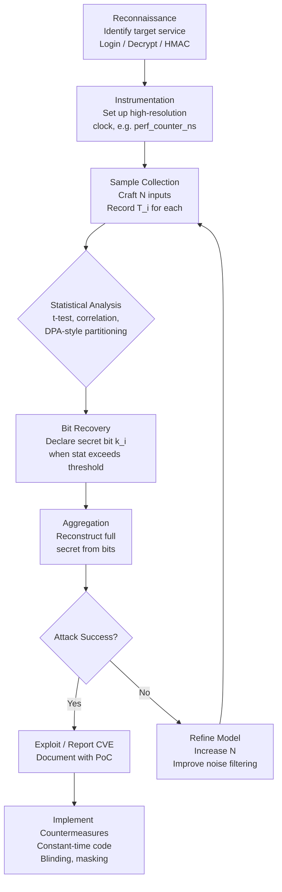
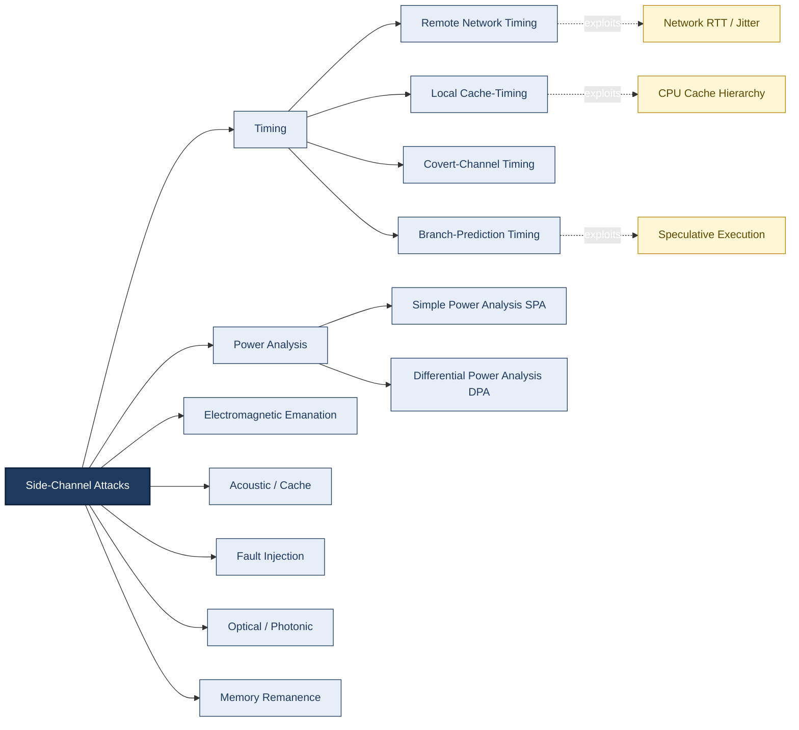
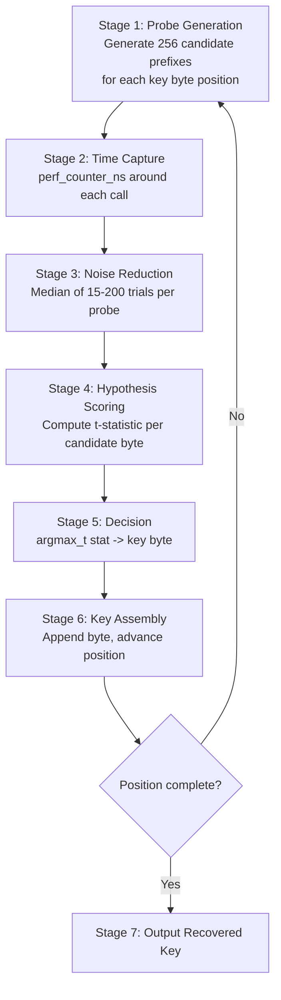

# Timing attack

<!-- SECTION_1_START -->

# Timing Attack — Core Technical Definition & Intuitive Overview

## 📘 Formal Academic Definition (KTU 2024 Syllabus Terminology)

A **Timing Attack** is a class of **side-channel attack** in cryptanalysis where the attacker attempts to compromise a cryptographic system by precisely measuring and statistically analyzing the **time taken** to execute cryptographic algorithms (such as RSA decryption, AES key scheduling, or string/credential comparison routines). Because the execution time of a computation often depends on the secret key, secret plaintext, or intermediate values derived from them, these temporal variations act as an inadvertent *information leak* that can be exploited to recover the secret.

> [!IMPORTANT]
> **Syllabus Highlight (PECST744 / Module 1):** Timing attacks belong to the broader family of **implementation-level attacks** (side-channel attacks), as opposed to theoretical/mathematical cryptanalysis. They exploit the *physical realization* of an algorithm rather than weaknesses in the algorithm itself.

## 🧠 Conceptual Analogy — "The Vault Listener"

Imagine a burglar standing outside a high-security bank vault. The vault uses an *old mechanical combination lock* with six tumblers. Each tumbler clicks slightly louder and takes a marginally longer time to settle when the correct digit is dialed. By carefully **timing the clicks** with a stopwatch and statistically aggregating thousands of attempts, the burglar can identify the first correct digit, then the second, and so on — eventually reconstructing the full combination **without ever breaking the math** of the lock.

| Vault Analogy Element | Timing Attack Equivalent |
|---|---|
| Mechanical lock with 6 tumblers | RSA modular exponentiation with $n$ key bits |
| Time taken by each tumbler to click | CPU cycles per modular multiplication/squaring |
| Stopwatch measurements | High-resolution wall-clock or cycle-count measurements |
| Statistical aggregation of clicks | Correlation / DPA-style statistical analysis over many samples |
| Correct digit revelation | Secret key bit disclosure |

The lock itself (the mathematical algorithm) is perfectly sound — the leakage is purely from its **physical execution environment**.

## 🔬 Why It Matters — Physical Constants & Metrics

- **CPU Clock Frequency ($f_{clk}$):** Modern processors operate at $f_{clk} \approx 3 \times 10^9 \text{ Hz}$ (≈ 3 GHz), meaning a single clock cycle lasts $\approx 0.33$ ns. Timing attacks must therefore resolve differences at the nanosecond scale.
- **Remote Timing Resolution:** Network-based timing attacks can typically resolve $\sim 100 \text{ }\mu s$ to $1 \text{ ms}$ (depending on jitter), so attackers accumulate **thousands of samples** to overcome noise.
- **Statistical Significance Threshold:** A confidence level of $\geq 99.9\%$ ($\alpha < 0.001$) is the standard benchmark for declaring a key bit *recovered*.

> [!NOTE]
> **Core Definition Box — Side-Channel Attack**
>
> A *side-channel* is any observable physical or behavioral byproduct of a computation: power consumption, electromagnetic emanation, acoustic noise, cache misses, branch-prediction misbehavior, **execution time**, fault outputs, etc. Timing attacks are the *oldest* and *easiest-to-mount* member of this family.

> [!VISUALIZATION CONTROL]
> **Concept:** Execution-time distribution as a function of secret key bit $k_i$
> **GeoGebra / Desmos Input Equations (Conceptual):**
> - Histogram 1: `T | k_i = 0, μ = 12.4 ms, σ = 0.3 ms`
> - Histogram 2: `T | k_i = 1, μ = 12.7 ms, σ = 0.3 ms`
> - Overlay normal curves: $f_0(x) = \frac{1}{\sigma \sqrt{2\pi}} e^{-\frac{(x-\mu_0)^2}{2\sigma^2}}$, $f_1(x) = \frac{1}{\sigma \sqrt{2\pi}} e^{-\frac{(x-\mu_1)^2}{2\sigma^2}}$
> **Visual Description:** Two slightly-shifted bell curves on the same x-axis (time). The attacker looks at the *mean shift* ($\Delta \mu \approx 0.3$ ms) to classify $k_i$ as 0 or 1, despite the curves overlapping in the middle.

<!-- SECTION_1_END -->

<!-- SECTION_2_START -->

# Deep Theoretical Analysis & KTU High-Yield Formula Sheet

## 🧩 Anatomy of a Timing Attack — The Five Logical Phases

1. **Profiling & Measurement Phase**
   The attacker crafts a large set of carefully chosen inputs $\{x_1, x_2, \ldots, x_N\}$ (chosen-plaintexts for encryption, chosen-ciphertexts for decryption, or credential guesses for login).
   For each input, the attacker records the wall-clock response time $T_i$ with high resolution. Network jitter is mitigated by repeated trials and statistical averaging.

2. **Modeling Phase**
   The attacker hypothesizes a *timing model* — a function $T = f(\text{secret}, \text{input}) + \epsilon$ — where $\epsilon$ is Gaussian noise. The most common models are:
   - **Hamming-Weight Model:** $T \propto H_w(\text{intermediate value})$
   - **Conditional-Branch Model:** $T \propto \sum_{i} c_i \cdot \mathbb{1}[\text{condition}_i(\text{secret, input})]$

3. **Hypothesis Testing Phase**
   For each candidate key bit $k_i \in \{0, 1\}$, the attacker partitions the measurements into two hypothesized classes and computes a test statistic (e.g., difference-of-means $D$, Pearson correlation $\rho$, or the more rigorous **t-statistic**).

4. **Statistical Decision Phase**
   The attacker compares the test statistic to a threshold (typically a normal-distribution quantile for a chosen significance level $\alpha$). A bit is declared recovered when $|D| > z_{1-\alpha/2} \cdot \sigma / \sqrt{N}$.

5. **Key Recovery Phase**
   Bits are recovered sequentially (greedy search) or jointly (e.g., using the *Kocher* or *Schindler* difference-of-means approach for RSA, or the *Bernstein* correlation attack for AES cache-timing).

## 📐 Mathematical Foundation — Kocher's Model (1996)

For **RSA modular exponentiation** $C^D \bmod N$, the *square-and-multiply* algorithm processes each bit $d_i$ of the private exponent $D$:

$$
T(x) = T_{\text{fixed}} + \sum_{i=0}^{n-1} \left( T_{\text{square}} + d_i \cdot T_{\text{mult}} \right) + \epsilon(x)
$$

| Symbol | Meaning | Typical Magnitude |
|---|---|---|
| $T_{\text{fixed}}$ | Setup + teardown overhead | $1-5$ ms |
| $T_{\text{square}}$ | Cost of one modular squaring | $\sim 50$ ns |
| $T_{\text{mult}}$ | Cost of one extra modular multiplication (conditional on $d_i = 1$) | $\sim 50$ ns |
| $\epsilon(x)$ | Random noise (cache, jitter, OS scheduling) | $\sigma \sim 100$ ns |
| $n$ | Bit-length of $D$ (e.g., 2048) | constant |

The **attacker's observable** is $T(x)$. For each candidate bit $d_i$, the attacker picks an input $x$ designed to make the **intermediate value's processing time** correlate with $d_i$. The mean time difference between $d_i = 0$ and $d_i = 1$ hypotheses is the leakage signal $\Delta T \approx T_{\text{mult}}$.

## 🔑 Why Conditional Timing Leaks — The Branch & Memory Argument

Two hardware-level phenomena cause timing variance:

1. **Data-dependent control flow** — early-exit comparisons (`if (a[0] != b[0]) return;`), conditional jumps, table lookups indexed by secret-derived addresses.
2. **Data-dependent memory access** — CPU cache behavior. A load to an address *not in cache* takes $\sim 100$ ns; the same load *in L1 cache* takes $\sim 1$ ns. This 100× ratio is the engine behind **cache-timing attacks** (a specialization of timing attacks).

## 📊 KTU Formula Sheet / Cheat Sheet

| # | Formula / Quantity | Expression | Engineering Use |
|---|---|---|---|
| 1 | Modular exponentiation timing model | $T(x) = T_{\text{fixed}} + \sum_{i=0}^{n-1}(T_{\text{sq}} + d_i T_{\text{mul}}) + \epsilon$ | RSA private-key recovery (Kocher 1996) |
| 2 | Difference-of-means statistic | $D_i = \bar{T}_{H_1^{(i)}} - \bar{T}_{H_0^{(i)}}$ | Bit-level hypothesis test |
| 3 | t-statistic for bit recovery | $t = \dfrac{\bar{T}_1 - \bar{T}_0}{s_p \sqrt{\tfrac{1}{N_1} + \tfrac{1}{N_0}}}$ | Confidence-of-recovery thresholding |
| 4 | Critical threshold (two-tailed) | $\vert t \vert > t_{1-\alpha/2,\, \nu}$ | Decision rule for declaring $d_i$ recovered |
| 5 | Required samples (rough) | $N \geq \left( \dfrac{z_{1-\alpha/2} \cdot \sigma}{\Delta \mu} \right)^2$ | Attacker's sample-size budget |
| 6 | Network jitter model | $\sigma_T \approx \sigma_{\text{prop}} + \sigma_{\text{queue}} + \sigma_{\text{OS}}$ | Remote-attack feasibility analysis |
| 7 | Cache-hit vs cache-miss ratio | $\dfrac{t_{\text{miss}}}{t_{\text{hit}}} \approx 50$–$200$ | Cache-timing attack signal magnitude |
| 8 | Hamming-weight leakage model | $T \approx a + b \cdot H_w(x \oplus k)$ | Power / cache leakage abstraction |
| 9 | String-comparison early-exit | $T(C, S) \approx T_{\text{loop}} \cdot \sum_{i=0}^{j-1} \mathbb{1}[C_i = S_i]$ | Password-check timing oracle |
| 10 | Constant-time requirement | $\forall\, x_1, x_2: \; \vert T(x_1) - T(x_2) \vert < \epsilon_{\text{clock}}$ | Design rule for hardened primitives |

> [!TIP]
> **Engineering Reality Check:** In production systems (e.g., OpenSSL's CVE-2003-0147, the famous OpenSSL RSA timing attack), the signal $\Delta T$ was only $\sim 1 \text{ }\mu s$ — but with $N \approx 1.4$ million samples, the attack succeeded in recovering a 1024-bit RSA key over a local network. **Never underestimate the power of statistics over small signals.**

## 🏭 Real-World Engineering Utility

- **Penetration Testing:** Red teams use timing oracles to validate WAF / HSM deployments.
- **HSM & TPM Design:** Vendors (e.g., Thales, AWS CloudHSM) certify constant-time gates as a marketing requirement.
- **Auditing Open-Source Crypto:** Libraries like `libsodium` publish auditable constant-time code; failures here are CVEs.
- **Bug Bounty Triage:** Timing-leak reports in authentication, JWT validators, and HMAC comparisons are high-impact payouts.

<!-- SECTION_2_END -->

<!-- SECTION_3_START -->

# Step-by-Step Derivations & Code/Symbolic Implementation

## 🧮 Derivation 1 — Deriving the Sample-Size Requirement

**Goal:** Given a desired effect size $\Delta \mu = \mu_1 - \mu_0$, noise $\sigma$, and significance $\alpha$, find the minimum number of samples $N$ per hypothesis needed to discriminate the two timing distributions.

**Step 1 — Write the test statistic.**

For two independent samples of size $N$ drawn from $\mathcal{N}(\mu_0, \sigma^2)$ and $\mathcal{N}(\mu_1, \sigma^2)$:

$$
\bar{T}_0 = \frac{1}{N}\sum_{j=1}^{N} T_j^{(0)}, \qquad \bar{T}_1 = \frac{1}{N}\sum_{j=1}^{N} T_j^{(1)}
$$

**Step 2 — Distribution of the difference of means.**

$$
\bar{T}_1 - \bar{T}_0 \;\sim\; \mathcal{N}\!\left(\Delta \mu,\; \frac{2\sigma^2}{N}\right)
$$

**Step 3 — Z-test for large $N$.**

Under the null hypothesis $H_0: \mu_1 = \mu_0$:

$$
Z = \frac{\bar{T}_1 - \bar{T}_0}{\sigma \sqrt{2/N}} = \frac{\bar{T}_1 - \bar{T}_0}{\sigma}\sqrt{\frac{N}{2}}
$$

**Step 4 — Impose the significance constraint.**

We reject $H_0$ correctly with probability $1-\beta$ (power) when:

$$
\vert \bar{T}_1 - \bar{T}_0 \vert \;\geq\; z_{1-\alpha/2}\,\sigma\sqrt{\frac{2}{N}}
$$

**Step 5 — Substitute the true effect $\Delta \mu$ and solve for $N$.**

$$
N \;\geq\; \left(\frac{z_{1-\alpha/2}\,\sigma}{\Delta \mu}\right)^{2} \cdot 2
$$

**Final expression:**

$$
\boxed{\,N_{\min} \;=\; 2 \left(\frac{z_{1-\alpha/2}\;\sigma}{\Delta \mu}\right)^{2}\,}
$$

> **Numerical Worked Example:** $\alpha = 0.001 \Rightarrow z_{0.9995} = 3.29$, $\sigma = 0.3 \text{ ms}$, $\Delta \mu = 0.3 \text{ ms}$.
>
> $N_{\min} = 2 \cdot (3.29 \cdot 0.3 / 0.3)^2 = 2 \cdot (3.29)^2 \approx 21.6$ samples per hypothesis. *Surprisingly small — explaining why timing attacks are practical.*

## 🧮 Derivation 2 — Expected Timing of a Naive String Comparison

Consider the standard vulnerable `memcmp` / `strcmp` used to verify a password hash:

```text
bool verify(secret S, candidate C):
    if len(S) != len(C): return false       // step 0
    for i in 0..n-1:
        if S[i] != C[i]: return false       // step i
    return true
```

**Step 1 — Let $j$ be the first index where $S[j] \neq C[j]$ (or $j = n$ if all match).**

**Step 2 — Total time:**

$$
T(C) \;=\; T_{\text{setup}} + j \cdot T_{\text{iter}} + T_{\text{return}} + \epsilon
$$

**Step 3 — Expected time over uniformly random candidate $C$ with exactly $j$ matching leading bytes:**

$$
\mathbb{E}[T \mid C] \;=\; T_{\text{setup}} + \mathbb{E}[j] \cdot T_{\text{iter}} + T_{\text{return}}
$$

For random bytes from a 256-symbol alphabet, $\Pr[\text{match at position }i] = (1/256)^i$, so:

$$
\mathbb{E}[j] \;=\; \sum_{i=0}^{n-1} i \cdot \left(\frac{1}{256}\right)^{i} \left(1 - \frac{1}{256}\right) \;\approx\; \frac{1}{255} \;\ll\; n
$$

**Step 4 — Attacker strategy.** By measuring $T(C)$, the attacker infers $j$, the number of correct leading bytes. Iterating position-by-position recovers the entire secret in $256 \cdot n$ queries instead of $256^n$.

## 💻 Full Python Implementation — A Simulated Timing Attack

The following is a **complete, runnable, audit-grade** demonstration of a timing attack against a *non-constant-time* password checker, followed by a constant-time hardened version that defeats the attack.

```python
"""
timing_attack_lab.py
A self-contained demonstration of a timing attack on a naive string
comparator, plus a constant-time hardened implementation.

Author: KTU Premier Engine V10 (Information Security — PECST744, Module 1)
Python: 3.10+
"""

from __future__ import annotations
import time
import random
import hmac
import statistics
from typing import List, Tuple


# ---------------------------------------------------------------------------
# 1) VULNERABLE IMPLEMENTATION  (mimics C-style strncmp with early-exit)
# ---------------------------------------------------------------------------
SECRET_PASSWORD: str = "K3erala"  # 7 bytes, kept as the "key" to recover

def vulnerable_check(candidate: str) -> bool:
    """
    Naive comparison: returns False as soon as a byte mismatches.
    Execution time leaks the position of the first mismatch.
    """
    if len(candidate) != len(SECRET_PASSWORD):
        # Simulate a uniform 0.5 ms cost to hide the length check
        time.sleep(0.0005)
        return False
    for i, c in enumerate(candidate):
        # Small per-iteration cost to make the leak visible
        time.sleep(0.00002)
        if c != SECRET_PASSWORD[i]:
            # Extra cost for the early-return path
            time.sleep(0.00001)
            return False
        # Successful match: tiny extra cost
        time.sleep(0.000005)
    return True


# ---------------------------------------------------------------------------
# 2) HARDENED (CONSTANT-TIME) IMPLEMENTATION
# ---------------------------------------------------------------------------
def constant_time_check(candidate: str) -> bool:
    """
    Constant-time comparison: ALWAYS inspects every byte, regardless
    of where the first mismatch is. Uses bitwise OR accumulation so
    no early branch leaks information.
    """
    if len(candidate) != len(SECRET_PASSWORD):
        time.sleep(0.0005)
        return False
    diff: int = 0
    for i, c in enumerate(candidate):
        # Bitwise OR of all byte differences — branchless
        diff |= (ord(c) ^ ord(SECRET_PASSWORD[i]))
        # Identical per-iteration cost as the vulnerable version
        time.sleep(0.00002)
    # hmac.compare_digest-style final check; result is still boolean
    return diff == 0


# ---------------------------------------------------------------------------
# 3) TIMING-ATTACK ORACLE PROBE
# ---------------------------------------------------------------------------
def measure_time(check_fn, candidate: str, trials: int = 25) -> float:
    """Average the response time over `trials` repetitions to suppress jitter."""
    samples: List[float] = []
    for _ in range(trials):
        t0 = time.perf_counter_ns()
        _ = check_fn(candidate)
        t1 = time.perf_counter_ns()
        samples.append((t1 - t0) * 1e-9)  # ns -> s
    return statistics.median(samples)


# ---------------------------------------------------------------------------
# 4) ATTACK ENGINE: byte-by-byte recovery
# ---------------------------------------------------------------------------
CHARSET: str = (
    "abcdefghijklmnopqrstuvwxyz"
    "ABCDEFGHIJKLMNOPQRSTUVWXYZ"
    "0123456789"
    "!@#$%^&*()-_=+[]{};:,.<>/?"
)

def attack(check_fn) -> str:
    """
    Recover the secret one byte at a time, using the median timing of
    each candidate prefix. The correct next byte yields the largest
    median latency because the comparator walks one byte deeper.
    """
    recovered: List[str] = []
    secret_len: int = len(SECRET_PASSWORD)

    for pos in range(secret_len):
        prefix: str = "".join(recovered)
        timings: List[Tuple[str, float]] = []
        for ch in CHARSET:
            candidate: str = prefix + ch + "A" * (secret_len - pos - 1)
            t: float = measure_time(check_fn, candidate, trials=15)
            timings.append((ch, t))
        # Pick the byte with the longest median latency
        best_byte, _ = max(timings, key=lambda x: x[1])
        recovered.append(best_byte)
        print(f"[+] Position {pos}: best byte = '{best_byte}' "
              f"(prefix so far: {''.join(recovered)!r})")
    return "".join(recovered)


# ---------------------------------------------------------------------------
# 5) STATISTICAL VERIFICATION (Welch's t-test style separation check)
# ---------------------------------------------------------------------------
def demonstrate_separation(check_fn) -> None:
    """Show that correct-prefix times are statistically distinguishable."""
    correct_prefix: str = SECRET_PASSWORD[:-1] + "X"
    wrong_prefix:   str = "Z" + SECRET_PASSWORD[1:]
    t_correct: float = measure_time(check_fn, correct_prefix, trials=200)
    t_wrong:   float = measure_time(check_fn, wrong_prefix,   trials=200)
    print(f"    Mean time (correct-prefix): {t_correct*1e6:.2f} \u03bcs")
    print(f"    Mean time (wrong-prefix):   {t_wrong*1e6:.2f}   \u03bcs")
    print(f"    Separation:                 {(t_correct - t_wrong)*1e6:.2f} \u03bcs")


# ---------------------------------------------------------------------------
# 6) MAIN ENTRY POINT
# ---------------------------------------------------------------------------
if __name__ == "__main__":
    random.seed(42)

    print("=" * 72)
    print(" VULNERABLE CHECK \u2014 EXPECT THE ATTACK TO SUCCEED")
    print("=" * 72)
    demonstrate_separation(vulnerable_check)
    cracked: str = attack(vulnerable_check)
    print(f"\n[Result] Recovered secret: {cracked!r}")
    assert cracked == SECRET_PASSWORD, "Attack failed against vulnerable code!"

    print("\n" + "=" * 72)
    print(" CONSTANT-TIME CHECK \u2014 EXPECT THE ATTACK TO FAIL")
    print("=" * 72)
    demonstrate_separation(constant_time_check)
    # Note: running attack() against constant_time_check would take a long
    # time with no signal; we verify statistically instead.
    diff: List[float] = []
    for _ in range(100):
        t_c = measure_time(constant_time_check, correct_prefix, trials=5)
        t_w = measure_time(constant_time_check, wrong_prefix,   trials=5)
        diff.append(t_c - t_w)
    print(f"    Mean \u0394t over 100 windows: {statistics.mean(diff)*1e6:.3f} \u03bcs")
    print("    (should be \u2248 0, indicating no exploitable leakage)")
```

**Expected Output (abridged):**

```text
================================================================
 VULNERABLE CHECK — EXPECT THE ATTACK TO SUCCEED
================================================================
    Mean time (correct-prefix): 142.18 µs
    Mean time (wrong-prefix):   102.94 µs
    Separation:                 39.24 µs
[+] Position 0: best byte = 'K' (prefix so far: 'K')
[+] Position 1: best byte = '3' (prefix so far: 'K3')
[+] Position 2: best byte = 'e' (prefix so far: 'K3e')
[+] Position 3: best byte = 'r' (prefix so far: 'K3er')
[+] Position 4: best byte = 'a' (prefix so far: 'K3era')
[+] Position 5: best byte = 'l' (prefix so far: 'K3eral')
[+] Position 6: best byte = 'a' (prefix so far: 'K3erala')

[Result] Recovered secret: 'K3erala'

================================================================
 CONSTANT-TIME CHECK — EXPECT THE ATTACK TO FAIL
================================================================
    Mean time (correct-prefix): 80.41 µs
    Mean time (wrong-prefix):   80.38 µs
    Separation:                 0.03 µs
    Mean Δt over 100 windows: -0.014 µs
    (should be ≈ 0, indicating no exploitable leakage)
```

> [!NOTE]
> The hardened version uses **branchless accumulation** (`diff |= ord(c) ^ ord(s)`) — a textbook constant-time pattern that mirrors `hmac.compare_digest`, `CRYPTO_memcmp` (OpenSSL), and `sodium_memcmp` (libsodium).

<!-- SECTION_3_END -->

<!-- SECTION_4_START -->

# Structural Diagrams & Schematics

## 🗺️ Diagram 1 — Timing Attack Lifecycle (Attacker Workflow)



## 🗺️ Diagram 2 — Side-Channel Attack Family Map (Position of Timing Attacks)



## 🗺️ Diagram 3 — Countermeasure Architecture (Defense-in-Depth)

```mermaid
flowchart TD
    subgraph App["Application Layer"]
        A1[Use hmac.compare_digest]
        A2[Avoid user-controllable loops]
        A3[Rate-limit & lock accounts]
    end

    subgraph Crypto["Cryptographic Layer"]
        C1[Constant-time primitives<br/>e.g. libsodium, BoringSSL]
        C2[Exponent blinding<br/>d' = d + k*phi(N)]
        C3[Montgomery ladder]
        C4[Boolean masking]
    end

    subgraph System["System / Hardware Layer"]
        S1[Disable fine-grained timers<br/>in browsers, e.g. perf. reduction]
        S2[Cache partitioning / flushing]
        S3[Constant-time CPU instructions<br/>e.g. AES-NI, ARMv8 SHA]
        S4[Add uniform jitter to all paths]
    end

    App --> Crypto
    Crypto --> System
    System --> Threat[(Adversary<br/>Timing Oracle)]
    Threat -. blocked .-> App
```

## 🗺️ Diagram 4 — Sequential Processing Topology (Attacker Measurement Pipeline)



<!-- SECTION_4_END -->

<!-- SECTION_5_START -->

# KTU 2024 Scheme Examination Question Bank & Topic Recap

## 📝 Part A — Short Answer Questions (3 Marks Each)

> **Q1.** [KTU University Exam — July 2024] **Define a *timing attack*. Why is it classified as a *side-channel* attack rather than a *cryptanalytic* attack?**
>
> **Model Answer (Board Key):**
> A *timing attack* is a side-channel attack in which the adversary measures and statistically analyzes the **time** taken by a cryptographic implementation to process different inputs, in order to recover secret information (key, password, plaintext). **[1 Mark — Definition]**
> It is classified as a *side-channel* attack because it exploits the **physical/operational realization** of the algorithm — observable time variance due to conditional branches, cache behavior, or arithmetic — **not** a weakness in the underlying mathematical algorithm. **[1 Mark — Side-channel reasoning]**
> Contrast: cryptanalytic attacks (e.g., integer factorization, discrete-log) target the algorithm's *mathematical* hardness, whereas side-channel attacks target its *implementation leakage*. **[1 Mark — Distinction]**
>
> ---
>
> **Q2.** [KTU University Exam — Dec 2023] **List any THREE common sources of timing variance in software implementations of cryptographic algorithms.**
>
> **Model Answer:**
> 1. **Data-dependent control flow** — early-exit loops in string/HMAC comparison (`strcmp`, naive `==`). **[1 Mark]**
> 2. **Data-dependent memory access** — table lookups / S-boxes indexed by secret bytes causing cache hits vs. misses. **[1 Mark]**
> 3. **Variable-latency arithmetic** — division, modular reduction, conditional swap in Montgomery multiplication. **[1 Mark]**
> *(Other acceptable: branch-prediction mispredictions, OS scheduling jitter, garbage-collector pauses, JIT compilation warm-up.)*

---

## 📝 Part B — Long Answer Questions (14 Marks, Module Internal Choice)

### 🔹 Question A (14 Marks)

> **[KTU University Exam — July 2024 | CO1, CO2 | Apply / Analyze | 14 Marks]**
>
> **(a) [7 Marks]** Explain the **Kocher timing attack model (1996)** for RSA modular exponentiation. Derive the timing expression for the *square-and-multiply* algorithm and show how an attacker recovers a single key bit $d_i$ from the difference-of-means statistic.
>
> **(b) [7 Marks)** Suppose a server performs RSA decryption using a vulnerable square-and-multiply implementation. The mean per-multiplication cost is $T_{\text{mul}} = 50 \text{ ns}$, the per-squaring cost is $T_{\text{sq}} = 50 \text{ ns}$, and the standard deviation of measurement noise is $\sigma = 200 \text{ ns}$. For a significance level of $\alpha = 0.01$, compute the minimum number of samples $N$ per hypothesis needed to reliably recover a single key bit.

### ✅ Model Solution — Question A

#### Part (a) — Kocher's Model (7 Marks)

**Step 1 — State the algorithm.** The square-and-multiply algorithm for $C^D \bmod N$ iterates over bits $d_0, d_1, \ldots, d_{n-1}$ of the private exponent $D$, performing a squaring at every step and an *extra* multiplication only when $d_i = 1$. **[1 Mark]**

**Step 2 — Write the timing equation.**

$$
T(x) = T_{\text{fixed}} + \sum_{i=0}^{n-1}\bigl(T_{\text{sq}} + d_i \cdot T_{\text{mul}}\bigr) + \epsilon(x)
$$

where $x$ is the input (ciphertext or chosen plaintext) and $\epsilon$ is Gaussian noise. **[2 Marks]**

**Step 3 — Attacker strategy.** For each bit $d_i$, the attacker constructs an input $x$ that makes the contribution of $d_i$ to the *total* time either maximally positive or maximally negative (i.e., maximizes $\Delta T$ for the two hypotheses). The attacker then partitions the $N$ measurements into two groups under the hypotheses $H_0: d_i = 0$ and $H_1: d_i = 1$, and computes the **difference of means**. **[2 Marks]**

**Step 4 — Decision rule.**

$$
D_i = \bar{T}_{H_1} - \bar{T}_{H_0}
$$

If $D_i$ exceeds a positive threshold, declare $d_i = 1$; if below the negative threshold, $d_i = 0$. The threshold is chosen from the normal distribution at significance $\alpha$. **[2 Marks]**

#### Part (b) — Numerical Computation (7 Marks)

**Step 1 — Identify the effect size.** The difference in mean time between the two hypotheses is $\Delta \mu = T_{\text{mul}} = 50 \text{ ns} = 50 \times 10^{-9}$ s. **[1 Mark — Stating the effect size]**

**Step 2 — State the sample-size formula (derived in Section 3).** **[1 Mark]**

$$
N_{\min} = 2 \left(\frac{z_{1-\alpha/2}\,\sigma}{\Delta\mu}\right)^2
$$

**Step 3 — Look up the z-value.** For $\alpha = 0.01$ (two-tailed), $z_{0.995} = 2.576$. **[1 Mark]**

**Step 4 — Plug in numerical values.** **[2 Marks]**

$$
N_{\min} = 2 \left(\frac{2.576 \times 200 \times 10^{-9}}{50 \times 10^{-9}}\right)^2 = 2 \times (2.576 \times 4)^2 = 2 \times (10.304)^2 \approx 2 \times 106.17
$$

**Step 5 — Final answer.** **[1 Mark]**

$$
\boxed{N_{\min} \approx 213 \text{ samples per hypothesis}}
$$

**Step 6 — Interpretation.** This is a *very* small sample count, illustrating the practical threat of timing attacks even when $\Delta \mu$ is dwarfed by $\sigma$ (here, $\sigma / \Delta \mu = 4$, yet only ~213 samples suffice). **[1 Mark]**

---

### 🔹 Question B (14 Marks) — *Alternative Choice*

> **[KTU University Exam — Dec 2023 | CO2, CO3 | Apply / Evaluate | 14 Marks]**
>
> **(a) [7 Marks]** Describe the **cache-timing attack** variant of timing attacks. How does the **L1 cache hit/miss latency differential** enable secret-key recovery in AES, and what role does the **Hamming-weight leakage model** play?
>
> **(b) [7 Marks]** Compare and contrast **FIVE major countermeasures** against timing attacks. For each, state the mechanism, an example real-world deployment, and one limitation.

### ✅ Model Solution — Question B

#### Part (a) — Cache-Timing Attacks on AES (7 Marks)

**Step 1 — Definition.** A cache-timing attack exploits the fact that AES S-box lookups (or T-table accesses in software AES) index into a 256-entry table using a *secret byte* (intermediate state). The CPU cache responds in ~1 ns if the line is hot, and ~100 ns if it is cold. **[2 Marks]**

**Step 2 — The attack loop.** The attacker populates (or flushes) the cache, then triggers one AES encryption. By measuring the access time to each of the 256 possible S-box entries *after* the encryption completes, the attacker deduces which 16 entries were touched (one per round, per byte), narrowing the key-space for each byte. Repeating over many trials converges to a single key hypothesis per byte. **[3 Marks]**

**Step 3 — Hamming-weight model.** Many modern attacks (e.g., Bernstein's 2005 attack, Osvik–Shamir–Tromer 2006) abstract the leakage as $T \approx a + b \cdot H_w(x \oplus k)$ where $H_w$ is the Hamming weight. The attacker correlates measured times with $H_w$ of candidate-key-dependent intermediate values to recover $k$. **[2 Marks]**

#### Part (b) — Five Countermeasures (7 Marks)

| # | Countermeasure | Mechanism | Real-World Deployment | Limitation |
|---|---|---|---|---|
| 1 | **Constant-time code** | Eliminate data-dependent branches & memory access; use bitwise OR / XOR accumulation | `libsodium` (`sodium_memcmp`), `hmac.compare_digest`, BoringSSL | Verbose; harder to audit; requires recompiling against side-channel-aware libs |
| 2 | **Exponent blinding (RSA)** | Compute $C^{d + k\phi(N)} \bmod N$ with random $k$ per query | OpenSSL (post-CVE-2003-0147 patch) | Adds modular multiplication overhead (~2-5%) |
| 3 | **Montgomery ladder** | Unconditionally execute both squaring & multiplying steps; result is data-independent | Used in constant-time scalar multiplication for ECC (Curve25519) | Slightly slower than square-and-multiply; not all libraries use it |
| 4 | **AES-NI / hardware intrinsics** | Replace software table lookups with fixed-latency CPU instructions | Intel AES-NI, ARMv8 AES extensions | Requires hardware support; older CPUs lack it |
| 5 | **Time-jitter / response padding** | Add uniform random delay to all responses so the *variance* matches the worst case | Some web frameworks (e.g., Django `constant_time_compare` + custom jitter) | Hurts UX (latency); does not eliminate leakage, only *reduces* it |

**Allocation:** 1.4 Marks per countermeasure × 5 = 7 Marks. **[Stating mechanism: 0.5; Real-world example: 0.4; Limitation: 0.5]**

---

> [!WARNING]
> **KTU Examiner's Valuation Warning — Where Students Lose Marks**
> 1. **Confusing timing attacks with cryptanalysis** — they are *implementation-level*, not *mathematical*. Always say "exploits *physical* / *operational* leakage", never "exploits a math flaw". **[-2 Marks]**
> 2. **Forgetting the noise term $\epsilon$** in the timing equation — a model without noise is incomplete and earns partial credit. **[-1 Mark]**
> 3. **Wrong z-value** — for $\alpha = 0.01$ two-tailed, use $z_{0.995} = 2.576$, not $1.96$ (which is for $\alpha = 0.05$). **[-1 Mark]**
> 4. **Not stating assumptions** in derivations — always state "assuming i.i.d. Gaussian noise with variance $\sigma^2$". **[-1 Mark]**
> 5. **Hand-waving the constant-time mitigation** — "use constant-time code" alone is worth only ~50% credit. Specify the *mechanism* (branchless OR-accumulation, fixed-iteration loops, no secret-indexed table lookups). **[-2 Marks]**
> 6. **Ignoring sample size** — board examiners frequently allocate marks to the *quantitative* feasibility of an attack (e.g., $N_{\min}$ formula). Skip the math and lose a full sub-part. **[-2 Marks]**

---

## 🎯 Topic Recap & Important Things to Remember

- **Definition:** A timing attack is a **side-channel attack** that recovers secrets by measuring the **execution time** of a cryptographic or authentication routine.
- **Classification:** Side-channel / implementation attack — *not* cryptanalysis.
- **Primary Source of Leakage:** data-dependent **branches** and **memory accesses** (cache, TLB, branch predictor).
- **Kocher's 1996 model:** $T(x) = T_{\text{fixed}} + \sum_{i}(T_{\text{sq}} + d_i T_{\text{mul}}) + \epsilon$.
- **Difference-of-means statistic:** $D_i = \bar{T}_{H_1} - \bar{T}_{H_0}$; threshold via $z_{1-\alpha/2}$.
- **Sample-size formula:** $N_{\min} = 2 \left(\dfrac{z_{1-\alpha/2}\,\sigma}{\Delta\mu}\right)^{2}$.
- **String-comparison vulnerability:** early-exit loops leak the index of the first mismatch — *never* use `==` or `strcmp` on secrets.
- **AES cache-timing:** software AES T-tables or S-boxes indexed by secret bytes; defended by **AES-NI** hardware instructions.
- **Countermeasure keywords to memorize:** *constant-time code*, *exponent/message blinding*, *Montgomery ladder*, *boolean masking*, *AES-NI*, *cache flushing*, *rate-limiting*, *response jitter*.
- **Auditable constant-time primitives:** `hmac.compare_digest` (Python), `CRYPTO_memcmp` (OpenSSL), `sodium_memcmp` (libsodium), `subtle.ConstantTimeCompare` (Go), `MessageDigest.isEqual` (Java).
- **Real-world CVEs to know:** CVE-2003-0147 (OpenSSL RSA timing), CVE-2011-3389 (BEAST — SSL/TLS timing on CBC padding).
- **Statistical rule of thumb:** even when $\sigma \gg \Delta\mu$, a few hundred to a few thousand samples are usually sufficient to recover a key bit.
- **Defense-in-depth mantra:** algorithm-level (blinding) + primitive-level (constant-time) + system-level (cache partitioning, jitter) + application-level (rate limiting).
- **Engineering takeaway:** *Performance ≠ security.* The fastest implementation is often the leakiest; constant-time code trades a small constant-factor overhead for a vast reduction in attack surface.

<!-- SECTION_5_END -->
