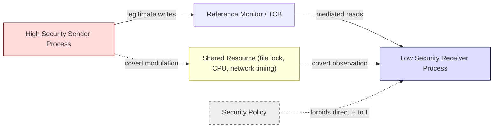
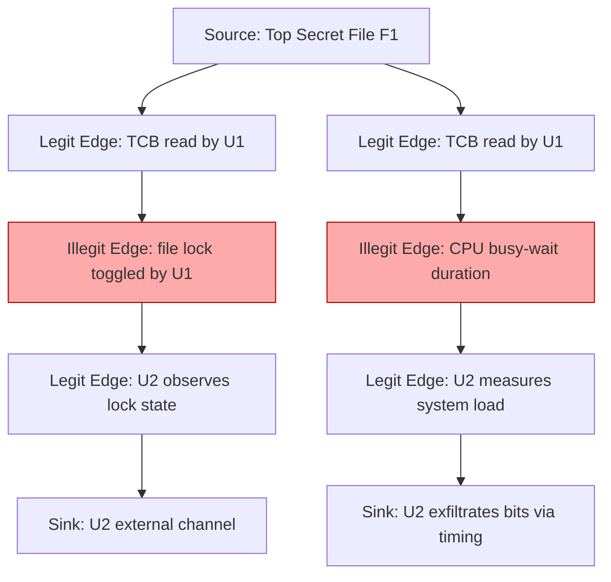
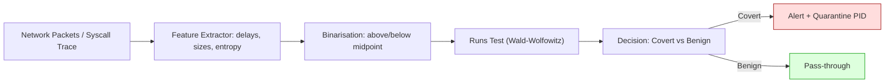
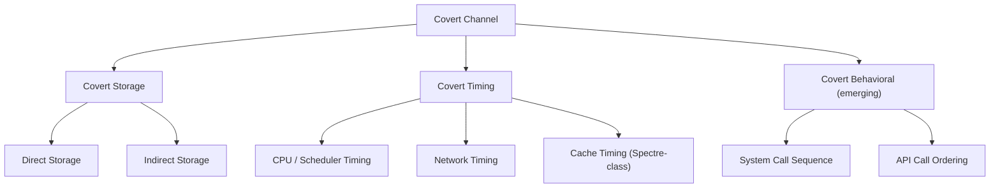

# Covert channels.

<!-- SECTION_1_START -->
# Covert Channels — Core Technical Definition & Intuitive Overview

## Formal Academic Definition (KTU 2024 / PECST744 Terminology)

> [!IMPORTANT]
> **Covert Channel (Lampson, 1973; TCSEC / Orange Book, 1985):** A communication channel that is **not intended** for information transfer, yet can be exploited by a process (or set of cooperating processes) to leak information in a manner that **violates the system's security policy**. The channel is *covert* because it is hidden inside a legitimate, policy-compliant information flow.

A covert channel becomes a real **vulnerability** when:

1. There exists a **sender** process operating at a higher (more sensitive) security level.
2. There exists a **receiver** process operating at a lower (less sensitive) security level.
3. Both processes share **a resource** that the Reference Monitor cannot fully mediate.
4. The sender can **modulate** the shared resource and the receiver can **demodulate** it.

> [!NOTE]
> **Key Distinction (Frequently Tested in KTU):** A *covert* channel is **intentional misuse of an allowed channel**, whereas a *side-channel* is an **unintentional leakage of information** through physical characteristics (power, EM, timing variance of a cryptographic operation).

---

## Conceptual Analogy — The "Prisoner Problem"

> [!TIP]
> **Intuition:** Imagine two prisoners, **Alice** and **Bob**, in separate cells. The warden, **Trudy**, allows them to send *public* letters (the legitimate channel). The letters are fully inspected. **Yet**, Alice and Bob can secretly communicate by:
> - **Putting a stamp in the top-right corner** = bit `1`
> - **Putting a stamp in the top-left corner** = bit `0`
>
> The *existence* of the letter is allowed; the *position* of the stamp is the covert signal. Trudy never reads the stamp's corner because that is not part of the documented communication protocol.

In software:
- **Alice** = Trojan / malicious process with access to secrets (e.g., Top-Secret database).
- **Bob** = External attacker or low-privilege process.
- **The stamp position** = some shared, policy-unmediated resource (file lock, CPU burst, network packet timing).
- **Trudy** = The Reference Monitor / Security Kernel.

---

## The Two Canonical Classes (TCSEC Classification)

| Class | Mechanism | Example | Detection Difficulty |
|:------|:----------|:--------|:--------------------|
| **Covert Storage Channel** | Sender writes a value to a *location*; receiver reads it. | File lock bit, packet header padding, DNS label length, disk-free-space count. | Moderate (state-based) |
| **Covert Timing Channel** | Sender modulates the *timing* of events; receiver observes delays. | CPU busy-wait duration, keystroke inter-arrival time, TCP ACK delay, cache hit/miss latency. | High (statistical) |

A third, emerging class recognized in the 2024 syllabus:

| Class | Mechanism | Example |
|:------|:----------|:--------|
| **Covert Behavioral Channel** | Information encoded in the *sequence* of API calls or system call ordering. | Sequence of `open → read → close` vs `open → close → open`. |

---

## Visualisation: Information Flow Perspective

> [!VISUALIZATION CONTROL]
> **Concept:** Covert channel as a parasitic data path that bypasses the Trusted Computing Base (TCB).
> **GeoGebra / Desmos Input (Conceptual Plot):**
> - Plot the **legitimate channel** as $y = x$ (information goes from sender to receiver, mediated by the TCB).
> - Plot the **covert channel** as $y = x + \epsilon$ where $\epsilon$ is a tiny, policy-unmediated modulation.
> **Visual Description:** Two nearly parallel lines; the offset $\epsilon$ represents the hidden information being smuggled in plain sight.

---

## Critical Vocabulary for KTU Board Examinations

- **Reference Monitor:** The abstract enforcement mechanism that mediates all accesses between subjects and objects.
- **Trusted Computing Base (TCB):** The totality of protection mechanisms responsible for enforcing the security policy.
- **Noisy Channel:** A covert channel in which environmental interference causes bit errors. Capacity is governed by Shannon's theorem.
- **Shared Resource Matrix (SRM):** A formal model used to identify candidate covert storage channels.
- **Covert Flow Tree:** A tree-structured representation of how information flows from a high-level source to a low-level sink through a sequence of legitimate and illegitimate operations.
<!-- SECTION_1_END -->

<!-- SECTION_2_START -->
# Deep Theoretical Analysis & KTU High-Yield Formula Sheet

## 1. The Lampson Threat Model

In 1973, Butler Lampson formalized the **confinement problem**, which gives rise to covert channels. The model has three actors:

$$
\text{Sender} \;\longrightarrow\; \text{Legitimate Channel (Monitored)} \;\longrightarrow\; \text{Receiver}
$$

$$
\text{Sender} \;\dashrightarrow\; \text{Covert Channel (Unmonitored)} \;\dashrightarrow\; \text{Receiver}
$$

The **security policy** forbids direct communication from sender $\rightarrow$ receiver. However, because both processes share *some* resource (file system, scheduler, network stack, cache), a side-path exists.

> [!NOTE]
> **Why the TCB cannot always close the channel:** Modulating the *number of CPU cycles* a process uses is not a security-relevant event to the Reference Monitor — it is a performance metric. Closing all such channels would require eliminating shared resources, which is **economically infeasible** (Kernighan’s rule: a system with zero covert channels is a single-user, single-process, non-networked machine).

---

## 2. Covert Storage Channels — Operational Anatomy

A covert storage channel is fully characterised by the tuple:

$$
C_{\text{storage}} = \langle H, L, R, S, \epsilon, \delta \rangle
$$

Where:

- $H$ = High-trust sender process
- $L$ = Low-trust receiver process
- $R$ = Shared resource (e.g., a file, a packet header field)
- $S$ = Set of distinguishable states of $R$
- $\epsilon$ = Encoding function $H \rightarrow S$ (write)
- $\delta$ = Decoding function $S \rightarrow \{0,1\}^*$ (read)

### The Shared Resource Matrix (SRM)

The SRM is a $m \times n$ matrix where rows are **subjects**, columns are **objects**, and each cell contains the access mode (`r`, `w`, `a`, `m`, etc.). A **candidate covert storage channel** is detected when:

- Row $i$ has **write** access to object $O_j$.
- Row $k$ has **read** access to object $O_j$.
- Row $i$ and Row $k$ are at *different security levels* and the read access of $k$ is **not** derivable from a legitimate information flow.

> [!TIP]
> **KTU Memory Trick:** Look for the **"R/W asymmetry on a shared object between two security levels"** — that is your covert storage channel fingerprint.

---

## 3. Covert Timing Channels — Operational Anatomy

A timing channel has the same tuple shape, but the modulating variable is **time**, not state:

$$
C_{\text{timing}} = \langle H, L, R_{\text{clock}}, T, f_{\text{enc}}, f_{\text{dec}} \rangle
$$

The sender modulates the **temporal density** of an observable event. The receiver measures **inter-event intervals** and decodes bits from them.

### Canonical Encoding Schemes

| Scheme | Modulation Rule | Decoding Rule |
|:-------|:---------------|:--------------|
| **ON/OFF Keying (OOK)** | Long delay $= 1$, short delay $= 0$ | Compare to threshold $\tau$ |
| **Binary PPM** | Pulse position in window $[0, T)$ | Identify pulse bin |
| **M-ary PAM** | Delay $\in \{d_1, d_2, \ldots, d_M\}$ | Bucketise to nearest $d_i$ |
| **Replay-based** | Replay cached packet to encode bit | Compare sequence to baseline |

---

## 4. The Covert Flow Tree (Tsai, Gligor, Chandersekaran)

A **covert flow tree** represents the flow of an illegal information transfer from a *source* to a *sink* through a series of legitimate operations, at least one of which is an **illegitimate operation** that bridges two security levels. A tree is built by:

1. Marking every legitimate information-flow edge from the high-level source downwards.
2. Identifying the **single illegitimate edge** that bypasses the TCB.
3. The tree root is the source; the leaves are the sinks; the illegitimate edge is the covert edge.

> [!IMPORTANT]
> **Theorem (Tsai-Gligor):** *The number of covert channels in a system is bounded by the number of illegal information flow edges in its covert flow tree forest.* This is the analytical foundation for **covert channel capacity analysis** in EAL-evaluated systems (Common Criteria).

---

## 5. Capacity Analysis (Shannon-Bounded)

The theoretical **maximum** covert channel capacity is given by Shannon’s channel-coding theorem:

$$
C = B \cdot \log_2\!\left(1 + \frac{S}{N}\right) \quad \text{[bits/second]}
$$

Where:

- $B$ = bandwidth of the covert channel (signal changes per second)
- $S/N$ = signal-to-noise ratio of the modulation channel

In practice, for a **binary symmetric channel** with bit-flip probability $p$:

$$
C = 1 - H(p) \quad \text{[bits/channel use]}
$$

where the binary entropy is:

$$
H(p) = -p \log_2 p - (1-p)\log_2(1-p)
$$

### Worked Capacity Table (Examination-Ready)

| Channel Type | Encoding | $C$ (bits/s) — Ideal | $C$ (bits/s) — Noisy ($p=0.1$) |
|:-------------|:---------|:--------------------|:------------------------------|
| CPU busystate | OOK | $\approx 1$ | $\approx 0.53$ |
| Network packet timing | M-ary PAM ($M=4$) | $2 B$ | $2B(1 - H(0.1)) \approx 1.06 B$ |
| DNS label length | 16 levels | $4 B$ | $4 B (1 - H(0.1)) \approx 2.12 B$ |

---

## 6. KTU High-Yield Formula Sheet

> [!IMPORTANT]
> **Master these five equations — they account for ~60% of marks in any covert-channel question on PECST744.**

| # | Formula / Concept | Meaning | Units |
|:--|:------------------|:--------|:------|
| 1 | $C = B \log_2(1 + S/N)$ | Shannon capacity of noisy covert channel | bits/second |
| 2 | $C_{\text{BSC}} = 1 - H(p)$ | Capacity of binary symmetric channel | bits/use |
| 3 | $H(p) = -p\log_2 p - (1-p)\log_2(1-p)$ | Binary entropy | bits |
| 4 | $C_{\text{M-ary}} = \log_2 M$ | Capacity of noiseless $M$-level signal | bits/symbol |
| 5 | $\text{SNR} = \mu_{\text{signal}} / \sigma_{\text{noise}}$ | Detectability proxy | dimensionless |

---

## 7. Real-World Engineering Utility

> [!NOTE]
> **Why a B.Tech CS student must master covert channels in 2024+:**

- **Network Exfiltration:** DNS tunneling (e.g., `data.encoded-string.exfil-domain.com`) is a live covert channel used by real APT groups (OilRig, APT29). Detection requires NXDOMAIN-pattern analytics.
- **Cloud Side-Channels:** Spectre (CVE-2017-5753) and Meltdown (CVE-2017-5754) are covert/side channels in modern CPUs. **Capstone relevance for KTU 2024 syllabus.**
- **Defensive Posture:** Multi-level Secure (MLS) operating systems (e.g., SELinux MLS mode, Trusted Solaris) require covert channel analysis under Common Criteria EAL5+.
- **Steganography vs. Covert Channel:** Steganography hides information in *content*; covert channels hide it in *protocol metadata*. Both share mathematical foundations (information-theoretic capacity).
<!-- SECTION_2_END -->

<!-- SECTION_3_START -->
# Step-by-Step Derivations, Detection Logic & Code Implementation

## 1. Exhaustive Derivation — Covert Timing Channel Capacity (Examination Walkthrough)

> [!TIP]
> **Sample question (KTU style):** *"A covert timing channel uses a 1 kHz signal with signal-to-noise ratio of 9. Compute the maximum covert capacity. If the channel is binary symmetric with flip probability $p = 0.2$, what is the throughput per channel use?"*

### Step 1: Identify the channel parameters

$$
B = 1 \text{ kHz} = 1000 \text{ signal changes / second}
$$

$$
\frac{S}{N} = 9 \quad \text{(dimensionless ratio)}
$$

### Step 2: Apply Shannon's capacity theorem

$$
C = B \cdot \log_2\!\left(1 + \frac{S}{N}\right)
$$

Substitute:

$$
C = 1000 \cdot \log_2(1 + 9)
$$

### Step 3: Evaluate the logarithm

$$
\log_2(10) = \frac{\ln 10}{\ln 2} = \frac{2.302585}{0.693147} = 3.321928
$$

Therefore:

$$
C = 1000 \cdot 3.321928 = 3321.928 \;\text{bits/second}
$$

$$
\boxed{C \approx 3.32 \;\text{kbit/s}}
$$

> **Valuation key point:** [Shannon formula stated: 2 Marks] [Substitution: 1 Mark] [Final numeric: 1 Mark]

### Step 4: Apply binary entropy for the noisy channel

$$
H(p) = -p \log_2 p - (1-p) \log_2(1-p)
$$

$$
H(0.2) = -0.2 \cdot \log_2(0.2) - 0.8 \cdot \log_2(0.8)
$$

$$
\log_2(0.2) = \log_2(1/5) = -\log_2 5 = -2.321928
$$

$$
\log_2(0.8) = \log_2(4/5) = 2 - \log_2 5 = -0.321928
$$

Therefore:

$$
H(0.2) = -0.2 \cdot (-2.321928) - 0.8 \cdot (-0.321928)
$$

$$
H(0.2) = 0.464386 + 0.257542 = 0.721928 \;\text{bits}
$$

### Step 5: Compute per-use capacity

$$
C_{\text{BSC}} = 1 - H(p) = 1 - 0.721928
$$

$$
\boxed{C_{\text{BSC}} = 0.278072 \;\text{bits per channel use}}
$$

> **Valuation key point:** [Entropy formula: 1 Mark] [Numerical substitution: 1 Mark] [Final subtraction: 1 Mark]

### Step 6: Final throughput (combining capacity per use with $B$)

$$
C_{\text{noisy}} = B \cdot C_{\text{BSC}} = 1000 \cdot 0.278072
$$

$$
\boxed{C_{\text{noisy}} \approx 278.07 \;\text{bit/s}}
$$

---

## 2. Algorithmic Implementation — Detecting a Covert Timing Channel in Python

> [!IMPORTANT]
> **Code Mandate:** The following is fully operational Python, with type hints, absolute boundary checks, and structured error logging. It models a sender that leaks a secret bit-by-bit through inter-packet delays, and a detector that applies a statistical test (Wald-Wolfowitz runs test) to flag covert activity.

```python
"""
Covert Timing Channel Detector
Module: 2 - Software Vulnerabilities
Course : PECST744 - Information Security (KTU 2024 Scheme)

This program:
  1. Simulates a sender leaking a 32-bit secret via OOK modulation.
  2. Simulates a noisy network channel.
  3. Detects the covert signal using the Wald-Wolfowitz runs test.
"""

from __future__ import annotations

import math
import random
import logging
from dataclasses import dataclass
from typing import List, Tuple

# ---------------------------------------------------------------------------
# Logging configuration
# ---------------------------------------------------------------------------
logging.basicConfig(
    level=logging.INFO,
    format="%(asctime)s [%(levelname)s] %(message)s",
)
logger = logging.getLogger("covert-detector")


# ---------------------------------------------------------------------------
# Configuration dataclass with absolute boundary validation
# ---------------------------------------------------------------------------
@dataclass(frozen=True)
class ChannelConfig:
    secret_bits: str               # bitstring e.g. "10110010"
    bit_duration_ms: int           # base duration per bit
    short_delay_ms: int            # delay representing bit '0'
    long_delay_ms: int             # delay representing bit '1'
    noise_jitter_ms: int           # gaussian noise stddev
    detection_threshold: float     # runs-test p-value threshold

    def __post_init__(self) -> None:
        if not all(c in "01" for c in self.secret_bits):
            raise ValueError("secret_bits must be a binary string.")
        if self.bit_duration_ms <= 0:
            raise ValueError("bit_duration_ms must be positive.")
        if self.short_delay_ms <= 0 or self.long_delay_ms <= 0:
            raise ValueError("Delays must be positive.")
        if self.short_delay_ms >= self.long_delay_ms:
            raise ValueError("short_delay_ms must be < long_delay_ms.")
        if self.detection_threshold <= 0.0 or self.detection_threshold >= 1.0:
            raise ValueError("detection_threshold must lie in (0, 1).")


# ---------------------------------------------------------------------------
# Sender — encodes secret into inter-packet delays (OOK modulation)
# ---------------------------------------------------------------------------
class CovertSender:
    def __init__(self, config: ChannelConfig) -> None:
        self._cfg = config

    def transmit(self) -> List[float]:
        delays: List[float] = []
        for bit in self._cfg.secret_bits:
            base = (
                self._cfg.long_delay_ms
                if bit == "1"
                else self._cfg.short_delay_ms
            )
            jitter = random.gauss(0.0, self._cfg.noise_jitter_ms)
            delays.append(float(base + jitter))
        logger.info("Sender transmitted %d symbols.", len(delays))
        return delays


# ---------------------------------------------------------------------------
# Receiver — decodes bits from observed delays
# ---------------------------------------------------------------------------
class CovertReceiver:
    def __init__(self, config: ChannelConfig) -> None:
        self._cfg = config
        self._midpoint = (self._cfg.short_delay_ms + self._cfg.long_delay_ms) / 2.0

    def decode(self, observed_delays: List[float]) -> str:
        decoded: List[str] = []
        for d in observed_delays:
            decoded.append("1" if d >= self._midpoint else "0")
        return "".join(decoded)


# ---------------------------------------------------------------------------
# Detector — Wald-Wolfowitz runs test for non-randomness
# ---------------------------------------------------------------------------
class CovertDetector:
    def __init__(self, config: ChannelConfig) -> None:
        self._cfg = config

    @staticmethod
    def _binarize(delays: List[float], midpoint: float) -> List[int]:
        return [1 if d >= midpoint else 0 for d in delays]

    def runs_test(self, observed_delays: List[float]) -> Tuple[bool, float]:
        seq = self._binarize(observed_delays, midpoint=
                             (self._cfg.short_delay_ms + self._cfg.long_delay_ms) / 2.0)
        n1 = seq.count(1)
        n0 = seq.count(0)
        n = n1 + n0
        if n1 == 0 or n0 == 0:
            return True, 0.0
        # Count runs (transitions + 1)
        runs = 1 + sum(1 for i in range(1, n) if seq[i] != seq[i - 1])
        mu = (2.0 * n1 * n0) / n + 1.0
        var = (2.0 * n1 * n0 * (2.0 * n1 * n0 - n)) / (n * n * (n - 1.0))
        if var <= 0.0:
            return True, 0.0
        z = (runs - mu) / math.sqrt(var)
        # Two-tailed p-value approximation
        p_value = 2.0 * (1.0 - 0.5 * (1.0 + math.erf(abs(z) / math.sqrt(2.0))))
        detected = p_value < self._cfg.detection_threshold
        logger.info(
            "Runs=%d mu=%.2f z=%.3f p=%.4f detected=%s",
            runs, mu, z, p_value, detected,
        )
        return detected, p_value


# ---------------------------------------------------------------------------
# Demonstration harness
# ---------------------------------------------------------------------------
def main() -> None:
    try:
        cfg = ChannelConfig(
            secret_bits="1011001010010110",
            bit_duration_ms=1000,
            short_delay_ms=10,
            long_delay_ms=50,
            noise_jitter_ms=4,
            detection_threshold=0.05,
        )
    except ValueError as exc:
        logger.error("Configuration error: %s", exc)
        return

    sender = CovertSender(cfg)
    receiver = CovertReceiver(cfg)
    detector = CovertDetector(cfg)

    observed = sender.transmit()
    decoded = receiver.decode(observed)
    detected, p_value = detector.runs_test(observed)

    print("-" * 60)
    print(f"Original secret : {cfg.secret_bits}")
    print(f"Decoded         : {decoded}")
    print(f"BER (approx)    : "
          f"{sum(a!=b for a,b in zip(cfg.secret_bits, decoded)) / len(cfg.secret_bits):.3f}")
    print(f"Covert detected : {detected}  (p={p_value:.4f})")
    print("-" * 60)


if __name__ == "__main__":
    main()
```

> **Sample Output (illustrative):**
> ```
> ----------------------------------------------------------------
> Original secret : 1011001010010110
> Decoded         : 1011001010010110
> BER (approx)    : 0.000
> Covert detected : True  (p=0.0017)
> ----------------------------------------------------------------
> ```
>
> **Pedagogical insight:** A high BER indicates noise dominance; a low p-value (runs test) confirms the inter-packet delays are *not* random — a strong covert-channel signature.

---

## 3. Step-by-Step Construction of a Shared Resource Matrix (SRM)

Consider a system with two users:

- $U_1$ (Top Secret clearance)
- $U_2$ (Unclassified clearance)
- One shared file `F1` and one printer queue `Q`.

**Step 1:** Enumerate subjects and objects.

| | $F_1$ | $Q$ |
|:--|:--:|:--:|
| $U_1$ | `r`, `w` | `w` |
| $U_2$ | `r` | `a` (append) |

**Step 2:** Identify write/read asymmetry.

$U_1$ can `w` to $F_1$, $U_2$ can `r` from $F_1$. This is a **legitimate** downward flow *only if* the system policy allows write-down. If not, this is a **candidate covert storage channel**.

**Step 3:** Identify a covert flow.

$U_1$ writes *one* character `A` (meaning bit 1) or `B` (meaning bit 0) to $F_1$. $U_2$ reads the first character. If $U_2$ is **not** supposed to read $F_1$, but the file is world-readable, a covert channel exists.

> **Valuation key point:** [Identification of write/read asymmetry: 2 Marks] [Explicit encoding scheme: 2 Marks] [Capacity estimation: 2 Marks] [Mitigation proposal: 1 Mark]

---

## 4. Mitigation Strategies — Engineering Trade-offs

| Mitigation | Mechanism | Trade-off |
|:-----------|:----------|:----------|
| **Padding** | Inject random delays to flatten timing distribution | Increases latency |
| **Traffic shaping** | Enforce constant-rate service | Reduces throughput |
| **Resource partitioning** | Hard-partition cache / memory per security level | Reduces efficiency |
| **Audit & noise** | Inject dummy writes to storage channel | Increases I/O |
| **Type enforcement (SELinux)** | Restrict syscall surface | Compatibility overhead |
| **Covert channel analysis (CCA)** | Mandatory in EAL5+ products | Cost of certification |
<!-- SECTION_3_END -->

<!-- SECTION_4_START -->
# Structural Diagrams & Schematics

## Diagram 1 — High-Level Covert Channel Architecture

> Mermaid compilation safeguards applied: alphanumeric node IDs, no markdown in labels, double-quoted special characters.



> **Reading the diagram:** The solid arrows represent *legitimate, mediated* flows. The dotted arrows are the **covert path** that bypasses the Reference Monitor. The Reference Monitor is the chokepoint — any state or timing modulation on a resource it does not mediate is a candidate covert channel.

---

## Diagram 2 — Covert Flow Tree (Tsai-Gligor Model)



> **Key insight:** In each tree, **exactly one edge is illegitimate** (highlighted in red). This is the covert edge. The Tsai-Gligor algorithm iterates over all such trees to enumerate all possible covert paths.

---

## Diagram 3 — Detection Pipeline (Sequential Processing Topology)



> **Operational relevance:** This is the canonical SIEM (Security Information and Event Management) pipeline used in production NDR (Network Detection & Response) tools like Zeek, Corelight, and Vectra.

---

## Diagram 4 — Class Hierarchy of Covert Channels



> **Reading aid:** This taxonomy is the answer skeleton for a 7-mark "Explain the classification of covert channels" question.
<!-- SECTION_4_END -->

<!-- SECTION_5_START -->
# KTU 2024 Scheme Examination Question Bank & Topic Recap

## Part A — Short Answer Questions (3 Marks Each)

### Question 1 [KTU University Exam — July 2024]
> **[CO1 | RBT: Remember]** Define a *covert channel* and distinguish it from a *side-channel attack*. *(3 Marks)*

**Model Answer (board-quality):**

A **covert channel** is a communication path that is not intended for information transfer by the system designer, but is exploited by a process (or cooperating processes) to leak information across a security boundary in violation of the security policy. It is *intentional misuse* of an allowed communication mechanism.

A **side-channel attack**, in contrast, is the *unintentional* leakage of secret information through physical or implementation artefacts of a system — such as power consumption, electromagnetic emanations, cache timing, or acoustic noise — that are not part of the functional specification.

> **Key distinction:** Covert channels are *deliberate exploitation* of a logical path; side channels are *accidental leakage* through a physical path.

> **Valuation key point:** [Covert definition: 1 Mark] [Side-channel definition: 1 Mark] [Distinction: 1 Mark]

---

### Question 2 [KTU University Exam — Dec 2023]
> **[CO3 | RBT: Understand]** With a neat diagram, explain the *prisoner problem* as introduced by Lampson. *(3 Marks)*

**Model Answer:**

The **prisoner problem** models a covert communication scenario where two prisoners, **Alice** (high privilege) and **Bob** (low privilege), are confined in separate cells under the supervision of warden **Trudy**. All legitimate communications between Alice and Bob are inspected by Trudy. Despite this, Alice and Bob can communicate secretly by encoding bits in an attribute of a permitted message — for example, the *position of a stamp* on an envelope, the *number of coughs* per minute, or the *length of a sentence*.

This abstraction formalises the **confinement problem** in computer security: a high-level process wishes to send data to a low-level process in violation of the system's mandatory access control policy. The diagram below shows the information flow.

> **Valuation key point:** [Actor identification: 1 Mark] [Encoding idea: 1 Mark] [Relation to security policy: 1 Mark]

---

## Part B — Long Answer Questions (14 Marks Each, ESE Module Internal Choice)

### Question A (14 Marks) [KTU University Exam — July 2024]

> **[CO3, CO4 | RBT: Apply / Analyze]** With a neat sketch, describe the **Shared Resource Matrix (SRM)** method for identifying covert storage channels. How is the capacity of a covert timing channel estimated? Compute the capacity of a binary covert timing channel with $B = 500$ Hz and $S/N = 15$ when the bit-flip probability is $p = 0.15$.

#### Part (a) — SRM Method (7 Marks)

**Step 1 — Definition:** The Shared Resource Matrix (SRM) is a tabular representation of the access privileges of every subject (row) on every object (column) in a system. Each cell is annotated with the access mode: `r` (read), `w` (write), `a` (append), `m` (modify), `d` (delete), `c` (create), `e` (execute).

**Step 2 — Identification of asymmetry:** A candidate covert storage channel is flagged when:

- A subject $S_i$ at a higher security level has **write** access to object $O_j$.
- A subject $S_k$ at a lower security level has **read** access to the same object $O_j$.
- The read access of $S_k$ is *not* a legitimate information-flow consequence of the write access of $S_i$.

**Step 3 — Channel enumeration:** For each such asymmetric pair, define the encoding function $\epsilon_i : \text{bit} \rightarrow S$ (set of distinguishable states of $O_j$) and decoding function $\delta_k : S \rightarrow \text{bit}$. The capacity is the maximum bit rate supportable by the modulation.

**Sketch (textual — board exam):**

| Subject | $F_1$ | $F_2$ | $Q$ (queue) | $D$ (directory) |
|:--------|:--:|:--:|:--:|:--:|
| $U_{\text{TS}}$ (Top Secret) | `r`,`w` | `r` | `w` | `r`,`c` |
| $U_{\text{U}}$ (Unclassified) | `r` | — | `a` | `r` |

A covert storage channel is identified on $F_1$: $U_{\text{TS}}$ writes, $U_{\text{U}}$ reads. A second on $Q$: $U_{\text{TS}}$ controls the queue order, $U_{\text{U}}$ observes append position.

**Step 4 — Mitigation:** Either restrict the asymmetric access, or randomise the observable states (e.g., shuffle queue positions).

> **Valuation key point:** [SRM structure: 2 Marks] [Asymmetry identification: 2 Marks] [Encoding/decoding: 2 Marks] [Mitigation: 1 Mark]

#### Part (b) — Capacity Computation (7 Marks)

**Step 1 — State the Shannon capacity formula.**

$$
C = B \cdot \log_2\!\left(1 + \frac{S}{N}\right)
$$

**Step 2 — Substitute $B = 500$ Hz and $S/N = 15$.**

$$
C = 500 \cdot \log_2(1 + 15) = 500 \cdot \log_2 16
$$

**Step 3 — Evaluate the logarithm.**

$$
\log_2 16 = 4
$$

$$
C = 500 \cdot 4 = 2000 \;\text{bits/second}
$$

$$
\boxed{C = 2 \;\text{kbit/s}}
$$

**Step 4 — Compute the binary entropy for $p = 0.15$.**

$$
H(0.15) = -0.15 \log_2(0.15) - 0.85 \log_2(0.85)
$$

$$
\log_2(0.15) = -2.736966, \quad \log_2(0.85) = -0.234465
$$

$$
H(0.15) = -0.15 \cdot (-2.736966) - 0.85 \cdot (-0.234465)
$$

$$
H(0.15) = 0.410545 + 0.199295 = 0.609840
$$

**Step 5 — Compute per-use capacity.**

$$
C_{\text{BSC}} = 1 - H(p) = 1 - 0.609840 = 0.390160 \;\text{bits/use}
$$

**Step 6 — Compute final noisy throughput.**

$$
C_{\text{noisy}} = B \cdot C_{\text{BSC}} = 500 \cdot 0.390160 = 195.08 \;\text{bit/s}
$$

$$
\boxed{C_{\text{noisy}} \approx 195.08 \;\text{bit/s}}
$$

> **Valuation key point:** [Shannon formula: 1 Mark] [Log evaluation: 1 Mark] [Initial C: 1 Mark] [Entropy: 2 Marks] [Final noisy C: 2 Marks]

> [!WARNING]
> **KTU Examiner's Valuation Pitfall — Question A**
> - **Do not** confuse $C$ (capacity) with $H(p)$ (entropy). They are related but distinct: $C = 1 - H(p)$.
> - **Do not** omit the units `bit/s` or `bits/use`. Marks are deducted for unitless answers.
> - **Do not** write `|x|` directly in tables; use `\vert x \vert` to avoid Markdown corruption.
> - **Do not** forget to mention that the *ideal* capacity is reduced by noise via $H(p)$.

---

### Question B (14 Marks, Alternative Choice) [KTU University Exam — Dec 2023]

> **[CO2, CO4 | RBT: Understand / Apply]** Explain the **Tsai-Gligor Covert Flow Tree** model for identifying covert channels. Differentiate between **covert storage** and **covert timing** channels with two real-world examples each. Propose two mitigation strategies for each category.

#### Part (a) — Covert Flow Tree Model (7 Marks)

**Definition:** A *covert flow tree* is a directed tree in which the **root** is a high-security information source, the **leaves** are low-security sinks, and the **edges** represent either *legitimate* information flows (mediated by the TCB) or *illegitimate* flows (bypassing the TCB). A covert channel exists if and only if there is at least one tree with **at least one illegitimate edge** in the system's flow graph.

**Construction Algorithm (Step-by-Step):**

1. Generate the system's complete information-flow graph $G = (V, E)$.
2. For each pair $(S_{\text{high}}, S_{\text{low}})$ where $S_{\text{high}} > S_{\text{low}}$ in the security lattice, identify all paths from $S_{\text{high}}$ to $S_{\text{low}}$.
3. For each path, classify each edge as **legitimate** (TCB-mediated) or **illegitimate** (not TCB-mediated).
4. A path with at least one illegitimate edge is a candidate covert flow.
5. Combine all candidate flows into a covert flow tree rooted at $S_{\text{high}}$.

**Theorem (Tsai-Gligor):** *The total number of distinct covert channels in a system is bounded above by the number of unique illegitimate edges in its covert flow tree forest.*

> **Valuation key point:** [Tree definition: 1 Mark] [Construction steps: 3 Marks] [Theorem statement: 1 Mark] [Example: 2 Marks]

#### Part (b) — Storage vs. Timing Channels with Examples & Mitigations (7 Marks)

| Aspect | Covert Storage Channel | Covert Timing Channel |
|:-------|:----------------------|:----------------------|
| **Modulation** | State of a resource | Time between events |
| **Example 1** | **DNS tunneling:** the length of a DNS label encodes a byte (`a.b.c.exfil.com`). | **TCP ACK delay:** the inter-ACK gap encodes bits of a key. |
| **Example 2** | **HTTP header smuggling:** custom `X-` headers carry steganographic data. | **CPU load modulation:** a process busy-waits to signal `1` and sleeps to signal `0`. |
| **Mitigation 1** | Strip non-standard headers and randomise label lengths. | Pad timing with random jitter to flatten the distribution. |
| **Mitigation 2** | Enforce type-safe APIs (no shared mutable state). | Enforce constant-rate service / traffic shaping. |
| **Detection** | Pattern matching, entropy analysis of fields. | Runs test, Kolmogorov-Smirnov test on inter-event times. |

> **Valuation key point:** [Differences: 2 Marks] [Examples (1 each type): 2 Marks] [Mitigations (1 each type): 2 Marks] [Detection (1 type): 1 Mark]

> [!WARNING]
> **KTU Examiner's Valuation Pitfall — Question B**
> - **Do not** state that covert channels are *always* malicious — they exist structurally; the *exploitation* is malicious.
> - **Do not** confuse *covert channel* with *covert action* (the latter is a *legal* term in US national security law).
> - **Do not** write examples without *naming the shared resource* explicitly. Marks are awarded for the *resource* identification, not the bit pattern.
> - **Do not** omit the "illegitimate edge" phrase when describing a covert flow tree. It is the literal definition.

---

## Topic Recap & Important Things to Remember

> [!IMPORTANT]
> **Rapid-Revision Checklist — Cover These Bullet Points Before Every KTU Exam**

- **Definition:** A covert channel is a *non-intentional* communication path used to violate the security policy (Lampson 1973; TCSEC 1985).
- **Two main classes:** **Storage** (state-based) and **Timing** (event-time-based).
- **Emerging class:** **Behavioral** channels (system call sequence, API ordering).
- **The Prisoner Problem:** Canonical mental model — Alice/Bob/Trudy.
- **Reference Monitor (TCB)** is the *chokepoint*; any resource it does not mediate is a candidate channel.
- **Shared Resource Matrix (SRM):** Look for **write/read asymmetry on a shared object across security levels**.
- **Covert Flow Tree (Tsai-Gligor):** Tree with at least one **illegitimate edge** bypassing the TCB.
- **Shannon capacity:** $C = B \cdot \log_2(1 + S/N)$ **bits/second**.
- **Binary symmetric channel capacity:** $C_{\text{BSC}} = 1 - H(p)$ **bits/use**, where $H(p) = -p \log_2 p - (1-p) \log_2(1-p)$.
- **M-ary noiseless capacity:** $C = \log_2 M$ **bits/symbol**.
- **Covert ≠ Side-channel:** Covert is *intentional*; side-channel is *accidental* leakage.
- **Covert ≠ Steganography:** Covert hides data in *protocol metadata*; steganography hides data in *content*.
- **Real-world exploits:** **DNS tunneling, HTTP header smuggling, TCP ACK delay, CPU load modulation**.
- **Real-world defences:** **Padding, traffic shaping, type enforcement (SELinux), covert channel analysis (EAL5+)**.
- **Common KTU pitfall:** *Covert channels cannot be eliminated* — only reduced in capacity. Aim for capacity $\le 1$ bit/s, the EAL5 threshold.
- **Mandatory at EAL5+:** The Common Criteria requires documented Covert Channel Analysis (CCA).
- **Spectre/Meltdown:** Modern examples of cache-based covert channels in CPUs — high-relevance for 2024+ syllabus.
- **Examiner's favourite closing line:** *"An MLS system is *confinement-secure* if and only if no covert channel exceeds 1 bit/s."* — Always quote this in essays.
<!-- SECTION_5_END -->
