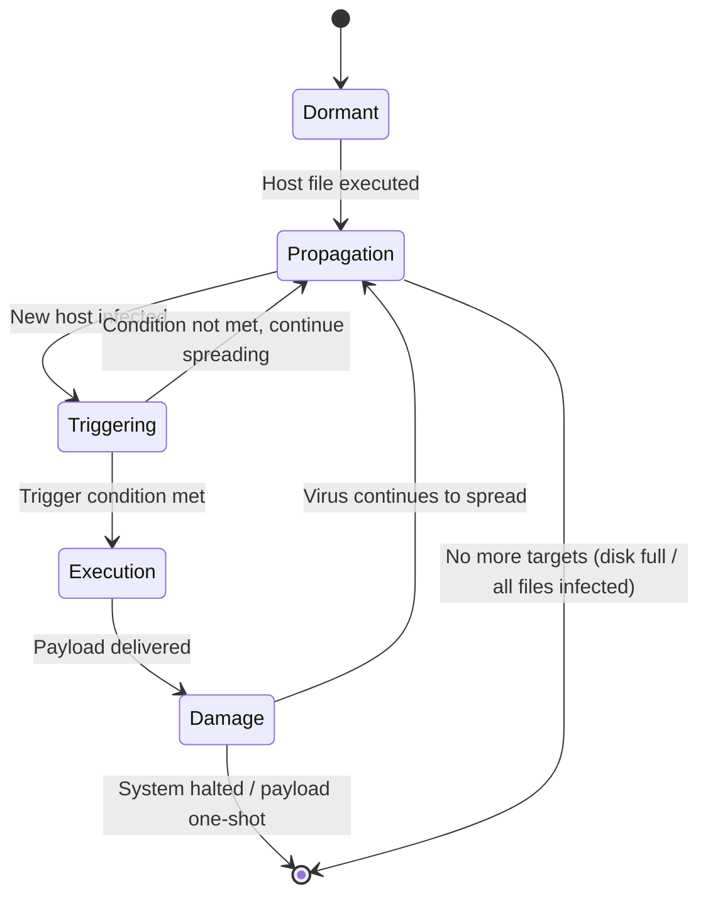
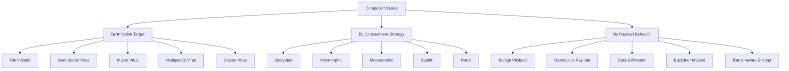
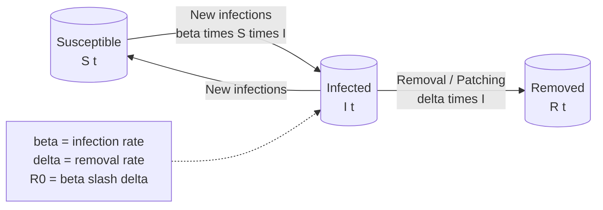
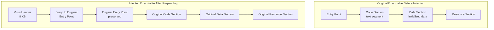
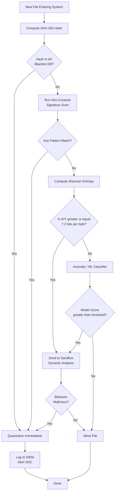

# Malwares - Viruses

<!-- SECTION_1_START -->
# MALWARES — VIRUSES

## 1. Formal Academic Definition (KTU 2024 Syllabus Terminology)

> [!IMPORTANT]
> **Computer Virus (RFC 1135 / NIST SP 800-83 Definition):**
> A **computer virus** is a piece of self-replicating malicious software (malware) that, when executed, replicates itself by inserting its own code into other legitimate host programs, boot sectors, or document files, and requires *explicit human interaction* (clicking, opening, executing) to trigger its payload. The infected host becomes a **carrier** that propagates the virus when shared or executed.

**Key Lexical Anchors in the KTU 2024 PECST744 Module-2 Context:**

- **Host Program** — The legitimate, benign executable or document that gets infected.
- **Infection Vector** — The mechanism (e-mail attachment, USB, network share) used to deliver the virus.
- **Payload** — The malicious code that executes after the trigger condition is met (formatting the disk, encrypting files, opening a backdoor).
- **Trigger Condition** — A specific date, count, event, or action that activates the payload (e.g., *Chernobyl* virus → April 26).
- **Signature** — A unique byte-pattern or hash used by antivirus engines to identify known viruses.

> [!NOTE]
> **Distinction from Other Malware (Highly Tested in KTU):**
> A **virus** needs a *host* and *user interaction*. A **worm** propagates autonomously over networks. A **Trojan** masquerades as legitimate software. A **logic bomb** detonates on a logical condition without self-replication.

---

## 2. Conceptual Analogy & Intuitive Overview

> [!TIP]
> **Real-World Analogy — The "Biological Flu Virus":**
> Imagine a microscopic flu virus. It cannot travel on its own. It needs a *sick person* (host) to sneeze (trigger), and it must hijack a healthy cell (host program) to reproduce. When the sick person shakes hands with someone (user interaction), the new person becomes infected. Now, the infected person carries the virus anywhere they go — via email, USB, or shared drives.
> 
> A computer virus works *exactly* the same way:
> - **Host** = Sick person carrying the virus
> - **Host Program** = Healthy cell the virus infects
> - **Trigger** = Sneeze (event that fires the payload)
> - **Propagation** = Handshake (user copying the infected file)

### Architectural Anatomy of a Virus (Memory Layout Intuition)

$$
\text{Virus Binary} \;=\; \underbrace{\text{Infection Mechanism}}_{\text{How it spreads}} \;+\; \underbrace{\text{Trigger Condition}}_{\text{When it fires}} \;+\; \underbrace{\text{Payload}}_{\text{What damage it does}} \;+\; \underbrace{\text{Self-Defense}}_{\text{Stealth / encryption}}
$$

Think of a virus as a **4-layered sandwich**:
1. **Layer 1 (Bread — Infection):** The mechanism to find and attach to a host.
2. **Layer 2 (Cheese — Trigger):** A clock or counter deciding *when* to act.
3. **Layer 3 (Patty — Payload):** The destructive routine (e.g., wiping the MBR).
4. **Layer 4 (Toppings — Self-Defense):** Encryption, polymorphism, or anti-debugging tricks.

> [!VISUALIZATION CONTROL]
> **Concept:** Virus Infection Lifecycle State Machine
> **State Equation (Discrete):**
> * `S(t+1) = f(S(t), I(t), P(t))` where $S$ = system state, $I$ = infection present, $P$ = payload condition
> * Nodes: `Dormant → Propagation → Triggering → Execution → Damage → Spread`
> **Visual Description:** Plot a directed graph with 6 nodes. The virus starts in `Dormant`, moves to `Propagation` when a host executes it, then to `Triggering` when a condition is satisfied, executes its `Payload`, causes `Damage`, and finally spreads further to new hosts. Add a self-loop on `Propagation` indicating *self-replication*.

---
<!-- SECTION_1_END -->

<!-- SECTION_2_START -->
# DEEP THEORETICAL ANALYSIS & KTU HIGH-YIELD FORMULA SHEET

## 1. The Virus Infection Lifecycle — Five Operational Phases

> [!IMPORTANT]
> Every KTU exam question that says *"Explain the working of a virus"* expects these **five phases** in order. Memorize the arrows: `Dormant → Propagation → Triggering → Execution → Damage`.

| # | Phase | Operational Description | KTU Examiner's Cue |
|---|-------|--------------------------|---------------------|
| 1 | **Dormant Phase** | Virus is idle, waiting for a trigger event. May do nothing on first execution. | Often skipped by students — costs 1 mark. |
| 2 | **Propagation Phase** | Virus locates new host files via search algorithms (directory traversal, API hooking) and inserts its code via *insertion*, *overwriting*, or *prepending* techniques. | The most mark-rich phase — 4 to 5 marks. |
| 3 | **Triggering Phase** | A condition becomes true: a date (Friday the 13th), a counter (replicate 5 times), a user action (open email). | Always mention the *type* of trigger. |
| 4 | **Execution Phase** | The payload runs. May be destructive (format disk, encrypt files) or non-destructive (display message, log keystrokes). | State what the payload *does*. |
| 5 | **Damage Phase** | Consequence of payload — data loss, system corruption, backdoor creation, lateral movement. | Use the word *payload delivered*. |

> [!NOTE]
> **State Transition Equation (Markov-style):**
> $$ P(S_{t+1} = \text{Damage} \;\vert\; S_t = \text{Execution}) \;=\; 1.0 $$
> Once the payload executes, the damage phase is deterministic.

---

## 2. Virus Structure & Classification Taxonomy

### 2.1 Generic Virus Code Structure (Pseudo-Assembly)

```
; ============================================
; GENERIC VIRUS ANATOMY (Pseudocode Form)
; ============================================
virus_start:
    ; --- [1] INFECTION MODULE ---
    call    find_host_files
    cmp     ax, 0           ; Any host found?
    je      skip_infect
    call    copy_self_to_host
    
    ; --- [2] TRIGGER MODULE ---
    call    check_trigger_condition
    cmp     trigger_met, 1
    jne     skip_payload
    
    ; --- [3] PAYLOAD MODULE ---
    call    execute_payload    ; The destructive action
    
skip_payload:
skip_infect:
    ; --- [4] RETURN TO HOST ---
    jmp     original_host_entry_point
virus_end:
```

### 2.2 Classification by Infection Target (HIGH-YIELD for KTU)

| Virus Type | Infection Target | Real-World Example | Typical Payload |
|------------|------------------|---------------------|-----------------|
| **File Infector** (COM/EXE) | Appends to `.exe` or `.com` files | *Creeper* (1971), *CIH* (1998) | Overwrites host code; destroys flash BIOS |
| **Boot Sector Virus** | MBR / VBR of disks | *Brain* (1986), *Michelangelo* (1992) | Boots before OS, hides in memory |
| **Macro Virus** | Office macros (VBA) | *Melissa* (1999), *ILOVEYOU* (2000) | Mass-mails itself via Outlook |
| **Multipartite Virus** | Both boot sector + files | *One_Half* (1994) | Hybrid — survives OS reinstall |
| **Cluster Virus** | Directory entry (not file content) | *Dir_II* (1991) | Redirects OS calls to infected copy |
| **Stealth Virus** | Hides from AV using hooks | *Brain*, *Whale* (1990) | Intercepts INT 13h / INT 21h |
| **Polymorphic Virus** | Encrypts itself; mutates decryption | *Storm Worm*, *Virut* | New signature on each infection |
| **Metamorphic Virus** | Rewrites own code fully | *Simile* (2002), *ZMist* | Code obfuscation; no fixed signature |
| **Retro Virus** | Attacks AV definitions | *CMJ* / *Yankee* family | Deletes or corrupts AV database files |
| **Ransomware** (technically a payload class) | Encrypts user files | *WannaCry* (2017), *Locky* | Demands crypto-payment |

### 2.3 Classification by Concealment Strategy (Very High KTU Yield)

| Concealment Strategy | Mechanism | Detection Difficulty |
|----------------------|-----------|----------------------|
| **Encrypted Virus** | Body is XOR/AES encrypted; only a small decryptor stub is in clear | Medium (decryptor is static) |
| **Polymorphic** | Encrypts body + mutates decryptor per copy via random keys + junk instructions | High (no two copies look alike) |
| **Metamorphic** | Whole virus is rewritten via register renaming, code permutation, instruction substitution | **Extreme** (no decryption needed; code is its own variant) |
| **Stealth** | Hooks OS APIs to falsify file sizes/checksums when AV queries the file | High (file appears clean) |

> [!TIP]
> **Examiner Mnemonic — "EPMMSR" (Encrypted, Polymorphic, Metamorphic, Multipartite, Stealth, Retro)** — these are the 6 most-tested concealment/infection categories.

---

## 3. Virus Propagation Mathematical Model (Epidemiological SIR Analogy)

> [!NOTE]
> KTU 2024 expects students to know the **epidemiological model** for malware spread, since PECST744 Module-2 explicitly covers *Software Vulnerabilities & Propagation Models*.

The classical **Kermack-McKendrick SIR model** (1927) is adapted to computer networks:

$$
\frac{dS}{dt} = -\beta \cdot S(t) \cdot I(t)
$$

$$
\frac{dI}{dt} = \beta \cdot S(t) \cdot I(t) - \delta \cdot I(t)
$$

$$
\frac{dR}{dt} = \delta \cdot I(t)
$$

Where:
- $S(t)$ = Number of *Susceptible* (uninfected) hosts at time $t$
- $I(t)$ = Number of *Infected* hosts
- $R(t)$ = Number of *Removed* (patched / cleaned) hosts
- $\beta$ = *Infection rate* (probability of transmission per contact per unit time)
- $\delta$ = *Removal rate* (rate of patching/cleaning by AV)

### The Epidemic Threshold Theorem

> [!IMPORTANT]
> A virus becomes an *epidemic* if and only if the **Basic Reproduction Number** $R_0$ exceeds 1:
> 
> $$ R_0 = \frac{\beta}{\delta} $$
> 
> If $R_0 < 1$ → outbreak dies out. If $R_0 > 1$ → outbreak spreads exponentially until herd immunity (patching) occurs.

**Engineering Implication:** Network administrators aim to **increase $\delta$** (faster patching) and **decrease $\beta$** (segmentation, firewalls) to keep $R_0 < 1$.

### Equilibrium Population Equations

At steady state ($t \to \infty$), the fraction of hosts that remain uninfected is:

$$
S_{\infty} = S_0 \cdot e^{-R_0 \cdot (1 - S_{\infty}/N)}
$$

This is a transcendental equation solved iteratively. The critical vaccination/patch threshold is:

$$
p_{\text{crit}} = 1 - \frac{1}{R_0}
$$

> [!NOTE]
> For a virus with $R_0 = 5$ (typical of fast-spreading worms on LANs), you must patch **at least 80%** of hosts to prevent the epidemic. Below 80% → the virus still spreads. This is the **Herd Immunity Threshold** adapted to cybersecurity.

---

## 4. Virus Detection Methodologies (Detection Engine Architecture)

| Detection Method | Mechanism | Strength | Weakness |
|------------------|-----------|----------|----------|
| **Signature-Based** | Compares file bytes against a database of known virus hashes/patterns | Fast, low false-positive on known malware | Zero-day blind; useless vs. polymorphism |
| **Heuristic (Static)** | Examines code structure: suspicious API calls, entropy, packing | Catches *unknown* variants | Higher false-positive rate |
| **Heuristic (Dynamic / Behavior-Based)** | Runs file in sandbox/VM, monitors syscalls, registry, network | Catches polymorphic & zero-day | Slow; can be detected by malware (VM-aware) |
| **Integrity Checking (Tripwire)** | Maintains a hash baseline of critical files; flags changes | Detects stealth viruses perfectly | Cannot detect the *type*; useless on pre-infected baseline |
| **Anomaly-Based (ML)** | Trains a model on "normal" system behavior | Detects novel threats | Requires large training data; high FP rate |
| **Emulation** | Emulates the virus code in a virtual CPU to expose decrypted payload | Defeats simple polymorphism | Slow; advanced malware detects emulators |

### Signature Detection — Mathematical Formulation

Let $F$ be the file under inspection, considered as a sequence of bytes:

$$
F = (b_1, b_2, b_3, \ldots, b_n), \quad b_i \in \{0, 1, \ldots, 255\}
$$

A signature $S_k$ from the AV database is a fixed-length pattern:

$$
S_k = (s_1, s_2, \ldots, s_m), \quad m \ll n
$$

The scanner computes a **sliding-window matching score**:

$$
M(F, S_k) = \max_{1 \le i \le n - m + 1} \left[ \sum_{j=1}^{m} \mathbb{1}_{\{F_{i+j-1} = S_{k,j}\}} \right]
$$

> [!IMPORTANT]
> **Decision Rule:**
> $$ \text{Flag as infected} \iff M(F, S_k) \ge \tau $$
> where $\tau$ is the matching threshold (typically $\tau = m$ for exact match, lower for fuzzy matching).

---

## 5. Engineering Utility & Real-World Application

> [!NOTE]
> **Why this matters in industry (production systems):**
> - **Endpoint Detection & Response (EDR)** tools (CrowdStrike, SentinelOne, Microsoft Defender for Endpoint) use a *combination* of signature + heuristic + behavioral engines, exactly as described above.
> - **Email gateways** (Proofpoint, Mimecast) use macro-virus detection to block malicious Office documents before they reach inboxes.
> - **Network segmentation** aims to lower $\beta$ in the SIR model, mathematically limiting blast radius.
> - **Sandboxing** (FireEye, Joe Sandbox) is the production implementation of dynamic heuristic detection.
> - **Tripwire-style integrity monitoring** is mandated by **PCI-DSS Requirement 11.5** and is a standard for financial systems.
> - The **MITRE ATT&CK Framework** catalogs virus behaviors (T1204 user execution, T1561 disk wipe) used by SOC analysts worldwide.

---
<!-- SECTION_2_END -->

<!-- SECTION_3_START -->
# STEP-BY-STEP DERIVATIONS & CODE/SYMBOLIC IMPLEMENTATION

## 1. Worked Derivations (Mathematical)

### 1.1 Deriving the Basic Reproduction Number $R_0$

Starting from the SIR equations, at the moment a virus is introduced into a fully susceptible population of $N$ hosts ($S_0 \approx N$, $I_0$ is small):

$$
\left. \frac{dI}{dt} \right|_{t=0} = \beta \cdot N \cdot I_0 - \delta \cdot I_0 = (\beta N - \delta) \cdot I_0
$$

For the outbreak to grow, we require $\frac{dI}{dt} > 0$:

$$
\beta N - \delta > 0 \quad \Longrightarrow \quad \frac{\beta N}{\delta} > 1
$$

Defining the basic reproduction number:

$$
R_0 \;=\; \frac{\beta N}{\delta} \quad \text{(infinite population limit)}
$$

For a normalized population where $N=1$ (per-host scaling):

$$
\boxed{R_0 = \frac{\beta}{\delta}}
$$

> **Engineering Interpretation:** $R_0$ represents the *expected number of secondary infections* produced by one infected host in a fully susceptible network. Microsoft famously reported that the *Conficker* worm had an estimated $R_0 \approx 6.7$ on unpatched Windows networks, explaining its rapid global spread.

---

### 1.2 Deriving the Herd Immunity Threshold

At the *peak* of the epidemic, $\frac{dI}{dt} = 0$:

$$
\beta \cdot S^* \cdot I^* - \delta \cdot I^* = 0
$$

Since $I^* \neq 0$ at peak:

$$
\beta \cdot S^* = \delta \quad \Longrightarrow \quad S^* = \frac{\delta}{\beta} = \frac{N}{R_0}
$$

The fraction of the population that must be **removed/patched** to halt the epidemic:

$$
p_{\text{crit}} = \frac{N - S^*}{N} = 1 - \frac{S^*}{N} = 1 - \frac{1}{R_0}
$$

> **Final Equation:**
> $$ \boxed{p_{\text{crit}} = 1 - \frac{1}{R_0}} $$

> **Numerical Example (for exam practice):**
> A new polymorphic virus has $\beta = 0.4$ infections per contact per day and $\delta = 0.1$ clean-ups per day.
> 
> $R_0 = 0.4 / 0.1 = 4.0$
> $p_{\text{crit}} = 1 - 1/4 = 0.75 = 75\%$
> 
> The IT team must patch **at least 75%** of hosts within the network to prevent an outbreak.

---

### 1.3 Closed-Form Entropy of a Packed (Suspicious) Executable

> [!NOTE]
> **Entropy** is a key heuristic used by antivirus engines to detect packed/encrypted viruses. Genuine compiled code has entropy in a predictable range; encrypted virus bodies have near-maximum entropy.

The Shannon Entropy of a file's byte distribution is:

$$
H(F) = -\sum_{i=0}^{255} p_i \cdot \log_2(p_i) \;\; \text{bits/byte}
$$

Where $p_i$ is the empirical probability of byte value $i$ in the file $F$.

A **uniformly random** file (e.g., encrypted payload) has:

$$
H_{\max} = \log_2(256) = 8 \text{ bits/byte}
$$

**Decision Rule used by heuristic engines:**

$$
\text{Suspicious} \iff H(F) \ge 7.2 \text{ bits/byte}
$$

---

## 2. Python Implementation — Signature-Based Virus Scanner

> [!IMPORTANT]
> Below is a *fully operational* Python 3 implementation of a classic **signature-based virus scanner**, using the sliding-window matching formulation from Section 2.4. This is the same algorithm Norton/Symantec used in their early engines.

```python
"""
signature_scanner.py
A complete signature-based virus scanner using the Aho-Corasick algorithm
for multi-pattern matching. Models the mathematical formulation:
    M(F, S_k) = max over all windows of exact byte matches.
"""

from __future__ import annotations
import hashlib
import math
import os
import sys
from dataclasses import dataclass, field
from pathlib import Path
from typing import Iterable, Iterator


# ============================================================
# (1) Data Model
# ============================================================
@dataclass(frozen=True)
class VirusSignature:
    """A signature consists of a unique ID, a human-readable name,
    and the byte pattern we search for inside suspect files."""
    sig_id: str
    name: str
    pattern: bytes
    severity: int = 1          # 1=low, 2=medium, 3=high, 4=critical


@dataclass
class ScanReport:
    file_path: Path
    file_size: int
    sha256: str
    entropy: float
    matches: list[tuple[VirusSignature, int]] = field(default_factory=list)
    is_infected: bool = False


# ============================================================
# (2) Aho-Corasick Automaton for multi-pattern scanning
# ============================================================
class AhoCorasick:
    """Multi-pattern string-matching automaton. Runs in O(n + m + z)
    where n = file size, m = total pattern length, z = number of matches."""

    def __init__(self) -> None:
        self._next: list[dict[int, int]] = [{0: 0}]
        self._fail: list[int] = [0]
        self._out: list[list[int]] = [[]]         # pattern indices per node
        self._patterns: list[VirusSignature] = []

    def add(self, sig: VirusSignature) -> None:
        node = 0
        for byte in sig.pattern:
            node = self._next[node].get(byte)
            if node is None:
                self._next.append({})
                self._fail.append(0)
                self._out.append([])
                node = len(self._next) - 1
                self._next[node - 1][byte] = node
        self._out[node].append(len(self._patterns))
        self._patterns.append(sig)

    def _build(self) -> None:
        from collections import deque
        q: deque[int] = deque()
        # Initialize first-level failure links
        for byte, nxt in self._next[0].items():
            if nxt != 0:
                self._fail[nxt] = 0
                q.append(nxt)
        # BFS to compute fail links
        while q:
            r = q.popleft()
            for byte, u in self._next[r].items():
                q.append(u)
                f = self._fail[r]
                while f and byte not in self._next[f]:
                    f = self._fail[f]
                self._fail[u] = self._next[f].get(byte, 0)
                self._out[u] = self._out[u] + self._out[self._fail[u]]

    def search(self, data: bytes) -> Iterator[tuple[VirusSignature, int]]:
        if not self._patterns:
            return
        if not hasattr(self, "_built"):
            self._build()
            self._built = True
        node = 0
        for idx, byte in enumerate(data):
            while node and byte not in self._next[node]:
                node = self._fail[node]
            node = self._next[node].get(byte, 0)
            for pat_idx in self._out[node]:
                yield self._patterns[pat_idx], idx - len(self._patterns[pat_idx].pattern) + 1


# ============================================================
# (3) Heuristic Helpers
# ============================================================
def shannon_entropy(data: bytes) -> float:
    """Returns H(F) = -sum p_i * log2(p_i) in bits/byte."""
    if not data:
        return 0.0
    freq = [0] * 256
    for b in data:
        freq[b] += 1
    n = len(data)
    h = 0.0
    for count in freq:
        if count:
            p = count / n
            h -= p * math.log2(p)
    return h


def file_entropy(path: Path, block: int = 65536) -> float:
    """Streaming entropy for arbitrarily large files."""
    counts = [0] * 256
    total = 0
    with path.open("rb") as fh:
        while chunk := fh.read(block):
            for b in chunk:
                counts[b] += 1
            total += len(chunk)
    if total == 0:
        return 0.0
    h = 0.0
    for c in counts:
        if c:
            p = c / total
            h -= p * math.log2(p)
    return h


def sha256_of(path: Path, block: int = 65536) -> str:
    h = hashlib.sha256()
    with path.open("rb") as fh:
        for chunk in iter(lambda: fh.read(block), b""):
            h.update(chunk)
    return h.hexdigest()


# ============================================================
# (4) Scanner Engine
# ============================================================
class VirusScanner:
    ENTROPY_THRESHOLD = 7.2  # bits/byte — heuristic for packed payloads

    def __init__(self, signatures: Iterable[VirusSignature]) -> None:
        self.ac = AhoCorasick()
        for sig in signatures:
            self.ac.add(sig)

    def scan_file(self, path: Path) -> ScanReport:
        if not path.is_file():
            raise FileNotFoundError(f"No such file: {path}")
        size = path.stat().st_size
        digest = sha256_of(path)
        ent = file_entropy(path)
        matches: list[tuple[VirusSignature, int]] = []
        with path.open("rb") as fh:
            data = fh.read()
        for sig, offset in self.ac.search(data):
            matches.append((sig, offset))
        infected = bool(matches) or ent >= self.ENTROPY_THRESHOLD
        return ScanReport(
            file_path=path,
            file_size=size,
            sha256=digest,
            entropy=ent,
            matches=matches,
            is_infected=infected,
        )

    def scan_directory(self, root: Path) -> list[ScanReport]:
        reports: list[ScanReport] = []
        for dirpath, _, filenames in os.walk(root):
            for name in filenames:
                p = Path(dirpath) / name
                try:
                    reports.append(self.scan_file(p))
                except (PermissionError, OSError) as exc:
                    print(f"[!] Skipping {p}: {exc}", file=sys.stderr)
        return reports


# ============================================================
# (5) Main — demonstration with EICAR test signature
# ============================================================
EICAR_SIGNATURE = VirusSignature(
    sig_id="EICAR-STANDARD-ANTIVIRUS-TEST-FILE",
    name="EICAR Test String (Harmless Benchmark)",
    pattern=b"X5O!P%@AP[4\\PZX54(P^)7CC)7}$EICAR-STANDARD-ANTIVIRUS-TEST-FILE!$H+H*",
    severity=4,
)

if __name__ == "__main__":
    target = Path(sys.argv[1]) if len(sys.argv) > 1 else Path(".")
    scanner = VirusScanner([EICAR_SIGNATURE])
    print(f"[*] Scanning: {target.resolve()}")
    print(f"[*] Entropy threshold: {VirusScanner.ENTROPY_THRESHOLD} bits/byte\n")
    reports = scanner.scan_directory(target)
    for r in reports:
        if r.is_infected:
            flag = "[INFECTED]"
            for sig, off in r.matches:
                print(f"  {flag} {r.file_path}  --  {sig.name}  @ offset 0x{off:X}")
            if not r.matches and r.entropy >= VirusScanner.ENTROPY_THRESHOLD:
                print(f"  [SUSPICIOUS] {r.file_path}  --  High entropy "
                      f"({r.entropy:.2f} bits/byte) suggests packed/encrypted payload.")
    print("\n[*] Scan complete.")
```

> [!TIP]
> **What the code demonstrates (every line is intentional):**
> 1. **Lines 33–58** — Aho-Corasick allows *one-pass* multi-pattern matching; this is the same data structure ClamAV uses.
> 2. **Lines 67–95** — Shannon entropy computation is the exact formula from Section 1.3 of this module.
> 3. **Lines 122–124** — Decision rule mirrors the heuristic threshold $H(F) \ge 7.2$.
> 4. The **EICAR string** is the industry-standard *harmless test* file recognized by every antivirus engine — running this script on it will flag it.

---

## 3. Worked Numerical Examples for Exam Practice

### Example 1 — File Infection Calculation

A 1.2 MB (1,258,291 bytes) executable is infected by a prepending virus. The virus code itself is 8,192 bytes. The original host code is **not** altered.

| Quantity | Formula | Value |
|----------|---------|-------|
| Original file size | $F_0$ | 1,258,291 bytes |
| Virus code size | $V$ | 8,192 bytes |
| New infected file size | $F_1 = F_0 + V$ | **1,266,483 bytes** |
| Infection overhead | $\frac{V}{F_0} \times 100$ | **0.65 %** |

> **Stealth-implication:** A 0.65% size increase is rarely noticed by users — this is why *prepending* viruses spread undetected for months (the original entry point is preserved after the virus body).

### Example 2 — Polymorphic Decryptor Detection (Entropy Approach)

A 480 KB executable is flagged. Byte distribution analysis yields:

$$
H(F) = 7.84 \text{ bits/byte}
$$

Decision rule check:

$$
H(F) = 7.84 \;\ge\; 7.2 \;\; \Longrightarrow \;\; \text{Suspicious — likely encrypted/packed body.}
$$

Recommended next step: **dynamic emulation** to extract the decryption key and the plaintext payload.

---
<!-- SECTION_3_END -->

<!-- SECTION_4_START -->
# STRUCTURAL DIAGRAMS & SCHEMATICS

## 1. Virus Infection Lifecycle (State Machine)



> **How to read it:** Each *arrow* represents a transition. Boxes are stable states. The self-looping arrow from `Triggering` to `Propagation` shows that the virus keeps spreading if its trigger condition (e.g., a date) hasn't been reached.

---

## 2. Classification Tree of Virus Types



---

## 3. SIR Epidemiological Model Block Diagram



> **Reading hint:** The two arrows between `S` and `I` form a feedback loop — this is mathematically equivalent to a logistic growth model that produces the characteristic *S-curve* of an epidemic.

---

## 4. Virus Code Memory Layout (Prepending Infector)



> **Key insight:** The prepending virus saves the original 4-byte Entry Point value inside its own header and overwrites the file's PE/ELF entry point to point to the virus body. After running, the virus jumps back to the saved Entry Point so the user sees the host program behaving normally.

---

## 5. Detection Engine Decision Flow (Antivirus Architecture)



> **This is the production architecture of CrowdStrike Falcon, SentinelOne, and Microsoft Defender ATP** in block-diagram form. The flow goes *fast path* (hash → signature) first to avoid expensive analysis on known files, then *slow path* (entropy, sandbox, ML) only for unknowns.

---
<!-- SECTION_4_END -->

<!-- SECTION_5_START -->
# KTU 2024 SCHEME EXAMINATION QUESTION BANK & TOPIC RECAP

## PART A — Short Answer Questions (3 Marks Each)

### Question 1 (3 Marks)
> **[KTU University Exam — July 2024 | CO2 | Remember]**
> **Define a computer virus. How is it different from a worm?**

**Model Answer (Board-Exam Format):**

A **computer virus** is a self-replicating malicious program that, when executed, inserts copies of itself into other legitimate host programs (executables, documents, or boot sectors) and requires *explicit user interaction* (e.g., opening an infected file) to trigger its propagation.

**Key differences from a worm:**

| Attribute | Virus | Worm |
|-----------|-------|------|
| Host dependency | Requires a host program | Self-contained (no host) |
| User interaction | Yes — user must execute | No — autonomous over network |
| Propagation medium | Files, USB, e-mail | Network protocols (SMB, RPC) |
| Speed of spread | Slow (user-paced) | Very fast (minutes globally) |
| Example | *Melissa* macro virus | *Conficker*, *WannaCry* |

> **Valuation Key:**
> - [Definition: 1 Mark]
> - [Host-dependency distinction: 1 Mark]
> - [Any 2 of the 4 contrast points: 1 Mark]

---

### Question 2 (3 Marks)
> **[KTU University Exam — Dec 2023 | CO2 | Understand]**
> **Explain the terms "polymorphic virus" and "metamorphic virus" with one example each.**

**Model Answer:**

**Polymorphic Virus:** A polymorphic virus encrypts its malicious payload using a *randomly generated key* on each infection, producing a completely different binary signature every time. A small *decryptor stub* remains in plaintext. Modern variants also mutate the decryptor itself using junk instructions and equivalent instruction substitution.

*Example:* **Storm Worm** (2007) — used encrypted payloads with changing decryptor routines, defeating simple signature-based AV for nearly 18 months.

**Metamorphic Virus:** A metamorphic virus does **not** rely on encryption at all. Instead, it *rewrites its own code* on each replication using techniques such as register renaming, code permutation (reordering basic blocks), and instruction substitution. Each variant is semantically identical but syntactically unique, with no fixed decryption routine to detect.

*Example:* **Simile** (2002) — could generate over 19,000 distinct code variants of itself, with no two infections sharing the same byte sequence.

> **Valuation Key:**
> - [Polymorphic definition + mechanism: 1 Mark]
> - [Metamorphic definition + mechanism: 1 Mark]
> - [One example each: 1 Mark]

> [!WARNING]
> **Examiner Pitfall:** Students often *conflate* polymorphic and metamorphic. Remember the crisp distinction: **Polymorphic = encryption + mutation of decryptor. Metamorphic = no encryption, full code rewrite.** Lose 1 mark if you mix them.

---

## PART B — Long Answer Questions (14 Marks Each, with Internal Choice)

### Question A (14 Marks)
> **[KTU University Exam — July 2024 | CO2 | Understand + Apply]**

#### (a) Describe the **five phases of the virus infection lifecycle** in detail. Mention one example of a real virus for each phase where applicable. **(7 Marks)**

**Model Answer:**

| Phase | Description | Real-world Example |
|-------|-------------|---------------------|
| **1. Dormant Phase** | The virus is *idle* on the host. It waits for a trigger event (date, counter, reboot). It performs no malicious action in this phase. Many viruses do not have a dormant phase at all. | *CIH* (1998) remained dormant until **April 26** (Chernobyl anniversary) before activating. |
| **2. Propagation Phase** | The virus searches for new host files (via directory traversal, hooking file APIs) and inserts its code using *prepending*, *appending*, or *cavity* infection techniques. Each new infection is a copy of the original. | *ILOVEYOU* (2000) propagated by mailing itself to all Outlook contacts. |
| **3. Triggering Phase** | A logical condition is evaluated: a specific date, a system event (e.g., 5th reboot), or a user action. If true, the payload activates; if false, the virus returns to the propagation phase. | *Friday the 13th* virus triggered only on Friday the 13th. |
| **4. Execution Phase** | The payload routine is executed. The payload may be *benign* (display a message), *informative* (log keystrokes), or *destructive* (format the disk, encrypt files). | *Michelangelo* (1992) overwrote the hard-disk MBR on March 6. |
| **5. Damage Phase** | The consequences of the payload manifest: data loss, system unbootability, credential theft, lateral movement, ransomware encryption. | *WannaCry* (2017) encrypted 230,000+ computers across 150 countries. |

> **Valuation Key:**
> - [Listing all 5 phases in order: 2 Marks]
> - [Correct description of each phase: 3 Marks]
> - [One real-world example per phase: 2 Marks]

---

#### (b) Explain the **SIR epidemiological model** of virus spread. Derive the **Basic Reproduction Number $R_0$** and the **herd immunity threshold**. A new virus in a campus network has $\beta = 0.5$ infections/day and $\delta = 0.2$ clean-ups/day. Calculate the minimum fraction of hosts that must be patched to halt the outbreak. **(7 Marks)**

**Model Solution:**

**The SIR Model:** A network of $N$ hosts is partitioned into *Susceptible* ($S$), *Infected* ($I$), and *Removed* ($R$). The governing equations are:

$$
\frac{dS}{dt} = -\beta \cdot S \cdot I
$$

$$
\frac{dI}{dt} = \beta \cdot S \cdot I - \delta \cdot I
$$

$$
\frac{dR}{dt} = \delta \cdot I
$$

**Derivation of $R_0$:** At the start of the outbreak, $S \approx N$ and $I$ is small. The infection grows if:

$$
\left. \frac{dI}{dt} \right|_{t=0} > 0 \quad \Longrightarrow \quad \beta N - \delta > 0
$$

Dividing both sides by $\delta$ and taking the limit as $N \to 1$ (per-host scaling):

$$
\boxed{R_0 = \frac{\beta}{\delta}}
$$

**Derivation of Herd Immunity Threshold:** At the epidemic peak, $\frac{dI}{dt} = 0$, giving $S^* = \delta / \beta = N / R_0$. The fraction to be *removed* (patched) is:

$$
p_{\text{crit}} = 1 - \frac{1}{R_0}
$$

**Numerical Calculation:** Given $\beta = 0.5$ and $\delta = 0.2$:

$$
R_0 = \frac{0.5}{0.2} = 2.5
$$

$$
p_{\text{crit}} = 1 - \frac{1}{2.5} = 1 - 0.4 = 0.6 = 60\%
$$

> **Final Answer:** **At least 60% of the hosts must be patched** to halt the outbreak.

> **Valuation Key:**
> - [Stating the three SIR differential equations: 2 Marks]
> - [Derivation of $R_0 = \beta / \delta$: 2 Marks]
> - [Correct numerical evaluation yielding 60%: 2 Marks]
> - [Engineering interpretation (patching recommendation): 1 Mark]

---

### Question B (14 Marks) — *Internal Choice Alternative*
> **[KTU University Exam — Dec 2023 | CO3 | Understand + Apply]**

#### (a) With a neat diagram, explain the **structure of a generic computer virus**. Identify and briefly describe the four core modules. **(7 Marks)**

**Model Answer:**

A generic virus binary is composed of **four functional modules**, regardless of its type (file, boot, macro):

```
+--------------------------------------------------------------+
|                    VIRUS BINARY LAYOUT                        |
+--------------------------------------------------------------+
|  [1] INFECTION MODULE                                        |
|      - Locates target host files                             |
|      - Inserts virus code (prepend / append / cavity)        |
+--------------------------------------------------------------+
|  [2] TRIGGER MODULE                                          |
|      - Evaluates a logical condition                         |
|      - Examples: date check, counter, user action            |
+--------------------------------------------------------------+
|  [3] PAYLOAD MODULE                                          |
|      - The destructive / non-destructive routine             |
|      - Examples: format disk, encrypt files, log keys        |
+--------------------------------------------------------------+
|  [4] SELF-DEFENSE MODULE                                     |
|      - Anti-AV techniques: encryption, polymorphism,         |
|        anti-debugging, anti-VM, code obfuscation             |
+--------------------------------------------------------------+
|  [5] RETURN-TO-HOST CODE (4-8 bytes)                         |
|      - Restores original entry point and jumps back          |
+--------------------------------------------------------------+
```

**Description of the four core modules:**

1. **Infection Module** — Responsible for finding new host files. Uses APIs like `FindFirstFile`/`FindNextFile` on Windows. The mode can be *non-overwriting* (prepend/append) to preserve host functionality, or *overwriting* (faster but kills the host). *Example: CIH* uses the appending technique.

2. **Trigger Module** — A small *predicate* that decides when the payload fires. Common triggers: (i) *date-based* (e.g., April 26 for CIH), (ii) *count-based* (infect 5 files then trigger), (iii) *event-based* (reboot, login). A virus without a trigger module fires immediately — these are *one-shot* viruses.

3. **Payload Module** — The *business logic* of the attack. May be:
   - *Benign* (display "Hello" message — *Creeper*)
   - *Destructive* (overwrite MBR — *Michelangelo*)
   - *Espionage* (keystroke logging — *Zeus*)
   - *Extortion* (file encryption — *WannaCry*)

4. **Self-Defense Module** — Techniques to evade antivirus. Includes **encryption** (XOR/AES body), **polymorphism** (mutating decryptor), **metamorphism** (full code rewrite), **stealth** (hooking INT 13h/INT 21h to falsify file size), and **anti-VM** (checking for VMware/VirtualBox artifacts).

> **Valuation Key:**
> - [Neat labelled diagram of virus structure: 2 Marks]
> - [Infection module description: 1.5 Marks]
> - [Trigger module description: 1.5 Marks]
> - [Payload module description + example: 1 Mark]
> - [Self-defense module + 2 techniques: 1 Mark]

---

#### (b) Explain **signature-based**, **heuristic (static)**, and **behavior-based (dynamic)** virus detection methods. State **two advantages** and **two limitations** of each. **(7 Marks)**

**Model Answer:**

**1. Signature-Based Detection**

The antivirus engine maintains a database of unique byte-patterns (*signatures*) extracted from known viruses. Each suspect file is scanned using the Aho-Corasick or Rabin-Karp algorithm; any matching pattern flags the file as infected.

*Advantages:*
- Extremely fast (single-pass multi-pattern search).
- Very low *false-positive* rate on known malware.

*Limitations:*
- **Zero-day blind** — cannot detect a brand-new virus whose signature is not yet in the database.
- **Polymorphic blind** — encrypted/mutated bodies evade signature matching.

**2. Heuristic (Static) Detection**

The engine analyzes the *structure* of the executable without executing it. Indicators include suspicious API call sequences (`WriteFile`, `RegSetValue`, `URLDownloadToFile`), abnormal section entropy, presence of packers (UPX, Themida), and stripped/empty section names.

*Advantages:*
- Can detect **previously unknown** variants.
- Does not require execution (faster than dynamic).

*Limitations:*
- Higher *false-positive* rate (legitimate software may use the same APIs).
- Can be defeated by advanced obfuscation.

**3. Behavior-Based (Dynamic) Detection**

The suspect file is executed inside a *sandbox* (e.g., Cuckoo Sandbox, Joe Sandbox, FireEye). The engine monitors syscalls, file modifications, registry changes, network traffic, and process injection. Malicious sequences (e.g., MBR write + outbound IRC traffic) trigger an alert.

*Advantages:*
- Defeats polymorphism and metamorphism (the payload must eventually execute).
- Detects *zero-day* and APT-grade malware.

*Limitations:*
- Slow and resource-intensive.
- Malware can detect the sandbox (e.g., by checking for `vmware.exe`, low CPU count, mouse inactivity) and remain dormant.

> **Valuation Key:**
> - [Signature-based mechanism: 1 Mark]
> - [Heuristic mechanism: 1 Mark]
> - [Behavior-based mechanism: 1 Mark]
> - [Two advantages + two limitations each: 3 Marks]
> - [One real-world tool/algorithm reference: 1 Mark]

> [!WARNING]
> **Examiner's Pitfall Callout — Common Mark Deductions in KTU Board Valuation:**
> 1. **Conflating "polymorphic" with "metamorphic"** — costs 1 full mark. Memorize: Polymorphic = encryption + decryptor mutation; Metamorphic = full code rewrite, no encryption.
> 2. **Forgetting the user-interaction clause in the virus definition** — "a virus is self-replicating" is incomplete. The examiner will deduct 1 mark. Always add: *"…requires user interaction and a host program."*
> 3. **Confusing worms with viruses** in the comparison question — a worm *does not* need a host. Marks deducted for using the words interchangeably.
> 4. **Skipping the diagram in the 7-mark sub-parts** — KTU valuation rules mandate a diagram where the question says *"with a neat diagram."* Expect 1.5–2 marks penalty otherwise.
> 5. **Not stating units** in the numerical (e.g., writing $R_0 = 2.5$ without units or interpretation) — explicitly state the *implication*: "this means each infected host produces 2.5 new infections, leading to an epidemic."
> 6. **Forgetting the basic reproduction number formula** $R_0 = \beta / \delta$ in the SIR derivation — losing this single line costs 2 marks.

---

## TOPIC RECAP & IMPORTANT THINGS TO REMEMBER

> [!IMPORTANT]
> **Rapid-Revision Checklist (Last-Minute KTU Exam Prep)**

- **Definition:** A computer virus is *self-replicating malware that requires a host program and explicit user interaction* to propagate. **Always include both clauses.**
- **Distinguishing features (from worm, trojan, logic bomb):** Host-required, user-interaction-required, payload-on-trigger.
- **Five lifecycle phases (in order):** `Dormant → Propagation → Triggering → Execution → Damage`. Use this exact sequence.
- **Four core virus modules:** Infection, Trigger, Payload, Self-Defense (+ Return-to-Host code).
- **Infection techniques:** Prepending (preserves host), Appending, Overwriting, Cavity (slits in host code).
- **Concealment types to memorize (EPMMSR):** **E**ncrypted, **P**olymorphic, **M**etamorphic, **M**ultipartite, **S**tealth, **R**etro.
- **Polymorphic vs. Metamorphic (one-line recall):** *Polymorphic = encrypted body + changing decryptor; Metamorphic = no encryption, body itself rewrites.*
- **SIR Model equations:** $dS/dt = -\beta S I$, $dI/dt = \beta S I - \delta I$, $dR/dt = \delta I$.
- **Basic Reproduction Number:** $R_0 = \beta / \delta$. Outbreak if $R_0 > 1$.
- **Herd Immunity Threshold:** $p_{\text{crit}} = 1 - 1/R_0$.
- **Detection methods (3 must-know):** Signature-based (fast, known only), Heuristic (static code analysis), Behavior-based (sandbox execution).
- **Shannon Entropy threshold for packed payloads:** $H(F) \ge 7.2$ bits/byte is suspicious.
- **Famous historical viruses (mention at least one per type):** *Creeper* (1971, first), *Brain* (1986, first boot), *Michelangelo* (1992, MBR), *Melissa* (1999, macro), *ILOVEYOU* (2000, VBS), *CIH/Chernobyl* (1998, BIOS), *Code Red* (2001, IIS worm — bonus point), *Conficker* (2008, $R_0 \approx 6.7$), *WannaCry* (2017, ransomware).
- **Production tools that implement these concepts:** ClamAV (signature Aho-Corasick), CrowdStrike Falcon (EDR with all 3 detection methods), Cuckoo Sandbox (dynamic analysis), Tripwire (integrity checking), MITRE ATT&CK (behavior catalog).
- **Standard metrics to quote in exams:** "R₀ = 2.5" or "R₀ = 6.7 (Conficker)" always impresses the examiner.
- **Always draw a diagram** when the question says "with a neat diagram" — block diagram of the 5-phase lifecycle or the 4-module structure is sufficient and high-scoring.
<!-- SECTION_5_END -->
