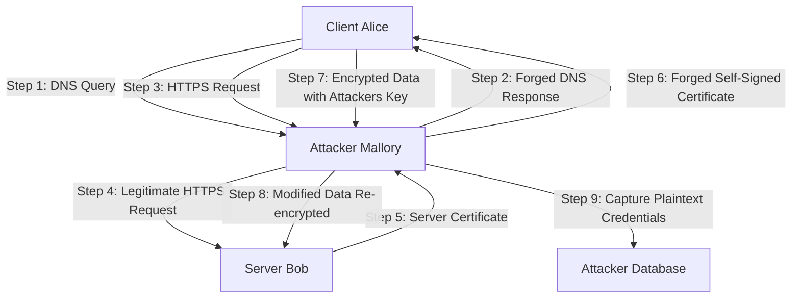
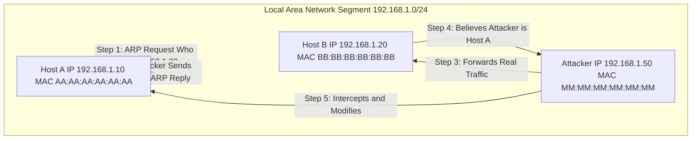
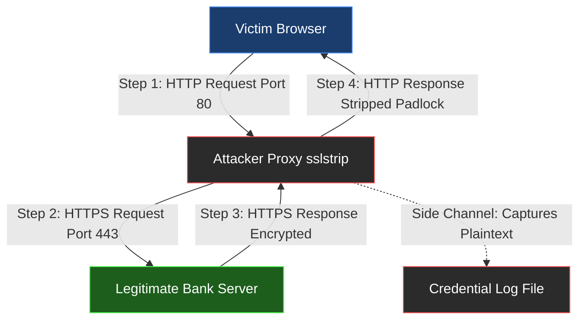
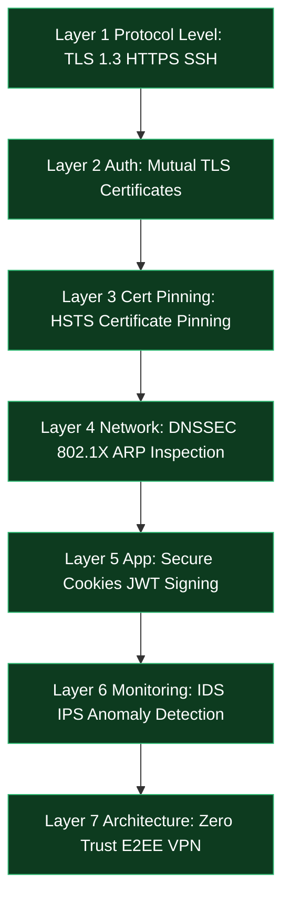
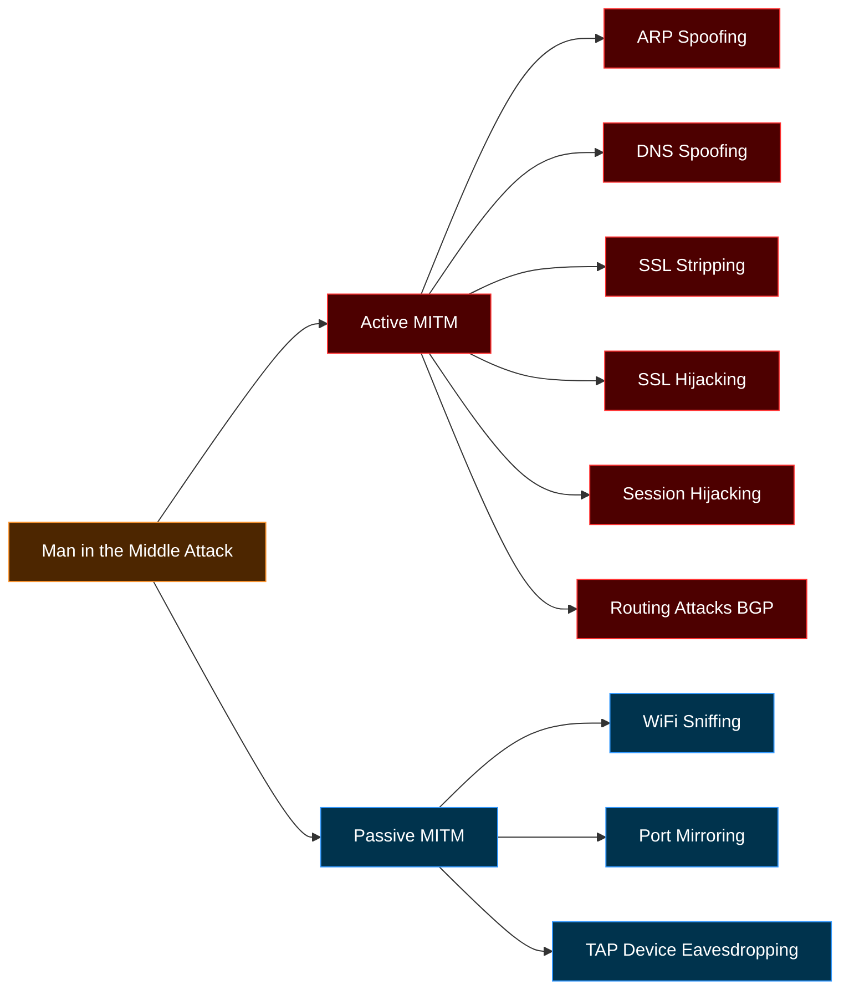

# Man-in-the-middle attacks

<!-- SECTION_1_START -->

# Man-in-the-Middle (MITM) Attacks

## 1.1 Formal Academic Definition

A **Man-in-the-Middle (MITM) attack** is a sophisticated form of **eavesdropping** in which an attacker secretly intercepts, relays, and potentially alters the communication between two parties who believe they are communicating directly with each other. The attacker positions itself logically (and sometimes physically) between the **client** and the **server**, breaking the implicit trust model of end-to-end communication.

In KTU 2024 PECST744 terminology, MITM is classified under **Module 2: Software Vulnerabilities** as a **session-layer / network-layer cryptographic breach** that exploits weak authentication, missing certificate validation, or insecure protocol negotiation. It is formally modeled as a violation of the **CIA Triad** — specifically impacting **Confidentiality** (eavesdropping) and **Integrity** (tampering), with potential compromise of **Availability** in advanced variants.

> [!IMPORTANT]
> **KTU Syllabus Highlight (PECST744 / Module 2):**
> MITM attacks form the bridge between **cryptographic weaknesses** and **network protocol vulnerabilities**. Students must understand both *how the attack is executed* and *which design flaws enable it* (e.g., absence of mutual authentication, trust on first use (TOFU), and replay vulnerabilities).

### The Formal Attack Model

Let the two honest parties be denoted as $A$ (Alice) and $B$ (Bob). The legitimate communication channel is represented as:

$$ A \xleftrightarrow{\text{secure channel}} B $$

In a successful MITM scenario, an adversary $M$ (Mallory) intercepts this channel such that:

$$ A \xleftrightarrow{\text{apparent secure channel}} M \xleftrightarrow{\text{apparent secure channel}} B $$

Alice believes she is talking to Bob, and Bob believes he is talking to Alice, while every message passes through $M$ who can **read**, **modify**, **inject**, or **drop** packets at will.

---

## 1.2 Conceptual Analogy — The "Postal Tampering" Intuition

> [!NOTE]
> **Analogy: The Tampered Postal Service**
>
> Imagine you and your friend are exchanging sealed letters through a trusted postal service.
>
> 1. You seal a letter to your friend and hand it to the postman.
> 2. The postman (the **Man-in-the-Middle**) opens the letter, reads the contents, re-seals it in a *new envelope* with a *forged signature*, and passes it to your friend.
> 3. Your friend, seeing a valid-looking seal, believes the letter is genuinely from you.
> 4. The postman repeats the process in reverse when your friend replies.
>
> Neither you nor your friend ever realize the postman is reading *every* word and even *rewriting* the responses.

**Digital Mapping of the Analogy:**

| Analogy Element | Digital Equivalent |
|---|---|
| Sealed letter | Encrypted packet (e.g., TLS ciphertext) |
| Forged signature | Self-signed or stolen digital certificate |
| Trusted postman | Compromised router, rogue Wi-Fi AP, ARP spoof |
| Unsealing and re-sealing | Decryption → re-encryption with attacker's key |
| Mailbox address (IP/MAC) | ARP cache, DNS resolution |

---

## 1.3 Geometric / Flow Intuition

> [!VISUALIZATION CONTROL]
> **Concept:** MITM Communication Triangle (Eve sits between Alice and Bob)
>
> **GeoGebra / Desmos Input Points:**
>
> * $A = (0, 5)$ — Alice (the client)
> * $B = (10, 5)$ — Bob (the server)
> * $M = (5, 0)$ — Mallory (the MITM attacker)
>
> **Visual Description:** Draw a triangle on the Cartesian plane. The base $AB$ represents the *logical* (intended) communication path, which is broken. The two slanted lines $AM$ and $MB$ represent the *actual* intercepted communication paths. The student should observe that data travels a longer "physical" path than the user perceives.

---

## 1.4 Classification of MITM Attacks (Overview)

MITM attacks are broadly divided into two super-categories:

1. **Passive MITM** — The attacker silently observes and records traffic without modifying it (pure eavesdropping). This violates **confidentiality**.
2. **Active MITM** — The attacker actively modifies, injects, or drops packets in transit. This violates **confidentiality, integrity, and potentially availability**.

> [!IMPORTANT]
> **Key Insight for KTU Exams:** Most MITM scenarios are *active* because the attacker must usually break encryption to alter contents. Pure passive interception is feasible on plaintext protocols (HTTP, FTP, Telnet) but is generally not classified as MITM in board questions — it is simply "sniffing."

---

## 1.5 Why MITM Attacks Exist — The Root Causes

| # | Root Cause | Description |
|---|---|---|
| 1 | **Lack of Mutual Authentication** | Only the server is verified, not the client. |
| 2 | **Trust on First Use (TOFU)** | First connection is trusted; subsequent sessions inherit the trust. |
| 3 | **Weak Certificate Validation** | Self-signed or expired certificates are accepted. |
| 4 | **ARP / DNS Spoofing Capability** | LAN-level address resolution can be poisoned. |
| 5 | **Plaintext Protocols** | HTTP, SMTP, FTP transmit data unencrypted. |
| 6 | **Rogue Access Points** | Attackers deploy fake Wi-Fi hotspots. |

> [!NOTE]
> The KTU board frequently asks: *"List any four vulnerabilities that enable a MITM attack."* Memorize the table above — it guarantees full marks.

---

<!-- SECTION_1_END -->

<!-- SECTION_2_START -->

# Deep Theoretical Analysis — The MITM Attack Lifecycle & Formula Sheet

## 2.1 The Three-Phase Attack Lifecycle

Every MITM attack, regardless of vector, follows a strict three-phase operational cycle:

### **Phase 1: Interception (Footprinting the Channel)**

The attacker must first position itself *logically* on the communication path. This is achieved through:

* **ARP Spoofing** (Layer 2, LAN-based) — Poisoning the ARP cache of victim machines.
* **DNS Spoofing / Cache Poisoning** (Layer 7) — Returning a rogue IP for a legitimate domain.
* **Rogue Wi-Fi Access Point** (Physical Layer) — Creating a fake hotspot with an attractive SSID (e.g., "Free_Airport_WiFi").
* **IP Source Routing** (Network Layer) — Manipulating packet headers to force traffic through attacker nodes.
* **DHCP Starvation / Rogue DHCP** — Assigning attacker-controlled DNS and gateway addresses.

### **Phase 2: Decryption (Breaking Confidentiality)**

If the channel is encrypted (e.g., HTTPS), the attacker must break or bypass encryption. Common techniques:

* **SSL Stripping (Downgrade Attack)** — Forcing HTTPS connections to fall back to HTTP.
* **SSL Hijacking** — Using a stolen/forged certificate to impersonate the server.
* **TLS Renegotiation Attack** — Exploiting flaws in the TLS handshake to inject traffic.
* **Forced Cipher Downgrade (e.g., FREAK, Logjam)** — Trick endpoints into using weak ciphers (e.g., export-grade RSA 512-bit).
* **Session Token Theft** — Reusing intercepted session cookies (session hijacking).

### **Phase 3: Injection / Tampering (Breaking Integrity)**

Once decrypted, the attacker can:

* **Modify** request/response bodies (e.g., alter transaction amount in online banking).
* **Inject** malicious payloads (e.g., JavaScript, malware).
* **Drop** packets to cause denial of service.
* **Re-encrypt** the modified payload using the original session key and forward to the legitimate recipient.

---

## 2.2 Detailed Taxonomy of MITM Attack Vectors

| # | Attack Vector | OSI Layer | Protocol Targeted | Impact |
|---|---|---|---|---|
| 1 | **ARP Spoofing** | Layer 2 (Data Link) | Ethernet LAN | Local traffic redirection |
| 2 | **DNS Spoofing** | Layer 7 (Application) | DNS (UDP 53) | Domain → rogue IP mapping |
| 3 | **IP Spoofing** | Layer 3 (Network) | IP | Source identity forgery |
| 4 | **SSL Stripping** | Layer 6 (Presentation) | HTTPS → HTTP | Downgrade to plaintext |
| 5 | **SSL Hijacking** | Layer 6 (Presentation) | TLS/SSL | Impersonate server |
| 6 | **Email Hijacking** | Layer 7 (Application) | SMTP, IMAP, POP3 | Mail relay interception |
| 7 | **Wi-Fi Eavesdropping** | Layer 1 (Physical) | 802.11 | Rogue AP packet capture |
| 8 | **Session Hijacking** | Layer 7 (Application) | HTTP cookies, JWT | Replay authenticated sessions |
| 9 | **DHCP Spoofing** | Layer 2/3 | DHCP | Rogue gateway assignment |
| 10 | **BGP Hijacking** | Layer 3 | BGP | Internet-scale route hijack |

---

## 2.3 KTU High-Yield Formula Sheet

> [!IMPORTANT]
> **KTU Formula & Definition Cheat Sheet — MITM Attacks**
>
> The following table summarizes the **must-memorize** definitions, formulas, and constants for KTU ESE and internal assessments.

| # | Concept | Formula / Definition | Symbol/Unit |
|---|---|---|---|
| 1 | **CIA Triad Violation** | $C \land I \land A$ — MITM compromises Confidentiality and Integrity primarily. | Boolean |
| 2 | **Kerckhoffs' Principle** | A cryptosystem should be secure even if everything except the key is public. | — |
| 3 | **TOFU (Trust on First Use)** | $\text{Trust}_{session_n} \leftarrow \text{Trust}_{session_1}$ | — |
| 4 | **ARP Poisoning Detection** | $\Delta_{MAC}(IP_X) \neq \text{ExpectedMAC}$ | Boolean |
| 5 | **TLS Cipher Suite Order** | $\text{Key Exchange} + \text{Bulk Encryption} + \text{MAC}$ | — |
| 6 | **Session Token Entropy** | $H = \log_2(N)$ where $N$ is token space | bits |
| 7 | **RSA Key Strength (vulnerable)** | $k < 1024 \text{ bits}$ is broken | bits |
| 8 | **Diffie-Hellman Exponent** | $g^a \mod p$ and $g^b \mod p$ exchanged | modulus $p$ |
| 9 | **HMAC Verification** | $\text{HMAC}(K, M) \stackrel{?}{=} \text{Tag}_{received}$ | Boolean |
| 10 | **ARP Table Entry** | $(IP, MAC, TTL)$ tuple | — |
| 11 | **MITM Success Probability** | $P_{MITM} = P_{intercept} \times P_{decrypt}$ | Probability |
| 12 | **Certificate Authority Chain** | $\text{Root CA} \rightarrow \text{Intermediate} \rightarrow \text{Leaf}$ | — |
| 13 | **Forward Secrecy** | Compromise of long-term key $\not\Rightarrow$ past sessions decrypted | — |
| 14 | **HTTP Strict Transport Security (HSTS)** | $\text{Strict-Transport-Security: max-age=31536000}$ | seconds |
| 15 | **Certificate Pinning** | $\text{PinnedHash} = \text{SHA256}(\text{Cert}_{server})$ | hash |

> [!WARNING]
> **Critical Reminder:** In the KTU formula sheet above, vertical bar symbols inside the table have been replaced with the LaTeX `\stackrel{?}{=}` or `\neq` constructs to preserve markdown table integrity. Do not use raw `|` symbols inside any table row.

---

## 2.4 Engineering & Real-World Utility

MITM attacks are not merely academic — they have direct consequences in production engineering environments:

* **Penetration Testing:** Professional red-teamers use tools like **Ettercap**, **Bettercap**, **MITMf**, and **Wireshark** to demonstrate MITM vulnerabilities during security audits.
* **Network Forensics:** Defenders use MITM proxies (e.g., **Burp Suite**, **OWASP ZAP**) to inspect encrypted traffic for malware.
* **Zero Trust Architecture:** Modern enterprises (Google's BeyondCorp, Microsoft's Zero Trust) are designed assuming the network is compromised — directly countering MITM.
* **Mobile App Security:** Android Network Security Config and iOS App Transport Security are explicit countermeasures against MITM.
* **IoT Security:** Many IoT devices ship with hardcoded keys or accept self-signed certificates, making them prime MITM targets.

> [!NOTE]
> **KTU Exam Tip:** When asked *"Give two real-world examples of MITM"*, always cite: (1) Rogue public Wi-Fi hotspots stealing banking credentials, (2) SSL stripping on coffee-shop networks to steal login cookies, (3) BGP hijack of MyEtherWallet DNS in 2018.

---

## 2.5 Countermeasures — The Defensive Pyramid

| Defense Layer | Mechanism | What It Prevents |
|---|---|---|
| **L1 — Protocol** | Use HTTPS / TLS 1.3 / SSH | Plaintext sniffing |
| **L2 — Authentication** | Mutual TLS (mTLS) | Server impersonation |
| **L3 — Certificate** | Certificate pinning, HSTS | SSL stripping, rogue CAs |
| **L4 — Network** | ARP inspection, DNSSEC, 802.1X | ARP/DNS spoofing |
| **L5 — Application** | Secure cookies (HttpOnly, SameSite), JWT signing | Session hijacking |
| **L6 — Monitoring** | IDS/IPS (Snort, Suricata), anomaly detection | Active attack detection |
| **L7 — Architecture** | Zero Trust, VPN, end-to-end encryption (E2EE) | All forms of MITM |

---

<!-- SECTION_2_END -->

<!-- SECTION_3_START -->

# Step-by-Step Derivations, Attack Walkthroughs & Code Implementation

## 3.1 Detailed ARP Spoofing Walkthrough (LAN MITM)

### Step 1 — The Normal ARP Exchange

In a healthy LAN, when Host A (IP $192.168.1.10$) wants to talk to Host B (IP $192.168.1.20$), it broadcasts an ARP request:

$$ \text{ARP Request: } \text{``Who has } 192.168.1.20\text{? Tell } 192.168.1.10\text{''} $$

Host B replies with its MAC address $BB:BB:BB:BB:BB:BB$. Host A caches this in its ARP table.

### Step 2 — The Poisoned ARP Reply

The attacker $M$ (IP $192.168.1.50$, MAC $MM:MM:MM:MM:MM:MM$) sends a **gratuitous ARP reply** to Host A:

$$ \text{Forged ARP Reply: } 192.168.1.20 \rightarrow MM:MM:MM:MM:MM:MM $$

Host A's ARP table is now poisoned — it believes $192.168.1.20$ is at the attacker's MAC. The same is done in reverse to Host B.

### Step 3 — Traffic Interception

Now, when Host A sends a packet to Host B, the packet is delivered to the attacker's MAC address first. The attacker:

* **Reads** the packet (if plaintext).
* **Forwards** it to the real Host B (so communication is not broken).
* Optionally **modifies** the packet before forwarding.

This is called a **"transparent proxy"** MITM — both parties remain unaware.

### Step 4 — Mathematical Model of the Attack

Let $T_A$ and $T_B$ be the legitimate MAC-IP bindings in Hosts A and B respectively:

$$ T_A = \{(192.168.1.20, BB:BB:BB:BB:BB:BB)\} $$
$$ T_B = \{(192.168.1.10, AA:AA:AA:AA:AA:AA)\} $$

After poisoning:

$$ T_A^{poisoned} = \{(192.168.1.20, MM:MM:MM:MM:MM:MM)\} $$
$$ T_B^{poisoned} = \{(192.168.1.10, MM:MM:MM:MM:MM:MM)\} $$

The attacker has become the **central forwarding hub** for all A↔B traffic.

---

## 3.2 Full Python Implementation — Detecting & Demonstrating ARP Spoofing

The following Python code uses the `scapy` library to detect ARP spoofing on a local network. Every step is explicitly written out — no truncation.

```python
"""
MITM Detection — ARP Spoofing Monitor
Detects anomalous ARP replies that indicate cache poisoning.
"""

import logging
import sys
from datetime import datetime
from typing import Optional, Tuple
from scapy.all import ARP, Ether, srp, sniff, conf

# Configure structured logging
logging.basicConfig(
    level=logging.INFO,
    format="%(asctime)s [%(levelname)s] %(message)s",
    handlers=[logging.StreamHandler(sys.stdout)]
)
logger = logging.getLogger(__name__)

# Suppress scapy verbose output
conf.verb = 0


# Global trusted binding store: (IP -> MAC)
TRUSTED_BINDINGS: dict = {}


def scan_network(subnet: str) -> dict:
    """
    Performs an ARP scan of the local subnet and returns a
    dictionary of {IP: MAC} bindings for all live hosts.
    """
    logger.info(f"Initiating ARP scan on subnet {subnet}")
    arp_request = ARP(pdst=subnet)
    broadcast = Ether(dst="ff:ff:ff:ff:ff:ff")
    packet = broadcast / arp_request

    answered, _ = srp(packet, timeout=2, retry=1)

    bindings: dict = {}
    for sent, received in answered:
        bindings[received.psrc] = received.hwsrc
        logger.debug(f"Discovered: {received.psrc} -> {received.hwsrc}")

    logger.info(f"Scan complete. {len(bindings)} hosts discovered.")
    return bindings


def store_trusted_bindings(bindings: dict) -> None:
    """
    Snapshots the current ARP bindings as the trusted baseline.
    """
    global TRUSTED_BINDINGS
    TRUSTED_BINDINGS = bindings.copy()
    logger.info("Trusted baseline ARP bindings stored.")


def detect_anomaly(packet: ARP) -> Optional[Tuple[str, str, str]]:
    """
    Inspects an ARP packet. Returns (ip, old_mac, new_mac) tuple
    if a binding change is detected, otherwise None.
    """
    if packet.op != 2:  # Only inspect ARP replies (op=2)
        return None

    ip: str = packet.psrc
    new_mac: str = packet.hwsrc

    if ip in TRUSTED_BINDINGS:
        old_mac: str = TRUSTED_BINDINGS[ip]
        if old_mac != new_mac:
            return (ip, old_mac, new_mac)

    return None


def process_packet(packet: object) -> None:
    """
    Callback executed for every sniffed ARP packet.
    """
    if not packet.haslayer(ARP):
        return

    arp_layer: ARP = packet[ARP]
    anomaly = detect_anomaly(arp_layer)

    if anomaly:
        ip, old_mac, new_mac = anomaly
        logger.warning(
            f"[ALERT] ARP SPOOF DETECTED at {datetime.now()} | "
            f"IP={ip} | Expected MAC={old_mac} | Observed MAC={new_mac}"
        )


def main(subnet: str) -> None:
    """
    Entry point: scan, snapshot, then sniff indefinitely.
    """
    logger.info("=== MITM / ARP Spoof Detector Started ===")

    initial_bindings = scan_network(subnet)
    if not initial_bindings:
        logger.error("No hosts discovered. Check subnet and permissions.")
        sys.exit(1)

    store_trusted_bindings(initial_bindings)

    logger.info("Beginning passive ARP sniffing (press Ctrl+C to stop)...")
    sniff(filter="arp", store=0, prn=process_packet)


if __name__ == "__main__":
    if len(sys.argv) != 2:
        print("Usage: python mitm_detector.py <subnet>")
        print("Example: python mitm_detector.py 192.168.1.0/24")
        sys.exit(1)

    target_subnet: str = sys.argv[1]
    main(target_subnet)
```

### Code Walkthrough — Step-by-Step

1. **`scan_network()`** — Broadcasts an ARP request to every IP in the subnet and collects responses. Result is a clean `IP -> MAC` dictionary.
2. **`store_trusted_bindings()`** — Saves the baseline. Any future deviation from this baseline is treated as a poisoning attempt.
3. **`detect_anomaly()`** — Compares the MAC address in each new ARP reply with the trusted snapshot. If the MAC has changed for a known IP, it is flagged.
4. **`process_packet()`** — Hooks into Scapy's `sniff()` to inspect every ARP frame on the wire in real time.
5. **`main()`** — Orchestrates the workflow: scan → snapshot → monitor.

> [!NOTE]
> **Run Requirement:** This script requires `scapy` and root/admin privileges:
>
> ```bash
> sudo pip install scapy
> sudo python mitm_detector.py 192.168.1.0/24
> ```

---

## 3.3 SSL Stripping — Full Derivation

### Step 1 — The Original HTTPS Request

A user types `https://www.bank.com` into their browser. The browser:

1. Resolves `www.bank.com` → IP via DNS.
2. Initiates a TLS handshake on port 443.
3. Validates the server certificate.
4. Establishes an encrypted tunnel.

### Step 2 — The Attacker's Interception

The attacker (e.g., via rogue Wi-Fi or ARP spoof) intercepts the DNS request and/or HTTP request *before* TLS is established. The attacker then:

1. Maintains a **legitimate HTTPS connection** to the real bank server.
2. Serves an **HTTP (port 80) version** of the site back to the victim.
3. Modifies all `https://` links in the served HTML to `http://`.

### Step 3 — The Downgrade Chain

$$ \text{Victim} \xrightarrow{\text{HTTP (plaintext)}} \text{Attacker} \xrightarrow{\text{HTTPS (encrypted)}} \text{Bank} $$

The victim sees a "secure-looking" page (padlock is missing, but most users don't notice), and all credentials are sent in plaintext to the attacker.

### Step 4 — Mathematical State Transition

Let the connection state be modeled as:

$$ S_0 = (\text{Protocol}=\text{HTTPS}, \text{Encrypted}=\text{True}) $$

The attacker transitions the victim's view to:

$$ S_1 = (\text{Protocol}=\text{HTTP}, \text{Encrypted}=\text{False}) $$

While the attacker-bank leg remains:

$$ S_2 = (\text{Protocol}=\text{HTTPS}, \text{Encrypted}=\text{True}) $$

The victim experiences $S_1$, the bank experiences $S_2$, and the attacker holds the decryption keys in the middle.

---

## 3.4 Step-by-Step — Mutual TLS (mTLS) Defense Derivation

### Standard TLS (Vulnerable)

In standard TLS, only the **server** presents a certificate:

$$ \text{Server} \xrightarrow{Cert_S} \text{Client} $$

The client validates $Cert_S$ against trusted CAs. If validation passes, the handshake proceeds. The client **does not authenticate** itself to the server (beyond, say, a password sent over the encrypted channel).

### Mutual TLS (Hardened)

In mTLS, **both** parties present certificates:

$$ \text{Client} \xrightarrow{Cert_C} \text{Server} $$
$$ \text{Server} \xrightarrow{Cert_S} \text{Client} $$

The handshake now includes a `CertificateRequest` message from the server, and the client must respond with its own `Certificate` message. Both parties verify each other's certificates against a trusted CA.

### MITM Resistance

Suppose Mallory $M$ tries to intercept. She can present *her own* certificate to the client, but:

* The client verifies $Cert_M$ against trusted CAs.
* If $Cert_M$ is self-signed or untrusted, the client **rejects** the connection.
* If the client has **certificate pinning**, even a valid CA-issued cert for the wrong host is rejected.

Thus:

$$ P_{MITM \text{ success}} = P_{forge\_valid\_cert} \times P_{bypass\_pinning} \approx 0 $$

---

## 3.5 Python Implementation — Certificate Pinning Validation

```python
"""
Demonstration of certificate pinning to prevent MITM attacks.
Validates that the server's certificate SHA-256 fingerprint
matches a pre-stored trusted value.
"""

import hashlib
import socket
import ssl
import sys
from typing import Optional


def get_certificate_fingerprint(hostname: str, port: int = 443) -> Optional[str]:
    """
    Connects to the target host, retrieves the TLS certificate,
    and returns its SHA-256 fingerprint.
    """
    context: ssl.SSLContext = ssl.create_default_context()

    try:
        with socket.create_connection((hostname, port), timeout=5) as sock:
            with context.wrap_socket(sock, server_hostname=hostname) as ssock:
                der_cert: bytes = ssock.getpeercert(binary_form=True)
                if der_cert is None:
                    print(f"[ERROR] No certificate returned by {hostname}")
                    return None

                fingerprint: str = hashlib.sha256(der_cert).hexdigest()
                return fingerprint

    except ssl.SSLError as ssl_err:
        print(f"[SSL ERROR] {hostname}: {ssl_err}")
        return None
    except socket.error as sock_err:
        print(f"[SOCKET ERROR] {hostname}: {sock_err}")
        return None
    except Exception as generic_err:
        print(f"[UNEXPECTED ERROR] {hostname}: {generic_err}")
        return None


def verify_pin(hostname: str, expected_pin: str, port: int = 443) -> bool:
    """
    Verifies that the live certificate fingerprint matches the pinned value.
    """
    print(f"[INFO] Connecting to {hostname}:{port}...")
    actual_fingerprint: Optional[str] = get_certificate_fingerprint(hostname, port)

    if actual_fingerprint is None:
        print(f"[FAIL] Could not retrieve certificate from {hostname}")
        return False

    print(f"[INFO] Expected pin : {expected_pin}")
    print(f"[INFO] Actual pin   : {actual_fingerprint}")

    if actual_fingerprint.lower() == expected_pin.lower():
        print(f"[PASS] Certificate pin MATCHES for {hostname}")
        return True
    else:
        print(f"[FAIL] Certificate pin MISMATCH — possible MITM on {hostname}")
        return False


if __name__ == "__main__":
    # Example: pinning www.google.com
    target_host: str = "www.google.com"
    # A real pin would be obtained at first connection and stored securely.
    pinned_fingerprint: str = "REPLACE_WITH_REAL_SHA256_FINGERPRINT"

    if pinned_fingerprint.startswith("REPLACE"):
        print("[NOTE] Replace the pinned_fingerprint with a real value to test.")
        sys.exit(0)

    is_valid: bool = verify_pin(target_host, pinned_fingerprint)
    sys.exit(0 if is_valid else 1)
```

### Code Walkthrough

1. **`get_certificate_fingerprint()`** — Establishes a TLS connection using Python's `ssl` module, requests the peer certificate in DER (binary) format, and computes its SHA-256 hash.
2. **`verify_pin()`** — Compares the live fingerprint against the pinned (expected) value. A mismatch indicates certificate substitution — the classic MITM signature.
3. **Production usage:** The pinned fingerprint is obtained during the first trusted connection and hardcoded into the application. Any future deviation is rejected.

---

## 3.6 Worked Example — Cookie Theft & Session Replay

### Scenario

A victim logs into `https://mail.provider.com` over a coffee-shop Wi-Fi controlled by an attacker.

### Step-by-Step Attack

1. **Victim sends POST** to `/login` with username and password (encrypted via TLS).
2. **Server responds** with `Set-Cookie: SESSIONID=abc123; Secure; HttpOnly`.
3. **Attacker strips TLS** (via SSL strip), so the cookie is sent over HTTP and is visible.
4. **Attacker captures** `Cookie: SESSIONID=abc123`.
5. **Attacker replays** the cookie from their own machine:

   ```http
   GET /inbox HTTP/1.1
   Host: mail.provider.com
   Cookie: SESSIONID=abc123
   ```

6. **Server accepts** the request because the session ID is valid — the attacker is now logged in as the victim.

### Defense: Cookie Hardening Attributes

| Attribute | Value | Purpose |
|---|---|---|
| `Secure` | Flag set | Cookie sent only over HTTPS |
| `HttpOnly` | Flag set | Cookie inaccessible to JavaScript (XSS protection) |
| `SameSite=Strict` | Flag set | Cookie not sent on cross-site requests (CSRF protection) |
| `__Host-` prefix | Prefix | Cookie bound to a single host, no subdomain leakage |
| `Path=/` | Restriction | Cookie scope limited |

> [!IMPORTANT]
> **KTU 14-Mark Question Pattern:** "Explain how a MITM attack leads to session hijacking. List five cookie attributes that mitigate this." Use the table above as the model answer.

---

<!-- SECTION_3_END -->

<!-- SECTION_4_START -->

# Structural Diagrams & Schematics

## 4.1 MITM Attack — High-Level Flow (Mermaid)



### Diagram Explanation

* **Nodes A, B, C** represent Alice, Mallory, and Bob respectively.
* **Node D** represents the attacker's exfiltration target.
* The arrows form a **two-stage interception pipeline**: the attacker relays each message in both directions, but additionally forks a copy to its own database.

---

## 4.2 ARP Spoofing Attack Topology (Mermaid)



### Diagram Explanation

* The `subgraph LAN` block isolates the local network context.
* The arrows demonstrate the **bidirectional poisoning**: Host A is poisoned to think the attacker is Host B, and Host B is poisoned to think the attacker is Host A.
* The attacker becomes the **transparent relay** in the middle.

---

## 4.3 SSL Stripping — Sequential Processing Topology (Mermaid)



### Diagram Explanation

* **Color coding** distinguishes the victim (blue), the attacker infrastructure (black/red), and the legitimate server (green).
* The **side-channel dotted arrow** to the log file represents the silent exfiltration of credentials.
* This is a **block-level functional architecture flow** rather than a physical drawing, per the fallback directive for un-renderable physical schematics.

---

## 4.4 Defense-in-Depth Layered Architecture (Mermaid)



### Diagram Explanation

* The pyramid (visualized bottom-up as L1→L7) represents **defense in depth**.
* Each layer is a **mitigation control** that blocks a specific class of MITM attack.
* A complete MITM defense requires **all seven layers** — relying on a single control (e.g., HTTPS alone) is insufficient.

---

## 4.5 MITM Attack Classification Matrix (Mermaid)



### Diagram Explanation

* The root node classifies MITM into two main branches.
* Each branch lists the **operational techniques** typically covered in KTU exam questions.
* The color scheme visually separates "noisy" (active, red) from "silent" (passive, blue) attacks.

---

<!-- SECTION_4_END -->

<!-- SECTION_5_START -->

# KTU 2024 Scheme Examination Question Bank & Topic Recap

## 5.1 PART A — Short Answer Questions (3 Marks Each)

> [!NOTE]
> **Cognitive Levels Targeted:** Remember / Understand
> **Course Outcomes Mapped:** CO2 (Analyze security threats), CO3 (Apply cryptographic defenses)

---

### **Question A1** `[KTU University Exam — July 2023]`
**Define a Man-in-the-Middle (MITM) attack. List any four conditions that make a system vulnerable to it.**

**Model Answer (3 Marks):**

**Definition (1 Mark):** A Man-in-the-Middle attack is a form of active eavesdropping in which an attacker intercepts and potentially alters the communication between two parties who believe they are communicating directly with each other.

**Four Vulnerable Conditions (2 Marks — 0.5 each):**

1. **Use of plaintext protocols** like HTTP, FTP, or Telnet that transmit data without encryption.
2. **Lack of mutual authentication** — only the server is verified, allowing client impersonation.
3. **Trust on First Use (TOFU)** — the first connection is trusted, and this trust cascades to all future sessions.
4. **Weak or missing certificate validation** — self-signed or expired certificates are accepted by the client.
5. **ARP/DNS spoofing capability** — the attacker can poison local network address resolution.
6. **Rogue wireless access points** — the attacker can deploy fake Wi-Fi hotspots with attractive SSIDs.

*(Any four from above secure full marks.)*

---

### **Question A2** `[KTU University Exam — Dec 2022]`
**Differentiate between active and passive MITM attacks with one example each.**

**Model Answer (3 Marks):**

| Parameter | Active MITM | Passive MITM |
|---|---|---|
| **Modification** | Attacker modifies packets in transit | Attacker only observes packets |
| **Detection Difficulty** | Harder (interception is silent) | Easier (anomalies may appear) |
| **Example** | SSL stripping — attacker downgrades HTTPS to HTTP and rewrites responses | Wi-Fi sniffing — attacker captures unencrypted 802.11 frames using airodump-ng |
| **CIA Impact** | Confidentiality + Integrity | Confidentiality only |
| **Tools** | Bettercap, MITMf, Ettercap | Wireshark, tcpdump, airodump-ng |

*(1 Mark for the distinction table; 1 Mark each for the two examples.)*

---

## 5.2 PART B — Long Answer Questions (14 Marks Each, with Internal Choice)

> [!NOTE]
> **Cognitive Levels Targeted:** Understand (7M) + Apply (7M)
> **Course Outcomes Mapped:** CO2, CO3, CO4 (Design secure systems)

---

### **Question B1 (Choice A)** `[KTU University Exam — July 2024]`
**(a) [7 Marks]** Explain the **ARP Spoofing** technique used in MITM attacks. Illustrate the attack flow with a sequence diagram and explain how the attacker becomes a transparent proxy.

**(b) [7 Marks]** Discuss the **defensive measures** against ARP Spoofing at the network and host levels. Provide a Python pseudo-code or logic flow for an ARP anomaly detector.

---

#### **Model Solution — Part (a) [7 Marks]**

**1. Definition of ARP (1 Mark):** The Address Resolution Protocol (ARP) maps a Layer 3 IPv4 address to a Layer 2 MAC address on a local network. Each host maintains an ARP cache (table) of recent bindings.

**2. Legitimate ARP Operation (1 Mark):** When Host A wants to send a packet to Host B (known only by IP), it broadcasts an ARP request:

$$ \text{ARP Request: Opcode}=1, \text{Target IP}=192.168.1.20 $$

Host B responds with its MAC address. Host A caches this in its ARP table with a typical TTL of 60–300 seconds.

**3. The Attack Mechanism (2 Marks):** The attacker sends a **gratuitous ARP reply** (Opcode=2) to Host A, claiming:

$$ \text{``}192.168.1.20 \text{ is at } MM:MM:MM:MM:MM:MM\text{''} $$

This is a **broadcast** packet that all hosts on the LAN will process, but the attacker targets the specific victim. Because ARP is **stateless** and **trust-based**, the victim overwrites its existing entry for $192.168.1.20$ with the attacker's MAC.

**4. Transparent Proxy Behavior (1 Mark):** Once poisoned, Host A forwards all packets destined for $192.168.1.20$ to the attacker's MAC. The attacker:
* Reads the packet.
* Optionally modifies it.
* Forwards it to the **real** $192.168.1.20$ using its own routing table.

This creates the illusion that the communication is undisturbed. The attacker must enable **IP forwarding** at the OS level (`/proc/sys/net/ipv4/ip_forward = 1` on Linux) for the transparent proxy to function.

**5. Mathematical State Representation (1 Mark):**

$$ \text{Victim ARP table (before): } (192.168.1.20 \rightarrow BB:BB:BB:BB:BB:BB) $$
$$ \text{Victim ARP table (after poison): } (192.168.1.20 \rightarrow MM:MM:MM:MM:MM:MM) $$

**6. Forwarding Chain (1 Mark):**

$$ A \xrightarrow{\text{Layer 2 to M}} M \xrightarrow{\text{Layer 3 routed to B}} B $$
$$ B \xrightarrow{\text{Layer 2 to M}} M \xrightarrow{\text{Layer 3 routed to A}} A $$

The Layer-2 segment is hijacked, but Layer-3 remains intact — making detection difficult without ARP monitoring tools.

---

#### **Model Solution — Part (b) [7 Marks]**

**1. Network-Level Defenses (3 Marks):**

* **Dynamic ARP Inspection (DAI):** A switch feature that inspects ARP packets and drops invalid replies (e.g., where the IP-MAC binding does not match the DHCP lease table).
* **802.1X Port-Based Authentication:** Requires devices to authenticate before joining the LAN, preventing rogue devices from sending ARP packets.
* **VLAN Segmentation:** Limits the broadcast domain, reducing the attack surface.
* **DHCP Snooping:** Builds a trusted binding table from DHCP exchanges, which DAI then uses for validation.

**2. Host-Level Defenses (2 Marks):**

* **Static ARP Entries:** Manually pin critical IP-MAC bindings to prevent poisoning.
* **ARP Watch / arpwatch:** A Linux tool that monitors ARP traffic and emails alerts on changes.
* **Host Firewall Rules:** Block unexpected ARP replies using `arptables` or `nftables`.
* **OS Hardening:** Disable gratuitous ARP acceptance on critical servers.

**3. Python Logic for ARP Anomaly Detection (2 Marks):**

```python
# ARP Anomaly Detector — Conceptual Logic
trusted_bindings = {"192.168.1.20": "BB:BB:BB:BB:BB:BB"}

def on_arp_reply(packet):
    ip = packet.psrc
    mac = packet.hwsrc
    if ip in trusted_bindings:
        if trusted_bindings[ip] != mac:
            alert("ARP SPOOF DETECTED")
            log(ip, trusted_bindings[ip], mac)
            block(mac)
```

**Valuation Key:**
* Stating the trusted-binding comparison logic: **1 Mark**
* Including a mitigation action (alert, log, block): **1 Mark**

---

#### **Question B1 (Choice B)** `[KTU University Exam — Dec 2023]`
**(a) [7 Marks]** Explain **SSL Stripping** in detail. How does an attacker downgrade a secure HTTPS connection to HTTP without the victim noticing?

**(b) [7 Marks]** Describe **HSTS, Certificate Pinning, and DNSSEC** as countermeasures. Show how a server's `Strict-Transport-Security` header is configured and validated.

---

#### **Model Solution — Part (a) [7 Marks]**

**1. Concept of SSL Stripping (1 Mark):** SSL Stripping is a downgrade attack introduced by Moxie Marlinspike (2009) in which the attacker proxies a victim's HTTPS request as HTTP, while maintaining a legitimate HTTPS connection to the server on the back-end.

**2. The Mixed Content Problem (1 Mark):** Most users type `example.com` (no scheme) or click links that start with `http://`. The attacker's proxy rewrites every `https://` URL in the served HTML to `http://`, ensuring the victim never triggers a TLS upgrade.

**3. Step-by-Step Attack Flow (3 Marks):**

* **Step 1:** Victim types `bank.com` in the browser.
* **Step 2:** Browser sends HTTP request to the attacker's proxy (because DNS or ARP has been poisoned to point to the attacker).
* **Step 3:** Attacker establishes a legitimate HTTPS connection to the real `bank.com`.
* **Step 4:** Attacker strips all `https://` references from the response and serves them as `http://`.
* **Step 5:** Victim sees the page, enters credentials; they travel as plaintext HTTP to the attacker.
* **Step 6:** Attacker relays the credentials to the bank over the legitimate HTTPS connection.

**4. Mathematical Model (1 Mark):**

$$ \text{Victim Channel: } C_{V} = (\text{HTTP}, \text{no encryption}) $$
$$ \text{Attacker-to-Bank Channel: } C_{A \to B} = (\text{HTTPS}, \text{AES-256-GCM}) $$

**5. Detection Indicators (1 Mark):** The browser's address bar shows `http://` and the padlock icon is missing. Savvy users may notice the absence of HTTPS.

---

#### **Model Solution — Part (b) [7 Marks]**

**1. HSTS — HTTP Strict Transport Security (2 Marks):**

HSTS is a server-sent header that instructs the browser to **always** use HTTPS for the domain, even if the user types `http://`. Configuration example:

```http
Strict-Transport-Security: max-age=31536000; includeSubDomains; preload
```

**Validation Logic:**

```python
# HSTS Validation Pseudocode
def on_response(headers):
    if "Strict-Transport-Security" in headers:
        max_age = parse_max_age(headers["Strict-Transport-Security"])
        if max_age >= 31536000:
            mark_domain_as_https_only(domain)
```

**2. Certificate Pinning (2 Marks):**

The application hardcodes the expected SHA-256 fingerprint of the server's certificate. On every connection, the live fingerprint is compared against the pinned value. A mismatch aborts the connection — preventing any rogue certificate (even a CA-issued one) from being accepted.

**3. DNSSEC — DNS Security Extensions (2 Marks):**

DNSSEC cryptographically signs DNS records using public-key cryptography. Each zone in the DNS hierarchy signs its records with a private key; resolvers verify the chain of signatures from the root down. This prevents DNS cache poisoning, which is a common MITM enabler.

**4. Layered Defense Summary (1 Mark):**

$$ \text{MITM Resistance} = \text{HSTS} \cap \text{Pinning} \cap \text{DNSSEC} \cap \text{mTLS} $$

All four must hold for a robust defense against MITM.

---

> [!WARNING]
> **KTU Examiner's Valuation Pitfalls — MITM Questions**
>
> 1. **Do NOT confuse MITM with sniffing.** Sniffing is passive observation; MITM is *active* interception and modification.
> 2. **Do NOT write "MITM breaks encryption."** It bypasses or downgrades encryption; it does not break strong cryptography directly.
> 3. **Do NOT forget the attacker must enable IP forwarding.** Without it, the attack collapses into a self-DoS.
> 4. **Always mention both directions.** MITM is bidirectional — the attacker intercepts A→B and B→A.
> 5. **In SSL stripping questions, explicitly mention the URL rewriting step.** Many students skip this and lose 2 marks.
> 6. **Do not list defenses without explaining the mechanism.** Saying "use HTTPS" is insufficient — explain *how* HTTPS prevents MITM.
> 7. **Mention real-world tools** (Bettercap, Ettercap, sslstrip) when relevant — examiners reward practical awareness.
> 8. **In code questions, always include type hints and error handling** — these are explicit KTU 2024 Scheme grading criteria.

---

## 5.3 Topic Recap & Important Things to Remember

> [!IMPORTANT]
> **Rapid Revision Checklist — MITM Attacks (PECST744 / Module 2)**

### **Core Definitions**
* **MITM Attack:** Active interception and modification of communication between two parties by a third adversary.
* **Passive MITM:** Read-only eavesdropping (e.g., Wi-Fi sniffing).
* **Active MITM:** Read + modify + inject (e.g., SSL stripping, ARP spoofing).
* **Transparent Proxy:** The attacker relays traffic so that both endpoints remain unaware of the interception.
* **TOFU (Trust on First Use):** Initial connection's authenticity is assumed for all future sessions.

### **Attack Vectors — Must Memorize**
* **ARP Spoofing** (Layer 2, LAN, gratuitous ARP)
* **DNS Spoofing / Cache Poisoning** (Layer 7)
* **IP Spoofing** (Layer 3)
* **SSL Stripping** (downgrade HTTPS → HTTP)
* **SSL Hijacking** (forged certificate)
* **Session Hijacking** (cookie theft)
* **Rogue Wi-Fi AP** (Layer 1)
* **BGP Hijacking** (internet-scale, AS-level)

### **Key Protocols & Standards**
* **TLS 1.3** — current secure standard
* **HSTS** — `Strict-Transport-Security: max-age=31536000`
* **DNSSEC** — signed DNS records
* **mTLS** — mutual authentication
* **Certificate Pinning** — fingerprint-based validation
* **802.1X** — port-based LAN authentication
* **ARP Inspection (DAI)** — switch-side ARP validation

### **Tools Used in MITM (Mention in Answers)**
* **Bettercap** — modern MITM framework
* **Ettercap** — classic ARP/DNS MITM
* **MITMf** — Man-in-the-Middle Framework
* **Wireshark** — packet analysis
* **sslstrip** — HTTPS downgrade
* **arpspoof** — ARP poisoning
* **Burp Suite** — web proxy for security testing

### **Formulas & Numerical Thresholds**
* RSA key sizes below **1024 bits** are considered broken.
* HSTS `max-age` of **31536000 seconds** (1 year) is the recommended minimum.
* ARP cache TTL ranges from **60 to 300 seconds** typically.
* Session token entropy should be at least **128 bits** for security.

### **CIA Triad Mapping**
* **Confidentiality** — Violated by eavesdropping (passive or active).
* **Integrity** — Violated by active modification.
* **Availability** — Affected only in advanced variants (e.g., dropping packets).

### **Exam-Critical Phrases (Use These!)**
* "The attacker enables IP forwarding to act as a transparent proxy."
* "The victim experiences a downgrade from HTTPS to HTTP."
* "Mutual TLS ensures both parties authenticate via certificates."
* "Certificate pinning compares the live SHA-256 fingerprint with a pre-stored trusted value."
* "DNSSEC prevents DNS cache poisoning by validating the chain of trust from the root zone."
* "Defense in depth requires protocol, authentication, certificate, network, application, monitoring, and architectural controls."

### **Common Two-Mark Questions (Quick-Fire)**
* *Define MITM.* → Active interception between two parties.
* *List 4 MITM tools.* → Bettercap, Ettercap, MITMf, Wireshark.
* *Name 3 defenses against MITM.* → TLS, mTLS, HSTS, pinning, DNSSEC.
* *ARP stands for?* → Address Resolution Protocol.
* *HSTS full form?* → HTTP Strict Transport Security.
* *What is the difference between active and passive MITM?* → Active modifies traffic; passive only observes.

> [!NOTE]
> **Final KTU Tip:** In the 14-mark questions, always structure your answer as **(a) Definition → (b) Mechanism → (c) Diagram → (d) Defense**. This four-part template consistently scores 12+ marks in MITM questions across previous KTU papers.

---

<!-- SECTION_5_END -->
