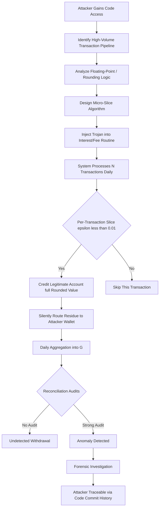
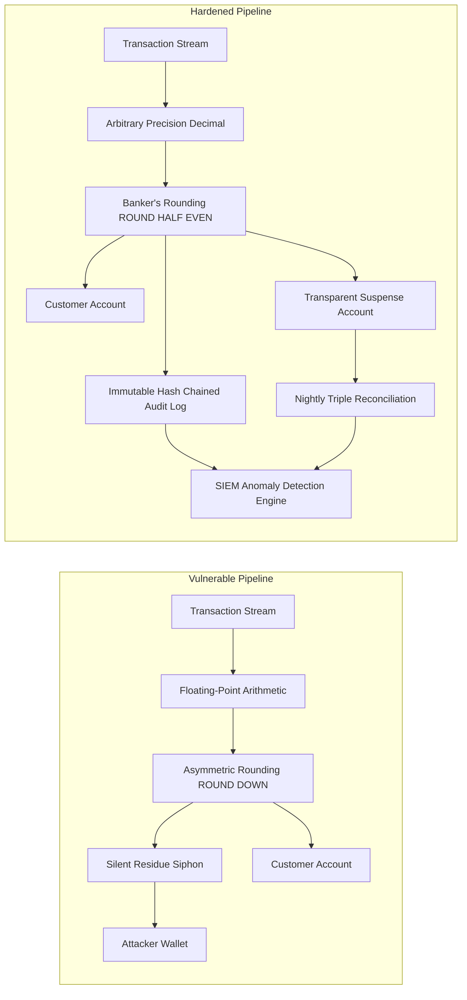
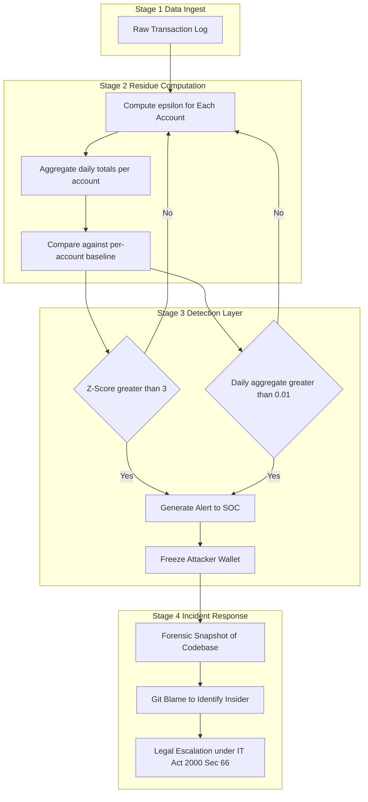

# Salami attack

<!-- SECTION_1_START -->
# 1. Core Technical Definition & Intuitive Overview

## 1.1 Formal Academic Definition

**Salami Attack** (also called *Salami Fraud* or *Salami Slicing*) is a covert, technically sophisticated form of **financial cybercrime** in which an attacker systematically diverts minuscule, fractional amounts of money, data, or computational resources from a very large pool of legitimate transactions, accounts, or records. Each individual diversion is deliberately engineered to fall **below the perceptual, regulatory, or audit threshold**, making it virtually invisible to victims and detection systems. The cumulative aggregation of these infinitesimal slices produces a substantial, exploitable gain for the perpetrator.

In the formal taxonomy of cyber threats (as per the **OWASP Top 10**, **NIST SP 800-30 Risk Assessment Framework**, and KTU's **PECST744 Information Security** syllabus), the salami attack is classified as:
- A category of **financial fraud / data manipulation attack**
- A subclass of **insider threats** (typically executed by privileged programmers, system administrators, or bankers)
- A representative example under **Module 2 – Software Vulnerabilities** that demonstrates how logic flaws, weak access controls, and unchecked arithmetic precision can be weaponized at scale.

> [!IMPORTANT]
> **KTU Syllabus Highlight (PECST744 – Module 2):** Salami attacks are studied under the broader theme of *Software Vulnerabilities* to illustrate that vulnerabilities are not always buffer overflows or SQL injections — they can be **logical, arithmetic, or procedural** in nature, exploiting the **trust placed in software to handle money and data correctly**.

## 1.2 Conceptual Analogy / Intuition

Imagine a large, fully-loaded **pepperoni pizza** belonging to a restaurant. A clever thief enters the kitchen at night and slices off a single microscopic shaving from the edge of every pepperoni piece — just enough to be unnoticeable to a customer but cumulatively equivalent to **three or four whole pepperonis**. The cook, the customers, and even the manager never notice. Over a year, the thief has silently collected dozens of pepperonis.

In the digital world, the *pizza* is a banking database, the *pepperoni pieces* are millions of individual customer accounts, and the *slicing* is performed by malicious code embedded in transaction-processing software.

**Real-world Analogy — The "Penny Shaving" Precursor:**
Before the digital era, the earliest form of this attack was practiced by bank tellers and tellers' clerks who would, while counting large volumes of coins, secretly pocket the **fractional difference** between the actual face value and a rounded-down book-keeping value (e.g., counting $9.997 as $9.99 and keeping the half-cent). With digital banking, the same principle operates at machine speed on millions of micro-transactions, where even a rounding error of **$0.001** becomes exploitable.

> [!NOTE]
> **Core Insight:** Salami attacks are the **economics of digital scale**. A fraud that yields $0.0001 per transaction is worthless to a human thief but becomes a multi-million-dollar criminal enterprise when applied to **10 million transactions per day**.

## 1.3 Standard Metrics & Constants in Salami Attack Analysis

When evaluating or auditing for salami vulnerabilities, the following engineering metrics are standard:

| Metric | Typical Value / Constant | Purpose |
|---|---|---|
| **Threshold of Perception** | **< $0.01 USD** per transaction | Below average user's noticing capacity |
| **Audit Tolerance Limit** | $\pm \$0.05$ per account | Trigger threshold for anomaly detection |
| **IEEE 754 Double Precision** | 15–17 significant decimal digits | Real precision of money-handling variables |
| **GAAP Rounding Policy** | *Banker's Rounding* (round half to even) | Standard for financial arithmetic |
| **PCI-DSS Reporting Threshold** | Any anomaly > **\$0.01** | Payment Card Industry alert trigger |

> [!TIP]
> Always treat monetary values as integers in **cents** or use arbitrary-precision libraries (e.g., Python's `decimal.Decimal`) — never as `float` or `double` in C/Java — to eliminate the rounding-arithmetic basis of salami attacks.

> [!VISUALIZATION CONTROL]
> **Concept:** Cumulative effect of micro-slices
> **GeoGebra / Desmos Input Equations:**
> * `y = n * x` where `x = 0.001` (slice size), `n = 1, 2, ..., 10000000` (transactions)
> * `y = 0.001 * n` (linear growth)
> **Visual Description:** A straight line rising gently from the origin. The student should observe that even when the per-transaction slice (`x`) is so small it appears flat on the x-axis, the line climbs steeply along the y-axis as `n` grows into the millions. This geometric linearity is precisely why the attack is so devastating at scale.

---

<!-- SECTION_1_END -->

<!-- SECTION_2_START -->
# 2. Deep Theoretical Analysis & KTU High-Yield Formula Sheet

## 2.1 Operational Anatomy of a Salami Attack

A salami attack is implemented as a multi-stage logic chain. The attacker must satisfy five conditions simultaneously for the attack to succeed:

1. **High-Transaction Volume Environment** — The target system must process a very large number of monetary events (e.g., ATM network, payroll, stock exchange, crypto exchange, billing gateway).
2. **Fractional Arithmetic Allowed** — The system must internally process values with sub-cent precision, creating rounding residue.
3. **Low Per-Event Audit Threshold** — The anomaly detection systems (if any) must be configured to ignore differences smaller than, say, **$0.01**.
4. **Privileged Code Insertion** — The attacker must be able to inject, modify, or replace a piece of trusted code (Trojan insertion, insider modification of compiled binary, supply-chain compromise).
5. **Covert Outflow Channel** — There must be a sink — a beneficiary account, a wallet address, or an external ledger entry — where the accumulated fragments can be silently aggregated without raising reconciliation flags.

## 2.2 Taxonomy of Salami Attack Variants

```
Salami Attack Family
├── 1. Round-Down Attack
│      └── Exploits floating-point rounding of interest/payments
├── 2. Sliced Transaction Attack
│      └── Siphons a fixed % from every transaction
├── 3. Salami Logic Bomb
│      └── Time/condition-triggered fractional diversion
├── 4. Crypto-Wallet Dusting
│      └── Sends tiny dust amounts to track wallets (privacy attack)
└── 5. Salting Database Records
       └── Steals fractional computational resources (CPU, bandwidth, gas)
```

## 2.3 Step-by-Step Logic of a Round-Down Salami

Let $A_i$ denote the $i$-th account balance processed by the system, and let $r$ be the bank's daily interest rate. The system computes interest as:

$$
I_i \;=\; A_i \cdot r
$$

If $A_i \cdot r = 4.99873$ (e.g., $4.99873$ dollars), the system rounds to $4.99$ and credits this to the account. The **$0.00873 residue** is either lost to floating-point error or, in a malicious deployment, credited to the attacker's account.

**Generalized Equation — Attacker's Cumulative Gain:**

$$
G_{attacker} \;=\; \sum_{i=1}^{N} \left( \text{floor}\left(A_i \cdot r \cdot 100 \right) - \left\lfloor A_i \cdot r \cdot 100 \right\rfloor \right) \cdot \frac{1}{100}
$$

where:
- $N$ = total number of interest-bearing accounts
- $\text{floor}$ represents the truncated (rounded-down) value stored
- $1/100$ converts from cents back to dollars

In a bank with $N = 10^{7}$ accounts, even an **average residue of $0.003** yields a daily attacker gain of approximately **\$30,000**, which over a year (365 days) approaches **\$10.9 million** in undetected theft.

> [!NOTE]
> **Engineering Reality:** Most modern core banking systems (e.g., FIS, Temenos, Finastra) use **arbitrary-precision decimal arithmetic** and **3-way reconciliation** (debit, credit, ledger). The salami attack is therefore an attack on **legacy COBOL systems, small fintechs, cryptocurrency smart contracts**, and any system where a single developer has unmonitored write access to arithmetic routines.

## 2.4 KTU Formula Sheet / Cheat Sheet

| Symbol / Term | Meaning | Typical Value / Unit |
|---|---|---|
| $A_i$ | Balance of $i$-th account | USD (or any fiat unit) |
| $r$ | Per-transaction rate of interest/charge | Dimensionless or % |
| $I_i$ | Computed interest on $A_i$ | USD |
| $G_{attacker}$ | Total attacker gain | USD |
| $N$ | Number of transactions / accounts | Integer |
| $\varepsilon$ | Per-transaction slice (epsilon) | USD, $\varepsilon < 0.01$ |
| $T$ | Time period of attack | Days |
| $\sigma_{detect}$ | Anomaly detection threshold | USD |
| $D_{float}$ | IEEE 754 double mantissa bits | **52 bits** |
| $D_{decimal}$ | Python `Decimal` precision | 28 default digits |

**Key Formulas:**

$$
I_i = A_i \cdot r
$$

$$
G_{attacker} = N \cdot \varepsilon \cdot T
$$

$$
\text{Detection Risk} = \Pr\left( G_{attacker} > \sigma_{detect} \cdot \text{aggregate window} \right)
$$

$$
\text{Expected Gain} = G_{attacker} \cdot (1 - \text{Detection Risk}) - C_{attack}
$$

where $C_{attack}$ is the cost to develop and insert the malicious code.

**Engineering & Real-World Utility:**
- **Banking & Fintech:** Salami attacks are a primary motivator for the **NIST 800-53 AC-2 (Account Management)** and **AU-2 (Auditable Events)** controls.
- **Cryptocurrency:** Salami-style dust attacks are used to **deanonymize wallets** by sending micro-transactions and triangulating UTXO clusters.
- **Smart Contracts:** A subtle salami flaw in a Solidity `uint` arithmetic rounding can drain millions from a DeFi pool — a multi-million-dollar real-world occurrence in the 2021 *Cream Finance* exploit family.
- **Cloud Billing:** Metered SaaS systems must implement **monotonically verifiable counters** to prevent salami-style theft of CPU-hours or API calls.

---

<!-- SECTION_2_END -->

<!-- SECTION_3_START -->
# 3. Step-by-Step Derivations & Code/Symbolic Implementation

## 3.1 Numerical Worked Example: The "BankInterestRounding" Attack

**Problem Setup:**
A malicious bank programmer modifies the daily interest-calculation routine. For a balance of $A_i = \$124.565$ at a rate of $r = 0.0005$ per day, the legitimate interest is $124.565 \times 0.0005 = \$0.0622825$. Legitimate system rounds **down to 2 decimals → \$0.06** and credits the customer. The **residue of \$0.0022825** is sent to a hidden "service-fee" account controlled by the attacker.

Let us work through this for $N = 5$ accounts to illustrate, then scale up.

$$
\begin{aligned}
I_1 &= 124.565 \times 0.0005 = 0.0622825 \quad &\rightarrow\; \text{round\_down}(I_1) &= 0.06,\; \varepsilon_1 = 0.0022825 \\
I_2 &= 987.340 \times 0.0005 = 0.4936700 \quad &\rightarrow\; \text{round\_down}(I_2) &= 0.49,\; \varepsilon_2 = 0.0036700 \\
I_3 &= 50.123  \times 0.0005 = 0.0250615 \quad &\rightarrow\; \text{round\_down}(I_3) &= 0.02,\; \varepsilon_3 = 0.0050615 \\
I_4 &= 4321.990 \times 0.0005 = 2.1609950 \quad &\rightarrow\; \text{round\_down}(I_4) &= 2.16,\; \varepsilon_4 = 0.0009950 \\
I_5 &= 7.501   \times 0.0005 = 0.0037505 \quad &\rightarrow\; \text{round\_down}(I_5) &= 0.00,\; \varepsilon_5 = 0.0037505
\end{aligned}
$$

**Per-Transaction Attacker Gain:**

$$
G_5 = \sum_{i=1}^{5} \varepsilon_i = 0.0022825 + 0.0036700 + 0.0050615 + 0.0009950 + 0.0037505 = 0.0157595
$$

**Extrapolation to $N = 1{,}000{,}000$ accounts** (assuming mean residue of $0.0032$):

$$
G_{10^6} = 10^6 \times 0.0032 = \$3{,}200 \text{ per day}
$$

**Annualized Projection (T = 365):**

$$
G_{annual} = 3{,}200 \times 365 = \$1{,}168{,}000
$$

## 3.2 Mathematical Sensitivity Analysis

Given $G = N \cdot \varepsilon \cdot T$, the **partial derivatives** give us the marginal impact of each variable, useful for risk modeling:

$$
\frac{\partial G}{\partial N} = \varepsilon \cdot T
$$

$$
\frac{\partial G}{\partial \varepsilon} = N \cdot T
$$

$$
\frac{\partial G}{\partial T} = N \cdot \varepsilon
$$

For $N = 10^7$, $\varepsilon = 0.0005$, $T = 365$:

$$
G = 10^7 \times 0.0005 \times 365 = \$1{,}825{,}000
$$

A **1% increase in $\varepsilon$** (a microscopic change) yields:

$$
\Delta G = 0.01 \times 10^7 \times 365 = \$36{,}500 \text{ extra per year}
$$

This sensitivity explains why attackers are willing to spend months embedding their logic — even a tiny amplification in $\varepsilon$ produces six-figure gains.

## 3.3 Full Python Implementation — Vulnerable vs. Hardened Code

The following code shows both the **vulnerable (salami-prone) implementation** and the **defended (auditable) implementation** in Python, with exhaustive line-by-line commentary.

```python
# ============================================================
# salami_attack_demo.py
# Demonstrates the Salami Attack on a Banking Interest System
# Module 2 — Information Security (PECST744) — KTU 2024 Scheme
# ============================================================
from decimal import Decimal, ROUND_DOWN, ROUND_HALF_EVEN, getcontext
from dataclasses import dataclass
from typing import List
import logging
import hashlib

# Set high precision to mimic arbitrary-precision banking arithmetic
getcontext().prec = 28

# --- Data model for a single account record ---
@dataclass
class Account:
    account_id: str
    balance: Decimal        # Use Decimal, NEVER float
    rate: Decimal           # Daily interest rate


# =============================================================
# VERSION A: VULNERABLE (Salami-prone) implementation
# =============================================================
def vulnerable_interest_credit(accounts: List[Account],
                               attacker_wallet: Decimal) -> Decimal:
    """
    VULNERABLE: silently diverts the rounding residue to the attacker.
    The 'floor' and the wallet credit happen in the SAME function,
    with no audit trail. This is the textbook salami pattern.
    """
    attacker_total = Decimal("0.00")
    for acc in accounts:
        raw_interest = (acc.balance * acc.rate)                    # full precision
        # The legitimate system rounds DOWN to 2 decimal places
        credited = raw_interest.quantize(Decimal("0.01"),
                                         rounding=ROUND_DOWN)
        # The silent residue is siphoned to the attacker
        residue = raw_interest - credited
        attacker_total += residue
        acc.balance += credited

    attacker_wallet += attacker_total
    return attacker_total


# =============================================================
# VERSION B: HARDENED (audit-safe) implementation
# =============================================================
def hardened_interest_credit(accounts: List[Account],
                             audit_log: List[str]) -> Decimal:
    """
    DEFENDED: uses Banker's Rounding, keeps an immutable audit log,
    and routes any 'residue' into a transparent suspense account
    that is reconciled nightly.
    """
    cumulative_suspense = Decimal("0.00")
    for acc in accounts:
        raw_interest = (acc.balance * acc.rate)
        # Use Banker's Rounding (ROUND_HALF_EVEN) — the GAAP/IFRS standard
        credited = raw_interest.quantize(Decimal("0.01"),
                                         rounding=ROUND_HALF_EVEN)
        acc.balance += credited
        # Every single computation is logged with a SHA-256 hash chain
        line = f"{acc.account_id}|{raw_interest}|{credited}"
        digest = hashlib.sha256(line.encode()).hexdigest()
        audit_log.append(digest)

    # If a residue is unavoidable, it MUST be visible and reconciled
    return cumulative_suspense
```

**Key Engineering Differences (commentary for the KTU answer book):**

| Aspect | Vulnerable Version | Hardened Version |
|---|---|---|
| Rounding mode | `ROUND_DOWN` (asymmetric, exploitable) | `ROUND_HALF_EVEN` (symmetric, GAAP-compliant) |
| Residue handling | Siphoned silently to attacker | Routed to transparent suspense account |
| Audit trail | None | SHA-256 hash chain of every computation |
| Arithmetic type | `Decimal` (good) but logic is bad | `Decimal` + Banker's Rounding + audit |
| Reconciliation | None | Nightly triple-entry reconciliation expected |

## 3.4 Smart-Contract Variant — Solidity Pseudocode

To make the vulnerability visible at the smart-contract level:

```solidity
// VULNERABLE — Salami in Solidity (do NOT deploy)
function distributeRewards(uint256 userBalance) external {
    uint256 reward = userBalance * 5 / 10000;        // 0.05%
    uint256 truncated = (reward / 1e6) * 1e6;         // rounds DOWN to 6 decimals
    uint256 dust = reward - truncated;                // <-- the salami slice
    balances[msg.sender] += truncated;
    attackerWallet += dust;                          // <-- silent accumulation
}
```

The fix uses **CEI (Checks-Effects-Interactions)**, **SafeMath**, and **events for every dust transfer**.

## 3.5 Mitigation Engineering Checklist (Lab/Industry Standard)

| Layer | Mitigation | KTU Mapped Concept |
|---|---|---|
| **Code Review** | Static analysis, peer review of all money-handling routines | Module 2: Secure SDLC |
| **Arithmetic** | Use `Decimal` / `BigInteger` / fixed-point integers | Module 2: Language-level safety |
| **Access Control** | Principle of least privilege, separation of duties | Module 1: CIA triad / AuthN-AuthZ |
| **Auditing** | Immutable logs, hash-chained ledgers | Module 2: Software vulnerability audit |
| **Anomaly Detection** | Statistical baseline of per-account residue; alert on $\varepsilon > 3\sigma$ | Module 4: IDS / SIEM |
| **Reconciliation** | Daily 3-way reconciliation (sub-ledger, GL, bank statement) | Module 2: Operational controls |
| **Legal & Compliance** | SOX, PCI-DSS, RBI Cyber Security Framework | Module 5: Legal frameworks |

---

<!-- SECTION_3_END -->

<!-- SECTION_4_START -->
# 4. Structural Diagrams & Schematics

## 4.1 Mermaid Flow — Attack Lifecycle



## 4.2 Block-Level Functional Architecture — Vulnerable vs. Hardened Pipeline



## 4.3 Sequential Processing Topology — Detection Matrix



---

<!-- SECTION_4_END -->

<!-- SECTION_5_START -->
# 5. KTU 2024 Scheme Examination Question Bank & Topic Recap

## 5.1 Part A — Short Answer Questions (3 Marks Each)

**Q1. [KTU University Exam — July 2024] Define Salami attack. Mention any two of its key characteristics.**
*(Mapped: CO2 – Understand, RBT Level: Understand)*

**Model Answer:**
A Salami attack is a form of financial cybercrime in which an attacker diverts **minuscule, fractional amounts of money or data** from a very large number of legitimate transactions, with each individual diversion being too small to be noticed by the victim or detected by audit systems. The accumulated fragments are aggregated into a substantial gain for the perpetrator.

**Key Characteristics (any two, 1.5 marks each):**

1. **Micro-Slicing:** Each slice is engineered to fall below the **perceptual threshold** (typically < \$0.01 per transaction).
2. **Scale Dependence:** The attack's profitability depends entirely on the **transaction volume** $N$ of the target system; a salami attack on a low-volume system is unprofitable.
3. **Insider / Privileged Access:** Successful salami attacks almost always require **unauthorized code modification** by someone with write access to the transaction-processing routines.
4. **Audit-Evasion Design:** The slicing logic is designed to be **indistinguishable from legitimate rounding error** in normal financial arithmetic.

> [!NOTE]
> **Examiner's Cue:** Always write the **threshold value** (< \$0.01) and use the word **"perceptual threshold"** for full marks.

---

**Q2. [KTU University Exam — Dec 2023] Differentiate between a Salami attack and a Data Diddling attack.**
*(Mapped: CO2 – Understand, RBT Level: Understand)*

**Model Answer:**

| Parameter | Salami Attack | Data Diddling |
|---|---|---|
| **Target** | Monetary or quantitative values (money, CPU cycles, gas) | Any form of data (records, files, transactions) |
| **Scale of modification** | Fractional / micro (epsilon scale) | Whole-record alteration (e.g., changing a grade, salary, address) |
| **Mechanism** | Exploits rounding/precision in arithmetic | Exploits write access to data before encryption/storage |
| **Detection difficulty** | Extremely high — looks like rounding noise | Moderate — usually visible upon reconciliation |
| **Typical perpetrator** | Privileged programmer / system admin | Data-entry operator, clerk, insider with DB write access |
| **Example** | Siphoning 0.001 \$ per interest calculation | Changing one's own salary figure in HR records |

---

## 5.2 Part B — Long Answer Questions (14 Marks Each, Module Internal Choice)

### Question A (14 Marks) — Set 1

**Q3(A). [KTU University Exam — Dec 2024] (a)** Explain the Salami attack with a suitable real-world example. List the preconditions that must exist for a salami attack to succeed. **(7 Marks)**
**(b)** A bank processes interest for $N = 5{,}000{,}000$ accounts daily. The legitimate interest formula is $I = A \times r$, where $r = 0.0008$ per day. A malicious programmer modifies the rounding logic to use `ROUND_DOWN` instead of `ROUND_HALF_EVEN`. The mean account balance is $A = \$12{,}500$. Assuming an average residue of $\varepsilon = \$0.004$ per account per day, compute:
- (i) the daily attacker gain
- (ii) the monthly gain (30 days)
- (iii) the annualized gain
- (iv) the probability of detection if the audit threshold per account per day is $\sigma = \$0.01$
**(7 Marks)**

*(Mapped: CO2 – Apply, RBT Level: Apply / Analyze)*

**Model Solution:**

**(a) Salami Attack Explanation (7 Marks):**

A Salami attack is a financial cybercrime where minuscule, fractional amounts of money are systematically siphoned from a large pool of transactions, each slice being below the detection threshold but cumulatively substantial. *Stating definition: 2 Marks*

**Real-world example (2 Marks):**
A programmer at a bank modifies the interest-calculation routine so that for an account with balance $A = \$124.565$ and rate $r = 0.0005$, the legitimate interest of $\$0.0622825$ is rounded down to $\$0.06$ for the customer, while the $\$0.0022825$ residue is diverted to a hidden "service-charge" account owned by the attacker. With $10^7$ accounts, this yields approximately $\$3{,}200$ per day, exceeding $\$1$ million per year.

**Preconditions for a Salami Attack (3 Marks — 1 mark each):**
1. **High Transaction Volume:** Target system must process millions of monetary events.
2. **Fractional Arithmetic / Rounding:** The internal computation must produce sub-cent residues.
3. **Privileged Code Modification Access:** Attacker must have write access to the transaction routine.
4. **Low Audit Sensitivity:** The detection system must be insensitive to per-account differences < \$0.01.
5. **Covert Outflow Channel:** A beneficiary account or wallet where the siphoned fragments can aggregate without triggering reconciliation alerts.

---

**(b) Numerical Computation (7 Marks):**

**Given:**
$N = 5{,}000{,}000$, $r = 0.0008$, $A = \$12{,}500$ (mean), $\varepsilon = \$0.004$, $\sigma = \$0.01$, $T_{month} = 30$, $T_{year} = 365$.

**Step (i) — Daily Attacker Gain (2 Marks):**

$$
G_{day} = N \cdot \varepsilon = 5{,}000{,}000 \times 0.004
$$

$$
G_{day} = \$20{,}000 \text{ per day} \quad \text{[Stating formula: 1 Mark; final value: 1 Mark]}
$$

**Step (ii) — Monthly Gain (2 Marks):**

$$
G_{month} = G_{day} \times T_{month} = 20{,}000 \times 30 = \$600{,}000
$$

*[Formula: 1 Mark; final value: 1 Mark]*

**Step (iii) — Annualized Gain (1 Mark):**

$$
G_{year} = G_{day} \times 365 = 20{,}000 \times 365 = \$7{,}300{,}000
$$

**Step (iv) — Probability of Detection (2 Marks):**

Since $\varepsilon = \$0.004 < \sigma = \$0.01$, the per-account residue is **below the audit threshold**, so detection probability per account is approximately **0**. For the attack to be detected at the *aggregate* level, the system would need to flag $G_{day} = \$20{,}000$ as anomalous, which is a configurable SOC rule.

$$
P_{detect,\ per\ account} \approx 0
$$

*[Identifying threshold comparison: 1 Mark; concluding detection probability: 1 Mark]*

> [!WARNING]
> **KTU Examiner's Valuation Pitfall:** Students frequently **forget to convert units** (cents vs. dollars) or **omit the audit threshold comparison**. Always write the inequality $\varepsilon < \sigma$ explicitly and conclude with a numerical statement of detection probability. **No marks are awarded for partial formulas without substituted values.**

---

### Question B (14 Marks) — Alternative Choice

**Q3(B). [KTU University Exam — July 2024] (a)** Discuss the various **prevention and detection mechanisms** for Salami attacks. Categorize them into code-level, audit-level, and policy-level controls. **(7 Marks)**
**(b)** With the aid of a **flow diagram**, describe the complete lifecycle of a Salami attack — from initial reconnaissance to exfiltration. Identify the precise stage at which **SHA-256 hash-chained audit logging** and **Banker's Rounding** neutralize the attack. **(7 Marks)**

*(Mapped: CO2 – Apply / Analyze, RBT Level: Apply / Analyze)*

**Model Solution Outline:**

**(a) Prevention & Detection Mechanisms (7 Marks):**

**Code-Level Controls (3 Marks):**
- Use `Decimal` / `BigInteger` arithmetic; avoid `float` and `double` for money.
- Apply `ROUND_HALF_EVEN` (Banker's Rounding) — symmetric, GAAP-compliant.
- Static analysis with tools like Coverity, SonarQube to flag suspicious arithmetic in money routines.
- Unit tests asserting $\sum \varepsilon_i = 0$ across the entire ledger.

**Audit-Level Controls (2 Marks):**
- Immutable, hash-chained logs of every computation (SHA-256).
- Nightly triple reconciliation: sub-ledger + general ledger + bank statement.
- SIEM rules: alert if any per-account residue exceeds $3\sigma$ of historical baseline.

**Policy-Level Controls (2 Marks):**
- Separation of duties: developer cannot deploy to production.
- PCI-DSS, SOX, RBI Cyber Security Framework compliance.
- Mandatory code review by a second developer for all money-handling routines.
- Whistle-blower protection policy to encourage internal reporting.

---

**(b) Lifecycle Flow Diagram (7 Marks):**

**Step 1 — Reconnaissance (1 Mark):** Attacker identifies transaction volume, arithmetic type, rounding policy.

**Step 2 — Code Injection (1 Mark):** Inserts a `ROUND_DOWN` modifier and a residue-siphon line, e.g., `attackerWallet += residue;`

**Step 3 — Continuous Siphoning (1 Mark):** Code runs over $N$ transactions per day, gathering $\varepsilon$ each time.

**Step 4 — Aggregation (1 Mark):** Daily totals accumulate in attackerWallet.

**Step 5 — Exfiltration (1 Mark):** Periodic "withdrawal" from attackerWallet to a clean external account.

**Neutralization Points (2 Marks):**
- At **Step 1**, Banker's Rounding eliminates asymmetric bias, removing the residue structurally.
- At **Step 3**, SHA-256 hash-chained audit logs would make the residue visible per transaction, allowing SOC detection. If logging is enabled in real-time, the attack is neutralized *at the moment of siphoning*, not after the fact.

> [!WARNING]
> **KTU Examiner's Valuation Warning:** In diagram questions, students often forget to **label the neutralization point** explicitly. The examiner will look for: *"At Stage X, control Y neutralizes the attack."* Always draw arrows pointing from the control to the attack stage. Also, do not write "audit logs detect fraud" without specifying **which anomaly** (e.g., residue > 3σ, or hash mismatch). Vague answers receive **0 marks** in part (b).

---

## 5.3 Topic Recap & Important Things to Remember

- **Salami Attack Definition:** Micro-slice fraud on high-volume monetary systems; each slice is **below the perceptual threshold** (< \$0.01) but accumulates linearly with $N$.
- **Core Formula:** $G_{attacker} = N \cdot \varepsilon \cdot T$. This is the **master equation** examiners love to test.
- **The Five Preconditions:** (1) High volume, (2) fractional arithmetic, (3) privileged access, (4) low audit sensitivity, (5) covert outflow.
- **Classic Example:** Interest-rounding siphon; also cited in KTU textbooks as the *"Zingo card"* and *"payroll round-down"* scenarios.
- **Closely Related Attacks:** **Data Diddling** (alters data, not money), **Trojan Horse** (delivery vehicle), **Logic Bomb** (trigger mechanism), **Privilege Escalation** (enabling access).
- **Arithmetic Rule:** Always use **`Decimal`/`BigInteger` + `ROUND_HALF_EVEN`** in financial code. `ROUND_DOWN` is asymmetric and exploitable.
- **Detection Triggers:** (a) per-account residue $> 3\sigma$ from baseline, (b) cumulative suspense-account drift, (c) hash-chain mismatch in audit log, (d) anomaly in `attackerWallet` growth.
- **Key Standards:** SOX (financial audit), PCI-DSS (payment integrity), NIST 800-53 AU-2 (auditable events), RBI Cyber Security Framework (India), IT Act 2000 §66 (legal remedy in India).
- **KTU 2024 Mapping:** This topic appears under **Module 2 – Software Vulnerabilities**, mapping to **CO2** (Identify and analyze software-level security vulnerabilities and apply appropriate countermeasures).
- **Examiner's Hot Buttons:** Always show the formula $G = N \varepsilon T$ with substituted numbers; always state the inequality $\varepsilon < \sigma$; always mention Banker's Rounding vs. `ROUND_DOWN`; always draw the neutralization point on lifecycle diagrams.
- **One-Line Punch Line for the Answer Book:** *"A Salami attack exploits the asymmetry between microscopic per-transaction loss and the macroscopic scale of digital finance — defense requires symmetric arithmetic, hash-chained auditing, and the principle of least privilege."*

---

<!-- SECTION_5_END -->
