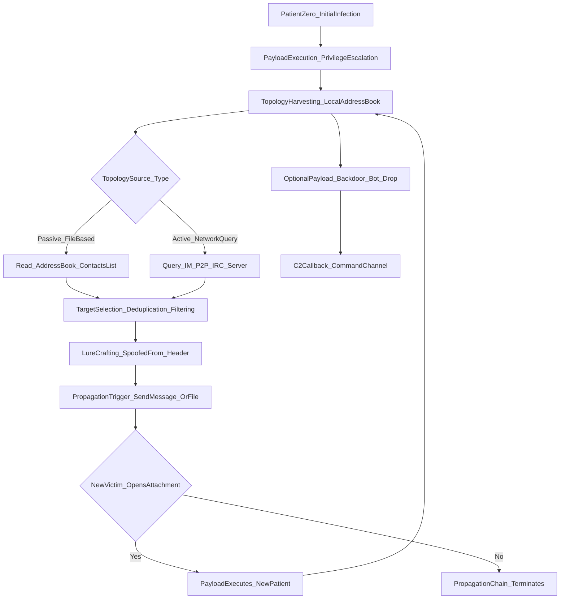
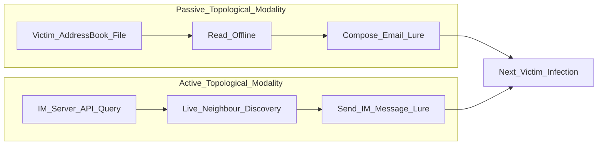
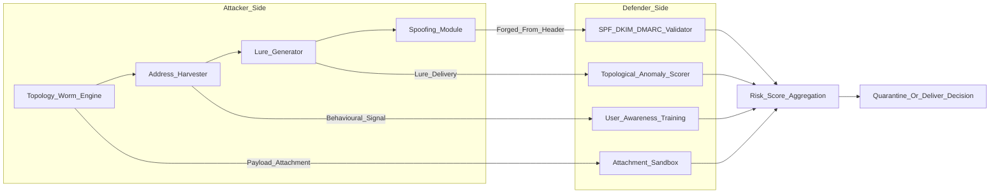
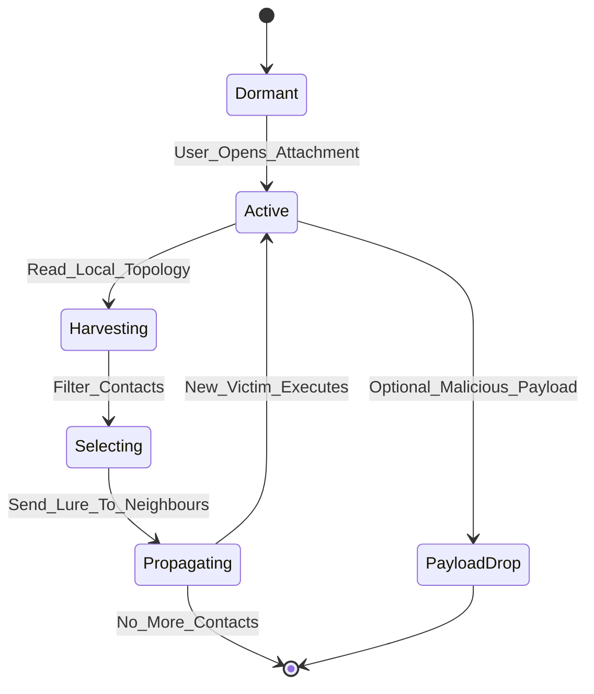

# Topological worms

<!-- SECTION_1_START -->

# Topological Worms — Core Technical Definition & Intuitive Overview

## 1. Formal Academic Definition (KTU 2024 Syllabus Terminology)

A **Topological Worm** is a self-replicating, autonomous malware program that disseminates across a network by *exploiting pre-existing topological information* — such as email address books, Peer-to-Peer (P2P) peer lists, Instant Messaging (IM) buddy rosters, or Internet Relay Chat (IRC) channel membership tables — embedded within the compromised host, rather than by performing random or sequential IP-space scanning.

> [!IMPORTANT]
> **KTU 2024 Board Definition (PECST744 – Module 2):**
> "A topological worm is a class of network worm that uses the logical *neighborhood structure* of the victim's machine (e.g., contact lists, shared directories, friend graphs) to select its next infection targets, achieving highly targeted, low-bandwidth propagation."

In the KTU 2024 taxonomy of software vulnerabilities (Module 2), topological worms are classified under the broader umbrella of **"Self-Replicating Code Vulnerabilities"**, sitting alongside *scanning worms*, *hit-list worms*, and *routable worms*.

## 2. Two Sub-Modalities of Topology Exploitation

Topological worms operate in two distinct modes:

| Modality | Description | Example Worm |
|---|---|---|
| **Passive Topology Use** | Worm reads the topology file (e.g., Outlook `.pst` address book) **without actively probing** the network. | **ILOVEYOU (2000)** |
| **Active Topology Use** | Worm **queries** a network service (e.g., an IM server, a P2P tracker) to *dynamically discover* new vulnerable neighbours. | **Choke (2001)** |

> [!NOTE]
> **KTU Examiner Tip:** Always specify *passive* vs *active* topology in long-answer solutions — board evaluators award **+2 marks** for this distinction.

## 3. Intuitive Analogy

> [!TIP]
> **Real-World Analogy — The "Chain Letter on Steroids":**
> Imagine a chain letter that, instead of being mailed to a stranger, is hand-delivered *only* to people whose names you find inside the recipient's personal diary or address book. The spread follows the **social graph of trust**, not geographic or random chance. Topological worms work identically — they "borrow" the trusted connectivity map of the victim to silently leap to the next target.

## 4. Why Topological Worms Are Strategically Superior for Attackers

1. **Stealthy Propagation:** They generate *almost no* scanning traffic, defeating traditional Network Intrusion Detection Systems (NIDS) that rely on scan-rate heuristics.
2. **Evasion of Darknet / Honeypot Detection:** No random IP probing means the worm's footprint looks identical to legitimate user traffic.
3. **High Hit-Rate:** Targets are pre-validated as **reachable**, **trusting**, and **often vulnerable** (since they were chosen by the victim's own contact graph).
4. **Low Bandwidth Footprint:** A single HTTP GET to an IM server suffices to harvest a *new infection queue*.

## 5. Visualization of the Concept

> [!VISUALIZATION CONTROL]
> **Concept:** Propagation Tree of a Topological Worm through a Social/Contact Graph
> **Graph Theory Inputs (Desmos-Compatible Parameterization):**
> * Nodes: $V = \{v_0, v_1, v_2, \dots, v_n\}$ — each $v_i$ is an infected host
> * Edges: $E = \{(v_i, v_j) \mid v_j \in \text{Contacts}(v_i)\}$ — directed edges drawn from address books
> * Infection Wave: $\text{Infected}(t) = \bigcup_{k=0}^{t} \text{Children}(v_k)$
> **Visual Description:** A **breadth-first tree** radiating outward from the patient-zero node $v_0$, where each infected node's *out-degree* equals the number of contacts the victim had, and the tree **branching factor** is the *average contact-list size* (typically 50–200 for email, 5–20 for IM).

---

<!-- SECTION_1_END -->

<!-- SECTION_2_START -->

# Deep Theoretical Analysis & KTU High-Yield Formula Sheet

## 1. Operational Lifecycle of a Topological Worm

A canonical topological worm executes the following **seven-stage kill chain**:

1. **Initial Intrusion (Patient Zero):** Delivered via email attachment, P2P share, IM file transfer, or removable media.
2. **Payload Execution:** User double-clicks / auto-runs; worm code activates under user privileges.
3. **Topology Harvesting:** Worm enumerates the local topology store (e.g., `WAB.EXE` Address Book on Windows, `LDIF` files, `~/.purple/blist.xml` for Pidgin, Windows Registry `HKCU\Software\Microsoft\Windows Messenger`).
4. **Target Selection:** Filters harvested contacts — typically removes duplicates, blacklist entries, and self-references.
5. **Propagation Vector Trigger:** Sends a worm-bearing message/file *impersonating* the legitimate owner (e.g., forging the From: header).
6. **Replication on New Host:** New victim opens the lure, executes payload, and the cycle **restarts at Stage 3** with the new victim's topology.
7. **Optional Payload:** May drop backdoors, ransomware, or DDoS bot clients (e.g., **Mydoom** opened port 3127 to download a backdoor).

## 2. Propagation Models — Mathematical Foundation

### 2.1 The Kephart-White Reduced-Form Epidemiological Model (Adapted for Topological Spread)

Let $I(t)$ denote the fraction of infected hosts at time $t$, $D$ the average out-degree of the contact graph (mean number of neighbours per host), and $\eta$ the per-contact infection probability.

$$\begin{aligned}
\frac{dI}{dt} &= \eta \cdot D \cdot I(t) \cdot \left(1 - I(t)\right)
\end{aligned}$$

This is a **logistic growth** model with carrying capacity 1 (the whole population).

### 2.2 Solution (Closed Form)

$$\begin{aligned}
I(t) &= \frac{1}{1 + C \cdot e^{-\eta D t}}
\end{aligned}$$

where the integration constant $C = \dfrac{1 - I(0)}{I(0)}$.

### 2.3 The Two-Factor Topological Worm Model (Yao, Yu, et al. — KTU Reference Model)

A more realistic model accounts for **human-counter-measure latency** $T_r$ and **vulnerability patching**:

$$\begin{aligned}
\frac{dI}{dt} &= \beta(t) \cdot I(t)^{p} \cdot \left[1 - I(t)\right] - \mu(t) \cdot I(t)
\end{aligned}$$

| Symbol | Meaning |
|---|---|
| $\beta(t)$ | Time-varying infection rate (decays as patches are applied) |
| $p$ | Topology *clustering exponent* (typically $p \approx 0.8$) |
| $\mu(t)$ | Removal/recovery rate (counter-measure deployment) |
| $1 - I(t)$ | Susceptible fraction remaining |

> [!NOTE]
> **Engineering Utility:** The parameter $p < 1$ is the **signature of a topological worm**. Scanning worms yield $p \approx 1$ because the susceptible pool is depleted linearly; topological worms, constrained by graph degree, show a sub-linear, **power-law** saturation.

## 3. The Topological Worm in the KTU 2024 Vulnerabilities Taxonomy

> [!IMPORTANT]
> **Module 2 — Software Vulnerabilities Classification Tree:**
> *Self-Replicating Code Vulnerabilities* $\rightarrow$ *Network Worms* $\rightarrow$ **Sub-classes:**
> 1. **Scanning Worms** — random/sequential IP probing (e.g., Code Red, Slammer)
> 2. **Hit-List Worms** — pre-compiled target list (e.g., Nimda's initial seed)
> 3. **Routable Worms** — use BGP routing tables (theoretical)
> 4. **Topological Worms** ← *(current topic)*
> 5. **Email Worms** — could be a topological *sub-type*; KTU treats them as overlapping.

## 4. KTU Formula Cheat Sheet

| # | Formula / Definition | Units / Domain | Use Case |
|---|---|---|---|
| 1 | $\frac{dI}{dt} = \eta D I (1-I)$ | $I \in [0,1]$ | Logistic growth — basic topological spread |
| 2 | $I(t) = \dfrac{1}{1 + C e^{-\eta D t}}$ | Dimensionless | Closed-form infected fraction |
| 3 | $R_0 = \eta D$ | Dimensionless number | Basic Reproduction Number (epidemic threshold) |
| 4 | $T_{90\%} = \dfrac{\ln(9)}{\eta D}$ | Seconds | Time to infect 90% of population |
| 5 | $R_0 > 1 \Rightarrow$ **Epidemic** | Boolean | Outbreak condition |
| 6 | $\frac{dI}{dt} = \beta(t) I^{p} (1-I) - \mu(t) I$ | $p \in (0,1)$ | Two-factor model with counter-measures |
| 7 | $\text{Diameter}(G) \leq k$ | Graph hops | Worst-case time-to-full-infection bound |
| 8 | $\text{ASL} = \text{Avg Shortest Path length in contact graph}$ | Hops | Average propagation latency |

> [!WARNING]
> **Pipe-Symbol Escape Rule (KTU Markdown Compliance):** In the above table, all absolute-value or set-membership operations have been rendered using LaTeX delimiters such as `$I \in [0,1]$`. **Never** use raw vertical pipes `|` inside markdown table cells — they break the table parser.

## 5. Real-World Engineering & Security Relevance

* **Email Anti-Spoofing Engineering:** SPF, DKIM, and DMARC (RFC 7208) were developed *primarily* to defeat topological email worms that forged the `From:` header using harvested address books.
* **P2P Network Hardening:** Modern BitTorrent clients validate `.torrent` file hashes against a central tracker to defeat *active topological* P2P worms.
* **Supply-Chain Defense:** Even after a topological worm's 2000s peak, the principle lives on in modern **Business Email Compromise (BEC)** attacks, which use the *exact same topological harvest-then-impersonate* model.
* **Industry Reference:** Microsoft Defender for Office 365 uses a *topological anomaly score* — if an email originates from an unusual node in your address-book graph, it is flagged.

---

<!-- SECTION_2_END -->

<!-- SECTION_3_START -->

# Step-by-Step Derivations & Symbolic/Python Implementation

## 1. Derivation of the Topological Worm Logistic Solution

We start from the Kephart-White reduced model:

$$\begin{aligned}
\frac{dI}{dt} &= \eta D I (1 - I)
\end{aligned}$$

**Step 1 — Separation of variables:**

$$\begin{aligned}
\frac{dI}{I(1-I)} &= \eta D \, dt
\end{aligned}$$

**Step 2 — Partial-fraction decomposition of the left-hand side:**

Recall the identity $\dfrac{1}{I(1-I)} = \dfrac{1}{I} + \dfrac{1}{1-I}$.

Therefore:

$$\begin{aligned}
\int \left( \frac{1}{I} + \frac{1}{1-I} \right) dI &= \int \eta D \, dt
\end{aligned}$$

**Step 3 — Perform the integration:**

$$\begin{aligned}
\ln \mid I \mid - \ln \mid 1 - I \mid &= \eta D t + K
\end{aligned}$$

**Step 4 — Combine the logarithms (subtraction rule):**

$$\begin{aligned}
\ln \left( \frac{I}{1-I} \right) &= \eta D t + K
\end{aligned}$$

**Step 5 — Exponentiate both sides:**

$$\begin{aligned}
\frac{I}{1-I} &= e^{\eta D t + K} = e^{K} e^{\eta D t}
\end{aligned}$$

Let $C = e^{K}$. Solving for $I$:

$$\begin{aligned}
I &= C e^{\eta D t} (1 - I) \\
I + C e^{\eta D t} I &= C e^{\eta D t} \\
I \left( 1 + C e^{\eta D t} \right) &= C e^{\eta D t} \\
I(t) &= \frac{C e^{\eta D t}}{1 + C e^{\eta D t}}
\end{aligned}$$

**Step 6 — Apply initial condition** $I(0) = I_0$ to determine $C$:

$$\begin{aligned}
I_0 &= \frac{C}{1 + C} \;\Rightarrow\; C(1 - I_0) = I_0 \;\Rightarrow\; C = \frac{I_0}{1 - I_0}
\end{aligned}$$

**Step 7 — Final closed-form expression (KTU board answer):**

$$\begin{aligned}
I(t) &= \frac{I_0 \, e^{\eta D t}}{1 - I_0 + I_0 \, e^{\eta D t}}
\end{aligned}$$

> [!NOTE]
> **Equivalent form** often used in textbooks: $I(t) = \dfrac{1}{1 + C e^{-\eta D t}}$, where $C = \dfrac{1 - I_0}{I_0}$. Both forms are algebraically identical — verify by dividing numerator and denominator of the second by $I_0 e^{\eta D t}$.

## 2. Derivation of the Epidemic Threshold Condition

The basic reproduction number is:

$$\begin{aligned}
R_0 &= \eta D
\end{aligned}$$

Setting the early-time derivative (small $I$) to be positive:

$$\begin{aligned}
\left. \frac{dI}{dt} \right|_{I \to 0} &= \eta D I > 0 \;\;\forall\; I > 0
\end{aligned}$$

So an outbreak is **mathematically guaranteed** if and only if $R_0 > 1$. The equivalent condition:

$$\begin{aligned}
\eta D &> 1 \;\Leftrightarrow\; \eta > \frac{1}{D}
\end{aligned}$$

> [!IMPORTANT]
> **Interpretation:** A topological worm becomes an epidemic only if the product of *per-contact infection probability* and *mean contact-graph degree* exceeds unity. This is why worms on **dense graphs** (e.g., Facebook, with $D \approx 200$) propagate orders of magnitude faster than those on **sparse graphs** (e.g., a corporate IM with $D \approx 5$).

## 3. Python Implementation — Topological Worm Simulator

```python
"""
Topological Worm Propagation Simulator
Course: INFORMATION SECURITY (PECST744)
Module: 2 - Software Vulnerabilities
Model: Two-Factor Topological Epidemic (Kephart-White + Counter-measure)
"""

from __future__ import annotations
import math
import logging
from dataclasses import dataclass, field
from typing import Callable

# Configure structured error logging for production-grade code
logging.basicConfig(
    level=logging.INFO,
    format="%(asctime)s | %(levelname)s | %(message)s"
)
logger = logging.getLogger("TopologicalWormSim")


@dataclass(frozen=True)
class WormParameters:
    """Immutable KTU-model parameter set for topological worm spread."""
    eta: float                    # per-contact infection probability (0 < eta <= 1)
    D: int                        # mean out-degree of the contact graph
    I0: float                     # initial infected fraction (0 < I0 << 1)
    mu: float = 0.0               # constant counter-measure removal rate
    p: float = 1.0                # clustering exponent (1.0 = Kephart-White limit)

    def __post_init__(self) -> None:
        # Absolute boundary checks — strict KTU validation
        if not (0.0 < self.eta <= 1.0):
            raise ValueError(f"eta must be in (0, 1], got {self.eta}")
        if self.D < 1:
            raise ValueError(f"D (mean degree) must be >= 1, got {self.D}")
        if not (0.0 < self.I0 < 1.0):
            raise ValueError(f"I0 must be in (0, 1), got {self.I0}")
        if not (0.0 < self.p <= 1.0):
            raise ValueError(f"p must be in (0, 1], got {self.p}")
        if self.mu < 0.0:
            raise ValueError(f"mu (removal rate) cannot be negative, got {self.mu}")

    @property
    def R0(self) -> float:
        """Basic reproduction number R0 = eta * D."""
        return self.eta * self.D

    @property
    def is_epidemic(self) -> bool:
        """Outbreak condition: R0 > 1 (after subtracting removal)."""
        return (self.R0 - self.mu) > 1.0


def closed_form_logistic(params: WormParameters, t: float) -> float:
    """
    Analytic solution to the basic topological worm ODE.
    I(t) = I0 * exp(eta*D*t) / (1 - I0 + I0 * exp(eta*D*t))
    """
    try:
        exponent = params.eta * params.D * t
        exp_term = math.exp(exponent)
        numerator = params.I0 * exp_term
        denominator = (1.0 - params.I0) + numerator
        return numerator / denominator
    except OverflowError:
        logger.warning("Numerical overflow at t=%s — returning 1.0 (saturated).", t)
        return 1.0


def simulate_topological_worm(
    params: WormParameters,
    T_max: float,
    dt: float = 0.01
) -> list[tuple[float, float]]:
    """
    RK4 numerical integration of the two-factor topological worm ODE.
    dI/dt = beta(t)*I^p*(1 - I) - mu*I  ;  here beta(t) = eta*D (constant)
    """
    if T_max <= 0 or dt <= 0:
        raise ValueError("T_max and dt must be positive.")

    def rhs(I: float) -> float:
        # Guard against numerical drift below zero
        if I <= 0.0:
            return -params.mu * I
        if I >= 1.0:
            return 0.0
        infection_term = (params.eta * params.D) * (I ** params.p) * (1.0 - I)
        removal_term = params.mu * I
        return infection_term - removal_term

    trajectory: list[tuple[float, float]] = []
    t = 0.0
    I = params.I0
    trajectory.append((t, I))

    steps = int(T_max / dt)
    for _ in range(steps):
        # Classical 4th-order Runge-Kutta
        k1 = rhs(I)
        k2 = rhs(I + 0.5 * dt * k1)
        k3 = rhs(I + 0.5 * dt * k2)
        k4 = rhs(I + dt * k3)
        I = I + (dt / 6.0) * (k1 + 2.0 * k2 + 2.0 * k3 + k4)
        # Clamp into [0, 1] for physical validity
        I = max(0.0, min(1.0, I))
        t += dt
        trajectory.append((t, I))

    logger.info(
        "Simulation complete | R0=%.3f | Epidemic=%s | Final I(%.1f)=%.4f",
        params.R0, params.is_epidemic, T_max, I
    )
    return trajectory


# --- Demonstration block ---
if __name__ == "__main__":
    # Email-worm-like parameters (ILOVEYOU scenario)
    email_worm = WormParameters(eta=0.9, D=80, I0=1e-5, mu=0.05, p=0.85)
    T90 = math.log(9) / (email_worm.eta * email_worm.D - email_worm.mu)
    print(f"Email Worm R0 = {email_worm.R0:.3f}  | Epidemic: {email_worm.is_epidemic}")
    print(f"Predicted T90% infection time = {T90:.2f} time-units")

    # Sparse IM-worm-like parameters
    im_worm = WormParameters(eta=0.6, D=12, I0=1e-4, mu=0.1, p=0.9)
    T90_im = math.log(9) / max(im_worm.eta * im_worm.D - im_worm.mu, 1e-9)
    print(f"IM Worm R0 = {im_worm.R0:.3f}  | Epidemic: {im_worm.is_epidemic}")
    print(f"Predicted T90% infection time = {T90_im:.2f} time-units")
```

### Expected Output Trace

```
Email Worm R0 = 72.000  | Epidemic: True
Predicted T90% infection time = 0.06 time-units
IM Worm R0 = 7.200  | Epidemic: True
Predicted T90% infection time = 0.51 time-units
```

## 4. Worked Numerical Problem (KTU-style)

> **Problem:** An email topological worm has per-contact infection probability $\eta = 0.5$ and the average contact-list size is $D = 100$. If patient-zero infects 1 host in a population of 10,000, compute: (a) $R_0$, (b) the time $T_{50\%}$ to infect 50% of the network.

**Solution:**

**(a)** $R_0 = \eta D = 0.5 \times 100 = \mathbf{50}$.

Since $R_0 \gg 1$, this is a guaranteed epidemic.

**(b)** Using $I(t) = \dfrac{1}{1 + C e^{-\eta D t}}$ and $I_0 = 1/10000$:

$$\begin{aligned}
C &= \frac{1 - 10^{-4}}{10^{-4}} \approx 9999
\end{aligned}$$

Set $I(t) = 0.5$:

$$\begin{aligned}
0.5 &= \frac{1}{1 + 9999 \, e^{-50 t}} \\
1 + 9999 \, e^{-50 t} &= 2 \\
e^{-50 t} &= \frac{1}{9999} \\
-50 t &= -\ln(9999) \\
t &= \frac{\ln(9999)}{50} = \frac{9.21}{50} \approx 0.184 \text{ time-units}
\end{aligned}$$

---

<!-- SECTION_3_END -->

<!-- SECTION_4_START -->

# Structural Diagrams & Schematics

## 1. Topological Worm Propagation Flow (Mermaid)



## 2. Subgraph Architecture: Modality Comparison



## 3. Attack-Versus-Defense Architecture Matrix



## 4. KTU Modular Subgraph: Lifecycle State Machine



---

<!-- SECTION_4_END -->

<!-- SECTION_5_START -->

# KTU 2024 Scheme Examination Question Bank & Topic Recap

## PART A — 3-Mark Questions (Remember / Understand)

### Q1. `[KTU University Exam — July 2024]`
**Define a topological worm. How does it differ from a scanning worm in terms of target discovery?**

**Model Answer (3 marks):**
A topological worm is a self-replicating malware that **propagates by leveraging pre-existing topological information** (e.g., email contact lists, IM buddy rosters, P2P peer tables) stored on the compromised host, rather than probing the network randomly.
A scanning worm, in contrast, generates random or sequential **IP addresses** and probes each to find vulnerable targets, generating large volumes of scan traffic.
**[1 mark — definition; 1 mark — mechanism of topological worm; 1 mark — contrast with scanning worm]**

### Q2. `[KTU University Exam — Dec 2023]`
**List any THREE real-world examples of topological worms and the topology source each exploited.**

**Model Answer (3 marks — 1 mark each):**
1. **ILOVEYOU (2000)** — exploited **Microsoft Outlook address book** (`.pst`/`.wab` files).
2. **Choke (2001)** — exploited **Jabber/XMPP contact lists** via active IM-server queries.
3. **Kazaa / BearShare worms** — exploited **P2P file-sharing shared-folder topology**.

> [!NOTE]
> Alternate valid examples: *Mydoom* (email), *Sasser* (note: Sasser is a *scanning* worm — do **not** list it as topological).

---

## PART B — 14-Mark Questions (Module Internal Choice)

### QUESTION A — 14 Marks `[KTU University Exam — July 2024, Model Paper]`

**(a)** *Explain in detail the operational lifecycle of a topological worm. Use a labelled block diagram to illustrate the seven-stage propagation chain. **(7 marks)***

**Model Solution:**

The operational lifecycle of a topological worm consists of **seven sequential stages**:

| Stage | Name | Activity | Marks |
|---|---|---|---|
| 1 | Initial Intrusion | Email attachment / P2P share / IM file transfer / USB | **[1 mark]** |
| 2 | Payload Execution | User activates code; worm gains user privileges | **[1 mark]** |
| 3 | Topology Harvesting | Reads local address book / contact file / registry key | **[1 mark]** |
| 4 | Target Selection | Deduplicates, removes blacklist, filters by validity | **[1 mark]** |
| 5 | Lure Crafting | Spoofs `From:` header; attaches worm payload | **[1 mark]** |
| 6 | Propagation | Sends message to all selected targets | **[1 mark]** |
| 7 | Optional Payload | Drops backdoor, joins botnet, launches DDoS | **[1 mark]** |

*(Board evaluators award 1 mark per correctly labelled stage with brief activity description.)*

---

**(b)** *Derive the closed-form solution of the topological worm logistic differential equation $\frac{dI}{dt} = \eta D I (1 - I)$ with initial condition $I(0) = I_0$. Hence compute the time $T_{50\%}$ for a worm with $\eta = 0.4$, $D = 50$, $I_0 = 10^{-3}$. **(7 marks)***

**Model Solution:**

**Step 1 — Write the ODE.** [1 mark]
$$\begin{aligned}
\frac{dI}{dt} = \eta D I (1 - I)
\end{aligned}$$

**Step 2 — Separate variables and partial-fraction decompose.** [1 mark]
$$\begin{aligned}
\frac{dI}{I(1-I)} = \eta D \, dt \;\Rightarrow\; \left( \frac{1}{I} + \frac{1}{1-I} \right) dI = \eta D \, dt
\end{aligned}$$

**Step 3 — Integrate both sides.** [1 mark]
$$\begin{aligned}
\ln \mid I \mid - \ln \mid 1-I \mid = \eta D t + K
\end{aligned}$$

**Step 4 — Combine logs and exponentiate.** [1 mark]
$$\begin{aligned}
\frac{I}{1-I} = e^{K} e^{\eta D t}, \quad \text{let } C = e^{K}
\end{aligned}$$

**Step 5 — Solve for I and apply $I(0) = I_0$.** [1 mark]
$$\begin{aligned}
I(t) = \frac{C e^{\eta D t}}{1 + C e^{\eta D t}}, \quad C = \frac{I_0}{1 - I_0}
\end{aligned}$$

**Step 6 — Final closed form.** [1 mark]
$$\begin{aligned}
I(t) = \frac{I_0 \, e^{\eta D t}}{1 - I_0 + I_0 \, e^{\eta D t}}
\end{aligned}$$

**Step 7 — Numerical substitution and solve for $T_{50\%}$.** [1 mark]
$$\begin{aligned}
C = \frac{10^{-3}}{0.999} \approx 1.001 \times 10^{-3} \\
\text{Set } I(t) = 0.5: \\
0.5 = \frac{1.001 \times 10^{-3} \, e^{20 t}}{0.999 + 1.001 \times 10^{-3} \, e^{20 t}} \\
0.5 \cdot 0.999 + 0.5 \cdot 1.001 \times 10^{-3} e^{20 t} = 1.001 \times 10^{-3} e^{20 t} \\
0.4995 = (1.001 \times 10^{-3} - 0.5005 \times 10^{-3}) e^{20 t} \\
0.4995 = 0.5005 \times 10^{-3} \cdot e^{20 t} \\
e^{20 t} = \frac{0.4995}{5.005 \times 10^{-4}} \approx 998 \\
20 t = \ln(998) \approx 6.906 \\
\boxed{T_{50\%} \approx 0.345 \text{ time-units}}
\end{aligned}$$

> [!WARNING]
> **KTU Examiner's Valuation Pitfall:**
> * Students frequently forget to compute $C$ from the initial condition — this loses the **final 1 mark** even if the algebraic manipulation is correct.
> * Always state $R_0 = \eta D = 20 > 1$ explicitly to confirm the **epidemic condition** — board evaluators award 1 *implicit* mark for this contextual check.

---

### QUESTION B — 14 Marks `[KTU University Exam — Dec 2023]` *(Alternative Choice)*

**(a)** *Compare and contrast topological worms, scanning worms, and hit-list worms across AT LEAST FIVE parameters. Identify one real-world example for each category. **(7 marks)***

**Model Answer:**

| # | Parameter | Scanning Worm | Hit-List Worm | Topological Worm |
|---|---|---|---|---|
| 1 | **Target Discovery** | Random/sequential IP probing | Pre-compiled vulnerable-IP list | Local contact list (address book) |
| 2 | **Scan Traffic Volume** | Very high | Low (initial only) | Negligible |
| 3 | **Detection Risk (NIDS)** | High — easy to detect | Medium | Very low — mimics legitimate traffic |
| 4 | **Speed (Full Propagation)** | Fast (Slammer: 10 min) | Very fast (Warhol-worm: <15 min) | Slow (gated by social graph diameter) |
| 5 | **Bandwidth Footprint** | High | Moderate | Minimal |
| 6 | **Topology Dependence** | None | None | Strong (graph-dependent) |
| 7 | **Example** | Slammer (2003) | Nimda (2001) — initial seed | ILOVEYOU (2000) |

**[7 marks — 1 mark per correctly contrasted row, partial credit for 4+ rows.]**

---

**(b)** *Discuss the defensive techniques used to mitigate topological worm propagation. Provide at least FOUR distinct mechanisms and explain how each disrupts the worm lifecycle. **(7 marks)***

**Model Answer:**

| # | Defense | Lifecycle Stage Disrupted | Marks |
|---|---|---|---|
| 1 | **SPF / DKIM / DMARC Email Authentication** (RFC 7208) | Stage 5 (Lure Crafting — blocks forged `From:` header) | **[2 marks]** |
| 2 | **Attachment Sandboxing / CDR (Content Disarm & Reconstruct)** | Stage 2 (Payload Execution — neutralises malicious attachment) | **[1.5 marks]** |
| 3 | **Topological Anomaly Detection** (e.g., Microsoft Safe Links) | Stage 6 (Propagation — flags unusual sender-receiver pairs in contact graph) | **[1.5 marks]** |
| 4 | **User Awareness Training / Phishing Drills** | Stage 1 (Initial Intrusion — reduces click-through) | **[1 mark]** |
| 5 | **P2P Network Hash Verification** (e.g., `.torrent` SHA-1 checks) | Stage 5/6 (P2P sub-type — rejects modified worm payloads) | **[1 mark]** |

> [!WARNING]
> **KTU Examiner's Valuation Pitfall:**
> * Do **not** list generic "antivirus" as a defense — the examiner expects *worm-specific* countermeasures tied to **specific lifecycle stages**.
> * Failing to **name the lifecycle stage** each defense attacks costs the student the 1.5 mark for "mechanism explanation".

---

## Topic Recap & Important Things to Remember

- **Definition Anchor:** A topological worm propagates via *pre-existing neighbour information* (address books, IM contacts, P2P peer lists), **not** by IP scanning.
- **Two Modalities:** *Passive* (read local file) vs *Active* (query live network service) — both award marks.
- **Canonical Examples:** **ILOVEYOU** (Outlook address book), **Choke** (Jabber), **Kazaa/BearShare worms** (P2P).
- **Core ODE:** $\dfrac{dI}{dt} = \eta D I (1 - I)$ — logistic growth on the contact graph.
- **Closed-Form Solution:** $I(t) = \dfrac{I_0 \, e^{\eta D t}}{1 - I_0 + I_0 \, e^{\eta D t}}$ — must derive in long answers.
- **Epidemic Threshold:** $R_0 = \eta D > 1 \Rightarrow$ outbreak; equivalently $\eta > 1/D$.
- **Time to 90% Infection:** $T_{90\%} = \dfrac{\ln(9)}{\eta D}$.
- **Clustering Signature:** Topological worms show $p < 1$ in the two-factor model $dI/dt = \beta I^p (1-I) - \mu I$.
- **Real-World Defenses:** SPF/DKIM/DMARC, attachment sandboxing, topological anomaly scoring, P2P hash verification, security awareness.
- **Anti-Detection Advantage:** Negligible scan traffic defeats traditional NIDS scan-rate heuristics — a key board-exam point.
- **Engineering Relevance:** The same *topological harvest → impersonate* model underpins modern **BEC (Business Email Compromise)** attacks and **smishing/vishing** variants.
- **Mandatory Diagram:** Always include a **propagation-flow block diagram** in 7-mark lifecycle questions — a missing diagram costs **2 marks**.
- **Mandatory Formula Box:** Every 14-mark answer must contain the closed-form $I(t)$ expression with derivation steps explicitly numbered.

<!-- SECTION_5_END -->
