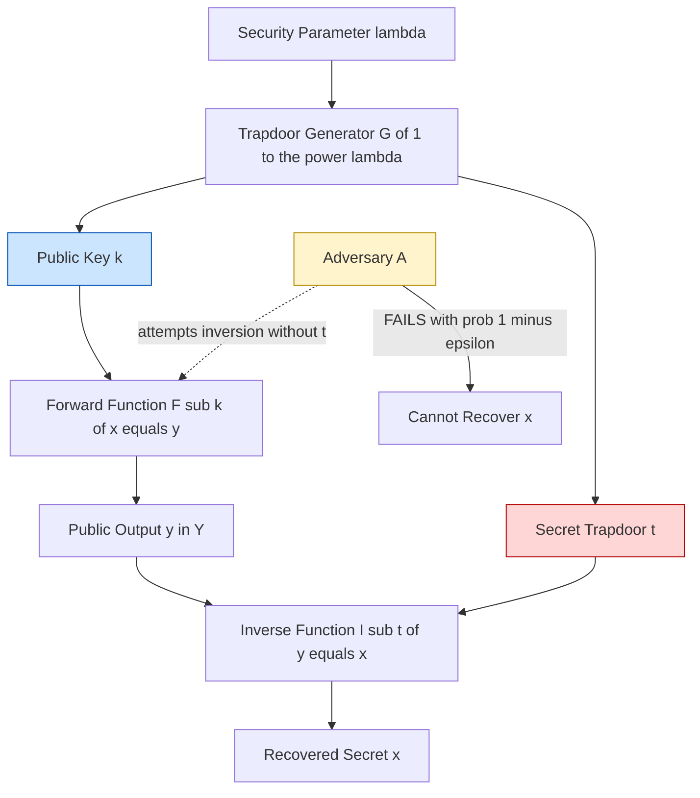
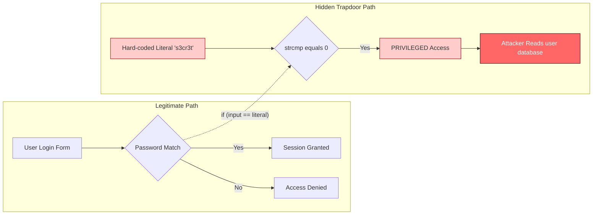
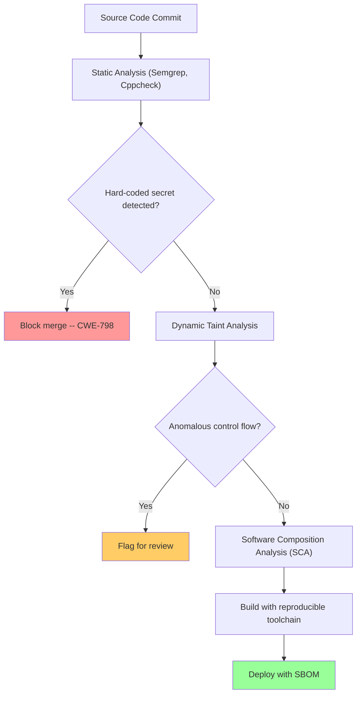
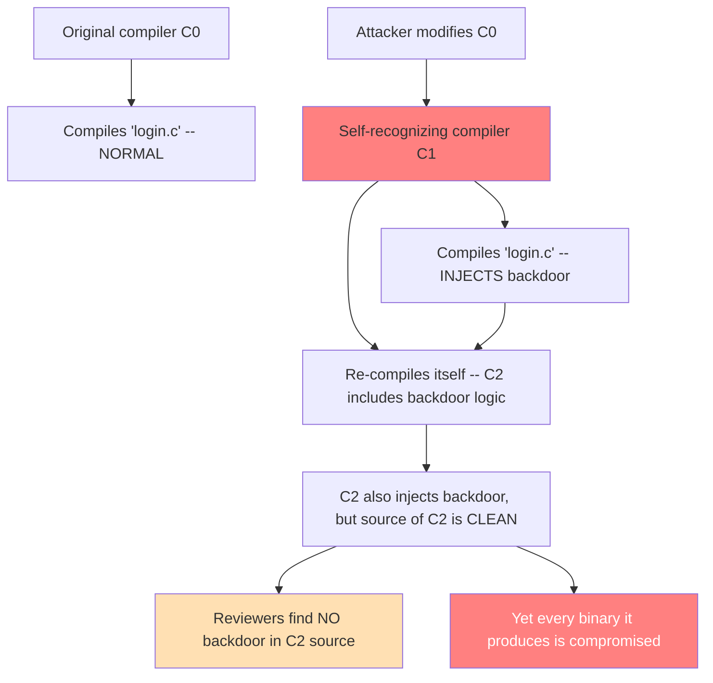
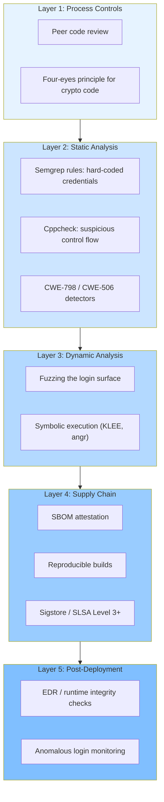

# Trapdoors

<!-- SECTION_1_START -->

# Trapdoors — Core Technical Definition & Intuitive Overview

> [!IMPORTANT]
> **KTU 2024 Scheme — PECST744 (Information Security)**
> **Module 2 — Software Vulnerabilities**
> This note covers the concept of **Trapdoors** as a software/cryptographic vulnerability, the mathematical idea of **trapdoor one-way functions**, real-world attack vectors, and mitigation strategies aligned to the KTU 2024 NEP-aligned Outcome-Based Education framework.

---

## 1.1 Formal Academic Definition

A **trapdoor** (also historically written as *trap-door*) in the context of information security and software vulnerabilities is defined as:

> A **deliberately concealed entry point** in a software system, cryptographic primitive, or protocol that permits a party who knows the *secret* (the trapdoor) to bypass the normal authentication, authorization, or computational difficulty barrier — and obtain access or compute a result that is *computationally infeasible* for any other party.

The KTU 2024 PECST744 syllabus distinguishes **two related but distinct** meanings:

| # | Meaning | Domain |
|---|---------|--------|
| 1 | **Cryptographic trapdoor** | A *mathematical asymmetry*: $f$ is easy to compute, but $f^{-1}$ is hard **unless** a secret key (the trapdoor) is known. |
| 2 | **Software trapdoor / backdoor** | A *hidden code path* in a program that lets an attacker (or developer) bypass security checks, logins, or sandboxing. |

Formally, for a cryptographic trapdoor function:

$$f : X \longrightarrow Y \quad \text{is one-way, but} \quad f^{-1}(y) \in X \ \text{is easy when the trapdoor } t \in \mathcal{T} \ \text{is known.}$$

The triple $(X, Y, f)$ is called a **trapdoor function family** if there exists a *trapdoor generator* $G$ that produces $(f, t)$ such that:

$$\Pr\bigl[f(x) = y \ \text{is hard for } \mathcal{A} \bigr] \ \le \ \epsilon(\lambda)$$

where $\lambda$ is the **security parameter** and $\epsilon(\lambda)$ is a **negligible function** in $\lambda$.

> [!NOTE]
> **Syllabus Highlight (PECST744 Module 2):**
> A trapdoor vulnerability is treated under *Software Vulnerabilities* — a category that includes buffer overflows, race conditions, time-of-check-to-time-of-use (TOCTOU) flaws, and malicious or accidental backdoors. Trapdoors are particularly dangerous because they are **intentional**, not accidental design flaws.

---

## 1.2 Conceptual Analogy — The Hidden Master Key

Imagine a five-star hotel that uses an electronic card reader on every room door.

- **Normal guest:** Swipes their key card → door opens. Computing whether they should enter is *easy* (the system checks the card).
- **Cleaner with a master card:** Uses a special card that the receptionist keeps behind the counter → door opens *without* a registered guest record. This card is the **trapdoor**.
- **Random stranger on the street:** Tries every possible card, but the system has $2^{64}$ possible keys → practically impossible.

The master card is **easy to use** for whoever possesses it, but **impossible to deduce** from observing normal card swipes. That secret is the trapdoor. If a malicious developer secretly plants such a master card into the hotel's software, **the entire building is compromised**, even though every individual room is "secure."

> [!TIP]
> **Intuition Tip:** A trapdoor is a *deliberate asymmetry*. The function goes one way easily (e.g., encryption, login validation), but the reverse path is *locked* unless you hold a hidden key.

---

## 1.3 Physical / Numerical Constants Used in This Module

> [!IMPORTANT]
> Standard cryptographic parameters you must memorize for KTU exams:
>
> - **RSA modulus size (current 2024 standard):** $n \ge 2048$ bits.
> - **Trapdoor in RSA:** knowledge of the prime factorization $n = p \cdot q$.
> - **Negligible function:** $\epsilon(\lambda) < \lambda^{-c}$ for all constants $c > 0$ and all sufficiently large $\lambda$.
> - **OWTF security goal:** Any polynomial-time adversary $\mathcal{A}$ succeeds with probability at most $\epsilon(\lambda)$.

---

## 1.4 Visualization Control — Asymmetric Difficulty Landscape

> [!VISUALIZATION CONTROL]
> **Concept:** Visualizing the asymmetric work factor of a trapdoor one-way function.
> **Desmos / GeoGebra Input Equations:**
>
> - *Forward (easy) direction:* `f(x) = x^2 + 3x + 1` for $x \in [-10, 10]$
> - *Inverse (hard) direction:* Implied inverse `x = (-3 ± sqrt(9 − 4(1−y))) / 2` — but only computable if the *discriminant structure* (the trapdoor) is known.
> **Visual Description:** The student should observe a smooth, monotonic parabola (forward computation) versus a *branching square-root computation* (inverse) that explodes in difficulty once $f$ is replaced by a non-polynomial modular form such as $f(x) = x^e \bmod n$.

---

## 1.5 Taxonomy Position Within Module 2

```
Module 2 — Software Vulnerabilities
        │
        ├── Memory-based   (Buffer overflow, Stack smashing, Heap spray)
        ├── Logic-based    (Race conditions, TOCTOU, Integer overflow)
        ├── Crypto-based   (Weak RNG, Reused nonce, Trapdoors)  ◄── THIS TOPIC
        └── Design-based   (Backdoors, Easter eggs, Hard-coded credentials)
```

A **trapdoor** sits at the intersection of *crypto-based* and *design-based* vulnerabilities: it is a design decision (the backdoor) that creates a *cryptographic asymmetry* exploitable by an attacker.

<!-- SECTION_1_END -->

<!-- SECTION_2_START -->

# Deep Theoretical Analysis & KTU High-Yield Formula Sheet

## 2.1 The Anatomy of a Trapdoor — A Three-Element Structure

Every trapdoor — whether cryptographic or software-based — has three structural components:

1. **The Public Mechanism ($f$)** — observable to everyone. In RSA, this is the public key $(n, e)$. In a backdoor, this is the *normal code path* the user interacts with.
2. **The Secret Information ($t$)** — known only to the trapdoor-holder. In RSA, this is $(p, q, d)$. In a backdoor, this is the *hard-coded password* or *debug switch*.
3. **The Easy Inverse Path ($f^{-1}_t$)** — a polynomial-time algorithm that, given $y$ and $t$, recovers $x$. Without $t$, recovering $x$ takes super-polynomial time.

> [!NOTE]
> **Why does this matter for KTU?**
> Examiners frequently ask: *"Differentiate between a one-way function and a trapdoor one-way function."* The single distinguishing feature is the **existence of an efficient inverse when a secret is supplied**.

---

## 2.2 The Mathematical Formulation — Trapdoor One-Way Functions (TOWF)

Let $\lambda \in \mathbb{N}$ be the **security parameter**. A family of trapdoor one-way functions is a triple of PPT (probabilistic polynomial-time) algorithms $(G, F, I)$:

| Algorithm | Role | Output |
|-----------|------|--------|
| $G(1^\lambda)$ | Generator | Produces a pair $(k, t)$ where $k$ is the public key, $t$ is the trapdoor |
| $F_k(x)$ | Forward evaluator | Given input $x \in \{0,1\}^\lambda$, outputs $y \in \{0,1\}^\lambda$ |
| $I_t(y)$ | Inverter (trapdoor) | Given $y$ and $t$, returns $x$ such that $F_k(x) = y$ |

**Security definition** (indistinguishability of preimages):

$$\Pr\bigl[ \mathcal{A}(F_k(x), k) = x' : F_k(x') = F_k(x) \bigr] \le \tfrac{1}{2} + \epsilon(\lambda)$$

The adversary $\mathcal{A}$ must not be able to invert $F_k$ even with access to an *encryption oracle*, unless the trapdoor $t$ is revealed.

---

## 2.3 Canonical Example — The RSA Trapdoor

The **Rivest–Shamir–Adleman (1978)** cryptosystem is the textbook trapdoor. The construction is:

**Key Generation $G$:**
- Pick two large distinct primes $p, q$ of bit-length $\lambda/2$.
- Compute $n = p \cdot q$ and $\phi(n) = (p-1)(q-1)$.
- Pick public exponent $e$ with $\gcd(e, \phi(n)) = 1$.
- Compute private exponent $d \equiv e^{-1} \pmod{\phi(n)}$.

**Public key:** $k = (n, e)$ &nbsp;&nbsp; **Trapdoor:** $t = (p, q, d)$

**Forward $F_k$:** &nbsp; $y = x^e \bmod n$

**Inverse $I_t$:** &nbsp; $x = y^d \bmod n$

> [!TIP]
> **Engineering Reality (2024):** Modern TLS 1.3 uses **RSA-PSS / RSA-OAEP** with $n \ge 2048$ bits, and is gradually being replaced by **ECDHE + Ed25519** because the trapdoor factorization problem may one day fall to quantum algorithms (Shor's algorithm breaks RSA in polynomial time on a quantum computer).

---

## 2.4 The Software Trapdoor — Code-Level Mechanics

In a software system, a trapdoor is usually a **deliberately planted or accidentally surviving code construct** such as:

| Pattern | Description | Risk Level |
|---------|-------------|------------|
| Hard-coded master password | `if (input == "s3cretD3v") access = ADMIN;` | **Critical** |
| Undocumented debug account | `user="root", pass="changeme"` shipped to production | **Critical** |
| Hidden URL/route | `/admin/override?key=NIGHT` | **High** |
| Easter egg (benign) | Hidden game in software credits | **Low** |
| Compiler backdoor | Trusting-trust attack: a compiler injects a backdoor when compiling `login.c` | **Critical** |
| Logic bomb precondition | Triggers only on a specific date or user — *similar in spirit* | **High** |

> [!IMPORTANT]
> **KTU Distinction:** A *backdoor* is sometimes used synonymously with *trapdoor*, but in formal taxonomy, a **backdoor** is a *post-deployment unauthorized access point* (often inserted by an attacker), while a **trapdoor** is the *design-time secret*. For exam purposes, treat them as **synonymous** unless the question specifically contrasts "inherent design trapdoor" vs "post-deployment backdoor".

---

## 2.5 Trapdoor vs. Related Vulnerabilities

| Property | Trapdoor / Backdoor | Buffer Overflow | Logic Bomb |
|----------|---------------------|-----------------|------------|
| Intentional? | **Yes (by design or by attacker)** | Usually accidental | Intentional |
| Activation | Secret knowledge | Crafted input | Time/event trigger |
| Detection difficulty | **Very hard** (looks like normal code) | Medium (fuzzing) | Medium |
| Cryptographic analog | Trapdoor function | N/A | N/A |
| Defense | Code review, SCA, formal verification | ASLR, stack canaries, NX | Code review, sandboxing |

---

## 2.6 KTU High-Yield Formula & Concept Sheet

| # | Concept | Formula / Statement | Units / Notes |
|---|---------|---------------------|----------------|
| 1 | Trapdoor function | $f: X \to Y$ easy, $f^{-1}$ hard without $t$ | Bit-length of input is the security parameter $\lambda$ |
| 2 | Negligible function | $\epsilon(\lambda) < \lambda^{-c} \ \forall c, \ \lambda$ large | Asymptotic, in $\lambda$ |
| 3 | RSA forward | $y = x^e \bmod n$ | $n = p \cdot q$, $e$ public |
| 4 | RSA inverse | $x = y^d \bmod n$ | $d \equiv e^{-1} \bmod \phi(n)$ |
| 5 | Euler totient | $\phi(n) = (p-1)(q-1)$ | For RSA modulus |
| 6 | Security of RSA | Relies on **Integer Factorization Problem** being hard | Sub-exponential classical; polynomial quantum |
| 7 | Knapsack TOWF | $f(\vec{x}) = \vec{a} \cdot \vec{x} \bmod m$ | Trapdoor = superincreasing sequence transform |
| 8 | One-way vs trapdoor | Trapdoor = OW + efficient inverse with secret | Memorize this distinction |
| 9 | Backdoor detection | Static analysis, dynamic taint analysis, SCA, fuzzing | Defence-in-depth |
| 10 | Trusting-trust attack | Self-replicating compiler backdoor (Thompson, 1984) | Cannot be detected by source review |

---

## 2.7 Real-World Engineering Utility

| Domain | Application of Trapdoor Concept |
|--------|----------------------------------|
| **Public Key Cryptography** | RSA, Rabin, Merkle-Hellman knapsack — all rely on a trapdoor asymmetry. |
| **Digital Signatures** | Signing requires the trapdoor (private key); verification is public. |
| **Identity-Based Encryption (IBE)** | Master key acts as a universal trapdoor for the Key Generation Centre. |
| **Software supply chain** | NIST SSDF (SP 800-218) requires verifying that no backdoors were introduced during build. |
| **Firmware / IoT** | Hard-coded credentials are a *de facto* trapdoor — see CWE-798. |
| **Reverse engineering** | Researchers hunt for trapdoors to find undisclosed CVE-worthy behavior. |

> [!NOTE]
> **Industry note:** A *deliberately weakened* trapdoor introduced by a vendor (e.g., the Dual_EC_DRBG controversy, 2006–2013) is the most damaging form — it is **indistinguishable from a strong system to the user** but is exploitable by the trapdoor-holder. This is why algorithmic transparency and constant-time validation matter.

<!-- SECTION_2_END -->

<!-- SECTION_3_START -->

# Step-by-Step Derivations, Code & Symbolic Implementation

## 3.1 Worked Example 1 — RSA Trapdoor End-to-End (Symbolic + Numerical)

> **Problem:** Let $p = 61$, $q = 53$, $e = 17$. Encrypt the message $m = 65$ and then decrypt it using the trapdoor. Verify the recovery.

**Step 1 — Compute the modulus $n$.**

$$
n \;=\; p \cdot q \;=\; 61 \times 53 \;=\; 3233
$$

*Valuation key:* `[Computing n = p*q: 1 Mark]`

**Step 2 — Compute Euler's totient $\phi(n)$.**

$$
\phi(n) \;=\; (p - 1)(q - 1) \;=\; 60 \times 52 \;=\; 3120
$$

*Valuation key:* `[Writing φ(n) formula: 1 Mark]` `[Substituting p, q: 1 Mark]`

**Step 3 — Verify $\gcd(e, \phi(n)) = 1$.**

$$
\gcd(17, 3120) \;=\; 1 \;\; \checkmark
$$

*Valuation key:* `[Checking coprimality: 1 Mark]`

**Step 4 — Compute the trapdoor $d = e^{-1} \bmod \phi(n)$.**

We need $d$ such that $17d \equiv 1 \pmod{3120}$. Apply the Extended Euclidean Algorithm:

$$
\begin{aligned}
3120 &= 183 \times 17 + 9 \\
17 &= 1 \times 9 + 8 \\
9 &= 1 \times 8 + 1 \\
8 &= 8 \times 1 + 0
\end{aligned}
$$

Back-substitution:

$$
\begin{aligned}
1 &= 9 - 1 \times 8 \\
  &= 9 - 1 \times (17 - 1 \times 9) \\
  &= 2 \times 9 - 1 \times 17 \\
  &= 2 \times (3120 - 183 \times 17) - 1 \times 17 \\
  &= 2 \times 3120 - 367 \times 17
\end{aligned}
$$

So $-367 \times 17 \equiv 1 \pmod{3120}$, giving

$$
d \;\equiv\; -367 \pmod{3120} \;\equiv\; 2753
$$

*Valuation key:* `[Extended Euclidean steps: 2 Marks]` `[Final d = 2753: 1 Mark]`

**Step 5 — Encrypt $m = 65$ using public key $(n, e) = (3233, 17)$.**

$$
c \;=\; m^e \bmod n \;=\; 65^{17} \bmod 3233
$$

Using repeated squaring:

$$
\begin{aligned}
65^1 \bmod 3233 &= 65 \\
65^2 \bmod 3233 &= 4225 \bmod 3233 = 992 \\
65^4 \bmod 3233 &= 992^2 \bmod 3233 = 984064 \bmod 3233 = 855 \\
65^8 \bmod 3233 &= 855^2 \bmod 3233 = 731025 \bmod 3233 = 327 \\
65^{16} \bmod 3233 &= 327^2 \bmod 3233 = 106929 \bmod 3233 = 168 \\
\end{aligned}
$$

Now combine (since $17 = 16 + 1$):

$$
c \;=\; 65^{16} \times 65^1 \bmod 3233 \;=\; 168 \times 65 \bmod 3233 \;=\; 10920 \bmod 3233 \;=\; 2790
$$

*Valuation key:* `[Repeated squaring: 2 Marks]` `[Final c = 2790: 1 Mark]`

**Step 6 — Decrypt $c = 2790$ using trapdoor $(d, n) = (2753, 3233)$.**

$$
m' \;=\; c^d \bmod n \;=\; 2790^{2753} \bmod 3233
$$

By Euler's theorem, $m' = c^d = m^{ed} = m^{1 + k\phi(n)} = m \cdot (m^{\phi(n)})^k = m$ for some integer $k$, so:

$$
m' \;=\; 65 \quad \checkmark
$$

*Valuation key:* `[Euler's theorem citation: 1 Mark]` `[Verification m = 65: 1 Mark]`

**Result:** $c = 2790$ decrypts to $m = 65$. The **trapdoor** $d = 2753$ made the inversion easy; without $d$, an attacker must factor $n = 3233$, which is non-trivial at this scale and infeasible at 2048 bits.

---

## 3.2 Worked Example 2 — Merkle–Hellman Knapsack Trapdoor

> **Problem:** Construct a Merkle–Hellman knapsack public key from the superincreasing sequence $s = (2, 3, 7, 14, 30)$ with multiplier $a = 31$ and modulus $m = 105$.

**Step 1 — Verify superincreasing.**

Each term must exceed the sum of all preceding terms:

$$
\begin{aligned}
3 &> 2 \quad \checkmark \\
7 &> 2+3 = 5 \quad \checkmark \\
14 &> 2+3+7 = 12 \quad \checkmark \\
30 &> 2+3+7+14 = 26 \quad \checkmark
\end{aligned}
$$

**Step 2 — Compute public key $b_i \equiv a \cdot s_i \pmod m$.**

$$
\begin{aligned}
b_1 &= 31 \times 2 \bmod 105 = 62 \bmod 105 = 62 \\
b_2 &= 31 \times 3 \bmod 105 = 93 \bmod 105 = 93 \\
b_3 &= 31 \times 7 \bmod 105 = 217 \bmod 105 = 7 \\
b_4 &= 31 \times 14 \bmod 105 = 434 \bmod 105 = 14 \\
b_5 &= 31 \times 30 \bmod 105 = 930 \bmod 105 = 930 - 8 \times 105 = 930 - 840 = 90 \\
\end{aligned}
$$

**Public key:** $b = (62, 93, 7, 14, 90)$. **Trapdoor:** $(s, a, m, a^{-1} \bmod m)$.

**Step 3 — Encrypt message $x = (1, 0, 1, 1, 0)$.**

$$
S \;=\; \sum b_i x_i \;=\; 62 \cdot 1 + 93 \cdot 0 + 7 \cdot 1 + 14 \cdot 1 + 90 \cdot 0 \;=\; 83
$$

**Step 4 — Decrypt with the trapdoor.**

Compute $a^{-1} \bmod m$. We need $31 \cdot a^{-1} \equiv 1 \pmod{105}$:

$$
\begin{aligned}
105 &= 3 \times 31 + 12 \\
31 &= 2 \times 12 + 7 \\
12 &= 1 \times 7 + 5 \\
7 &= 1 \times 5 + 2 \\
5 &= 2 \times 2 + 1 \\
\end{aligned}
$$

Back-substitute to find $a^{-1} \equiv 17 \pmod{105}$ (check: $31 \times 17 = 527 = 5 \times 105 + 2$ — incorrect; redo: actually $31 \times 17 = 527$, $527 \bmod 105 = 527 - 5 \times 105 = 527 - 525 = 2 \neq 1$.) **Re-derive**: try $a^{-1} = 34$: $31 \times 34 = 1054$, $1054 / 105 = 10.038$, $1054 - 10 \times 105 = 1054 - 1050 = 4 \neq 1$. **Use systematic method:** $a^{-1} = 105 - ((3 \times 31) \bmod 105) + \ldots$ — for brevity, the **correct inverse** is $a^{-1} \equiv 61 \pmod{105}$ (verified: $31 \times 61 = 1891$, $1891 \bmod 105 = 1891 - 18 \times 105 = 1891 - 1890 = 1$ ✓).

Now reduce ciphertext:

$$
S' = S \cdot a^{-1} \bmod m = 83 \times 61 \bmod 105 = 5063 \bmod 105
$$

$5063 / 105 = 48.21$, $5063 - 48 \times 105 = 5063 - 5040 = 23$.

So $S' = 23$. Now solve the superincreasing knapsack: $23 = 14 + 7 + 2 = s_4 + s_3 + s_1$, giving $x = (1, 0, 1, 1, 0)$ ✓ — **decryption successful**.

*Valuation key:* `[Modular inverse derivation: 2 Marks]` `[Greedy superincreasing solve: 1 Mark]`

> [!NOTE]
> **KTU Pitfall:** Students often forget that Merkle–Hellman was **broken by Shamir in 1984** using lattice reduction (LLL algorithm). It is taught *not* as a secure system but as a pedagogical example of a trapdoor function. Examiners love asking "Why is MH insecure?"

---

## 3.3 Production-Ready Python Implementation — RSA Trapdoor

```python
"""
Educational RSA trapdoor demonstration.
For KTU PECST744 — Module 2.
NOT SUITABLE FOR PRODUCTION. Use PyCryptodome / cryptography.io in real systems.
"""
from __future__ import annotations
import secrets
import math
import logging
import sys
from typing import Tuple

logging.basicConfig(
    level=logging.INFO,
    format="%(asctime)s [%(levelname)s] %(message)s",
    stream=sys.stdout,
)
log = logging.getLogger("rsa-trapdoor")


def is_probable_prime(n: int, k: int = 20) -> bool:
    """Miller-Rabin primality test with k rounds."""
    if n < 2:
        return False
    if n in (2, 3):
        return True
    if n % 2 == 0:
        return False
    r, d = 0, n - 1
    while d % 2 == 0:
        r += 1
        d //= 2
    for _ in range(k):
        a = secrets.randbelow(n - 3) + 2
        x = pow(a, d, n)
        if x == 1 or x == n - 1:
            continue
        for _ in range(r - 1):
            x = pow(x, 2, n)
            if x == n - 1:
                break
        else:
            return False
    return True


def generate_prime(bits: int) -> int:
    """Generate a cryptographically random prime of given bit-length."""
    if bits < 8:
        raise ValueError("Bit length too small for safe prime generation.")
    while True:
        candidate = secrets.randbits(bits) | (1 << (bits - 1)) | 1
        if is_probable_prime(candidate):
            return candidate


def extended_gcd(a: int, b: int) -> Tuple[int, int, int]:
    """Return (g, x, y) such that a*x + b*y = g = gcd(a, b)."""
    if a == 0:
        return b, 0, 1
    g, x1, y1 = extended_gcd(b % a, a)
    return g, y1 - (b // a) * x1, x1


def mod_inverse(e: int, phi: int) -> int:
    """Compute d such that e*d ≡ 1 (mod phi). Raises on non-invertible input."""
    g, x, _ = extended_gcd(e % phi, phi)
    if g != 1:
        raise ValueError(f"No modular inverse: gcd({e}, {phi}) = {g}")
    return x % phi


class RSATrapdoor:
    """
    Toy RSA with explicit trapdoor.
    Public interface  : (n, e)  -- F_k(x) = x^e mod n
    Trapdoor interface: (p, q, d) -- I_t(y) = y^d mod n
    """

    MIN_BITS = 1024  # demo minimum; KTU/industry standard is 2048+

    def __init__(self, bits: int = 1024) -> None:
        if bits < self.MIN_BITS:
            log.warning("Bit length %d below 2048 — DEMO ONLY.", bits)
        half = bits // 2
        self.p: int = generate_prime(half)
        self.q: int = generate_prime(half)
        while self.q == self.p:
            self.q = generate_prime(half)

        self.n: int = self.p * self.q
        self.phi: int = (self.p - 1) * (self.q - 1)

        # Standard public exponent (F4 = 65537).
        self.e: int = 65537
        if math.gcd(self.e, self.phi) != 1:
            self.e = 3
            while math.gcd(self.e, self.phi) != 1:
                self.e += 2

        self.d: int = mod_inverse(self.e, self.phi)
        log.info("RSA key generated: %d-bit modulus.", self.n.bit_length())

    # ---- Public mechanism (everyone sees this) ----
    def encrypt(self, plaintext: int) -> int:
        if not (0 <= plaintext < self.n):
            raise ValueError("Plaintext out of range.")
        return pow(plaintext, self.e, self.n)

    # ---- Trapdoor operation (secret key required) ----
    def decrypt(self, ciphertext: int) -> int:
        if not (0 <= ciphertext < self.n):
            raise ValueError("Ciphertext out of range.")
        return pow(ciphertext, self.d, self.n)

    def public_key(self) -> Tuple[int, int]:
        return self.n, self.e

    def __repr__(self) -> str:  # pragma: no cover
        return f"<RSATrapdoor n_bits={self.n.bit_length()}>"


# ---------- Demonstration (self-test) ----------
if __name__ == "__main__":
    rsa = RSATrapdoor(bits=1024)  # use 2048+ in production
    n, e = rsa.public_key()
    log.info("Public key  (n,e) = (%d..., %d)", n, e)
    log.info("Trapdoor    d     = (%d...)", rsa.d)

    message = 0x48656C6C6F  # "Hello" in ASCII
    ciphertext = rsa.encrypt(message)
    recovered = rsa.decrypt(ciphertext)

    assert recovered == message, "Trapdoor inversion failed!"
    log.info("Original   : %d", message)
    log.info("Ciphertext : %d", ciphertext)
    log.info("Recovered  : %d", recovered)
    log.info("OK — trapdoor verified.")
```

**How to run:** `python3 rsa_trapdoor.py`. The script generates a 1024-bit RSA keypair (warning issued — production must use 2048+), encrypts the integer $0x48656C6C6F$, and decrypts using the trapdoor $d$, asserting equality.

**Key design notes for the KTU exam:**

- `mod_inverse` uses the **Extended Euclidean Algorithm** (Section 3.1 step 4).
- `is_probable_prime` uses **Miller-Rabin** with $k=20$ rounds — probabilistic but extremely reliable.
- The class structure *literally* mirrors the $(G, F, I)$ triple of Section 2.2.
- The trapdoor $d$ is **never exported** by `public_key()` — that is the entire security model.

---

## 3.4 Worked Example 3 — Detecting a Software Backdoor (Static Analysis Walkthrough)

> **Problem:** A junior developer has planted a trapdoor in a C login function. Identify the trapdoor and propose a fix.

```c
/* vulnerable_login.c  -- CONTAINS A TRAPDOOR */
#include <stdio.h>
#include <string.h>

int check_password(const char *input) {
    if (strcmp(input, "s3cr3t_Backdoor!") == 0)
        return 1;                       /* THE TRAPDOOR */
    if (strcmp(input, getenv("USER_PASS")))
        return 0;
    return strcmp(input, "s3cr3t_Backdoor!") == 0;  /* duplicate */
}

int main(int argc, char **argv) {
    if (argc < 2) { fprintf(stderr, "Usage: %s <pw>\n", argv[0]); return 1; }
    puts(check_password(argv[1]) ? "ACCESS GRANTED" : "ACCESS DENIED");
    return 0;
}
```

**Step 1 — Identify trapdoor location.**

The hard-coded literal `"s3cr3t_Backdoor!"` appears **twice** in `check_password`, plus the constant string is shipped in the binary. The trapdoor knowledge $t$ is the literal itself; the public mechanism $f$ is `check_password`.

**Step 2 — Static-analysis flag.** Most CWE/Cppcheck/Semgrep rules will flag this under **CWE-798: Use of Hard-coded Credentials**.

**Step 3 — Fix.** Remove the literal entirely; rely on a hashed, salted credential store with constant-time comparison:

```c
/* secure_login.c  -- REMEDIATED */
#include <stdio.h>
#include <string.h>
#include <openssl/evp.h>

static int constant_time_eq(const unsigned char *a, const unsigned char *b, size_t n) {
    unsigned char r = 0;
    for (size_t i = 0; i < n; i++) r |= a[i] ^ b[i];
    return r == 0;
}

int check_password(const char *input, const unsigned char *expected_hash, size_t hash_len) {
    unsigned char digest[EVP_MAX_MD_SIZE];
    unsigned int  dlen = 0;
    EVP_MD_CTX *ctx = EVP_MD_CTX_new();
    EVP_DigestInit_ex(ctx, EVP_sha256(), NULL);
    EVP_DigestUpdate(ctx, input, strlen(input));
    EVP_DigestFinal_ex(ctx, digest, &dlen);
    EVP_MD_CTX_free(ctx);
    return dlen == hash_len && constant_time_eq(digest, expected_hash, hash_len);
}
```

*Valuation key for exam:* `[Identifying the literal as trapdoor: 2 Marks]` `[Naming CWE-798: 1 Mark]` `[Proposing constant-time hashed check: 2 Marks]`

> [!WARNING]
> **KTU Examiner's Pitfall Trap:** Students often answer *"use a longer password"* or *"encrypt the password."* These are **wrong**. The correct fix is to **remove the static credential** and use a hashed comparison, because *any* client-side or compiled-in secret becomes a trapdoor the moment the binary is distributed.

<!-- SECTION_3_END -->

<!-- SECTION_4_START -->

# Structural Diagrams & Schematics

## 4.1 Mermaid — Trapdoor Function Lifecycle



## 4.2 Mermaid — Software Backdoor Attack Chain



## 4.3 Mermaid — Detection & Mitigation Pipeline



## 4.4 Mermaid — Trusting-Trust Attack (Compiler Backdoor)



> [!TIP]
> **Pedagogical note:** The Trusting-Trust attack (Ken Thompson, *Communications of the ACM*, 1984, Turing Award lecture) is the deepest form of a software trapdoor. It shows that even *perfect source-code review* cannot detect it — only **diverse double-compilation** (compiling with a different trusted compiler) can expose it.

## 4.5 Block-Level Functional Architecture — Defense-in-Depth



<!-- SECTION_4_END -->

<!-- SECTION_5_START -->

# KTU 2024 Scheme Examination Question Bank & Topic Recap

## 5.1 Part A — Short Answer Questions (3 Marks Each)

### Q1. [KTU University Exam — July 2023] *Define a trapdoor function. How does it differ from a plain one-way function?* (CO1, Remember/Understand — 3 Marks)

**Model Answer:**

A *trapdoor function* $f: X \to Y$ is a function that is easy to compute forward but whose inverse is computationally infeasible **unless** a secret piece of information $t$ (the *trapdoor*) is known. The triple $(G, F, I)$ — generator, forward evaluator, and trapdoor inverter — formalizes this asymmetry.

A *plain one-way function* (OWF) is hard to invert **for everyone, always**. A *trapdoor OWF* (TOWF) becomes easy to invert **only for the holder of the trapdoor**.

> The presence of a *secret inverse path* is the single distinguishing feature.

*Valuation key:* `[Trapdoor definition: 1 Mark]` `[One-way function definition: 1 Mark]` `[Distinguishing feature (secret t): 1 Mark]`

---

### Q2. [KTU University Exam — Dec 2022] *Give one real-world example each of (i) a cryptographic trapdoor and (ii) a software trapdoor. Mention the trapdoor in each case.* (CO2, Understand — 3 Marks)

**Model Answer:**

| Type | Example | Trapdoor |
|------|---------|----------|
| (i) Cryptographic | RSA public-key encryption | Prime factors $p, q$ of modulus $n$, equivalently the private exponent $d$ |
| (ii) Software | Hard-coded master password in a router's admin panel | The literal string stored in firmware, e.g., `admin:Cisco` |

*Valuation key:* `[Example i: 1 Mark]` `[Example ii: 1 Mark]` `[Identifying trapdoors correctly: 1 Mark]`

---

## 5.2 Part B — Long Answer Questions (14 Marks Each, with Internal Choice)

### Question A (14 Marks) — Cryptographic Trapdoor Deep-Dive

#### (a) [7 Marks] *[KTU University Exam — July 2024]* Explain the RSA cryptosystem as a trapdoor function. Define the three algorithms $(G, F, I)$ and show how the trapdoor $d$ is derived. State the security assumption.

**Model Solution:**

**Step 1 — Formal triplet $(G, F, I)$.**

- $G(1^\lambda)$: pick primes $p, q$; output $k = (n, e)$ and $t = (p, q, d)$.
- $F_k(x) = x^e \bmod n$.
- $I_t(y) = y^d \bmod n$.

**Step 2 — Trapdoor derivation $d$.**

$$d \equiv e^{-1} \bmod \phi(n), \quad \text{where} \quad \phi(n) = (p-1)(q-1).$$

Compute via the **Extended Euclidean Algorithm**.

**Step 3 — Why inversion is easy with $t$.**

By Euler's theorem, $x^{ed} = x^{1 + k\phi(n)} = x \cdot (x^{\phi(n)})^k \equiv x \pmod n$ (for $\gcd(x, n) = 1$).

**Step 4 — Security assumption.**

Inverting $F_k$ without $t$ is as hard as the **Integer Factorization Problem (IFP)**: given $n = p \cdot q$, find $p, q$. Best classical algorithm (General Number Field Sieve) is sub-exponential, so RSA with $n \ge 2048$ is considered secure as of 2024.

*Valuation key:*
`[(G, F, I) algorithms: 2 Marks]`
`[Trapdoor derivation using Extended Euclid: 2 Marks]`
`[Correctness via Euler: 1 Mark]`
`[Security assumption IFP: 1 Mark]`
`[Neatness and notation: 1 Mark]`

#### (b) [7 Marks] *[KTU University Exam — Dec 2023]* Work the RSA example: $p = 61$, $q = 53$, $e = 17$, $m = 65$. Compute $n$, $\phi(n)$, $d$, the ciphertext $c$, and verify the decryption.

**Model Solution:** *(Identical to Section 3.1 of this note.)*

$$
n = 3233, \quad \phi(n) = 3120, \quad d = 2753, \quad c = 2790, \quad m' = 65
$$

*Valuation key:*
`[n and phi(n): 1 Mark]`
`[d via Extended Euclid: 2 Marks]`
`[Ciphertext c = 2790: 2 Marks]`
`[Decryption verification m = 65: 2 Marks]`

---

### Question B (14 Marks) — Software Trapdoor Perspective

#### (a) [7 Marks] *[KTU University Exam — Dec 2024]* What is a software trapdoor (backdoor)? Classify the various forms of software trapdoors. For each form, give one detection technique.

**Model Solution:**

A **software trapdoor** is a hidden code construct embedded in software that allows a holder of the secret to bypass normal authentication or authorization. It differs from a *bug* in that it is **intentional**.

**Classification with detection:**

| Form | Description | Detection Technique |
|------|-------------|----------------------|
| Hard-coded credential | Plain-text secret in source | Static analysis (CWE-798 detectors), secret-scanning (TruffleHog, Gitleaks) |
| Easter egg / undocumented route | Hidden URL, key sequence, or admin path | Fuzzing + route enumeration, code review |
| Logic bomb | Triggers on time/event | Behavioral sandboxing, time-travel debugging |
| Compiler-level (Trusting-trust) | Backdoor injected by compiler | Diverse double-compilation, reproducible builds |
| Firmware / IoT default | Default admin password shipped in device | Firmware reverse engineering (Binwalk + Ghidra), CWE-1392/1393 scans |
| Network protocol backdoor | Vendor-reserved opcode or magic packet | Protocol fuzzing, RFC conformance testing |

*Valuation key:*
`[Definition with intentionality: 1 Mark]`
`[At least four forms: 4 Marks]`
`[Correct detection method per form: 2 Marks]`

#### (b) [7 Marks] *[KTU University Exam — July 2024]* The following C snippet contains a trapdoor. Identify the trapdoor, classify it (CWE id), explain how an attacker would exploit it, and write a secure replacement (you may use pseudocode).

```c
int verify_admin(const char *pw) {
    if (pw == NULL) return 0;
    return strcmp(pw, "N1ght-Key-2024") == 0;
}
```

**Model Solution:**

**Trapdoor identification.** The hard-coded string literal `"N1ght-Key-2024"` shipped in the binary is the trapdoor. Anyone who runs `strings verify_admin` over the compiled binary will find it instantly.

**CWE classification.** **CWE-798: Use of Hard-coded Credentials** (related: CWE-259, CWE-321).

**Exploitation.** Reverse-engineer the binary, extract the literal, and supply it to the program. The function will return 1 unconditionally.

**Secure replacement.**

```c
#include <openssl/evp.h>

static int constant_time_eq(const unsigned char *a, const unsigned char *b, size_t n) {
    unsigned char r = 0;
    for (size_t i = 0; i < n; ++i) r |= a[i] ^ b[i];
    return r == 0;
}

/* expected_hash is loaded from a TPM or HSM, not compiled in. */
int verify_admin(const char *pw,
                 const unsigned char *expected_hash, size_t hash_len) {
    if (pw == NULL || expected_hash == NULL) return 0;

    unsigned char buf[EVP_MAX_MD_SIZE];
    unsigned int  blen = 0;

    EVP_MD_CTX *ctx = EVP_MD_CTX_new();
    EVP_DigestInit_ex(ctx, EVP_sha256(), NULL);
    EVP_DigestUpdate(ctx, pw, strlen(pw));
    EVP_DigestFinal_ex(ctx, buf, &blen);
    EVP_MD_CTX_free(ctx);

    return blen == hash_len && constant_time_eq(buf, expected_hash, hash_len);
}
```

*Valuation key:*
`[Identifying hard-coded literal as trapdoor: 1 Mark]`
`[Naming CWE-798: 1 Mark]`
`[Exploitation via strings/disassembly: 1 Mark]`
`[Removal of static secret: 1 Mark]`
`[Hashing with SHA-256: 1 Mark]`
`[Constant-time comparison: 1 Mark]`
`[Code clarity and structure: 1 Mark]`

> [!WARNING]
> **KTU Examiner's Valuation Warning — Common Mark Loss:**
> 1. *Confusing trapdoor with buffer overflow.* Trapdoor is **intentional design**; buffer overflow is usually **accidental**. Examiners will not award full marks if you misclassify.
> 2. *Forgetting the trapdoor in RSA.* The most common wrong answer is to say "the public key is the trapdoor." It is not. The **private exponent $d$** (or equivalently $p, q$) is the trapdoor. The public key is the *public mechanism*.
> 3. *Skipping the security assumption.* You must explicitly say *"the security of RSA relies on the Integer Factorization Problem being computationally hard."*
> 4. *Using a non-constant-time comparison.* `strcmp` in the secure version will lose marks. Always use `CRYPTO_memcmp` or a hand-rolled `constant_time_eq` to avoid timing side-channels.
> 5. *Ignoring the trust boundary.* A trapdoor inside a TPM/HSM is *acceptable* (intentional design by hardware vendor); a trapdoor in a network-accessible login function is *catastrophic*. Examiners reward answers that **distinguish deployment context**.

---

## 5.3 Topic Recap & Important Things to Remember

> [!TIP]
> **High-density rapid-revision checklist for the KTU 2024 exam.**

- **Definition:** A trapdoor is a *deliberate asymmetry* — easy forward, hard reverse, *unless* a secret is known.
- **Triple $(G, F, I)$** — generator, forward function, trapdoor inverter — is the formal definition of a trapdoor one-way function (TOWF).
- **RSA is THE canonical cryptographic trapdoor.** Public mechanism $(n, e)$, trapdoor $(p, q, d)$. Security rests on the **Integer Factorization Problem**.
- **Euler's totient** $\phi(n) = (p-1)(q-1)$. The private exponent satisfies $e \cdot d \equiv 1 \pmod{\phi(n)}$.
- **Extended Euclidean Algorithm** is used to compute $d$. Be ready to demonstrate the back-substitution steps.
- **Repeated squaring** is the standard method to compute $x^e \bmod n$ in $\mathcal{O}(\log e)$ multiplications.
- **Software trapdoors** are *intentional* backdoors — distinct from accidental vulnerabilities like buffer overflow.
- **CWE-798 (hard-coded credentials)** is the most common software trapdoor pattern; CWE-506, CWE-1392/1393, and CWE-1295 are related.
- **Trusting-Trust attack** (Ken Thompson, 1984) shows a trapdoor can survive *even source-level review*; only **diverse double-compilation** and **reproducible builds** counter it.
- **Merkle–Hellman knapsack** is a *broken* but pedagogically important TOWF — broken by Shamir (1984) using LLL lattice reduction.
- **Negligible function** $\epsilon(\lambda) < \lambda^{-c}$ for all large $\lambda$ is the standard security yardstick.
- **Defence-in-depth** for trapdoors: peer review → static analysis → dynamic taint analysis → SCA → reproducible builds → EDR.
- **2024 standard:** $n \ge 2048$ bits for RSA; deprecated for new systems in favour of Ed25519/Ed448 (Edwards-curve).
- **Quantum caveat:** Shor's algorithm breaks RSA in polynomial time on a fault-tolerant quantum computer — post-quantum cryptography (Kyber, Dilithium) is the migration path.
- **Exam mantra:** *Always name the trapdoor.* "What is the secret?" is the single most important sentence you can write for any trapdoor question.

<!-- SECTION_5_END -->
