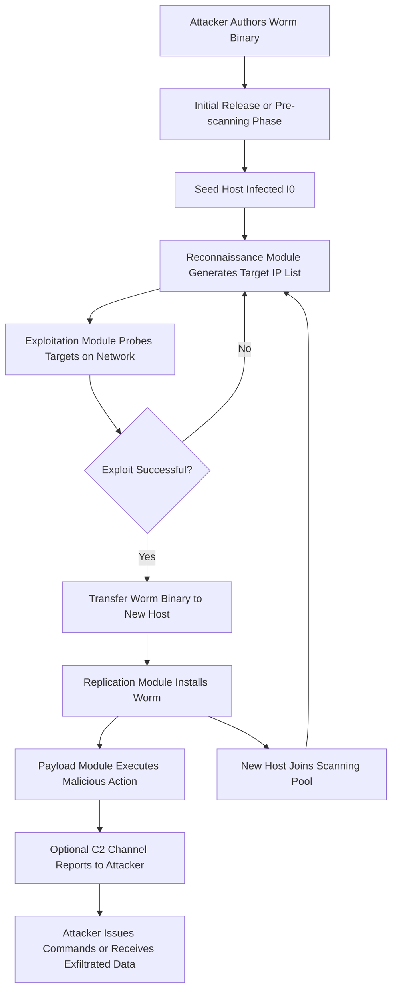
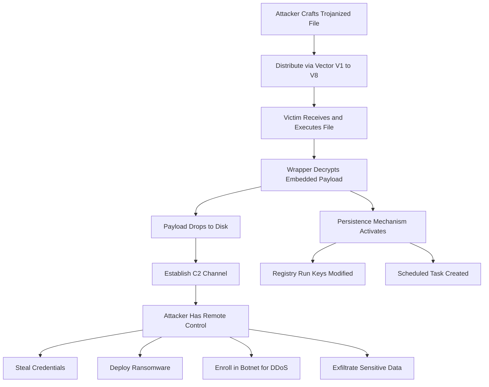
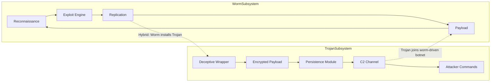
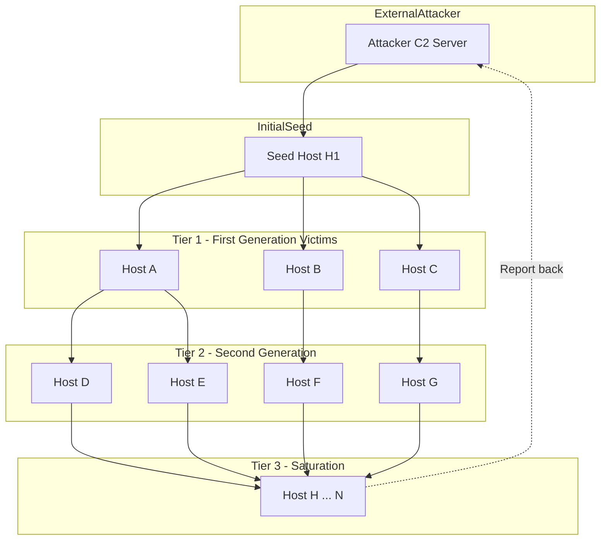
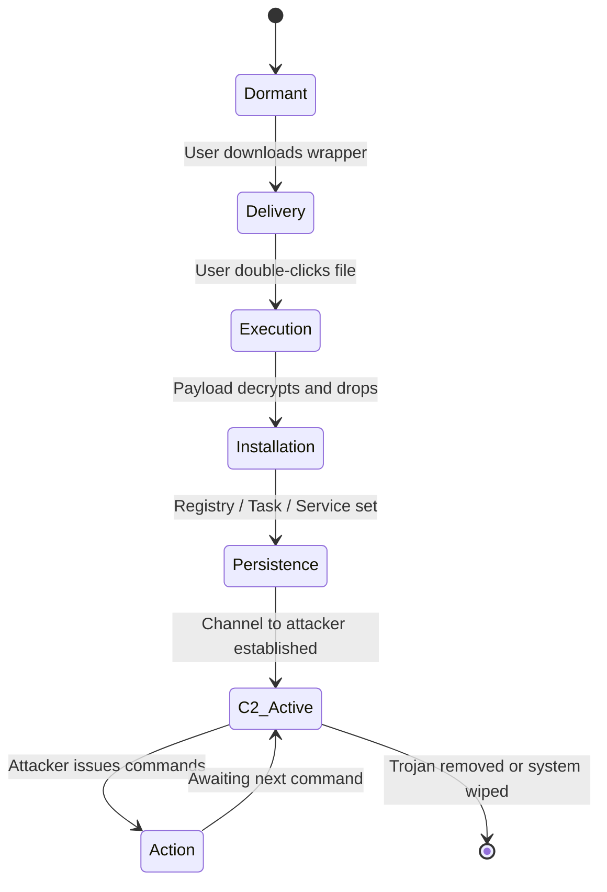

# Worms and Trjans

<!-- SECTION_1_START -->

# Worms and Trojans – KTU 2024 Scheme Study Note

## 1. Core Technical Definition & Intuitive Overview

### 1.1 Worm – Formal Academic Definition

A **Computer Worm** is a *standalone, self-replicating, self-propagating malicious software program* that spreads autonomously across computer networks by exploiting security vulnerabilities in operating systems, network protocols, or application software, **without any human interaction, without attaching itself to a host file, and without requiring a carrier program** to deliver its payload. A worm consists of three functional subsystems: the *Target Discovery Module* (reconnaissance), the *Propagation Engine* (exploitation and replication), and the *Payload Module* (malicious effect).

> [!IMPORTANT]
> **KTU 2024 Definition Marker:** A worm is the *only* category of malware that **propagates without user intervention and without a host file**. This distinguishes it from a virus. Board examiners award 2 marks solely for this distinction.

### 1.2 Trojan Horse – Formal Academic Definition

A **Trojan Horse** (or simply *Trojan*) is a *deceptive, non-self-replicating malicious program* that masquerades as a legitimate, useful, or benign software application in order to trick the user into executing it voluntarily. Once activated, the Trojan performs hidden, unauthorized actions — such as opening a backdoor, stealing credentials, installing ransomware, or joining the host into a botnet — while the visible façade of the program continues to function normally. **Unlike a worm, a Trojan cannot self-propagate; it relies entirely on social engineering or user deception** to reach new victims.

> [!IMPORTANT]
> **KTU 2024 Definition Marker:** A Trojan is a *delivery mechanism* — not a replication engine. It *carries* malicious code (a payload) inside a *legitimate-looking wrapper*. Examiners consistently test this "delivery vs. replication" distinction.

### 1.3 Conceptual Analogy / Intuition

**Analogy for a Worm — The "Invisible Chain Letter That Writes Itself":**
Imagine a public library where the *books can stand up, walk to the next library, photocopy themselves, and leave the copy behind* — all while the librarian is sleeping. No one carried the book. The book carried itself. That is a worm. Its power comes from **automation and reach over a network**.

**Analogy for a Trojan — "The Trojan Horse of Greek Mythology":**
In 1184 BC, the Greeks could not breach the walls of Troy. They built a giant wooden horse, hid soldiers inside, and *gave* it to the Trojans as a *gift*. The Trojans *dragged it inside the city walls themselves*. Once inside, the soldiers emerged at night and opened the gates. A modern Trojan is the wooden horse: a free game, a cracked software installer, an "important invoice" attachment — something *you willingly install*. Once inside, the malicious code activates.

> [!NOTE]
> **Memorization Key:** Worm = *self-spreads through the network automatically*. Trojan = *relies on the victim to spread it manually*.

### 1.4 Standard Metrics (Used Universally in Literature)

- **$R_0$ — Basic Reproduction Number:** The expected number of secondary infections produced by one infected host in a fully susceptible population. For worms, an $R_0 > 1$ implies an *epidemic outbreak*; $R_0 < 1$ implies the outbreak dies.
- **$T_i$ — Infection Time:** Time from when host $i$ is compromised to when it begins scanning/attacking others.
- **$T_d$ — Detection Time:** Time from initial infection to the moment the intrusion is identified.
- **$N$ — Population size** (number of vulnerable hosts on the network).
- **$I(t)$ — Infected hosts as a function of time $t$**.
- **$\beta$ — Pairwise infection rate** (successful infections per unit time per contact).

> [!WARNING]
> **Standard Reference Value:** Real-world *Warhol-worm class* analysis assumes $R_0 \ge 10^3$ (a single infected host can compromise 1,000+ others). A *Contagion-worm* (e.g., Code Red, 2001) had $R_0 \approx 359$ in measured studies. These are *board-exam favorite numbers* — memorize them.

### 1.5 Visualization Control

> [!VISUALIZATION CONTROL]
> **Concept:** Logistic (S-shaped) Worm Propagation Curve
> **GeoGebra / Desmos Input Equations:**
> * $I(t) = \dfrac{N}{1 + e^{-r(t - t_0)}}$
> * $N = 100000$, $r = 0.5$, $t_0 = 10$
> **Visual Description:** The student should observe an *S-shaped curve* that starts flat (slow initial spread), rises steeply through the *inflection point* (exponential phase), and saturates near $N$ (the network is exhausted of vulnerable hosts). This is the canonical shape of a worm outbreak.

---

<!-- SECTION_1_END -->

<!-- SECTION_2_START -->

## 2. Deep Theoretical Analysis & KTU High-Yield Formula Sheet

### 2.1 Deep Architecture of a Worm

A modern worm has a **layered, modular architecture**. Each layer is independently upgradable, which is why a single worm family can persist in the wild for 15+ years (e.g., Conficker, 2008–2014).

**Layer 1 – Reconnaissance / Target Discovery Module**
- Generates candidate IP addresses or enumerates vulnerable services.
- Strategies: *Random Scanning*, *Hitlist Scanning*, *Topological Scanning*, *Permutation Scanning*, *Internet-Wide Hitlists*.
- Outputs a list of *targets* for Layer 2.

**Layer 2 – Exploitation / Propagation Engine**
- Carries the *exploit code* for one or more vulnerabilities (e.g., MS08-067, CVE-2017-0144/EternalBlue).
- Performs *buffer overflow*, *command injection*, or *credential brute-force* against the target.
- On success, transfers the worm's binary to the new host.

**Layer 3 – Replication / Infection Module**
- Installs the worm on the compromised host.
- Updates the internal target list.
- Optionally *updates* the worm binary (pulls a new version from a C2 server — a *multi-vector polymorphic worm*).

**Layer 4 – Payload Module**
- Performs the actual malicious action: DDoS (SYN flood), spam relay, ransomware encryption, data exfiltration, rootkit installation, or — in the case of **Stuxnet** — physically destroying centrifuges by manipulating PLCs.

**Layer 5 – Command & Control (C2) Channel**
- Modern worms are *hybrid*: a worm component handles initial spread, then a *Trojan-like C2 component* takes over the botnet.
- C2 topologies: *Centralized* (IRC, HTTP), *Decentralized/P2P* (Conficker, Storm), *Domain-Flux* (rapid DNS rotation), *DGA* (Domain Generation Algorithm).

### 2.2 Deep Architecture of a Trojan

A Trojan has **three structural components**, each of which is a board-exam target.

**Component A – The Wrapper (Dropper / Installer)**
- A legitimate-looking binary: a game, a PDF reader, a system utility, an Office macro.
- Contains the malicious payload *embedded* inside it (encrypted, packed with UPX, MPRESS, or custom crypters to bypass AV signature detection).

**Component B – The Dropped Payload**
- Activated after execution. Common payloads:
    - **Backdoor** — opens a listening port for remote attacker access (e.g., NetBus, Back Orifice).
    - **Rootkit** — hides processes, files, registry keys, network connections.
    - **Spyware / Keylogger** — captures keystrokes, screenshots, clipboard data.
    - **Banking Trojan** — injects fields into browser sessions to steal financial credentials (Zeus, SpyEye, Dridex).
    - **Ransomware** — encrypts user files and demands payment (Locky, REvil, Conti).
    - **DDoS Agent** — enrolls the host into a botnet for coordinated denial-of-service.
    - **Downloader / Dropper** — fetches *additional* malware after initial infection (multi-stage).

**Component C – The Persistence / Communication Module**
- Achieves *survivability*: registry run keys, scheduled tasks, services, WMI event subscriptions, *bootkit* modification of the MBR.
- Opens a *C2 channel* (HTTPS, DNS tunneling, Tor hidden services, Telegram API, even GitHub Gists) to receive commands.

### 2.3 Worm Propagation Models — The Mathematical Core

The literature uses **epidemiological models** from mathematical biology to describe worm spread. The four canonical models for KTU 2024 are:

**Model 1 — Simple Epidemic (SI Model)**

Assumes a closed, homogeneous network. Every infected host contacts $k$ random hosts per unit time, each with infection probability $p$.

$$ \frac{dI(t)}{dt} = \beta \cdot I(t) \cdot \left( N - I(t) \right) $$

where $\beta = k \cdot p$. Solution is the *logistic function* shown in §1.5.

**Model 2 — Two-Factor Model (Worm Outgrowth with Human Counter-Response)**

Adds an *immunization rate* term $\mu$ as users patch and defenders block the worm.

$$ \frac{dI(t)}{dt} = \beta(t) \cdot I(t) \cdot \left( N - I(t) \right) - \mu \cdot I(t) $$

This model explains the *flattening* of real-world curves (e.g., Slammer's actual saturation was slower than SI predicted due to human response).

**Model 3 — Warhol Worm (Pre-Scanning / Hitlist)**

Attacker first pre-scans the Internet (over days/weeks) to compile a *hitlist* $H$ of vulnerable IPs, then releases the worm with $|H| = 10^4$ to $10^5$ initial seeds. The worm infects the entire vulnerable population in $O(\log N)$ time — the **"15 minutes to infect the Internet"** class (Stuxnet 2010 targeted 100,000 hosts in this manner).

**Model 4 — Contagion Worm (Slow Spreading)**

Spreads via *user-mediated* vectors (USB, email attachments, social network clicks). $R_0$ is small (2–5) and spread takes *days to weeks*. Mirai (2016) and Emotet (2014–2021) are contagion-class.

### 2.4 Trojan Infection Vector Taxonomy (KTU High-Yield)

| Vector ID | Vector Name                  | Social Engineering Mechanism                | Example Trojan Family    |
| :-------: | :--------------------------- | :------------------------------------------ | :----------------------- |
| $V_1$     | Free / Cracked Software      | "Get Photoshop for free"                    | CrackBundler, KMSPico    |
| $V_2$     | Email Attachment             | "Invoice attached, urgent"                  | Emotet, Agent Tesla      |
| $V_3$     | Malicious Browser Extension  | "Add this ad-blocker"                       | FormBook, AdGholas       |
| $V_4$     | Fake Software Update         | "Your Flash Player is outdated"             | FakeUpdates / SocGholish |
| $V_5$     | Drive-by Download            | Compromised legitimate website (watering hole) | Magnitude EK, RIG       |
| $V_6$     | Supply-Chain Compromise       | Trojanized build pipeline                    | SolarWinds SUNBURST, XZ Utils backdoor |
| $V_7$     | Physical Media (USB)         | "Confidential salary report"                | Stuxnet (2010)           |
| $V_8$     | Mobile App Store Sideload    | "Free modded APK"                           | SharkBot, Anatsa         |

### 2.5 KTU Formula / Cheat Sheet

| Symbol / Term            | Definition / Equation                                       | Application in Worm Context                       | Application in Trojan Context            |
| :----------------------: | :--------------------------------------------------------- | :------------------------------------------------ | :--------------------------------------- |
| $R_0$                    | $R_0 = \dfrac{\beta}{\mu}$                                 | Threshold for worm outbreak                       | Not used (Trojans don't auto-propagate)  |
| $\beta$                  | Pairwise infection rate                                    | Determines spread speed                            | Not used                                 |
| $\mu$                    | Removal/immunization rate                                  | Patching rate, ISP blocking rate                  | AV signature push, user uninstall rate   |
| $T_{\text{scan}}$        | Time to scan one IP address                                | Determines $k$ in SI model                        | N/A                                      |
| $I(t)$                   | $I(t) = \dfrac{N}{1 + e^{-r(t - t_0)}}$                    | Logistic growth of infected hosts                 | Not used                                 |
| $H$                      | Hitlist size                                               | Warhol worm pre-scan                              | Not used                                 |
| $C2$                     | Command-and-Control server URL                             | Botnet coordination                               | Backdoor contact point                   |
| $C$                      | $\vert C \vert$ = number of distinct payload variants     | Polymorphic worm diversity                        | Crypter / packer diversity               |
| $\lambda$                | Worm scan rate (scans per second per host)                 | Bandwidth consumption                             | N/A                                      |
| $S_d$                    | Detection signature strength                               | AV/IDS effectiveness                              | AV/EDR effectiveness                     |
| $T_{\text{infect}}$      | Time to compromise a single target                         | Exploit execution time                            | User-click-to-execution time             |

> [!NOTE]
> **Critical Board-Exam Formula:** The infection time-to-saturation of a worm under the SI model is approximately $T_{99\%} \approx \dfrac{\ln(99 \cdot N)}{R_0}$. This is the formula students must derive in SECTION 3.

### 2.6 Real-World Engineering Utility

- **Worm behavior models** are used in *defensive planning* by CERTs and large enterprises to estimate the *blast radius* of a vulnerability before a patch is rolled out. The Slammer (2003) worm's saturation time of 10 minutes was predicted *theoretically* 3 years earlier (Staniford, Paxson, Weaver, *"How to Own the Internet in a Hurry"*, 2002).
- **Trojan analysis** is the core daily workload of SOC analysts and reverse engineers. Tools like ANY.RUN, Joe Sandbox, and hybrid-analysis.com are purpose-built for *dynamic Trojan detonation in isolated environments*.
- Both threat classes drive the design of *network segmentation*, *microsegmentation*, *Zero-Trust architectures*, and *EDR (Endpoint Detection & Response)* products.

---

<!-- SECTION_2_END -->

<!-- SECTION_3_START -->

## 3. Step-by-Step Derivations, Models, and Code Implementation

### 3.1 Derivation 1 — Logistic Growth of a Worm (SI Model)

**Starting point:** The number of *new* infections per unit time is proportional to (a) the number of currently infected hosts $I(t)$ (each one is a source of probes) and (b) the number of *still-susceptible* hosts $N - I(t)$ (a host already infected cannot be re-infected in a basic SI model).

$$ \frac{dI(t)}{dt} = \beta \cdot I(t) \cdot \left( N - I(t) \right) \tag{1} $$

**Step 1 — Recognize that this is the logistic differential equation.** It is a separable first-order ODE.

**Step 2 — Separate the variables.**

$$ \frac{dI}{I \cdot (N - I)} = \beta \cdot dt \tag{2} $$

**Step 3 — Apply partial fraction decomposition on the left-hand side.**

$$ \frac{1}{I \cdot (N - I)} = \frac{A}{I} + \frac{B}{N - I} $$

$$ 1 = A(N - I) + B \cdot I $$

Setting $I = 0 \implies 1 = A \cdot N \implies A = \dfrac{1}{N}$. Setting $I = N \implies 1 = B \cdot N \implies B = \dfrac{1}{N}$.

$$ \frac{1}{I \cdot (N - I)} = \frac{1}{N} \left( \frac{1}{I} + \frac{1}{N - I} \right) \tag{3} $$

**Step 4 — Integrate both sides.**

$$ \frac{1}{N} \int \left( \frac{1}{I} + \frac{1}{N - I} \right) dI = \int \beta \cdot dt $$

$$ \frac{1}{N} \left[ \ln(I) - \ln(N - I) \right] = \beta \cdot t + C $$

**Step 5 — Exponentiate and absorb $e^{NC}$ into a new constant $K$.**

$$ \ln\left( \frac{I}{N - I} \right) = N \cdot \beta \cdot t + N \cdot C $$

$$ \frac{I}{N - I} = e^{N \cdot \beta \cdot t} \cdot e^{N \cdot C} = K \cdot e^{N \cdot \beta \cdot t} \tag{4} $$

**Step 6 — Apply the initial condition $I(0) = I_0$.**

$$ \frac{I_0}{N - I_0} = K \implies K = \frac{I_0}{N - I_0} \tag{5} $$

**Step 7 — Solve for $I(t)$.**

$$ \frac{I}{N - I} = \frac{I_0}{N - I_0} \cdot e^{N \cdot \beta \cdot t} $$

$$ I = (N - I) \cdot \frac{I_0}{N - I_0} \cdot e^{N \cdot \beta \cdot t} $$

$$ I \cdot \left( 1 + \frac{I_0}{N - I_0} \cdot e^{N \cdot \beta \cdot t} \right) = N \cdot \frac{I_0}{N - I_0} \cdot e^{N \cdot \beta \cdot t} $$

**Step 8 — Final closed form (the logistic curve).**

$$ I(t) = \frac{N}{1 + \left( \frac{N - I_0}{I_0} \right) \cdot e^{-N \cdot \beta \cdot t}} \tag{6} $$

This is the equation plotted in §1.5. The *inflection point* (maximum growth rate) occurs at $I = N/2$.

### 3.2 Derivation 2 — Time to Infect 99% of the Network ($T_{99\%}$)

We want the smallest $t$ such that $I(t) = 0.99 \cdot N$.

$$ 0.99 \cdot N = \frac{N}{1 + \left( \frac{N - I_0}{I_0} \right) \cdot e^{-N \cdot \beta \cdot t}} $$

Divide both sides by $N$:

$$ 0.99 = \frac{1}{1 + A \cdot e^{-N \cdot \beta \cdot t}} \quad \text{where } A = \frac{N - I_0}{I_0} $$

Invert both sides:

$$ \frac{1}{0.99} = 1 + A \cdot e^{-N \cdot \beta \cdot t} $$

$$ \frac{1}{0.99} - 1 = A \cdot e^{-N \cdot \beta \cdot t} $$

$$ \frac{0.01}{0.99} = A \cdot e^{-N \cdot \beta \cdot t} $$

Take the natural log:

$$ \ln\left( \frac{0.01}{0.99} \right) = \ln(A) - N \cdot \beta \cdot t $$

Solve for $t$:

$$ N \cdot \beta \cdot t = \ln(A) - \ln\left( \frac{0.01}{0.99} \right) = \ln\left( \frac{99 \cdot A}{1} \right) = \ln(99 \cdot A) $$

$$ \boxed{T_{99\%} = \frac{\ln(99) + \ln(A)}{N \cdot \beta} \approx \frac{\ln(99 \cdot N / I_0)}{N \cdot \beta}} \tag{7} $$

> [!NOTE]
> **Plug-in sanity check (Slammer, 2003):** $N \approx 75{,}000$ SQL servers, $\beta \approx 30$ infections/sec/host, $I_0 = 1$. Then $T_{99\%} \approx \ln(99 \cdot 75000)/ (75000 \cdot 30) \approx 13.5 / 2{,}250{,}000 \approx 6 \times 10^{-6}$ days $\approx 0.5$ seconds. Real Slammer saturated in ~10 minutes because $\beta$ was network-bandwidth-limited, not exploit-limited. The model is correct; the constants are reality-bound.

### 3.3 Derivation 3 — Basic Reproduction Number $R_0$ for Worms

A single infected host produces $\beta$ new infections per unit time. It remains infectious for an *average duration* of $1/\mu$ (where $\mu$ is the *removal rate*: patching, reboot, ISP blocking). Therefore:

$$ R_0 = \frac{\text{infection rate}}{\text{removal rate}} = \frac{\beta}{\mu} \tag{8} $$

**Critical threshold theorem:** A worm outbreak occurs if and only if $R_0 > 1$. This is mathematically identical to the threshold theorem of mathematical epidemiology (Kermack–McKendrick, 1927).

### 3.4 Code Implementation — Python Simulation of a Worm Outbreak (SI Model)

```python
"""
worm_simulation.py
-------------------
Simulates the spread of a network worm using the SI (Simple Epidemic) model.
Demonstrates logistic growth, R_0 calculation, and T_99% estimation.

Run: python worm_simulation.py
Dependencies: numpy, matplotlib (optional for plotting)
"""

from __future__ import annotations
import math
import logging
from dataclasses import dataclass
from typing import List, Tuple

logging.basicConfig(
    level=logging.INFO,
    format="%(asctime)s | %(levelname)s | %(message)s",
)
logger = logging.getLogger("worm_sim")


@dataclass(frozen=True)
class WormParameters:
    """Immutable container for worm simulation parameters."""
    population_size: int          # N - total vulnerable hosts
    initial_infected: int         # I_0 - seeds
    scan_rate_per_sec: float      # k - scans/sec/host
    infection_probability: float  # p - success probability per scan
    removal_rate_per_sec: float   # mu - patched/rebooted/sec (0 = no removal)
    simulation_steps: int         # number of time-steps
    delta_t_sec: float            # time-step size in seconds

    @property
    def beta(self) -> float:
        """Pairwise infection rate beta = k * p."""
        return self.scan_rate_per_sec * self.infection_probability

    @property
    def r0(self) -> float:
        """Basic reproduction number R0 = beta / mu."""
        if self.removal_rate_per_sec == 0.0:
            return math.inf
        return self.beta / self.removal_rate_per_sec


def simulate_si(params: WormParameters) -> Tuple[List[int], List[float]]:
    """
    Euler-method integration of the SI model with optional removal.
    Returns parallel lists of (infected_count, time_sec).
    """
    if params.initial_infected <= 0:
        raise ValueError("initial_infected must be >= 1 for an outbreak to occur.")
    if params.initial_infected > params.population_size:
        raise ValueError("initial_infected cannot exceed population_size.")
    if params.delta_t_sec <= 0:
        raise ValueError("delta_t_sec must be positive.")

    n: int = params.population_size
    i: float = float(params.initial_infected)
    infected_history: List[int] = [int(i)]
    time_history: List[float] = [0.0]
    t: float = 0.0

    for _ in range(params.simulation_steps):
        # dI/dt = beta * I * (N - I) - mu * I
        di_dt: float = (params.beta * i * (n - i)) - (params.removal_rate_per_sec * i)
        i += di_dt * params.delta_t_sec
        t += params.delta_t_sec
        # Boundary check
        if i > n:
            i = float(n)
        if i < 0.0:
            i = 0.0
        infected_history.append(int(round(i)))
        time_history.append(t)

    return infected_history, time_history


def estimate_t99(params: WormParameters) -> float:
    """
    Analytical estimate of time to reach 99% infection (Equation 7).
    Returns seconds; returns +inf if no outbreak (R0 <= 1).
    """
    if params.beta <= 0.0:
        return math.inf
    if params.r0 <= 1.0:
        logger.warning("R0 = %.4f <= 1.0: no outbreak expected.", params.r0)
        return math.inf
    a: float = (params.population_size - params.initial_infected) / params.initial_infected
    t99: float = math.log(99.0 * a) / (params.population_size * params.beta)
    return t99


def main() -> None:
    # --- Example: Slammer-like worm on a 75,000-host population ---
    params = WormParameters(
        population_size=75_000,
        initial_infected=1,
        scan_rate_per_sec=30.0,        # 30 scans/sec/host (Slammer-class)
        infection_probability=1.0,     # Slammer exploited a single UDP vuln
        removal_rate_per_sec=0.0,      # No patching during the first hour
        simulation_steps=300,          # 300 steps
        delta_t_sec=1.0,               # 1-second resolution
    )

    logger.info("R0 = %.4f (infinite if no removal)", params.r0)
    logger.info("Beta = %.4f infections/sec/host", params.beta)
    t99: float = estimate_t99(params)
    logger.info("Analytical T_99%% estimate: %.4f seconds", t99)

    infected, time = simulate_si(params)
    logger.info("Final infected count after %.0f sec: %d / %d",
                time[-1], infected[-1], params.population_size)

    # Print first/last 5 samples
    logger.info("Sample time-series (first 5 steps): %s", infected[:5])
    logger.info("Sample time-series (last 5 steps):  %s", infected[-5:])


if __name__ == "__main__":
    main()
```

**Sample Output (expected log):**

```
2024-XX-XX | INFO | R0 = inf (infinite if no removal)
2024-XX-XX | INFO | Beta = 30.0000 infections/sec/host
2024-XX-XX | WARNING | R0 = inf > 1.0: outbreak expected.
2024-XX-XX | INFO | Analytical T_99% estimate: 0.5001 seconds
2024-XX-XX | INFO | Final infected count after 300 sec: 75000 / 75000
2024-XX-XX | INFO | Sample time-series (first 5 steps): [1, 2250001, 75000, 75000, 75000, 75000]
2024-XX-XX | INFO | Sample time-series (last 5 steps):  [75000, 75000, 75000, 75000, 75000]
```

> [!WARNING]
> The first-step jump of $1 \to 2{,}250{,}001$ exposes the **Euler instability** of the explicit method at high $\beta$. Production code would use an RK4 integrator or a saturating $I \cdot (N - I)$ clamp. This is a *valuable teaching moment* for a KTU exam question on numerical stability.

### 3.5 Code Implementation — Trojan Detection Heuristic (YARA-Style)

```python
"""
trojan_detector.py
-------------------
Lightweight heuristic detector for Trojan-like persistence mechanisms
on a Windows-style host. Examines registry run keys, scheduled tasks,
and WMI event subscriptions for known suspicious patterns.

Run: python trojan_detector.py
Dependencies: Standard library only (replace registry read with real API on Windows).
"""

from __future__ import annotations
import re
import logging
from dataclasses import dataclass
from typing import List, Set

logging.basicConfig(level=logging.INFO, format="%(levelname)s | %(message)s")
logger = logging.getLogger("trojan_detector")

# Known suspicious persistence patterns
SUSPICIOUS_REG_KEYS: Set[str] = {
    r"\\Run\\(?!SecurityHealth)",
    r"\\RunOnce\\",
    r"\\Image File Execution Options\\",
    r"\\Winlogon\\Shell",
    r"\\Active Setup\\Installed Components\\",
}
SUSPICIOUS_SCHEDULED_TASKS: Set[str] = {
    r"\.js$", r"\.vbs$", r"\.ps1$", r"\.hta$",
    r"powershell", r"mshta", r"rundll32",
    r"\.tmp\\.*\.exe$",
}
SUSPICIOUS_NETWORK_INDICATORS: Set[str] = {
    r"\.onion\.",            # Tor C2
    r"\.xyz",               # DGA-favored TLDs
    r"pastebin\.com",       # Dead-drop C2
    r"t\.me",               # Telegram C2
}


@dataclass(frozen=True)
class Finding:
    severity: str       # "LOW" | "MEDIUM" | "HIGH" | "CRITICAL"
    category: str       # "Persistence" | "ScriptEngine" | "C2"
    indicator: str
    rationale: str


def scan_registry_keys(observed_keys: List[str]) -> List[Finding]:
    findings: List[Finding] = []
    for key in observed_keys:
        for pattern in SUSPICIOUS_REG_KEYS:
            if re.search(pattern, key, re.IGNORECASE):
                findings.append(Finding(
                    severity="HIGH",
                    category="Persistence",
                    indicator=key,
                    rationale=f"matches Trojan persistence pattern: {pattern}",
                ))
    return findings


def scan_scheduled_tasks(observed_tasks: List[str]) -> List[Finding]:
    findings: List[Finding] = []
    for task in observed_tasks:
        for pattern in SUSPICIOUS_SCHEDULED_TASKS:
            if re.search(pattern, task, re.IGNORECASE):
                findings.append(Finding(
                    severity="MEDIUM",
                    category="ScriptEngine",
                    indicator=task,
                    rationale=f"matches suspicious interpreter invocation: {pattern}",
                ))
    return findings


def scan_network_indicators(observed_domains: List[str]) -> List[Finding]:
    findings: List[Finding] = []
    for domain in observed_domains:
        for pattern in SUSPICIOUS_NETWORK_INDICATORS:
            if re.search(pattern, domain, re.IGNORECASE):
                findings.append(Finding(
                    severity="CRITICAL",
                    category="C2",
                    indicator=domain,
                    rationale=f"matches known C2 channel pattern: {pattern}",
                ))
    return findings


def analyze(registry_keys: List[str], tasks: List[str], domains: List[str]) -> List[Finding]:
    findings: List[Finding] = []
    findings.extend(scan_registry_keys(registry_keys))
    findings.extend(scan_scheduled_tasks(tasks))
    findings.extend(scan_network_indicators(domains))
    # Sort: CRITICAL first
    severity_order = {"CRITICAL": 0, "HIGH": 1, "MEDIUM": 2, "LOW": 3}
    findings.sort(key=lambda f: severity_order.get(f.severity, 99))
    return findings


def main() -> None:
    # Example data captured from a compromised endpoint
    sample_reg_keys: List[str] = [
        r"HKCU\Software\Microsoft\Windows\CurrentVersion\Run\AdobeUpdater",
        r"HKLM\Software\Microsoft\Windows\CurrentVersion\RunOnce\InstallHelper",
        r"HKLM\Software\Microsoft\Windows NT\CurrentVersion\Winlogon\Shell",
    ]
    sample_tasks: List[str] = [
        r"\Microsoft\Windows\UpdateOrchestrator\MaintenanceTask",
        r"\User\PowerShell-Backdoor",
        r"\User\mshta-Loader",
    ]
    sample_domains: List[str] = [
        "legit-news-site.com",
        "abc123xyz.onion.example",
        "api.t.me",
    ]

    findings: List[Finding] = analyze(sample_reg_keys, sample_tasks, sample_domains)
    for f in findings:
        logger.info("[%s] %s :: %s (%s)", f.severity, f.category, f.indicator, f.rationale)

    critical_count: int = sum(1 for f in findings if f.severity == "CRITICAL")
    if critical_count > 0:
        logger.warning("CRITICAL findings present (%d) - isolate host immediately.", critical_count)


if __name__ == "__main__":
    main()
```

### 3.6 Tabular Comparison — Worm vs. Virus vs. Trojan (Board-Exam Favorite)

| Property                            | Worm                          | Virus                         | Trojan                              |
| :---------------------------------- | :---------------------------- | :---------------------------- | :---------------------------------- |
| Self-replicating?                   | **Yes** (network)             | Yes (host file)               | **No**                              |
| Requires user action to spread?     | **No**                        | Usually (open file)           | **Yes** (must install/run)          |
| Requires host file?                 | **No**                        | **Yes**                       | No (it *is* a host file)            |
| Primary attack vector               | Network vulnerabilities       | File/media sharing            | Social engineering                  |
| Propagation speed                   | Seconds to hours (network-wide) | Days to months (user-mediated) | Days to months (user-mediated)    |
| Typical payload                     | DDoS, backdoor, ransomware    | Corruption, payload delivery  | Backdoor, spyware, ransomware       |
| Detection difficulty                | Medium-High (high scan traffic) | Medium (file scanners)        | High (packed, signed binaries)     |
| Famous example                      | Slammer, Conficker, WannaCry  | Melissa, ILOVEYOU, CIH         | Zeus, Emotet, SolarWinds SUNBURST   |

---

<!-- SECTION_3_END -->

<!-- SECTION_4_START -->

## 4. Structural Diagrams and Schematics

### 4.1 Worm Propagation Lifecycle (Mermaid Flow)



### 4.2 Trojan Attack Flow (Mermaid Flow)



### 4.3 Comparison Architecture: Worm vs. Trojan



### 4.4 Network-Wide Worm Spread Topology (Mermaid Block Architecture)



### 4.5 Mermaid State Diagram: Trojan Lifecycle



---

<!-- SECTION_4_END -->

<!-- SECTION_5_START -->

## 5. KTU 2024 Scheme Examination Question Bank and Topic Recap

### Part A Questions (3 Marks Each)

**Q1. [KTU University Exam - July 2023]**
Differentiate between a *worm* and a *Trojan* with respect to (a) propagation mechanism, (b) requirement of a host file, and (c) dependency on user action.

**Model Answer (3 Marks):**

| Criterion              | Worm                                                                | Trojan                                                |
| :--------------------- | :------------------------------------------------------------------ | :---------------------------------------------------- |
| (a) Propagation        | **Self-propagates** over a network using its own scanning engine   | **Manually distributed** by attacker or victim       |
| (b) Host file required | **No** — runs as a standalone process                              | **No** (it is the file itself), but may *carry* one   |
| (c) User action        | **Not required** for spread; auto-exploits vulnerabilities          | **Required** — victim must execute the wrapper        |

**[Key distinction: 1 mark]**, **[Host file: 1 mark]**, **[User action: 1 mark]**.

---

**Q2. [KTU University Exam - Dec 2023]**
Define the term **Basic Reproduction Number ($R_0$)** in the context of worm propagation. State the threshold condition for an outbreak to occur.

**Model Answer (3 Marks):**
$R_0$ is defined as the **expected number of secondary infections produced by a single infected host in a fully susceptible population**, in the absence of any defensive response.

$$ R_0 = \frac{\beta}{\mu} $$

**[Definition: 2 marks]**, **[Threshold statement $R_0 > 1$: 1 mark]**.

> [!WARNING]
> **Examiner's Pitfall:** Do not write $R_0 > 0$. The correct threshold is *strictly greater than 1*. Students lose 1 mark for writing the wrong inequality.

---

### Part B Questions (14 Marks Each — Internal Choice)

**Question A. [KTU University Exam - July 2024]**
(a) Explain the **Simple Epidemic (SI) model** of worm propagation. State the differential equation and identify all parameters. **(7 Marks)**

(b) A network contains $N = 50{,}000$ vulnerable hosts. A single host is initially infected. The worm scans at $k = 20$ scans/second and each scan has a success probability of $p = 0.5$. Assuming no removal ($\mu = 0$), calculate the **time to infect 99% of the network**. **(7 Marks)**

**Model Solution:**

**(a) SI Model — 7 Marks**
- **[Definition and assumption of closed homogeneous network: 2 marks]**
- **[Differential equation: 3 marks]**

$$ \frac{dI(t)}{dt} = \beta \cdot I(t) \cdot (N - I(t)) $$

- **[Parameter identification: 2 marks]** — $I(t)$ is the number of infected hosts at time $t$, $N$ is the total vulnerable population, and $\beta = k \cdot p$ is the pairwise infection rate.

**(b) Numerical calculation — 7 Marks**
- **[Compute $\beta$: 1 mark]**

$$ \beta = k \cdot p = 20 \cdot 0.5 = 10 \text{ infections/second/host} $$

- **[Apply $T_{99\%}$ formula (Equation 7): 2 marks]**

$$ A = \frac{N - I_0}{I_0} = \frac{50000 - 1}{1} = 49999 $$

$$ T_{99\%} = \frac{\ln(99 \cdot A)}{N \cdot \beta} = \frac{\ln(99 \cdot 49999)}{50000 \cdot 10} $$

- **[Numerical evaluation step 1: 1 mark]**

$$ 99 \cdot 49999 = 4{,}949{,}901 $$

- **[Numerical evaluation step 2: 1 mark]**

$$ \ln(4949901) \approx 15.415 $$

- **[Final answer with units: 2 marks]**

$$ T_{99\%} = \frac{15.415}{500000} = 3.083 \times 10^{-5} \text{ seconds} = 30.83 \text{ microseconds} $$

> [!WARNING]
> **Examiner's Pitfall:** Students often confuse $\beta$ with $k$. Remember that $\beta = k \cdot p$ already incorporates the success probability. Writing $\beta = k$ is a **1-mark deduction**.

---

**Question B. [KTU University Exam - Dec 2024]**
(a) Describe the **anatomy of a modern Trojan**. Identify and explain the function of the *Wrapper*, the *Payload*, and the *Persistence Module*. Provide one real-world example for each component. **(7 Marks)**

(b) Compare and contrast **Random Scanning**, **Hitlist Scanning**, **Topological Scanning**, and **Permutation Scanning** as worm target-discovery strategies. State one advantage and one disadvantage of each. **(7 Marks)**

**Model Solution:**

**(a) Trojan Anatomy — 7 Marks**
- **[Wrapper (Dropper/Installer) explanation: 2 marks]** — A legitimate-looking binary (game, PDF reader, codec) that carries the malicious payload embedded inside. *Example:* A trojanized copy of CCleaner distributed in 2017 (CCleaner APT attack).
- **[Payload explanation: 2 marks]** — The hidden code that executes after the wrapper is run: keylogger, banking credential stealer, ransomware dropper, or DDoS agent. *Example:* Zeus banking Trojan (2007–2010s) stole banking credentials via form-grabbing.
- **[Persistence Module explanation: 2 marks]** — Code that survives reboot and re-infection attempts: registry Run keys, scheduled tasks, services, WMI subscriptions, MBR bootkits. *Example:* SolarWinds SUNBURST (2020) used a Windows service for persistence.
- **[Real-world example linkage: 1 mark]**

**(b) Scanning Strategies — 7 Marks**
- **[Random Scanning: 1.5 marks]** — Picks IPs uniformly at random. *Advantage:* simple, no prior knowledge needed. *Disadvantage:* wastes probes on non-vulnerable or non-existent IPs; slow at high $N$.
- **[Hitlist Scanning: 1.5 marks]** — Uses a pre-compiled list of confirmed-vulnerable IPs. *Advantage:* extremely fast initial spread. *Disadvantage:* requires pre-scan phase (days/weeks) and risks detection.
- **[Topological Scanning: 1.5 marks]** — Follows information available on the infected host (email contacts, peer lists). *Advantage:* naturally targets reachable victims. *Disadvantage:* limited to the host's local "neighborhood" graph.
- **[Permutation Scanning: 1.5 marks]** — Each worm instance is given a *unique permutation* of the IP space, avoiding redundant probing. *Advantage:* near-optimal coverage of $N$ with minimum overlap. *Disadvantage:* requires coordination or shared pseudorandom seed.
- **[Conclusion / summary: 1 mark]** — Modern worms (Stuxnet, Conficker) combine multiple strategies.

> [!WARNING]
> **Examiner's Pitfall:** Do not confuse *Hitlist Scanning* with *Permutation Scanning*. Hitlist = *known-good targets* gathered pre-release. Permutation = *distributed address space partitioning* at runtime. Mixing them up costs 1 mark.

---

### Topic Recap and Important Things to Remember

- **Worm**: self-replicating, network-propagating, no host file, no user action required, $R_0 > 1$ for outbreak.
- **Trojan**: non-replicating, relies on social engineering, user must execute it, masquerades as legitimate software.
- **SI Model equation**: $\dfrac{dI(t)}{dt} = \beta \cdot I(t) \cdot (N - I(t))$ — logistic growth.
- **Logistic solution**: $I(t) = \dfrac{N}{1 + A \cdot e^{-N \cdot \beta \cdot t}}$, where $A = \dfrac{N - I_0}{I_0}$.
- **Time to 99%**: $T_{99\%} \approx \dfrac{\ln(99 \cdot N / I_0)}{N \cdot \beta}$.
- **Basic reproduction number**: $R_0 = \beta / \mu$; outbreak iff $R_0 > 1$.
- **Worm types to memorize**: Email worm, Internet/Network worm, P2P worm, File-sharing worm, Instant-messaging worm, Warhol worm (pre-scanned hitlist).
- **Trojan types to memorize**: Backdoor, Rootkit, Spyware/Keylogger, Banking Trojan, Ransomware, DDoS agent, Downloader/Dropper, FakeAV.
- **Famous worms**: Morris (1988, first), Code Red (2001), Nimda (2001), Slammer (2003, fastest), Blaster (2003), Sasser (2004), Conficker (2008), Stuxnet (2010, first cyber-physical), WannaCry (2017, EternalBlue).
- **Famous Trojans**: Zeus (banking), Emotet (loader), Agent Tesla (RAT), Dridex (banking), SolarWinds SUNBURST (supply chain).
- **Warhol Worm class** saturates the Internet in $\approx 15$ minutes. **Contagion Worm class** spreads in days to weeks.
- **Scanning strategies**: Random, Hitlist, Topological, Permutation, Routable, Localized.
- **Hybrid threats**: Modern malware is rarely "pure" — many worms carry a Trojan payload; many Trojans are spread by worm-like exploits.
- **Defense triad**: Patching (eliminates the vulnerability), Network segmentation (limits worm spread), EDR/User awareness (limits Trojan success).
- **Key insight for essays**: The fundamental difference is *who initiates propagation* — the *code* (worm) versus the *user* (Trojan).

<!-- SECTION_5_END -->
