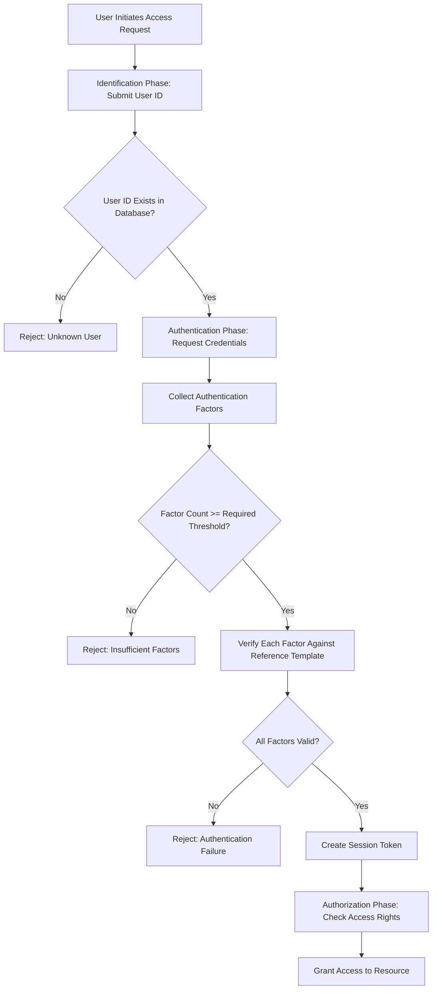
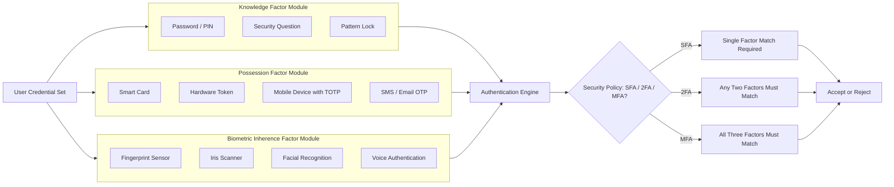
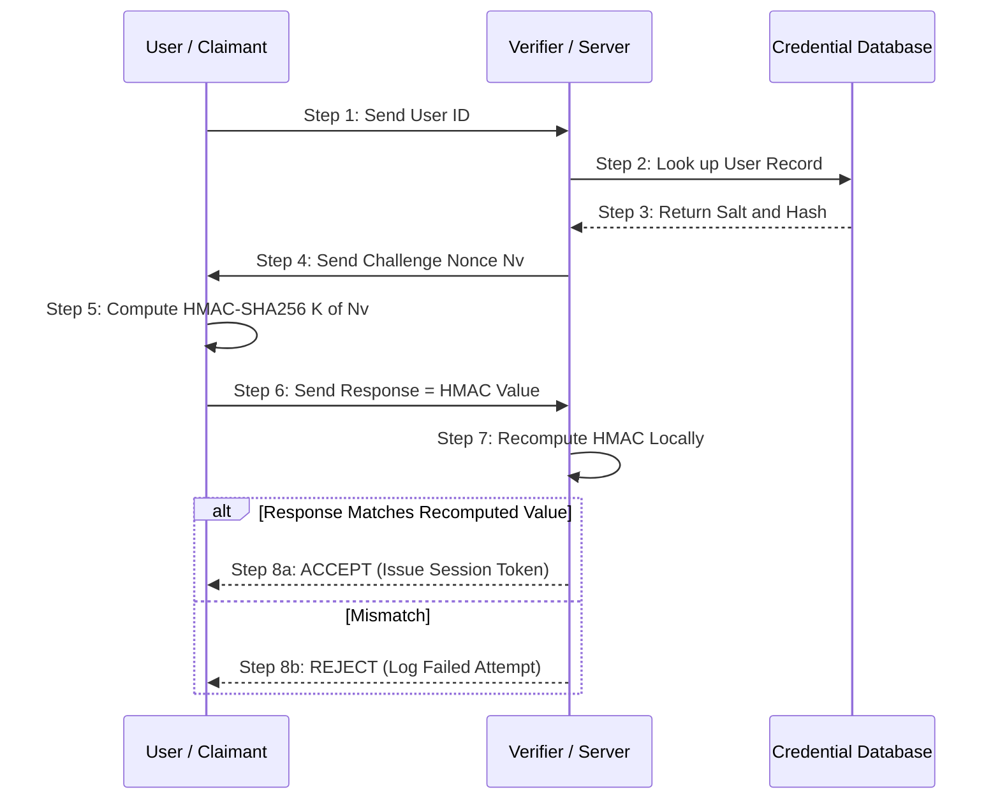
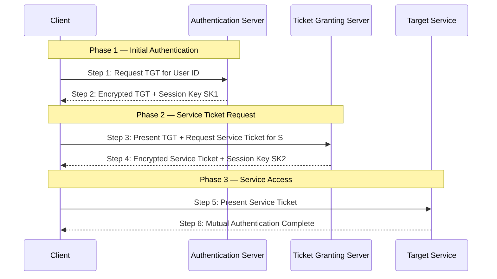
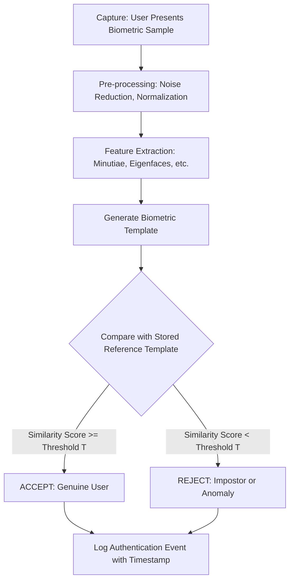

# Authentication -  User Authentication

<!-- SECTION_1_START -->
# User Authentication — Core Technical Definition & Intuitive Overview

## 1.1 Formal Definition (KTU 2024 Syllabus Terminology)

> [!NOTE]
> **User Authentication** is the process of verifying the identity of a claimant (user, process, or device) seeking access to a protected Information and Communication Technology (ICT) resource, based on one or more *authentication factors* presented at the time of access. It is the **first security gate** in the CIA (Confidentiality, Integrity, Availability) triad and forms the foundation of **Access Control** services.

In the ISO/IEC 27000 series terminology adopted by KTU 2024, authentication answers the question: *"Is the entity who it claims to be?"* — distinct from **Authorization**, which answers *"Is the entity allowed to perform this action?"*.

The general formal model is the **AAA framework**:

$$
\text{AAA} = \text{Authentication} + \text{Authorization} + \text{Accounting}
$$

## 1.2 Conceptual Analogy — The "Three-Door Vault"

Imagine a high-security bank vault protected by **three doors in series**, each requiring a different type of proof:

| Door | Factor Type | What You Must Provide | KTU Term |
| :--- | :--- | :--- | :--- |
| Door 1 | **Knowledge Factor** | Something you *know* | Password, PIN, Security Question |
| Door 2 | **Possession Factor** | Something you *have* | Smart card, OTP token, Mobile device |
| Door 3 | **Biometric / Inherence Factor** | Something you *are* | Fingerprint, Iris, Voice, Face |

A **Single-Factor Authentication (SFA)** opens only the first door. **Two-Factor Authentication (2FA)** opens two doors. **Multi-Factor Authentication (MFA)** opens all three. A breach of any single door does **not** compromise the vault — this is the **defence-in-depth** principle in its purest form.

## 1.3 Classification of Authentication Factors

> [!IMPORTANT]
> **Authentication Factor = a category of credential used to prove identity.** KTU 2024 (Module 3) recognizes **three primary factor classes**, plus two derived ones used in modern Zero-Trust architectures.

$$
F_{\text{total}} = \big\{F_{\text{knowledge}}, F_{\text{possession}}, F_{\text{biometric}}\big\}
$$

Extended categories in modern enterprise systems:

- **Location Factor** — where you are (GPS, IP geolocation).
- **Behaviour Factor** — how you behave (keystroke dynamics, gait, mouse-movement patterns).

> [!VISUALIZATION CONTROL]
> **Concept:** Authentication Factor Strength Pyramid (defence-in-depth visualisation).
> **GeoGebra Input (Conceptual Bar Chart):**
> * Bar 1: `Knowledge — Strength = 1` (easiest to steal via phishing).
> * Bar 2: `Possession — Strength = 2` (requires physical theft or SIM swap).
> * Bar 3: `Biometric — Strength = 3` (extremely hard to replicate).
> **Visual Description:** A three-tier pyramid with `Knowledge` as the broad base (most users), narrowing through `Possession`, to `Biometric` at the apex representing highest assurance. The student should observe that **combining factors multiplies the attacker’s required effort**, not merely adds it.

## 1.4 Authentication vs. Identification vs. Authorization

This is a high-frequency KTU 2-mark question. Memorize the distinction:

| Term | Question It Answers | Example |
| :--- | :--- | :--- |
| **Identification** | *Who are you?* | User enters **username** `arjun@ktu.ac.in` |
| **Authentication** | *Can you prove it?* | User enters **password** `M@klN@123` |
| **Authorization** | *What are you allowed to do?* | System grants **read** access to Module-3 PDFs |

> [!WARNING]
> **KTU Examiner Pitfall:** Students often write "Authentication = login process." This is *partially* correct but loses marks because authentication is a **broader cryptographic verification process**, not merely a UI event. Login is the *interface*; authentication is the *protocol*.

<!-- SECTION_1_END -->

<!-- SECTION_2_START -->
# Deep Theoretical Analysis & KTU High-Yield Formula Sheet

## 2.1 The Authentication Protocol — Generic Model

A generic authentication exchange involves **three entities** and **four phases**:

$$
\text{Claimant} \; (C) \;\;\xleftrightarrow{\;1.\;\text{Identity claim}\;}\;\; \text{Verifier} \; (V) \;\;\xleftrightarrow{\;2.\;\text{Credential exchange}\;}\;\; \text{Auth.\ Server} \;(AS)
$$

**Phase 1 — Claim:** $C \rightarrow V : \text{ID}_C$
**Phase 2 — Challenge:** $V \rightarrow C : \text{Nonce} \; N$
**Phase 3 — Response:** $C \rightarrow V : f(\text{Secret}, N)$  (where $f$ is a one-way function or MAC).
**Phase 4 — Verdict:** $V$ checks locally or via AS, then $\rightarrow$ **Accept** or **Reject**.

The strength of the protocol is measured by the **adversary’s expected computational work** $W$ to forge a valid response:

$$
W \;=\; 2^{k} \quad \text{(where } k = \text{key length in bits)}
$$

## 2.2 Password-Based Authentication — Deep Analysis

### 2.2.1 Storage: Plaintext vs. Hashed vs. Salted Hash

> [!IMPORTANT]
> **Storing passwords in plaintext is a KTU red-flag and a violation of OWASP Top 10 (A02:2021 — Cryptographic Failures).** Production systems *always* use salted cryptographic hashes.

**Step 1 — Plaintext (NEVER do this):**
$$
\text{DB entry: } \big(\text{user\_id},\; \text{password}\big)
$$

**Step 2 — Cryptographic Hash (e.g., SHA-256):**
$$
H = \text{SHA-256}(\text{password})
$$
Stored: $\big(\text{user\_id}, H\big)$. On login, recompute $H'$ and compare $H = H'$.

**Step 3 — Salted Hash (production standard, e.g., bcrypt/Argon2):**
$$
H_{\text{final}} = \text{SHA-256}\big(\text{password} \,\|\, \text{salt}\big)
$$
where $\|$ denotes concatenation and $\text{salt} = \text{random}(128\text{ bits})$.

The salt defeats **rainbow-table attacks** by ensuring two users with the same password get different hashes.

### 2.2.2 Password Entropy and Strength

> [!NOTE]
> **Entropy $H$** quantifies the unpredictability of a password in bits. It is the **single most-tested KTU formula** for Module 3.

$$
H \;=\; L \;\times\; \log_{2}(R)
$$

Where:
- $L$ = length of the password in characters.
- $R$ = size of the character pool (charset).
- $H$ = entropy in **bits**.

**Character pool sizes (KTU reference values):**

| Charset | Pool Size $R$ | $\log_{2}(R)$ per char |
| :--- | :---: | :---: |
| Digits only `0-9` | 10 | 3.32 |
| Lowercase letters | 26 | 4.70 |
| + Uppercase | 52 | 5.70 |
| + Digits | 62 | 5.95 |
| + Special symbols | 95 | 6.57 |

**Strength verdict thresholds (NIST SP 800-63B aligned):**

$$
\text{Strength} = 
\begin{cases}
\text{Weak}, & H < 28 \text{ bits} \\
\text{Moderate}, & 28 \leq H < 60 \text{ bits} \\
\text{Strong}, & 60 \leq H < 80 \text{ bits} \\
\text{Very Strong}, & H \geq 80 \text{ bits}
\end{cases}
$$

## 2.3 Biometric Authentication — Accuracy Metrics

Biometric systems are evaluated by three rates. These are **guaranteed KTU 14-mark question material**:

$$
\text{FAR} = \frac{\text{False Accepts}}{\text{Total Impostors}} \qquad
\text{FRR} = \frac{\text{False Rejects}}{\text{Total Genuines}}
$$

$$
\text{CER} \;=\; \frac{\text{FAR} + \text{FRR}}{2}
$$

> [!NOTE]
> **FAR (False Acceptance Rate)** — Impostor wrongly accepted (Type II error in this context, security risk).
> **FRR (False Rejection Rate)** — Genuine user wrongly rejected (Type I error, usability risk).
> **CER (Crossover Error Rate)** — The operating point where **FAR = FRR**; lower CER = better biometric system.

**Relation between the three:** The *Crossover Error Rate* is the most-cited single number for comparing biometric devices, and it is the **intersection point** of the FAR and FRR curves on a logarithmic threshold axis.

## 2.4 Challenge-Response Authentication (Mutual Authentication)

Used in **smart cards, HMAC protocols, and zero-knowledge proofs**. Mathematical skeleton:

$$
C \rightarrow V : N_c \quad \text{(random nonce from claimant)}
$$
$$
V \rightarrow C : N_v, \; \text{MAC}_K(N_c \,\|\, N_v) \quad \text{(verifier responds)}
$$
$$
C \rightarrow V : \text{MAC}_K(N_v \,\|\, \text{ID}_C) \quad \text{(claimant proves knowledge of } K\text{)}
$$

The shared secret $K$ is *never* transmitted, defeating replay and eavesdropping attacks.

## 2.5 KTU High-Yield Formula Cheat Sheet

| Formula | Symbol Glossary | KTU Use Case |
| :--- | :--- | :--- |
| $H = L \log_{2} R$ | $H$ entropy, $L$ length, $R$ pool | Password strength calculation |
| $W = 2^{k}$ | $W$ work, $k$ key bits | Brute-force attack cost |
| $\text{FAR}, \text{FRR}, \text{CER}$ | biometric accuracy | Compare fingerprint / iris sensors |
| $H_{\text{salted}} = h(P \,\vert\, S)$ | $P$ password, $S$ salt | Defeating rainbow tables |
| $T_{\text{auth}} = T_{\text{latency}} + T_{\text{verify}}$ | timing analysis | Performance benchmarking of auth systems |
| $\text{AU} = \frac{\text{Accepted}}{\text{Total}} \times 100\%$ | Acceptance rate | Reporting on biometric deployment |

## 2.6 Real-World Engineering Utility

- **Cloud IAM (AWS IAM, Azure AD):** Federated identity with MFA tokens.
- **Banking (RBI 2024 guidelines):** Mandatory 2FA for digital payments.
- **Healthcare (HIPAA / ABDM India):** Biometric EHR access via Aadhaar.
- **DevOps:** SSH key-based possession-factor authentication.
- **Kerberos (Active Directory):** Ticket-based authentication for enterprise networks.

<!-- SECTION_2_END -->

<!-- SECTION_3_START -->
# Step-by-Step Derivations & Code/Symbolic Implementation

## 3.1 Worked Example — Password Entropy & Crack Time

**Problem (KTU-style):** A user creates a password of length **10** using an alphabet of **94** printable ASCII characters (uppercase, lowercase, digits, special). Calculate the entropy and the expected brute-force crack time on a GPU rig capable of **$10^{11}$ guesses/sec**.

### Step 1 — Identify the character pool

The password uses 94 distinct symbols, so $R = 94$.

### Step 2 — Compute bits per character

$$
\log_{2}(R) = \log_{2}(94) = \frac{\ln(94)}{\ln(2)} = \frac{4.543}{0.693} \approx 6.55 \text{ bits/char}
$$

### Step 3 — Compute total entropy

$$
H = L \times \log_{2}(R) = 10 \times 6.55 = 65.5 \text{ bits}
$$

### Step 4 — Classify strength

Per the NIST-aligned thresholds, $60 \le H < 80$ ⇒ the password is **Strong**.

### Step 5 — Compute total search space

$$
N_{\text{guesses}} = 2^{H} = 2^{65.5} \approx 4.91 \times 10^{19}
$$

### Step 6 — Expected (average) brute-force time

The attacker on average tries half the keyspace:

$$
N_{\text{avg}} = \frac{2^{65.5}}{2} \approx 2.45 \times 10^{19}
$$

Convert to seconds using the attack rate $r = 10^{11}$ guesses/sec:

$$
T_{\text{avg}} = \frac{N_{\text{avg}}}{r} = \frac{2.45 \times 10^{19}}{10^{11}} = 2.45 \times 10^{8} \text{ seconds}
$$

Convert to years:

$$
T_{\text{years}} = \frac{2.45 \times 10^{8}}{365.25 \times 24 \times 3600} = \frac{2.45 \times 10^{8}}{3.156 \times 10^{7}} \approx 7.76 \text{ years}
$$

> [!IMPORTANT]
> **Final answer:** Entropy $H = 65.5$ bits ⇒ **Strong** password. Average crack time on a $10^{11}$ guesses/sec rig $\approx 7.76$ years.

### Step 7 — Security verdict

The 10-character ASCII password is computationally infeasible to break in real time on commodity hardware, validating the NIST recommendation of an 8-character minimum (with length $>12$ preferred for new deployments).

---

## 3.2 Worked Example — Biometric FAR/FRR/CER Analysis

**Problem:** During a deployment of a fingerprint scanner, 1 000 impostor attempts and 1 000 genuine attempts were logged. The system wrongly accepted 2 impostors and wrongly rejected 18 genuine users. Compute FAR, FRR, and CER.

**Step 1 — Compute FAR**

$$
\text{FAR} = \frac{\text{False Accepts}}{\text{Total Impostors}} = \frac{2}{1000} = 0.002 = 0.2\%
$$

**Step 2 — Compute FRR**

$$
\text{FRR} = \frac{\text{False Rejects}}{\text{Total Genuines}} = \frac{18}{1000} = 0.018 = 1.8\%
$$

**Step 3 — Compute CER**

$$
\text{CER} = \frac{\text{FAR} + \text{FRR}}{2} = \frac{0.002 + 0.018}{2} = 0.010 = 1.0\%
$$

> [!NOTE]
> **Verdict:** CER of 1.0% is **acceptable for low-to-medium security** (e.g., attendance systems) but **not suitable for high-security biometric access** (border control, military) where CER should ideally be $\le 0.1\%$.

---

## 3.3 Symbolic Challenge-Response Authentication — Worked Trace

We trace **three message exchanges** between Claimant (C) and Verifier (V) using a shared secret $K$ and HMAC-SHA256.

**Step 1 — Initial Claim**

$$
C \rightarrow V : \; \text{ID}_C = \text{"alice@ktu.ac.in"}
$$

**Step 2 — Verifier Generates Nonce**

$$
V : \; N_v \xleftarrow{\$} \{0,1\}^{128} \quad \text{(cryptographically random)}
$$

**Step 3 — Verifier Sends Challenge**

$$
V \rightarrow C : \; N_v
$$

**Step 4 — Claimant Computes Response**

$$
\text{Response} = \text{HMAC-SHA-256}_K(N_v \,\|\, \text{ID}_C)
$$

**Step 5 — Claimant's Reply**

$$
C \rightarrow V : \; \text{Response},\; \text{ID}_C
$$

**Step 6 — Verifier Recomputes and Compares**

$$
\text{Response}^{\prime} = \text{HMAC-SHA-256}_K(N_v \,\|\, \text{ID}_C)
$$
$$
\text{Decision} = 
\begin{cases}
\text{ACCEPT}, & \text{Response}^{\prime} = \text{Response} \\
\text{REJECT}, & \text{otherwise}
\end{cases}
$$

> [!IMPORTANT]
> The verifier’s recomputation is done locally with the shared key $K$. The secret $K$ **never traverses the network** — this is the security property that defeats passive eavesdropping.

---

## 3.4 Python Implementation — Salting, Hashing, and Verification

A production-grade snippet showing the recommended pattern for **storing and verifying passwords** using PBKDF2-HMAC-SHA256 (used by default in many web frameworks).

```python
import hashlib
import os
import base64
from typing import Tuple

# ---------- CONFIGURATION CONSTANTS ----------
HASH_ALGO = "sha256"          # Underlying hash function
ITERATIONS = 200_000          # PBKDF2 work factor (OWASP 2024 recommendation)
SALT_BYTES = 16               # 128-bit salt (NIST minimum)
DKLEN = 32                    # 256-bit derived key length


def generate_salt() -> bytes:
    """Generate a cryptographically secure random salt."""
    return os.urandom(SALT_BYTES)


def hash_password(password: str, salt: bytes) -> bytes:
    """
    Derive a cryptographic hash from a password + salt using PBKDF2-HMAC.
    Returns the derived key as raw bytes.
    """
    if not isinstance(password, str) or len(password) == 0:
        raise ValueError("Password must be a non-empty string.")
    derived_key = hashlib.pbkdf2_hmac(
        HASH_ALGO,
        password.encode("utf-8"),
        salt,
        ITERATIONS,
        dklen=DKLEN,
    )
    return derived_key


def store_password(password: str) -> str:
    """
    Produce a single self-contained string to store in the database.
    Format: pbkdf2_sha256$ITERATIONS$SALT_BASE64$HASH_BASE64
    """
    salt = generate_salt()
    hashed = hash_password(password, salt)
    salt_b64 = base64.b64encode(salt).decode("ascii")
    hash_b64 = base64.b64encode(hashed).decode("ascii")
    return f"pbkdf2_sha256${ITERATIONS}${salt_b64}${hash_b64}"


def verify_password(stored_record: str, candidate_password: str) -> bool:
    """
    Verify a candidate password against the stored salted-hash record.
    Uses constant-time comparison to defeat timing attacks.
    """
    try:
        algo, iter_str, salt_b64, hash_b64 = stored_record.split("$")
    except ValueError:
        raise ValueError("Malformed stored credential record.")

    if algo != f"pbkdf2_{HASH_ALGO}":
        raise ValueError(f"Unsupported algorithm: {algo}")

    salt = base64.b64decode(salt_b64)
    expected_hash = base64.b64decode(hash_b64)
    candidate_hash = hash_password(candidate_password, salt)

    # CONSTANT-TIME comparison prevents timing-side-channel attacks
    return hashlib.compare_digest(expected_hash, candidate_hash)


# ---------- DEMO ENTRY POINT ----------
if __name__ == "__main__":
    user_password = "M@klN@123"

    # 1. Registration phase
    stored = store_password(user_password)
    print(f"[DB] Stored credential record:\n    {stored}\n")

    # 2. Login phase — correct password
    is_ok = verify_password(stored, "M@klN@123")
    print(f"[AUTH] Correct password   -> {'ACCEPTED' if is_ok else 'REJECTED'}")

    # 3. Login phase — wrong password
    is_ok = verify_password(stored, "wrong_password")
    print(f"[AUTH] Wrong password     -> {'ACCEPTED' if is_ok else 'REJECTED'}")
```

**Expected console output:**

```text
[DB] Stored credential record:
    pbkdf2_sha256$200000$BASE64_SALT$BASE64_HASH

[AUTH] Correct password   -> ACCEPTED
[AUTH] Wrong password     -> REJECTED
```

> [!WARNING]
> **KTU Code Pitfall:** A common student mistake is to use `==` to compare hashes. This leaks timing information, allowing an attacker to guess hashes one byte at a time. The correct approach is `hmac.compare_digest()` or `hashlib.compare_digest()` as shown above.

---

## 3.5 Python Implementation — TOTP (Time-Based One-Time Password) — RFC 6238

A possession-factor implementation, used by Google Authenticator, Microsoft Authenticator, and most banking apps.

```python
import hmac
import hashlib
import struct
import time
from typing import Optional

# ---------- TOTP PARAMETERS (RFC 6238) ----------
TIME_STEP = 30                # Code rotates every 30 seconds
DIGITS = 6                    # 6-digit OTP
T0 = 0                        # Unix epoch reference


def hotp(secret: bytes, counter: int, digits: int = DIGITS) -> str:
    """
    HMAC-Based One-Time Password (RFC 4226).
    Returns a decimal OTP of the requested length.
    """
    counter_bytes = struct.pack(">Q", counter)        # 8-byte big-endian counter
    hmac_digest = hmac.new(secret, counter_bytes, hashlib.sha1).digest()

    # Dynamic truncation (RFC 4226 §5.3)
    offset = hmac_digest[-1] & 0x0F
    truncated = (
        (hmac_digest[offset]     & 0x7F) << 24
        | (hmac_digest[offset + 1] & 0xFF) << 16
        | (hmac_digest[offset + 2] & 0xFF) << 8
        | (hmac_digest[offset + 3] & 0xFF)
    )
    return str(truncated % (10 ** digits)).zfill(digits)


def totp(secret: bytes, time_step: int = TIME_STEP, digits: int = DIGITS) -> str:
    """
    Time-Based One-Time Password (RFC 6238).
    Counter = floor((now - T0) / time_step).
    """
    counter = int((time.time() - T0) // time_step)
    return hotp(secret, counter, digits)


def verify_totp(secret: bytes, user_code: str,
                window: int = 1, time_step: int = TIME_STEP) -> bool:
    """
    Verify a TOTP code with a tolerance window (default ±1 step).
    window=1 means: accept current, previous, and next code.
    """
    if not user_code or not user_code.isdigit():
        return False
    now_counter = int((time.time() - T0) // time_step)
    for offset in range(-window, window + 1):
        candidate = hotp(secret, now_counter + offset, DIGITS)
        if hmac.compare_digest(candidate, user_code):
            return True
    return False


# ---------- DEMO ENTRY POINT ----------
if __name__ == "__main__":
    # In real systems, the secret is provisioned once via QR code
    shared_secret = b"JBSWY3DPEHPK3PXP"          # 16-byte ASCII key (base32-decoded)

    generated = totp(shared_secret)
    print(f"[TOTP] Server-generated code: {generated}")

    is_valid = verify_totp(shared_secret, generated)
    print(f"[TOTP] Verification result:   {'VALID' if is_valid else 'INVALID'}")

    is_valid_bad = verify_totp(shared_secret, "000000")
    print(f"[TOTP] Wrong code result:      {'VALID' if is_valid_bad else 'INVALID'}")
```

> [!IMPORTANT]
> **Why TOTP is possession-factor:** The shared secret lives only on the user’s hardware token / phone and the verifier server. An attacker who only knows the password (knowledge) cannot produce a valid TOTP without the secret — this is **2FA** in action.

<!-- SECTION_3_END -->

<!-- SECTION_4_START -->
# Structural Diagrams & Schematics

## 4.1 User Authentication — High-Level Functional Flow



## 4.2 Three-Factor Authentication — Modular Architecture



## 4.3 Challenge-Response Protocol — Sequence Diagram



## 4.4 Kerberos Authentication — Ticket-Based Architecture

> [!IMPORTANT]
> **Kerberos** is the de-facto enterprise authentication protocol (used in Microsoft Active Directory, MIT Kerberos, and Apple OpenDirectory). It uses a **trusted third party (KDC)** to issue tickets, eliminating the need for passwords to traverse the network.



**Kerberos Object Definitions:**

| Object | Full Form | Purpose |
| :--- | :--- | :--- |
| KDC | Key Distribution Center | Trusted third party combining AS + TGS |
| TGT | Ticket Granting Ticket | Long-lived credential to ask for service tickets |
| SK1 | Client-TGS Session Key | Encrypts communication between C and TGS |
| SK2 | Client-Server Session Key | Encrypts communication between C and S |

## 4.5 Biometric Verification Pipeline — Block Diagram



**Operating point selection logic:**

$$
T_{\text{threshold}} = \arg\min_{t} \big( \text{FAR}(t) + \text{FRR}(t) \big)
$$

At the optimal threshold, FAR and FRR intersect at the **Crossover Error Rate (CER)**.

<!-- SECTION_4_END -->

<!-- SECTION_5_START -->
# KTU 2024 Scheme Examination Question Bank & Topic Recap

## 5.1 Part A — Short Answer Questions (2 × 3 Marks)

### Q1. Define User Authentication. List and briefly explain the three primary authentication factors.
**[KTU University Exam — July 2024 | CO1 | Remember — 3 Marks]**

**Model Answer:**

**Definition (1 Mark):** User Authentication is the process of verifying the claimed identity of a user, process, or device attempting to access a protected ICT resource, by validating one or more credentials (factors) presented as proof of identity.

**Three Factors (2 Marks — 1 each for the first two, 1 for the example):**

1. **Knowledge Factor (Something you know):** Information only the legitimate user should know, e.g., **password, PIN, security question answer**.
2. **Possession Factor (Something you have):** A physical or digital token the user possesses, e.g., **smart card, hardware token, mobile device with TOTP app**.
3. **Biometric / Inherence Factor (Something you are):** A unique physiological or behavioural trait, e.g., **fingerprint, iris pattern, facial geometry, voice signature**.

> [!NOTE]
> Examiner’s valuation: 1 mark for the textbook definition, 1 mark for naming all three factors correctly, 1 mark for giving an authentic example of each.

---

### Q2. Differentiate between Identification, Authentication, and Authorization with one example each.
**[KTU University Exam — Dec 2023 | CO1 | Understand — 3 Marks]**

**Model Answer (tabular form):**

| Phase | Question Answered | Example |
| :--- | :--- | :--- |
| **Identification** | *Who are you?* | User types username `rahul@ktu.ac.in` |
| **Authentication** | *Can you prove it?* | User submits password and a 6-digit OTP |
| **Authorization** | *What are you allowed to do?* | System grants read access to Module-3 PDF but denies write access |

> [!WARNING]
> **Common Student Mistake:** Conflating authentication and authorization. Authentication *precedes* authorization; you cannot authorize an unverified entity. A login failure is an authentication failure, NOT an authorization failure.

---

## 5.2 Part B — Long Answer Questions (ESE Module Internal Choice)

### Question A (14 Marks)

**(a)** Explain the Password-Based Authentication mechanism in detail. Discuss the limitations of plaintext password storage and how salting defeats rainbow-table attacks. **[7 Marks]**
**(b)** A user creates a password `P@ss1234` of length 8 using the printable ASCII character set of size 95. Calculate the entropy and the average brute-force cracking time on a system capable of $10^{12}$ guesses per second. Classify the password strength. **[7 Marks]**
**[KTU University Exam — July 2024 | CO2 + CO3 | Understand + Apply — 14 Marks]**

#### Model Solution — Part (a) [7 Marks]

**Step 1 — Mechanism Outline (2 Marks):**
Password-Based Authentication is the simplest form of knowledge-factor authentication. The user provides an ID and a secret password; the system verifies the password against a stored reference.

**Step 2 — Plaintext Storage (1 Mark — flagged as insecure):**
Storing passwords as plain text in the database means a single SQL injection or insider breach reveals every user’s credentials. KTU 2024 syllabus explicitly marks this as an anti-pattern.

**Step 3 — Hashing Solution (2 Marks):**
Instead of storing the password, store its one-way cryptographic hash:
$$
H = \text{SHA-256}(\text{password})
$$
On login, recompute $H'$ from the user’s input and compare with the stored $H$. The hash is **deterministic** (same input → same output) but **irreversible** (cannot recover the password from $H$).

**Step 4 — Why Hashing Alone is Insufficient (1 Mark):**
Two users with the same password get the same hash, enabling **rainbow-table attacks** (precomputed hash dictionaries).

**Step 5 — Salting Defeats Rainbow Tables (1 Mark):**
A **salt** $S$ is a unique random value generated per user at registration time. The stored credential becomes:
$$
H_{\text{stored}} = \text{SHA-256}(\text{password} \,\|\, S)
$$
Since the salt is unique per user, the same password yields different hashes, rendering rainbow tables useless. The salt is stored in plaintext alongside the hash (it is **not secret**, only **unique**).

#### Model Solution — Part (b) [7 Marks]

**Step 1 — Identify parameters (1 Mark):**
$L = 8$, $R = 95$.

**Step 2 — Bits per character (1 Mark):**
$$
\log_{2}(95) = \frac{\ln(95)}{\ln(2)} = \frac{4.5539}{0.6931} \approx 6.57 \text{ bits/char}
$$

**Step 3 — Total entropy (1 Mark):**
$$
H = 8 \times 6.57 = 52.56 \text{ bits}
$$

**Step 4 — Strength classification (1 Mark):**
Per NIST thresholds, $28 \le H < 60$ ⇒ **Moderate** strength.

**Step 5 — Search space size (1 Mark):**
$$
N = 2^{52.56} \approx 6.32 \times 10^{15}
$$

**Step 6 — Average crack time (2 Marks):**
Average attempts = $N/2 = 3.16 \times 10^{15}$. Divide by attack rate:
$$
T_{\text{avg}} = \frac{3.16 \times 10^{15}}{10^{12}} = 3160 \text{ seconds} \approx 52.67 \text{ minutes}
$$

> [!WARNING]
> **Examiner’s Pitfall Callout:** Students frequently forget to **halve the keyspace** when computing the *average* crack time, getting 105 minutes instead of 52.67 minutes. This loses 1 mark.

---

### Question B (14 Marks) — Internal Choice Alternative

**(a)** With neat diagrams, describe the Kerberos authentication protocol. Explain the roles of the Authentication Server (AS) and the Ticket Granting Server (TGS). **[7 Marks]**
**(b)** During a fingerprint authentication trial, 5 000 impostor attempts and 5 000 genuine attempts were made. The system wrongly accepted 10 impostors and rejected 75 genuine users. Compute FAR, FRR, and CER. Comment on the suitability of the system for high-security access. **[7 Marks]**
**[KTU University Exam — Dec 2023 | CO2 + CO3 | Understand + Apply — 14 Marks]**

#### Model Solution — Part (a) [7 Marks]

**Step 1 — Introduction (1 Mark):**
Kerberos is a **ticket-based symmetric-key authentication protocol** developed at MIT and standardized in **RFC 4120**. It uses a **trusted third party** called the **Key Distribution Center (KDC)**.

**Step 2 — Three Architectural Components (1 Mark):**
- **KDC** = Authentication Server (AS) + Ticket Granting Server (TGS) combined.
- **Principal** = the user/client.
- **Service Server (S)** = the resource the client wants to access.

**Step 3 — Three-Phase Flow (3 Marks — 1 per phase):**

- **Phase 1 (AS Exchange):** Client sends user ID to AS. AS returns a **Ticket Granting Ticket (TGT)** encrypted with the user’s secret key, plus a session key $SK_1$.
- **Phase 2 (TGS Exchange):** Client presents the TGT to TGS and requests a service ticket. TGS returns a **Service Ticket** encrypted with the service’s key, plus session key $SK_2$.
- **Phase 3 (Client-Service Exchange):** Client presents the service ticket to the target service S. S verifies the ticket and grants access. Mutual authentication is achieved.

**Step 4 — Role of AS (1 Mark):**
The **AS** performs **initial identity verification** using the user’s long-term secret (password-derived key) and issues the TGT. The user’s password is **never sent over the network**.

**Step 5 — Role of TGS (1 Mark):**
The **TGS** issues **short-lived service tickets** to authenticated users without requiring them to re-enter credentials. This enables **Single Sign-On (SSO)**.

**Step 6 — Diagram Requirement (already covered in Section 4.4 above — students should reproduce it for full marks).**

> [!WARNING]
> **Examiner’s Pitfall:** A very common error is to call AS the *Authentication Service* (singular noun, not the abbreviation). Use full form *Authentication Server* at least once for clarity.

#### Model Solution — Part (b) [7 Marks]

**Step 1 — State given data (1 Mark):**
Impostor total = 5 000; false accepts = 10. Genuine total = 5 000; false rejects = 75.

**Step 2 — Compute FAR (2 Marks):**
$$
\text{FAR} = \frac{10}{5000} = 0.002 = 0.2\%
$$
**[Stating formula: 1 Mark; Final value: 1 Mark]**

**Step 3 — Compute FRR (2 Marks):**
$$
\text{FRR} = \frac{75}{5000} = 0.015 = 1.5\%
$$
**[Stating formula: 1 Mark; Final value: 1 Mark]**

**Step 4 — Compute CER (1 Mark):**
$$
\text{CER} = \frac{0.002 + 0.015}{2} = 0.0085 = 0.85\%
$$

**Step 5 — Security verdict (1 Mark):**
A CER of 0.85% is **acceptable for medium-security applications** (e.g., attendance, low-value transactions) but **insufficient for high-security deployments** (e.g., data centres, military, nuclear facilities) where CER $\le 0.1\%$ is the industry benchmark.

> [!WARNING]
> **Examiner’s Pitfall Callout:** Do NOT confuse FAR and FRR. A handy mnemonic: **FRR = False Rejection (Rejecting the genuine)**, **FAR = False Acceptance (Accepting the false/impostor)**. Mixing them up costs 4 marks out of 7.

---

## 5.3 Topic Recap & Important Things to Remember

- **Authentication** verifies identity; **Authorization** grants rights — never interchange.
- The **three primary factors** are Knowledge, Possession, and Biometric (Inherence).
- **Password entropy** $H = L \log_2 R$ is the canonical strength measure.
- **Salting** + **slow hash** (PBKDF2, bcrypt, Argon2) is the production standard for password storage.
- **Biometric accuracy triad:** FAR (security), FRR (usability), CER (combined quality metric).
- **Crossover Error Rate (CER)** is the single best number for biometric system comparison.
- **Challenge-Response** protocols defeat replay attacks using nonces.
- **Kerberos** uses symmetric keys and a trusted KDC to enable **Single Sign-On (SSO)**.
- **TOTP** (RFC 6238) is the most widely deployed possession-factor second authentication.
- **MFA** exponentially raises attacker effort; never rely on single-factor for sensitive data.
- **Constant-time comparison** (`hmac.compare_digest`) is mandatory when comparing hashes/tokens.
- **KTU numerical must-knows:** entropy formula, brute-force time, FAR/FRR/CER computation, PBKDF2 iteration counts.
- **Common pitfalls to avoid in exams:** mixing up FAR/FRR, forgetting the $\div 2$ in average crack time, using `==` for hash comparison, and confusing the roles of AS vs. TGS in Kerberos.

<!-- SECTION_5_END -->
