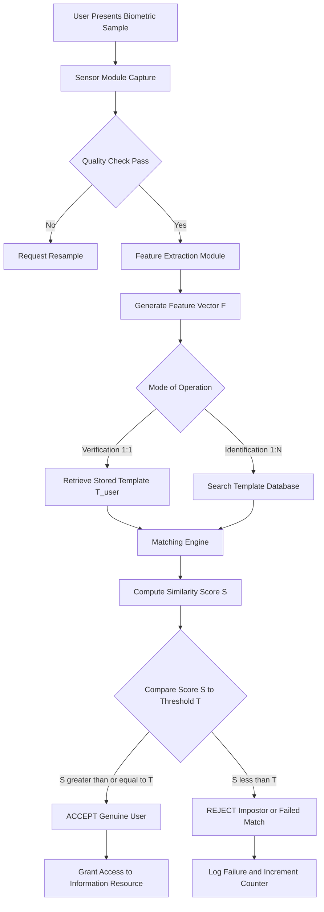
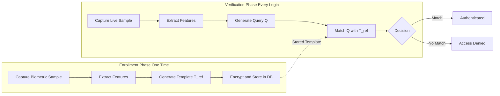
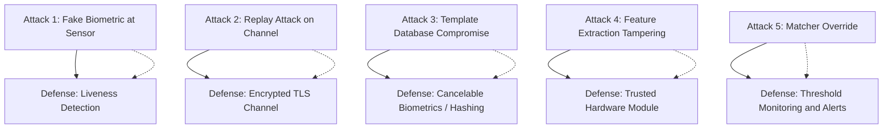

# Biometric Authentication

<!-- SECTION_1_START -->

# Biometric Authentication

> [!NOTE]
> **KTU 2024 Scheme | PECST744 - Information Security | Module 3**
> This topic covers the foundational principles of biometric authentication, its classification, performance evaluation metrics, and security implications in modern information storage systems.

## 1.1 Formal Academic Definition

**Biometric Authentication** is the automated recognition of individuals based on their **unique biological and behavioral characteristics**. It is formally defined by the International Organization for Standardization (ISO/IEC 2382-37) as the *automated recognition of individuals based on their behavioural and biological characteristics*.

In the context of **information security**, biometric authentication serves as a *non-repudiable identity verification mechanism* that binds an individual's **physiological traits** (e.g., fingerprints, iris patterns) or **behavioral traits** (e.g., keystroke dynamics, gait) to a digital identity, thereby controlling access to protected information assets.

The term *biometric* originates from the Greek words *bios* (life) and *metron* (measure), literally meaning *measurement of life*.

> [!IMPORTANT]
> **Syllabus Highlight (KTU Module 3):** Biometric authentication is positioned as a **secondary authentication factor** (something you are), complementing the traditional **knowledge factors** (passwords) and **possession factors** (smart cards / tokens) within a **Multi-Factor Authentication (MFA)** architecture.

## 1.2 Conceptual Analogy & Intuitive Overview

> [!TIP]
> **Real-World Analogy — The "Unique Door Key" Concept**
>
> Imagine a high-security vault that requires three different types of keys to open:
> 1. **Something you know** — a secret password (the combination lock).
> 2. **Something you have** — a physical ID card (the metal key).
> 3. **Something you are** — your fingerprint, iris, or face (the biometric lock).
>
> While passwords can be *guessed* and ID cards can be *stolen*, your biological traits are *intrinsically tied to your physical body*. Biometric authentication acts as the **third, almost unforgeable lock** — the one that asks: *"Is the person standing here the SAME person who originally enrolled?"* This is the essence of biometric verification.

### The Three Pillars of "Who You Are"

Biometric traits are evaluated against four cardinal properties, often abbreviated as the **UUPS** model:

1. **Universality** — Every individual should possess the trait.
2. **Uniqueness** — The trait should be sufficiently different between individuals.
3. **Permanence** — The trait should be invariant over time.
4. **Collectability** — The trait should be measurable quantitatively.

## 1.3 Standard Metrics & Performance Indicators

The two most critical performance metrics in biometric systems are:

- **False Acceptance Rate (FAR)** — Probability that the system incorrectly accepts an *impostor*. **Industry benchmark for high-security systems: $\mathbf{\leq 0.001\%}$**.
- **False Rejection Rate (FRR)** — Probability that the system incorrectly rejects a *genuine* user. **Industry benchmark for consumer devices: $\mathbf{\leq 1\%}$**.

> [!WARNING]
> **Critical Distinction (Often Lost in Exams):**
> - FAR is also called **False Match Rate (FMR)**.
> - FRR is also called **False Non-Match Rate (FNMR)**.
> - These are *not* the same as the **False Positive Rate (FPR)** and **False Negative Rate (FNR)** used in generic binary classification — biometric systems use specific matching thresholds.

## 1.4 GeoGebra / Desmos Visualization

> [!VISUALIZATION CONTROL]
> **Concept:** Biometric Matching Score Distribution (Genuine vs. Impostor)
> **GeoGebra / Desmos Input Equations:**
>
> * Genuine distribution: $g(x) = \exp\left(-\dfrac{(x - 0.8)^2}{0.04}\right)$
> * Impostor distribution: $i(x) = \exp\left(-\dfrac{(x - 0.3)^2}{0.08}\right)$
>
> **Visual Description:** The student should observe two overlapping bell curves on the $x$-axis representing *matching scores* from **0** to **1**. The **right curve** (centered near $x = 0.8$) represents genuine users, while the **left curve** (centered near $x = 0.3$) represents impostors. The **overlap region** is where misclassifications occur. The **decision threshold** $T$ is a vertical line that trades off between FAR and FRR — moving $T$ right decreases FAR but increases FRR.

---

<!-- SECTION_1_END -->

<!-- SECTION_2_START -->

# 2. Deep Theoretical Analysis & High-Yield Formula Sheet

## 2.1 Architectural Classification of Biometric Systems

A biometric authentication system is composed of **five functional modules** operating in a sequential pipeline:

1. **Sensor Module** — Captures the raw biometric data (e.g., fingerprint scanner, camera, microphone).
2. **Feature Extraction Module** — Processes raw data to extract discriminative features (e.g., minutiae points, eigenfaces).
3. **Template Database** — Stores the enrolled reference templates securely (often hashed or encrypted).
4. **Matching Engine** — Compares the extracted feature vector against stored templates.
5. **Decision Module** — Outputs *Accept* or *Reject* based on the matching score and threshold $T$.

### Mode of Operation

| Mode | Input | Output | Use Case |
|------|-------|--------|----------|
| **Verification (1:1)** | User ID + Biometric sample | Genuine / Impostor | Phone unlock, ATM |
| **Identification (1:N)** | Biometric sample only | User ID or "Not Found" | Forensic, watch-list |

> [!NOTE]
> **Verification is computationally cheaper** because it only compares against a single stored template, whereas Identification requires searching the entire database.

## 2.2 Classification of Biometric Traits

### A. Physiological Biometrics (Static)

These are based on **anatomical** features of the body:

- **Fingerprint** — Minutiae (ridge endings, bifurcations) patterns.
- **Iris** — Complex random patterns visible from a distance.
- **Retina** — Blood vessel patterns in the back of the eye.
- **Face** — Geometric ratios of facial landmarks.
- **Finger Vein / Palm Vein** — Sub-dermal vascular patterns.
- **DNA** — Molecular-level identification (slow, expensive).

### B. Behavioral Biometrics (Dynamic)

These are based on **action-based** patterns:

- **Keystroke Dynamics** — Rhythm and timing of typing.
- **Gait Recognition** — Walking pattern.
- **Voice Recognition** — Vocal tract characteristics + speech content.
- **Signature Dynamics** — Pressure, speed, and stroke order.

> [!TIP]
> **Why Two Classes?** Physiological biometrics offer **higher permanence** (your fingerprint doesn't change much after adolescence), while behavioral biometrics offer **continuous authentication** capability (monitoring the user throughout a session).

## 2.3 Performance Metrics — Mathematical Foundations

Let $X_g$ be the matching score of a *genuine* user and $X_i$ be the matching score of an *impostor*. For a given decision threshold $T$:

- A genuine user is **accepted** if $X_g \geq T$.
- An impostor is **rejected** if $X_i < T$.

### Key Formulas

| Metric | Mathematical Definition | Interpretation |
|--------|-------------------------|----------------|
| **FAR (False Acceptance Rate)** | $FAR(T) = P(X_i \geq T) = \displaystyle\int_T^{\infty} f_i(x) \, dx$ | Probability impostor passes |
| **FRR (False Rejection Rate)** | $FRR(T) = P(X_g < T) = \displaystyle\int_{-\infty}^{T} f_g(x) \, dx$ | Probability genuine user is blocked |
| **GAR (Genuine Acceptance Rate)** | $GAR(T) = 1 - FRR(T)$ | Complement of FRR |
| **EER (Equal Error Rate)** | $T_{EER} : FAR(T_{EER}) = FRR(T_{EER})$ | Single-value system performance |
| **CER (Crossover Error Rate)** | $CER = FAR(T_{EER}) = FRR(T_{EER})$ | Same as EER (industry term) |
| **FTE (Failure to Enroll)** | $FTE = \dfrac{\text{Users who fail to enroll}}{\text{Total enrollment attempts}}$ | Usability of sensor |
| **FTA (Failure to Acquire)** | $FTA = \dfrac{\text{Failed capture attempts}}{\text{Total acquisition attempts}}$ | Sensor quality metric |

> [!IMPORTANT]
> **Zero-Error Bound:** A biometric system can never have BOTH FAR = 0 and FRR = 0 simultaneously because the genuine and impostor distributions always have some overlap. The **lower the EER, the better** the biometric system.

## 2.4 The Fundamental Trade-off Curve

The relationship between FAR and FRR is governed by the **Receiver Operating Characteristic (ROC) curve** in the biometric context, often plotted as **DET (Detection Error Trade-off) curve** with $FRR$ on the $y$-axis and $FAR$ on the $x$-axis (both in log scale).

$$T \uparrow \quad \Rightarrow \quad FAR \downarrow \quad \text{and} \quad FRR \uparrow$$

$$T \downarrow \quad \Rightarrow \quad FAR \uparrow \quad \text{and} \quad FRR \downarrow$$

### Operating Point Selection by Application

| Application Domain | Preferred Metric | Threshold Strategy |
|--------------------|------------------|--------------------|
| **High-Security (Nuclear, Military)** | Minimize FAR | Set $T$ high (accept only high-confidence matches) |
| **Consumer Devices (Phone Unlock)** | Minimize FRR | Set $T$ low (avoid annoying legitimate users) |
| **Border Control** | Balanced | Operate near EER |
| **Forensics** | Investigative | Use identification mode with relaxed thresholds |

## 2.5 Real-World Engineering Utility

Biometric authentication is deployed across diverse engineering domains:

- **Mobile Security** — Apple Face ID, Samsung fingerprint sensors.
- **Banking & Finance** — Aadhaar-enabled payment systems, ATM biometrics.
- **Border Control & Immigration** — e-Passport gates, US-VISIT program.
- **Healthcare** — Patient identification to prevent medical record mix-ups.
- **Enterprise Access Control** — Data center physical access using palm vein.
- **Forensic Identification** — FBI's IAFIS (Integrated Automated Fingerprint Identification System).

In **information storage security**, biometrics are used to encrypt/decrypt data using **Biometric Cryptosystems** such as **Fuzzy Extractors** and **BioHashing**, where the biometric template itself becomes part of the cryptographic key.

---

<!-- SECTION_2_END -->

<!-- SECTION_3_START -->

# 3. Step-by-Step Derivations, Worked Examples & Code Implementation

## 3.1 Mathematical Derivation: Finding the EER Analytically

### Problem Statement

Assume the genuine matching scores follow a normal distribution $\mathcal{N}(\mu_g, \sigma_g^2)$ and the impostor scores follow $\mathcal{N}(\mu_i, \sigma_i^2)$. Derive the equation for the **Equal Error Rate (EER)** threshold $T_{EER}$.

### Step-by-Step Derivation

**Step 1: Write the FAR expression.**

The False Acceptance Rate is the probability that an impostor score exceeds threshold $T$:

$$FAR(T) = P(X_i \geq T) = 1 - \Phi\left(\frac{T - \mu_i}{\sigma_i}\right)$$

where $\Phi(\cdot)$ is the standard normal Cumulative Distribution Function (CDF).

**Step 2: Write the FRR expression.**

The False Rejection Rate is the probability that a genuine score falls below threshold $T$:

$$FRR(T) = P(X_g < T) = \Phi\left(\frac{T - \mu_g}{\sigma_g}\right)$$

**Step 3: Apply the EER definition.**

By definition, at $T = T_{EER}$:

$$FAR(T_{EER}) = FRR(T_{EER})$$

**Step 4: Substitute and simplify.**

$$1 - \Phi\left(\frac{T_{EER} - \mu_i}{\sigma_i}\right) = \Phi\left(\frac{T_{EER} - \mu_g}{\sigma_g}\right)$$

**Step 5: Use the symmetry property of the normal CDF.**

Recall that $\Phi(-z) = 1 - \Phi(z)$. Substituting $z = \dfrac{T_{EER} - \mu_g}{\sigma_g}$:

$$1 - \Phi\left(\frac{T_{EER} - \mu_i}{\sigma_i}\right) = \Phi\left(\frac{T_{EER} - \mu_g}{\sigma_g}\right)$$

**Step 6: Equate the CDF arguments using monotonicity of $\Phi$.**

Since $\Phi$ is strictly monotonically increasing:

$$\frac{T_{EER} - \mu_i}{\sigma_i} = -\frac{T_{EER} - \mu_g}{\sigma_g}$$

**Step 7: Solve for $T_{EER}$.**

$$T_{EER} \cdot \sigma_g - \mu_i \cdot \sigma_g = -T_{EER} \cdot \sigma_i + \mu_g \cdot \sigma_i$$

$$T_{EER} (\sigma_g + \sigma_i) = \mu_i \sigma_g + \mu_g \sigma_i$$

$$\boxed{T_{EER} = \frac{\mu_i \sigma_g + \mu_g \sigma_i}{\sigma_g + \sigma_i}}$$

**Step 8: Calculate EER value.**

Substitute $T_{EER}$ back into either FAR or FRR expression:

$$EER = \Phi\left(\frac{T_{EER} - \mu_g}{\sigma_g}\right)$$

**Numerical Example:** If $\mu_g = 0.85$, $\sigma_g = 0.05$, $\mu_i = 0.30$, $\sigma_i = 0.08$:

$$T_{EER} = \frac{(0.30)(0.05) + (0.85)(0.08)}{0.05 + 0.08} = \frac{0.015 + 0.068}{0.13} = \frac{0.083}{0.13} \approx 0.6385$$

$$EER = \Phi\left(\frac{0.6385 - 0.85}{0.05}\right) = \Phi(-4.23) \approx 1.16 \times 10^{-5}$$

This represents an **extremely secure system** with EER $\approx 0.00116\%$.

> [!IMPORTANT]
> **Valuation Key Points for EER Derivations:**
> - [Writing the correct FAR integral / CDF expression: 2 Marks]
> - [Writing the correct FRR integral / CDF expression: 2 Marks]
> - [Equating FAR = FRR at EER: 1 Mark]
> - [Algebraic simplification to solve for $T_{EER}$: 2 Marks]
> - [Substituting numerical values: 1 Mark]

## 3.2 Worked Numerical Problem — DET Curve Interpretation

**Question:** A fingerprint system has the following measurements at threshold $T = 0.65$:

- 950 genuine users out of 1000 were accepted.
- 2 impostors out of 10,000 were incorrectly accepted.

Compute FAR, FRR, GAR, and determine if the system should be re-tuned.

### Solution

**Step 1: Compute FRR.**

Number of genuine users rejected = $1000 - 950 = 50$.

$$FRR = \frac{50}{1000} = 0.05 = 5\%$$

**Step 2: Compute FAR.**

$$FAR = \frac{2}{10000} = 0.0002 = 0.02\%$$

**Step 3: Compute GAR.**

$$GAR = 1 - FRR = 1 - 0.05 = 0.95 = 95\%$$

**Step 4: Interpretation.**

Since $FRR \gg FAR$, the system is **too strict**. We should **decrease the threshold** to admit more genuine users at the cost of slightly higher (but still very low) FAR.

## 3.3 Python Implementation: Simulating a Biometric Verification System

```python
"""
Biometric Verification System Simulation
-----------------------------------------
This module simulates a fingerprint-based biometric verification system
with controlled genuine and impostor score distributions, and computes
FAR, FRR, GAR, and EER.
"""

import numpy as np
from scipy.stats import norm
from typing import Tuple, Dict
import logging

# Configure structured error logging
logging.basicConfig(
    level=logging.INFO,
    format='%(asctime)s - %(levelname)s - %(message)s'
)
logger = logging.getLogger(__name__)


class BiometricVerifier:
    """
    Simulates a biometric matching engine with parametric score distributions.
    """

    def __init__(
        self,
        mu_genuine: float = 0.85,
        sigma_genuine: float = 0.05,
        mu_impostor: float = 0.30,
        sigma_impostor: float = 0.08,
        seed: int = 42
    ) -> None:
        """
        Initialise the verifier with distribution parameters.

        Args:
            mu_genuine: Mean matching score for genuine users (range 0-1).
            sigma_genuine: Standard deviation of genuine scores.
            mu_impostor: Mean matching score for impostors (range 0-1).
            sigma_impostor: Standard deviation of impostor scores.
            seed: Random seed for reproducibility.
        """
        if not (0.0 <= mu_impostor < mu_genuine <= 1.0):
            raise ValueError(
                f"Invalid distribution parameters: require "
                f"0 <= mu_impostor ({mu_impostor}) < mu_genuine ({mu_genuine}) <= 1"
            )
        if sigma_genuine <= 0 or sigma_impostor <= 0:
            raise ValueError("Standard deviations must be strictly positive.")

        self.mu_g = mu_genuine
        self.sigma_g = sigma_genuine
        self.mu_i = mu_impostor
        self.sigma_i = sigma_impostor

        np.random.seed(seed)
        logger.info("BiometricVerifier initialised successfully.")

    def generate_scores(
        self,
        n_genuine: int = 10000,
        n_impostor: int = 50000
    ) -> Tuple[np.ndarray, np.ndarray]:
        """
        Generate synthetic matching scores for both populations.

        Returns:
            A tuple of (genuine_scores, impostor_scores) as numpy arrays.
        """
        genuine_scores = np.clip(
            np.random.normal(self.mu_g, self.sigma_g, n_genuine),
            0.0, 1.0
        )
        impostor_scores = np.clip(
            np.random.normal(self.mu_i, self.sigma_i, n_impostor),
            0.0, 1.0
        )
        logger.info(
            f"Generated {n_genuine} genuine and {n_impostor} impostor scores."
        )
        return genuine_scores, impostor_scores

    def compute_far_frr(
        self,
        genuine_scores: np.ndarray,
        impostor_scores: np.ndarray,
        threshold: float
    ) -> Dict[str, float]:
        """
        Compute FAR and FRR for a given decision threshold.

        Args:
            genuine_scores: Array of genuine user matching scores.
            impostor_scores: Array of impostor matching scores.
            threshold: Decision boundary T (accept if score >= T).

        Returns:
            Dictionary with keys 'FAR', 'FRR', 'GAR'.
        """
        if not 0.0 <= threshold <= 1.0:
            raise ValueError(f"Threshold {threshold} must lie in [0, 1].")

        far = float(np.mean(impostor_scores >= threshold))
        frr = float(np.mean(genuine_scores < threshold))
        gar = 1.0 - frr

        return {"FAR": far, "FRR": frr, "GAR": gar}

    def find_eer(self) -> Tuple[float, float]:
        """
        Numerically search for the Equal Error Rate threshold.

        Returns:
            A tuple of (T_eer, EER_value).
        """
        thresholds = np.linspace(0.0, 1.0, 10001)
        genuine_scores, impostor_scores = self.generate_scores()

        fars = np.array([
            np.mean(impostor_scores >= t) for t in thresholds
        ])
        frrs = np.array([
            np.mean(genuine_scores < t) for t in thresholds
        ])

        # Find the threshold where |FAR - FRR| is minimised
        diff = np.abs(fars - frrs)
        idx = int(np.argmin(diff))
        t_eer = float(thresholds[idx])
        eer = float((fars[idx] + frrs[idx]) / 2.0)

        logger.info(f"EER threshold found: T = {t_eer:.4f}, EER = {eer:.6f}")
        return t_eer, eer

    def analytic_eer(self) -> Tuple[float, float]:
        """
        Compute the EER analytically using the closed-form derivation.

        Returns:
            A tuple of (T_eer, EER_value).
        """
        t_eer = (self.mu_i * self.sigma_g + self.mu_g * self.sigma_i) / \
                (self.sigma_g + self.sigma_i)

        z = (t_eer - self.mu_g) / self.sigma_g
        eer = float(norm.cdf(z))
        logger.info(f"Analytic EER: T = {t_eer:.4f}, EER = {eer:.6f}")
        return t_eer, eer


# ----------------------------------------------------------------------
# Demonstration block
# ----------------------------------------------------------------------
if __name__ == "__main__":
    verifier = BiometricVerifier(
        mu_genuine=0.85,
        sigma_genuine=0.05,
        mu_impostor=0.30,
        sigma_impostor=0.08
    )

    # Simulate scores
    genuine, impostor = verifier.generate_scores(n_genuine=10000, n_impostor=50000)

    # Evaluate at a specific threshold
    metrics = verifier.compute_far_frr(genuine, impostor, threshold=0.65)
    print("\n--- Metrics at T = 0.65 ---")
    for key, val in metrics.items():
        print(f"{key:>4} = {val:.6f}")

    # Find EER numerically
    t_num, eer_num = verifier.find_eer()
    print(f"\nNumerical EER: T = {t_num:.4f}, EER = {eer_num:.6f}")

    # Find EER analytically
    t_ana, eer_ana = verifier.analytic_eer()
    print(f"Analytic  EER: T = {t_ana:.4f}, EER = {eer_ana:.6f}")
```

> [!TIP]
> **Code Reading Guidance:** The `BiometricVerifier` class encapsulates the entire matching pipeline. The `find_eer` method performs a **grid search** over 10,001 thresholds, while `analytic_eer` uses the **closed-form formula** derived in Section 3.1. Comparing the two outputs validates the analytical derivation.

## 3.4 Multimodal Biometric Fusion — Score-Level Combination

When fusing two biometric modalities (e.g., fingerprint + face), individual scores $s_1, s_2 \in [0, 1]$ are combined:

| Fusion Rule | Formula | Description |
|-------------|---------|-------------|
| **Sum Rule** | $S = \dfrac{w_1 s_1 + w_2 s_2}{w_1 + w_2}$ | Weighted average |
| **Max Rule** | $S = \max(s_1, s_2)$ | Best-of modalities |
| **Min Rule** | $S = \min(s_1, s_2)$ | Conservative matching |
| **Product Rule** | $S = s_1 \cdot s_2$ | Independence assumption |

**Worked Example:** Fingerprint score $s_1 = 0.90$ (weight $w_1 = 0.6$), Face score $s_2 = 0.75$ (weight $w_2 = 0.4$).

$$S_{sum} = \frac{(0.6)(0.90) + (0.4)(0.75)}{0.6 + 0.4} = \frac{0.54 + 0.30}{1.0} = 0.84$$

$$S_{max} = \max(0.90, 0.75) = 0.90$$

$$S_{product} = 0.90 \times 0.75 = 0.675$$

The choice of rule impacts the final EER; **sum rule** is empirically the most robust in many studies.

---

<!-- SECTION_3_END -->

<!-- SECTION_4_START -->

# 4. Structural Diagrams & Schematics

## 4.1 Generic Biometric Authentication Pipeline



## 4.2 Enrollment vs. Verification — Subgraph Architecture



## 4.3 Attack Surface on a Biometric System



## 4.4 Sequential Processing Topology Matrix

The following matrix maps the operational stages of a biometric system to the information they process:

| Stage | Input Artifact | Output Artifact | Security Concern |
|-------|----------------|-----------------|-----------------|
| 1. Sensor | Raw analog signal (e.g., fingerprint image) | Digital sample $D_{raw}$ | Sensor spoofing, replay |
| 2. Preprocessing | $D_{raw}$ | Enhanced image $D_{enh}$ | Side-channel leakage |
| 3. Feature Extraction | $D_{enh}$ | Feature vector $F \in \mathbb{R}^n$ | Adversarial perturbations |
| 4. Template Storage | $F$ | Encrypted template $E_K(F)$ | Database breach |
| 5. Matching | Query $Q$ + Template $F$ | Similarity score $S \in [0,1]$ | Score manipulation |
| 6. Decision | $S$ + Threshold $T$ | Boolean Accept / Reject | Threshold misconfiguration |

---

<!-- SECTION_4_END -->

<!-- SECTION_5_START -->

# 5. KTU 2024 Scheme Examination Question Bank & Topic Recap

## 5.1 Part A — Short Answer Questions (3 Marks Each)

### Question 1

`[KTU University Exam - July 2023 | CO3 | RBT: Remember]`

**Define biometric authentication. List any FOUR physiological biometric traits used for authentication.**

**Model Answer (3 Marks):**

**Definition (1 Mark):** Biometric authentication is the automated recognition of individuals based on their unique biological (physiological) or behavioral characteristics, used to verify or identify a person for granting access to a system.

**Four Physiological Biometrics (2 Marks):**
1. **Fingerprint** — Patterns of ridges and minutiae points on fingertips.
2. **Iris** — Unique patterns in the colored ring of the eye.
3. **Facial Geometry** — Distances and ratios between facial landmarks.
4. **Retinal Scan** — Pattern of blood vessels in the retina.

*(Acceptable alternatives: Palm print, DNA, finger vein, hand geometry)*

---

### Question 2

`[KTU University Exam - Dec 2023 | CO3 | RBT: Understand]`

**Differentiate between FAR and FRR in biometric systems. Why can both metrics not be zero simultaneously?**

**Model Answer (3 Marks):**

| Aspect | FAR (False Acceptance Rate) | FRR (False Rejection Rate) |
|--------|------------------------------|-----------------------------|
| Meaning | Impostor accepted as genuine | Genuine user rejected |
| Also called | False Match Rate (FMR) | False Non-Match Rate (FNMR) |
| Threshold effect | Decreases as $T$ increases | Decreases as $T$ decreases |

**Why both cannot be zero (1 Mark):** The genuine and impostor score distributions **always have some overlap** in the feature space. A single threshold $T$ cannot perfectly separate the two distributions — reducing FAR inevitably raises FRR and vice versa. The system operates at an optimal trade-off point (often near the EER).

---

## 5.2 Part B — Long Answer Questions (14 Marks, with Internal Choice)

> [!IMPORTANT]
> **KTU Pattern (2024 Scheme):** Each Part B question carries **14 marks**, typically split into two sub-parts of **7 marks each**, mapped to ascending cognitive levels.

### Question A

`[KTU University Exam - July 2024 | CO3, CO4 | RBT: Understand (7a) + Apply (7b)]`

**a)** Explain the **architecture of a generic biometric authentication system** with a neat block diagram. Describe the **enrolment** and **verification** phases in detail. **(7 Marks)**

**b)** A fingerprint recognition system has genuine score distribution $\mathcal{N}(0.88, 0.06^2)$ and impostor score distribution $\mathcal{N}(0.32, 0.10^2)$. Compute the **Equal Error Rate (EER)** threshold and the EER value. Comment on the security of the system. **(7 Marks)**

---

#### Model Solution to Question A

### Part (a) — Architecture Explanation (7 Marks)

A biometric authentication system consists of **five functional modules**: *(2 Marks for listing the modules)*

1. **Sensor Module** — Acquires the raw biometric sample (e.g., optical fingerprint sensor at 500 dpi).
2. **Feature Extraction Module** — Applies algorithms (e.g., Gabor filters, minutiae detection) to extract a compact feature vector.
3. **Template Database** — Stores encrypted reference templates of enrolled users.
4. **Matching Engine** — Computes a similarity score (e.g., Hamming distance, Euclidean distance) between the live query and stored template.
5. **Decision Module** — Compares the score to a threshold $T$ and outputs Accept / Reject.

**Enrollment Phase (One-time):** *(2.5 Marks)*

The user submits **3 to 5** biometric samples to the sensor. The system extracts features, computes a **mean template** $T_{ref}$, and stores it in the template database (typically encrypted at rest with AES-256). The user is assigned a unique **User ID (UID)**.

**Verification Phase (Per authentication):** *(2.5 Marks)*

1. User presents UID and live biometric sample.
2. Sensor captures sample; feature vector $Q$ is extracted.
3. Matcher computes $S = \text{sim}(Q, T_{ref}) \in [0, 1]$.
4. If $S \geq T$, system outputs **ACCEPT**; else **REJECT**.

> [!WARNING]
> **Examiner's Pitfall Callout:** Students often confuse **verification (1:1)** with **identification (1:N)**. The question explicitly asks for **verification** — do NOT describe the identification search process. Also, students forget to mention that the **template is stored in encrypted form** — losing 1 mark on security awareness.

---

### Part (b) — EER Computation (7 Marks)

**Given:** $\mu_g = 0.88$, $\sigma_g = 0.06$, $\mu_i = 0.32$, $\sigma_i = 0.10$.

**Step 1: Write the closed-form EER threshold formula.** *(1 Mark)*

$$T_{EER} = \frac{\mu_i \sigma_g + \mu_g \sigma_i}{\sigma_g + \sigma_i}$$

**Step 2: Substitute numerical values.** *(1 Mark)*

$$T_{EER} = \frac{(0.32)(0.06) + (0.88)(0.10)}{0.06 + 0.10}$$

$$T_{EER} = \frac{0.0192 + 0.0880}{0.16} = \frac{0.1072}{0.16} = 0.6700$$

**Step 3: Compute the standardised z-score for the genuine distribution.** *(1 Mark)*

$$z = \frac{T_{EER} - \mu_g}{\sigma_g} = \frac{0.6700 - 0.88}{0.06} = \frac{-0.21}{0.06} = -3.50$$

**Step 4: Evaluate EER using the standard normal CDF.** *(1 Mark)*

$$EER = \Phi(-3.50) \approx 0.000233 = 0.0233\%$$

**Step 5: Verification using the impostor distribution.** *(1 Mark)*

$$z_i = \frac{T_{EER} - \mu_i}{\sigma_i} = \frac{0.6700 - 0.32}{0.10} = 3.50$$

$$FAR(T_{EER}) = 1 - \Phi(3.50) \approx 0.000233 \checkmark$$

**Step 6: Security comment.** *(2 Marks)*

- The EER of **$\approx 0.023\%$** (i.e., 1 in ~4300 matches is an error) indicates a **highly secure system**, suitable for **high-assurance applications** such as banking, defence, and government identity systems.
- For consumer-grade applications (e.g., smartphone unlock), this EER is **overly strict** and would lead to user inconvenience; a higher threshold (with a slightly larger EER) would be preferred.

> [!WARNING]
> **Examiner's Pitfall Callout:**
> - Do NOT compute FAR and FRR separately and then average them — that is INCORRECT. EER is the value where they **intersect**.
> - Forgetting to convert the z-score to a CDF value using a standard normal table costs **1 full mark**.
> - Failing to give a security interpretation in Step 6 loses the **application-level marks**.

---

### Question B (Internal Choice Alternative)

`[KTU University Exam - Dec 2024 | CO3, CO4 | RBT: Understand (7a) + Apply (7b)]`

**a)** Explain the **four key properties** (UUPS) that any biometric trait must satisfy. Compare **physiological vs. behavioral biometrics** with suitable examples. **(7 Marks)**

**b)** A multimodal biometric system combines fingerprint and face scores using the **weighted sum rule** with weights $w_1 = 0.7$ (fingerprint) and $w_2 = 0.3$ (face). For a user presenting fingerprint score $s_1 = 0.82$ and face score $s_2 = 0.65$, compute the fused score. If the system threshold is $T = 0.70$, determine whether the user is **accepted or rejected**, and justify your answer. **(7 Marks)**

---

#### Model Solution to Question B

### Part (a) — UUPS Properties and Comparison (7 Marks)

**Four Key Properties (UUPS):** *(2 Marks — 0.5 each)*

1. **Universality** — Every person should possess the trait. *(Example: Almost everyone has fingerprints, but a small percentage lack iris patterns due to surgery.)*
2. **Uniqueness** — The trait should be distinct enough to discriminate between any two individuals. *(Example: Iris patterns are highly unique even between identical twins.)*
3. **Permanence** — The trait should not change significantly over the person's lifetime. *(Example: Fingerprints are formed in utero and remain stable; face changes with age.)*
4. **Collectability** — The trait should be easily captured and quantitatively measured. *(Example: Face is highly collectable; DNA is highly accurate but slow and expensive.)*

**Comparison Table:** *(5 Marks — 2.5 each for Physiological and Behavioral)*

| Aspect | Physiological Biometrics | Behavioral Biometrics |
|--------|--------------------------|------------------------|
| **Definition** | Based on body structure | Based on action patterns |
| **Examples** | Fingerprint, iris, face, retina | Keystroke dynamics, gait, voice, signature |
| **Permanence** | High (mostly invariant) | Medium (changes with mood, fatigue) |
| **Uniqueness** | Very high | Moderate to high |
| **Data acquisition** | Single-shot | Often requires time series |
| **Liveness detection** | Easier (e.g., blood flow) | Harder (e.g., replay attacks) |
| **Continuous auth** | No (point-in-time) | Yes (continuous monitoring possible) |
| **User acceptance** | Moderate | High (passive) |

> [!WARNING]
> **Examiner's Pitfall Callout:** Many students write "DNA is a behavioral biometric" — this is **INCORRECT**. DNA is a **physiological** trait. Also, students often list "password" as a biometric — passwords are **knowledge factors**, not biometrics.

---

### Part (b) — Multimodal Fusion Computation (7 Marks)

**Given:** $w_1 = 0.7$, $w_2 = 0.3$, $s_1 = 0.82$, $s_2 = 0.65$, $T = 0.70$.

**Step 1: State the weighted sum rule formula.** *(1 Mark)*

$$S_{fused} = \frac{w_1 s_1 + w_2 s_2}{w_1 + w_2}$$

**Step 2: Substitute values.** *(1 Mark)*

$$S_{fused} = \frac{(0.7)(0.82) + (0.3)(0.65)}{0.7 + 0.3}$$

**Step 3: Compute the numerator.** *(1 Mark)*

$$(0.7)(0.82) = 0.574, \quad (0.3)(0.65) = 0.195$$

$$0.574 + 0.195 = 0.769$$

**Step 4: Divide by the sum of weights.** *(1 Mark)*

$$S_{fused} = \frac{0.769}{1.0} = 0.769$$

**Step 5: Apply the threshold comparison.** *(1 Mark)*

Since $S_{fused} = 0.769 \geq T = 0.70$:

$$\text{Decision: } \boxed{\text{ACCEPT}}$$

**Step 6: Justification (2 Marks):**

- The fused score **0.769** exceeds the threshold **0.70** by a margin of **0.069**, which provides **high confidence** in the authentication decision.
- The **fingerprint modality (higher weight = 0.7)** dominates the decision, which is appropriate because fingerprints generally have **lower FAR** than face recognition.
- The **multimodal combination** provides resilience — even if one modality (e.g., face) had been borderline, the strong fingerprint score compensates, **reducing the overall FRR** of the system.

> [!WARNING]
> **Examiner's Pitfall Callout:** Do NOT forget to **normalise by the sum of weights** if $w_1 + w_2 \neq 1$. In this case the sum is 1.0, so the result is the same — but in general problems, skipping the denominator is a **fatal error** worth 2 marks.

---

## 5.3 KTU Examiner's General Pitfall Callout

> [!WARNING]
> **Common Mark-Loss Areas in Biometric Authentication Questions:**
>
> 1. **Confusing FAR with FPR** — Biometric FAR is computed over impostor attempts, NOT over the entire population. The denominator matters.
> 2. **Forgetting the EER condition** — At EER, FAR and FRR are EQUAL. Many students compute them at arbitrary thresholds.
> 3. **Using $|$ symbol in markdown tables** — Always use $\vert$ or $\mid$ in LaTeX, never raw pipes in tables.
> 4. **Omitting units in metrics** — FAR and FRR are dimensionless **probabilities**, but should be expressed as percentages in the final answer (e.g., $0.0233\%$, not just $0.0233$).
> 5. **Skipping the security interpretation** — A numerical answer without a security assessment comment loses 1–2 application-level marks.
> 6. **Confusing verification with identification** — These are NOT interchangeable terms.

---

## 5.4 Topic Recap & Important Things to Remember

> [!TIP]
> **Rapid Revision Checklist — Biometric Authentication (Module 3, PECST744)**

- **Definition:** Biometric authentication = automated recognition based on **unique biological or behavioral traits**.
- **Two Modes:** Verification (1:1, faster) vs. Identification (1:N, search-based).
- **Two Classes:** Physiological (static, body-based) vs. Behavioral (dynamic, action-based).
- **UUPS Properties:** Universality, Uniqueness, Permanence, Collectability.
- **Five Modules:** Sensor → Feature Extraction → Template DB → Matching Engine → Decision.
- **FAR:** Probability impostor is accepted. Decreases as threshold $T$ increases.
- **FRR:** Probability genuine user is rejected. Decreases as threshold $T$ decreases.
- **GAR:** $GAR = 1 - FRR$.
- **EER:** Threshold $T_{EER}$ where $FAR = FRR$. Lower EER = better system.
- **EER Threshold Formula:** $T_{EER} = \dfrac{\mu_i \sigma_g + \mu_g \sigma_i}{\sigma_g + \sigma_i}$ (Gaussian assumption).
- **ROC/DET Curves:** Visual trade-off between FAR and FRR across thresholds.
- **Multimodal Fusion Rules:** Sum, Max, Min, Product — each with different EER impact.
- **Attack Surfaces:** Sensor spoofing, replay attacks, template DB breach, feature tampering, matcher override.
- **Defenses:** Liveness detection, encrypted channels, **cancelable biometrics**, trusted hardware, threshold monitoring.
- **Cancelable Biometrics:** Apply a non-invertible transformation to the template — if compromised, the transformation can be revoked and a new one issued, unlike passwords or raw templates.
- **Engineering Applications:** Mobile unlock, banking, border control, healthcare, forensic IAFIS, data center access.
- **Exam Tip:** Always express FAR/FRR as percentages in the final answer; always provide a security interpretation.

---

<!-- SECTION_5_END -->
