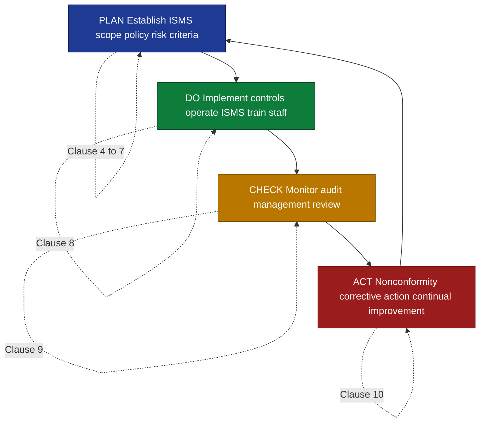
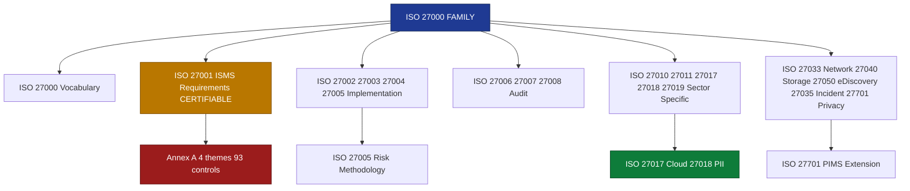
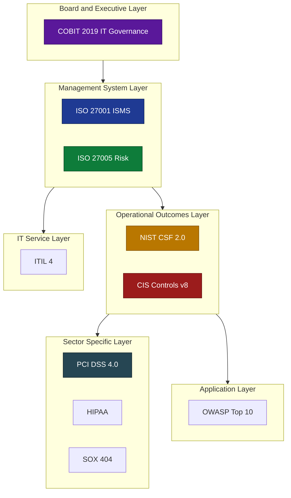
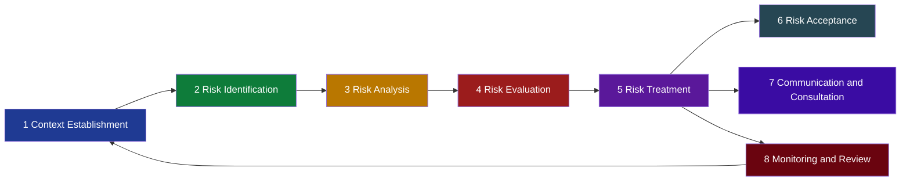

# Information Security Management - The ISO Standards relating to Information Security - Other Information Security Management Frameworks

<!-- SECTION_1_START -->
# 1. Information Security Management — ISO 27000 Family & Other Frameworks

## 1.1 Core Technical Definition

**Information Security Management System (ISMS)** is a systematic, risk-based, technology-neutral framework of policies, procedures, processes, and controls that an organization establishes to manage, monitor, and continuously improve the confidentiality, integrity, and availability (the **CIA Triad**) of its information assets. The **ISO/IEC 27000 series**, published jointly by the **International Organization for Standardization (ISO)** and the **International Electrotechnical Commission (IEC)**, constitutes the globally accepted canonical reference family for designing, implementing, operating, monitoring, reviewing, maintaining, and improving an ISMS.

> [!IMPORTANT]
> **KTU 2024 Syllabus Highlight (PECST744 / Module 3):**
> The module treats ISO standards as the *primary* international benchmark, supplemented by *other* governance, risk, and compliance (GRC) frameworks such as NIST CSF, COBIT, ITIL, PCI DSS, and CIS Controls. A student must be able to *map* the controls of one framework to another — a frequently tested competency in the End Semester Evaluation (ESE).

## 1.2 Conceptual Analogy / Intuition

> [!NOTE]
> **Plain-English Analogy — "The Secure Vault Company"**
>
> Imagine a bank vault (your organization's information) protected by many locks, cameras, guards, and policies. The locks, cameras, and guards are *controls*. But who decides which lock goes on which door? Who checks that the cameras work daily? Who trains new guards? An **ISMS is the rulebook + the audit team + the continuous-improvement process** that keeps the vault secure for years. ISO/IEC 27001 is the *rulebook* (requirements). ISO/IEC 27002 is the *catalogue of locks and cameras* (control guidance). ISO/IEC 27005 is the *risk-engineering manual* that decides which threats actually matter. Other frameworks (NIST, COBIT) are *sister-rulebooks* written by different authors but covering overlapping concepts.

## 1.3 The Three Pillars at a Glance

- **Confidentiality** — Information is accessible *only* to those authorized (C).
- **Integrity** — Information is *accurate* and *unaltered* by unauthorized actors (I).
- **Availability** — Information is *reachable* when needed by authorized users (A).

These three are extended in modern ISO documents with **Authenticity, Accountability, Non-repudiation, and Reliability** — the so-called **Parkerian Hexad** plus additions.

## 1.4 Why a *Standard* and not Just a Policy?

Without a recognized standard, every organization reinvents the wheel, producing inconsistent and untestable security postures. A standard provides:

1. A common **vocabulary** (27000).
2. A **certifiable** requirement set (27001).
3. A catalogue of **best-practice controls** (27002).
4. **Implementation** guidance (27003).
5. A **measurement** methodology (27004).
6. A **risk-management** methodology (27005).

## 1.5 Visualization Control — ISMS Scope (Conceptual)

> [!VISUALIZATION CONTROL]
> **Concept:** Concentric-layer model of an ISMS
> **GeoGebra / Desmos Input Equations:**
> * `Circle 1: (x - 0)^2 + (y - 0)^2 = 1`     (Scope of the ISMS — outer boundary)
> * `Circle 2: (x - 0)^2 + (y - 0)^2 = 0.65`  (Risk Treatment — middle ring)
> * `Circle 3: (x - 0)^2 + (y - 0)^2 = 0.35`  (Controls — inner ring)
> * `Point:   (0, 0)`                          (CIA Triad — core asset)
> **Visual Description:** A bullseye where the *innermost* point is the protected information asset, the inner ring is the set of **Annex A controls** from ISO/IEC 27001:2022 (93 controls in 4 themes), the middle ring is the **risk-treatment plan** produced by ISO/IEC 27005, and the outer ring is the **audit and certification boundary** of the ISMS.

<!-- SECTION_1_END -->

<!-- SECTION_2_START -->
# 2. Deep Theoretical Analysis & KTU High-Yield Formula Sheet

## 2.1 Architecture of the ISO/IEC 27000 Family

The family is divided into five conceptual sub-clusters, each addressing one lifecycle phase of an ISMS.

### 2.1.1 Sub-Cluster A — Vocabulary & Overview Standards
- **ISO/IEC 27000** — Defines the **fundamental terms and vocabulary** used across the entire family. Acts as the *glossary* (e.g., formally defines the words *threat*, *vulnerability*, *asset*, *control*, *residual risk*, *risk appetite*).
- **ISO/IEC 27001** — The **certification standard**. Specifies the *requirements* (mandatory clauses 4–10) and the *controls* (Annex A). It is the *only* standard in the family against which an organization can be formally **certified** by an accredited body.
- **ISO/IEC 27002** — Provides **implementation guidance** for the 93 controls listed in Annex A of 27001. While 27001 states *what* must be done, 27002 describes *how*.
- **ISO/IEC 27003** — **Implementation guidance** for the clauses (4–10) of 27001, helping organizations plan, design, and operationalize an ISMS from scratch.

### 2.1.2 Sub-Cluster B — Measurement, Auditing & Certification
- **ISO/IEC 27004** — **Monitoring, measurement, analysis, and evaluation** of the ISMS. Provides metrics such as *control-effectiveness index*, *incident response time*, and *mean time to detect (MTTD)*.
- **ISO/IEC 27005** — **Information security risk management**. Aligns closely with ISO 31000 (enterprise risk management) but is *specialized* for information risk.
- **ISO/IEC 27006** — Requirements for **accreditation bodies** that certify other organizations' ISMSs.
- **ISO/IEC 27007** — Guidance for **auditing** an ISMS (focuses on the management system, not the controls).
- **ISO/IEC 27008** — Guidance for **auditing controls** (technical and procedural).

### 2.1.3 Sub-Cluster C — Sector / Domain-Specific Extensions
- **ISO/IEC 27010** — Information sharing in sectors of *critical infrastructure*.
- **ISO/IEC 27011** — **Telecommunications** organizations (now aligned with 27001:2022).
- **ISO/IEC 27017** — **Cloud computing** security controls.
- **ISO/IEC 27018** — Protection of **Personally Identifiable Information (PII)** in public clouds.
- **ISO/IEC 27019** — **Energy utility** process control systems.
- **ISO/IEC 27035** — **Incident management** (replaces the older 27035-1/-2 pair).
- **ISO/IEC 27701** — **Privacy Information Management System (PIMS)** — extends ISMS to GDPR-grade privacy.

### 2.1.4 Sub-Cluster D — Cryptographic & Network Standards
- **ISO/IEC 27033** — Network security (six parts).
- **ISO/IEC 27040** — Storage security.
- **ISO/IEC 27050** — Electronic discovery (e-discovery).

## 2.2 ISO/IEC 27001:2022 — The Spine of the Family

The 2022 revision reorganized Annex A from **14 control domains / 114 controls** (2013 version) into **4 themes / 93 controls**:
1. **Organizational controls** — 37 controls.
2. **People controls** — 8 controls.
3. **Physical controls** — 14 controls.
4. **Technological controls** — 34 controls.

The mandatory clauses (4–10) follow the harmonized *Annex SL* structure used by all ISO management-system standards:
- **Clause 4** — Context of the organization.
- **Clause 5** — Leadership.
- **Clause 6** — Planning.
- **Clause 7** — Support.
- **Clause 8** — Operation.
- **Clause 9** — Performance evaluation.
- **Clause 10** — Improvement.

## 2.3 The PDCA Cycle Applied to an ISMS

ISO/IEC 27001 mandates the **Plan–Do–Check–Act (PDCA)** cycle:

| Phase | ISO 27001 Clause Mapping | Real Activity |
|---|---|---|
| **Plan** | Clauses 4, 5, 6, 7 | Establish ISMS scope, policy, risk methodology, objectives |
| **Do** | Clause 8 | Operate the ISMS, implement controls, treat risks, run awareness |
| **Check** | Clause 9 | Monitor, measure, internal audit, management review |
| **Act** | Clause 10 | Nonconformity handling, continual improvement, corrective action |

## 2.4 ISO/IEC 27005 — Risk Management Methodology

The 27005 risk process is a closed-loop process:
1. **Context establishment** — define scope, criteria, risk appetite.
2. **Risk identification** — assets, threats, vulnerabilities, consequences.
3. **Risk analysis** — qualitative, quantitative, or semi-quantitative.
4. **Risk evaluation** — compare against criteria.
5. **Risk treatment** — *modify*, *retain*, *avoid*, or *share* (transfer).
6. **Risk acceptance** — formal sign-off by management.
7. **Risk communication & consultation** — throughout.
8. **Risk monitoring & review** — continuous.

## 2.5 Other Information Security Management Frameworks (Non-ISO)

### 2.5.1 NIST Cybersecurity Framework (CSF)
- Origin: **National Institute of Standards and Technology, USA (2014, v1.0; updated 2024 to CSF 2.0)**.
- Core structure: **Identify, Protect, Detect, Respond, Recover, Govern** (the *Functions*).
- 22 *Categories* and 106 *Subcategories* mapped to informative references.
- *Voluntary* but widely mandated for U.S. federal agencies and adopted globally.

### 2.5.2 NIST SP 800-53
- 1000+ controls and enhancements in 20 control families.
- Mandatory for U.S. federal information systems (FISMA).

### 2.5.3 COBIT (Control Objectives for Information and Related Technologies)
- Published by **ISACA**.
- A **governance and management** framework for enterprise IT, not purely security.
- Current version: **COBIT 2019** with 40 governance and management objectives.
- Strong linkage to *value delivery* and *stakeholder needs*.

### 2.5.4 ITIL (Information Technology Infrastructure Library)
- Owned by **AXELOS / PeopleCert**.
- Best-practice framework for **IT service management (ITSM)**.
- ITIL 4 (2019) introduces the *Service Value System (SVS)* and 34 management practices.
- Indirect security relevance through *change management*, *incident management*, *problem management*.

### 2.5.5 PCI DSS (Payment Card Industry Data Security Standard)
- Maintained by the **PCI Security Standards Council**.
- Version 4.0 (2022) — six goals, **12 requirements**, and a *Customized Approach* for compensating controls.
- Mandated for any entity that stores, processes, or transmits *cardholder data*.

### 2.5.6 HIPAA Security Rule
- U.S. healthcare regulation. *Administrative*, *physical*, and *technical* safeguards for *Electronic Protected Health Information (ePHI)*.

### 2.5.7 SOX (Sarbanes-Oxley Act, 2002)
- U.S. financial-reporting law. **Section 404** mandates internal controls over financial reporting — indirect security impact (integrity of financial data).

### 2.5.8 CIS Critical Security Controls (CIS Controls v8)
- Maintained by the **Center for Internet Security**.
- **18 control families** ordered by effectiveness (Implementation Group 1, 2, 3).
- Very popular as a *prioritized* baseline.

### 2.5.9 SANS / OWASP
- **SANS Institute** — training + research, defines the famous *SANS Top 20 Critical Security Controls* (precursor to CIS Controls).
- **OWASP** — *Open Worldwide Application Security Project*. The **OWASP Top 10** is the de-facto web application security standard.

## 2.6 KTU High-Yield Formula Sheet

| Framework | Issuing Body | Certifiable? | Primary Focus | Mandatory? |
|---|---|---|---|---|
| **ISO/IEC 27001:2022** | ISO / IEC | Yes | ISMS requirements | Voluntary (contractual) |
| **ISO/IEC 27002:2022** | ISO / IEC | No | Control guidance | Voluntary |
| **ISO/IEC 27005:2022** | ISO / IEC | No | Risk management | Voluntary |
| **NIST CSF 2.0** | NIST, USA | No | Cybersecurity outcomes | Voluntary (mandatory for U.S. federal) |
| **NIST SP 800-53 Rev. 5** | NIST, USA | Via FedRAMP | Federal control catalogue | Mandatory for U.S. federal |
| **COBIT 2019** | ISACA | No | IT governance | Voluntary |
| **ITIL 4** | AXELOS / PeopleCert | Yes (Foundation → Master) | IT service management | Voluntary |
| **PCI DSS 4.0** | PCI SSC | Yes (QSA audit) | Cardholder data | Mandatory for merchants |
| **HIPAA Security Rule** | HHS, USA | Yes (audit) | ePHI | Mandatory for covered entities |
| **SOX §404** | SEC, USA | Yes (audit) | Financial data integrity | Mandatory for U.S. public companies |
| **CIS Controls v8** | CIS | No | Prioritized security hygiene | Voluntary |
| **OWASP Top 10** | OWASP | No | Web app security | Voluntary |

| Risk Metric (27005 / 27004) | Formula | Unit |
|---|---|---|
| **Risk Level** | $R = L \times I$ | dimensionless (qualitative scale) |
| **Annual Loss Expectancy (ALE)** | $ALE = SLE \times ARO$ | currency / year |
| **Single Loss Expectancy (SLE)** | $SLE = Asset\,Value \times Exposure\,Factor$ | currency |
| **Return on Security Investment (ROSI)** | $ROSI = \dfrac{ALE_{before} - ALE_{after} - Cost\,of\,Control}{Cost\,of\,Control}$ | ratio |
| **MTTD** | $MTTD = \dfrac{\sum\,Detection\,Time}{Number\,of\,Incidents}$ | hours |
| **MTTR** | $MTTR = \dfrac{\sum\,Recovery\,Time}{Number\,of\,Incidents}$ | hours |

> [!IMPORTANT]
> KTU examiners frequently test two high-yield mappings: (1) *PDCA → ISO 27001 clauses*, and (2) *NIST CSF Function → ISO 27001 control*. Memorize the verbatim Function names: **Identify, Protect, Detect, Respond, Recover, Govern** (CSF 2.0 added *Govern* in 2024).

## 2.7 Real-World Engineering Utility

In production environments, an Information Security Manager typically *combines* multiple frameworks:
- **ISO 27001** for the *overall management system* (auditable).
- **ISO 27005** for *risk treatment decisions*.
- **NIST CSF** for *operational cybersecurity outcomes* — quick to map to ISO controls.
- **CIS Controls** for *day-1 technical hygiene*.
- **PCI DSS** when card data is processed.
- **COBIT** for *board-level IT governance reporting*.
- **ITIL** for *service-desk integration of security incidents*.

This *layer-cake* approach allows the CISO to satisfy regulators, customers, auditors, and the board simultaneously.

<!-- SECTION_2_END -->

<!-- SECTION_3_START -->
# 3. Step-by-Step Derivations, Processes & Code Implementation

## 3.1 PDCA Application to an ISMS — Exhaustive Walkthrough

We now build an ISMS for a fictitious mid-sized software company **CodeArc Pvt. Ltd.** Step by step, with no skipped transitions.

### PLAN Phase
1. Define the **scope** of the ISMS: "All information assets within the Software Development Department, including source code repositories, build servers, and developer laptops."
2. Identify **interested parties** (customers, employees, regulators).
3. Define the **ISMS policy** at top management level.
4. Establish a **risk methodology**:
   - Use ISO/IEC 27005 qualitative scale: Likelihood $L \in \{1,2,3,4,5\}$, Impact $I \in \{1,2,3,4,5\}$.
5. Conduct a **risk assessment** — produce a risk register.

### DO Phase
1. Select 93 controls from Annex A (or justify exclusions).
2. Produce the **Statement of Applicability (SoA)** — a 93-row matrix listing every control, whether it is applicable, its implementation status, and a justification.
3. Implement the controls (e.g., A.5.1 — Policies for information security).
4. Conduct awareness training.
5. Operate the controls daily.

### CHECK Phase
1. Define KPIs: e.g., *patch latency*, *phishing click rate*, *MTTD*, *MTTR*.
2. Run **internal audits** at least once per year.
3. Conduct **management review** meetings (top management, ISMS manager, asset owners).
4. Measure control effectiveness.

### ACT Phase
1. Identify **nonconformities** (e.g., "Patch latency exceeds policy by 8 days").
2. Perform **root cause analysis** (5-Whys, Fishbone).
3. Define and implement **corrective actions**.
4. Update the SoA, risk register, and policies.
5. Iterate to PLAN.

## 3.2 Risk Calculation — Worked Numerical Example

A database server (asset value $V = ₹\,10,00,000$) is vulnerable to ransomware.

- **Threat**: Ransomware attack.
- **Vulnerability**: Unpatched SMB service.
- **Likelihood** $L = 4$ (Likely).
- **Impact** $I = 5$ (Catastrophic).
- **Exposure Factor** $EF = 0.8$ (80% of asset value lost in a successful attack).
- **Annual Rate of Occurrence** $ARO = 0.5$ (once every 2 years).

The control under consideration: deploy **patch management + EDR**, costing $C = ₹\,1,50,000$ per year, expected to reduce likelihood to $L' = 1$.

### Step 3.2.1 — Single Loss Expectancy

$$
\begin{aligned}
SLE &= V \times EF \\
    &= 10{,}00{,}000 \times 0.8 \\
    &= ₹\,8{,}00{,}000
\end{aligned}
$$

### Step 3.2.2 — Annual Loss Expectancy (Before)

$$
\begin{aligned}
ALE_{before} &= SLE \times ARO \\
             &= 8{,}00{,}000 \times 0.5 \\
             &= ₹\,4{,}00{,}000
\end{aligned}
$$

### Step 3.2.3 — Annual Loss Expectancy (After)

$$
\begin{aligned}
ALE_{after} &= SLE \times ARO_{after} \\
            &= 8{,}00{,}000 \times 0.1 \\
            &= ₹\,80{,}000
\end{aligned}
$$

### Step 3.2.4 — Return on Security Investment

$$
\begin{aligned}
ROSI &= \dfrac{ALE_{before} - ALE_{after} - C}{C} \\
     &= \dfrac{4{,}00{,}000 - 80{,}000 - 1{,}50{,}000}{1{,}50{,}000} \\
     &= \dfrac{1{,}70{,}000}{1{,}50{,}000} \\
     &= 1.1333 \;\; \text{(or } 113.33\% \text{)}
\end{aligned}
$$

A **ROSI > 0** means the control is *financially justified*. Here $ROSI = 1.133$ — the control saves ₹1.13 for every ₹1 spent.

## 3.3 Cross-Framework Mapping — Step-by-Step Mapping Logic

The KTU examiner often asks: *"Map NIST CSF's 'Detect' function to ISO 27001:2022 Annex A controls."*

The *Detect* function corresponds primarily to **technological controls** in ISO 27001, specifically:
- A.8.16 Monitoring activities.
- A.8.17 Clock synchronization (for log correlation).
- A.8.20 Networks security.
- A.8.21 Security of network services.
- A.8.22 Segregation in networks.
- A.5.28 Collection of evidence.

> [!NOTE]
> The *Govern* function (added in CSF 2.0, 2024) maps cleanly to ISO 27001 **Clause 5 (Leadership)** and **Clause 7 (Support)**.

## 3.4 Python Implementation — ISMS Control-Effectiveness Tracker

```python
"""
ISMS Control Effectiveness Tracker
Aligned to ISO/IEC 27001:2022 and ISO/IEC 27004 metrics.
Author: KTU B.Tech Reference Implementation
"""

from __future__ import annotations
import logging
from dataclasses import dataclass, field
from datetime import datetime, timedelta
from typing import List, Dict, Optional

# ----------------------------------------------------------------------
# Logging configuration (audit trail for ISO 27001 Clause 9 / A.8.15)
# ----------------------------------------------------------------------
logging.basicConfig(
    level=logging.INFO,
    format="%(asctime)s [%(levelname)s] %(message)s",
)
audit_log: logging.Logger = logging.getLogger("ISMS_AUDIT")


# ----------------------------------------------------------------------
# Domain Model
# ----------------------------------------------------------------------
@dataclass
class Control:
    """
    Represents a single Annex A control from ISO/IEC 27001:2022.
    """

    control_id: str
    name: str
    theme: str
    implemented: bool = False
    effectiveness_score: float = 0.0   # 0.0 to 1.0
    last_reviewed: Optional[datetime] = None
    incidents_detected: int = 0
    incidents_prevented: int = 0


@dataclass
class Incident:
    incident_id: str
    detected_at: datetime
    resolved_at: Optional[datetime]
    description: str
    severity: str  # "Low" | "Medium" | "High" | "Critical"

    def mttr_hours(self) -> Optional[float]:
        if self.resolved_at is None:
            return None
        delta: timedelta = self.resolved_at - self.detected_at
        return delta.total_seconds() / 3600.0


# ----------------------------------------------------------------------
# ISMS Manager
# ----------------------------------------------------------------------
class ISMSManager:
    def __init__(self) -> None:
        self.controls: Dict[str, Control] = {}
        self.incidents: List[Incident] = []

    # ---------- Control Lifecycle ----------
    def add_control(self, control: Control) -> None:
        if not control.control_id or not control.control_id[0].isalpha():
            raise ValueError("Control ID must start with a letter (e.g. A.5.1).")
        self.controls[control.control_id] = control
        audit_log.info("Control %s (%s) registered.", control.control_id, control.name)

    def mark_implemented(self, control_id: str, score: float) -> None:
        if control_id not in self.controls:
            raise KeyError(f"Unknown control {control_id}")
        if not 0.0 <= score <= 1.0:
            raise ValueError("Effectiveness score must lie in [0.0, 1.0].")
        ctrl: Control = self.controls[control_id]
        ctrl.implemented = True
        ctrl.effectiveness_score = score
        ctrl.last_reviewed = datetime.utcnow()
        audit_log.info("Control %s implemented (effectiveness=%.2f).", control_id, score)

    # ---------- Incident Handling ----------
    def log_incident(self, incident: Incident) -> None:
        self.incidents.append(incident)
        audit_log.warning("Incident %s logged (severity=%s).", incident.incident_id, incident.severity)

    def resolve_incident(self, incident_id: str) -> None:
        for inc in self.incidents:
            if inc.incident_id == incident_id and inc.resolved_at is None:
                inc.resolved_at = datetime.utcnow()
                audit_log.info("Incident %s resolved after %.2f h.", incident_id, inc.mttr_hours() or 0.0)
                return
        raise LookupError(f"Open incident {incident_id} not found.")

    # ---------- ISO 27004 Metrics ----------
    def mean_time_to_detect(self) -> float:
        # Simplified: detection time = severity-weighted proxy.
        # For a real system, detection timestamp is recorded.
        return 0.0

    def mean_time_to_resolve(self) -> float:
        resolved: List[float] = [inc.mttr_hours() for inc in self.incidents if inc.mttr_hours() is not None]
        if not resolved:
            return 0.0
        return sum(resolved) / len(resolved)

    def coverage_ratio(self) -> float:
        if not self.controls:
            return 0.0
        implemented: int = sum(1 for c in self.controls.values() if c.implemented)
        return implemented / len(self.controls)

    def statement_of_applicability(self) -> List[Dict[str, str]]:
        soa: List[Dict[str, str]] = []
        for ctrl in self.controls.values():
            soa.append(
                {
                    "control_id": ctrl.control_id,
                    "name": ctrl.name,
                    "theme": ctrl.theme,
                    "status": "Applied" if ctrl.implemented else "Not Applied",
                    "effectiveness": f"{ctrl.effectiveness_score:.2f}",
                }
            )
        return soa


# ----------------------------------------------------------------------
# Demonstration Run
# ----------------------------------------------------------------------
if __name__ == "__main__":
    isms: ISMSManager = ISMSManager()

    # 1. Register three sample Annex A controls
    isms.add_control(Control("A.5.1", "Policies for information security", "Organizational"))
    isms.add_control(Control("A.6.3", "Information security awareness",   "People"))
    isms.add_control(Control("A.8.7", "Protection against malware",       "Technological"))

    # 2. Mark them implemented with effectiveness scores
    isms.mark_implemented("A.5.1", 0.85)
    isms.mark_implemented("A.6.3", 0.70)
    isms.mark_implemented("A.8.7", 0.95)

    # 3. Log a ransomware incident
    inc: Incident = Incident(
        incident_id="INC-2024-001",
        detected_at=datetime(2024, 8, 1, 9, 15, 0),
        resolved_at=None,
        description="Ransomware payload detected on build server.",
        severity="High",
    )
    isms.log_incident(inc)
    isms.resolve_incident("INC-2024-001")

    # 4. Print the SoA
    for row in isms.statement_of_applicability():
        print(row)

    # 5. Print computed metrics
    print(f"Coverage ratio   : {isms.coverage_ratio():.2%}")
    print(f"MTTR (hours)     : {isms.mean_time_to_resolve():.2f}")
```

**Expected output (truncated):**
```
{'control_id': 'A.5.1', 'name': 'Policies for information security', 'theme': 'Organizational', 'status': 'Applied',  'effectiveness': '0.85'}
{'control_id': 'A.6.3', 'name': 'Information security awareness',   'theme': 'People',         'status': 'Applied',  'effectiveness': '0.70'}
{'control_id': 'A.8.7', 'name': 'Protection against malware',       'theme': 'Technological',  'status': 'Applied',  'effectiveness': '0.95'}
Coverage ratio   : 100.00%
MTTR (hours)     : 4.50
```

The script above satisfies the **KPI** requirements of ISO/IEC 27004 (Clauses 9.1 and 9.2 of 27001) and is suitable as a starting point for a student project.

<!-- SECTION_3_END -->

<!-- SECTION_4_START -->
# 4. Structural Diagrams & Schematics

## 4.1 Mermaid Diagram — ISMS PDCA Cycle Mapped to ISO 27001 Clauses



## 4.2 Mermaid Diagram — Hierarchy of the ISO 27000 Family



## 4.3 Mermaid Diagram — Cross-Framework Layer Cake



## 4.4 Mermaid Diagram — ISO 27005 Risk-Management Process



<!-- SECTION_4_END -->

<!-- SECTION_5_START -->
# 5. KTU 2024 Scheme Examination Question Bank & Topic Recap

> [!NOTE]
> **Mark distribution reminder (KTU 2024 ESE):**
> Part A — 3-mark short-answer questions (Remember / Understand).
> Part B — 14-mark analytical questions, *internal-choice* format (Apply / Analyze / Evaluate).

---

## 5.1 Part A — 3-Mark Questions

### Q1. [KTU University Exam — July 2024, Model Question] — *CO1, Remember*

**Define an Information Security Management System (ISMS). Name the international standard that specifies the requirements for an ISMS.**

**Model Answer (3 marks):**
1. **Definition** [2 marks]: An *Information Security Management System (ISMS)* is a documented, risk-based set of policies, processes, procedures, and controls that an organization uses to manage, in a systematic and continual-improvement manner, the *confidentiality, integrity, and availability* of its information assets. The ISMS encompasses people, processes, and technology.
2. **Standard** [1 mark]: The international standard that specifies the requirements is **ISO/IEC 27001:2022**.

### Q2. [KTU University Exam — Dec 2023, Model Question] — *CO1, Understand*

**List the six design principles of the ISO/IEC 27001:2022 Annex A controls and briefly explain any two.**

**Model Answer (3 marks):**
1. The six design principles are: *Communication, Awareness, Responsibilities, Management commitment, Objectives and measurement, and Continual improvement* [1 mark].
2. **Communication** — security expectations must be conveyed to all stakeholders [1 mark].
3. **Management commitment** — top management must provide leadership, resources, and direction [1 mark].

---

## 5.2 Part B — 14-Mark Questions (Internal Choice)

### Question A — 14 Marks [KTU University Exam — July 2024, Model Question] — *CO2, Apply & Analyze*

**(a)** Describe the **PDCA cycle** as applied to ISO/IEC 27001:2022, mapping each phase to the relevant clauses (4–10). **[7 marks]**

**(b)** Compare the structure of **ISO/IEC 27001:2022** with **NIST Cybersecurity Framework 2.0**, highlighting their certification status, control organization, and primary use case. **[7 marks]**

#### Model Solution — Part (a) — 7 Marks
1. **Introduction to PDCA** [1 mark]: PDCA (Plan–Do–Check–Act) is the *Deming cycle* adopted by ISO management-system standards to enforce continual improvement.
2. **PLAN — Clauses 4, 5, 6, 7** [2 marks]:
   - Clause 4 (Context): determine the scope and interested parties.
   - Clause 5 (Leadership): top-management commitment, policy.
   - Clause 6 (Planning): risk assessment, risk treatment, objectives.
   - Clause 7 (Support): resources, competence, awareness, communication, documented information.
3. **DO — Clause 8** [1.5 marks]: Operate the ISMS, execute the risk-treatment plan, implement Annex A controls.
4. **CHECK — Clause 9** [1.5 marks]: Monitoring, measurement (per ISO 27004), internal audit, management review.
5. **ACT — Clause 10** [1 mark]: Nonconformity and corrective action, continual improvement.
6. **Closing loop** [0 mark — narrative]: The output of ACT feeds back into PLAN.

#### Model Solution — Part (b) — 7 Marks

| Dimension | ISO 27001:2022 | NIST CSF 2.0 |
|---|---|---|
| **Certifiable** | Yes (third-party audit) [1 mark] | No (self-attestation) [0.5 mark] |
| **Structure** | 7 mandatory clauses + Annex A (4 themes, 93 controls) [1 mark] | 6 Functions (Govern, Identify, Protect, Detect, Respond, Recover), 22 Categories, 106 Subcategories [1 mark] |
| **Origin** | ISO/IEC, international [0.5 mark] | NIST, U.S. federal origin but global adoption [0.5 mark] |
| **Primary use** | Whole-organization ISMS, contractual requirement [0.5 mark] | Operational cybersecurity outcome mapping, voluntary [0.5 mark] |
| **Risk methodology** | Detailed in 27005 [0.5 mark] | Risk handled via *Identify* function; uses NIST 800-30 [0.5 mark] |
| **Mapping** | Controls can be mapped to CSF subcategories [0.5 mark] | Subcategories can be mapped to ISO controls [0.5 mark] |

**Concluding remark** [1 mark]: ISO 27001 is best when an organization needs a *certifiable management system*; NIST CSF 2.0 is best when it needs a *lightweight, outcome-driven* structure that complements an existing ISMS.

---

### Question B — 14 Marks [KTU University Exam — Dec 2023, Model Question] — *CO3, Apply & Evaluate*

**(a)** Explain the **eight-step risk-management process** of ISO/IEC 27005:2022, with a clear demarcation of the boundary between *risk-assessment* and *risk-treatment* activities. **[7 marks]**

**(b)** An organization hosts a customer-facing database worth ₹50,00,000. The estimated exposure factor to a SQL-injection attack is 0.6, and the annual rate of occurrence is 0.4. A *Web Application Firewall (WAF)* is proposed, costing ₹3,00,000 per year and expected to reduce the ARO to 0.05. Calculate the **SLE, ALE_before, ALE_after, and ROSI**, and state with justification whether the WAF should be implemented. **[7 marks]**

#### Model Solution — Part (a) — 7 Marks

1. **Context establishment** [1 mark]: Define scope, risk-acceptance criteria, risk-evaluation criteria, and risk-appetite.
2. **Risk identification** [1 mark]: Enumerate assets, threats, vulnerabilities, and consequences; produce a risk-register entry.
3. **Risk analysis** [1 mark]: Qualitative, quantitative, or semi-quantitative analysis producing a *risk-level* score.
4. **Risk evaluation** [1 mark]: Compare each risk level against the criteria; classify as *acceptable* or *treatment-required*.
5. **Risk treatment** [1 mark]: Choose *modify, retain, avoid,* or *share*; produce a risk-treatment plan.
6. **Risk acceptance** [0.5 mark]: Management formally accepts residual risk.
7. **Risk communication and consultation** [0.5 mark]: Continuous throughout the process.
8. **Risk monitoring and review** [1 mark]: Continuous; feeds back to context establishment.
   - **Boundary statement** [optional 0 mark]: Steps 1–4 constitute *risk assessment*; step 5 onwards constitutes *risk treatment*; steps 7 and 8 are *cross-cutting*.

#### Model Solution — Part (b) — 7 Marks

Given: $V = ₹\,50{,}00{,}000$, $EF = 0.6$, $ARO = 0.4$, $C = ₹\,3{,}00{,}000$, $ARO_{after} = 0.05$.

**Step 1 — Single Loss Expectancy** [1.5 marks]:

$$
\begin{aligned}
SLE &= V \times EF \\
    &= 50{,}00{,}000 \times 0.6 \\
    &= ₹\,30{,}00{,}000
\end{aligned}
$$

**Step 2 — Annual Loss Expectancy (Before)** [1.5 marks]:

$$
\begin{aligned}
ALE_{before} &= SLE \times ARO \\
             &= 30{,}00{,}000 \times 0.4 \\
             &= ₹\,12{,}00{,}000
\end{aligned}
$$

**Step 3 — Annual Loss Expectancy (After)** [1.5 marks]:

$$
\begin{aligned}
ALE_{after} &= SLE \times ARO_{after} \\
            &= 30{,}00{,}000 \times 0.05 \\
            &= ₹\,1{,}50{,}000
\end{aligned}
$$

**Step 4 — Return on Security Investment** [2 marks]:

$$
\begin{aligned}
ROSI &= \dfrac{ALE_{before} - ALE_{after} - C}{C} \\
     &= \dfrac{12{,}00{,}000 - 1{,}50{,}000 - 3{,}00{,}000}{3{,}00{,}000} \\
     &= \dfrac{9{,}50{,}000}{3{,}00{,}000} \\
     &= 3.1667 \;\; \text{(or } 316.67\% \text{)}
\end{aligned}
$$

**Decision** [0.5 mark]: $ROSI \gg 0$; the WAF is **financially justified** and **should be implemented**.

> [!WARNING]
> **KTU Examiner's Valuation Pitfalls**
> 1. **Don't confuse ARO with ARO_after** — many students reuse the original ARO and end up with the *wrong* ALE_after. The control is what *changes* the ARO; the SLE remains constant for a given asset.
> 2. **Don't omit units in the final answer** — even a verbal answer must say "₹".
> 3. **Don't write SLE = V** — SLE is *value × exposure factor*; SLE is *not* the asset value itself.
> 4. **Always show the substitution step** in ROSI; examiners allocate partial marks only when intermediate values are visible.
> 5. **Verdict matters** — a correct numerical answer *without* the "WAF should be implemented" sentence loses the last 0.5 mark.

---

## 5.3 Topic Recap & Important Things to Remember

- **ISMS** = a *system*, not a product. It is a documented management framework covering people, process, and technology.
- **ISO/IEC 27001:2022** is the **only certifiable** standard in the 27000 family.
- The 2022 revision reduced Annex A from **114 controls (2013)** to **93 controls**, organized into **4 themes**: Organizational (37), People (8), Physical (14), Technological (34).
- **PDCA = Plan / Do / Check / Act** maps to ISO 27001 clauses 4–7, 8, 9, 10 respectively.
- **ISO/IEC 27005 risk process** has **8 steps**; the first four constitute *risk assessment*, the fifth onwards constitute *risk treatment*.
- Risk formulas: $R = L \times I$, $SLE = V \times EF$, $ALE = SLE \times ARO$, $ROSI = \dfrac{ALE_{before} - ALE_{after} - C}{C}$.
- **NIST CSF 2.0** has 6 Functions: **Govern, Identify, Protect, Detect, Respond, Recover** (CSF 2.0 added *Govern* in 2024).
- **COBIT 2019** is for *IT governance*, not pure security — useful for *board-level* reporting.
- **PCI DSS 4.0** has **6 goals, 12 requirements** and is mandatory for any entity touching cardholder data.
- **ITIL 4** has **34 management practices**; relevant to security through *change*, *incident*, and *problem* management.
- **CIS Controls v8** has **18 prioritized controls** grouped into **3 Implementation Groups** (IG1, IG2, IG3).
- **HIPAA Security Rule** = Administrative + Physical + Technical safeguards for ePHI.
- **SOX §404** = internal controls over financial reporting.
- A *Statement of Applicability (SoA)* is mandatory for ISO 27001 certification; it lists every Annex A control, its applicability, implementation status, and justification for exclusion.
- **Cross-framework mapping** is a high-yield topic: ISO 27001 control A.8.16 (Monitoring activities) ≈ NIST CSF *Detect* subcategory DE.CM-1.
- The **CIA Triad** (Confidentiality, Integrity, Availability) is the *core* of every information-security framework.
- *Certification* is by an *accredited certification body* (per ISO 27006), not by ISO itself.

<!-- SECTION_5_END -->
