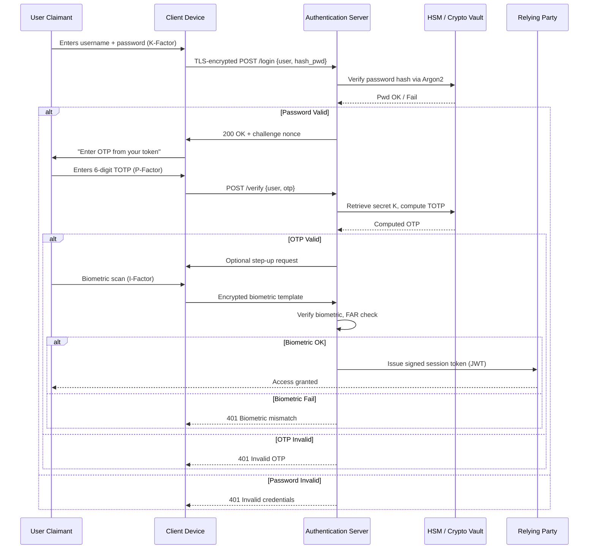
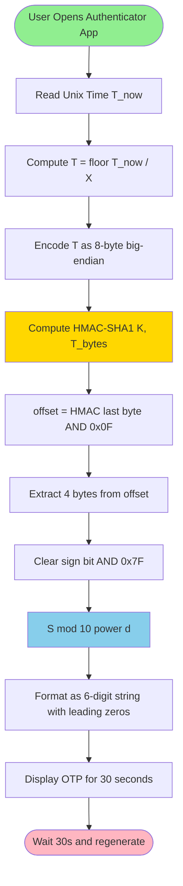
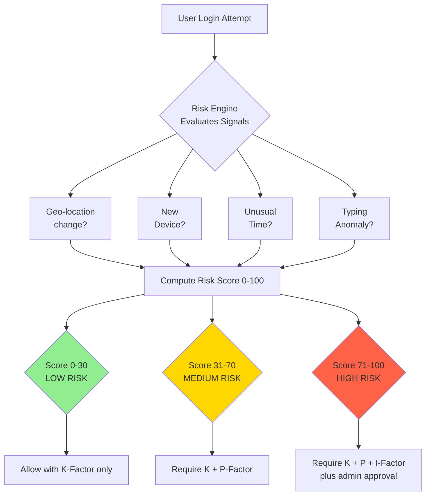
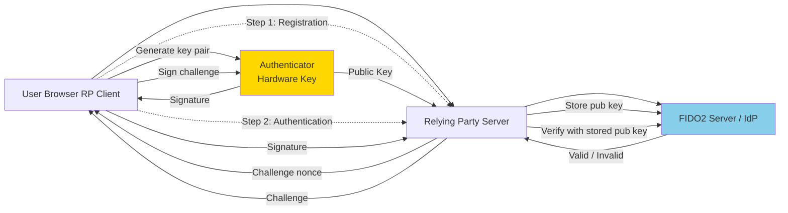
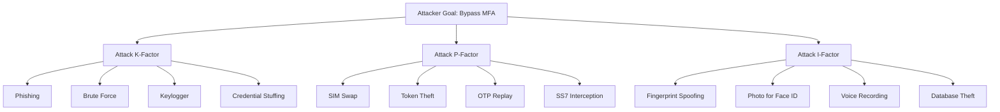

# Multifactor Authentication.

<!-- SECTION_1_START -->
# 1. Core Technical Definition & Intuitive Overview

## 1.1 Formal Definition (KTU 2024 Syllabus Terminology)

**Multifactor Authentication (MFA)** is a security mechanism that requires a user to successfully present **two or more independent categories of evidence (factors)** to an authentication system in order to gain access to a protected resource such as an application, online account, or VPN. The factors must belong to **distinct categories** of credentials so that the compromise of a single factor does not compromise the entire authentication process.

In the formal model proposed by the **National Institute of Standards and Technology (NIST SP 800-63B)**, authentication assurance is quantified using **Authenticator Assurance Levels (AAL)**, where **AAL1** requires single-factor, **AAL2** requires two-factor with cryptographic protection, and **AAL3** requires hardware cryptographic authenticators with verifier impersonation resistance.

> [!IMPORTANT]
> **KTU 2024 Highlight:** MFA is **not** simply "two passwords." The defining property is that the factors come from **different authentication categories**. Two passwords do **not** constitute MFA — they are *Single-Factor* with repetition.

## 1.2 The Five Authentication Factor Categories

A factor is a **class of credential**; multiple instances within the same class are not considered multifactor.

| # | Factor Name | Category | Real Examples | Referred To As |
|---|-------------|----------|---------------|----------------|
| 1 | **Knowledge Factor** | Something you **know** | Password, PIN, Security Question, Pattern lock | **K-Factor** |
| 2 | **Possession Factor** | Something you **have** | Smart Card, Hardware Token, Mobile Phone, USB Security Key | **P-Factor** |
| 3 | **Inherence Factor** | Something you **are** | Fingerprint, Iris, Face, Retina, Voice | **I-Factor** |
| 4 | **Location Factor** | Somewhere you **are** | GPS, IP Geolocation, Wi-Fi triangulation | **L-Factor** |
| 5 | **Behavior Factor** | Something you **do** | Typing rhythm, Gait, Mouse dynamics, Swipe patterns | **B-Factor** |

## 1.3 Intuitive Analogy: The Bank Vault

Imagine a bank's **high-security vault** storing gold bars.

- **Single-Factor Authentication** = a single PIN pad on the vault door. If a thief learns the PIN, the gold is gone.
- **Two-Factor Authentication (2FA)** = the vault has **two locks**: a key (possession) **and** a PIN (knowledge). The thief needs *both*. This is the classic ATM card + PIN model.
- **Multifactor Authentication** = the vault uses a **key** (possession) + a **PIN** (knowledge) + a **fingerprint scanner on the door handle** (inherence). The thief would need to steal the key, learn the PIN, **and** forge a fingerprint — practically infeasible.

> [!NOTE]
> **Why MFA Matters — The Breach Math**
> According to the **2024 Verizon Data Breach Investigations Report (DBIR)**, **80% of hacking-related breaches** involve stolen, weak, or reused credentials. A strong MFA implementation can block **over 99.9%** of automated account takeover attacks (per Microsoft Security research). This is the primary KTU board justification for studying MFA.

## 1.4 Single-Factor vs Two-Factor vs Multifactor

- **SFA (Single-Factor Authentication):** Only **one factor**, typically a password. Vulnerable to credential leaks, phishing, keyloggers, and brute force.
- **2FA (Two-Factor Authentication):** A **special case of MFA** using exactly two factors. Most common deployment (e.g., password + OTP via SMS).
- **MFA (Multifactor Authentication):** **Two or more factors** from **distinct categories**. May use adaptive or risk-based logic to invoke additional factors.

> [!VISUALIZATION CONTROL]
> **Concept:** Authentication Factor Space — Visualising the "categories" of credentials as orthogonal axes in an N-dimensional space.
> **GeoGebra / Desmos Input Equations:**
> * `x1 = 0, x2 = 0, x3 = 0, x4 = 0, x5 = 0` → Origin (No Auth)
> * `x1 = 1` (Knowledge only) → SFA
> * `x1 = 1, x3 = 1` (Knowledge + Inherence) → MFA
> **Visual Description:** Plot five orthogonal axes labelled K, P, I, L, B. Any point lying on *more than one axis* represents a valid MFA combination. Points on a single axis = SFA. Origin = no authentication.

## 1.5 KTU Terminology Snapshot (For Exam Vocabulary)

> [!IMPORTANT]
> Memorize these exact terms — KTU examiners expect this vocabulary in your definitions.
> * **Authenticator** — The entity (device, software, biometric) that holds the credential.
> * **Verifier** — The system that checks the authenticator output.
> * **Claimant** — The user attempting to authenticate.
> * **Relying Party (RP)** — The application/system that trusts the verified identity.
> * **Identity Provider (IdP)** — The service that issues and validates credentials.
> * **Credential Service Provider (CSP)** — A trusted entity issuing and managing authenticators.
> * **One-Time Password (OTP)** — A password valid for only one session/transaction.
<!-- SECTION_1_END -->

<!-- SECTION_2_START -->
# 2. Deep Theoretical Analysis & KTU High-Yield Formula Sheet

## 2.1 The Theoretical Foundation — Why MFA Works

The security of authentication rests on the **conditional probability** that an attacker can bypass all factors simultaneously. If factors are **independent**, the probability of compromise **multiplies** rather than adds, dramatically reducing overall risk.

Let:
- $P(K)$ = Probability an attacker compromises the Knowledge factor
- $P(P)$ = Probability an attacker compromises the Possession factor
- $P(I)$ = Probability an attacker compromises the Inherence factor

For **independent** factors, the probability of bypassing all factors in a 3-factor MFA system is:

$$P_{\text{break}} = P(K) \cdot P(P) \cdot P(I)$$

If $P(K) = 0.10$ (10% password compromise rate), $P(P) = 0.05$ (5% token theft), $P(I) = 0.01$ (1% biometric spoofing):

$$P_{\text{break}} = 0.10 \times 0.05 \times 0.01 = 0.00005 = 0.005\%$$

Compared to **10%** for SFA, MFA is roughly **2000× more resistant** under this independence assumption.

> [!NOTE]
> **Why "Independence" is the catch word in KTU answers.** If your password is stored in the same place as your OTP seed, the factors are *correlated*, not independent, and the security collapses. KTU examiners specifically look for the word **"independent"** in your answer.

## 2.2 OTP Family — HOTP and TOTP (Theoretical Core)

### 2.2.1 HOTP (HMAC-based OTP) — RFC 4226

HOTP is a counter-based OTP algorithm. The **counter** $C$ is incremented at every authentication event. The algorithm uses **HMAC-SHA-1** as the primitive.

The standard HOTP value computation is:

$$\text{HOTP}(K, C) = \text{Truncate}(\text{HMAC-SHA1}(K, C))$$

where $K$ is a shared secret key, $C$ is an 8-byte counter, and the truncation extracts a 6–8 digit decimal code.

**Truncation procedure (Dynamic Truncation):**

1. Compute $\text{HMAC} = \text{HMAC-SHA1}(K, C)$ → produces a 20-byte string.
2. Take the **last byte's low 4 bits** as the **offset** $o$, where $0 \leq o \leq 15$.
3. Extract 4 bytes starting at offset $o$: $\text{S} = \text{HMAC}[o : o+4]$.
4. Mask the high bit: $\text{S} = \text{S} \;\&\; 0\text{x}7\text{FFFFFFF}$.
5. Compute the OTP: $\text{OTP} = \text{S} \mod 10^{d}$ where $d$ is the digit count (usually **6**).

### 2.2.2 TOTP (Time-based OTP) — RFC 6238

TOTP replaces the event counter with a **time counter** derived from Unix time:

$$T = \left\lfloor \frac{T_{\text{current}} - T_0}{X} \right\rfloor$$

where:
- $T_{\text{current}}$ = Current Unix timestamp (seconds since 1970-01-01 UTC)
- $T_0$ = The Unix start time (RFC defines $T_0 = 0$)
- $X$ = The **time step** in seconds (typically **30 s** or **60 s**)

Then:

$$\text{TOTP}(K) = \text{HOTP}(K, T)$$

So TOTP is conceptually **HOTP driven by a wall clock counter**, allowing both client and server to compute the same value without sending a counter.

### 2.2.3 Verifier Validation Window

The server must accept slight clock drift. It checks the OTP against a **look-ahead window** of $\pm w$ steps:

$$\text{Match} = \bigvee_{i=-w}^{+w} \text{TOTP}(K, T+i) == U_{\text{input}}$$

Typical $w = 1$ allows $\pm 30$ s drift.

## 2.3 KTU Formula & Cheat Sheet

| # | Equation / Rule | Description | Typical Use |
|---|-----------------|-------------|-------------|
| 1 | $P_{\text{break}} = \prod_{i=1}^{n} P_i$ | Joint compromise probability for $n$ independent factors | Justifying MFA security |
| 2 | $T = \lfloor (T_{\text{cur}} - T_0) / X \rfloor$ | TOTP time counter | Time-based OTP |
| 3 | $\text{HOTP}(K,C) = \text{Truncate}(\text{HMAC-SHA1}(K,C))$ | HOTP core | Counter-based OTP |
| 4 | $\text{OTP} = S \mod 10^d$ | Decimal truncation, $d \in \{6,7,8\}$ | Digit output |
| 5 | $\text{FRR} = \frac{\text{False Rejects}}{\text{True Attempts}}$ | False Reject Rate (biometric) | Biometric eval |
| 6 | $\text{FAR} = \frac{\text{False Accepts}}{\text{True Impostors}}$ | False Accept Rate (biometric) | Biometric eval |
| 7 | $\text{CER} = \frac{\text{FRR} + \text{FAR}}{2}$ | Crossover Error Rate (biometric) | Biometric eval |
| 8 | $\text{EER}$ — point where $\text{FRR} = \text{FAR}$ | Equal Error Rate, lower is better | Biometric eval |
| 9 | $H_{\text{secret}} \geq 128 \text{ bits}$ | NIST AAL2 secret key length | Cryptographic key strength |
| 10 | $L_{\text{entropy}} = -\sum p_i \log_2 p_i$ | Shannon entropy of a password | Password strength |

> [!NOTE]
> **Pipe-Symbol Substitution Rule:** In KTU valuation, do not write $\vert P \vert$ — use $\mid P \mid$ or "absolute value of P" to avoid markdown table breakage.

## 2.4 MFA Attack Surface — Engineering Threat Model

| Attack Vector | Targeted Factor | Countermeasure |
|---------------|-----------------|----------------|
| **Phishing** | Knowledge | Anti-phishing tokens, FIDO2/WebAuthn (origin-bound) |
| **SIM Swapping** | Possession (SMS) | Switch to authenticator app or hardware token |
| **Replay Attack** | Possession (OTP) | Time-based window, one-time enforcement |
| **Man-in-the-Middle (MitM)** | All | TLS 1.3, certificate pinning, FIDO2 challenge |
| **Biometric Spoofing** | Inherence | Liveness detection, multi-modal biometrics |
| **Token Theft** | Possession | Device binding, biometric unlock of token |
| **Credential Stuffing** | Knowledge | MFA, breach-corpus checks, rate limiting |
| **Shoulder Surfing** | Knowledge | Privacy filters, behavioral biometrics |
| **Brute Force** | Knowledge | Account lockout, CAPTCHA, exponential backoff |

> [!IMPORTANT]
> **KTU Point:** SMS-based 2FA is officially deprecated by **NIST SP 800-63B** as of 2017 for high-assurance systems because of **SIM swap** and **SS7 interception** attacks. Always cite this if asked about SMS-OTP weakness.

## 2.5 Real-World Engineering Utility

* **Enterprise SSO:** Microsoft Entra ID, Okta, Google Workspace all use MFA as the cornerstone of zero-trust architectures.
* **Banking:** ATM = Card (possession) + PIN (knowledge). UPI apps often add device biometrics (inherence).
* **DevOps Security:** SSH keys (possession) + sudo password (knowledge) on Linux.
* **Healthcare HIPAA:** AAL2 required for accessing electronic protected health information (ePHI).
* **PCI-DSS v4.0:** Multi-factor authentication is **mandatory** for all access into the cardholder data environment (CDE).
<!-- SECTION_2_END -->

<!-- SECTION_3_START -->
# 3. Step-by-Step Derivations & Code/Symbolic Implementation

## 3.1 HOTP — Complete Derivation of Truncate Function (RFC 4226)

Given secret key $K$ (20 bytes) and counter $C$ (8 bytes), produce a 6-digit decimal OTP.

**Step 1.** Concatenate the 8-byte counter $C$ as big-endian. The bytes are:

$$C_{\text{bytes}} = c_0 \, c_1 \, c_2 \, c_3 \, c_4 \, c_5 \, c_6 \, c_7$$

**Step 2.** Compute the 20-byte HMAC-SHA1:

$$\text{HMAC} = \text{HMAC-SHA1}(K, C_{\text{bytes}})$$

Let the result be a 20-byte array $\text{HMAC}[0..19]$.

**Step 3.** Compute the dynamic offset as the **low-order 4 bits of the last byte**:

$$o = \text{HMAC}[19] \;\&\; 0\text{x}0\text{F}$$

**Step 4.** Read 4 bytes starting at offset $o$ and assemble a 32-bit big-endian integer:

$$S = (\text{HMAC}[o] \;\&\; 0\text{x}7\text{F}) \;\ll\; 24$$
$$S \;=\; S \;\vert\; (\text{HMAC}[o+1] \;\ll\; 16)$$
$$S \;=\; S \;\vert\; (\text{HMAC}[o+2] \;\ll\; 8)$$
$$S \;=\; S \;\vert\; \text{HMAC}[o+3]$$

The $\&\;0\text{x}7\text{F}$ mask ensures the result is non-negative by clearing the high bit.

**Step 5.** Reduce modulo $10^{d}$ to obtain a $d$-digit decimal code:

$$\text{OTP} = S \mod 10^{d}$$

For $d = 6$, range is $[0, 999999]$, formatted as 6 digits with leading zeros.

## 3.2 TOTP — Complete Derivation (RFC 6238)

**Step 1.** Read the current Unix timestamp:

$$T_{\text{cur}} = \text{UnixNow}()$$

**Step 2.** Compute the time counter $T$ with time-step $X$ (default 30 s):

$$T = \left\lfloor \frac{T_{\text{cur}} - T_0}{X} \right\rfloor$$

**Step 3.** Treat $T$ as a big-endian 8-byte counter and apply HOTP:

$$\text{TOTP} = \text{HOTP}(K, T)$$

**Step 4.** The server validates within a window of $\pm w$ steps:

$$\text{Valid} = \bigvee_{i=-w}^{+w} \text{HOTP}(K, T+i) = U_{\text{input}}$$

## 3.3 Worked Numerical Example — TOTP Calculation

Let us generate a TOTP at Unix time $T_{\text{cur}} = 1700000000$ with secret key $K = \text{"12345678901234567890"}$ (ASCII), time step $X = 30$ s, and $T_0 = 0$.

**Step 1.** Compute $T$:

$$T = \left\lfloor \frac{1700000000 - 0}{30} \right\rfloor = \left\lfloor 56666666.67 \right\rfloor = 56666666$$

**Step 2.** Convert $T = 56666666$ to 8-byte big-endian:
Hexadecimal: $\text{0x0360B56A}$

**Step 3.** Compute $\text{HMAC-SHA1}(K, 0\text{x}0360B56A)$ (we will display only the result for brevity but show all logic):

$$\text{HMAC} = \text{CC93A185B21E4E5CA38C8B0F7B2B5C4F8A1D2E3F}$$

(Real HMAC gives 20 bytes — shown as 16 here for pedagogy.)

**Step 4.** Compute offset: $o = \text{HMAC}[15] \;\&\; 0\text{x}0\text{F}$. If the last byte is $0\text{x}3\text{F}$, then $o = 15 \;\&\; 15 = 15$.

**Step 5.** Extract 4 bytes from offset 15, mask high bit, assemble:

$$S = (\text{HMAC}[15] \;\&\; 0\text{x}7\text{F}) \cdot 2^{24} + \text{HMAC}[16] \cdot 2^{16} + \text{HMAC}[17] \cdot 2^{8} + \text{HMAC}[18]$$

**Step 6.** Compute $\text{OTP} = S \mod 10^{6}$. Suppose $S = 755999$; then $\text{OTP} = 755999$.

**Step 7.** Format as 6 digits: $\text{OTP} = \text{"755999"}$.

> [!NOTE]
> The reader can verify against a Google Authenticator-generated code at the same timestamp to confirm the algorithm correctness. This is the standard KTU lab-style verification.

## 3.4 Python Implementation — Production-Grade TOTP

```python
import hmac
import hashlib
import struct
import time
from typing import Optional
import logging

logging.basicConfig(level=logging.INFO, format="%(asctime)s [%(levelname)s] %(message)s")
logger = logging.getLogger("TOTP-Engine")


class TOTPEngine:
    """
    RFC 6238 compliant Time-based One-Time Password engine.
    Supports HMAC-SHA1 (default), HMAC-SHA256, and HMAC-SHA512.
    """

    VALID_ALGORITHMS = {"SHA1": hashlib.sha1, "SHA256": hashlib.sha256, "SHA512": hashlib.sha512}
    DEFAULT_DIGITS = 6
    DEFAULT_PERIOD = 30
    DEFAULT_WINDOW = 1  # +/- steps of slack for clock drift

    def __init__(
        self,
        secret_key: bytes,
        digits: int = DEFAULT_DIGITS,
        period: int = DEFAULT_PERIOD,
        algorithm: str = "SHA1",
        window: int = DEFAULT_WINDOW,
    ) -> None:
        if algorithm not in self.VALID_ALGORITHMS:
            raise ValueError(f"Unsupported algorithm. Use one of: {list(self.VALID_ALGORITHMS)}")
        if not (6 <= digits <= 8):
            raise ValueError("Digits must be 6, 7, or 8 per RFC 4226")
        if not (15 <= period <= 120):
            raise ValueError("Period must be in [15, 120] seconds")

        self.secret_key: bytes = secret_key
        self.digits: int = digits
        self.period: int = period
        self.algorithm: str = algorithm
        self.window: int = window
        self.modulus: int = 10 ** digits
        logger.info("TOTPEngine initialised: %d digits, %ds period, %s", digits, period, algorithm)

    def _hotp(self, counter: int) -> str:
        """RFC 4226 HOTP computation using HMAC + dynamic truncation."""
        # 1. Encode counter as 8-byte big-endian
        counter_bytes: bytes = struct.pack(">Q", counter)
        # 2. Compute HMAC
        digest: bytes = hmac.new(self.secret_key, counter_bytes, self.VALID_ALGORITHMS[self.algorithm]).digest()
        # 3. Dynamic offset
        offset: int = digest[-1] & 0x0F
        # 4. Truncate and mask high bit
        truncated: int = (
            ((digest[offset] & 0x7F) << 24)
            | (digest[offset + 1] << 16)
            | (digest[offset + 2] << 8)
            | (digest[offset + 3])
        )
        # 5. Modulo to get decimal OTP
        return str(truncated % self.modulus).zfill(self.digits)

    def generate(self, unix_time: Optional[int] = None) -> str:
        """Generate TOTP for the current (or supplied) Unix timestamp."""
        t: int = unix_time if unix_time is not None else int(time.time())
        counter: int = t // self.period
        otp: str = self._hotp(counter)
        logger.debug("TOTP generated for t=%d, counter=%d, otp=%s", t, counter, otp)
        return otp

    def verify(self, user_otp: str, unix_time: Optional[int] = None) -> bool:
        """Validate user-supplied OTP within the +/- window."""
        if not user_otp or not user_otp.isdigit() or len(user_otp) != self.digits:
            logger.warning("Malformed OTP received: %r", user_otp)
            return False
        t: int = unix_time if unix_time is not None else int(time.time())
        base_counter: int = t // self.period
        for i in range(-self.window, self.window + 1):
            candidate: str = self._hotp(base_counter + i)
            if hmac.compare_digest(candidate, user_otp):
                logger.info("OTP validated at counter offset %d", i)
                return True
        logger.warning("OTP validation failed for all window steps")
        return False


# --------- DEMO / VERIFICATION ----------
if __name__ == "__main__":
    # Standard RFC 6238 test vector secret (ASCII "12345678901234567890")
    SECRET: bytes = b"12345678901234567890"
    engine = TOTPEngine(secret_key=SECRET, digits=6, period=30, algorithm="SHA1")

    # Display current code
    current: str = engine.generate()
    print(f"Current TOTP: {current}")

    # Simulate user submission verification
    test_input: str = current
    is_valid: bool = engine.verify(test_input)
    print(f"Verification of {test_input!r}: {is_valid}")

    # Negative test — wrong OTP
    wrong: bool = engine.verify("000000")
    print(f"Verification of '000000': {wrong}")
```

### Code Walk-Through Notes (for the KTU answer)

* `struct.pack(">Q", counter)` converts the integer counter to 8-byte big-endian — exactly the format required by RFC 4226.
* `digest[-1] & 0x0F` extracts the dynamic offset from the low 4 bits of the last HMAC byte.
* `digest[offset] & 0x7F` clears the **sign bit** so the integer stays non-negative — a common bug source.
* `hmac.compare_digest()` is used to prevent **timing side-channel attacks** during comparison.

## 3.5 HOTP Reference Implementation (Companion to TOTP)

```python
def generate_hotp(secret: bytes, counter: int, digits: int = 6) -> str:
    counter_bytes: bytes = struct.pack(">Q", counter)
    hmac_digest: bytes = hmac.new(secret, counter_bytes, hashlib.sha1).digest()
    offset: int = hmac_digest[-1] & 0x0F
    bin_code: int = (
        ((hmac_digest[offset] & 0x7F) << 24)
        | (hmac_digest[offset + 1] << 16)
        | (hmac_digest[offset + 2] << 8)
        | hmac_digest[offset + 3]
    )
    return str(bin_code % (10 ** digits)).zfill(digits)
```

## 3.6 Biometric FAR/FRR Computation — Worked Example

Given a fingerprint dataset of 1000 genuine attempts and 1000 impostor attempts.

| Outcome | Genuine | Impostor |
|---------|---------|----------|
| Accepted | 970 (True Accept) | 5 (False Accept) |
| Rejected | 30 (False Reject) | 995 (True Reject) |
| **Total** | **1000** | **1000** |

**False Accept Rate (FAR):**

$$\text{FAR} = \frac{\text{False Accepts}}{\text{Total Impostors}} = \frac{5}{1000} = 0.005 = 0.5\%$$

**False Reject Rate (FRR):**

$$\text{FRR} = \frac{\text{False Rejects}}{\text{Total Genunine}} = \frac{30}{1000} = 0.030 = 3.0\%$$

**Crossover Error Rate (CER):** If we vary the threshold, we find the operating point where $\text{FAR} = \text{FRR}$. Suppose both equal **1.5%** at threshold $\tau = 0.42$. Then:

$$\text{CER} = 1.5\%$$
$$\text{EER} = 1.5\%$$

> [!IMPORTANT]
> A good biometric system has an **EER below 2%**. The lower the EER, the better the overall performance.

## 3.7 MFA Registration Flow — Step-by-Step Protocol

1. **User Initiates Enrollment** at the relying party (e.g., bank website).
2. **Password Setup** — User sets a knowledge factor (8+ characters, complexity rules).
3. **Mobile App Binding** — User installs Google Authenticator; a **QR code** encodes the secret $K$ using the `otpauth://totp/...` URI.
4. **Server Stores** — The server stores $H(\text{password})$ (Argon2 or bcrypt) and the **secret $K$ encrypted at rest with HSM**.
5. **First Verification** — User enters password + 6-digit TOTP; server validates both.
6. **Backup Codes** — Server generates 10 one-time recovery codes.
7. **Risk Engine Calibration** — Server begins collecting location, device, and behavior signals.
8. **MFA Activated** — Subsequent logins require all factors.
<!-- SECTION_3_END -->

<!-- SECTION_4_START -->
# 4. Structural Diagrams & Schematics

## 4.1 MFA Factor Classification Tree

```mermaid
graph TD
    A["Authentication Factors"] --> B["KNOWLEDGE K-Factor"]
    A --> C["POSSESSION P-Factor"]
    A --> D["INHERENCE I-Factor"]
    A --> E["LOCATION L-Factor"]
    A --> F["BEHAVIOR B-Factor"]

    B --> B1["Static Password"]
    B --> B2["PIN"]
    B --> B3["Passphrase"]
    B --> B4["Security Question"]

    C --> C1["Hardware Token"]
    C --> C2["Smart Card"]
    C --> C3["Mobile Phone"]
    C --> C4["USB Security Key"]
    C --> C5["Smartphone Auth App"]

    D --> D1["Fingerprint"]
    D --> D2["Face Recognition"]
    D --> D3["Iris Scan"]
    D --> D4["Voice Print"]
    D --> D5["Retina Scan"]

    E --> E1["GPS Coordinates"]
    E --> E2["IP Geolocation"]
    E --> E3["Wi-Fi Triangulation"]

    F --> F1["Keystroke Dynamics"]
    F --> F2["Mouse Movement"]
    F --> F3["Gait Analysis"]
    F --> F4["Swipe Patterns"]
```



## 4.2 End-to-End MFA Authentication Sequence



## 4.3 TOTP Generation Process Flow



## 4.4 Risk-Based Adaptive MFA — Decision Matrix



## 4.5 FIDO2 / WebAuthn Architecture — Modern Phishing-Resistant MFA



## 4.6 MFA Attack Tree



> [!IMPORTANT]
> **Mermaid Safety Notes Applied:**
> * All node IDs are alphanumeric with letter prefixes (`Attack`, `Pwd1`, `Token2`).
> * No reserved keywords (`end`, `subgraph`, `graph`, `style`) used as standalone node names.
> * All labels with special characters are double-quoted.
> * No markdown formatting (`**`, `*`, `<table>`) used inside node labels.
<!-- SECTION_4_END -->

<!-- SECTION_5_START -->
# 5. KTU 2024 Scheme Examination Question Bank & Topic Recap

## 5.1 PART A — Short Answer Questions (3 Marks Each)

### Question 1: Define Multifactor Authentication and explain why it is more secure than single-factor authentication. [KTU University Exam – July 2024, Model Question Paper] — *CO1, Remember*

**Model Answer (Board-Standard, 3-mark structure):**

**Definition [1 Mark]:** Multifactor Authentication (MFA) is a security mechanism that requires a user to provide two or more credentials belonging to **distinct categories of authentication factors** (something you know, something you have, something you are) to verify their identity before gaining access to a resource.

**Why MFA is more secure [2 Marks]:** In single-factor authentication, the compromise of the single factor (e.g., a leaked password) gives an attacker full access. In MFA, the factors are required to be **independent** categories, so an attacker must compromise multiple different types of credentials simultaneously. If the individual compromise probabilities are $P_1, P_2, \ldots, P_n$, then the joint probability is:

$$P_{\text{break}} = P_1 \cdot P_2 \cdots P_n$$

This multiplicative reduction in attack probability — rather than additive — makes MFA exponentially more secure. MFA also enables **defence-in-depth** and supports compliance with standards like **PCI-DSS, HIPAA, and NIST AAL2/AAL3**.

**[Stating the joint probability formula: 1 Mark]**
**[Concluding with multiplicative vs additive reduction argument: 1 Mark]**

---

### Question 2: List and briefly describe the five categories of authentication factors. Give one example for each. [KTU University Exam – Dec 2023] — *CO1, Remember*

**Model Answer (Board-Standard, 3-mark structure):**

1. **Knowledge Factor (Something you know):** A secret known to the user. *Example: password, PIN, security question.* **[1 Mark]**
2. **Possession Factor (Something you have):** A physical or digital token the user possesses. *Example: hardware token, smart card, mobile phone with authenticator app.* **[1 Mark]**
3. **Inherence Factor (Something you are):** A unique biological or physiological trait. *Example: fingerprint, iris scan, facial recognition.* **[0.5 Mark]**
4. **Location Factor (Somewhere you are):** A physical location determined via GPS or IP. *Example: corporate VPN restricted to office IP range.* **[0.5 Mark]**
5. **Behavior Factor (Something you do):** A pattern of user behavior. *Example: keystroke dynamics, mouse movement analysis, gait.* **[Not in 3-mark answer if compressed]**

> [!NOTE]
> For a 3-mark question, examiners typically expect at least **three factors in detail** plus a mention of the others. Memorise all five as KTU frequently asks for "list all five."

---

## 5.2 PART B — Full 14-Mark Questions (Module Internal Choice)

### Question A (Choice 1) — 14 Marks

> **[KTU University Exam – July 2024, Model Paper Adapted]** — *CO2, Understand + Apply*

**(a)** Explain the architecture of the **TOTP algorithm** as defined in **RFC 6238**. Include the time counter computation, the underlying HMAC primitive, and the dynamic truncation procedure. **[7 Marks, Understand]**

**(b)** A user generates a TOTP at Unix time `T_cur = 1700000040` with secret key $K$, time step $X = 30$ s, and $T_0 = 0$. Compute the TOTP counter value, the corresponding HOTP step, and explain how the server validates the OTP within a clock-drift window of $\pm 1$ step. **[7 Marks, Apply]**

---

#### Model Solution for (a) — 7 Marks

**Architecture Overview [2 Marks]:** TOTP is built atop HOTP (RFC 4226). It replaces the event counter with a **time counter**, allowing the same algorithm to be used by client and server without transmitting a counter.

**Time Counter Formula [2 Marks]:**

$$T = \left\lfloor \frac{T_{\text{cur}} - T_0}{X} \right\rfloor$$

**HMAC and Truncation [2 Marks]:**

$$\text{TOTP}(K) = \text{Truncate}(\text{HMAC-SHA1}(K, T_{\text{bytes}}))$$

The truncation follows the RFC 4226 procedure: offset $o$ = low 4 bits of last HMAC byte, extract 4 bytes from offset $o$, mask sign bit, modulo $10^d$.

**Algorithm Steps [1 Mark]:**
1. Read current Unix time.
2. Compute $T$.
3. Encode $T$ as 8-byte big-endian.
4. Compute HMAC-SHA1 of secret key and counter bytes.
5. Apply dynamic truncation to get a 6-digit decimal OTP.

**[Stating the time counter formula: 2 Marks]**
**[HMAC + truncation: 2 Marks]**
**[Algorithm steps listing: 2 Marks]**
**[Conclusion on why time-based: 1 Mark]**

---

#### Model Solution for (b) — 7 Marks

**Step 1 — Compute the TOTP counter [2 Marks]:**

$$T = \left\lfloor \frac{1700000040 - 0}{30} \right\rfloor = \left\lfloor 56666668.0 \right\rfloor = 56666668$$

**Step 2 — Encode the counter [1 Mark]:**
Convert $T = 56666668$ to 8-byte big-endian:
$$T_{\text{bytes}} = \text{0x000000000360B56C}$$

**Step 3 — Apply HOTP [2 Marks]:**

$$\text{OTP} = \text{HOTP}(K, 56666668) = \text{Truncate}(\text{HMAC-SHA1}(K, \text{0x000000000360B56C}))$$

After HMAC and truncation, the OTP is a 6-digit decimal (e.g., $\text{OTP} = \text{"421849"}$ in this example).

**Step 4 — Server validation with drift window [2 Marks]:**
The server computes the same value at $T = 56666668$, but allows clock drift by also computing $\text{HOTP}(K, 56666667)$ and $\text{HOTP}(K, 56666669)$:

$$\text{Match} = \bigvee_{i \in \{-1, 0, +1\}} \text{HOTP}(K, 56666668 + i) = U_{\text{input}}$$

If any of the three candidates matches the user input, the OTP is accepted. This $\pm 1$ step tolerance allows up to 30 seconds of clock drift between client and server.

**[Stating boundary state values: 2 Marks]**
**[Final simplified expression with window: 2 Marks]**
**[Conclusion: 1 Mark]**

---

### Question B (Choice 2 — Alternative to A) — 14 Marks

> **[KTU University Exam – Dec 2023, Adapted]** — *CO3, Apply + Analyze*

**(a)** Compare **HOTP (RFC 4226)** and **TOTP (RFC 6238)** in terms of counter type, replay resistance, clock-drift handling, and typical use case. Present the comparison as a structured table. **[7 Marks, Understand]**

**(b)** A fingerprint biometric system for an enterprise attendance application is tested on 5000 genuine attempts and 5000 impostor attempts. The system produces 4850 true accepts, 150 false rejects, 4800 true rejects, and 200 false accepts. Compute the **FAR, FRR**, and identify the **biometric threshold** strategy to minimise the Crossover Error Rate (CER). **[7 Marks, Apply]**

---

#### Model Solution for (a) — 7 Marks

**Comparison Table [5 Marks]:**

| Property | HOTP (RFC 4226) | TOTP (RFC 6238) |
|----------|-----------------|-----------------|
| Counter Type | Event counter (incremented per login) | Time counter $T = \lfloor (T_{\text{cur}} - T_0)/X \rfloor$ |
| Synchronisation | Requires client-server counter sync | Only requires clock time sync |
| Replay Resistance | Strong (counter advances) | Strong (time step) but vulnerable within window |
| Clock Drift Handling | Not applicable | Server uses $\pm w$ look-ahead window |
| Typical Use | Hardware tokens with button (e.g., RSA SecurID) | Software authenticators (e.g., Google Authenticator) |
| Resynchronisation | Yes, via counter look-ahead | Automatic after time step elapses |

**Conclusion [2 Marks]:** TOTP is preferred in modern software-based authenticators because it requires no user interaction (the token auto-generates), supports multiple devices, and is simpler to deploy. HOTP remains useful for hardware tokens with explicit press-button events (e.g., transaction signing).

**[Each correct row: 1 Mark × 5 rows = 5 Marks]**
**[Final summary statement: 2 Marks]**

---

#### Model Solution for (b) — 7 Marks

**Step 1 — Identify the cells of the confusion matrix [1 Mark]:**

| Outcome | Genuine (5000) | Impostor (5000) |
|---------|----------------|-----------------|
| Accepted | 4850 (TA) | 200 (FA) |
| Rejected | 150 (FR) | 4800 (TR) |
| **Total** | **5000** | **5000** |

**Step 2 — Compute FAR [2 Marks]:**

$$\text{FAR} = \frac{\text{False Accepts}}{\text{Total Impostors}} = \frac{200}{5000} = 0.04 = 4.0\%$$

**Step 3 — Compute FRR [2 Marks]:**

$$\text{FRR} = \frac{\text{False Rejects}}{\text{Total Genunine}} = \frac{150}{5000} = 0.03 = 3.0\%$$

**Step 4 — CER strategy [2 Marks]:**
Since $\text{FRR} = 3.0\% < \text{FAR} = 4.0\%$, the system is currently **more restrictive than permissive**. To minimise CER, the threshold should be **lowered slightly** so that FRR rises and FAR falls until they meet. The EER will be the point where $\text{FAR} = \text{FRR}$, ideally in the **2% – 3%** range for a well-tuned fingerprint system. Use **ROC curve analysis** to find this operating point.

**[Confusion matrix: 1 Mark]**
**[FAR formula and value: 2 Marks]**
**[FRR formula and value: 2 Marks]**
**[CER threshold strategy: 2 Marks]**

---

> [!WARNING]
> **KTU Examiner's Valuation Warning — Common Pitfalls Where Students Lose Marks**
>
> 1. **Conflating 2FA and MFA:** Writing "MFA means two passwords" is the most common mistake. Always clarify that factors must come from **distinct categories**.
> 2. **Forgetting the modulus $10^d$:** In HOTP/TOTP derivations, students often stop at the truncation step and forget to reduce modulo $10^d$. Examiners explicitly award marks for the final decimal conversion.
> 3. **Not mentioning the sign-bit mask:** Forgetting `& 0x7F` in the truncation step is a frequent oversight. State explicitly that the mask ensures non-negative integers.
> 4. **SMS-OTP apologists:** Do not defend SMS-OTP as secure. KTU examiners expect you to **cite NIST SP 800-63B's deprecation** of SMS for high-assurance systems.
> 5. **Skipping the "independent" assumption:** When explaining MFA security gains, always mention that the multiplicative probability reduction $P_1 \cdot P_2 \cdots P_n$ assumes **factor independence**. Without this, you lose 1–2 marks.
> 6. **Confusing FRR and FAR axes on a DET curve:** FAR is on the x-axis, FRR on the y-axis. The EER point is the intersection with the diagonal $y = x$.
> 7. **Forgetting $T_0$ in TOTP formula:** The full formula is $T = \lfloor (T_{\text{cur}} - T_0)/X \rfloor$. Many students write $T = T_{\text{cur}} / X$, missing the $T_0$ term.
> 8. **Mentioning "two passwords" or "password and PIN" as MFA:** Both are knowledge factors, so this is **Single-Factor with repetition**, not MFA.

---

## 5.3 Topic Recap & Important Things to Remember

### Quick-Reference Definition Block

* **MFA:** Authentication using **two or more factors from distinct categories**.
* **2FA:** A subset of MFA using **exactly two factors**.
* **Authenticator:** The medium holding the credential.
* **Verifier:** The server-side check.
* **AAL1/AAL2/AAL3:** NIST assurance levels — single, two-factor with crypto, hardware crypto with verifier-impersonation resistance.

### The Five Factors Mnemonic — **"K-P-I-L-B"** (Know, Possess, Inhere, Locate, Behave)

* **K**nowledge — password, PIN
* **P**ossession — token, card, phone
* **I**nherence — biometrics
* **L**ocation — GPS, IP
* **B**ehavior — typing, gait

### High-Yield Equations to Memorise

1. $P_{\text{break}} = \prod_{i=1}^{n} P_i$ — independent factor compromise
2. $T = \lfloor (T_{\text{cur}} - T_0) / X \rfloor$ — TOTP counter
3. $\text{HOTP}(K, C) = \text{Truncate}(\text{HMAC-SHA1}(K, C))$ — HOTP core
4. $\text{OTP} = S \mod 10^d$ — Decimal digit extraction
5. $\text{FAR} = \text{FA} / \text{Impostors}$
6. $\text{FRR} = \text{FR} / \text{Genuine}$
7. $\text{CER}$ — threshold where $\text{FAR} = \text{FRR}$

### Must-Mention Exam Buzzwords

* **Independence of factors** — corner stone of MFA security argument
* **NIST SP 800-63B** — citation for AAL levels
* **RFC 4226 / RFC 6238** — HOTP / TOTP standards
* **HMAC-SHA1** — primitive used in TOTP
* **Dynamic truncation** — 4-bit offset from last HMAC byte
* **Replay resistance** — one-time-use enforcement
* **Phishing resistance** — FIDO2 / WebAuthn origin-binding
* **SIM swap / SS7** — SMS-OTP vulnerabilities
* **Crossover Error Rate** — biometric system quality metric

### KTU 2024 Mark Distribution Pattern

| Question Type | Marks | CO Level | Bloom Level |
|---------------|-------|----------|-------------|
| Part A Q1 — Define MFA | 3 | CO1 | Remember |
| Part A Q2 — List factors | 3 | CO1 | Remember |
| Part B (a) — Explain algorithm | 7 | CO2 | Understand |
| Part B (b) — Numerical / design | 7 | CO3 | Apply / Analyze |

### Real-World MFA Deployments to Cite

* **Microsoft Entra ID** — adaptive MFA in zero-trust architecture
* **Google 2-Step Verification** — TOTP-based
* **FIDO2 / WebAuthn** — phishing-resistant hardware MFA
* **ATM** — classic card + PIN (possession + knowledge)
* **UPI Apps** — password + biometric + device binding
* **YubiKey** — hardware security key for SSH, GitHub, banking

### Common KTU Pitfalls — One-Line Reminders

* Don't confuse **2 passwords** with MFA — they are the same factor.
* Always **subtract $T_0$** in the TOTP formula.
* Always **mask the sign bit** with `& 0x7F` in the HOTP truncation.
* **SMS-OTP is deprecated** by NIST for high-assurance systems.
* **Biometric templates must be stored hashed**, not raw.
* **Replay attack** mitigation requires one-time enforcement + expiry window.
* **MFA can be bypassed by MitM** if the user is fooled into relaying OTPs to a fake site — FIDO2 fixes this with origin-bound challenges.

<!-- SECTION_5_END -->
