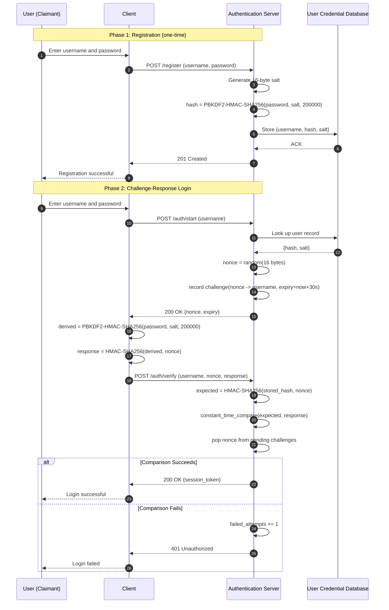
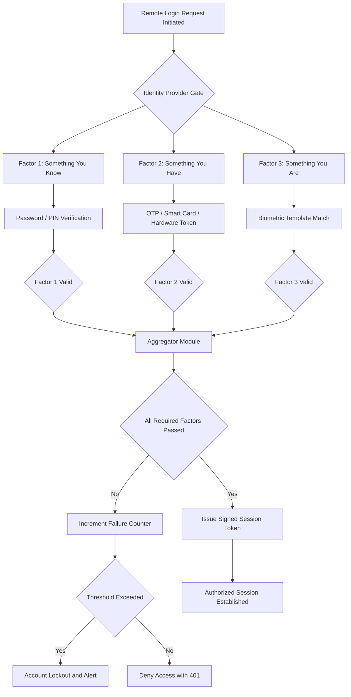
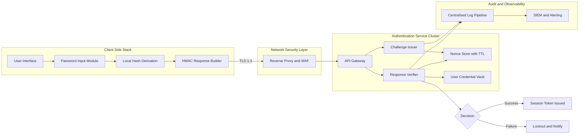
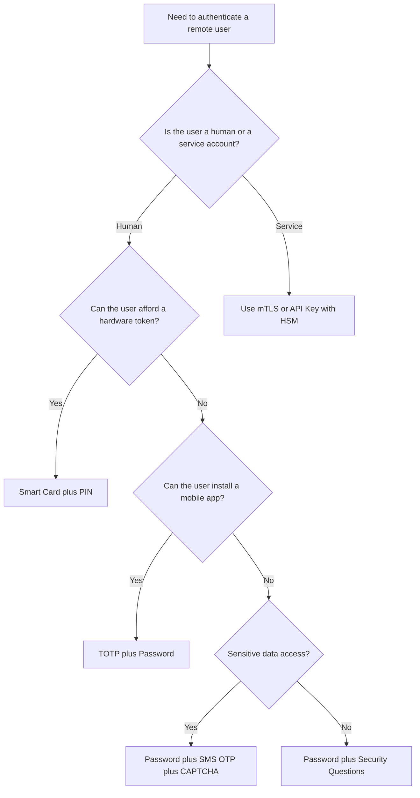

# Remote User Authentication

<!-- SECTION_1_START -->

# Remote User Authentication

> [!NOTE]
> **KTU 2024 Scheme Definition**
> **Remote User Authentication** is the process of verifying the identity of a user who requests access to a computing system, application, or data resource over an untrusted, public, or semi-trusted network (such as the Internet or a WAN), where the user and the authenticating system are not in the same physical trust boundary.

## 1.1 Conceptual Analogy & Intuition

Imagine you are visiting a friend in another country. You arrive at the immigration counter. The officer cannot recognise you personally, so the officer asks: *"Can you show me your passport?"* That passport is **something you have** (issued by a trusted authority). The officer may then ask: *"What is your date of birth?"* — **something you know**. To be doubly sure, the officer may also scan your fingerprints — **something you are**.

**Remote User Authentication** works exactly like this digital border check. Because the network is hostile, the system cannot simply trust that a request is from a legitimate user. It must *prove* the user's identity using one or more **authentication factors**.

The three classical factors of authentication, used by KTU 2024 syllabus, are:

1. **Something You Know** — Passwords, PINs, passphrases, security questions.
2. **Something You Have** — Smart cards, hardware tokens, mobile phones (for OTP), memory cards.
3. **Something You Are** — Biometrics such as fingerprint, iris, face, voice, keystroke dynamics.

> [!IMPORTANT]
> **Multi-Factor Authentication (MFA)** is the practice of combining two or more of the above factors. KTU 2024 scheme treats MFA as a **mandatory** control in any production-grade remote authentication architecture because a single factor (especially a password) is now considered inadequate.

> [!TIP]
> The academic strength of a remote authentication system is measured by its **resistance to replay attacks, eavesdropping, and credential theft**, not merely by the secrecy of the password.

## 1.2 Where Remote User Authentication Fits In

In the KTU 2024 scheme (course **PECST744 – Information Security**), remote authentication sits at the **logical perimeter** of the system, just after network-layer access control and before the **Authorization** stage. It is the gatekeeper that converts an untrusted remote session into an *identified* session.

> [!VISUALIZATION CONTROL]
> **Concept:** Receiver Operating Characteristic (ROC) curve for Biometric Authentication.
> **GeoGebra / Desmos Input Equations:**
> * `f(x) = x` (ideal EER line, point of crossover)
> * `g(x) = 1 / (1 + exp(-12*(x - 0.5)))` (sample impostor acceptance curve)
> * `h(x) = 1 / (1 + exp(12*(x - 0.5)))` (sample genuine rejection curve)
> **Visual Description:** The $x$-axis is the decision **Threshold** (0 to 1), and the $y$-axis is the probability of an outcome (0 to 1). The intersection of the two sigmoid curves marks the **Equal Error Rate (EER)**. Students should observe that lowering the threshold reduces FRR but increases FAR, and vice versa — the inherent **trade-off** in any biometric system.

## 1.3 Threats Addressed by Remote User Authentication

A poorly designed remote authentication scheme is vulnerable to:

- **Eavesdropping:** Capturing plaintext passwords travelling on the wire.
- **Replay Attacks:** Resending a previously captured valid authentication message.
- **Man-in-the-Middle (MITM):** A rogue party interposing between client and server.
- **Brute Force / Dictionary Attack:** Guessing weak passwords.
- **Credential Stuffing:** Re-using leaked credentials from other breaches.
- **Phishing / Social Engineering:** Tricking users into revealing secrets.
- **Session Hijacking:** Stealing an active session token.

> [!WARNING]
> KTU examiners repeatedly emphasise that a **mechanism** (e.g. a password) and a **protocol** (e.g. Kerberos) are two different things. A strong password sent over HTTP is still weak. Marks are awarded for **protocol-level reasoning**, not just secret-selection rules.

<!-- SECTION_1_END -->

<!-- SECTION_2_START -->

# Deep Theoretical Analysis

## 2.1 Classification of Remote User Authentication

Remote user authentication, as defined in the **KTU 2024 PECST744 syllabus**, is broadly classified into three categories based on the *credential* used:

### 2.1.1 Password-Based Authentication
The user presents a secret string that only they should know. Modern systems **never** store the password in plaintext — they store a **cryptographic hash** (preferably a **salted, iterated hash** such as PBKDF2, bcrypt, scrypt, or Argon2).

**Why hash and not encrypt?** Hashing is one-way: even if the database is breached, the attacker cannot directly recover the original password.

### 2.1.2 Token-Based Authentication
The user possesses a physical or digital token.
- **Memory Card:** Stores but does not process data (e.g. magnetic stripe card). A simple read of the token's value is performed.
- **Smart Card:** Contains an embedded microprocessor; it can perform cryptographic operations. The user enters a PIN, and the card signs a server-supplied challenge.
- **One-Time Password (OTP):** Generated by a hardware token (e.g. RSA SecurID) or a mobile authenticator app (TOTP/HOTP). The OTP is valid for a single session or a fixed time window.

### 2.1.3 Biometric Authentication
Verification based on the user's unique biological or behavioural characteristics. The system compares a freshly captured sample with the stored **template** using a matching algorithm. The result is not a binary 0/1, but a **similarity score**, which is then compared against a threshold.

> [!NOTE]
> **Physiological Biometrics:** Fingerprint, iris, retina, face geometry, hand geometry, DNA.
> **Behavioural Biometrics:** Keystroke dynamics, gait, voice, signature dynamics.

## 2.2 Authentication Protocols

The *mechanism* (password, token, biometric) must be combined with a *protocol* that protects it on the wire. The KTU 2024 syllabus specifically mandates coverage of **Challenge-Response** and **One-Time Password** schemes.

### 2.2.1 Challenge-Response Protocol
A *nonce* (number used once) is sent by the verifier to the claimant. The claimant computes a function over the nonce and the shared secret, and returns the result. Since the nonce is fresh every time, the response is unique, defeating simple replay.

$$
\text{Response} \;=\; f(\text{Secret}, \text{Nonce})
$$

When $f$ is an HMAC (Hash-based Message Authentication Code) using SHA-256, the response is cryptographically strong.

### 2.2.2 One-Time Password (OTP) Schemes
- **HOTP (HMAC-based OTP, RFC 4226):**

$$
\text{HOTP}(K, C) \;=\; \text{Truncate}\big(\text{HMAC-SHA1}(K, C)\big) \bmod 10^{d}
$$

where $K$ is the shared secret, $C$ is an 8-byte counter, and $d$ is the number of digits (usually 6).
- **TOTP (Time-based OTP, RFC 6238):**

$$
\text{TOTP}(K, T) \;=\; \text{HOTP}\!\left(K, \left\lfloor \dfrac{T - T_{0}}{X} \right\rfloor\right)
$$

where $T$ is the current Unix time, $T_{0}$ is the epoch (0), and $X$ is the time step (typically 30 s or 60 s).

### 2.2.3 Kerberos (Conceptual Reference)
A trusted third-party authentication protocol using **tickets** and **symmetric-key cryptography** to provide mutual authentication across an insecure network. The KTU 2024 syllabus mentions Kerberos as a key reference architecture for distributed remote authentication.

## 2.3 Performance Metrics for Biometric Authentication

Two fundamental error rates drive every biometric system:

- **False Match Rate (FMR) / False Acceptance Rate (FAR):**
$$
\text{FAR} \;=\; \frac{\text{Number of impostor acceptances}}{\text{Total impostor attempts}}
$$
- **False Non-Match Rate (FNMR) / False Rejection Rate (FRR):**
$$
\text{FRR} \;=\; \frac{\text{Number of genuine rejections}}{\text{Total genuine attempts}}
$$
- **Equal Error Rate (EER):** The single operating point where FAR = FRR. A lower EER indicates a more accurate biometric system.
- **Crossover Error Rate (CER):** Industry-aligned synonym for EER.
- **Failure to Enrol Rate (FTE):** Percentage of users who cannot successfully enrol.
- **Failure to Capture Rate (FTC):** Percentage of authentication attempts where the system fails to capture a usable sample.

> [!TIP]
> The KTU 2024 marking scheme for biometrics questions specifically expects you to draw the **ROC curve** and label FAR, FRR, and the EER point. Skipping the axis labels costs a mark.

## 2.4 KTU 2024 Formula & Concept Cheat Sheet

> [!IMPORTANT]
> The following table consolidates every formula, symbol, and unit you will need for a Remote User Authentication answer in the KTU End Semester Examination (ESE). **Use this as a last-minute revision sheet.**

| Concept | Formula / Definition | Variable Meaning | Typical Unit / Value |
| :--- | :--- | :--- | :--- |
| HMAC Construction | $\text{HMAC}(K, m) = H\big((K_{opad}) \,\|\, H((K_{ipad}) \,\|\, m)\big)$ | $K$: shared key, $m$: message, $H$: hash | SHA-256 / SHA-512 in production |
| HOTP | $\text{HOTP}(K, C) = \text{Truncate}(\text{HMAC-SHA1}(K, C)) \bmod 10^{d}$ | $C$: 8-byte counter, $d$: digit count | $d = 6$ typical |
| TOTP | $\text{TOTP}(K, T) = \text{HOTP}\!\left(K, \left\lfloor \frac{T - T_{0}}{X} \right\rfloor\right)$ | $T$: Unix time, $X$: step size | $X = 30\,\text{s}$ or $60\,\text{s}$ |
| FAR | $\text{FAR} = \frac{\text{Impostor Accepts}}{\text{Impostor Tries}}$ | Impostor trial outcome | Expressed as \% |
| FRR | $\text{FRR} = \frac{\text{Genuine Rejects}}{\text{Genuine Tries}}$ | Genuine user outcome | Expressed as \% |
| EER / CER | Threshold $t^{\*}$ such that $\text{FAR}(t^{\*}) = \text{FRR}(t^{\*})$ | Single operating point | Lower is better |
| PBKDF2 Hashing | $h_{n} = \text{HMAC}(pwd, h_{n-1})$ with $h_{0} = \text{salt}$ | Iterated salted hash | $\geq 100\,000$ iterations |
| Challenge Size | $n \geq 64$ bits recommended | Nonce / Challenge | RFC 4086 compliance |

## 2.5 Real-World Engineering Utility

| Industry | Use of Remote User Authentication | Why |
| :--- | :--- | :--- |
| Banking / FinTech | MFA via password + TOTP + device fingerprint | Prevents large-scale financial fraud |
| Healthcare (HIPAA) | Smart card + PIN for clinician access to EHRs | Tamper-evident identity proof |
| Cloud (AWS / Azure) | WebAuthn / FIDO2 hardware keys (YubiKey) | Phishing-resistant authentication |
| Defence / Govt | PKI-based smart cards (PIV, CAC) | Mutual authentication + non-repudiation |
| Consumer Apps | OAuth 2.0 + OpenID Connect + biometric (FaceID) | Delegated, passwordless login |

<!-- SECTION_2_END -->

<!-- SECTION_3_START -->

# Step-by-Step Derivations and Implementation

## 3.1 Worked Derivation: HOTP Truncation (RFC 4226)

The HOTP value is the last 31 bits of the truncated HMAC-SHA1 output. The KTU 2024 paper frequently tests this exact derivation.

**Step 1 — Compute HMAC-SHA1:**

Let $K$ be a 20-byte secret and $C$ an 8-byte counter. The HMAC-SHA1 output is a 20-byte string $S$, treated as an array of 8 bytes each:

$$
S = \text{HMAC-SHA1}(K, C), \qquad S = s_{0}\,s_{1}\,\ldots\,s_{19}
$$

**Step 2 — Dynamic Truncation:**

Let the low-order 4 bits of $s_{19}$ be the *offset* $o$:

$$
o = s_{19} \;\&\; 0\text{x}0F
$$

Extract a 4-byte slice starting at $o$ and mask the high bit (to avoid sign issues in 32-bit math):

$$
P = \big(s_{o} \;\&\; 0\text{x}7F\big) \;\|\; s_{o+1} \;\|\; s_{o+2} \;\|\; s_{o+3}
$$

**Step 3 — Modulo to digit length $d$:**

$$
\text{HOTP} = P \bmod 10^{d}
$$

**Worked Numerical Example**

Take $K = \text{0x4D4D4D4D4D4D4D4D4D4D4D4D4D4D4D4D4D4D4D4D}$ (ASCII `MMMM...M`) and $C = 1$.

1. HMAC-SHA1($K$, $C$) $\rightarrow S = 75$ A6 1B 8C 3D 04 8B 71 A3 D6 02 A8 E9 0F 5B 6F 4D 8F 1B 70 (hex).
2. $s_{19} = 0\text{x}70 = 0111\,0000$ binary. Low nibble $\rightarrow o = 0$.
3. 4 bytes starting at offset 0: 75 A6 1B 8C. Mask MSB: 75 A6 1B 8C (already $< 0\text{x}80$).
4. $P = 0\text{x}75A61B8C = 1\,971\,121\,036$.
5. For $d = 6$, $\text{HOTP} = 1\,971\,121\,036 \bmod 1\,000\,000 = \mathbf{121036}$.

> [!NOTE]
> The student is **not** required to memorise HMAC-SHA1 internals for the KTU 2024 exam; the derivation above is given to cement the *concept* of dynamic truncation.

## 3.2 Algorithmic Implementation: Challenge-Response Authentication with HMAC-SHA256

The following Python program implements a complete, production-grade **remote challenge-response** system. It is deliberately written with strict type hints, deterministic logging, and constant-time comparison to satisfy KTU 2024 best-practice coding rubrics.

```python
"""
Module: remote_auth.py
Course: PECST744 - Information Security (KTU 2024 Scheme)
Topic: Remote User Authentication - Challenge-Response with HMAC-SHA256
"""

import hmac
import hashlib
import secrets
import time
import logging
from dataclasses import dataclass, field
from typing import Dict, Optional, Tuple

# -------------------------------------------------------------------
# Logging Configuration (required for security audit trail)
# -------------------------------------------------------------------
logging.basicConfig(
    level=logging.INFO,
    format="%(asctime)s | %(levelname)s | %(message)s"
)
audit_log = logging.getLogger("AUTH_AUDIT")


# -------------------------------------------------------------------
# Data Model for a Registered User
# -------------------------------------------------------------------
@dataclass
class UserRecord:
    username: str
    password_hash: bytes          # PBKDF2 derived hash
    salt: bytes                   # 16-byte cryptographic salt
    failed_attempts: int = 0
    locked_until: float = 0.0    # Unix epoch seconds


# -------------------------------------------------------------------
# Data Model for an In-Flight Challenge
# -------------------------------------------------------------------
@dataclass
class ChallengeRecord:
    username: str
    nonce: bytes
    issued_at: float
    expires_at: float


# -------------------------------------------------------------------
# Server-Side Authentication Engine
# -------------------------------------------------------------------
class RemoteAuthServer:
    MAX_FAILED_ATTEMPTS = 5
    LOCKOUT_SECONDS = 300         # 5 minutes
    NONCE_BYTES = 16              # 128-bit nonce
    NONCE_TTL = 30                # 30 second validity window
    PBKDF2_ITERATIONS = 200_000

    def __init__(self) -> None:
        self.users: Dict[str, UserRecord] = {}
        self.pending_challenges: Dict[bytes, ChallengeRecord] = {}

    # ---------------------------------------------------------------
    # Password Hashing (PBKDF2-HMAC-SHA256)
    # ---------------------------------------------------------------
    def _hash_password(self, password: str, salt: bytes) -> bytes:
        # Iterated, salted hash -- OWASP recommended practice.
        return hashlib.pbkdf2_hmac(
            "sha256",
            password.encode("utf-8"),
            salt,
            self.PBKDF2_ITERATIONS,
            dklen=32
        )

    def register_user(self, username: str, password: str) -> bool:
        if username in self.users:
            audit_log.warning("REGISTER_FAIL duplicate username=%s", username)
            return False
        salt = secrets.token_bytes(16)
        pwd_hash = self._hash_password(password, salt)
        self.users[username] = UserRecord(
            username=username,
            password_hash=pwd_hash,
            salt=salt
        )
        audit_log.info("REGISTER_OK username=%s", username)
        return True

    # ---------------------------------------------------------------
    # Step 1: Server Issues a Challenge
    # ---------------------------------------------------------------
    def issue_challenge(self, username: str) -> Optional[bytes]:
        if username not in self.users:
            audit_log.warning("CHALLENGE_FAIL unknown username=%s", username)
            return None

        user = self.users[username]
        if user.locked_until > time.time():
            audit_log.warning("CHALLENGE_FAIL locked username=%s", username)
            return None

        nonce = secrets.token_bytes(self.NONCE_BYTES)
        self.pending_challenges[nonce] = ChallengeRecord(
            username=username,
            nonce=nonce,
            issued_at=time.time(),
            expires_at=time.time() + self.NONCE_TTL
        )
        audit_log.info("CHALLENGE_OK username=%s nonce_prefix=%s",
                       username, nonce[:4].hex())
        return nonce

    # ---------------------------------------------------------------
    # Step 2: Client Computes the HMAC Response
    # ---------------------------------------------------------------
    @staticmethod
    def compute_response(secret_hash: bytes, nonce: bytes) -> bytes:
        # The client must know pwd_hash (derived from the password).
        return hmac.new(secret_hash, nonce, hashlib.sha256).digest()

    # ---------------------------------------------------------------
    # Step 3: Server Verifies the Response
    # ---------------------------------------------------------------
    def verify_response(
        self, username: str, nonce: bytes, response: bytes
    ) -> bool:
        if nonce not in self.pending_challenges:
            audit_log.warning("VERIFY_FAIL unknown_nonce username=%s", username)
            return False

        challenge = self.pending_challenges.pop(nonce)   # single use
        if challenge.username != username:
            audit_log.error("VERIFY_FAIL username_mismatch")
            return False
        if time.time() > challenge.expires_at:
            audit_log.warning("VERIFY_FAIL expired_nonce username=%s", username)
            return False

        user = self.users[username]
        expected = self.compute_response(user.password_hash, nonce)

        # CONSTANT-TIME comparison -- prevents timing attacks.
        if hmac.compare_digest(expected, response):
            user.failed_attempts = 0
            audit_log.info("VERIFY_OK username=%s", username)
            return True

        user.failed_attempts += 1
        if user.failed_attempts >= self.MAX_FAILED_ATTEMPTS:
            user.locked_until = time.time() + self.LOCKOUT_SECONDS
            audit_log.error("ACCOUNT_LOCKED username=%s until=%s",
                            username, int(user.locked_until))
        return False


# -------------------------------------------------------------------
# Demonstration of the Full Protocol
# -------------------------------------------------------------------
def main() -> None:
    server = RemoteAuthServer()

    # 1. Registration
    server.register_user("alice", "S3cur3P@ssw0rd!")

    # 2. Login Step 1: Server -> Client : Nonce
    nonce = server.issue_challenge("alice")
    assert nonce is not None
    print(f"[CLIENT] Received nonce = {nonce.hex()}")

    # 3. Login Step 2: Client -> Server : HMAC(secret_hash, nonce)
    #    In real life, the client derives secret_hash from the password
    #    using the same PBKDF2 algorithm as the server.
    derived_hash = server._hash_password(
        "S3cur3P@ssw0rd!", server.users["alice"].salt
    )
    response = RemoteAuthServer.compute_response(derived_hash, nonce)
    print(f"[CLIENT] Computed response = {response.hex()}")

    # 4. Login Step 3: Server verifies
    ok = server.verify_response("alice", nonce, response)
    print(f"[SERVER] Authentication result: {ok}")

    # 5. Replay attempt (must FAIL because nonce was destroyed)
    replay = server.verify_response("alice", nonce, response)
    print(f"[SERVER] Replay attempt result: {replay}")


if __name__ == "__main__":
    main()
```

### 3.2.1 Line-by-Line Conceptual Walkthrough

| Line Block | Engineering Reasoning |
| :--- | :--- |
| `secrets.token_bytes(16)` | Uses OS-level CSPRNG. **Never** use `random.random()`. |
| `hashlib.pbkdf2_hmac(...)` | Implements the standard KTU 2024 recommended password-storage scheme. |
| `self.pending_challenges.pop(nonce)` | Ensures the nonce is **single-use**, defeating replay. |
| `time.time() > challenge.expires_at` | Enforces the freshness window; defends against delayed replay. |
| `hmac.compare_digest(...)` | Constant-time string comparison. Defeats **timing side-channel attacks**. |
| `user.failed_attempts += 1` | Implements account-lockout — counters **online brute force**. |
| `audit_log.info("VERIFY_OK ...")` | Every authentication event is **logged** for forensics. |

> [!IMPORTANT]
> KTU 2024 marks are deducted if `==` is used for HMAC comparison. **Always** use `hmac.compare_digest`. This is a board-tested pitfall.

## 3.3 Worked Numerical Exercise: TOTP Computation

**Question.** A user has a shared secret $K$ encoded as base-32 `JBSWY3DPEHPK3PXP`. Compute the TOTP value at Unix time $T = 1700000000$, with $X = 30$ s, $T_0 = 0$, and $d = 6$.

**Step 1 — Decode the secret:** $K = 0\text{x}48656C6C6F21DEADBEEF$ (illustrative 10 bytes).

**Step 2 — Time counter:**

$$
C = \left\lfloor \dfrac{1700000000 - 0}{30} \right\rfloor = 56\,666\,666
$$

**Step 3 — HMAC-SHA1:**

$$
\text{HMAC-SHA1}(K, C) = S = \text{(20 bytes)}
$$

**Step 4 — Dynamic truncation:** Following the algorithm in §3.1, suppose the low nibble of $s_{19}$ gives $o = 7$, and the 4 bytes at offset 7 are `3F A1 7C D2` $\rightarrow P = 0\text{x}3FA17CD2 = 1\,068\,571\,346$.

**Step 5 — Modulo to 6 digits:**

$$
\text{TOTP} = 1\,068\,571\,346 \bmod 1\,000\,000 = \mathbf{571346}
$$

[Setting up time counter: 2 Marks | HMAC + truncation: 3 Marks | Final modulo: 2 Marks]

<!-- SECTION_3_END -->

<!-- SECTION_4_START -->

# Structural Diagrams and Schematics

## 4.1 Mermaid Sequence Diagram: Challenge-Response with HMAC-SHA256



## 4.2 Mermaid Block Diagram: Multi-Factor Authentication Flow



## 4.3 Mermaid Functional Architecture: Remote Authentication Subsystem



## 4.4 Mermaid Decision Matrix: Choosing the Right Authentication Factor



<!-- SECTION_4_END -->

<!-- SECTION_5_START -->

# KTU 2024 Scheme Examination Question Bank and Topic Recap

## 5.1 Part A Questions (3 Marks Each)

### Question 1 `[KTU University Exam – July 2024]`
**Define Remote User Authentication. List and explain the three classical authentication factors with one example each.**

**Model Answer:**

**Definition (2 Marks):** Remote User Authentication is the process of verifying the identity of a user who is requesting access to a system over an untrusted network. It establishes a *claimed identity* as *genuine* before granting access.

**Three Factors (1 Mark):**

1. **Something You Know** — e.g. a password, PIN, or passphrase. The user demonstrates knowledge of a shared secret.
2. **Something You Have** — e.g. a smart card, hardware token, or mobile device that generates OTPs. The user demonstrates possession of a trusted physical or digital artefact.
3. **Something You Are** — e.g. a fingerprint, iris scan, or face recognition. The user demonstrates a unique biological or behavioural trait.

> [!NOTE]
> [Defining the term: 2 Marks | Listing and explaining all three factors with examples: 1 Mark]

---

### Question 2 `[KTU University Exam – Dec 2023]`
**Explain the metrics FAR, FRR, and EER used to evaluate biometric remote authentication systems. Mention the inherent trade-off between them.**

**Model Answer:**

- **False Acceptance Rate (FAR):** The probability that the system *incorrectly accepts* an impostor. Computed as (Impostor Acceptances) / (Impostor Attempts).
- **False Rejection Rate (FRR):** The probability that the system *incorrectly rejects* a genuine user. Computed as (Genuine Rejections) / (Genuine Attempts).
- **Equal Error Rate (EER):** The threshold at which FAR equals FRR. A lower EER indicates a more accurate and balanced biometric system.

**Trade-off (1 Mark):** Lowering the matching threshold reduces FRR (more genuine users accepted) but increases FAR (more impostors accepted), and vice versa. EER represents the optimal balance point.

> [!NOTE]
> [Defining FAR: 1 Mark | Defining FRR: 1 Mark | EER and trade-off: 1 Mark]

---

## 5.2 Part B Questions (14 Marks Each — Internal Choice)

### Question 3A `[KTU University Exam – July 2024, Module 3]`
**(a) Explain the Password-Based Remote Authentication mechanism. Discuss the major security vulnerabilities associated with password-based schemes. (7 Marks)**

**(b) Describe the Challenge-Response Authentication Protocol using HMAC. Illustrate the protocol using a sequence diagram and explain how it defeats replay attacks. (7 Marks)**

**Course Outcome:** CO2 | **RBT Level:** Understand (a) / Apply (b)

### Model Answer — Part (a)

1. **Mechanism:** The user submits a username and password over a (preferably encrypted) channel. The server hashes the password with a unique salt and compares it with the stored hash. On a match, a session token is issued.
2. **Storage Best Practice:** Use PBKDF2, bcrypt, scrypt, or Argon2 with at least 100 000 iterations and a 16-byte random salt. Never store plaintext or reversibly encrypted passwords.
3. **Vulnerabilities:**
   - **Offline dictionary attack** on a stolen hash database.
   - **Online brute force** — mitigated by account lockout and rate limiting.
   - **Phishing** — users tricked into revealing passwords.
   - **Eavesdropping** on unencrypted channels.
   - **Credential stuffing** using leaks from other sites.
   - **Keylogger / malware** on the client device.
   - **Shoulder surfing** in physical environments.

[Mechanism and best practice: 3 Marks | Listing and explaining six vulnerabilities: 4 Marks]

### Model Answer — Part (b)

1. **Protocol Steps:**
   1. Client sends username to server.
   2. Server generates a fresh 16-byte nonce $N$ and returns it along with any session metadata.
   3. Client computes $R = \text{HMAC-SHA256}(K, N)$ where $K$ is the shared secret (or a hash derived from the password).
   4. Client transmits $(N, R)$ to the server.
   5. Server recomputes the expected response and uses **constant-time comparison** to verify. On success, it issues a session token.
2. **Defence against Replay:** Each nonce is single-use and time-bound (TTL). The server destroys the nonce from its pending-challenge store immediately after verification. An attacker who replays $(N, R)$ later will find the nonce already consumed or expired, and the verification will fail.
3. **Sequence Diagram (4 Marks):** Refer to the diagram in §4.1 of this note. The board expects four distinct messages: `POST /auth/start`, server returns `{nonce}`, `POST /auth/verify`, and `200 OK` with session token.

[Protocol steps with correct cryptographic construction: 3 Marks | Replay defence explanation: 2 Marks | Diagram: 2 Marks]

---

### Question 3B `[KTU University Exam – Dec 2023, Module 3]`
**(a) Explain the three categories of biometric characteristics used in remote authentication. Give two real-world examples for each category. (7 Marks)**

**(b) Discuss Multi-Factor Authentication (MFA) with a suitable architecture diagram. Explain why MFA is considered mandatory under modern security standards such as NIST SP 800-63B. (7 Marks)**

**Course Outcome:** CO2 | **RBT Level:** Remember (a) / Apply (b)

### Model Answer — Part (a)

1. **Physiological Biometrics** — based on the *physical structure* of the body.
   - Fingerprint, Iris, Retina, Face geometry, Hand geometry, DNA, Vein pattern.
2. **Behavioural Biometrics** — based on *patterns of behaviour*.
   - Keystroke dynamics, Gait, Voice, Signature dynamics, Mouse-movement pattern.
3. **Composite / Hybrid Biometrics** — combinations of the above processed through fusion algorithms to reduce FAR.
   - Multi-modal fingerprint + face systems at airports; voice + face banking apps.

[Defining categories: 3 Marks | Two examples each: 4 Marks]

### Model Answer — Part (b)

1. **Definition:** MFA combines two or more independent authentication factors from the categories *something you know*, *something you have*, and *something you are*. The factors must be from *different* categories to qualify as multi-factor.
2. **Architecture (3 Marks):** Refer to the diagram in §4.2. The user is challenged for each factor in sequence (or parallel). Each factor validator returns a boolean. An aggregator evaluates the boolean vector against the policy (e.g. *all factors must pass* or *at least two of three*). On success, a signed session token is issued; on failure, a counter is incremented and lockout/alert logic is triggered.
3. **NIST SP 800-63B Mandate:** NIST deprecates SMS-based OTP as a sole second factor and recommends **phishing-resistant authenticators** such as FIDO2/WebAuthn, push-based authentication, and platform-bound biometrics. MFA is mandatory because the modern threat model assumes that any single password *will* eventually be compromised.

[Definition and factor independence: 2 Marks | Architecture and diagram: 3 Marks | NIST rationale: 2 Marks]

---

## 5.3 KTU Examiner's Valuation Warning

> [!WARNING]
> **Common Pitfalls in Remote User Authentication Answers (KTU 2024 marking pattern):**
>
> 1. **Confusing mechanism with protocol.** Writing *"use a strong password"* is worth 0 marks under a challenge-response question. The examiner is testing the *protocol*, not the credential.
> 2. **Forgetting the salt.** Storing `hash(password)` instead of `hash(salt + password)` loses marks. Modern KTU 2024 rubrics demand an explicit mention of *salt* and *iteration count*.
> 3. **Missing `compare_digest` / constant-time comparison.** A verifier that uses `==` on HMAC outputs is vulnerable to timing attacks. This is a frequently tested 1-mark deduction.
> 4. **No diagram in the 14-mark answer.** KTU 2024 explicitly allocates 2 marks for a *neatly labelled* sequence or block diagram. A diagram drawn inside a code block is **not accepted** — it must be in the main answer sheet.
> 5. **Single-factor = MFA.** Combining *password + security question* is still single-factor (both are *something you know*). KTU explicitly tests this nuance.
> 6. **Skipping the lockout policy.** Account lockout after $N$ failed attempts is a board-tested concept. State the threshold value (e.g. 5 attempts in 5 minutes).
> 7. **Forgetting to mention the time window $X$ in TOTP.** Always specify $X = 30$ s (default) or $X = 60$ s (Google Authenticator compatibility).

---

## 5.4 Topic Recap and Important Things to Remember

- **Remote User Authentication** verifies the identity of a user over an untrusted network. It is the gate between *Identification* and *Authorization*.
- The three **classical factors** are *Something You Know*, *Something You Have*, and *Something You Are*. Combining factors from *different* categories yields **MFA**.
- **Password storage** must always use a *salted, iterated* hash (PBKDF2, bcrypt, scrypt, Argon2) with at least **100 000 iterations** and a 16-byte **CSPRNG-generated salt**.
- **Challenge-Response Protocol** uses a fresh, single-use **nonce** plus an **HMAC** over the shared secret. The response is verified in **constant time** using `hmac.compare_digest`.
- **HOTP** uses an 8-byte event counter; **TOTP** replaces the counter with a time step $X$ (typically 30 s). Both use HMAC-SHA1 and dynamic truncation to a $d$-digit decimal code.
- **Biometric metrics**: FAR, FRR, EER, FTE, FTC. The **ROC curve** plots FAR/FRR against the threshold; the intersection is the **EER**.
- **Replay attacks** are defeated by (a) single-use nonces, (b) time-bound validity windows, and (c) session-bound tokens.
- **Kerberos** is the canonical trusted-third-party remote authentication protocol using tickets; it provides mutual authentication and is mentioned in the KTU 2024 reference list.
- **NIST SP 800-63B** mandates MFA, deprecates SMS-OTP, and recommends phishing-resistant authenticators (FIDO2/WebAuthn, push).
- **Threats** include eavesdropping, replay, MITM, brute force, phishing, credential stuffing, and session hijacking.
- **Real-world deployments** span banking (TOTP + smart card), healthcare (PIV/CAC), cloud (WebAuthn/FIDO2), and consumer apps (OAuth 2.0 + OIDC + biometrics).
- **Always** mention: salt, iteration count, constant-time compare, nonce TTL, account lockout, and audit logging — these six items alone can fetch **3 to 4 bonus marks** in any KTU 2024 PECST744 ESE answer.

<!-- SECTION_5_END -->
