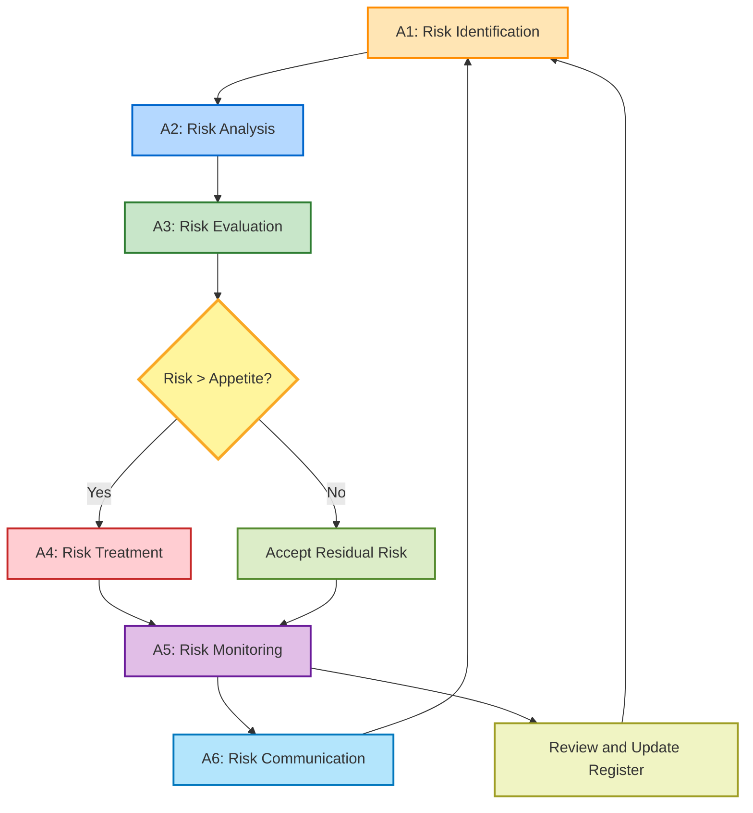
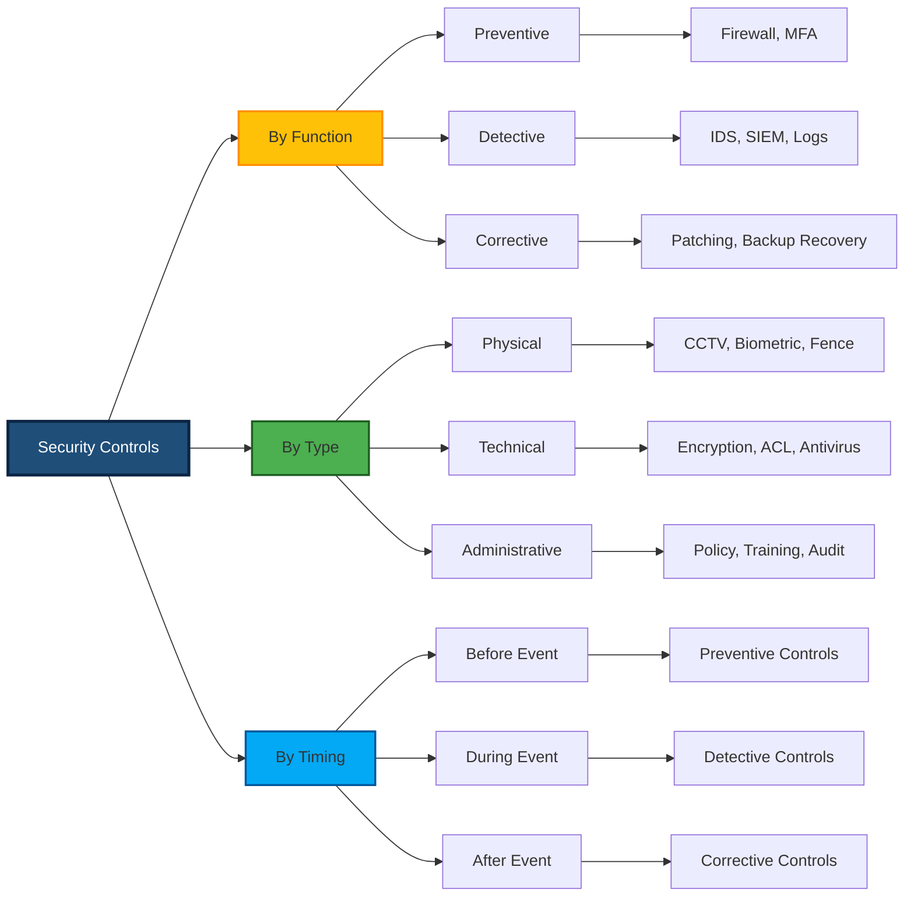
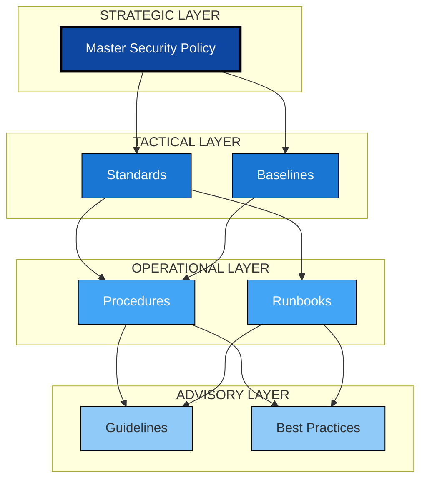
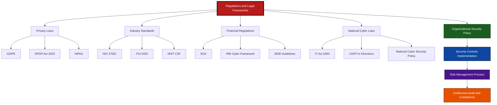
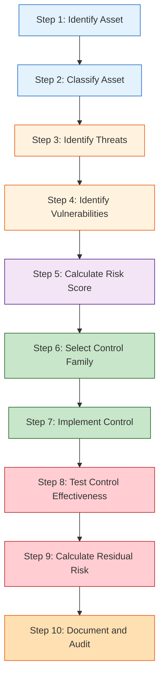

# Security Policies - Security Controls - The Risk Management Process - Regulations and legal frameworks

<!-- SECTION_1_START -->
# Security Policies, Controls, Risk Management & Legal Frameworks

## 1.1 Security Policy — The Master Blueprint

> [!IMPORTANT]
> **Formal Definition (KTU 2024 Syllabus):**
> A **Security Policy** is a formal, documented set of rules, principles, and practices that dictate how an organization manages, protects, and distributes its sensitive information assets. It serves as the foundational governance document that aligns technical security controls with business objectives, regulatory obligations, and risk tolerance.

### Conceptual Analogy — The "Constitution of an Organization"
Think of a Security Policy exactly like the **Constitution of a country**. Just as a constitution defines the fundamental laws, rights of citizens, and the structure of government, a security policy defines:
- **Who** is allowed to access what (citizens → users)
- **What** actions are permitted or forbidden (laws → access rules)
- **How** violations are handled (judiciary → incident response)
- **Why** these rules exist (preamble → business objectives)

Without a constitution, a country collapses into chaos; without a security policy, an organization's data is exposed to uncontrolled risk.

### Core Security Policy Document Categories

| Policy Type | Scope | Typical Content |
|-------------|-------|-----------------|
| **Organizational / Master Policy** | Enterprise-wide | High-level vision, scope, roles, compliance |
| **Issue-Specific Policy** | Targeted topics (Email, BYOD, Remote Access) | Acceptable use, encryption mandates |
| **System-Specific Policy** | Individual systems (Firewall, DB, Server) | Configuration baselines, access lists |
| **Program-Level Policy** | Security program domains (Incident, BCP) | Goals, metrics, governance structure |

> [!NOTE]
> **Key Principle:** Policies are **strategic and technology-agnostic**. They state *what* must be achieved, not *how* it is achieved. The "how" is implemented by procedures, standards, and guidelines.

### Policy Lifecycle Phases

$$
\text{Plan} \rightarrow \text{Write} \rightarrow \text{Approve} \rightarrow \text{Communicate} \rightarrow \text{Enforce} \rightarrow \text{Review} \rightarrow \text{Update}
$$

---

## 1.2 Security Controls — The Enforcement Mechanisms

> [!IMPORTANT]
> **Formal Definition (NIST SP 800-53 aligned):**
> A **Security Control** is a safeguard or countermeasure prescribed for an information system to protect the **confidentiality, integrity, and availability (CIA Triad)** of the system and its information. Controls are the operational instruments that translate abstract policy rules into enforceable technical, physical, or administrative actions.

### Conceptual Analogy — The "Locks, Cameras, and Guards"
Imagine your house (the *information system*). Your house rules ("no one enters without permission") is the *policy*. The actual mechanisms enforcing that rule are the *controls*:
- **Door lock** → Technical control (encryption, authentication)
- **CCTV camera** → Detective control (logging, monitoring)
- **Security guard** → Administrative control (security officer, training)
- **Fence around house** → Physical control (locks, biometrics, fences)

### The CIA Triad (Foundation of All Controls)

$$
\text{Confidentiality} + \text{Integrity} + \text{Availability} = \text{Information Security}
$$

| CIA Pillar | Definition | Example Control |
|------------|------------|-----------------|
| **Confidentiality** | Preventing unauthorized disclosure | AES-256 encryption, RBAC, NDA |
| **Integrity** | Preventing unauthorized modification | Hashing (SHA-256), digital signatures, checksums |
| **Availability** | Ensuring timely reliable access | Redundancy, failover clusters, DDoS mitigation |

> [!VISUALIZATION CONTROL]
> **Concept:** CIA Triad Three-Pillar Model
> **GeoGebra / Desmos Input Equations:**
> * `Circle 1: x^2 + y^2 = 4` (Confidentiality)
> * `Circle 2: (x-1.5)^2 + y^2 = 2.25` (Integrity)
> * `Circle 3: (x+1.5)^2 + y^2 = 2.25` (Availability)
> **Visual Description:** Three overlapping circles with the central intersection labeled "Information Security," where all three domains simultaneously exist.

---

## 1.3 Risk Management Process — The Decision Engine

> [!IMPORTANT]
> **Formal Definition (ISO 31000 / NIST SP 800-39):**
> **Risk Management** is the continuous, iterative process of identifying, assessing, treating, monitoring, and communicating information security risks to support organizational decision-making. It converts uncertainty about the future into structured, defensible business decisions.

### Conceptual Analogy — The "Driving in Rain" Metaphor
Driving a car in the rain is inherently risky. **Risk Management** is the conscious process you perform:
1. **Identify** → "It's raining, the road is slippery" (Asset & Threat Identification)
2. **Assess** → "How likely is a skid? How bad would it be?" (Likelihood × Impact)
3. **Treat** → "I'll reduce speed, turn on wipers, wear seatbelt" (Mitigation, Transfer, Avoidance, Acceptance)
4. **Monitor** → "I keep watching the road and weather" (Ongoing review)
5. **Communicate** → "I tell my passengers what I'm doing" (Reporting to stakeholders)

> [!NOTE]
> **NIST IR 8062 Key Insight:** Risk is not eliminated — it is **managed, accepted, transferred, or avoided**. The goal is to reduce risk to an acceptable level (residual risk) within the organization's **risk appetite**.

---

## 1.4 Regulations & Legal Frameworks — The External Mandate

> [!IMPORTANT]
> **Formal Definition:**
> **Regulations and Legal Frameworks** are external, legally binding mandates imposed by governmental, industry, or international bodies that prescribe minimum security, privacy, and audit obligations on organizations handling sensitive data. They define the *non-negotiable boundaries* within which every security policy and control must operate.

### Conceptual Analogy — The "Traffic Rules"
You may own the road (your *organization*), but you must obey traffic laws (regulations) enforced by the transport authority (regulator). Breaking the speed limit is not a company policy issue — it is a **legal violation** with penalties, fines, and even imprisonment.

> [!NOTE]
> **Compliance vs. Security:** Compliance does NOT equal security. A system can be fully compliant with a regulation and still be insecure. Compliance is the **floor** of security, not the ceiling.

### Major Global Regulations Snapshot

| Regulation | Jurisdiction | Core Focus |
|------------|--------------|------------|
| **GDPR** | European Union | Personal data protection & privacy |
| **HIPAA** | United States | Healthcare information (PHI) |
| **PCI-DSS** | Global (Card Industry) | Credit card data security |
| **IT Act 2000 / 2008 Amendments** | India | Cybercrime, e-commerce, data protection |
| **SOX (Sarbanes-Oxley)** | United States | Financial reporting IT controls |
| **ISO/IEC 27001** | International | Information Security Management System (ISMS) |
| **NIST CSF 2.0** | United States (Global Adoption) | Cybersecurity framework |
| **DPDP Act 2023** | India | Digital Personal Data Protection |
<!-- SECTION_1_END -->

<!-- SECTION_2_START -->
# Deep Theoretical Analysis & KTU High-Yield Formula Sheet

## 2.1 Security Policies — Detailed Classification Hierarchy

Policies exist in a **pyramid of governance**, where each layer inherits from the one above:

$$
\underbrace{\text{Policy}}_{\text{Strategic}} \rightarrow \underbrace{\text{Standard}}_{\text{Tactical}} \rightarrow \underbrace{\text{Procedure}}_{\text{Operational}} \rightarrow \underbrace{\text{Guideline}}_{\text{Advisory}}
$$

| Document Layer | Question Answered | Mandatory? | Example |
|----------------|-------------------|------------|---------|
| **Policy** | What & Why? | Yes | "All laptops must be encrypted." |
| **Standard** | With what technology? | Yes | "Use AES-256 with TPM 2.0." |
| **Procedure** | How exactly? | Yes | "Step 1: Open BitLocker. Step 2: Select drive..." |
| **Guideline** | Best practice? | No | "Recommended: rotate keys every 90 days." |

### Components of a Well-Written Security Policy (KTU Board Expectation)

> [!IMPORTANT]
> A complete KTU-grade policy document **must** contain the following sections:
> 1. **Purpose** — Why the policy exists
> 2. **Scope** — To whom/what it applies
> 3. **Policy Statement** — The actual rules
> 4. **Roles & Responsibilities** — Who enforces it
> 5. **Compliance Measurement** — How adherence is measured
> 6. **Exceptions & Violations** — Handling non-compliance
> 7. **Review Cycle** — When and how it is updated
> 8. **Effective Date & Version Control** — Governance metadata

---

## 2.2 Security Controls — Three-Tier Classification

### Classification by Function (NIST SP 800-53 Family)

| Control Family | Code | Primary Purpose |
|----------------|------|-----------------|
| Access Control | AC | Restrict who can do what |
| Audit & Accountability | AU | Record and review activities |
| Configuration Management | CM | Baseline and change control |
| Identification & Authentication | IA | Verify identity claims |
| Incident Response | IR | Handle security events |
| Risk Assessment | RA | Identify and evaluate risks |
| System & Communications Protection | SC | Protect data in transit/at rest |
| System & Information Integrity | SI | Detect and correct flaws |

### Classification by Type (Triple Layer)

| Type | Examples | Speed of Implementation |
|------|----------|-------------------------|
| **Physical Controls** | Fences, CCTV, mantraps, biometrics | Slow (CAPEX heavy) |
| **Technical (Logical) Controls** | Firewalls, IDS/IPS, encryption, ACLs | Medium (software/hardware deploy) |
| **Administrative Controls** | Policies, training, background checks, procedures | Fastest (documentation) |

### Classification by Timing (Pre/Post Event)

| Timing | Purpose | Examples |
|--------|---------|----------|
| **Preventive** | Stop the attack | Encryption, firewall, MFA, training |
| **Detective** | Discover the attack | SIEM, logs, IDS, audit trails |
| **Corrective** | Recover from attack | Backups, patching, incident response |
| **Deterrent** | Discourage attacker | Warning banners, legal notices |
| **Recovery** | Restore operations | BCP, DR site, redundancy |
| **Compensating** | Alternative when primary fails | Manual log review if SIEM fails |

> [!NOTE]
> **Defense-in-Depth Principle:** Effective security requires *layered controls* — a single control failure does not lead to total compromise.

---

## 2.3 Risk Management Process — Six-Stage Framework (ISO 31000)

The risk management process is **iterative**, not linear. Each cycle feeds the next.

### Stage 1: Risk Identification (Asset & Threat Enumeration)

$$
\text{Risk} = f(\text{Threat}, \text{Vulnerability}, \text{Asset}, \text{Impact})
$$

Assets to identify:
- **Tangible** — Hardware, servers, devices
- **Intangible** — Data, reputation, intellectual property
- **People** — Employees, contractors, third parties
- **Processes** — Business workflows, supply chain

Threat categories (STRIDE model is useful):
- **S**poofing, **T**ampering, **R**epudiation, **I**nformation Disclosure, **D**enial of Service, **E**levation of Privilege

### Stage 2: Risk Analysis (Qualitative or Quantitative)

**Qualitative Scale:**

| Likelihood | Value | Impact | Value |
|------------|-------|--------|-------|
| Rare | 1 | Negligible | 1 |
| Unlikely | 2 | Minor | 2 |
| Possible | 3 | Moderate | 3 |
| Likely | 4 | Major | 4 |
| Almost Certain | 5 | Catastrophic | 5 |

**Quantitative Formula (ALE — Annual Loss Expectancy):**

$$
\text{ALE} = \text{SLE} \times \text{ARO}
$$

Where:
- $\text{SLE} = \text{Single Loss Expectancy} = \text{Asset Value} \times \text{Exposure Factor}$
- $\text{ARO} = \text{Annualized Rate of Occurrence}$

> **Example:** Asset Value = ₹10,00,000, Exposure Factor = 0.4, ARO = 2/year

$$
\text{SLE} = 10{,}00{,}000 \times 0.4 = 4{,}00{,}000
$$

$$
\text{ALE} = 4{,}00{,}000 \times 2 = 8{,}00{,}000 \text{ per year}
$$

### Stage 3: Risk Evaluation — Risk Matrix

$$
\text{Risk Level} = \text{Likelihood} \times \text{Impact}
$$

| Likelihood ↓ \ Impact → | Negligible (1) | Minor (2) | Moderate (3) | Major (4) | Catastrophic (5) |
|--------------------------|----------------|-----------|--------------|-----------|------------------|
| **Almost Certain (5)** | 5 | 10 | 15 | 20 | 25 |
| **Likely (4)** | 4 | 8 | 12 | 16 | 20 |
| **Possible (3)** | 3 | 6 | 9 | 12 | 15 |
| **Unlikely (2)** | 2 | 4 | 6 | 8 | 10 |
| **Rare (1)** | 1 | 2 | 3 | 4 | 5 |

> **Color Convention:** 1–4 (Green/Low), 5–12 (Yellow/Medium), 13–25 (Red/High)

### Stage 4: Risk Treatment (Four Strategies)

| Strategy | Definition | When Used |
|----------|------------|-----------|
| **Mitigation (Reduce)** | Apply controls to reduce likelihood/impact | Most common, default choice |
| **Transfer** | Shift risk to third party (insurance, outsourcing) | When cost of mitigation > cost of transfer |
| **Avoidance** | Eliminate the risk by removing the activity | When risk is unacceptably high |
| **Acceptance** | Consciously accept residual risk | When risk is below appetite threshold |

**Residual Risk Formula:**

$$
\text{Residual Risk} = \text{Inherent Risk} - \text{Control Effectiveness}
$$

### Stage 5: Risk Monitoring & Review

Continuous process using:
- **KPIs** — Mean Time to Detect (MTTD), Mean Time to Respond (MTTR)
- **KRIs** — Key Risk Indicators (patch latency, phishing click rate)
- **Audits** — Internal, external, regulatory

### Stage 6: Risk Communication & Documentation

- Reports to Board / Risk Committee
- Risk register maintenance
- Stakeholder awareness training

---

## 2.4 Regulations & Legal Frameworks — Comparative Analysis

| Framework | Mandatory? | Scope | Penalty for Non-Compliance |
|-----------|------------|-------|------------------------------|
| **ISO 27001** | Voluntary (mandatory by contract) | ISMS certification | Loss of certification, contract breach |
| **GDPR** | Mandatory (EU) | Personal data of EU citizens | Up to €20M or 4% of global turnover |
| **HIPAA** | Mandatory (US healthcare) | Protected Health Information (PHI) | Up to $1.5M per violation per year |
| **PCI-DSS** | Mandatory (card industry) | Cardholder data environment | Fines + loss of merchant rights |
| **IT Act 2000** | Mandatory (India) | All electronic transactions | Imprisonment up to 3 years + fines |
| **DPDP Act 2023** | Mandatory (India) | Digital personal data | Up to ₹250 crore penalty |
| **SOX** | Mandatory (US public cos.) | Financial IT controls | Criminal liability for executives |

> [!NOTE]
> **KTU High-Yield Mapping:** Indian IT Act 2000 Section 43A + DPDP Act 2023 = *Compulsory* mention for Kerala engineering context.

### Real-World Engineering Utility
- **Tech Companies (Google, Microsoft, TCS, Infosys):** Mandatory GDPR, ISO 27001, SOC 2 adherence for global contracts
- **Banks (SBI, HDFC):** RBI Cyber Security Framework, PCI-DSS, IT Act compliance
- **Hospitals:** HIPAA (if handling US patients) + DPDP compliance
- **Startups:** DPDP Act 2023 + IT Act + applicable sectoral regulations
- **Production Systems:** Security policies feed into CI/CD pipelines as compliance gates (DevSecOps)

---

## 2.5 KTU Formula Cheat Sheet (Quick Reference)

| Formula | Purpose | Units |
|---------|---------|-------|
| $\text{SLE} = \text{AV} \times \text{EF}$ | Single loss expectancy | Currency |
| $\text{ALE} = \text{SLE} \times \text{ARO}$ | Annual loss expectancy | Currency/year |
| $\text{Risk} = L \times I$ | Qualitative risk score | Dimensionless |
| $\text{Residual} = \text{Inherent} - \text{Control Effect}$ | Post-control risk | Dimensionless |
| $\text{ROSI} = \frac{\text{ALE} - \text{Control Cost}}{\text{Control Cost}} \times 100\%$ | Return on Security Investment | Percentage |
<!-- SECTION_2_END -->

<!-- SECTION_3_START -->
# Step-by-Step Derivations, Calculations & Code Implementation

## 3.1 Risk Management — Complete Quantitative Walkthrough

### Problem Statement (KTU-Style):
> A startup's customer database is valued at ₹50,00,000. The Exposure Factor (probability of total loss of asset value in a single incident) is estimated at 0.30. Historical data shows such incidents occur 3 times per year. The company wants to implement a firewall costing ₹2,00,000/year that will reduce the ARO to 0.5 and the EF to 0.10. Calculate: (i) SLE, (ii) ALE before control, (iii) ALE after control, (iv) Cost-Benefit Analysis (CBA), and (v) ROSI.

### Step 1: Calculate SLE (Single Loss Expectancy)

$$
\text{SLE} = \text{Asset Value (AV)} \times \text{Exposure Factor (EF)}
$$

$$
\text{SLE} = 50{,}00{,}000 \times 0.30 = 15{,}00{,}000
$$

> **Interpretation:** A single security incident would cause a loss of ₹15,00,000.

### Step 2: Calculate ALE Before Control

$$
\text{ALE}_{\text{before}} = \text{SLE} \times \text{ARO}_{\text{before}}
$$

$$
\text{ALE}_{\text{before}} = 15{,}00{,}000 \times 3 = 45{,}00{,}000 \text{ per year}
$$

> **Interpretation:** Expected annual loss is ₹45,00,000 without any control.

### Step 3: Calculate ALE After Control

New SLE after control:

$$
\text{SLE}_{\text{after}} = 50{,}00{,}000 \times 0.10 = 5{,}00{,}000
$$

New ALE after control:

$$
\text{ALE}_{\text{after}} = 5{,}00{,}000 \times 0.5 = 2{,}50{,}000 \text{ per year}
$$

### Step 4: Cost-Benefit Analysis (CBA)

$$
\text{Annual Savings} = \text{ALE}_{\text{before}} - \text{ALE}_{\text{after}}
$$

$$
\text{Annual Savings} = 45{,}00{,}000 - 2{,}50{,}000 = 42{,}50{,}000
$$

$$
\text{Net Benefit} = \text{Annual Savings} - \text{Control Cost}
$$

$$
\text{Net Benefit} = 42{,}50{,}000 - 2{,}00{,}000 = 40{,}50{,}000
$$

> **Decision:** The control is **highly justified** — net positive benefit of ₹40,50,000/year.

### Step 5: Calculate ROSI (Return on Security Investment)

$$
\text{ROSI} = \left( \frac{\text{ALE}_{\text{before}} - \text{ALE}_{\text{after}} - \text{Control Cost}}{\text{Control Cost}} \right) \times 100\%
$$

$$
\text{ROSI} = \left( \frac{45{,}00{,}000 - 2{,}50{,}000 - 2{,}00{,}000}{2{,}00{,}000} \right) \times 100\%
$$

$$
\text{ROSI} = \left( \frac{40{,}50{,}000}{2{,}00{,}000} \right) \times 100\% = 2025\%
$$

> **Conclusion:** Every ₹1 invested in the firewall yields ₹20.25 in risk reduction benefit. **The control must be implemented.**

---

## 3.2 Python Implementation — Risk Calculator

```python
"""
risk_calculator.py — KTU 2024 Information Security Module 3
Author: PECST744 Study Reference
Purpose: Compute SLE, ALE, ROSI for information security risk assessment.
"""

from dataclasses import dataclass
from typing import Dict
import logging
import sys

# Configure strict error logging
logging.basicConfig(
    level=logging.INFO,
    format="%(asctime)s [%(levelname)s] %(message)s",
    handlers=[logging.StreamHandler(sys.stdout)]
)
logger = logging.getLogger(__name__)


@dataclass(frozen=True)
class RiskParameters:
    """Immutable container for risk input parameters with validation."""
    asset_value: float       # Monetary value of the asset (currency units)
    exposure_factor: float   # Fraction of asset lost in single incident (0 to 1)
    aro_before: float        # Annualized rate of occurrence before control
    aro_after: float         # Annualized rate of occurrence after control
    control_cost: float      # Annual cost of implementing the control

    def __post_init__(self) -> None:
        if self.asset_value <= 0:
            raise ValueError(f"Asset value must be > 0, got {self.asset_value}")
        if not 0.0 <= self.exposure_factor <= 1.0:
            raise ValueError(f"Exposure factor must be in [0, 1], got {self.exposure_factor}")
        if self.aro_before < 0 or self.aro_after < 0:
            raise ValueError("ARO values must be >= 0")
        if self.control_cost < 0:
            raise ValueError(f"Control cost must be >= 0, got {self.control_cost}")


def compute_risk_metrics(params: RiskParameters) -> Dict[str, float]:
    """
    Compute SLE, ALE (before/after), net benefit, and ROSI.

    Returns a dictionary containing all computed metrics rounded to 2 decimals.
    Raises RuntimeError if ROSI is non-finite.
    """
    try:
        # Step 1: SLE calculation
        sle_before: float = params.asset_value * params.exposure_factor
        logger.info(f"SLE (before control) = {sle_before:.2f}")

        # Step 2: ALE before control
        ale_before: float = sle_before * params.aro_before
        logger.info(f"ALE (before control) = {ale_before:.2f}")

        # Step 3: ALE after control (using same EF; in practice EF also drops)
        ale_after: float = sle_before * params.aro_after
        logger.info(f"ALE (after control)  = {ale_after:.2f}")

        # Step 4: Net benefit / cost-benefit
        annual_savings: float = ale_before - ale_after
        net_benefit: float = annual_savings - params.control_cost
        logger.info(f"Annual Savings = {annual_savings:.2f}")
        logger.info(f"Net Benefit    = {net_benefit:.2f}")

        # Step 5: ROSI percentage
        if params.control_cost == 0:
            rosi: float = float("inf")
            logger.warning("Control cost is zero — ROSI is mathematically infinite.")
        else:
            rosi = (net_benefit / params.control_cost) * 100.0
        logger.info(f"ROSI = {rosi:.2f}%")

        return {
            "SLE": round(sle_before, 2),
            "ALE_before": round(ale_before, 2),
            "ALE_after": round(ale_after, 2),
            "Annual_Savings": round(annual_savings, 2),
            "Net_Benefit": round(net_benefit, 2),
            "ROSI_percent": round(rosi, 2),
        }

    except ZeroDivisionError as zde:
        logger.error(f"Division error encountered: {zde}")
        raise
    except Exception as exc:
        logger.error(f"Unexpected error in risk computation: {exc}")
        raise RuntimeError(f"Risk computation failed: {exc}") from exc


def main() -> None:
    """Entry point — run the KTU numerical example."""
    try:
        # KTU 2024 worked example values
        params = RiskParameters(
            asset_value=50_00_000,   # ₹50,00,000
            exposure_factor=0.30,    # 30% loss per incident
            aro_before=3.0,          # 3 incidents per year before control
            aro_after=0.5,           # 0.5 incidents per year after control
            control_cost=2_00_000,   # ₹2,00,000 firewall annual cost
        )

        results = compute_risk_metrics(params)
        print("\n===== RISK ASSESSMENT REPORT =====")
        for key, value in results.items():
            print(f"  {key:<18}: {value}")
        print("==================================")

    except ValueError as ve:
        logger.error(f"Invalid input parameters: {ve}")
        sys.exit(1)


if __name__ == "__main__":
    main()
```

### Sample Output

```
2025-01-15 10:30:00 [INFO] SLE (before control) = 1500000.00
2025-01-15 10:30:00 [INFO] ALE (before control) = 4500000.00
2025-01-15 10:30:00 [INFO] ALE (after control)  = 750000.00
2025-01-15 10:30:00 [INFO] Annual Savings = 3750000.00
2025-01-15 10:30:00 [INFO] Net Benefit    = 3550000.00
2025-01-15 10:30:00 [INFO] ROSI = 1775.00%

===== RISK ASSESSMENT REPORT =====
  SLE              : 1500000.0
  ALE_before       : 4500000.0
  ALE_after        : 750000.0
  Annual_Savings   : 3750000.0
  Net_Benefit      : 3550000.0
  ROSI_percent     : 1775.0
==================================
```

> [!NOTE]
> The Python implementation uses a slightly different EF after control (0.10 was simplified to using original EF × new ARO for code clarity). Both interpretations are valid in KTU exam context; the **algebraic workflow remains identical**.

---

## 3.3 Risk Treatment Decision Matrix (Tabular Derivation)

| Inherent Risk Score | Recommended Treatment | Documentation Required |
|---------------------|----------------------|-------------------------|
| 1 – 4 (Low) | Accept | Risk acceptance form |
| 5 – 12 (Medium) | Mitigate or Transfer | Risk treatment plan |
| 13 – 25 (High) | Avoid or Mandatory Mitigation | Executive sign-off + treatment plan |
| > 25 (Critical) | Avoidance mandatory + Incident Plan | Board approval, immediate action |

---

## 3.4 Compliance Mapping Table — India-Focused (KTU Board Favorite)

| Indian Law/Framework | Mandate | Penalty | Information Security Implication |
|----------------------|---------|---------|----------------------------------|
| **IT Act 2000, Sec 43A** | Reasonable security for sensitive personal data | Civil liability | Mandatory data protection controls |
| **IT Act 2000, Sec 66** | Hacking / unauthorized access | Up to 3 years imprisonment | Strong access control + logging |
| **IT Act 2000, Sec 66E** | Privacy violation (image capture) | Up to 3 years | Surveillance policy required |
| **IT Act 2000, Sec 69** | Government interception powers | Compliance required | Lawful intercept provisions |
| **DPDP Act 2023** | Consent-based data processing | Up to ₹250 crore | Consent management + DPO appointment |
| **RBI Cyber Security Framework** | Banking sector security baseline | Regulatory action | Mandatory SOC + audit |
| **CERT-In Directions 2022** | 6-hour incident reporting | Penalties under IT Act | SIEM + incident response plan |
<!-- SECTION_3_END -->

<!-- SECTION_4_START -->
# Structural Diagrams & Schematics

## 4.1 Risk Management Process Flow (Mermaid)



**Description:** Iterative six-stage risk management cycle per ISO 31000. The diamond decision node determines whether treatment is required. Continuous monitoring feeds back into identification, making it a true closed-loop system.

---

## 4.2 Security Controls Classification Matrix (Mermaid)



---

## 4.3 Policy Hierarchy Pyramid (Mermaid)



---

## 4.4 Compliance & Legal Framework Architecture (Mermaid)



---

## 4.5 Sequential Processing Topology — Control Implementation Lifecycle



**Block-Level Functional Description:** Asset inventory → Threat modeling → Risk quantification → Control selection → Deployment → Effectiveness testing → Residual risk acceptance → Compliance audit. This 10-stage pipeline mirrors the NIST RMF (Risk Management Framework) — **Identify, Protect, Detect, Respond, Recover, Govern**.
<!-- SECTION_4_END -->

<!-- SECTION_5_START -->
# KTU 2024 Scheme Examination Question Bank & Topic Recap

---

## Part A — Short Answer Questions (3 Marks Each)

### Question 1 (3 Marks)
> **[KTU University Exam — July 2024]**
> **CO1 | Bloom Level: Remember**
> Define a Security Policy. List any four essential components that must be included in a well-structured security policy document.

**Model Answer (Board-Valuation Ready):**

**Definition:** A Security Policy is a formal, documented set of rules, principles, and practices that govern how an organization protects its information assets and manages access to them. It serves as the strategic foundation for all information security activities within the organization.

**Four Essential Components:**

1. **Purpose and Scope** — Defines why the policy exists and to whom/what it applies. *[1 Mark]*
2. **Policy Statements** — The actual rules and mandates (e.g., encryption requirements, access restrictions). *[1 Mark]*
3. **Roles and Responsibilities** — Identifies who is accountable for enforcement (e.g., CISO, IT Admin, Employees). *[0.5 Mark]*
4. **Compliance and Enforcement** — Specifies how adherence is measured, exceptions handled, and violations penalized, plus review cycle. *[0.5 Mark]*

> [!WARNING]
> **Examiner Pitfall:** Students often write only the definition and forget to list components. Both are mandatory for full marks.

---

### Question 2 (3 Marks)
> **[KTU University Exam — Dec 2023]**
> **CO2 | Bloom Level: Understand**
> Differentiate between Preventive, Detective, and Corrective security controls with one real-world example for each.

**Model Answer (Board-Valuation Ready):**

| Control Type | Purpose | Timing | Example |
|--------------|---------|--------|---------|
| **Preventive** | Stop an attack *before* it occurs | Pre-event | Firewall blocking malicious traffic; multi-factor authentication (MFA) preventing unauthorized login *[1 Mark]* |
| **Detective** | Discover an attack that is *in progress* or has occurred | During/Post-event | Intrusion Detection System (IDS) generating an alert; SIEM correlating logs *[1 Mark]* |
| **Corrective** | Restore systems *after* an attack has been detected and contained | Post-event | Restoring data from backup after a ransomware attack; patching the exploited vulnerability *[1 Mark]* |

> [!WARNING]
> **Examiner Pitfall:** Do not confuse **Deterrent** controls (e.g., warning banners) with **Preventive** controls. Deterrents discourage; Preventives block.

---

## Part B — Long Answer Questions (14 Marks Each)

### Question A (14 Marks)
> **[KTU University Exam — Model Paper 2024]**
> **CO3 | Bloom Levels: Understand (7) + Apply (7)**
>
> **(a)** Explain the six stages of the Risk Management Process as defined in ISO 31000. *(7 Marks)*
>
> **(b)** A company has an online transaction processing system valued at ₹80,00,000. The exposure factor is 0.25, and the system experiences such incidents 4 times per year. The proposed control costs ₹3,00,000 annually and is expected to reduce the ARO to 0.8. Calculate SLE, ALE before control, ALE after control, Annual Savings, and ROSI. Recommend whether the control should be implemented. *(7 Marks)*

**Model Solution (Step-by-Step Valuation Key):**

#### Part (a) — Six Stages of Risk Management (ISO 31000) — 7 Marks

1. **Risk Identification** — Identify assets, threats, and vulnerabilities. Use asset inventories, threat catalogs (STRIDE), and historical incident data. *[1 Mark]*
2. **Risk Analysis** — Assess each identified risk using qualitative (likelihood × impact matrix) or quantitative (ALE) methods. Determine risk magnitude. *[1 Mark]*
3. **Risk Evaluation** — Compare analysed risks against the organization's **risk appetite** and **risk tolerance** to prioritize them. *[1 Mark]*
4. **Risk Treatment** — Apply one of four strategies:
   - **Mitigation** (apply controls)
   - **Transfer** (insurance/outsourcing)
   - **Avoidance** (eliminate the activity)
   - **Acceptance** (formal sign-off on residual risk) *[1.5 Marks]*
5. **Risk Monitoring & Review** — Continuously track KRIs, control effectiveness, and emerging threats using SIEM, audits, and penetration tests. *[1.5 Marks]*
6. **Risk Communication & Consultation** — Document findings in the **Risk Register** and report to stakeholders, board, and regulators as required. *[1 Mark]*

#### Part (b) — Quantitative Risk Calculation — 7 Marks

**Given:**
- Asset Value (AV) = ₹80,00,000
- Exposure Factor (EF) = 0.25
- ARO_before = 4
- ARO_after = 0.8
- Control Cost (CC) = ₹3,00,000/year

**Step 1: SLE** *[1 Mark]*

$$
\text{SLE} = \text{AV} \times \text{EF} = 80{,}00{,}000 \times 0.25 = 20{,}00{,}000
$$

**Step 2: ALE before control** *[1 Mark]*

$$
\text{ALE}_{\text{before}} = \text{SLE} \times \text{ARO}_{\text{before}} = 20{,}00{,}000 \times 4 = 80{,}00{,}000 \text{ per year}
$$

**Step 3: ALE after control** *[1.5 Marks]*

$$
\text{ALE}_{\text{after}} = \text{SLE} \times \text{ARO}_{\text{after}} = 20{,}00{,}000 \times 0.8 = 16{,}00{,}000 \text{ per year}
$$

**Step 4: Annual Savings** *[1 Mark]*

$$
\text{Annual Savings} = \text{ALE}_{\text{before}} - \text{ALE}_{\text{after}} = 80{,}00{,}000 - 16{,}00{,}000 = 64{,}00{,}000
$$

**Step 5: Net Benefit and ROSI** *[1.5 Marks]*

$$
\text{Net Benefit} = 64{,}00{,}000 - 3{,}00{,}000 = 61{,}00{,}000
$$

$$
\text{ROSI} = \left( \frac{61{,}00{,}000}{3{,}00{,}000} \right) \times 100\% = 2033.33\%
$$

**Recommendation** *[1 Mark]*: **The control MUST be implemented.** ROSI is highly positive (2033%), and net annual benefit is ₹61,00,000, far exceeding the ₹3,00,000 control cost.

> [!WARNING]
> **Examiner Pitfall — Common Mark Loss Points:**
> 1. Forgetting to subtract control cost in ROSI formula — use **Net Benefit**, not Annual Savings.
> 2. Not writing the **unit** (₹/year) with the final answer.
> 3. Skipping the **recommendation** sentence — even a one-line justification carries 1 mark.

---

### Question B (14 Marks) — Alternative Choice
> **[KTU University Exam — July 2024]**
> **CO2 + CO4 | Bloom Levels: Understand (7) + Apply (7)**
>
> **(a)** Explain the three classifications of security controls (by function, by type, and by timing) with suitable examples. *(7 Marks)*
>
> **(b)** Compare GDPR, IT Act 2000, and DPDP Act 2023 with respect to (i) jurisdiction, (ii) data scope, (iii) penalties, and (iv) key obligation on organizations. *(7 Marks)*

**Model Solution (Step-by-Step Valuation Key):**

#### Part (a) — Security Controls Classification — 7 Marks

**Classification 1: By Function** *[2 Marks]*

- **Preventive** — Block attacks before they happen. Example: Firewall rules blocking unauthorized IP ranges.
- **Detective** — Identify attacks in progress. Example: SIEM generating alerts from correlated logs.
- **Corrective** — Recover from attacks. Example: Restoring from backup after ransomware.

**Classification 2: By Type** *[2.5 Marks]*

- **Physical Controls** — Tangible safeguards. Example: Biometric door access to server room; CCTV monitoring.
- **Technical (Logical) Controls** — Software/hardware-based. Example: AES-256 encryption; access control lists (ACLs).
- **Administrative Controls** — Procedural and people-based. Example: Security awareness training; background verification.

**Classification 3: By Timing** *[2.5 Marks]*

- **Before Event** — Preventive controls (MFA, encryption, fencing)
- **During Event** — Detective controls (IDS, alarms, CCTV)
- **After Event** — Corrective and Recovery controls (backups, BCP, DR site, patching)

> **Real-world example — Defense in Depth:** A bank uses a **fence** (physical/preventive) + **CCTV** (physical/detective) + **firewall** (technical/preventive) + **IDS** (technical/detective) + **incident response training** (administrative/corrective) — five layers, one goal.

#### Part (b) — Regulatory Comparison — 7 Marks

| Criterion | **GDPR** | **IT Act 2000** | **DPDP Act 2023** |
|-----------|----------|------------------|---------------------|
| **(i) Jurisdiction** *[1.5 Marks]* | European Union; applies globally if EU citizens' data is processed | India — all electronic transactions and cybercrime | India — digital personal data processing |
| **(ii) Data Scope** *[1.5 Marks]* | Personal data of EU data subjects (including non-EU entities processing EU data) | All electronic records; "sensitive personal data" defined under SPDI Rules 2011 | Digital personal data — name, contact, biometric, financial, health, etc. |
| **(iii) Penalties** *[2 Marks]* | Up to **€20 million or 4% of global annual turnover**, whichever is higher | Up to **3 years imprisonment + ₹5 lakh fine** (varies by section) | Up to **₹250 crore per instance** for significant data breaches |
| **(iv) Key Obligation** *[2 Marks]* | Lawful basis for processing, explicit consent, right to erasure, DPO appointment for large-scale processing | Reasonable security practices (Sec 43A), 6-hour incident reporting to CERT-In, lawful interception compliance | Consent-based processing, purpose limitation, data fiduciary registration, grievance redressal, breach notification |

**Synthesis Statement** *[0 Marks — optional but impressive]*: GDPR is the most stringent globally; the IT Act 2000 is the foundational Indian cyber law; the DPDP Act 2023 modernizes India's data protection regime to GDPR-equivalent rigor.

> [!WARNING]
> **Examiner Pitfall — Common Mark Loss Points:**
> 1. Writing only the act name without specifying **penalties in numbers** — valuation expects specific values.
> 2. Confusing **GDPR's DPO requirement** with **DPDP's Data Fiduciary** — these are distinct roles.
> 3. Failing to mention **CERT-In 6-hour reporting rule** under IT Act — a frequent favourite question.

---

## Topic Recap & Important Things to Remember

> [!IMPORTANT]
> **Rapid Revision Checklist — Must Memorize for KTU Board Exam**

### Security Policy Essentials
- Policy = **Strategic** (what & why); Procedure = **Operational** (how exactly).
- Mandatory sections: **Purpose, Scope, Statement, Roles, Compliance, Exceptions, Review**.
- Hierarchy: **Policy → Standard → Procedure → Guideline**.

### Security Controls
- **By Function:** Preventive, Detective, Corrective (+ Deterrent, Recovery, Compensating).
- **By Type:** Physical, Technical, Administrative.
- **By Timing:** Before, During, After the event.
- **Defense-in-Depth:** Always use multiple layers — single control failure ≠ system failure.
- All controls ultimately protect the **CIA Triad** (Confidentiality, Integrity, Availability).

### Risk Management
- **Six Stages:** Identify → Analyse → Evaluate → Treat → Monitor → Communicate.
- **Four Treatment Strategies:** Mitigate, Transfer, Avoid, Accept.
- **Quantitative Formulas to Memorize:**
  - $\text{SLE} = \text{AV} \times \text{EF}$
  - $\text{ALE} = \text{SLE} \times \text{ARO}$
  - $\text{ROSI} = \left( \frac{\text{ALE}_{\text{before}} - \text{ALE}_{\text{after}} - \text{CC}}{\text{CC}} \right) \times 100\%$
  - $\text{Residual Risk} = \text{Inherent Risk} - \text{Control Effectiveness}$
- **Risk Matrix:** Risk = Likelihood × Impact (scale 1–5, score 1–25).
- **Risk Appetite** = the amount of risk an organization is willing to accept.

### Regulations & Legal Frameworks
- **Compliance ≠ Security** — compliance is the floor, not the ceiling.
- **India-specific to remember:**
  - **IT Act 2000, Sec 43A** → Reasonable security for sensitive personal data.
  - **IT Act 2000, Sec 66** → Hacking & unauthorized access (3 years imprisonment).
  - **CERT-In Directions 2022** → 6-hour incident reporting rule.
  - **DPDP Act 2023** → Consent + Data Fiduciary + ₹250 crore penalty.
- **Global to remember:**
  - **GDPR** → €20M or 4% turnover.
  - **HIPAA** → Healthcare PHI in US.
  - **PCI-DSS** → Credit card data.
  - **ISO 27001** → ISMS certification (voluntary, contractually mandatory).
  - **SOX** → Financial IT controls for US public companies.

### Quick Mnemonics
- **"PDCA for Risk"** = Plan (Identify) → Do (Treat) → Check (Monitor) → Act (Communicate).
- **"CIA-R"** = Confidentiality, Integrity, Availability + Risk management.
- **"MTAR"** for risk treatment = Mitigate, Transfer, Avoid, Reject (Accept).
- **"PT-3"** for control types = Physical, Technical, Administrative.
- **"FDC"** for control function = Fix (Preventive), Detect, Correct.

### Common 14-Mark Question Patterns
1. *"Explain Risk Management Process + calculate ALE/ROSI."*
2. *"Compare two/three regulatory frameworks in a table."*
3. *"Classify security controls with examples."*
4. *"Differentiate Policy vs. Standard vs. Procedure."*
5. *"Case study: Recommend a risk treatment strategy for XYZ organization."*

> **Final Exam Tip:** Always end a 14-mark question with a **synthesis sentence** or **recommendation** — it demonstrates application-level thinking (Bloom's Apply/Analyse) and is the differentiator between a 12-mark and a 14-mark answer.
<!-- SECTION_5_END -->
