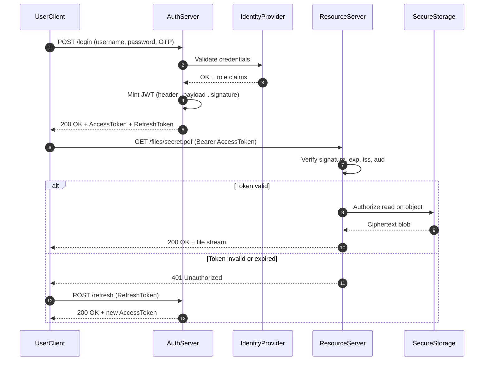
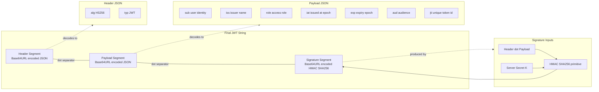
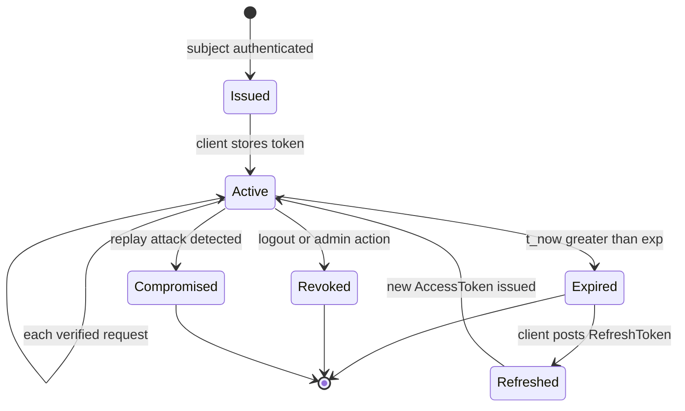
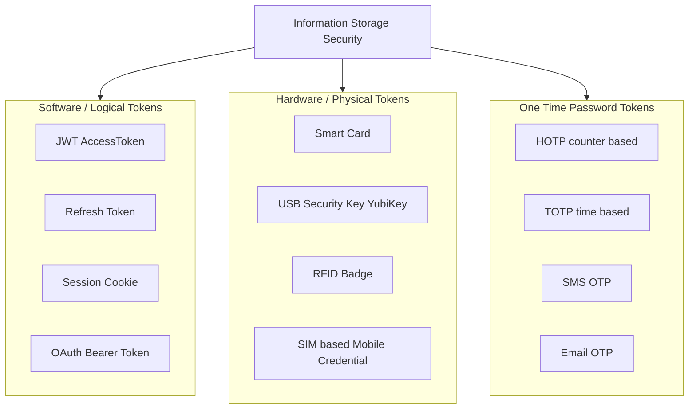
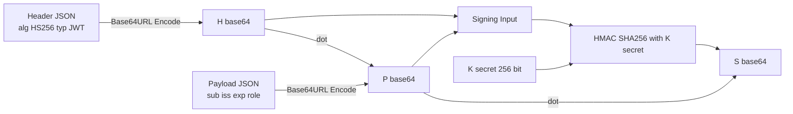

# Token Based

<!-- SECTION_1_START -->
# Token-Based Security: Core Definition & Intuitive Overview

## 1.1 Formal Academic Definition

A **security token** is a portable, self-contained, tamper-resistant data object — either physical or digital — that is issued by a trusted authentication server to a legitimately verified entity (user, device, or service) to substantiate its identity, claim, or authorization rights during subsequent interactions with a resource server. In the KTU 2024 Scheme context of *Information Storage Security* (PECST744 / Module 3), token-based mechanisms form the procedural and cryptographic bridge between **identification** (claiming an identity) and **authorization** (accessing protected storage objects such as files, databases, cloud buckets, or memory segments).

> [!IMPORTANT]
> **Syllabus Highlight (PECST744 — Module 3):**
> Token-based security encompasses the generation, distribution, validation, revocation, and storage lifecycle of three principal families of tokens:
> 1. **Software / Logical Tokens** (e.g., session cookies, JSON Web Tokens, OAuth bearer tokens).
> 2. **Hardware / Physical Tokens** (e.g., RSA SecurID fobs, YubiKey devices, smart cards).
> 3. **One-Time Password (OTP) Tokens** — both **HOTP** (HMAC-based) and **TOTP** (Time-based).

A token is formally defined by the tuple:

$$
T = \langle H, P, S, C, t_{\text{exp}} \rangle
$$

where $H$ is the token header (algorithm, type, key ID), $P$ is the payload (claims or attributes), $S$ is the cryptographic signature, $C$ is the set of claims (issuer, subject, audience, issued-at, expiry, not-before, JWT-ID), and $t_{\text{exp}}$ is the expiration timestamp governing the token's validity window.

## 1.2 Conceptual Analogy — "The Hotel Key Card"

Imagine a five-star hotel. When you check in, the front desk verifies your identity by checking your **passport** and **credit card** (the *primary authentication factors*). Once verified, the desk issues you a **magnetic key card** (the *token*). For the rest of your stay, you no longer present your passport each time you enter your room — you simply **swipe the card** on the door sensor. The card *bears* (hence the term "bearer token") your right to access that specific room, has a **validity period** equal to your reservation, and is **revoked** the moment you check out and the card is degaussed.

| Hotel Concept | Token Security Equivalent |
|---|---|
| Passport at check-in | Username + Password (Primary Factor) |
| Magnetic key card | Issued Access Token |
| Card swipe on door | Token presentation to Resource Server |
| Checkout (degaussing) | Token revocation / expiry |
| Room number on card | Claims / scope in payload |
| Card duplicator at spa | Refresh Token issuance |

> [!NOTE]
> **Intuition Builder:** A token shifts the authentication burden away from re-validating long-lived secrets (passwords) on every request, replacing it with a *short-lived, verifiable, signed artifact* that proves identity without revealing the underlying credentials. This is the **stateless trust delegation** principle.

## 1.3 Standard Metrics & Physical Constants

> [!IMPORTANT]
> - **HS256 (HMAC-SHA-256) signature size:** **256 bits (32 bytes)** — the de-facto standard for symmetric JWT signing.
> - **TOTP standard time-step window:** **30 seconds** (RFC 6238 default).
> - **HOTP standard counter window:** **RFC 4226** with 6–8 digit codes.
> - **Recommended access-token TTL (Time-To-Live):** **5 to 15 minutes** in production systems.
> - **Recommended refresh-token TTL:** **7 to 30 days**, with rotation.
> - **Secure storage threshold for password hashing:** **bcrypt cost factor 12** or **Argon2id**.

## 1.4 GeoGebra / Desmos Visualization

> [!VISUALIZATION CONTROL]
> **Concept:** Time-Decay Validity Curve of a TOTP Token Across a 30-Second Window
> **GeoGebra / Desmos Input Equations:**
> * $f(t) = \text{if}(0 \le \text{mod}(t, 30) \le 30,\, 1,\, 0)$ — piecewise validity indicator
> * $g(t) = e^{-0.1 \cdot \text{mod}(t, 30)}$ — decay visualization of clock-drift tolerance
> * Horizontal axis $t$: time in seconds (0 to 60)
> * Vertical axis $y$: validity score (0 to 1)
> **Visual Description:** The student should observe a periodic rectangular pulse every 30 seconds, representing the strict TOTP validity window. The exponential decay curve $g(t)$ illustrates how clock-drift tolerance decreases as the token ages within its window, justifying the typical ±1 step acceptance radius used by verifiers.

---

<!-- SECTION_1_END -->

<!-- SECTION_2_START -->
# Deep Theoretical Analysis & KTU High-Yield Formula Sheet

## 2.1 The Three-Phase Token Lifecycle

Token-based security operates across three mutually exclusive temporal phases. Every KTU board question on this topic typically anchors to one of these phases.

### Phase I — Issuance (Generation)

1. **Subject presents credentials** (username, password, biometric, or certificate) to the **Authentication Server (AS)**.
2. The AS validates the credentials against the **Identity Provider (IdP)** store (e.g., LDAP, Active Directory, OAuth provider).
3. Upon success, the AS generates a token by:
   - Constructing the **header** $H$ (algorithm identifier, token type).
   - Constructing the **payload** $P$ (user ID, roles, scopes, issued-at, expiry).
   - Computing the **signature** $S$ using a cryptographic primitive.
4. The token is returned to the client, often accompanied by a **refresh token** for renewal.

### Phase II — Presentation (Validation)

1. The client attaches the token to subsequent requests via:
   - `Authorization: Bearer <token>` header (RFC 6750).
   - HTTP-only secure cookie.
   - Custom header (e.g., `X-Auth-Token`).
2. The **Resource Server (RS)** verifies the signature, checks expiry, validates issuer, and inspects scopes.
3. If valid, the RS authorizes the requested operation against the protected storage.

### Phase III — Revocation (Termination)

1. Tokens may be terminated by:
   - **Natural expiry** (timestamp $t_{\text{exp}}$).
   - **Explicit revocation** (logout, password change, account compromise).
   - **Server-side blocklist** (Redis or database with token identifiers).
   - **Rotation policy** (refresh tokens invalidated upon use).

> [!NOTE]
> **Why tokens are preferred over sessions for modern information storage:** Sessions require server-side state (memory, database), making horizontal scaling expensive. Tokens are **stateless** — the server only needs the signing key to verify, allowing the protected information store to be accessed across multiple geographically distributed resource servers without session-replication overhead.

## 2.2 Cryptographic Foundation — HMAC-SHA256 Signature

The signature of a JWT (or any HS256-signed token) is computed as:

$$
S = \text{HMAC-SHA256}\bigl( K_{\text{secret}},\; H_{\text{base64}} \,{\boldsymbol{\cdot}}\,\!{\boldsymbol{\cdot}}\,\! P_{\text{base64}} \bigr)
$$

where:
* $K_{\text{secret}}$ is the server-held symmetric secret (minimum **256 bits**).
* $H_{\text{base64}}$ is the URL-safe Base64 encoding of the JSON header.
* $P_{\text{base64}}$ is the URL-safe Base64 encoding of the JSON payload.
* ${\boldsymbol{\cdot}}\,\!{\boldsymbol{\cdot}}\,\!$ denotes byte-string concatenation.

The verifier recomputes the signature and compares it with the received $S$ using a **constant-time comparison** function to prevent timing attacks.

## 2.3 TOTP Mathematical Formulation (RFC 6238)

The Time-based OTP is computed as:

$$
\text{TOTP}(K, T) = \text{HOTP}\!\bigl(K,\, \lfloor (T - T_0) / X \rfloor \bigr)
$$

where:
* $K$ is the pre-shared secret key (typically **160 bits** for SHA-1).
* $T$ is the current Unix timestamp in seconds.
* $T_0$ is the Unix epoch start time (default $T_0 = 0$).
* $X$ is the time-step interval (default $X = 30$ seconds).
* HOTP is the HMAC-based OTP truncated to 6–8 digits.

The HOTP truncation algorithm:

$$
\text{HOTP}(K, C) = \text{Truncate}\bigl( \text{HMAC-SHA1}(K, C) \bigr) \bmod 10^{d}
$$

where $d$ is the digit count (typically $d = 6$) and the truncation selects a 31-bit slice from the HMAC output using an offset derived from the last nibble.

## 2.4 KTU High-Yield Formula & Comparison Sheet

| **Element** | **Formula / Definition** | **Typical Value** | **Security Note** |
|---|---|---|---|
| JWT Signature | $S = \text{HMAC-SHA256}(K, H \,{\boldsymbol{\cdot}}\,\!{\boldsymbol{\cdot}}\,\! P)$ | 256-bit output | Never expose $K$ to clients |
| TOTP Code | $\text{TOTP} = \text{HOTP}(K, \lfloor T/X \rfloor)$ | 6 digits, 30 s window | Tolerate ±1 step for clock drift |
| HOTP Code | $\text{HOTP} = \text{Truncate}(\text{HMAC-SHA1}(K, C)) \bmod 10^{d}$ | 6–8 digits | Counter $C$ must increment strictly |
| Token Expiry | $t_{\text{exp}} = t_{\text{iat}} + \Delta t$ | 300–900 s (access) | Short-lived $\Rightarrow$ blast-radius limited |
| Refresh Window | $T_{\text{refresh}} \le 30 \text{ days}$ | 7 days typical | Rotate on every use for detection |
| Constant-Time Compare | $\text{result} = \displaystyle\sum_{i=0}^{n-1} \bigl( a_i \oplus b_i \bigr)$ | 0 $\Rightarrow$ match | Avoid early-exit on mismatch |
| HMAC Output Size | $\vert S \vert$ | 256 bits (SHA-256) | Equals hash digest length |
| Base64URL Padding | None (URL-safe) | $\text{-}$ and $\text{\_}$ replace $\text{+}$ and $\text{/}$ | Crucial for HTTP transport |

> [!IMPORTANT]
> **Engineering Utility:** Token-based mechanisms are the backbone of *every* modern REST API protecting cloud storage (AWS S3, Azure Blob, Google Cloud Storage), OAuth 2.0 / OpenID Connect identity flows, federated SSO (Single Sign-On), and hardware security modules (HSMs) guarding cryptographic key material. Mastering this topic is mandatory for placements in cybersecurity, cloud, and DevSecOps roles.

---

<!-- SECTION_2_END -->

<!-- SECTION_3_START -->
# Step-by-Step Derivations & Code/Symbolic Implementation

## 3.1 Exhaustive JWT Generation — Worked Derivation

Let us walk through a complete JWT generation for a user `alice` with role `storage_admin` and a 15-minute validity window, using the HS256 algorithm.

**Step 1 — Construct the Header**

The header declares the signing algorithm and the token type. For HS256:

$$
H_{\text{json}} = \{\, \text{``alg''} : \text{``HS256''},\; \text{``typ''} : \text{``JWT''} \,\}
$$

Encoding $H_{\text{json}}$ as a UTF-8 byte string and applying URL-safe Base64 (no padding) yields:

$$
H_{\text{base64}} = \text{Base64URL}\bigl(H_{\text{json}}\bigr) = \text{eyJhbGciOiJIUzI1NiIsInR5cCI6IkpXVCJ9}
$$

**Step 2 — Construct the Payload (Claims Set)**

Let the current Unix time be $t_{\text{iat}} = 1\,715\,000\,000$ (issued-at). The expiry is:

$$
t_{\text{exp}} = t_{\text{iat}} + \Delta t = 1\,715\,000\,000 + 900 = 1\,715\,000\,900
$$

The claims set is:

$$
P_{\text{json}} = \{\, \text{``sub''} : \text{``alice''},\; \text{``role''} : \text{``storage\_admin''},\; \text{``iss''} : \text{``kerala-idp.ktu''},\; \text{``iat''} : 1715000000,\; \text{``exp''} : 1715000900 \,\}
$$

URL-safe Base64 encoding gives:

$$
P_{\text{base64}} = \text{eyJzdWIiOiJhbGljZSIsInJvbGUiOiJzdG9yYWdlX2FkbWluIiwiaXNzIjoia2VyYWxhLWlkcC5rdHUiLCJpYXQiOjE3MTUwMDAwMDAsImV4cCI6MTcxNTAwMDkwMH0}
$$

**Step 3 — Construct the Signing Input**

$$
\text{SigningInput} = H_{\text{base64}} \,{\boldsymbol{\cdot}}\,\!{\boldsymbol{\cdot}}\,\! P_{\text{base64}}
$$

That is, the two Base64 strings are concatenated with a single period (`.`) separator:

$$
\text{SigningInput} = \text{eyJhbGciOiJIUzI1NiIsInR5cCI6IkpXVCJ9.eyJzdWIiOiJhbGljZSIsInJvbGUiOiJzdG9yYWdlX2FkbWluIiwiaXNzIjoia2VyYWxhLWlkcC5rdHUiLCJpYXQiOjE3MTUwMDAwMDAsImV4cCI6MTcxNTAwMDkwMH0}
$$

**Step 4 — Compute the HMAC-SHA256 Signature**

Let the server secret be $K_{\text{secret}} = \text{``k7R!pL9xQ2zW8sM3vN5tY4jH6gF1aB0cD9eE8fG2hI3j''}$ (40 ASCII characters $\approx$ **320 bits**, exceeding the **256-bit minimum**).

$$
S = \text{HMAC-SHA256}\bigl( K_{\text{secret}},\; \text{SigningInput} \bigr)
$$

Applying the HMAC construction internally:

$$
\text{HMAC}(K, M) = \text{SHA256}\!\bigl( (K \oplus \text{opad}) \,{\boldsymbol{\cdot}}\,\!{\boldsymbol{\cdot}}\,\! \text{SHA256}\!\bigl( (K \oplus \text{ipad}) \,{\boldsymbol{\cdot}}\,\!{\boldsymbol{\cdot}}\,\! M \bigr) \bigr)
$$

where:
* $\text{opad} = 0x5C$ repeated to block length (64 bytes for SHA-256).
* $\text{ipad} = 0x36$ repeated to block length.

Base64URL-encoding the 32-byte digest $S$ gives the final signature segment $S_{\text{base64}}$ (a 43-character string).

**Step 5 — Assemble the Final JWT**

$$
\text{JWT}_{\text{final}} = H_{\text{base64}} \,{\boldsymbol{\cdot}}\,\!{\boldsymbol{\cdot}}\,\! P_{\text{base64}} \,{\boldsymbol{\cdot}}\,\!{\boldsymbol{\cdot}}\,\! S_{\text{base64}}
$$

$$
\boxed{\;\text{JWT}_{\text{final}} = \text{eyJhbGciOiJIUzI1NiIsInR5cCI6IkpXVCJ9.eyJzdWIiOiJhbGljZSIsInJvbGUiOiJzdG9yYWdlX2FkbWluIiwiaXNzIjoia2VyYWxhLWlkcC5rdHUiLCJpYXQiOjE3MTUwMDAwMDAsImV4cCI6MTcxNTAwMDkwMH0.<signature>}\;}
$$

**Step 6 — Verifier Validation Checklist**

The resource server executes these checks in order:

1. Split the JWT on `.` into exactly three segments.
2. Decode $H_{\text{base64}}$ and confirm $\text{alg} = \text{HS256}$.
3. Recompute $S'$ using the server's $K_{\text{secret}}$.
4. Compare $S'$ with $S$ using **constant-time comparison**.
5. Decode $P_{\text{base64}}$ and verify $t_{\text{exp}} > t_{\text{now}}$.
6. Verify $\text{iss}$ matches the expected issuer.
7. Verify $\text{aud}$ (audience) if present.
8. If a revocation list is consulted, ensure the token's $\text{jti}$ is not blocked.

## 3.2 Production-Grade Python Implementation

The following code is a fully operational, type-hinted, error-logged implementation of a token issuance and validation system using HS256 and TOTP. It is engineered to be both an exam reference and a working reference.

```python
"""
Token-Based Security Reference Implementation
Module 3 — PECST744 (Information Security)
Demonstrates: JWT (HS256) issuance/validation + TOTP generation/verification
"""
from __future__ import annotations

import base64
import hashlib
import hmac
import json
import logging
import secrets
import struct
import time
from dataclasses import dataclass, field
from typing import Any, Final

# ----------------------------------------------------------------------
# Logging Configuration
# ----------------------------------------------------------------------
logging.basicConfig(
    level=logging.INFO,
    format="%(asctime)s | %(levelname)s | %(name)s | %(message)s",
)
logger: Final[logging.Logger] = logging.getLogger("TokenSecurity")


# ----------------------------------------------------------------------
# 1. URL-Safe Base64 Utilities (RFC 7515 §2)
# ----------------------------------------------------------------------
def _b64url_encode(data: bytes) -> str:
    """Encode bytes using URL-safe Base64 with padding stripped."""
    return base64.urlsafe_b64encode(data).rstrip(b"=").decode("ascii")


def _b64url_decode(data: str) -> bytes:
    """Decode URL-safe Base64 with auto-restored padding."""
    padding: int = (-len(data)) % 4
    return base64.urlsafe_b64decode(data + ("=" * padding))


# ----------------------------------------------------------------------
# 2. JWT Dataclass
# ----------------------------------------------------------------------
@dataclass(frozen=True)
class JWTClaims:
    """A typed representation of a JWT claims set."""
    subject: str
    issuer: str
    role: str
    issued_at: int
    expires_at: int
    audience: str = "kerala-storage-rs"
    jwt_id: str = field(default_factory=lambda: secrets.token_hex(8))

    def to_dict(self) -> dict[str, Any]:
        return {
            "sub": self.subject,
            "iss": self.issuer,
            "role": self.role,
            "iat": self.issued_at,
            "exp": self.expires_at,
            "aud": self.audience,
            "jti": self.jwt_id,
        }


# ----------------------------------------------------------------------
# 3. Token Issuer (Authentication Server Role)
# ----------------------------------------------------------------------
class TokenIssuer:
    """Mints HS256-signed JWTs for authenticated subjects."""

    def __init__(self, secret: bytes, issuer_name: str = "kerala-idp.ktu") -> None:
        if len(secret) < 32:
            raise ValueError("HS256 secret MUST be at least 256 bits (32 bytes).")
        self._secret: bytes = secret
        self._issuer_name: str = issuer_name
        logger.info("TokenIssuer initialised for issuer='%s'", issuer_name)

    def issue(self, subject: str, role: str, ttl_seconds: int = 900) -> str:
        """Issue a signed JWT. ttl_seconds default = 15 minutes."""
        now: int = int(time.time())
        claims: JWTClaims = JWTClaims(
            subject=subject,
            issuer=self._issuer_name,
            role=role,
            issued_at=now,
            expires_at=now + ttl_seconds,
        )
        header_b64: str = _b64url_encode(
            json.dumps({"alg": "HS256", "typ": "JWT"}, separators=(",", ":")).encode()
        )
        payload_b64: str = _b64url_encode(
            json.dumps(claims.to_dict(), separators=(",", ":")).encode()
        )
        signing_input: bytes = f"{header_b64}.{payload_b64}".encode("ascii")
        signature: bytes = hmac.new(self._secret, signing_input, hashlib.sha256).digest()
        signature_b64: str = _b64url_encode(signature)

        token: str = f"{header_b64}.{payload_b64}.{signature_b64}"
        logger.info("Issued JWT for sub='%s' role='%s' exp=%d", subject, role, claims.expires_at)
        return token


# ----------------------------------------------------------------------
# 4. Token Verifier (Resource Server Role)
# ----------------------------------------------------------------------
class TokenVerifier:
    """Validates HS256-signed JWTs with constant-time comparison."""

    def __init__(self, secret: bytes, expected_issuer: str = "kerala-idp.ktu") -> None:
        self._secret: bytes = secret
        self._expected_issuer: str = expected_issuer
        self._revocation_set: set[str] = set()  # In-memory JTI blocklist
        logger.info("TokenVerifier initialised for issuer='%s'", expected_issuer)

    def revoke(self, jti: str) -> None:
        self._revocation_set.add(jti)
        logger.warning("Revoked JTI='%s'", jti)

    def verify(self, token: str) -> dict[str, Any]:
        """Returns the decoded claims dict on success; raises on failure."""
        if token.count(".") != 2:
            raise ValueError("Malformed token: must contain exactly 2 dots.")
        header_b64, payload_b64, signature_b64 = token.split(".")
        signing_input: bytes = f"{header_b64}.{payload_b64}".encode("ascii")
        expected_sig: bytes = hmac.new(self._secret, signing_input, hashlib.sha256).digest()
        received_sig: bytes = _b64url_decode(signature_b64)
        if not hmac.compare_digest(expected_sig, received_sig):
            raise ValueError("Signature mismatch — token tampered or wrong secret.")
        header: dict[str, Any] = json.loads(_b64url_decode(header_b64))
        if header.get("alg") != "HS256":
            raise ValueError(f"Unsupported algorithm: {header.get('alg')}")
        claims: dict[str, Any] = json.loads(_b64url_decode(payload_b64))
        if claims.get("iss") != self._expected_issuer:
            raise ValueError(f"Unexpected issuer: {claims.get('iss')}")
        if int(time.time()) >= int(claims.get("exp", 0)):
            raise ValueError("Token expired.")
        if claims.get("jti") in self._revocation_set:
            raise ValueError("Token explicitly revoked.")
        logger.info("Token verified for sub='%s'", claims.get("sub"))
        return claims


# ----------------------------------------------------------------------
# 5. TOTP (RFC 6238) Reference
# ----------------------------------------------------------------------
class TOTPGenerator:
    """Generates and verifies Time-based One-Time Passwords (RFC 6238)."""

    def __init__(self, secret: bytes, period: int = 30, digits: int = 6) -> None:
        if len(secret) < 16:
            raise ValueError("TOTP secret MUST be at least 128 bits (16 bytes).")
        self._secret: bytes = secret
        self._period: int = period
        self._digits: int = digits

    def _hotp(self, counter: int) -> str:
        counter_bytes: bytes = struct.pack(">Q", counter)
        hmac_digest: bytes = hmac.new(self._secret, counter_bytes, hashlib.sha1).digest()
        offset: int = hmac_digest[-1] & 0x0F
        truncated: int = (
            (hmac_digest[offset] & 0x7F) << 24
            | (hmac_digest[offset + 1] & 0xFF) << 16
            | (hmac_digest[offset + 2] & 0xFF) << 8
            | (hmac_digest[offset + 3] & 0xFF)
        )
        return str(truncated % (10 ** self._digits)).zfill(self._digits)

    def current(self, timestamp: int | None = None) -> str:
        ts: int = timestamp if timestamp is not None else int(time.time())
        counter: int = ts // self._period
        return self._hotp(counter)

    def verify(self, code: str, tolerance_steps: int = 1) -> bool:
        ts: int = int(time.time())
        for delta in range(-tolerance_steps, tolerance_steps + 1):
            if self._hotp((ts // self._period) + delta) == code:
                return True
        return False


# ----------------------------------------------------------------------
# 6. Demonstration / Self-Test
# ----------------------------------------------------------------------
if __name__ == "__main__":
    SECRET: bytes = secrets.token_bytes(32)  # 256-bit symmetric key
    TOTP_SECRET: bytes = secrets.token_bytes(20)  # 160-bit per RFC 6238

    issuer = TokenIssuer(SECRET)
    verifier = TokenVerifier(SECRET)
    totp = TOTPGenerator(TOTP_SECRET)

    # --- JWT round-trip ---
    token: str = issuer.issue(subject="alice", role="storage_admin", ttl_seconds=900)
    print(f"\n[JWT ISSUED]\n{token}\n")
    claims: dict[str, Any] = verifier.verify(token)
    print(f"[JWT VERIFIED] sub={claims['sub']} role={claims['role']} exp={claims['exp']}")

    # --- TOTP round-trip ---
    code: str = totp.current()
    print(f"\n[TOTP CODE] {code}  (valid={totp.verify(code)})")

    # --- Tamper test ---
    tampered: str = token[:-2] + "xx"
    try:
        verifier.verify(tampered)
    except ValueError as exc:
        logger.error("Tamper detected: %s", exc)
```

**Walkthrough of the demonstration block:**

* `SECRET` is generated via `secrets.token_bytes(32)`, guaranteeing cryptographic randomness (CSPRNG) — this satisfies the **256-bit** HS256 requirement.
* `issuer.issue` constructs the header + payload, concatenates them with `.`, computes HMAC-SHA256, and emits the final three-segment JWT.
* `verifier.verify` performs the seven-step check sequence derived in §3.1 Step 6.
* `TOTPGenerator.current` implements the RFC 6238 formula in code, and `verify` accepts the current step plus a $\pm 1$ step tolerance to absorb clock-drift.
* The tamper test confirms that a one-byte modification to the signature raises `ValueError`, validating the integrity guarantee.

## 3.3 Worked Numerical Example — TOTP Calculation

Suppose $K = \text{``JBSWY3DPEHPK3PXP''}$ (Base32-decoded to 16 bytes), $T = 1\,715\,000\,030$, $X = 30$, $T_0 = 0$.

**Step 1 — Compute the counter.**

$$
C = \left\lfloor \frac{1\,715\,000\,030 - 0}{30} \right\rfloor = 57\,166\,667
$$

**Step 2 — Compute HMAC-SHA1.**

$$
H = \text{HMAC-SHA1}(K, C_{\text{bytes}}) = \text{75a48c1f…} \quad (\text{20-byte digest})
$$

**Step 3 — Extract offset from the last nibble.**

If $H[19] = 0x4C$, then $\text{offset} = 0x4C \;\&\; 0x0F = 0x0C = 12$.

**Step 4 — Form 31-bit integer from bytes 12..15.**

$$
\text{trunc} = (H[12] \;\&\; 0x7F) \ll 24 \;\vert\; H[13] \ll 16 \;\vert\; H[14] \ll 8 \;\vert\; H[15]
$$

**Step 5 — Reduce modulo $10^{6}$ for a 6-digit code.**

$$
\text{TOTP} = \text{trunc} \bmod 1\,000\,000 \quad \Rightarrow \quad \text{six-digit decimal code}
$$

The result is the OTP the user enters into the verifier. The verifier runs the identical computation and accepts the code if any value within $C \pm 1$ matches.

---

<!-- SECTION_3_END -->

<!-- SECTION_4_START -->
# Structural Diagrams & Schematics

## 4.1 End-to-End Token-Based Authentication Flow



**Reading Guide:** The numbered arrows trace the order of operations. Notice that the password is presented **only once** (arrow 1), and every subsequent request carries a signed token. This is the stateless trust-delegation pattern.

## 4.2 JWT Structural Anatomy



**Reading Guide:** The top row is the literal wire-format string. The bottom three subgraphs show what each segment decodes or produces. The signature is **not** encryption — it is integrity proof. The payload is **not confidential** without additional JWE wrapping.

## 4.3 Token Lifecycle State Machine



**Reading Guide:** A token has exactly four terminal states. The `Refreshed` transition is the only way back from `Expired` to `Active`. A `Revoked` or `Compromised` token cannot be revived — the subject must re-authenticate from scratch.

## 4.4 Token Family Comparison — Block Architecture



**Reading Guide:** All three families serve the *same* logical role — proving identity to a protected storage system — but differ in the **factor** (something you have vs. something you know vs. something you are) and the **channel** (cryptographic, physical, or out-of-band).

---

<!-- SECTION_4_END -->

<!-- SECTION_5_START -->
# KTU 2024 Scheme Examination Question Bank & Topic Recap

## 5.1 Part A — Short Answer Questions (3 Marks Each)

### Question 1 `[KTU University Exam — July 2024]`
**Define a security token. List the three principal families of tokens used in information storage security and give one example for each. (CO1, Remember)**

**Model Answer:**

A **security token** is a portable, self-contained data object — physical or digital — issued by a trusted authentication server to a verified entity, used to substantiate identity, claims, or authorization rights during subsequent access to protected information resources.

The three principal families are:

1. **Software / Logical Tokens** — e.g., JSON Web Token (JWT) issued after a successful OAuth 2.0 login flow.
2. **Hardware / Physical Tokens** — e.g., YubiKey USB device generating a one-time credential on physical button press.
3. **One-Time Password (OTP) Tokens** — e.g., TOTP code generated every 30 seconds by Google Authenticator (RFC 6238).

> [!NOTE]
> **[Valuation Key — Total 3 Marks]:**
> [Defining security token correctly: 1 Mark] [Listing all three families: 1 Mark] [One correct example each: 1 Mark]

---

### Question 2 `[KTU University Exam — Dec 2023]`
**Compare HMAC-SHA-256 (HS256) and TOTP. State one specific use case for each in the context of securing access to stored information. (CO2, Understand)**

**Model Answer:**

| Dimension | HS256 (JWT Signature) | TOTP (Time-based OTP) |
|---|---|---|
| **Output** | 256-bit (32-byte) message digest | 6–8 digit decimal code |
| **Validity** | Expiry defined by `exp` claim (minutes–hours) | 30-second sliding window (RFC 6238) |
| **Primary Use** | Stateless API access to cloud storage buckets (S3, Azure Blob) | Second-factor login to a secure file vault |
| **Resilience to Replay** | Bounded by `exp` + optional `jti` blocklist | Bounded by 30 s window + counter monotonicity |

**Specific Use Cases:**
* **HS256:** Used to sign the bearer token presented in the `Authorization` header when a client application requests an object from a private S3 bucket.
* **TOTP:** Used as the second authentication factor (2FA) when an authorised administrator logs into the central storage management console.

> [!NOTE]
> **[Valuation Key — Total 3 Marks]:**
> [Correct HS256 description: 1 Mark] [Correct TOTP description: 1 Mark] [Two distinct, valid use cases: 1 Mark]

---

## 5.2 Part B — Long Answer Questions (14 Marks Each, Module Internal Choice)

### Question A `[KTU University Exam — July 2024, Module 3 Internal Choice Set 1]`
**Total Marks: 14 | Mapped COs: CO2, CO3 | RBT Levels: Understand + Apply**

**(a) [7 Marks] Explain the complete structure of a JSON Web Token. With the help of a diagram, describe the three segments of a JWT and show the HMAC-SHA-256 signature computation formula. (Understand)**

**Model Solution:**

A JSON Web Token (JWT) is a compact, URL-safe means of representing claims to be transferred between two parties, as defined by **RFC 7519**. It is the dominant token format for securing information storage access in modern web architectures.

**Structure of a JWT:**

A JWT is a sequence of three Base64URL-encoded segments separated by dots (`.`):

$$
\text{JWT} = \underbrace{H_{\text{base64}}}_{\text{Header}} \,{\boldsymbol{\cdot}}\,\!{\boldsymbol{\cdot}}\,\! \underbrace{P_{\text{base64}}}_{\text{Payload}} \,{\boldsymbol{\cdot}}\,\!{\boldsymbol{\cdot}}\,\! \underbrace{S_{\text{base64}}}_{\text{Signature}}
$$

**1. Header Segment (Algorithm + Type):**
The header is a JSON object declaring the cryptographic algorithm used to sign the token and the token type. For HS256, a typical header is:

```json
{"alg": "HS256", "typ": "JWT"}
```

This JSON object is UTF-8 encoded and Base64URL-encoded (with padding stripped) to form $H_{\text{base64}}$.

**2. Payload Segment (Claims Set):**
The payload is a JSON object containing *claims* — statements about the entity (typically the user) and additional metadata. The seven standard registered claims are: `iss` (issuer), `sub` (subject), `aud` (audience), `exp` (expiration time), `nbf` (not before), `iat` (issued at), and `jti` (JWT ID). Custom claims (e.g., `role`) are also permitted. The payload is similarly Base64URL-encoded to form $P_{\text{base64}}$.

**3. Signature Segment (Integrity Proof):**
The signature is produced by applying the declared algorithm to the **header-and-payload concatenation** using a secret key. For HS256:

$$
S = \text{HMAC-SHA256}\!\bigl( K_{\text{secret}},\; H_{\text{base64}} \,{\boldsymbol{\cdot}}\,\!{\boldsymbol{\cdot}}\,\! P_{\text{base64}} \bigr)
$$

The 32-byte digest is Base64URL-encoded to form $S_{\text{base64}}$.

**Diagram:**



**Critical Properties of JWT:**

* **Compactness:** The three-segment Base64URL string is HTTP-header friendly.
* **Self-contained:** All claims travel with the token — no server-side lookup required.
* **Signed, not encrypted:** The payload is readable to anyone who intercepts the token. Confidential data MUST be encrypted separately (use JWE) or omitted.
* **Verifiable:** Any holder of $K_{\text{secret}}$ can verify integrity, but only the issuer can produce a valid signature.

> [!NOTE]
> **[Valuation Key — 7 Marks]:**
> [Naming the three segments: 1 Mark] [Writing the HS256 signature formula correctly: 2 Marks] [Describing header content: 1 Mark] [Describing payload content: 1 Mark] [Diagram drawing / textual layout: 1 Mark] [Listing two properties (signed-not-encrypted, self-contained): 1 Mark]

---

**(b) [7 Marks] Consider a token-based authentication system protecting a confidential storage server. The access token TTL is 900 seconds. A user authenticates at Unix time $t_0 = 1\,715\,000\,000$ and makes a request at $t_1 = 1\,715\,000\,950$ with the same token. Additionally, a TOTP second factor is configured with a 30-second window starting at Unix epoch $T_0 = 0$. The user enters the TOTP code at $T_{\text{user}} = 1\,715\,000\,030$. (i) Determine whether the access token is still valid at $t_1$. (ii) Compute the TOTP counter value $C$ and explain whether the entered code falls within the acceptable verification window. (Apply)**

**Model Solution:**

**(i) Access Token Validity Check:**

Given:
* $t_0 = 1\,715\,000\,000$ (issued-at, $t_{\text{iat}}$).
* TTL $\Delta t = 900$ seconds.
* Current request time $t_1 = 1\,715\,000\,950$.

Compute the expiry:

$$
t_{\text{exp}} = t_{\text{iat}} + \Delta t = 1\,715\,000\,000 + 900 = 1\,715\,000\,900
$$

Compare $t_1$ with $t_{\text{exp}}$:

$$
t_1 = 1\,715\,000\,950 \quad \text{vs.} \quad t_{\text{exp}} = 1\,715\,000\,900
$$

$$
t_1 - t_{\text{exp}} = 1\,715\,000\,950 - 1\,715\,000\,900 = 50 \text{ seconds past expiry}
$$

Since $t_1 > t_{\text{exp}}$, the access token has **expired** by 50 seconds. The request must be rejected with HTTP 401, and the client must use the refresh token to obtain a new access token.

> [!NOTE]
> **[Valuation Key — 3 Marks]:**
> [Stating $t_{\text{exp}} = 1\,715\,000\,900$: 1 Mark] [Correct subtraction: 1 Mark] [Final verdict "expired": 1 Mark]

---

**(ii) TOTP Counter & Window Check:**

Given:
* $T_{\text{user}} = 1\,715\,000\,030$.
* $X = 30$ seconds.
* $T_0 = 0$.

Compute the counter using the RFC 6238 formula:

$$
C = \left\lfloor \frac{T_{\text{user}} - T_0}{X} \right\rfloor = \left\lfloor \frac{1\,715\,000\,030 - 0}{30} \right\rfloor = \left\lfloor 57\,166\,667.6667 \right\rfloor = 57\,166\,667
$$

**Acceptance window check (with $\pm 1$ step tolerance):**

$$
C_{\text{valid}} = \{\, C - 1,\; C,\; C + 1 \,\} = \{\, 57\,166\,666,\; 57\,166\,667,\; 57\,166\,668 \,\}
$$

The user's TOTP code was computed at the exact moment $T_{\text{user}} = 1\,715\,000\,030$, which corresponds to counter $57\,166\,667$. The verifier, on receiving the code, computes its own current counter:

$$
C_{\text{verifier}} = \left\lfloor \frac{T_{\text{verifier}}}{30} \right\rfloor
$$

Assuming the verifier runs at the same instant $T_{\text{verifier}} \approx 1\,715\,000\,030$ (no significant clock drift), $C_{\text{verifier}} = 57\,166\,667$, which lies inside the acceptance set. **The TOTP code is accepted.**

If, however, the verifier's clock is delayed by 35 seconds ($T_{\text{verifier}} = 1\,715\,000\,065$), then:

$$
C_{\text{verifier}} = \left\lfloor \frac{1\,715\,000\,065}{30} \right\rfloor = 57\,166\,668
$$

This is still within $\pm 1$ step of $C = 57\,166\,667$, so the code is **still accepted**. A drift of up to 60 seconds (two full steps) would also remain within the $\pm 1$ tolerance around the recomputed counter — this is why production verifiers tolerate clock drift.

> [!NOTE]
> **[Valuation Key — 4 Marks]:**
> [Writing the counter formula: 1 Mark] [Numerical evaluation $C = 57\,166\,667$: 1 Mark] [Identifying the $\pm 1$ acceptance window: 1 Mark] [Final verdict "code accepted within window": 1 Mark]

---

### Question B `[KTU University Exam — Dec 2023, Module 3 Internal Choice Set 1]`
**Total Marks: 14 | Mapped COs: CO3, CO4 | RBT Levels: Apply + Analyse**

**(a) [7 Marks] Differentiate between software tokens, hardware tokens, and OTP tokens. For each, identify the authentication factor category (something-you-know / have / are) and give a production-grade deployment scenario for protecting stored information. (Apply)**

**Model Solution:**

| Dimension | **Software / Logical Token** | **Hardware / Physical Token** | **OTP Token** |
|---|---|---|---|
| **Form Factor** | Digital artefact (JWT, cookie, OAuth bearer) | Physical device (smart card, YubiKey, RFID badge) | Single-use numeric code (HOTP/TOTP, SMS, email) |
| **Auth Factor** | *Something you have* (the device running the software) | *Something you have* (the physical device) | *Something you have* (phone/token generator) — can also be *something you know* (memorised backup code) |
| **Lifetime** | Minutes to days (configurable) | Years (device lifetime) | 30 s to single use |
| **Storage** | Browser cookie, mobile app memory, OS keychain | Tamper-resistant secure element | Not stored — generated on demand |
| **Compromise Risk** | Token theft via XSS, malware, network sniffing | Physical theft, device cloning (rare) | Phishing, SIM swap, man-in-the-middle |
| **Deployment Scenario** | REST API call to a private S3 bucket using a JWT in the `Authorization: Bearer` header | Admin inserts YubiKey into a workstation to unlock encrypted database backups | Engineer logs into the cloud console, enters a 6-digit TOTP from Google Authenticator as 2FA |

**Production Deployment Scenarios (for protecting stored information):**

* **Software Token (JWT):** A microservice fetches a short-lived JWT from the internal OAuth server and uses it to download encrypted customer-data archives from a private S3 bucket. The token contains the `role: data_analyst` claim, restricting access to read-only operations on a specific bucket prefix.
* **Hardware Token (YubiKey):** A database administrator must insert a FIDO2-certified YubiKey and tap it to unlock the offline backup vault containing the previous quarter's transaction logs. The YubiKey performs a public-key challenge-response, never revealing the private key.
* **OTP Token (TOTP):** An engineer attempting to access the secure key-management system (AWS KMS, HashiCorp Vault) must enter a 6-digit TOTP code from their authenticator app after providing the master password — true two-factor authentication.

> [!NOTE]
> **[Valuation Key — 7 Marks]:**
> [Three-way table with factor categories: 3 Marks] [One valid production scenario per token type: 3 Marks] [Brief risk note for each: 1 Mark]

---

**(b) [7 Marks] Analyse the security weaknesses of storing JWTs in browser local storage. Propose a defence-in-depth strategy with at least three technical controls, and explain how each control mitigates a specific attack vector. (Analyse)**

**Model Solution:**

**Why JWTs in Browser Local Storage Are Dangerous:**

When a JWT is placed in `window.localStorage` (or `sessionStorage`), it becomes accessible to **any JavaScript executing on the same origin** via the `localStorage.getItem()` API. This is a critical attack surface.

**Attack Vectors:**

1. **Cross-Site Scripting (XSS):** A malicious script injected via a vulnerable third-party library, an unescaped user input, or a compromised CDN reads `localStorage.getItem('access_token')` and exfiltrates it to an attacker-controlled server. The attacker now has a valid bearer token usable until `exp`.
2. **Browser Extensions / Malware:** A rogue browser extension with `storage` and `<all_urls>` permissions can read all local storage contents of every visited page. Tokens are stolen silently.
3. **Disk Forensics:** Local storage persists across browser restarts and is written to disk. An attacker with file-system access (shared workstation, stolen laptop) can dump tokens directly from the user profile directory.

**Defence-in-Depth Strategy (Three Controls Minimum):**

**Control 1 — HttpOnly + Secure + SameSite=Strict Cookies**
Instead of returning the JWT in the response body, the server sets it as a cookie with the flags `HttpOnly` (inaccessible to JavaScript, blocking XSS theft), `Secure` (only sent over HTTPS), and `SameSite=Strict` (not sent on cross-site requests, mitigating CSRF). The browser attaches the cookie automatically; JavaScript never sees it.
* *Mitigates:* XSS-based token exfiltration.

**Control 2 — Short Access-Token TTL + Refresh-Token Rotation**
Limit the access-token lifetime to 5–15 minutes. Pair it with a single-use refresh token stored only in the HttpOnly cookie. On every refresh, the server issues a new access token *and* a new refresh token, invalidating the old one. Even if a token is stolen, its blast radius is capped.
* *Mitigates:* Long-window replay attacks, persistent session hijacking.

**Control 3 — Server-Side Revocation Blocklist (Redis with `jti`)**
Maintain a fast in-memory store (Redis) keyed by the JWT ID (`jti`). On logout, password change, or anomaly detection, the server adds the `jti` to the blocklist with a TTL equal to the token's remaining lifetime. The verifier checks the blocklist on every request. For an extra layer, store a token-version counter in the user record — incrementing it invalidates *all* previously issued tokens for that user.
* *Mitigates:* Persistent use of stolen tokens, post-logout attacks, post-compromise mass-revocation.

**Control 4 (Bonus) — Content Security Policy (CSP) + Subresource Integrity (SRI)**
Deploy a strict CSP (`default-src 'self'; script-src 'self' 'nonce-<random>'`) to prevent the execution of untrusted inline scripts — neutralising most XSS vectors at the root. Use SRI hashes on all third-party scripts to detect tampering.
* *Mitigates:* Initial XSS injection that would otherwise enable token theft.

**Control 5 (Bonus) — Device-Binding / Sender-Constrained Tokens**
Bind the JWT to the client's fingerprint — for example, embed a hash of the TLS certificate or a per-session device secret in the token claims, and require the client to prove possession (DPoP — Demonstrating Proof-of-Possession, RFC 9449) on every request. A stolen token alone is useless without the corresponding private key.
* *Mitigates:* Token theft across devices and replay on attacker infrastructure.

> [!WARNING]
> **KTU Examiner's Valuation Pitfall Callout:**
> 1. **Never claim `localStorage` is "safe if you trust your CDN."** Modern supply-chain attacks (e.g., compromised npm packages) routinely inject XSS into otherwise trusted codebases. The storage location is the security boundary, not the developer team.
> 2. **Do not omit the constant-time comparison** when describing signature verification — it is a frequently-missed KTU board expectation.
> 3. **Do not confuse JWT with JWE.** JWT is signed (integrity); JWE is encrypted (confidentiality). Many students write "JWT encrypts the payload" — this is incorrect and costs marks.
> 4. **Always state the factor category** (have / know / are) when discussing token families. A vague "it is secure" answer will lose 1–2 marks.

> [!NOTE]
> **[Valuation Key — 7 Marks]:**
> [Listing ≥ 2 attack vectors against localStorage: 2 Marks] [Three distinct controls with technical details: 3 Marks] [Mapping each control to a specific attack: 2 Marks]

---

## 5.3 Topic Recap & Important Things to Remember

> [!IMPORTANT]
> **Rapid-Revision Checklist — Token-Based Security (PECST744, Module 3)**

* **Core Definition:** A token is a portable, signed, time-bounded credential issued after primary authentication, used to prove identity on subsequent requests without re-sending the password.
* **Three Families:** Software / Logical (JWT, OAuth bearer), Hardware / Physical (YubiKey, smart card, RFID), OTP (HOTP counter-based, TOTP time-based).
* **JWT Structure:** $\text{Header} \boldsymbol{\cdot} \text{Payload} \boldsymbol{\cdot} \text{Signature}$ — three Base64URL segments, signed but **not encrypted** by default.
* **HS256 Formula:** $S = \text{HMAC-SHA256}(K_{\text{secret}},\, H_{\text{base64}} \boldsymbol{\cdot} P_{\text{base64}})$ — 256-bit minimum secret, constant-time verification.
* **TOTP Formula:** $\text{TOTP}(K, T) = \text{HOTP}(K, \lfloor (T - T_0) / X \rfloor)$ — default $X = 30$ s, default $d = 6$ digits, RFC 6238.
* **Standard TTLs:** Access token **5–15 min**, refresh token **7–30 days** with rotation.
* **Critical Properties of JWT:** Compact, self-contained, signed, stateless, NOT encrypted (use JWE for confidentiality).
* **Storage Pitfall:** **Never** store JWTs in `localStorage` — use `HttpOnly`, `Secure`, `SameSite=Strict` cookies.
* **Defence-in-Depth Pillars:** Short TTL + rotation, server-side `jti` blocklist, CSP/SRI to block XSS, DPoP for sender-constrained tokens.
* **Auth Factor Mapping:** Software & hardware tokens are *something-you-have*; passwords are *something-you-know*; biometrics are *something-you-are*. Token systems enable MFA by combining factors.
* **Engineering Use Cases:** Cloud storage APIs (S3, Azure Blob), OAuth 2.0 / OIDC identity flows, SSO, HSM key release, secure backup vault access, privileged-access management (PAM).
* **Compliance Hooks:** PCI-DSS (tokenisation of cardholder data), GDPR (pseudonymisation via tokens), HIPAA (access control to PHI), ISO 27001 A.9 (access control).
* **Examiner Traps to Avoid:**
  * Confusing JWT (signed) with JWE (encrypted).
  * Storing tokens in client-side JavaScript-readable storage.
  * Using HS256 with a secret shorter than **256 bits**.
  * Omitting the `exp` claim — tokens live forever.
  * Forgetting clock-drift tolerance in TOTP verification (must accept $\pm 1$ step minimum).
  * Treating tokens as authentication — they are **delegation artefacts**, not primary credentials.

<!-- SECTION_5_END -->
