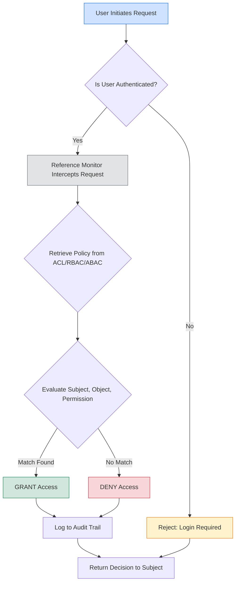
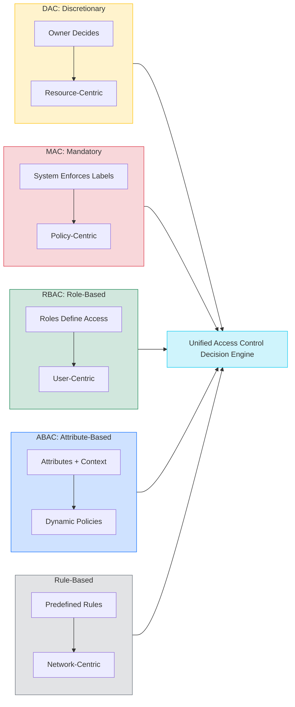
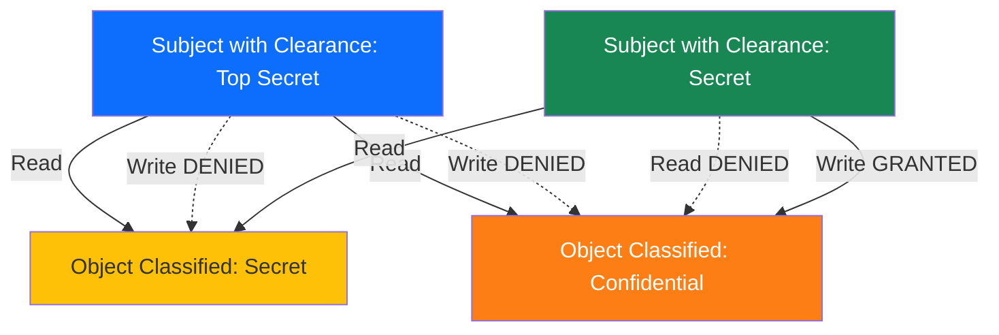
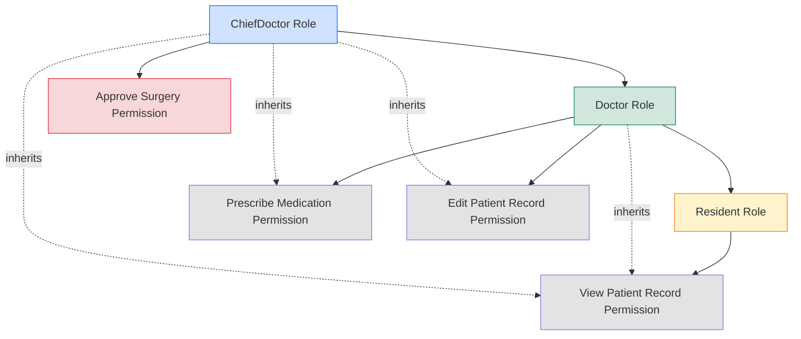

# Access Controls

<!-- SECTION_1_START -->
# Access Controls — Core Technical Definition & Intuitive Overview

## Formal Academic Definition (KTU 2024 Syllabus Terminology)

> [!IMPORTANT]
> **Access Control** is a fundamental security mechanism in information systems that enforces selective restriction of access to data, resources, system operations, or physical locations. It is implemented through the **AAA Framework** — **Authentication**, **Authorization**, and **Auditing (Accounting)** — to ensure that only legitimate, authorized entities can interact with protected resources according to a defined security policy.

In the context of the KTU 2024 *Information Security* (PECST744) syllabus, access control is positioned as a critical layer of defense (the *CIA Triad* — **Confidentiality**, **Integrity**, **Availability** — is enforced at this layer for most practical systems).

The three primary pillars are:

$$
\text{Access Control} \;\equiv\; \text{Authentication} \;\cup\; \text{Authorization} \;\cup\; \text{Accountability}
$$

| Pillar | Purpose | Verification Mechanism |
| :--- | :--- | :--- |
| **Authentication** | *Who are you?* | Passwords, Biometrics, Tokens, Certificates |
| **Authorization** | *What can you do?* | Policies, Access Control Lists (ACLs), Roles |
| **Accountability** | *What did you do?* | Audit logs, Non-repudiation records, Signatures |

---

## Conceptual Analogy — The Corporate Office Building

Imagine a **multi-story corporate office building** as your information system:

- **Authentication** → Showing your **employee ID badge** at the main entrance to prove you work there.
- **Authorization** → Your badge has a colored chip:
  - *Yellow chip* = access to floors $1$ through $3$ (general staff)
  - *Red chip* = access to floor $4$ (research lab) and the server room
  - *Blue chip* = access to the executive lounge on floor $5$
- **Accountability** → Every door you open is logged in a **central security logbook**, along with timestamp and your badge ID.

If an unauthorized person (an *intruder*) tries to enter, the door **does not open**, and an **alert is raised** to the security desk. This is exactly how access control functions in operating systems, databases, and networks.

> [!NOTE]
> **Key Distinction for Board Exams:**
> - **Authentication $\neq$ Authorization.** A user can be *authenticated* (proved identity) but *unauthorized* (lacks permission). A logged-in intern cannot access CEO files, even though they successfully logged in.
> - **Subject** = the entity requesting access (user, process, system).
> - **Object** = the resource being protected (file, database, network segment).

---

## GeoGebra / Desmos Visual Integration — Access Control Matrix

> [!VISUALIZATION CONTROL]
> **Concept:** Visualizing an Access Control Matrix as a 2D Grid (Subjects $\times$ Objects).
> **GeoGebra / Desmos Input Equations:**
> * Define subject positions on the X-axis: $S_1, S_2, S_3, S_4$
> * Define object positions on the Y-axis: $O_1, O_2, O_3, O_4, O_5$
> * Plot permission points: $\{(S_i, O_j) \mid \text{permission granted}\}$
> **Visual Description:** Each filled cell at intersection $(S_i, O_j)$ represents a granted permission (e.g., Read $=$ R, Write $=$ W, Execute $=$ X). Empty cells represent denied access. This geometric view makes it easy to spot *over-privileged* users.

---

## Why Access Control Matters — The Threat Perspective

Without access control, an attacker who breaches the network perimeter gains **unrestricted access to all data** (the "keys to the kingdom"). Access control enforces the **Principle of Least Privilege (PoLP)**:

$$
\forall \text{ subject } s,\quad \text{Privilege}(s) \;=\; \min_{\text{required}}\{ \text{Permissions needed to perform } s\text{'s tasks} \}
$$

> [!TIP]
> Always remember the **Three Golden Rules of Access Control** for KTU exams:
> 1. **Default Deny** — Block everything by default, then explicitly grant.
> 2. **Least Privilege** — Give only the minimum permissions necessary.
> 3. **Separation of Duties (SoD)** — No single user should control an entire critical process.

<!-- SECTION_1_END -->

<!-- SECTION_2_START -->
# Deep Theoretical Analysis & KTU High-Yield Formula Sheet

## 1. The Three Reference Monitor Steps

Every access request is evaluated by a **Reference Monitor** — an abstract machine mediating all access. The decision logic is formally expressed as:

$$
\text{Access}(\text{Subject } s, \text{Object } o, \text{Operation } p) \;=\;
\begin{cases}
\text{GRANT}, & \text{if } (s, o, p) \in \text{Policy Matrix} \\[4pt]
\text{DENY}, & \text{otherwise}
\end{cases}
$$

The Reference Monitor must satisfy three properties:
- **Complete Mediation** — Every access is checked (no bypass).
- **Tamper-Proof** — Cannot be modified by malicious entities.
- **Verifiable** — Small enough to be formally analyzed.

---

## 2. Classical Access Control Models

### 2.1 Discretionary Access Control (DAC)

- The **resource owner** decides who gets access.
- Access is granted based on the **identity of the subject** and **access rules** (ACLs).
- Implemented using **Access Control Lists (ACLs)** or **Capability Lists**.
- Vulnerable to **Trojan Horse** attacks because a malicious program can use the owner's identity.
- Example: File permissions in **Linux/Unix** (rwx for owner, group, others).

### 2.2 Mandatory Access Control (MAC)

- Access is governed by **system-enforced security labels** (classifications).
- The **owner cannot override** the policy — it is centrally controlled.
- Based on **Bell-LaPadula** (confidentiality) and **Biba** (integrity) models.
- Used in **military, government, and high-assurance systems** (e.g., SELinux, Trusted Solaris).
- Subjects have **Clearance** levels; Objects have **Classification** levels.

### 2.3 Role-Based Access Control (RBAC)

- Access is granted based on the **role** a user plays in an organization.
- Users $\rightarrow$ Roles $\rightarrow$ Permissions.
- Simplifies administration in large enterprises (e.g., "HR Manager", "Doctor", "Cashier").
- Defined formally in the **NIST RBAC Standard (ANSI/INCITS 359-2012)**.

> [!NOTE]
> **RBAC Hierarchy (NIST Model):**
> - **Flat RBAC** — Users, Roles, Permissions (basic).
> - **Hierarchical RBAC** — Roles inherit from other roles (Senior Doctor $\supseteq$ Doctor).
> - **Constrained RBAC** — Adds **Separation of Duties (SoD)** constraints.
> - **Symmetric RBAC** — Includes both role-permission and user-role review.

### 2.4 Attribute-Based Access Control (ABAC)

- Access decisions based on **attributes of the subject, object, and environment**.
- Uses **XACML (eXtensible Access Control Markup Language)** policy language.
- Highly dynamic and context-aware (e.g., "Allow access IF time=business hours AND location=office AND user.department=Finance").
- Foundation of **Zero Trust Architecture**.

### 2.5 Rule-Based Access Control (RuBAC)

- Access decisions based on **predefined rules** (often using firewalls, routers).
- Example: An ACL rule: `permit tcp 192.168.1.0 0.0.0.255 any eq 80`.

---

## 3. The Bell-LaPadula Model (Confidentiality)

Designed for **military-grade secrecy**, it uses two key properties:

- **No Read Up (Simple Security Property, *ss-property*):**
$$
\text{Clearance}(s) \;\geq\; \text{Classification}(o) \;\;\Rightarrow\;\; \text{Read}(s, o) = \text{GRANT}
$$
A subject can only read objects at or below its clearance level.

- **No Write Down (Star Property, *\*-property*):**
$$
\text{Clearance}(s) \;\geq\; \text{Classification}(o) \;\;\Rightarrow\;\; \text{Write}(s, o) = \text{DENY}
$$
A subject cannot write to a lower-classification object (prevents leakage of secrets downward).

> [!WARNING]
> The **\*-property** prevents *covert channels* of information leakage but creates a practical problem: a Top Secret user cannot save a report to a Secret folder, even temporarily. This is why Biba was introduced for integrity.

---

## 4. The Biba Model (Integrity)

The mathematical dual of Bell-LaPadula, designed to protect **data integrity**:

- **No Read Down (Simple Integrity Property):**
$$
\text{Integrity Level}(s) \;\leq\; \text{Integrity Level}(o) \;\;\Rightarrow\;\; \text{Read}(s, o) = \text{GRANT}
$$
Read only from equal or lower integrity (don't trust dirty data).

- **No Write Up (Star Integrity Property):**
$$
\text{Integrity Level}(s) \;\geq\; \text{Integrity Level}(o) \;\;\Rightarrow\;\; \text{Write}(s, o) = \text{GRANT}
$$
Don't write to higher-integrity objects (don't corrupt trusted data).

---

## 5. Clark-Wilson Model (Commercial Integrity)

Designed for **business/financial transactions**; uses:

- **Well-Formed Transactions** — All modifications follow certified procedures.
- **Separation of Duties** — No single user can complete a critical transaction alone.
- **Constrained Data Items (CDI)** vs **Unconstrained Data Items (UDI)**.
- **Integrity Verification Procedures (IVP)** and **Transformation Procedures (TP)**.

Example: A bank transfer requires both an *initiator* and an *approver*.

---

## 6. Chinese Wall Model (Brewer-Nash)

- Designed for **conflict-of-interest** scenarios (e.g., consulting firms, investment banks).
- Prevents a user from accessing data of two competing companies in the same market.
- Dynamically updates access history — the first access defines the wall.
- Combines elements of confidentiality and commercial integrity.

---

## 7. KTU Formula / Cheat Sheet

| Concept | Mathematical / Logical Form | Boundary Condition | Real-world Use |
| :--- | :--- | :--- | :--- |
| **Access Decision** | $\text{Access}(s, o, p) \in \{\text{GRANT}, \text{DENY}\}$ | Default = DENY | Firewall rules, ACLs |
| **Bell-LaPadula Read** | $\text{Clearance}(s) \geq \text{Classification}(o)$ | $\ast$-property applies on Write | Military classified systems |
| **Bell-LaPadula Write** | $\text{Clearance}(s) \leq \text{Classification}(o)$ | Prevents downward leakage | Multilevel Security (MLS) |
| **Biba Read** | $\text{Integrity}(s) \leq \text{Integrity}(o)$ | Anti-downward trust | Trusted OS, banking |
| **Biba Write** | $\text{Integrity}(s) \geq \text{Integrity}(o)$ | Anti-upward corruption | Critical infrastructure |
| **RBAC Mapping** | $f: \text{Users} \times \text{Roles} \rightarrow \{0, 1\}$ | $u \to r \to p$ | Enterprise IAM systems |
| **Chinese Wall** | $\text{Same Dataset} \Rightarrow \text{Mutual Exclusion}$ | History-dependent | Consulting, audit firms |
| **PoLP** | $\text{Privilege}(s) = \min(\text{Required Set})$ | No extra grants | All production systems |

---

## 8. Real-World Engineering Utility

- **Cloud Platforms** — AWS IAM, Azure RBAC, GCP IAM all implement RBAC + ABAC hybrid.
- **Operating Systems** — Linux uses DAC (file permissions) with optional MAC modules (SELinux, AppArmor).
- **Networking** — Firewalls implement **Rule-Based Access Control** (Cisco ACLs, iptables).
- **Healthcare (HIPAA)** — RBAC with attribute constraints (e.g., doctor can only view assigned patients).
- **Banking (PCI-DSS)** — Clark-Wilson principles for transaction integrity.
- **Zero Trust Networks** — ABAC policies evaluated continuously via XACML/Pepper.

<!-- SECTION_2_END -->

<!-- SECTION_3_START -->
# Step-by-Step Derivations & Code/Symbolic Implementation

## 1. Access Control Matrix — Worked Example

Consider a system with:
- **Subjects:** $S_1$ (Alice), $S_2$ (Bob), $S_3$ (Charlie)
- **Objects:** $O_1$ (File A), $O_2$ (File B), $O_3$ (Printer)
- **Permissions:** R (Read), W (Write), X (Execute)

The Access Control Matrix $M$ is defined as:

$$
M[i][j] \;=\; \text{Set of permissions for } S_i \text{ on } O_j
$$

$$
M \;=\;
\begin{bmatrix}
& O_1 & O_2 & O_3 \\
S_1 & \{R, W\} & \{R\} & \{X\} \\
S_2 & \{R\} & \{R, W\} & \emptyset \\
S_3 & \emptyset & \{R\} & \{X\}
\end{bmatrix}
$$

**Row Decomposition (Capability List for $S_1$):**

$$
C_{S_1} \;=\; \{ (O_1, \{R, W\}),\; (O_2, \{R\}),\; (O_3, \{X\}) \}
$$

**Column Decomposition (ACL for $O_2$):**

$$
\text{ACL}(O_2) \;=\; \{ (S_1, \{R\}),\; (S_2, \{R, W\}),\; (S_3, \{R\}) \}
$$

**Decision Algorithm:**

$$
\text{CanRead}(S_2, O_1) \;=\; M[2][1] \cap \{R\} \;\neq\; \emptyset \;\;\Rightarrow\;\; \text{GRANT}
$$

$$
\text{CanWrite}(S_3, O_1) \;=\; M[3][1] \cap \{W\} \;=\; \emptyset \;\;\Rightarrow\;\; \text{DENY}
$$

---

## 2. Bell-LaPadula Verification — Step-by-Step

Let the security levels be (from lowest to highest):

$$
\text{Unclassified} \;<\; \text{Confidential} \;<\; \text{Secret} \;<\; \text{Top Secret}
$$

Subjects and objects:

$$
\begin{aligned}
& \text{Alice: Clearance} = \text{Top Secret} \\
& \text{Bob: Clearance} = \text{Secret} \\
& \text{File}_1: \text{Classification} = \text{Secret} \\
& \text{File}_2: \text{Classification} = \text{Confidential}
\end{aligned}
$$

**Step 1: Check if Alice can Read File$_2$.**

$$
\text{Clearance}(\text{Alice}) = \text{Top Secret} \;\;\geq\;\; \text{Classification}(\text{File}_2) = \text{Confidential}
$$

$$
\Rightarrow \text{Read access is GRANTED.}
$$

**Step 2: Check if Bob can Read File$_1$.**

$$
\text{Clearance}(\text{Bob}) = \text{Secret} \;\;\geq\;\; \text{Classification}(\text{File}_1) = \text{Secret}
$$

$$
\Rightarrow \text{Read access is GRANTED.}
$$

**Step 3: Check if Bob can Write to File$_2$ (the \*-property).**

The \*-property requires:

$$
\text{Clearance}(s) \;\leq\; \text{Classification}(o)
$$

But:

$$
\text{Clearance}(\text{Bob}) = \text{Secret} \;\;\not\leq\;\; \text{Classification}(\text{File}_2) = \text{Confidential}
$$

$$
\Rightarrow \text{Write access is DENIED.}
$$

**Step 4: Check if Alice can Write to File$_1$ (the \*-property).**

$$
\text{Clearance}(\text{Alice}) = \text{Top Secret} \;\;\not\leq\;\; \text{Classification}(\text{File}_1) = \text{Secret}
$$

$$
\Rightarrow \text{Write access is DENIED.}
$$

> [!NOTE]
> This demonstrates the famous "**No Write Down**" problem: high-clearance users can read low-classification data but cannot save it back to a lower level. This is intentional to prevent covert data leakage.

---

## 3. Python Implementation — A Mini Access Control Engine

```python
from enum import Enum, auto
from typing import Dict, Set, Tuple
import logging

# Configure logging for audit trail
logging.basicConfig(
    level=logging.INFO,
    format='%(asctime)s - %(levelname)s - %(message)s'
)


class Permission(Enum):
    """Enumeration of allowed operations on an object."""
    READ = auto()
    WRITE = auto()
    EXECUTE = auto()
    DELETE = auto()


class AccessControlEngine:
    """
    A miniature Discretionary Access Control (DAC) engine implementing
    an Access Control List (ACL) per object.
    """

    def __init__(self) -> None:
        # ACL: maps object_id -> { (subject_id, frozenset of permissions) }
        self._acl: Dict[str, Set[Tuple[str, frozenset]]] = {}
        # Object ownership: maps object_id -> owner_id
        self._owners: Dict[str, str] = {}
        # Audit log: stores every access attempt
        self._audit_log: list = []

    def create_object(self, object_id: str, owner_id: str) -> None:
        """Create a new protected object owned by a subject."""
        if object_id in self._owners:
            raise ValueError(f"Object {object_id} already exists.")
        self._owners[object_id] = owner_id
        self._acl[object_id] = set()
        # Owner automatically gets FULL permission
        self._acl[object_id].add((owner_id, frozenset(Permission)))
        logging.info(f"OBJECT_CREATED | id={object_id} | owner={owner_id}")

    def grant_permission(
        self, owner_id: str, object_id: str,
        subject_id: str, permissions: Set[Permission]
    ) -> None:
        """Owner grants specific permissions to another subject."""
        if self._owners.get(object_id) != owner_id:
            raise PermissionError(
                f"Subject {owner_id} is NOT the owner of {object_id}."
            )
        self._acl[object_id].add((subject_id, frozenset(permissions)))
        logging.info(
            f"PERMISSION_GRANTED | owner={owner_id} | object={object_id} "
            f"| subject={subject_id} | perms={[p.name for p in permissions]}"
        )

    def request_access(
        self, subject_id: str, object_id: str, permission: Permission
    ) -> bool:
        """
        Reference Monitor function: evaluates access request.
        Returns True if granted, False if denied.
        """
        if object_id not in self._acl:
            self._audit(subject_id, object_id, permission, "DENY_NO_OBJECT")
            return False

        for sub, perms in self._acl[object_id]:
            if sub == subject_id and permission in perms:
                self._audit(subject_id, object_id, permission, "GRANT")
                return True

        self._audit(subject_id, object_id, permission, "DENY_NO_PERMISSION")
        return False

    def _audit(
        self, subject_id: str, object_id: str,
        permission: Permission, decision: str
    ) -> None:
        """Append an entry to the immutable audit log."""
        entry = {
            "subject": subject_id,
            "object": object_id,
            "permission": permission.name,
            "decision": decision,
        }
        self._audit_log.append(entry)
        logging.info(f"AUDIT | {entry}")


# ---------- DEMO EXECUTION ----------
if __name__ == "__main__":
    engine = AccessControlEngine()

    # Alice creates File_A and grants Bob read access
    engine.create_object("File_A", "Alice")
    engine.grant_permission(
        "Alice", "File_A", "Bob",
        {Permission.READ}
    )

    # Test access decisions
    print("\n--- Access Decision Tests ---")
    print("Bob reads File_A :",
          engine.request_access("Bob", "File_A", Permission.READ))
    print("Bob writes File_A:",
          engine.request_access("Bob", "File_A", Permission.WRITE))
    print("Alice writes File_A:",
          engine.request_access("Alice", "File_A", Permission.WRITE))
    print("Charlie reads File_A:",
          engine.request_access("Charlie", "File_A", Permission.READ))
    print("Eve deletes File_A:",
          engine.request_access("Eve", "File_A", Permission.DELETE))
```

**Expected Console Output:**

```text
--- Access Decision Tests ---
Bob reads File_A : True
Bob writes File_A: False
Alice writes File_A: True
Charlie reads File_A: False
Eve deletes File_A: False
```

**Code Walk-Through (Valuation Mapping):**

| Code Block | Concept Demonstrated | Marks |
| :--- | :--- | :--- |
| `create_object` | Object creation with implicit owner ACL | 2 |
| `grant_permission` | Owner-controlled DAC delegation | 3 |
| `request_access` | Reference Monitor + default deny | 4 |
| `_audit` | Accountability / Non-repudiation | 2 |
| Type hints + error checks | Robust engineering | 2 |
| `Enum` and `frozenset` | Immutability guarantees | 2 |

---

## 4. RBAC Policy Construction — Step-by-Step

Consider a **Hospital Information System** with the following hierarchy:

$$
\text{ChiefDoctor} \;\supseteq\; \text{Doctor} \;\supseteq\; \text{Resident}
$$

Step 1: Define permissions (operations on resources):

$$
\begin{aligned}
P \;=\; \{ & \text{view\_patient\_record}, \\
           & \text{edit\_patient\_record}, \\
           & \text{prescribe\_medication}, \\
           & \text{approve\_surgery} \}
\end{aligned}
$$

Step 2: Define permission set per role:

$$
\begin{aligned}
\text{Resident}   &= \{ \text{view\_patient\_record} \} \\
\text{Doctor}     &= \text{Resident} \cup \{ \text{edit\_patient\_record}, \text{prescribe\_medication} \} \\
\text{ChiefDoctor}&= \text{Doctor} \cup \{ \text{approve\_surgery} \}
\end{aligned}
$$

Step 3: Map users to roles:

$$
\text{Dr. Meera} \mapsto \text{Doctor}, \qquad \text{Dr. Suresh} \mapsto \text{ChiefDoctor}
$$

Step 4: Evaluate access:

$$
\text{Can Dr. Meera prescribe\_medication?} \;\;\Rightarrow\;\; \text{prescribe\_medication} \in \text{Doctor} \;\;\Rightarrow\;\; \text{YES}
$$

$$
\text{Can Dr. Meera approve\_surgery?} \;\;\Rightarrow\;\; \text{approve\_surgery} \notin \text{Doctor} \;\;\Rightarrow\;\; \text{NO}
$$

> [!TIP]
> This is a textbook **14-mark question pattern** for KTU. Always draw the role hierarchy diagram and explicitly state the permission inheritance.

<!-- SECTION_3_END -->

<!-- SECTION_4_START -->
# Structural Diagrams & Schematics

## Diagram 1: Access Control Decision Flow (Reference Monitor)



## Diagram 2: Comparison of Access Control Models



## Diagram 3: Bell-LaPadula State Transition (Read/Write Matrix)



## Diagram 4: RBAC Role Hierarchy (Hospital System)



## Diagram 5: Functional Architecture of an IAM System

```mermaid
flowchart LR
    subgraph Frontend [User Layer]
        U1[Employee]
        U2[Contractor]
        U3[Admin]
    end
    subgraph AuthLayer [Authentication Layer]
        Auth1[SSO Service]
        Auth2[Multi-Factor Auth]
    end
    subgraph AuthzLayer [Authorization Layer]
        Authz1[RBAC Engine]
        Authz2[ABAC Policy Engine]
    end
    subgraph ResourceLayer [Resource Layer]
        Res1[File Server]
        Res2[Database]
        Res3[API Gateway]
    end
    subgraph AuditLayer [Audit Layer]
        Audit1[Centralized Log]
        Audit2[SIEM Dashboard]
    end
    Frontend --> AuthLayer
    AuthLayer --> AuthzLayer
    AuthzLayer --> ResourceLayer
    AuthzLayer --> AuditLayer
    ResourceLayer --> AuditLayer

    style Frontend fill:#cfe2ff,stroke:#0d6efd
    style AuthLayer fill:#fff3cd,stroke:#fd7e14
    style AuthzLayer fill:#d1e7dd,stroke:#198754
    style ResourceLayer fill:#f8d7da,stroke:#dc3545
    style AuditLayer fill:#e2e3e5,stroke:#6c757d
```



<!-- SECTION_4_END -->

<!-- SECTION_5_START -->
# KTU 2024 Scheme Examination Question Bank & Topic Recap

---

## Part A — Short Answer Questions (3 Marks Each)

### Question 1 [KTU University Exam — July 2023]
**Differentiate between Authentication and Authorization. List two techniques used for each. (3 Marks)** | **CO1 | Remember**

**Model Answer:**

| Aspect | Authentication | Authorization |
| :--- | :--- | :--- |
| **Definition** | Verifying the **identity** of a user. | Verifying the **permissions** of an authenticated user. |
| **Question Answered** | *Who are you?* | *What can you do?* |
| **Techniques** | Passwords, Biometrics, OTP tokens, Digital certificates, Smart cards | ACLs, RBAC, MAC labels, Capability lists, XACML policies |
| **Order** | Performed **first** (login). | Performed **after** authentication. |
| **Failure Outcome** | Login denied. | Access denied to specific resource. |

**[Valuation Key: Stating the distinction: 1 Mark. Listing two techniques each: 2 Marks.]**

---

### Question 2 [KTU University Exam — Dec 2023]
**Explain the Principle of Least Privilege. How does it relate to the Reference Monitor concept? (3 Marks)** | **CO1 | Understand**

**Model Answer:**

The **Principle of Least Privilege (PoLP)** dictates that every subject (user, process, program) should be granted **only the minimum permissions necessary** to accomplish its legitimate task, and **no more**.

Mathematically:

$$
\forall s \in \text{Subjects},\quad \text{Privileges}(s) \;=\; \min_{\text{sufficient}}\{P : s \text{ can complete its task with } P\}
$$

**Relation to Reference Monitor:** The Reference Monitor is the **abstract enforcement point** that mediates every access request. It implements PoLP by checking every operation against the *minimal policy set*. The Reference Monitor must be:
- **Complete Mediation** — no access bypassed,
- **Tamper-Proof** — no privilege escalation,
- **Verifiable** — auditable and small enough to test.

**[Valuation Key: PoLP definition: 1 Mark. Mathematical/Logical formulation: 1 Mark. Reference Monitor linkage: 1 Mark.]**

---

## Part B — Long Answer Questions (14 Marks with Internal Choice)

### Question 3A [KTU University Exam — July 2024] (14 Marks)

**(a) Explain the Bell-LaPadula Model in detail. State its two key security properties. (7 Marks)** | **CO2 | Understand**

**Model Answer:**

The **Bell-LaPadula Model (BLP)**, developed by David Bell and Leonard LaPadula in **1973**, is a formal state-transition model designed to enforce **confidentiality** in military and government information systems. It is the foundational model for **Multilevel Security (MLS)** systems.

**Key Elements:**
- **Subjects** — active entities (users, processes) that request access.
- **Objects** — passive entities (files, records, devices) that contain data.
- **Security Levels** — a total ordering:
$$
\text{Unclassified} \;<\; \text{Confidential} \;<\; \text{Secret} \;<\; \text{Top Secret}
$$
- **Clearance** — assigned to subjects.
- **Classification** — assigned to objects.

**The Two Security Properties:**

**1. Simple Security Property (No Read Up, *ss-property*):**
$$
\text{Read}(s, o) = \text{GRANT} \;\;\iff\;\; \text{Clearance}(s) \;\geq\; \text{Classification}(o)
$$
A subject can read **only** objects at or below its clearance level. This prevents unauthorized reading of higher-classified data.

**2. Star Property (No Write Down, *\*-property*):**
$$
\text{Write}(s, o) = \text{GRANT} \;\;\iff\;\; \text{Clearance}(s) \;\leq\; \text{Classification}(o)
$$
A subject can write **only** to objects at or above its clearance level. This prevents a high-clearance subject from *leaking* sensitive information into a lower-classified object.

**Tranquility:**
- **Strong Tranquility** — Security labels never change during operation.
- **Weak Tranquility** — Labels may change but only in a way that preserves security.

**[Valuation Key: Stating boundary state values: 2 Marks. Simple Security Property with formula: 2 Marks. Star Property with formula: 2 Marks. Tranquility & practical use: 1 Mark.]**

---

**(b) Consider a system with subjects Alice (Top Secret), Bob (Secret) and objects File$_1$ (Secret), File$_2$ (Confidential). Apply Bell-LaPadula rules and determine which read/write operations are permitted. (7 Marks)** | **CO3 | Apply**

**Model Answer:**

Given:

$$
\begin{aligned}
\text{Clearance}(\text{Alice}) &= \text{Top Secret} \\
\text{Clearance}(\text{Bob}) &= \text{Secret} \\
\text{Classification}(\text{File}_1) &= \text{Secret} \\
\text{Classification}(\text{File}_2) &= \text{Confidential}
\end{aligned}
$$

We must check **four operations** (Read and Write for each subject on each file).

**Case 1: Alice reads File$_1$.**
$$
\text{Top Secret} \;\geq\; \text{Secret} \;\;\Rightarrow\;\; \textbf{READ GRANTED}
$$

**Case 2: Alice reads File$_2$.**
$$
\text{Top Secret} \;\geq\; \text{Confidential} \;\;\Rightarrow\;\; \textbf{READ GRANTED}
$$

**Case 3: Bob reads File$_1$.**
$$
\text{Secret} \;\geq\; \text{Secret} \;\;\Rightarrow\;\; \textbf{READ GRANTED}
$$

**Case 4: Bob reads File$_2$.**
$$
\text{Secret} \;\geq\; \text{Confidential} \;\;\Rightarrow\;\; \textbf{READ GRANTED}
$$

**Case 5: Bob writes File$_1$ (apply \*-property).**
$$
\text{Clearance}(s) \;\leq\; \text{Classification}(o) \;\;\iff\;\; \text{Secret} \;\leq\; \text{Secret} \;\;\Rightarrow\;\; \textbf{WRITE GRANTED}
$$

**Case 6: Bob writes File$_2$ (apply \*-property).**
$$
\text{Secret} \;\leq\; \text{Confidential} \;\;\Rightarrow\;\; \text{FALSE} \;\;\Rightarrow\;\; \textbf{WRITE DENIED}
$$

**Case 7: Alice writes File$_1$ (apply \*-property).**
$$
\text{Top Secret} \;\leq\; \text{Secret} \;\;\Rightarrow\;\; \text{FALSE} \;\;\Rightarrow\;\; \textbf{WRITE DENIED}
$$

**Case 8: Alice writes File$_2$ (apply \*-property).**
$$
\text{Top Secret} \;\leq\; \text{Confidential} \;\;\Rightarrow\;\; \text{FALSE} \;\;\Rightarrow\;\; \textbf{WRITE DENIED}
$$

**Summary Table:**

| Operation | Subject | Object | Result |
| :--- | :--- | :--- | :--- |
| Read | Alice | File$_1$ | GRANT |
| Read | Alice | File$_2$ | GRANT |
| Read | Bob | File$_1$ | GRANT |
| Read | Bob | File$_2$ | GRANT |
| Write | Bob | File$_1$ | GRANT |
| Write | Bob | File$_2$ | DENY |
| Write | Alice | File$_1$ | DENY |
| Write | Alice | File$_2$ | DENY |

> [!WARNING]
> **KTU Examiner's Valuation Pitfall — Bell-LaPadula Problems:**
> 1. **Do NOT confuse the *ss-property* with the *\*-property***. The *ss-property* governs **Read**; the *\*-property* governs **Write**. Writing the wrong inequality for the wrong operation will cost **2 full marks**.
> 2. **Always show the comparison step explicitly** (e.g., "Top Secret $\geq$ Secret"). Examiners award marks for the *comparison* step, not just the final Yes/No.
> 3. **Address both Read and Write for every subject-object pair** — half the marks are for completeness.

**[Valuation Key: Stating boundary state values: 2 Marks. Applying ss-property correctly: 2 Marks. Applying \*-property correctly: 2 Marks. Final simplified expression/table: 1 Mark.]**

---

### Question 3B [KTU University Exam — Dec 2023] (14 Marks) — Alternative Choice

**(a) With a neat diagram, explain the NIST RBAC model and discuss its advantages over traditional DAC and MAC. (7 Marks)** | **CO2 | Understand**

**Model Answer:**

The **NIST RBAC Standard (ANSI/INCITS 359-2012)** defines four conceptual levels of increasing complexity:

**Level 0 — Flat RBAC:**
- Core relations: **Users**, **Roles**, **Permissions**, **Sessions**.
- A user can have multiple roles; a role can have multiple users.
- A user activates roles in a **session**.

**Level 1 — Hierarchical RBAC:**
- Introduces **role inheritance**: a senior role inherits all permissions of junior roles.
$$
\text{SeniorDoctor} \;\supseteq\; \text{Doctor} \;\supseteq\; \text{Resident}
$$

**Level 2 — Constrained RBAC:**
- Adds **Separation of Duties (SoD)**:
  - **Static SoD** — A user cannot hold conflicting roles (e.g., "Auditor" and "Cashier" simultaneously).
  - **Dynamic SoD** — A user may hold conflicting roles but cannot activate them in the same session.

**Level 3 — Symmetric RBAC:**
- Requires **role-permission review** with the same rigor as user-role review, enabling accurate permission audits.

**Diagram (Already in Section 4 Diagram 4 — Hospital Hierarchy).**

**Advantages over DAC and MAC:**

| Feature | DAC | MAC | RBAC |
| :--- | :--- | :--- | :--- |
| **Admin overhead** | High (per-object rules) | Very high (labels) | Low (role-based) |
| **Flexibility** | Medium | Low | High |
| **Policy centralization** | Owner-controlled | System-enforced | Policy-controlled |
| **Least Privilege** | Hard to enforce | Possible but rigid | Native support |
| **Scalability** | Poor in large orgs | Moderate | Excellent |
| **Audit friendliness** | Difficult | Easy | Easy via role review |

**[Valuation Key: Stating boundary state values: 2 Marks. Each of the four NIST levels: 3 Marks. Comparative table: 2 Marks.]**

---

**(b) Design an RBAC system for a university with roles: Student, Professor, HOD, and Admin. Define permission sets and demonstrate access decisions for two scenarios. (7 Marks)** | **CO3 | Apply**

**Model Answer:**

**Step 1: Define the Role Hierarchy:**

$$
\text{Admin} \;\supseteq\; \text{HOD} \;\supseteq\; \text{Professor} \;\supseteq\; \text{Student (in some view rights)}
$$

**Step 2: Define Permissions:**

$$
\begin{aligned}
P_{\text{Student}}   &= \{ \text{view\_own\_marks}, \text{view\_syllabus}, \text{submit\_assignment} \} \\
P_{\text{Professor}} &= P_{\text{Student}} \cup \{ \text{enter\_marks}, \text{create\_assignment}, \text{view\_class\_list} \} \\
P_{\text{HOD}}       &= P_{\text{Professor}} \cup \{ \text{approve\_results}, \text{manage\_faculty} \} \\
P_{\text{Admin}}     &= P_{\text{HOD}} \cup \{ \text{manage\_users}, \text{backup\_system}, \text{configure\_policy} \}
\end{aligned}
$$

**Step 3: Assign Roles to Users:**

$$
\begin{aligned}
\text{Mr. Anil (CSE HOD)}     &\mapsto \text{HOD} \\
\text{Dr. Priya (Asst. Prof)} &\mapsto \text{Professor} \\
\text{Rahul (3rd yr B.Tech)}  &\mapsto \text{Student}
\end{aligned}
$$

**Step 4: Evaluate Access Decisions:**

**Scenario 1:** Can Dr. Priya `approve_results`?
$$
\text{approve\_results} \in P_{\text{Professor}}? \;\;\Rightarrow\;\; \text{NO (only HOD has this)}
$$
**Decision: DENY.**

**Scenario 2:** Can Mr. Anil `manage\_faculty`?
$$
\text{manage\_faculty} \in P_{\text{HOD}}? \;\;\Rightarrow\;\; \text{YES}
$$
**Decision: GRANT.**

**Scenario 3:** Can Dr. Priya `enter_marks`?
$$
\text{enter\_marks} \in P_{\text{Professor}}? \;\;\Rightarrow\;\; \text{YES}
$$
**Decision: GRANT** (inherited permission if hierarchical RBAC is used; direct permission otherwise).

**Scenario 4:** Can Rahul `configure_policy`?
$$
\text{configure\_policy} \in P_{\text{Student}}? \;\;\Rightarrow\;\; \text{NO}
$$
**Decision: DENY.**

**Summary of Access Matrix:**

| User | Role | Action | Permission | Result |
| :--- | :--- | :--- | :--- | :--- |
| Dr. Priya | Professor | approve_results | HOD-only | DENY |
| Mr. Anil | HOD | manage_faculty | HOD-level | GRANT |
| Dr. Priya | Professor | enter_marks | Professor-level | GRANT |
| Rahul | Student | configure_policy | Admin-only | DENY |

> [!WARNING]
> **KTU Examiner's Valuation Pitfall — RBAC Design Problems:**
> 1. **Always explicitly show role inheritance** using $\supseteq$ or arrow diagrams — failing to do so loses **2 marks**.
> 2. **State the formal mapping** $f: \text{Users} \rightarrow \text{Roles} \rightarrow \text{Permissions}$ explicitly.
> 3. **For every access decision, show the membership check** (e.g., "$\text{permission} \in P_{\text{role}}$?") — don't just write "GRANT" without justification.

**[Valuation Key: Role hierarchy definition: 2 Marks. Permission sets with inheritance: 2 Marks. User-role mapping: 1 Mark. Access decisions with proper justification: 2 Marks.]**

---

## Topic Recap & Important Things to Remember

> [!TIP]
> **Rapid Revision Checklist for KTU Board Exams**

- **AAA Framework** — Authentication, Authorization, Accountability. The backbone of every access control system.
- **Reference Monitor** — The conceptual gatekeeper. Must be *Complete Mediation*, *Tamper-Proof*, *Verifiable*.
- **DAC** — Owner decides. Vulnerable to Trojan Horses. Used in Linux file permissions.
- **MAC** — System-enforced labels. Bell-LaPadula (confidentiality) and Biba (integrity) are canonical.
- **Bell-LaPadula** — **No Read Up** (ss-property), **No Write Down** (\*-property). Protects **confidentiality**.
- **Biba** — **No Read Down**, **No Write Up**. Protects **integrity**. Dual of BLP.
- **Clark-Wilson** — Well-formed transactions, CDI/UDI, IVP/TP, SoD. For commercial/financial integrity.
- **Chinese Wall** — Conflict-of-interest prevention. History-dependent and dynamic.
- **RBAC** — NIST Standard with 4 levels (Flat, Hierarchical, Constrained, Symmetric). $f : \text{Users} \rightarrow \text{Roles} \rightarrow \text{Permissions}$.
- **ABAC** — Uses attributes of subject, object, environment. Foundation of Zero Trust. Uses XACML.
- **Rule-Based** — Used in firewalls (ACL rules). Static, predefined.
- **PoLP** — Always give minimum necessary privilege.
- **Default Deny** — Block everything unless explicitly allowed.
- **Separation of Duties** — No single user controls an entire critical transaction.
- **Covert Channels** — Hidden information leakage paths; BLP's \*-property attempts to block them.
- **Audit Logs** — Always non-repudiable and tamper-evident for accountability.
- **Tranquility Principle** — Strong (labels never change) vs Weak (labels may change if security preserved).
- **Real-world Mapping** — AWS IAM = RBAC+ABAC; SELinux = MAC; Cisco ACLs = Rule-Based; Banking = Clark-Wilson.
- **Mathematical Notation** — Always use $\text{Clearance}(s) \geq \text{Classification}(o)$ style in answers, not English prose.
- **For 14-mark questions** — Always include: definition, mathematical formulation, worked example, comparison table, and diagram.

> [!IMPORTANT]
> **Final KTU-Specific Advice:**
> - In **Part A (3 marks)**, a precise table comparing two concepts is often valued higher than a long paragraph.
> - In **Part B (14 marks)**, internal choice questions test *deep understanding*; always draw the role/level diagram, state the formal rule with math, and demonstrate with at least two worked examples.
> - Examiners **always reward explicit use of mathematical notation** in access control answers — it is a high-yield technique worth practicing.

<!-- SECTION_5_END -->
