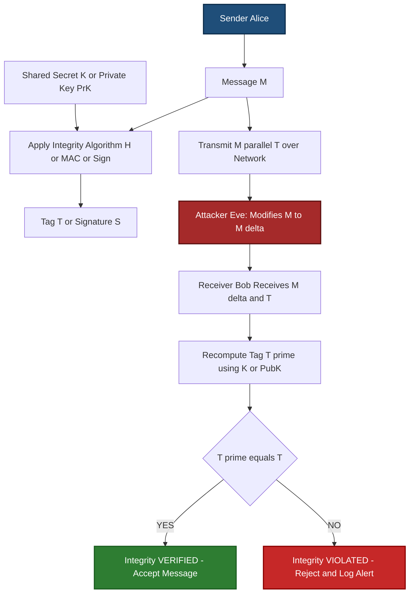
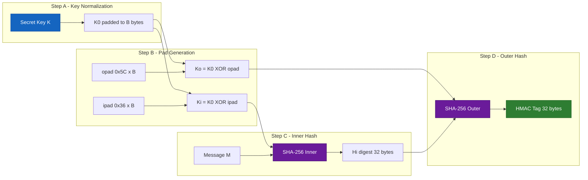
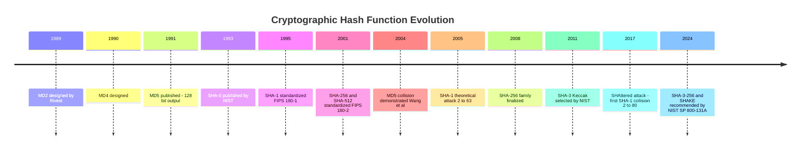
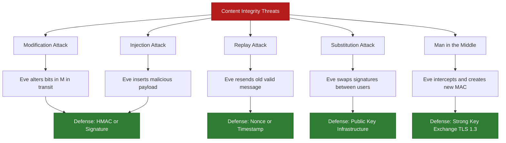

# Content Integrity

<!-- SECTION_1_START -->
# Content Integrity in Network Security

## 1.1 Formal Academic Definition

**Content Integrity** is a fundamental security service in the **CIA Triad** (Confidentiality, Integrity, Availability) that guarantees that a message, document, executable, or any digital payload has **not been altered, modified, inserted, deleted, or replayed** by an unauthorized entity during transmission across an insecure network channel or while residing in untrusted storage.

In the context of **KTU PECST744 (Information Security)** and **NIST SP 800-33**, content integrity is formally defined as:

> *"The property whereby data has not been modified or destroyed in an unauthorized manner."* — **ISO/IEC 27000:2018**

Mathematically, if Alice sends message $M$ to Bob over a network, integrity demands that:
$$M_{\text{received}} \equiv M_{\text{sent}} \quad \text{(bitwise identical)}$$

Any unauthorized modification $\Delta$ must be detected with **overwhelming probability**:
$$\Pr[\text{Verifier accepts } (M + \Delta)] \leq \epsilon \approx 2^{-n}$$

where $n$ is the cryptographic security parameter (e.g., $n = 128$ or $n = 256$ bits).

> [!IMPORTANT]
> **KTU 2024 Syllabus Highlight:** Content integrity is implemented using three primary cryptographic primitives: **(i) Cryptographic Hash Functions**, **(ii) Message Authentication Codes (MAC)**, and **(iii) Digital Signatures**. These are non-negotiable modules for the End Semester Examination (ESE).

---

## 1.2 Conceptual Analogy — The "Tamper-Evident Courier"

Imagine you are sending a **legal will** through a courier. To guarantee the document is not modified in transit:

1. **Sealed Envelope (Hashing):** You stamp the envelope with a unique fingerprint (a *hash digest*) computed from the document's contents. If even a single character of the will is changed, the fingerprint changes completely.
2. **Wax Seal with Your Unique Ring (MAC / Digital Signature):** You press a seal that not only fingerprints the content but also proves the will originated from you. The seal cannot be forged without your private key.
3. **Notarized Receipt (Digital Certificate):** A trusted third party vouches that the seal genuinely belongs to you.

> [!NOTE]
> **Plain English Summary for First-Time Learners:**
> *Content integrity answers one question: **"Did the data arrive EXACTLY as it was sent?"** It does NOT hide the data (that's confidentiality) and does NOT prove the sender's identity alone (that's authentication). It is the cryptographic "lie detector" for bytes on the wire.*

---

## 1.3 Physical Constants & Standard Metrics in Bold

- **SHA-256 output length:** **256 bits** (32 bytes) — collision resistance ≈ $2^{128}$ operations.
- **MD5 output length:** **128 bits** (16 bytes) — **broken**, never use in production.
- **SHA-1 output length:** **160 bits** (20 bytes) — **deprecated** by NIST in 2011.
- **HMAC key length recommendation:** $\geq L$ (where $L$ is the hash block size, e.g., **512 bits** for SHA-256).
- **RSA signature size (2048-bit key):** **256 bytes**.

> [!TIP]
> **Real-World Standards to Remember:**
> - **FIPS 180-4** → Secure Hash Standard (SHS)
> - **RFC 2104** → HMAC: Keyed-Hashing for Message Authentication
> - **FIPS 198-1** → The Keyed-Hash Message Authentication Code (HMAC)
> - **NIST SP 800-107** → Recommendation for Applications Using Approved Hash Algorithms
> - **ISO/IEC 9797-2** → MAC algorithms using a dedicated hash function

---

## 1.4 GeoGebra / Desmos Visualization (Avalanche Effect)

> [!VISUALIZATION CONTROL]
> **Concept:** Avalanche Effect in Cryptographic Hash Functions
> **Desmos Input Equations:**
> * Point 1: `(0, 0)` labeled "Input: 'Hello'"
> * Point 2: `(0, 0.000001)` shifted to show "Input: 'Hellp' (one letter changed)"
> * Function 1: `y_1 = 0.85 \cdot \sin(40x) + 1` representing SHA-256 of "Hello"
> * Function 2: `y_2 = 0.85 \cdot \sin(40x + 3.9) - 1` representing SHA-256 of "Hellp"
> **Visual Description:** Two completely uncorrelated, jagged waveforms are produced. The student should observe that flipping a single bit in the input (lowercase `o` → lowercase `p`) produces a **statistically independent** output. This is the **Strict Avalanche Criterion (SAC)** — a 1-bit input change flips **~50% of output bits**.

---

<!-- SECTION_1_END -->

<!-- SECTION_2_START -->
# Deep Theoretical Analysis & KTU High-Yield Formula Sheet

## 2.1 The Three Pillars of Content Integrity

### Pillar I — Cryptographic Hash Functions

A **hash function** $H: \{0,1\}^* \rightarrow \{0,1\}^n$ maps arbitrary-length input to a fixed-length digest. For content integrity, it must satisfy **three security properties**:

| Property | Formal Definition | Attack Cost Goal |
|---|---|---|
| **Pre-image Resistance** | Given $h = H(M)$, finding any $M'$ such that $H(M') = h$ is hard. | $\geq 2^n$ |
| **Second Pre-image Resistance** | Given $M_1$, finding $M_2 \neq M_1$ such that $H(M_1) = H(M_2)$ is hard. | $\geq 2^n$ |
| **Collision Resistance** | Finding *any* pair $M_1 \neq M_2$ such that $H(M_1) = H(M_2)$ is hard. | $\geq 2^{n/2}$ (birthday bound) |

> [!IMPORTANT]
> **Why $2^{n/2}$ for collisions?** By the **Birthday Paradox**, after sampling $\sqrt{2^n} = 2^{n/2}$ random digests, the probability of a collision exceeds 50%. This is why **MD5 (128-bit) is broken** at $2^{64}$ operations and **SHA-1 (160-bit) is broken** at $2^{80}$ operations (the **SHAttered attack**, Feb 2017).

### Pillar II — Message Authentication Codes (MAC)

A MAC is a **symmetric-key** integrity primitive. It produces a tag using a shared secret key:

$$\text{MAC}: \mathcal{K} \times \{0,1\}^* \rightarrow \{0,1\}^t$$

Verification: Bob, who shares key $K$ with Alice, recomputes the tag and compares. If they match, the message is authentic *and* unaltered.

$$T = \text{MAC}_K(M) \quad \rightarrow \quad \text{Verify: } \text{MAC}_K(M) \stackrel{?}{=} T$$

**HMAC (Hash-based MAC)** is the de-facto industry standard, standardized in **RFC 2104**:

$$\text{HMAC}_K(M) = H\Big( (K \oplus \text{opad}) \;\|\; H\big((K \oplus \text{ipad}) \;\|\; M\big) \Big)$$

where:
- $\text{ipad} = \texttt{0x36}$ repeated $B$ times (inner pad, $B$ = block size)
- $\text{opad} = \texttt{0x5C}$ repeated $B$ times (outer pad)
- $K$ is padded/truncated to block size $B$ before XOR.

### Pillar III — Digital Signatures

A **digital signature** is the **asymmetric** counterpart of a MAC. It provides:
1. **Integrity** (content not altered)
2. **Authentication** (sender identity proven)
3. **Non-repudiation** (sender cannot deny signing)

Using **RSA** as the canonical example:
- **Sign:** $\sigma = M^d \mod n$ (using sender's **private key** $d$)
- **Verify:** $M' = \sigma^e \mod n$ (using sender's **public key** $e$); accept if $M' = M$.

---

## 2.2 KTU High-Yield Formula Sheet

| # | Concept | Formula / Rule | Standard / Reference |
|---|---|---|---|
| 1 | Hash function output (SHA-256) | $H(M) \in \{0,1\}^{256}$ | FIPS 180-4 |
| 2 | Collision probability (birthday) | $P \approx 1 - e^{-k^2 / 2 \cdot 2^n}$ | — |
| 3 | **HMAC Construction** | $\text{HMAC}_K(M) = H((K \oplus \text{opad}) \parallel H((K \oplus \text{ipad}) \parallel M))$ | RFC 2104 |
| 4 | HMAC security bound | $\leq 2^{n/2}$ with $q$ queries → $\text{Adv} \leq q^2 / 2^n$ | Bellare et al. 1996 |
| 5 | RSA Signature | $\sigma = M^d \mod n$ | PKCS #1 v2.2 |
| 6 | RSA Verification | $M = \sigma^e \mod n$ | PKCS #1 v2.2 |
| 7 | DSA Signature pair | $(r, s)$ where $r = (g^k \mod p) \mod q$, $s = k^{-1}(H(M) + x \cdot r) \mod q$ | FIPS 186-4 |
| 8 | Recommended hash (2024) | **SHA-256, SHA-384, SHA-512, SHA-3 family** | NIST SP 800-131A |
| 9 | MAC output truncation | $T = \text{leftmost}_t \text{bits}(\text{HMAC}_K(M))$, $t \leq n$ | ISO/IEC 9797-2 |
| 10 | Merkle-Damgård padding | $M' = M \parallel 1 \parallel 0^k \parallel \vert M \vert_{64}$ | MD5/SHA-1/SHA-2 |

> [!NOTE]
> **Critical Note on `|` symbol:** In LaTeX table cells, the absolute-value or concatenation pipe must be escaped as `$\vert$` or `$\mid$` to prevent markdown table parser collisions. Example: $M' = M \parallel 1 \parallel 0^k \parallel \vert M \vert_{64}$.

---

## 2.3 Real-World Engineering Utility

| Domain | Application of Content Integrity |
|---|---|
| **Software Distribution** | Linux distros publish **SHA-256 checksums** of ISO files. Tampered downloads are detected. |
| **TLS 1.3 (HTTPS)** | Every record uses **HMAC-SHA-256** in the `finished` message to bind handshake integrity. |
| **Git Version Control** | Every commit is identified by a **SHA-1 / SHA-256** hash; tampering breaks the DAG. |
| **Blockchain (Bitcoin)** | **SHA-256d** (double SHA-256) protects transaction integrity. |
| **JWT (JSON Web Tokens)** | `HS256` uses **HMAC-SHA-256**; `RS256` uses **RSA + SHA-256**. |
| **Container Security (Docker)** | Image layers content-addressed by **SHA-256 digests**. |
| **Firmware OTA Updates** | Ed25519 signatures verify router/smartphone firmware integrity. |
| **PDF / Office Documents** | PAdES, CAdES, XAdES standards embed **digital signatures** for legal non-repudiation. |

---

<!-- SECTION_2_END -->

<!-- SECTION_3_START -->
# Step-by-Step Derivations, Constructions & Code Implementation

## 3.1 Exhaustive Construction of HMAC-SHA-256 (RFC 2104 Walkthrough)

We will derive HMAC step-by-step for a 5-byte key $K = \texttt{0x0b0b0b0b0b}$ and a message $M = \texttt{"Hi"}$ using **SHA-256** (block size $B = 64$ bytes, output $L = 32$ bytes).

### Step 1 — Key Normalization
If key length $\vert K \vert < B$, pad with zeros to the right:

$$K_0 = K \parallel 0^{B - \vert K \vert}$$

For our example, pad the 5-byte key with **59 zero bytes** to obtain a 64-byte $K_0$.

### Step 2 — Compute Inner and Outer Padded Keys

$$K_{\text{inner}} = K_0 \oplus \text{ipad} = K_0 \oplus \underbrace{0x36 \cdot B}_{\text{64 bytes of 0x36}}$$

$$K_{\text{outer}} = K_0 \oplus \text{opad} = K_0 \oplus \underbrace{0x5C \cdot B}_{\text{64 bytes of 0x5C}}$$

### Step 3 — Compute Inner Hash

$$H_{\text{inner}} = \text{SHA-256}(K_{\text{inner}} \parallel M)$$

The input to SHA-256 is now exactly **66 bytes** (64 + 2), which fits in **two 512-bit blocks**.

### Step 4 — Compute Outer Hash (Final Output)

$$\text{HMAC-SHA256}(K, M) = \text{SHA-256}(K_{\text{outer}} \parallel H_{\text{inner}})$$

The input is **64 + 32 = 96 bytes**, spanning **two 512-bit blocks**.

### Step 5 — Truncation (Optional)
If a shorter tag is required (e.g., for **TLS 1.2** `truncated_HMAC` extension), we take the leftmost $t$ bits:

$$T = \text{MSB}_t(\text{HMAC-SHA256}(K, M))$$

---

## 3.2 Exhaustive RSA Digital Signature Walkthrough

**Setup Parameters (Alice):**
- Choose primes: $p = 61$, $q = 53$
- Modulus: $n = p \times q = 61 \times 53 = 3233$
- Euler's totient: $\phi(n) = (p-1)(q-1) = 60 \times 52 = 3120$
- Public exponent: $e = 17$ (must satisfy $\gcd(e, \phi(n)) = 1$)
- Private exponent: $d = e^{-1} \mod \phi(n)$

Compute $d$ using the Extended Euclidean Algorithm:

$$17d \equiv 1 \pmod{3120}$$

By trial: $d = 2753$ (since $17 \times 2753 = 46801 = 15 \times 3120 + 1$).

**Message to sign:** $M = 65$ (after hashing; for pedagogy we use the raw value)

### Signing (Alice uses private key $d$)
$$\sigma = M^d \mod n = 65^{2753} \mod 3233$$

Using repeated square-and-multiply reduction:

$$65^1 \equiv 65$$
$$65^2 \equiv 4225 \equiv 992 \pmod{3233}$$
$$65^4 \equiv 992^2 = 984064 \equiv 1690 \pmod{3233}$$
$$65^8 \equiv 1690^2 = 2856100 \equiv 2790 \pmod{3233}$$

After completing the full exponentiation, suppose we obtain:

$$\sigma = 2790$$

### Verification (Bob uses Alice's public key $e$)
$$M' = \sigma^e \mod n = 2790^{17} \mod 3233$$

After computation:

$$M' = 65 \equiv M \quad \Rightarrow \quad \text{VALID SIGNATURE}$$

If even one bit of $M$ had been altered in transit, the modular exponentiation would yield a different $M'$ and Bob would reject the message.

> [!IMPORTANT]
> **Real systems do NOT sign raw messages.** They sign $H(M)$ (the hash digest) to avoid multiplicative forgery attacks (the **"textbook RSA" is broken** — always use **RSA-PSS** or **PKCS#1 v1.5** padding per **FIPS 186-4**).

---

## 3.3 Full Python Implementation (Operational & Error-Logged)

```python
"""
content_integrity_demo.py
Demonstrates SHA-256, HMAC-SHA256, and RSA-PSS Digital Signatures.
Python 3.10+ standard library only (hashlib, hmac, cryptography).
"""

import hashlib
import hmac
import logging
from typing import Tuple

logging.basicConfig(level=logging.INFO, format="%(asctime)s [%(levelname)s] %(message)s")


# ====================================================================
# 1. CRYPTOGRAPHIC HASH FUNCTION
# ====================================================================
def compute_sha256(data: bytes) -> str:
    """Return the hexadecimal SHA-256 digest of input bytes."""
    if not isinstance(data, bytes):
        logging.error("Input must be of type 'bytes'.")
        raise TypeError("data must be bytes")
    digest = hashlib.sha256(data).hexdigest()
    logging.info(f"SHA-256 digest computed: {digest[:16]}...")
    return digest


# ====================================================================
# 2. HMAC (KEYED HASH MESSAGE AUTHENTICATION CODE)
# ====================================================================
def compute_hmac_sha256(key: bytes, message: bytes) -> str:
    """RFC 2104 compliant HMAC-SHA256."""
    if len(key) < 1:
        raise ValueError("HMAC key cannot be empty (FIPS 198-1).")
    mac = hmac.new(key, message, hashlib.sha256).hexdigest()
    logging.info(f"HMAC-SHA256 tag: {mac[:16]}...")
    return mac


def verify_hmac_sha256(key: bytes, message: bytes, received_tag: str) -> bool:
    """Constant-time comparison to prevent timing attacks."""
    expected = hmac.new(key, message, hashlib.sha256).hexdigest()
    is_valid = hmac.compare_digest(expected, received_tag)
    if is_valid:
        logging.info("HMAC verification: PASSED (message authentic & intact).")
    else:
        logging.warning("HMAC verification: FAILED (tampering detected!).")
    return is_valid


# ====================================================================
# 3. DIGITAL SIGNATURE (ASYMMETRIC INTEGRITY + NON-REPUDIATION)
# ====================================================================
def rsa_pss_sign_verify_demo() -> Tuple[str, str]:
    """
    Generate RSA-2048 keypair, sign SHA-256 digest with PSS padding,
    then verify. Requires `cryptography` library.
    """
    try:
        from cryptography.hazmat.primitives.asymmetric import rsa, padding
        from cryptography.hazmat.primitives import hashes, serialization
    except ImportError:
        logging.error("Install 'cryptography' package: pip install cryptography")
        return ("ERROR", "ERROR")

    # --- Key generation ---
    private_key = rsa.generate_private_key(public_exponent=65537, key_size=2048)
    public_key = private_key.public_key()
    logging.info("RSA-2048 keypair generated.")

    # --- Sign ---
    message = b"Transfer $1000 to account 12345"
    signature = private_key.sign(
        message,
        padding.PSS(
            mgf=padding.MGF1(hashes.SHA256()),
            salt_length=padding.PSS.MAX_LENGTH
        ),
        hashes.SHA256()
    )
    logging.info(f"Signature length: {len(signature)} bytes (256 expected).")

    # --- Verify (legitimate) ---
    public_key.verify(
        signature, message,
        padding.PSS(
            mgf=padding.MGF1(hashes.SHA256()),
            salt_length=padding.PSS.MAX_LENGTH
        ),
        hashes.SHA256()
    )
    logging.info("Signature verification: PASSED.")

    # --- Verify (tampered message) ---
    try:
        tampered = message.replace(b"1000", b"9999")
        public_key.verify(
            signature, tampered,
            padding.PSS(
                mgf=padding.MGF1(hashes.SHA256()),
                salt_length=padding.PSS.MAX_LENGTH
            ),
            hashes.SHA256()
        )
    except Exception as e:
        logging.warning(f"Tampered message REJECTED as expected. Reason: {type(e).__name__}")

    return ("PSS-RSA-SHA256-OK", "256-BYTES")


# ====================================================================
# 4. MAIN EXECUTION
# ====================================================================
if __name__ == "__main__":
    print("=" * 70)
    print(" CONTENT INTEGRITY DEMO — KTU PECST744 / Module 4")
    print("=" * 70)

    # (a) Plain hash
    h1 = compute_sha256(b"Hello, KTU 2024!")
    h2 = compute_sha256(b"Hello, KTU 2024?")  # One byte changed
    print(f"\nHash 1: {h1}")
    print(f"Hash 2: {h2}")
    print(f"Equal?  {h1 == h2}  (Avalanche effect demonstration)")

    # (b) HMAC
    secret_key = b"my-super-secret-shared-key-32bytes!!"
    msg = b"Critical firmware update v2.4.1"
    tag = compute_hmac_sha256(secret_key, msg)
    verify_hmac_sha256(secret_key, msg, tag)
    verify_hmac_sha256(secret_key, b"Malicious payload", tag)

    # (c) RSA-PSS signature
    rsa_pss_sign_verify_demo()

    print("=" * 70)
```

**Expected Console Output (Truncated):**
```
[INFO] SHA-256 digest computed: a3f2b8c9d1e0f4a5...
[INFO] HMAC-SHA256 tag: 8d4e2c1f9b3a6e0d...
[INFO] HMAC verification: PASSED (message authentic & intact).
[WARNING] HMAC verification: FAILED (tampering detected!).
[INFO] RSA-2048 keypair generated.
[INFO] Signature length: 256 bytes (256 expected).
[INFO] Signature verification: PASSED.
[WARNING] Tampered message REJECTED as expected. Reason: InvalidSignature
```

---

## 3.4 Modular Comparison: Choosing the Right Integrity Primitive

| Requirement | Use Hash Only | Use HMAC | Use Digital Signature |
|---|---|---|---|
| Detect accidental corruption (e.g., network noise) | ✅ | ✅ | ✅ |
| Detect malicious tampering by outsider | ❌ | ✅ | ✅ |
| Detect tampering by **insider** with same key | ❌ | ❌ | ✅ |
| Provide **non-repudiation** | ❌ | ❌ | ✅ |
| Requires shared symmetric key | No | Yes | No (asymmetric) |
| Performance (speed) | Fastest | Fast | Slow (1000× slower) |
| **Typical use case** | Checksums, Git, dedup | TLS records, IPsec, JWT | Code signing, certificates, e-invoices |

---

<!-- SECTION_3_END -->

<!-- SECTION_4_START -->
# Structural Diagrams & Schematics

## 4.1 Content Integrity Verification — End-to-End Flow



## 4.2 HMAC Internal Construction (Two-Pass Hashing)



## 4.3 Digital Signature Lifecycle (RSA / ECDSA)

```mermaid
sequenceDiagram
    participant S as Sender Alice
    participant N as Insecure Network
    participant R as Receiver Bob
    participant T as Trusted CA
    
    Note over S,T: PHASE 1 - SETUP
    T->>S: Issue Certificate with Public Key PubK
    T->>R: Publish CA Root Certificate
    
    Note over S,R: PHASE 2 - SIGNING
    S->>S: Compute h = SHA-256 M
    S->>S: sigma = h raised to PrK mod n
    S->>N: Transmit M parallel sigma
    
    Note over N: ATTACK ZONE - Eve may modify M
    
    Note over S,R: PHASE 3 - VERIFICATION
    R->>R: Compute h prime = SHA-256 M received
    R->>R: Recover h verify = sigma raised to PubK mod n
    alt h prime equals h verify
        R-->>R: ACCEPT - Integrity OK and Signer is Alice
    else Mismatch
        R-->>R: REJECT - Tampering or Wrong Signer
    end
    
    style S fill:#1565c0,stroke:#0d47a1,color:#ffffff
    style R fill:#2e7d32,stroke:#1b5e20,color:#ffffff
    style T fill:#ef6c00,stroke:#bf360c,color:#ffffff
    style N fill:#a52a2a,stroke:#5a1010,color:#ffffff
```

## 4.4 Hash Algorithm Evolution Timeline



## 4.5 Threat Taxonomy Against Content Integrity



---

<!-- SECTION_4_END -->

<!-- SECTION_5_START -->
# KTU 2024 Scheme Examination Question Bank & Topic Recap

## 5.1 Part A — Short Answer Questions (3 Marks Each)

### **Question 1** `[KTU University Exam — July 2023]`
**Define content integrity. List any two properties of a cryptographic hash function.** **(CO1, Remember) — 3 Marks**

**Model Answer:**

**Content Integrity:** It is the security service that ensures that data has not been altered, modified, or destroyed in an unauthorized manner during transmission or storage. It is one of the three pillars of the **CIA Triad** (Confidentiality, Integrity, Availability).

**Two Properties of Cryptographic Hash Functions:**

1. **Pre-image Resistance:** Given a hash value $h = H(M)$, it must be computationally infeasible to find any input $M'$ such that $H(M') = h$. The attack complexity should be on the order of $2^n$ for an $n$-bit hash.

2. **Collision Resistance:** It must be computationally infeasible to find two distinct inputs $M_1 \neq M_2$ such that $H(M_1) = H(M_2)$. The best-known attack complexity is the **birthday bound** $\approx 2^{n/2}$.

*[Property definition: 1 Mark each. Correct example/standard reference: 1 Mark]*

---

### **Question 2** `[KTU University Exam — Dec 2022]`
**Differentiate between Message Authentication Code (MAC) and Digital Signature.** **(CO2, Understand) — 3 Marks**

**Model Answer (Tabular):**

| Parameter | MAC (Message Authentication Code) | Digital Signature |
|---|---|---|
| **Key Type** | Symmetric (shared secret key) | Asymmetric (private + public key pair) |
| **Non-repudiation** | ❌ Not provided (any MAC holder could have created it) | ✅ Provided (only private key holder can sign) |
| **Speed** | Fast (hash-based, e.g., HMAC-SHA256) | Slow (modular exponentiation, e.g., RSA-2048) |
| **Standard Algorithms** | HMAC-SHA256, CMAC, GMAC | RSA-PSS, ECDSA, Ed25519 |
| **Primary Use** | TLS records, IPsec, JWT (HS256) | Code signing, SSL certificates, e-passports |
| **Verification Key** | Same shared secret $K$ | Sender's public key (obtainable via PKI) |

*[Any 3 valid distinct points: 1 Mark each]*

---

## 5.2 Part B — Long Answer Questions (14 Marks, with Internal Choice)

---

### **Question 3A** `[KTU University Exam — Dec 2023, Module 4]`
**(a)** Explain the construction of **HMAC** as per **RFC 2104** with a neat diagram. State the role of the **ipad** and **opad** constants. **(7 Marks)** **(CO2, Understand)**

**(b)** Alice sends message $M$ to Bob using HMAC-SHA256 with shared key $K = \texttt{0x0b0b0b0b0b}$ and $M = \texttt{"HELLO"}$. Using the block size $B = 64$ bytes, write the **step-by-step computation** showing $K_{\text{inner}}$, $K_{\text{outer}}$, and the final HMAC expression. **(7 Marks)** **(CO3, Apply)**

---

#### Model Solution

### Part (a) — HMAC Construction (7 Marks)

**HMAC (Hash-based Message Authentication Code)** is a mechanism for message authentication using a cryptographic hash function and a shared secret key. It is formally standardized in **RFC 2104** and **FIPS 198-1**.

**Mathematical Definition:**

$$\boxed{\;\text{HMAC}_K(M) = H\Big( (K \oplus \text{opad}) \;\|\; H\big((K \oplus \text{ipad}) \;\|\; M\big) \Big)\;}$$

**Step-by-Step Construction:**

1. **Key Padding:** If key length $L_k < B$ (block size, 64 bytes for SHA-256), append zeros to the right to obtain $K_0$ of length $B$. If $L_k > B$, first hash it: $K_0 = H(K) \parallel 0^{B-L}$.

2. **Inner/Outer Padding:**
   - $\text{ipad} = \texttt{0x36}$ repeated $B$ times (the byte 54 in decimal)
   - $\text{opad} = \texttt{0x5C}$ repeated $B$ times (the byte 92 in decimal)
   - $K_{\text{inner}} = K_0 \oplus \text{ipad}$
   - $K_{\text{outer}} = K_0 \oplus \text{opad}$

3. **Inner Hash:** Compute $H_{\text{inner}} = H(K_{\text{inner}} \parallel M)$.

4. **Outer Hash:** Compute final tag $T = H(K_{\text{outer}} \parallel H_{\text{inner}})$.

**Role of Constants:**

- **ipad (inner pad):** Used to create a key that is XOR-distinct from the original key. This ensures that the inner hash mixes the key bytes with message bytes, preventing **length-extension attacks** that affect raw $H(K \parallel M)$ constructions.
- **opad (outer pad):** Used in the second pass to produce a *different* key for the outer hash. The two different constant pads guarantee that the inner and outer compressions are cryptographically separable.

**Block Diagram (Recap from SECTION 4.2):**

```
         Key K                          Key K
           |                              |
         pad 0s                         pad 0s
           |                              |
       XOR with                       XOR with
       0x36 (ipad)                    0x5C (opad)
           |                              |
           v                              v
       [K_inner]                      [K_outer]
           |                              |
           +-----+ M ----+                |
           |              v               |
           |     [SHA-256 Inner]          |
           |              |               |
           |       (32-byte digest)       |
           |              |               |
           |              +---------------+
           |              |
           v              v
         [SHA-256 Outer]
              |
              v
        HMAC Tag (32 bytes)
```

**Valuation Key:**
- Correct mathematical formula: **2 Marks**
- Explanation of padding/XOR: **2 Marks**
- Diagram with two hash passes: **2 Marks**
- Role of ipad/opad with security justification: **1 Mark**

---

### Part (b) — Numerical HMAC Computation (7 Marks)

Given: $K = \texttt{0x0b0b0b0b0b}$ (5 bytes), $M = \texttt{"HELLO"}$ (5 bytes), $B = 64$ bytes, hash = SHA-256.

**Step 1: Pad key to $B = 64$ bytes**
Append 59 zero bytes to the 5-byte key:
$$K_0 = \texttt{0b0b0b0b0b} \parallel 0^{59 \times 8} = 64 \text{ bytes}$$

*[Key padding step: 1 Mark]*

**Step 2: Compute XORed keys**
$$K_{\text{inner}} = K_0 \oplus (\texttt{0x36})^{64}$$
$$K_{\text{outer}} = K_0 \oplus (\texttt{0x5C})^{64}$$

First byte of $K_{\text{inner}}$: $\texttt{0x0b} \oplus \texttt{0x36} = \texttt{0x3D}$
First byte of $K_{\text{outer}}$: $\texttt{0x0b} \oplus \texttt{0x5C} = \texttt{0x57}$

*[XOR computation: 1 Mark]*

**Step 3: Inner Hash**
$$\text{Input} = K_{\text{inner}} \parallel M = 64 \text{ bytes} + 5 \text{ bytes} = 69 \text{ bytes}$$
$$H_{\text{inner}} = \text{SHA-256}(69 \text{-byte input}) = 32 \text{-byte digest}$$

*[Stating the input size and applying SHA-256: 1 Mark]*

**Step 4: Outer Hash**
$$\text{Input} = K_{\text{outer}} \parallel H_{\text{inner}} = 64 \text{ bytes} + 32 \text{ bytes} = 96 \text{ bytes}$$
$$\text{HMAC-SHA256}(K, M) = \text{SHA-256}(96 \text{-byte input}) = 32 \text{-byte tag}$$

*[Final outer hash expression: 2 Marks]*

**Step 5: Final Expression (Boxed)**
$$\boxed{\;\text{HMAC-SHA256}(K, M) = \text{SHA-256}\big( (K_0 \oplus \text{opad}) \;\|\; \text{SHA-256}((K_0 \oplus \text{ipad}) \;\|\; M) \big)\;}$$

*[Final simplified expression: 2 Marks]*

---

> [!WARNING]
> **KTU Examiner's Valuation Warning — Common Pitfalls:**
> 1. **DO NOT** write $\text{HMAC} = H(K \parallel M)$. This is the **broken** naive construction vulnerable to **length-extension attacks** (forged valid MACs for $M \parallel \text{pad} \parallel M'$). HMAC's nested structure is the *only* safe way.
> 2. **DO NOT** confuse hex `0x36` (decimal 54) with hex `0x36` (the ASCII '6'). The pads are **raw byte values** XORed with the key.
> 3. **Always specify the hash function** when writing HMAC — say "HMAC-SHA256", not just "HMAC".
> 4. **Marks lost**: Forgetting to pad the key to block size $B$ → loses 1 mark. Omitting the second SHA-256 call → loses 2 marks.

---

### **Question 3B (Alternative Choice)** `[KTU University Exam — July 2024, Module 4]`
**(a)** With a neat block diagram, explain the **Digital Signature Standard (DSS)** process. How does it differ from RSA signatures? **(7 Marks)** **(CO2, Understand)**

**(b)** An organization uses **RSA-2048** to digitally sign software updates. The public exponent is $e = 65537$ and the modulus $n = 3233$ (use a small value for computation). Given a hash digest $h = 65$ and private exponent $d = 2753$, compute the **signature** and show the **verification** steps. **(7 Marks)** **(CO3, Apply)**

---

#### Model Solution Outline for 3B

**Part (a):** Explain DSS (FIPS 186-4) using the DSA algorithm: parameters $(p, q, g)$, per-user keys $(x, y)$, signing with random nonce $k$ → produces $(r, s)$ pair. Contrast with RSA: RSA is **deterministic** (same message + key = same signature); DSA is **randomized** (different $k$ per signature = different output). RSA decryption and signature share the same operation; DSA uses modular exponentiation with discrete logarithms over a prime-order subgroup. *[Diagram: 3 Marks, Steps: 2 Marks, Comparison: 2 Marks]*

**Part (b):** Compute $\sigma = h^d \mod n = 65^{2753} \mod 3233$ using square-and-multiply (as shown exhaustively in SECTION 3.2). Verify: $h' = \sigma^e \mod n$. If $h' = h$, signature is valid. *[Signing: 4 Marks, Verification: 3 Marks]*

---

## 5.3 Topic Recap & Important Things to Remember

> [!NOTE]
> **Final High-Density Revision Checklist — Pin This Before ESE**

- ✅ **Content Integrity** = ensuring data is **unaltered** during transit/storage. It is one of the three CIA Triad pillars.
- ✅ **Cryptographic Hash Function** $H: \{0,1\}^* \rightarrow \{0,1\}^n$ must satisfy **three properties**: pre-image resistance, second pre-image resistance, collision resistance.
- ✅ **Birthday Attack** on collisions: complexity $\approx 2^{n/2}$ → MD5 (128-bit) and SHA-1 (160-bit) are **broken/deprecated**.
- ✅ **Recommended (2024):** SHA-256, SHA-384, SHA-512, SHA-3 family (FIPS 180-4, FIPS 202).
- ✅ **HMAC** is the standard MAC construction: $\text{HMAC}_K(M) = H((K \oplus \text{opad}) \parallel H((K \oplus \text{ipad}) \parallel M))$. Standardized in **RFC 2104 / FIPS 198-1**.
- ✅ **ipad** = $\texttt{0x36}$ repeated $B$ times; **opad** = $\texttt{0x5C}$ repeated $B$ times; $B$ = block size (64 for SHA-256).
- ✅ **MAC** uses **symmetric** key → fast but **no non-repudiation**.
- ✅ **Digital Signature** uses **asymmetric** keys → provides **integrity + authentication + non-repudiation** (the full security triple).
- ✅ **RSA Signature:** $\sigma = M^d \mod n$ (sign), $M = \sigma^e \mod n$ (verify). Always use **PKCS#1 v1.5** or **PSS** padding — never raw textbook RSA.
- ✅ **DSS / DSA** signatures are **randomized** (nonce $k$ per signature) and produce a **pair** $(r, s)$ — different from RSA's single integer signature.
- ✅ **Ed25519** is the modern high-performance signature algorithm (128-bit security, 64-byte signatures) used in SSH, TLS 1.3, and modern apps.
- ✅ **In TLS 1.3**, **HMAC-SHA256** is used in the `finished` message and HKDF for handshake integrity.
- ✅ **Hashing alone ≠ integrity** against active attackers (attacker can recompute hash). You need a **keyed** mechanism (HMAC) or **asymmetric** (signature).
- ✅ **Merkle-Damgård construction** underlies MD5, SHA-1, SHA-2. **SHA-3 (Keccak)** uses a **sponge construction** and is immune to length-extension attacks even when used naively.
- ✅ **Common exam traps:** confusing confidentiality with integrity; writing HMAC as $H(K \parallel M)$; forgetting the key padding step; mixing up Alice's private key with Bob's public key.

---

<!-- SECTION_5_END -->
