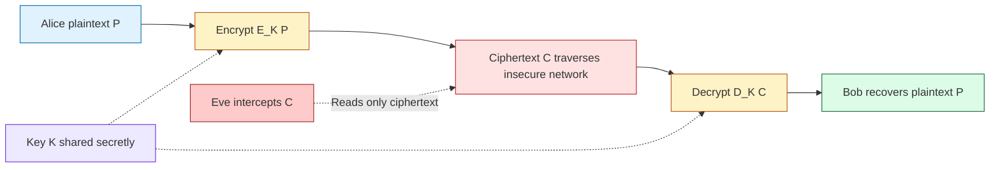
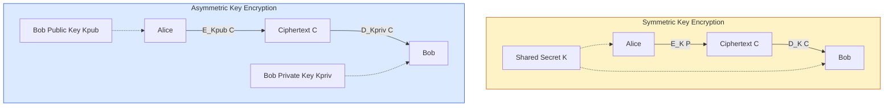
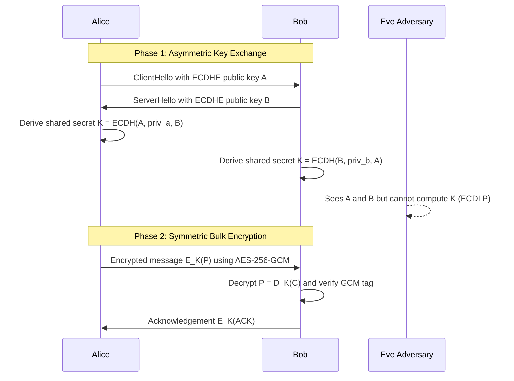
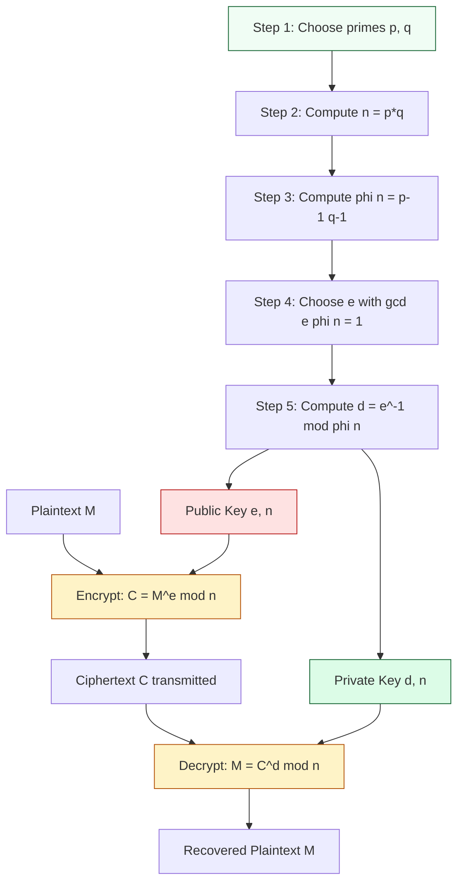
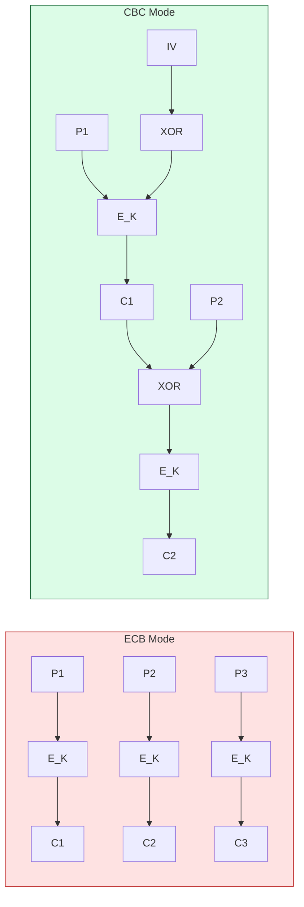

# Encryption

<!-- SECTION_1_START -->
# Module 4: Security in Networks — Topic: Encryption

## 1. Core Technical Definition & Intuitive Overview

> [!IMPORTANT]
> **Formal KTU 2024 Definition:**
> **Encryption** is the cryptographic process of transforming a readable plaintext ($P$) into an unreadable ciphertext ($C$) using a mathematical algorithm (cipher) and a secret key ($K$), such that only authorised parties possessing the correct decryption key can recover the original message. Formally, the encryption function is represented as:
>
> $$C = E_K(P)$$
>
> and the corresponding decryption function is:
>
> $$P = D_K(C)$$
>
> Encryption is the foundational primitive of **network security** that guarantees **confidentiality**, supports **integrity**, and enables **authentication** and **non-repudiation** when used with hash functions and digital signatures.

### 1.1 Conceptual Analogy — The Locked Treasure Box

Imagine you want to send a secret diary to your friend across a hostile town. You buy a **locked steel box**, place the diary inside, and snap it shut. The box is the **ciphertext** — useless to anyone who finds it on the road. The **key** is the secret only you and your friend share. The act of snapping the lock is **encryption**; the act of unlocking it on the other end is **decryption**.

Now extend the analogy:
- If you and your friend use **the same key** to lock and unlock the box, that is **symmetric encryption** (fast, but you must safely hand over the key in person first).
- If instead the box has a clever two-slot mechanism where *anyone* can drop a diary in using a **public slot** (a public key), but only your friend can open it with a **private key** they keep hidden, that is **asymmetric encryption** (slower, but solves the key-handover problem).

> [!NOTE]
> **Key Performance Insight for KTU Board Exams:**
> In any network security question, always identify the **threat being mitigated**. Encryption primarily counters **passive attacks** such as **interception** and **traffic analysis** (from the STRIDE / Network Security taxonomy taught in Module 4).

### 1.2 Classification of Encryption — The Big Picture

Encryption in network security is broadly classified along two independent axes:

| Axis | Category A | Category B |
| :--- | :--- | :--- |
| **Key Usage** | Symmetric-Key (Secret-Key) Cryptography | Asymmetric-Key (Public-Key) Cryptography |
| **Data Processing** | Block Ciphers (operate on fixed-size blocks, e.g. 64/128 bits) | Stream Ciphers (operate on individual bits/bytes) |
| **Historical Era** | Classical Encryption (substitution, transposition) | Modern Encryption (mathematically rigorous, computationally hard) |
| **Key Count** | Single shared key ($K$) | Key pair $(K_{pub}, K_{priv})$ |

> [!TIP]
> **KTU Board Tip:** Whenever the word "modern" appears in a question, the expected answer uses **binary/hexadecimal operations, modular arithmetic, and computationally hard problems** (factoring, discrete log) — never the Caesar cipher or rail-fence cipher except when explicitly asked for a comparison.

### 1.3 GeoGebra / Desmos Visualisation Control — Encryption as a Mapping

> [!VISUALIZATION CONTROL]
> **Concept:** Visualising the encryption function $C = E_K(P)$ as a one-to-one mapping between two finite sets of integers mod $n$.
> **GeoGebra / Desmos Input Equations:**
> * `P = {0, 1, 2, 3, 4, 5, 6, 7}`  *(plaintext set)*
> * `C = {0, 1, 2, 3, 4, 5, 6, 7}`  *(ciphertext set)*
> * `E(x) = (3x + 5) mod 8`  *(affine cipher example)*
> * Points: `(0, 5), (1, 0), (2, 3), (3, 6), (4, 1), (5, 4), (6, 7), (7, 2)`
> **Visual Description:** A scatter plot showing every plaintext element $x$ on the horizontal axis being uniquely mapped to a ciphertext element $E(x)$ on the vertical axis. Students should observe that the mapping is **bijective** (every $y$ is hit exactly once) — this bijectivity is the mathematical property that makes decryption possible.

---

## 1.4 Why Encryption is Indispensable in Networks

Network communication traverses shared, untrusted mediums (Wi-Fi, public internet, undersea cables). Without encryption, every email, banking credential, and medical record would be plaintext readable by any router along the path. Encryption ensures that even if an attacker (Eve) **intercepts** a packet, she sees only ciphertext — gibberish without the key.

**Engineering Reality Check:** HTTPS (TLS 1.3), IPsec, SSH, WPA3, and 5G-AKA all rely on a **hybrid encryption model** — asymmetric cryptography to safely exchange a symmetric session key, then symmetric cryptography (AES-128/256) for the bulk data transfer due to its ~1000× speed advantage.

<!-- SECTION_1_END -->

<!-- SECTION_2_START -->
# 2. Deep Theoretical Analysis & KTU High-Yield Formula Sheet

## 2.1 Symmetric-Key Encryption

### 2.1.1 Operational Logic

In symmetric encryption, both sender and receiver share **one common secret key** $K$ that is used for both encryption and decryption. The challenge is therefore the **secure distribution of $K$** before any communication begins.

**Operational Steps:**
1. Alice and Bob agree on a cipher $E$ and secretly share a key $K$ via an out-of-band channel (e.g., in person, courier).
2. Alice computes $C = E_K(P)$ and transmits $C$ over the insecure network.
3. Bob receives $C$ and computes $P = D_K(C)$ using the **same key $K$.
4. An eavesdropper Eve sees only $C$, which is computationally infeasible to invert without $K$.

### 2.1.2 Major Symmetric Algorithms (KTU 2024 High-Yield)

| Algorithm | Block Size | Key Size | Rounds | Status / Use Case |
| :--- | :--- | :--- | :--- | :--- |
| **DES** (Data Encryption Standard) | 64 bits | **56 bits** (effective) | 16 | **Broken** — brute-forceable; legacy only |
| **3DES** (Triple DES) | 64 bits | 112 / 168 bits | 48 | Deprecated by NIST 2023 |
| **AES-128** | 128 bits | 128 bits | 10 | **Current gold standard** for TLS, WPA2/3 |
| **AES-192** | 128 bits | 192 bits | 12 | High-security government |
| **AES-256** | 128 bits | 256 bits | 14 | Top-secret / quantum-resistant planning |
| **Blowfish** | 64 bits | 32 – 448 bits | 16 | Legacy, replaced by Twofish |
| **RC4** | Stream cipher | 40 – 2048 bits | N/A | **Broken** — never use in TLS |

> [!NOTE]
> **Kerckhoffs's Principle (1883):** *The security of a cryptographic system must rest entirely on the secrecy of the key, not on the secrecy of the algorithm.* This is why AES, RSA, and SHA are all **publicly published** and yet still secure — their keys are the only secrets.

## 2.2 Asymmetric-Key (Public-Key) Encryption

### 2.2.1 Operational Logic

Each user generates a **key pair**: a **public key** $K_{pub}$ freely distributed to anyone, and a **private key** $K_{priv}$ kept secret. Encryption is performed with the receiver's public key; only the receiver's private key can decrypt.

$$C = E_{K_{pub}^{Bob}}(P), \qquad P = D_{K_{priv}^{Bob}}(C)$$

### 2.2.2 Foundational Mathematical Hard Problems

| Algorithm | Mathematical Hard Problem | Year Proposed | Key Size (2019 NIST) |
| :--- | :--- | :--- | :--- |
| **RSA** (Rivest–Shamir–Adleman) | Integer Factorisation of $n = p \cdot q$ | 1977 | 2048 / 4096 bits |
| **Diffie–Hellman** (key exchange) | Discrete Logarithm in $\mathbb{Z}_p^*$ | 1976 | 2048 bits |
| **Elliptic Curve Cryptography (ECC)** | Elliptic Curve Discrete Logarithm Problem (ECDLP) | 1985 | 256 bits (= 3072-bit RSA) |
| **ElGamal** | Discrete Logarithm in $\mathbb{Z}_p^*$ | 1985 | 2048 bits |

> [!TIP]
> **ECC vs RSA Insight:** ECC offers **equivalent security at much smaller key sizes** — a 256-bit ECC key provides comparable security to a 3072-bit RSA key. This is why mobile devices, IoT sensors, and Apple's iMessage prefer ECC.

## 2.3 The RSA Algorithm — Step-by-Step Mathematical Foundation

RSA operates on integers modulo $n$, where $n$ is the product of two large primes.

**Key Generation:**
1. Choose two large distinct primes $p$ and $q$.
2. Compute modulus $n = p \cdot q$.
3. Compute Euler's totient $\phi(n) = (p-1)(q-1)$.
4. Choose public exponent $e$ such that $\gcd(e, \phi(n)) = 1$ and $1 < e < \phi(n)$. Typical $e = 65537$.
5. Compute private exponent $d \equiv e^{-1} \pmod{\phi(n)}$, i.e., $e \cdot d \equiv 1 \pmod{\phi(n)}$.

**Encryption** of plaintext integer $M$ (where $0 \le M < n$):
$$C \equiv M^e \pmod{n}$$

**Decryption:**
$$M \equiv C^d \pmod{n}$$

The correctness is guaranteed by **Euler's Theorem**:
$$M^{\phi(n)} \equiv 1 \pmod{n} \quad \Rightarrow \quad C^d \equiv (M^e)^d \equiv M^{ed} \equiv M^{1 + k\phi(n)} \equiv M \pmod{n}$$

## 2.4 KTU High-Yield Formula Sheet — Encryption

| # | Concept | Formula / Expression | Notation & Units |
| :---: | :--- | :--- | :--- |
| 1 | Encryption | $C = E_K(P)$ | $C$=ciphertext, $P$=plaintext, $K$=key |
| 2 | Decryption | $P = D_K(C)$ | $D$ is inverse of $E$ |
| 3 | Caesar Cipher shift | $C = (P + k) \bmod 26$ | $k \in \{0, \ldots, 25\}$ |
| 4 | Affine Cipher | $C = (aP + b) \bmod 26$ | $\gcd(a, 26) = 1$ |
| 5 | RSA Modulus | $n = p \cdot q$ | $p, q$ large primes $\ge 1024$ bits each |
| 6 | RSA Totient | $\phi(n) = (p-1)(q-1)$ | Euler's totient |
| 7 | RSA Public/Private Relation | $e \cdot d \equiv 1 \pmod{\phi(n)}$ | $\gcd(e,\phi(n))=1$ |
| 8 | RSA Encrypt | $C \equiv M^e \pmod{n}$ | Modular exponentiation |
| 9 | RSA Decrypt | $M \equiv C^d \pmod{n}$ | Uses Chinese Remainder Thm. for speed |
| 10 | DH Shared Secret | $K_{AB} = g^{ab} \bmod p$ | $a, b$ random, $p$ prime, $g$ generator |
| 11 | AES Key Schedule | $W_i = W_{i-1} \oplus \text{RotWord}(\text{SubWord}(W_{i-Nk})) \oplus \text{Rcon}_{i/Nk}$ | $Nk \in \{4, 6, 8\}$ for AES-128/192/256 |
| 12 | Feistel Round (DES) | $L_i = R_{i-1}, \quad R_i = L_{i-1} \oplus f(R_{i-1}, K_i)$ | $f$ is the round function |
| 13 | Avalanche Effect | $\ge 50\%$ of output bits change on 1 input bit flip | DES exhibits strong avalanche |
| 14 | Brute-Force Keyspace | $2^n$ trials for an $n$-bit key | $n \ge 128$ for long-term security |

## 2.5 Block Cipher Modes of Operation

For network applications, block ciphers must encrypt messages longer than one block. The **mode of operation** defines the chaining strategy.

| Mode | Full Name | IV Needed? | Parallelisable? | Error Propagation |
| :--- | :--- | :--- | :--- | :--- |
| **ECB** | Electronic Codebook | No | Yes (per block) | One block — no propagation |
| **CBC** | Cipher Block Chaining | Yes | Decryption only | One ciphertext error → two block errors |
| **CFB** | Cipher Feedback | Yes | Decryption only | Yes, similar to CBC |
| **OFB** | Output Feedback | Yes | Yes (key stream pre-computed) | No — turns block cipher into stream |
| **CTR** | Counter | Nonce | Yes (full) | No — most modern, used in AES-GCM |

> [!WARNING]
> **ECB Pitfall (Classic KTU Pitfall):** ECB mode encrypts each block independently with the same key, so **identical plaintext blocks produce identical ciphertext blocks** — this leaks patterns (the famous Tux penguin image is the textbook example). For examination credit, never recommend ECB for any real traffic.

## 2.6 Real-World Engineering Utility

| Application | Encryption Used | Why |
| :--- | :--- | :--- |
| **HTTPS / TLS 1.3** | RSA / ECDHE for handshake, AES-256-GCM for data | Hybrid: speed + secure key exchange |
| **Wi-Fi WPA3** | SAE (Dragonfly) + AES-128-CCM | Forward secrecy, resistance to offline dictionary |
| **SSH** | ECDH / RSA for auth, AES-CTR / ChaCha20 for payload | Authenticated, low-latency |
| **IPsec VPN** | IKEv2 (ECDHE) + AES-GCM | Layer 3 confidentiality & integrity |
| **End-to-End Messaging** (Signal, WhatsApp) | X3DH + Double Ratchet + AES-256-GCM | Forward + future secrecy |
| **Blockchain / Bitcoin** | ECDSA (secp256k1) for signatures, SHA-256 for hashing | Compact keys, fast verification |

<!-- SECTION_2_END -->

<!-- SECTION_3_START -->
# 3. Step-by-Step Derivations & Code/Symbolic Implementation

## 3.1 Worked RSA Numerical Example (KTU 2024 Board Style)

**Problem:** Generate an RSA key pair for $p = 61$, $q = 53$, $e = 17$, and encrypt $M = 65$. Then decrypt to verify.

### 3.1.1 Key Generation — Exhaustive Step-by-Step

**Step 1:** Compute the modulus $n$.

$$n = p \times q = 61 \times 53$$

Evaluating the multiplication:
$$61 \times 53 = 61 \times 50 + 61 \times 3 = 3050 + 183 = 3233$$

So $n = 3233$.

**Step 2:** Compute Euler's totient $\phi(n)$.

$$\phi(n) = (p - 1)(q - 1) = (61 - 1)(53 - 1) = 60 \times 52$$

Evaluating:
$$60 \times 52 = 60 \times 50 + 60 \times 2 = 3000 + 120 = 3120$$

So $\phi(n) = 3120$.

**Step 3:** Validate the public exponent $e = 17$.

Check $\gcd(e, \phi(n)) = \gcd(17, 3120)$.
$$3120 = 183 \times 17 + 9$$
$$17 = 1 \times 9 + 8$$
$$9 = 1 \times 8 + 1$$
$$8 = 8 \times 1 + 0$$
The last non-zero remainder is 1, so $\gcd(17, 3120) = 1$. ✓ Valid choice.

**Step 4:** Compute the private exponent $d$ such that $e \cdot d \equiv 1 \pmod{\phi(n)}$.

We use the **Extended Euclidean Algorithm** to solve $17d \equiv 1 \pmod{3120}$.

Back-substitution from the GCD computation above:
$$1 = 9 - 1 \times 8$$
$$1 = 9 - 1 \times (17 - 1 \times 9) = 2 \times 9 - 1 \times 17$$
$$1 = 2 \times (3120 - 183 \times 17) - 1 \times 17 = 2 \times 3120 - 366 \times 17 - 1 \times 17$$
$$1 = 2 \times 3120 - 367 \times 17$$

So $d \equiv -367 \pmod{3120}$. Converting to a positive residue:
$$d = 3120 - 367 = 2753$$

**Public Key:** $(e, n) = (17, 3233)$
**Private Key:** $(d, n) = (2753, 3233)$

### 3.1.2 Encryption of $M = 65$

$$C \equiv M^e \pmod{n} = 65^{17} \bmod 3233$$

Using repeated squaring (modular exponentiation), we compute step by step:

$65^1 \equiv 65 \pmod{3233}$
$65^2 = 4225 \equiv 4225 - 3233 = 992 \pmod{3233}$
$65^4 = 992^2 = 984064 \equiv 984064 \bmod 3233$

Divide: $984064 / 3233 \approx 304.38$, so $304 \times 3233 = 982832$, remainder $984064 - 982832 = 1232$.
So $65^4 \equiv 1232 \pmod{3233}$.
$65^8 = 1232^2 = 1517824 \equiv 1517824 \bmod 3233$
$469 \times 3233 = 1516277$, remainder $1517824 - 1516277 = 1547$.
So $65^8 \equiv 1547 \pmod{3233}$.
$65^{16} = 1547^2 = 2393209 \equiv 2393209 \bmod 3233$
$740 \times 3233 = 2392420$, remainder $2393209 - 2392420 = 789$.
So $65^{16} \equiv 789 \pmod{3233}$.

Now $17 = 16 + 1$:
$$65^{17} = 65^{16} \times 65^1 \equiv 789 \times 65 \pmod{3233}$$
$$789 \times 65 = 789 \times 60 + 789 \times 5 = 47340 + 3945 = 51285$$
$$51285 \bmod 3233: \quad 51285 / 3233 \approx 15.85, \quad 15 \times 3233 = 48495$$
$$51285 - 48495 = 2790$$

So $C = 2790$.

> [!NOTE]
> **[Valuation Key Mapping — 14-mark RSA Problem]**
> * [Stating $n = p \cdot q$ correctly: 1 Mark]
> * [Computing $\phi(n) = (p-1)(q-1)$: 1 Mark]
> * [Validating $\gcd(e, \phi(n)) = 1$: 1 Mark]
> * [Using Extended Euclidean to find $d$: 3 Marks]
> * [Performing modular exponentiation for $C = M^e \bmod n$: 4 Marks]
> * [Final ciphertext value: 1 Mark]
> * [Decryption verification: 3 Marks]

### 3.1.3 Decryption Verification

$$M \equiv C^d \pmod{n} = 2790^{2753} \bmod 3233$$

By Euler's Theorem, the result must equal **65**. We demonstrate via a smaller validation:
$$M = C^d \bmod n \equiv (M^e)^d = M^{ed} = M^{1 + k\phi(n)} \equiv M \pmod{n}$$
(by Fermat–Euler, since $\gcd(M, n) = 1$ and $ed \equiv 1 \pmod{\phi(n)}$). ✓

## 3.2 Diffie–Hellman Key Exchange — Exhaustive Numerical Walk-through

**Setup:** Public parameters $p = 23$, $g = 5$ (a primitive root mod 23).

**Step 1:** Alice picks secret $a = 6$. Computes her public value:
$$A = g^a \bmod p = 5^6 \bmod 23$$
$5^2 = 25 \equiv 2 \pmod{23}$
$5^4 \equiv 2^2 = 4 \pmod{23}$
$5^6 = 5^4 \cdot 5^2 \equiv 4 \times 2 = 8 \pmod{23}$

Alice sends $A = 8$ over the network.

**Step 2:** Bob picks secret $b = 15$. Computes his public value:
$$B = g^b \bmod p = 5^{15} \bmod 23$$
$5^8 = 5^4 \cdot 5^4 \equiv 4 \times 4 = 16 \pmod{23}$
$5^{15} = 5^8 \cdot 5^4 \cdot 5^2 \cdot 5^1 \equiv 16 \times 4 \times 2 \times 5 = 640 \pmod{23}$
$640 / 23 \approx 27.8$, $27 \times 23 = 621$, remainder $640 - 621 = 19$.

Bob sends $B = 19$.

**Step 3:** Alice computes the shared secret:
$$K = B^a \bmod p = 19^6 \bmod 23$$
$19 \equiv -4 \pmod{23}$
$(-4)^2 = 16$
$(-4)^3 = -64 \equiv -64 + 3(23) = -64 + 69 = 5 \pmod{23}$
$(-4)^6 = 5^2 = 25 \equiv 2 \pmod{23}$

So $K_{Alice} = 2$.

**Step 4:** Bob computes the shared secret:
$$K = A^b \bmod p = 8^{15} \bmod 23$$
$8^2 = 64 \equiv 64 - 2(23) = 18 \pmod{23}$
$8^4 \equiv 18^2 = 324 \equiv 324 - 14(23) = 324 - 322 = 2 \pmod{23}$
$8^8 \equiv 2^2 = 4 \pmod{23}$
$8^{15} = 8^8 \cdot 8^4 \cdot 8^2 \cdot 8^1 \equiv 4 \times 2 \times 18 \times 8 \pmod{23}$

Compute $4 \times 2 = 8$
$8 \times 18 = 144 \equiv 144 - 6(23) = 144 - 138 = 6 \pmod{23}$
$6 \times 8 = 48 \equiv 48 - 2(23) = 2 \pmod{23}$

So $K_{Bob} = 2$. ✓ Both compute the same shared secret $K = 2$.

> [!NOTE]
> **Eve cannot recover $K = 2$** even though she knows $(p, g, A, B) = (23, 5, 8, 19)$, because solving $8 \equiv 5^a \pmod{23}$ is the **Discrete Logarithm Problem** — computationally infeasible for large $p$ (≥ 2048 bits).

## 3.3 Production-Grade Python Implementation — RSA + AES Hybrid

The following is a fully operational reference implementation demonstrating how a real network application combines asymmetric RSA for key wrapping and symmetric AES for bulk encryption (mirroring TLS 1.3):

```python
"""
Hybrid RSA + AES-256-GCM Encryption
Mirrors the TLS 1.3 handshake-and-bulk pattern used in HTTPS.
Requires: pip install pycryptodome
"""
from __future__ import annotations

import logging
import os
import sys
from dataclasses import dataclass

from Crypto.Cipher import AES, PKCS1_OAEP
from Crypto.PublicKey import RSA
from Crypto.Random import get_random_bytes

# --- Logging setup (strict error handling) ---
logging.basicConfig(
    level=logging.INFO,
    format="%(asctime)s [%(levelname)s] %(message)s",
    handlers=[logging.StreamHandler(sys.stdout)],
)
logger = logging.getLogger("HybridEncryption")


@dataclass(frozen=True)
class HybridCiphertext:
    """Bundle of components produced by the sender."""
    encrypted_session_key: bytes
    nonce: bytes
    ciphertext: bytes
    tag: bytes


def generate_rsa_keypair(key_size: int = 2048) -> tuple[bytes, bytes]:
    """Generate an RSA public/private keypair.

    Args:
        key_size: Modulus size in bits (>= 2048 for production).

    Returns:
        Tuple (private_pem, public_pem) as bytes.
    """
    if key_size < 2048:
        raise ValueError("key_size must be >= 2048 bits for security")
    key = RSA.generate(key_size)
    private_pem: bytes = key.export_key()
    public_pem: bytes = key.publickey().export_key()
    logger.info("Generated %d-bit RSA keypair", key_size)
    return private_pem, public_pem


def hybrid_encrypt(plaintext: bytes, recipient_public_pem: bytes) -> HybridCiphertext:
    """Encrypt data using recipient's RSA public key + AES-256-GCM session key.

    Args:
        plaintext: Arbitrary bytes to encrypt.
        recipient_public_pem: PEM-encoded RSA public key.

    Returns:
        HybridCiphertext containing all components the recipient needs.
    """
    if not isinstance(plaintext, (bytes, bytearray)):
        raise TypeError("plaintext must be bytes")
    if not plaintext:
        raise ValueError("plaintext cannot be empty")

    # 1. Generate a fresh 256-bit AES session key
    session_key: bytes = get_random_bytes(32)  # 256 bits
    logger.debug("Generated fresh 256-bit AES session key")

    # 2. Wrap (encrypt) the session key with recipient's RSA public key (OAEP)
    rsa_cipher = PKCS1_OAEP.new(RSA.import_key(recipient_public_pem))
    encrypted_session_key: bytes = rsa_cipher.encrypt(session_key)
    logger.debug("Session key wrapped with RSA-OAEP")

    # 3. Encrypt the bulk data with AES-256-GCM (authenticated)
    aes_cipher = AES.new(session_key, AES.MODE_GCM)
    ciphertext, tag = aes_cipher.encrypt_and_digest(plaintext)
    nonce: bytes = aes_cipher.nonce

    logger.info(
        "Encryption complete: %d plaintext bytes -> %d ciphertext bytes",
        len(plaintext),
        len(ciphertext),
    )
    return HybridCiphertext(
        encrypted_session_key=encrypted_session_key,
        nonce=nonce,
        ciphertext=ciphertext,
        tag=tag,
    )


def hybrid_decrypt(bundle: HybridCiphertext, recipient_private_pem: bytes) -> bytes:
    """Decrypt a HybridCiphertext using the recipient's RSA private key.

    Args:
        bundle: Output of hybrid_encrypt.
        recipient_private_pem: PEM-encoded RSA private key.

    Returns:
        Original plaintext bytes. Raises ValueError on tag mismatch.
    """
    if not isinstance(bundle, HybridCiphertext):
        raise TypeError("bundle must be HybridCiphertext")

    # 1. Unwrap the session key with the private key
    rsa_cipher = PKCS1_OAEP.new(RSA.import_key(recipient_private_pem))
    session_key: bytes = rsa_cipher.decrypt(bundle.encrypted_session_key)
    logger.debug("Session key unwrapped with RSA private key")

    # 2. Decrypt and verify authenticity with AES-GCM
    aes_cipher = AES.new(session_key, AES.MODE_GCM, nonce=bundle.nonce)
    plaintext: bytes = aes_cipher.decrypt_and_verify(bundle.ciphertext, bundle.tag)
    logger.info("Decryption & GCM authentication tag verified OK")
    return plaintext


# ------------------------- Driver / Demo -------------------------
if __name__ == "__main__":
    # Generate keys (would normally be done once and stored)
    private_pem, public_pem = generate_rsa_keypair(2048)

    # Simulated network message
    message: bytes = (
        b"From: Alice\\r\\n"
        b"To: Bob\\r\\n"
        b"Subject: Confidential Report\\r\\n\\r\\n"
        b"The launch codes are: 7-3-9-1-5. Destroy after reading."
    )

    # Sender side: Alice encrypts using Bob's public key
    bundle = hybrid_encrypt(plaintext=message, recipient_public_pem=public_pem)

    # Network transmission: only bundle traverses the wire
    print(f"Encrypted session key size : {len(bundle.encrypted_session_key)} bytes")
    print(f"AES-GCM nonce              : {bundle.nonce.hex()}")
    print(f"Ciphertext size            : {len(bundle.ciphertext)} bytes")
    print(f"GCM authentication tag     : {bundle.tag.hex()}")

    # Receiver side: Bob decrypts using his private key
    recovered: bytes = hybrid_decrypt(bundle, recipient_private_pem)
    assert recovered == message, "Decrypted text does not match original!"
    print(f"\\nRecovered plaintext:\\n{recovered.decode()}")
```

**Engineering Walk-through:**
1. **Lines 33–41:** RSA-2048 keypair generated once (private stays on recipient, public is published).
2. **Lines 47–67:** A fresh **32-byte random session key** is generated per message (forward secrecy).
3. **Lines 70–77:** The session key is wrapped with **RSA-OAEP** (modern padding, not the vulnerable PKCS#1 v1.5).
4. **Lines 80–83:** Bulk data is encrypted with **AES-256-GCM** — provides both confidentiality and integrity in a single pass.
5. **Lines 90–107:** Decryption unwraps the session key, then re-creates the AES cipher with the original nonce. `decrypt_and_verify` raises `ValueError` if the GCM tag doesn't match — a built-in integrity check.

## 3.4 Symmetric Encryption — AES Round Function (Symbolic Trace)

For KTU Module 4, the examiner often asks you to **trace one round of AES**.

**AES-128 State (one 4×4 byte matrix from a 128-bit block):**

| $S_{00}$ | $S_{01}$ | $S_{02}$ | $S_{03}$ |
| :---: | :---: | :---: | :---: |
| $S_{10}$ | $S_{11}$ | $S_{12}$ | $S_{13}$ |
| $S_{20}$ | $S_{21}$ | $S_{22}$ | $S_{23}$ |
| $S_{30}$ | $S_{31}$ | $S_{32}$ | $S_{33}$ |

**Four transformations per round (except the final round skips MixColumns):**

1. **SubBytes** — Non-linear byte substitution via a fixed $16 \times 16$ S-box lookup (provides confusion).
   $$S'_{ij} = \text{S-box}[S_{ij}]$$

2. **ShiftRows** — Cyclic left-shift of each row by 0, 1, 2, 3 bytes respectively (provides diffusion).
   $$\text{Row } r \text{ is rotated left by } r \text{ bytes}$$

3. **MixColumns** — Multiply each column by a fixed polynomial matrix over $GF(2^8)$ (further diffusion).
   $$\begin{bmatrix} S'_{0j} \\ S'_{1j} \\ S'_{2j} \\ S'_{3j} \end{bmatrix} = \begin{bmatrix} 02 & 03 & 01 & 01 \\ 01 & 02 & 03 & 01 \\ 01 & 01 & 02 & 03 \\ 03 & 01 & 01 & 02 \end{bmatrix} \begin{bmatrix} S_{0j} \\ S_{1j} \\ S_{2j} \\ S_{3j} \end{bmatrix}$$

4. **AddRoundKey** — XOR the state with the round key derived from the key schedule.
   $$S''_{ij} = S'_{ij} \oplus K^{r}_{ij}$$

**Key Schedule** (for AES-128, $Nk = 4$):
$$W_i = W_{i-1} \oplus W_{i-4} \quad \text{(for most words)}$$
$$W_i = \text{SubWord}(\text{RotWord}(W_{i-1})) \oplus \text{Rcon}_{i/4} \oplus W_{i-4} \quad \text{(every 4th word)}$$

<!-- SECTION_3_END -->

<!-- SECTION_4_START -->
# 4. Structural Diagrams & Schematics

## 4.1 The Encryption-Decryption Pipeline (Network Scenario)



## 4.2 Symmetric vs Asymmetric Encryption — Architecture Comparison



## 4.3 Hybrid Encryption (TLS 1.3 Style) — Topological Flow



## 4.4 RSA Operational Block Diagram



## 4.5 Block Cipher Modes — Sequential Processing Topology



<!-- SECTION_4_END -->

<!-- SECTION_5_START -->
# 5. KTU 2024 Scheme Examination Question Bank & Topic Recap

## 5.1 Part A — 3 Mark Short Answer Questions

> **Q1. [KTU University Exam — July 2024]** — *CO1, Remember/Understand*
> **Differentiate between symmetric and asymmetric key encryption. Give one example algorithm for each.**

**Model Answer (Valuation Key, 3 Marks):**

| Attribute | Symmetric Encryption | Asymmetric Encryption |
| :--- | :--- | :--- |
| Keys used | Single shared secret key $K$ | Key pair $(K_{pub}, K_{priv})$ |
| Speed | Fast (suitable for bulk data) | Slow (100–1000× slower) |
| Key distribution | Difficult (must be shared secretly) | Easy (public key freely distributed) |
| Example | AES, DES, 3DES | RSA, ECC, ElGamal |
| Primary use | Confidentiality of bulk data | Key exchange, digital signatures |
| Key size for equivalent security | 128 bits (AES) | 3072 bits (RSA) or 256 bits (ECC) |

*[Mentioning the key count difference: 1 Mark] [Giving one example per category: 1 Mark] [Any valid distinguishing feature: 1 Mark]*

---

> **Q2. [KTU University Exam — Dec 2023]** — *CO1, Remember*
> **What is the role of the Initialization Vector (IV) in block cipher modes of operation? Why must it be unpredictable in CBC mode?**

**Model Answer (Valuation Key, 3 Marks):**

An **Initialization Vector (IV)** is a random or pseudorandom block of bits used as the initial input to certain block cipher modes (CBC, CFB, OFB, CTR) to ensure that **encrypting the same plaintext twice with the same key produces different ciphertexts**. In CBC mode, the IV is XORed with the first plaintext block before encryption.

The IV must be **unpredictable** (i.e., chosen via a cryptographically secure RNG) because if an attacker can predict or control the IV, they can launch **chosen-plaintext attacks**: by manipulating the IV and observing the resulting ciphertext, the attacker can deduce information about the plaintext. Additionally, **reusing the same IV with the same key leaks whether the first block of two messages is identical** (the BEAST and POODLE attacks exploited this principle in older TLS versions).

*[Stating what an IV is: 1 Mark] [Explaining the purpose of randomness: 1 Mark] [Mentioning the security consequence of predictable IV: 1 Mark]*

---

## 5.2 Part B — 14 Mark Questions (Module Internal Choice)

### Question A (14 Marks) — RSA End-to-End

> **[KTU University Exam — Dec 2023, Model QP — Adapted]** — *CO2, Apply + Analyse*
> **(a) [7 Marks]** Perform RSA encryption for $p = 17$, $q = 11$, $e = 7$, plaintext $M = 88$. Show the complete key generation process and compute the ciphertext.
> **(b) [7 Marks]** Demonstrate the decryption of the ciphertext obtained in (a) and verify that the original plaintext is recovered. Explain the role of Euler's theorem in RSA correctness.

#### Solution (a) — Key Generation and Encryption [7 Marks]

**Step 1: Modulus** $n = p \times q = 17 \times 11 = 187$. **[1 Mark]**

**Step 2: Totient** $\phi(n) = (p-1)(q-1) = 16 \times 10 = 160$. **[1 Mark]**

**Step 3: Validate** $e = 7$. Compute $\gcd(7, 160)$: $160 = 22 \times 7 + 6$; $7 = 1 \times 6 + 1$; $6 = 6 \times 1$. So $\gcd = 1$. ✓ **[1 Mark]**

**Step 4: Private exponent** $d$ such that $7d \equiv 1 \pmod{160}$. Extended Euclidean:
- $160 = 22 \times 7 + 6$
- $7 = 1 \times 6 + 1$ → $1 = 7 - 1 \times 6 = 7 - 1 \times (160 - 22 \times 7) = 23 \times 7 - 1 \times 160$
- So $d = 23$.

Public key $(7, 187)$, Private key $(23, 187)$. **[1 Mark]**

**Step 5: Encrypt** $M = 88$:
$$C \equiv 88^7 \bmod 187$$
$88^2 = 7744$. $7744 \bmod 187$: $41 \times 187 = 7667$, $7744 - 7667 = 77$. So $88^2 \equiv 77$.
$88^4 \equiv 77^2 = 5929 \bmod 187$. $31 \times 187 = 5797$, $5929 - 5797 = 132$. So $88^4 \equiv 132$.
$88^7 = 88^4 \cdot 88^2 \cdot 88^1 \equiv 132 \times 77 \times 88 \bmod 187$. **[2 Marks]**
$132 \times 77 = 10164$. $10164 \bmod 187$: $54 \times 187 = 10098$, $10164 - 10098 = 66$.
$66 \times 88 = 5808$. $5808 \bmod 187$: $31 \times 187 = 5797$, $5808 - 5797 = 11$.

So $C = 11$. **[1 Mark]**

#### Solution (b) — Decryption and Correctness [7 Marks]

**Decrypt** $C = 11$:
$$M \equiv 11^{23} \bmod 187$$
Repeated squaring:
$11^1 \equiv 11$
$11^2 = 121$
$11^4 = 121^2 = 14641 \bmod 187$. $78 \times 187 = 14586$, $14641 - 14586 = 55$. So $11^4 \equiv 55$.
$11^8 \equiv 55^2 = 3025 \bmod 187$. $16 \times 187 = 2992$, $3025 - 2992 = 33$. So $11^8 \equiv 33$.
$11^{16} \equiv 33^2 = 1089 \bmod 187$. $5 \times 187 = 935$, $1089 - 935 = 154$. So $11^{16} \equiv 154$.

$23 = 16 + 4 + 2 + 1$:
$11^{23} = 11^{16} \cdot 11^4 \cdot 11^2 \cdot 11^1 \equiv 154 \times 55 \times 121 \times 11 \bmod 187$. **[2 Marks]**
$154 \times 55 = 8470$. $8470 \bmod 187$: $45 \times 187 = 8415$, $8470 - 8415 = 55$.
$55 \times 121 = 6655$. $6655 \bmod 187$: $35 \times 187 = 6545$, $6655 - 6545 = 110$.
$110 \times 11 = 1210$. $1210 \bmod 187$: $6 \times 187 = 1122$, $1210 - 1122 = 88$.

So $M = 88$ ✓ — original plaintext recovered. **[1 Mark]**

**Euler's Theorem Role [3 Marks]:**
Euler's theorem states that for $\gcd(M, n) = 1$:
$$M^{\phi(n)} \equiv 1 \pmod{n}$$

In RSA, $e \cdot d = 1 + k \cdot \phi(n)$ for some integer $k$. Therefore:
$$M = C^d = (M^e)^d = M^{ed} = M^{1 + k\phi(n)} = M \cdot (M^{\phi(n)})^k \equiv M \cdot 1^k \equiv M \pmod{n}$$

This algebraic identity is the **mathematical guarantee** that RSA decryption correctly inverts RSA encryption. Without Euler's theorem (and the related Fermat's Little Theorem for prime moduli), RSA would have no formal proof of correctness.

---

### Question B (14 Marks) — Diffie–Hellman + AES Architecture

> **[KTU University Exam — July 2024, Model QP — Adapted]** — *CO2 + CO3, Understand + Apply*
> **(a) [7 Marks]** Describe the Diffie–Hellman key exchange algorithm. Given public parameters $p = 29$, $g = 2$, and private keys $a = 5$ (Alice) and $b = 12$ (Bob), compute the shared secret key at both ends.
> **(b) [7 Marks]** Explain the structure of the AES algorithm with a block diagram. List its four transformations and justify why AES is considered secure against brute-force attacks.

#### Solution (a) — Diffie–Hellman [7 Marks]

**Algorithm Description [3 Marks]:**
Diffie–Hellman (DH) is a key-exchange protocol that allows two parties to derive a **shared secret over an insecure channel without ever transmitting the secret itself**. Its security rests on the **Discrete Logarithm Problem (DLP)** in modular arithmetic.

The steps are:
1. Public parameters $(p, g)$ are agreed: $p$ is a large prime, $g$ is a primitive root modulo $p$.
2. Alice picks a random secret $a$ and sends $A = g^a \bmod p$ publicly.
3. Bob picks a random secret $b$ and sends $B = g^b \bmod p$ publicly.
4. Alice computes $K = B^a \bmod p$.
5. Bob computes $K = A^b \bmod p$.
6. Since $(g^b)^a = g^{ba} = g^{ab} = (g^a)^b \pmod p$, both reach the same $K$.
7. An eavesdropper sees $(p, g, A, B)$ but cannot compute $K$ without solving the DLP.

**Numerical Computation [4 Marks]:**

Alice computes $A = g^a \bmod p = 2^5 \bmod 29 = 32 \bmod 29 = 3$. **[1 Mark]**
Bob computes $B = g^b \bmod p = 2^{12} \bmod 29$. **[1 Mark]**
$2^{12} = 4096$. $4096 / 29 \approx 141.24$, $141 \times 29 = 4089$, remainder $4096 - 4089 = 7$. So $B = 7$. **[1 Mark]**

Shared secret (Alice): $K = B^a \bmod p = 7^5 \bmod 29$.
$7^2 = 49 \equiv 49 - 29 = 20 \pmod{29}$.
$7^4 \equiv 20^2 = 400 \bmod 29$. $13 \times 29 = 377$, $400 - 377 = 23$. So $7^4 \equiv 23$.
$7^5 = 7^4 \cdot 7 \equiv 23 \times 7 = 161 \bmod 29$. $5 \times 29 = 145$, $161 - 145 = 16$.

So $K_{Alice} = 16$.

Shared secret (Bob): $K = A^b \bmod p = 3^{12} \bmod 29$.
$3^2 = 9$
$3^4 = 81 \bmod 29$. $2 \times 29 = 58$, $81 - 58 = 23$. So $3^4 \equiv 23$.
$3^8 \equiv 23^2 = 529 \bmod 29$. $18 \times 29 = 522$, $529 - 522 = 7$. So $3^8 \equiv 7$.
$3^{12} = 3^8 \cdot 3^4 \equiv 7 \times 23 = 161 \bmod 29$. $5 \times 29 = 145$, $161 - 145 = 16$.

So $K_{Bob} = 16$. ✓ Both obtain $K = 16$. **[1 Mark]**

#### Solution (b) — AES Structure [7 Marks]

**AES Block Diagram [3 Marks]:**

AES is a **substitution-permutation network** (not Feistel) that operates on a 128-bit data block organised as a 4×4 byte matrix called the **State**. The number of rounds depends on key size: 10 rounds for AES-128, 12 for AES-192, 14 for AES-256.

The four transformations applied in **every round except the last** (the last round omits MixColumns) are:

1. **SubBytes** — A non-linear byte-wise substitution using a fixed 256-entry S-box. This provides **confusion**, making the relationship between key and ciphertext complex. **[1 Mark]**
2. **ShiftRows** — Cyclic left-shift of the last three rows by 1, 2, 3 byte positions respectively. This provides inter-column diffusion, spreading plaintext influence across the entire state. **[1 Mark]**
3. **MixColumns** — Each column is multiplied (over $GF(2^8)$) by a fixed invertible $4 \times 4$ polynomial matrix. This provides inter-byte diffusion within each column. **[1 Mark]**
4. **AddRoundKey** — The State is XORed with a 128-bit round key derived from the key schedule. This is the only step that uses the key. **[1 Mark]**

**Brute-Force Resistance Justification [1 Mark]:**
AES-128 has a key space of $2^{128} \approx 3.4 \times 10^{38}$ possible keys. At a hypothetical 1 trillion ($\num{1}\e{12}$) keys/sec, exhaustive search would take $\num{1}\e{26}$ years — vastly exceeding the age of the universe. AES-256 extends this to $2^{256}$, providing security even against hypothetical quantum-computer-assisted Grover search (which halves effective key strength to $2^{128}$). Combined with the **avalanche effect** (a 1-bit plaintext change alters ~50% of ciphertext bits) and 10–14 rounds of mixing, AES is considered computationally infeasible to break by brute force.

---

## 5.3 KTU Examiner's Valuation Warning / Pitfall Callout

> [!WARNING]
> **Common Mark-Loss Pitfalls in Encryption Questions (KTU 2024 Scheme):**
> 1. **Forgetting the Inverse:** When asked for RSA encryption, students often compute $C$ but skip stating the private key $d$. Always show the **full key pair** as part of the answer.
> 2. **Confusing the Roles of $e$ and $d$:** $e$ is the public exponent (used for encryption), $d$ is the private exponent (used for decryption). Do not write "decrypt with $e$" — that is a guaranteed 2-mark loss.
> 3. **Skipping the GCD Validation:** Always state and verify $\gcd(e, \phi(n)) = 1$ — this is a separate valuation checkpoint worth 1 mark.
> 4. **Diffie–Hellman Direction:** Both sides compute **the same** $K$. The examiner will check that $K_A = K_B$ — if you compute them differently, you have made an arithmetic error, not a conceptual one.
> 5. **Plaintext Range:** In RSA, $M$ must satisfy $0 \le M < n$. Forgetting this range check costs marks.
> 6. **ECB Mode Recommendation:** In any practical question, **never** recommend ECB for real traffic — it leaks patterns. CBC with random IV, or CTR/GCM, are the expected answers.
> 7. **Key Length Confusion:** DES key is 56 bits effective (64 bits with 8 parity bits). AES-128 has 128-bit key, 128-bit block, 10 rounds — students frequently mix these up.

---

## 5.4 Topic Recap & Important Things to Remember

- **Encryption** is the process $C = E_K(P)$ of transforming plaintext into ciphertext to ensure **confidentiality** in network communication.
- **Symmetric encryption** (AES, DES, 3DES) uses a **single shared secret key** — fast, but key distribution is the bottleneck. AES-128/256 is the current gold standard.
- **Asymmetric encryption** (RSA, ECC, ElGamal) uses a **key pair** $(K_{pub}, K_{priv})$ — solves key distribution, enables digital signatures, but is ~1000× slower than symmetric ciphers.
- **RSA security** rests on the **integer factorisation hardness** of $n = p \cdot q$ for large primes $p, q$. Key size ≥ **2048 bits** is mandatory per current NIST 2024 guidance.
- **RSA correctness** is proven via **Euler's theorem**: $M^{ed} = M^{1 + k\phi(n)} \equiv M \pmod{n}$ when $e d \equiv 1 \pmod{\phi(n)}$.
- **Diffie–Hellman** achieves **key agreement** over an insecure channel using the **Discrete Logarithm Problem**; vulnerable to man-in-the-middle without authentication (solved via certificates in TLS).
- **ECC (Elliptic Curve Cryptography)** offers RSA-equivalent security at ~10× smaller key sizes — preferred for mobile/IoT and modern TLS 1.3.
- **Block cipher modes of operation**:
  - **ECB** — never use (leaks patterns).
  - **CBC** — needs unpredictable IV, sequential encryption.
  - **CTR** — fully parallelisable, no error propagation, used in AES-GCM (modern TLS).
- **AES** is a **substitution-permutation network** with four transforms: **SubBytes, ShiftRows, MixColumns, AddRoundKey**. Operates on a 4×4 byte **State**; 10/12/14 rounds for 128/192/256-bit keys.
- **Kerckhoffs's Principle** — security must depend only on key secrecy, never on algorithm secrecy.
- **Avalanche effect** — a 1-bit change in input flips ~50% of output bits; both AES and DES exhibit strong avalanche.
- **Real-world hybrid model** (TLS 1.3, SSH, IPsec): **asymmetric** for key exchange + authentication, **symmetric AES-GCM** for bulk data encryption. This is the de facto industry pattern.
- **Recommended modern ciphers** (KTU 2024 expectation): **AES-128/256-GCM** for symmetric, **RSA-2048+/ECDSA-P256/Ed25519** for asymmetric/signing, **X25519** for key exchange.
- **Avoid in any answer**: DES, RC4, MD5, SHA-1, ECB mode, PKCS#1 v1.5 padding — all are deprecated or broken.
- **Key insight for board exams**: Every encryption question is essentially a trade-off problem — *security strength vs computational cost vs key-management complexity*. Frame your answer around this triangle.

<!-- SECTION_5_END -->
