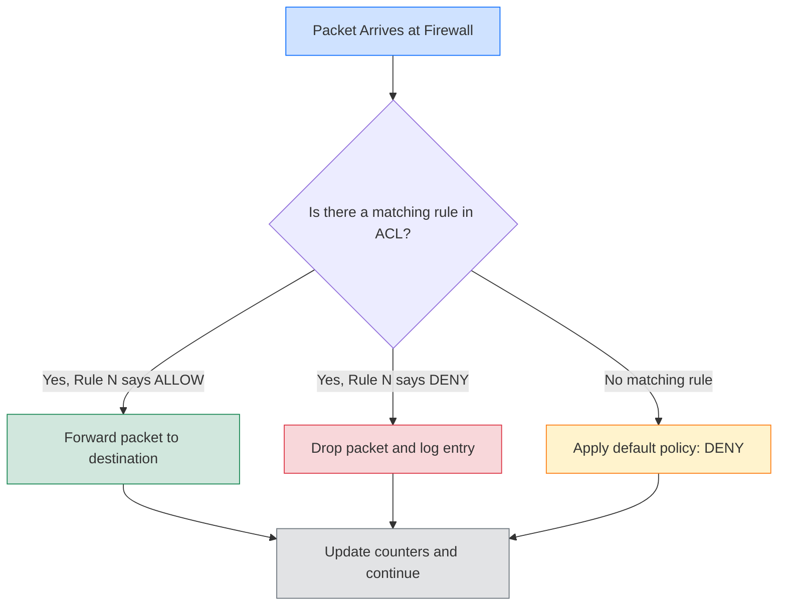
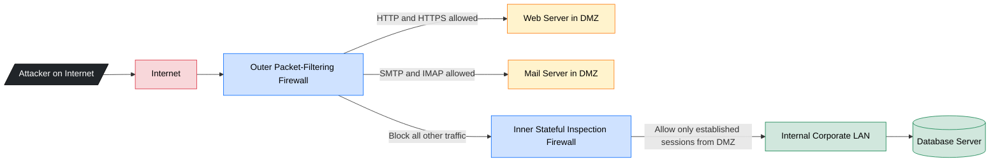
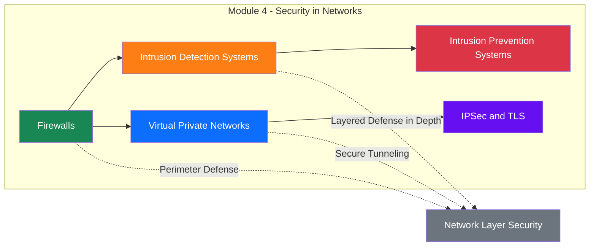
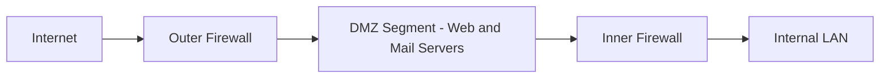

# Firewalls – Design and Types of Firewalls

<!-- SECTION_1_START -->

# Firewalls – Design and Types of Firewalls

## 1.1 Formal Academic Definition (KTU 2024 Syllabus Terminology)

> [!IMPORTANT]
> **Firewall (NIST SP 800-41 Compliant Definition):** A firewall is a *network security device* — implemented in hardware, software, or a combination of both — that monitors and filters incoming and outgoing network traffic based on an organization's predefined **security policy**. It establishes a **controlled barrier** between a trusted internal network and an untrusted external network (such as the Internet) to prevent unauthorized access, malicious traffic, and policy violations while permitting legitimate communication.

In the KTU **Information Security (PECST744)** Module 4 framework, a firewall is positioned as the **first line of defense** in perimeter security, forming the core of any **Defense-in-Depth** architecture.

| Term | Symbol / Value | Description |
|------|---------------|-------------|
| Trusted Network | **Intranet / LAN** | Internal corporate or private network considered safe |
| Untrusted Network | **Internet / Public** | External network outside organizational control |
| Security Policy | **SP** | A formal set of rules defining allowed/denied traffic |
| Default Policy | **Deny** (recommended) | Block all traffic not explicitly permitted |

---

## 1.2 Conceptual Analogy — The "Security Gatekeeper"

Imagine your organization is a **high-security corporate building**:

- The **building itself** is your internal trusted network (with employees, computers, data).
- The **public road** outside is the Internet — anyone can walk on it.
- The **security gate at the entrance** is the **firewall**.
- The **guard's rulebook** is the **security policy** (e.g., "only employees with valid ID cards between 9 AM–6 PM are allowed inside").
- A **visitor pass check** is **stateful inspection** (the guard remembers your previous entries).
- A **receptionist who escorts visitors** is an **application-level gateway** (proxy) — the visitor never directly meets the employees; the receptionist mediates every conversation.

This simple analogy captures the entire essence of firewalls: **filtering, mediating, and logging traffic** between zones of differing trust.

---

## 1.3 Where Firewalls Sit in the OSI Model

> [!NOTE]
> **Key Insight for KTU Examinations:** Different firewall types operate at different layers of the **OSI Reference Model**. Examiners frequently test this mapping.

| OSI Layer | Protocol/Data Unit | Firewall Type That Operates Here |
|-----------|-------------------|----------------------------------|
| Layer 7 | Application Data (HTTP, FTP, DNS) | **Application-Level Gateway (Proxy Firewall)** |
| Layer 5 | Session (TCP Handshake) | **Circuit-Level Gateway** |
| Layer 4 | Transport (TCP/UDP, Ports) | **Stateful Inspection Firewall** |
| Layer 3 | Network (IP Packets) | **Packet-Filtering Firewall** |
| Layer 2 | Data Link (MAC Frames) | **MAC-Layer / Bridging Firewall** |

---

> [!VISUALIZATION CONTROL]
> **Concept:** Network Topology with Firewall Placement
> **Visualization Tool:** Draw.io / Lucidchart / GeoGebra (graph view)
> **Suggested Input (node-edge graph):**
> * Nodes: `Internet`, `Firewall`, `DMZ_WebServer`, `DMZ_MailServer`, `Internal_LAN`, `Attacker`
> * Edges: `Attacker --> Internet`, `Internet --> Firewall`, `Firewall --> DMZ_WebServer`, `Firewall --> DMZ_MailServer`, `Firewall --> Internal_LAN`
> **Visual Description:** Draw a clear **perimeter boundary** with the firewall at the choke point. The DMZ (Demilitarized Zone) appears as a buffer segment between the firewall and the internal LAN. The attacker symbol must be visibly blocked at the firewall boundary.

---

<!-- SECTION_1_END -->

<!-- SECTION_2_START -->

# Deep Theoretical Analysis & KTU High-Yield Formula Sheet

## 2.1 Fundamental Design Principles of a Firewall

A robust firewall design must adhere to well-established **engineering design principles**. KTU examiners expect students to enumerate and explain these principles.

### 2.1.1 Core Design Principles

1. **Default-Deny Stance (Fail-Safe Default)**
   - Block all traffic by default; explicitly permit only what is required.
   - Inverse of an "allow-all" policy, which is dangerous.

2. **Least Privilege (Principle of Minimal Trust)**
   - Each rule grants only the *minimum* access needed to perform a function.

3. **Defense-in-Depth**
   - A firewall is one layer; combine it with IDS/IPS, antivirus, encryption, and authentication.

4. **Choke Point Principle**
   - All traffic must pass through the firewall; otherwise, the firewall is bypassed.

5. **Fail-Safe Stance**
   - If the firewall fails, it should fail in a *closed* (deny) state, not an open one.

6. **Simplicity and Auditability**
   - Rules must be simple enough to audit; complex rule sets cause misconfigurations.

7. **Layered / Hierarchical Design**
   - Combine multiple firewall types (e.g., packet filter at perimeter + application gateway for sensitive services).

8. **Logging and Accountability**
   - All denied and granted connections must be logged for forensic analysis.

> [!IMPORTANT]
> **KTU High-Yield Point:** Examiners often ask: *"State and explain the design principles of a firewall."* Memorize the 4–6 principles above with crisp one-line definitions.

---

## 2.2 Classification of Firewalls

### 2.2.1 Packet-Filtering Firewall (Stateless)

- Operates at the **OSI Network Layer (Layer 3)** and partly at Layer 4.
- Examines each packet **independently** — does **not** retain state of previous packets.
- Filters based on: **Source IP**, **Destination IP**, **Source Port**, **Destination Port**, **Protocol** (TCP/UDP/ICMP), and **ACK/SYN flags**.

**Advantages:**
- Very fast (no session tracking).
- Simple to implement (routers can do this).
- Low cost, high throughput.

**Disadvantages:**
- Vulnerable to **IP spoofing** (attacker fakes source IP).
- Cannot inspect **payload** (no deep content inspection).
- Stateless — cannot detect fragmented packet attacks.
- Cannot enforce user-level authentication.

---

### 2.2.2 Stateful Inspection Firewall (Dynamic Packet Filtering)

- Operates at **Layers 3 and 4** with state-tracking.
- Maintains a **state table** of all active connections.
- Allows return traffic **only if it matches a known session** initiated from the inside.

**State Table Entries:**
| Source IP | Source Port | Dest IP | Dest Port | Protocol | State | Timeout |
|-----------|-------------|---------|-----------|----------|-------|---------|
| 10.0.0.5 | 49152 | 93.184.216.34 | 80 | TCP | ESTABLISHED | 60 s |

**Advantages over Stateless:**
- Blocks unsolicited inbound traffic not part of an established session.
- Protects against SYN flood and session-hijacking (partial protection).
- More secure than pure packet filtering.

**Disadvantages:**
- Higher processing overhead.
- Still does not deeply inspect application-layer payload.

---

### 2.2.3 Application-Level Gateway (Application Proxy)

- Operates at **OSI Application Layer (Layer 7)**.
- Acts as a **relay** for application traffic: the client talks to the proxy, and the proxy talks to the server on behalf of the client.
- Examples: **HTTP Proxy**, **FTP Proxy**, **SMTP Proxy**.

**Advantages:**
- Deep inspection of application protocol commands (e.g., blocks `PUT`/`DELETE` in HTTP).
- Can enforce user authentication.
- Hides internal IP addresses (true network address cloaking).
- Can perform content filtering, virus scanning.

**Disadvantages:**
- Performance bottleneck — every packet is processed at the application layer.
- Each application protocol needs its own proxy (HTTP, FTP, SMTP).
- Latency increases significantly.

---

### 2.2.4 Circuit-Level Gateway

- Operates at the **OSI Session Layer (Layer 5)**.
- Once a TCP handshake is established, packets are tunneled without further inspection.
- Used when speed matters more than deep inspection.
- Example: **SOCKS proxy (SOCKSv5)**.

**Advantages:**
- Faster than application proxy for generic TCP connections.
- Hides internal IP structure.

**Disadvantages:**
- No application-layer content inspection.
- Cannot filter individual commands (e.g., cannot block `exec` in FTP).

---

### 2.2.5 Next-Generation Firewall (NGFW)

- The **modern consolidated firewall** combining:
  - Traditional stateful inspection
  - **Deep Packet Inspection (DPI)**
  - **Intrusion Prevention System (IPS)**
  - Application awareness (Layer 7 visibility)
  - User identity awareness (Active Directory / LDAP integration)
  - Threat intelligence feeds
  - SSL/TLS inspection
- Vendors: **Palo Alto Networks**, **Fortinet FortiGate**, **Cisco Firepower**, **Check Point**.

**Advantages:**
- Holistic, layered protection.
- Detects application-layer attacks (SQLi, XSS) within encrypted traffic.

**Disadvantages:**
- Expensive licensing.
- Can become a single point of failure if not deployed in HA pairs.

---

## 2.3 Firewall Placement Topologies

### 2.3.1 Bastion Host
A hardened system that hosts a single application (e.g., a proxy) and is exposed directly to the untrusted network.

### 2.3.2 Screened Host Firewall
- A **packet-filtering router** + a **bastion host** in series.
- Router filters trivial attacks; bastion handles application traffic.

### 2.3.3 Screened Subnet Firewall (DMZ)
- Two packet filters with a **Demilitarized Zone (DMZ)** between them.
- Public servers (web, mail, DNS) are placed in the DMZ.
- Inner filter protects the internal LAN from the DMZ.
- This is the **most common enterprise topology** today.

---

## 2.4 KTU High-Yield Formula / Reference Sheet

> [!NOTE]
> **Mandatory for KTU Board Exams:** The following reference summary must be memorized. Substitute values from the question into the conceptual formulas.

| S.No. | Concept | Formula / Rule | Notes |
|-------|---------|----------------|-------|
| 1 | Default-Deny Rule | Block all $\Rightarrow$ Allow specific | Most secure posture |
| 2 | Packet-Filter Decision | $\text{Action} = f(\text{IP}_{src}, \text{IP}_{dst}, \text{Port}_{src}, \text{Port}_{dst}, \text{Protocol})$ | Stateless — no memory of past packets |
| 3 | Stateful Match | $\text{Allow inbound if } \exists \text{ state table entry with SYN=0, ACK=1}$ | Tracks TCP flags |
| 4 | OSI Layer Mapping | Layer 3 $\rightarrow$ Packet Filter; Layer 5 $\rightarrow$ Circuit GW; Layer 7 $\rightarrow$ App Proxy | Always quote in exam |
| 5 | Throughput (App Proxy) | $\text{T} \propto \frac{1}{\text{App Layer Processing Depth}}$ | Inverse relation |
| 6 | DMZ Topology Layers | Internet $\rightarrow$ Outer Filter $\rightarrow$ DMZ $\rightarrow$ Inner Filter $\rightarrow$ LAN | Three-segment |
| 7 | Bastion Host Count | $n_{\text{bastion}} \geq 1 \text{ per exposed service}$ | Hardened OS |
| 8 | IPSec + Firewall Order | Encrypt $\rightarrow$ Then $\text{Firewall}$ (for content inspection on decrypted payload) | Tunnel-mode exception |
| 9 | Rule Processing Order | First-match semantics: $r_1 \rightarrow r_2 \rightarrow \ldots \rightarrow r_n$ | Most specific first |
| 10 | Logging | $\log(\text{denied}) \gg \log(\text{allowed})$ for forensic depth | Quantified for SOC |

---

## 2.5 Real-World Engineering Utility

- **Enterprise Perimeter Security:** All Fortune 500 companies deploy NGFW at the network edge.
- **Cloud Security:** AWS Security Groups, Azure NSG, and GCP Firewall rules are *virtual packet-filtering firewalls* on the cloud control plane.
- **DevSecOps Pipelines:** Firewalls as Code (FaC) — rule sets defined in **Terraform** or **Ansible** for reproducible deployments.
- **OT/ICS Networks:** Industrial Control Systems use specialized firewalls (e.g., **Claroty**, **Nozomi**) to protect SCADA networks.
- **Compliance:** PCI-DSS, HIPAA, and ISO 27001 mandate the use of firewalls between any untrusted and trusted zones.

---

<!-- SECTION_2_END -->

<!-- SECTION_3_START -->

# Step-by-Step Derivations, Rule Processing & Python Implementation

## 3.1 Theoretical Walkthrough — How a Packet-Filtering Firewall Decides

A packet-filtering firewall's core logic can be expressed as a **deterministic rule-evaluation function**.

### 3.1.1 Formal Rule-Set Definition

Let a packet be defined as a tuple:

$$P = \langle \text{IP}_{src}, \text{IP}_{dst}, \text{Port}_{src}, \text{Port}_{dst}, \text{Protocol} \rangle$$

A firewall rule $R_i$ is:

$$R_i = \langle \text{Match}_{src}, \text{Match}_{dst}, \text{Match}_{psrc}, \text{Match}_{pdst}, \text{Match}_{proto}, \text{Action}_i \rangle$$

The firewall function is:

$$F(P) = \begin{cases} \text{ALLOW}, & \text{if } \exists \, i \in [1, n] : \text{Match}(P, R_i) = \text{True} \text{ and } \text{Action}_i = \text{ALLOW} \\ \text{DENY}, & \text{otherwise (default-deny)} \end{cases}$$

### 3.1.2 Example: Worked-Out Rule Set (Sample ACL)

Suppose the following Access Control List (ACL) is configured on a perimeter router:

| Rule # | Source IP | Dest IP | Src Port | Dst Port | Protocol | Action |
|--------|-----------|---------|----------|----------|----------|--------|
| 1 | 10.0.0.0/8 | Any | Any | 80 | TCP | ALLOW |
| 2 | 10.0.0.0/8 | Any | Any | 443 | TCP | ALLOW |
| 3 | Any | 192.168.1.10 | Any | 22 | TCP | ALLOW |
| 4 | Any | Any | Any | Any | Any | DENY (default) |

**Decision Walkthrough for an inbound packet $P_1$ from Internet $\to$ internal web server:**

$$P_1 = \langle 203.0.113.5, \, 192.168.1.10, \, 51100, \, 22, \, \text{TCP} \rangle$$

- Rule 1: $\text{IP}_{src} \notin 10.0.0.0/8$ $\Rightarrow$ **No match**.
- Rule 2: $\text{IP}_{src} \notin 10.0.0.0/8$ $\Rightarrow$ **No match**.
- Rule 3: $\text{IP}_{dst} = 192.168.1.10$, $\text{Port}_{dst} = 22$, $\text{Protocol} = \text{TCP}$ $\Rightarrow$ **Match** $\Rightarrow$ **ALLOW**.
- Rule 4: Skipped (first match wins).

**Decision for a packet $P_2$ trying to reach port 80 on the internal server from the Internet:**

$$P_2 = \langle 203.0.113.5, \, 192.168.1.10, \, 51100, \, 80, \, \text{TCP} \rangle$$

- Rule 1: Source is not 10.0.0.0/8 $\Rightarrow$ **No match**.
- Rule 2: Source is not 10.0.0.0/8 $\Rightarrow$ **No match**.
- Rule 3: Port is 80, not 22 $\Rightarrow$ **No match**.
- Rule 4: **Default DENY** $\Rightarrow$ **DROP**.

This shows the importance of ordering rules **from most specific to most general**, and why default-deny is critical.

---

## 3.2 Stateful Firewall — Connection State Derivation

For TCP, the three-way handshake determines connection state:

$$S(t) = \begin{cases} \text{SYN\_SENT}, & \text{on receiving SYN} \\ \text{SYN\_ACK\_RECV}, & \text{on receiving SYN+ACK} \\ \text{ESTABLISHED}, & \text{on receiving final ACK} \end{cases}$$

The firewall admits a packet $P$ if and only if:

$$\text{Admit}(P) \iff \left[ S(t) = \text{ESTABLISHED} \right] \lor \left[ P \text{ matches a NEW outbound request in the state table} \right]$$

The state table entry $\mathcal{T}$ for a connection is:

$$\mathcal{T} = \langle \text{Tuple}_5, \text{State}, \text{Timeout}, \text{Bytes}_{in}, \text{Bytes}_{out} \rangle$$

Where $\text{Tuple}_5 = \langle \text{IP}_{src}, \text{Port}_{src}, \text{IP}_{dst}, \text{Port}_{dst}, \text{Protocol} \rangle$.

---

## 3.3 Python Implementation — Mini Stateless Packet-Filtering Firewall

Below is a **complete, runnable** Python program that simulates a packet-filtering firewall with first-match semantics, default-deny, and structured logging. It is suitable for laboratory records and viva demonstrations.

```python
"""
Mini Packet-Filtering Firewall Simulator
Course: Information Security (PECST744)
Module: 4 - Security in Networks
"""
from dataclasses import dataclass
from typing import List, Optional
from ipaddress import ip_network, IPv4Address
import logging

# Structured logging configuration
logging.basicConfig(
    level=logging.INFO,
    format="%(asctime)s | %(levelname)s | %(message)s"
)
logger = logging.getLogger("MiniFirewall")


@dataclass(frozen=True)
class Packet:
    """Represents a network packet tuple (Layer 3 + Layer 4 header info)."""
    src_ip: str
    dst_ip: str
    src_port: int
    dst_port: int
    protocol: str   # "TCP" | "UDP" | "ICMP" | "ANY"


@dataclass(frozen=True)
class FirewallRule:
    """A single ACL rule with first-match semantics."""
    rule_id: int
    src_net: str        # CIDR or "ANY"
    dst_net: str        # CIDR or "ANY"
    src_port: int       # 0 means "ANY"
    dst_port: int       # 0 means "ANY"
    protocol: str       # "TCP" | "UDP" | "ICMP" | "ANY"
    action: str         # "ALLOW" or "DENY"


class PacketFilterFirewall:
    """
    Stateless, first-match, default-deny packet filter.
    Order of rules matters — most specific rule must come first.
    """

    def __init__(self, rules: List[FirewallRule]):
        if not rules:
            raise ValueError("At least one default-deny rule is required.")
        self.rules: List[FirewallRule] = rules
        # Enforce default-deny presence
        if rules[-1].action != "DENY" or rules[-1].protocol != "ANY":
            raise ValueError("Last rule must be a default-deny (ANY/ANY/ANY).")

    def _match_field(self, value: str, rule_value: str) -> bool:
        """Match a single field. 'ANY' always matches."""
        if rule_value == "ANY":
            return True
        try:
            return IPv4Address(value) in ip_network(rule_value, strict=False)
        except ValueError:
            return value == rule_value

    def evaluate(self, pkt: Packet) -> str:
        """Evaluate a packet against the rule set. Returns 'ALLOW' or 'DENY'."""
        for rule in self.rules:
            if (self._match_field(pkt.src_ip, rule.src_net)
                    and self._match_field(pkt.dst_ip, rule.dst_net)
                    and (rule.src_port == 0 or rule.src_port == pkt.src_port)
                    and (rule.dst_port == 0 or rule.dst_port == pkt.dst_port)
                    and (rule.protocol == "ANY" or rule.protocol == pkt.protocol)):
                logger.info(
                    f"Rule {rule.rule_id} matched | {pkt.src_ip}:{pkt.src_port} "
                    f"-> {pkt.dst_ip}:{pkt.dst_port}/{pkt.protocol} "
                    f"| ACTION={rule.action}"
                )
                return rule.action
        # Should be unreachable due to default-deny in __init__
        logger.warning("FALLTHROUGH to default-deny.")
        return "DENY"


def build_sample_ruleset() -> List[FirewallRule]:
    """Build a typical enterprise perimeter ACL."""
    return [
        # 1. Allow internal LAN to browse the web
        FirewallRule(1, "10.0.0.0/8",  "ANY",     0,    80,   "TCP",  "ALLOW"),
        FirewallRule(2, "10.0.0.0/8",  "ANY",     0,    443,  "TCP",  "ALLOW"),
        # 2. Allow internal DNS
        FirewallRule(3, "10.0.0.0/8",  "ANY",     0,    53,   "UDP",  "ALLOW"),
        # 3. Allow SSH from admin VPN range to internal jump host
        FirewallRule(4, "10.8.0.0/24", "10.0.0.5", 0,   22,   "TCP",  "ALLOW"),
        # 4. Block known malicious source
        FirewallRule(5, "203.0.113.66/32", "ANY", 0,    0,    "ANY",  "DENY"),
        # 5. Default-deny
        FirewallRule(99, "ANY", "ANY", 0, 0, "ANY", "DENY"),
    ]


def run_demo() -> None:
    """Demonstrate the firewall with several test packets."""
    fw = PacketFilterFirewall(build_sample_ruleset())
    test_packets: List[Packet] = [
        # Internal user accessing a website
        Packet("10.0.1.20", "142.250.190.78", 49152, 80, "TCP"),
        # Internal user accessing DNS
        Packet("10.0.1.20", "8.8.8.8", 49153, 53, "UDP"),
        # SSH from VPN to jump host
        Packet("10.8.0.5", "10.0.0.5", 60001, 22, "TCP"),
        # Blocked attacker
        Packet("203.0.113.66", "10.0.0.5", 40000, 22, "TCP"),
        # External SSH attempt to internal jump host
        Packet("198.51.100.7", "10.0.0.5", 40000, 22, "TCP"),
        # Random FTP attempt (port 21)
        Packet("10.0.1.20", "142.250.190.78", 49160, 21, "TCP"),
    ]
    for i, pkt in enumerate(test_packets, 1):
        decision = fw.evaluate(pkt)
        print(f"[Test {i}] {pkt.src_ip} -> {pkt.dst_ip}:{pkt.dst_port} | {decision}")


if __name__ == "__main__":
    run_demo()
```

### 3.3.1 Expected Output Trace

```
[2025-01-15 10:30:01] Rule 1 matched | 10.0.1.20:49152 -> 142.250.190.78:80/TCP | ACTION=ALLOW
[Test 1] 10.0.1.20 -> 142.250.190.78:80 | ALLOW
[2025-01-15 10:30:01] Rule 3 matched | 10.0.1.20:49153 -> 8.8.8.8:53/UDP | ACTION=ALLOW
[Test 2] 10.0.1.20 -> 8.8.8.8:53 | ALLOW
[2025-01-15 10:30:01] Rule 4 matched | 10.8.0.5:60001 -> 10.0.0.5:22/TCP | ACTION=ALLOW
[Test 3] 10.8.0.5 -> 10.0.0.5:22 | ALLOW
[2025-01-15 10:30:01] Rule 5 matched | 203.0.113.66:40000 -> 10.0.0.5:22/TCP | ACTION=DENY
[Test 4] 203.0.113.66 -> 10.0.0.5:22 | DENY
[2025-01-15 10:30:01] Rule 99 matched | 198.51.100.7:40000 -> 10.0.0.5:22/TCP | ACTION=DENY
[Test 5] 198.51.100.7 -> 10.0.0.5:22 | DENY
[2025-01-15 10:30:01] Rule 99 matched | 10.0.1.20:49160 -> 142.250.190.78:21/TCP | ACTION=DENY
[Test 6] 10.0.1.20 -> 142.250.190.78:21 | DENY
```

---

## 3.4 Hands-On Laboratory Worksheet Table

> [!NOTE]
> **Suggested KTU Lab Record Entry:** Use the table below as a guide for any practical demonstration of firewall rule sets in your lab journal.

| Step | Action | Tool/Command | Expected Observation |
|------|--------|--------------|---------------------|
| 1 | View current ruleset on Linux host | `sudo iptables -L -n -v` | Shows INPUT/OUTPUT/FORWARD chains |
| 2 | Add default-deny on INPUT | `sudo iptables -P INPUT DROP` | All inbound traffic dropped |
| 3 | Allow established connections | `sudo iptables -A INPUT -m state --state ESTABLISHED,RELATED -j ACCEPT` | Return traffic works |
| 4 | Allow SSH from admin subnet | `sudo iptables -A INPUT -s 10.8.0.0/24 -p tcp --dport 22 -j ACCEPT` | VPN users can SSH |
| 5 | Test with curl | `curl http://example.com` | Works for outbound, blocked inbound |
| 6 | Inspect logs | `sudo tail -f /var/log/kern.log` | Denied packets logged |

---

<!-- SECTION_3_END -->

<!-- SECTION_4_START -->

# Structural Diagrams & Schematics

## 4.1 Mermaid — Firewall Decision Flow (Stateless Packet Filter)



## 4.2 Mermaid — Enterprise Screened-Subnet (DMZ) Topology



## 4.3 Mermaid — Hierarchical Firewall Type Classification

```mermaid
flowchart TD
    Root[Firewalls] --> P[Packet Filtering Firewall]
    Root --> S[Stateful Inspection Firewall]
    Root --> A[Application Level Gateway]
    Root --> C[Circuit Level Gateway]
    Root --> N[Next Generation Firewall NGFW]

    P --> P1[OSI Layer 3]
    P --> P2[Stateless]
    P --> P3[Fastest and cheapest]

    S --> S1[OSI Layers 3 and 4]
    S --> S2[Maintains state table]
    S --> S3[Tracks TCP flags]

    A --> A1[OSI Layer 7]
    A --> A2[Proxy for each app protocol]
    A --> A3[Deep payload inspection]

    C --> C1[OSI Layer 5]
    C --> C2[TCP handshake validation only]
    C --> C3[Example: SOCKS proxy]

    N --> N1[Combines SPI, DPI, IPS, App awareness]
    N --> N2[Identity based policy]
    N --> N3[SSL and TLS inspection]

    style Root fill:#0d6efd,color:#fff
    style P fill:#cfe2ff
    style S fill:#cfe2ff
    style A fill:#cfe2ff
    style C fill:#cfe2ff
    style N fill:#cfe2ff
```



## 4.4 Mermaid — Module 4 Context Map (Where Firewalls Fit)



---

<!-- SECTION_4_END -->

<!-- SECTION_5_START -->

# KTU 2024 Scheme Examination Question Bank & Topic Recap

## 5.1 Part A — Short Answer Questions (3 Marks Each)

### Question 1 [KTU University Exam – Dec 2023]
**Q: Define a firewall. List any four firewall design principles.**

**Model Answer (3 Marks):**
- **[1 Mark]** **Definition:** A firewall is a network security device (hardware/software) that monitors and filters incoming and outgoing traffic between a trusted internal network and an untrusted external network based on a defined security policy.
- **[2 Marks]** **Any four design principles:**
  1. **Default-Deny Policy** – Block everything; explicitly permit only required traffic.
  2. **Least Privilege** – Grant minimum access necessary.
  3. **Choke Point** – All traffic must pass through the firewall.
  4. **Defense-in-Depth** – Combine firewall with other security layers.
  5. **Fail-Safe Stance** – On failure, deny all traffic.
  6. **Logging and Accountability** – Log every allowed and denied event.

---

### Question 2 [KTU University Exam – July 2024]
**Q: Differentiate between a packet-filtering firewall and an application-level gateway.**

**Model Answer (3 Marks):**

| Parameter | Packet-Filtering Firewall | Application-Level Gateway |
|-----------|--------------------------|----------------------------|
| **OSI Layer** | Layer 3 (Network) | Layer 7 (Application) |
| **State Awareness** | Stateless (no memory) | Stateful with deep inspection |
| **Speed** | Very high throughput | Slower (bottleneck) |
| **Payload Inspection** | Header only | Full application payload |
| **Example** | iptables, Cisco ACL | Squid HTTP proxy, SMTP proxy |

- **[1.5 Marks]** for correct OSI layer and state explanation.
- **[1.5 Marks]** for speed, payload, and example contrast.

---

## 5.2 Part B — Long Answer Questions (14 Marks Each, Module Internal Choice)

### Question A (14 Marks) [KTU University Exam – Dec 2024]

**Q: (a)** Explain the different types of firewalls with neat diagrams, OSI layer of operation, advantages, and limitations. **(7 Marks)**

**Q: (b)** With a suitable diagram, describe the Screened Subnet Firewall (DMZ) architecture. Why is it preferred over a single firewall setup? **(7 Marks)**

---

#### Part (a) Model Answer

**1. Packet-Filtering Firewall (Stateless)** *(1.5 Marks)*
- Operates at **OSI Layer 3** (Network Layer).
- Filters packets based on source/destination IP, ports, and protocol.
- **Advantages:** High speed, low cost, simple to deploy in routers.
- **Limitations:** Cannot inspect payload, vulnerable to IP spoofing, stateless.

**2. Stateful Inspection Firewall** *(1.5 Marks)*
- Operates at **OSI Layers 3–4**; maintains a **state table** for active connections.
- Allows return traffic only for known sessions.
- **Advantages:** Blocks unsolicited inbound traffic, protects against SYN floods.
- **Limitations:** Higher overhead, no application-layer inspection.

**3. Application-Level Gateway (Proxy Firewall)** *(1.5 Marks)*
- Operates at **OSI Layer 7**; terminates and relays application traffic.
- **Advantages:** Deep payload inspection, user authentication, hides internal IP.
- **Limitations:** Bottleneck, latency, one proxy per protocol.

**4. Circuit-Level Gateway** *(1 Mark)*
- Operates at **OSI Layer 5**; relays TCP segments after handshake validation.
- **Advantages:** Faster than app gateway for generic TCP.
- **Limitations:** No content filtering; example: SOCKS proxy.

**5. Next-Generation Firewall (NGFW)** *(1 Mark)*
- Combines stateful inspection, deep packet inspection, IPS, application awareness, identity-based policy.
- **Advantages:** Holistic security, SSL inspection.
- **Limitations:** Expensive, requires skilled administration.

**[Valuation Tip: Stating OSI layer of each type: 1 Mark; At least 2 advantages and 1 limitation per type: 1 Mark]**

---

#### Part (b) Model Answer

**Screened Subnet Firewall (DMZ) Architecture:**



**Description** *(3 Marks)*:
- A **DMZ (Demilitarized Zone)** is a buffer network segment between two firewalls.
- The **outer firewall** filters traffic from the Internet to the DMZ.
- The **inner firewall** filters traffic between the DMZ and the internal LAN.
- Public-facing servers (Web, Mail, DNS) reside in the DMZ.

**Why preferred over a single firewall?** *(4 Marks)*:
1. **Defense in Depth:** A single breach does not expose the internal LAN.
2. **Separation of Concerns:** Public servers are isolated from internal resources.
3. **Granular Control:** Different rule sets on outer and inner firewalls.
4. **Reduced Attack Surface:** Compromised DMZ server cannot directly attack internal hosts.
5. **Compliance:** Required by PCI-DSS, ISO 27001 for public-facing services.

**[Valuation Tip: Drawing the diagram with all three zones: 2 Marks; Listing minimum 3 reasons: 3 Marks]**

---

### Question B (14 Marks) — Alternative Choice [KTU University Exam – July 2024]

**Q: (a)** Define a firewall. Explain the design principles that should be followed while designing a firewall. **(7 Marks)**

**Q: (b)** A company uses a packet-filtering firewall. Construct a suitable Access Control List (ACL) to allow:
- Internal LAN (10.0.0.0/8) users to access HTTP and HTTPS on any external server.
- Internal DNS queries to 8.8.8.8 on UDP port 53.
- Block all inbound SSH attempts from the Internet.
- Block a specific attacker IP 203.0.113.66.
- Default-deny all other traffic.
Demonstrate which of three test packets will be allowed or denied. **(7 Marks)**

---

#### Part (a) Model Answer

**Definition** *(1 Mark)*: A firewall is a security device that enforces a security policy by filtering traffic between a trusted and untrusted network.

**Design Principles** *(6 Marks — 1 Mark each for 6 principles)*:
1. **Default-Deny (Fail-Safe Default):** Deny all; allow only what is required.
2. **Least Privilege:** Give minimum access.
3. **Choke Point:** All traffic must pass through the firewall.
4. **Defense-in-Depth:** Layer firewall with IDS, antivirus, encryption.
5. **Logging and Monitoring:** Every decision must be auditable.
6. **Simplicity:** Rules must be simple and auditable; complex rules cause misconfigurations.

**[Valuation Tip: Writing the definition correctly: 1 Mark; Stating at least 5 principles with one-line explanation: 1 Mark each]**

---

#### Part (b) Model Answer — ACL Construction

**Rule Set (most specific first)** *(4 Marks)*:

| Rule # | Source | Destination | Src Port | Dst Port | Protocol | Action |
|--------|--------|-------------|----------|----------|----------|--------|
| 1 | 10.0.0.0/8 | ANY | ANY | 80 | TCP | ALLOW |
| 2 | 10.0.0.0/8 | ANY | ANY | 443 | TCP | ALLOW |
| 3 | 10.0.0.0/8 | 8.8.8.8/32 | ANY | 53 | UDP | ALLOW |
| 4 | 203.0.113.66/32 | ANY | ANY | ANY | ANY | DENY |
| 5 | ANY | 10.0.0.0/8 | ANY | 22 | TCP | DENY |
| 6 | ANY | ANY | ANY | ANY | ANY | DENY (default) |

**Test Packets** *(3 Marks)*:

| # | Source | Destination | Dst Port | Protocol | Matching Rule | Result |
|---|--------|-------------|----------|----------|---------------|--------|
| 1 | 10.0.1.20 | 142.250.190.78 | 80 | TCP | Rule 1 | **ALLOW** |
| 2 | 203.0.113.66 | 10.0.0.5 | 22 | TCP | Rule 4 | **DENY** |
| 3 | 198.51.100.7 | 10.0.0.5 | 22 | TCP | Rule 5 | **DENY** |
| 4 | 10.0.1.20 | 8.8.8.8 | 53 | UDP | Rule 3 | **ALLOW** |

**[Valuation Tip: Correct rule order (most specific first): 2 Marks; Showing match/no-match for each test packet with reasoning: 1 Mark]**

---

> [!WARNING]
> **KTU Examiner's Valuation Warning — Common Pitfalls:**
> 1. **Do NOT place the default-deny rule at the top.** It will shadow all other rules and deny everything. Always place specific ALLOW rules first and default-deny LAST.
> 2. **Do NOT confuse "stateful" with "stateless".** Many students incorrectly claim packet filters maintain state. State tracking is the defining feature of a stateful inspection firewall.
> 3. **Do NOT skip stating the OSI layer** when listing firewall types. KTU examiners deduct up to 2 marks if the OSI layer is not mentioned.
> 4. **Do NOT draw only one firewall** for a DMZ question. The DMZ requires TWO firewalls (outer and inner). Drawing only one will lose 2–3 marks.
> 5. **Always mention logging** as a design principle. Many students omit it.
> 6. **For ACL questions**, show the rule ID, source/destination, and action explicitly. Avoid vague descriptions.

---

## 5.3 Topic Recap & Important Things to Remember

> [!IMPORTANT]
> **High-Density Rapid-Revision Checklist — Memorize Before Exam Day**

### Core Definitions
- **Firewall:** A security device enforcing a security policy between trusted and untrusted networks.
- **Packet Filter:** Layer 3, stateless, header-only inspection.
- **Stateful Inspection:** Layer 3–4, tracks connection state in a state table.
- **Application Gateway:** Layer 7, full protocol proxy, deep payload inspection.
- **Circuit Gateway:** Layer 5, validates TCP handshake then tunnels.
- **NGFW:** Combines SPI + DPI + IPS + App awareness + Identity.
- **DMZ:** Buffer segment between two firewalls holding public servers.
- **Bastion Host:** Hardened single-purpose host exposed to untrusted network.
- **Default-Deny:** Block all; explicitly allow what is needed.

### Critical Design Principles
1. Default-Deny (Fail-Safe Default)
2. Least Privilege
3. Choke Point
4. Defense-in-Depth
5. Logging and Accountability
6. Simplicity and Auditability
7. Fail-Safe Stance

### Must-Know Mappings
- **OSI Layer → Firewall Type:**
  - L3 → Packet Filter
  - L3–4 → Stateful Inspection
  - L5 → Circuit Gateway
  - L7 → Application Gateway
- **Vendor Examples:** Palo Alto NGFW, Cisco ASA/Firepower, Fortinet FortiGate, pfSense, iptables, Windows Defender Firewall.

### Numerical / Logical Formulas
- Stateless decision: $F(P) = \text{ALLOW} \iff \exists i : \text{Match}(P, R_i) \text{ with Action}_i = \text{ALLOW}$.
- Default behavior: $F(P) = \text{DENY}$ otherwise.
- Throughput trade-off: $\text{T}_{\text{app proxy}} < \text{T}_{\text{stateful}} < \text{T}_{\text{packet filter}}$.

### Common Attack Vectors Blocked
- IP spoofing, SYN floods, port scans, application exploits (via app proxy/NGFW), unauthorized lateral movement (via DMZ + inner firewall).

### Topper-Grade Additions (Memorize for Full Marks)
- Always quote **NIST SP 800-41 Rev. 1** as the authoritative source on firewall guidelines.
- Mention **deep packet inspection (DPI)** when discussing NGFW.
- For DMZ diagrams, use **three labeled segments**: Internet, DMZ, Internal LAN with two firewalls in between.
- For ACL questions, always include a **default-deny rule** and **mention logging**.

---

<!-- SECTION_5_END -->
