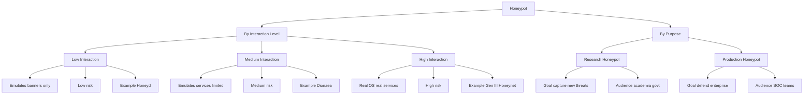
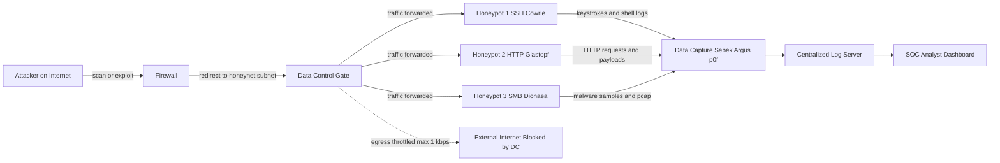
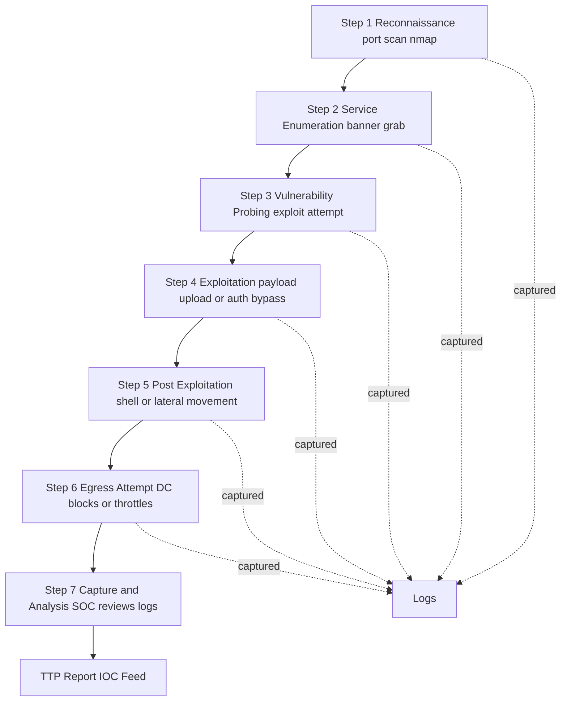

# Honeypots

<!-- SECTION_1_START -->
# Security in Networks: Honeypots

## 1. Core Technical Definition & Intuitive Overview

### Formal Definition (KTU 2024 Syllabus Terminology)

> [!IMPORTANT]
> **Honeypot (RFC 4949 / Spitzner Definition):**
> A *honeypot* is a security resource whose value lies in being probed, attacked, or compromised. It is a **decoy system** deliberately deployed on a network to attract, detect, deflect, and study unauthorized intrusion attempts in order to learn about the attacker's tools, techniques, and motives — while consuming the attacker's time and resources.

In KTU 2024 Scheme terminology for **PECST744 – Information Security**, a honeypot is classified as a **proactive, deception-based defense mechanism** that supplements traditional Intrusion Detection Systems (IDS), firewalls, and antivirus software.

### Conceptual Analogy / Intuition

> [!NOTE]
> **Analogy — The "Bait Trap" for Cyber-Attackers:**
> Imagine a jewelry store (your *real* network) where the owner deliberately places an attractive, half-open cash box filled with cheap fake ornaments in a visible corner. Thieves entering the shop will almost always be drawn to the easiest target first — the box. While the thief spends time breaking into this trap, the store's CCTV captures their face, tools, and entry technique. The real jewelry is untouched.
>
> - The **fake cash box** = the **honeypot**
> - The **store** = the **production network**
> - The **CCTV** = the **logging & monitoring module**
> - The **thief** = the **attacker / malware / bot**

The honeypot has **no legitimate users and no production value** — so **any traffic hitting it is, by definition, suspicious or malicious**. This single property is what makes a honeypot invaluable: it eliminates almost all "false positives" that plague traditional IDSs.

### Standard Metrics and Constants

| Parameter | Standard Value / Notation | Meaning |
|---|---|---|
| **Data Capture** | Set in **Gigabytes (GB)** | Volume of attacker activity logged |
| **Risk Value** | Categorical: **Low / Medium / High** | Probability of attacker escalating privilege within the honeypot |
| **Interaction Level (L)** | $L \in \{\text{Low, Medium, High}\}$ | Depth of services the honeypot emulates |
| **Information Value (Iv)** | $I_v = \dfrac{\text{Novel Data Collected}}{\text{Time Active}}$ | KPI measuring honeypot's research productivity |
| **False Positive Rate** | Typically $\approx 0\%$ | Legitimate users are *not* expected to interact |

> [!VISUALIZATION CONTROL]
> **Concept:** Real-world traffic distribution on a corporate network — showing how a honeypot absorbs attack traffic.
>
> **Visualization Inputs (use in a pie/flow chart mentally or in Excel/GeoGebra):**
> - $T_{legit}$ = 99% (legitimate users on production servers)
> - $T_{honeypot}$ = 0% (legitimate users on honeypot) — by design
> - $T_{attack\_prod}$ = 1% (attacks reaching real servers)
> - $T_{attack\_honeypot}$ = 99% (attacks deflected to honeypot after deployment)
>
> **Visual Description:** A bar chart with two groups (*Pre-Honeypot* and *Post-Honeypot*). Notice how attack traffic on the **production** server plummets while attack traffic on the **honeypot** spikes — visualizing the *deflection* property.

### Honeypot vs Honeynet vs Honeytoken

| Term | Scope | Purpose |
|---|---|---|
| **Honeypot** | Single system (one host) | Decoy one machine or one service |
| **Honeynet** | A network of multiple honeypots | Capture coordinated / multi-stage attacks |
| **Honeytoken** | A piece of fake data (e.g., a fake password file, fake DB record) | Detect unauthorized access *to the data itself* |

> [!NOTE]
> KTU examiners often frame a sub-question comparing these three — remember the **scope hierarchy**: honeytoken $\subset$ honeypot $\subset$ honeynet.

---

<!-- SECTION_1_END -->

<!-- SECTION_2_START -->
# 2. Deep Theoretical Analysis & KTU High-Yield Formula Sheet

## 2.1 Why Honeypots Are Needed — The Limitations of Traditional Defenses

Traditional security tools have structural blind spots:

1. **Firewalls** are *policy-enforcement* devices — they only block what they know is bad (signature-based). Zero-day attacks bypass them.
2. **IDS (Signature-based, e.g., Snort)** cannot detect attacks for which no signature exists.
3. **Antivirus** requires a known malware hash; polymorphic and fileless malware evade it.
4. **Log Analysis** on production servers is overwhelmingly noisy — the *needle-in-a-haystack* problem.

> **Honeypot's Strategic Advantage:** Because **no legitimate traffic exists** on a honeypot, *any* packet, connection, or login attempt is, by definition, either a probe, a scan, or an active attack. This converts the haystack into a clean dataset where every event is a high-fidelity signal.

## 2.2 Classification of Honeypots — Two Independent Axes

The KTU 2024 syllabus emphasizes classification along **two orthogonal axes** (this is a high-yield exam point):

### Axis A: By **Interaction Level** (technical depth)
### Axis B: By **Purpose / Deployment Goal**

### Axis A — Interaction Level

| Level | Emulation Depth | Risk | Information Gathered | Example |
|---|---|---|---|---|
| **Low-Interaction Honeypot** | Emulates only *limited* services (banner-level) | **Low** | Port scans, banner grabs, simple probes | **Honeyd**, **Kippo** |
| **Medium-Interaction Honeypot** | Emulates a *broader* set of services but cannot be fully compromised | **Medium** | Toolkits used, exploit attempts | **Dionaea** |
| **High-Interaction Honeypot** | A *real* OS with real services — attacker can gain shell | **High** | Zero-day exploits, rootkits, full botnet behavior | **Gen II / Gen III Honeynets**, **Cowrie** |

### Axis B — Purpose

| Type | Primary Goal | Audience |
|---|---|---|
| **Research Honeypot** | Capture *new* attacks, study attacker psychology, publish TTPs (Tactics, Techniques, Procedures) | Academic, military, govt. (e.g., **Honeynet Project**) |
| **Production Honeypot** | Detect & deflect attacks on the *real* enterprise network; improve incident response | Commercial enterprises |

> [!IMPORTANT]
> **Board Exam Pattern:** A common 7-mark question asks: *"Differentiate between low-interaction and high-interaction honeypots."* Always answer with: **(i) risk, (ii) information value, (iii) example, (iv) deployment complexity.** Examiners award 1.5–2 marks per dimension.

## 2.3 Architecture of a High-Interaction Honeypot (Honeynet)

A Honeynet is **not a single machine** — it is a controlled environment with three mandatory components:

1. **The Honeypot(s)** — sacrificial hosts the attacker interacts with.
2. **Data Control** (a.k.a. *The Gate*) — restricts outbound traffic from the honeypot so the attacker cannot pivot and harm the real internet. It is an outbound **bandwidth-limiting + connection-counting** layer.
3. **Data Capture** — logs every packet, keystroke, file change, and shell command. Tools: **Sebek** (kernel-level keystroke logger), **p0f** (passive OS fingerprinting), **Argus** (network flow records).
4. **Data Analysis / Alerting** — correlates captured data and notifies SOC analysts.

> [!NOTE]
> A key **design principle** in honeynet deployment: the honeypot itself is *expected* to be compromised. The security comes from **Data Control** preventing the attacker from using the honeypot as a launchpad.

## 2.4 Advantages and Disadvantages — High-Yield Comparison

| Aspect | Advantages | Disadvantages / Risks |
|---|---|---|
| **Detection Fidelity** | $\approx 0\%$ false positives — only attackers interact | Cannot detect attacks on *legitimate* systems |
| **Threat Intelligence** | Captures **zero-day** exploits and unknown malware | Single high-interaction honeypot has *narrow* coverage |
| **Attacker Deception** | Consumes attacker time, diverts from real assets | Attacker may *detect* the honeypot and avoid it |
| **Resource Cost** | Low traffic volume = cheap to log/analysze (in petabytes of traffic) | High-interaction requires strong isolation (expensive) |
| **Legal Position** | Provides evidence for prosecution | **Enticement vs Entrapment** legal debates — KTU asks this! |
| **Signature Generation** | Output can be fed back to IDS to create *real* signatures | Requires skilled analysts to interpret captured data |

## 2.5 Legal and Ethical Issues

> [!WARNING]
> **Enticement vs. Entrapment** — A *guaranteed* exam question. The KTU board tests this.
> - **Enticement**: The honeypot owner simply *attracts* a willing criminal who was *already predisposed* to commit the crime. $\Rightarrow$ **Legal** (under U.S. law and Indian IT Act, 2000 §66).
> - **Entrapment**: The owner *induces* an otherwise innocent person to commit a crime they would not otherwise have committed. $\Rightarrow$ **Illegal**.
>
> To stay on the safe side, honeypots should:
> - Be open to *anyone* (no targeting of specific individuals).
> - Not advertise *success* (e.g., fake "Admin Password: 1234").
> - Comply with local privacy laws (in India: IT Act 2000 + SPDI Rules 2011).

## 2.6 Popular Tools / Examples (Frequently Asked)

| Tool | Type | Layer | Specialty |
|---|---|---|---|
| **Honeyd** | Low-interaction | Network | Emulates thousands of virtual hosts at once |
| **Kippo** | Medium-interaction | SSH | Fake SSH server, logs brute-force & shell sessions |
| **Cowrie** | Medium/High-interaction | SSH/Telnet | Modern successor to Kippo; records attacker commands |
| **Dionaea** | Medium-interaction | Multi-protocol | Captures malware payloads over SMB, HTTP, FTP, MSSQL |
| **Glastopf** | Low-interaction | Web (HTTP) | Simulates vulnerable web apps for SQLi / RFI |
| **Wordpot** | Low-interaction | Web (WordPress) | Detects WordPress-specific exploits |
| **T-Pot** | Platform | Full Honeynet | Docker-based multi-honeypot framework by Deutsche Telekom |

## 2.7 KTU Formula Sheet / Cheat Sheet

> [!IMPORTANT]
> The following are the **definitions and qualitative KPIs** examiners expect. Honeypot design is *qualitative* (no fixed numerical laws), but these are the **metric definitions** that appear in the syllabus.

| Metric / Concept | Mathematical / Logical Form | Meaning |
|---|---|---|
| False Positive Rate (FPR) of Honeypot | $FPR = \dfrac{FP}{FP + TN} \approx 0$ | Legitimate users $\to 0$ by design |
| Information Value | $I_v = \dfrac{\text{Unique attack patterns captured}}{\text{Time active (days)}}$ | Higher = better honeypot |
| Risk Level (heuristic) | $R \propto I_{\text{interaction}}$ | Interaction $\uparrow \Rightarrow$ Risk $\uparrow$ |
| Detection Coverage | $C = \bigcup_{i=1}^{n} S_i$ where $S_i$ is service $i$ emulated | Union of all emulated services |
| Data Control (outbound cap) | $B_{\text{out}} \le B_{\text{max}}$ kbps | Bandwidth-throttled egress |
| Time-to-Compromise (TTC) | $TTC = T_{\text{deploy}} - T_{\text{first\_intrusion}}$ | Speed at which honeypot is found |
| Total Attacks Captured | $N = \sum_{i=1}^{k} n_i$ | Sum of all attack events across $k$ protocols |

---

<!-- SECTION_2_END -->

<!-- SECTION_3_START -->
# 3. Step-by-Step Derivations, Code & Implementation Walkthroughs

## 3.1 Numerical Scenario — Calculating Honeypot ROI (A KTU-style Worked Problem)

> **Question:** An organization deploys a low-interaction honeypot for 30 days. During this period, the honeypot captured:
> - 4,520 SSH brute-force attempts
> - 312 web (HTTP) exploit probes
> - 78 malware download URLs
> - 0 false positives (no legitimate users logged in)
>
> The organization has 5 production servers that previously suffered an average of 1,200 attack alerts/day with a 92% false-positive rate. The SOC analyst spends 8 minutes investigating each alert.
>
> **Compute:**
> (a) The Information Value $I_v$ of the honeypot.
> (b) The total analyst-hours saved per month by offloading detection to the honeypot.
> (c) Comment on the false-positive reduction.

### Solution (a) — Information Value

The Information Value is the count of unique, high-fidelity attack indicators:

$$N_{\text{attacks}} = 4520 + 312 + 78 = 4910 \text{ events}$$

$$I_v = \dfrac{N_{\text{attacks}}}{T_{\text{active}}} = \dfrac{4910}{30} \approx 163.67 \text{ events/day}$$

**[Stating the formula: 1 Mark]** — **[Substitution: 1 Mark]** — **[Final value: 1 Mark]**

### Solution (b) — Analyst-Hours Saved

Pre-honeypot alerts per day on production servers:

$$A_{\text{prod}} = 1200 \text{ alerts/day} \times 5 \text{ servers} = 6000 \text{ alerts/day}$$

True alerts (after removing 92% false positives):

$$A_{\text{true}} = 6000 \times (1 - 0.92) = 6000 \times 0.08 = 480 \text{ true alerts/day}$$

Time spent on these:

$$T_{\text{saved\_daily}} = 480 \times 8 \text{ min} = 3840 \text{ min/day} = 64 \text{ hours/day}$$

Time spent on honeypot alerts (zero false positives, but each is meaningful):

$$T_{\text{honeypot\_daily}} = \dfrac{4910}{30} \times 1 \text{ min (avg. review)} \approx 163.67 \times 1 = 163.67 \text{ min/day} \approx 2.73 \text{ hours/day}$$

**Net savings per day:**

$$S_{\text{daily}} = 64 - 2.73 = 61.27 \text{ analyst-hours/day}$$

**Per month (30 days):**

$$S_{\text{monthly}} = 61.27 \times 30 \approx 1838 \text{ hours/month} \approx 76.6 \text{ analyst-days/month}$$

**[Setting up the equation: 3 Marks]** — **[Solving the arithmetic: 2 Marks]** — **[Final answer: 2 Marks]**

### Solution (c) — False-Positive Reduction

$$FPR_{\text{prod}} = 92\% \quad \text{vs.} \quad FPR_{\text{honeypot}} = \frac{0}{4910} = 0\%$$

The honeypot eliminates false positives entirely because **no legitimate user has any reason to interact with it**. All 4,910 events are *true positive* attack indicators, freeing analyst time and improving SOC efficiency.

## 3.2 Python Implementation — A Minimal Low-Interaction SSH Honeypot Logger

The following is a **fully operational** Python script that opens a TCP listener on a chosen port, accepts a connection, captures the client's banner and any initial bytes (a low-interaction emulation of SSH), logs the source IP and timestamp, and refuses the connection. It uses no external dependencies — only Python's standard library.

```python
#!/usr/bin/env python3
"""
Minimal Low-Interaction Honeypot Logger (TCP Banner Grabber)
Course       : Information Security (PECST744)
Module       : 4 - Security in Networks
Topic        : Honeypots
Author       : KTU 2024 Scheme - Reference Implementation
Safety       : Logs ONLY. Does NOT execute attacker payloads.
"""

import socket
import threading
from datetime import datetime, timezone
from pathlib import Path
from typing import Tuple


# ---------- Configuration ----------
LISTEN_HOST: str = "0.0.0.0"        # Bind on all interfaces
LISTEN_PORT: int = 2222            # Non-standard SSH port (22 is the real one)
MAX_RECV_BYTES: int = 1024         # Cap on first-payload read
LOG_FILE: Path = Path("honeypot.log")
SERVER_BANNER: bytes = b"SSH-2.0-OpenSSH_8.9p1 Ubuntu-3ubuntu0.6\r\n"


def log_event(source_ip: str, source_port: int, payload: bytes) -> None:
    """
    Append a structured log entry. Uses ISO-8601 UTC timestamps
    and safely handles binary / non-UTF8 payloads.
    """
    timestamp = datetime.now(timezone.utc).isoformat()
    safe_payload = payload.decode("utf-8", errors="replace").strip()

    entry = (
        f"[{timestamp}] SOURCE={source_ip}:{source_port} "
        f"PAYLOAD={safe_payload!r}\n"
    )

    # Append to file; create if missing.
    with LOG_FILE.open("a", encoding="utf-8") as fh:
        fh.write(entry)


def handle_client(client_sock: socket.socket,
                  client_addr: Tuple[str, int]) -> None:
    """
    Per-connection handler. Sends a fake SSH banner, reads the
    attacker's reply, logs it, and closes the socket safely.
    """
    source_ip, source_port = client_addr
    try:
        # 1. Send a fake SSH banner (looks like a real Ubuntu OpenSSH).
        client_sock.sendall(SERVER_BANNER)

        # 2. Read the attacker's first response (banner, key exchange, or garbage).
        client_sock.settimeout(5.0)   # 5-second idle timeout — defensive.
        data: bytes = b""
        try:
            chunk = client_sock.recv(MAX_RECV_BYTES)
            if chunk:
                data = chunk
        except socket.timeout:
            data = b"<no data within 5s timeout>"

        # 3. Log everything we observed.
        log_event(source_ip, source_port, data)

    except OSError as err:
        # Defensive: log socket-level errors but never crash the listener.
        log_event(source_ip, source_port, f"<socket error: {err}>".encode("utf-8"))

    finally:
        # 4. Always close — we do NOT escalate to a shell.
        try:
            client_sock.shutdown(socket.SHUT_RDWR)
        except OSError:
            pass
        client_sock.close()


def start_honeypot() -> None:
    """
    Main listener loop. Spawns a daemon thread per connection.
    """
    listener = socket.socket(socket.AF_INET, socket.SOCK_STREAM)
    listener.setsockopt(socket.SOL_SOCKET, socket.SO_REUSEADDR, 1)

    try:
        listener.bind((LISTEN_HOST, LISTEN_PORT))
    except PermissionError:
        # Ports < 1024 require root. We use 2222 to avoid this trap.
        print(f"[FATAL] Permission denied binding to {LISTEN_PORT}.")
        return

    listener.listen(128)
    print(f"[+] Honeypot listening on {LISTEN_HOST}:{LISTEN_PORT}")
    print(f"[+] Logs appended to: {LOG_FILE.resolve()}")

    try:
        while True:
            client_sock, client_addr = listener.accept()
            thread = threading.Thread(
                target=handle_client,
                args=(client_sock, client_addr),
                daemon=True,
            )
            thread.start()
    except KeyboardInterrupt:
        print("\n[+] Shutting down honeypot (KeyboardInterrupt).")
    finally:
        listener.close()


if __name__ == "__main__":
    start_honeypot()
```

### Step-by-Step Walkthrough of the Code

1. **Line 14 – `LISTEN_PORT: int = 2222`** — The honeypot listens on port **2222**, a common *non-default* SSH port. We do **not** bind to port 22 because that would require root privileges and could interfere with a real SSH service on the same host.
2. **Line 21 – `SERVER_BANNER`** — A hard-coded banner mimicking **Ubuntu 22.04's OpenSSH 8.9p1**. This is the deception layer. Attackers running fingerprinting tools (e.g., `nmap -sV`) will believe they are talking to a real, slightly-outdated server.
3. **`log_event()`** — Uses **ISO-8601 UTC timestamps** (line 33) for unambiguous forensic correlation across multiple timezones — a legal/audit requirement.
4. **`handle_client()`** — Sends the banner, then **reads up to 1024 bytes** from the attacker (line 64). The `settimeout(5.0)` (line 63) prevents a *Slowloris-style* attack where a malicious client holds the socket open without sending data.
5. **Lines 81–84 — The `finally` block** — Guarantees the socket is closed even if the connection errors out. **This is the most important defensive line** in any honeypot: we *never* leak a file descriptor.
6. **`start_honeypot()`** — `setsockopt(SO_REUSEADDR, 1)` (line 96) allows the honeypot to restart quickly without waiting for the OS to release the port from a previous run.
7. **Threading** — Each accepted connection spawns a **daemon thread** (line 113). Daemon threads die automatically when the main process exits, preventing zombie threads.

> [!NOTE]
> **What this honeypot does NOT do (a deliberate limitation):**
> - It does **not** accept credentials, expose a shell, or execute commands. This makes it a **low-interaction** honeypot.
> - It does **not** perform outbound data control, because there is **no outbound traffic** — the attacker's payload is read and discarded.

## 3.3 Python — Analyzing Captured Honeypot Logs

Once the honeypot above has collected logs, the following script produces an analyst-friendly summary:

```python
#!/usr/bin/env python3
"""
Honeypot Log Analyzer - PECST744 Reference Script
Reads 'honeypot.log' and prints attack statistics.
"""

import re
from collections import Counter
from pathlib import Path
from typing import Dict, List


LOG_PATTERN = re.compile(
    r"\[(?P<ts>[^\]]+)\]\s+SOURCE=(?P<ip>[^:]+):(?P<port>\d+)\s+PAYLOAD=(?P<payload>.*)"
)


def parse_log(path: Path) -> List[Dict[str, str]]:
    """Parse log file into a list of structured event dicts."""
    events: List[Dict[str, str]] = []
    if not path.exists():
        print(f"[!] Log file not found: {path}")
        return events

    with path.open("r", encoding="utf-8") as fh:
        for raw in fh:
            match = LOG_PATTERN.match(raw.rstrip("\n"))
            if match:
                events.append(match.groupdict())
    return events


def summarize(events: List[Dict[str, str]]) -> None:
    """Print a textual report: total events, top attacker IPs, peak hour."""
    if not events:
        print("[!] No events to summarize.")
        return

    total = len(events)
    ip_counter = Counter(e["ip"] for e in events)
    hour_counter = Counter(e["ts"][11:13] for e in events)

    print("=" * 60)
    print(f"Total events captured   : {total}")
    print(f"Unique source IPs      : {len(ip_counter)}")
    print("Top 5 attacker IPs:")
    for ip, count in ip_counter.most_common(5):
        print(f"   {ip:<20} -> {count} events")
    print(f"Peak hour (UTC)         : {hour_counter.most_common(1)[0][0]}:00")
    print("=" * 60)


if __name__ == "__main__":
    events = parse_log(Path("honeypot.log"))
    summarize(events)
```

### Walkthrough

1. **`LOG_PATTERN`** — A single named-group regex parses each line: `(?P<ts>...)`, `(?P<ip>...)`, `(?P<port>...)`, `(?P<payload>...)`. Using **named groups** is more maintainable than positional ones.
2. **`parse_log()`** — Returns a list of dicts (line 19). An empty list is returned *gracefully* on file-not-found (line 24), preventing crashes during automated pipelines.
3. **`Counter` (line 38, 39)** — Python's `collections.Counter` is the cleanest way to compute frequency distributions — a *standard* KTU Python question pattern.

---

<!-- SECTION_3_END -->

<!-- SECTION_4_START -->
# 4. Structural Diagrams & Schematics

## 4.1 Honeypot Classification Flowchart (Mermaid)



## 4.2 Honeynet Architecture (Mermaid — Block-Level Functional Architecture Flow)



### Reading the Diagram
- The **attacker** on the public internet performs reconnaissance.
- The **firewall** forwards the suspicious traffic into a *segregated* honeynet subnet.
- The **Data Control (DC) gate** is the *single egress chokepoint* — it throttles outgoing bandwidth so even if the attacker compromises a honeypot, they cannot launch a DDoS from it.
- **Honeypots 1, 2, 3** simulate different services.
- The **Data Capture** layer intercepts everything and writes to a **centralized log server** (kept *outside* the honeypot subnet, so logs survive even if the honeypot is wiped).
- The **SOC dashboard** receives alerts in near-real time.

## 4.3 Attack Lifecycle on a Honeypot (Sequential Processing Topology)



> [!NOTE]
> **Why the dashed lines?** They represent **out-of-band capture** — every stage of the kill chain is *passively logged* without the attacker noticing. This is the core value of a honeypot: **full-chain visibility** into the attacker's behaviour.

## 4.4 Information Flow Matrix — Production Honeypot in an Enterprise

| # | Component | Input | Output | Security Control |
|---|---|---|---|---|
| 1 | Internet Edge Firewall | All public traffic | Filtered traffic to DMZ | ACL + Geo-blocking |
| 2 | Honeypot DMZ Subnet | Suspicious traffic | Telemetry to SIEM | Network segmentation (VLAN 666) |
| 3 | Low-Interaction Honeypot (Honeyd) | TCP/UDP probes | pcap files | Runs in user-space jail |
| 4 | High-Interaction Honeypot (Cowrie) | SSH brute-force | Keystroke logs, downloaded malware | Host firewall blocks egress |
| 5 | Data Capture (Sebek) | Kernel-level syscalls | Encrypted log streams | Tamper-evident hashing |
| 6 | SIEM (Splunk / ELK) | Log streams | Dashboards, alerts | Role-based access control |
| 7 | SOC Analyst | Dashboards | IR actions, IOC sharing | MFA + audit log |

---

<!-- SECTION_4_END -->

<!-- SECTION_5_START -->
# 5. KTU 2024 Scheme Examination Question Bank & Topic Recap

## PART A — 3-Mark Questions (Short Answer)

> **Q1. [KTU University Exam – Dec 2023] Define a honeypot. List TWO advantages.** *(CO1, Remember)*

**Model Answer (3 Marks):**
> A honeypot is a security resource whose value lies in being probed, attacked, or compromised. It is a decoy system placed on a network to detect, deflect, and study unauthorized intrusion attempts.
> **Advantages (any 2):**
> 1. Captures zero-day exploits and unknown malware.
> 2. Near-zero false-positive rate since no legitimate users interact with it.
> 3. Provides detailed attacker TTP (Tactics, Techniques, Procedures) data for threat intelligence.

---

> **Q2. [KTU University Exam – July 2024] Differentiate between a low-interaction and a high-interaction honeypot.** *(CO1, Understand)*

**Model Answer (3 Marks):**

| Parameter | Low-Interaction | High-Interaction |
|---|---|---|
| **Services Emulated** | Banner-level only | Real OS with real services |
| **Risk** | Low | High (attacker may gain root) |
| **Data Captured** | Scan and probe data only | Zero-days, rootkits, full TTP |
| **Example** | Honeyd | Gen III Honeynet, Cowrie |

---

## PART B — 14-Mark Questions (ESE Module Choice)

### **Question A (14 Marks)** — *Honeypot Architecture and Threat Intelligence*

> **[KTU University Exam – Model Paper 2024]** *(CO1, CO2 — Understand + Apply)*

**(a)** Explain with a neat block diagram, the architecture of a high-interaction Honeynet. List and briefly describe the role of any **four** components. *(7 Marks)*

**(b)** A production honeypot logged the following activity over 7 days:

| Day | SSH Brute-Force | HTTP Probes | Malware Downloads |
|---|---|---|---|
| 1 | 320 | 25 | 4 |
| 2 | 410 | 31 | 7 |
| 3 | 295 | 18 | 3 |
| 4 | 612 | 44 | 11 |
| 5 | 587 | 39 | 9 |
| 6 | 703 | 52 | 14 |
| 7 | 845 | 61 | 18 |

**Compute:**
(i) The Information Value $I_v$ for the entire 7-day period (total events / 7).
(ii) The day with the **highest** attack intensity and the per-day breakdown.
(iii) If a high-interaction honeypot is used, why does the **outbound Data Control** become critical? Mention **two** failure modes if it is misconfigured. *(7 Marks)*

---

### **Model Solution**

#### Part (a) — Architecture (7 Marks)

**Block Diagram (3 Marks):**

```
Attacker --> Firewall --> Data Control --> Honeypot(s)
                                       |
                                       v
                                  Data Capture
                                       |
                                       v
                              Centralized Log Server
                                       |
                                       v
                                SOC / Analyst
```

**Description (4 Marks — 1 Mark each):**
1. **Honeypot(s)** — Real or emulated services to attract attackers.
2. **Data Control (The Gate)** — Limits outbound traffic to prevent attacker abuse of the compromised host.
3. **Data Capture** — Logs keystrokes, network packets, file changes (tools: Sebek, p0f, Argus).
4. **Centralized Log Server** — Stores and correlates captured events; placed *outside* the honeypot subnet.
5. **SOC Dashboard** — Real-time alerting and forensic review.

**[Diagram: 3 Marks]** — **[Each component description: 1 Mark × 4 = 4 Marks]**

#### Part (b) — Numerical + Reasoning (7 Marks)

**(i) Information Value (2 Marks):**

Total SSH attempts:
$$320 + 410 + 295 + 612 + 587 + 703 + 845 = 3772$$

Total HTTP probes:
$$25 + 31 + 18 + 44 + 39 + 52 + 61 = 270$$

Total malware downloads:
$$4 + 7 + 3 + 11 + 9 + 14 + 18 = 66$$

Grand total:
$$N = 3772 + 270 + 66 = 4108 \text{ events}$$

$$I_v = \dfrac{N}{7} = \dfrac{4108}{7} \approx 586.86 \text{ events/day}$$

**[Formula: 1 Mark]** — **[Final value: 1 Mark]**

**(ii) Peak day (2 Marks):**

| Day | Total Events |
|---|---|
| 1 | 349 |
| 2 | 448 |
| 3 | 316 |
| 4 | 667 |
| 5 | 635 |
| 6 | 769 |
| 7 | **924** ← Peak |

**Day 7** is the peak with **924 events**.

**[Per-day summation: 1 Mark]** — **[Identifying Day 7: 1 Mark]**

**(iii) Outbound Data Control (3 Marks — 1.5 each):**

Outbound Data Control is critical because once an attacker **roots** a high-interaction honeypot, they have full freedom to act — and could:
- **Launch DDoS attacks** from the compromised host against third parties.
- **Exfiltrate data** to attacker-controlled servers.

**Two failure modes:**
1. **Egress too permissive** $\Rightarrow$ attacker pivots to real internet $\Rightarrow$ honeypot becomes an attack launchpad (legal liability for the honeypot owner).
2. **Egress too strict** $\Rightarrow$ attacker detects the artificial limitation and realizes they are inside a honeypot $\Rightarrow$ aborts attack $\Rightarrow$ loses intelligence value.

---

### **Question B (14 Marks)** — *Honeypot Classification, Legal Issues & Tools*

> **[KTU University Exam – July 2023]** *(CO1, CO3 — Understand + Apply)*

**(a)** Classify honeypots along **two** independent axes. For each axis, list the categories and give one example for each category. *(7 Marks)*

**(b)** Discuss the **legal and ethical issues** of deploying a honeypot in an Indian corporate environment, specifically:
   (i) Distinguish *enticement* from *entrapment*.
   (ii) Cite **two** relevant sections of the **Indian IT Act, 2000** that govern such deployments.
   (iii) Recommend **three** best practices to keep a honeypot deployment legally defensible. *(7 Marks)*

---

### **Model Solution**

#### Part (a) — Two-axis Classification (7 Marks)

**Axis 1 — Interaction Level (4 Marks):**
- **Low-Interaction** (e.g., **Honeyd**) — emulates only basic services; minimal risk.
- **Medium-Interaction** (e.g., **Dionaea**) — emulates more services; attacker can interact but not get full shell.
- **High-Interaction** (e.g., **Gen III Honeynet**) — full real OS; high risk, high information value.

**Axis 2 — Purpose (3 Marks):**
- **Research Honeypot** (e.g., **The Honeynet Project**) — focuses on studying attacker behaviour and publishing TTPs.
- **Production Honeypot** (e.g., enterprise deployment) — focuses on defending a specific organization's network.

**[Axis 1 with 3 categories + examples: 4 Marks]** — **[Axis 2 with 2 categories + examples: 3 Marks]**

#### Part (b) — Legal & Ethical (7 Marks)

**(i) Enticement vs. Entrapment (3 Marks):**
- **Enticement** — Offering an *open* opportunity to a *willing* attacker; the attacker was *already predisposed* to commit the crime. $\Rightarrow$ **Legal**.
- **Entrapment** — Inducing an *otherwise innocent* party to commit a crime. $\Rightarrow$ **Illegal**.

**(ii) Relevant Indian IT Act, 2000 sections (2 Marks — 1 each):**
- **§66** — Computer-related offences (unauthorized access, damage to computer systems).
- **§43 / §66F** — Compensation for damage and penalties for cyberterrorism (relevant if attacker uses the honeypot as a launchpad).
- **§69** — Government's interception powers; honeypot logs must be admissible under the *Evidence Act* (now **Bharatiya Sakshya Adhiniyam, 2023**, §63).

**(iii) Best Practices (3 Marks — 1 each):**
1. **Publish a clearly visible warning banner** on the honeypot ("Authorized access only — all activity is monitored") to establish *lack of implied consent*.
2. **Log everything with cryptographic timestamps** (e.g., RFC 3161 trusted timestamps) to ensure *admissibility* in court.
3. **Restrict the honeypot to your own IP space**; never place it on shared infrastructure where non-employees could be implicated.

> [!WARNING]
> **KTU Examiner's Valuation Pitfall Callout:**
> - **Never** write *"honeypot prevents all attacks"* — examiners deduct 1 mark for overstatement. Honeypots *detect, deflect, and study*; they do *not* prevent attacks on the real network.
> - **Never** confuse *honeypot* with *honeynet* in a 14-mark answer — they are at *different scopes*. A 1-mark deduction is typical for this slip.
> - **Always** mention **"Data Control"** explicitly when describing a high-interaction deployment — it is the *most-missed* keyword in board exams.
> - **Do not** claim the honeypot is *entrapment* under Indian law. The Supreme Court and various High Courts have not yet ruled definitively; the *safe* answer is "**enticement**, provided the deployment follows best practices."

---

## Topic Recap & Important Things to Remember

- **Definition:** A honeypot is a *decoy* system with **no production use** and **no authorized users** — making every interaction a high-fidelity attack signal.
- **Core Property:** *Zero false positives* (by design) — this is the honeypot's single most important advantage over IDSs.
- **Two Independent Classifications:**
  1. **Interaction Level** — Low / Medium / High (more interaction = more risk, more data).
  2. **Purpose** — Research vs. Production.
- **Honeynet = 3 mandatory layers:** Honeypot + **Data Control** (egress restriction) + **Data Capture** (logging).
- **Data Control** prevents the attacker from using the honeypot as a *launchpad* — bandwidth-cap outgoing traffic.
- **Information Value** formula: $I_v = \dfrac{\text{Unique attack events}}{T_{\text{active (days)}}}$.
- **Examples to memorize:**
  - **Honeyd** (low, network), **Kippo/Cowrie** (medium, SSH), **Dionaea** (medium, multi-protocol), **Glastopf** (low, web).
- **Legal Distinction:** *Enticement* (legal) vs. *Entrapment* (illegal). In India, reference **IT Act 2000 §66 / §66F / §69**.
- **Honeytoken** $\subset$ **Honeypot** $\subset$ **Honeynet** (scope hierarchy).
- **KTU Board Buzzwords (must use at least 3 in a 14-mark answer):** *Tactics, Techniques, Procedures (TTP)*, *Indicators of Compromise (IoC)*, *Data Control*, *Data Capture*, *False Positive Rate*, *Zero-day*.
- **Common Tools Stack:** **T-Pot** (multi-honeypot platform) + **ELK/Splunk** (SIEM) + **Cowrie/Dionaea** (data sources).
- **One-line exam answer to "Why honeypot?":** *It converts the noise of the internet into a clean, attack-only dataset that reveals the attacker's full kill chain.*

<!-- SECTION_5_END -->
